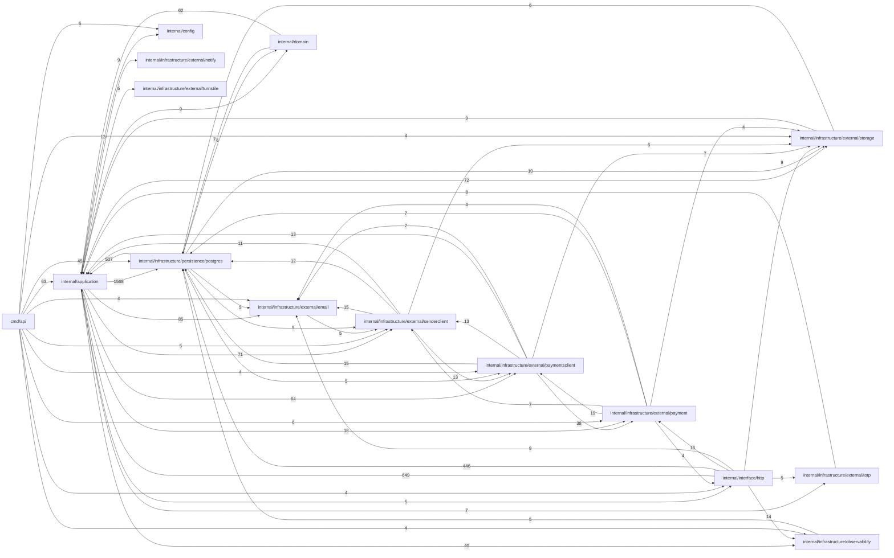

# INDEX_FUNCTIONS — `viralefy_api`

> **Gerado** por `viralefy_ops/lib/index/build-index.mjs` (§39). Não editar à mão:
> corrija o doc-comment na origem e regenere com `/eng-index`.

| Métrica | Valor |
|---|---|
| Arquivos com função indexada | 134 (de 160 varridos) |
| **N — funções declaradas no código** | **1077** |
| **M — entradas neste índice** | **1077** |
| Invariante `M == N` | ✅ OK |
| Funções sem doc-comment (§3) | 635 (59.0%) |

Colunas: `de onde vem → pra onde vai` é derivada (camada dos chamadores → efeitos detectados);
`chama (out)` / `é chamada por (in)` vêm do grafo resolvido por nome. As listas inline são
limitadas a 10 nomes com sufixo `+N`; a adjacência COMPLETA está na última seção.

## Grafo de chamadas (por módulo)



> Grafo por módulo: 126 arestas inter-módulo no total; 60 desenhadas (as de maior peso). As 66 restantes NÃO foram omitidas do índice — estão na adjacência função a função abaixo.

## Funções


### `cmd/api/main.go` — camada `cmd`

| Função | Tipo | O quê | de onde vem → pra onde vai | chama (out) | é chamada por (in) | Efeitos | Linha |
|---|---|---|---|---|---|---|---|
| `main` | func | ⚠ SEM DOC | — → log | runSeedCmd, runMigrateCmd, Error, Load, InitLogger, InitMetrics, InitSentry, InitTracer, Seed | — | log | 28 |
| `shutdownTracer` | closure | ⚠ SEM DOC | — → log | AdminAuth, UserAuth, OptionalUserAuth, Start, NewRouter, NewABTestService, NewEmailReputationService, Start, NewFraudService, NewFraudVelocityCron +105 | — | log | 88 |
| `buildStorage` | func | buildStorage instancia o cliente S3 quando config tem endpoint+credenciais. | cmd → log | Error, Enabled, New, Enabled, New, New, New, Enabled, New | shutdownTracer | log | 437 |

### `cmd/api/migrate_cmd.go` — camada `cmd`

| Função | Tipo | O quê | de onde vem → pra onde vai | chama (out) | é chamada por (in) | Efeitos | Linha |
|---|---|---|---|---|---|---|---|
| `runMigrateCmd` | func | runMigrateCmd despacha `viralefy-api migrate <sub>`. | cmd → log | printMigrateHelp, Load, New, cmdMigrateStatus, New, New, New, cmdMigrateUp, New, Close +2 | main | log | 26 |
| `printMigrateHelp` | func | ⚠ SEM DOC | cmd → retorno | — | runMigrateCmd | — | 58 |
| `cmdMigrateStatus` | func | ⚠ SEM DOC | cmd → log | ListMigrations | runMigrateCmd | log | 69 |
| `cmdMigrateUp` | func | ⚠ SEM DOC | cmd → log | RunMigrations, ListMigrations, countPending | runMigrateCmd | log | 103 |
| `cmdMigrateBackfill` | func | ⚠ SEM DOC | cmd → log | BackfillMigrations, ListMigrations | runMigrateCmd | log | 116 |
| `cmdMigrateVersion` | func | ⚠ SEM DOC | cmd → log | ListMigrations | runMigrateCmd | log | 130 |
| `countPending` | func | ⚠ SEM DOC | cmd → interno | Seed | cmdMigrateUp | — | 149 |
| `runSeedCmd` | func | runSeedCmd roda Seed() explicitamente. | cmd → log | Load, New, New, New, New, New, Close, Seed | main | log | 162 |

### `internal/application/abac.go` — camada `application`

| Função | Tipo | O quê | de onde vem → pra onde vai | chama (out) | é chamada por (in) | Efeitos | Linha |
|---|---|---|---|---|---|---|---|
| `IsLargeRateChange` | func | IsLargeRateChange decide, a partir do atributo "magnitude da mudança", se a alteração de taxa é grande o suficiente para exigir um papel privilegiado. | interface → retorno | — | AdminUpdateCurrency | — | 14 |

### `internal/application/abtest_service.go` — camada `application`

| Função | Tipo | O quê | de onde vem → pra onde vai | chama (out) | é chamada por (in) | Efeitos | Linha |
|---|---|---|---|---|---|---|---|
| `NewABTestService` | func | ⚠ SEM DOC | cmd → retorno | — | shutdownTracer | — | 29 |
| `(ABTestService).GetAssignment` | method | GetAssignment devolve a variant atribuída ao visitor naquele experimento. | application+infrastructure+interface → interno | pickVariant, GetExperiment, GetAssignment, CreateAssignment | TrackEvent, GetAssignment, PublicABAssign | — | 42 |
| `(ABTestService).TrackEvent` | method | TrackEvent grava um evento append-only em ab_events. eventName pode ser "exposure" (auto-disparado pelo componente quando renderiza), "conversion" (chamado da página de obrigado) ou qualquer string… | interface → interno | GetAssignment, New, New, New, New, GetAssignment, CreateEvent, New | PublicABTrack | — | 80 |
| `(ABTestService).AdminListExperiments` | method | AdminListExperiments — todos os experimentos pro backoffice. | interface → interno | ListExperiments | AdminListAB | — | 103 |
| `(ABTestService).AdminCreateExperiment` | method | AdminCreateExperiment valida + persiste. | interface → interno | GetExperiment, CreateExperiment | AdminCreateAB | — | 108 |
| `(ABTestService).AdminUpdateExperiment` | method | AdminUpdateExperiment — atualiza descrição, pesos e ativo. | interface → interno | GetExperiment, UpdateExperiment | AdminUpdateAB | — | 124 |
| `pickVariant` | func | pickVariant mapeia (visitor_id\|experiment_key) → uint64 → ponto em [0, total_weight) → variant correspondente. | application → retorno | — | GetAssignment | — | 144 |

### `internal/application/api_key_service.go` — camada `application`

| Função | Tipo | O quê | de onde vem → pra onde vai | chama (out) | é chamada por (in) | Efeitos | Linha |
|---|---|---|---|---|---|---|---|
| `NewAPIKeyService` | func | ⚠ SEM DOC | cmd → retorno | — | shutdownTracer | — | 33 |
| `hashKey` | func | hashKey é o SHA-256 hex do plain. | application → retorno | — | Create, ValidateKey | — | 39 |
| `generatePlainKey` | func | ⚠ SEM DOC | application → retorno | — | Create | — | 44 |
| `(APIKeyService).Create` | method | Create gera, hasha e persiste uma nova API key vinculada ao userID. | interface+test+application+domain+infrastructure → interno | Create, Create, Create, Create, hashKey, generatePlainKey, Create, Create, Create, Create +22 | MeCreateReview, AdminCreateVendor, Create, Create, Create, Create, Create, TestCreateInvoiceInput_RejectsZeroAmount, TestCreateInvoiceInput_RejectsNegativeAmount, TestCreateInvoiceInput_RejectsEmptyUserID +44 | — | 64 |
| `(APIKeyService).ValidateKey` | method | ValidateKey é o caminho quente: middleware chama em todo request /v2. | interface → interno | hashKey, GetByHash, MarkUsed, MarkUsed | apiKeyAuth | — | 98 |
| `(APIKeyService).RevokeKey` | method | RevokeKey marca a key como revogada. | interface → interno | Revoke | MeRevokeAPIKey | — | 120 |
| `(APIKeyService).ListMyKeys` | method | ListMyKeys devolve as keys do user (ativas e revogadas) em ordem decrescente de criação. | interface → interno | ListByUser, ListByUser, ListByUser, ListByUser, ListByUser, ListByUser, ListByUser, ListByUser, ListByUser, ListByUser +3 | MeListAPIKeys | — | 132 |

### `internal/application/audit_service.go` — camada `application`

| Função | Tipo | O quê | de onde vem → pra onde vai | chama (out) | é chamada por (in) | Efeitos | Linha |
|---|---|---|---|---|---|---|---|
| `NewAuditService` | func | ⚠ SEM DOC | cmd → retorno | — | shutdownTracer | — | 21 |
| `(AuditService).Log` | method | ⚠ SEM DOC | interface → interno | Error, New, New, New, New, FromContext, Insert, New | AdminCreateAdmin, AdminUpdateAdmin, AdminDeleteAdmin, logAudit, AdminDisable2FA, AdminBulkProofDecision | — | 36 |

### `internal/application/auth_service.go` — camada `application`

| Função | Tipo | O quê | de onde vem → pra onde vai | chama (out) | é chamada por (in) | Efeitos | Linha |
|---|---|---|---|---|---|---|---|
| `(AuthService).SetLegacyHS256Disabled` | method | SetLegacyHS256Disabled hard-disable HS256 sem reset do secret (permite auditoria/rotate posterior do binário). | cmd+application → interno | SetLegacyHS256Disabled | shutdownTracer, SetLegacyHS256Disabled | — | 41 |
| `NewAuthService` | func | ⚠ SEM DOC | cmd → interno | deriveKID | shutdownTracer | — | 45 |
| `(AuthService).Login` | method | ⚠ SEM DOC | application+interface → cripto | issueFinalToken, issuePartialToken, IsEnrolled, Login, GetByEmail, GetByEmail | Login, UserLogin, AdminLogin | cripto | 80 |
| `(AuthService).CompleteLoginWith2FA` | method | CompleteLoginWith2FA é o segundo step do login quando 2FA é requerido. | application+interface → cripto | GetByID, GetByID, GetByID, GetByID, GetByID, issueFinalToken, GetByID, GetByID, GetByID, parseDualSign +16 | CompleteLoginWith2FA, AdminLoginComplete2FA, UserLoginComplete2FA | cripto | 114 |
| `(AuthService).issueFinalToken` | method | issueFinalToken emite o JWT admin "real" (typ=admin, TTL completo). | application → cripto | Add, GetPermissions | Login, CompleteLoginWith2FA | cripto | 140 |
| `(AuthService).issuePartialToken` | method | issuePartialToken emite JWT curto (5min) com typ=admin_partial. middleware adminAuth rejeita esse typ — só pode ser usado em /auth/login/2fa. `enrollNeeded` é embutido pro front saber qual UI mostr… | application → cripto | Add | Login | cripto | 177 |
| `(AuthService).SetTwoFA` | method | SetTwoFA pluga o serviço de 2FA. | cmd+application → interno | SetTwoFA | shutdownTracer, SetTwoFA | — | 194 |
| `(AuthService).ParsePartialToken` | method | ParsePartialToken valida um partial_token (typ=admin_partial) e retorna o adminID. | interface → interno | parseDualSign, parseDualSign | AdminLoginEnroll2FA | — | 199 |
| `(AuthService).ValidateAdmin` | method | ValidateAdmin valida o token de admin e monta o Principal (com permissões carregadas do papel — sempre frescas, não confia em perms embutidas no JWT). | interface → interno | parseDualSign, parseDualSign, GetPermissions | AdminAuth | — | 219 |
| `(AuthService).parseDualSign` | method | parseDualSign aceita tanto RS256 (atual) quanto HS256 (legado) durante a janela de transição. | application → cripto | parseDualSign | CompleteLoginWith2FA, ParsePartialToken, ValidateAdmin, CompleteLoginWith2FA, parseDualSign | cripto | 243 |
| `(AuthService).Roles` | method | CurrentPrincipal recarrega o principal a partir do papel (uso em /admin/me). | interface → interno | List, List, List, List, List, List, List, List, List, List | AdminListRoles | — | 271 |
| `(AuthService).GetAdminByID` | method | GetAdminByID — usado pelo handler AdminBecomeCustomer pra ler email/name do principal autenticado. | interface → interno | GetByID, GetByID, GetByID, GetByID, GetByID, GetByID, GetByID, GetByID, GetByID, GetByID +9 | AdminBecomeCustomer, AdminUpdateAdmin, AdminLoginEnroll2FA | — | 277 |
| `(AuthService).AdminListAdmins` | method | AdminListAdmins devolve todos os admins p/ a UI de gestão (RBAC). | interface → interno | ListAll, ListAll, ListAll, ListAll, ListAll, ListAll, ListAll, ListAll, ListAll, ListAll +3 | AdminListAdmins | — | 283 |
| `(AuthService).AdminCreate` | method | AdminCreate cria um novo admin com role escolhido. | interface → cripto | Create, Create, Create, Create, Create, Create, GeneratePassword, Create, Create, Create +25 | AdminCreateAdmin | cripto | 290 |
| `(AuthService).AdminUpdateRole` | method | AdminUpdateRole troca o role de um admin. | interface → interno | GetByID, GetByID, GetByID, GetByID, GetByID, GetByID, GetByID, GetByID, validAdminRole, GetByID +11 | AdminUpdateAdmin | — | 326 |
| `(AuthService).AdminDelete` | method | AdminDelete remove um admin. | interface → interno | GetByID, GetByID, Delete, GetByID, Delete, Delete, GetByID, Delete, GetByID, Delete +22 | AdminDeleteAdmin | — | 349 |
| `validAdminRole` | func | validAdminRole rejeita strings que não batem com nenhuma role na tabela roles. | application → retorno | — | AdminCreate, AdminUpdateRole | — | 367 |
| `deriveKID` | func | ⚠ SEM DOC | application → retorno | — | NewAuthService, NewUserAuthService | — | 375 |

### `internal/application/cart_abandonment_cron.go` — camada `application`

| Função | Tipo | O quê | de onde vem → pra onde vai | chama (out) | é chamada por (in) | Efeitos | Linha |
|---|---|---|---|---|---|---|---|
| `NewCartAbandonmentCron` | func | NewCartAbandonmentCron construtor padrão. | cmd → retorno | — | shutdownTracer | — | 41 |
| `(CartAbandonmentCron).Start` | method | ⚠ SEM DOC | cmd+application+test → interno | Start, loop, Start, loop, Start, loop, Start, loop, Start, loop +7 | shutdownTracer, Start, TestDeliveryCron_StartIsIdempotent, TestDeliveryCron_TickProcessesBatchAndMarksCaptured, TestDeliveryCron_ListErrorDoesNotPanic, TestDeliveryCron_CtxCancelStopsLoop, TestDeliveryCron_DefaultsAppliedWhenZero, TestDeliveryCron_RunningFlagPreventsDoubleStart, TestDeliveryCron_ConcurrentStartIsSafe, Start +7 | — | 49 |
| `(CartAbandonmentCron).Stop` | method | ⚠ SEM DOC | application+test → interno | Stop, Stop, Stop, Stop, Stop, Stop, Stop, Stop, Load | Stop, loop, TestDeliveryCron_StartIsIdempotent, TestDeliveryCron_TickProcessesBatchAndMarksCaptured, TestDeliveryCron_ListErrorDoesNotPanic, TestDeliveryCron_CtxCancelStopsLoop, TestDeliveryCron_DefaultsAppliedWhenZero, TestDeliveryCron_RunningFlagPreventsDoubleStart, TestDeliveryCron_ConcurrentStartIsSafe, Stop +15 | — | 60 |
| `(CartAbandonmentCron).loop` | method | ⚠ SEM DOC | application → log | Stop, loop, tick, Stop, loop, tick, Stop, loop, tick, Stop +17 | Start, loop, Start, loop, Start, loop, Start, loop, Start, loop +7 | log | 67 |
| `(CartAbandonmentCron).tick` | method | ⚠ SEM DOC | application → db+log | tick, tick, tick, tick, tick, tick, sendOne, Error, tick, tick +4 | loop, tick, loop, tick, loop, tick, loop, tick, loop, tick +8 | db, log | 100 |
| `(CartAbandonmentCron).sendOne` | method | ⚠ SEM DOC | application → db | sendOne, firstName, Send, Send, Send, Send, Send, Send, Pool | tick, sendOne, tick | db | 163 |

### `internal/application/checkout_service.go` — camada `application`

| Função | Tipo | O quê | de onde vem → pra onde vai | chama (out) | é chamada por (in) | Efeitos | Linha |
|---|---|---|---|---|---|---|---|
| `(CheckoutService).SetTax` | method | SetTax opt-in pra cobrança de VAT no settlement_amount. | cmd → retorno | — | shutdownTracer | — | 43 |
| `(CheckoutService).SetMetricCapture` | method | SetMetricCapture liga o capture pós-criação. | cmd → retorno | — | shutdownTracer | — | 50 |
| `(CheckoutService).fireBaselineCapture` | method | fireBaselineCapture roda em goroutine separada (não bloqueia o checkout). | application → interno | CaptureBaseline | Checkout | — | 57 |
| `NewCheckoutService` | func | ⚠ SEM DOC | cmd → retorno | — | shutdownTracer | — | 69 |
| `(CheckoutService).SetCoupons` | method | SetCoupons injeta o CouponService — opt-in pra não exigir o construtor em todos os testes que ainda não usam cupom. | cmd → retorno | — | shutdownTracer | — | 90 |
| `(CheckoutService).SetReferrals` | method | SetReferrals opt-in pra hook de signup (RecordReferral quando user é criado e tracking traz referrer_code). | cmd+application → interno | SetReferrals, SetReferrals | shutdownTracer, SetReferrals, SetReferrals | — | 96 |
| `(CheckoutService).SetFraud` | method | SetFraud opt-in pra check pré-checkout (block por IsBlocked). | cmd → retorno | — | shutdownTracer | — | 101 |
| `(CheckoutService).Checkout` | method | ⚠ SEM DOC | application+interface → cripto | writeError, Create, GetByID, UpdatePayment, GetByID, Create, Create, GetByID, IsBlocked, Create +79 | ListByUser, renewOne, CreateRecoveryRequest, CreateCheckout | cripto | 187 |
| `(CheckoutService).redeemCoupon` | method | redeemCoupon registra o uso após o order ser criado. | application → interno | Error, FromContext, Redeem | Checkout | — | 475 |
| `(CheckoutService).resolveTarget` | method | resolveTarget valida que o alvo informado bate com plan.target_type e retorna profileID/URL apropriados pra persistir no pedido. | application → interno | GetByID, GetByID, GetByID, GetByID, GetByID, GetByID, GetByID, GetByID, ValidatePublicationURL, GetByID +10 | Checkout | — | 489 |
| `(CheckoutService).resolveGateway` | method | resolveGateway aplica a regra do fluxo novo: se o cliente escolheu um gateway na UI de seleção, valida e usa esse; senão cai no pickGateway (back-compat). | application → interno | GetByID, GetByID, GetByID, pickGateway, GetByID, GetByID, GetByID, GetByID, GetByID, pickGateway +11 | Checkout | — | 538 |
| `(CheckoutService).pickGateway` | method | pickGateway escolhe o gateway adequado pra moeda de liquidação no fluxo legacy (sem gateway_id). | application → interno | GetActiveByProvider, pickGateway, GetDefaultActive, GetActiveByProvider | Create, pickGateway, resolveGateway | — | 569 |
| `(CheckoutService).sendCheckoutEmail` | method | ⚠ SEM DOC | application → interno | BuildCheckoutEmail, Error, Send, Send, Send, Send, Send, Send, FromContext, MaskEmail | Checkout | — | 593 |

### `internal/application/coupon_service.go` — camada `application`

| Função | Tipo | O quê | de onde vem → pra onde vai | chama (out) | é chamada por (in) | Efeitos | Linha |
|---|---|---|---|---|---|---|---|
| `NewCouponService` | func | ⚠ SEM DOC | cmd → retorno | — | shutdownTracer | — | 18 |
| `(CouponService).Preview` | method | Preview NÃO redeem — só calcula. | application+interface → interno | Apply, Validate, GetByCode, GetByCode, IncrementUsedCount, CreateRedemption, HasUserPaidOrder, Apply, GetByCode, GetByCode | Checkout, PublicValidateCoupon | — | 39 |
| `(CouponService).Redeem` | method | ⚠ SEM DOC | application → interno | NormalizeCode, New, New, New, New, IncrementUsedCount, CreateRedemption, New | redeemCoupon | — | 84 |
| `(CouponService).Create` | method | Admin ops ---- | interface+test+application+domain+infrastructure → interno | Create, Create, Create, Create, Create, Create, Create, Create, Create, Create +19 | MeCreateReview, AdminCreateVendor, Create, Create, Create, Create, Create, Create, TestCreateInvoiceInput_RejectsZeroAmount, TestCreateInvoiceInput_RejectsNegativeAmount +44 | — | 99 |
| `(CouponService).Update` | method | ⚠ SEM DOC | test+interface+application+domain+infrastructure → interno | Update, Update, Update, Update, Update, GetByCode, GetByCode, Update, GetByCode, Update +5 | TestUpdate_RejectsZeroOrNegativeRate, TestUpdate_RejectsEmptySettlementCode, TestUpdate_RejectsUnknownSettlementCode, TestUpdate_AppliesChangesAndReturnsUpdated, AdminUpdateVendor, Update, Update, Update, Update, renewOne +12 | — | 113 |
| `(CouponService).List` | method | ⚠ SEM DOC | interface+application+domain+infrastructure → interno | List, List, List, List, List, List, List, List, List | AdminListVendors, List, List, Roles, List, contains, List, List, List, List +7 | — | 120 |
| `(CouponService).Get` | method | ⚠ SEM DOC | interface+test+application+infrastructure → interno | Get, Get, Get, GetByCode, GetByCode, GetByCode, Get, Get, GetByCode | IdempotencyMiddleware, InternalTokenAuth, bearerToken, ObservabilityMiddleware, TestRateLimiter_Middleware_Returns429WithRetryAfter, AdminListReviews, NewRouter, buildSecureRouter, TestSecurity_SQLInjectionProbesNeverReturn500, TestSecurity_XSSPayloadEchoedAsJSONEscaped +34 | — | 124 |

### `internal/application/credit_service.go` — camada `application`

| Função | Tipo | O quê | de onde vem → pra onde vai | chama (out) | é chamada por (in) | Efeitos | Linha |
|---|---|---|---|---|---|---|---|
| `NewCreditService` | func | ⚠ SEM DOC | cmd → retorno | — | shutdownTracer | — | 14 |
| `(CreditService).Balance` | method | ⚠ SEM DOC | application+interface → interno | GetOrCreateAccount | Checkout, MeCredits, AdminGetUser | — | 18 |
| `(CreditService).History` | method | ⚠ SEM DOC | interface → interno | ListByUser, ListByUser, ListByUser, ListByUser, ListByUser, ListByUser, ListByUser, ListByUser, ListByUser, ListByUser +3 | MeTransactions, AdminGetUser | — | 22 |
| `(CreditService).Spend` | method | Spend reduz o saldo (saída). orderID identifica o pedido pago. | application → interno | Apply, New, New, New, New, Apply, New | Checkout | — | 27 |
| `(CreditService).Recharge` | method | Recharge credita saldo (entrada). invoiceID identifica a invoice paga. | application → interno | Apply, New, New, New, New, Apply, New | AdminMarkPaid | — | 43 |
| `(CreditService).AdminAdjustment` | method | AdminAdjustment cria um ajuste manual (entrada ou saída). delta com sinal. | application+interface → interno | Apply, New, New, New, New, Apply, New | GrantOnFirstPaidOrder, IssueRefund, AdminAdjustCredits | — | 59 |

### `internal/application/currency_service.go` — camada `application`

| Função | Tipo | O quê | de onde vem → pra onde vai | chama (out) | é chamada por (in) | Efeitos | Linha |
|---|---|---|---|---|---|---|---|
| `NewCurrencyService` | func | NewCurrencyService recebe o PlanRepository pra cascatear mudança de rate em plan_prices. `plans` pode ser nil em testes que não exercem cascade (Update vira no-op nessa parte). | cmd+test → retorno | — | shutdownTracer, newSvc | — | 18 |
| `(CurrencyService).ListDisplayable` | method | ListDisplayable retorna as moedas que o cliente pode escolher para exibição. | infrastructure+interface+test → interno | ListDisplayable, ListDisplayable | ListDisplayable, ListCurrencies, ListDisplayable | — | 23 |
| `(CurrencyService).ListAll` | method | ListAll retorna todas as moedas (uso admin). | test+application+infrastructure+interface → interno | ListAll, ListAll, ListAll, ListAll, ListAll, ListAll, ListAll, ListAll, ListAll, ListAll +1 | ListAll, ListAll, List, ListActiveAcceptingCurrency, AdminList, ListPaymentMethods, ListAdmin, ListAll, ListAll, AdminListAdmins +8 | — | 28 |
| `(CurrencyService).Get` | method | ⚠ SEM DOC | interface+test+application+infrastructure → interno | Get, Get, Get, GetByCode, GetByCode, GetByCode, Get, Get, GetByCode | IdempotencyMiddleware, InternalTokenAuth, bearerToken, ObservabilityMiddleware, TestRateLimiter_Middleware_Returns429WithRetryAfter, AdminListReviews, NewRouter, buildSecureRouter, TestSecurity_SQLInjectionProbesNeverReturn500, TestSecurity_XSSPayloadEchoedAsJSONEscaped +34 | — | 32 |
| `(CurrencyService).Update` | method | ⚠ SEM DOC | test+interface+application+domain+infrastructure → interno | Update, RecomputePricesForCurrency, Update, Update, Update, RecomputePricesForCurrency, Update, GetByCode, GetByCode, Update +10 | TestUpdate_RejectsZeroOrNegativeRate, TestUpdate_RejectsEmptySettlementCode, TestUpdate_RejectsUnknownSettlementCode, TestUpdate_AppliesChangesAndReturnsUpdated, AdminUpdateVendor, Update, Update, Update, Update, renewOne +12 | — | 43 |
| `(CurrencyService).QuoteForPlan` | method | QuoteForPlan resolve o preço de exibição e de liquidação de um plano usando os preços manuais por moeda (prices). | application+test → interno | GetByCode, GetByCode, GetByCode, amountFor, GetByCode | Create, ListPaymentMethods, Checkout, TestQuoteForPlan_UsesManualPriceWhenPresent, TestQuoteForPlan_DerivesFromUSDCentsWhenNoManualPrice, TestQuoteForPlan_USDTMirrors1To1WithUSDcents, TestQuoteForPlan_BTCHonors8Decimals, TestQuoteForPlan_EmptyDisplayCodeFallsBackToUSD, TestQuoteForPlan_InvalidCurrencyFallsBackToUSD, TestQuoteForPlan_DisplayDisabledFallsBackToUSD +2 | — | 81 |
| `amountFor` | func | amountFor devolve o preço manual da moeda se existir; senão converte do USD usando o rate (= unidades da moeda por 1 USD). | application → retorno | — | buildSingleOption, amountInCurrency, QuoteForPlan | — | 108 |

### `internal/application/currency_service_test.go` — camada `test`

| Função | Tipo | O quê | de onde vem → pra onde vai | chama (out) | é chamada por (in) | Efeitos | Linha |
|---|---|---|---|---|---|---|---|
| `newFakeCurrencyRepo` | func | ⚠ SEM DOC | test → retorno | — | newSvc | — | 16 |
| `(fakeCurrencyRepo).ListAll` | method | ⚠ SEM DOC | test+application+infrastructure+interface → interno | ListAll, ListAll, ListAll, ListAll, ListAll, ListAll, ListAll, ListAll, ListAll, ListAll +1 | ListAll, ListAll, List, ListActiveAcceptingCurrency, AdminList, ListPaymentMethods, ListAdmin, ListAll, ListAll, AdminListAdmins +8 | — | 30 |
| `(fakeCurrencyRepo).ListDisplayable` | method | ⚠ SEM DOC | infrastructure+application+interface → interno | ListDisplayable, ListDisplayable | ListDisplayable, ListDisplayable, ListCurrencies | — | 37 |
| `(fakeCurrencyRepo).GetByCode` | method | ⚠ SEM DOC | application+domain+infrastructure → interno | GetByCode, GetByCode, GetByCode | buildSingleOption, amountInCurrency, contains, Preview, GetByCode, GetByCode, Create, Update, GetByCode, Get +3 | — | 46 |
| `(fakeCurrencyRepo).UpdateRate` | method | ⚠ SEM DOC | infrastructure+application → interno | UpdateRate | UpdateRate, Update | — | 53 |
| `newSvc` | func | ⚠ SEM DOC | test → interno | NewCurrencyService, newFakeCurrencyRepo | TestUpdate_RejectsZeroOrNegativeRate, TestUpdate_RejectsEmptySettlementCode, TestUpdate_RejectsUnknownSettlementCode, TestUpdate_AppliesChangesAndReturnsUpdated, TestQuoteForPlan_UsesManualPriceWhenPresent, TestQuoteForPlan_DerivesFromUSDCentsWhenNoManualPrice, TestQuoteForPlan_USDTMirrors1To1WithUSDcents, TestQuoteForPlan_BTCHonors8Decimals, TestQuoteForPlan_EmptyDisplayCodeFallsBackToUSD, TestQuoteForPlan_InvalidCurrencyFallsBackToUSD +3 | — | 65 |
| `TestQuoteForPlan_UsesManualPriceWhenPresent` | func | ---------- QuoteForPlan: USD-cents canônico ---------- | — → interno | QuoteForPlan, newSvc | — | — | 73 |
| `TestQuoteForPlan_DerivesFromUSDCentsWhenNoManualPrice` | func | ⚠ SEM DOC | — → interno | QuoteForPlan, newSvc | — | — | 91 |
| `TestQuoteForPlan_USDTMirrors1To1WithUSDcents` | func | ⚠ SEM DOC | — → interno | QuoteForPlan, newSvc | — | — | 108 |
| `TestQuoteForPlan_BTCHonors8Decimals` | func | ⚠ SEM DOC | — → interno | QuoteForPlan, newSvc | — | — | 126 |
| `TestQuoteForPlan_EmptyDisplayCodeFallsBackToUSD` | func | ⚠ SEM DOC | — → interno | QuoteForPlan, newSvc | — | — | 138 |
| `TestQuoteForPlan_InvalidCurrencyFallsBackToUSD` | func | ⚠ SEM DOC | — → interno | QuoteForPlan, newSvc | — | — | 149 |
| `TestQuoteForPlan_DisplayDisabledFallsBackToUSD` | func | ⚠ SEM DOC | — → interno | QuoteForPlan, newSvc | — | — | 160 |
| `TestQuoteForPlan_SettlementResolvedFromDisplayCurrency` | func | ⚠ SEM DOC | — → interno | QuoteForPlan, newSvc | — | — | 172 |
| `TestQuoteForPlan_BRLSettlesAsItself` | func | ⚠ SEM DOC | — → interno | QuoteForPlan, newSvc | — | — | 185 |
| `TestUpdate_RejectsZeroOrNegativeRate` | func | ---------- Update validation ---------- | — → interno | Update, Update, Update, Update, Update, Update, Update, Update, Update, Update +3 | — | — | 202 |
| `TestUpdate_RejectsEmptySettlementCode` | func | ⚠ SEM DOC | — → interno | Update, Update, Update, Update, Update, Update, Update, Update, Update, Update +3 | — | — | 214 |
| `TestUpdate_RejectsUnknownSettlementCode` | func | ⚠ SEM DOC | — → interno | Update, Update, Update, Update, Update, Update, Update, Update, Update, Update +3 | — | — | 224 |
| `TestUpdate_AppliesChangesAndReturnsUpdated` | func | ⚠ SEM DOC | — → interno | Update, Update, Update, Update, Update, Update, Update, Update, Update, Update +3 | — | — | 234 |

### `internal/application/delivery_capture_cron.go` — camada `application`

| Função | Tipo | O quê | de onde vem → pra onde vai | chama (out) | é chamada por (in) | Efeitos | Linha |
|---|---|---|---|---|---|---|---|
| `(DeliveryCaptureCron).Start` | method | Start dispara a goroutine. | cmd+test+application → interno | loop, Start, loop, Start, loop, Start, loop, Start, loop, Start +7 | shutdownTracer, TestDeliveryCron_StartIsIdempotent, TestDeliveryCron_TickProcessesBatchAndMarksCaptured, TestDeliveryCron_ListErrorDoesNotPanic, TestDeliveryCron_CtxCancelStopsLoop, TestDeliveryCron_DefaultsAppliedWhenZero, TestDeliveryCron_RunningFlagPreventsDoubleStart, TestDeliveryCron_ConcurrentStartIsSafe, Start, Start +7 | — | 41 |
| `(DeliveryCaptureCron).Stop` | method | Stop sinaliza parada e espera o último tick concluir. | application+test → interno | Stop, Stop, Stop, Stop, Stop, Stop, Stop, Load, Stop | loop, TestDeliveryCron_StartIsIdempotent, TestDeliveryCron_TickProcessesBatchAndMarksCaptured, TestDeliveryCron_ListErrorDoesNotPanic, TestDeliveryCron_CtxCancelStopsLoop, TestDeliveryCron_DefaultsAppliedWhenZero, TestDeliveryCron_RunningFlagPreventsDoubleStart, TestDeliveryCron_ConcurrentStartIsSafe, Stop, loop +15 | — | 60 |
| `(DeliveryCaptureCron).loop` | method | ⚠ SEM DOC | application → log | Stop, tick, Stop, loop, tick, Stop, loop, tick, Stop, loop +17 | Start, Start, loop, Start, loop, Start, loop, Start, loop, Start +7 | log | 67 |
| `(DeliveryCaptureCron).tick` | method | tick faz uma rodada: consulta DB, processa lote serial. | application → log | ListReadyForDeliveryCapture, tick, tick, tick, CaptureDelivery, capture, tick, Add, tick, ListReadyForDeliveryCapture +5 | loop, loop, tick, loop, tick, loop, tick, loop, tick, loop +8 | log | 97 |

### `internal/application/delivery_capture_cron_test.go` — camada `test`

| Função | Tipo | O quê | de onde vem → pra onde vai | chama (out) | é chamada por (in) | Efeitos | Linha |
|---|---|---|---|---|---|---|---|
| `(fakeOrderRepoForCron).Create` | method | ⚠ SEM DOC | interface+test+application+domain+infrastructure → interno | Create, Create, Create, Create, Create, Create, Create, Create, Create, Create +20 | MeCreateReview, AdminCreateVendor, Create, Create, Create, Create, Create, TestCreateInvoiceInput_RejectsZeroAmount, TestCreateInvoiceInput_RejectsNegativeAmount, TestCreateInvoiceInput_RejectsEmptyUserID +44 | — | 30 |
| `(fakeOrderRepoForCron).GetByID` | method | ⚠ SEM DOC | interface+test+application+domain+infrastructure → interno | GetByID, GetByID, GetByID, GetByID, GetByID, GetByID, GetByID, GetByID, GetByID, GetByID +8 | MeGetReviewForOrder, GetByID, GetByID, Update, Create, Get, AdminGet, AdminMarkPaid, capture, GetByIDForUser +61 | — | 33 |
| `(fakeOrderRepoForCron).GetByExternalRef` | method | ⚠ SEM DOC | application+test+infrastructure → interno | GetByExternalRef, New, New, New, New, New, GetByExternalRef, GetByExternalRef | ConfirmByExternalRef, GetByExternalRef, GetByExternalRef, GetByExternalRef | — | 44 |
| `(fakeOrderRepoForCron).ListByUser` | method | ⚠ SEM DOC | test+application+domain+infrastructure+interface → interno | ListByUser, ListByUser, ListByUser, ListByUser, New, New, New, New, ListByUser, ListByUser +7 | ListByUser, ListForUser, ListMyKeys, List, ListByUser, Subscribe, ListByUser, renewOne, ListForUser, CountOpenForUser +13 | — | 47 |
| `(fakeOrderRepoForCron).ListViewByUser` | method | ⚠ SEM DOC | test+infrastructure+interface → interno | ListViewByUser, New, New, New, New, New, ListViewByUser | ListViewByUser, ListViewByUser, MeOrders | — | 50 |
| `(fakeOrderRepoForCron).ListAll` | method | ⚠ SEM DOC | test+application+infrastructure+interface → interno | ListAll, ListAll, ListAll, New, New, New, New, ListAll, ListAll, New +6 | ListAll, List, ListActiveAcceptingCurrency, AdminList, ListPaymentMethods, ListAdmin, ListAll, ListAll, AdminListAdmins, ListAll +8 | — | 53 |
| `(fakeOrderRepoForCron).ListAllView` | method | ⚠ SEM DOC | application+test+infrastructure+interface → interno | ListAllView, New, New, New, New, New, ListAllView, ListAllView, ListAllView | AdminListView, ListAllView, AdminList, ListAllView, ListAllView, ListAllView, AdminListOrders, AdminMetricsSummary | — | 56 |
| `(fakeOrderRepoForCron).UpdateStatus` | method | ⚠ SEM DOC | application+test+infrastructure+interface → interno | UpdateStatus, New, New, New, New, New, UpdateStatus, UpdateStatus, UpdateStatus | ConfirmByExternalRef, MarkOrderPaid, UpdateStatus, ReplyAsUser, ReplyAsAdmin, AdminUpdateStatus, UpdateStatus, UpdateStatus, UpdateStatus, AdminPatchOrder | — | 59 |
| `(fakeOrderRepoForCron).UpdatePayment` | method | ⚠ SEM DOC | application+test+infrastructure → interno | UpdatePayment, New, New, New, New, New, UpdatePayment, UpdatePayment | Create, UpdatePayment, Checkout, UpdatePayment, UpdatePayment | — | 62 |
| `(fakeOrderRepoForCron).LinkTicket` | method | ⚠ SEM DOC | application+test+infrastructure → interno | LinkTicket, New, New, New, New, New, LinkTicket | maybeOpenTicket, LinkTicket, LinkTicket | — | 65 |
| `(fakeOrderRepoForCron).SetBaselineMetrics` | method | ⚠ SEM DOC | application+test+infrastructure → interno | SetBaselineMetrics, New, New, New, New, New, SetBaselineMetrics | capture, SetBaselineMetrics, SetBaselineMetrics | — | 68 |
| `(fakeOrderRepoForCron).SetDeliveryMetrics` | method | ⚠ SEM DOC | application+test+infrastructure → interno | SetDeliveryMetrics, SetDeliveryMetrics | capture, SetDeliveryMetrics, SetDeliveryMetrics | — | 71 |
| `(fakeOrderRepoForCron).AssignGateway` | method | Stubs adicionados pra OrderRepository nova (migration 034 — proof + assign). | test+infrastructure → interno | AssignGateway, New, New, New, New, New, AssignGateway | AssignGateway, AssignGateway | — | 89 |
| `(fakeOrderRepoForCron).SetProof` | method | ⚠ SEM DOC | test+infrastructure+interface → interno | SetProof, New, New, New, New, New, SetProof | SetProof, SetProof, MeUploadProof, uploadProofMultipart | — | 92 |
| `(fakeOrderRepoForCron).SetProofStatus` | method | ⚠ SEM DOC | test+infrastructure+interface → interno | SetProofStatus, New, New, New, New, New, SetProofStatus | SetProofStatus, SetProofStatus, AdminProofDecision, AdminBulkProofDecision | — | 95 |
| `(fakeOrderRepoForCron).ListPendingProofs` | method | ⚠ SEM DOC | test+infrastructure+interface → interno | ListPendingProofs, New, New, New, New, New, ListPendingProofs | ListPendingProofs, ListPendingProofs, AdminListPendingProofs | — | 98 |
| `(fakeOrderRepoForCron).ListReadyForDeliveryCapture` | method | ListReadyForDeliveryCapture: replica a query SQL em memória. | application+test+infrastructure → interno | CaptureDelivery, capture, ListReadyForDeliveryCapture, ListReadyForDeliveryCapture | tick, TestDeliveryCron_PicksOnlyEligibleOrders, TestDeliveryCron_BatchLimitApplied, ListReadyForDeliveryCapture, ListReadyForDeliveryCapture | — | 103 |
| `(fakePlanRepoForCron).ListActive` | method | ⚠ SEM DOC | application+test+infrastructure+interface → interno | ListActive, ListActive, ListActive | ListByCategory, ListPublic, ListActive, ListActive, ListActive, ListCategories | — | 148 |
| `(fakePlanRepoForCron).ListAll` | method | ⚠ SEM DOC | test+application+infrastructure+interface → interno | ListAll, ListAll, ListAll, ListAll, ListAll, ListAll, ListAll, ListAll, ListAll, ListAll +1 | ListAll, List, ListActiveAcceptingCurrency, AdminList, ListPaymentMethods, ListAdmin, ListAll, ListAll, AdminListAdmins, ListAll +8 | — | 151 |
| `(fakePlanRepoForCron).GetByID` | method | ⚠ SEM DOC | interface+test+application+domain+infrastructure → interno | GetByID, GetByID, GetByID, GetByID, GetByID, GetByID, GetByID, GetByID, GetByID, GetByID +8 | MeGetReviewForOrder, GetByID, GetByID, Update, Create, Get, AdminGet, AdminMarkPaid, capture, GetByIDForUser +61 | — | 154 |
| `(fakePlanRepoForCron).Create` | method | ⚠ SEM DOC | interface+test+application+domain+infrastructure → interno | Create, Create, Create, Create, Create, Create, Create, Create, Create, Create +15 | MeCreateReview, AdminCreateVendor, Create, Create, Create, Create, Create, TestCreateInvoiceInput_RejectsZeroAmount, TestCreateInvoiceInput_RejectsNegativeAmount, TestCreateInvoiceInput_RejectsEmptyUserID +44 | — | 157 |
| `(fakePlanRepoForCron).Update` | method | ⚠ SEM DOC | test+interface+application+domain+infrastructure → interno | Update, Update, Update, Update, Update, Update, Update, Update, Update, Update +1 | TestUpdate_RejectsZeroOrNegativeRate, TestUpdate_RejectsEmptySettlementCode, TestUpdate_RejectsUnknownSettlementCode, TestUpdate_AppliesChangesAndReturnsUpdated, AdminUpdateVendor, Update, Update, Update, renewOne, Update +12 | — | 158 |
| `(fakePlanRepoForCron).Delete` | method | ⚠ SEM DOC | interface+test+application+domain+infrastructure → interno | Delete, Delete, Delete, Delete, Delete, Delete, Delete, Delete, Delete, Delete +2 | NewRouter, Delete, Delete, Delete, Delete, Delete, Delete, Disable, AdminDelete, IsValid +9 | — | 159 |
| `(fakePlanRepoForCron).UpsertPrices` | method | ⚠ SEM DOC | application+test+infrastructure → interno | UpsertPrices, UpsertPrices | Create, Update, UpsertPrices, UpsertPrices | — | 160 |
| `(fakePlanRepoForCron).RecomputePricesForCurrency` | method | ⚠ SEM DOC | test+infrastructure+application → interno | RecomputePricesForCurrency, RecomputePricesForCurrency | RecomputePricesForCurrency, RecomputePricesForCurrency, Update | — | 163 |
| `(fakePlanRepoForCron).RecomputePricesForPlan` | method | ⚠ SEM DOC | application+test+infrastructure → interno | RecomputePricesForPlan, RecomputePricesForPlan | Create, Update, RecomputePricesForPlan, RecomputePricesForPlan | — | 166 |
| `(fakeProfileRepoForCron).Create` | method | ⚠ SEM DOC | interface+test+application+domain+infrastructure → interno | Create, Create, Create, Create, Create, Create, Create, Create, Create, Create +15 | MeCreateReview, AdminCreateVendor, Create, Create, Create, Create, Create, TestCreateInvoiceInput_RejectsZeroAmount, TestCreateInvoiceInput_RejectsNegativeAmount, TestCreateInvoiceInput_RejectsEmptyUserID +44 | — | 172 |
| `(fakeProfileRepoForCron).GetByID` | method | ⚠ SEM DOC | interface+test+application+domain+infrastructure → interno | GetByID, GetByID, GetByID, GetByID, GetByID, GetByID, GetByID, GetByID, GetByID, GetByID +8 | MeGetReviewForOrder, GetByID, GetByID, Update, Create, Get, AdminGet, AdminMarkPaid, capture, GetByIDForUser +61 | — | 175 |
| `(fakeProfileRepoForCron).ListByUser` | method | ⚠ SEM DOC | test+application+domain+infrastructure+interface → interno | ListByUser, ListByUser, ListByUser, ListByUser, ListByUser, ListByUser, ListByUser, ListByUser, ListByUser, ListByUser +2 | ListByUser, ListForUser, ListMyKeys, List, ListByUser, Subscribe, ListByUser, renewOne, ListForUser, CountOpenForUser +13 | — | 178 |
| `(fakeProfileRepoForCron).ListByUserAndPlatform` | method | ⚠ SEM DOC | domain+infrastructure → interno | ListByUserAndPlatform | IsValid, ListByUserAndPlatform | — | 181 |
| `(fakeProfileRepoForCron).Delete` | method | ⚠ SEM DOC | interface+test+application+domain+infrastructure → interno | Delete, Delete, Delete, Delete, Delete, Delete, Delete, Delete, Delete, Delete +2 | NewRouter, Delete, Delete, Delete, Delete, Delete, Delete, Disable, AdminDelete, IsValid +9 | — | 184 |
| `(fakeProfileRepoForCron).SetVerified` | method | ⚠ SEM DOC | domain+infrastructure → interno | SetVerified | IsValid, SetVerified | — | 187 |
| `newTestCron` | func | helper: cria um cron com fakes prontos | test → retorno | — | TestDeliveryCron_StartIsIdempotent, TestDeliveryCron_ListErrorDoesNotPanic, TestDeliveryCron_RunningFlagPreventsDoubleStart, TestDeliveryCron_ConcurrentStartIsSafe | — | 196 |
| `newCaptureWithFakes` | func | ⚠ SEM DOC | test → interno | NewMetricCaptureService, capture | TestDeliveryCron_StartIsIdempotent, TestDeliveryCron_TickProcessesBatchAndMarksCaptured, TestDeliveryCron_ListErrorDoesNotPanic, TestDeliveryCron_CtxCancelStopsLoop, TestDeliveryCron_DefaultsAppliedWhenZero, TestDeliveryCron_RunningFlagPreventsDoubleStart, TestDeliveryCron_ConcurrentStartIsSafe | — | 207 |
| `TestDeliveryCron_PicksOnlyEligibleOrders` | func | ---------- testes ---------- | — → interno | ListReadyForDeliveryCapture, ids, Add, ListReadyForDeliveryCapture, ListReadyForDeliveryCapture | — | — | 214 |
| `TestDeliveryCron_BatchLimitApplied` | func | ⚠ SEM DOC | — → interno | ListReadyForDeliveryCapture, idN, Add, ListReadyForDeliveryCapture, ListReadyForDeliveryCapture | — | — | 241 |
| `TestDeliveryCron_StartIsIdempotent` | func | ⚠ SEM DOC | — → interno | Start, Stop, newTestCron, newCaptureWithFakes, Start, Stop, Start, Stop, Start, Stop +10 | — | — | 262 |
| `TestDeliveryCron_TickProcessesBatchAndMarksCaptured` | func | ⚠ SEM DOC | — → interno | Start, Stop, newCaptureWithFakes, Start, Stop, Start, Stop, Start, Stop, capture +11 | — | — | 291 |
| `TestDeliveryCron_ListErrorDoesNotPanic` | func | ⚠ SEM DOC | — → interno | Start, Stop, newTestCron, newCaptureWithFakes, Start, Stop, Start, Stop, Start, Stop +15 | — | — | 326 |
| `TestDeliveryCron_CtxCancelStopsLoop` | func | ⚠ SEM DOC | — → interno | Start, Stop, newCaptureWithFakes, Start, Stop, Start, Stop, Start, Stop, Start +9 | — | — | 347 |
| `TestDeliveryCron_DefaultsAppliedWhenZero` | func | ⚠ SEM DOC | — → interno | Start, Stop, newCaptureWithFakes, Start, Stop, Start, Stop, Start, Stop, Start +9 | — | — | 377 |
| `TestDeliveryCron_RunningFlagPreventsDoubleStart` | func | ⚠ SEM DOC | — → interno | Start, Stop, newTestCron, newCaptureWithFakes, Start, Stop, Start, Stop, Start, Stop +12 | — | — | 401 |
| `ids` | func | ---------- helpers ---------- | test → retorno | — | TestDeliveryCron_PicksOnlyEligibleOrders | — | 426 |
| `idN` | func | ⚠ SEM DOC | test → retorno | — | TestDeliveryCron_BatchLimitApplied | — | 434 |
| `TestDeliveryCron_ConcurrentStartIsSafe` | func | Sanity: garante que atomic.Bool nunca dispara dois Start em concorrência. | — → interno | Start, Stop, newTestCron, newCaptureWithFakes, Start, Stop, Start, Stop, Start, Stop +12 | — | — | 442 |

### `internal/application/email_reputation_service.go` — camada `application`

| Função | Tipo | O quê | de onde vem → pra onde vai | chama (out) | é chamada por (in) | Efeitos | Linha |
|---|---|---|---|---|---|---|---|
| `NewEmailReputationService` | func | ⚠ SEM DOC | cmd → retorno | — | shutdownTracer | — | 22 |
| `(EmailReputationService).RecordResendEvent` | method | RecordResendEvent grava o evento e atualiza o sumário rolante. | interface → db | pickEmail, mapResendType, New, New, New, New, New, Pool | ResendWebhook | db | 41 |
| `(EmailReputationService).IsDisabled` | method | IsDisabled retorna true se o endereço está marcado pra não receber. | — → db | Error, Pool | — | db | 121 |
| `pickEmail` | func | ⚠ SEM DOC | application → retorno | — | RecordResendEvent | — | 137 |
| `mapResendType` | func | ⚠ SEM DOC | application → retorno | — | RecordResendEvent | — | 147 |

### `internal/application/email_template.go` — camada `application`

| Função | Tipo | O quê | de onde vem → pra onde vai | chama (out) | é chamada por (in) | Efeitos | Linha |
|---|---|---|---|---|---|---|---|
| `(CheckoutEmailData).Subject` | method | Subject decide o assunto baseado em flags. | application → interno | Subject, New, New, New, New, New | BuildCheckoutEmail, Subject, BuildReviewRequestEmail | — | 40 |
| `BuildCheckoutEmail` | func | BuildCheckoutEmail devolve subject, HTML e versão texto para o e-mail de confirmação de checkout. | test+application → interno | Subject, renderCheckoutText, Subject, New, New, New, New, New | TestCheckoutEmail_SubjectIsEnglish, TestCheckoutEmail_HTMLLangIsEnglish, TestCheckoutEmail_NoPortugueseLeaks, TestCheckoutEmail_EnglishMarkersPresent, TestCheckoutEmail_SettlementSuffixOnlyWhenDifferent, TestCheckoutEmail_DefaultsAreSet, sendCheckoutEmail | — | 134 |
| `BuildTicketReplyEmail` | func | ⚠ SEM DOC | test+application → retorno | — | TestTicketReplyEmail_SubjectAndContentEnglish, notifyUserOfReply | — | 202 |
| `renderCheckoutText` | func | renderCheckoutText é a versão texto puro para clientes sem HTML. | application → retorno | — | BuildCheckoutEmail | — | 225 |

### `internal/application/email_template_test.go` — camada `test`

| Função | Tipo | O quê | de onde vem → pra onde vai | chama (out) | é chamada por (in) | Efeitos | Linha |
|---|---|---|---|---|---|---|---|
| `TestCheckoutEmail_SubjectIsEnglish` | func | Garante que os templates de e-mail estão em inglês — política do projeto é EN-default (cliente é global; storefront não tem mais localização por usuário no e-mail). | — → interno | BuildCheckoutEmail | — | — | 12 |
| `TestCheckoutEmail_HTMLLangIsEnglish` | func | ⚠ SEM DOC | — → interno | BuildCheckoutEmail | — | — | 47 |
| `TestCheckoutEmail_NoPortugueseLeaks` | func | ⚠ SEM DOC | — → interno | BuildCheckoutEmail | — | — | 64 |
| `TestCheckoutEmail_EnglishMarkersPresent` | func | ⚠ SEM DOC | — → interno | BuildCheckoutEmail | — | — | 114 |
| `TestTicketReplyEmail_SubjectAndContentEnglish` | func | ⚠ SEM DOC | — → interno | BuildTicketReplyEmail | — | — | 152 |
| `TestCheckoutEmail_SettlementSuffixOnlyWhenDifferent` | func | ⚠ SEM DOC | — → interno | BuildCheckoutEmail, Error | — | — | 187 |
| `TestCheckoutEmail_DefaultsAreSet` | func | ⚠ SEM DOC | — → interno | BuildCheckoutEmail | — | — | 215 |

### `internal/application/event_retention_cron.go` — camada `application`

| Função | Tipo | O quê | de onde vem → pra onde vai | chama (out) | é chamada por (in) | Efeitos | Linha |
|---|---|---|---|---|---|---|---|
| `(EventRetentionCron).Start` | method | ⚠ SEM DOC | cmd+application+test → interno | Start, loop, loop, Start, loop, Start, loop, Start, loop, Start +7 | shutdownTracer, Start, TestDeliveryCron_StartIsIdempotent, TestDeliveryCron_TickProcessesBatchAndMarksCaptured, TestDeliveryCron_ListErrorDoesNotPanic, TestDeliveryCron_CtxCancelStopsLoop, TestDeliveryCron_DefaultsAppliedWhenZero, TestDeliveryCron_RunningFlagPreventsDoubleStart, TestDeliveryCron_ConcurrentStartIsSafe, Start +7 | — | 46 |
| `(EventRetentionCron).Stop` | method | ⚠ SEM DOC | application+test → interno | Stop, Stop, Stop, Stop, Stop, Stop, Stop, Load, Stop | Stop, loop, TestDeliveryCron_StartIsIdempotent, TestDeliveryCron_TickProcessesBatchAndMarksCaptured, TestDeliveryCron_ListErrorDoesNotPanic, TestDeliveryCron_CtxCancelStopsLoop, TestDeliveryCron_DefaultsAppliedWhenZero, TestDeliveryCron_RunningFlagPreventsDoubleStart, TestDeliveryCron_ConcurrentStartIsSafe, loop +15 | — | 60 |
| `(EventRetentionCron).loop` | method | ⚠ SEM DOC | application → log | Stop, loop, tick, Stop, tick, Stop, loop, tick, Stop, loop +17 | Start, loop, Start, Start, loop, Start, loop, Start, loop, Start +7 | log | 67 |
| `(EventRetentionCron).tick` | method | ⚠ SEM DOC | application → interno | tick, cleanupTable, tick, tick, tick, tick, tick, tick, tick, FromContext | loop, tick, loop, loop, tick, loop, tick, loop, tick, loop +8 | — | 112 |
| `(EventRetentionCron).cleanupTable` | method | ⚠ SEM DOC | application → db+log | Error, Pool | tick | db, log | 122 |

### `internal/application/fraud_service.go` — camada `application`

| Função | Tipo | O quê | de onde vem → pra onde vai | chama (out) | é chamada por (in) | Efeitos | Linha |
|---|---|---|---|---|---|---|---|
| `NewFraudService` | func | ⚠ SEM DOC | cmd → retorno | — | shutdownTracer | — | 57 |
| `(FraudService).blockDuration` | method | ⚠ SEM DOC | application → retorno | — | upsertBlock | — | 61 |
| `(FraudService).CheckEmail` | method | CheckEmail conta orders recentes do email. | — → interno | IsBlocked, normalizeActor, countOrdersByEmail, recordSignal, upsertBlock, Error, FromContext | — | — | 73 |
| `(FraudService).CheckIP` | method | CheckIP segue a mesma lógica de CheckEmail mas com janela 1h e thresholds ajustados ao volume típico esperado por IP residencial. | — → interno | IsBlocked, normalizeActor, countOrdersByIP, recordSignal, upsertBlock, Error, FromContext | — | — | 105 |
| `(FraudService).IsBlocked` | method | IsBlocked retorna true + blocked_until se existe bloqueio ativo pro actor. | application → db | normalizeActor, Error, FromContext, Pool | CheckEmail, CheckIP, Checkout | db | 138 |
| `(FraudService).ListSignals` | method | ListSignals filtra por actor (substring) e severity. | interface → db | Close, Pool | AdminListFraudSignals | db | 171 |
| `normalizeActor` | func | --- helpers --- | application → retorno | — | CheckEmail, CheckIP, IsBlocked, RecordLoginFail | — | 207 |
| `(FraudService).countOrdersByEmail` | method | ⚠ SEM DOC | application → db | Pool | CheckEmail | db | 211 |
| `(FraudService).countOrdersByIP` | method | ⚠ SEM DOC | application → db | — | CheckIP | db | 226 |
| `(FraudService).recordSignal` | method | ⚠ SEM DOC | application → db | Error, New, New, New, New, FromContext, New, Pool | CheckEmail, CheckIP, RecordLoginFail | db | 238 |
| `(FraudService).upsertBlock` | method | ⚠ SEM DOC | application → db | blockDuration, Add, Error, FromContext, Pool | CheckEmail, CheckIP | db | 251 |
| `(FraudService).RecordLoginFail` | method | RecordLoginFail é o entry-point que o auth pode chamar quando um login falha. | — → interno | normalizeActor, recordSignal | — | — | 272 |

### `internal/application/fraud_velocity_cron.go` — camada `application`

| Função | Tipo | O quê | de onde vem → pra onde vai | chama (out) | é chamada por (in) | Efeitos | Linha |
|---|---|---|---|---|---|---|---|
| `NewFraudVelocityCron` | func | ⚠ SEM DOC | cmd → retorno | — | shutdownTracer | — | 38 |
| `(FraudVelocityCron).Start` | method | ⚠ SEM DOC | cmd+application+test → interno | Start, loop, Start, loop, loop, Start, loop, Start, loop, Start +7 | shutdownTracer, Start, TestDeliveryCron_StartIsIdempotent, TestDeliveryCron_TickProcessesBatchAndMarksCaptured, TestDeliveryCron_ListErrorDoesNotPanic, TestDeliveryCron_CtxCancelStopsLoop, TestDeliveryCron_DefaultsAppliedWhenZero, TestDeliveryCron_RunningFlagPreventsDoubleStart, TestDeliveryCron_ConcurrentStartIsSafe, Start +7 | — | 42 |
| `(FraudVelocityCron).Stop` | method | ⚠ SEM DOC | application+test → interno | Stop, Stop, Stop, Stop, Stop, Stop, Stop, Load, Stop | Stop, loop, TestDeliveryCron_StartIsIdempotent, TestDeliveryCron_TickProcessesBatchAndMarksCaptured, TestDeliveryCron_ListErrorDoesNotPanic, TestDeliveryCron_CtxCancelStopsLoop, TestDeliveryCron_DefaultsAppliedWhenZero, TestDeliveryCron_RunningFlagPreventsDoubleStart, TestDeliveryCron_ConcurrentStartIsSafe, Stop +15 | — | 53 |
| `(FraudVelocityCron).loop` | method | ⚠ SEM DOC | application → log | Stop, loop, tick, Stop, loop, tick, Stop, tick, Stop, loop +17 | Start, loop, Start, loop, Start, Start, loop, Start, loop, Start +7 | log | 60 |
| `(FraudVelocityCron).tick` | method | ⚠ SEM DOC | application → interno | tick, tick, scanEmailVelocity, cleanup, tick, tick, tick, tick, tick, tick +1 | loop, tick, loop, tick, loop, loop, tick, loop, tick, loop +8 | — | 82 |
| `(FraudVelocityCron).scanEmailVelocity` | method | ⚠ SEM DOC | application → db+log | Error, New, New, New, New, New, Close, Pool | tick | db, log | 91 |
| `(FraudVelocityCron).cleanup` | method | ⚠ SEM DOC | application → db+log | Error, Pool | tick | db, log | 145 |

### `internal/application/gateway_service.go` — camada `application`

| Função | Tipo | O quê | de onde vem → pra onde vai | chama (out) | é chamada por (in) | Efeitos | Linha |
|---|---|---|---|---|---|---|---|
| `NewGatewayService` | func | ⚠ SEM DOC | cmd → retorno | — | shutdownTracer | — | 15 |
| `validCurrencyCode` | func | validCurrency aceita qualquer ISO 4217 maiúsculo de 3 letras OU códigos crypto comuns. | application → retorno | — | validateGateway | — | 35 |
| `(GatewayService).List` | method | ⚠ SEM DOC | interface+application+domain+infrastructure → interno | ListAll, ListAll, List, ListAll, ListAll, List, ListAll, List, List, List +11 | AdminListVendors, List, Roles, List, contains, List, List, List, List, List +7 | — | 47 |
| `(GatewayService).GetActiveByProvider` | method | GetActiveByProvider expõe lookup do gateway ativo de um provider. | application+infrastructure+interface → interno | GetActiveByProvider | pickGateway, pickGateway, GetActiveByProvider, WooviWebhook, StripeWebhook, HeleketWebhook | — | 53 |
| `validateGateway` | func | validateGateway centraliza as regras de provider + accepted_currencies. | application → interno | validCurrencyCode | Create, Update | — | 83 |
| `(GatewayService).Create` | method | ⚠ SEM DOC | interface+test+application+domain+infrastructure → interno | Create, Create, Create, validateGateway, Create, Create, Create, Create, Create, Create +21 | MeCreateReview, AdminCreateVendor, Create, Create, Create, Create, Create, TestCreateInvoiceInput_RejectsZeroAmount, TestCreateInvoiceInput_RejectsNegativeAmount, TestCreateInvoiceInput_RejectsEmptyUserID +44 | — | 113 |
| `(GatewayService).Update` | method | ⚠ SEM DOC | test+interface+application+domain+infrastructure → interno | GetByID, GetByID, Update, GetByID, validateGateway, GetByID, Update, GetByID, GetByID, GetByID +21 | TestUpdate_RejectsZeroOrNegativeRate, TestUpdate_RejectsEmptySettlementCode, TestUpdate_RejectsUnknownSettlementCode, TestUpdate_AppliesChangesAndReturnsUpdated, AdminUpdateVendor, Update, Update, Update, renewOne, Update +12 | — | 147 |
| `(GatewayService).Delete` | method | ⚠ SEM DOC | interface+test+application+domain+infrastructure → interno | Delete, Delete, Delete, Delete, Delete, Delete, Delete, Delete, Delete, Delete +2 | NewRouter, Delete, Delete, Delete, Delete, Delete, Delete, Disable, AdminDelete, IsValid +9 | — | 176 |
| `(GatewayService).ListActiveAcceptingCurrency` | method | ListActiveAcceptingCurrency devolve todos os gateways ativos que aceitam a moeda dada. | — → interno | ListAll, ListAll, ListAll, ListAll, ListAll, ListAll, ListAll, ListAll, ListAll, ListAll +2 | — | — | 184 |

### `internal/application/idempotency_cleanup_cron.go` — camada `application`

| Função | Tipo | O quê | de onde vem → pra onde vai | chama (out) | é chamada por (in) | Efeitos | Linha |
|---|---|---|---|---|---|---|---|
| `(IdempotencyCleanupCron).Start` | method | ⚠ SEM DOC | cmd+application+test → interno | Start, loop, Start, loop, Start, loop, loop, Start, loop, Start +7 | shutdownTracer, Start, TestDeliveryCron_StartIsIdempotent, TestDeliveryCron_TickProcessesBatchAndMarksCaptured, TestDeliveryCron_ListErrorDoesNotPanic, TestDeliveryCron_CtxCancelStopsLoop, TestDeliveryCron_DefaultsAppliedWhenZero, TestDeliveryCron_RunningFlagPreventsDoubleStart, TestDeliveryCron_ConcurrentStartIsSafe, Start +7 | — | 34 |
| `(IdempotencyCleanupCron).Stop` | method | ⚠ SEM DOC | application+test → interno | Stop, Stop, Stop, Stop, Stop, Stop, Stop, Load, Stop | Stop, loop, TestDeliveryCron_StartIsIdempotent, TestDeliveryCron_TickProcessesBatchAndMarksCaptured, TestDeliveryCron_ListErrorDoesNotPanic, TestDeliveryCron_CtxCancelStopsLoop, TestDeliveryCron_DefaultsAppliedWhenZero, TestDeliveryCron_RunningFlagPreventsDoubleStart, TestDeliveryCron_ConcurrentStartIsSafe, Stop +15 | — | 45 |
| `(IdempotencyCleanupCron).loop` | method | ⚠ SEM DOC | application → log | Stop, loop, tick, Stop, loop, tick, Stop, loop, tick, Stop +17 | Start, loop, Start, loop, Start, loop, Start, Start, loop, Start +7 | log | 52 |
| `(IdempotencyCleanupCron).tick` | method | ⚠ SEM DOC | application → db+log | tick, tick, tick, tick, tick, Error, tick, tick, tick, FromContext +1 | loop, tick, loop, tick, loop, tick, loop, loop, tick, loop +8 | db, log | 74 |

### `internal/application/idempotency_cleanup_cron_test.go` — camada `test`

| Função | Tipo | O quê | de onde vem → pra onde vai | chama (out) | é chamada por (in) | Efeitos | Linha |
|---|---|---|---|---|---|---|---|
| `TestIdempotencyCleanupCron_DefaultIntervalIs1Hour` | func | IdempotencyCleanupCron usa *postgres.DB diretamente (Pool().Exec) — testar o tick contra DB real é integration test, fora do escopo unit. | — → interno | Start, Start, Start, Start, Start, Start, Start, Start, Start | — | — | 15 |
| `TestIdempotencyCleanupCron_StartIsIdempotentViaRunningFlag` | func | ⚠ SEM DOC | — → retorno | — | — | — | 25 |
| `TestIdempotencyCleanupCron_StopNoOpWhenNotRunning` | func | ⚠ SEM DOC | — → interno | Stop, Stop, Stop, Stop, Stop, Stop, Stop, Stop, Stop | — | — | 38 |
| `TestIdempotencyCleanupCron_AtomicBoolMutualExclusion` | func | ⚠ SEM DOC | — → interno | Add, Load | — | — | 54 |
| `TestIdempotencyCleanupCron_CtxAlreadyCancelledStopsLoop` | func | ⚠ SEM DOC | — → interno | Pool | — | — | 75 |

### `internal/application/invoice_service.go` — camada `application`

| Função | Tipo | O quê | de onde vem → pra onde vai | chama (out) | é chamada por (in) | Efeitos | Linha |
|---|---|---|---|---|---|---|---|
| `NewInvoiceService` | func | ⚠ SEM DOC | cmd+test → retorno | — | shutdownTracer, TestCreateInvoiceInput_RejectsZeroAmount, TestCreateInvoiceInput_RejectsNegativeAmount, TestCreateInvoiceInput_RejectsEmptyUserID, TestCreateInvoiceInput_RejectsBelowMinimum, TestCreateInvoiceInput_MinimumIsUSDCentsNotBRLCents | — | 22 |
| `(InvoiceService).Create` | method | Create gera invoice + tenta criar charge no gateway adequado. | interface+test+application+domain+infrastructure → interno | Create, GetByID, UpdatePayment, GetByID, Create, Create, GetByID, Create, pickGateway, Get +61 | MeCreateReview, AdminCreateVendor, Create, Create, Create, Create, Create, TestCreateInvoiceInput_RejectsZeroAmount, TestCreateInvoiceInput_RejectsNegativeAmount, TestCreateInvoiceInput_RejectsEmptyUserID +44 | — | 43 |
| `(InvoiceService).pickGateway` | method | ⚠ SEM DOC | application → interno | GetActiveByProvider, pickGateway, GetDefaultActive, GetActiveByProvider | Create, resolveGateway, pickGateway | — | 111 |
| `(InvoiceService).ListForUser` | method | ⚠ SEM DOC | application+interface → interno | ListByUser, ListByUser, ListByUser, ListByUser, ListForUser, ListByUser, ListByUser, ListByUser, ListByUser, ListByUser +4 | ListForUser, MeListTickets, MeListInvoices | — | 128 |
| `(InvoiceService).Get` | method | ⚠ SEM DOC | interface+test+application+infrastructure → interno | GetByID, GetByID, GetByID, Get, GetByID, GetByID, GetByID, GetByID, GetByID, Get +14 | IdempotencyMiddleware, InternalTokenAuth, bearerToken, ObservabilityMiddleware, TestRateLimiter_Middleware_Returns429WithRetryAfter, AdminListReviews, NewRouter, buildSecureRouter, TestSecurity_SQLInjectionProbesNeverReturn500, TestSecurity_XSSPayloadEchoedAsJSONEscaped +34 | — | 132 |
| `(InvoiceService).AdminGet` | method | AdminList lista invoices p/ backoffice. | interface+application → interno | GetByID, GetByID, GetByID, GetByID, GetByID, AdminGet, GetByID, GetByID, GetByID, AdminGet +11 | AdminPatchReviewVisibility, AdminGet, AdminGet, AdminGetTicket, AdminGetInvoice | — | 145 |
| `(InvoiceService).AdminList` | method | ⚠ SEM DOC | interface+application → interno | ListAll, ListAll, AdminList, ListAll, ListAll, AdminList, ListAll, ListAll, ListAll, ListAll +4 | AdminListReviews, AdminList, AdminList, AdminListTickets | — | 149 |
| `(InvoiceService).AdminListView` | method | AdminListView devolve invoices + user hidratado (nome/email). | interface → interno | ListAllView, ListAllView, ListAllView, ListAllView, ListAllView | AdminListInvoices | — | 155 |
| `(InvoiceService).AdminMarkPaid` | method | AdminMarkPaid: marca invoice como paga e credita o saldo (idempotente). | application+interface → interno | GetByID, GetByID, GetByID, GetByID, GetByID, GetByID, GetByID, GetByID, GetByID, GetByID +11 | ConfirmByExternalRef, AdminMarkInvoicePaid | — | 161 |

### `internal/application/invoice_service_test.go` — camada `test`

| Função | Tipo | O quê | de onde vem → pra onde vai | chama (out) | é chamada por (in) | Efeitos | Linha |
|---|---|---|---|---|---|---|---|
| `TestCreateInvoiceInput_RejectsZeroAmount` | func | CreateInvoiceInput.AmountCents é canônico em USD-cents desde a migração 011. | — → interno | Create, Create, Create, Create, NewInvoiceService, Create, Create, Create, Create, Create +17 | — | — | 16 |
| `TestCreateInvoiceInput_RejectsNegativeAmount` | func | ⚠ SEM DOC | — → interno | Create, Create, Create, Create, NewInvoiceService, Create, Create, Create, Create, Create +17 | — | — | 28 |
| `TestCreateInvoiceInput_RejectsEmptyUserID` | func | ⚠ SEM DOC | — → interno | Create, Create, Create, Create, NewInvoiceService, Create, Create, Create, Create, Create +17 | — | — | 40 |
| `TestCreateInvoiceInput_RejectsBelowMinimum` | func | ⚠ SEM DOC | — → interno | Create, Create, Create, Create, NewInvoiceService, Create, Create, Create, Create, Create +17 | — | — | 52 |
| `TestCreateInvoiceInput_MinimumIsUSDCentsNotBRLCents` | func | Garante que o critério é USD-cents, não BRL-cents — se alguém regredir o mínimo pra BRL R$ 5.00 (≈ $1 USD em rate atual = 100 cents), aceitar 100 passaria. | — → interno | Create, Create, Create, Create, NewInvoiceService, Create, Create, Create, Create, Create +17 | — | — | 72 |

### `internal/application/metric_capture_service.go` — camada `application`

| Função | Tipo | O quê | de onde vem → pra onde vai | chama (out) | é chamada por (in) | Efeitos | Linha |
|---|---|---|---|---|---|---|---|
| `NewMetricCaptureService` | func | ⚠ SEM DOC | cmd+test → interno | NewService, NewService | shutdownTracer, newCaptureWithFakes | — | 22 |
| `(MetricCaptureService).CaptureBaseline` | method | CaptureBaseline grava o snapshot pré-entrega pra um pedido. | application+interface → interno | capture | fireBaselineCapture, AdminCaptureOrderMetrics | — | 37 |
| `(MetricCaptureService).CaptureDelivery` | method | CaptureDelivery grava o snapshot pós-entrega. | application+test+interface → interno | capture | tick, ListReadyForDeliveryCapture, AdminCaptureOrderMetrics | — | 43 |
| `(MetricCaptureService).capture` | method | ⚠ SEM DOC | application+test → interno | GetByID, SetBaselineMetrics, SetDeliveryMetrics, GetByID, GetByID, GetByID, GetByID, GetByID, GetByID, SetBaselineMetrics +19 | tick, ListReadyForDeliveryCapture, newCaptureWithFakes, TestDeliveryCron_TickProcessesBatchAndMarksCaptured, CaptureBaseline, CaptureDelivery | — | 47 |

### `internal/application/order_service.go` — camada `application`

| Função | Tipo | O quê | de onde vem → pra onde vai | chama (out) | é chamada por (in) | Efeitos | Linha |
|---|---|---|---|---|---|---|---|
| `NewOrderService` | func | ⚠ SEM DOC | cmd → retorno | — | shutdownTracer | — | 17 |
| `(OrderService).GetByIDForUser` | method | GetByIDForUser devolve o pedido se (e somente se) ele pertence ao userID passado. | interface → interno | GetByID, GetByID, GetByID, GetByID, GetByID, GetByID, GetByID, GetByID, GetByID, GetByID +9 | MeGetOrder, MeUploadProof, uploadProofMultipart, MeGetProofURL | — | 24 |

### `internal/application/password.go` — camada `application`

| Função | Tipo | O quê | de onde vem → pra onde vai | chama (out) | é chamada por (in) | Efeitos | Linha |
|---|---|---|---|---|---|---|---|
| `GeneratePassword` | func | GeneratePassword gera uma senha forte e legível para o autocadastro, garantindo ao menos um caractere de cada classe. | application → interno | randInt | AdminCreate, EnsureShadowAccount, Checkout | — | 15 |
| `randInt` | func | ⚠ SEM DOC | application → retorno | — | GeneratePassword | — | 35 |

### `internal/application/payment.go` — camada `application`

| Função | Tipo | O quê | de onde vem → pra onde vai | chama (out) | é chamada por (in) | Efeitos | Linha |
|---|---|---|---|---|---|---|---|
| `NewPaymentRegistry` | func | ⚠ SEM DOC | cmd → interno | Get, Get, Get, Provider, Provider, Provider, Provider, Provider, Provider, Provider +3 | shutdownTracer | — | 64 |
| `NewRemotePaymentRegistry` | func | NewRemotePaymentRegistry cria um registry que delega TODA cobrança pro provider remoto (paymentsclient.Client). | cmd → retorno | — | shutdownTracer | — | 81 |
| `(PaymentRegistry).Get` | method | ⚠ SEM DOC | interface+test+application+infrastructure → interno | Get, Get, Get, Get, Get | IdempotencyMiddleware, InternalTokenAuth, bearerToken, ObservabilityMiddleware, TestRateLimiter_Middleware_Returns429WithRetryAfter, AdminListReviews, NewRouter, buildSecureRouter, TestSecurity_SQLInjectionProbesNeverReturn500, TestSecurity_XSSPayloadEchoedAsJSONEscaped +34 | — | 88 |

### `internal/application/payment_methods.go` — camada `application`

| Função | Tipo | O quê | de onde vem → pra onde vai | chama (out) | é chamada por (in) | Efeitos | Linha |
|---|---|---|---|---|---|---|---|
| `(CheckoutService).ListPaymentMethods` | method | ListPaymentMethods retorna os métodos de pagamento aceitos pra um plano, já com o preview de quanto o cliente vai pagar EM CADA gateway. | interface → interno | GetByID, ListAll, ListAll, GetByID, GetByID, gatewayEligible, buildMethodOptions, GetByID, GetByID, GetByID +24 | PublicListPaymentMethods | — | 55 |
| `gatewayEligible` | func | gatewayEligible decide se um gateway deve aparecer pro cliente. | application+test → interno | pickPrimaryCurrency | ListPaymentMethods, TestGatewayEligible_PIX_hidesForNonBR_evenIfDisplayIsBRL, TestGatewayEligible_Woovi_sameRulesAsPIX, TestGatewayEligible_PIX_withUSDTtypoInAccepted_stillBlocked, TestGatewayEligible_ManualCrypto_USDTuniversal, TestGatewayEligible_Heleket_USDTuniversal, TestGatewayEligible_Stripe_onlyVisibleForMatchingCurrency, TestGatewayEligible_Heleket_currencyMatchStillWorksIfNoUSDT, TestGatewayEligible_emptyAcceptedCurrencies_alwaysFalse, TestGatewayEligible_caseInsensitive | — | 139 |
| `(CheckoutService).buildMethodOptions` | method | buildMethodOptions expande um gateway em uma ou mais PaymentMethodOption. | application → interno | pickPrimaryCurrency, buildSingleOption | ListPaymentMethods | — | 178 |
| `pickPrimaryCurrency` | func | pickPrimaryCurrency espelha a versão em viralefy_payments/.../payment_methods.go. | application → retorno | — | gatewayEligible, buildMethodOptions | — | 201 |
| `contains` | closure | ⚠ SEM DOC | domain → interno | contains | Validate, contains | — | 214 |
| `(CheckoutService).buildSingleOption` | method | buildSingleOption emite UM PaymentMethodOption pra (gateway, chargedCurrency). | application → interno | kindOf, GetByCode, GetByCode, GetByCode, amountFor, GetByCode | buildMethodOptions | — | 239 |
| `(CheckoutService).amountInCurrency` | method | amountInCurrency calcula o valor de um plano em uma moeda específica. | application → interno | GetByCode, GetByCode, GetByCode, amountFor, GetByCode | Checkout | — | 317 |
| `gwAccepts` | func | gwAccepts verifica se um gateway tem currency code em sua lista de accepted_currencies. | application → retorno | — | Checkout | — | 333 |
| `pickChargedCurrency` | func | pickChargedCurrency escolhe a moeda em que o gateway efetivamente cobra. | — → retorno | — | — | — | 348 |
| `kindOf` | func | kindOf mapeia provider → kind genérico (UI usa pra ícone/etiqueta). | application → retorno | — | buildSingleOption | — | 359 |

### `internal/application/payment_methods_test.go` — camada `test`

| Função | Tipo | O quê | de onde vem → pra onde vai | chama (out) | é chamada por (in) | Efeitos | Linha |
|---|---|---|---|---|---|---|---|
| `gwFixture` | func | gateway tests sem DB: gatewayEligible é função pura sobre uma struct PaymentGateway + 3 strings. | test → retorno | — | TestGatewayEligible_PIX_hidesForNonBR_evenIfDisplayIsBRL, TestGatewayEligible_Woovi_sameRulesAsPIX, TestGatewayEligible_PIX_withUSDTtypoInAccepted_stillBlocked, TestGatewayEligible_ManualCrypto_USDTuniversal, TestGatewayEligible_Heleket_USDTuniversal, TestGatewayEligible_Stripe_onlyVisibleForMatchingCurrency, TestGatewayEligible_Heleket_currencyMatchStillWorksIfNoUSDT, TestGatewayEligible_emptyAcceptedCurrencies_alwaysFalse | — | 13 |
| `TestGatewayEligible_PIX_hidesForNonBR_evenIfDisplayIsBRL` | func | O bug que veio assombrando 3 revisões: cliente alemão em EUR via PIX só porque o gateway tinha BRL na lista. | — → interno | gatewayEligible, gwFixture | — | — | 26 |
| `TestGatewayEligible_Woovi_sameRulesAsPIX` | func | ⚠ SEM DOC | — → interno | gatewayEligible, gwFixture | — | — | 54 |
| `TestGatewayEligible_PIX_withUSDTtypoInAccepted_stillBlocked` | func | ⚠ SEM DOC | — → interno | gatewayEligible, gwFixture | — | — | 65 |
| `TestGatewayEligible_ManualCrypto_USDTuniversal` | func | ⚠ SEM DOC | — → interno | gatewayEligible, gwFixture | — | — | 74 |
| `TestGatewayEligible_Heleket_USDTuniversal` | func | ⚠ SEM DOC | — → interno | gatewayEligible, gwFixture | — | — | 92 |
| `TestGatewayEligible_Stripe_onlyVisibleForMatchingCurrency` | func | ⚠ SEM DOC | — → interno | gatewayEligible, gwFixture | — | — | 103 |
| `TestGatewayEligible_Heleket_currencyMatchStillWorksIfNoUSDT` | func | ⚠ SEM DOC | — → interno | gatewayEligible, gwFixture | — | — | 126 |
| `TestGatewayEligible_emptyAcceptedCurrencies_alwaysFalse` | func | ⚠ SEM DOC | — → interno | gatewayEligible, gwFixture | — | — | 138 |
| `TestGatewayEligible_caseInsensitive` | func | ⚠ SEM DOC | — → interno | gatewayEligible | — | — | 146 |

### `internal/application/payment_receiver.go` — camada `application`

| Função | Tipo | O quê | de onde vem → pra onde vai | chama (out) | é chamada por (in) | Efeitos | Linha |
|---|---|---|---|---|---|---|---|
| `(PaymentReceiver).SetReferrals` | method | SetReferrals opt-in pra payout hook (GrantOnFirstPaidOrder após order vira paid). | cmd+application → interno | SetReferrals, SetReferrals | shutdownTracer, SetReferrals, SetReferrals | — | 70 |
| `(PaymentReceiver).SetTelegram` | method | SetTelegram opt-in pra notificação via Telegram bot quando um pedido vira paid (Wave 3). adminChat é o chat_id/handle do canal interno; pode vir vazio (= não notifica admin, mas ainda dispara pro c… | cmd → retorno | — | shutdownTracer | — | 78 |
| `NewPaymentReceiver` | func | ⚠ SEM DOC | cmd → retorno | — | shutdownTracer | — | 83 |
| `(PaymentReceiver).ConfirmByExternalRef` | method | ConfirmByExternalRef tenta achar invoice OU order com aquele external_ref e marca como paga. | interface+application → interno | GetByID, GetByExternalRef, UpdateStatus, GetByID, GetByID, AdminMarkPaid, referralPayout, onOrderPaid, GetByID, GetByID +22 | InternalPaymentConfirmed, tick, WooviWebhook, HeleketWebhook | — | 111 |
| `(PaymentReceiver).referralPayout` | method | referralPayout dispara GrantOnFirstPaidOrder se houver ReferralService. | application → interno | GrantOnFirstPaidOrder, Error, FromContext | ConfirmByExternalRef, MarkOrderPaid | — | 157 |
| `(PaymentReceiver).MarkOrderPaid` | method | MarkOrderPaid força a marcação direta (uso do admin via backoffice quando webhook não está configurado). | interface+application → interno | GetByID, UpdateStatus, GetByID, GetByID, referralPayout, onOrderPaid, GetByID, GetByID, GetByID, GetByID +16 | InternalPaymentConfirmed, onOrderPaid, StripeWebhook, AdminMarkOrderPaid, AdminProofDecision, AdminBulkProofDecision | — | 172 |
| `(PaymentReceiver).onOrderPaid` | method | onOrderPaid agrupa todos os efeitos colaterais pós-pagamento: 1. | application → interno | GetByID, GetByID, GetByID, MarkOrderPaid, telegramBroadcast, maybeOpenTicket, sendConfirmationEmail, notifyAdmin, GetByID, GetByID +15 | ConfirmByExternalRef, MarkOrderPaid | — | 198 |
| `(PaymentReceiver).telegramBroadcast` | method | telegramBroadcast dispara as notificações Telegram pós-paid: - admin: template "checkout_paid_admin" pro chat configurado em cfg.TelegramAdminChatID. | application → interno | GetByID, GetByID, GetByID, checkoutPaidVars, GetByID, GetByID, GetByID, GetByID, GetByID, Error +13 | onOrderPaid | — | 219 |
| `(PaymentReceiver).checkoutPaidVars` | method | checkoutPaidVars monta o map de substituição usado nos templates checkout_paid_* (email/telegram admin/cliente). | application → interno | GetByID, GetByID, GetByID, shortID, GetByID, GetByID, GetByID, GetByID, GetByID, GetByID +10 | telegramBroadcast, sendConfirmationEmail | — | 245 |
| `shortID` | func | ⚠ SEM DOC | application → retorno | — | checkoutPaidVars | — | 266 |
| `(PaymentReceiver).maybeOpenTicket` | method | maybeOpenTicket abre ticket de suporte automaticamente para categorias com handoff manual (Account Recovery, BMs, perfis). | application → interno | LinkTicket, formatTicketBody, LinkTicket, Error, Open, FromContext, LinkTicket | onOrderPaid | — | 277 |
| `(PaymentReceiver).formatTicketBody` | method | formatTicketBody monta o corpo inicial do ticket: dados do pedido + dump do form (CustomData) em chave=valor, ordenado pra ficar legível pro admin. | application → log | — | maybeOpenTicket | log | 324 |
| `(PaymentReceiver).sendConfirmationEmail` | method | sendConfirmationEmail manda recibo + próximos passos pro comprador. | application → interno | GetByID, GetByID, GetByID, checkoutPaidVars, GetByID, GetByID, GetByID, GetByID, GetByID, Error +19 | onOrderPaid | — | 366 |
| `(PaymentReceiver).notifyAdmin` | method | notifyAdmin dispara webhook administrativo (Slack/Discord) quando o pedido é high-touch (recovery/BM/perfil). | application → interno | Error, Send, Enabled, Send, Send, Send, Enabled, Send, Send, Enabled +1 | onOrderPaid | — | 440 |

### `internal/application/plan_price_drift_cron.go` — camada `application`

| Função | Tipo | O quê | de onde vem → pra onde vai | chama (out) | é chamada por (in) | Efeitos | Linha |
|---|---|---|---|---|---|---|---|
| `(PlanPriceDriftCron).Start` | method | ⚠ SEM DOC | cmd+application+test → interno | Start, loop, Start, loop, Start, loop, Start, loop, loop, Start +7 | shutdownTracer, Start, TestDeliveryCron_StartIsIdempotent, TestDeliveryCron_TickProcessesBatchAndMarksCaptured, TestDeliveryCron_ListErrorDoesNotPanic, TestDeliveryCron_CtxCancelStopsLoop, TestDeliveryCron_DefaultsAppliedWhenZero, TestDeliveryCron_RunningFlagPreventsDoubleStart, TestDeliveryCron_ConcurrentStartIsSafe, Start +7 | — | 28 |
| `(PlanPriceDriftCron).Stop` | method | ⚠ SEM DOC | application+test → interno | Stop, Stop, Stop, Stop, Stop, Stop, Stop, Load, Stop | Stop, loop, TestDeliveryCron_StartIsIdempotent, TestDeliveryCron_TickProcessesBatchAndMarksCaptured, TestDeliveryCron_ListErrorDoesNotPanic, TestDeliveryCron_CtxCancelStopsLoop, TestDeliveryCron_DefaultsAppliedWhenZero, TestDeliveryCron_RunningFlagPreventsDoubleStart, TestDeliveryCron_ConcurrentStartIsSafe, Stop +15 | — | 39 |
| `(PlanPriceDriftCron).loop` | method | ⚠ SEM DOC | application → log | Stop, loop, tick, Stop, loop, tick, Stop, loop, tick, Stop +17 | Start, loop, Start, loop, Start, loop, Start, loop, Start, Start +7 | log | 46 |
| `(PlanPriceDriftCron).tick` | method | ⚠ SEM DOC | application → log | tick, tick, tick, tick, tick, Error, tick, tick, tick, FromContext +2 | loop, tick, loop, tick, loop, tick, loop, tick, loop, loop +8 | log | 67 |

### `internal/application/plan_service.go` — camada `application`

| Função | Tipo | O quê | de onde vem → pra onde vai | chama (out) | é chamada por (in) | Efeitos | Linha |
|---|---|---|---|---|---|---|---|
| `NewPlanService` | func | ⚠ SEM DOC | cmd → retorno | — | shutdownTracer | — | 17 |
| `(PlanService).GetByID` | method | GetByID expõe o repo pra handlers que precisam de snapshot pre/post-mutation (audit log). | interface+test+application+domain+infrastructure → interno | GetByID, GetByID, GetByID, GetByID, GetByID, GetByID, GetByID, GetByID, GetByID, GetByID +8 | MeGetReviewForOrder, GetByID, GetByID, GetByID, Update, Create, Get, AdminGet, AdminMarkPaid, capture +61 | — | 23 |
| `(PlanService).ListByCategory` | method | ListByCategory devolve os planos ativos de uma categoria. | interface → interno | ListActive, ListActive, ListActive, ListActive | CreateRecoveryRequest | — | 29 |
| `(PlanService).ListPublic` | method | ⚠ SEM DOC | interface → interno | ListActive, ListActive, ListActive, ListActive | ListPublicPlans, PublicV2Plans | — | 43 |
| `(PlanService).ListAdmin` | method | ⚠ SEM DOC | application+test+infrastructure+interface → interno | ListAll, ListAll, ListAdmin, ListAll, ListAll, ListAll, ListAll, ListAll, ListAll, ListAll +4 | AdminList, ListAdmin, ListAdmin, AdminListPlans | — | 47 |
| `(PlanService).Create` | method | ⚠ SEM DOC | interface+test+application+domain+infrastructure → interno | Create, GetByID, GetByID, Create, UpsertPrices, RecomputePricesForPlan, Create, GetByID, Create, Create +47 | MeCreateReview, AdminCreateVendor, Create, Create, Create, Create, Create, Create, TestCreateInvoiceInput_RejectsZeroAmount, TestCreateInvoiceInput_RejectsNegativeAmount +44 | — | 63 |
| `(PlanService).Update` | method | ⚠ SEM DOC | test+interface+application+domain+infrastructure → interno | GetByID, GetByID, Update, UpsertPrices, RecomputePricesForPlan, GetByID, Update, GetByID, usdCents, withUSD +28 | TestUpdate_RejectsZeroOrNegativeRate, TestUpdate_RejectsEmptySettlementCode, TestUpdate_RejectsUnknownSettlementCode, TestUpdate_AppliesChangesAndReturnsUpdated, AdminUpdateVendor, Update, Update, Update, renewOne, Update +12 | — | 118 |
| `(PlanService).Delete` | method | ⚠ SEM DOC | interface+test+application+domain+infrastructure → interno | Delete, Delete, Delete, Delete, Delete, Delete, Delete, Delete, Delete, Delete +2 | NewRouter, Delete, Delete, Delete, Delete, Delete, Delete, Disable, AdminDelete, IsValid +9 | — | 161 |
| `usdCents` | func | usdCents extrai o preço USD do mapa de preços manuais (ex.: "2.50" -> 250). | application → retorno | — | Create, Update | — | 167 |
| `withUSD` | func | withUSD garante que USD esteja presente no mapa, derivando de price_cents. | application → retorno | — | Create, Update | — | 180 |

### `internal/application/profile_service.go` — camada `application`

| Função | Tipo | O quê | de onde vem → pra onde vai | chama (out) | é chamada por (in) | Efeitos | Linha |
|---|---|---|---|---|---|---|---|
| `NewProfileService` | func | ⚠ SEM DOC | cmd → retorno | — | shutdownTracer | — | 14 |
| `(ProfileService).List` | method | ⚠ SEM DOC | interface+application+domain+infrastructure → interno | ListByUser, ListByUser, List, ListByUser, ListByUser, ListByUser, List, ListByUser, List, List +12 | AdminListVendors, List, Roles, List, contains, List, List, List, List, List +7 | — | 25 |
| `(ProfileService).GetByID` | method | GetByID expõe o repo pra handlers admin que hidratam relacionamentos (ex.: detalhe de pedido). | interface+test+application+domain+infrastructure → interno | GetByID, GetByID, GetByID, GetByID, GetByID, GetByID, GetByID, GetByID, GetByID, GetByID +8 | MeGetReviewForOrder, GetByID, GetByID, GetByID, Update, Create, Get, AdminGet, AdminMarkPaid, capture +61 | — | 32 |
| `(ProfileService).Add` | method | Add valida o handle e cria o perfil. | interface+test+application → interno | Create, Create, Create, Create, Create, Create, Create, Create, Create, Create +23 | allow, TestRateLimiter_ConcurrentSafetyDoesNotPanic, tick, TestDeliveryCron_PicksOnlyEligibleOrders, TestDeliveryCron_BatchLimitApplied, TestDeliveryCron_TickProcessesBatchAndMarksCaptured, TestDeliveryCron_ConcurrentStartIsSafe, upsertBlock, TestIdempotencyCleanupCron_AtomicBoolMutualExclusion, tick +11 | — | 37 |
| `(ProfileService).Delete` | method | ⚠ SEM DOC | interface+test+application+domain+infrastructure → interno | Delete, Delete, Delete, Delete, Delete, Delete, Delete, Delete, Delete, Delete +2 | NewRouter, Delete, Delete, Delete, Delete, Delete, Delete, Disable, AdminDelete, IsValid +9 | — | 57 |
| `(ProfileService).GetForUser` | method | GetForUser garante ownership do perfil. | application+interface → interno | GetByID, GetByID, GetByID, GetByID, GetByID, GetByID, GetByID, GetByID, GetForUser, GetByID +10 | GetForUser, MeGetTicket | — | 62 |

### `internal/application/referral_service.go` — camada `application`

| Função | Tipo | O quê | de onde vem → pra onde vai | chama (out) | é chamada por (in) | Efeitos | Linha |
|---|---|---|---|---|---|---|---|
| `NewReferralService` | func | ⚠ SEM DOC | cmd → retorno | — | shutdownTracer | — | 27 |
| `(ReferralService).GetOrCreateCode` | method | GetOrCreateCode devolve o código do user, criando on-demand. | — → interno | EnsureCode | — | — | 32 |
| `(ReferralService).LookupCode` | method | LookupCode resolve um código → user. | — → interno | GetByUserCode | — | — | 40 |
| `(ReferralService).MyStats` | method | MyStats devolve {code, total_referred, total_earned_cents} pro dashboard em /account/referral. | interface → interno | EnsureCode, Stats | MeGetMyReferral | — | 46 |
| `(ReferralService).PublicInfo` | method | PublicInfo devolve só o suficiente pro front mostrar selo "Convidado por X" no checkout — sem vazar email/IDs. | interface → interno | firstNameOf, GetByUserCode | PublicReferralInfo | — | 67 |
| `firstNameOf` | func | ⚠ SEM DOC | application → retorno | — | PublicInfo | — | 80 |
| `(ReferralService).RecordReferral` | method | RecordReferral é chamado pelo CheckoutService/UserAuthService logo após criar o user, quando tracking.referrer_code estiver presente. | application → interno | GetByUserCode, SetReferredBy | Register, Checkout | — | 96 |
| `(ReferralService).GrantOnFirstPaidOrder` | method | GrantOnFirstPaidOrder é o hook chamado pelo PaymentReceiver quando uma order confirma. | application → interno | GetByID, GetByID, GetByID, GetByID, GetByID, fetchReferrerID, countPriorPaidOrders, GetByID, GetByID, GetByID +15 | referralPayout | — | 126 |
| `(ReferralService).fetchReferrerID` | method | ⚠ SEM DOC | application → interno | FetchReferrerID | GrantOnFirstPaidOrder | — | 192 |
| `(ReferralService).countPriorPaidOrders` | method | ⚠ SEM DOC | application → interno | CountPriorPaidOrders | GrantOnFirstPaidOrder | — | 199 |

### `internal/application/refund_service.go` — camada `application`

| Função | Tipo | O quê | de onde vem → pra onde vai | chama (out) | é chamada por (in) | Efeitos | Linha |
|---|---|---|---|---|---|---|---|
| `NewRefundService` | func | ⚠ SEM DOC | cmd → db+log | — | shutdownTracer | db, log | 64 |
| `(RefundService).IssueRefund` | method | IssueRefund valida invariantes e grava o estorno atomicamente. 1. | interface → db+log | New, New, New, New, FromContext, New, Pool, AdminAdjustment | AdminIssueRefund | db, log | 78 |
| `(RefundService).ListByOrder` | method | ListByOrder devolve todos os refunds de um pedido em ordem cronológica (mais antigo primeiro). | interface → db | Close, Pool | AdminListOrderRefunds | db | 198 |

### `internal/application/review_request_cron.go` — camada `application`

| Função | Tipo | O quê | de onde vem → pra onde vai | chama (out) | é chamada por (in) | Efeitos | Linha |
|---|---|---|---|---|---|---|---|
| `(ReviewRequestCron).Start` | method | ⚠ SEM DOC | cmd+application+test → interno | Start, loop, Start, loop, Start, loop, Start, loop, Start, loop +7 | shutdownTracer, Start, TestDeliveryCron_StartIsIdempotent, TestDeliveryCron_TickProcessesBatchAndMarksCaptured, TestDeliveryCron_ListErrorDoesNotPanic, TestDeliveryCron_CtxCancelStopsLoop, TestDeliveryCron_DefaultsAppliedWhenZero, TestDeliveryCron_RunningFlagPreventsDoubleStart, TestDeliveryCron_ConcurrentStartIsSafe, Start +7 | — | 39 |
| `(ReviewRequestCron).Stop` | method | ⚠ SEM DOC | application+test → interno | Stop, Stop, Stop, Stop, Stop, Stop, Stop, Load, Stop | Stop, loop, TestDeliveryCron_StartIsIdempotent, TestDeliveryCron_TickProcessesBatchAndMarksCaptured, TestDeliveryCron_ListErrorDoesNotPanic, TestDeliveryCron_CtxCancelStopsLoop, TestDeliveryCron_DefaultsAppliedWhenZero, TestDeliveryCron_RunningFlagPreventsDoubleStart, TestDeliveryCron_ConcurrentStartIsSafe, Stop +15 | — | 59 |
| `(ReviewRequestCron).loop` | method | ⚠ SEM DOC | application → log | Stop, loop, tick, Stop, loop, tick, Stop, loop, tick, Stop +17 | Start, loop, Start, loop, Start, loop, Start, loop, Start, loop +7 | log | 66 |
| `(ReviewRequestCron).tick` | method | ⚠ SEM DOC | application → log | tick, tick, tick, tick, tick, Add, sendOne, Error, tick, tick +4 | loop, tick, loop, tick, loop, tick, loop, tick, loop, tick +8 | log | 92 |
| `(ReviewRequestCron).sendOne` | method | ⚠ SEM DOC | application → interno | firstName, BuildReviewRequestEmail, Send, Send, Send, Send, sendOne, Send, Send, MarkReviewEmailSent | tick, tick, sendOne | — | 126 |
| `firstName` | func | ⚠ SEM DOC | application+test → retorno | — | sendOne, TestFirstName_SplitsOnFirstSpace, sendOne | — | 149 |

### `internal/application/review_request_email.go` — camada `application`

| Função | Tipo | O quê | de onde vem → pra onde vai | chama (out) | é chamada por (in) | Efeitos | Linha |
|---|---|---|---|---|---|---|---|
| `(ReviewRequestEmailData).Subject` | method | ⚠ SEM DOC | application → interno | Subject, New, New, New, New, New | Subject, BuildCheckoutEmail, BuildReviewRequestEmail | — | 22 |
| `BuildReviewRequestEmail` | func | BuildReviewRequestEmail gera subject, HTML e versão texto pro pedido de review pós-entrega. | application+test → interno | Subject, Subject | sendOne, TestReviewRequestEmail_SubjectIsEnglish, TestReviewRequestEmail_HTMLDeclaresLangEN, TestReviewRequestEmail_LinksToReviewPageWithOrderID, TestReviewRequestEmail_GreetingUsesName, TestReviewRequestEmail_MentionsPlanNameAndGuarantee, TestReviewRequestEmail_NoPortugueseLeaks, TestReviewRequestEmail_DefaultsApplied | — | 70 |

### `internal/application/review_request_email_test.go` — camada `test`

| Função | Tipo | O quê | de onde vem → pra onde vai | chama (out) | é chamada por (in) | Efeitos | Linha |
|---|---|---|---|---|---|---|---|
| `TestReviewRequestEmail_SubjectIsEnglish` | func | ⚠ SEM DOC | — → interno | BuildReviewRequestEmail | — | — | 8 |
| `TestReviewRequestEmail_HTMLDeclaresLangEN` | func | ⚠ SEM DOC | — → interno | BuildReviewRequestEmail | — | — | 20 |
| `TestReviewRequestEmail_LinksToReviewPageWithOrderID` | func | ⚠ SEM DOC | — → interno | BuildReviewRequestEmail | — | — | 35 |
| `TestReviewRequestEmail_GreetingUsesName` | func | ⚠ SEM DOC | — → interno | BuildReviewRequestEmail | — | — | 52 |
| `TestReviewRequestEmail_MentionsPlanNameAndGuarantee` | func | ⚠ SEM DOC | — → interno | BuildReviewRequestEmail | — | — | 67 |
| `TestReviewRequestEmail_NoPortugueseLeaks` | func | ⚠ SEM DOC | — → interno | BuildReviewRequestEmail | — | — | 84 |
| `TestReviewRequestEmail_DefaultsApplied` | func | ⚠ SEM DOC | — → interno | BuildReviewRequestEmail | — | — | 99 |
| `TestFirstName_SplitsOnFirstSpace` | func | ---------- firstName helper ---------- | — → interno | firstName | — | — | 119 |

### `internal/application/review_service.go` — camada `application`

| Função | Tipo | O quê | de onde vem → pra onde vai | chama (out) | é chamada por (in) | Efeitos | Linha |
|---|---|---|---|---|---|---|---|
| `NewReviewService` | func | ⚠ SEM DOC | cmd+test → retorno | — | shutdownTracer, newReviewSetup | — | 22 |
| `(ReviewService).Create` | method | Create valida e persiste o review. | interface+test+application+domain+infrastructure → interno | Create, GetByID, GetByID, Create, Create, GetByID, Create, Create, Create, GetByID +36 | MeCreateReview, AdminCreateVendor, Create, Create, Create, Create, Create, Create, TestCreateInvoiceInput_RejectsZeroAmount, TestCreateInvoiceInput_RejectsNegativeAmount +44 | — | 37 |
| `(ReviewService).GetByOrder` | method | ⚠ SEM DOC | interface → interno | GetByOrderID, GetByOrderID | MeGetReviewForOrder | — | 99 |
| `(ReviewService).ListByPlan` | method | ⚠ SEM DOC | interface → interno | ListPublicByPlan, ListPublicByPlan | PublicReviewsForPlan | — | 103 |
| `(ReviewService).AggregateByPlan` | method | ⚠ SEM DOC | interface+test+infrastructure → interno | AggregateByPlan, AggregateByPlan | PublicReviewsForPlan, AggregateByPlan, TestReviewService_AggregateByPlanReturnsRepoValue, TestReviewService_AggregateByPlanNilWhenNoReviews, AggregateByPlan, ListPublicPlans | — | 107 |
| `(ReviewService).AggregateByCategory` | method | ⚠ SEM DOC | interface+test+infrastructure → interno | AggregateByCategory, AggregateByCategory | PublicReviewsForCategory, AggregateByCategory, AggregateByCategory | — | 111 |
| `(ReviewService).SetVisibility` | method | SetVisibility é a moderação (admin only, gated por permission no handler). | interface+test+infrastructure → interno | SetVisibility, SetVisibility | AdminPatchReviewVisibility, SetVisibility, SetVisibility | — | 116 |
| `(ReviewService).AdminList` | method | AdminList — moderação. | interface+application → interno | AdminList, ListAdmin, ListAdmin, AdminList, ListAdmin | AdminListReviews, AdminList, AdminList, AdminListTickets | — | 122 |
| `(ReviewService).AdminGet` | method | ⚠ SEM DOC | interface+application → interno | GetByID, GetByID, GetByID, AdminGet, GetByID, GetByID, GetByID, GetByID, GetByID, AdminGet +11 | AdminPatchReviewVisibility, AdminGet, AdminGet, AdminGetTicket, AdminGetInvoice | — | 126 |

### `internal/application/review_service_test.go` — camada `test`

| Função | Tipo | O quê | de onde vem → pra onde vai | chama (out) | é chamada por (in) | Efeitos | Linha |
|---|---|---|---|---|---|---|---|
| `newFakeReviewRepo` | func | ⚠ SEM DOC | test → retorno | — | newReviewSetup | — | 23 |
| `(fakeReviewRepo).Create` | method | ⚠ SEM DOC | interface+test+application+domain+infrastructure → interno | Create, Create, Create, Create, Create, Create, Create, Create, Create, Create +15 | MeCreateReview, AdminCreateVendor, Create, Create, Create, Create, Create, Create, TestCreateInvoiceInput_RejectsZeroAmount, TestCreateInvoiceInput_RejectsNegativeAmount +44 | — | 32 |
| `(fakeReviewRepo).GetByOrderID` | method | ⚠ SEM DOC | application+infrastructure → interno | GetByOrderID | Create, GetByOrder, GetByOrderID | — | 40 |
| `(fakeReviewRepo).ListPublicByPlan` | method | ⚠ SEM DOC | application+infrastructure → interno | ListPublicByPlan | ListByPlan, ListPublicByPlan | — | 47 |
| `(fakeReviewRepo).ListPublicByCategory` | method | ⚠ SEM DOC | infrastructure → interno | ListPublicByCategory | ListPublicByCategory | — | 50 |
| `(fakeReviewRepo).AggregateByPlan` | method | ⚠ SEM DOC | interface+application+test+infrastructure → interno | AggregateByPlan, AggregateByPlan | PublicReviewsForPlan, AggregateByPlan, TestReviewService_AggregateByPlanReturnsRepoValue, TestReviewService_AggregateByPlanNilWhenNoReviews, AggregateByPlan, ListPublicPlans | — | 53 |
| `(fakeReviewRepo).AggregateByCategory` | method | ⚠ SEM DOC | interface+application+infrastructure → interno | AggregateByCategory, AggregateByCategory | PublicReviewsForCategory, AggregateByCategory, AggregateByCategory | — | 56 |
| `(fakeReviewRepo).SetVisibility` | method | ⚠ SEM DOC | interface+application+infrastructure → interno | SetVisibility, SetVisibility | AdminPatchReviewVisibility, SetVisibility, SetVisibility | — | 59 |
| `(fakeReviewRepo).ListAdmin` | method | ⚠ SEM DOC | application+infrastructure+interface → interno | ListAdmin, ListAdmin | ListAdmin, AdminList, ListAdmin, AdminListPlans | — | 63 |
| `(fakeReviewRepo).GetByID` | method | ⚠ SEM DOC | interface+test+application+domain+infrastructure → interno | GetByID, GetByID, GetByID, GetByID, GetByID, GetByID, GetByID, GetByID, GetByID, GetByID +8 | MeGetReviewForOrder, GetByID, GetByID, GetByID, Update, Create, Get, AdminGet, AdminMarkPaid, capture +61 | — | 66 |
| `newFakeOrderRepoForReview` | func | ⚠ SEM DOC | test → retorno | — | newReviewSetup | — | 82 |
| `(fakeOrderRepoForReview).put` | method | ⚠ SEM DOC | test → retorno | — | TestReviewService_AcceptsValidPaidOrder, TestReviewService_RejectsRatingOutOfRange, TestReviewService_RejectsUnpaidOrder, TestReviewService_RejectsForeignOrderOwnership, TestReviewService_RejectsDuplicate, TestReviewService_TrimsAndTruncatesText, TestReviewService_CountryCodeDefaultsToUSWhenEmpty | — | 85 |
| `(fakeOrderRepoForReview).Create` | method | ⚠ SEM DOC | interface+test+application+domain+infrastructure → interno | Create, Create, Create, Create, Create, Create, Create, Create, Create, Create +20 | MeCreateReview, AdminCreateVendor, Create, Create, Create, Create, Create, Create, TestCreateInvoiceInput_RejectsZeroAmount, TestCreateInvoiceInput_RejectsNegativeAmount +44 | — | 87 |
| `(fakeOrderRepoForReview).GetByID` | method | ⚠ SEM DOC | interface+test+application+domain+infrastructure → interno | GetByID, GetByID, GetByID, GetByID, GetByID, GetByID, GetByID, GetByID, GetByID, GetByID +8 | MeGetReviewForOrder, GetByID, GetByID, GetByID, Update, Create, Get, AdminGet, AdminMarkPaid, capture +61 | — | 90 |
| `(fakeOrderRepoForReview).GetByExternalRef` | method | ⚠ SEM DOC | test+application+infrastructure → interno | GetByExternalRef, New, New, New, New, New, GetByExternalRef, GetByExternalRef | GetByExternalRef, ConfirmByExternalRef, GetByExternalRef, GetByExternalRef | — | 97 |
| `(fakeOrderRepoForReview).ListByUser` | method | ⚠ SEM DOC | test+application+domain+infrastructure+interface → interno | ListByUser, ListByUser, ListByUser, ListByUser, New, New, New, New, ListByUser, ListByUser +7 | ListByUser, ListByUser, ListForUser, ListMyKeys, List, Subscribe, ListByUser, renewOne, ListForUser, CountOpenForUser +13 | — | 100 |
| `(fakeOrderRepoForReview).ListViewByUser` | method | ⚠ SEM DOC | test+infrastructure+interface → interno | ListViewByUser, New, New, New, New, New, ListViewByUser | ListViewByUser, ListViewByUser, MeOrders | — | 103 |
| `(fakeOrderRepoForReview).ListAll` | method | ⚠ SEM DOC | test+application+infrastructure+interface → interno | ListAll, ListAll, ListAll, New, New, New, New, ListAll, ListAll, New +6 | ListAll, ListAll, List, ListActiveAcceptingCurrency, AdminList, ListPaymentMethods, ListAdmin, ListAll, AdminListAdmins, ListAll +8 | — | 106 |
| `(fakeOrderRepoForReview).ListAllView` | method | ⚠ SEM DOC | test+application+infrastructure+interface → interno | ListAllView, New, New, New, New, New, ListAllView, ListAllView, ListAllView | ListAllView, AdminListView, AdminList, ListAllView, ListAllView, ListAllView, AdminListOrders, AdminMetricsSummary | — | 109 |
| `(fakeOrderRepoForReview).UpdateStatus` | method | ⚠ SEM DOC | test+application+infrastructure+interface → interno | UpdateStatus, New, New, New, New, New, UpdateStatus, UpdateStatus, UpdateStatus | UpdateStatus, ConfirmByExternalRef, MarkOrderPaid, ReplyAsUser, ReplyAsAdmin, AdminUpdateStatus, UpdateStatus, UpdateStatus, UpdateStatus, AdminPatchOrder | — | 112 |
| `(fakeOrderRepoForReview).UpdatePayment` | method | ⚠ SEM DOC | test+application+infrastructure → interno | UpdatePayment, New, New, New, New, New, UpdatePayment, UpdatePayment | UpdatePayment, Create, Checkout, UpdatePayment, UpdatePayment | — | 115 |
| `(fakeOrderRepoForReview).LinkTicket` | method | ⚠ SEM DOC | test+application+infrastructure → interno | LinkTicket, New, New, New, New, New, LinkTicket | LinkTicket, maybeOpenTicket, LinkTicket | — | 118 |
| `(fakeOrderRepoForReview).SetBaselineMetrics` | method | ⚠ SEM DOC | test+application+infrastructure → interno | SetBaselineMetrics, New, New, New, New, New, SetBaselineMetrics | SetBaselineMetrics, capture, SetBaselineMetrics | — | 121 |
| `(fakeOrderRepoForReview).SetDeliveryMetrics` | method | ⚠ SEM DOC | test+application+infrastructure → interno | SetDeliveryMetrics, New, New, New, New, New, SetDeliveryMetrics | SetDeliveryMetrics, capture, SetDeliveryMetrics | — | 124 |
| `(fakeOrderRepoForReview).ListReadyForDeliveryCapture` | method | ⚠ SEM DOC | application+test+infrastructure → interno | ListReadyForDeliveryCapture, New, New, New, New, New, ListReadyForDeliveryCapture | tick, ListReadyForDeliveryCapture, TestDeliveryCron_PicksOnlyEligibleOrders, TestDeliveryCron_BatchLimitApplied, ListReadyForDeliveryCapture | — | 127 |
| `(fakeOrderRepoForReview).AssignGateway` | method | ⚠ SEM DOC | test+infrastructure → interno | AssignGateway, New, New, New, New, New, AssignGateway | AssignGateway, AssignGateway | — | 130 |
| `(fakeOrderRepoForReview).SetProof` | method | ⚠ SEM DOC | test+infrastructure+interface → interno | SetProof, New, New, New, New, New, SetProof | SetProof, SetProof, MeUploadProof, uploadProofMultipart | — | 133 |
| `(fakeOrderRepoForReview).SetProofStatus` | method | ⚠ SEM DOC | test+infrastructure+interface → interno | SetProofStatus, New, New, New, New, New, SetProofStatus | SetProofStatus, SetProofStatus, AdminProofDecision, AdminBulkProofDecision | — | 136 |
| `(fakeOrderRepoForReview).ListPendingProofs` | method | ⚠ SEM DOC | test+infrastructure+interface → interno | ListPendingProofs, New, New, New, New, New, ListPendingProofs | ListPendingProofs, ListPendingProofs, AdminListPendingProofs | — | 139 |
| `(fakePlanRepoForReview).ListActive` | method | ⚠ SEM DOC | test+application+infrastructure+interface → interno | ListActive, ListActive, ListActive | ListActive, ListByCategory, ListPublic, ListActive, ListActive, ListCategories | — | 146 |
| `(fakePlanRepoForReview).ListAll` | method | ⚠ SEM DOC | test+application+infrastructure+interface → interno | ListAll, ListAll, ListAll, ListAll, ListAll, ListAll, ListAll, ListAll, ListAll, ListAll +1 | ListAll, ListAll, List, ListActiveAcceptingCurrency, AdminList, ListPaymentMethods, ListAdmin, ListAll, AdminListAdmins, ListAll +8 | — | 149 |
| `(fakePlanRepoForReview).GetByID` | method | ⚠ SEM DOC | interface+test+application+domain+infrastructure → interno | GetByID, GetByID, GetByID, GetByID, GetByID, GetByID, GetByID, GetByID, GetByID, GetByID +8 | MeGetReviewForOrder, GetByID, GetByID, GetByID, Update, Create, Get, AdminGet, AdminMarkPaid, capture +61 | — | 152 |
| `(fakePlanRepoForReview).Create` | method | ⚠ SEM DOC | interface+test+application+domain+infrastructure → interno | Create, Create, Create, Create, Create, Create, Create, Create, Create, Create +15 | MeCreateReview, AdminCreateVendor, Create, Create, Create, Create, Create, Create, TestCreateInvoiceInput_RejectsZeroAmount, TestCreateInvoiceInput_RejectsNegativeAmount +44 | — | 155 |
| `(fakePlanRepoForReview).Update` | method | ⚠ SEM DOC | test+interface+application+domain+infrastructure → interno | Update, Update, Update, Update, Update, Update, Update, Update, Update, Update +1 | TestUpdate_RejectsZeroOrNegativeRate, TestUpdate_RejectsEmptySettlementCode, TestUpdate_RejectsUnknownSettlementCode, TestUpdate_AppliesChangesAndReturnsUpdated, AdminUpdateVendor, Update, Update, Update, renewOne, Update +12 | — | 156 |
| `(fakePlanRepoForReview).Delete` | method | ⚠ SEM DOC | interface+test+application+domain+infrastructure → interno | Delete, Delete, Delete, Delete, Delete, Delete, Delete, Delete, Delete, Delete +2 | NewRouter, Delete, Delete, Delete, Delete, Delete, Delete, Disable, AdminDelete, IsValid +9 | — | 157 |
| `(fakePlanRepoForReview).UpsertPrices` | method | ⚠ SEM DOC | test+application+infrastructure → interno | UpsertPrices, UpsertPrices | UpsertPrices, Create, Update, UpsertPrices | — | 158 |
| `(fakePlanRepoForReview).RecomputePricesForCurrency` | method | ⚠ SEM DOC | test+infrastructure+application → interno | RecomputePricesForCurrency, RecomputePricesForCurrency | RecomputePricesForCurrency, RecomputePricesForCurrency, Update | — | 161 |
| `(fakePlanRepoForReview).RecomputePricesForPlan` | method | ⚠ SEM DOC | test+application+infrastructure → interno | RecomputePricesForPlan, RecomputePricesForPlan | RecomputePricesForPlan, Create, Update, RecomputePricesForPlan | — | 164 |
| `newReviewSetup` | func | ---------- testes ---------- | test → interno | NewReviewService, newFakeReviewRepo, newFakeOrderRepoForReview | TestReviewService_AcceptsValidPaidOrder, TestReviewService_RejectsRatingOutOfRange, TestReviewService_RejectsUnpaidOrder, TestReviewService_RejectsForeignOrderOwnership, TestReviewService_RejectsDuplicate, TestReviewService_TrimsAndTruncatesText, TestReviewService_RejectsMissingIDs, TestReviewService_AggregateByPlanReturnsRepoValue, TestReviewService_AggregateByPlanNilWhenNoReviews, TestReviewService_CountryCodeDefaultsToUSWhenEmpty | — | 170 |
| `TestReviewService_AcceptsValidPaidOrder` | func | ⚠ SEM DOC | — → interno | Create, Create, Create, Create, Create, Create, Create, Create, Create, put +18 | — | — | 179 |
| `TestReviewService_RejectsRatingOutOfRange` | func | ⚠ SEM DOC | — → interno | Create, Create, Create, Create, Create, Create, Create, Create, Create, put +18 | — | — | 203 |
| `TestReviewService_RejectsUnpaidOrder` | func | ⚠ SEM DOC | — → interno | Create, Create, Create, Create, Create, Create, Create, Create, Create, put +18 | — | — | 217 |
| `TestReviewService_RejectsForeignOrderOwnership` | func | ⚠ SEM DOC | — → interno | Create, Create, Create, Create, Create, Create, Create, Create, Create, put +18 | — | — | 234 |
| `TestReviewService_RejectsDuplicate` | func | ⚠ SEM DOC | — → interno | Create, Create, Create, Create, Create, Create, Create, Create, Create, put +18 | — | — | 246 |
| `TestReviewService_TrimsAndTruncatesText` | func | ⚠ SEM DOC | — → interno | Create, Create, Create, Create, Create, Create, Create, Create, Create, put +19 | — | — | 260 |
| `TestReviewService_RejectsMissingIDs` | func | ⚠ SEM DOC | — → interno | Create, Create, Create, Create, Create, Create, Create, Create, Create, Create +17 | — | — | 290 |
| `TestReviewService_AggregateByPlanReturnsRepoValue` | func | ⚠ SEM DOC | — → interno | AggregateByPlan, AggregateByPlan, newReviewSetup, AggregateByPlan | — | — | 304 |
| `TestReviewService_AggregateByPlanNilWhenNoReviews` | func | ⚠ SEM DOC | — → interno | AggregateByPlan, AggregateByPlan, newReviewSetup, AggregateByPlan | — | — | 318 |
| `TestReviewService_CountryCodeDefaultsToUSWhenEmpty` | func | ⚠ SEM DOC | — → interno | Create, Create, Create, Create, Create, Create, Create, Create, Create, put +18 | — | — | 326 |
| `makeStr` | func | helpers | test → retorno | — | TestReviewService_TrimsAndTruncatesText | — | 342 |

### `internal/application/storage.go` — camada `application`

| Função | Tipo | O quê | de onde vem → pra onde vai | chama (out) | é chamada por (in) | Efeitos | Linha |
|---|---|---|---|---|---|---|---|
| `(NoopStorage).Put` | method | ⚠ SEM DOC | interface+infrastructure → interno | Put | NewRouter, Put, uploadProofMultipart | — | 33 |
| `(NoopStorage).PresignedGetURL` | method | ⚠ SEM DOC | infrastructure+interface → interno | PresignedGetURL | PresignedGetURL, resolveProofURL | — | 36 |
| `(NoopStorage).Delete` | method | ⚠ SEM DOC | interface+test+application+domain+infrastructure → interno | Delete, Delete, Delete, Delete, Delete, Delete, Delete, Delete, Delete, Delete +2 | NewRouter, Delete, Delete, Delete, Delete, Delete, Delete, Disable, AdminDelete, IsValid +9 | — | 39 |
| `(errStorageDisabled).Error` | method | ⚠ SEM DOC | cmd+interface+test+application+infrastructure → retorno | — | main, shutdownTracer, IdempotencyMiddleware, InternalPaymentConfirmed, writeError, TestSecurity_ErrorEnvelopeNeverLeaksStackOrSQL, tick, TestDeliveryCron_RunningFlagPreventsDoubleStart, IsDisabled, TestCheckoutEmail_SettlementSuffixOnlyWhenDifferent +55 | — | 49 |

### `internal/application/stripe_reconcile_cron.go` — camada `application`

| Função | Tipo | O quê | de onde vem → pra onde vai | chama (out) | é chamada por (in) | Efeitos | Linha |
|---|---|---|---|---|---|---|---|
| `(StripeReconcileCron).Start` | method | ⚠ SEM DOC | cmd+application+test → interno | Start, loop, Start, loop, Start, loop, Start, loop, Start, loop +7 | shutdownTracer, Start, TestDeliveryCron_StartIsIdempotent, TestDeliveryCron_TickProcessesBatchAndMarksCaptured, TestDeliveryCron_ListErrorDoesNotPanic, TestDeliveryCron_CtxCancelStopsLoop, TestDeliveryCron_DefaultsAppliedWhenZero, TestDeliveryCron_RunningFlagPreventsDoubleStart, TestDeliveryCron_ConcurrentStartIsSafe, Start +7 | — | 55 |
| `(StripeReconcileCron).Stop` | method | ⚠ SEM DOC | application+test → interno | Stop, Stop, Stop, Stop, Stop, Stop, Stop, Load, Stop | Stop, loop, TestDeliveryCron_StartIsIdempotent, TestDeliveryCron_TickProcessesBatchAndMarksCaptured, TestDeliveryCron_ListErrorDoesNotPanic, TestDeliveryCron_CtxCancelStopsLoop, TestDeliveryCron_DefaultsAppliedWhenZero, TestDeliveryCron_RunningFlagPreventsDoubleStart, TestDeliveryCron_ConcurrentStartIsSafe, Stop +15 | — | 69 |
| `(StripeReconcileCron).loop` | method | ⚠ SEM DOC | application → log | Stop, loop, tick, Stop, loop, tick, Stop, loop, tick, Stop +17 | Start, loop, Start, loop, Start, loop, Start, loop, Start, loop +7 | log | 76 |
| `(StripeReconcileCron).tick` | method | ⚠ SEM DOC | application → db+log | tick, tick, tick, tick, ConfirmByExternalRef, tick, tick, Error, lookupSession, tick +4 | loop, tick, loop, tick, loop, tick, loop, tick, loop, tick +8 | db, log | 98 |
| `(StripeReconcileCron).lookupSession` | method | lookupSession chama GET /v1/checkout/sessions/{id} com Basic auth (secret como username, password vazio — convenção Stripe). | application+test → http-out | Close | tick, TestLookupSession_Paid, TestLookupSession_Unpaid, TestLookupSession_404, TestLookupSession_429, TestLookupSession_EmptyArgs | http-out | 206 |

### `internal/application/stripe_reconcile_cron_test.go` — camada `test`

| Função | Tipo | O quê | de onde vem → pra onde vai | chama (out) | é chamada por (in) | Efeitos | Linha |
|---|---|---|---|---|---|---|---|
| `TestLookupSession_Paid` | func | TestLookupSession_Paid valida o caminho feliz: 200 + payment_status=paid. | — → interno | Error, lookupSession, Close | — | — | 13 |
| `TestLookupSession_Unpaid` | func | TestLookupSession_Unpaid: provider responde mas payment_status=unpaid → não confunde com paid. | — → interno | Error, lookupSession, Close | — | — | 51 |
| `TestLookupSession_404` | func | TestLookupSession_404 propaga HTTP 404 (session expirada) sem panic. | — → interno | WriteHeader, Error, lookupSession, Close | — | — | 69 |
| `TestLookupSession_429` | func | TestLookupSession_429 retorna erro com HTTP 429 pra o caller pausar. | — → interno | WriteHeader, Error, lookupSession, Close | — | — | 87 |
| `TestLookupSession_EmptyArgs` | func | TestLookupSession_EmptyArgs rejeita input vazio. | — → interno | Error, lookupSession | — | — | 105 |
| `(redirectTo).RoundTrip` | method | ⚠ SEM DOC | — → http-out | Add | — | http-out | 122 |

### `internal/application/subscription_cron.go` — camada `application`

| Função | Tipo | O quê | de onde vem → pra onde vai | chama (out) | é chamada por (in) | Efeitos | Linha |
|---|---|---|---|---|---|---|---|
| `NewSubscriptionCron` | func | ⚠ SEM DOC | cmd → retorno | — | shutdownTracer | — | 24 |
| `(SubscriptionCron).Start` | method | ⚠ SEM DOC | cmd+application+test → interno | Start, loop, Start, loop, Start, loop, Start, loop, Start, loop +7 | shutdownTracer, Start, TestDeliveryCron_StartIsIdempotent, TestDeliveryCron_TickProcessesBatchAndMarksCaptured, TestDeliveryCron_ListErrorDoesNotPanic, TestDeliveryCron_CtxCancelStopsLoop, TestDeliveryCron_DefaultsAppliedWhenZero, TestDeliveryCron_RunningFlagPreventsDoubleStart, TestDeliveryCron_ConcurrentStartIsSafe, Start +7 | — | 28 |
| `(SubscriptionCron).Stop` | method | ⚠ SEM DOC | application+test → interno | Stop, Stop, Stop, Stop, Stop, Stop, Stop, Load, Stop | Stop, loop, TestDeliveryCron_StartIsIdempotent, TestDeliveryCron_TickProcessesBatchAndMarksCaptured, TestDeliveryCron_ListErrorDoesNotPanic, TestDeliveryCron_CtxCancelStopsLoop, TestDeliveryCron_DefaultsAppliedWhenZero, TestDeliveryCron_RunningFlagPreventsDoubleStart, TestDeliveryCron_ConcurrentStartIsSafe, Stop +15 | — | 39 |
| `(SubscriptionCron).loop` | method | ⚠ SEM DOC | application → log | Stop, loop, tick, Stop, loop, tick, Stop, loop, tick, Stop +17 | Start, loop, Start, loop, Start, loop, Start, loop, Start, loop +7 | log | 46 |
| `(SubscriptionCron).tick` | method | ⚠ SEM DOC | application → log | tick, tick, tick, tick, tick, tick, Error, tick, ProcessDueRenewals, tick +1 | loop, tick, loop, tick, loop, tick, loop, tick, loop, tick +8 | log | 68 |

### `internal/application/subscription_service.go` — camada `application`

| Função | Tipo | O quê | de onde vem → pra onde vai | chama (out) | é chamada por (in) | Efeitos | Linha |
|---|---|---|---|---|---|---|---|
| `NewSubscriptionService` | func | NewSubscriptionService construtor. | cmd → retorno | — | shutdownTracer | — | 33 |
| `(SubscriptionService).SetUsers` | method | SetUsers/SetPlans/SetProfiles são opt-in: o cron precisa deles pra montar o CheckoutInput de renovação, mas Subscribe/Cancel podem rodar sem (usados em testes que não disparam o cron). | cmd → retorno | — | shutdownTracer | — | 45 |
| `(SubscriptionService).SetPlans` | method | ⚠ SEM DOC | cmd → retorno | — | shutdownTracer | — | 46 |
| `(SubscriptionService).SetProfiles` | method | ⚠ SEM DOC | cmd → retorno | — | shutdownTracer | — | 47 |
| `(SubscriptionService).Subscribe` | method | Subscribe cria uma sub ativa. | interface → interno | Create, ListByUser, Create, Create, ListByUser, Create, Create, Create, Create, Add +35 | MeSubscribe | — | 55 |
| `(SubscriptionService).Cancel` | method | Cancel termina a sub. | application+infrastructure+interface → interno | GetByID, GetByID, GetByID, GetByID, GetByID, GetByID, GetByID, GetByID, GetByID, GetByID +10 | renewOne, Cancel, MeCancelSubscription | — | 90 |
| `(SubscriptionService).ListByUser` | method | ListByUser devolve subs do user pro painel /account/subscriptions. | test+application+domain+infrastructure+interface → interno | ListByUser, ListByUser, ListByUser, ListByUser, Checkout, ListByUser, ListByUser, ListByUser, ListByUser, ListByUser +3 | ListByUser, ListByUser, ListForUser, ListMyKeys, List, ListByUser, Subscribe, renewOne, ListForUser, CountOpenForUser +13 | — | 106 |
| `(SubscriptionService).ProcessDueRenewals` | method | ProcessDueRenewals é o ponto de entrada do cron. | application → log | tick, tick, tick, tick, tick, tick, Error, tick, tick, renewOne +3 | tick | log | 121 |
| `(SubscriptionService).renewOne` | method | renewOne processa uma sub. | application → interno | GetByID, ListByUser, GetByID, Update, GetByID, ListByUser, Update, GetByID, Update, GetByID +43 | ProcessDueRenewals | — | 147 |

### `internal/application/tax_service.go` — camada `application`

| Função | Tipo | O quê | de onde vem → pra onde vai | chama (out) | é chamada por (in) | Efeitos | Linha |
|---|---|---|---|---|---|---|---|
| `NewTaxService` | func | ⚠ SEM DOC | cmd → retorno | — | shutdownTracer | — | 28 |
| `(TaxService).ComputeTax` | method | ComputeTax calcula o VAT a aplicar sobre amountUSDCents para um país. | application → interno | GetByCountry | Checkout | — | 39 |

### `internal/application/ticket_service.go` — camada `application`

| Função | Tipo | O quê | de onde vem → pra onde vai | chama (out) | é chamada por (in) | Efeitos | Linha |
|---|---|---|---|---|---|---|---|
| `NewTicketService` | func | ⚠ SEM DOC | cmd → retorno | — | shutdownTracer | — | 18 |
| `(TicketService).Open` | method | ⚠ SEM DOC | application+infrastructure+interface → interno | Create, Create, Create, Create, Create, Create, Create, Create, Create, Create +22 | maybeOpenTicket, Decrypt, MeCreateTicket | — | 35 |
| `(TicketService).ListForUser` | method | ⚠ SEM DOC | application+interface → interno | ListByUser, ListByUser, ListForUser, ListByUser, ListByUser, ListByUser, ListByUser, ListByUser, ListByUser, ListByUser +4 | ListForUser, MeListTickets, MeListInvoices | — | 61 |
| `(TicketService).CountOpenForUser` | method | CountOpenForUser conta os tickets com status open OR pending — o que o usuário precisa de atenção. | interface → interno | ListByUser, ListByUser, ListByUser, ListByUser, ListByUser, ListByUser, ListByUser, ListByUser, ListByUser, ListByUser +3 | MeOpenTicketsCount | — | 67 |
| `(TicketService).GetForUser` | method | GetForUser garante que o ticket pertence ao usuário antes de devolver. | application+interface → interno | GetByID, GetByID, GetByID, GetByID, GetByID, GetForUser, GetByID, GetByID, GetByID, GetByID +11 | GetForUser, MeGetTicket | — | 82 |
| `(TicketService).ReplyAsUser` | method | ReplyAsUser anexa mensagem e reabre o ticket se estava resolved/pending. | interface → interno | GetByID, UpdateStatus, GetByID, GetByID, GetByID, GetByID, GetByID, GetByID, UpdateStatus, GetByID +20 | MeReplyTicket | — | 98 |
| `(TicketService).AdminList` | method | AdminList lista tickets para o backoffice. statusFilter vazio = todos. | interface+application → interno | ListAllView, AdminList, AdminList, ListAllView, ListAllView, ListAllView, ListAllView | AdminListReviews, AdminList, AdminList, AdminListTickets | — | 127 |
| `(TicketService).AdminGet` | method | ⚠ SEM DOC | interface+application → interno | AdminGet, AdminGet, GetView, ListMessages | AdminPatchReviewVisibility, AdminGet, AdminGet, AdminGetTicket, AdminGetInvoice | — | 131 |
| `(TicketService).ReplyAsAdmin` | method | ReplyAsAdmin anexa resposta do admin, marca como "pending" (aguardando cliente) e dispara e-mail de notificação para o cliente. | interface → interno | GetByID, UpdateStatus, GetByID, GetByID, GetByID, GetByID, GetByID, GetByID, UpdateStatus, GetByID +21 | AdminReplyTicket | — | 145 |
| `(TicketService).AdminUpdateStatus` | method | ⚠ SEM DOC | interface → interno | UpdateStatus, UpdateStatus, UpdateStatus, UpdateStatus, UpdateStatus | AdminUpdateTicket | — | 168 |
| `(TicketService).AdminUpdatePriority` | method | ⚠ SEM DOC | interface → interno | UpdatePriority | AdminUpdateTicket | — | 177 |
| `(TicketService).notifyUserOfReply` | method | ⚠ SEM DOC | application → interno | GetByID, GetByID, GetByID, BuildTicketReplyEmail, GetByID, GetByID, GetByID, GetByID, GetByID, Send +16 | ReplyAsAdmin | — | 186 |

### `internal/application/twofa_service.go` — camada `application`

| Função | Tipo | O quê | de onde vem → pra onde vai | chama (out) | é chamada por (in) | Efeitos | Linha |
|---|---|---|---|---|---|---|---|
| `decodeHex` | func | ⚠ SEM DOC | application → retorno | — | ParseEncryptionKey | — | 16 |
| `decodeB64` | func | ⚠ SEM DOC | application → retorno | — | ParseEncryptionKey | — | 17 |
| `NewTwoFAService` | func | ⚠ SEM DOC | cmd → retorno | — | shutdownTracer | — | 32 |
| `(TwoFAService).Enroll` | method | Enroll gera secret + 8 backup codes. | infrastructure+test+interface → cripto | Enroll, Encrypt, GenerateBackupCodes, Upsert | Enroll, TestEnroll_GeneratesUniqueSecrets, TestVerify_AcceptsCurrentWindowCode, TestVerify_RejectsObviouslyWrong, AdminLoginEnroll2FA, MeEnroll2FA | cripto | 48 |
| `(TwoFAService).Verify` | method | Verify checa um código TOTP (6 dígitos) OU um backup code (10 chars). | application+infrastructure+test+interface → cripto | Get, Get, isTOTPShape, Get, Verify, Decrypt, Verify, MarkUsed, Get, Get +4 | CompleteLoginWith2FA, CompleteLoginWith2FA, Verify, TestVerify_AcceptsCurrentWindowCode, TestVerify_RejectsObviouslyWrong, Verify, CreateRecoveryRequest, verifyTurnstile, MeVerify2FA | cripto | 89 |
| `(TwoFAService).IsEnrolled` | method | IsEnrolled retorna true sse o principal já completou o primeiro Verify (enrolled_at != NULL). | application+interface → interno | Get, Get, Get, Get, Get, Get | Login, IsTwoFAEnrolled, Login, MeTwoFAStatus | — | 126 |
| `(TwoFAService).Disable` | method | Disable remove 2FA. | interface → interno | Delete, Delete, Delete, Delete, Delete, Delete, Delete, Delete, Delete, Delete +3 | AdminDisable2FA, MeDisable2FA | — | 136 |
| `isTOTPShape` | func | isTOTPShape é uma heurística: 6 dígitos numéricos = TOTP. backup code é 10 chars alfanuméricos base32 (A-Z + 2-7). | application → retorno | — | Verify | — | 142 |
| `ParseEncryptionKey` | func | ParseEncryptionKey valida e converte a string da env (hex 64 chars OR base64 44 chars) pra []byte 32. | — → interno | decodeHex, decodeB64 | — | — | 157 |

### `internal/application/user_auth_service.go` — camada `application`

| Função | Tipo | O quê | de onde vem → pra onde vai | chama (out) | é chamada por (in) | Efeitos | Linha |
|---|---|---|---|---|---|---|---|
| `(UserAuthService).SetTwoFA` | method | SetTwoFA pluga o serviço de 2FA pra usuários. | cmd+application → interno | SetTwoFA | shutdownTracer, SetTwoFA | — | 36 |
| `normalizeTelegram` | func | normalizeTelegram canonicaliza a entrada do usuário. | application → retorno | — | Register | — | 45 |
| `(UserAuthService).IsTwoFAEnrolled` | method | IsTwoFAEnrolled — consultado pelo front em /v1/me/2fa/status. | — → interno | IsEnrolled | — | — | 61 |
| `(UserAuthService).TwoFA` | method | TwoFA expõe o service pra handlers (enroll/verify/disable). | — → retorno | — | — | — | 69 |
| `(UserAuthService).SetReferrals` | method | SetReferrals opt-in. | cmd+application → interno | SetReferrals, SetReferrals | shutdownTracer, SetReferrals, SetReferrals | — | 72 |
| `(UserAuthService).SetLegacyHS256Disabled` | method | SetLegacyHS256Disabled — ver AuthService.SetLegacyHS256Disabled. | cmd+application → interno | SetLegacyHS256Disabled | shutdownTracer, SetLegacyHS256Disabled | — | 77 |
| `NewUserAuthService` | func | ⚠ SEM DOC | cmd → interno | deriveKID | shutdownTracer | — | 81 |
| `(UserAuthService).Register` | method | ⚠ SEM DOC | interface → cripto | Create, Create, Create, Create, Create, Create, Create, RecordReferral, Create, Create +26 | UserRegister | cripto | 126 |
| `(UserAuthService).Login` | method | ⚠ SEM DOC | application+interface → cripto | Login, IsEnrolled, issuePartialUserToken, session, GetByEmail, GetByEmail | Login, UserLogin, AdminLogin | cripto | 168 |
| `(UserAuthService).CompleteLoginWith2FA` | method | CompleteLoginWith2FA — segundo step quando user tem 2FA. partial_token tem typ=user_partial; valida + verifica código + retorna sessão final. | application+interface → cripto | GetByID, GetByID, GetByID, GetByID, GetByID, CompleteLoginWith2FA, GetByID, GetByID, GetByID, parseDualSign +16 | CompleteLoginWith2FA, AdminLoginComplete2FA, UserLoginComplete2FA | cripto | 196 |
| `(UserAuthService).issuePartialUserToken` | method | ⚠ SEM DOC | application → cripto | Add | Login | cripto | 221 |
| `(UserAuthService).EnsureShadowAccount` | method | EnsureShadowAccount cria (se não existir) um user com o email/name do admin e devolve uma UserSession. | interface → cripto | Create, Create, Create, Create, Create, Create, GeneratePassword, Create, Create, Create +25 | AdminBecomeCustomer | cripto | 245 |
| `(UserAuthService).session` | method | ⚠ SEM DOC | application → cripto | Add | Register, Login, CompleteLoginWith2FA, EnsureShadowAccount | cripto | 278 |
| `(UserAuthService).parseDualSign` | method | parseDualSign aceita RS256 (atual) ou HS256 (legacy). | application → cripto | parseDualSign | CompleteLoginWith2FA, ParsePartialToken, ValidateAdmin, parseDualSign, CompleteLoginWith2FA | cripto | 304 |
| `(UserAuthService).ValidateToken` | method | ⚠ SEM DOC | interface+test → cripto | ValidateToken | UserAuth, OptionalUserAuth, ValidateToken, fakeUserAuthMiddleware | cripto | 331 |

### `internal/application/user_data_service.go` — camada `application`

| Função | Tipo | O quê | de onde vem → pra onde vai | chama (out) | é chamada por (in) | Efeitos | Linha |
|---|---|---|---|---|---|---|---|
| `NewUserDataService` | func | ⚠ SEM DOC | cmd → retorno | — | shutdownTracer | — | 30 |
| `(UserDataService).ExportData` | method | ExportData devolve um dump JSON-friendly com tudo do usuário. | interface → db+log | Error, collectRows, FromContext, Pool | MeExportData | db, log | 42 |
| `(UserDataService).collectRows` | method | collectRows é o helper best-effort: roda a query; se falhar (tabela não existe, coluna renomeada, etc.), loga warn e devolve []any vazio. | application → db+log | Error, normalizeExportValue, Close, Pool | ExportData | db, log | 159 |
| `normalizeExportValue` | func | normalizeExportValue converte time.Time → RFC3339 e []byte → string para o output JSON ficar legível (pgx pode devolver tipos não-óbvios pra colunas TEXT em alguns drivers). | application → retorno | — | collectRows | — | 200 |
| `(UserDataService).RequestDeletion` | method | RequestDeletion grava (ou re-arma) o pedido de exclusão. | interface → db | Add, New, New, New, New, New, Pool | MeRequestDeletion | db | 214 |
| `(UserDataService).CancelDeletion` | method | CancelDeletion marca a request ativa como cancelled. | interface → db | Pool | MeCancelDeletion | db | 236 |

### `internal/application/user_event_service.go` — camada `application`

| Função | Tipo | O quê | de onde vem → pra onde vai | chama (out) | é chamada por (in) | Efeitos | Linha |
|---|---|---|---|---|---|---|---|
| `IsAllowedEventType` | func | IsAllowedEventType — utilitário pro handler validar antes de chamar RecordEvent. | application+interface → retorno | — | RecordEvent, PublicTrackEvent | — | 28 |
| `NewUserEventService` | func | ⚠ SEM DOC | cmd → db | — | shutdownTracer | db | 41 |
| `(UserEventService).RecordEvent` | method | RecordEvent grava o evento + bumpa user_journeys. | interface → db+log | Error, IsAllowedEventType, New, New, New, New, FromContext, New, Record, UpsertJourney | PublicTrackEvent | db, log | 71 |
| `LandingFromTracking` | func | LandingFromTracking extrai landing_url/referrer/utm.* do objeto `tracking` que o front manda no register/checkout. | — → retorno | — | — | — | 128 |
| `(UserEventService).ListByUser` | method | ListByUser devolve os últimos N eventos do user — usado por /v1/me/journey pra montar a timeline mostrada no painel. | test+application+domain+infrastructure+interface → interno | ListByUser, ListByUser, ListByUser, ListByUser, ListByUser, ListByUser, ListByUser, ListByUser, ListByUser, ListByUser +2 | ListByUser, ListByUser, ListForUser, ListMyKeys, List, ListByUser, Subscribe, ListByUser, renewOne, ListForUser +13 | — | 154 |
| `(UserEventService).GetJourney` | method | GetJourney devolve o agregado 1:1. | infrastructure+interface → interno | GetJourney | GetJourney, MeJourney | — | 161 |

### `internal/application/user_notif_service.go` — camada `application`

| Função | Tipo | O quê | de onde vem → pra onde vai | chama (out) | é chamada por (in) | Efeitos | Linha |
|---|---|---|---|---|---|---|---|
| `NewUserNotifService` | func | ⚠ SEM DOC | cmd → retorno | — | shutdownTracer | — | 29 |
| `(UserNotifService).GetPrefs` | method | GetPrefs lê o JSONB do usuário e devolve um map de chaves bool. | interface → db | Pool | MeGetNotifPrefs, MeUpdateNotifPrefs | db | 36 |
| `(UserNotifService).UpdatePrefs` | method | UpdatePrefs valida que todas as chaves estão na allowlist e persiste. | interface → db | Pool | MeUpdateNotifPrefs | db | 68 |

### `internal/application/validate.go` — camada `application`

| Função | Tipo | O quê | de onde vem → pra onde vai | chama (out) | é chamada por (in) | Efeitos | Linha |
|---|---|---|---|---|---|---|---|
| `NormalizeHandle` | func | NormalizeHandle remove @, espaços, lowercase. | application → retorno | — | Add, ValidateHandle, Checkout | — | 31 |
| `ValidateHandle` | func | ValidateHandle confere se um handle bate com o formato da plataforma. | application → interno | NormalizeHandle, IsValid, IsValid | Add, Checkout | — | 36 |
| `ValidatePublicationURL` | func | ValidatePublicationURL confere se uma URL é de publicação real da plataforma. | application → retorno | — | resolveTarget | — | 58 |

### `internal/application/vendor_service.go` — camada `application`

| Função | Tipo | O quê | de onde vem → pra onde vai | chama (out) | é chamada por (in) | Efeitos | Linha |
|---|---|---|---|---|---|---|---|
| `NewVendorService` | func | ⚠ SEM DOC | cmd → retorno | — | shutdownTracer | — | 20 |
| `(VendorService).Create` | method | ⚠ SEM DOC | interface+test+application+domain+infrastructure → interno | Create, GetByID, GetByID, Create, Create, GetByID, Create, Create, Create, GetByID +39 | MeCreateReview, AdminCreateVendor, Create, Create, Create, Create, Create, Create, TestCreateInvoiceInput_RejectsZeroAmount, TestCreateInvoiceInput_RejectsNegativeAmount +44 | — | 41 |
| `(VendorService).Update` | method | ⚠ SEM DOC | test+interface+application+domain+infrastructure → interno | GetByID, GetByID, Update, GetByID, Update, GetByID, Update, GetByID, GetByID, GetByID +20 | TestUpdate_RejectsZeroOrNegativeRate, TestUpdate_RejectsEmptySettlementCode, TestUpdate_RejectsUnknownSettlementCode, TestUpdate_AppliesChangesAndReturnsUpdated, AdminUpdateVendor, Update, Update, Update, Update, renewOne +12 | — | 63 |
| `(VendorService).List` | method | ⚠ SEM DOC | interface+application+domain+infrastructure → interno | List, List, List, List, List, List, List, List, List | AdminListVendors, List, List, Roles, contains, List, List, List, List, List +7 | — | 97 |
| `(VendorService).Get` | method | ⚠ SEM DOC | interface+test+application+infrastructure → interno | GetByID, GetByID, GetByID, Get, Get, GetByID, GetByID, GetByID, GetByID, GetByID +14 | IdempotencyMiddleware, InternalTokenAuth, bearerToken, ObservabilityMiddleware, TestRateLimiter_Middleware_Returns429WithRetryAfter, AdminListReviews, NewRouter, buildSecureRouter, TestSecurity_SQLInjectionProbesNeverReturn500, TestSecurity_XSSPayloadEchoedAsJSONEscaped +34 | — | 101 |

### `internal/application/whatsapp_service.go` — camada `application`

| Função | Tipo | O quê | de onde vem → pra onde vai | chama (out) | é chamada por (in) | Efeitos | Linha |
|---|---|---|---|---|---|---|---|
| `NewDryRunWhatsAppSender` | func | ⚠ SEM DOC | cmd → retorno | — | shutdownTracer | — | 46 |
| `(DryRunWhatsAppSender).Send` | method | ⚠ SEM DOC | application+infrastructure+test+interface → log | Send, Send, Send, Send, Send | sendConfirmationEmail, notifyAdmin, sendOne, notifyUserOfReply, NotifyIfOptedIn, Send, Send, Send, sendOne, Send +6 | log | 50 |
| `NewWhatsAppService` | func | ⚠ SEM DOC | cmd → retorno | — | shutdownTracer | — | 63 |
| `(WhatsAppService).GetPref` | method | GetPref devolve número + opt_in do usuário. | interface → db | OptIn, Pool | MeGetWhatsAppPref, MeUpdateWhatsApp | db | 76 |
| `(WhatsAppService).UpdateNumber` | method | UpdateNumber normaliza pro formato E.164 (basicamente: prefixo "+", resto dígitos). | interface → db | normalizeE164, Pool | MeUpdateWhatsApp | db | 105 |
| `(WhatsAppService).OptIn` | method | OptIn liga/desliga a flag de opt-in. | application+interface → db | Pool | GetPref, MeUpdateWhatsApp | db | 129 |
| `(WhatsAppService).NotifyIfOptedIn` | method | NotifyIfOptedIn dispara mensagem se (a) o usuário existe, (b) opt_in=true e (c) tem número cadastrado. | — → db | Send, Send, Send, Send, Send, Send, Pool | — | db | 147 |
| `normalizeE164` | func | normalizeE164 é uma validação intencionalmente fraca: aceita "+" seguido de 8-15 dígitos (E.164 max é 15). | application → retorno | — | UpdateNumber | — | 173 |

### `internal/config/config.go` — camada `config`

| Função | Tipo | O quê | de onde vem → pra onde vai | chama (out) | é chamada por (in) | Efeitos | Linha |
|---|---|---|---|---|---|---|---|
| `(StorageConfig).Enabled` | method | ⚠ SEM DOC | cmd+application+infrastructure+interface → interno | Enabled, Enabled | shutdownTracer, buildStorage, notifyAdmin, Enabled, Send, New, Enabled, Verify, verifyTurnstile | — | 91 |
| `Load` | func | ⚠ SEM DOC | cmd+application+test → interno | getenv, splitCSV, parse2FAKey | main, runSeedCmd, Stop, TestDeliveryCron_RunningFlagPreventsDoubleStart, TestDeliveryCron_ConcurrentStartIsSafe, Stop, Stop, Stop, TestIdempotencyCleanupCron_AtomicBoolMutualExclusion, Stop +5 | — | 93 |
| `getenv` | func | ⚠ SEM DOC | config → retorno | — | Load | — | 156 |
| `splitCSV` | func | ⚠ SEM DOC | config → interno | split | Load | — | 163 |
| `parse2FAKey` | func | parse2FAKey aceita hex 64 chars OU base64 44 (com padding) / 43 (sem). | config → retorno | — | Load | — | 176 |
| `split` | func | ⚠ SEM DOC | config → interno | trim | splitCSV | — | 191 |
| `trim` | func | ⚠ SEM DOC | config → retorno | — | split | — | 204 |

### `internal/domain/authz.go` — camada `domain`

| Função | Tipo | O quê | de onde vem → pra onde vai | chama (out) | é chamada por (in) | Efeitos | Linha |
|---|---|---|---|---|---|---|---|
| `(Principal).Can` | method | Can implementa a checagem RBAC. | interface+test → retorno | — | RequirePermission, TestRequirePermission_SuperadminBypassesAnyPermission | — | 45 |

### `internal/domain/coupon.go` — camada `domain`

| Função | Tipo | O quê | de onde vem → pra onde vai | chama (out) | é chamada por (in) | Efeitos | Linha |
|---|---|---|---|---|---|---|---|
| `NormalizeCode` | func | NormalizeCode canonicaliza o código pra consultas/comparações. | application+infrastructure → retorno | — | Redeem, GetByCode, Create, Update, IncrementUsedCount, CreateRedemption | — | 39 |
| `(Coupon).Apply` | method | Apply devolve o valor descontado (em USD cents) a partir do ticket. | application+infrastructure → interno | Apply | Preview, Apply, Spend, Recharge, AdminAdjustment | — | 45 |
| `(Coupon).Validate` | method | Validate roda as regras estáticas (estado próprio do Coupon + ticket). | infrastructure+test+application → interno | contains, contains | Verify, TestGenerateBackupCodes_DefaultsTo8WhenN_Le0, Preview | — | 64 |
| `contains` | func | ⚠ SEM DOC | application+domain → interno | Create, Create, Update, Create, List, Create, Update, Create, Create, contains +51 | contains, Validate | — | 83 |

### `internal/domain/profile.go` — camada `domain`

| Função | Tipo | O quê | de onde vem → pra onde vai | chama (out) | é chamada por (in) | Efeitos | Linha |
|---|---|---|---|---|---|---|---|
| `(Platform).IsValid` | method | IsValid evita serviço sendo enviado pra plataforma errada. | application+domain → interno | IsValid | ValidateHandle, IsValid | — | 16 |
| `(TargetType).IsValid` | method | ⚠ SEM DOC | application+domain → interno | Create, GetByID, ListByUser, GetByID, Create, Delete, Create, GetByID, ListByUser, ListByUserAndPlatform +66 | ValidateHandle, IsValid | — | 27 |

### `internal/infrastructure/external/email/resend.go` — camada `infrastructure`

| Função | Tipo | O quê | de onde vem → pra onde vai | chama (out) | é chamada por (in) | Efeitos | Linha |
|---|---|---|---|---|---|---|---|
| `(ResendSender).Send` | method | ⚠ SEM DOC | application+infrastructure+test+interface → http-out | Send, Send, Send, Send, Send, Close | sendConfirmationEmail, notifyAdmin, sendOne, notifyUserOfReply, Send, NotifyIfOptedIn, Send, Send, sendOne, Send +6 | http-out | 31 |

### `internal/infrastructure/external/email/sender.go` — camada `infrastructure`

| Função | Tipo | O quê | de onde vem → pra onde vai | chama (out) | é chamada por (in) | Efeitos | Linha |
|---|---|---|---|---|---|---|---|
| `New` | func | New escolhe o EmailSender: Resend (se EMAIL_PROVIDER=resend e há API key), senão SMTP (se há Addr), senão LogSender (dev). | cmd+interface+test+application+domain+infrastructure → email | New, New, New, L, New | shutdownTracer, runSeedCmd, writeError, Create, GetByExternalRef, ListByUser, ListViewByUser, ListAll, ListAllView, UpdateStatus +87 | email | 35 |
| `(SMTPSender).Send` | method | ⚠ SEM DOC | application+infrastructure+test+interface → email | Send, Send, buildMessage, Send, Send, Send | sendConfirmationEmail, notifyAdmin, sendOne, notifyUserOfReply, Send, NotifyIfOptedIn, Send, Send, sendOne, Send +6 | email | 63 |
| `buildMessage` | func | ⚠ SEM DOC | infrastructure → retorno | — | Send | — | 85 |
| `(LogSender).Send` | method | ⚠ SEM DOC | application+infrastructure+test+interface → interno | Send, Send, Send, Send, Send, L, MaskEmail | sendConfirmationEmail, notifyAdmin, sendOne, notifyUserOfReply, Send, NotifyIfOptedIn, Send, Send, sendOne, Send +6 | — | 101 |

### `internal/infrastructure/external/email/svix.go` — camada `infrastructure`

| Função | Tipo | O quê | de onde vem → pra onde vai | chama (out) | é chamada por (in) | Efeitos | Linha |
|---|---|---|---|---|---|---|---|
| `VerifySvixSignature` | func | VerifySvixSignature valida assinaturas Svix (formato usado pelo Resend). | interface → interno | Write, New, New, New, New, New | ResendWebhook | — | 38 |

### `internal/infrastructure/external/jwtkeys/keys.go` — camada `infrastructure`

| Função | Tipo | O quê | de onde vem → pra onde vai | chama (out) | é chamada por (in) | Efeitos | Linha |
|---|---|---|---|---|---|---|---|
| `LoadOrGenerate` | func | LoadOrGenerate retorna a chave RSA privada para assinar JWTs. | cmd → arquivo | parsePEM | shutdownTracer | arquivo | 28 |
| `parsePEM` | func | ⚠ SEM DOC | infrastructure → retorno | — | LoadOrGenerate | — | 61 |
| `KeyID` | func | KeyID deriva um KID estável a partir do SHA-256 dos primeiros bytes do modulus público — usado pra distinguir tokens RS256 atuais de legados HS256 no validador. | infrastructure → retorno | — | PublicJWKS | — | 82 |
| `PublicJWKS` | func | PublicJWKS devolve a estrutura JWKS (RFC 7517) com a chave pública atual exposta em /.well-known/jwks.json. | interface → interno | KeyID, PublicJWKS | PublicJWKS | — | 93 |

### `internal/infrastructure/external/metrics/capture.go` — camada `infrastructure`

| Função | Tipo | O quê | de onde vem → pra onde vai | chama (out) | é chamada por (in) | Efeitos | Linha |
|---|---|---|---|---|---|---|---|
| `NewService` | func | ⚠ SEM DOC | cmd+application+infrastructure → interno | NewService | shutdownTracer, NewMetricCaptureService, NewService | — | 44 |
| `(Service).CaptureProfile` | method | CaptureProfile pega métricas de um @ no Instagram ou TikTok. | application → http-out | fetch, parseProfilePage | capture | http-out | 55 |
| `(Service).CapturePublication` | method | CapturePublication pega métricas de uma publicação (post Instagram / vídeo TikTok) a partir da URL pública. | application → http-out | fetch, parsePublicationPage | capture | http-out | 83 |
| `(Service).fetch` | method | ⚠ SEM DOC | infrastructure → http-out | Close | CaptureProfile, CapturePublication | http-out | 107 |
| `parseProfilePage` | func | ⚠ SEM DOC | infrastructure → interno | findFirst, parseCount | CaptureProfile | — | 154 |
| `parsePublicationPage` | func | ⚠ SEM DOC | infrastructure → interno | findFirst, parseCount | CapturePublication | — | 181 |
| `findFirst` | func | ⚠ SEM DOC | infrastructure → retorno | — | parseProfilePage, parsePublicationPage | — | 203 |
| `parseCount` | func | parseCount transforma "1.2K", "1,234", "1.234.567" em int64. | infrastructure → retorno | — | parseProfilePage, parsePublicationPage | — | 213 |

### `internal/infrastructure/external/notify/webhook.go` — camada `infrastructure`

| Função | Tipo | O quê | de onde vem → pra onde vai | chama (out) | é chamada por (in) | Efeitos | Linha |
|---|---|---|---|---|---|---|---|
| `NewWebhookClient` | func | ⚠ SEM DOC | cmd → retorno | — | shutdownTracer | — | 25 |
| `(WebhookClient).Enabled` | method | Enabled diz se há URL configurada. | cmd+application+config+infrastructure+interface → interno | Enabled, Enabled | shutdownTracer, buildStorage, notifyAdmin, Enabled, Send, New, Enabled, Verify, verifyTurnstile | — | 34 |
| `(WebhookClient).Send` | method | Send dispara o payload `{"text": <text>}` para a URL configurada. | application+infrastructure+test+interface → http-out | Send, Enabled, Send, Send, Send, Enabled, Send, Enabled, Close | sendConfirmationEmail, notifyAdmin, sendOne, notifyUserOfReply, Send, NotifyIfOptedIn, Send, Send, Send, sendOne +6 | http-out | 41 |

### `internal/infrastructure/external/payment/heleket.go` — camada `infrastructure`

| Função | Tipo | O quê | de onde vem → pra onde vai | chama (out) | é chamada por (in) | Efeitos | Linha |
|---|---|---|---|---|---|---|---|
| `NewHeleket` | func | ⚠ SEM DOC | cmd → retorno | — | shutdownTracer | — | 30 |
| `(Heleket).Provider` | method | ⚠ SEM DOC | application+infrastructure+test → interno | Provider, Provider, Provider, Provider, Provider, Provider | NewPaymentRegistry, Provider, Provider, Provider, Provider, Provider, Provider, TestNewReturnsClient | — | 32 |
| `(Heleket).CreateCharge` | method | ⚠ SEM DOC | application+infrastructure+test → http-out | CreateCharge, CreateCharge, CreateCharge, CreateCharge, CreateCharge, truncate, CreateCharge, truncate, truncate, Close | Create, CreateCharge, CreateCharge, CreateCharge, CreateCharge, CreateCharge, CreateCharge, TestCreateCharge_ContractRoundtrip, TestCreateCharge_MissingPaymentExtra, TestCreateCharge_ServerError +1 | http-out | 60 |

### `internal/infrastructure/external/payment/manual.go` — camada `infrastructure`

| Função | Tipo | O quê | de onde vem → pra onde vai | chama (out) | é chamada por (in) | Efeitos | Linha |
|---|---|---|---|---|---|---|---|
| `NewManualPIX` | func | ⚠ SEM DOC | cmd → retorno | — | shutdownTracer | — | 14 |
| `(ManualPIX).Provider` | method | ⚠ SEM DOC | application+infrastructure+test → interno | Provider, Provider, Provider, Provider, Provider, Provider | NewPaymentRegistry, Provider, Provider, Provider, Provider, Provider, Provider, TestNewReturnsClient | — | 16 |
| `(ManualPIX).CreateCharge` | method | ⚠ SEM DOC | application+infrastructure+test → interno | CreateCharge, CreateCharge, CreateCharge, CreateCharge, CreateCharge, CreateCharge | Create, CreateCharge, CreateCharge, CreateCharge, CreateCharge, CreateCharge, CreateCharge, TestCreateCharge_ContractRoundtrip, TestCreateCharge_MissingPaymentExtra, TestCreateCharge_ServerError +1 | — | 18 |

### `internal/infrastructure/external/payment/manual_crypto.go` — camada `infrastructure`

| Função | Tipo | O quê | de onde vem → pra onde vai | chama (out) | é chamada por (in) | Efeitos | Linha |
|---|---|---|---|---|---|---|---|
| `NewManualCrypto` | func | ⚠ SEM DOC | cmd → retorno | — | shutdownTracer | — | 27 |
| `(ManualCrypto).Provider` | method | ⚠ SEM DOC | application+infrastructure+test → interno | Provider, Provider, Provider, Provider, Provider, Provider | NewPaymentRegistry, Provider, Provider, Provider, Provider, Provider, Provider, TestNewReturnsClient | — | 29 |
| `(ManualCrypto).CreateCharge` | method | ⚠ SEM DOC | application+infrastructure+test → interno | CreateCharge, CreateCharge, defaultStr, CreateCharge, CreateCharge, CreateCharge, CreateCharge | Create, CreateCharge, CreateCharge, CreateCharge, CreateCharge, CreateCharge, CreateCharge, TestCreateCharge_ContractRoundtrip, TestCreateCharge_MissingPaymentExtra, TestCreateCharge_ServerError +1 | — | 31 |
| `defaultStr` | func | ⚠ SEM DOC | infrastructure → retorno | — | CreateCharge | — | 54 |

### `internal/infrastructure/external/payment/manual_usdt.go` — camada `infrastructure`

| Função | Tipo | O quê | de onde vem → pra onde vai | chama (out) | é chamada por (in) | Efeitos | Linha |
|---|---|---|---|---|---|---|---|
| `NewManualUSDT` | func | ⚠ SEM DOC | cmd → retorno | — | shutdownTracer | — | 22 |
| `(ManualUSDT).Provider` | method | ⚠ SEM DOC | application+infrastructure+test → interno | Provider, Provider, Provider, Provider, Provider, Provider | NewPaymentRegistry, Provider, Provider, Provider, Provider, Provider, Provider, TestNewReturnsClient | — | 24 |
| `(ManualUSDT).CreateCharge` | method | ⚠ SEM DOC | application+infrastructure+test → interno | CreateCharge, CreateCharge, CreateCharge, CreateCharge, CreateCharge, CreateCharge | Create, CreateCharge, CreateCharge, CreateCharge, CreateCharge, CreateCharge, CreateCharge, TestCreateCharge_ContractRoundtrip, TestCreateCharge_MissingPaymentExtra, TestCreateCharge_ServerError +1 | — | 26 |

### `internal/infrastructure/external/payment/stripe.go` — camada `infrastructure`

| Função | Tipo | O quê | de onde vem → pra onde vai | chama (out) | é chamada por (in) | Efeitos | Linha |
|---|---|---|---|---|---|---|---|
| `NewStripe` | func | ⚠ SEM DOC | cmd → retorno | — | shutdownTracer | — | 47 |
| `(Stripe).Provider` | method | ⚠ SEM DOC | application+infrastructure+test → evento | Provider, Provider, Provider, Provider, Provider, Provider | NewPaymentRegistry, Provider, Provider, Provider, Provider, Provider, Provider, TestNewReturnsClient | evento | 54 |
| `validateStripeKey` | func | ⚠ SEM DOC | infrastructure+test → evento | — | CreateCharge, TestValidateStripeKey_AcceptsSecretAndRestricted, TestValidateStripeKey_RejectsPublishable, TestValidateStripeKey_RejectsEmpty, TestValidateStripeKey_RejectsUnknownPrefix | evento | 61 |
| `(Stripe).CreateCharge` | method | ⚠ SEM DOC | application+infrastructure+test → http-out | CreateCharge, CreateCharge, CreateCharge, CreateCharge, validateStripeKey, amountToMinorUnits, truncateStripe, CreateCharge, CreateCharge, Close | Create, CreateCharge, CreateCharge, CreateCharge, CreateCharge, CreateCharge, CreateCharge, TestCreateCharge_ContractRoundtrip, TestCreateCharge_MissingPaymentExtra, TestCreateCharge_ServerError +1 | http-out | 76 |
| `amountToMinorUnits` | func | amountToMinorUnits converte "9.90" -> 990 (assumindo 2 decimals). | infrastructure → retorno | — | CreateCharge | — | 159 |
| `truncateStripe` | func | ⚠ SEM DOC | infrastructure → retorno | — | CreateCharge | — | 195 |
| `VerifyStripeWebhook` | func | VerifyStripeWebhook valida a assinatura `Stripe-Signature` (HMAC SHA256 do `timestamp.payload` usando o webhook secret). | test+interface → interno | Write, New, abs64, New, New, New, New | TestVerifyStripeWebhook_OK_singleV1, TestVerifyStripeWebhook_OK_multipleV1_roating, TestVerifyStripeWebhook_InvalidSignature, TestVerifyStripeWebhook_ExpiredTimestamp, TestVerifyStripeWebhook_FutureTimestamp_rejected, TestVerifyStripeWebhook_MissingSecret, TestVerifyStripeWebhook_MissingHeader, TestVerifyStripeWebhook_MalformedHeader, TestVerifyStripeWebhook_ConstantTimeCompare_correctSigStillMatches, StripeWebhook | — | 211 |
| `abs64` | func | ⚠ SEM DOC | infrastructure → retorno | — | VerifyStripeWebhook | — | 256 |
| `(StripeEvent).IsPaid` | method | ⚠ SEM DOC | test+infrastructure+interface → interno | IsPaid, IsPaid | TestParseStripeEvent_OK, TestStripeEvent_IsPaid_ignoresUnrelatedTypes, IsPaid, IsPaid, WooviWebhook, StripeWebhook, HeleketWebhook | — | 279 |
| `(StripeEvent).OrderID` | method | OrderID resolve o id do pedido a partir do event. | test+interface → retorno | — | TestParseStripeEvent_OK, TestParseStripeEvent_orderIDFallbackToMetadata, StripeWebhook | — | 292 |
| `ParseStripeEvent` | func | ParseStripeEvent decodifica o JSON do webhook. | test+interface → retorno | — | TestParseStripeEvent_OK, TestParseStripeEvent_orderIDFallbackToMetadata, TestStripeEvent_IsPaid_ignoresUnrelatedTypes, TestParseStripeEvent_rejectsMissingType, StripeWebhook | — | 301 |

### `internal/infrastructure/external/payment/stripe_test.go` — camada `test`

| Função | Tipo | O quê | de onde vem → pra onde vai | chama (out) | é chamada por (in) | Efeitos | Linha |
|---|---|---|---|---|---|---|---|
| `sign` | func | sign monta um Stripe-Signature header sintético que o VerifyStripeWebhook aceita. helper compartilhado por vários testes pra montar fixtures. | test → interno | Write, New, New, New, New, New | TestVerifyStripeWebhook_OK_singleV1, TestVerifyStripeWebhook_ExpiredTimestamp, TestVerifyStripeWebhook_FutureTimestamp_rejected, TestVerifyStripeWebhook_ConstantTimeCompare_correctSigStillMatches | — | 15 |
| `TestVerifyStripeWebhook_OK_singleV1` | func | ⚠ SEM DOC | — → interno | VerifyStripeWebhook, sign | — | — | 23 |
| `TestVerifyStripeWebhook_OK_multipleV1_roating` | func | ⚠ SEM DOC | — → interno | Write, New, VerifyStripeWebhook, New, New, New, New | — | — | 32 |
| `TestVerifyStripeWebhook_InvalidSignature` | func | ⚠ SEM DOC | — → interno | VerifyStripeWebhook | — | — | 51 |
| `TestVerifyStripeWebhook_ExpiredTimestamp` | func | ⚠ SEM DOC | — → interno | Add, Error, VerifyStripeWebhook, sign | — | — | 59 |
| `TestVerifyStripeWebhook_FutureTimestamp_rejected` | func | ⚠ SEM DOC | — → interno | Add, VerifyStripeWebhook, sign | — | — | 72 |
| `TestVerifyStripeWebhook_MissingSecret` | func | ⚠ SEM DOC | — → interno | VerifyStripeWebhook | — | — | 83 |
| `TestVerifyStripeWebhook_MissingHeader` | func | ⚠ SEM DOC | — → interno | VerifyStripeWebhook | — | — | 89 |
| `TestVerifyStripeWebhook_MalformedHeader` | func | ⚠ SEM DOC | — → interno | VerifyStripeWebhook | — | — | 95 |
| `TestParseStripeEvent_OK` | func | ⚠ SEM DOC | — → interno | IsPaid, OrderID, ParseStripeEvent, IsPaid, IsPaid | — | — | 112 |
| `TestParseStripeEvent_orderIDFallbackToMetadata` | func | ⚠ SEM DOC | — → interno | OrderID, ParseStripeEvent | — | — | 130 |
| `TestStripeEvent_IsPaid_ignoresUnrelatedTypes` | func | ⚠ SEM DOC | — → interno | IsPaid, ParseStripeEvent, IsPaid, IsPaid | — | — | 142 |
| `TestParseStripeEvent_rejectsMissingType` | func | ⚠ SEM DOC | — → interno | ParseStripeEvent | — | — | 154 |
| `TestVerifyStripeWebhook_ConstantTimeCompare_correctSigStillMatches` | func | ⚠ SEM DOC | — → interno | VerifyStripeWebhook, sign | — | — | 161 |
| `TestValidateStripeKey_AcceptsSecretAndRestricted` | func | ⚠ SEM DOC | — → interno | validateStripeKey | — | — | 174 |
| `TestValidateStripeKey_RejectsPublishable` | func | ⚠ SEM DOC | — → evento | Error, validateStripeKey | — | evento | 187 |
| `TestValidateStripeKey_RejectsEmpty` | func | ⚠ SEM DOC | — → interno | validateStripeKey | — | — | 197 |
| `TestValidateStripeKey_RejectsUnknownPrefix` | func | ⚠ SEM DOC | — → interno | validateStripeKey | — | — | 203 |

### `internal/infrastructure/external/payment/webhooks.go` — camada `infrastructure`

| Função | Tipo | O quê | de onde vem → pra onde vai | chama (out) | é chamada por (in) | Efeitos | Linha |
|---|---|---|---|---|---|---|---|
| `VerifyWooviWebhook` | func | VerifyWooviWebhook valida a assinatura HMAC-SHA256 do webhook. | interface → interno | Write, New, New, New, New, New | WooviWebhook | — | 16 |
| `ParseWooviEvent` | func | ⚠ SEM DOC | interface → retorno | — | WooviWebhook | — | 43 |
| `(WooviEvent).IsPaid` | method | IsPaid retorna true se este evento Woovi indica pagamento confirmado. | infrastructure+test+interface → interno | IsPaid, IsPaid | IsPaid, TestParseStripeEvent_OK, TestStripeEvent_IsPaid_ignoresUnrelatedTypes, IsPaid, WooviWebhook, StripeWebhook, HeleketWebhook | — | 52 |
| `VerifyHeleketWebhook` | func | VerifyHeleketWebhook valida a assinatura embutida no body: sign = md5( base64(body_sem_o_campo_sign) + api_key ). | interface → retorno | — | HeleketWebhook | — | 60 |
| `ParseHeleketEvent` | func | ⚠ SEM DOC | interface → retorno | — | HeleketWebhook | — | 98 |
| `(HeleketEvent).IsPaid` | method | ⚠ SEM DOC | infrastructure+test+interface → interno | IsPaid, IsPaid | IsPaid, TestParseStripeEvent_OK, TestStripeEvent_IsPaid_ignoresUnrelatedTypes, IsPaid, WooviWebhook, StripeWebhook, HeleketWebhook | — | 106 |

### `internal/infrastructure/external/payment/woovi.go` — camada `infrastructure`

| Função | Tipo | O quê | de onde vem → pra onde vai | chama (out) | é chamada por (in) | Efeitos | Linha |
|---|---|---|---|---|---|---|---|
| `NewWoovi` | func | ⚠ SEM DOC | cmd → retorno | — | shutdownTracer | — | 26 |
| `(Woovi).Provider` | method | ⚠ SEM DOC | application+infrastructure+test → interno | Provider, Provider, Provider, Provider, Provider, Provider | NewPaymentRegistry, Provider, Provider, Provider, Provider, Provider, Provider, TestNewReturnsClient | — | 28 |
| `(Woovi).CreateCharge` | method | ⚠ SEM DOC | application+infrastructure+test → http-out | CreateCharge, CreateCharge, CreateCharge, CreateCharge, CreateCharge, toMinor, truncate, CreateCharge, truncate, truncate +1 | Create, CreateCharge, CreateCharge, CreateCharge, CreateCharge, CreateCharge, CreateCharge, TestCreateCharge_ContractRoundtrip, TestCreateCharge_MissingPaymentExtra, TestCreateCharge_ServerError +1 | http-out | 55 |
| `toMinor` | func | toMinor converte "9.90" → 990 (decimais=2). | infrastructure → retorno | — | CreateCharge | — | 113 |
| `truncate` | func | ⚠ SEM DOC | infrastructure → interno | truncate, truncate | CreateCharge, CreateCharge, doJSON, truncate, doJSON, truncate | — | 122 |

### `internal/infrastructure/external/paymentsclient/client.go` — camada `infrastructure`

| Função | Tipo | O quê | de onde vem → pra onde vai | chama (out) | é chamada por (in) | Efeitos | Linha |
|---|---|---|---|---|---|---|---|
| `New` | func | New cria o cliente. baseURL é tipo "http://127.0.0.1:8081"; token é o INTERNAL_SHARED_SECRET. | cmd+interface+test+application+domain+infrastructure → interno | New, New, New, New | shutdownTracer, runSeedCmd, writeError, Create, GetByExternalRef, ListByUser, ListViewByUser, ListAll, ListAllView, UpdateStatus +87 | — | 47 |
| `(Client).Provider` | method | Provider satisfaz application.PaymentProvider. | application+infrastructure+test → interno | Provider, Provider, Provider, Provider, Provider, Provider | NewPaymentRegistry, Provider, Provider, Provider, Provider, Provider, Provider, TestNewReturnsClient | — | 59 |
| `(Client).CreateCharge` | method | CreateCharge satisfaz application.PaymentProvider. | application+infrastructure+test → interno | CreateCharge, CreateCharge, CreateCharge, CreateCharge, CreateCharge, CreateCharge, doJSON, doJSON | Create, CreateCharge, CreateCharge, CreateCharge, CreateCharge, CreateCharge, CreateCharge, TestCreateCharge_ContractRoundtrip, TestCreateCharge_MissingPaymentExtra, TestCreateCharge_ServerError +1 | — | 94 |
| `(Client).ListMethods` | method | ListMethods chama GET /internal/v1/methods. | test+interface → interno | doJSON, escapeQuery, doJSON | TestListMethods_ContractRoundtrip, TestListMethods_RawArrayShape_Fails, PublicListPaymentMethods | — | 148 |
| `(Client).doJSON` | method | doJSON centraliza serialização/auth/erro. body=nil → GET sem corpo. out=nil → discarta resposta (usado por endpoints sem retorno útil). | infrastructure → http-out | truncate, truncate, doJSON, truncate, Close | CreateCharge, ListMethods, Send, SendTemplate, sendTelegramRaw, doJSON | http-out | 177 |
| `escapeQuery` | func | escapeQuery faz um percent-encode bem básico só pra não criar dep no net/url quando ele já está no pacote — mas mantemos esta função pra documentar a intenção (todos os 3 filtros aqui são plain ASC… | infrastructure → interno | queryEscape | ListMethods | — | 219 |
| `queryEscape` | func | queryEscape é split pra facilitar mock/test sem usar net/url stub. | infrastructure → interno | isUnreservedQuery, hexUpper | escapeQuery | — | 227 |
| `isUnreservedQuery` | func | ⚠ SEM DOC | infrastructure → retorno | — | queryEscape | — | 246 |
| `hexUpper` | func | ⚠ SEM DOC | infrastructure → retorno | — | queryEscape | — | 260 |
| `truncate` | func | ⚠ SEM DOC | infrastructure → interno | truncate, truncate | CreateCharge, CreateCharge, truncate, doJSON, doJSON, truncate | — | 267 |

### `internal/infrastructure/external/paymentsclient/client_test.go` — camada `test`

| Função | Tipo | O quê | de onde vem → pra onde vai | chama (out) | é chamada por (in) | Efeitos | Linha |
|---|---|---|---|---|---|---|---|
| `TestNewReturnsClient` | func | ⚠ SEM DOC | test → interno | New, Provider, Provider, Provider, Provider, Provider, Provider, New, Provider, New +3 | TestNewReturnsClient | — | 78 |
| `TestCreateCharge_ContractRoundtrip` | func | TestCreateCharge_ContractRoundtrip simula o servidor emitindo FixtureChargeResponse e verifica que o client extrai TODOS os campos não-vazios. | — → interno | Get, Get, Error, Get, New, CreateCharge, CreateCharge, CreateCharge, CreateCharge, CreateCharge +10 | — | — | 95 |
| `TestListMethods_ContractRoundtrip` | func | TestListMethods_ContractRoundtrip cobre o envelope {"methods":[...]}. | — → db | Get, Get, Get, New, New, ListMethods, New, New, New, Close +3 | — | db | 144 |
| `TestListMethods_RawArrayShape_Fails` | func | TestListMethods_RawArrayShape_Fails garante que se o servidor REGRIDIR e emitir array raw em vez do envelope, o client erra na hora (nem aceita silenciosamente). | — → interno | New, New, ListMethods, New, New, New, Close | — | — | 188 |
| `TestCreateCharge_MissingPaymentExtra` | func | TestCreateCharge_MissingPaymentExtra documenta que o handler PODE omitir payment_extra (omitempty) em providers que não geram qrcode/wallet — Stripe hosted checkout não precisa. | — → interno | Error, New, CreateCharge, CreateCharge, CreateCharge, CreateCharge, CreateCharge, CreateCharge, New, CreateCharge +4 | — | — | 205 |
| `TestCreateCharge_ServerError` | func | TestCreateCharge_ServerError propaga corretamente HTTP 4xx do servidor (provider rejeitou input). | — → interno | WriteHeader, Error, New, CreateCharge, CreateCharge, CreateCharge, CreateCharge, CreateCharge, CreateCharge, New +5 | — | — | 233 |
| `TestChargeRequestShape` | func | TestChargeRequestShape garante que o body que o client manda continua batendo com o que o servidor espera. | — → retorno | — | — | — | 255 |

### `internal/infrastructure/external/senderclient/client.go` — camada `infrastructure`

| Função | Tipo | O quê | de onde vem → pra onde vai | chama (out) | é chamada por (in) | Efeitos | Linha |
|---|---|---|---|---|---|---|---|
| `New` | func | New cria o cliente. baseURL ex: "http://127.0.0.1:8082"; token é INTERNAL_SHARED_SECRET (mesmo do paymentsclient — segredo único). | cmd+interface+test+application+domain+infrastructure → interno | New, New, New, New | shutdownTracer, runSeedCmd, writeError, Create, GetByExternalRef, ListByUser, ListViewByUser, ListAll, ListAllView, UpdateStatus +87 | — | 48 |
| `(Client).Send` | method | Send satisfaz application.EmailSender. | application+infrastructure+test+interface → interno | Send, Send, Send, Send, Send, doJSON, doJSON | sendConfirmationEmail, notifyAdmin, sendOne, notifyUserOfReply, Send, NotifyIfOptedIn, Send, Send, Send, sendOne +6 | — | 88 |
| `(Client).SendTemplate` | method | SendTemplate satisfaz application.TemplatedEmailer. | application+test → interno | doJSON, SendTelegram, doJSON | sendConfirmationEmail, TestSendTemplate_Shape | — | 112 |
| `(Client).SendTelegram` | method | SendTelegram (positional) satisfaz application.TelegramNotifier — o PaymentReceiver chama (handle, template, vars) sem importar este pacote. | cmd+application+infrastructure+test → interno | sendTelegramRaw | shutdownTracer, telegramBroadcast, SendTemplate, TestSendTelegram_Shape | — | 142 |
| `(Client).SendTelegramMsg` | method | SendTelegramMsg é a versão struct-based — mantida pra call sites que já montam TelegramMessage explicitamente (futuro: backoffice manda blast admin). | — → interno | sendTelegramRaw | — | — | 149 |
| `(Client).sendTelegramRaw` | method | ⚠ SEM DOC | infrastructure → interno | doJSON, doJSON | SendTelegram, SendTelegramMsg | — | 153 |
| `(Client).doJSON` | method | doJSON centraliza serialização, X-Internal-Token, e tratamento de erro HTTP. | infrastructure → http-out | truncate, doJSON, truncate, truncate, Close | CreateCharge, ListMethods, doJSON, Send, SendTemplate, sendTelegramRaw | http-out | 175 |
| `truncate` | func | ⚠ SEM DOC | infrastructure → interno | truncate, truncate | CreateCharge, CreateCharge, truncate, doJSON, truncate, doJSON | — | 213 |

### `internal/infrastructure/external/senderclient/client_test.go` — camada `test`

| Função | Tipo | O quê | de onde vem → pra onde vai | chama (out) | é chamada por (in) | Efeitos | Linha |
|---|---|---|---|---|---|---|---|
| `TestNewReturnsClient` | func | ⚠ SEM DOC | test → interno | New, New, TestNewReturnsClient, New, New, New | TestNewReturnsClient | — | 35 |
| `TestSend_RawPassthroughShape` | func | TestSend_RawPassthroughShape valida o caso legado (sem template, subject+html_body/text_body brutos). | — → interno | Get, Get, Error, Get, Send, Send, New, Send, Send, Send +9 | — | — | 49 |
| `TestSendTemplate_Shape` | func | TestSendTemplate_Shape valida o caminho moderno: só template+vars, nenhum subject/body raw. | — → interno | New, New, New, SendTemplate, New, New, Close | — | — | 111 |
| `TestSendTelegram_Shape` | func | TestSendTelegram_Shape valida o channel=telegram + telegram_handle no to. | — → interno | New, New, New, SendTelegram, New, New, Close | — | — | 151 |
| `TestSend_FailedStatus` | func | TestSend_FailedStatus propaga erro quando provider falhou. attempt_id vai no erro pra que o caller possa correlacionar com sender_outbox. | — → interno | Error, Send, Send, New, Send, Send, Send, New, New, Send +3 | — | — | 186 |
| `TestSendResponseFixture_DecodesCleanly` | func | TestSendResponseFixture_DecodesCleanly garante que a fixture compartilhada continua decodável pelo client. | — → interno | Error | — | — | 206 |

### `internal/infrastructure/external/storage/s3.go` — camada `infrastructure`

| Função | Tipo | O quê | de onde vem → pra onde vai | chama (out) | é chamada por (in) | Efeitos | Linha |
|---|---|---|---|---|---|---|---|
| `New` | func | New conecta no endpoint S3-compat. | cmd+interface+test+application+domain+infrastructure → interno | Enabled, New, Enabled, New, New, Enabled, New | shutdownTracer, runSeedCmd, writeError, Create, GetByExternalRef, ListByUser, ListViewByUser, ListAll, ListAllView, UpdateStatus +87 | — | 34 |
| `(S3Client).Put` | method | Put grava o conteúdo no bucket. | interface+application → interno | Put, resolveBucket | NewRouter, Put, uploadProofMultipart | — | 53 |
| `(S3Client).PresignedGetURL` | method | PresignedGetURL gera URL temporária. | application+interface → interno | PresignedGetURL, resolveBucket | PresignedGetURL, resolveProofURL | — | 71 |
| `(S3Client).Delete` | method | ⚠ SEM DOC | interface+test+application+domain+infrastructure → interno | Delete, Delete, Delete, Delete, Delete, Delete, Delete, resolveBucket, Delete, Delete +3 | NewRouter, Delete, Delete, Delete, Delete, Delete, Delete, Delete, Disable, AdminDelete +9 | — | 88 |
| `(S3Client).resolveBucket` | method | resolveBucket aceita um alias semântico ("proofs"/"public") ou o nome raw. | infrastructure → retorno | — | Put, PresignedGetURL, Delete | — | 96 |

### `internal/infrastructure/external/totp/totp.go` — camada `infrastructure`

| Função | Tipo | O quê | de onde vem → pra onde vai | chama (out) | é chamada por (in) | Efeitos | Linha |
|---|---|---|---|---|---|---|---|
| `Enroll` | func | Enroll gera um secret novo + URI otpauth:// pronta pra QR code. account identifica o usuário (admin email, user email) que aparece no app (Google Authenticator, Authy etc). | application+test+interface → interno | Enroll | Enroll, TestEnroll_GeneratesUniqueSecrets, TestVerify_AcceptsCurrentWindowCode, TestVerify_RejectsObviouslyWrong, AdminLoginEnroll2FA, MeEnroll2FA | — | 35 |
| `Verify` | func | Verify checa se o código bate com o secret. | application+test+infrastructure+interface → cripto | Verify, Validate, Verify | CompleteLoginWith2FA, Verify, CompleteLoginWith2FA, TestVerify_AcceptsCurrentWindowCode, TestVerify_RejectsObviouslyWrong, Verify, CreateRecoveryRequest, verifyTurnstile, MeVerify2FA | cripto | 51 |
| `VerifyWithSkew` | func | VerifyWithSkew aceita ±N janelas (cada janela = 30s). | — → retorno | — | — | — | 57 |
| `Encrypt` | func | Encrypt cifra o secret base32 com AES-256-GCM. key tem que ter 32 bytes (256 bits). | application+test → retorno | — | Enroll, TestEncrypt_RoundTrip, TestDecrypt_WrongKeyFails, TestEncrypt_RejectsWrongKeySize | — | 74 |
| `Decrypt` | func | Decrypt reverte Encrypt. | application+test → cripto | Open, New, New, New, New, New | Verify, TestEncrypt_RoundTrip, TestDecrypt_WrongKeyFails | cripto | 95 |
| `GenerateBackupCodes` | func | GenerateBackupCodes cria N códigos de 10 dígitos (base32 alfanumérico). 8 codes default — Google convention. | application+test → retorno | — | Enroll, TestGenerateBackupCodes_NRoundsCount, TestGenerateBackupCodes_DefaultsTo8WhenN_Le0 | — | 126 |

### `internal/infrastructure/external/totp/totp_test.go` — camada `test`

| Função | Tipo | O quê | de onde vem → pra onde vai | chama (out) | é chamada por (in) | Efeitos | Linha |
|---|---|---|---|---|---|---|---|
| `TestEnroll_GeneratesUniqueSecrets` | func | Vector check: Verify aceita o código gerado pra "agora" e rejeita códigos óbvios errados. | — → interno | Enroll, Enroll | — | — | 18 |
| `TestVerify_AcceptsCurrentWindowCode` | func | ⚠ SEM DOC | — → cripto | Enroll, Verify, Enroll, Verify, Verify | — | cripto | 35 |
| `TestVerify_RejectsObviouslyWrong` | func | ⚠ SEM DOC | — → cripto | Enroll, Verify, Enroll, Verify, Verify | — | cripto | 54 |
| `TestEncrypt_RoundTrip` | func | ⚠ SEM DOC | — → interno | Encrypt, Decrypt | — | — | 61 |
| `TestDecrypt_WrongKeyFails` | func | ⚠ SEM DOC | — → interno | Encrypt, Decrypt | — | — | 83 |
| `TestEncrypt_RejectsWrongKeySize` | func | ⚠ SEM DOC | — → interno | Encrypt | — | — | 95 |
| `TestGenerateBackupCodes_NRoundsCount` | func | ⚠ SEM DOC | — → interno | GenerateBackupCodes | — | — | 102 |
| `TestGenerateBackupCodes_DefaultsTo8WhenN_Le0` | func | ⚠ SEM DOC | — → interno | Validate, GenerateBackupCodes | — | — | 128 |

### `internal/infrastructure/external/turnstile/turnstile.go` — camada `infrastructure`

| Função | Tipo | O quê | de onde vem → pra onde vai | chama (out) | é chamada por (in) | Efeitos | Linha |
|---|---|---|---|---|---|---|---|
| `NewService` | func | ⚠ SEM DOC | cmd+application+infrastructure → interno | NewService | shutdownTracer, NewMetricCaptureService, NewService | — | 28 |
| `(Service).Enabled` | method | Enabled reporta se o serviço fará verificação real (false quando SecretKey está vazia). | cmd+application+config+infrastructure+interface → interno | Enabled, Enabled | shutdownTracer, buildStorage, notifyAdmin, Enabled, Enabled, Send, New, Verify, verifyTurnstile | — | 37 |
| `(Service).Verify` | method | Verify valida o token. | application+infrastructure+test+interface → http-out+cripto | Verify, Enabled, New, Enabled, New, New, New, Verify, Enabled, New +1 | CompleteLoginWith2FA, Verify, CompleteLoginWith2FA, Verify, TestVerify_AcceptsCurrentWindowCode, TestVerify_RejectsObviouslyWrong, CreateRecoveryRequest, verifyTurnstile, MeVerify2FA | http-out, cripto | 44 |

### `internal/infrastructure/observability/logger.go` — camada `infrastructure`

| Função | Tipo | O quê | de onde vem → pra onde vai | chama (out) | é chamada por (in) | Efeitos | Linha |
|---|---|---|---|---|---|---|---|
| `InitLogger` | func | InitLogger configura o slog global em JSON, com campos service/version. | cmd → log | New, New, New, New, New | main | log | 30 |
| `L` | func | L devolve o logger global. | interface+infrastructure → log | — | ObservabilityMiddleware, New, Send | log | 48 |
| `WithLogger` | func | WithLogger guarda um logger derivado no contexto. | interface → log | — | ObservabilityMiddleware | log | 62 |
| `FromContext` | func | FromContext devolve o logger do contexto (ou o global se nada gravado). | interface+application → log | — | InternalPaymentConfirmed, ObservabilityMiddleware, loop, loop, tick, CheckEmail, CheckIP, IsBlocked, recordSignal, upsertBlock +37 | log | 67 |
| `WithTraceID` | func | WithTraceID grava trace_id no contexto pra ser puxado pelo response. | interface → retorno | — | ObservabilityMiddleware | — | 78 |
| `TraceIDFromContext` | func | TraceIDFromContext devolve trace_id, ou "" se nada. | — → retorno | — | — | — | 83 |
| `WithRequestID` | func | WithRequestID grava request_id no contexto. | interface → retorno | — | ObservabilityMiddleware | — | 94 |
| `RequestIDFromContext` | func | RequestIDFromContext devolve request_id, ou "". | — → retorno | — | — | — | 99 |
| `MaskEmail` | func | MaskEmail: u***@example.com — preserva domínio para debug, oculta local part. | infrastructure+application → retorno | — | Send, sendCheckoutEmail | — | 112 |
| `MaskPhone` | func | MaskPhone: mantém DDI/DDD + últimos 2 dígitos. | — → interno | digitsOnly | — | — | 130 |
| `MaskCPF` | func | MaskCPF substitui CPFs em uma string por ***.***.***-**. | — → retorno | — | — | — | 141 |
| `MaskToken` | func | MaskToken oculta tokens longos: prefix + comprimento. | — → interno | itoa, itoa | — | — | 146 |
| `digitsOnly` | func | ⚠ SEM DOC | infrastructure → retorno | — | MaskPhone | — | 153 |
| `itoa` | func | ⚠ SEM DOC | infrastructure → interno | itoa | MaskToken, ListAdmin, itoa | — | 163 |

### `internal/infrastructure/observability/metrics.go` — camada `infrastructure`

| Função | Tipo | O quê | de onde vem → pra onde vai | chama (out) | é chamada por (in) | Efeitos | Linha |
|---|---|---|---|---|---|---|---|
| `InitMetrics` | func | InitMetrics regista os collectors em um Registry isolado (evita duplicar com qualquer pacote que use o default). | cmd+infrastructure → retorno | — | main, MetricsHandler | — | 72 |
| `MetricsHandler` | func | MetricsHandler devolve o handler HTTP do /metrics. | interface → interno | InitMetrics, ObserveDBQuery | NewRouter | — | 90 |
| `ObserveDBQuery` | func | ObserveDBQuery: shorthand para instrumentar uma query SQL. defer observability.ObserveDBQuery("select_user")(time.Now()) | infrastructure → retorno | — | MetricsHandler | — | 103 |

### `internal/infrastructure/observability/sentry.go` — camada `infrastructure`

| Função | Tipo | O quê | de onde vem → pra onde vai | chama (out) | é chamada por (in) | Efeitos | Linha |
|---|---|---|---|---|---|---|---|
| `InitSentry` | func | InitSentry inicializa o cliente Sentry — captura panics, erros e mensagens estruturadas. | cmd → interno | SentryMiddleware | main | — | 19 |
| `SentryMiddleware` | func | SentryMiddleware devolve o handler que captura panics nas rotas e enrich com info da request. | interface+infrastructure → interno | New, New, New, New, New | NewRouter, InitSentry | — | 63 |

### `internal/infrastructure/observability/tracing.go` — camada `infrastructure`

| Função | Tipo | O quê | de onde vem → pra onde vai | chama (out) | é chamada por (in) | Efeitos | Linha |
|---|---|---|---|---|---|---|---|
| `InitTracer` | func | InitTracer configura o OTel TracerProvider com OTLP HTTP exporter para o Tempo local. | cmd → interno | New, New, New, New, envOr, New | main | — | 36 |
| `envOr` | func | ⚠ SEM DOC | infrastructure → retorno | — | InitTracer | — | 90 |

### `internal/infrastructure/persistence/postgres/abtest_repo.go` — camada `infrastructure`

| Função | Tipo | O quê | de onde vem → pra onde vai | chama (out) | é chamada por (in) | Efeitos | Linha |
|---|---|---|---|---|---|---|---|
| `NewABTestRepo` | func | ⚠ SEM DOC | cmd → retorno | — | shutdownTracer | — | 17 |
| `scanExperiment` | func | --- experiments --- | infrastructure → db | — | GetExperiment, ListExperiments | db | 23 |
| `(ABTestRepo).GetExperiment` | method | ⚠ SEM DOC | application → db | scanExperiment | GetAssignment, AdminCreateExperiment, AdminUpdateExperiment | db | 37 |
| `(ABTestRepo).ListExperiments` | method | ⚠ SEM DOC | application → db | scanExperiment, Close | AdminListExperiments | db | 49 |
| `(ABTestRepo).CreateExperiment` | method | ⚠ SEM DOC | application → db | — | AdminCreateExperiment | db | 68 |
| `(ABTestRepo).UpdateExperiment` | method | ⚠ SEM DOC | application → db | — | AdminUpdateExperiment | db | 81 |
| `(ABTestRepo).GetAssignment` | method | --- assignments --- | application+interface → db | GetAssignment | GetAssignment, TrackEvent, PublicABAssign | db | 105 |
| `(ABTestRepo).CreateAssignment` | method | ⚠ SEM DOC | application → db | — | GetAssignment | db | 122 |
| `(ABTestRepo).CreateEvent` | method | --- events --- | application → db | nullableJSON | TrackEvent | db | 137 |
| `nullableJSON` | func | nullableJSON devolve string vazia quando payloadJSON é nil — o driver passa NULL. | infrastructure → retorno | — | CreateEvent, Record, UpsertJourney | — | 156 |

### `internal/infrastructure/persistence/postgres/admin_repo.go` — camada `infrastructure`

| Função | Tipo | O quê | de onde vem → pra onde vai | chama (out) | é chamada por (in) | Efeitos | Linha |
|---|---|---|---|---|---|---|---|
| `NewAdminRepo` | func | ⚠ SEM DOC | cmd → retorno | — | shutdownTracer | — | 13 |
| `(AdminRepo).GetByEmail` | method | ⚠ SEM DOC | application+infrastructure → db | scanAdmin, GetByEmail | Login, AdminCreate, Register, Login, EnsureShadowAccount, Checkout, GetByEmail | db | 19 |
| `(AdminRepo).GetByID` | method | ⚠ SEM DOC | interface+test+application+domain+infrastructure → db | GetByID, GetByID, GetByID, GetByID, GetByID, GetByID, GetByID, GetByID, scanAdmin, GetByID +9 | MeGetReviewForOrder, GetByID, GetByID, GetByID, Update, Create, Get, AdminGet, AdminMarkPaid, capture +61 | db | 24 |
| `(AdminRepo).ListAll` | method | ⚠ SEM DOC | test+application+infrastructure+interface → db | ListAll, ListAll, ListAll, ListAll, scanAdmin, ListAll, Close, ListAll, ListAll, ListAll +3 | ListAll, ListAll, List, ListActiveAcceptingCurrency, AdminList, ListPaymentMethods, ListAdmin, ListAll, ListAll, AdminListAdmins +8 | db | 29 |
| `(AdminRepo).Create` | method | ⚠ SEM DOC | interface+test+application+domain+infrastructure → db | Create, Create, Create, Create, Create, Create, Create, Create, Create, Create +15 | MeCreateReview, AdminCreateVendor, Create, Create, Create, Create, Create, Create, TestCreateInvoiceInput_RejectsZeroAmount, TestCreateInvoiceInput_RejectsNegativeAmount +44 | db | 46 |
| `(AdminRepo).UpdateRole` | method | ⚠ SEM DOC | application → db | — | AdminUpdateRole | db | 54 |
| `(AdminRepo).UpdateRequires2FA` | method | ⚠ SEM DOC | — → db | — | — | db | 65 |
| `(AdminRepo).Delete` | method | ⚠ SEM DOC | interface+test+application+domain+infrastructure → db | Delete, Delete, Delete, Delete, Delete, Delete, Delete, Delete, Delete, Delete +2 | NewRouter, Delete, Delete, Delete, Delete, Delete, Delete, Delete, Disable, AdminDelete +9 | db | 76 |
| `scanAdmin` | func | ⚠ SEM DOC | infrastructure → db | — | GetByEmail, GetByID, ListAll | db | 87 |

### `internal/infrastructure/persistence/postgres/api_key_repo.go` — camada `infrastructure`

| Função | Tipo | O quê | de onde vem → pra onde vai | chama (out) | é chamada por (in) | Efeitos | Linha |
|---|---|---|---|---|---|---|---|
| `NewAPIKeyRepo` | func | ⚠ SEM DOC | cmd → retorno | — | shutdownTracer | — | 15 |
| `scanAPIKey` | func | ⚠ SEM DOC | infrastructure → db | — | GetByHash, ListByUser | db | 19 |
| `(APIKeyRepo).Create` | method | ⚠ SEM DOC | interface+test+application+domain+infrastructure → db | Create, Create, Create, Create, Create, Create, Create, Create, Create, Create +15 | MeCreateReview, AdminCreateVendor, Create, Create, Create, Create, Create, Create, TestCreateInvoiceInput_RejectsZeroAmount, TestCreateInvoiceInput_RejectsNegativeAmount +44 | db | 34 |
| `(APIKeyRepo).GetByHash` | method | GetByHash devolve apenas keys ativas — o index parcial idx_api_keys_active cobre esse path. | application → db | scanAPIKey | ValidateKey | db | 48 |
| `(APIKeyRepo).ListByUser` | method | ⚠ SEM DOC | test+application+domain+infrastructure+interface → db | ListByUser, ListByUser, ListByUser, ListByUser, ListByUser, scanAPIKey, ListByUser, Close, ListByUser, ListByUser +4 | ListByUser, ListByUser, ListForUser, ListMyKeys, List, ListByUser, Subscribe, ListByUser, renewOne, ListForUser +13 | db | 61 |
| `(APIKeyRepo).Revoke` | method | Revoke marca revoked_at=NOW() apenas quando o caller é o dono. | application → db | — | RevokeKey | db | 86 |
| `(APIKeyRepo).MarkUsed` | method | MarkUsed atualiza last_used_at. | application+infrastructure → db | MarkUsed | ValidateKey, Verify, MarkUsed | db | 107 |

### `internal/infrastructure/persistence/postgres/audit_repo.go` — camada `infrastructure`

| Função | Tipo | O quê | de onde vem → pra onde vai | chama (out) | é chamada por (in) | Efeitos | Linha |
|---|---|---|---|---|---|---|---|
| `NewAuditRepo` | func | ⚠ SEM DOC | cmd → retorno | — | shutdownTracer | — | 11 |
| `(AuditRepo).Insert` | method | ⚠ SEM DOC | application → db | nullableBytes | Log | db | 13 |
| `(AuditRepo).List` | method | ⚠ SEM DOC | interface+application+domain+infrastructure → db | List, List, List, List, List, Close, List, List, List, List | AdminListVendors, List, List, Roles, List, contains, List, List, List, List +7 | db | 27 |
| `nullableBytes` | func | nullableBytes mapeia slice vazio para nil (NULL no SQL) — útil para columns JSONB nulláveis (before em create / after em delete). | infrastructure → retorno | — | Insert | — | 55 |

### `internal/infrastructure/persistence/postgres/category_repo.go` — camada `infrastructure`

| Função | Tipo | O quê | de onde vem → pra onde vai | chama (out) | é chamada por (in) | Efeitos | Linha |
|---|---|---|---|---|---|---|---|
| `NewCategoryRepo` | func | ⚠ SEM DOC | cmd → retorno | — | shutdownTracer | — | 11 |
| `(CategoryRepo).ListActive` | method | ⚠ SEM DOC | test+application+infrastructure+interface → db | ListActive, ListActive, Close, ListActive | ListActive, ListByCategory, ListPublic, ListActive, ListActive, ListCategories | db | 13 |

### `internal/infrastructure/persistence/postgres/country_ppp_repo.go` — camada `infrastructure`

| Função | Tipo | O quê | de onde vem → pra onde vai | chama (out) | é chamada por (in) | Efeitos | Linha |
|---|---|---|---|---|---|---|---|
| `NewCountryPPPRepo` | func | ⚠ SEM DOC | cmd → retorno | — | shutdownTracer | — | 16 |
| `(CountryPPPRepo).GetByCode` | method | GetByCode normaliza o código (lower) antes do lookup. | application+domain+infrastructure+test → db | GetByCode, GetByCode, GetByCode | buildSingleOption, amountInCurrency, contains, Preview, GetByCode, Create, Update, GetByCode, Get, Get +3 | db | 22 |
| `(CountryPPPRepo).List` | method | List devolve o catálogo inteiro ordenado por country_code. | interface+application+domain+infrastructure → db | List, List, List, List, List, Close, List, List, List, List | AdminListVendors, List, List, Roles, List, contains, List, List, List, List +7 | db | 39 |

### `internal/infrastructure/persistence/postgres/coupon_repo.go` — camada `infrastructure`

| Função | Tipo | O quê | de onde vem → pra onde vai | chama (out) | é chamada por (in) | Efeitos | Linha |
|---|---|---|---|---|---|---|---|
| `NewCouponRepo` | func | ⚠ SEM DOC | cmd → retorno | — | shutdownTracer | — | 15 |
| `scanCoupon` | func | ⚠ SEM DOC | infrastructure → db | — | GetByCode, List | db | 23 |
| `(CouponRepo).GetByCode` | method | ⚠ SEM DOC | application+domain+infrastructure+test → db | NormalizeCode, GetByCode, scanCoupon, GetByCode, GetByCode | buildSingleOption, amountInCurrency, contains, Preview, GetByCode, Create, Update, GetByCode, Get, Get +3 | db | 39 |
| `(CouponRepo).Create` | method | ⚠ SEM DOC | interface+test+application+domain+infrastructure → db | Create, Create, Create, Create, Create, Create, Create, Create, Create, Create +16 | MeCreateReview, AdminCreateVendor, Create, Create, Create, Create, Create, Create, TestCreateInvoiceInput_RejectsZeroAmount, TestCreateInvoiceInput_RejectsNegativeAmount +44 | db | 51 |
| `(CouponRepo).Update` | method | ⚠ SEM DOC | test+interface+application+domain+infrastructure → db | Update, Update, Update, Update, Update, NormalizeCode, Update, Update, Update, Update +2 | TestUpdate_RejectsZeroOrNegativeRate, TestUpdate_RejectsEmptySettlementCode, TestUpdate_RejectsUnknownSettlementCode, TestUpdate_AppliesChangesAndReturnsUpdated, AdminUpdateVendor, Update, Update, Update, Update, renewOne +12 | db | 66 |
| `(CouponRepo).List` | method | ⚠ SEM DOC | interface+application+domain+infrastructure → db | List, List, List, List, List, scanCoupon, Close, List, List, List +1 | AdminListVendors, List, List, Roles, List, contains, List, List, List, List +7 | db | 83 |
| `(CouponRepo).IncrementUsedCount` | method | IncrementUsedCount tenta atomicamente bumpar used_count respeitando max_uses. | domain+application → db | NormalizeCode | contains, Preview, Redeem | db | 105 |
| `(CouponRepo).CreateRedemption` | method | ⚠ SEM DOC | domain+application → db | NormalizeCode | contains, Preview, Redeem | db | 125 |
| `(CouponRepo).HasUserPaidOrder` | method | ⚠ SEM DOC | domain+application → db | — | contains, Preview | db | 135 |

### `internal/infrastructure/persistence/postgres/credit_repo.go` — camada `infrastructure`

| Função | Tipo | O quê | de onde vem → pra onde vai | chama (out) | é chamada por (in) | Efeitos | Linha |
|---|---|---|---|---|---|---|---|
| `NewCreditRepo` | func | ⚠ SEM DOC | cmd → retorno | — | shutdownTracer | — | 14 |
| `(CreditRepo).GetOrCreateAccount` | method | GetOrCreateAccount: idempotente. | application → db | GetAccount | Balance | db | 17 |
| `(CreditRepo).GetAccount` | method | ⚠ SEM DOC | infrastructure → db | — | GetOrCreateAccount | db | 26 |
| `(CreditRepo).Apply` | method | Apply executa atomicamente: lê saldo com FOR UPDATE, valida invariante (saldo não pode ficar negativo), insere no ledger e atualiza credit_accounts. | domain+application → db | Apply | Apply, Preview, Spend, Recharge, AdminAdjustment | db | 40 |
| `(CreditRepo).ListByUser` | method | ⚠ SEM DOC | test+application+domain+infrastructure+interface → db | ListByUser, ListByUser, ListByUser, ListByUser, ListByUser, ListByUser, Close, ListByUser, ListByUser, ListByUser +3 | ListByUser, ListByUser, ListForUser, ListMyKeys, List, ListByUser, Subscribe, ListByUser, renewOne, ListForUser +13 | db | 95 |

### `internal/infrastructure/persistence/postgres/currency_repo.go` — camada `infrastructure`

| Função | Tipo | O quê | de onde vem → pra onde vai | chama (out) | é chamada por (in) | Efeitos | Linha |
|---|---|---|---|---|---|---|---|
| `NewCurrencyRepo` | func | ⚠ SEM DOC | cmd → retorno | — | shutdownTracer | — | 13 |
| `(CurrencyRepo).ListAll` | method | ⚠ SEM DOC | test+application+infrastructure+interface → db | ListAll, ListAll, ListAll, ListAll, ListAll, query, ListAll, ListAll, ListAll, ListAll +3 | ListAll, ListAll, List, ListActiveAcceptingCurrency, AdminList, ListPaymentMethods, ListAdmin, ListAll, ListAll, AdminListAdmins +8 | db | 17 |
| `(CurrencyRepo).ListDisplayable` | method | ⚠ SEM DOC | application+interface+test → db | query, query, ListDisplayable, ListDisplayable | ListDisplayable, ListCurrencies, ListDisplayable | db | 21 |
| `(CurrencyRepo).query` | method | ⚠ SEM DOC | infrastructure → db | scanCurrency, Close, query | ListAll, ListDisplayable, ListByUser, ListByUserAndPlatform, query | db | 25 |
| `(CurrencyRepo).GetByCode` | method | ⚠ SEM DOC | application+domain+infrastructure+test → db | GetByCode, GetByCode, scanCurrency, GetByCode | buildSingleOption, amountInCurrency, contains, Preview, GetByCode, GetByCode, Create, Update, Get, Get +3 | db | 42 |
| `(CurrencyRepo).UpdateRate` | method | ⚠ SEM DOC | application+test → db | UpdateRate | Update, UpdateRate | db | 51 |
| `scanCurrency` | func | ⚠ SEM DOC | infrastructure → db | — | query, GetByCode | db | 64 |

### `internal/infrastructure/persistence/postgres/db.go` — camada `infrastructure`

| Função | Tipo | O quê | de onde vem → pra onde vai | chama (out) | é chamada por (in) | Efeitos | Linha |
|---|---|---|---|---|---|---|---|
| `New` | func | ⚠ SEM DOC | cmd+interface+test+application+domain+infrastructure → db | New, New, New, New, Close | shutdownTracer, runSeedCmd, writeError, Create, GetByExternalRef, ListByUser, ListViewByUser, ListAll, ListAllView, UpdateStatus +87 | db | 13 |
| `(DB).Close` | method | ⚠ SEM DOC | cmd+interface+test+application+infrastructure → retorno | — | shutdownTracer, runSeedCmd, IdempotencyMiddleware, TestSecurity_SQLInjectionProbesNeverReturn500, TestSecurity_XSSPayloadEchoedAsJSONEscaped, TestSecurity_AuthBypass_NoTokenReturns401, TestSecurity_AuthBypass_InvalidTokenReturns401, TestSecurity_IDOR_OrderOfAnotherUserReturns404, TestSecurity_IDOR_SubscriptionOfAnotherUserReturns404, TestSecurity_IDOR_APIKeyOfAnotherUserReturns404 +80 | — | 25 |
| `(DB).Pool` | method | ⚠ SEM DOC | cmd+interface+application+test → db | — | shutdownTracer, IdempotencyMiddleware, RecordResendEvent, IsDisabled, cleanupTable, IsBlocked, ListSignals, countOrdersByEmail, recordSignal, upsertBlock +25 | db | 29 |
| `(DB).Migrate` | method | ⚠ SEM DOC | — → db | — | — | db | 33 |

### `internal/infrastructure/persistence/postgres/gateway_repo.go` — camada `infrastructure`

| Função | Tipo | O quê | de onde vem → pra onde vai | chama (out) | é chamada por (in) | Efeitos | Linha |
|---|---|---|---|---|---|---|---|
| `NewGatewayRepo` | func | ⚠ SEM DOC | cmd → retorno | — | shutdownTracer | — | 15 |
| `(GatewayRepo).ListAll` | method | ⚠ SEM DOC | test+application+infrastructure+interface → db | ListAll, ListAll, ListAll, ListAll, ListAll, ListAll, Close, scanGateway, ListAll, ListAll +3 | ListAll, ListAll, List, ListActiveAcceptingCurrency, AdminList, ListPaymentMethods, ListAdmin, ListAll, ListAll, AdminListAdmins +8 | db | 23 |
| `(GatewayRepo).GetByID` | method | ⚠ SEM DOC | interface+test+application+domain+infrastructure → db | GetByID, GetByID, GetByID, GetByID, GetByID, GetByID, GetByID, GetByID, GetByID, scanGateway +9 | MeGetReviewForOrder, GetByID, GetByID, GetByID, Update, Create, Get, AdminGet, AdminMarkPaid, capture +61 | db | 41 |
| `(GatewayRepo).GetDefaultActive` | method | ⚠ SEM DOC | application → db | scanGateway | pickGateway, pickGateway | db | 51 |
| `(GatewayRepo).GetActiveByProvider` | method | ⚠ SEM DOC | application+interface → db | GetActiveByProvider, scanGateway | GetActiveByProvider, pickGateway, pickGateway, WooviWebhook, StripeWebhook, HeleketWebhook | db | 61 |
| `(GatewayRepo).Create` | method | ⚠ SEM DOC | interface+test+application+domain+infrastructure → db | Create, Create, Create, Create, Create, Create, Create, Create, Create, Create +15 | MeCreateReview, AdminCreateVendor, Create, Create, Create, Create, Create, Create, TestCreateInvoiceInput_RejectsZeroAmount, TestCreateInvoiceInput_RejectsNegativeAmount +44 | db | 72 |
| `(GatewayRepo).Update` | method | ⚠ SEM DOC | test+interface+application+domain+infrastructure → db | Update, Update, Update, Update, Update, Update, Update, Update, Update, Update +1 | TestUpdate_RejectsZeroOrNegativeRate, TestUpdate_RejectsEmptySettlementCode, TestUpdate_RejectsUnknownSettlementCode, TestUpdate_AppliesChangesAndReturnsUpdated, AdminUpdateVendor, Update, Update, Update, Update, renewOne +12 | db | 85 |
| `(GatewayRepo).Delete` | method | ⚠ SEM DOC | interface+test+application+domain+infrastructure → db | Delete, Delete, Delete, Delete, Delete, Delete, Delete, Delete, Delete, Delete +2 | NewRouter, Delete, Delete, Delete, Delete, Delete, Delete, Delete, Disable, AdminDelete +9 | db | 105 |
| `scanGateway` | func | ⚠ SEM DOC | infrastructure → db | — | ListAll, GetByID, GetDefaultActive, GetActiveByProvider | db | 125 |

### `internal/infrastructure/persistence/postgres/invoice_repo.go` — camada `infrastructure`

| Função | Tipo | O quê | de onde vem → pra onde vai | chama (out) | é chamada por (in) | Efeitos | Linha |
|---|---|---|---|---|---|---|---|
| `NewInvoiceRepo` | func | ⚠ SEM DOC | cmd → retorno | — | shutdownTracer | — | 14 |
| `(InvoiceRepo).Create` | method | ⚠ SEM DOC | interface+test+application+domain+infrastructure → db | Create, Create, Create, Create, Create, Create, Create, Create, Create, Create +15 | MeCreateReview, AdminCreateVendor, Create, Create, Create, Create, Create, Create, TestCreateInvoiceInput_RejectsZeroAmount, TestCreateInvoiceInput_RejectsNegativeAmount +44 | db | 21 |
| `(InvoiceRepo).GetByID` | method | ⚠ SEM DOC | interface+test+application+domain+infrastructure → db | GetByID, GetByID, GetByID, GetByID, GetByID, GetByID, GetByID, GetByID, GetByID, GetByID +9 | MeGetReviewForOrder, GetByID, GetByID, GetByID, Update, Create, Get, AdminGet, AdminMarkPaid, capture +61 | db | 37 |
| `(InvoiceRepo).GetByExternalRef` | method | ⚠ SEM DOC | test+application+infrastructure → db | GetByExternalRef, GetByExternalRef, scanInvoice, GetByExternalRef | GetByExternalRef, ConfirmByExternalRef, GetByExternalRef, GetByExternalRef | db | 42 |
| `(InvoiceRepo).ListByUser` | method | ⚠ SEM DOC | test+application+domain+infrastructure+interface → db | ListByUser, ListByUser, ListByUser, ListByUser, ListByUser, ListByUser, ListByUser, Close, scanInvoices, ListByUser +4 | ListByUser, ListByUser, ListForUser, ListMyKeys, List, ListByUser, Subscribe, ListByUser, renewOne, ListForUser +13 | db | 47 |
| `(InvoiceRepo).ListAll` | method | ⚠ SEM DOC | test+application+infrastructure+interface → db | ListAll, ListAll, ListAll, ListAll, ListAll, ListAll, Close, ListAll, scanInvoices, ListAll +3 | ListAll, ListAll, List, ListActiveAcceptingCurrency, AdminList, ListPaymentMethods, ListAdmin, ListAll, ListAll, AdminListAdmins +8 | db | 57 |
| `(InvoiceRepo).UpdatePayment` | method | ⚠ SEM DOC | test+application+infrastructure → db | UpdatePayment, UpdatePayment, UpdatePayment, nullable | UpdatePayment, Create, UpdatePayment, Checkout, UpdatePayment | db | 74 |
| `(InvoiceRepo).MarkPaid` | method | ⚠ SEM DOC | application → db | — | AdminMarkPaid | db | 91 |
| `(InvoiceRepo).UpdateStatus` | method | ⚠ SEM DOC | test+application+infrastructure+interface → db | UpdateStatus, UpdateStatus, UpdateStatus, UpdateStatus | UpdateStatus, ConfirmByExternalRef, MarkOrderPaid, UpdateStatus, ReplyAsUser, ReplyAsAdmin, AdminUpdateStatus, UpdateStatus, UpdateStatus, AdminPatchOrder | db | 103 |
| `(InvoiceRepo).ListAllView` | method | ListAllView devolve invoices + user_name/user_email via LEFT JOIN. | test+application+infrastructure+interface → db | ListAllView, ListAllView, Close, ListAllView, ListAllView | ListAllView, AdminListView, ListAllView, AdminList, ListAllView, ListAllView, AdminListOrders, AdminMetricsSummary | db | 117 |
| `scanInvoices` | func | ⚠ SEM DOC | infrastructure → db | scanInvoiceRow | ListByUser, ListAll | db | 163 |
| `scanInvoice` | func | ⚠ SEM DOC | infrastructure → db | scanInvoiceRow | GetByID, GetByExternalRef | db | 175 |
| `scanInvoiceRow` | func | ⚠ SEM DOC | infrastructure → db | — | scanInvoices, scanInvoice | db | 183 |

### `internal/infrastructure/persistence/postgres/migrate.go` — camada `infrastructure`

| Função | Tipo | O quê | de onde vem → pra onde vai | chama (out) | é chamada por (in) | Efeitos | Linha |
|---|---|---|---|---|---|---|---|
| `loadMigrations` | func | loadMigrations lê /migrations/*.up.sql, parseia version+name, computa checksum, e devolve ordenado por version (lexicográfica suficiente porque versions têm padding zero — 010 > 009). | infrastructure → retorno | — | RunMigrations, autoBackfillIfLegacy, BackfillMigrations, ListMigrations | — | 66 |
| `RunMigrations` | func | RunMigrations aplica migrations pendentes em ordem. | cmd → db | loadMigrations, isMigrationApplied, applyMigration, autoBackfillIfLegacy | shutdownTracer, cmdMigrateUp | db | 112 |
| `isMigrationApplied` | func | isMigrationApplied retorna (applied, checksum_stored, error). | infrastructure → db | Error | RunMigrations | db | 148 |
| `applyMigration` | func | applyMigration roda a migration dentro de uma transação e grava no schema_migrations no mesmo tx. | infrastructure → db | — | RunMigrations | db | 163 |
| `autoBackfillIfLegacy` | func | autoBackfillIfLegacy detecta o cenário "prod já tem schema mas o tracker nunca rodou" e marca todas as migrations atuais como aplicadas sem executá-las. | infrastructure → db | loadMigrations | RunMigrations | db | 194 |
| `BackfillMigrations` | func | BackfillMigrations marca TODAS as migrations atuais como aplicadas SEM rodá-las. | cmd → db | loadMigrations | cmdMigrateBackfill | db | 236 |
| `ListMigrations` | func | ListMigrations devolve o estado de todas as migrations conhecidas. | cmd → db | Error, loadMigrations | cmdMigrateStatus, cmdMigrateUp, cmdMigrateBackfill, cmdMigrateVersion | db | 269 |

### `internal/infrastructure/persistence/postgres/order_repo.go` — camada `infrastructure`

| Função | Tipo | O quê | de onde vem → pra onde vai | chama (out) | é chamada por (in) | Efeitos | Linha |
|---|---|---|---|---|---|---|---|
| `NewOrderRepo` | func | ⚠ SEM DOC | cmd → retorno | — | shutdownTracer | — | 15 |
| `(OrderRepo).Create` | method | ⚠ SEM DOC | interface+test+application+domain+infrastructure → db | Create, Create, Create, Create, Create, Create, Create, Create, Create, Create +15 | MeCreateReview, AdminCreateVendor, Create, Create, Create, Create, Create, Create, TestCreateInvoiceInput_RejectsZeroAmount, TestCreateInvoiceInput_RejectsNegativeAmount +44 | db | 29 |
| `(OrderRepo).LinkTicket` | method | LinkTicket marca o ticket que foi aberto pro pedido (após pagamento confirmado em categorias com handoff manual). | test+application → db | LinkTicket, LinkTicket | LinkTicket, maybeOpenTicket, LinkTicket | db | 68 |
| `(OrderRepo).GetByID` | method | ⚠ SEM DOC | interface+test+application+domain+infrastructure → db | GetByID, GetByID, GetByID, GetByID, GetByID, GetByID, GetByID, GetByID, GetByID, GetByID +9 | MeGetReviewForOrder, GetByID, GetByID, GetByID, Update, Create, Get, AdminGet, AdminMarkPaid, capture +61 | db | 80 |
| `(OrderRepo).GetByExternalRef` | method | ⚠ SEM DOC | test+application+infrastructure → db | GetByExternalRef, GetByExternalRef, GetByExternalRef, scanOrder | GetByExternalRef, ConfirmByExternalRef, GetByExternalRef, GetByExternalRef | db | 85 |
| `(OrderRepo).ListByUser` | method | ⚠ SEM DOC | test+application+domain+infrastructure+interface → db | ListByUser, ListByUser, ListByUser, ListByUser, ListByUser, ListByUser, ListByUser, Close, ListByUser, scanOrders +4 | ListByUser, ListByUser, ListForUser, ListMyKeys, List, ListByUser, Subscribe, ListByUser, renewOne, ListForUser +13 | db | 90 |
| `(OrderRepo).ListAll` | method | ⚠ SEM DOC | test+application+infrastructure+interface → db | ListAll, ListAll, ListAll, ListAll, ListAll, ListAll, Close, ListAll, ListAll, scanOrders +3 | ListAll, ListAll, List, ListActiveAcceptingCurrency, AdminList, ListPaymentMethods, ListAdmin, ListAll, ListAll, AdminListAdmins +8 | db | 100 |
| `(OrderRepo).ListViewByUser` | method | ⚠ SEM DOC | test+interface → db | ListViewByUser, ListViewByUser, Close, scanOrderViews | ListViewByUser, ListViewByUser, MeOrders | db | 126 |
| `(OrderRepo).ListAllView` | method | ⚠ SEM DOC | test+application+infrastructure+interface → db | ListAllView, ListAllView, Close, ListAllView, scanOrderViews, ListAllView | ListAllView, AdminListView, ListAllView, AdminList, ListAllView, ListAllView, AdminListOrders, AdminMetricsSummary | db | 137 |
| `(OrderRepo).UpdateStatus` | method | ⚠ SEM DOC | test+application+infrastructure+interface → db | UpdateStatus, UpdateStatus, UpdateStatus, UpdateStatus | UpdateStatus, ConfirmByExternalRef, MarkOrderPaid, UpdateStatus, ReplyAsUser, ReplyAsAdmin, AdminUpdateStatus, UpdateStatus, UpdateStatus, AdminPatchOrder | db | 148 |
| `(OrderRepo).UpdatePayment` | method | ⚠ SEM DOC | test+application+infrastructure → db | UpdatePayment, UpdatePayment, UpdatePayment, nullable | UpdatePayment, Create, UpdatePayment, Checkout, UpdatePayment | db | 160 |
| `nullable` | func | ⚠ SEM DOC | infrastructure → retorno | — | UpdatePayment, UpdatePayment | — | 177 |
| `scanOrders` | func | ⚠ SEM DOC | infrastructure → db | scanOrderRow | ListByUser, ListAll, ListReadyForDeliveryCapture | db | 184 |
| `scanOrder` | func | ⚠ SEM DOC | infrastructure → db | scanOrderRow | GetByID, GetByExternalRef | db | 196 |
| `scanOrderRow` | func | ⚠ SEM DOC | infrastructure → db | — | scanOrders, scanOrder | db | 204 |
| `scanOrderViews` | func | ⚠ SEM DOC | infrastructure → db | — | ListViewByUser, ListAllView, ListPendingProofs | db | 243 |
| `(OrderRepo).SetBaselineMetrics` | method | SetBaselineMetrics grava o snapshot pré-entrega. | test+application → db | SetBaselineMetrics, SetBaselineMetrics | SetBaselineMetrics, capture, SetBaselineMetrics | db | 289 |
| `(OrderRepo).SetDeliveryMetrics` | method | ⚠ SEM DOC | test+application → db | SetDeliveryMetrics, SetDeliveryMetrics | SetDeliveryMetrics, capture, SetDeliveryMetrics | db | 307 |
| `(OrderRepo).ListReadyForDeliveryCapture` | method | ListReadyForDeliveryCapture devolve pedidos pagos sem snapshot de delivery e cuja última atualização foi anterior a `olderThan` (proxy de "ficou pago há pelo menos N horas" — orders.paid_at não exi… | application+test → db | ListReadyForDeliveryCapture, ListReadyForDeliveryCapture, Close, scanOrders | tick, ListReadyForDeliveryCapture, TestDeliveryCron_PicksOnlyEligibleOrders, TestDeliveryCron_BatchLimitApplied, ListReadyForDeliveryCapture | db | 331 |
| `(OrderRepo).AssignGateway` | method | AssignGateway atribui um gateway a um pedido pending (fluxo novo de checkout: cliente escolhe o método de pagamento APÓS criar o pedido). | test → db | AssignGateway, AssignGateway | AssignGateway, AssignGateway | db | 353 |
| `(OrderRepo).SetProof` | method | SetProof grava o comprovante anexado. | test+interface → db | SetProof, SetProof | SetProof, SetProof, MeUploadProof, uploadProofMultipart | db | 370 |
| `(OrderRepo).SetProofStatus` | method | SetProofStatus muda proof_status pra approved\|rejected. | test+interface → db | SetProofStatus, SetProofStatus | SetProofStatus, SetProofStatus, AdminProofDecision, AdminBulkProofDecision | db | 403 |
| `(OrderRepo).ListPendingProofs` | method | ListPendingProofs devolve a fila de comprovantes aguardando revisão. | test+interface → db | ListPendingProofs, ListPendingProofs, Close, scanOrderViews | ListPendingProofs, ListPendingProofs, AdminListPendingProofs | db | 422 |

### `internal/infrastructure/persistence/postgres/plan_repo.go` — camada `infrastructure`

| Função | Tipo | O quê | de onde vem → pra onde vai | chama (out) | é chamada por (in) | Efeitos | Linha |
|---|---|---|---|---|---|---|---|
| `NewPlanRepo` | func | ⚠ SEM DOC | cmd → db | — | shutdownTracer | db | 14 |
| `(PlanRepo).ListActive` | method | ⚠ SEM DOC | test+application+infrastructure+interface → db | ListActive, ListActive, ListActive, Close, scanPlans | ListActive, ListByCategory, ListPublic, ListActive, ListActive, ListCategories | db | 19 |
| `(PlanRepo).ListAll` | method | ⚠ SEM DOC | test+application+infrastructure+interface → db | ListAll, ListAll, ListAll, ListAll, ListAll, ListAll, Close, ListAll, ListAll, ListAll +3 | ListAll, ListAll, List, ListActiveAcceptingCurrency, AdminList, ListPaymentMethods, ListAdmin, ListAll, ListAll, AdminListAdmins +8 | db | 30 |
| `(PlanRepo).GetByID` | method | ⚠ SEM DOC | interface+test+application+domain+infrastructure → db | GetByID, GetByID, GetByID, GetByID, GetByID, GetByID, GetByID, GetByID, GetByID, GetByID +9 | MeGetReviewForOrder, GetByID, GetByID, GetByID, Update, Create, Get, AdminGet, AdminMarkPaid, capture +61 | db | 41 |
| `(PlanRepo).Create` | method | ⚠ SEM DOC | interface+test+application+domain+infrastructure → db | Create, Create, Create, Create, Create, Create, Create, Create, Create, Create +15 | MeCreateReview, AdminCreateVendor, Create, Create, Create, Create, Create, Create, TestCreateInvoiceInput_RejectsZeroAmount, TestCreateInvoiceInput_RejectsNegativeAmount +44 | db | 52 |
| `(PlanRepo).Update` | method | ⚠ SEM DOC | test+interface+application+domain+infrastructure → db | Update, Update, Update, Update, Update, Update, Update, Update, Update, Update +1 | TestUpdate_RejectsZeroOrNegativeRate, TestUpdate_RejectsEmptySettlementCode, TestUpdate_RejectsUnknownSettlementCode, TestUpdate_AppliesChangesAndReturnsUpdated, AdminUpdateVendor, Update, Update, Update, Update, renewOne +12 | db | 66 |
| `(PlanRepo).Delete` | method | ⚠ SEM DOC | interface+test+application+domain+infrastructure → db | Delete, Delete, Delete, Delete, Delete, Delete, Delete, Delete, Delete, Delete +2 | NewRouter, Delete, Delete, Delete, Delete, Delete, Delete, Delete, Disable, AdminDelete +9 | db | 79 |
| `scanPlans` | func | ⚠ SEM DOC | infrastructure → db | scanPlanRow | ListActive, ListAll | db | 90 |
| `scanPlan` | func | ⚠ SEM DOC | infrastructure → db | scanPlanRow | GetByID | db | 102 |
| `scanPlanRow` | func | ⚠ SEM DOC | infrastructure → db | — | scanPlans, scanPlan | db | 106 |
| `(PlanRepo).UpsertPrices` | method | ⚠ SEM DOC | test+application → db | UpsertPrices, UpsertPrices | UpsertPrices, Create, Update, UpsertPrices | db | 120 |
| `(PlanRepo).RecomputePricesForCurrency` | method | RecomputePricesForCurrency aplica a nova rate em TODOS os plan_prices da moeda — UPSERT pra também popular planos que ainda não tinham linha nessa moeda. | test+application → db | RecomputePricesForCurrency, RecomputePricesForCurrency | RecomputePricesForCurrency, RecomputePricesForCurrency, Update | db | 141 |
| `(PlanRepo).RecomputePricesForPlan` | method | RecomputePricesForPlan aplica a fórmula USD/100 * rate pra UM plano em TODAS as moedas — chamado pelo PlanService.Update após mudar price_cents. | test+application → db | RecomputePricesForPlan, RecomputePricesForPlan | RecomputePricesForPlan, Create, Update, RecomputePricesForPlan | db | 165 |

### `internal/infrastructure/persistence/postgres/profile_repo.go` — camada `infrastructure`

| Função | Tipo | O quê | de onde vem → pra onde vai | chama (out) | é chamada por (in) | Efeitos | Linha |
|---|---|---|---|---|---|---|---|
| `NewProfileRepo` | func | ⚠ SEM DOC | cmd → retorno | — | shutdownTracer | — | 13 |
| `(ProfileRepo).Create` | method | ⚠ SEM DOC | interface+test+application+domain+infrastructure → db | Create, Create, Create, Create, Create, Create, Create, Create, Create, Create +15 | MeCreateReview, AdminCreateVendor, Create, Create, Create, Create, Create, Create, TestCreateInvoiceInput_RejectsZeroAmount, TestCreateInvoiceInput_RejectsNegativeAmount +44 | db | 17 |
| `(ProfileRepo).GetByID` | method | ⚠ SEM DOC | interface+test+application+domain+infrastructure → db | GetByID, GetByID, GetByID, GetByID, GetByID, GetByID, GetByID, GetByID, GetByID, GetByID +8 | MeGetReviewForOrder, GetByID, GetByID, GetByID, Update, Create, Get, AdminGet, AdminMarkPaid, capture +61 | db | 25 |
| `(ProfileRepo).ListByUser` | method | ⚠ SEM DOC | test+application+domain+infrastructure+interface → db | ListByUser, ListByUser, ListByUser, ListByUser, ListByUser, ListByUser, ListByUser, query, ListByUser, ListByUser +4 | ListByUser, ListByUser, ListForUser, ListMyKeys, List, ListByUser, Subscribe, ListByUser, renewOne, ListForUser +13 | db | 35 |
| `(ProfileRepo).ListByUserAndPlatform` | method | ⚠ SEM DOC | test+domain → db | ListByUserAndPlatform, query, query | ListByUserAndPlatform, IsValid | db | 39 |
| `(ProfileRepo).query` | method | ⚠ SEM DOC | infrastructure → db | query, Close | ListAll, ListDisplayable, query, ListByUser, ListByUserAndPlatform | db | 43 |
| `(ProfileRepo).Delete` | method | ⚠ SEM DOC | interface+test+application+domain+infrastructure → db | Delete, Delete, Delete, Delete, Delete, Delete, Delete, Delete, Delete, Delete +2 | NewRouter, Delete, Delete, Delete, Delete, Delete, Delete, Delete, Disable, AdminDelete +9 | db | 60 |
| `(ProfileRepo).SetVerified` | method | ⚠ SEM DOC | test+domain → db | SetVerified | SetVerified, IsValid | db | 71 |

### `internal/infrastructure/persistence/postgres/referral_repo.go` — camada `infrastructure`

| Função | Tipo | O quê | de onde vem → pra onde vai | chama (out) | é chamada por (in) | Efeitos | Linha |
|---|---|---|---|---|---|---|---|
| `NewReferralRepo` | func | ⚠ SEM DOC | cmd → retorno | — | shutdownTracer | — | 15 |
| `randCode` | func | ⚠ SEM DOC | infrastructure → retorno | — | EnsureCode | — | 21 |
| `(ReferralRepo).EnsureCode` | method | EnsureCode garante código pro user. | application → db | Error, New, New, New, New, New, randCode | GetOrCreateCode, MyStats | db | 35 |
| `(ReferralRepo).GetByUserCode` | method | ⚠ SEM DOC | application → db | scanUser | LookupCode, PublicInfo, RecordReferral | db | 85 |
| `(ReferralRepo).SetReferredBy` | method | ⚠ SEM DOC | application → db | — | RecordReferral | db | 96 |
| `(ReferralRepo).GrantReward` | method | ⚠ SEM DOC | application → db | Error, newID | GrantOnFirstPaidOrder | db | 109 |
| `newID` | func | newID gera ID determinístico-ish a partir do input — na prática service passa um uuid próprio via campo extra. | infrastructure → retorno | — | GrantReward | — | 133 |
| `(ReferralRepo).FetchReferrerID` | method | FetchReferrerID retorna users.referred_by_user_id ("" se NULL). | application → db | — | GrantOnFirstPaidOrder, fetchReferrerID | db | 140 |
| `(ReferralRepo).CountPriorPaidOrders` | method | CountPriorPaidOrders conta orders paid de user, excluindo a order passada — usado pra detectar "esse é o primeiro paid?". | application → db | — | GrantOnFirstPaidOrder, countPriorPaidOrders | db | 158 |
| `(ReferralRepo).Stats` | method | ⚠ SEM DOC | application → db | — | MyStats | db | 168 |

### `internal/infrastructure/persistence/postgres/review_repo.go` — camada `infrastructure`

| Função | Tipo | O quê | de onde vem → pra onde vai | chama (out) | é chamada por (in) | Efeitos | Linha |
|---|---|---|---|---|---|---|---|
| `NewReviewRepo` | func | ⚠ SEM DOC | cmd → retorno | — | shutdownTracer | — | 14 |
| `(ReviewRepo).Create` | method | ⚠ SEM DOC | interface+test+application+domain+infrastructure → db | Create, Create, Create, Create, Create, Create, Create, Create, Create, Create +15 | MeCreateReview, AdminCreateVendor, Create, Create, Create, Create, Create, Create, TestCreateInvoiceInput_RejectsZeroAmount, TestCreateInvoiceInput_RejectsNegativeAmount +44 | db | 19 |
| `(ReviewRepo).GetByOrderID` | method | ⚠ SEM DOC | application+test → db | GetByOrderID | Create, GetByOrder, GetByOrderID | db | 29 |
| `scanPublicReviews` | func | ⚠ SEM DOC | infrastructure → db | — | ListPublicByPlan, ListPublicByCategory | db | 62 |
| `(ReviewRepo).ListPublicByPlan` | method | ⚠ SEM DOC | application+test → db | ListPublicByPlan, Close, scanPublicReviews | ListByPlan, ListPublicByPlan | db | 74 |
| `(ReviewRepo).ListPublicByCategory` | method | ⚠ SEM DOC | test → db | ListPublicByCategory, Close, scanPublicReviews | ListPublicByCategory | db | 89 |
| `(ReviewRepo).AggregateByPlan` | method | ⚠ SEM DOC | interface+application+test → interno | AggregateByPlan, AggregateByPlan, aggregate | PublicReviewsForPlan, AggregateByPlan, AggregateByPlan, TestReviewService_AggregateByPlanReturnsRepoValue, TestReviewService_AggregateByPlanNilWhenNoReviews, ListPublicPlans | — | 104 |
| `(ReviewRepo).AggregateByCategory` | method | ⚠ SEM DOC | interface+application+test → interno | AggregateByCategory, AggregateByCategory, aggregate | PublicReviewsForCategory, AggregateByCategory, AggregateByCategory | — | 108 |
| `(ReviewRepo).aggregate` | method | ⚠ SEM DOC | interface+infrastructure → db | — | AdminPatchReviewVisibility, AggregateByPlan, AggregateByCategory | db | 112 |
| `(ReviewRepo).SetVisibility` | method | ⚠ SEM DOC | interface+application+test → db | SetVisibility, SetVisibility | AdminPatchReviewVisibility, SetVisibility, SetVisibility | db | 131 |
| `(ReviewRepo).GetByID` | method | ⚠ SEM DOC | interface+test+application+domain+infrastructure → db | GetByID, GetByID, GetByID, GetByID, GetByID, GetByID, GetByID, GetByID, GetByID, GetByID +8 | MeGetReviewForOrder, GetByID, GetByID, GetByID, Update, Create, Get, AdminGet, AdminMarkPaid, capture +61 | db | 142 |
| `(ReviewRepo).ListAdmin` | method | ⚠ SEM DOC | application+test+interface → db | ListAdmin, ListAdmin, itoa, Close, itoa | ListAdmin, AdminList, ListAdmin, AdminListPlans | db | 157 |
| `itoa` | func | itoa local minúsculo pra montar placeholders sem importar strconv só pra isso. | infrastructure → interno | itoa | MaskToken, itoa, ListAdmin | — | 208 |
| `NewReviewRequestRepo` | func | ⚠ SEM DOC | cmd → retorno | — | shutdownTracer | — | 224 |
| `(ReviewRequestRepo).ListReadyForReviewRequest` | method | ⚠ SEM DOC | application → db | Close | tick | db | 226 |
| `(ReviewRequestRepo).MarkReviewEmailSent` | method | ⚠ SEM DOC | application → db | — | sendOne | db | 257 |

### `internal/infrastructure/persistence/postgres/role_repo.go` — camada `infrastructure`

| Função | Tipo | O quê | de onde vem → pra onde vai | chama (out) | é chamada por (in) | Efeitos | Linha |
|---|---|---|---|---|---|---|---|
| `NewRoleRepo` | func | ⚠ SEM DOC | cmd → retorno | — | shutdownTracer | — | 11 |
| `(RoleRepo).GetPermissions` | method | ⚠ SEM DOC | application → db | Close | issueFinalToken, ValidateAdmin | db | 13 |
| `(RoleRepo).List` | method | ⚠ SEM DOC | interface+application+domain+infrastructure → db | List, List, List, List, List, List, Close, List, List, List | AdminListVendors, List, List, Roles, List, contains, List, List, List, List +7 | db | 31 |

### `internal/infrastructure/persistence/postgres/seed.go` — camada `infrastructure`

| Função | Tipo | O quê | de onde vem → pra onde vai | chama (out) | é chamada por (in) | Efeitos | Linha |
|---|---|---|---|---|---|---|---|
| `Seed` | func | ⚠ SEM DOC | cmd → interno | seedRoles, seedCategories, seedCurrencies, seedPlans, seedGateway, seedAdmin | main, shutdownTracer, runSeedCmd, countPending | — | 12 |
| `seedRoles` | func | ⚠ SEM DOC | infrastructure → db | — | Seed | db | 31 |
| `seedCategories` | func | ⚠ SEM DOC | infrastructure → db | — | Seed | db | 79 |
| `seedCurrencies` | func | ⚠ SEM DOC | infrastructure → db | — | Seed | db | 116 |
| `seedPlans` | func | ⚠ SEM DOC | infrastructure → db | New, New, New, New, New, seedPlanPrices | Seed | db | 171 |
| `seedPlanPrices` | func | seedPlanPrices gera os preços por moeda a partir do USD canônico usando as rates ATUAIS da tabela `currencies` (USD/USDT/EUR/BRL/BTC + qualquer outra que o admin tenha cadastrado). | infrastructure → db | Close | seedPlans | db | 375 |
| `seedGateway` | func | ⚠ SEM DOC | infrastructure → db | New, New, New, New, New | Seed | db | 412 |
| `seedAdmin` | func | seedAdmin cria o admin inicial se a tabela estiver vazia. | infrastructure → db+cripto | New, New, New, New, New | Seed | db, cripto | 443 |

### `internal/infrastructure/persistence/postgres/subscription_repo.go` — camada `infrastructure`

| Função | Tipo | O quê | de onde vem → pra onde vai | chama (out) | é chamada por (in) | Efeitos | Linha |
|---|---|---|---|---|---|---|---|
| `NewSubscriptionRepo` | func | ⚠ SEM DOC | cmd → retorno | — | shutdownTracer | — | 14 |
| `scanSubscription` | func | ⚠ SEM DOC | infrastructure → db | — | GetByID, ListByUser, ListDue | db | 19 |
| `(SubscriptionRepo).Create` | method | Create insere a sub. | interface+test+application+domain+infrastructure → db | Create, Create, Create, Create, Create, Create, Create, Create, Create, Create +15 | MeCreateReview, AdminCreateVendor, Create, Create, Create, Create, Create, Create, TestCreateInvoiceInput_RejectsZeroAmount, TestCreateInvoiceInput_RejectsNegativeAmount +44 | db | 41 |
| `(SubscriptionRepo).GetByID` | method | ⚠ SEM DOC | interface+test+application+domain+infrastructure → db | GetByID, GetByID, GetByID, GetByID, GetByID, GetByID, GetByID, GetByID, GetByID, GetByID +9 | MeGetReviewForOrder, GetByID, GetByID, GetByID, Update, Create, Get, AdminGet, AdminMarkPaid, capture +61 | db | 57 |
| `(SubscriptionRepo).ListByUser` | method | ⚠ SEM DOC | test+application+domain+infrastructure+interface → db | ListByUser, ListByUser, ListByUser, ListByUser, ListByUser, ListByUser, ListByUser, Close, ListByUser, ListByUser +4 | ListByUser, ListByUser, ListForUser, ListMyKeys, List, ListByUser, Subscribe, ListByUser, renewOne, ListForUser +13 | db | 68 |
| `(SubscriptionRepo).ListDue` | method | ListDue limita em 100 por chamada — cron tickando 1h dá vazão de 2400/dia por tick, o que é >>> que o esperado pro MVP. | application → db | Close, scanSubscription | ProcessDueRenewals | db | 92 |
| `(SubscriptionRepo).Update` | method | ⚠ SEM DOC | test+interface+application+domain+infrastructure → db | Update, Update, Update, Update, Update, Update, Update, Update, Update, Update +1 | TestUpdate_RejectsZeroOrNegativeRate, TestUpdate_RejectsEmptySettlementCode, TestUpdate_RejectsUnknownSettlementCode, TestUpdate_AppliesChangesAndReturnsUpdated, AdminUpdateVendor, Update, Update, Update, Update, renewOne +12 | db | 114 |
| `(SubscriptionRepo).Cancel` | method | ⚠ SEM DOC | application+interface → db | Cancel | Cancel, renewOne, MeCancelSubscription | db | 135 |

### `internal/infrastructure/persistence/postgres/tax_rate_repo.go` — camada `infrastructure`

| Função | Tipo | O quê | de onde vem → pra onde vai | chama (out) | é chamada por (in) | Efeitos | Linha |
|---|---|---|---|---|---|---|---|
| `NewTaxRateRepo` | func | ⚠ SEM DOC | cmd → retorno | — | shutdownTracer | — | 20 |
| `(TaxRateRepo).GetByCountry` | method | GetByCountry normaliza o código (lower+trim) antes do lookup. | application → db | — | ComputeTax | db | 27 |
| `(TaxRateRepo).List` | method | List devolve o catálogo inteiro ordenado por country_code. | interface+application+domain+infrastructure → db | List, List, List, List, List, List, Close, List, List, List | AdminListVendors, List, List, Roles, List, contains, List, List, List, List +7 | db | 44 |

### `internal/infrastructure/persistence/postgres/ticket_repo.go` — camada `infrastructure`

| Função | Tipo | O quê | de onde vem → pra onde vai | chama (out) | é chamada por (in) | Efeitos | Linha |
|---|---|---|---|---|---|---|---|
| `NewTicketRepo` | func | ⚠ SEM DOC | cmd → retorno | — | shutdownTracer | — | 13 |
| `(TicketRepo).Create` | method | ⚠ SEM DOC | interface+test+application+domain+infrastructure → db | Create, Create, Create, Create, Create, Create, Create, Create, Create, Create +15 | MeCreateReview, AdminCreateVendor, Create, Create, Create, Create, Create, Create, TestCreateInvoiceInput_RejectsZeroAmount, TestCreateInvoiceInput_RejectsNegativeAmount +44 | db | 17 |
| `(TicketRepo).GetByID` | method | ⚠ SEM DOC | interface+test+application+domain+infrastructure → db | GetByID, GetByID, GetByID, GetByID, GetByID, GetByID, GetByID, GetByID, GetByID, GetByID +8 | MeGetReviewForOrder, GetByID, GetByID, GetByID, Update, Create, Get, AdminGet, AdminMarkPaid, capture +61 | db | 25 |
| `(TicketRepo).ListByUser` | method | ⚠ SEM DOC | test+application+domain+infrastructure+interface → db | ListByUser, ListByUser, ListByUser, ListByUser, ListByUser, ListByUser, ListByUser, Close, ListByUser, ListByUser +3 | ListByUser, ListByUser, ListForUser, ListMyKeys, List, ListByUser, Subscribe, ListByUser, renewOne, ListForUser +13 | db | 36 |
| `(TicketRepo).ListAllView` | method | ⚠ SEM DOC | test+application+infrastructure+interface → db | ListAllView, ListAllView, Close, ListAllView, ListAllView | ListAllView, AdminListView, ListAllView, AdminList, ListAllView, ListAllView, AdminListOrders, AdminMetricsSummary | db | 61 |
| `(TicketRepo).GetView` | method | ⚠ SEM DOC | application → db | — | AdminGet | db | 90 |
| `(TicketRepo).UpdateStatus` | method | ⚠ SEM DOC | test+application+infrastructure+interface → db | UpdateStatus, UpdateStatus, UpdateStatus, UpdateStatus | UpdateStatus, ConfirmByExternalRef, MarkOrderPaid, UpdateStatus, ReplyAsUser, ReplyAsAdmin, AdminUpdateStatus, UpdateStatus, UpdateStatus, AdminPatchOrder | db | 103 |
| `(TicketRepo).UpdatePriority` | method | ⚠ SEM DOC | application → db | — | AdminUpdatePriority | db | 114 |
| `(TicketRepo).AssignAdmin` | method | ⚠ SEM DOC | — → db | — | — | db | 125 |
| `(TicketRepo).AppendMessage` | method | ⚠ SEM DOC | application → db | — | Open, ReplyAsUser, ReplyAsAdmin | db | 136 |
| `(TicketRepo).ListMessages` | method | ListMessages devolve mensagens com nome do autor resolvido (user ou admin). | application → db | Close | GetForUser, AdminGet | db | 150 |

### `internal/infrastructure/persistence/postgres/twofa_repo.go` — camada `infrastructure`

| Função | Tipo | O quê | de onde vem → pra onde vai | chama (out) | é chamada por (in) | Efeitos | Linha |
|---|---|---|---|---|---|---|---|
| `NewAdminTwoFARepo` | func | ⚠ SEM DOC | cmd → retorno | — | shutdownTracer | — | 21 |
| `NewUserTwoFARepo` | func | ⚠ SEM DOC | cmd → retorno | — | shutdownTracer | — | 25 |
| `(TwoFARepo).Get` | method | ⚠ SEM DOC | interface+test+application → db | Get, Get, Get, Get, Get | IdempotencyMiddleware, InternalTokenAuth, bearerToken, ObservabilityMiddleware, TestRateLimiter_Middleware_Returns429WithRetryAfter, AdminListReviews, NewRouter, buildSecureRouter, TestSecurity_SQLInjectionProbesNeverReturn500, TestSecurity_XSSPayloadEchoedAsJSONEscaped +34 | db | 29 |
| `(TwoFARepo).Upsert` | method | ⚠ SEM DOC | application → db | — | Enroll | db | 44 |
| `(TwoFARepo).MarkEnrolled` | method | ⚠ SEM DOC | application → db | — | Verify | db | 57 |
| `(TwoFARepo).MarkUsed` | method | ⚠ SEM DOC | application+infrastructure → db+cripto | MarkUsed | ValidateKey, Verify, MarkUsed | db, cripto | 69 |
| `(TwoFARepo).ConsumeBackupCode` | method | ConsumeBackupCode percorre os hashes, compara com bcrypt em constant-time, e remove o match. | application → db+cripto | — | Verify | db, cripto | 80 |
| `(TwoFARepo).Delete` | method | ⚠ SEM DOC | interface+test+application+domain+infrastructure → db | Delete, Delete, Delete, Delete, Delete, Delete, Delete, Delete, Delete, Delete +2 | NewRouter, Delete, Delete, Delete, Delete, Delete, Delete, Delete, Disable, AdminDelete +9 | db | 120 |

### `internal/infrastructure/persistence/postgres/user_event_repo.go` — camada `infrastructure`

| Função | Tipo | O quê | de onde vem → pra onde vai | chama (out) | é chamada por (in) | Efeitos | Linha |
|---|---|---|---|---|---|---|---|
| `NewUserEventRepo` | func | ⚠ SEM DOC | cmd → retorno | — | shutdownTracer | — | 18 |
| `(UserEventRepo).Record` | method | Record grava um evento granular. payload/utm são JSONB nullable. | application → db | nullableJSON | RecordEvent | db | 23 |
| `scanUserEvent` | func | ⚠ SEM DOC | infrastructure → db | — | ListByVisitor, ListByUser | db | 56 |
| `(UserEventRepo).ListByVisitor` | method | ⚠ SEM DOC | — → db | Close, scanUserEvent | — | db | 96 |
| `(UserEventRepo).ListByUser` | method | ⚠ SEM DOC | test+application+domain+infrastructure+interface → db | ListByUser, ListByUser, ListByUser, ListByUser, ListByUser, ListByUser, ListByUser, Close, ListByUser, ListByUser +4 | ListByUser, ListByUser, ListForUser, ListMyKeys, List, ListByUser, Subscribe, ListByUser, renewOne, ListForUser +13 | db | 119 |
| `(UserEventRepo).GetJourney` | method | ⚠ SEM DOC | application+interface → db | GetJourney | GetJourney, MeJourney | db | 142 |
| `(UserEventRepo).UpsertJourney` | method | UpsertJourney cria ou atualiza o agregado. | application → db | nullableJSON | RecordEvent | db | 182 |

### `internal/infrastructure/persistence/postgres/user_repo.go` — camada `infrastructure`

| Função | Tipo | O quê | de onde vem → pra onde vai | chama (out) | é chamada por (in) | Efeitos | Linha |
|---|---|---|---|---|---|---|---|
| `NewUserRepo` | func | ⚠ SEM DOC | cmd → retorno | — | shutdownTracer | — | 14 |
| `(UserRepo).Create` | method | ⚠ SEM DOC | interface+test+application+domain+infrastructure → db | Create, Create, Create, Create, Create, Create, Create, Create, Create, Create +15 | MeCreateReview, AdminCreateVendor, Create, Create, Create, Create, Create, Create, TestCreateInvoiceInput_RejectsZeroAmount, TestCreateInvoiceInput_RejectsNegativeAmount +44 | db | 20 |
| `(UserRepo).GetByEmail` | method | ⚠ SEM DOC | application+infrastructure → db | GetByEmail, scanUser | Login, AdminCreate, Register, Login, EnsureShadowAccount, Checkout, GetByEmail | db | 32 |
| `(UserRepo).GetByID` | method | ⚠ SEM DOC | interface+test+application+domain+infrastructure → db | GetByID, GetByID, GetByID, GetByID, GetByID, GetByID, GetByID, GetByID, GetByID, GetByID +9 | MeGetReviewForOrder, GetByID, GetByID, GetByID, Update, Create, Get, AdminGet, AdminMarkPaid, capture +61 | db | 37 |
| `scanUser` | func | ⚠ SEM DOC | infrastructure → db | — | GetByUserCode, GetByEmail, GetByID | db | 42 |
| `(UserRepo).ListWithCreditBalance` | method | ListWithCreditBalance — usado pelo backoffice. | interface → db | Close | AdminListUsers | db | 62 |

### `internal/infrastructure/persistence/postgres/vendor_repo.go` — camada `infrastructure`

| Função | Tipo | O quê | de onde vem → pra onde vai | chama (out) | é chamada por (in) | Efeitos | Linha |
|---|---|---|---|---|---|---|---|
| `NewVendorRepo` | func | ⚠ SEM DOC | cmd → retorno | — | shutdownTracer | — | 15 |
| `scanVendor` | func | ⚠ SEM DOC | infrastructure → db | — | GetByID, List | db | 19 |
| `(VendorRepo).Create` | method | ⚠ SEM DOC | interface+test+application+domain+infrastructure → db | Create, Create, Create, Create, Create, Create, Create, Create, Create, Create +15 | MeCreateReview, AdminCreateVendor, Create, Create, Create, Create, Create, Create, TestCreateInvoiceInput_RejectsZeroAmount, TestCreateInvoiceInput_RejectsNegativeAmount +44 | db | 27 |
| `(VendorRepo).GetByID` | method | ⚠ SEM DOC | interface+test+application+domain+infrastructure → db | GetByID, GetByID, GetByID, GetByID, GetByID, GetByID, GetByID, GetByID, GetByID, GetByID +9 | MeGetReviewForOrder, GetByID, GetByID, GetByID, Update, Create, Get, AdminGet, AdminMarkPaid, capture +61 | db | 44 |
| `(VendorRepo).List` | method | ⚠ SEM DOC | interface+application+domain+infrastructure → db | List, List, List, List, List, List, Close, List, List, List +1 | AdminListVendors, List, List, Roles, List, contains, List, List, List, List +7 | db | 53 |
| `(VendorRepo).Update` | method | ⚠ SEM DOC | test+interface+application+domain+infrastructure → db | Update, Update, Update, Update, Update, Update, Update, Update, Update, Update +1 | TestUpdate_RejectsZeroOrNegativeRate, TestUpdate_RejectsEmptySettlementCode, TestUpdate_RejectsUnknownSettlementCode, TestUpdate_AppliesChangesAndReturnsUpdated, AdminUpdateVendor, Update, Update, Update, Update, renewOne +12 | db | 70 |

### `internal/interface/http/apikey_middleware.go` — camada `interface`

| Função | Tipo | O quê | de onde vem → pra onde vai | chama (out) | é chamada por (in) | Efeitos | Linha |
|---|---|---|---|---|---|---|---|
| `apiKeyAuth` | func | apiKeyAuth é o middleware que protege /v2/*. | interface → interno | writeError, Get, ValidateKey, Get, Get, Get, Get, Get | NewRouter | — | 25 |
| `apiKeyOwnerFromContext` | func | apiKeyOwnerFromContext devolve o owner_user_id injetado pelo middleware. | externo (borda) → retorno | — | — | — | 47 |

### `internal/interface/http/handlers.go` — camada `interface`

| Função | Tipo | O quê | de onde vem → pra onde vai | chama (out) | é chamada por (in) | Efeitos | Linha |
|---|---|---|---|---|---|---|---|
| `clientIP` | func | clientIP extrai o IP do cliente do request, respeitando X-Forwarded-For quando vier do Caddy/Cloudflare. | interface+test → interno | Get, Get, Get, Get, Get, Get | Middleware, TestRateLimiter_Middleware_EmptyIPBypasses, CreateRecoveryRequest, enrichTracking, verifyTurnstile, logAudit, PublicTrackEvent, TestClientIP_PrefersXForwardedForFirstIP, TestClientIP_HandlesSingleXForwardedFor, TestClientIP_FallsBackToRemoteAddr +2 | — | 92 |
| `(Handlers).ListPublicPlans` | method | --- Público --- | externo (borda) → interno | writeError, writeData, ListPublic, AggregateByPlan, AggregateByPlan, AggregateByPlan | — | — | 112 |
| `(Handlers).ListCategories` | method | ⚠ SEM DOC | externo (borda) → interno | writeError, writeData, ListActive, ListActive, ListActive, ListActive | — | — | 131 |
| `(Handlers).ListCurrencies` | method | ⚠ SEM DOC | externo (borda) → interno | writeError, writeData, ListDisplayable, ListDisplayable, ListDisplayable | — | — | 140 |
| `(Handlers).CreateRecoveryRequest` | method | CreateRecoveryRequest é o entrypoint para o formulário de Account Recovery nas LPs por país. | externo (borda) → cripto | userIDFromContext, writeError, writeData, ListByCategory, Error, Verify, Checkout, Verify, Verify, FromContext +2 | — | cripto | 155 |
| `(Handlers).CreateCheckout` | method | ⚠ SEM DOC | externo (borda) → interno | userIDFromContext, writeError, writeData, Checkout, enrichTracking | — | — | 230 |
| `(Handlers).UserRegister` | method | --- Auth de usuário --- | externo (borda) → interno | writeError, writeData, Register, enrichTracking, verifyTurnstile | — | — | 284 |
| `(Handlers).UserLogin` | method | ⚠ SEM DOC | externo (borda) → interno | writeError, writeData, Login, Login, verifyTurnstile | — | — | 317 |
| `(Handlers).enrichTracking` | method | enrichTracking pega o snapshot client-side (utm/fbclid/gclid/referrer/ landing_url/client_id/etc.) e adiciona campos server-side que o cliente não consegue forjar: IP real, user-agent visto pela AP… | interface → interno | Get, Get, Get, Get, Get, Get, clientIP | CreateRecoveryRequest, CreateCheckout, UserRegister | — | 345 |
| `(Handlers).verifyTurnstile` | method | verifyTurnstile valida o token contra o Cloudflare Turnstile. | interface → cripto | Error, Verify, Enabled, Enabled, Verify, Enabled, Verify, FromContext, clientIP | UserRegister, UserLogin, AdminLogin | cripto | 364 |
| `(Handlers).MeListTickets` | method | --- Tickets do usuário (loja) --- // | externo (borda) → interno | userIDFromContext, writeError, writeData, ListForUser, ListForUser | — | — | 381 |
| `(Handlers).MeOpenTicketsCount` | method | MeOpenTicketsCount alimenta o badge "💬 (N)" do Header. | externo (borda) → interno | userIDFromContext, writeError, writeData, CountOpenForUser | — | — | 397 |
| `(Handlers).MeCreateTicket` | method | ⚠ SEM DOC | externo (borda) → interno | userIDFromContext, writeError, writeData, Open | — | — | 411 |
| `(Handlers).MeGetTicket` | method | ⚠ SEM DOC | externo (borda) → interno | userIDFromContext, writeError, writeData, GetForUser, GetForUser | — | — | 436 |
| `(Handlers).MeReplyTicket` | method | ⚠ SEM DOC | externo (borda) → interno | WriteHeader, userIDFromContext, writeError, ReplyAsUser | — | — | 450 |
| `(Handlers).AdminListTickets` | method | --- Tickets (admin) --- // | externo (borda) → db | writeError, writeData, Get, AdminList, Get, AdminList, AdminList, Get, Get, Get +1 | — | db | 472 |
| `(Handlers).AdminGetTicket` | method | ⚠ SEM DOC | externo (borda) → interno | writeError, writeData, AdminGet, AdminGet, AdminGet | — | — | 482 |
| `(Handlers).AdminReplyTicket` | method | ⚠ SEM DOC | externo (borda) → interno | WriteHeader, principalFromContext, writeError, ReplyAsAdmin | — | — | 491 |
| `(Handlers).AdminUpdateTicket` | method | ⚠ SEM DOC | externo (borda) → interno | WriteHeader, writeError, AdminUpdateStatus, AdminUpdatePriority | — | — | 507 |
| `(Handlers).MeOrders` | method | ⚠ SEM DOC | externo (borda) → interno | userIDFromContext, writeError, writeData, ListViewByUser, ListViewByUser, ListViewByUser | — | — | 532 |
| `(Handlers).AdminMe` | method | AdminMe devolve o principal autenticado (papel + permissões) para o backoffice adaptar a UI (esconder ações sem permissão). | externo (borda) → interno | principalFromContext, writeError, writeData | — | — | 550 |
| `(Handlers).AdminBecomeCustomer` | method | AdminBecomeCustomer cria (se necessário) um user record com o mesmo email/name do admin logado e devolve uma UserSession. | externo (borda) → interno | principalFromContext, writeError, writeData, GetAdminByID, EnsureShadowAccount | — | — | 567 |
| `(Handlers).AdminListRoles` | method | ⚠ SEM DOC | externo (borda) → interno | writeError, writeData, Roles | — | — | 589 |
| `toAdminView` | func | ⚠ SEM DOC | interface → retorno | — | AdminListAdmins, AdminCreateAdmin, AdminUpdateAdmin | — | 609 |
| `(Handlers).AdminListAdmins` | method | AdminListAdmins — GET /v1/admin/admins Lista todos os admins do sistema. | application → interno | writeError, writeData, AdminListAdmins, toAdminView | AdminListAdmins | — | 618 |
| `(Handlers).AdminCreateAdmin` | method | AdminCreateAdmin — POST /v1/admin/admins Body: { email, name, role }. | externo (borda) → interno | principalFromContext, writeError, writeData, Log, AdminCreate, toAdminView | — | — | 634 |
| `(Handlers).AdminUpdateAdmin` | method | AdminUpdateAdmin — PUT /v1/admin/admins/{id} Body: { role }. | externo (borda) → interno | principalFromContext, writeError, writeData, Log, GetAdminByID, AdminUpdateRole, toAdminView | — | — | 678 |
| `(Handlers).AdminDeleteAdmin` | method | AdminDeleteAdmin — DELETE /v1/admin/admins/{id} Hard delete. | externo (borda) → interno | principalFromContext, writeError, writeData, Log, AdminDelete | — | — | 717 |
| `(Handlers).AdminLogin` | method | ⚠ SEM DOC | externo (borda) → interno | writeError, writeData, Login, Login, verifyTurnstile | — | — | 740 |
| `(Handlers).AdminListPlans` | method | ⚠ SEM DOC | externo (borda) → interno | writeError, writeData, ListAdmin, ListAdmin, ListAdmin | — | — | 762 |
| `(Handlers).AdminCreatePlan` | method | ⚠ SEM DOC | externo (borda) → interno | writeError, writeData, Create, Create, Create, Create, Create, Create, Create, Create +19 | — | — | 771 |
| `(Handlers).AdminUpdatePlan` | method | ⚠ SEM DOC | externo (borda) → interno | writeError, writeData, GetByID, GetByID, Update, GetByID, Update, GetByID, Update, GetByID +24 | — | — | 786 |
| `(Handlers).AdminDeletePlan` | method | ⚠ SEM DOC | externo (borda) → interno | WriteHeader, writeError, GetByID, GetByID, Delete, GetByID, Delete, Delete, GetByID, Delete +25 | — | — | 805 |
| `(Handlers).logAudit` | method | logAudit é um wrapper enxuto que recolhe actor (do contexto) + meta (IP, user-agent) e dispara o AuditService de forma não-bloqueante. | interface → interno | principalFromContext, Get, Get, Log, Get, Get, Get, Get, clientIP | AdminCreateVendor, AdminUpdateVendor, AdminCreatePlan, AdminUpdatePlan, AdminDeletePlan, AdminPatchOrder, AdminCreateCoupon, AdminUpdateCoupon, AdminCreateAB, AdminUpdateAB +1 | — | 819 |
| `(Handlers).AdminListGateways` | method | ⚠ SEM DOC | externo (borda) → interno | writeError, writeData, List, List, List, List, List, List, List, List +2 | — | — | 846 |
| `(Handlers).AdminCreateGateway` | method | ⚠ SEM DOC | externo (borda) → interno | writeError, writeData, Create, Create, Create, Create, Create, Create, Create, Create +18 | — | — | 855 |
| `(Handlers).AdminUpdateGateway` | method | ⚠ SEM DOC | externo (borda) → interno | writeError, writeData, Update, Update, Update, Update, Update, Update, Update, Update +4 | — | — | 869 |
| `(Handlers).AdminDeleteGateway` | method | ⚠ SEM DOC | externo (borda) → interno | WriteHeader, writeError, Delete, Delete, Delete, Delete, Delete, Delete, Delete, Delete +5 | — | — | 885 |
| `(Handlers).AdminListOrders` | method | ⚠ SEM DOC | externo (borda) → interno | writeError, writeData, ListAllView, ListAllView, ListAllView, ListAllView, ListAllView | — | — | 893 |
| `(Handlers).AdminGetOrder` | method | AdminGetOrder devolve um pedido específico com TUDO: custom_data, tracking, payment_extra. | externo (borda) → interno | writeError, writeData, GetByID, GetByID, GetByID, GetByID, GetByID, GetByID, GetByID, GetByID +11 | — | — | 905 |
| `(Handlers).AdminPatchOrder` | method | AdminPatchOrder permite editar status e nota interna do pedido. | externo (borda) → interno | writeError, writeData, GetByID, UpdateStatus, GetByID, GetByID, GetByID, GetByID, GetByID, GetByID +17 | — | — | 942 |
| `(Handlers).AdminCaptureOrderMetrics` | method | AdminCaptureOrderMetrics dispara captura manual de baseline ou delivery pra um pedido. | externo (borda) → interno | writeError, writeData, GetByID, GetByID, GetByID, CaptureBaseline, CaptureDelivery, GetByID, GetByID, GetByID +13 | — | — | 981 |
| `(Handlers).AdminMetricsSummary` | method | AdminMetricsSummary alimenta o /dashboard com agregados: - totals por status (pending/paid/failed) - revenue total em USD (settlement_amount somado quando paid) - top 5 categorias por revenue - top… | externo (borda) → interno | writeError, writeData, ListAllView, ListAllView, ListAllView, ListAllView, ListAllView, formatFloat, parseFloatOr | — | — | 1022 |
| `formatFloat` | func | ⚠ SEM DOC | interface → retorno | — | AdminMetricsSummary | — | 1123 |
| `parseFloatOr` | func | ⚠ SEM DOC | interface → retorno | — | AdminMetricsSummary | — | 1130 |
| `(Handlers).AdminListCurrencies` | method | ⚠ SEM DOC | externo (borda) → interno | writeError, writeData, ListAll, ListAll, ListAll, ListAll, ListAll, ListAll, ListAll, ListAll +4 | — | — | 1137 |
| `(Handlers).AdminUpdateCurrency` | method | ⚠ SEM DOC | externo (borda) → interno | principalFromContext, writeError, writeData, IsLargeRateChange, Update, Update, Get, Get, Update, Update +12 | — | — | 1146 |
| `(Handlers).MeListProfiles` | method | --- Perfis (loja, área logada) --- // | externo (borda) → interno | userIDFromContext, writeError, writeData, List, List, List, List, List, List, List +3 | — | — | 1178 |
| `(Handlers).MeAddProfile` | method | ⚠ SEM DOC | externo (borda) → interno | userIDFromContext, writeError, writeData, Add | — | — | 1192 |
| `(Handlers).MeDeleteProfile` | method | ⚠ SEM DOC | externo (borda) → interno | WriteHeader, userIDFromContext, writeError, Delete, Delete, Delete, Delete, Delete, Delete, Delete +6 | — | — | 1217 |
| `(Handlers).MeCredits` | method | --- Créditos + ledger --- // | externo (borda) → interno | userIDFromContext, writeError, writeData, Balance | — | — | 1232 |
| `(Handlers).MeTransactions` | method | ⚠ SEM DOC | externo (borda) → interno | userIDFromContext, writeError, writeData, History | — | — | 1246 |
| `(Handlers).MeRecharge` | method | --- Invoices (recarga de créditos) --- // | externo (borda) → interno | userIDFromContext, writeError, writeData, Create, Create, Create, Create, Create, Create, Create +19 | — | — | 1262 |
| `(Handlers).MeListInvoices` | method | ⚠ SEM DOC | externo (borda) → interno | userIDFromContext, writeError, writeData, ListForUser, ListForUser | — | — | 1292 |
| `(Handlers).AdminListInvoices` | method | --- Admin: invoices --- // | externo (borda) → db | writeError, writeData, Get, AdminListView, Get, Get, Get, Get, Get | — | db | 1308 |
| `(Handlers).AdminMarkInvoicePaid` | method | ⚠ SEM DOC | externo (borda) → interno | writeError, writeData, AdminMarkPaid | — | — | 1317 |
| `(Handlers).AdminGetInvoice` | method | AdminGetInvoice devolve uma recarga específica com o user hidratado pra UI mostrar nome em vez do UUID. | externo (borda) → interno | writeError, writeData, GetByID, GetByID, GetByID, AdminGet, GetByID, GetByID, AdminGet, GetByID +14 | — | — | 1328 |
| `(Handlers).WooviWebhook` | method | --- Webhooks (público, verificados por assinatura) --- // | externo (borda) → log | WriteHeader, writeError, GetActiveByProvider, Get, Get, ConfirmByExternalRef, Error, Get, IsPaid, VerifyWooviWebhook +8 | — | log | 1348 |
| `(Handlers).StripeWebhook` | method | StripeWebhook recebe eventos da Stripe (https://stripe.com/docs/webhooks). | externo (borda) → db+log | WriteHeader, writeError, GetActiveByProvider, Get, Get, MarkOrderPaid, Error, Get, VerifyStripeWebhook, IsPaid +10 | — | db, log | 1393 |
| `(Handlers).HeleketWebhook` | method | ⚠ SEM DOC | externo (borda) → log | WriteHeader, writeError, GetActiveByProvider, ConfirmByExternalRef, Error, IsPaid, IsPaid, VerifyHeleketWebhook, ParseHeleketEvent, IsPaid +2 | — | log | 1468 |
| `(Handlers).AdminListUsers` | method | --- Admin: users + credits + orders --- // | externo (borda) → interno | writeError, writeData, ListWithCreditBalance | — | — | 1509 |
| `(Handlers).AdminGetUser` | method | ⚠ SEM DOC | externo (borda) → interno | writeError, writeData, GetByID, GetByID, GetByID, List, GetByID, List, GetByID, GetByID +23 | — | — | 1518 |
| `(Handlers).AdminAdjustCredits` | method | ⚠ SEM DOC | externo (borda) → interno | writeError, writeData, AdminAdjustment | — | — | 1536 |
| `(Handlers).AdminMarkOrderPaid` | method | ⚠ SEM DOC | externo (borda) → interno | WriteHeader, writeError, MarkOrderPaid | — | — | 1557 |
| `(Handlers).ResendWebhook` | method | ResendWebhook recebe eventos da Resend (delivered/bounced/complained). | externo (borda) → log | WriteHeader, writeError, RecordResendEvent, Get, Get, Error, Get, VerifySvixSignature, FromContext, Get +2 | — | log | 1573 |
| `(Handlers).PublicValidateCoupon` | method | PublicValidateCoupon — preview do desconto sem comprometer used_count. | externo (borda) → interno | writeError, writeData, GetByID, GetByID, GetByID, GetByID, GetByID, GetByID, GetByID, GetByID +12 | — | — | 1608 |
| `(Handlers).AdminListCoupons` | method | Admin CRUD ---- | externo (borda) → interno | writeError, writeData, List, List, List, List, List, List, List, List +2 | — | — | 1643 |
| `(Handlers).AdminCreateCoupon` | method | ⚠ SEM DOC | externo (borda) → interno | writeError, writeData, Create, Create, Create, Create, Create, Create, Create, Create +19 | — | — | 1656 |
| `(Handlers).AdminUpdateCoupon` | method | ⚠ SEM DOC | externo (borda) → interno | writeError, writeData, Update, Update, Get, Get, Update, Update, Update, Get +11 | — | — | 1671 |
| `Health` | func | ⚠ SEM DOC | externo (borda) → interno | writeJSON | — | — | 1689 |
| `(Handlers).PublicStatus` | method | PublicStatus devolve o snapshot do estado dos componentes principais — consumido pela página /status do storefront. | externo (borda) → db | writeData, Pool | — | db | 1700 |
| `ReadyHandler` | func | ReadyHandler devolve um http.Handler que executa `check` (tipicamente db.Ping). 200 quando check==nil ou check() retorna nil; 503 caso contrário. | interface → interno | writeJSON | NewRouter | — | 1784 |
| `(Handlers).MeGetOrder` | method | MeGetOrder devolve o pedido completo do user logado pra renderizar a página de tracking (/account/orders/{id}). | externo (borda) → interno | userIDFromContext, writeError, writeData, GetByIDForUser | — | — | 1803 |
| `(Handlers).PublicCountryPPP` | method | PublicCountryPPP devolve o catálogo de multipliers PPP (Fase 6.5). | externo (borda) → db | writeError, writeData, Close, Pool | — | db | 1824 |
| `(Handlers).MeGetNotifPrefs` | method | MeGetNotifPrefs — GET /v1/me/notif-prefs Devolve as 4 chaves canônicas (order_updates, marketing, reviews, cart_recovery) com defaults aplicados quando ausentes. | externo (borda) → interno | userIDFromContext, writeError, writeData, GetPrefs | — | — | 1857 |
| `(Handlers).MeUpdateNotifPrefs` | method | MeUpdateNotifPrefs — PUT /v1/me/notif-prefs Body: { order_updates?: bool, marketing?: bool, reviews?: bool, cart_recovery?: bool } Merge no JSONB: chaves ausentes são preservadas; chaves fora da al… | externo (borda) → interno | userIDFromContext, writeError, writeData, GetPrefs, UpdatePrefs | — | — | 1879 |
| `(Handlers).MeExportData` | method | MeExportData devolve um JSON com tudo que o sistema sabe do usuário (orders, tickets, profiles, reviews, prefs). | externo (borda) → interno | WriteHeader, userIDFromContext, writeError, ExportData | — | — | 1912 |
| `(Handlers).MeRequestDeletion` | method | MeRequestDeletion agenda exclusão da conta. | externo (borda) → interno | WriteHeader, userIDFromContext, writeError, RequestDeletion | — | — | 1936 |
| `(Handlers).MeCancelDeletion` | method | MeCancelDeletion desfaz um pedido pendente. | externo (borda) → interno | WriteHeader, userIDFromContext, writeError, CancelDeletion | — | — | 1960 |
| `(Handlers).PublicJWKS` | method | PublicJWKS expõe a chave pública RSA (Fase 4.1) em /.well-known/jwks.json — consumidores externos (verificadores stateless) podem validar tokens RS256 sem chamar a API. | infrastructure → interno | writeJSON, writeError, PublicJWKS | PublicJWKS | — | 1982 |
| `(Handlers).PublicABAssign` | method | PublicABAssign — atribui (ou recupera) a variant do visitor. | externo (borda) → interno | writeError, writeData, GetAssignment, GetAssignment | — | — | 2019 |
| `(Handlers).PublicABTrack` | method | PublicABTrack — registra um evento. | externo (borda) → interno | WriteHeader, writeError, TrackEvent | — | — | 2047 |
| `(Handlers).AdminListAB` | method | AdminListAB — lista todos os experimentos pro backoffice. | externo (borda) → interno | writeError, writeData, AdminListExperiments | — | — | 2076 |
| `(Handlers).AdminCreateAB` | method | AdminCreateAB — cria experimento. | externo (borda) → interno | writeError, writeData, AdminCreateExperiment, logAudit | — | — | 2091 |
| `(Handlers).AdminUpdateAB` | method | AdminUpdateAB — atualiza descrição, pesos e flag active. | externo (borda) → interno | writeError, writeData, AdminUpdateExperiment, logAudit | — | — | 2111 |
| `(Handlers).MeGetMyReferral` | method | MeGetMyReferral devolve {code, total_referred, total_earned_cents} para o painel /account/referral. | externo (borda) → interno | userIDFromContext, writeError, writeData, MyStats | — | — | 2137 |
| `(Handlers).PublicReferralInfo` | method | PublicReferralInfo é o endpoint anônimo consumido pelo checkout pra renderizar o selo "Convidado por X" (primeiro nome apenas). | externo (borda) → interno | writeError, writeData, PublicInfo | — | — | 2159 |
| `(Handlers).AdminListFraudSignals` | method | AdminListFraudSignals devolve a timeline de sinais gravados pelo FraudVelocityCron + checagens inline. | externo (borda) → db | writeError, writeData, ListSignals, Get, Get, Get, Get, Get, Get | — | db | 2178 |
| `(Handlers).PublicTaxRates` | method | PublicTaxRates devolve o catálogo de alíquotas fiscais (Fase 5.3 — VAT UE+GB). | externo (borda) → interno | writeError, writeData, List, List, List, List, List, List, List, List +2 | — | — | 2211 |
| `(Handlers).MeListMySubscriptions` | method | MeListMySubscriptions devolve subs do user autenticado (active + cancelled), ordenadas por created_at DESC. | externo (borda) → interno | userIDFromContext, writeError, writeData, ListByUser, ListByUser, ListByUser, ListByUser, ListByUser, ListByUser, ListByUser +6 | — | — | 2233 |
| `(Handlers).MeSubscribe` | method | MeSubscribe cria sub ativa. | externo (borda) → interno | userIDFromContext, writeError, writeData, Subscribe | — | — | 2254 |
| `(Handlers).MeCancelSubscription` | method | MeCancelSubscription cancela a sub do user (valida ownership no service). | externo (borda) → interno | WriteHeader, userIDFromContext, writeError, Cancel, Cancel | — | — | 2281 |
| `(Handlers).PublicTrackEvent` | method | PublicTrackEvent — captura evento behavioral. | externo (borda) → interno | WriteHeader, userIDFromContext, writeError, IsAllowedEventType, RecordEvent, clientIP | — | — | 2320 |
| `(Handlers).MeJourney` | method | MeJourney — devolve o agregado do user logado + os últimos 50 eventos. | externo (borda) → interno | userIDFromContext, writeError, writeData, ListByUser, ListByUser, ListByUser, ListByUser, ListByUser, GetJourney, ListByUser +8 | — | — | 2375 |
| `(Handlers).PublicListPaymentMethods` | method | PublicListPaymentMethods — GET /v1/plans/{id}/payment-methods Catálogo de métodos de pagamento disponíveis para um plano específico, com preview de quanto o cliente paga em CADA método (já converti… | externo (borda) → db | writeError, writeData, Get, Get, ListPaymentMethods, Get, ListMethods, Get, Get, Get | — | db | 2411 |
| `(Handlers).MeUploadProof` | method | MeUploadProof — POST /v1/me/orders/{id}/proof Cliente anexa comprovante de pagamento (PIX, crypto on-chain). | externo (borda) → interno | userIDFromContext, writeError, writeData, SetProof, Get, GetByIDForUser, Get, SetProof, Get, Get +4 | — | — | 2464 |
| `(Handlers).AdminProofDecision` | method | AdminProofDecision — POST /v1/admin/orders/{id}/proof/decision Admin revisa o comprovante anexado pelo cliente e marca approved ou rejected. approved dispara mark-as-paid em sequência (fecha o loop… | externo (borda) → interno | writeError, writeData, GetByID, SetProofStatus, GetByID, GetByID, MarkOrderPaid, GetByID, GetByID, GetByID +22 | — | — | 2526 |
| `buildProofRejectionEmail` | func | buildProofRejectionEmail compõe a mensagem enviada ao cliente quando admin rejeita o comprovante. | interface → retorno | — | AdminProofDecision, AdminBulkProofDecision | — | 2578 |
| `(Handlers).AdminListPendingProofs` | method | AdminListPendingProofs — GET /v1/admin/proofs/pending Fila de comprovantes aguardando revisão (mais antigos primeiro). | externo (borda) → db | writeError, writeData, ListPendingProofs, Get, Get, ListPendingProofs, Get, Get, ListPendingProofs, Get +1 | — | db | 2609 |
| `(Handlers).uploadProofMultipart` | method | uploadProofMultipart processa multipart/form-data: field "file" (binary), opcional "note" (text). | interface → interno | writeError, writeData, SetProof, Get, GetByIDForUser, Get, SetProof, Put, Get, Put +6 | MeUploadProof | — | 2640 |
| `nowKeyPrefix` | func | nowKeyPrefix gera "20260608T193045-a1b2c3d4" — timestamp UTC + 8 chars random pra unicidade dentro do bucket. | interface → retorno | — | uploadProofMultipart | — | 2693 |
| `(Handlers).MeGetProofURL` | method | MeGetProofURL — GET /v1/me/orders/{id}/proof-url Retorna presigned URL pra cliente baixar/visualizar o próprio comprovante. | externo (borda) → interno | userIDFromContext, writeError, writeData, GetByIDForUser, resolveProofURL | — | — | 2703 |
| `(Handlers).AdminGetProofURL` | method | AdminGetProofURL — GET /v1/admin/orders/{id}/proof-url Espelha pro admin — backoffice ProofCard chama isso pra renderizar img/<a>. | externo (borda) → interno | writeError, writeData, GetByID, GetByID, GetByID, GetByID, GetByID, GetByID, GetByID, GetByID +12 | — | — | 2725 |
| `(Handlers).resolveProofURL` | method | resolveProofURL decide se proof_url é: - storage key (não começa com http/data) → presign via Storage - data URL ou http URL (legacy) → retorna direto Mantém retro-compat com proofs uploadados ante… | interface → interno | PresignedGetURL, PresignedGetURL | MeGetProofURL, AdminGetProofURL | — | 2745 |
| `(Handlers).AdminLoginEnroll2FA` | method | AdminLoginEnroll2FA — POST /v1/auth/login/2fa/enroll Chamado quando AdminLogin retornou twofa_enroll_required=true. | externo (borda) → interno | writeError, writeData, ParsePartialToken, GetAdminByID, Enroll, Enroll | — | — | 2768 |
| `(Handlers).AdminLoginComplete2FA` | method | AdminLoginComplete2FA — POST /v1/auth/login/2fa Segundo step do login. | externo (borda) → interno | writeError, writeData, CompleteLoginWith2FA, CompleteLoginWith2FA | — | — | 2802 |
| `(Handlers).AdminDisable2FA` | method | AdminDisable2FA — POST /v1/admin/me/2fa/disable Apenas superadmin (PermAdminsManage). | externo (borda) → interno | WriteHeader, principalFromContext, writeError, Log, Disable | — | — | 2827 |
| `(Handlers).AdminBulkProofDecision` | method | AdminBulkProofDecision — POST /v1/admin/proofs/bulk-decision Body {order_ids: [], decision: "approved"\|"rejected", note?}. | externo (borda) → interno | principalFromContext, writeError, writeData, GetByID, SetProofStatus, GetByID, GetByID, MarkOrderPaid, Log, GetByID +25 | — | — | 2866 |
| `(Handlers).UserLoginComplete2FA` | method | UserLoginComplete2FA — POST /v1/auth/user/login/2fa Body {partial_token, code}. | externo (borda) → interno | writeError, writeData, CompleteLoginWith2FA, CompleteLoginWith2FA | — | — | 2946 |
| `(Handlers).MeEnroll2FA` | method | MeEnroll2FA — POST /v1/me/2fa/enroll User logado pede setup. | externo (borda) → interno | userIDFromContext, writeError, writeData, GetByID, GetByID, GetByID, GetByID, GetByID, GetByID, GetByID +14 | — | — | 2970 |
| `(Handlers).MeVerify2FA` | method | MeVerify2FA — POST /v1/me/2fa/verify Primeira verificação após Enroll → marca enrolled_at. | externo (borda) → cripto | WriteHeader, userIDFromContext, writeError, Verify, Verify, Verify | — | cripto | 2996 |
| `(Handlers).MeDisable2FA` | method | MeDisable2FA — POST /v1/me/2fa/disable User self-service desativa o próprio 2FA. | externo (borda) → interno | WriteHeader, userIDFromContext, writeError, Disable | — | — | 3023 |
| `(Handlers).MeDismiss2FAPrompt` | method | MeDismiss2FAPrompt — POST /v1/me/2fa/dismiss-prompt User clicou "Talvez depois" no modal de nag. | externo (borda) → db | WriteHeader, userIDFromContext, writeError, Pool | — | db | 3043 |
| `(Handlers).MeTwoFAStatus` | method | MeTwoFAStatus — GET /v1/me/2fa/status Front consulta na primeira tela pós-login. | externo (borda) → interno | userIDFromContext, writeError, writeData, IsEnrolled, computeShouldPrompt2FA | — | — | 3074 |
| `(Handlers).computeShouldPrompt2FA` | method | ⚠ SEM DOC | interface → db | Pool | MeTwoFAStatus | db | 3094 |

### `internal/interface/http/handlers_api_keys.go` — camada `interface`

| Função | Tipo | O quê | de onde vem → pra onde vai | chama (out) | é chamada por (in) | Efeitos | Linha |
|---|---|---|---|---|---|---|---|
| `(Handlers).MeListAPIKeys` | method | MeListAPIKeys devolve as keys do usuário logado (metadados — nunca o plain). | externo (borda) → interno | userIDFromContext, writeError, writeData, ListMyKeys | — | — | 26 |
| `(Handlers).MeCreateAPIKey` | method | MeCreateAPIKey gera uma nova key. | externo (borda) → interno | userIDFromContext, writeError, writeData, Create, Create, Create, Create, Create, Create, Create +19 | — | — | 47 |
| `(Handlers).MeRevokeAPIKey` | method | MeRevokeAPIKey marca a key como revogada. | externo (borda) → interno | WriteHeader, userIDFromContext, writeError, RevokeKey | — | — | 74 |
| `(Handlers).PublicV2Plans` | method | PublicV2Plans é o GET /v2/plans para parceiros B2B. | externo (borda) → interno | writeError, writeData, ListPublic | — | — | 95 |
| `(Handlers).PublicV2OrderStatus` | method | PublicV2OrderStatus devolve o status de um pedido. | externo (borda) → interno | writeError, writeData, GetByID, GetByID, GetByID, GetByID, GetByID, GetByID, GetByID, GetByID +11 | — | — | 126 |

### `internal/interface/http/handlers_refunds.go` — camada `interface`

| Função | Tipo | O quê | de onde vem → pra onde vai | chama (out) | é chamada por (in) | Efeitos | Linha |
|---|---|---|---|---|---|---|---|
| `(Handlers).AdminIssueRefund` | method | AdminIssueRefund — POST /v1/admin/orders/{id}/refund Body: { refund_usd_cents, refund_type ("to_credits"\|"to_gateway"), reason? } Política aplicada no service: order tem que estar paid, valor posit… | externo (borda) → interno | principalFromContext, writeError, writeData, GetByID, GetByID, GetByID, GetByID, GetByID, IssueRefund, GetByID +14 | — | — | 19 |
| `(Handlers).AdminListOrderRefunds` | method | AdminListOrderRefunds — GET /v1/admin/orders/{id}/refunds Lista histórico de refunds emitidos sobre o pedido. | externo (borda) → interno | writeError, writeData, ListByOrder | — | — | 61 |

### `internal/interface/http/handlers_whatsapp.go` — camada `interface`

| Função | Tipo | O quê | de onde vem → pra onde vai | chama (out) | é chamada por (in) | Efeitos | Linha |
|---|---|---|---|---|---|---|---|
| `(Handlers).MeGetWhatsAppPref` | method | MeGetWhatsAppPref — GET /v1/me/whatsapp Devolve { number, opt_in }. number pode ser "" quando o usuário ainda não cadastrou. | externo (borda) → interno | userIDFromContext, writeError, writeData, GetPref | — | — | 13 |
| `(Handlers).MeUpdateWhatsApp` | method | MeUpdateWhatsApp — PUT /v1/me/whatsapp Body: { number: string, opt_in: bool } Aplica em duas etapas (UpdateNumber + OptIn) porque cada operação é idempotente isolada e o serviço expõe os dois ângul… | externo (borda) → interno | userIDFromContext, writeError, writeData, GetPref, UpdateNumber, OptIn | — | — | 37 |

### `internal/interface/http/helpers_test.go` — camada `test`

| Função | Tipo | O quê | de onde vem → pra onde vai | chama (out) | é chamada por (in) | Efeitos | Linha |
|---|---|---|---|---|---|---|---|
| `TestClientIP_PrefersXForwardedForFirstIP` | func | ---------- clientIP ---------- | — → interno | clientIP | — | — | 16 |
| `TestClientIP_HandlesSingleXForwardedFor` | func | ⚠ SEM DOC | — → interno | clientIP | — | — | 26 |
| `TestClientIP_FallsBackToRemoteAddr` | func | ⚠ SEM DOC | — → interno | clientIP | — | — | 34 |
| `TestClientIP_EmptyWhenNothingAvailable` | func | ⚠ SEM DOC | — → interno | clientIP | — | — | 42 |
| `TestClientIP_StripsLeadingWhitespaceInXFF` | func | ⚠ SEM DOC | — → interno | clientIP | — | — | 50 |
| `TestBearerToken_ExtractsValidToken` | func | ---------- bearerToken ---------- | — → interno | bearerToken | — | — | 60 |
| `TestBearerToken_RejectsMissingHeader` | func | ⚠ SEM DOC | — → interno | bearerToken | — | — | 69 |
| `TestBearerToken_RejectsWrongScheme` | func | ⚠ SEM DOC | — → interno | bearerToken | — | — | 77 |
| `TestWriteError_ErrNotFound_404` | func | ---------- writeError ---------- | — → interno | writeError | — | — | 88 |
| `TestWriteError_ErrInvalidInput_422` | func | ⚠ SEM DOC | — → interno | writeError | — | — | 106 |
| `TestWriteError_ErrUnauthorized_401` | func | ⚠ SEM DOC | — → interno | writeError | — | — | 119 |
| `TestWriteError_ErrForbidden_403` | func | ⚠ SEM DOC | — → interno | writeError | — | — | 132 |
| `TestWriteError_ErrConflict_409` | func | ⚠ SEM DOC | — → interno | writeError | — | — | 140 |
| `TestWriteError_UnknownErrorReturns500` | func | ⚠ SEM DOC | — → interno | writeError, Error, New, New, New, New, New | — | — | 148 |
| `TestWriteError_ErrorBodyShapeIsContractStable` | func | ⚠ SEM DOC | — → interno | writeError | — | — | 166 |
| `TestWriteData_WrapsInDataEnvelope` | func | ---------- writeData ---------- | — → interno | writeData, Get, Get, Get, Get, Get, Get | — | — | 186 |
| `TestUserIDFromContext_ReturnsEmptyWhenAbsent` | func | ---------- context helpers ---------- | — → interno | userIDFromContext | — | — | 205 |
| `TestUserIDFromContext_ReturnsInjectedValue` | func | ⚠ SEM DOC | — → interno | userIDFromContext | — | — | 211 |
| `TestPrincipalFromContext_ReturnsFalseWhenAbsent` | func | ⚠ SEM DOC | — → interno | principalFromContext | — | — | 218 |
| `TestPrincipalFromContext_ReturnsInjectedPrincipal` | func | ⚠ SEM DOC | — → interno | principalFromContext | — | — | 225 |

### `internal/interface/http/idempotency.go` — camada `interface`

| Função | Tipo | O quê | de onde vem → pra onde vai | chama (out) | é chamada por (in) | Efeitos | Linha |
|---|---|---|---|---|---|---|---|
| `IdempotencyMiddleware` | func | Idempotency carrega o registro pra retry seguro de mutations. | interface → db | WriteHeader, Write, Get, Get, Error, Get, Close, Pool, Get, Get +1 | NewRouter | db | 28 |
| `(recordingWriter).WriteHeader` | method | ⚠ SEM DOC | interface+test → retorno | — | IdempotencyMiddleware, InternalPaymentConfirmed, TestRequirePermission_Returns401WhenNoPrincipal, TestRequirePermission_AllowsWhenPermissionGranted, TestRequirePermission_SuperadminBypassesAnyPermission, TestRequirePermission_DifferentPermissionsAreIsolated, Middleware, TestRateLimiter_Middleware_Allows200, TestRateLimiter_Middleware_Returns429WithRetryAfter, TestRateLimiter_Middleware_EmptyIPBypasses +27 | — | 98 |
| `(recordingWriter).Write` | method | ⚠ SEM DOC | interface+test+infrastructure → retorno | — | IdempotencyMiddleware, Middleware, TestRecordingWriter_CapturesStatusAndBody, VerifySvixSignature, VerifyStripeWebhook, sign, TestVerifyStripeWebhook_OK_multipleV1_roating, VerifyWooviWebhook | — | 103 |

### `internal/interface/http/internal_handlers.go` — camada `interface`

| Função | Tipo | O quê | de onde vem → pra onde vai | chama (out) | é chamada por (in) | Efeitos | Linha |
|---|---|---|---|---|---|---|---|
| `InternalTokenAuth` | func | InternalTokenAuth é o middleware das rotas /internal/v1/*. | interface → interno | writeError, Get, Get, Get, Get, Get, Get | NewRouter | — | 29 |
| `(Handlers).InternalPaymentConfirmed` | method | InternalPaymentConfirmed — POST /internal/v1/payment-confirmed Callback acionado pelo viralefy_payments após VALIDAR a assinatura do webhook do gateway (Stripe/Heleket/Woovi) e gravar idempotência … | externo (borda) → log | WriteHeader, writeError, ConfirmByExternalRef, MarkOrderPaid, Error, FromContext | — | log | 75 |

### `internal/interface/http/middleware.go` — camada `interface`

| Função | Tipo | O quê | de onde vem → pra onde vai | chama (out) | é chamada por (in) | Efeitos | Linha |
|---|---|---|---|---|---|---|---|
| `bearerToken` | func | ⚠ SEM DOC | interface+test → interno | Get, Get, Get, Get, Get, Get | AdminAuth, UserAuth, OptionalUserAuth, fakeUserAuthMiddleware, TestBearerToken_ExtractsValidToken, TestBearerToken_RejectsMissingHeader, TestBearerToken_RejectsWrongScheme | — | 17 |
| `AdminAuth` | func | AdminAuth valida o token de admin e injeta o Principal (RBAC) no contexto. | cmd → interno | bearerToken, writeError, ValidateAdmin | shutdownTracer | — | 26 |
| `RequirePermission` | func | RequirePermission é o gate RBAC por rota. | test+interface → interno | principalFromContext, writeError, Can | TestRequirePermission_Returns401WhenNoPrincipal, TestRequirePermission_Returns403WhenPermissionMissing, TestRequirePermission_AllowsWhenPermissionGranted, TestRequirePermission_SuperadminBypassesAnyPermission, TestRequirePermission_DifferentPermissionsAreIsolated, NewRouter | — | 46 |
| `principalFromContext` | func | ⚠ SEM DOC | test+interface → retorno | — | TestPrincipalFromContext_ReturnsFalseWhenAbsent, TestPrincipalFromContext_ReturnsInjectedPrincipal, RequirePermission, TestContextKeys_DoNotCollide, AdminReplyTicket, AdminMe, AdminBecomeCustomer, AdminCreateAdmin, AdminUpdateAdmin, AdminDeleteAdmin +5 | — | 63 |
| `UserAuth` | func | UserAuth valida o token de usuário (loja) e injeta o user_id no contexto. | cmd → interno | bearerToken, writeError, ValidateToken, ValidateToken | shutdownTracer | — | 69 |
| `userIDFromContext` | func | ⚠ SEM DOC | test+interface → retorno | — | TestUserIDFromContext_ReturnsInjectedValue, TestContextKeys_DoNotCollide, MeCreateReview, MeGetReviewForOrder, buildSecureRouter, CreateRecoveryRequest, CreateCheckout, MeListTickets, MeOpenTicketsCount, MeCreateTicket +35 | — | 88 |
| `OptionalUserAuth` | func | OptionalUserAuth: igual ao UserAuth mas não rejeita se não houver token. | cmd → interno | bearerToken, ValidateToken, ValidateToken | shutdownTracer | — | 97 |

### `internal/interface/http/middleware_test.go` — camada `test`

| Função | Tipo | O quê | de onde vem → pra onde vai | chama (out) | é chamada por (in) | Efeitos | Linha |
|---|---|---|---|---|---|---|---|
| `TestRequirePermission_Returns401WhenNoPrincipal` | func | RequirePermission é o gate RBAC por rota. | — → interno | WriteHeader, RequirePermission | — | — | 17 |
| `TestRequirePermission_Returns403WhenPermissionMissing` | func | ⚠ SEM DOC | — → interno | RequirePermission | — | — | 39 |
| `TestRequirePermission_AllowsWhenPermissionGranted` | func | ⚠ SEM DOC | — → interno | WriteHeader, RequirePermission | — | — | 71 |
| `TestRequirePermission_SuperadminBypassesAnyPermission` | func | ⚠ SEM DOC | — → interno | WriteHeader, RequirePermission, Can | — | — | 97 |
| `TestRequirePermission_DifferentPermissionsAreIsolated` | func | ⚠ SEM DOC | — → interno | WriteHeader, RequirePermission | — | — | 121 |
| `TestContextKeys_DoNotCollide` | func | Principal injection round-trip — garante que principalKey e userIDKey não colidem (ambos são ctxKey "principal"/"user_id" — typed string). | — → interno | principalFromContext, userIDFromContext | — | — | 155 |

### `internal/interface/http/observability.go` — camada `interface`

| Função | Tipo | O quê | de onde vem → pra onde vai | chama (out) | é chamada por (in) | Efeitos | Linha |
|---|---|---|---|---|---|---|---|
| `ObservabilityMiddleware` | func | ObservabilityMiddleware faz: - extrai trace_id do contexto OTel (preenchido por otelhttp) - extrai request_id (chi/middleware.RequestID) - cria child logger com trace_id/request_id/method/path - cr… | externo (borda) → interno | Get, Get, Get, L, WithLogger, FromContext, WithTraceID, WithRequestID, Get, Get +1 | — | — | 24 |

### `internal/interface/http/ratelimit.go` — camada `interface`

| Função | Tipo | O quê | de onde vem → pra onde vai | chama (out) | é chamada por (in) | Efeitos | Linha |
|---|---|---|---|---|---|---|---|
| `NewRateLimiter` | func | ⚠ SEM DOC | test+interface → retorno | — | TestRateLimiter_AllowUnderLimit, TestRateLimiter_BlocksOverLimit, TestRateLimiter_IsolatesKeys, TestRateLimiter_RecoversAfterWindow, TestRateLimiter_Middleware_Allows200, TestRateLimiter_Middleware_Returns429WithRetryAfter, TestRateLimiter_Middleware_EmptyIPBypasses, TestRateLimiter_ConcurrentSafetyDoesNotPanic, NewRouter, TestSecurity_SQLInjectionProbesNeverReturn500 +12 | — | 33 |
| `(RateLimiter).Middleware` | method | Middleware retorna a func(http.Handler) http.Handler para encadear no chi. | test+interface → interno | WriteHeader, Write, allow, clientIP | TestRateLimiter_Middleware_Allows200, TestRateLimiter_Middleware_Returns429WithRetryAfter, TestRateLimiter_Middleware_EmptyIPBypasses, NewRouter, TestSecurity_SQLInjectionProbesNeverReturn500, TestSecurity_XSSPayloadEchoedAsJSONEscaped, TestSecurity_AuthBypass_NoTokenReturns401, TestSecurity_AuthBypass_InvalidTokenReturns401, TestSecurity_IDOR_OrderOfAnotherUserReturns404, TestSecurity_IDOR_SubscriptionOfAnotherUserReturns404 +7 | — | 43 |
| `(RateLimiter).allow` | method | ⚠ SEM DOC | interface+test → interno | gc, Add | Middleware, TestRateLimiter_AllowUnderLimit, TestRateLimiter_BlocksOverLimit, TestRateLimiter_IsolatesKeys, TestRateLimiter_RecoversAfterWindow, TestRateLimiter_ConcurrentSafetyDoesNotPanic | — | 63 |
| `(RateLimiter).gc` | method | ⚠ SEM DOC | interface → retorno | — | allow | — | 84 |

### `internal/interface/http/ratelimit_test.go` — camada `test`

| Função | Tipo | O quê | de onde vem → pra onde vai | chama (out) | é chamada por (in) | Efeitos | Linha |
|---|---|---|---|---|---|---|---|
| `TestRateLimiter_AllowUnderLimit` | func | ⚠ SEM DOC | — → interno | NewRateLimiter, allow | — | — | 13 |
| `TestRateLimiter_BlocksOverLimit` | func | ⚠ SEM DOC | — → interno | NewRateLimiter, allow | — | — | 22 |
| `TestRateLimiter_IsolatesKeys` | func | ⚠ SEM DOC | — → interno | NewRateLimiter, allow | — | — | 36 |
| `TestRateLimiter_RecoversAfterWindow` | func | ⚠ SEM DOC | — → interno | NewRateLimiter, allow | — | — | 49 |
| `TestRateLimiter_Middleware_Allows200` | func | ⚠ SEM DOC | — → interno | WriteHeader, NewRateLimiter, Middleware | — | — | 64 |
| `TestRateLimiter_Middleware_Returns429WithRetryAfter` | func | ⚠ SEM DOC | — → interno | WriteHeader, NewRateLimiter, Middleware, Get, Get, Get, Get, Get, Get | — | — | 81 |
| `TestRateLimiter_Middleware_EmptyIPBypasses` | func | ⚠ SEM DOC | — → interno | WriteHeader, NewRateLimiter, Middleware, clientIP | — | — | 117 |
| `TestRateLimiter_ConcurrentSafetyDoesNotPanic` | func | ⚠ SEM DOC | — → interno | NewRateLimiter, allow, Add | — | — | 137 |
| `TestRecordingWriter_CapturesStatusAndBody` | func | ---------- recordingWriter (idempotency support) ---------- | — → interno | WriteHeader, Write | — | — | 156 |

### `internal/interface/http/response.go` — camada `interface`

| Função | Tipo | O quê | de onde vem → pra onde vai | chama (out) | é chamada por (in) | Efeitos | Linha |
|---|---|---|---|---|---|---|---|
| `writeJSON` | func | ⚠ SEM DOC | interface → interno | WriteHeader | writeError, writeData, Health, ReadyHandler, PublicJWKS | — | 21 |
| `writeError` | func | ⚠ SEM DOC | interface+test+application → interno | writeJSON, Error, New, New, New, New, New | InternalTokenAuth, InternalPaymentConfirmed, AdminAuth, RequirePermission, UserAuth, MeCreateReview, MeGetReviewForOrder, PublicReviewsForPlan, AdminListReviews, AdminPatchReviewVisibility +125 | — | 27 |
| `writeData` | func | ⚠ SEM DOC | interface+test → interno | writeJSON | MeCreateReview, MeGetReviewForOrder, PublicReviewsForPlan, AdminListReviews, AdminPatchReviewVisibility, PublicReviewsForCategory, buildSecureRouter, AdminListVendors, AdminCreateVendor, AdminUpdateVendor +89 | — | 66 |

### `internal/interface/http/review_handlers.go` — camada `interface`

| Função | Tipo | O quê | de onde vem → pra onde vai | chama (out) | é chamada por (in) | Efeitos | Linha |
|---|---|---|---|---|---|---|---|
| `(Handlers).MeCreateReview` | method | MeCreateReview — POST /v1/me/reviews Body: { order_id, rating: 1..5, title, body, country_code } Auth: userAuth. | externo (borda) → interno | userIDFromContext, writeError, writeData, Create, Create, Create, Create, Create, Create, Create +19 | — | — | 17 |
| `(Handlers).MeGetReviewForOrder` | method | MeGetReviewForOrder — GET /v1/me/reviews/by-order/{order_id} Devolve o review existente ou 404. | externo (borda) → interno | userIDFromContext, writeError, writeData, GetByID, GetByID, GetByID, GetByID, GetByID, GetByOrder, GetByID +13 | — | — | 52 |
| `(Handlers).PublicReviewsForPlan` | method | PublicReviewsForPlan — GET /v1/plans/{id}/reviews Endpoint público (sem auth) que devolve até 20 reviews visíveis + aggregate pra renderizar social proof no SSR das páginas de plano. | externo (borda) → interno | writeError, writeData, ListByPlan, AggregateByPlan, AggregateByPlan, AggregateByPlan | — | — | 85 |
| `(Handlers).AdminListReviews` | method | AdminListReviews — GET /v1/admin/reviews Query: ?only_hidden=1&plan_id=...&category=...&limit=200 | externo (borda) → db | writeError, writeData, Get, AdminList, Get, AdminList, AdminList, Get, Get, Get +1 | — | db | 111 |
| `(Handlers).AdminPatchReviewVisibility` | method | AdminPatchReviewVisibility — PATCH /v1/admin/reviews/{id} Body: { "visible": true\|false } | externo (borda) → interno | writeError, writeData, AdminGet, SetVisibility, AdminGet, SetVisibility, AdminGet, aggregate, SetVisibility | — | — | 134 |
| `(Handlers).PublicReviewsForCategory` | method | PublicReviewsForCategory — GET /v1/categories/{code}/reviews Devolve só o aggregate (suficiente pro rich result no JSON-LD da página de listagem de categoria). | externo (borda) → interno | writeError, writeData, AggregateByCategory, AggregateByCategory, AggregateByCategory | — | — | 159 |

### `internal/interface/http/router.go` — camada `interface`

| Função | Tipo | O quê | de onde vem → pra onde vai | chama (out) | é chamada por (in) | Efeitos | Linha |
|---|---|---|---|---|---|---|---|
| `NewRouter` | func | ⚠ SEM DOC | cmd+test → interno | IdempotencyMiddleware, InternalTokenAuth, RequirePermission, NewRateLimiter, Middleware, Delete, Delete, Delete, Get, Get +20 | shutdownTracer, buildSecureRouter | — | 21 |

### `internal/interface/http/security_test.go` — camada `test`

| Função | Tipo | O quê | de onde vem → pra onde vai | chama (out) | é chamada por (in) | Efeitos | Linha |
|---|---|---|---|---|---|---|---|
| `(fakeUserAuth).ValidateToken` | method | ⚠ SEM DOC | interface+test+application → interno | ValidateToken | UserAuth, OptionalUserAuth, fakeUserAuthMiddleware, ValidateToken | — | 52 |
| `fakeUserAuthMiddleware` | func | fakeUserAuthMiddleware é uma cópia funcional do UserAuth real, mas usa o fake em vez do application.UserAuthService. | test → interno | bearerToken, writeError, ValidateToken, ValidateToken | buildSecureRouter | — | 66 |
| `(fakeOrderRepo).get` | method | ⚠ SEM DOC | test → retorno | — | buildSecureRouter | — | 91 |
| `buildSecureRouter` | func | buildSecureRouter monta um chi router que reproduz a topologia das rotas /v1/me/* protegidas + /v1/auth/login com rate-limit + endpoints públicos. | test → db | userIDFromContext, writeError, writeData, NewRouter, fakeUserAuthMiddleware, get, Get, Get, Get, Get +2 | TestSecurity_SQLInjectionProbesNeverReturn500, TestSecurity_XSSPayloadEchoedAsJSONEscaped, TestSecurity_AuthBypass_NoTokenReturns401, TestSecurity_AuthBypass_InvalidTokenReturns401, TestSecurity_IDOR_OrderOfAnotherUserReturns404, TestSecurity_IDOR_SubscriptionOfAnotherUserReturns404, TestSecurity_IDOR_APIKeyOfAnotherUserReturns404, TestSecurity_IDOR_OwnResourceStillAccessible, TestSecurity_RateLimit_11RapidLoginsReturn429, TestSecurity_MassAssignment_OrderStatusIgnoredOnUserPatch +3 | db | 97 |
| `newTestRepo` | func | ⚠ SEM DOC | test → retorno | — | TestSecurity_SQLInjectionProbesNeverReturn500, TestSecurity_XSSPayloadEchoedAsJSONEscaped, TestSecurity_AuthBypass_NoTokenReturns401, TestSecurity_AuthBypass_InvalidTokenReturns401, TestSecurity_IDOR_OrderOfAnotherUserReturns404, TestSecurity_IDOR_SubscriptionOfAnotherUserReturns404, TestSecurity_IDOR_APIKeyOfAnotherUserReturns404, TestSecurity_IDOR_OwnResourceStillAccessible, TestSecurity_RateLimit_11RapidLoginsReturn429, TestSecurity_MassAssignment_OrderStatusIgnoredOnUserPatch +3 | — | 188 |
| `TestSecurity_SQLInjectionProbesNeverReturn500` | func | ---------- SQL injection probes ---------- | — → http-out | NewRateLimiter, Middleware, buildSecureRouter, newTestRepo, Get, Get, Get, Close, Get, Get +1 | — | http-out | 199 |
| `TestSecurity_XSSPayloadEchoedAsJSONEscaped` | func | ---------- XSS reflection probes ---------- | — → http-out | NewRateLimiter, Middleware, buildSecureRouter, newTestRepo, jsonEscape, readAll, Get, Get, Get, Close +3 | — | http-out | 222 |
| `TestSecurity_AuthBypass_NoTokenReturns401` | func | ---------- Authorization bypass ---------- | — → http-out | NewRateLimiter, Middleware, buildSecureRouter, newTestRepo, Get, Get, Get, Close, Get, Get +1 | — | http-out | 252 |
| `TestSecurity_AuthBypass_InvalidTokenReturns401` | func | ⚠ SEM DOC | — → http-out | NewRateLimiter, Middleware, buildSecureRouter, newTestRepo, Close | — | http-out | 274 |
| `TestSecurity_IDOR_OrderOfAnotherUserReturns404` | func | ---------- IDOR: user A não pode ler recurso de user B ---------- | — → http-out | NewRateLimiter, Middleware, buildSecureRouter, newTestRepo, readAll, Close | — | http-out | 293 |
| `TestSecurity_IDOR_SubscriptionOfAnotherUserReturns404` | func | ⚠ SEM DOC | — → http-out | NewRateLimiter, Middleware, buildSecureRouter, newTestRepo, Close | — | http-out | 321 |
| `TestSecurity_IDOR_APIKeyOfAnotherUserReturns404` | func | ⚠ SEM DOC | — → http-out | NewRateLimiter, Middleware, buildSecureRouter, newTestRepo, Close | — | http-out | 338 |
| `TestSecurity_IDOR_OwnResourceStillAccessible` | func | ⚠ SEM DOC | — → http-out | NewRateLimiter, Middleware, buildSecureRouter, newTestRepo, Close | — | http-out | 355 |
| `TestSecurity_RateLimit_11RapidLoginsReturn429` | func | ---------- Rate limit em login ---------- | — → http-out | NewRateLimiter, Middleware, buildSecureRouter, newTestRepo, Close | — | http-out | 376 |
| `TestSecurity_MassAssignment_OrderStatusIgnoredOnUserPatch` | func | ---------- Mass assignment ---------- | — → http-out | NewRateLimiter, Middleware, buildSecureRouter, newTestRepo, readAll, Close | — | http-out | 407 |
| `TestSecurity_NotFoundDoesNotLeakInternals` | func | ---------- Sensitive data leak em 404 ---------- | — → interno | NewRateLimiter, Middleware, buildSecureRouter, newTestRepo, Close | — | — | 437 |
| `collect` | closure | ⚠ SEM DOC | — → http-out | extractErrCode, readAll, Close | — | http-out | 445 |
| `TestSecurity_CRLFInjection_HeaderInjectionRejected` | func | ---------- CRLF injection em log fields ---------- | — → http-out | NewRateLimiter, Middleware, buildSecureRouter, newTestRepo, jsonEscape, Get, Get, Get, Close, Get +2 | — | http-out | 471 |
| `TestSecurity_ErrorEnvelopeNeverLeaksStackOrSQL` | func | ---------- Error envelope shape stability ---------- | — → http-out | NewRateLimiter, Middleware, buildSecureRouter, newTestRepo, readAll, Get, Get, Error, Get, Close +3 | — | http-out | 499 |
| `jsonEscape` | func | ---------- helpers ---------- | test → retorno | — | TestSecurity_XSSPayloadEchoedAsJSONEscaped, TestSecurity_CRLFInjection_HeaderInjectionRejected | — | 534 |
| `extractErrCode` | func | ⚠ SEM DOC | test → retorno | — | collect | — | 540 |
| `readAll` | func | ⚠ SEM DOC | test → retorno | — | TestSecurity_XSSPayloadEchoedAsJSONEscaped, TestSecurity_IDOR_OrderOfAnotherUserReturns404, TestSecurity_MassAssignment_OrderStatusIgnoredOnUserPatch, collect, TestSecurity_ErrorEnvelopeNeverLeaksStackOrSQL | — | 553 |

### `internal/interface/http/vendor_handlers.go` — camada `interface`

| Função | Tipo | O quê | de onde vem → pra onde vai | chama (out) | é chamada por (in) | Efeitos | Linha |
|---|---|---|---|---|---|---|---|
| `(Handlers).AdminListVendors` | method | Handlers admin pra multi-vendor scaffold (Fase 7.4). | externo (borda) → interno | writeError, writeData, List, List, List, List, List, List, List, List +2 | — | — | 18 |
| `(Handlers).AdminCreateVendor` | method | ⚠ SEM DOC | externo (borda) → interno | writeError, writeData, Create, Create, Create, Create, Create, Create, Create, Create +19 | — | — | 31 |
| `(Handlers).AdminUpdateVendor` | method | ⚠ SEM DOC | externo (borda) → interno | writeError, writeData, Update, Update, Get, Get, Update, Update, Update, Get +11 | — | — | 50 |

### `scripts/security-probes.sh` — camada `ops`

| Função | Tipo | O quê | de onde vem → pra onde vai | chama (out) | é chamada por (in) | Efeitos | Linha |
|---|---|---|---|---|---|---|---|
| `probe_pass` | func | ⚠ SEM DOC | — → retorno | — | — | — | 20 |
| `probe_fail` | func | ⚠ SEM DOC | — → retorno | — | — | — | 26 |
| `probe_rate_limit` | func | Probe 1: 12 logins rápidos contra /v1/auth/user/login devem disparar 429 em algum momento. | — → retorno | — | — | — | 34 |
| `probe_sql_injection` | func | Probe 2: SQL injection probe em /v1/plans?category= deve responder 200 ou 422, NUNCA 500. 500 = SQL error vazando. | — → retorno | — | — | — | 56 |
| `probe_auth_bypass` | func | Probe 3: GET /v1/me/orders sem Authorization deve responder 401. | — → retorno | — | — | — | 77 |
| `probe_method_tampering` | func | Probe 4: DELETE /v1/plans (rota pública só aceita GET). | — → retorno | — | — | — | 88 |
| `probe_cors` | func | Probe 5: CORS — Origin de domínio random NÃO pode vir liberado em Access-Control-Allow-Origin. | — → retorno | — | — | — | 107 |

## Adjacência completa (grep-able)

```text
main -> runSeedCmd   (cmd/api/main.go:28 -> cmd/api/migrate_cmd.go:162)
main -> runMigrateCmd   (cmd/api/main.go:28 -> cmd/api/migrate_cmd.go:26)
main -> Error   (cmd/api/main.go:28 -> internal/application/storage.go:49)
main -> Load   (cmd/api/main.go:28 -> internal/config/config.go:93)
main -> InitLogger   (cmd/api/main.go:28 -> internal/infrastructure/observability/logger.go:30)
main -> InitMetrics   (cmd/api/main.go:28 -> internal/infrastructure/observability/metrics.go:72)
main -> InitSentry   (cmd/api/main.go:28 -> internal/infrastructure/observability/sentry.go:19)
main -> InitTracer   (cmd/api/main.go:28 -> internal/infrastructure/observability/tracing.go:36)
main -> Seed   (cmd/api/main.go:28 -> internal/infrastructure/persistence/postgres/seed.go:12)
shutdownTracer -> AdminAuth   (cmd/api/main.go:88 -> internal/interface/http/middleware.go:26)
shutdownTracer -> UserAuth   (cmd/api/main.go:88 -> internal/interface/http/middleware.go:69)
shutdownTracer -> OptionalUserAuth   (cmd/api/main.go:88 -> internal/interface/http/middleware.go:97)
shutdownTracer -> Start   (cmd/api/main.go:88 -> internal/application/delivery_capture_cron.go:41)
shutdownTracer -> NewRouter   (cmd/api/main.go:88 -> internal/interface/http/router.go:21)
shutdownTracer -> NewABTestService   (cmd/api/main.go:88 -> internal/application/abtest_service.go:29)
shutdownTracer -> NewEmailReputationService   (cmd/api/main.go:88 -> internal/application/email_reputation_service.go:22)
shutdownTracer -> Start   (cmd/api/main.go:88 -> internal/application/event_retention_cron.go:46)
shutdownTracer -> NewFraudService   (cmd/api/main.go:88 -> internal/application/fraud_service.go:57)
shutdownTracer -> NewFraudVelocityCron   (cmd/api/main.go:88 -> internal/application/fraud_velocity_cron.go:38)
shutdownTracer -> Start   (cmd/api/main.go:88 -> internal/application/fraud_velocity_cron.go:42)
shutdownTracer -> NewAPIKeyService   (cmd/api/main.go:88 -> internal/application/api_key_service.go:33)
shutdownTracer -> NewGatewayService   (cmd/api/main.go:88 -> internal/application/gateway_service.go:15)
shutdownTracer -> buildStorage   (cmd/api/main.go:88 -> cmd/api/main.go:437)
shutdownTracer -> Start   (cmd/api/main.go:88 -> internal/application/idempotency_cleanup_cron.go:34)
shutdownTracer -> NewInvoiceService   (cmd/api/main.go:88 -> internal/application/invoice_service.go:22)
shutdownTracer -> NewMetricCaptureService   (cmd/api/main.go:88 -> internal/application/metric_capture_service.go:22)
shutdownTracer -> NewOrderService   (cmd/api/main.go:88 -> internal/application/order_service.go:17)
shutdownTracer -> NewPaymentRegistry   (cmd/api/main.go:88 -> internal/application/payment.go:64)
shutdownTracer -> NewRemotePaymentRegistry   (cmd/api/main.go:88 -> internal/application/payment.go:81)
shutdownTracer -> SetReferrals   (cmd/api/main.go:88 -> internal/application/payment_receiver.go:70)
shutdownTracer -> SetTelegram   (cmd/api/main.go:88 -> internal/application/payment_receiver.go:78)
shutdownTracer -> NewPaymentReceiver   (cmd/api/main.go:88 -> internal/application/payment_receiver.go:83)
shutdownTracer -> NewAuditService   (cmd/api/main.go:88 -> internal/application/audit_service.go:21)
shutdownTracer -> Start   (cmd/api/main.go:88 -> internal/application/plan_price_drift_cron.go:28)
shutdownTracer -> NewPlanService   (cmd/api/main.go:88 -> internal/application/plan_service.go:17)
shutdownTracer -> SetLegacyHS256Disabled   (cmd/api/main.go:88 -> internal/application/auth_service.go:41)
shutdownTracer -> NewProfileService   (cmd/api/main.go:88 -> internal/application/profile_service.go:14)
shutdownTracer -> NewAuthService   (cmd/api/main.go:88 -> internal/application/auth_service.go:45)
shutdownTracer -> NewReferralService   (cmd/api/main.go:88 -> internal/application/referral_service.go:27)
shutdownTracer -> NewRefundService   (cmd/api/main.go:88 -> internal/application/refund_service.go:64)
shutdownTracer -> Start   (cmd/api/main.go:88 -> internal/application/review_request_cron.go:39)
shutdownTracer -> NewReviewService   (cmd/api/main.go:88 -> internal/application/review_service.go:22)
shutdownTracer -> SetTwoFA   (cmd/api/main.go:88 -> internal/application/auth_service.go:194)
shutdownTracer -> Error   (cmd/api/main.go:88 -> internal/application/storage.go:49)
shutdownTracer -> Start   (cmd/api/main.go:88 -> internal/application/stripe_reconcile_cron.go:55)
shutdownTracer -> NewSubscriptionCron   (cmd/api/main.go:88 -> internal/application/subscription_cron.go:24)
shutdownTracer -> Start   (cmd/api/main.go:88 -> internal/application/subscription_cron.go:28)
shutdownTracer -> NewSubscriptionService   (cmd/api/main.go:88 -> internal/application/subscription_service.go:33)
shutdownTracer -> SetUsers   (cmd/api/main.go:88 -> internal/application/subscription_service.go:45)
shutdownTracer -> SetPlans   (cmd/api/main.go:88 -> internal/application/subscription_service.go:46)
shutdownTracer -> SetProfiles   (cmd/api/main.go:88 -> internal/application/subscription_service.go:47)
shutdownTracer -> NewTaxService   (cmd/api/main.go:88 -> internal/application/tax_service.go:28)
shutdownTracer -> NewTicketService   (cmd/api/main.go:88 -> internal/application/ticket_service.go:18)
shutdownTracer -> NewTwoFAService   (cmd/api/main.go:88 -> internal/application/twofa_service.go:32)
shutdownTracer -> SetTwoFA   (cmd/api/main.go:88 -> internal/application/user_auth_service.go:36)
shutdownTracer -> SetReferrals   (cmd/api/main.go:88 -> internal/application/user_auth_service.go:72)
shutdownTracer -> SetLegacyHS256Disabled   (cmd/api/main.go:88 -> internal/application/user_auth_service.go:77)
shutdownTracer -> NewUserAuthService   (cmd/api/main.go:88 -> internal/application/user_auth_service.go:81)
shutdownTracer -> NewUserDataService   (cmd/api/main.go:88 -> internal/application/user_data_service.go:30)
shutdownTracer -> NewUserEventService   (cmd/api/main.go:88 -> internal/application/user_event_service.go:41)
shutdownTracer -> NewUserNotifService   (cmd/api/main.go:88 -> internal/application/user_notif_service.go:29)
shutdownTracer -> NewCartAbandonmentCron   (cmd/api/main.go:88 -> internal/application/cart_abandonment_cron.go:41)
shutdownTracer -> NewVendorService   (cmd/api/main.go:88 -> internal/application/vendor_service.go:20)
shutdownTracer -> NewDryRunWhatsAppSender   (cmd/api/main.go:88 -> internal/application/whatsapp_service.go:46)
shutdownTracer -> Start   (cmd/api/main.go:88 -> internal/application/cart_abandonment_cron.go:49)
shutdownTracer -> NewWhatsAppService   (cmd/api/main.go:88 -> internal/application/whatsapp_service.go:63)
shutdownTracer -> Enabled   (cmd/api/main.go:88 -> internal/config/config.go:91)
shutdownTracer -> New   (cmd/api/main.go:88 -> internal/infrastructure/external/email/sender.go:35)
shutdownTracer -> LoadOrGenerate   (cmd/api/main.go:88 -> internal/infrastructure/external/jwtkeys/keys.go:28)
shutdownTracer -> NewService   (cmd/api/main.go:88 -> internal/infrastructure/external/metrics/capture.go:44)
shutdownTracer -> NewWebhookClient   (cmd/api/main.go:88 -> internal/infrastructure/external/notify/webhook.go:25)
shutdownTracer -> Enabled   (cmd/api/main.go:88 -> internal/infrastructure/external/notify/webhook.go:34)
shutdownTracer -> NewHeleket   (cmd/api/main.go:88 -> internal/infrastructure/external/payment/heleket.go:30)
shutdownTracer -> NewManualPIX   (cmd/api/main.go:88 -> internal/infrastructure/external/payment/manual.go:14)
shutdownTracer -> NewManualCrypto   (cmd/api/main.go:88 -> internal/infrastructure/external/payment/manual_crypto.go:27)
shutdownTracer -> SetTax   (cmd/api/main.go:88 -> internal/application/checkout_service.go:43)
shutdownTracer -> NewManualUSDT   (cmd/api/main.go:88 -> internal/infrastructure/external/payment/manual_usdt.go:22)
shutdownTracer -> NewStripe   (cmd/api/main.go:88 -> internal/infrastructure/external/payment/stripe.go:47)
shutdownTracer -> SetMetricCapture   (cmd/api/main.go:88 -> internal/application/checkout_service.go:50)
shutdownTracer -> NewCheckoutService   (cmd/api/main.go:88 -> internal/application/checkout_service.go:69)
shutdownTracer -> NewWoovi   (cmd/api/main.go:88 -> internal/infrastructure/external/payment/woovi.go:26)
shutdownTracer -> SetCoupons   (cmd/api/main.go:88 -> internal/application/checkout_service.go:90)
shutdownTracer -> New   (cmd/api/main.go:88 -> internal/infrastructure/external/paymentsclient/client.go:47)
shutdownTracer -> SetReferrals   (cmd/api/main.go:88 -> internal/application/checkout_service.go:96)
shutdownTracer -> SetFraud   (cmd/api/main.go:88 -> internal/application/checkout_service.go:101)
shutdownTracer -> New   (cmd/api/main.go:88 -> internal/infrastructure/external/senderclient/client.go:48)
shutdownTracer -> SendTelegram   (cmd/api/main.go:88 -> internal/infrastructure/external/senderclient/client.go:142)
shutdownTracer -> New   (cmd/api/main.go:88 -> internal/infrastructure/external/storage/s3.go:34)
shutdownTracer -> NewService   (cmd/api/main.go:88 -> internal/infrastructure/external/turnstile/turnstile.go:28)
shutdownTracer -> Enabled   (cmd/api/main.go:88 -> internal/infrastructure/external/turnstile/turnstile.go:37)
shutdownTracer -> NewABTestRepo   (cmd/api/main.go:88 -> internal/infrastructure/persistence/postgres/abtest_repo.go:17)
shutdownTracer -> NewAdminRepo   (cmd/api/main.go:88 -> internal/infrastructure/persistence/postgres/admin_repo.go:13)
shutdownTracer -> NewCouponService   (cmd/api/main.go:88 -> internal/application/coupon_service.go:18)
shutdownTracer -> NewAPIKeyRepo   (cmd/api/main.go:88 -> internal/infrastructure/persistence/postgres/api_key_repo.go:15)
shutdownTracer -> NewAuditRepo   (cmd/api/main.go:88 -> internal/infrastructure/persistence/postgres/audit_repo.go:11)
shutdownTracer -> NewCategoryRepo   (cmd/api/main.go:88 -> internal/infrastructure/persistence/postgres/category_repo.go:11)
shutdownTracer -> NewCountryPPPRepo   (cmd/api/main.go:88 -> internal/infrastructure/persistence/postgres/country_ppp_repo.go:16)
shutdownTracer -> NewCouponRepo   (cmd/api/main.go:88 -> internal/infrastructure/persistence/postgres/coupon_repo.go:15)
shutdownTracer -> NewCreditRepo   (cmd/api/main.go:88 -> internal/infrastructure/persistence/postgres/credit_repo.go:14)
shutdownTracer -> NewCurrencyRepo   (cmd/api/main.go:88 -> internal/infrastructure/persistence/postgres/currency_repo.go:13)
shutdownTracer -> New   (cmd/api/main.go:88 -> internal/infrastructure/persistence/postgres/db.go:13)
shutdownTracer -> Close   (cmd/api/main.go:88 -> internal/infrastructure/persistence/postgres/db.go:25)
shutdownTracer -> Pool   (cmd/api/main.go:88 -> internal/infrastructure/persistence/postgres/db.go:29)
shutdownTracer -> NewGatewayRepo   (cmd/api/main.go:88 -> internal/infrastructure/persistence/postgres/gateway_repo.go:15)
shutdownTracer -> NewInvoiceRepo   (cmd/api/main.go:88 -> internal/infrastructure/persistence/postgres/invoice_repo.go:14)
shutdownTracer -> NewCreditService   (cmd/api/main.go:88 -> internal/application/credit_service.go:14)
shutdownTracer -> RunMigrations   (cmd/api/main.go:88 -> internal/infrastructure/persistence/postgres/migrate.go:112)
shutdownTracer -> NewOrderRepo   (cmd/api/main.go:88 -> internal/infrastructure/persistence/postgres/order_repo.go:15)
shutdownTracer -> NewPlanRepo   (cmd/api/main.go:88 -> internal/infrastructure/persistence/postgres/plan_repo.go:14)
shutdownTracer -> NewProfileRepo   (cmd/api/main.go:88 -> internal/infrastructure/persistence/postgres/profile_repo.go:13)
shutdownTracer -> NewReferralRepo   (cmd/api/main.go:88 -> internal/infrastructure/persistence/postgres/referral_repo.go:15)
shutdownTracer -> NewCurrencyService   (cmd/api/main.go:88 -> internal/application/currency_service.go:18)
shutdownTracer -> NewReviewRepo   (cmd/api/main.go:88 -> internal/infrastructure/persistence/postgres/review_repo.go:14)
shutdownTracer -> NewReviewRequestRepo   (cmd/api/main.go:88 -> internal/infrastructure/persistence/postgres/review_repo.go:224)
shutdownTracer -> NewRoleRepo   (cmd/api/main.go:88 -> internal/infrastructure/persistence/postgres/role_repo.go:11)
shutdownTracer -> Seed   (cmd/api/main.go:88 -> internal/infrastructure/persistence/postgres/seed.go:12)
shutdownTracer -> NewSubscriptionRepo   (cmd/api/main.go:88 -> internal/infrastructure/persistence/postgres/subscription_repo.go:14)
shutdownTracer -> NewTaxRateRepo   (cmd/api/main.go:88 -> internal/infrastructure/persistence/postgres/tax_rate_repo.go:20)
shutdownTracer -> NewTicketRepo   (cmd/api/main.go:88 -> internal/infrastructure/persistence/postgres/ticket_repo.go:13)
shutdownTracer -> NewAdminTwoFARepo   (cmd/api/main.go:88 -> internal/infrastructure/persistence/postgres/twofa_repo.go:21)
shutdownTracer -> NewUserTwoFARepo   (cmd/api/main.go:88 -> internal/infrastructure/persistence/postgres/twofa_repo.go:25)
shutdownTracer -> NewUserEventRepo   (cmd/api/main.go:88 -> internal/infrastructure/persistence/postgres/user_event_repo.go:18)
shutdownTracer -> NewUserRepo   (cmd/api/main.go:88 -> internal/infrastructure/persistence/postgres/user_repo.go:14)
shutdownTracer -> NewVendorRepo   (cmd/api/main.go:88 -> internal/infrastructure/persistence/postgres/vendor_repo.go:15)
buildStorage -> Error   (cmd/api/main.go:437 -> internal/application/storage.go:49)
buildStorage -> Enabled   (cmd/api/main.go:437 -> internal/config/config.go:91)
buildStorage -> New   (cmd/api/main.go:437 -> internal/infrastructure/external/email/sender.go:35)
buildStorage -> Enabled   (cmd/api/main.go:437 -> internal/infrastructure/external/notify/webhook.go:34)
buildStorage -> New   (cmd/api/main.go:437 -> internal/infrastructure/external/paymentsclient/client.go:47)
buildStorage -> New   (cmd/api/main.go:437 -> internal/infrastructure/external/senderclient/client.go:48)
buildStorage -> New   (cmd/api/main.go:437 -> internal/infrastructure/external/storage/s3.go:34)
buildStorage -> Enabled   (cmd/api/main.go:437 -> internal/infrastructure/external/turnstile/turnstile.go:37)
buildStorage -> New   (cmd/api/main.go:437 -> internal/infrastructure/persistence/postgres/db.go:13)
runMigrateCmd -> printMigrateHelp   (cmd/api/migrate_cmd.go:26 -> cmd/api/migrate_cmd.go:58)
runMigrateCmd -> Load   (cmd/api/migrate_cmd.go:26 -> internal/config/config.go:93)
runMigrateCmd -> New   (cmd/api/migrate_cmd.go:26 -> internal/infrastructure/external/email/sender.go:35)
runMigrateCmd -> cmdMigrateStatus   (cmd/api/migrate_cmd.go:26 -> cmd/api/migrate_cmd.go:69)
runMigrateCmd -> New   (cmd/api/migrate_cmd.go:26 -> internal/infrastructure/external/paymentsclient/client.go:47)
runMigrateCmd -> New   (cmd/api/migrate_cmd.go:26 -> internal/infrastructure/external/senderclient/client.go:48)
runMigrateCmd -> New   (cmd/api/migrate_cmd.go:26 -> internal/infrastructure/external/storage/s3.go:34)
runMigrateCmd -> cmdMigrateUp   (cmd/api/migrate_cmd.go:26 -> cmd/api/migrate_cmd.go:103)
runMigrateCmd -> New   (cmd/api/migrate_cmd.go:26 -> internal/infrastructure/persistence/postgres/db.go:13)
runMigrateCmd -> Close   (cmd/api/migrate_cmd.go:26 -> internal/infrastructure/persistence/postgres/db.go:25)
runMigrateCmd -> cmdMigrateBackfill   (cmd/api/migrate_cmd.go:26 -> cmd/api/migrate_cmd.go:116)
runMigrateCmd -> cmdMigrateVersion   (cmd/api/migrate_cmd.go:26 -> cmd/api/migrate_cmd.go:130)
cmdMigrateStatus -> ListMigrations   (cmd/api/migrate_cmd.go:69 -> internal/infrastructure/persistence/postgres/migrate.go:269)
cmdMigrateUp -> RunMigrations   (cmd/api/migrate_cmd.go:103 -> internal/infrastructure/persistence/postgres/migrate.go:112)
cmdMigrateUp -> ListMigrations   (cmd/api/migrate_cmd.go:103 -> internal/infrastructure/persistence/postgres/migrate.go:269)
cmdMigrateUp -> countPending   (cmd/api/migrate_cmd.go:103 -> cmd/api/migrate_cmd.go:149)
cmdMigrateBackfill -> BackfillMigrations   (cmd/api/migrate_cmd.go:116 -> internal/infrastructure/persistence/postgres/migrate.go:236)
cmdMigrateBackfill -> ListMigrations   (cmd/api/migrate_cmd.go:116 -> internal/infrastructure/persistence/postgres/migrate.go:269)
cmdMigrateVersion -> ListMigrations   (cmd/api/migrate_cmd.go:130 -> internal/infrastructure/persistence/postgres/migrate.go:269)
countPending -> Seed   (cmd/api/migrate_cmd.go:149 -> internal/infrastructure/persistence/postgres/seed.go:12)
runSeedCmd -> Load   (cmd/api/migrate_cmd.go:162 -> internal/config/config.go:93)
runSeedCmd -> New   (cmd/api/migrate_cmd.go:162 -> internal/infrastructure/external/email/sender.go:35)
runSeedCmd -> New   (cmd/api/migrate_cmd.go:162 -> internal/infrastructure/external/paymentsclient/client.go:47)
runSeedCmd -> New   (cmd/api/migrate_cmd.go:162 -> internal/infrastructure/external/senderclient/client.go:48)
runSeedCmd -> New   (cmd/api/migrate_cmd.go:162 -> internal/infrastructure/external/storage/s3.go:34)
runSeedCmd -> New   (cmd/api/migrate_cmd.go:162 -> internal/infrastructure/persistence/postgres/db.go:13)
runSeedCmd -> Close   (cmd/api/migrate_cmd.go:162 -> internal/infrastructure/persistence/postgres/db.go:25)
runSeedCmd -> Seed   (cmd/api/migrate_cmd.go:162 -> internal/infrastructure/persistence/postgres/seed.go:12)
GetAssignment -> pickVariant   (internal/application/abtest_service.go:42 -> internal/application/abtest_service.go:144)
GetAssignment -> GetExperiment   (internal/application/abtest_service.go:42 -> internal/infrastructure/persistence/postgres/abtest_repo.go:37)
GetAssignment -> GetAssignment   (internal/application/abtest_service.go:42 -> internal/infrastructure/persistence/postgres/abtest_repo.go:105)
GetAssignment -> CreateAssignment   (internal/application/abtest_service.go:42 -> internal/infrastructure/persistence/postgres/abtest_repo.go:122)
TrackEvent -> GetAssignment   (internal/application/abtest_service.go:80 -> internal/application/abtest_service.go:42)
TrackEvent -> New   (internal/application/abtest_service.go:80 -> internal/infrastructure/external/email/sender.go:35)
TrackEvent -> New   (internal/application/abtest_service.go:80 -> internal/infrastructure/external/paymentsclient/client.go:47)
TrackEvent -> New   (internal/application/abtest_service.go:80 -> internal/infrastructure/external/senderclient/client.go:48)
TrackEvent -> New   (internal/application/abtest_service.go:80 -> internal/infrastructure/external/storage/s3.go:34)
TrackEvent -> GetAssignment   (internal/application/abtest_service.go:80 -> internal/infrastructure/persistence/postgres/abtest_repo.go:105)
TrackEvent -> CreateEvent   (internal/application/abtest_service.go:80 -> internal/infrastructure/persistence/postgres/abtest_repo.go:137)
TrackEvent -> New   (internal/application/abtest_service.go:80 -> internal/infrastructure/persistence/postgres/db.go:13)
AdminListExperiments -> ListExperiments   (internal/application/abtest_service.go:103 -> internal/infrastructure/persistence/postgres/abtest_repo.go:49)
AdminCreateExperiment -> GetExperiment   (internal/application/abtest_service.go:108 -> internal/infrastructure/persistence/postgres/abtest_repo.go:37)
AdminCreateExperiment -> CreateExperiment   (internal/application/abtest_service.go:108 -> internal/infrastructure/persistence/postgres/abtest_repo.go:68)
AdminUpdateExperiment -> GetExperiment   (internal/application/abtest_service.go:124 -> internal/infrastructure/persistence/postgres/abtest_repo.go:37)
AdminUpdateExperiment -> UpdateExperiment   (internal/application/abtest_service.go:124 -> internal/infrastructure/persistence/postgres/abtest_repo.go:81)
Create -> Create   (internal/application/api_key_service.go:64 -> internal/application/delivery_capture_cron_test.go:30)
Create -> Create   (internal/application/api_key_service.go:64 -> internal/application/delivery_capture_cron_test.go:157)
Create -> Create   (internal/application/api_key_service.go:64 -> internal/application/delivery_capture_cron_test.go:172)
Create -> Create   (internal/application/api_key_service.go:64 -> internal/application/gateway_service.go:113)
Create -> hashKey   (internal/application/api_key_service.go:64 -> internal/application/api_key_service.go:39)
Create -> generatePlainKey   (internal/application/api_key_service.go:64 -> internal/application/api_key_service.go:44)
Create -> Create   (internal/application/api_key_service.go:64 -> internal/application/invoice_service.go:43)
Create -> Create   (internal/application/api_key_service.go:64 -> internal/application/plan_service.go:63)
Create -> Create   (internal/application/api_key_service.go:64 -> internal/application/review_service.go:37)
Create -> Create   (internal/application/api_key_service.go:64 -> internal/application/review_service_test.go:32)
Create -> Create   (internal/application/api_key_service.go:64 -> internal/application/review_service_test.go:87)
Create -> Create   (internal/application/api_key_service.go:64 -> internal/application/review_service_test.go:155)
Create -> Create   (internal/application/api_key_service.go:64 -> internal/application/vendor_service.go:41)
Create -> New   (internal/application/api_key_service.go:64 -> internal/infrastructure/external/email/sender.go:35)
Create -> New   (internal/application/api_key_service.go:64 -> internal/infrastructure/external/paymentsclient/client.go:47)
Create -> New   (internal/application/api_key_service.go:64 -> internal/infrastructure/external/senderclient/client.go:48)
Create -> New   (internal/application/api_key_service.go:64 -> internal/infrastructure/external/storage/s3.go:34)
Create -> Create   (internal/application/api_key_service.go:64 -> internal/infrastructure/persistence/postgres/admin_repo.go:46)
Create -> Create   (internal/application/api_key_service.go:64 -> internal/infrastructure/persistence/postgres/api_key_repo.go:34)
Create -> Create   (internal/application/api_key_service.go:64 -> internal/infrastructure/persistence/postgres/coupon_repo.go:51)
Create -> Create   (internal/application/api_key_service.go:64 -> internal/application/coupon_service.go:99)
Create -> New   (internal/application/api_key_service.go:64 -> internal/infrastructure/persistence/postgres/db.go:13)
Create -> Create   (internal/application/api_key_service.go:64 -> internal/infrastructure/persistence/postgres/gateway_repo.go:72)
Create -> Create   (internal/application/api_key_service.go:64 -> internal/infrastructure/persistence/postgres/invoice_repo.go:21)
Create -> Create   (internal/application/api_key_service.go:64 -> internal/infrastructure/persistence/postgres/order_repo.go:29)
Create -> Create   (internal/application/api_key_service.go:64 -> internal/infrastructure/persistence/postgres/plan_repo.go:52)
Create -> Create   (internal/application/api_key_service.go:64 -> internal/infrastructure/persistence/postgres/profile_repo.go:17)
Create -> Create   (internal/application/api_key_service.go:64 -> internal/infrastructure/persistence/postgres/review_repo.go:19)
Create -> Create   (internal/application/api_key_service.go:64 -> internal/infrastructure/persistence/postgres/subscription_repo.go:41)
Create -> Create   (internal/application/api_key_service.go:64 -> internal/infrastructure/persistence/postgres/ticket_repo.go:17)
Create -> Create   (internal/application/api_key_service.go:64 -> internal/infrastructure/persistence/postgres/user_repo.go:20)
Create -> Create   (internal/application/api_key_service.go:64 -> internal/infrastructure/persistence/postgres/vendor_repo.go:27)
ValidateKey -> hashKey   (internal/application/api_key_service.go:98 -> internal/application/api_key_service.go:39)
ValidateKey -> GetByHash   (internal/application/api_key_service.go:98 -> internal/infrastructure/persistence/postgres/api_key_repo.go:48)
ValidateKey -> MarkUsed   (internal/application/api_key_service.go:98 -> internal/infrastructure/persistence/postgres/api_key_repo.go:107)
ValidateKey -> MarkUsed   (internal/application/api_key_service.go:98 -> internal/infrastructure/persistence/postgres/twofa_repo.go:69)
RevokeKey -> Revoke   (internal/application/api_key_service.go:120 -> internal/infrastructure/persistence/postgres/api_key_repo.go:86)
ListMyKeys -> ListByUser   (internal/application/api_key_service.go:132 -> internal/application/delivery_capture_cron_test.go:47)
ListMyKeys -> ListByUser   (internal/application/api_key_service.go:132 -> internal/application/delivery_capture_cron_test.go:178)
ListMyKeys -> ListByUser   (internal/application/api_key_service.go:132 -> internal/application/review_service_test.go:100)
ListMyKeys -> ListByUser   (internal/application/api_key_service.go:132 -> internal/application/subscription_service.go:106)
ListMyKeys -> ListByUser   (internal/application/api_key_service.go:132 -> internal/application/user_event_service.go:154)
ListMyKeys -> ListByUser   (internal/application/api_key_service.go:132 -> internal/infrastructure/persistence/postgres/api_key_repo.go:61)
ListMyKeys -> ListByUser   (internal/application/api_key_service.go:132 -> internal/infrastructure/persistence/postgres/credit_repo.go:95)
ListMyKeys -> ListByUser   (internal/application/api_key_service.go:132 -> internal/infrastructure/persistence/postgres/invoice_repo.go:47)
ListMyKeys -> ListByUser   (internal/application/api_key_service.go:132 -> internal/infrastructure/persistence/postgres/order_repo.go:90)
ListMyKeys -> ListByUser   (internal/application/api_key_service.go:132 -> internal/infrastructure/persistence/postgres/profile_repo.go:35)
ListMyKeys -> ListByUser   (internal/application/api_key_service.go:132 -> internal/infrastructure/persistence/postgres/subscription_repo.go:68)
ListMyKeys -> ListByUser   (internal/application/api_key_service.go:132 -> internal/infrastructure/persistence/postgres/ticket_repo.go:36)
ListMyKeys -> ListByUser   (internal/application/api_key_service.go:132 -> internal/infrastructure/persistence/postgres/user_event_repo.go:119)
Log -> Error   (internal/application/audit_service.go:36 -> internal/application/storage.go:49)
Log -> New   (internal/application/audit_service.go:36 -> internal/infrastructure/external/email/sender.go:35)
Log -> New   (internal/application/audit_service.go:36 -> internal/infrastructure/external/paymentsclient/client.go:47)
Log -> New   (internal/application/audit_service.go:36 -> internal/infrastructure/external/senderclient/client.go:48)
Log -> New   (internal/application/audit_service.go:36 -> internal/infrastructure/external/storage/s3.go:34)
Log -> FromContext   (internal/application/audit_service.go:36 -> internal/infrastructure/observability/logger.go:67)
Log -> Insert   (internal/application/audit_service.go:36 -> internal/infrastructure/persistence/postgres/audit_repo.go:13)
Log -> New   (internal/application/audit_service.go:36 -> internal/infrastructure/persistence/postgres/db.go:13)
SetLegacyHS256Disabled -> SetLegacyHS256Disabled   (internal/application/auth_service.go:41 -> internal/application/user_auth_service.go:77)
NewAuthService -> deriveKID   (internal/application/auth_service.go:45 -> internal/application/auth_service.go:375)
Login -> issueFinalToken   (internal/application/auth_service.go:80 -> internal/application/auth_service.go:140)
Login -> issuePartialToken   (internal/application/auth_service.go:80 -> internal/application/auth_service.go:177)
Login -> IsEnrolled   (internal/application/auth_service.go:80 -> internal/application/twofa_service.go:126)
Login -> Login   (internal/application/auth_service.go:80 -> internal/application/user_auth_service.go:168)
Login -> GetByEmail   (internal/application/auth_service.go:80 -> internal/infrastructure/persistence/postgres/admin_repo.go:19)
Login -> GetByEmail   (internal/application/auth_service.go:80 -> internal/infrastructure/persistence/postgres/user_repo.go:32)
CompleteLoginWith2FA -> GetByID   (internal/application/auth_service.go:114 -> internal/application/delivery_capture_cron_test.go:33)
CompleteLoginWith2FA -> GetByID   (internal/application/auth_service.go:114 -> internal/application/delivery_capture_cron_test.go:154)
CompleteLoginWith2FA -> GetByID   (internal/application/auth_service.go:114 -> internal/application/delivery_capture_cron_test.go:175)
CompleteLoginWith2FA -> GetByID   (internal/application/auth_service.go:114 -> internal/application/plan_service.go:23)
CompleteLoginWith2FA -> GetByID   (internal/application/auth_service.go:114 -> internal/application/profile_service.go:32)
CompleteLoginWith2FA -> issueFinalToken   (internal/application/auth_service.go:114 -> internal/application/auth_service.go:140)
CompleteLoginWith2FA -> GetByID   (internal/application/auth_service.go:114 -> internal/application/review_service_test.go:66)
CompleteLoginWith2FA -> GetByID   (internal/application/auth_service.go:114 -> internal/application/review_service_test.go:90)
CompleteLoginWith2FA -> GetByID   (internal/application/auth_service.go:114 -> internal/application/review_service_test.go:152)
CompleteLoginWith2FA -> parseDualSign   (internal/application/auth_service.go:114 -> internal/application/auth_service.go:243)
CompleteLoginWith2FA -> Verify   (internal/application/auth_service.go:114 -> internal/application/twofa_service.go:89)
CompleteLoginWith2FA -> CompleteLoginWith2FA   (internal/application/auth_service.go:114 -> internal/application/user_auth_service.go:196)
CompleteLoginWith2FA -> parseDualSign   (internal/application/auth_service.go:114 -> internal/application/user_auth_service.go:304)
CompleteLoginWith2FA -> Verify   (internal/application/auth_service.go:114 -> internal/infrastructure/external/totp/totp.go:51)
CompleteLoginWith2FA -> Verify   (internal/application/auth_service.go:114 -> internal/infrastructure/external/turnstile/turnstile.go:44)
CompleteLoginWith2FA -> GetByID   (internal/application/auth_service.go:114 -> internal/infrastructure/persistence/postgres/admin_repo.go:24)
CompleteLoginWith2FA -> GetByID   (internal/application/auth_service.go:114 -> internal/infrastructure/persistence/postgres/gateway_repo.go:41)
CompleteLoginWith2FA -> GetByID   (internal/application/auth_service.go:114 -> internal/infrastructure/persistence/postgres/invoice_repo.go:37)
CompleteLoginWith2FA -> GetByID   (internal/application/auth_service.go:114 -> internal/infrastructure/persistence/postgres/order_repo.go:80)
CompleteLoginWith2FA -> GetByID   (internal/application/auth_service.go:114 -> internal/infrastructure/persistence/postgres/plan_repo.go:41)
CompleteLoginWith2FA -> GetByID   (internal/application/auth_service.go:114 -> internal/infrastructure/persistence/postgres/profile_repo.go:25)
CompleteLoginWith2FA -> GetByID   (internal/application/auth_service.go:114 -> internal/infrastructure/persistence/postgres/review_repo.go:142)
CompleteLoginWith2FA -> GetByID   (internal/application/auth_service.go:114 -> internal/infrastructure/persistence/postgres/subscription_repo.go:57)
CompleteLoginWith2FA -> GetByID   (internal/application/auth_service.go:114 -> internal/infrastructure/persistence/postgres/ticket_repo.go:25)
CompleteLoginWith2FA -> GetByID   (internal/application/auth_service.go:114 -> internal/infrastructure/persistence/postgres/user_repo.go:37)
CompleteLoginWith2FA -> GetByID   (internal/application/auth_service.go:114 -> internal/infrastructure/persistence/postgres/vendor_repo.go:44)
issueFinalToken -> Add   (internal/application/auth_service.go:140 -> internal/application/profile_service.go:37)
issueFinalToken -> GetPermissions   (internal/application/auth_service.go:140 -> internal/infrastructure/persistence/postgres/role_repo.go:13)
issuePartialToken -> Add   (internal/application/auth_service.go:177 -> internal/application/profile_service.go:37)
SetTwoFA -> SetTwoFA   (internal/application/auth_service.go:194 -> internal/application/user_auth_service.go:36)
ParsePartialToken -> parseDualSign   (internal/application/auth_service.go:199 -> internal/application/auth_service.go:243)
ParsePartialToken -> parseDualSign   (internal/application/auth_service.go:199 -> internal/application/user_auth_service.go:304)
ValidateAdmin -> parseDualSign   (internal/application/auth_service.go:219 -> internal/application/auth_service.go:243)
ValidateAdmin -> parseDualSign   (internal/application/auth_service.go:219 -> internal/application/user_auth_service.go:304)
ValidateAdmin -> GetPermissions   (internal/application/auth_service.go:219 -> internal/infrastructure/persistence/postgres/role_repo.go:13)
parseDualSign -> parseDualSign   (internal/application/auth_service.go:243 -> internal/application/user_auth_service.go:304)
Roles -> List   (internal/application/auth_service.go:271 -> internal/application/gateway_service.go:47)
Roles -> List   (internal/application/auth_service.go:271 -> internal/application/profile_service.go:25)
Roles -> List   (internal/application/auth_service.go:271 -> internal/application/vendor_service.go:97)
Roles -> List   (internal/application/auth_service.go:271 -> internal/infrastructure/persistence/postgres/audit_repo.go:27)
Roles -> List   (internal/application/auth_service.go:271 -> internal/infrastructure/persistence/postgres/country_ppp_repo.go:39)
Roles -> List   (internal/application/auth_service.go:271 -> internal/infrastructure/persistence/postgres/coupon_repo.go:83)
Roles -> List   (internal/application/auth_service.go:271 -> internal/application/coupon_service.go:120)
Roles -> List   (internal/application/auth_service.go:271 -> internal/infrastructure/persistence/postgres/role_repo.go:31)
Roles -> List   (internal/application/auth_service.go:271 -> internal/infrastructure/persistence/postgres/tax_rate_repo.go:44)
Roles -> List   (internal/application/auth_service.go:271 -> internal/infrastructure/persistence/postgres/vendor_repo.go:53)
GetAdminByID -> GetByID   (internal/application/auth_service.go:277 -> internal/application/delivery_capture_cron_test.go:33)
GetAdminByID -> GetByID   (internal/application/auth_service.go:277 -> internal/application/delivery_capture_cron_test.go:154)
GetAdminByID -> GetByID   (internal/application/auth_service.go:277 -> internal/application/delivery_capture_cron_test.go:175)
GetAdminByID -> GetByID   (internal/application/auth_service.go:277 -> internal/application/plan_service.go:23)
GetAdminByID -> GetByID   (internal/application/auth_service.go:277 -> internal/application/profile_service.go:32)
GetAdminByID -> GetByID   (internal/application/auth_service.go:277 -> internal/application/review_service_test.go:66)
GetAdminByID -> GetByID   (internal/application/auth_service.go:277 -> internal/application/review_service_test.go:90)
GetAdminByID -> GetByID   (internal/application/auth_service.go:277 -> internal/application/review_service_test.go:152)
GetAdminByID -> GetByID   (internal/application/auth_service.go:277 -> internal/infrastructure/persistence/postgres/admin_repo.go:24)
GetAdminByID -> GetByID   (internal/application/auth_service.go:277 -> internal/infrastructure/persistence/postgres/gateway_repo.go:41)
GetAdminByID -> GetByID   (internal/application/auth_service.go:277 -> internal/infrastructure/persistence/postgres/invoice_repo.go:37)
GetAdminByID -> GetByID   (internal/application/auth_service.go:277 -> internal/infrastructure/persistence/postgres/order_repo.go:80)
GetAdminByID -> GetByID   (internal/application/auth_service.go:277 -> internal/infrastructure/persistence/postgres/plan_repo.go:41)
GetAdminByID -> GetByID   (internal/application/auth_service.go:277 -> internal/infrastructure/persistence/postgres/profile_repo.go:25)
GetAdminByID -> GetByID   (internal/application/auth_service.go:277 -> internal/infrastructure/persistence/postgres/review_repo.go:142)
GetAdminByID -> GetByID   (internal/application/auth_service.go:277 -> internal/infrastructure/persistence/postgres/subscription_repo.go:57)
GetAdminByID -> GetByID   (internal/application/auth_service.go:277 -> internal/infrastructure/persistence/postgres/ticket_repo.go:25)
GetAdminByID -> GetByID   (internal/application/auth_service.go:277 -> internal/infrastructure/persistence/postgres/user_repo.go:37)
GetAdminByID -> GetByID   (internal/application/auth_service.go:277 -> internal/infrastructure/persistence/postgres/vendor_repo.go:44)
AdminListAdmins -> ListAll   (internal/application/auth_service.go:283 -> internal/application/delivery_capture_cron_test.go:53)
AdminListAdmins -> ListAll   (internal/application/auth_service.go:283 -> internal/application/delivery_capture_cron_test.go:151)
AdminListAdmins -> ListAll   (internal/application/auth_service.go:283 -> internal/application/review_service_test.go:106)
AdminListAdmins -> ListAll   (internal/application/auth_service.go:283 -> internal/application/review_service_test.go:149)
AdminListAdmins -> ListAll   (internal/application/auth_service.go:283 -> internal/infrastructure/persistence/postgres/admin_repo.go:29)
AdminListAdmins -> ListAll   (internal/application/auth_service.go:283 -> internal/infrastructure/persistence/postgres/currency_repo.go:17)
AdminListAdmins -> ListAll   (internal/application/auth_service.go:283 -> internal/infrastructure/persistence/postgres/gateway_repo.go:23)
AdminListAdmins -> ListAll   (internal/application/auth_service.go:283 -> internal/infrastructure/persistence/postgres/invoice_repo.go:57)
AdminListAdmins -> ListAll   (internal/application/auth_service.go:283 -> internal/infrastructure/persistence/postgres/order_repo.go:100)
AdminListAdmins -> ListAll   (internal/application/auth_service.go:283 -> internal/infrastructure/persistence/postgres/plan_repo.go:30)
AdminListAdmins -> ListAll   (internal/application/auth_service.go:283 -> internal/application/currency_service.go:28)
AdminListAdmins -> ListAll   (internal/application/auth_service.go:283 -> internal/application/currency_service_test.go:30)
AdminListAdmins -> AdminListAdmins   (internal/application/auth_service.go:283 -> internal/interface/http/handlers.go:618)
AdminCreate -> Create   (internal/application/auth_service.go:290 -> internal/application/delivery_capture_cron_test.go:30)
AdminCreate -> Create   (internal/application/auth_service.go:290 -> internal/application/delivery_capture_cron_test.go:157)
AdminCreate -> Create   (internal/application/auth_service.go:290 -> internal/application/delivery_capture_cron_test.go:172)
AdminCreate -> Create   (internal/application/auth_service.go:290 -> internal/application/gateway_service.go:113)
AdminCreate -> Create   (internal/application/auth_service.go:290 -> internal/application/invoice_service.go:43)
AdminCreate -> Create   (internal/application/auth_service.go:290 -> internal/application/api_key_service.go:64)
AdminCreate -> GeneratePassword   (internal/application/auth_service.go:290 -> internal/application/password.go:15)
AdminCreate -> Create   (internal/application/auth_service.go:290 -> internal/application/plan_service.go:63)
AdminCreate -> Create   (internal/application/auth_service.go:290 -> internal/application/review_service.go:37)
AdminCreate -> Create   (internal/application/auth_service.go:290 -> internal/application/review_service_test.go:32)
AdminCreate -> Create   (internal/application/auth_service.go:290 -> internal/application/review_service_test.go:87)
AdminCreate -> Create   (internal/application/auth_service.go:290 -> internal/application/review_service_test.go:155)
AdminCreate -> validAdminRole   (internal/application/auth_service.go:290 -> internal/application/auth_service.go:367)
AdminCreate -> Create   (internal/application/auth_service.go:290 -> internal/application/vendor_service.go:41)
AdminCreate -> New   (internal/application/auth_service.go:290 -> internal/infrastructure/external/email/sender.go:35)
AdminCreate -> New   (internal/application/auth_service.go:290 -> internal/infrastructure/external/paymentsclient/client.go:47)
AdminCreate -> New   (internal/application/auth_service.go:290 -> internal/infrastructure/external/senderclient/client.go:48)
AdminCreate -> New   (internal/application/auth_service.go:290 -> internal/infrastructure/external/storage/s3.go:34)
AdminCreate -> GetByEmail   (internal/application/auth_service.go:290 -> internal/infrastructure/persistence/postgres/admin_repo.go:19)
AdminCreate -> Create   (internal/application/auth_service.go:290 -> internal/infrastructure/persistence/postgres/admin_repo.go:46)
AdminCreate -> Create   (internal/application/auth_service.go:290 -> internal/infrastructure/persistence/postgres/api_key_repo.go:34)
AdminCreate -> Create   (internal/application/auth_service.go:290 -> internal/infrastructure/persistence/postgres/coupon_repo.go:51)
AdminCreate -> Create   (internal/application/auth_service.go:290 -> internal/application/coupon_service.go:99)
AdminCreate -> New   (internal/application/auth_service.go:290 -> internal/infrastructure/persistence/postgres/db.go:13)
AdminCreate -> Create   (internal/application/auth_service.go:290 -> internal/infrastructure/persistence/postgres/gateway_repo.go:72)
AdminCreate -> Create   (internal/application/auth_service.go:290 -> internal/infrastructure/persistence/postgres/invoice_repo.go:21)
AdminCreate -> Create   (internal/application/auth_service.go:290 -> internal/infrastructure/persistence/postgres/order_repo.go:29)
AdminCreate -> Create   (internal/application/auth_service.go:290 -> internal/infrastructure/persistence/postgres/plan_repo.go:52)
AdminCreate -> Create   (internal/application/auth_service.go:290 -> internal/infrastructure/persistence/postgres/profile_repo.go:17)
AdminCreate -> Create   (internal/application/auth_service.go:290 -> internal/infrastructure/persistence/postgres/review_repo.go:19)
AdminCreate -> Create   (internal/application/auth_service.go:290 -> internal/infrastructure/persistence/postgres/subscription_repo.go:41)
AdminCreate -> Create   (internal/application/auth_service.go:290 -> internal/infrastructure/persistence/postgres/ticket_repo.go:17)
AdminCreate -> Create   (internal/application/auth_service.go:290 -> internal/infrastructure/persistence/postgres/user_repo.go:20)
AdminCreate -> GetByEmail   (internal/application/auth_service.go:290 -> internal/infrastructure/persistence/postgres/user_repo.go:32)
AdminCreate -> Create   (internal/application/auth_service.go:290 -> internal/infrastructure/persistence/postgres/vendor_repo.go:27)
AdminUpdateRole -> GetByID   (internal/application/auth_service.go:326 -> internal/application/delivery_capture_cron_test.go:33)
AdminUpdateRole -> GetByID   (internal/application/auth_service.go:326 -> internal/application/delivery_capture_cron_test.go:154)
AdminUpdateRole -> GetByID   (internal/application/auth_service.go:326 -> internal/application/delivery_capture_cron_test.go:175)
AdminUpdateRole -> GetByID   (internal/application/auth_service.go:326 -> internal/application/plan_service.go:23)
AdminUpdateRole -> GetByID   (internal/application/auth_service.go:326 -> internal/application/profile_service.go:32)
AdminUpdateRole -> GetByID   (internal/application/auth_service.go:326 -> internal/application/review_service_test.go:66)
AdminUpdateRole -> GetByID   (internal/application/auth_service.go:326 -> internal/application/review_service_test.go:90)
AdminUpdateRole -> GetByID   (internal/application/auth_service.go:326 -> internal/application/review_service_test.go:152)
AdminUpdateRole -> validAdminRole   (internal/application/auth_service.go:326 -> internal/application/auth_service.go:367)
AdminUpdateRole -> GetByID   (internal/application/auth_service.go:326 -> internal/infrastructure/persistence/postgres/admin_repo.go:24)
AdminUpdateRole -> UpdateRole   (internal/application/auth_service.go:326 -> internal/infrastructure/persistence/postgres/admin_repo.go:54)
AdminUpdateRole -> GetByID   (internal/application/auth_service.go:326 -> internal/infrastructure/persistence/postgres/gateway_repo.go:41)
AdminUpdateRole -> GetByID   (internal/application/auth_service.go:326 -> internal/infrastructure/persistence/postgres/invoice_repo.go:37)
AdminUpdateRole -> GetByID   (internal/application/auth_service.go:326 -> internal/infrastructure/persistence/postgres/order_repo.go:80)
AdminUpdateRole -> GetByID   (internal/application/auth_service.go:326 -> internal/infrastructure/persistence/postgres/plan_repo.go:41)
AdminUpdateRole -> GetByID   (internal/application/auth_service.go:326 -> internal/infrastructure/persistence/postgres/profile_repo.go:25)
AdminUpdateRole -> GetByID   (internal/application/auth_service.go:326 -> internal/infrastructure/persistence/postgres/review_repo.go:142)
AdminUpdateRole -> GetByID   (internal/application/auth_service.go:326 -> internal/infrastructure/persistence/postgres/subscription_repo.go:57)
AdminUpdateRole -> GetByID   (internal/application/auth_service.go:326 -> internal/infrastructure/persistence/postgres/ticket_repo.go:25)
AdminUpdateRole -> GetByID   (internal/application/auth_service.go:326 -> internal/infrastructure/persistence/postgres/user_repo.go:37)
AdminUpdateRole -> GetByID   (internal/application/auth_service.go:326 -> internal/infrastructure/persistence/postgres/vendor_repo.go:44)
AdminDelete -> GetByID   (internal/application/auth_service.go:349 -> internal/application/delivery_capture_cron_test.go:33)
AdminDelete -> GetByID   (internal/application/auth_service.go:349 -> internal/application/delivery_capture_cron_test.go:154)
AdminDelete -> Delete   (internal/application/auth_service.go:349 -> internal/application/delivery_capture_cron_test.go:159)
AdminDelete -> GetByID   (internal/application/auth_service.go:349 -> internal/application/delivery_capture_cron_test.go:175)
AdminDelete -> Delete   (internal/application/auth_service.go:349 -> internal/application/delivery_capture_cron_test.go:184)
AdminDelete -> Delete   (internal/application/auth_service.go:349 -> internal/application/gateway_service.go:176)
AdminDelete -> GetByID   (internal/application/auth_service.go:349 -> internal/application/plan_service.go:23)
AdminDelete -> Delete   (internal/application/auth_service.go:349 -> internal/application/plan_service.go:161)
AdminDelete -> GetByID   (internal/application/auth_service.go:349 -> internal/application/profile_service.go:32)
AdminDelete -> Delete   (internal/application/auth_service.go:349 -> internal/application/profile_service.go:57)
AdminDelete -> GetByID   (internal/application/auth_service.go:349 -> internal/application/review_service_test.go:66)
AdminDelete -> GetByID   (internal/application/auth_service.go:349 -> internal/application/review_service_test.go:90)
AdminDelete -> GetByID   (internal/application/auth_service.go:349 -> internal/application/review_service_test.go:152)
AdminDelete -> Delete   (internal/application/auth_service.go:349 -> internal/application/review_service_test.go:157)
AdminDelete -> Delete   (internal/application/auth_service.go:349 -> internal/application/storage.go:39)
AdminDelete -> Delete   (internal/application/auth_service.go:349 -> internal/infrastructure/external/storage/s3.go:88)
AdminDelete -> GetByID   (internal/application/auth_service.go:349 -> internal/infrastructure/persistence/postgres/admin_repo.go:24)
AdminDelete -> Delete   (internal/application/auth_service.go:349 -> internal/infrastructure/persistence/postgres/admin_repo.go:76)
AdminDelete -> GetByID   (internal/application/auth_service.go:349 -> internal/infrastructure/persistence/postgres/gateway_repo.go:41)
AdminDelete -> Delete   (internal/application/auth_service.go:349 -> internal/infrastructure/persistence/postgres/gateway_repo.go:105)
AdminDelete -> GetByID   (internal/application/auth_service.go:349 -> internal/infrastructure/persistence/postgres/invoice_repo.go:37)
AdminDelete -> GetByID   (internal/application/auth_service.go:349 -> internal/infrastructure/persistence/postgres/order_repo.go:80)
AdminDelete -> GetByID   (internal/application/auth_service.go:349 -> internal/infrastructure/persistence/postgres/plan_repo.go:41)
AdminDelete -> Delete   (internal/application/auth_service.go:349 -> internal/infrastructure/persistence/postgres/plan_repo.go:79)
AdminDelete -> GetByID   (internal/application/auth_service.go:349 -> internal/infrastructure/persistence/postgres/profile_repo.go:25)
AdminDelete -> Delete   (internal/application/auth_service.go:349 -> internal/infrastructure/persistence/postgres/profile_repo.go:60)
AdminDelete -> GetByID   (internal/application/auth_service.go:349 -> internal/infrastructure/persistence/postgres/review_repo.go:142)
AdminDelete -> GetByID   (internal/application/auth_service.go:349 -> internal/infrastructure/persistence/postgres/subscription_repo.go:57)
AdminDelete -> GetByID   (internal/application/auth_service.go:349 -> internal/infrastructure/persistence/postgres/ticket_repo.go:25)
AdminDelete -> Delete   (internal/application/auth_service.go:349 -> internal/infrastructure/persistence/postgres/twofa_repo.go:120)
AdminDelete -> GetByID   (internal/application/auth_service.go:349 -> internal/infrastructure/persistence/postgres/user_repo.go:37)
AdminDelete -> GetByID   (internal/application/auth_service.go:349 -> internal/infrastructure/persistence/postgres/vendor_repo.go:44)
Start -> Start   (internal/application/cart_abandonment_cron.go:49 -> internal/application/delivery_capture_cron.go:41)
Start -> loop   (internal/application/cart_abandonment_cron.go:49 -> internal/application/delivery_capture_cron.go:67)
Start -> Start   (internal/application/cart_abandonment_cron.go:49 -> internal/application/event_retention_cron.go:46)
Start -> loop   (internal/application/cart_abandonment_cron.go:49 -> internal/application/event_retention_cron.go:67)
Start -> Start   (internal/application/cart_abandonment_cron.go:49 -> internal/application/fraud_velocity_cron.go:42)
Start -> loop   (internal/application/cart_abandonment_cron.go:49 -> internal/application/fraud_velocity_cron.go:60)
Start -> Start   (internal/application/cart_abandonment_cron.go:49 -> internal/application/idempotency_cleanup_cron.go:34)
Start -> loop   (internal/application/cart_abandonment_cron.go:49 -> internal/application/idempotency_cleanup_cron.go:52)
Start -> Start   (internal/application/cart_abandonment_cron.go:49 -> internal/application/plan_price_drift_cron.go:28)
Start -> loop   (internal/application/cart_abandonment_cron.go:49 -> internal/application/plan_price_drift_cron.go:46)
Start -> Start   (internal/application/cart_abandonment_cron.go:49 -> internal/application/review_request_cron.go:39)
Start -> loop   (internal/application/cart_abandonment_cron.go:49 -> internal/application/review_request_cron.go:66)
Start -> Start   (internal/application/cart_abandonment_cron.go:49 -> internal/application/stripe_reconcile_cron.go:55)
Start -> loop   (internal/application/cart_abandonment_cron.go:49 -> internal/application/stripe_reconcile_cron.go:76)
Start -> Start   (internal/application/cart_abandonment_cron.go:49 -> internal/application/subscription_cron.go:28)
Start -> loop   (internal/application/cart_abandonment_cron.go:49 -> internal/application/subscription_cron.go:46)
Start -> loop   (internal/application/cart_abandonment_cron.go:49 -> internal/application/cart_abandonment_cron.go:67)
Stop -> Stop   (internal/application/cart_abandonment_cron.go:60 -> internal/application/delivery_capture_cron.go:60)
Stop -> Stop   (internal/application/cart_abandonment_cron.go:60 -> internal/application/event_retention_cron.go:60)
Stop -> Stop   (internal/application/cart_abandonment_cron.go:60 -> internal/application/fraud_velocity_cron.go:53)
Stop -> Stop   (internal/application/cart_abandonment_cron.go:60 -> internal/application/idempotency_cleanup_cron.go:45)
Stop -> Stop   (internal/application/cart_abandonment_cron.go:60 -> internal/application/plan_price_drift_cron.go:39)
Stop -> Stop   (internal/application/cart_abandonment_cron.go:60 -> internal/application/review_request_cron.go:59)
Stop -> Stop   (internal/application/cart_abandonment_cron.go:60 -> internal/application/stripe_reconcile_cron.go:69)
Stop -> Stop   (internal/application/cart_abandonment_cron.go:60 -> internal/application/subscription_cron.go:39)
Stop -> Load   (internal/application/cart_abandonment_cron.go:60 -> internal/config/config.go:93)
loop -> Stop   (internal/application/cart_abandonment_cron.go:67 -> internal/application/delivery_capture_cron.go:60)
loop -> loop   (internal/application/cart_abandonment_cron.go:67 -> internal/application/delivery_capture_cron.go:67)
loop -> tick   (internal/application/cart_abandonment_cron.go:67 -> internal/application/delivery_capture_cron.go:97)
loop -> Stop   (internal/application/cart_abandonment_cron.go:67 -> internal/application/event_retention_cron.go:60)
loop -> loop   (internal/application/cart_abandonment_cron.go:67 -> internal/application/event_retention_cron.go:67)
loop -> tick   (internal/application/cart_abandonment_cron.go:67 -> internal/application/event_retention_cron.go:112)
loop -> Stop   (internal/application/cart_abandonment_cron.go:67 -> internal/application/fraud_velocity_cron.go:53)
loop -> loop   (internal/application/cart_abandonment_cron.go:67 -> internal/application/fraud_velocity_cron.go:60)
loop -> tick   (internal/application/cart_abandonment_cron.go:67 -> internal/application/fraud_velocity_cron.go:82)
loop -> Stop   (internal/application/cart_abandonment_cron.go:67 -> internal/application/idempotency_cleanup_cron.go:45)
loop -> loop   (internal/application/cart_abandonment_cron.go:67 -> internal/application/idempotency_cleanup_cron.go:52)
loop -> tick   (internal/application/cart_abandonment_cron.go:67 -> internal/application/idempotency_cleanup_cron.go:74)
loop -> Stop   (internal/application/cart_abandonment_cron.go:67 -> internal/application/plan_price_drift_cron.go:39)
loop -> loop   (internal/application/cart_abandonment_cron.go:67 -> internal/application/plan_price_drift_cron.go:46)
loop -> tick   (internal/application/cart_abandonment_cron.go:67 -> internal/application/plan_price_drift_cron.go:67)
loop -> Stop   (internal/application/cart_abandonment_cron.go:67 -> internal/application/review_request_cron.go:59)
loop -> loop   (internal/application/cart_abandonment_cron.go:67 -> internal/application/review_request_cron.go:66)
loop -> tick   (internal/application/cart_abandonment_cron.go:67 -> internal/application/review_request_cron.go:92)
loop -> Stop   (internal/application/cart_abandonment_cron.go:67 -> internal/application/stripe_reconcile_cron.go:69)
loop -> loop   (internal/application/cart_abandonment_cron.go:67 -> internal/application/stripe_reconcile_cron.go:76)
loop -> tick   (internal/application/cart_abandonment_cron.go:67 -> internal/application/stripe_reconcile_cron.go:98)
loop -> Stop   (internal/application/cart_abandonment_cron.go:67 -> internal/application/subscription_cron.go:39)
loop -> loop   (internal/application/cart_abandonment_cron.go:67 -> internal/application/subscription_cron.go:46)
loop -> tick   (internal/application/cart_abandonment_cron.go:67 -> internal/application/subscription_cron.go:68)
loop -> Stop   (internal/application/cart_abandonment_cron.go:67 -> internal/application/cart_abandonment_cron.go:60)
loop -> tick   (internal/application/cart_abandonment_cron.go:67 -> internal/application/cart_abandonment_cron.go:100)
loop -> FromContext   (internal/application/cart_abandonment_cron.go:67 -> internal/infrastructure/observability/logger.go:67)
tick -> tick   (internal/application/cart_abandonment_cron.go:100 -> internal/application/delivery_capture_cron.go:97)
tick -> tick   (internal/application/cart_abandonment_cron.go:100 -> internal/application/event_retention_cron.go:112)
tick -> tick   (internal/application/cart_abandonment_cron.go:100 -> internal/application/fraud_velocity_cron.go:82)
tick -> tick   (internal/application/cart_abandonment_cron.go:100 -> internal/application/idempotency_cleanup_cron.go:74)
tick -> tick   (internal/application/cart_abandonment_cron.go:100 -> internal/application/plan_price_drift_cron.go:67)
tick -> tick   (internal/application/cart_abandonment_cron.go:100 -> internal/application/review_request_cron.go:92)
tick -> sendOne   (internal/application/cart_abandonment_cron.go:100 -> internal/application/review_request_cron.go:126)
tick -> Error   (internal/application/cart_abandonment_cron.go:100 -> internal/application/storage.go:49)
tick -> tick   (internal/application/cart_abandonment_cron.go:100 -> internal/application/stripe_reconcile_cron.go:98)
tick -> tick   (internal/application/cart_abandonment_cron.go:100 -> internal/application/subscription_cron.go:68)
tick -> sendOne   (internal/application/cart_abandonment_cron.go:100 -> internal/application/cart_abandonment_cron.go:163)
tick -> FromContext   (internal/application/cart_abandonment_cron.go:100 -> internal/infrastructure/observability/logger.go:67)
tick -> Close   (internal/application/cart_abandonment_cron.go:100 -> internal/infrastructure/persistence/postgres/db.go:25)
tick -> Pool   (internal/application/cart_abandonment_cron.go:100 -> internal/infrastructure/persistence/postgres/db.go:29)
sendOne -> sendOne   (internal/application/cart_abandonment_cron.go:163 -> internal/application/review_request_cron.go:126)
sendOne -> firstName   (internal/application/cart_abandonment_cron.go:163 -> internal/application/review_request_cron.go:149)
sendOne -> Send   (internal/application/cart_abandonment_cron.go:163 -> internal/application/whatsapp_service.go:50)
sendOne -> Send   (internal/application/cart_abandonment_cron.go:163 -> internal/infrastructure/external/email/resend.go:31)
sendOne -> Send   (internal/application/cart_abandonment_cron.go:163 -> internal/infrastructure/external/email/sender.go:63)
sendOne -> Send   (internal/application/cart_abandonment_cron.go:163 -> internal/infrastructure/external/email/sender.go:101)
sendOne -> Send   (internal/application/cart_abandonment_cron.go:163 -> internal/infrastructure/external/notify/webhook.go:41)
sendOne -> Send   (internal/application/cart_abandonment_cron.go:163 -> internal/infrastructure/external/senderclient/client.go:88)
sendOne -> Pool   (internal/application/cart_abandonment_cron.go:163 -> internal/infrastructure/persistence/postgres/db.go:29)
fireBaselineCapture -> CaptureBaseline   (internal/application/checkout_service.go:57 -> internal/application/metric_capture_service.go:37)
SetReferrals -> SetReferrals   (internal/application/checkout_service.go:96 -> internal/application/payment_receiver.go:70)
SetReferrals -> SetReferrals   (internal/application/checkout_service.go:96 -> internal/application/user_auth_service.go:72)
Checkout -> writeError   (internal/application/checkout_service.go:187 -> internal/interface/http/response.go:27)
Checkout -> Create   (internal/application/checkout_service.go:187 -> internal/application/delivery_capture_cron_test.go:30)
Checkout -> GetByID   (internal/application/checkout_service.go:187 -> internal/application/delivery_capture_cron_test.go:33)
Checkout -> UpdatePayment   (internal/application/checkout_service.go:187 -> internal/application/delivery_capture_cron_test.go:62)
Checkout -> GetByID   (internal/application/checkout_service.go:187 -> internal/application/delivery_capture_cron_test.go:154)
Checkout -> Create   (internal/application/checkout_service.go:187 -> internal/application/delivery_capture_cron_test.go:157)
Checkout -> Create   (internal/application/checkout_service.go:187 -> internal/application/delivery_capture_cron_test.go:172)
Checkout -> GetByID   (internal/application/checkout_service.go:187 -> internal/application/delivery_capture_cron_test.go:175)
Checkout -> IsBlocked   (internal/application/checkout_service.go:187 -> internal/application/fraud_service.go:138)
Checkout -> Create   (internal/application/checkout_service.go:187 -> internal/application/gateway_service.go:113)
Checkout -> Create   (internal/application/checkout_service.go:187 -> internal/application/invoice_service.go:43)
Checkout -> Get   (internal/application/checkout_service.go:187 -> internal/application/invoice_service.go:132)
Checkout -> Create   (internal/application/checkout_service.go:187 -> internal/application/api_key_service.go:64)
Checkout -> GeneratePassword   (internal/application/checkout_service.go:187 -> internal/application/password.go:15)
Checkout -> Get   (internal/application/checkout_service.go:187 -> internal/application/payment.go:88)
Checkout -> amountInCurrency   (internal/application/checkout_service.go:187 -> internal/application/payment_methods.go:317)
Checkout -> gwAccepts   (internal/application/checkout_service.go:187 -> internal/application/payment_methods.go:333)
Checkout -> GetByID   (internal/application/checkout_service.go:187 -> internal/application/plan_service.go:23)
Checkout -> Create   (internal/application/checkout_service.go:187 -> internal/application/plan_service.go:63)
Checkout -> GetByID   (internal/application/checkout_service.go:187 -> internal/application/profile_service.go:32)
Checkout -> RecordReferral   (internal/application/checkout_service.go:187 -> internal/application/referral_service.go:96)
Checkout -> Create   (internal/application/checkout_service.go:187 -> internal/application/review_service.go:37)
Checkout -> Create   (internal/application/checkout_service.go:187 -> internal/application/review_service_test.go:32)
Checkout -> GetByID   (internal/application/checkout_service.go:187 -> internal/application/review_service_test.go:66)
Checkout -> Create   (internal/application/checkout_service.go:187 -> internal/application/review_service_test.go:87)
Checkout -> GetByID   (internal/application/checkout_service.go:187 -> internal/application/review_service_test.go:90)
Checkout -> UpdatePayment   (internal/application/checkout_service.go:187 -> internal/application/review_service_test.go:115)
Checkout -> GetByID   (internal/application/checkout_service.go:187 -> internal/application/review_service_test.go:152)
Checkout -> Create   (internal/application/checkout_service.go:187 -> internal/application/review_service_test.go:155)
Checkout -> Error   (internal/application/checkout_service.go:187 -> internal/application/storage.go:49)
Checkout -> ComputeTax   (internal/application/checkout_service.go:187 -> internal/application/tax_service.go:39)
Checkout -> NormalizeHandle   (internal/application/checkout_service.go:187 -> internal/application/validate.go:31)
Checkout -> ValidateHandle   (internal/application/checkout_service.go:187 -> internal/application/validate.go:36)
Checkout -> Create   (internal/application/checkout_service.go:187 -> internal/application/vendor_service.go:41)
Checkout -> Get   (internal/application/checkout_service.go:187 -> internal/application/vendor_service.go:101)
Checkout -> New   (internal/application/checkout_service.go:187 -> internal/infrastructure/external/email/sender.go:35)
Checkout -> CreateCharge   (internal/application/checkout_service.go:187 -> internal/infrastructure/external/payment/heleket.go:60)
Checkout -> CreateCharge   (internal/application/checkout_service.go:187 -> internal/infrastructure/external/payment/manual.go:18)
Checkout -> CreateCharge   (internal/application/checkout_service.go:187 -> internal/infrastructure/external/payment/manual_crypto.go:31)
Checkout -> CreateCharge   (internal/application/checkout_service.go:187 -> internal/infrastructure/external/payment/manual_usdt.go:26)
Checkout -> CreateCharge   (internal/application/checkout_service.go:187 -> internal/infrastructure/external/payment/stripe.go:76)
Checkout -> fireBaselineCapture   (internal/application/checkout_service.go:187 -> internal/application/checkout_service.go:57)
Checkout -> CreateCharge   (internal/application/checkout_service.go:187 -> internal/infrastructure/external/payment/woovi.go:55)
Checkout -> New   (internal/application/checkout_service.go:187 -> internal/infrastructure/external/paymentsclient/client.go:47)
Checkout -> CreateCharge   (internal/application/checkout_service.go:187 -> internal/infrastructure/external/paymentsclient/client.go:94)
Checkout -> New   (internal/application/checkout_service.go:187 -> internal/infrastructure/external/senderclient/client.go:48)
Checkout -> New   (internal/application/checkout_service.go:187 -> internal/infrastructure/external/storage/s3.go:34)
Checkout -> redeemCoupon   (internal/application/checkout_service.go:187 -> internal/application/checkout_service.go:475)
Checkout -> resolveTarget   (internal/application/checkout_service.go:187 -> internal/application/checkout_service.go:489)
Checkout -> resolveGateway   (internal/application/checkout_service.go:187 -> internal/application/checkout_service.go:538)
Checkout -> FromContext   (internal/application/checkout_service.go:187 -> internal/infrastructure/observability/logger.go:67)
Checkout -> sendCheckoutEmail   (internal/application/checkout_service.go:187 -> internal/application/checkout_service.go:593)
Checkout -> GetByEmail   (internal/application/checkout_service.go:187 -> internal/infrastructure/persistence/postgres/admin_repo.go:19)
Checkout -> GetByID   (internal/application/checkout_service.go:187 -> internal/infrastructure/persistence/postgres/admin_repo.go:24)
Checkout -> Create   (internal/application/checkout_service.go:187 -> internal/infrastructure/persistence/postgres/admin_repo.go:46)
Checkout -> Create   (internal/application/checkout_service.go:187 -> internal/infrastructure/persistence/postgres/api_key_repo.go:34)
Checkout -> Preview   (internal/application/checkout_service.go:187 -> internal/application/coupon_service.go:39)
Checkout -> Create   (internal/application/checkout_service.go:187 -> internal/infrastructure/persistence/postgres/coupon_repo.go:51)
Checkout -> Create   (internal/application/checkout_service.go:187 -> internal/application/coupon_service.go:99)
Checkout -> New   (internal/application/checkout_service.go:187 -> internal/infrastructure/persistence/postgres/db.go:13)
Checkout -> GetByID   (internal/application/checkout_service.go:187 -> internal/infrastructure/persistence/postgres/gateway_repo.go:41)
Checkout -> Create   (internal/application/checkout_service.go:187 -> internal/infrastructure/persistence/postgres/gateway_repo.go:72)
Checkout -> Create   (internal/application/checkout_service.go:187 -> internal/infrastructure/persistence/postgres/invoice_repo.go:21)
Checkout -> GetByID   (internal/application/checkout_service.go:187 -> internal/infrastructure/persistence/postgres/invoice_repo.go:37)
Checkout -> Get   (internal/application/checkout_service.go:187 -> internal/application/coupon_service.go:124)
Checkout -> UpdatePayment   (internal/application/checkout_service.go:187 -> internal/infrastructure/persistence/postgres/invoice_repo.go:74)
Checkout -> Create   (internal/application/checkout_service.go:187 -> internal/infrastructure/persistence/postgres/order_repo.go:29)
Checkout -> Balance   (internal/application/checkout_service.go:187 -> internal/application/credit_service.go:18)
Checkout -> GetByID   (internal/application/checkout_service.go:187 -> internal/infrastructure/persistence/postgres/order_repo.go:80)
Checkout -> UpdatePayment   (internal/application/checkout_service.go:187 -> internal/infrastructure/persistence/postgres/order_repo.go:160)
Checkout -> Spend   (internal/application/checkout_service.go:187 -> internal/application/credit_service.go:27)
Checkout -> GetByID   (internal/application/checkout_service.go:187 -> internal/infrastructure/persistence/postgres/plan_repo.go:41)
Checkout -> Create   (internal/application/checkout_service.go:187 -> internal/infrastructure/persistence/postgres/plan_repo.go:52)
Checkout -> Create   (internal/application/checkout_service.go:187 -> internal/infrastructure/persistence/postgres/profile_repo.go:17)
Checkout -> GetByID   (internal/application/checkout_service.go:187 -> internal/infrastructure/persistence/postgres/profile_repo.go:25)
Checkout -> Create   (internal/application/checkout_service.go:187 -> internal/infrastructure/persistence/postgres/review_repo.go:19)
Checkout -> GetByID   (internal/application/checkout_service.go:187 -> internal/infrastructure/persistence/postgres/review_repo.go:142)
Checkout -> Get   (internal/application/checkout_service.go:187 -> internal/application/currency_service.go:32)
Checkout -> Create   (internal/application/checkout_service.go:187 -> internal/infrastructure/persistence/postgres/subscription_repo.go:41)
Checkout -> GetByID   (internal/application/checkout_service.go:187 -> internal/infrastructure/persistence/postgres/subscription_repo.go:57)
Checkout -> Create   (internal/application/checkout_service.go:187 -> internal/infrastructure/persistence/postgres/ticket_repo.go:17)
Checkout -> GetByID   (internal/application/checkout_service.go:187 -> internal/infrastructure/persistence/postgres/ticket_repo.go:25)
Checkout -> QuoteForPlan   (internal/application/checkout_service.go:187 -> internal/application/currency_service.go:81)
Checkout -> Get   (internal/application/checkout_service.go:187 -> internal/infrastructure/persistence/postgres/twofa_repo.go:29)
Checkout -> Create   (internal/application/checkout_service.go:187 -> internal/infrastructure/persistence/postgres/user_repo.go:20)
Checkout -> GetByEmail   (internal/application/checkout_service.go:187 -> internal/infrastructure/persistence/postgres/user_repo.go:32)
Checkout -> GetByID   (internal/application/checkout_service.go:187 -> internal/infrastructure/persistence/postgres/user_repo.go:37)
Checkout -> Create   (internal/application/checkout_service.go:187 -> internal/infrastructure/persistence/postgres/vendor_repo.go:27)
Checkout -> GetByID   (internal/application/checkout_service.go:187 -> internal/infrastructure/persistence/postgres/vendor_repo.go:44)
redeemCoupon -> Error   (internal/application/checkout_service.go:475 -> internal/application/storage.go:49)
redeemCoupon -> FromContext   (internal/application/checkout_service.go:475 -> internal/infrastructure/observability/logger.go:67)
redeemCoupon -> Redeem   (internal/application/checkout_service.go:475 -> internal/application/coupon_service.go:84)
resolveTarget -> GetByID   (internal/application/checkout_service.go:489 -> internal/application/delivery_capture_cron_test.go:33)
resolveTarget -> GetByID   (internal/application/checkout_service.go:489 -> internal/application/delivery_capture_cron_test.go:154)
resolveTarget -> GetByID   (internal/application/checkout_service.go:489 -> internal/application/delivery_capture_cron_test.go:175)
resolveTarget -> GetByID   (internal/application/checkout_service.go:489 -> internal/application/plan_service.go:23)
resolveTarget -> GetByID   (internal/application/checkout_service.go:489 -> internal/application/profile_service.go:32)
resolveTarget -> GetByID   (internal/application/checkout_service.go:489 -> internal/application/review_service_test.go:66)
resolveTarget -> GetByID   (internal/application/checkout_service.go:489 -> internal/application/review_service_test.go:90)
resolveTarget -> GetByID   (internal/application/checkout_service.go:489 -> internal/application/review_service_test.go:152)
resolveTarget -> ValidatePublicationURL   (internal/application/checkout_service.go:489 -> internal/application/validate.go:58)
resolveTarget -> GetByID   (internal/application/checkout_service.go:489 -> internal/infrastructure/persistence/postgres/admin_repo.go:24)
resolveTarget -> GetByID   (internal/application/checkout_service.go:489 -> internal/infrastructure/persistence/postgres/gateway_repo.go:41)
resolveTarget -> GetByID   (internal/application/checkout_service.go:489 -> internal/infrastructure/persistence/postgres/invoice_repo.go:37)
resolveTarget -> GetByID   (internal/application/checkout_service.go:489 -> internal/infrastructure/persistence/postgres/order_repo.go:80)
resolveTarget -> GetByID   (internal/application/checkout_service.go:489 -> internal/infrastructure/persistence/postgres/plan_repo.go:41)
resolveTarget -> GetByID   (internal/application/checkout_service.go:489 -> internal/infrastructure/persistence/postgres/profile_repo.go:25)
resolveTarget -> GetByID   (internal/application/checkout_service.go:489 -> internal/infrastructure/persistence/postgres/review_repo.go:142)
resolveTarget -> GetByID   (internal/application/checkout_service.go:489 -> internal/infrastructure/persistence/postgres/subscription_repo.go:57)
resolveTarget -> GetByID   (internal/application/checkout_service.go:489 -> internal/infrastructure/persistence/postgres/ticket_repo.go:25)
resolveTarget -> GetByID   (internal/application/checkout_service.go:489 -> internal/infrastructure/persistence/postgres/user_repo.go:37)
resolveTarget -> GetByID   (internal/application/checkout_service.go:489 -> internal/infrastructure/persistence/postgres/vendor_repo.go:44)
resolveGateway -> GetByID   (internal/application/checkout_service.go:538 -> internal/application/delivery_capture_cron_test.go:33)
resolveGateway -> GetByID   (internal/application/checkout_service.go:538 -> internal/application/delivery_capture_cron_test.go:154)
resolveGateway -> GetByID   (internal/application/checkout_service.go:538 -> internal/application/delivery_capture_cron_test.go:175)
resolveGateway -> pickGateway   (internal/application/checkout_service.go:538 -> internal/application/invoice_service.go:111)
resolveGateway -> GetByID   (internal/application/checkout_service.go:538 -> internal/application/plan_service.go:23)
resolveGateway -> GetByID   (internal/application/checkout_service.go:538 -> internal/application/profile_service.go:32)
resolveGateway -> GetByID   (internal/application/checkout_service.go:538 -> internal/application/review_service_test.go:66)
resolveGateway -> GetByID   (internal/application/checkout_service.go:538 -> internal/application/review_service_test.go:90)
resolveGateway -> GetByID   (internal/application/checkout_service.go:538 -> internal/application/review_service_test.go:152)
resolveGateway -> pickGateway   (internal/application/checkout_service.go:538 -> internal/application/checkout_service.go:569)
resolveGateway -> GetByID   (internal/application/checkout_service.go:538 -> internal/infrastructure/persistence/postgres/admin_repo.go:24)
resolveGateway -> GetByID   (internal/application/checkout_service.go:538 -> internal/infrastructure/persistence/postgres/gateway_repo.go:41)
resolveGateway -> GetByID   (internal/application/checkout_service.go:538 -> internal/infrastructure/persistence/postgres/invoice_repo.go:37)
resolveGateway -> GetByID   (internal/application/checkout_service.go:538 -> internal/infrastructure/persistence/postgres/order_repo.go:80)
resolveGateway -> GetByID   (internal/application/checkout_service.go:538 -> internal/infrastructure/persistence/postgres/plan_repo.go:41)
resolveGateway -> GetByID   (internal/application/checkout_service.go:538 -> internal/infrastructure/persistence/postgres/profile_repo.go:25)
resolveGateway -> GetByID   (internal/application/checkout_service.go:538 -> internal/infrastructure/persistence/postgres/review_repo.go:142)
resolveGateway -> GetByID   (internal/application/checkout_service.go:538 -> internal/infrastructure/persistence/postgres/subscription_repo.go:57)
resolveGateway -> GetByID   (internal/application/checkout_service.go:538 -> internal/infrastructure/persistence/postgres/ticket_repo.go:25)
resolveGateway -> GetByID   (internal/application/checkout_service.go:538 -> internal/infrastructure/persistence/postgres/user_repo.go:37)
resolveGateway -> GetByID   (internal/application/checkout_service.go:538 -> internal/infrastructure/persistence/postgres/vendor_repo.go:44)
pickGateway -> GetActiveByProvider   (internal/application/checkout_service.go:569 -> internal/application/gateway_service.go:53)
pickGateway -> pickGateway   (internal/application/checkout_service.go:569 -> internal/application/invoice_service.go:111)
pickGateway -> GetDefaultActive   (internal/application/checkout_service.go:569 -> internal/infrastructure/persistence/postgres/gateway_repo.go:51)
pickGateway -> GetActiveByProvider   (internal/application/checkout_service.go:569 -> internal/infrastructure/persistence/postgres/gateway_repo.go:61)
sendCheckoutEmail -> BuildCheckoutEmail   (internal/application/checkout_service.go:593 -> internal/application/email_template.go:134)
sendCheckoutEmail -> Error   (internal/application/checkout_service.go:593 -> internal/application/storage.go:49)
sendCheckoutEmail -> Send   (internal/application/checkout_service.go:593 -> internal/application/whatsapp_service.go:50)
sendCheckoutEmail -> Send   (internal/application/checkout_service.go:593 -> internal/infrastructure/external/email/resend.go:31)
sendCheckoutEmail -> Send   (internal/application/checkout_service.go:593 -> internal/infrastructure/external/email/sender.go:63)
sendCheckoutEmail -> Send   (internal/application/checkout_service.go:593 -> internal/infrastructure/external/email/sender.go:101)
sendCheckoutEmail -> Send   (internal/application/checkout_service.go:593 -> internal/infrastructure/external/notify/webhook.go:41)
sendCheckoutEmail -> Send   (internal/application/checkout_service.go:593 -> internal/infrastructure/external/senderclient/client.go:88)
sendCheckoutEmail -> FromContext   (internal/application/checkout_service.go:593 -> internal/infrastructure/observability/logger.go:67)
sendCheckoutEmail -> MaskEmail   (internal/application/checkout_service.go:593 -> internal/infrastructure/observability/logger.go:112)
Preview -> Apply   (internal/application/coupon_service.go:39 -> internal/domain/coupon.go:45)
Preview -> Validate   (internal/application/coupon_service.go:39 -> internal/domain/coupon.go:64)
Preview -> GetByCode   (internal/application/coupon_service.go:39 -> internal/infrastructure/persistence/postgres/country_ppp_repo.go:22)
Preview -> GetByCode   (internal/application/coupon_service.go:39 -> internal/infrastructure/persistence/postgres/coupon_repo.go:39)
Preview -> IncrementUsedCount   (internal/application/coupon_service.go:39 -> internal/infrastructure/persistence/postgres/coupon_repo.go:105)
Preview -> CreateRedemption   (internal/application/coupon_service.go:39 -> internal/infrastructure/persistence/postgres/coupon_repo.go:125)
Preview -> HasUserPaidOrder   (internal/application/coupon_service.go:39 -> internal/infrastructure/persistence/postgres/coupon_repo.go:135)
Preview -> Apply   (internal/application/coupon_service.go:39 -> internal/infrastructure/persistence/postgres/credit_repo.go:40)
Preview -> GetByCode   (internal/application/coupon_service.go:39 -> internal/infrastructure/persistence/postgres/currency_repo.go:42)
Preview -> GetByCode   (internal/application/coupon_service.go:39 -> internal/application/currency_service_test.go:46)
Redeem -> NormalizeCode   (internal/application/coupon_service.go:84 -> internal/domain/coupon.go:39)
Redeem -> New   (internal/application/coupon_service.go:84 -> internal/infrastructure/external/email/sender.go:35)
Redeem -> New   (internal/application/coupon_service.go:84 -> internal/infrastructure/external/paymentsclient/client.go:47)
Redeem -> New   (internal/application/coupon_service.go:84 -> internal/infrastructure/external/senderclient/client.go:48)
Redeem -> New   (internal/application/coupon_service.go:84 -> internal/infrastructure/external/storage/s3.go:34)
Redeem -> IncrementUsedCount   (internal/application/coupon_service.go:84 -> internal/infrastructure/persistence/postgres/coupon_repo.go:105)
Redeem -> CreateRedemption   (internal/application/coupon_service.go:84 -> internal/infrastructure/persistence/postgres/coupon_repo.go:125)
Redeem -> New   (internal/application/coupon_service.go:84 -> internal/infrastructure/persistence/postgres/db.go:13)
Create -> Create   (internal/application/coupon_service.go:99 -> internal/application/delivery_capture_cron_test.go:30)
Create -> Create   (internal/application/coupon_service.go:99 -> internal/application/delivery_capture_cron_test.go:157)
Create -> Create   (internal/application/coupon_service.go:99 -> internal/application/delivery_capture_cron_test.go:172)
Create -> Create   (internal/application/coupon_service.go:99 -> internal/application/gateway_service.go:113)
Create -> Create   (internal/application/coupon_service.go:99 -> internal/application/invoice_service.go:43)
Create -> Create   (internal/application/coupon_service.go:99 -> internal/application/api_key_service.go:64)
Create -> Create   (internal/application/coupon_service.go:99 -> internal/application/plan_service.go:63)
Create -> Create   (internal/application/coupon_service.go:99 -> internal/application/review_service.go:37)
Create -> Create   (internal/application/coupon_service.go:99 -> internal/application/review_service_test.go:32)
Create -> Create   (internal/application/coupon_service.go:99 -> internal/application/review_service_test.go:87)
Create -> Create   (internal/application/coupon_service.go:99 -> internal/application/review_service_test.go:155)
Create -> Create   (internal/application/coupon_service.go:99 -> internal/application/vendor_service.go:41)
Create -> Create   (internal/application/coupon_service.go:99 -> internal/infrastructure/persistence/postgres/admin_repo.go:46)
Create -> Create   (internal/application/coupon_service.go:99 -> internal/infrastructure/persistence/postgres/api_key_repo.go:34)
Create -> GetByCode   (internal/application/coupon_service.go:99 -> internal/infrastructure/persistence/postgres/country_ppp_repo.go:22)
Create -> GetByCode   (internal/application/coupon_service.go:99 -> internal/infrastructure/persistence/postgres/coupon_repo.go:39)
Create -> Create   (internal/application/coupon_service.go:99 -> internal/infrastructure/persistence/postgres/coupon_repo.go:51)
Create -> GetByCode   (internal/application/coupon_service.go:99 -> internal/infrastructure/persistence/postgres/currency_repo.go:42)
Create -> Create   (internal/application/coupon_service.go:99 -> internal/infrastructure/persistence/postgres/gateway_repo.go:72)
Create -> Create   (internal/application/coupon_service.go:99 -> internal/infrastructure/persistence/postgres/invoice_repo.go:21)
Create -> Create   (internal/application/coupon_service.go:99 -> internal/infrastructure/persistence/postgres/order_repo.go:29)
Create -> Create   (internal/application/coupon_service.go:99 -> internal/infrastructure/persistence/postgres/plan_repo.go:52)
Create -> Create   (internal/application/coupon_service.go:99 -> internal/infrastructure/persistence/postgres/profile_repo.go:17)
Create -> Create   (internal/application/coupon_service.go:99 -> internal/infrastructure/persistence/postgres/review_repo.go:19)
Create -> Create   (internal/application/coupon_service.go:99 -> internal/infrastructure/persistence/postgres/subscription_repo.go:41)
Create -> Create   (internal/application/coupon_service.go:99 -> internal/infrastructure/persistence/postgres/ticket_repo.go:17)
Create -> Create   (internal/application/coupon_service.go:99 -> internal/infrastructure/persistence/postgres/user_repo.go:20)
Create -> Create   (internal/application/coupon_service.go:99 -> internal/infrastructure/persistence/postgres/vendor_repo.go:27)
Create -> GetByCode   (internal/application/coupon_service.go:99 -> internal/application/currency_service_test.go:46)
Update -> Update   (internal/application/coupon_service.go:113 -> internal/application/delivery_capture_cron_test.go:158)
Update -> Update   (internal/application/coupon_service.go:113 -> internal/application/gateway_service.go:147)
Update -> Update   (internal/application/coupon_service.go:113 -> internal/application/plan_service.go:118)
Update -> Update   (internal/application/coupon_service.go:113 -> internal/application/review_service_test.go:156)
Update -> Update   (internal/application/coupon_service.go:113 -> internal/application/vendor_service.go:63)
Update -> GetByCode   (internal/application/coupon_service.go:113 -> internal/infrastructure/persistence/postgres/country_ppp_repo.go:22)
Update -> GetByCode   (internal/application/coupon_service.go:113 -> internal/infrastructure/persistence/postgres/coupon_repo.go:39)
Update -> Update   (internal/application/coupon_service.go:113 -> internal/infrastructure/persistence/postgres/coupon_repo.go:66)
Update -> GetByCode   (internal/application/coupon_service.go:113 -> internal/infrastructure/persistence/postgres/currency_repo.go:42)
Update -> Update   (internal/application/coupon_service.go:113 -> internal/infrastructure/persistence/postgres/gateway_repo.go:85)
Update -> Update   (internal/application/coupon_service.go:113 -> internal/infrastructure/persistence/postgres/plan_repo.go:66)
Update -> Update   (internal/application/coupon_service.go:113 -> internal/infrastructure/persistence/postgres/subscription_repo.go:114)
Update -> Update   (internal/application/coupon_service.go:113 -> internal/application/currency_service.go:43)
Update -> Update   (internal/application/coupon_service.go:113 -> internal/infrastructure/persistence/postgres/vendor_repo.go:70)
Update -> GetByCode   (internal/application/coupon_service.go:113 -> internal/application/currency_service_test.go:46)
List -> List   (internal/application/coupon_service.go:120 -> internal/application/gateway_service.go:47)
List -> List   (internal/application/coupon_service.go:120 -> internal/application/profile_service.go:25)
List -> List   (internal/application/coupon_service.go:120 -> internal/application/vendor_service.go:97)
List -> List   (internal/application/coupon_service.go:120 -> internal/infrastructure/persistence/postgres/audit_repo.go:27)
List -> List   (internal/application/coupon_service.go:120 -> internal/infrastructure/persistence/postgres/country_ppp_repo.go:39)
List -> List   (internal/application/coupon_service.go:120 -> internal/infrastructure/persistence/postgres/coupon_repo.go:83)
List -> List   (internal/application/coupon_service.go:120 -> internal/infrastructure/persistence/postgres/role_repo.go:31)
List -> List   (internal/application/coupon_service.go:120 -> internal/infrastructure/persistence/postgres/tax_rate_repo.go:44)
List -> List   (internal/application/coupon_service.go:120 -> internal/infrastructure/persistence/postgres/vendor_repo.go:53)
Get -> Get   (internal/application/coupon_service.go:124 -> internal/application/invoice_service.go:132)
Get -> Get   (internal/application/coupon_service.go:124 -> internal/application/payment.go:88)
Get -> Get   (internal/application/coupon_service.go:124 -> internal/application/vendor_service.go:101)
Get -> GetByCode   (internal/application/coupon_service.go:124 -> internal/infrastructure/persistence/postgres/country_ppp_repo.go:22)
Get -> GetByCode   (internal/application/coupon_service.go:124 -> internal/infrastructure/persistence/postgres/coupon_repo.go:39)
Get -> GetByCode   (internal/application/coupon_service.go:124 -> internal/infrastructure/persistence/postgres/currency_repo.go:42)
Get -> Get   (internal/application/coupon_service.go:124 -> internal/application/currency_service.go:32)
Get -> Get   (internal/application/coupon_service.go:124 -> internal/infrastructure/persistence/postgres/twofa_repo.go:29)
Get -> GetByCode   (internal/application/coupon_service.go:124 -> internal/application/currency_service_test.go:46)
Balance -> GetOrCreateAccount   (internal/application/credit_service.go:18 -> internal/infrastructure/persistence/postgres/credit_repo.go:17)
History -> ListByUser   (internal/application/credit_service.go:22 -> internal/application/delivery_capture_cron_test.go:47)
History -> ListByUser   (internal/application/credit_service.go:22 -> internal/application/delivery_capture_cron_test.go:178)
History -> ListByUser   (internal/application/credit_service.go:22 -> internal/application/review_service_test.go:100)
History -> ListByUser   (internal/application/credit_service.go:22 -> internal/application/subscription_service.go:106)
History -> ListByUser   (internal/application/credit_service.go:22 -> internal/application/user_event_service.go:154)
History -> ListByUser   (internal/application/credit_service.go:22 -> internal/infrastructure/persistence/postgres/api_key_repo.go:61)
History -> ListByUser   (internal/application/credit_service.go:22 -> internal/infrastructure/persistence/postgres/credit_repo.go:95)
History -> ListByUser   (internal/application/credit_service.go:22 -> internal/infrastructure/persistence/postgres/invoice_repo.go:47)
History -> ListByUser   (internal/application/credit_service.go:22 -> internal/infrastructure/persistence/postgres/order_repo.go:90)
History -> ListByUser   (internal/application/credit_service.go:22 -> internal/infrastructure/persistence/postgres/profile_repo.go:35)
History -> ListByUser   (internal/application/credit_service.go:22 -> internal/infrastructure/persistence/postgres/subscription_repo.go:68)
History -> ListByUser   (internal/application/credit_service.go:22 -> internal/infrastructure/persistence/postgres/ticket_repo.go:36)
History -> ListByUser   (internal/application/credit_service.go:22 -> internal/infrastructure/persistence/postgres/user_event_repo.go:119)
Spend -> Apply   (internal/application/credit_service.go:27 -> internal/domain/coupon.go:45)
Spend -> New   (internal/application/credit_service.go:27 -> internal/infrastructure/external/email/sender.go:35)
Spend -> New   (internal/application/credit_service.go:27 -> internal/infrastructure/external/paymentsclient/client.go:47)
Spend -> New   (internal/application/credit_service.go:27 -> internal/infrastructure/external/senderclient/client.go:48)
Spend -> New   (internal/application/credit_service.go:27 -> internal/infrastructure/external/storage/s3.go:34)
Spend -> Apply   (internal/application/credit_service.go:27 -> internal/infrastructure/persistence/postgres/credit_repo.go:40)
Spend -> New   (internal/application/credit_service.go:27 -> internal/infrastructure/persistence/postgres/db.go:13)
Recharge -> Apply   (internal/application/credit_service.go:43 -> internal/domain/coupon.go:45)
Recharge -> New   (internal/application/credit_service.go:43 -> internal/infrastructure/external/email/sender.go:35)
Recharge -> New   (internal/application/credit_service.go:43 -> internal/infrastructure/external/paymentsclient/client.go:47)
Recharge -> New   (internal/application/credit_service.go:43 -> internal/infrastructure/external/senderclient/client.go:48)
Recharge -> New   (internal/application/credit_service.go:43 -> internal/infrastructure/external/storage/s3.go:34)
Recharge -> Apply   (internal/application/credit_service.go:43 -> internal/infrastructure/persistence/postgres/credit_repo.go:40)
Recharge -> New   (internal/application/credit_service.go:43 -> internal/infrastructure/persistence/postgres/db.go:13)
AdminAdjustment -> Apply   (internal/application/credit_service.go:59 -> internal/domain/coupon.go:45)
AdminAdjustment -> New   (internal/application/credit_service.go:59 -> internal/infrastructure/external/email/sender.go:35)
AdminAdjustment -> New   (internal/application/credit_service.go:59 -> internal/infrastructure/external/paymentsclient/client.go:47)
AdminAdjustment -> New   (internal/application/credit_service.go:59 -> internal/infrastructure/external/senderclient/client.go:48)
AdminAdjustment -> New   (internal/application/credit_service.go:59 -> internal/infrastructure/external/storage/s3.go:34)
AdminAdjustment -> Apply   (internal/application/credit_service.go:59 -> internal/infrastructure/persistence/postgres/credit_repo.go:40)
AdminAdjustment -> New   (internal/application/credit_service.go:59 -> internal/infrastructure/persistence/postgres/db.go:13)
ListDisplayable -> ListDisplayable   (internal/application/currency_service.go:23 -> internal/infrastructure/persistence/postgres/currency_repo.go:21)
ListDisplayable -> ListDisplayable   (internal/application/currency_service.go:23 -> internal/application/currency_service_test.go:37)
ListAll -> ListAll   (internal/application/currency_service.go:28 -> internal/application/delivery_capture_cron_test.go:53)
ListAll -> ListAll   (internal/application/currency_service.go:28 -> internal/application/delivery_capture_cron_test.go:151)
ListAll -> ListAll   (internal/application/currency_service.go:28 -> internal/application/review_service_test.go:106)
ListAll -> ListAll   (internal/application/currency_service.go:28 -> internal/application/review_service_test.go:149)
ListAll -> ListAll   (internal/application/currency_service.go:28 -> internal/infrastructure/persistence/postgres/admin_repo.go:29)
ListAll -> ListAll   (internal/application/currency_service.go:28 -> internal/infrastructure/persistence/postgres/currency_repo.go:17)
ListAll -> ListAll   (internal/application/currency_service.go:28 -> internal/infrastructure/persistence/postgres/gateway_repo.go:23)
ListAll -> ListAll   (internal/application/currency_service.go:28 -> internal/infrastructure/persistence/postgres/invoice_repo.go:57)
ListAll -> ListAll   (internal/application/currency_service.go:28 -> internal/infrastructure/persistence/postgres/order_repo.go:100)
ListAll -> ListAll   (internal/application/currency_service.go:28 -> internal/infrastructure/persistence/postgres/plan_repo.go:30)
ListAll -> ListAll   (internal/application/currency_service.go:28 -> internal/application/currency_service_test.go:30)
Get -> Get   (internal/application/currency_service.go:32 -> internal/application/invoice_service.go:132)
Get -> Get   (internal/application/currency_service.go:32 -> internal/application/payment.go:88)
Get -> Get   (internal/application/currency_service.go:32 -> internal/application/vendor_service.go:101)
Get -> GetByCode   (internal/application/currency_service.go:32 -> internal/infrastructure/persistence/postgres/country_ppp_repo.go:22)
Get -> GetByCode   (internal/application/currency_service.go:32 -> internal/infrastructure/persistence/postgres/coupon_repo.go:39)
Get -> GetByCode   (internal/application/currency_service.go:32 -> internal/infrastructure/persistence/postgres/currency_repo.go:42)
Get -> Get   (internal/application/currency_service.go:32 -> internal/application/coupon_service.go:124)
Get -> Get   (internal/application/currency_service.go:32 -> internal/infrastructure/persistence/postgres/twofa_repo.go:29)
Get -> GetByCode   (internal/application/currency_service.go:32 -> internal/application/currency_service_test.go:46)
Update -> Update   (internal/application/currency_service.go:43 -> internal/application/delivery_capture_cron_test.go:158)
Update -> RecomputePricesForCurrency   (internal/application/currency_service.go:43 -> internal/application/delivery_capture_cron_test.go:163)
Update -> Update   (internal/application/currency_service.go:43 -> internal/application/gateway_service.go:147)
Update -> Update   (internal/application/currency_service.go:43 -> internal/application/plan_service.go:118)
Update -> Update   (internal/application/currency_service.go:43 -> internal/application/review_service_test.go:156)
Update -> RecomputePricesForCurrency   (internal/application/currency_service.go:43 -> internal/application/review_service_test.go:161)
Update -> Update   (internal/application/currency_service.go:43 -> internal/application/vendor_service.go:63)
Update -> GetByCode   (internal/application/currency_service.go:43 -> internal/infrastructure/persistence/postgres/country_ppp_repo.go:22)
Update -> GetByCode   (internal/application/currency_service.go:43 -> internal/infrastructure/persistence/postgres/coupon_repo.go:39)
Update -> Update   (internal/application/currency_service.go:43 -> internal/infrastructure/persistence/postgres/coupon_repo.go:66)
Update -> Update   (internal/application/currency_service.go:43 -> internal/application/coupon_service.go:113)
Update -> GetByCode   (internal/application/currency_service.go:43 -> internal/infrastructure/persistence/postgres/currency_repo.go:42)
Update -> UpdateRate   (internal/application/currency_service.go:43 -> internal/infrastructure/persistence/postgres/currency_repo.go:51)
Update -> Update   (internal/application/currency_service.go:43 -> internal/infrastructure/persistence/postgres/gateway_repo.go:85)
Update -> Update   (internal/application/currency_service.go:43 -> internal/infrastructure/persistence/postgres/plan_repo.go:66)
Update -> RecomputePricesForCurrency   (internal/application/currency_service.go:43 -> internal/infrastructure/persistence/postgres/plan_repo.go:141)
Update -> Update   (internal/application/currency_service.go:43 -> internal/infrastructure/persistence/postgres/subscription_repo.go:114)
Update -> Update   (internal/application/currency_service.go:43 -> internal/infrastructure/persistence/postgres/vendor_repo.go:70)
Update -> GetByCode   (internal/application/currency_service.go:43 -> internal/application/currency_service_test.go:46)
Update -> UpdateRate   (internal/application/currency_service.go:43 -> internal/application/currency_service_test.go:53)
QuoteForPlan -> GetByCode   (internal/application/currency_service.go:81 -> internal/infrastructure/persistence/postgres/country_ppp_repo.go:22)
QuoteForPlan -> GetByCode   (internal/application/currency_service.go:81 -> internal/infrastructure/persistence/postgres/coupon_repo.go:39)
QuoteForPlan -> GetByCode   (internal/application/currency_service.go:81 -> internal/infrastructure/persistence/postgres/currency_repo.go:42)
QuoteForPlan -> amountFor   (internal/application/currency_service.go:81 -> internal/application/currency_service.go:108)
QuoteForPlan -> GetByCode   (internal/application/currency_service.go:81 -> internal/application/currency_service_test.go:46)
ListAll -> ListAll   (internal/application/currency_service_test.go:30 -> internal/application/delivery_capture_cron_test.go:53)
ListAll -> ListAll   (internal/application/currency_service_test.go:30 -> internal/application/delivery_capture_cron_test.go:151)
ListAll -> ListAll   (internal/application/currency_service_test.go:30 -> internal/application/review_service_test.go:106)
ListAll -> ListAll   (internal/application/currency_service_test.go:30 -> internal/application/review_service_test.go:149)
ListAll -> ListAll   (internal/application/currency_service_test.go:30 -> internal/infrastructure/persistence/postgres/admin_repo.go:29)
ListAll -> ListAll   (internal/application/currency_service_test.go:30 -> internal/infrastructure/persistence/postgres/currency_repo.go:17)
ListAll -> ListAll   (internal/application/currency_service_test.go:30 -> internal/infrastructure/persistence/postgres/gateway_repo.go:23)
ListAll -> ListAll   (internal/application/currency_service_test.go:30 -> internal/infrastructure/persistence/postgres/invoice_repo.go:57)
ListAll -> ListAll   (internal/application/currency_service_test.go:30 -> internal/infrastructure/persistence/postgres/order_repo.go:100)
ListAll -> ListAll   (internal/application/currency_service_test.go:30 -> internal/infrastructure/persistence/postgres/plan_repo.go:30)
ListAll -> ListAll   (internal/application/currency_service_test.go:30 -> internal/application/currency_service.go:28)
ListDisplayable -> ListDisplayable   (internal/application/currency_service_test.go:37 -> internal/infrastructure/persistence/postgres/currency_repo.go:21)
ListDisplayable -> ListDisplayable   (internal/application/currency_service_test.go:37 -> internal/application/currency_service.go:23)
GetByCode -> GetByCode   (internal/application/currency_service_test.go:46 -> internal/infrastructure/persistence/postgres/country_ppp_repo.go:22)
GetByCode -> GetByCode   (internal/application/currency_service_test.go:46 -> internal/infrastructure/persistence/postgres/coupon_repo.go:39)
GetByCode -> GetByCode   (internal/application/currency_service_test.go:46 -> internal/infrastructure/persistence/postgres/currency_repo.go:42)
UpdateRate -> UpdateRate   (internal/application/currency_service_test.go:53 -> internal/infrastructure/persistence/postgres/currency_repo.go:51)
newSvc -> NewCurrencyService   (internal/application/currency_service_test.go:65 -> internal/application/currency_service.go:18)
newSvc -> newFakeCurrencyRepo   (internal/application/currency_service_test.go:65 -> internal/application/currency_service_test.go:16)
TestQuoteForPlan_UsesManualPriceWhenPresent -> QuoteForPlan   (internal/application/currency_service_test.go:73 -> internal/application/currency_service.go:81)
TestQuoteForPlan_UsesManualPriceWhenPresent -> newSvc   (internal/application/currency_service_test.go:73 -> internal/application/currency_service_test.go:65)
TestQuoteForPlan_DerivesFromUSDCentsWhenNoManualPrice -> QuoteForPlan   (internal/application/currency_service_test.go:91 -> internal/application/currency_service.go:81)
TestQuoteForPlan_DerivesFromUSDCentsWhenNoManualPrice -> newSvc   (internal/application/currency_service_test.go:91 -> internal/application/currency_service_test.go:65)
TestQuoteForPlan_USDTMirrors1To1WithUSDcents -> QuoteForPlan   (internal/application/currency_service_test.go:108 -> internal/application/currency_service.go:81)
TestQuoteForPlan_USDTMirrors1To1WithUSDcents -> newSvc   (internal/application/currency_service_test.go:108 -> internal/application/currency_service_test.go:65)
TestQuoteForPlan_BTCHonors8Decimals -> QuoteForPlan   (internal/application/currency_service_test.go:126 -> internal/application/currency_service.go:81)
TestQuoteForPlan_BTCHonors8Decimals -> newSvc   (internal/application/currency_service_test.go:126 -> internal/application/currency_service_test.go:65)
TestQuoteForPlan_EmptyDisplayCodeFallsBackToUSD -> QuoteForPlan   (internal/application/currency_service_test.go:138 -> internal/application/currency_service.go:81)
TestQuoteForPlan_EmptyDisplayCodeFallsBackToUSD -> newSvc   (internal/application/currency_service_test.go:138 -> internal/application/currency_service_test.go:65)
TestQuoteForPlan_InvalidCurrencyFallsBackToUSD -> QuoteForPlan   (internal/application/currency_service_test.go:149 -> internal/application/currency_service.go:81)
TestQuoteForPlan_InvalidCurrencyFallsBackToUSD -> newSvc   (internal/application/currency_service_test.go:149 -> internal/application/currency_service_test.go:65)
TestQuoteForPlan_DisplayDisabledFallsBackToUSD -> QuoteForPlan   (internal/application/currency_service_test.go:160 -> internal/application/currency_service.go:81)
TestQuoteForPlan_DisplayDisabledFallsBackToUSD -> newSvc   (internal/application/currency_service_test.go:160 -> internal/application/currency_service_test.go:65)
TestQuoteForPlan_SettlementResolvedFromDisplayCurrency -> QuoteForPlan   (internal/application/currency_service_test.go:172 -> internal/application/currency_service.go:81)
TestQuoteForPlan_SettlementResolvedFromDisplayCurrency -> newSvc   (internal/application/currency_service_test.go:172 -> internal/application/currency_service_test.go:65)
TestQuoteForPlan_BRLSettlesAsItself -> QuoteForPlan   (internal/application/currency_service_test.go:185 -> internal/application/currency_service.go:81)
TestQuoteForPlan_BRLSettlesAsItself -> newSvc   (internal/application/currency_service_test.go:185 -> internal/application/currency_service_test.go:65)
TestUpdate_RejectsZeroOrNegativeRate -> Update   (internal/application/currency_service_test.go:202 -> internal/application/delivery_capture_cron_test.go:158)
TestUpdate_RejectsZeroOrNegativeRate -> Update   (internal/application/currency_service_test.go:202 -> internal/application/gateway_service.go:147)
TestUpdate_RejectsZeroOrNegativeRate -> Update   (internal/application/currency_service_test.go:202 -> internal/application/plan_service.go:118)
TestUpdate_RejectsZeroOrNegativeRate -> Update   (internal/application/currency_service_test.go:202 -> internal/application/review_service_test.go:156)
TestUpdate_RejectsZeroOrNegativeRate -> Update   (internal/application/currency_service_test.go:202 -> internal/application/vendor_service.go:63)
TestUpdate_RejectsZeroOrNegativeRate -> Update   (internal/application/currency_service_test.go:202 -> internal/infrastructure/persistence/postgres/coupon_repo.go:66)
TestUpdate_RejectsZeroOrNegativeRate -> Update   (internal/application/currency_service_test.go:202 -> internal/application/coupon_service.go:113)
TestUpdate_RejectsZeroOrNegativeRate -> Update   (internal/application/currency_service_test.go:202 -> internal/infrastructure/persistence/postgres/gateway_repo.go:85)
TestUpdate_RejectsZeroOrNegativeRate -> Update   (internal/application/currency_service_test.go:202 -> internal/infrastructure/persistence/postgres/plan_repo.go:66)
TestUpdate_RejectsZeroOrNegativeRate -> Update   (internal/application/currency_service_test.go:202 -> internal/infrastructure/persistence/postgres/subscription_repo.go:114)
TestUpdate_RejectsZeroOrNegativeRate -> Update   (internal/application/currency_service_test.go:202 -> internal/application/currency_service.go:43)
TestUpdate_RejectsZeroOrNegativeRate -> Update   (internal/application/currency_service_test.go:202 -> internal/infrastructure/persistence/postgres/vendor_repo.go:70)
TestUpdate_RejectsZeroOrNegativeRate -> newSvc   (internal/application/currency_service_test.go:202 -> internal/application/currency_service_test.go:65)
TestUpdate_RejectsEmptySettlementCode -> Update   (internal/application/currency_service_test.go:214 -> internal/application/delivery_capture_cron_test.go:158)
TestUpdate_RejectsEmptySettlementCode -> Update   (internal/application/currency_service_test.go:214 -> internal/application/gateway_service.go:147)
TestUpdate_RejectsEmptySettlementCode -> Update   (internal/application/currency_service_test.go:214 -> internal/application/plan_service.go:118)
TestUpdate_RejectsEmptySettlementCode -> Update   (internal/application/currency_service_test.go:214 -> internal/application/review_service_test.go:156)
TestUpdate_RejectsEmptySettlementCode -> Update   (internal/application/currency_service_test.go:214 -> internal/application/vendor_service.go:63)
TestUpdate_RejectsEmptySettlementCode -> Update   (internal/application/currency_service_test.go:214 -> internal/infrastructure/persistence/postgres/coupon_repo.go:66)
TestUpdate_RejectsEmptySettlementCode -> Update   (internal/application/currency_service_test.go:214 -> internal/application/coupon_service.go:113)
TestUpdate_RejectsEmptySettlementCode -> Update   (internal/application/currency_service_test.go:214 -> internal/infrastructure/persistence/postgres/gateway_repo.go:85)
TestUpdate_RejectsEmptySettlementCode -> Update   (internal/application/currency_service_test.go:214 -> internal/infrastructure/persistence/postgres/plan_repo.go:66)
TestUpdate_RejectsEmptySettlementCode -> Update   (internal/application/currency_service_test.go:214 -> internal/infrastructure/persistence/postgres/subscription_repo.go:114)
TestUpdate_RejectsEmptySettlementCode -> Update   (internal/application/currency_service_test.go:214 -> internal/application/currency_service.go:43)
TestUpdate_RejectsEmptySettlementCode -> Update   (internal/application/currency_service_test.go:214 -> internal/infrastructure/persistence/postgres/vendor_repo.go:70)
TestUpdate_RejectsEmptySettlementCode -> newSvc   (internal/application/currency_service_test.go:214 -> internal/application/currency_service_test.go:65)
TestUpdate_RejectsUnknownSettlementCode -> Update   (internal/application/currency_service_test.go:224 -> internal/application/delivery_capture_cron_test.go:158)
TestUpdate_RejectsUnknownSettlementCode -> Update   (internal/application/currency_service_test.go:224 -> internal/application/gateway_service.go:147)
TestUpdate_RejectsUnknownSettlementCode -> Update   (internal/application/currency_service_test.go:224 -> internal/application/plan_service.go:118)
TestUpdate_RejectsUnknownSettlementCode -> Update   (internal/application/currency_service_test.go:224 -> internal/application/review_service_test.go:156)
TestUpdate_RejectsUnknownSettlementCode -> Update   (internal/application/currency_service_test.go:224 -> internal/application/vendor_service.go:63)
TestUpdate_RejectsUnknownSettlementCode -> Update   (internal/application/currency_service_test.go:224 -> internal/infrastructure/persistence/postgres/coupon_repo.go:66)
TestUpdate_RejectsUnknownSettlementCode -> Update   (internal/application/currency_service_test.go:224 -> internal/application/coupon_service.go:113)
TestUpdate_RejectsUnknownSettlementCode -> Update   (internal/application/currency_service_test.go:224 -> internal/infrastructure/persistence/postgres/gateway_repo.go:85)
TestUpdate_RejectsUnknownSettlementCode -> Update   (internal/application/currency_service_test.go:224 -> internal/infrastructure/persistence/postgres/plan_repo.go:66)
TestUpdate_RejectsUnknownSettlementCode -> Update   (internal/application/currency_service_test.go:224 -> internal/infrastructure/persistence/postgres/subscription_repo.go:114)
TestUpdate_RejectsUnknownSettlementCode -> Update   (internal/application/currency_service_test.go:224 -> internal/application/currency_service.go:43)
TestUpdate_RejectsUnknownSettlementCode -> Update   (internal/application/currency_service_test.go:224 -> internal/infrastructure/persistence/postgres/vendor_repo.go:70)
TestUpdate_RejectsUnknownSettlementCode -> newSvc   (internal/application/currency_service_test.go:224 -> internal/application/currency_service_test.go:65)
TestUpdate_AppliesChangesAndReturnsUpdated -> Update   (internal/application/currency_service_test.go:234 -> internal/application/delivery_capture_cron_test.go:158)
TestUpdate_AppliesChangesAndReturnsUpdated -> Update   (internal/application/currency_service_test.go:234 -> internal/application/gateway_service.go:147)
TestUpdate_AppliesChangesAndReturnsUpdated -> Update   (internal/application/currency_service_test.go:234 -> internal/application/plan_service.go:118)
TestUpdate_AppliesChangesAndReturnsUpdated -> Update   (internal/application/currency_service_test.go:234 -> internal/application/review_service_test.go:156)
TestUpdate_AppliesChangesAndReturnsUpdated -> Update   (internal/application/currency_service_test.go:234 -> internal/application/vendor_service.go:63)
TestUpdate_AppliesChangesAndReturnsUpdated -> Update   (internal/application/currency_service_test.go:234 -> internal/infrastructure/persistence/postgres/coupon_repo.go:66)
TestUpdate_AppliesChangesAndReturnsUpdated -> Update   (internal/application/currency_service_test.go:234 -> internal/application/coupon_service.go:113)
TestUpdate_AppliesChangesAndReturnsUpdated -> Update   (internal/application/currency_service_test.go:234 -> internal/infrastructure/persistence/postgres/gateway_repo.go:85)
TestUpdate_AppliesChangesAndReturnsUpdated -> Update   (internal/application/currency_service_test.go:234 -> internal/infrastructure/persistence/postgres/plan_repo.go:66)
TestUpdate_AppliesChangesAndReturnsUpdated -> Update   (internal/application/currency_service_test.go:234 -> internal/infrastructure/persistence/postgres/subscription_repo.go:114)
TestUpdate_AppliesChangesAndReturnsUpdated -> Update   (internal/application/currency_service_test.go:234 -> internal/application/currency_service.go:43)
TestUpdate_AppliesChangesAndReturnsUpdated -> Update   (internal/application/currency_service_test.go:234 -> internal/infrastructure/persistence/postgres/vendor_repo.go:70)
TestUpdate_AppliesChangesAndReturnsUpdated -> newSvc   (internal/application/currency_service_test.go:234 -> internal/application/currency_service_test.go:65)
Start -> loop   (internal/application/delivery_capture_cron.go:41 -> internal/application/delivery_capture_cron.go:67)
Start -> Start   (internal/application/delivery_capture_cron.go:41 -> internal/application/event_retention_cron.go:46)
Start -> loop   (internal/application/delivery_capture_cron.go:41 -> internal/application/event_retention_cron.go:67)
Start -> Start   (internal/application/delivery_capture_cron.go:41 -> internal/application/fraud_velocity_cron.go:42)
Start -> loop   (internal/application/delivery_capture_cron.go:41 -> internal/application/fraud_velocity_cron.go:60)
Start -> Start   (internal/application/delivery_capture_cron.go:41 -> internal/application/idempotency_cleanup_cron.go:34)
Start -> loop   (internal/application/delivery_capture_cron.go:41 -> internal/application/idempotency_cleanup_cron.go:52)
Start -> Start   (internal/application/delivery_capture_cron.go:41 -> internal/application/plan_price_drift_cron.go:28)
Start -> loop   (internal/application/delivery_capture_cron.go:41 -> internal/application/plan_price_drift_cron.go:46)
Start -> Start   (internal/application/delivery_capture_cron.go:41 -> internal/application/review_request_cron.go:39)
Start -> loop   (internal/application/delivery_capture_cron.go:41 -> internal/application/review_request_cron.go:66)
Start -> Start   (internal/application/delivery_capture_cron.go:41 -> internal/application/stripe_reconcile_cron.go:55)
Start -> loop   (internal/application/delivery_capture_cron.go:41 -> internal/application/stripe_reconcile_cron.go:76)
Start -> Start   (internal/application/delivery_capture_cron.go:41 -> internal/application/subscription_cron.go:28)
Start -> loop   (internal/application/delivery_capture_cron.go:41 -> internal/application/subscription_cron.go:46)
Start -> Start   (internal/application/delivery_capture_cron.go:41 -> internal/application/cart_abandonment_cron.go:49)
Start -> loop   (internal/application/delivery_capture_cron.go:41 -> internal/application/cart_abandonment_cron.go:67)
Stop -> Stop   (internal/application/delivery_capture_cron.go:60 -> internal/application/event_retention_cron.go:60)
Stop -> Stop   (internal/application/delivery_capture_cron.go:60 -> internal/application/fraud_velocity_cron.go:53)
Stop -> Stop   (internal/application/delivery_capture_cron.go:60 -> internal/application/idempotency_cleanup_cron.go:45)
Stop -> Stop   (internal/application/delivery_capture_cron.go:60 -> internal/application/plan_price_drift_cron.go:39)
Stop -> Stop   (internal/application/delivery_capture_cron.go:60 -> internal/application/review_request_cron.go:59)
Stop -> Stop   (internal/application/delivery_capture_cron.go:60 -> internal/application/stripe_reconcile_cron.go:69)
Stop -> Stop   (internal/application/delivery_capture_cron.go:60 -> internal/application/subscription_cron.go:39)
Stop -> Load   (internal/application/delivery_capture_cron.go:60 -> internal/config/config.go:93)
Stop -> Stop   (internal/application/delivery_capture_cron.go:60 -> internal/application/cart_abandonment_cron.go:60)
loop -> Stop   (internal/application/delivery_capture_cron.go:67 -> internal/application/delivery_capture_cron.go:60)
loop -> tick   (internal/application/delivery_capture_cron.go:67 -> internal/application/delivery_capture_cron.go:97)
loop -> Stop   (internal/application/delivery_capture_cron.go:67 -> internal/application/event_retention_cron.go:60)
loop -> loop   (internal/application/delivery_capture_cron.go:67 -> internal/application/event_retention_cron.go:67)
loop -> tick   (internal/application/delivery_capture_cron.go:67 -> internal/application/event_retention_cron.go:112)
loop -> Stop   (internal/application/delivery_capture_cron.go:67 -> internal/application/fraud_velocity_cron.go:53)
loop -> loop   (internal/application/delivery_capture_cron.go:67 -> internal/application/fraud_velocity_cron.go:60)
loop -> tick   (internal/application/delivery_capture_cron.go:67 -> internal/application/fraud_velocity_cron.go:82)
loop -> Stop   (internal/application/delivery_capture_cron.go:67 -> internal/application/idempotency_cleanup_cron.go:45)
loop -> loop   (internal/application/delivery_capture_cron.go:67 -> internal/application/idempotency_cleanup_cron.go:52)
loop -> tick   (internal/application/delivery_capture_cron.go:67 -> internal/application/idempotency_cleanup_cron.go:74)
loop -> Stop   (internal/application/delivery_capture_cron.go:67 -> internal/application/plan_price_drift_cron.go:39)
loop -> loop   (internal/application/delivery_capture_cron.go:67 -> internal/application/plan_price_drift_cron.go:46)
loop -> tick   (internal/application/delivery_capture_cron.go:67 -> internal/application/plan_price_drift_cron.go:67)
loop -> Stop   (internal/application/delivery_capture_cron.go:67 -> internal/application/review_request_cron.go:59)
loop -> loop   (internal/application/delivery_capture_cron.go:67 -> internal/application/review_request_cron.go:66)
loop -> tick   (internal/application/delivery_capture_cron.go:67 -> internal/application/review_request_cron.go:92)
loop -> Stop   (internal/application/delivery_capture_cron.go:67 -> internal/application/stripe_reconcile_cron.go:69)
loop -> loop   (internal/application/delivery_capture_cron.go:67 -> internal/application/stripe_reconcile_cron.go:76)
loop -> tick   (internal/application/delivery_capture_cron.go:67 -> internal/application/stripe_reconcile_cron.go:98)
loop -> Stop   (internal/application/delivery_capture_cron.go:67 -> internal/application/subscription_cron.go:39)
loop -> loop   (internal/application/delivery_capture_cron.go:67 -> internal/application/subscription_cron.go:46)
loop -> tick   (internal/application/delivery_capture_cron.go:67 -> internal/application/subscription_cron.go:68)
loop -> Stop   (internal/application/delivery_capture_cron.go:67 -> internal/application/cart_abandonment_cron.go:60)
loop -> loop   (internal/application/delivery_capture_cron.go:67 -> internal/application/cart_abandonment_cron.go:67)
loop -> tick   (internal/application/delivery_capture_cron.go:67 -> internal/application/cart_abandonment_cron.go:100)
loop -> FromContext   (internal/application/delivery_capture_cron.go:67 -> internal/infrastructure/observability/logger.go:67)
tick -> ListReadyForDeliveryCapture   (internal/application/delivery_capture_cron.go:97 -> internal/application/delivery_capture_cron_test.go:103)
tick -> tick   (internal/application/delivery_capture_cron.go:97 -> internal/application/event_retention_cron.go:112)
tick -> tick   (internal/application/delivery_capture_cron.go:97 -> internal/application/fraud_velocity_cron.go:82)
tick -> tick   (internal/application/delivery_capture_cron.go:97 -> internal/application/idempotency_cleanup_cron.go:74)
tick -> CaptureDelivery   (internal/application/delivery_capture_cron.go:97 -> internal/application/metric_capture_service.go:43)
tick -> capture   (internal/application/delivery_capture_cron.go:97 -> internal/application/metric_capture_service.go:47)
tick -> tick   (internal/application/delivery_capture_cron.go:97 -> internal/application/plan_price_drift_cron.go:67)
tick -> Add   (internal/application/delivery_capture_cron.go:97 -> internal/application/profile_service.go:37)
tick -> tick   (internal/application/delivery_capture_cron.go:97 -> internal/application/review_request_cron.go:92)
tick -> ListReadyForDeliveryCapture   (internal/application/delivery_capture_cron.go:97 -> internal/application/review_service_test.go:127)
tick -> Error   (internal/application/delivery_capture_cron.go:97 -> internal/application/storage.go:49)
tick -> tick   (internal/application/delivery_capture_cron.go:97 -> internal/application/stripe_reconcile_cron.go:98)
tick -> tick   (internal/application/delivery_capture_cron.go:97 -> internal/application/subscription_cron.go:68)
tick -> tick   (internal/application/delivery_capture_cron.go:97 -> internal/application/cart_abandonment_cron.go:100)
tick -> ListReadyForDeliveryCapture   (internal/application/delivery_capture_cron.go:97 -> internal/infrastructure/persistence/postgres/order_repo.go:331)
Create -> Create   (internal/application/delivery_capture_cron_test.go:30 -> internal/application/delivery_capture_cron_test.go:157)
Create -> Create   (internal/application/delivery_capture_cron_test.go:30 -> internal/application/delivery_capture_cron_test.go:172)
Create -> Create   (internal/application/delivery_capture_cron_test.go:30 -> internal/application/gateway_service.go:113)
Create -> Create   (internal/application/delivery_capture_cron_test.go:30 -> internal/application/invoice_service.go:43)
Create -> Create   (internal/application/delivery_capture_cron_test.go:30 -> internal/application/api_key_service.go:64)
Create -> Create   (internal/application/delivery_capture_cron_test.go:30 -> internal/application/plan_service.go:63)
Create -> Create   (internal/application/delivery_capture_cron_test.go:30 -> internal/application/review_service.go:37)
Create -> Create   (internal/application/delivery_capture_cron_test.go:30 -> internal/application/review_service_test.go:32)
Create -> Create   (internal/application/delivery_capture_cron_test.go:30 -> internal/application/review_service_test.go:87)
Create -> Create   (internal/application/delivery_capture_cron_test.go:30 -> internal/application/review_service_test.go:155)
Create -> Create   (internal/application/delivery_capture_cron_test.go:30 -> internal/application/vendor_service.go:41)
Create -> New   (internal/application/delivery_capture_cron_test.go:30 -> internal/infrastructure/external/email/sender.go:35)
Create -> New   (internal/application/delivery_capture_cron_test.go:30 -> internal/infrastructure/external/paymentsclient/client.go:47)
Create -> New   (internal/application/delivery_capture_cron_test.go:30 -> internal/infrastructure/external/senderclient/client.go:48)
Create -> New   (internal/application/delivery_capture_cron_test.go:30 -> internal/infrastructure/external/storage/s3.go:34)
Create -> Create   (internal/application/delivery_capture_cron_test.go:30 -> internal/infrastructure/persistence/postgres/admin_repo.go:46)
Create -> Create   (internal/application/delivery_capture_cron_test.go:30 -> internal/infrastructure/persistence/postgres/api_key_repo.go:34)
Create -> Create   (internal/application/delivery_capture_cron_test.go:30 -> internal/infrastructure/persistence/postgres/coupon_repo.go:51)
Create -> Create   (internal/application/delivery_capture_cron_test.go:30 -> internal/application/coupon_service.go:99)
Create -> New   (internal/application/delivery_capture_cron_test.go:30 -> internal/infrastructure/persistence/postgres/db.go:13)
Create -> Create   (internal/application/delivery_capture_cron_test.go:30 -> internal/infrastructure/persistence/postgres/gateway_repo.go:72)
Create -> Create   (internal/application/delivery_capture_cron_test.go:30 -> internal/infrastructure/persistence/postgres/invoice_repo.go:21)
Create -> Create   (internal/application/delivery_capture_cron_test.go:30 -> internal/infrastructure/persistence/postgres/order_repo.go:29)
Create -> Create   (internal/application/delivery_capture_cron_test.go:30 -> internal/infrastructure/persistence/postgres/plan_repo.go:52)
Create -> Create   (internal/application/delivery_capture_cron_test.go:30 -> internal/infrastructure/persistence/postgres/profile_repo.go:17)
Create -> Create   (internal/application/delivery_capture_cron_test.go:30 -> internal/infrastructure/persistence/postgres/review_repo.go:19)
Create -> Create   (internal/application/delivery_capture_cron_test.go:30 -> internal/infrastructure/persistence/postgres/subscription_repo.go:41)
Create -> Create   (internal/application/delivery_capture_cron_test.go:30 -> internal/infrastructure/persistence/postgres/ticket_repo.go:17)
Create -> Create   (internal/application/delivery_capture_cron_test.go:30 -> internal/infrastructure/persistence/postgres/user_repo.go:20)
Create -> Create   (internal/application/delivery_capture_cron_test.go:30 -> internal/infrastructure/persistence/postgres/vendor_repo.go:27)
GetByID -> GetByID   (internal/application/delivery_capture_cron_test.go:33 -> internal/application/delivery_capture_cron_test.go:154)
GetByID -> GetByID   (internal/application/delivery_capture_cron_test.go:33 -> internal/application/delivery_capture_cron_test.go:175)
GetByID -> GetByID   (internal/application/delivery_capture_cron_test.go:33 -> internal/application/plan_service.go:23)
GetByID -> GetByID   (internal/application/delivery_capture_cron_test.go:33 -> internal/application/profile_service.go:32)
GetByID -> GetByID   (internal/application/delivery_capture_cron_test.go:33 -> internal/application/review_service_test.go:66)
GetByID -> GetByID   (internal/application/delivery_capture_cron_test.go:33 -> internal/application/review_service_test.go:90)
GetByID -> GetByID   (internal/application/delivery_capture_cron_test.go:33 -> internal/application/review_service_test.go:152)
GetByID -> GetByID   (internal/application/delivery_capture_cron_test.go:33 -> internal/infrastructure/persistence/postgres/admin_repo.go:24)
GetByID -> GetByID   (internal/application/delivery_capture_cron_test.go:33 -> internal/infrastructure/persistence/postgres/gateway_repo.go:41)
GetByID -> GetByID   (internal/application/delivery_capture_cron_test.go:33 -> internal/infrastructure/persistence/postgres/invoice_repo.go:37)
GetByID -> GetByID   (internal/application/delivery_capture_cron_test.go:33 -> internal/infrastructure/persistence/postgres/order_repo.go:80)
GetByID -> GetByID   (internal/application/delivery_capture_cron_test.go:33 -> internal/infrastructure/persistence/postgres/plan_repo.go:41)
GetByID -> GetByID   (internal/application/delivery_capture_cron_test.go:33 -> internal/infrastructure/persistence/postgres/profile_repo.go:25)
GetByID -> GetByID   (internal/application/delivery_capture_cron_test.go:33 -> internal/infrastructure/persistence/postgres/review_repo.go:142)
GetByID -> GetByID   (internal/application/delivery_capture_cron_test.go:33 -> internal/infrastructure/persistence/postgres/subscription_repo.go:57)
GetByID -> GetByID   (internal/application/delivery_capture_cron_test.go:33 -> internal/infrastructure/persistence/postgres/ticket_repo.go:25)
GetByID -> GetByID   (internal/application/delivery_capture_cron_test.go:33 -> internal/infrastructure/persistence/postgres/user_repo.go:37)
GetByID -> GetByID   (internal/application/delivery_capture_cron_test.go:33 -> internal/infrastructure/persistence/postgres/vendor_repo.go:44)
GetByExternalRef -> GetByExternalRef   (internal/application/delivery_capture_cron_test.go:44 -> internal/application/review_service_test.go:97)
GetByExternalRef -> New   (internal/application/delivery_capture_cron_test.go:44 -> internal/infrastructure/external/email/sender.go:35)
GetByExternalRef -> New   (internal/application/delivery_capture_cron_test.go:44 -> internal/infrastructure/external/paymentsclient/client.go:47)
GetByExternalRef -> New   (internal/application/delivery_capture_cron_test.go:44 -> internal/infrastructure/external/senderclient/client.go:48)
GetByExternalRef -> New   (internal/application/delivery_capture_cron_test.go:44 -> internal/infrastructure/external/storage/s3.go:34)
GetByExternalRef -> New   (internal/application/delivery_capture_cron_test.go:44 -> internal/infrastructure/persistence/postgres/db.go:13)
GetByExternalRef -> GetByExternalRef   (internal/application/delivery_capture_cron_test.go:44 -> internal/infrastructure/persistence/postgres/invoice_repo.go:42)
GetByExternalRef -> GetByExternalRef   (internal/application/delivery_capture_cron_test.go:44 -> internal/infrastructure/persistence/postgres/order_repo.go:85)
ListByUser -> ListByUser   (internal/application/delivery_capture_cron_test.go:47 -> internal/application/delivery_capture_cron_test.go:178)
ListByUser -> ListByUser   (internal/application/delivery_capture_cron_test.go:47 -> internal/application/review_service_test.go:100)
ListByUser -> ListByUser   (internal/application/delivery_capture_cron_test.go:47 -> internal/application/subscription_service.go:106)
ListByUser -> ListByUser   (internal/application/delivery_capture_cron_test.go:47 -> internal/application/user_event_service.go:154)
ListByUser -> New   (internal/application/delivery_capture_cron_test.go:47 -> internal/infrastructure/external/email/sender.go:35)
ListByUser -> New   (internal/application/delivery_capture_cron_test.go:47 -> internal/infrastructure/external/paymentsclient/client.go:47)
ListByUser -> New   (internal/application/delivery_capture_cron_test.go:47 -> internal/infrastructure/external/senderclient/client.go:48)
ListByUser -> New   (internal/application/delivery_capture_cron_test.go:47 -> internal/infrastructure/external/storage/s3.go:34)
ListByUser -> ListByUser   (internal/application/delivery_capture_cron_test.go:47 -> internal/infrastructure/persistence/postgres/api_key_repo.go:61)
ListByUser -> ListByUser   (internal/application/delivery_capture_cron_test.go:47 -> internal/infrastructure/persistence/postgres/credit_repo.go:95)
ListByUser -> New   (internal/application/delivery_capture_cron_test.go:47 -> internal/infrastructure/persistence/postgres/db.go:13)
ListByUser -> ListByUser   (internal/application/delivery_capture_cron_test.go:47 -> internal/infrastructure/persistence/postgres/invoice_repo.go:47)
ListByUser -> ListByUser   (internal/application/delivery_capture_cron_test.go:47 -> internal/infrastructure/persistence/postgres/order_repo.go:90)
ListByUser -> ListByUser   (internal/application/delivery_capture_cron_test.go:47 -> internal/infrastructure/persistence/postgres/profile_repo.go:35)
ListByUser -> ListByUser   (internal/application/delivery_capture_cron_test.go:47 -> internal/infrastructure/persistence/postgres/subscription_repo.go:68)
ListByUser -> ListByUser   (internal/application/delivery_capture_cron_test.go:47 -> internal/infrastructure/persistence/postgres/ticket_repo.go:36)
ListByUser -> ListByUser   (internal/application/delivery_capture_cron_test.go:47 -> internal/infrastructure/persistence/postgres/user_event_repo.go:119)
ListViewByUser -> ListViewByUser   (internal/application/delivery_capture_cron_test.go:50 -> internal/application/review_service_test.go:103)
ListViewByUser -> New   (internal/application/delivery_capture_cron_test.go:50 -> internal/infrastructure/external/email/sender.go:35)
ListViewByUser -> New   (internal/application/delivery_capture_cron_test.go:50 -> internal/infrastructure/external/paymentsclient/client.go:47)
ListViewByUser -> New   (internal/application/delivery_capture_cron_test.go:50 -> internal/infrastructure/external/senderclient/client.go:48)
ListViewByUser -> New   (internal/application/delivery_capture_cron_test.go:50 -> internal/infrastructure/external/storage/s3.go:34)
ListViewByUser -> New   (internal/application/delivery_capture_cron_test.go:50 -> internal/infrastructure/persistence/postgres/db.go:13)
ListViewByUser -> ListViewByUser   (internal/application/delivery_capture_cron_test.go:50 -> internal/infrastructure/persistence/postgres/order_repo.go:126)
ListAll -> ListAll   (internal/application/delivery_capture_cron_test.go:53 -> internal/application/delivery_capture_cron_test.go:151)
ListAll -> ListAll   (internal/application/delivery_capture_cron_test.go:53 -> internal/application/review_service_test.go:106)
ListAll -> ListAll   (internal/application/delivery_capture_cron_test.go:53 -> internal/application/review_service_test.go:149)
ListAll -> New   (internal/application/delivery_capture_cron_test.go:53 -> internal/infrastructure/external/email/sender.go:35)
ListAll -> New   (internal/application/delivery_capture_cron_test.go:53 -> internal/infrastructure/external/paymentsclient/client.go:47)
ListAll -> New   (internal/application/delivery_capture_cron_test.go:53 -> internal/infrastructure/external/senderclient/client.go:48)
ListAll -> New   (internal/application/delivery_capture_cron_test.go:53 -> internal/infrastructure/external/storage/s3.go:34)
ListAll -> ListAll   (internal/application/delivery_capture_cron_test.go:53 -> internal/infrastructure/persistence/postgres/admin_repo.go:29)
ListAll -> ListAll   (internal/application/delivery_capture_cron_test.go:53 -> internal/infrastructure/persistence/postgres/currency_repo.go:17)
ListAll -> New   (internal/application/delivery_capture_cron_test.go:53 -> internal/infrastructure/persistence/postgres/db.go:13)
ListAll -> ListAll   (internal/application/delivery_capture_cron_test.go:53 -> internal/infrastructure/persistence/postgres/gateway_repo.go:23)
ListAll -> ListAll   (internal/application/delivery_capture_cron_test.go:53 -> internal/infrastructure/persistence/postgres/invoice_repo.go:57)
ListAll -> ListAll   (internal/application/delivery_capture_cron_test.go:53 -> internal/infrastructure/persistence/postgres/order_repo.go:100)
ListAll -> ListAll   (internal/application/delivery_capture_cron_test.go:53 -> internal/infrastructure/persistence/postgres/plan_repo.go:30)
ListAll -> ListAll   (internal/application/delivery_capture_cron_test.go:53 -> internal/application/currency_service.go:28)
ListAll -> ListAll   (internal/application/delivery_capture_cron_test.go:53 -> internal/application/currency_service_test.go:30)
ListAllView -> ListAllView   (internal/application/delivery_capture_cron_test.go:56 -> internal/application/review_service_test.go:109)
ListAllView -> New   (internal/application/delivery_capture_cron_test.go:56 -> internal/infrastructure/external/email/sender.go:35)
ListAllView -> New   (internal/application/delivery_capture_cron_test.go:56 -> internal/infrastructure/external/paymentsclient/client.go:47)
ListAllView -> New   (internal/application/delivery_capture_cron_test.go:56 -> internal/infrastructure/external/senderclient/client.go:48)
ListAllView -> New   (internal/application/delivery_capture_cron_test.go:56 -> internal/infrastructure/external/storage/s3.go:34)
ListAllView -> New   (internal/application/delivery_capture_cron_test.go:56 -> internal/infrastructure/persistence/postgres/db.go:13)
ListAllView -> ListAllView   (internal/application/delivery_capture_cron_test.go:56 -> internal/infrastructure/persistence/postgres/invoice_repo.go:117)
ListAllView -> ListAllView   (internal/application/delivery_capture_cron_test.go:56 -> internal/infrastructure/persistence/postgres/order_repo.go:137)
ListAllView -> ListAllView   (internal/application/delivery_capture_cron_test.go:56 -> internal/infrastructure/persistence/postgres/ticket_repo.go:61)
UpdateStatus -> UpdateStatus   (internal/application/delivery_capture_cron_test.go:59 -> internal/application/review_service_test.go:112)
UpdateStatus -> New   (internal/application/delivery_capture_cron_test.go:59 -> internal/infrastructure/external/email/sender.go:35)
UpdateStatus -> New   (internal/application/delivery_capture_cron_test.go:59 -> internal/infrastructure/external/paymentsclient/client.go:47)
UpdateStatus -> New   (internal/application/delivery_capture_cron_test.go:59 -> internal/infrastructure/external/senderclient/client.go:48)
UpdateStatus -> New   (internal/application/delivery_capture_cron_test.go:59 -> internal/infrastructure/external/storage/s3.go:34)
UpdateStatus -> New   (internal/application/delivery_capture_cron_test.go:59 -> internal/infrastructure/persistence/postgres/db.go:13)
UpdateStatus -> UpdateStatus   (internal/application/delivery_capture_cron_test.go:59 -> internal/infrastructure/persistence/postgres/invoice_repo.go:103)
UpdateStatus -> UpdateStatus   (internal/application/delivery_capture_cron_test.go:59 -> internal/infrastructure/persistence/postgres/order_repo.go:148)
UpdateStatus -> UpdateStatus   (internal/application/delivery_capture_cron_test.go:59 -> internal/infrastructure/persistence/postgres/ticket_repo.go:103)
UpdatePayment -> UpdatePayment   (internal/application/delivery_capture_cron_test.go:62 -> internal/application/review_service_test.go:115)
UpdatePayment -> New   (internal/application/delivery_capture_cron_test.go:62 -> internal/infrastructure/external/email/sender.go:35)
UpdatePayment -> New   (internal/application/delivery_capture_cron_test.go:62 -> internal/infrastructure/external/paymentsclient/client.go:47)
UpdatePayment -> New   (internal/application/delivery_capture_cron_test.go:62 -> internal/infrastructure/external/senderclient/client.go:48)
UpdatePayment -> New   (internal/application/delivery_capture_cron_test.go:62 -> internal/infrastructure/external/storage/s3.go:34)
UpdatePayment -> New   (internal/application/delivery_capture_cron_test.go:62 -> internal/infrastructure/persistence/postgres/db.go:13)
UpdatePayment -> UpdatePayment   (internal/application/delivery_capture_cron_test.go:62 -> internal/infrastructure/persistence/postgres/invoice_repo.go:74)
UpdatePayment -> UpdatePayment   (internal/application/delivery_capture_cron_test.go:62 -> internal/infrastructure/persistence/postgres/order_repo.go:160)
LinkTicket -> LinkTicket   (internal/application/delivery_capture_cron_test.go:65 -> internal/application/review_service_test.go:118)
LinkTicket -> New   (internal/application/delivery_capture_cron_test.go:65 -> internal/infrastructure/external/email/sender.go:35)
LinkTicket -> New   (internal/application/delivery_capture_cron_test.go:65 -> internal/infrastructure/external/paymentsclient/client.go:47)
LinkTicket -> New   (internal/application/delivery_capture_cron_test.go:65 -> internal/infrastructure/external/senderclient/client.go:48)
LinkTicket -> New   (internal/application/delivery_capture_cron_test.go:65 -> internal/infrastructure/external/storage/s3.go:34)
LinkTicket -> New   (internal/application/delivery_capture_cron_test.go:65 -> internal/infrastructure/persistence/postgres/db.go:13)
LinkTicket -> LinkTicket   (internal/application/delivery_capture_cron_test.go:65 -> internal/infrastructure/persistence/postgres/order_repo.go:68)
SetBaselineMetrics -> SetBaselineMetrics   (internal/application/delivery_capture_cron_test.go:68 -> internal/application/review_service_test.go:121)
SetBaselineMetrics -> New   (internal/application/delivery_capture_cron_test.go:68 -> internal/infrastructure/external/email/sender.go:35)
SetBaselineMetrics -> New   (internal/application/delivery_capture_cron_test.go:68 -> internal/infrastructure/external/paymentsclient/client.go:47)
SetBaselineMetrics -> New   (internal/application/delivery_capture_cron_test.go:68 -> internal/infrastructure/external/senderclient/client.go:48)
SetBaselineMetrics -> New   (internal/application/delivery_capture_cron_test.go:68 -> internal/infrastructure/external/storage/s3.go:34)
SetBaselineMetrics -> New   (internal/application/delivery_capture_cron_test.go:68 -> internal/infrastructure/persistence/postgres/db.go:13)
SetBaselineMetrics -> SetBaselineMetrics   (internal/application/delivery_capture_cron_test.go:68 -> internal/infrastructure/persistence/postgres/order_repo.go:289)
SetDeliveryMetrics -> SetDeliveryMetrics   (internal/application/delivery_capture_cron_test.go:71 -> internal/application/review_service_test.go:124)
SetDeliveryMetrics -> SetDeliveryMetrics   (internal/application/delivery_capture_cron_test.go:71 -> internal/infrastructure/persistence/postgres/order_repo.go:307)
AssignGateway -> AssignGateway   (internal/application/delivery_capture_cron_test.go:89 -> internal/application/review_service_test.go:130)
AssignGateway -> New   (internal/application/delivery_capture_cron_test.go:89 -> internal/infrastructure/external/email/sender.go:35)
AssignGateway -> New   (internal/application/delivery_capture_cron_test.go:89 -> internal/infrastructure/external/paymentsclient/client.go:47)
AssignGateway -> New   (internal/application/delivery_capture_cron_test.go:89 -> internal/infrastructure/external/senderclient/client.go:48)
AssignGateway -> New   (internal/application/delivery_capture_cron_test.go:89 -> internal/infrastructure/external/storage/s3.go:34)
AssignGateway -> New   (internal/application/delivery_capture_cron_test.go:89 -> internal/infrastructure/persistence/postgres/db.go:13)
AssignGateway -> AssignGateway   (internal/application/delivery_capture_cron_test.go:89 -> internal/infrastructure/persistence/postgres/order_repo.go:353)
SetProof -> SetProof   (internal/application/delivery_capture_cron_test.go:92 -> internal/application/review_service_test.go:133)
SetProof -> New   (internal/application/delivery_capture_cron_test.go:92 -> internal/infrastructure/external/email/sender.go:35)
SetProof -> New   (internal/application/delivery_capture_cron_test.go:92 -> internal/infrastructure/external/paymentsclient/client.go:47)
SetProof -> New   (internal/application/delivery_capture_cron_test.go:92 -> internal/infrastructure/external/senderclient/client.go:48)
SetProof -> New   (internal/application/delivery_capture_cron_test.go:92 -> internal/infrastructure/external/storage/s3.go:34)
SetProof -> New   (internal/application/delivery_capture_cron_test.go:92 -> internal/infrastructure/persistence/postgres/db.go:13)
SetProof -> SetProof   (internal/application/delivery_capture_cron_test.go:92 -> internal/infrastructure/persistence/postgres/order_repo.go:370)
SetProofStatus -> SetProofStatus   (internal/application/delivery_capture_cron_test.go:95 -> internal/application/review_service_test.go:136)
SetProofStatus -> New   (internal/application/delivery_capture_cron_test.go:95 -> internal/infrastructure/external/email/sender.go:35)
SetProofStatus -> New   (internal/application/delivery_capture_cron_test.go:95 -> internal/infrastructure/external/paymentsclient/client.go:47)
SetProofStatus -> New   (internal/application/delivery_capture_cron_test.go:95 -> internal/infrastructure/external/senderclient/client.go:48)
SetProofStatus -> New   (internal/application/delivery_capture_cron_test.go:95 -> internal/infrastructure/external/storage/s3.go:34)
SetProofStatus -> New   (internal/application/delivery_capture_cron_test.go:95 -> internal/infrastructure/persistence/postgres/db.go:13)
SetProofStatus -> SetProofStatus   (internal/application/delivery_capture_cron_test.go:95 -> internal/infrastructure/persistence/postgres/order_repo.go:403)
ListPendingProofs -> ListPendingProofs   (internal/application/delivery_capture_cron_test.go:98 -> internal/application/review_service_test.go:139)
ListPendingProofs -> New   (internal/application/delivery_capture_cron_test.go:98 -> internal/infrastructure/external/email/sender.go:35)
ListPendingProofs -> New   (internal/application/delivery_capture_cron_test.go:98 -> internal/infrastructure/external/paymentsclient/client.go:47)
ListPendingProofs -> New   (internal/application/delivery_capture_cron_test.go:98 -> internal/infrastructure/external/senderclient/client.go:48)
ListPendingProofs -> New   (internal/application/delivery_capture_cron_test.go:98 -> internal/infrastructure/external/storage/s3.go:34)
ListPendingProofs -> New   (internal/application/delivery_capture_cron_test.go:98 -> internal/infrastructure/persistence/postgres/db.go:13)
ListPendingProofs -> ListPendingProofs   (internal/application/delivery_capture_cron_test.go:98 -> internal/infrastructure/persistence/postgres/order_repo.go:422)
ListReadyForDeliveryCapture -> CaptureDelivery   (internal/application/delivery_capture_cron_test.go:103 -> internal/application/metric_capture_service.go:43)
ListReadyForDeliveryCapture -> capture   (internal/application/delivery_capture_cron_test.go:103 -> internal/application/metric_capture_service.go:47)
ListReadyForDeliveryCapture -> ListReadyForDeliveryCapture   (internal/application/delivery_capture_cron_test.go:103 -> internal/application/review_service_test.go:127)
ListReadyForDeliveryCapture -> ListReadyForDeliveryCapture   (internal/application/delivery_capture_cron_test.go:103 -> internal/infrastructure/persistence/postgres/order_repo.go:331)
ListActive -> ListActive   (internal/application/delivery_capture_cron_test.go:148 -> internal/application/review_service_test.go:146)
ListActive -> ListActive   (internal/application/delivery_capture_cron_test.go:148 -> internal/infrastructure/persistence/postgres/category_repo.go:13)
ListActive -> ListActive   (internal/application/delivery_capture_cron_test.go:148 -> internal/infrastructure/persistence/postgres/plan_repo.go:19)
ListAll -> ListAll   (internal/application/delivery_capture_cron_test.go:151 -> internal/application/delivery_capture_cron_test.go:53)
ListAll -> ListAll   (internal/application/delivery_capture_cron_test.go:151 -> internal/application/review_service_test.go:106)
ListAll -> ListAll   (internal/application/delivery_capture_cron_test.go:151 -> internal/application/review_service_test.go:149)
ListAll -> ListAll   (internal/application/delivery_capture_cron_test.go:151 -> internal/infrastructure/persistence/postgres/admin_repo.go:29)
ListAll -> ListAll   (internal/application/delivery_capture_cron_test.go:151 -> internal/infrastructure/persistence/postgres/currency_repo.go:17)
ListAll -> ListAll   (internal/application/delivery_capture_cron_test.go:151 -> internal/infrastructure/persistence/postgres/gateway_repo.go:23)
ListAll -> ListAll   (internal/application/delivery_capture_cron_test.go:151 -> internal/infrastructure/persistence/postgres/invoice_repo.go:57)
ListAll -> ListAll   (internal/application/delivery_capture_cron_test.go:151 -> internal/infrastructure/persistence/postgres/order_repo.go:100)
ListAll -> ListAll   (internal/application/delivery_capture_cron_test.go:151 -> internal/infrastructure/persistence/postgres/plan_repo.go:30)
ListAll -> ListAll   (internal/application/delivery_capture_cron_test.go:151 -> internal/application/currency_service.go:28)
ListAll -> ListAll   (internal/application/delivery_capture_cron_test.go:151 -> internal/application/currency_service_test.go:30)
GetByID -> GetByID   (internal/application/delivery_capture_cron_test.go:154 -> internal/application/delivery_capture_cron_test.go:33)
GetByID -> GetByID   (internal/application/delivery_capture_cron_test.go:154 -> internal/application/delivery_capture_cron_test.go:175)
GetByID -> GetByID   (internal/application/delivery_capture_cron_test.go:154 -> internal/application/plan_service.go:23)
GetByID -> GetByID   (internal/application/delivery_capture_cron_test.go:154 -> internal/application/profile_service.go:32)
GetByID -> GetByID   (internal/application/delivery_capture_cron_test.go:154 -> internal/application/review_service_test.go:66)
GetByID -> GetByID   (internal/application/delivery_capture_cron_test.go:154 -> internal/application/review_service_test.go:90)
GetByID -> GetByID   (internal/application/delivery_capture_cron_test.go:154 -> internal/application/review_service_test.go:152)
GetByID -> GetByID   (internal/application/delivery_capture_cron_test.go:154 -> internal/infrastructure/persistence/postgres/admin_repo.go:24)
GetByID -> GetByID   (internal/application/delivery_capture_cron_test.go:154 -> internal/infrastructure/persistence/postgres/gateway_repo.go:41)
GetByID -> GetByID   (internal/application/delivery_capture_cron_test.go:154 -> internal/infrastructure/persistence/postgres/invoice_repo.go:37)
GetByID -> GetByID   (internal/application/delivery_capture_cron_test.go:154 -> internal/infrastructure/persistence/postgres/order_repo.go:80)
GetByID -> GetByID   (internal/application/delivery_capture_cron_test.go:154 -> internal/infrastructure/persistence/postgres/plan_repo.go:41)
GetByID -> GetByID   (internal/application/delivery_capture_cron_test.go:154 -> internal/infrastructure/persistence/postgres/profile_repo.go:25)
GetByID -> GetByID   (internal/application/delivery_capture_cron_test.go:154 -> internal/infrastructure/persistence/postgres/review_repo.go:142)
GetByID -> GetByID   (internal/application/delivery_capture_cron_test.go:154 -> internal/infrastructure/persistence/postgres/subscription_repo.go:57)
GetByID -> GetByID   (internal/application/delivery_capture_cron_test.go:154 -> internal/infrastructure/persistence/postgres/ticket_repo.go:25)
GetByID -> GetByID   (internal/application/delivery_capture_cron_test.go:154 -> internal/infrastructure/persistence/postgres/user_repo.go:37)
GetByID -> GetByID   (internal/application/delivery_capture_cron_test.go:154 -> internal/infrastructure/persistence/postgres/vendor_repo.go:44)
Create -> Create   (internal/application/delivery_capture_cron_test.go:157 -> internal/application/delivery_capture_cron_test.go:30)
Create -> Create   (internal/application/delivery_capture_cron_test.go:157 -> internal/application/delivery_capture_cron_test.go:172)
Create -> Create   (internal/application/delivery_capture_cron_test.go:157 -> internal/application/gateway_service.go:113)
Create -> Create   (internal/application/delivery_capture_cron_test.go:157 -> internal/application/invoice_service.go:43)
Create -> Create   (internal/application/delivery_capture_cron_test.go:157 -> internal/application/api_key_service.go:64)
Create -> Create   (internal/application/delivery_capture_cron_test.go:157 -> internal/application/plan_service.go:63)
Create -> Create   (internal/application/delivery_capture_cron_test.go:157 -> internal/application/review_service.go:37)
Create -> Create   (internal/application/delivery_capture_cron_test.go:157 -> internal/application/review_service_test.go:32)
Create -> Create   (internal/application/delivery_capture_cron_test.go:157 -> internal/application/review_service_test.go:87)
Create -> Create   (internal/application/delivery_capture_cron_test.go:157 -> internal/application/review_service_test.go:155)
Create -> Create   (internal/application/delivery_capture_cron_test.go:157 -> internal/application/vendor_service.go:41)
Create -> Create   (internal/application/delivery_capture_cron_test.go:157 -> internal/infrastructure/persistence/postgres/admin_repo.go:46)
Create -> Create   (internal/application/delivery_capture_cron_test.go:157 -> internal/infrastructure/persistence/postgres/api_key_repo.go:34)
Create -> Create   (internal/application/delivery_capture_cron_test.go:157 -> internal/infrastructure/persistence/postgres/coupon_repo.go:51)
Create -> Create   (internal/application/delivery_capture_cron_test.go:157 -> internal/application/coupon_service.go:99)
Create -> Create   (internal/application/delivery_capture_cron_test.go:157 -> internal/infrastructure/persistence/postgres/gateway_repo.go:72)
Create -> Create   (internal/application/delivery_capture_cron_test.go:157 -> internal/infrastructure/persistence/postgres/invoice_repo.go:21)
Create -> Create   (internal/application/delivery_capture_cron_test.go:157 -> internal/infrastructure/persistence/postgres/order_repo.go:29)
Create -> Create   (internal/application/delivery_capture_cron_test.go:157 -> internal/infrastructure/persistence/postgres/plan_repo.go:52)
Create -> Create   (internal/application/delivery_capture_cron_test.go:157 -> internal/infrastructure/persistence/postgres/profile_repo.go:17)
Create -> Create   (internal/application/delivery_capture_cron_test.go:157 -> internal/infrastructure/persistence/postgres/review_repo.go:19)
Create -> Create   (internal/application/delivery_capture_cron_test.go:157 -> internal/infrastructure/persistence/postgres/subscription_repo.go:41)
Create -> Create   (internal/application/delivery_capture_cron_test.go:157 -> internal/infrastructure/persistence/postgres/ticket_repo.go:17)
Create -> Create   (internal/application/delivery_capture_cron_test.go:157 -> internal/infrastructure/persistence/postgres/user_repo.go:20)
Create -> Create   (internal/application/delivery_capture_cron_test.go:157 -> internal/infrastructure/persistence/postgres/vendor_repo.go:27)
Update -> Update   (internal/application/delivery_capture_cron_test.go:158 -> internal/application/gateway_service.go:147)
Update -> Update   (internal/application/delivery_capture_cron_test.go:158 -> internal/application/plan_service.go:118)
Update -> Update   (internal/application/delivery_capture_cron_test.go:158 -> internal/application/review_service_test.go:156)
Update -> Update   (internal/application/delivery_capture_cron_test.go:158 -> internal/application/vendor_service.go:63)
Update -> Update   (internal/application/delivery_capture_cron_test.go:158 -> internal/infrastructure/persistence/postgres/coupon_repo.go:66)
Update -> Update   (internal/application/delivery_capture_cron_test.go:158 -> internal/application/coupon_service.go:113)
Update -> Update   (internal/application/delivery_capture_cron_test.go:158 -> internal/infrastructure/persistence/postgres/gateway_repo.go:85)
Update -> Update   (internal/application/delivery_capture_cron_test.go:158 -> internal/infrastructure/persistence/postgres/plan_repo.go:66)
Update -> Update   (internal/application/delivery_capture_cron_test.go:158 -> internal/infrastructure/persistence/postgres/subscription_repo.go:114)
Update -> Update   (internal/application/delivery_capture_cron_test.go:158 -> internal/application/currency_service.go:43)
Update -> Update   (internal/application/delivery_capture_cron_test.go:158 -> internal/infrastructure/persistence/postgres/vendor_repo.go:70)
Delete -> Delete   (internal/application/delivery_capture_cron_test.go:159 -> internal/application/delivery_capture_cron_test.go:184)
Delete -> Delete   (internal/application/delivery_capture_cron_test.go:159 -> internal/application/gateway_service.go:176)
Delete -> Delete   (internal/application/delivery_capture_cron_test.go:159 -> internal/application/plan_service.go:161)
Delete -> Delete   (internal/application/delivery_capture_cron_test.go:159 -> internal/application/profile_service.go:57)
Delete -> Delete   (internal/application/delivery_capture_cron_test.go:159 -> internal/application/review_service_test.go:157)
Delete -> Delete   (internal/application/delivery_capture_cron_test.go:159 -> internal/application/storage.go:39)
Delete -> Delete   (internal/application/delivery_capture_cron_test.go:159 -> internal/infrastructure/external/storage/s3.go:88)
Delete -> Delete   (internal/application/delivery_capture_cron_test.go:159 -> internal/infrastructure/persistence/postgres/admin_repo.go:76)
Delete -> Delete   (internal/application/delivery_capture_cron_test.go:159 -> internal/infrastructure/persistence/postgres/gateway_repo.go:105)
Delete -> Delete   (internal/application/delivery_capture_cron_test.go:159 -> internal/infrastructure/persistence/postgres/plan_repo.go:79)
Delete -> Delete   (internal/application/delivery_capture_cron_test.go:159 -> internal/infrastructure/persistence/postgres/profile_repo.go:60)
Delete -> Delete   (internal/application/delivery_capture_cron_test.go:159 -> internal/infrastructure/persistence/postgres/twofa_repo.go:120)
UpsertPrices -> UpsertPrices   (internal/application/delivery_capture_cron_test.go:160 -> internal/application/review_service_test.go:158)
UpsertPrices -> UpsertPrices   (internal/application/delivery_capture_cron_test.go:160 -> internal/infrastructure/persistence/postgres/plan_repo.go:120)
RecomputePricesForCurrency -> RecomputePricesForCurrency   (internal/application/delivery_capture_cron_test.go:163 -> internal/application/review_service_test.go:161)
RecomputePricesForCurrency -> RecomputePricesForCurrency   (internal/application/delivery_capture_cron_test.go:163 -> internal/infrastructure/persistence/postgres/plan_repo.go:141)
RecomputePricesForPlan -> RecomputePricesForPlan   (internal/application/delivery_capture_cron_test.go:166 -> internal/application/review_service_test.go:164)
RecomputePricesForPlan -> RecomputePricesForPlan   (internal/application/delivery_capture_cron_test.go:166 -> internal/infrastructure/persistence/postgres/plan_repo.go:165)
Create -> Create   (internal/application/delivery_capture_cron_test.go:172 -> internal/application/delivery_capture_cron_test.go:30)
Create -> Create   (internal/application/delivery_capture_cron_test.go:172 -> internal/application/delivery_capture_cron_test.go:157)
Create -> Create   (internal/application/delivery_capture_cron_test.go:172 -> internal/application/gateway_service.go:113)
Create -> Create   (internal/application/delivery_capture_cron_test.go:172 -> internal/application/invoice_service.go:43)
Create -> Create   (internal/application/delivery_capture_cron_test.go:172 -> internal/application/api_key_service.go:64)
Create -> Create   (internal/application/delivery_capture_cron_test.go:172 -> internal/application/plan_service.go:63)
Create -> Create   (internal/application/delivery_capture_cron_test.go:172 -> internal/application/review_service.go:37)
Create -> Create   (internal/application/delivery_capture_cron_test.go:172 -> internal/application/review_service_test.go:32)
Create -> Create   (internal/application/delivery_capture_cron_test.go:172 -> internal/application/review_service_test.go:87)
Create -> Create   (internal/application/delivery_capture_cron_test.go:172 -> internal/application/review_service_test.go:155)
Create -> Create   (internal/application/delivery_capture_cron_test.go:172 -> internal/application/vendor_service.go:41)
Create -> Create   (internal/application/delivery_capture_cron_test.go:172 -> internal/infrastructure/persistence/postgres/admin_repo.go:46)
Create -> Create   (internal/application/delivery_capture_cron_test.go:172 -> internal/infrastructure/persistence/postgres/api_key_repo.go:34)
Create -> Create   (internal/application/delivery_capture_cron_test.go:172 -> internal/infrastructure/persistence/postgres/coupon_repo.go:51)
Create -> Create   (internal/application/delivery_capture_cron_test.go:172 -> internal/application/coupon_service.go:99)
Create -> Create   (internal/application/delivery_capture_cron_test.go:172 -> internal/infrastructure/persistence/postgres/gateway_repo.go:72)
Create -> Create   (internal/application/delivery_capture_cron_test.go:172 -> internal/infrastructure/persistence/postgres/invoice_repo.go:21)
Create -> Create   (internal/application/delivery_capture_cron_test.go:172 -> internal/infrastructure/persistence/postgres/order_repo.go:29)
Create -> Create   (internal/application/delivery_capture_cron_test.go:172 -> internal/infrastructure/persistence/postgres/plan_repo.go:52)
Create -> Create   (internal/application/delivery_capture_cron_test.go:172 -> internal/infrastructure/persistence/postgres/profile_repo.go:17)
Create -> Create   (internal/application/delivery_capture_cron_test.go:172 -> internal/infrastructure/persistence/postgres/review_repo.go:19)
Create -> Create   (internal/application/delivery_capture_cron_test.go:172 -> internal/infrastructure/persistence/postgres/subscription_repo.go:41)
Create -> Create   (internal/application/delivery_capture_cron_test.go:172 -> internal/infrastructure/persistence/postgres/ticket_repo.go:17)
Create -> Create   (internal/application/delivery_capture_cron_test.go:172 -> internal/infrastructure/persistence/postgres/user_repo.go:20)
Create -> Create   (internal/application/delivery_capture_cron_test.go:172 -> internal/infrastructure/persistence/postgres/vendor_repo.go:27)
GetByID -> GetByID   (internal/application/delivery_capture_cron_test.go:175 -> internal/application/delivery_capture_cron_test.go:33)
GetByID -> GetByID   (internal/application/delivery_capture_cron_test.go:175 -> internal/application/delivery_capture_cron_test.go:154)
GetByID -> GetByID   (internal/application/delivery_capture_cron_test.go:175 -> internal/application/plan_service.go:23)
GetByID -> GetByID   (internal/application/delivery_capture_cron_test.go:175 -> internal/application/profile_service.go:32)
GetByID -> GetByID   (internal/application/delivery_capture_cron_test.go:175 -> internal/application/review_service_test.go:66)
GetByID -> GetByID   (internal/application/delivery_capture_cron_test.go:175 -> internal/application/review_service_test.go:90)
GetByID -> GetByID   (internal/application/delivery_capture_cron_test.go:175 -> internal/application/review_service_test.go:152)
GetByID -> GetByID   (internal/application/delivery_capture_cron_test.go:175 -> internal/infrastructure/persistence/postgres/admin_repo.go:24)
GetByID -> GetByID   (internal/application/delivery_capture_cron_test.go:175 -> internal/infrastructure/persistence/postgres/gateway_repo.go:41)
GetByID -> GetByID   (internal/application/delivery_capture_cron_test.go:175 -> internal/infrastructure/persistence/postgres/invoice_repo.go:37)
GetByID -> GetByID   (internal/application/delivery_capture_cron_test.go:175 -> internal/infrastructure/persistence/postgres/order_repo.go:80)
GetByID -> GetByID   (internal/application/delivery_capture_cron_test.go:175 -> internal/infrastructure/persistence/postgres/plan_repo.go:41)
GetByID -> GetByID   (internal/application/delivery_capture_cron_test.go:175 -> internal/infrastructure/persistence/postgres/profile_repo.go:25)
GetByID -> GetByID   (internal/application/delivery_capture_cron_test.go:175 -> internal/infrastructure/persistence/postgres/review_repo.go:142)
GetByID -> GetByID   (internal/application/delivery_capture_cron_test.go:175 -> internal/infrastructure/persistence/postgres/subscription_repo.go:57)
GetByID -> GetByID   (internal/application/delivery_capture_cron_test.go:175 -> internal/infrastructure/persistence/postgres/ticket_repo.go:25)
GetByID -> GetByID   (internal/application/delivery_capture_cron_test.go:175 -> internal/infrastructure/persistence/postgres/user_repo.go:37)
GetByID -> GetByID   (internal/application/delivery_capture_cron_test.go:175 -> internal/infrastructure/persistence/postgres/vendor_repo.go:44)
ListByUser -> ListByUser   (internal/application/delivery_capture_cron_test.go:178 -> internal/application/delivery_capture_cron_test.go:47)
ListByUser -> ListByUser   (internal/application/delivery_capture_cron_test.go:178 -> internal/application/review_service_test.go:100)
ListByUser -> ListByUser   (internal/application/delivery_capture_cron_test.go:178 -> internal/application/subscription_service.go:106)
ListByUser -> ListByUser   (internal/application/delivery_capture_cron_test.go:178 -> internal/application/user_event_service.go:154)
ListByUser -> ListByUser   (internal/application/delivery_capture_cron_test.go:178 -> internal/infrastructure/persistence/postgres/api_key_repo.go:61)
ListByUser -> ListByUser   (internal/application/delivery_capture_cron_test.go:178 -> internal/infrastructure/persistence/postgres/credit_repo.go:95)
ListByUser -> ListByUser   (internal/application/delivery_capture_cron_test.go:178 -> internal/infrastructure/persistence/postgres/invoice_repo.go:47)
ListByUser -> ListByUser   (internal/application/delivery_capture_cron_test.go:178 -> internal/infrastructure/persistence/postgres/order_repo.go:90)
ListByUser -> ListByUser   (internal/application/delivery_capture_cron_test.go:178 -> internal/infrastructure/persistence/postgres/profile_repo.go:35)
ListByUser -> ListByUser   (internal/application/delivery_capture_cron_test.go:178 -> internal/infrastructure/persistence/postgres/subscription_repo.go:68)
ListByUser -> ListByUser   (internal/application/delivery_capture_cron_test.go:178 -> internal/infrastructure/persistence/postgres/ticket_repo.go:36)
ListByUser -> ListByUser   (internal/application/delivery_capture_cron_test.go:178 -> internal/infrastructure/persistence/postgres/user_event_repo.go:119)
ListByUserAndPlatform -> ListByUserAndPlatform   (internal/application/delivery_capture_cron_test.go:181 -> internal/infrastructure/persistence/postgres/profile_repo.go:39)
Delete -> Delete   (internal/application/delivery_capture_cron_test.go:184 -> internal/application/delivery_capture_cron_test.go:159)
Delete -> Delete   (internal/application/delivery_capture_cron_test.go:184 -> internal/application/gateway_service.go:176)
Delete -> Delete   (internal/application/delivery_capture_cron_test.go:184 -> internal/application/plan_service.go:161)
Delete -> Delete   (internal/application/delivery_capture_cron_test.go:184 -> internal/application/profile_service.go:57)
Delete -> Delete   (internal/application/delivery_capture_cron_test.go:184 -> internal/application/review_service_test.go:157)
Delete -> Delete   (internal/application/delivery_capture_cron_test.go:184 -> internal/application/storage.go:39)
Delete -> Delete   (internal/application/delivery_capture_cron_test.go:184 -> internal/infrastructure/external/storage/s3.go:88)
Delete -> Delete   (internal/application/delivery_capture_cron_test.go:184 -> internal/infrastructure/persistence/postgres/admin_repo.go:76)
Delete -> Delete   (internal/application/delivery_capture_cron_test.go:184 -> internal/infrastructure/persistence/postgres/gateway_repo.go:105)
Delete -> Delete   (internal/application/delivery_capture_cron_test.go:184 -> internal/infrastructure/persistence/postgres/plan_repo.go:79)
Delete -> Delete   (internal/application/delivery_capture_cron_test.go:184 -> internal/infrastructure/persistence/postgres/profile_repo.go:60)
Delete -> Delete   (internal/application/delivery_capture_cron_test.go:184 -> internal/infrastructure/persistence/postgres/twofa_repo.go:120)
SetVerified -> SetVerified   (internal/application/delivery_capture_cron_test.go:187 -> internal/infrastructure/persistence/postgres/profile_repo.go:71)
newCaptureWithFakes -> NewMetricCaptureService   (internal/application/delivery_capture_cron_test.go:207 -> internal/application/metric_capture_service.go:22)
newCaptureWithFakes -> capture   (internal/application/delivery_capture_cron_test.go:207 -> internal/application/metric_capture_service.go:47)
TestDeliveryCron_PicksOnlyEligibleOrders -> ListReadyForDeliveryCapture   (internal/application/delivery_capture_cron_test.go:214 -> internal/application/delivery_capture_cron_test.go:103)
TestDeliveryCron_PicksOnlyEligibleOrders -> ids   (internal/application/delivery_capture_cron_test.go:214 -> internal/application/delivery_capture_cron_test.go:426)
TestDeliveryCron_PicksOnlyEligibleOrders -> Add   (internal/application/delivery_capture_cron_test.go:214 -> internal/application/profile_service.go:37)
TestDeliveryCron_PicksOnlyEligibleOrders -> ListReadyForDeliveryCapture   (internal/application/delivery_capture_cron_test.go:214 -> internal/application/review_service_test.go:127)
TestDeliveryCron_PicksOnlyEligibleOrders -> ListReadyForDeliveryCapture   (internal/application/delivery_capture_cron_test.go:214 -> internal/infrastructure/persistence/postgres/order_repo.go:331)
TestDeliveryCron_BatchLimitApplied -> ListReadyForDeliveryCapture   (internal/application/delivery_capture_cron_test.go:241 -> internal/application/delivery_capture_cron_test.go:103)
TestDeliveryCron_BatchLimitApplied -> idN   (internal/application/delivery_capture_cron_test.go:241 -> internal/application/delivery_capture_cron_test.go:434)
TestDeliveryCron_BatchLimitApplied -> Add   (internal/application/delivery_capture_cron_test.go:241 -> internal/application/profile_service.go:37)
TestDeliveryCron_BatchLimitApplied -> ListReadyForDeliveryCapture   (internal/application/delivery_capture_cron_test.go:241 -> internal/application/review_service_test.go:127)
TestDeliveryCron_BatchLimitApplied -> ListReadyForDeliveryCapture   (internal/application/delivery_capture_cron_test.go:241 -> internal/infrastructure/persistence/postgres/order_repo.go:331)
TestDeliveryCron_StartIsIdempotent -> Start   (internal/application/delivery_capture_cron_test.go:262 -> internal/application/delivery_capture_cron.go:41)
TestDeliveryCron_StartIsIdempotent -> Stop   (internal/application/delivery_capture_cron_test.go:262 -> internal/application/delivery_capture_cron.go:60)
TestDeliveryCron_StartIsIdempotent -> newTestCron   (internal/application/delivery_capture_cron_test.go:262 -> internal/application/delivery_capture_cron_test.go:196)
TestDeliveryCron_StartIsIdempotent -> newCaptureWithFakes   (internal/application/delivery_capture_cron_test.go:262 -> internal/application/delivery_capture_cron_test.go:207)
TestDeliveryCron_StartIsIdempotent -> Start   (internal/application/delivery_capture_cron_test.go:262 -> internal/application/event_retention_cron.go:46)
TestDeliveryCron_StartIsIdempotent -> Stop   (internal/application/delivery_capture_cron_test.go:262 -> internal/application/event_retention_cron.go:60)
TestDeliveryCron_StartIsIdempotent -> Start   (internal/application/delivery_capture_cron_test.go:262 -> internal/application/fraud_velocity_cron.go:42)
TestDeliveryCron_StartIsIdempotent -> Stop   (internal/application/delivery_capture_cron_test.go:262 -> internal/application/fraud_velocity_cron.go:53)
TestDeliveryCron_StartIsIdempotent -> Start   (internal/application/delivery_capture_cron_test.go:262 -> internal/application/idempotency_cleanup_cron.go:34)
TestDeliveryCron_StartIsIdempotent -> Stop   (internal/application/delivery_capture_cron_test.go:262 -> internal/application/idempotency_cleanup_cron.go:45)
TestDeliveryCron_StartIsIdempotent -> Start   (internal/application/delivery_capture_cron_test.go:262 -> internal/application/plan_price_drift_cron.go:28)
TestDeliveryCron_StartIsIdempotent -> Stop   (internal/application/delivery_capture_cron_test.go:262 -> internal/application/plan_price_drift_cron.go:39)
TestDeliveryCron_StartIsIdempotent -> Start   (internal/application/delivery_capture_cron_test.go:262 -> internal/application/review_request_cron.go:39)
TestDeliveryCron_StartIsIdempotent -> Stop   (internal/application/delivery_capture_cron_test.go:262 -> internal/application/review_request_cron.go:59)
TestDeliveryCron_StartIsIdempotent -> Start   (internal/application/delivery_capture_cron_test.go:262 -> internal/application/stripe_reconcile_cron.go:55)
TestDeliveryCron_StartIsIdempotent -> Stop   (internal/application/delivery_capture_cron_test.go:262 -> internal/application/stripe_reconcile_cron.go:69)
TestDeliveryCron_StartIsIdempotent -> Start   (internal/application/delivery_capture_cron_test.go:262 -> internal/application/subscription_cron.go:28)
TestDeliveryCron_StartIsIdempotent -> Stop   (internal/application/delivery_capture_cron_test.go:262 -> internal/application/subscription_cron.go:39)
TestDeliveryCron_StartIsIdempotent -> Start   (internal/application/delivery_capture_cron_test.go:262 -> internal/application/cart_abandonment_cron.go:49)
TestDeliveryCron_StartIsIdempotent -> Stop   (internal/application/delivery_capture_cron_test.go:262 -> internal/application/cart_abandonment_cron.go:60)
TestDeliveryCron_TickProcessesBatchAndMarksCaptured -> Start   (internal/application/delivery_capture_cron_test.go:291 -> internal/application/delivery_capture_cron.go:41)
TestDeliveryCron_TickProcessesBatchAndMarksCaptured -> Stop   (internal/application/delivery_capture_cron_test.go:291 -> internal/application/delivery_capture_cron.go:60)
TestDeliveryCron_TickProcessesBatchAndMarksCaptured -> newCaptureWithFakes   (internal/application/delivery_capture_cron_test.go:291 -> internal/application/delivery_capture_cron_test.go:207)
TestDeliveryCron_TickProcessesBatchAndMarksCaptured -> Start   (internal/application/delivery_capture_cron_test.go:291 -> internal/application/event_retention_cron.go:46)
TestDeliveryCron_TickProcessesBatchAndMarksCaptured -> Stop   (internal/application/delivery_capture_cron_test.go:291 -> internal/application/event_retention_cron.go:60)
TestDeliveryCron_TickProcessesBatchAndMarksCaptured -> Start   (internal/application/delivery_capture_cron_test.go:291 -> internal/application/fraud_velocity_cron.go:42)
TestDeliveryCron_TickProcessesBatchAndMarksCaptured -> Stop   (internal/application/delivery_capture_cron_test.go:291 -> internal/application/fraud_velocity_cron.go:53)
TestDeliveryCron_TickProcessesBatchAndMarksCaptured -> Start   (internal/application/delivery_capture_cron_test.go:291 -> internal/application/idempotency_cleanup_cron.go:34)
TestDeliveryCron_TickProcessesBatchAndMarksCaptured -> Stop   (internal/application/delivery_capture_cron_test.go:291 -> internal/application/idempotency_cleanup_cron.go:45)
TestDeliveryCron_TickProcessesBatchAndMarksCaptured -> capture   (internal/application/delivery_capture_cron_test.go:291 -> internal/application/metric_capture_service.go:47)
TestDeliveryCron_TickProcessesBatchAndMarksCaptured -> Start   (internal/application/delivery_capture_cron_test.go:291 -> internal/application/plan_price_drift_cron.go:28)
TestDeliveryCron_TickProcessesBatchAndMarksCaptured -> Stop   (internal/application/delivery_capture_cron_test.go:291 -> internal/application/plan_price_drift_cron.go:39)
TestDeliveryCron_TickProcessesBatchAndMarksCaptured -> Add   (internal/application/delivery_capture_cron_test.go:291 -> internal/application/profile_service.go:37)
TestDeliveryCron_TickProcessesBatchAndMarksCaptured -> Start   (internal/application/delivery_capture_cron_test.go:291 -> internal/application/review_request_cron.go:39)
TestDeliveryCron_TickProcessesBatchAndMarksCaptured -> Stop   (internal/application/delivery_capture_cron_test.go:291 -> internal/application/review_request_cron.go:59)
TestDeliveryCron_TickProcessesBatchAndMarksCaptured -> Start   (internal/application/delivery_capture_cron_test.go:291 -> internal/application/stripe_reconcile_cron.go:55)
TestDeliveryCron_TickProcessesBatchAndMarksCaptured -> Stop   (internal/application/delivery_capture_cron_test.go:291 -> internal/application/stripe_reconcile_cron.go:69)
TestDeliveryCron_TickProcessesBatchAndMarksCaptured -> Start   (internal/application/delivery_capture_cron_test.go:291 -> internal/application/subscription_cron.go:28)
TestDeliveryCron_TickProcessesBatchAndMarksCaptured -> Stop   (internal/application/delivery_capture_cron_test.go:291 -> internal/application/subscription_cron.go:39)
TestDeliveryCron_TickProcessesBatchAndMarksCaptured -> Start   (internal/application/delivery_capture_cron_test.go:291 -> internal/application/cart_abandonment_cron.go:49)
TestDeliveryCron_TickProcessesBatchAndMarksCaptured -> Stop   (internal/application/delivery_capture_cron_test.go:291 -> internal/application/cart_abandonment_cron.go:60)
TestDeliveryCron_ListErrorDoesNotPanic -> Start   (internal/application/delivery_capture_cron_test.go:326 -> internal/application/delivery_capture_cron.go:41)
TestDeliveryCron_ListErrorDoesNotPanic -> Stop   (internal/application/delivery_capture_cron_test.go:326 -> internal/application/delivery_capture_cron.go:60)
TestDeliveryCron_ListErrorDoesNotPanic -> newTestCron   (internal/application/delivery_capture_cron_test.go:326 -> internal/application/delivery_capture_cron_test.go:196)
TestDeliveryCron_ListErrorDoesNotPanic -> newCaptureWithFakes   (internal/application/delivery_capture_cron_test.go:326 -> internal/application/delivery_capture_cron_test.go:207)
TestDeliveryCron_ListErrorDoesNotPanic -> Start   (internal/application/delivery_capture_cron_test.go:326 -> internal/application/event_retention_cron.go:46)
TestDeliveryCron_ListErrorDoesNotPanic -> Stop   (internal/application/delivery_capture_cron_test.go:326 -> internal/application/event_retention_cron.go:60)
TestDeliveryCron_ListErrorDoesNotPanic -> Start   (internal/application/delivery_capture_cron_test.go:326 -> internal/application/fraud_velocity_cron.go:42)
TestDeliveryCron_ListErrorDoesNotPanic -> Stop   (internal/application/delivery_capture_cron_test.go:326 -> internal/application/fraud_velocity_cron.go:53)
TestDeliveryCron_ListErrorDoesNotPanic -> Start   (internal/application/delivery_capture_cron_test.go:326 -> internal/application/idempotency_cleanup_cron.go:34)
TestDeliveryCron_ListErrorDoesNotPanic -> Stop   (internal/application/delivery_capture_cron_test.go:326 -> internal/application/idempotency_cleanup_cron.go:45)
TestDeliveryCron_ListErrorDoesNotPanic -> Start   (internal/application/delivery_capture_cron_test.go:326 -> internal/application/plan_price_drift_cron.go:28)
TestDeliveryCron_ListErrorDoesNotPanic -> Stop   (internal/application/delivery_capture_cron_test.go:326 -> internal/application/plan_price_drift_cron.go:39)
TestDeliveryCron_ListErrorDoesNotPanic -> Start   (internal/application/delivery_capture_cron_test.go:326 -> internal/application/review_request_cron.go:39)
TestDeliveryCron_ListErrorDoesNotPanic -> Stop   (internal/application/delivery_capture_cron_test.go:326 -> internal/application/review_request_cron.go:59)
TestDeliveryCron_ListErrorDoesNotPanic -> Start   (internal/application/delivery_capture_cron_test.go:326 -> internal/application/stripe_reconcile_cron.go:55)
TestDeliveryCron_ListErrorDoesNotPanic -> Stop   (internal/application/delivery_capture_cron_test.go:326 -> internal/application/stripe_reconcile_cron.go:69)
TestDeliveryCron_ListErrorDoesNotPanic -> Start   (internal/application/delivery_capture_cron_test.go:326 -> internal/application/subscription_cron.go:28)
TestDeliveryCron_ListErrorDoesNotPanic -> Stop   (internal/application/delivery_capture_cron_test.go:326 -> internal/application/subscription_cron.go:39)
TestDeliveryCron_ListErrorDoesNotPanic -> Start   (internal/application/delivery_capture_cron_test.go:326 -> internal/application/cart_abandonment_cron.go:49)
TestDeliveryCron_ListErrorDoesNotPanic -> Stop   (internal/application/delivery_capture_cron_test.go:326 -> internal/application/cart_abandonment_cron.go:60)
TestDeliveryCron_ListErrorDoesNotPanic -> New   (internal/application/delivery_capture_cron_test.go:326 -> internal/infrastructure/external/email/sender.go:35)
TestDeliveryCron_ListErrorDoesNotPanic -> New   (internal/application/delivery_capture_cron_test.go:326 -> internal/infrastructure/external/paymentsclient/client.go:47)
TestDeliveryCron_ListErrorDoesNotPanic -> New   (internal/application/delivery_capture_cron_test.go:326 -> internal/infrastructure/external/senderclient/client.go:48)
TestDeliveryCron_ListErrorDoesNotPanic -> New   (internal/application/delivery_capture_cron_test.go:326 -> internal/infrastructure/external/storage/s3.go:34)
TestDeliveryCron_ListErrorDoesNotPanic -> New   (internal/application/delivery_capture_cron_test.go:326 -> internal/infrastructure/persistence/postgres/db.go:13)
TestDeliveryCron_CtxCancelStopsLoop -> Start   (internal/application/delivery_capture_cron_test.go:347 -> internal/application/delivery_capture_cron.go:41)
TestDeliveryCron_CtxCancelStopsLoop -> Stop   (internal/application/delivery_capture_cron_test.go:347 -> internal/application/delivery_capture_cron.go:60)
TestDeliveryCron_CtxCancelStopsLoop -> newCaptureWithFakes   (internal/application/delivery_capture_cron_test.go:347 -> internal/application/delivery_capture_cron_test.go:207)
TestDeliveryCron_CtxCancelStopsLoop -> Start   (internal/application/delivery_capture_cron_test.go:347 -> internal/application/event_retention_cron.go:46)
TestDeliveryCron_CtxCancelStopsLoop -> Stop   (internal/application/delivery_capture_cron_test.go:347 -> internal/application/event_retention_cron.go:60)
TestDeliveryCron_CtxCancelStopsLoop -> Start   (internal/application/delivery_capture_cron_test.go:347 -> internal/application/fraud_velocity_cron.go:42)
TestDeliveryCron_CtxCancelStopsLoop -> Stop   (internal/application/delivery_capture_cron_test.go:347 -> internal/application/fraud_velocity_cron.go:53)
TestDeliveryCron_CtxCancelStopsLoop -> Start   (internal/application/delivery_capture_cron_test.go:347 -> internal/application/idempotency_cleanup_cron.go:34)
TestDeliveryCron_CtxCancelStopsLoop -> Stop   (internal/application/delivery_capture_cron_test.go:347 -> internal/application/idempotency_cleanup_cron.go:45)
TestDeliveryCron_CtxCancelStopsLoop -> Start   (internal/application/delivery_capture_cron_test.go:347 -> internal/application/plan_price_drift_cron.go:28)
TestDeliveryCron_CtxCancelStopsLoop -> Stop   (internal/application/delivery_capture_cron_test.go:347 -> internal/application/plan_price_drift_cron.go:39)
TestDeliveryCron_CtxCancelStopsLoop -> Start   (internal/application/delivery_capture_cron_test.go:347 -> internal/application/review_request_cron.go:39)
TestDeliveryCron_CtxCancelStopsLoop -> Stop   (internal/application/delivery_capture_cron_test.go:347 -> internal/application/review_request_cron.go:59)
TestDeliveryCron_CtxCancelStopsLoop -> Start   (internal/application/delivery_capture_cron_test.go:347 -> internal/application/stripe_reconcile_cron.go:55)
TestDeliveryCron_CtxCancelStopsLoop -> Stop   (internal/application/delivery_capture_cron_test.go:347 -> internal/application/stripe_reconcile_cron.go:69)
TestDeliveryCron_CtxCancelStopsLoop -> Start   (internal/application/delivery_capture_cron_test.go:347 -> internal/application/subscription_cron.go:28)
TestDeliveryCron_CtxCancelStopsLoop -> Stop   (internal/application/delivery_capture_cron_test.go:347 -> internal/application/subscription_cron.go:39)
TestDeliveryCron_CtxCancelStopsLoop -> Start   (internal/application/delivery_capture_cron_test.go:347 -> internal/application/cart_abandonment_cron.go:49)
TestDeliveryCron_CtxCancelStopsLoop -> Stop   (internal/application/delivery_capture_cron_test.go:347 -> internal/application/cart_abandonment_cron.go:60)
TestDeliveryCron_DefaultsAppliedWhenZero -> Start   (internal/application/delivery_capture_cron_test.go:377 -> internal/application/delivery_capture_cron.go:41)
TestDeliveryCron_DefaultsAppliedWhenZero -> Stop   (internal/application/delivery_capture_cron_test.go:377 -> internal/application/delivery_capture_cron.go:60)
TestDeliveryCron_DefaultsAppliedWhenZero -> newCaptureWithFakes   (internal/application/delivery_capture_cron_test.go:377 -> internal/application/delivery_capture_cron_test.go:207)
TestDeliveryCron_DefaultsAppliedWhenZero -> Start   (internal/application/delivery_capture_cron_test.go:377 -> internal/application/event_retention_cron.go:46)
TestDeliveryCron_DefaultsAppliedWhenZero -> Stop   (internal/application/delivery_capture_cron_test.go:377 -> internal/application/event_retention_cron.go:60)
TestDeliveryCron_DefaultsAppliedWhenZero -> Start   (internal/application/delivery_capture_cron_test.go:377 -> internal/application/fraud_velocity_cron.go:42)
TestDeliveryCron_DefaultsAppliedWhenZero -> Stop   (internal/application/delivery_capture_cron_test.go:377 -> internal/application/fraud_velocity_cron.go:53)
TestDeliveryCron_DefaultsAppliedWhenZero -> Start   (internal/application/delivery_capture_cron_test.go:377 -> internal/application/idempotency_cleanup_cron.go:34)
TestDeliveryCron_DefaultsAppliedWhenZero -> Stop   (internal/application/delivery_capture_cron_test.go:377 -> internal/application/idempotency_cleanup_cron.go:45)
TestDeliveryCron_DefaultsAppliedWhenZero -> Start   (internal/application/delivery_capture_cron_test.go:377 -> internal/application/plan_price_drift_cron.go:28)
TestDeliveryCron_DefaultsAppliedWhenZero -> Stop   (internal/application/delivery_capture_cron_test.go:377 -> internal/application/plan_price_drift_cron.go:39)
TestDeliveryCron_DefaultsAppliedWhenZero -> Start   (internal/application/delivery_capture_cron_test.go:377 -> internal/application/review_request_cron.go:39)
TestDeliveryCron_DefaultsAppliedWhenZero -> Stop   (internal/application/delivery_capture_cron_test.go:377 -> internal/application/review_request_cron.go:59)
TestDeliveryCron_DefaultsAppliedWhenZero -> Start   (internal/application/delivery_capture_cron_test.go:377 -> internal/application/stripe_reconcile_cron.go:55)
TestDeliveryCron_DefaultsAppliedWhenZero -> Stop   (internal/application/delivery_capture_cron_test.go:377 -> internal/application/stripe_reconcile_cron.go:69)
TestDeliveryCron_DefaultsAppliedWhenZero -> Start   (internal/application/delivery_capture_cron_test.go:377 -> internal/application/subscription_cron.go:28)
TestDeliveryCron_DefaultsAppliedWhenZero -> Stop   (internal/application/delivery_capture_cron_test.go:377 -> internal/application/subscription_cron.go:39)
TestDeliveryCron_DefaultsAppliedWhenZero -> Start   (internal/application/delivery_capture_cron_test.go:377 -> internal/application/cart_abandonment_cron.go:49)
TestDeliveryCron_DefaultsAppliedWhenZero -> Stop   (internal/application/delivery_capture_cron_test.go:377 -> internal/application/cart_abandonment_cron.go:60)
TestDeliveryCron_RunningFlagPreventsDoubleStart -> Start   (internal/application/delivery_capture_cron_test.go:401 -> internal/application/delivery_capture_cron.go:41)
TestDeliveryCron_RunningFlagPreventsDoubleStart -> Stop   (internal/application/delivery_capture_cron_test.go:401 -> internal/application/delivery_capture_cron.go:60)
TestDeliveryCron_RunningFlagPreventsDoubleStart -> newTestCron   (internal/application/delivery_capture_cron_test.go:401 -> internal/application/delivery_capture_cron_test.go:196)
TestDeliveryCron_RunningFlagPreventsDoubleStart -> newCaptureWithFakes   (internal/application/delivery_capture_cron_test.go:401 -> internal/application/delivery_capture_cron_test.go:207)
TestDeliveryCron_RunningFlagPreventsDoubleStart -> Start   (internal/application/delivery_capture_cron_test.go:401 -> internal/application/event_retention_cron.go:46)
TestDeliveryCron_RunningFlagPreventsDoubleStart -> Stop   (internal/application/delivery_capture_cron_test.go:401 -> internal/application/event_retention_cron.go:60)
TestDeliveryCron_RunningFlagPreventsDoubleStart -> Start   (internal/application/delivery_capture_cron_test.go:401 -> internal/application/fraud_velocity_cron.go:42)
TestDeliveryCron_RunningFlagPreventsDoubleStart -> Stop   (internal/application/delivery_capture_cron_test.go:401 -> internal/application/fraud_velocity_cron.go:53)
TestDeliveryCron_RunningFlagPreventsDoubleStart -> Start   (internal/application/delivery_capture_cron_test.go:401 -> internal/application/idempotency_cleanup_cron.go:34)
TestDeliveryCron_RunningFlagPreventsDoubleStart -> Stop   (internal/application/delivery_capture_cron_test.go:401 -> internal/application/idempotency_cleanup_cron.go:45)
TestDeliveryCron_RunningFlagPreventsDoubleStart -> Start   (internal/application/delivery_capture_cron_test.go:401 -> internal/application/plan_price_drift_cron.go:28)
TestDeliveryCron_RunningFlagPreventsDoubleStart -> Stop   (internal/application/delivery_capture_cron_test.go:401 -> internal/application/plan_price_drift_cron.go:39)
TestDeliveryCron_RunningFlagPreventsDoubleStart -> Start   (internal/application/delivery_capture_cron_test.go:401 -> internal/application/review_request_cron.go:39)
TestDeliveryCron_RunningFlagPreventsDoubleStart -> Stop   (internal/application/delivery_capture_cron_test.go:401 -> internal/application/review_request_cron.go:59)
TestDeliveryCron_RunningFlagPreventsDoubleStart -> Error   (internal/application/delivery_capture_cron_test.go:401 -> internal/application/storage.go:49)
TestDeliveryCron_RunningFlagPreventsDoubleStart -> Start   (internal/application/delivery_capture_cron_test.go:401 -> internal/application/stripe_reconcile_cron.go:55)
TestDeliveryCron_RunningFlagPreventsDoubleStart -> Stop   (internal/application/delivery_capture_cron_test.go:401 -> internal/application/stripe_reconcile_cron.go:69)
TestDeliveryCron_RunningFlagPreventsDoubleStart -> Start   (internal/application/delivery_capture_cron_test.go:401 -> internal/application/subscription_cron.go:28)
TestDeliveryCron_RunningFlagPreventsDoubleStart -> Stop   (internal/application/delivery_capture_cron_test.go:401 -> internal/application/subscription_cron.go:39)
TestDeliveryCron_RunningFlagPreventsDoubleStart -> Start   (internal/application/delivery_capture_cron_test.go:401 -> internal/application/cart_abandonment_cron.go:49)
TestDeliveryCron_RunningFlagPreventsDoubleStart -> Load   (internal/application/delivery_capture_cron_test.go:401 -> internal/config/config.go:93)
TestDeliveryCron_RunningFlagPreventsDoubleStart -> Stop   (internal/application/delivery_capture_cron_test.go:401 -> internal/application/cart_abandonment_cron.go:60)
TestDeliveryCron_ConcurrentStartIsSafe -> Start   (internal/application/delivery_capture_cron_test.go:442 -> internal/application/delivery_capture_cron.go:41)
TestDeliveryCron_ConcurrentStartIsSafe -> Stop   (internal/application/delivery_capture_cron_test.go:442 -> internal/application/delivery_capture_cron.go:60)
TestDeliveryCron_ConcurrentStartIsSafe -> newTestCron   (internal/application/delivery_capture_cron_test.go:442 -> internal/application/delivery_capture_cron_test.go:196)
TestDeliveryCron_ConcurrentStartIsSafe -> newCaptureWithFakes   (internal/application/delivery_capture_cron_test.go:442 -> internal/application/delivery_capture_cron_test.go:207)
TestDeliveryCron_ConcurrentStartIsSafe -> Start   (internal/application/delivery_capture_cron_test.go:442 -> internal/application/event_retention_cron.go:46)
TestDeliveryCron_ConcurrentStartIsSafe -> Stop   (internal/application/delivery_capture_cron_test.go:442 -> internal/application/event_retention_cron.go:60)
TestDeliveryCron_ConcurrentStartIsSafe -> Start   (internal/application/delivery_capture_cron_test.go:442 -> internal/application/fraud_velocity_cron.go:42)
TestDeliveryCron_ConcurrentStartIsSafe -> Stop   (internal/application/delivery_capture_cron_test.go:442 -> internal/application/fraud_velocity_cron.go:53)
TestDeliveryCron_ConcurrentStartIsSafe -> Start   (internal/application/delivery_capture_cron_test.go:442 -> internal/application/idempotency_cleanup_cron.go:34)
TestDeliveryCron_ConcurrentStartIsSafe -> Stop   (internal/application/delivery_capture_cron_test.go:442 -> internal/application/idempotency_cleanup_cron.go:45)
TestDeliveryCron_ConcurrentStartIsSafe -> Start   (internal/application/delivery_capture_cron_test.go:442 -> internal/application/plan_price_drift_cron.go:28)
TestDeliveryCron_ConcurrentStartIsSafe -> Stop   (internal/application/delivery_capture_cron_test.go:442 -> internal/application/plan_price_drift_cron.go:39)
TestDeliveryCron_ConcurrentStartIsSafe -> Add   (internal/application/delivery_capture_cron_test.go:442 -> internal/application/profile_service.go:37)
TestDeliveryCron_ConcurrentStartIsSafe -> Start   (internal/application/delivery_capture_cron_test.go:442 -> internal/application/review_request_cron.go:39)
TestDeliveryCron_ConcurrentStartIsSafe -> Stop   (internal/application/delivery_capture_cron_test.go:442 -> internal/application/review_request_cron.go:59)
TestDeliveryCron_ConcurrentStartIsSafe -> Start   (internal/application/delivery_capture_cron_test.go:442 -> internal/application/stripe_reconcile_cron.go:55)
TestDeliveryCron_ConcurrentStartIsSafe -> Stop   (internal/application/delivery_capture_cron_test.go:442 -> internal/application/stripe_reconcile_cron.go:69)
TestDeliveryCron_ConcurrentStartIsSafe -> Start   (internal/application/delivery_capture_cron_test.go:442 -> internal/application/subscription_cron.go:28)
TestDeliveryCron_ConcurrentStartIsSafe -> Stop   (internal/application/delivery_capture_cron_test.go:442 -> internal/application/subscription_cron.go:39)
TestDeliveryCron_ConcurrentStartIsSafe -> Start   (internal/application/delivery_capture_cron_test.go:442 -> internal/application/cart_abandonment_cron.go:49)
TestDeliveryCron_ConcurrentStartIsSafe -> Load   (internal/application/delivery_capture_cron_test.go:442 -> internal/config/config.go:93)
TestDeliveryCron_ConcurrentStartIsSafe -> Stop   (internal/application/delivery_capture_cron_test.go:442 -> internal/application/cart_abandonment_cron.go:60)
RecordResendEvent -> pickEmail   (internal/application/email_reputation_service.go:41 -> internal/application/email_reputation_service.go:137)
RecordResendEvent -> mapResendType   (internal/application/email_reputation_service.go:41 -> internal/application/email_reputation_service.go:147)
RecordResendEvent -> New   (internal/application/email_reputation_service.go:41 -> internal/infrastructure/external/email/sender.go:35)
RecordResendEvent -> New   (internal/application/email_reputation_service.go:41 -> internal/infrastructure/external/paymentsclient/client.go:47)
RecordResendEvent -> New   (internal/application/email_reputation_service.go:41 -> internal/infrastructure/external/senderclient/client.go:48)
RecordResendEvent -> New   (internal/application/email_reputation_service.go:41 -> internal/infrastructure/external/storage/s3.go:34)
RecordResendEvent -> New   (internal/application/email_reputation_service.go:41 -> internal/infrastructure/persistence/postgres/db.go:13)
RecordResendEvent -> Pool   (internal/application/email_reputation_service.go:41 -> internal/infrastructure/persistence/postgres/db.go:29)
IsDisabled -> Error   (internal/application/email_reputation_service.go:121 -> internal/application/storage.go:49)
IsDisabled -> Pool   (internal/application/email_reputation_service.go:121 -> internal/infrastructure/persistence/postgres/db.go:29)
Subject -> Subject   (internal/application/email_template.go:40 -> internal/application/review_request_email.go:22)
Subject -> New   (internal/application/email_template.go:40 -> internal/infrastructure/external/email/sender.go:35)
Subject -> New   (internal/application/email_template.go:40 -> internal/infrastructure/external/paymentsclient/client.go:47)
Subject -> New   (internal/application/email_template.go:40 -> internal/infrastructure/external/senderclient/client.go:48)
Subject -> New   (internal/application/email_template.go:40 -> internal/infrastructure/external/storage/s3.go:34)
Subject -> New   (internal/application/email_template.go:40 -> internal/infrastructure/persistence/postgres/db.go:13)
BuildCheckoutEmail -> Subject   (internal/application/email_template.go:134 -> internal/application/email_template.go:40)
BuildCheckoutEmail -> renderCheckoutText   (internal/application/email_template.go:134 -> internal/application/email_template.go:225)
BuildCheckoutEmail -> Subject   (internal/application/email_template.go:134 -> internal/application/review_request_email.go:22)
BuildCheckoutEmail -> New   (internal/application/email_template.go:134 -> internal/infrastructure/external/email/sender.go:35)
BuildCheckoutEmail -> New   (internal/application/email_template.go:134 -> internal/infrastructure/external/paymentsclient/client.go:47)
BuildCheckoutEmail -> New   (internal/application/email_template.go:134 -> internal/infrastructure/external/senderclient/client.go:48)
BuildCheckoutEmail -> New   (internal/application/email_template.go:134 -> internal/infrastructure/external/storage/s3.go:34)
BuildCheckoutEmail -> New   (internal/application/email_template.go:134 -> internal/infrastructure/persistence/postgres/db.go:13)
TestCheckoutEmail_SubjectIsEnglish -> BuildCheckoutEmail   (internal/application/email_template_test.go:12 -> internal/application/email_template.go:134)
TestCheckoutEmail_HTMLLangIsEnglish -> BuildCheckoutEmail   (internal/application/email_template_test.go:47 -> internal/application/email_template.go:134)
TestCheckoutEmail_NoPortugueseLeaks -> BuildCheckoutEmail   (internal/application/email_template_test.go:64 -> internal/application/email_template.go:134)
TestCheckoutEmail_EnglishMarkersPresent -> BuildCheckoutEmail   (internal/application/email_template_test.go:114 -> internal/application/email_template.go:134)
TestTicketReplyEmail_SubjectAndContentEnglish -> BuildTicketReplyEmail   (internal/application/email_template_test.go:152 -> internal/application/email_template.go:202)
TestCheckoutEmail_SettlementSuffixOnlyWhenDifferent -> BuildCheckoutEmail   (internal/application/email_template_test.go:187 -> internal/application/email_template.go:134)
TestCheckoutEmail_SettlementSuffixOnlyWhenDifferent -> Error   (internal/application/email_template_test.go:187 -> internal/application/storage.go:49)
TestCheckoutEmail_DefaultsAreSet -> BuildCheckoutEmail   (internal/application/email_template_test.go:215 -> internal/application/email_template.go:134)
Start -> Start   (internal/application/event_retention_cron.go:46 -> internal/application/delivery_capture_cron.go:41)
Start -> loop   (internal/application/event_retention_cron.go:46 -> internal/application/delivery_capture_cron.go:67)
Start -> loop   (internal/application/event_retention_cron.go:46 -> internal/application/event_retention_cron.go:67)
Start -> Start   (internal/application/event_retention_cron.go:46 -> internal/application/fraud_velocity_cron.go:42)
Start -> loop   (internal/application/event_retention_cron.go:46 -> internal/application/fraud_velocity_cron.go:60)
Start -> Start   (internal/application/event_retention_cron.go:46 -> internal/application/idempotency_cleanup_cron.go:34)
Start -> loop   (internal/application/event_retention_cron.go:46 -> internal/application/idempotency_cleanup_cron.go:52)
Start -> Start   (internal/application/event_retention_cron.go:46 -> internal/application/plan_price_drift_cron.go:28)
Start -> loop   (internal/application/event_retention_cron.go:46 -> internal/application/plan_price_drift_cron.go:46)
Start -> Start   (internal/application/event_retention_cron.go:46 -> internal/application/review_request_cron.go:39)
Start -> loop   (internal/application/event_retention_cron.go:46 -> internal/application/review_request_cron.go:66)
Start -> Start   (internal/application/event_retention_cron.go:46 -> internal/application/stripe_reconcile_cron.go:55)
Start -> loop   (internal/application/event_retention_cron.go:46 -> internal/application/stripe_reconcile_cron.go:76)
Start -> Start   (internal/application/event_retention_cron.go:46 -> internal/application/subscription_cron.go:28)
Start -> loop   (internal/application/event_retention_cron.go:46 -> internal/application/subscription_cron.go:46)
Start -> Start   (internal/application/event_retention_cron.go:46 -> internal/application/cart_abandonment_cron.go:49)
Start -> loop   (internal/application/event_retention_cron.go:46 -> internal/application/cart_abandonment_cron.go:67)
Stop -> Stop   (internal/application/event_retention_cron.go:60 -> internal/application/delivery_capture_cron.go:60)
Stop -> Stop   (internal/application/event_retention_cron.go:60 -> internal/application/fraud_velocity_cron.go:53)
Stop -> Stop   (internal/application/event_retention_cron.go:60 -> internal/application/idempotency_cleanup_cron.go:45)
Stop -> Stop   (internal/application/event_retention_cron.go:60 -> internal/application/plan_price_drift_cron.go:39)
Stop -> Stop   (internal/application/event_retention_cron.go:60 -> internal/application/review_request_cron.go:59)
Stop -> Stop   (internal/application/event_retention_cron.go:60 -> internal/application/stripe_reconcile_cron.go:69)
Stop -> Stop   (internal/application/event_retention_cron.go:60 -> internal/application/subscription_cron.go:39)
Stop -> Load   (internal/application/event_retention_cron.go:60 -> internal/config/config.go:93)
Stop -> Stop   (internal/application/event_retention_cron.go:60 -> internal/application/cart_abandonment_cron.go:60)
loop -> Stop   (internal/application/event_retention_cron.go:67 -> internal/application/delivery_capture_cron.go:60)
loop -> loop   (internal/application/event_retention_cron.go:67 -> internal/application/delivery_capture_cron.go:67)
loop -> tick   (internal/application/event_retention_cron.go:67 -> internal/application/delivery_capture_cron.go:97)
loop -> Stop   (internal/application/event_retention_cron.go:67 -> internal/application/event_retention_cron.go:60)
loop -> tick   (internal/application/event_retention_cron.go:67 -> internal/application/event_retention_cron.go:112)
loop -> Stop   (internal/application/event_retention_cron.go:67 -> internal/application/fraud_velocity_cron.go:53)
loop -> loop   (internal/application/event_retention_cron.go:67 -> internal/application/fraud_velocity_cron.go:60)
loop -> tick   (internal/application/event_retention_cron.go:67 -> internal/application/fraud_velocity_cron.go:82)
loop -> Stop   (internal/application/event_retention_cron.go:67 -> internal/application/idempotency_cleanup_cron.go:45)
loop -> loop   (internal/application/event_retention_cron.go:67 -> internal/application/idempotency_cleanup_cron.go:52)
loop -> tick   (internal/application/event_retention_cron.go:67 -> internal/application/idempotency_cleanup_cron.go:74)
loop -> Stop   (internal/application/event_retention_cron.go:67 -> internal/application/plan_price_drift_cron.go:39)
loop -> loop   (internal/application/event_retention_cron.go:67 -> internal/application/plan_price_drift_cron.go:46)
loop -> tick   (internal/application/event_retention_cron.go:67 -> internal/application/plan_price_drift_cron.go:67)
loop -> Stop   (internal/application/event_retention_cron.go:67 -> internal/application/review_request_cron.go:59)
loop -> loop   (internal/application/event_retention_cron.go:67 -> internal/application/review_request_cron.go:66)
loop -> tick   (internal/application/event_retention_cron.go:67 -> internal/application/review_request_cron.go:92)
loop -> Stop   (internal/application/event_retention_cron.go:67 -> internal/application/stripe_reconcile_cron.go:69)
loop -> loop   (internal/application/event_retention_cron.go:67 -> internal/application/stripe_reconcile_cron.go:76)
loop -> tick   (internal/application/event_retention_cron.go:67 -> internal/application/stripe_reconcile_cron.go:98)
loop -> Stop   (internal/application/event_retention_cron.go:67 -> internal/application/subscription_cron.go:39)
loop -> loop   (internal/application/event_retention_cron.go:67 -> internal/application/subscription_cron.go:46)
loop -> tick   (internal/application/event_retention_cron.go:67 -> internal/application/subscription_cron.go:68)
loop -> Stop   (internal/application/event_retention_cron.go:67 -> internal/application/cart_abandonment_cron.go:60)
loop -> loop   (internal/application/event_retention_cron.go:67 -> internal/application/cart_abandonment_cron.go:67)
loop -> tick   (internal/application/event_retention_cron.go:67 -> internal/application/cart_abandonment_cron.go:100)
loop -> FromContext   (internal/application/event_retention_cron.go:67 -> internal/infrastructure/observability/logger.go:67)
tick -> tick   (internal/application/event_retention_cron.go:112 -> internal/application/delivery_capture_cron.go:97)
tick -> cleanupTable   (internal/application/event_retention_cron.go:112 -> internal/application/event_retention_cron.go:122)
tick -> tick   (internal/application/event_retention_cron.go:112 -> internal/application/fraud_velocity_cron.go:82)
tick -> tick   (internal/application/event_retention_cron.go:112 -> internal/application/idempotency_cleanup_cron.go:74)
tick -> tick   (internal/application/event_retention_cron.go:112 -> internal/application/plan_price_drift_cron.go:67)
tick -> tick   (internal/application/event_retention_cron.go:112 -> internal/application/review_request_cron.go:92)
tick -> tick   (internal/application/event_retention_cron.go:112 -> internal/application/stripe_reconcile_cron.go:98)
tick -> tick   (internal/application/event_retention_cron.go:112 -> internal/application/subscription_cron.go:68)
tick -> tick   (internal/application/event_retention_cron.go:112 -> internal/application/cart_abandonment_cron.go:100)
tick -> FromContext   (internal/application/event_retention_cron.go:112 -> internal/infrastructure/observability/logger.go:67)
cleanupTable -> Error   (internal/application/event_retention_cron.go:122 -> internal/application/storage.go:49)
cleanupTable -> Pool   (internal/application/event_retention_cron.go:122 -> internal/infrastructure/persistence/postgres/db.go:29)
CheckEmail -> IsBlocked   (internal/application/fraud_service.go:73 -> internal/application/fraud_service.go:138)
CheckEmail -> normalizeActor   (internal/application/fraud_service.go:73 -> internal/application/fraud_service.go:207)
CheckEmail -> countOrdersByEmail   (internal/application/fraud_service.go:73 -> internal/application/fraud_service.go:211)
CheckEmail -> recordSignal   (internal/application/fraud_service.go:73 -> internal/application/fraud_service.go:238)
CheckEmail -> upsertBlock   (internal/application/fraud_service.go:73 -> internal/application/fraud_service.go:251)
CheckEmail -> Error   (internal/application/fraud_service.go:73 -> internal/application/storage.go:49)
CheckEmail -> FromContext   (internal/application/fraud_service.go:73 -> internal/infrastructure/observability/logger.go:67)
CheckIP -> IsBlocked   (internal/application/fraud_service.go:105 -> internal/application/fraud_service.go:138)
CheckIP -> normalizeActor   (internal/application/fraud_service.go:105 -> internal/application/fraud_service.go:207)
CheckIP -> countOrdersByIP   (internal/application/fraud_service.go:105 -> internal/application/fraud_service.go:226)
CheckIP -> recordSignal   (internal/application/fraud_service.go:105 -> internal/application/fraud_service.go:238)
CheckIP -> upsertBlock   (internal/application/fraud_service.go:105 -> internal/application/fraud_service.go:251)
CheckIP -> Error   (internal/application/fraud_service.go:105 -> internal/application/storage.go:49)
CheckIP -> FromContext   (internal/application/fraud_service.go:105 -> internal/infrastructure/observability/logger.go:67)
IsBlocked -> normalizeActor   (internal/application/fraud_service.go:138 -> internal/application/fraud_service.go:207)
IsBlocked -> Error   (internal/application/fraud_service.go:138 -> internal/application/storage.go:49)
IsBlocked -> FromContext   (internal/application/fraud_service.go:138 -> internal/infrastructure/observability/logger.go:67)
IsBlocked -> Pool   (internal/application/fraud_service.go:138 -> internal/infrastructure/persistence/postgres/db.go:29)
ListSignals -> Close   (internal/application/fraud_service.go:171 -> internal/infrastructure/persistence/postgres/db.go:25)
ListSignals -> Pool   (internal/application/fraud_service.go:171 -> internal/infrastructure/persistence/postgres/db.go:29)
countOrdersByEmail -> Pool   (internal/application/fraud_service.go:211 -> internal/infrastructure/persistence/postgres/db.go:29)
recordSignal -> Error   (internal/application/fraud_service.go:238 -> internal/application/storage.go:49)
recordSignal -> New   (internal/application/fraud_service.go:238 -> internal/infrastructure/external/email/sender.go:35)
recordSignal -> New   (internal/application/fraud_service.go:238 -> internal/infrastructure/external/paymentsclient/client.go:47)
recordSignal -> New   (internal/application/fraud_service.go:238 -> internal/infrastructure/external/senderclient/client.go:48)
recordSignal -> New   (internal/application/fraud_service.go:238 -> internal/infrastructure/external/storage/s3.go:34)
recordSignal -> FromContext   (internal/application/fraud_service.go:238 -> internal/infrastructure/observability/logger.go:67)
recordSignal -> New   (internal/application/fraud_service.go:238 -> internal/infrastructure/persistence/postgres/db.go:13)
recordSignal -> Pool   (internal/application/fraud_service.go:238 -> internal/infrastructure/persistence/postgres/db.go:29)
upsertBlock -> blockDuration   (internal/application/fraud_service.go:251 -> internal/application/fraud_service.go:61)
upsertBlock -> Add   (internal/application/fraud_service.go:251 -> internal/application/profile_service.go:37)
upsertBlock -> Error   (internal/application/fraud_service.go:251 -> internal/application/storage.go:49)
upsertBlock -> FromContext   (internal/application/fraud_service.go:251 -> internal/infrastructure/observability/logger.go:67)
upsertBlock -> Pool   (internal/application/fraud_service.go:251 -> internal/infrastructure/persistence/postgres/db.go:29)
RecordLoginFail -> normalizeActor   (internal/application/fraud_service.go:272 -> internal/application/fraud_service.go:207)
RecordLoginFail -> recordSignal   (internal/application/fraud_service.go:272 -> internal/application/fraud_service.go:238)
Start -> Start   (internal/application/fraud_velocity_cron.go:42 -> internal/application/delivery_capture_cron.go:41)
Start -> loop   (internal/application/fraud_velocity_cron.go:42 -> internal/application/delivery_capture_cron.go:67)
Start -> Start   (internal/application/fraud_velocity_cron.go:42 -> internal/application/event_retention_cron.go:46)
Start -> loop   (internal/application/fraud_velocity_cron.go:42 -> internal/application/event_retention_cron.go:67)
Start -> loop   (internal/application/fraud_velocity_cron.go:42 -> internal/application/fraud_velocity_cron.go:60)
Start -> Start   (internal/application/fraud_velocity_cron.go:42 -> internal/application/idempotency_cleanup_cron.go:34)
Start -> loop   (internal/application/fraud_velocity_cron.go:42 -> internal/application/idempotency_cleanup_cron.go:52)
Start -> Start   (internal/application/fraud_velocity_cron.go:42 -> internal/application/plan_price_drift_cron.go:28)
Start -> loop   (internal/application/fraud_velocity_cron.go:42 -> internal/application/plan_price_drift_cron.go:46)
Start -> Start   (internal/application/fraud_velocity_cron.go:42 -> internal/application/review_request_cron.go:39)
Start -> loop   (internal/application/fraud_velocity_cron.go:42 -> internal/application/review_request_cron.go:66)
Start -> Start   (internal/application/fraud_velocity_cron.go:42 -> internal/application/stripe_reconcile_cron.go:55)
Start -> loop   (internal/application/fraud_velocity_cron.go:42 -> internal/application/stripe_reconcile_cron.go:76)
Start -> Start   (internal/application/fraud_velocity_cron.go:42 -> internal/application/subscription_cron.go:28)
Start -> loop   (internal/application/fraud_velocity_cron.go:42 -> internal/application/subscription_cron.go:46)
Start -> Start   (internal/application/fraud_velocity_cron.go:42 -> internal/application/cart_abandonment_cron.go:49)
Start -> loop   (internal/application/fraud_velocity_cron.go:42 -> internal/application/cart_abandonment_cron.go:67)
Stop -> Stop   (internal/application/fraud_velocity_cron.go:53 -> internal/application/delivery_capture_cron.go:60)
Stop -> Stop   (internal/application/fraud_velocity_cron.go:53 -> internal/application/event_retention_cron.go:60)
Stop -> Stop   (internal/application/fraud_velocity_cron.go:53 -> internal/application/idempotency_cleanup_cron.go:45)
Stop -> Stop   (internal/application/fraud_velocity_cron.go:53 -> internal/application/plan_price_drift_cron.go:39)
Stop -> Stop   (internal/application/fraud_velocity_cron.go:53 -> internal/application/review_request_cron.go:59)
Stop -> Stop   (internal/application/fraud_velocity_cron.go:53 -> internal/application/stripe_reconcile_cron.go:69)
Stop -> Stop   (internal/application/fraud_velocity_cron.go:53 -> internal/application/subscription_cron.go:39)
Stop -> Load   (internal/application/fraud_velocity_cron.go:53 -> internal/config/config.go:93)
Stop -> Stop   (internal/application/fraud_velocity_cron.go:53 -> internal/application/cart_abandonment_cron.go:60)
loop -> Stop   (internal/application/fraud_velocity_cron.go:60 -> internal/application/delivery_capture_cron.go:60)
loop -> loop   (internal/application/fraud_velocity_cron.go:60 -> internal/application/delivery_capture_cron.go:67)
loop -> tick   (internal/application/fraud_velocity_cron.go:60 -> internal/application/delivery_capture_cron.go:97)
loop -> Stop   (internal/application/fraud_velocity_cron.go:60 -> internal/application/event_retention_cron.go:60)
loop -> loop   (internal/application/fraud_velocity_cron.go:60 -> internal/application/event_retention_cron.go:67)
loop -> tick   (internal/application/fraud_velocity_cron.go:60 -> internal/application/event_retention_cron.go:112)
loop -> Stop   (internal/application/fraud_velocity_cron.go:60 -> internal/application/fraud_velocity_cron.go:53)
loop -> tick   (internal/application/fraud_velocity_cron.go:60 -> internal/application/fraud_velocity_cron.go:82)
loop -> Stop   (internal/application/fraud_velocity_cron.go:60 -> internal/application/idempotency_cleanup_cron.go:45)
loop -> loop   (internal/application/fraud_velocity_cron.go:60 -> internal/application/idempotency_cleanup_cron.go:52)
loop -> tick   (internal/application/fraud_velocity_cron.go:60 -> internal/application/idempotency_cleanup_cron.go:74)
loop -> Stop   (internal/application/fraud_velocity_cron.go:60 -> internal/application/plan_price_drift_cron.go:39)
loop -> loop   (internal/application/fraud_velocity_cron.go:60 -> internal/application/plan_price_drift_cron.go:46)
loop -> tick   (internal/application/fraud_velocity_cron.go:60 -> internal/application/plan_price_drift_cron.go:67)
loop -> Stop   (internal/application/fraud_velocity_cron.go:60 -> internal/application/review_request_cron.go:59)
loop -> loop   (internal/application/fraud_velocity_cron.go:60 -> internal/application/review_request_cron.go:66)
loop -> tick   (internal/application/fraud_velocity_cron.go:60 -> internal/application/review_request_cron.go:92)
loop -> Stop   (internal/application/fraud_velocity_cron.go:60 -> internal/application/stripe_reconcile_cron.go:69)
loop -> loop   (internal/application/fraud_velocity_cron.go:60 -> internal/application/stripe_reconcile_cron.go:76)
loop -> tick   (internal/application/fraud_velocity_cron.go:60 -> internal/application/stripe_reconcile_cron.go:98)
loop -> Stop   (internal/application/fraud_velocity_cron.go:60 -> internal/application/subscription_cron.go:39)
loop -> loop   (internal/application/fraud_velocity_cron.go:60 -> internal/application/subscription_cron.go:46)
loop -> tick   (internal/application/fraud_velocity_cron.go:60 -> internal/application/subscription_cron.go:68)
loop -> Stop   (internal/application/fraud_velocity_cron.go:60 -> internal/application/cart_abandonment_cron.go:60)
loop -> loop   (internal/application/fraud_velocity_cron.go:60 -> internal/application/cart_abandonment_cron.go:67)
loop -> tick   (internal/application/fraud_velocity_cron.go:60 -> internal/application/cart_abandonment_cron.go:100)
loop -> FromContext   (internal/application/fraud_velocity_cron.go:60 -> internal/infrastructure/observability/logger.go:67)
tick -> tick   (internal/application/fraud_velocity_cron.go:82 -> internal/application/delivery_capture_cron.go:97)
tick -> tick   (internal/application/fraud_velocity_cron.go:82 -> internal/application/event_retention_cron.go:112)
tick -> scanEmailVelocity   (internal/application/fraud_velocity_cron.go:82 -> internal/application/fraud_velocity_cron.go:91)
tick -> cleanup   (internal/application/fraud_velocity_cron.go:82 -> internal/application/fraud_velocity_cron.go:145)
tick -> tick   (internal/application/fraud_velocity_cron.go:82 -> internal/application/idempotency_cleanup_cron.go:74)
tick -> tick   (internal/application/fraud_velocity_cron.go:82 -> internal/application/plan_price_drift_cron.go:67)
tick -> tick   (internal/application/fraud_velocity_cron.go:82 -> internal/application/review_request_cron.go:92)
tick -> tick   (internal/application/fraud_velocity_cron.go:82 -> internal/application/stripe_reconcile_cron.go:98)
tick -> tick   (internal/application/fraud_velocity_cron.go:82 -> internal/application/subscription_cron.go:68)
tick -> tick   (internal/application/fraud_velocity_cron.go:82 -> internal/application/cart_abandonment_cron.go:100)
tick -> FromContext   (internal/application/fraud_velocity_cron.go:82 -> internal/infrastructure/observability/logger.go:67)
scanEmailVelocity -> Error   (internal/application/fraud_velocity_cron.go:91 -> internal/application/storage.go:49)
scanEmailVelocity -> New   (internal/application/fraud_velocity_cron.go:91 -> internal/infrastructure/external/email/sender.go:35)
scanEmailVelocity -> New   (internal/application/fraud_velocity_cron.go:91 -> internal/infrastructure/external/paymentsclient/client.go:47)
scanEmailVelocity -> New   (internal/application/fraud_velocity_cron.go:91 -> internal/infrastructure/external/senderclient/client.go:48)
scanEmailVelocity -> New   (internal/application/fraud_velocity_cron.go:91 -> internal/infrastructure/external/storage/s3.go:34)
scanEmailVelocity -> New   (internal/application/fraud_velocity_cron.go:91 -> internal/infrastructure/persistence/postgres/db.go:13)
scanEmailVelocity -> Close   (internal/application/fraud_velocity_cron.go:91 -> internal/infrastructure/persistence/postgres/db.go:25)
scanEmailVelocity -> Pool   (internal/application/fraud_velocity_cron.go:91 -> internal/infrastructure/persistence/postgres/db.go:29)
cleanup -> Error   (internal/application/fraud_velocity_cron.go:145 -> internal/application/storage.go:49)
cleanup -> Pool   (internal/application/fraud_velocity_cron.go:145 -> internal/infrastructure/persistence/postgres/db.go:29)
List -> ListAll   (internal/application/gateway_service.go:47 -> internal/application/delivery_capture_cron_test.go:53)
List -> ListAll   (internal/application/gateway_service.go:47 -> internal/application/delivery_capture_cron_test.go:151)
List -> List   (internal/application/gateway_service.go:47 -> internal/application/profile_service.go:25)
List -> ListAll   (internal/application/gateway_service.go:47 -> internal/application/review_service_test.go:106)
List -> ListAll   (internal/application/gateway_service.go:47 -> internal/application/review_service_test.go:149)
List -> List   (internal/application/gateway_service.go:47 -> internal/application/vendor_service.go:97)
List -> ListAll   (internal/application/gateway_service.go:47 -> internal/infrastructure/persistence/postgres/admin_repo.go:29)
List -> List   (internal/application/gateway_service.go:47 -> internal/infrastructure/persistence/postgres/audit_repo.go:27)
List -> List   (internal/application/gateway_service.go:47 -> internal/infrastructure/persistence/postgres/country_ppp_repo.go:39)
List -> List   (internal/application/gateway_service.go:47 -> internal/infrastructure/persistence/postgres/coupon_repo.go:83)
List -> ListAll   (internal/application/gateway_service.go:47 -> internal/infrastructure/persistence/postgres/currency_repo.go:17)
List -> ListAll   (internal/application/gateway_service.go:47 -> internal/infrastructure/persistence/postgres/gateway_repo.go:23)
List -> List   (internal/application/gateway_service.go:47 -> internal/application/coupon_service.go:120)
List -> ListAll   (internal/application/gateway_service.go:47 -> internal/infrastructure/persistence/postgres/invoice_repo.go:57)
List -> ListAll   (internal/application/gateway_service.go:47 -> internal/infrastructure/persistence/postgres/order_repo.go:100)
List -> ListAll   (internal/application/gateway_service.go:47 -> internal/infrastructure/persistence/postgres/plan_repo.go:30)
List -> List   (internal/application/gateway_service.go:47 -> internal/infrastructure/persistence/postgres/role_repo.go:31)
List -> ListAll   (internal/application/gateway_service.go:47 -> internal/application/currency_service.go:28)
List -> List   (internal/application/gateway_service.go:47 -> internal/infrastructure/persistence/postgres/tax_rate_repo.go:44)
List -> List   (internal/application/gateway_service.go:47 -> internal/infrastructure/persistence/postgres/vendor_repo.go:53)
List -> ListAll   (internal/application/gateway_service.go:47 -> internal/application/currency_service_test.go:30)
GetActiveByProvider -> GetActiveByProvider   (internal/application/gateway_service.go:53 -> internal/infrastructure/persistence/postgres/gateway_repo.go:61)
validateGateway -> validCurrencyCode   (internal/application/gateway_service.go:83 -> internal/application/gateway_service.go:35)
Create -> Create   (internal/application/gateway_service.go:113 -> internal/application/delivery_capture_cron_test.go:30)
Create -> Create   (internal/application/gateway_service.go:113 -> internal/application/delivery_capture_cron_test.go:157)
Create -> Create   (internal/application/gateway_service.go:113 -> internal/application/delivery_capture_cron_test.go:172)
Create -> validateGateway   (internal/application/gateway_service.go:113 -> internal/application/gateway_service.go:83)
Create -> Create   (internal/application/gateway_service.go:113 -> internal/application/invoice_service.go:43)
Create -> Create   (internal/application/gateway_service.go:113 -> internal/application/api_key_service.go:64)
Create -> Create   (internal/application/gateway_service.go:113 -> internal/application/plan_service.go:63)
Create -> Create   (internal/application/gateway_service.go:113 -> internal/application/review_service.go:37)
Create -> Create   (internal/application/gateway_service.go:113 -> internal/application/review_service_test.go:32)
Create -> Create   (internal/application/gateway_service.go:113 -> internal/application/review_service_test.go:87)
Create -> Create   (internal/application/gateway_service.go:113 -> internal/application/review_service_test.go:155)
Create -> Create   (internal/application/gateway_service.go:113 -> internal/application/vendor_service.go:41)
Create -> New   (internal/application/gateway_service.go:113 -> internal/infrastructure/external/email/sender.go:35)
Create -> New   (internal/application/gateway_service.go:113 -> internal/infrastructure/external/paymentsclient/client.go:47)
Create -> New   (internal/application/gateway_service.go:113 -> internal/infrastructure/external/senderclient/client.go:48)
Create -> New   (internal/application/gateway_service.go:113 -> internal/infrastructure/external/storage/s3.go:34)
Create -> Create   (internal/application/gateway_service.go:113 -> internal/infrastructure/persistence/postgres/admin_repo.go:46)
Create -> Create   (internal/application/gateway_service.go:113 -> internal/infrastructure/persistence/postgres/api_key_repo.go:34)
Create -> Create   (internal/application/gateway_service.go:113 -> internal/infrastructure/persistence/postgres/coupon_repo.go:51)
Create -> Create   (internal/application/gateway_service.go:113 -> internal/application/coupon_service.go:99)
Create -> New   (internal/application/gateway_service.go:113 -> internal/infrastructure/persistence/postgres/db.go:13)
Create -> Create   (internal/application/gateway_service.go:113 -> internal/infrastructure/persistence/postgres/gateway_repo.go:72)
Create -> Create   (internal/application/gateway_service.go:113 -> internal/infrastructure/persistence/postgres/invoice_repo.go:21)
Create -> Create   (internal/application/gateway_service.go:113 -> internal/infrastructure/persistence/postgres/order_repo.go:29)
Create -> Create   (internal/application/gateway_service.go:113 -> internal/infrastructure/persistence/postgres/plan_repo.go:52)
Create -> Create   (internal/application/gateway_service.go:113 -> internal/infrastructure/persistence/postgres/profile_repo.go:17)
Create -> Create   (internal/application/gateway_service.go:113 -> internal/infrastructure/persistence/postgres/review_repo.go:19)
Create -> Create   (internal/application/gateway_service.go:113 -> internal/infrastructure/persistence/postgres/subscription_repo.go:41)
Create -> Create   (internal/application/gateway_service.go:113 -> internal/infrastructure/persistence/postgres/ticket_repo.go:17)
Create -> Create   (internal/application/gateway_service.go:113 -> internal/infrastructure/persistence/postgres/user_repo.go:20)
Create -> Create   (internal/application/gateway_service.go:113 -> internal/infrastructure/persistence/postgres/vendor_repo.go:27)
Update -> GetByID   (internal/application/gateway_service.go:147 -> internal/application/delivery_capture_cron_test.go:33)
Update -> GetByID   (internal/application/gateway_service.go:147 -> internal/application/delivery_capture_cron_test.go:154)
Update -> Update   (internal/application/gateway_service.go:147 -> internal/application/delivery_capture_cron_test.go:158)
Update -> GetByID   (internal/application/gateway_service.go:147 -> internal/application/delivery_capture_cron_test.go:175)
Update -> validateGateway   (internal/application/gateway_service.go:147 -> internal/application/gateway_service.go:83)
Update -> GetByID   (internal/application/gateway_service.go:147 -> internal/application/plan_service.go:23)
Update -> Update   (internal/application/gateway_service.go:147 -> internal/application/plan_service.go:118)
Update -> GetByID   (internal/application/gateway_service.go:147 -> internal/application/profile_service.go:32)
Update -> GetByID   (internal/application/gateway_service.go:147 -> internal/application/review_service_test.go:66)
Update -> GetByID   (internal/application/gateway_service.go:147 -> internal/application/review_service_test.go:90)
Update -> GetByID   (internal/application/gateway_service.go:147 -> internal/application/review_service_test.go:152)
Update -> Update   (internal/application/gateway_service.go:147 -> internal/application/review_service_test.go:156)
Update -> Update   (internal/application/gateway_service.go:147 -> internal/application/vendor_service.go:63)
Update -> GetByID   (internal/application/gateway_service.go:147 -> internal/infrastructure/persistence/postgres/admin_repo.go:24)
Update -> Update   (internal/application/gateway_service.go:147 -> internal/infrastructure/persistence/postgres/coupon_repo.go:66)
Update -> Update   (internal/application/gateway_service.go:147 -> internal/application/coupon_service.go:113)
Update -> GetByID   (internal/application/gateway_service.go:147 -> internal/infrastructure/persistence/postgres/gateway_repo.go:41)
Update -> Update   (internal/application/gateway_service.go:147 -> internal/infrastructure/persistence/postgres/gateway_repo.go:85)
Update -> GetByID   (internal/application/gateway_service.go:147 -> internal/infrastructure/persistence/postgres/invoice_repo.go:37)
Update -> GetByID   (internal/application/gateway_service.go:147 -> internal/infrastructure/persistence/postgres/order_repo.go:80)
Update -> GetByID   (internal/application/gateway_service.go:147 -> internal/infrastructure/persistence/postgres/plan_repo.go:41)
Update -> Update   (internal/application/gateway_service.go:147 -> internal/infrastructure/persistence/postgres/plan_repo.go:66)
Update -> GetByID   (internal/application/gateway_service.go:147 -> internal/infrastructure/persistence/postgres/profile_repo.go:25)
Update -> GetByID   (internal/application/gateway_service.go:147 -> internal/infrastructure/persistence/postgres/review_repo.go:142)
Update -> GetByID   (internal/application/gateway_service.go:147 -> internal/infrastructure/persistence/postgres/subscription_repo.go:57)
Update -> Update   (internal/application/gateway_service.go:147 -> internal/infrastructure/persistence/postgres/subscription_repo.go:114)
Update -> Update   (internal/application/gateway_service.go:147 -> internal/application/currency_service.go:43)
Update -> GetByID   (internal/application/gateway_service.go:147 -> internal/infrastructure/persistence/postgres/ticket_repo.go:25)
Update -> GetByID   (internal/application/gateway_service.go:147 -> internal/infrastructure/persistence/postgres/user_repo.go:37)
Update -> GetByID   (internal/application/gateway_service.go:147 -> internal/infrastructure/persistence/postgres/vendor_repo.go:44)
Update -> Update   (internal/application/gateway_service.go:147 -> internal/infrastructure/persistence/postgres/vendor_repo.go:70)
Delete -> Delete   (internal/application/gateway_service.go:176 -> internal/application/delivery_capture_cron_test.go:159)
Delete -> Delete   (internal/application/gateway_service.go:176 -> internal/application/delivery_capture_cron_test.go:184)
Delete -> Delete   (internal/application/gateway_service.go:176 -> internal/application/plan_service.go:161)
Delete -> Delete   (internal/application/gateway_service.go:176 -> internal/application/profile_service.go:57)
Delete -> Delete   (internal/application/gateway_service.go:176 -> internal/application/review_service_test.go:157)
Delete -> Delete   (internal/application/gateway_service.go:176 -> internal/application/storage.go:39)
Delete -> Delete   (internal/application/gateway_service.go:176 -> internal/infrastructure/external/storage/s3.go:88)
Delete -> Delete   (internal/application/gateway_service.go:176 -> internal/infrastructure/persistence/postgres/admin_repo.go:76)
Delete -> Delete   (internal/application/gateway_service.go:176 -> internal/infrastructure/persistence/postgres/gateway_repo.go:105)
Delete -> Delete   (internal/application/gateway_service.go:176 -> internal/infrastructure/persistence/postgres/plan_repo.go:79)
Delete -> Delete   (internal/application/gateway_service.go:176 -> internal/infrastructure/persistence/postgres/profile_repo.go:60)
Delete -> Delete   (internal/application/gateway_service.go:176 -> internal/infrastructure/persistence/postgres/twofa_repo.go:120)
ListActiveAcceptingCurrency -> ListAll   (internal/application/gateway_service.go:184 -> internal/application/delivery_capture_cron_test.go:53)
ListActiveAcceptingCurrency -> ListAll   (internal/application/gateway_service.go:184 -> internal/application/delivery_capture_cron_test.go:151)
ListActiveAcceptingCurrency -> ListAll   (internal/application/gateway_service.go:184 -> internal/application/review_service_test.go:106)
ListActiveAcceptingCurrency -> ListAll   (internal/application/gateway_service.go:184 -> internal/application/review_service_test.go:149)
ListActiveAcceptingCurrency -> ListAll   (internal/application/gateway_service.go:184 -> internal/infrastructure/persistence/postgres/admin_repo.go:29)
ListActiveAcceptingCurrency -> ListAll   (internal/application/gateway_service.go:184 -> internal/infrastructure/persistence/postgres/currency_repo.go:17)
ListActiveAcceptingCurrency -> ListAll   (internal/application/gateway_service.go:184 -> internal/infrastructure/persistence/postgres/gateway_repo.go:23)
ListActiveAcceptingCurrency -> ListAll   (internal/application/gateway_service.go:184 -> internal/infrastructure/persistence/postgres/invoice_repo.go:57)
ListActiveAcceptingCurrency -> ListAll   (internal/application/gateway_service.go:184 -> internal/infrastructure/persistence/postgres/order_repo.go:100)
ListActiveAcceptingCurrency -> ListAll   (internal/application/gateway_service.go:184 -> internal/infrastructure/persistence/postgres/plan_repo.go:30)
ListActiveAcceptingCurrency -> ListAll   (internal/application/gateway_service.go:184 -> internal/application/currency_service.go:28)
ListActiveAcceptingCurrency -> ListAll   (internal/application/gateway_service.go:184 -> internal/application/currency_service_test.go:30)
Start -> Start   (internal/application/idempotency_cleanup_cron.go:34 -> internal/application/delivery_capture_cron.go:41)
Start -> loop   (internal/application/idempotency_cleanup_cron.go:34 -> internal/application/delivery_capture_cron.go:67)
Start -> Start   (internal/application/idempotency_cleanup_cron.go:34 -> internal/application/event_retention_cron.go:46)
Start -> loop   (internal/application/idempotency_cleanup_cron.go:34 -> internal/application/event_retention_cron.go:67)
Start -> Start   (internal/application/idempotency_cleanup_cron.go:34 -> internal/application/fraud_velocity_cron.go:42)
Start -> loop   (internal/application/idempotency_cleanup_cron.go:34 -> internal/application/fraud_velocity_cron.go:60)
Start -> loop   (internal/application/idempotency_cleanup_cron.go:34 -> internal/application/idempotency_cleanup_cron.go:52)
Start -> Start   (internal/application/idempotency_cleanup_cron.go:34 -> internal/application/plan_price_drift_cron.go:28)
Start -> loop   (internal/application/idempotency_cleanup_cron.go:34 -> internal/application/plan_price_drift_cron.go:46)
Start -> Start   (internal/application/idempotency_cleanup_cron.go:34 -> internal/application/review_request_cron.go:39)
Start -> loop   (internal/application/idempotency_cleanup_cron.go:34 -> internal/application/review_request_cron.go:66)
Start -> Start   (internal/application/idempotency_cleanup_cron.go:34 -> internal/application/stripe_reconcile_cron.go:55)
Start -> loop   (internal/application/idempotency_cleanup_cron.go:34 -> internal/application/stripe_reconcile_cron.go:76)
Start -> Start   (internal/application/idempotency_cleanup_cron.go:34 -> internal/application/subscription_cron.go:28)
Start -> loop   (internal/application/idempotency_cleanup_cron.go:34 -> internal/application/subscription_cron.go:46)
Start -> Start   (internal/application/idempotency_cleanup_cron.go:34 -> internal/application/cart_abandonment_cron.go:49)
Start -> loop   (internal/application/idempotency_cleanup_cron.go:34 -> internal/application/cart_abandonment_cron.go:67)
Stop -> Stop   (internal/application/idempotency_cleanup_cron.go:45 -> internal/application/delivery_capture_cron.go:60)
Stop -> Stop   (internal/application/idempotency_cleanup_cron.go:45 -> internal/application/event_retention_cron.go:60)
Stop -> Stop   (internal/application/idempotency_cleanup_cron.go:45 -> internal/application/fraud_velocity_cron.go:53)
Stop -> Stop   (internal/application/idempotency_cleanup_cron.go:45 -> internal/application/plan_price_drift_cron.go:39)
Stop -> Stop   (internal/application/idempotency_cleanup_cron.go:45 -> internal/application/review_request_cron.go:59)
Stop -> Stop   (internal/application/idempotency_cleanup_cron.go:45 -> internal/application/stripe_reconcile_cron.go:69)
Stop -> Stop   (internal/application/idempotency_cleanup_cron.go:45 -> internal/application/subscription_cron.go:39)
Stop -> Load   (internal/application/idempotency_cleanup_cron.go:45 -> internal/config/config.go:93)
Stop -> Stop   (internal/application/idempotency_cleanup_cron.go:45 -> internal/application/cart_abandonment_cron.go:60)
loop -> Stop   (internal/application/idempotency_cleanup_cron.go:52 -> internal/application/delivery_capture_cron.go:60)
loop -> loop   (internal/application/idempotency_cleanup_cron.go:52 -> internal/application/delivery_capture_cron.go:67)
loop -> tick   (internal/application/idempotency_cleanup_cron.go:52 -> internal/application/delivery_capture_cron.go:97)
loop -> Stop   (internal/application/idempotency_cleanup_cron.go:52 -> internal/application/event_retention_cron.go:60)
loop -> loop   (internal/application/idempotency_cleanup_cron.go:52 -> internal/application/event_retention_cron.go:67)
loop -> tick   (internal/application/idempotency_cleanup_cron.go:52 -> internal/application/event_retention_cron.go:112)
loop -> Stop   (internal/application/idempotency_cleanup_cron.go:52 -> internal/application/fraud_velocity_cron.go:53)
loop -> loop   (internal/application/idempotency_cleanup_cron.go:52 -> internal/application/fraud_velocity_cron.go:60)
loop -> tick   (internal/application/idempotency_cleanup_cron.go:52 -> internal/application/fraud_velocity_cron.go:82)
loop -> Stop   (internal/application/idempotency_cleanup_cron.go:52 -> internal/application/idempotency_cleanup_cron.go:45)
loop -> tick   (internal/application/idempotency_cleanup_cron.go:52 -> internal/application/idempotency_cleanup_cron.go:74)
loop -> Stop   (internal/application/idempotency_cleanup_cron.go:52 -> internal/application/plan_price_drift_cron.go:39)
loop -> loop   (internal/application/idempotency_cleanup_cron.go:52 -> internal/application/plan_price_drift_cron.go:46)
loop -> tick   (internal/application/idempotency_cleanup_cron.go:52 -> internal/application/plan_price_drift_cron.go:67)
loop -> Stop   (internal/application/idempotency_cleanup_cron.go:52 -> internal/application/review_request_cron.go:59)
loop -> loop   (internal/application/idempotency_cleanup_cron.go:52 -> internal/application/review_request_cron.go:66)
loop -> tick   (internal/application/idempotency_cleanup_cron.go:52 -> internal/application/review_request_cron.go:92)
loop -> Stop   (internal/application/idempotency_cleanup_cron.go:52 -> internal/application/stripe_reconcile_cron.go:69)
loop -> loop   (internal/application/idempotency_cleanup_cron.go:52 -> internal/application/stripe_reconcile_cron.go:76)
loop -> tick   (internal/application/idempotency_cleanup_cron.go:52 -> internal/application/stripe_reconcile_cron.go:98)
loop -> Stop   (internal/application/idempotency_cleanup_cron.go:52 -> internal/application/subscription_cron.go:39)
loop -> loop   (internal/application/idempotency_cleanup_cron.go:52 -> internal/application/subscription_cron.go:46)
loop -> tick   (internal/application/idempotency_cleanup_cron.go:52 -> internal/application/subscription_cron.go:68)
loop -> Stop   (internal/application/idempotency_cleanup_cron.go:52 -> internal/application/cart_abandonment_cron.go:60)
loop -> loop   (internal/application/idempotency_cleanup_cron.go:52 -> internal/application/cart_abandonment_cron.go:67)
loop -> tick   (internal/application/idempotency_cleanup_cron.go:52 -> internal/application/cart_abandonment_cron.go:100)
loop -> FromContext   (internal/application/idempotency_cleanup_cron.go:52 -> internal/infrastructure/observability/logger.go:67)
tick -> tick   (internal/application/idempotency_cleanup_cron.go:74 -> internal/application/delivery_capture_cron.go:97)
tick -> tick   (internal/application/idempotency_cleanup_cron.go:74 -> internal/application/event_retention_cron.go:112)
tick -> tick   (internal/application/idempotency_cleanup_cron.go:74 -> internal/application/fraud_velocity_cron.go:82)
tick -> tick   (internal/application/idempotency_cleanup_cron.go:74 -> internal/application/plan_price_drift_cron.go:67)
tick -> tick   (internal/application/idempotency_cleanup_cron.go:74 -> internal/application/review_request_cron.go:92)
tick -> Error   (internal/application/idempotency_cleanup_cron.go:74 -> internal/application/storage.go:49)
tick -> tick   (internal/application/idempotency_cleanup_cron.go:74 -> internal/application/stripe_reconcile_cron.go:98)
tick -> tick   (internal/application/idempotency_cleanup_cron.go:74 -> internal/application/subscription_cron.go:68)
tick -> tick   (internal/application/idempotency_cleanup_cron.go:74 -> internal/application/cart_abandonment_cron.go:100)
tick -> FromContext   (internal/application/idempotency_cleanup_cron.go:74 -> internal/infrastructure/observability/logger.go:67)
tick -> Pool   (internal/application/idempotency_cleanup_cron.go:74 -> internal/infrastructure/persistence/postgres/db.go:29)
TestIdempotencyCleanupCron_DefaultIntervalIs1Hour -> Start   (internal/application/idempotency_cleanup_cron_test.go:15 -> internal/application/delivery_capture_cron.go:41)
TestIdempotencyCleanupCron_DefaultIntervalIs1Hour -> Start   (internal/application/idempotency_cleanup_cron_test.go:15 -> internal/application/event_retention_cron.go:46)
TestIdempotencyCleanupCron_DefaultIntervalIs1Hour -> Start   (internal/application/idempotency_cleanup_cron_test.go:15 -> internal/application/fraud_velocity_cron.go:42)
TestIdempotencyCleanupCron_DefaultIntervalIs1Hour -> Start   (internal/application/idempotency_cleanup_cron_test.go:15 -> internal/application/idempotency_cleanup_cron.go:34)
TestIdempotencyCleanupCron_DefaultIntervalIs1Hour -> Start   (internal/application/idempotency_cleanup_cron_test.go:15 -> internal/application/plan_price_drift_cron.go:28)
TestIdempotencyCleanupCron_DefaultIntervalIs1Hour -> Start   (internal/application/idempotency_cleanup_cron_test.go:15 -> internal/application/review_request_cron.go:39)
TestIdempotencyCleanupCron_DefaultIntervalIs1Hour -> Start   (internal/application/idempotency_cleanup_cron_test.go:15 -> internal/application/stripe_reconcile_cron.go:55)
TestIdempotencyCleanupCron_DefaultIntervalIs1Hour -> Start   (internal/application/idempotency_cleanup_cron_test.go:15 -> internal/application/subscription_cron.go:28)
TestIdempotencyCleanupCron_DefaultIntervalIs1Hour -> Start   (internal/application/idempotency_cleanup_cron_test.go:15 -> internal/application/cart_abandonment_cron.go:49)
TestIdempotencyCleanupCron_StopNoOpWhenNotRunning -> Stop   (internal/application/idempotency_cleanup_cron_test.go:38 -> internal/application/delivery_capture_cron.go:60)
TestIdempotencyCleanupCron_StopNoOpWhenNotRunning -> Stop   (internal/application/idempotency_cleanup_cron_test.go:38 -> internal/application/event_retention_cron.go:60)
TestIdempotencyCleanupCron_StopNoOpWhenNotRunning -> Stop   (internal/application/idempotency_cleanup_cron_test.go:38 -> internal/application/fraud_velocity_cron.go:53)
TestIdempotencyCleanupCron_StopNoOpWhenNotRunning -> Stop   (internal/application/idempotency_cleanup_cron_test.go:38 -> internal/application/idempotency_cleanup_cron.go:45)
TestIdempotencyCleanupCron_StopNoOpWhenNotRunning -> Stop   (internal/application/idempotency_cleanup_cron_test.go:38 -> internal/application/plan_price_drift_cron.go:39)
TestIdempotencyCleanupCron_StopNoOpWhenNotRunning -> Stop   (internal/application/idempotency_cleanup_cron_test.go:38 -> internal/application/review_request_cron.go:59)
TestIdempotencyCleanupCron_StopNoOpWhenNotRunning -> Stop   (internal/application/idempotency_cleanup_cron_test.go:38 -> internal/application/stripe_reconcile_cron.go:69)
TestIdempotencyCleanupCron_StopNoOpWhenNotRunning -> Stop   (internal/application/idempotency_cleanup_cron_test.go:38 -> internal/application/subscription_cron.go:39)
TestIdempotencyCleanupCron_StopNoOpWhenNotRunning -> Stop   (internal/application/idempotency_cleanup_cron_test.go:38 -> internal/application/cart_abandonment_cron.go:60)
TestIdempotencyCleanupCron_AtomicBoolMutualExclusion -> Add   (internal/application/idempotency_cleanup_cron_test.go:54 -> internal/application/profile_service.go:37)
TestIdempotencyCleanupCron_AtomicBoolMutualExclusion -> Load   (internal/application/idempotency_cleanup_cron_test.go:54 -> internal/config/config.go:93)
TestIdempotencyCleanupCron_CtxAlreadyCancelledStopsLoop -> Pool   (internal/application/idempotency_cleanup_cron_test.go:75 -> internal/infrastructure/persistence/postgres/db.go:29)
Create -> Create   (internal/application/invoice_service.go:43 -> internal/application/delivery_capture_cron_test.go:30)
Create -> GetByID   (internal/application/invoice_service.go:43 -> internal/application/delivery_capture_cron_test.go:33)
Create -> UpdatePayment   (internal/application/invoice_service.go:43 -> internal/application/delivery_capture_cron_test.go:62)
Create -> GetByID   (internal/application/invoice_service.go:43 -> internal/application/delivery_capture_cron_test.go:154)
Create -> Create   (internal/application/invoice_service.go:43 -> internal/application/delivery_capture_cron_test.go:157)
Create -> Create   (internal/application/invoice_service.go:43 -> internal/application/delivery_capture_cron_test.go:172)
Create -> GetByID   (internal/application/invoice_service.go:43 -> internal/application/delivery_capture_cron_test.go:175)
Create -> Create   (internal/application/invoice_service.go:43 -> internal/application/gateway_service.go:113)
Create -> pickGateway   (internal/application/invoice_service.go:43 -> internal/application/invoice_service.go:111)
Create -> Get   (internal/application/invoice_service.go:43 -> internal/application/invoice_service.go:132)
Create -> Create   (internal/application/invoice_service.go:43 -> internal/application/api_key_service.go:64)
Create -> Get   (internal/application/invoice_service.go:43 -> internal/application/payment.go:88)
Create -> GetByID   (internal/application/invoice_service.go:43 -> internal/application/plan_service.go:23)
Create -> Create   (internal/application/invoice_service.go:43 -> internal/application/plan_service.go:63)
Create -> GetByID   (internal/application/invoice_service.go:43 -> internal/application/profile_service.go:32)
Create -> Create   (internal/application/invoice_service.go:43 -> internal/application/review_service.go:37)
Create -> Create   (internal/application/invoice_service.go:43 -> internal/application/review_service_test.go:32)
Create -> GetByID   (internal/application/invoice_service.go:43 -> internal/application/review_service_test.go:66)
Create -> Create   (internal/application/invoice_service.go:43 -> internal/application/review_service_test.go:87)
Create -> GetByID   (internal/application/invoice_service.go:43 -> internal/application/review_service_test.go:90)
Create -> UpdatePayment   (internal/application/invoice_service.go:43 -> internal/application/review_service_test.go:115)
Create -> GetByID   (internal/application/invoice_service.go:43 -> internal/application/review_service_test.go:152)
Create -> Create   (internal/application/invoice_service.go:43 -> internal/application/review_service_test.go:155)
Create -> Error   (internal/application/invoice_service.go:43 -> internal/application/storage.go:49)
Create -> Create   (internal/application/invoice_service.go:43 -> internal/application/vendor_service.go:41)
Create -> Get   (internal/application/invoice_service.go:43 -> internal/application/vendor_service.go:101)
Create -> New   (internal/application/invoice_service.go:43 -> internal/infrastructure/external/email/sender.go:35)
Create -> CreateCharge   (internal/application/invoice_service.go:43 -> internal/infrastructure/external/payment/heleket.go:60)
Create -> CreateCharge   (internal/application/invoice_service.go:43 -> internal/infrastructure/external/payment/manual.go:18)
Create -> CreateCharge   (internal/application/invoice_service.go:43 -> internal/infrastructure/external/payment/manual_crypto.go:31)
Create -> CreateCharge   (internal/application/invoice_service.go:43 -> internal/infrastructure/external/payment/manual_usdt.go:26)
Create -> CreateCharge   (internal/application/invoice_service.go:43 -> internal/infrastructure/external/payment/stripe.go:76)
Create -> CreateCharge   (internal/application/invoice_service.go:43 -> internal/infrastructure/external/payment/woovi.go:55)
Create -> New   (internal/application/invoice_service.go:43 -> internal/infrastructure/external/paymentsclient/client.go:47)
Create -> CreateCharge   (internal/application/invoice_service.go:43 -> internal/infrastructure/external/paymentsclient/client.go:94)
Create -> New   (internal/application/invoice_service.go:43 -> internal/infrastructure/external/senderclient/client.go:48)
Create -> New   (internal/application/invoice_service.go:43 -> internal/infrastructure/external/storage/s3.go:34)
Create -> FromContext   (internal/application/invoice_service.go:43 -> internal/infrastructure/observability/logger.go:67)
Create -> pickGateway   (internal/application/invoice_service.go:43 -> internal/application/checkout_service.go:569)
Create -> GetByID   (internal/application/invoice_service.go:43 -> internal/infrastructure/persistence/postgres/admin_repo.go:24)
Create -> Create   (internal/application/invoice_service.go:43 -> internal/infrastructure/persistence/postgres/admin_repo.go:46)
Create -> Create   (internal/application/invoice_service.go:43 -> internal/infrastructure/persistence/postgres/api_key_repo.go:34)
Create -> Create   (internal/application/invoice_service.go:43 -> internal/infrastructure/persistence/postgres/coupon_repo.go:51)
Create -> Create   (internal/application/invoice_service.go:43 -> internal/application/coupon_service.go:99)
Create -> New   (internal/application/invoice_service.go:43 -> internal/infrastructure/persistence/postgres/db.go:13)
Create -> GetByID   (internal/application/invoice_service.go:43 -> internal/infrastructure/persistence/postgres/gateway_repo.go:41)
Create -> Create   (internal/application/invoice_service.go:43 -> internal/infrastructure/persistence/postgres/gateway_repo.go:72)
Create -> Create   (internal/application/invoice_service.go:43 -> internal/infrastructure/persistence/postgres/invoice_repo.go:21)
Create -> GetByID   (internal/application/invoice_service.go:43 -> internal/infrastructure/persistence/postgres/invoice_repo.go:37)
Create -> Get   (internal/application/invoice_service.go:43 -> internal/application/coupon_service.go:124)
Create -> UpdatePayment   (internal/application/invoice_service.go:43 -> internal/infrastructure/persistence/postgres/invoice_repo.go:74)
Create -> Create   (internal/application/invoice_service.go:43 -> internal/infrastructure/persistence/postgres/order_repo.go:29)
Create -> GetByID   (internal/application/invoice_service.go:43 -> internal/infrastructure/persistence/postgres/order_repo.go:80)
Create -> UpdatePayment   (internal/application/invoice_service.go:43 -> internal/infrastructure/persistence/postgres/order_repo.go:160)
Create -> GetByID   (internal/application/invoice_service.go:43 -> internal/infrastructure/persistence/postgres/plan_repo.go:41)
Create -> Create   (internal/application/invoice_service.go:43 -> internal/infrastructure/persistence/postgres/plan_repo.go:52)
Create -> Create   (internal/application/invoice_service.go:43 -> internal/infrastructure/persistence/postgres/profile_repo.go:17)
Create -> GetByID   (internal/application/invoice_service.go:43 -> internal/infrastructure/persistence/postgres/profile_repo.go:25)
Create -> Create   (internal/application/invoice_service.go:43 -> internal/infrastructure/persistence/postgres/review_repo.go:19)
Create -> GetByID   (internal/application/invoice_service.go:43 -> internal/infrastructure/persistence/postgres/review_repo.go:142)
Create -> Get   (internal/application/invoice_service.go:43 -> internal/application/currency_service.go:32)
Create -> Create   (internal/application/invoice_service.go:43 -> internal/infrastructure/persistence/postgres/subscription_repo.go:41)
Create -> GetByID   (internal/application/invoice_service.go:43 -> internal/infrastructure/persistence/postgres/subscription_repo.go:57)
Create -> Create   (internal/application/invoice_service.go:43 -> internal/infrastructure/persistence/postgres/ticket_repo.go:17)
Create -> GetByID   (internal/application/invoice_service.go:43 -> internal/infrastructure/persistence/postgres/ticket_repo.go:25)
Create -> QuoteForPlan   (internal/application/invoice_service.go:43 -> internal/application/currency_service.go:81)
Create -> Get   (internal/application/invoice_service.go:43 -> internal/infrastructure/persistence/postgres/twofa_repo.go:29)
Create -> Create   (internal/application/invoice_service.go:43 -> internal/infrastructure/persistence/postgres/user_repo.go:20)
Create -> GetByID   (internal/application/invoice_service.go:43 -> internal/infrastructure/persistence/postgres/user_repo.go:37)
Create -> Create   (internal/application/invoice_service.go:43 -> internal/infrastructure/persistence/postgres/vendor_repo.go:27)
Create -> GetByID   (internal/application/invoice_service.go:43 -> internal/infrastructure/persistence/postgres/vendor_repo.go:44)
pickGateway -> GetActiveByProvider   (internal/application/invoice_service.go:111 -> internal/application/gateway_service.go:53)
pickGateway -> pickGateway   (internal/application/invoice_service.go:111 -> internal/application/checkout_service.go:569)
pickGateway -> GetDefaultActive   (internal/application/invoice_service.go:111 -> internal/infrastructure/persistence/postgres/gateway_repo.go:51)
pickGateway -> GetActiveByProvider   (internal/application/invoice_service.go:111 -> internal/infrastructure/persistence/postgres/gateway_repo.go:61)
ListForUser -> ListByUser   (internal/application/invoice_service.go:128 -> internal/application/delivery_capture_cron_test.go:47)
ListForUser -> ListByUser   (internal/application/invoice_service.go:128 -> internal/application/delivery_capture_cron_test.go:178)
ListForUser -> ListByUser   (internal/application/invoice_service.go:128 -> internal/application/review_service_test.go:100)
ListForUser -> ListByUser   (internal/application/invoice_service.go:128 -> internal/application/subscription_service.go:106)
ListForUser -> ListForUser   (internal/application/invoice_service.go:128 -> internal/application/ticket_service.go:61)
ListForUser -> ListByUser   (internal/application/invoice_service.go:128 -> internal/application/user_event_service.go:154)
ListForUser -> ListByUser   (internal/application/invoice_service.go:128 -> internal/infrastructure/persistence/postgres/api_key_repo.go:61)
ListForUser -> ListByUser   (internal/application/invoice_service.go:128 -> internal/infrastructure/persistence/postgres/credit_repo.go:95)
ListForUser -> ListByUser   (internal/application/invoice_service.go:128 -> internal/infrastructure/persistence/postgres/invoice_repo.go:47)
ListForUser -> ListByUser   (internal/application/invoice_service.go:128 -> internal/infrastructure/persistence/postgres/order_repo.go:90)
ListForUser -> ListByUser   (internal/application/invoice_service.go:128 -> internal/infrastructure/persistence/postgres/profile_repo.go:35)
ListForUser -> ListByUser   (internal/application/invoice_service.go:128 -> internal/infrastructure/persistence/postgres/subscription_repo.go:68)
ListForUser -> ListByUser   (internal/application/invoice_service.go:128 -> internal/infrastructure/persistence/postgres/ticket_repo.go:36)
ListForUser -> ListByUser   (internal/application/invoice_service.go:128 -> internal/infrastructure/persistence/postgres/user_event_repo.go:119)
Get -> GetByID   (internal/application/invoice_service.go:132 -> internal/application/delivery_capture_cron_test.go:33)
Get -> GetByID   (internal/application/invoice_service.go:132 -> internal/application/delivery_capture_cron_test.go:154)
Get -> GetByID   (internal/application/invoice_service.go:132 -> internal/application/delivery_capture_cron_test.go:175)
Get -> Get   (internal/application/invoice_service.go:132 -> internal/application/payment.go:88)
Get -> GetByID   (internal/application/invoice_service.go:132 -> internal/application/plan_service.go:23)
Get -> GetByID   (internal/application/invoice_service.go:132 -> internal/application/profile_service.go:32)
Get -> GetByID   (internal/application/invoice_service.go:132 -> internal/application/review_service_test.go:66)
Get -> GetByID   (internal/application/invoice_service.go:132 -> internal/application/review_service_test.go:90)
Get -> GetByID   (internal/application/invoice_service.go:132 -> internal/application/review_service_test.go:152)
Get -> Get   (internal/application/invoice_service.go:132 -> internal/application/vendor_service.go:101)
Get -> GetByID   (internal/application/invoice_service.go:132 -> internal/infrastructure/persistence/postgres/admin_repo.go:24)
Get -> GetByID   (internal/application/invoice_service.go:132 -> internal/infrastructure/persistence/postgres/gateway_repo.go:41)
Get -> GetByID   (internal/application/invoice_service.go:132 -> internal/infrastructure/persistence/postgres/invoice_repo.go:37)
Get -> Get   (internal/application/invoice_service.go:132 -> internal/application/coupon_service.go:124)
Get -> GetByID   (internal/application/invoice_service.go:132 -> internal/infrastructure/persistence/postgres/order_repo.go:80)
Get -> GetByID   (internal/application/invoice_service.go:132 -> internal/infrastructure/persistence/postgres/plan_repo.go:41)
Get -> GetByID   (internal/application/invoice_service.go:132 -> internal/infrastructure/persistence/postgres/profile_repo.go:25)
Get -> GetByID   (internal/application/invoice_service.go:132 -> internal/infrastructure/persistence/postgres/review_repo.go:142)
Get -> Get   (internal/application/invoice_service.go:132 -> internal/application/currency_service.go:32)
Get -> GetByID   (internal/application/invoice_service.go:132 -> internal/infrastructure/persistence/postgres/subscription_repo.go:57)
Get -> GetByID   (internal/application/invoice_service.go:132 -> internal/infrastructure/persistence/postgres/ticket_repo.go:25)
Get -> Get   (internal/application/invoice_service.go:132 -> internal/infrastructure/persistence/postgres/twofa_repo.go:29)
Get -> GetByID   (internal/application/invoice_service.go:132 -> internal/infrastructure/persistence/postgres/user_repo.go:37)
Get -> GetByID   (internal/application/invoice_service.go:132 -> internal/infrastructure/persistence/postgres/vendor_repo.go:44)
AdminGet -> GetByID   (internal/application/invoice_service.go:145 -> internal/application/delivery_capture_cron_test.go:33)
AdminGet -> GetByID   (internal/application/invoice_service.go:145 -> internal/application/delivery_capture_cron_test.go:154)
AdminGet -> GetByID   (internal/application/invoice_service.go:145 -> internal/application/delivery_capture_cron_test.go:175)
AdminGet -> GetByID   (internal/application/invoice_service.go:145 -> internal/application/plan_service.go:23)
AdminGet -> GetByID   (internal/application/invoice_service.go:145 -> internal/application/profile_service.go:32)
AdminGet -> AdminGet   (internal/application/invoice_service.go:145 -> internal/application/review_service.go:126)
AdminGet -> GetByID   (internal/application/invoice_service.go:145 -> internal/application/review_service_test.go:66)
AdminGet -> GetByID   (internal/application/invoice_service.go:145 -> internal/application/review_service_test.go:90)
AdminGet -> GetByID   (internal/application/invoice_service.go:145 -> internal/application/review_service_test.go:152)
AdminGet -> AdminGet   (internal/application/invoice_service.go:145 -> internal/application/ticket_service.go:131)
AdminGet -> GetByID   (internal/application/invoice_service.go:145 -> internal/infrastructure/persistence/postgres/admin_repo.go:24)
AdminGet -> GetByID   (internal/application/invoice_service.go:145 -> internal/infrastructure/persistence/postgres/gateway_repo.go:41)
AdminGet -> GetByID   (internal/application/invoice_service.go:145 -> internal/infrastructure/persistence/postgres/invoice_repo.go:37)
AdminGet -> GetByID   (internal/application/invoice_service.go:145 -> internal/infrastructure/persistence/postgres/order_repo.go:80)
AdminGet -> GetByID   (internal/application/invoice_service.go:145 -> internal/infrastructure/persistence/postgres/plan_repo.go:41)
AdminGet -> GetByID   (internal/application/invoice_service.go:145 -> internal/infrastructure/persistence/postgres/profile_repo.go:25)
AdminGet -> GetByID   (internal/application/invoice_service.go:145 -> internal/infrastructure/persistence/postgres/review_repo.go:142)
AdminGet -> GetByID   (internal/application/invoice_service.go:145 -> internal/infrastructure/persistence/postgres/subscription_repo.go:57)
AdminGet -> GetByID   (internal/application/invoice_service.go:145 -> internal/infrastructure/persistence/postgres/ticket_repo.go:25)
AdminGet -> GetByID   (internal/application/invoice_service.go:145 -> internal/infrastructure/persistence/postgres/user_repo.go:37)
AdminGet -> GetByID   (internal/application/invoice_service.go:145 -> internal/infrastructure/persistence/postgres/vendor_repo.go:44)
AdminList -> ListAll   (internal/application/invoice_service.go:149 -> internal/application/delivery_capture_cron_test.go:53)
AdminList -> ListAll   (internal/application/invoice_service.go:149 -> internal/application/delivery_capture_cron_test.go:151)
AdminList -> AdminList   (internal/application/invoice_service.go:149 -> internal/application/review_service.go:122)
AdminList -> ListAll   (internal/application/invoice_service.go:149 -> internal/application/review_service_test.go:106)
AdminList -> ListAll   (internal/application/invoice_service.go:149 -> internal/application/review_service_test.go:149)
AdminList -> AdminList   (internal/application/invoice_service.go:149 -> internal/application/ticket_service.go:127)
AdminList -> ListAll   (internal/application/invoice_service.go:149 -> internal/infrastructure/persistence/postgres/admin_repo.go:29)
AdminList -> ListAll   (internal/application/invoice_service.go:149 -> internal/infrastructure/persistence/postgres/currency_repo.go:17)
AdminList -> ListAll   (internal/application/invoice_service.go:149 -> internal/infrastructure/persistence/postgres/gateway_repo.go:23)
AdminList -> ListAll   (internal/application/invoice_service.go:149 -> internal/infrastructure/persistence/postgres/invoice_repo.go:57)
AdminList -> ListAll   (internal/application/invoice_service.go:149 -> internal/infrastructure/persistence/postgres/order_repo.go:100)
AdminList -> ListAll   (internal/application/invoice_service.go:149 -> internal/infrastructure/persistence/postgres/plan_repo.go:30)
AdminList -> ListAll   (internal/application/invoice_service.go:149 -> internal/application/currency_service.go:28)
AdminList -> ListAll   (internal/application/invoice_service.go:149 -> internal/application/currency_service_test.go:30)
AdminListView -> ListAllView   (internal/application/invoice_service.go:155 -> internal/application/delivery_capture_cron_test.go:56)
AdminListView -> ListAllView   (internal/application/invoice_service.go:155 -> internal/application/review_service_test.go:109)
AdminListView -> ListAllView   (internal/application/invoice_service.go:155 -> internal/infrastructure/persistence/postgres/invoice_repo.go:117)
AdminListView -> ListAllView   (internal/application/invoice_service.go:155 -> internal/infrastructure/persistence/postgres/order_repo.go:137)
AdminListView -> ListAllView   (internal/application/invoice_service.go:155 -> internal/infrastructure/persistence/postgres/ticket_repo.go:61)
AdminMarkPaid -> GetByID   (internal/application/invoice_service.go:161 -> internal/application/delivery_capture_cron_test.go:33)
AdminMarkPaid -> GetByID   (internal/application/invoice_service.go:161 -> internal/application/delivery_capture_cron_test.go:154)
AdminMarkPaid -> GetByID   (internal/application/invoice_service.go:161 -> internal/application/delivery_capture_cron_test.go:175)
AdminMarkPaid -> GetByID   (internal/application/invoice_service.go:161 -> internal/application/plan_service.go:23)
AdminMarkPaid -> GetByID   (internal/application/invoice_service.go:161 -> internal/application/profile_service.go:32)
AdminMarkPaid -> GetByID   (internal/application/invoice_service.go:161 -> internal/application/review_service_test.go:66)
AdminMarkPaid -> GetByID   (internal/application/invoice_service.go:161 -> internal/application/review_service_test.go:90)
AdminMarkPaid -> GetByID   (internal/application/invoice_service.go:161 -> internal/application/review_service_test.go:152)
AdminMarkPaid -> GetByID   (internal/application/invoice_service.go:161 -> internal/infrastructure/persistence/postgres/admin_repo.go:24)
AdminMarkPaid -> GetByID   (internal/application/invoice_service.go:161 -> internal/infrastructure/persistence/postgres/gateway_repo.go:41)
AdminMarkPaid -> GetByID   (internal/application/invoice_service.go:161 -> internal/infrastructure/persistence/postgres/invoice_repo.go:37)
AdminMarkPaid -> MarkPaid   (internal/application/invoice_service.go:161 -> internal/infrastructure/persistence/postgres/invoice_repo.go:91)
AdminMarkPaid -> GetByID   (internal/application/invoice_service.go:161 -> internal/infrastructure/persistence/postgres/order_repo.go:80)
AdminMarkPaid -> GetByID   (internal/application/invoice_service.go:161 -> internal/infrastructure/persistence/postgres/plan_repo.go:41)
AdminMarkPaid -> Recharge   (internal/application/invoice_service.go:161 -> internal/application/credit_service.go:43)
AdminMarkPaid -> GetByID   (internal/application/invoice_service.go:161 -> internal/infrastructure/persistence/postgres/profile_repo.go:25)
AdminMarkPaid -> GetByID   (internal/application/invoice_service.go:161 -> internal/infrastructure/persistence/postgres/review_repo.go:142)
AdminMarkPaid -> GetByID   (internal/application/invoice_service.go:161 -> internal/infrastructure/persistence/postgres/subscription_repo.go:57)
AdminMarkPaid -> GetByID   (internal/application/invoice_service.go:161 -> internal/infrastructure/persistence/postgres/ticket_repo.go:25)
AdminMarkPaid -> GetByID   (internal/application/invoice_service.go:161 -> internal/infrastructure/persistence/postgres/user_repo.go:37)
AdminMarkPaid -> GetByID   (internal/application/invoice_service.go:161 -> internal/infrastructure/persistence/postgres/vendor_repo.go:44)
TestCreateInvoiceInput_RejectsZeroAmount -> Create   (internal/application/invoice_service_test.go:16 -> internal/application/delivery_capture_cron_test.go:30)
TestCreateInvoiceInput_RejectsZeroAmount -> Create   (internal/application/invoice_service_test.go:16 -> internal/application/delivery_capture_cron_test.go:157)
TestCreateInvoiceInput_RejectsZeroAmount -> Create   (internal/application/invoice_service_test.go:16 -> internal/application/delivery_capture_cron_test.go:172)
TestCreateInvoiceInput_RejectsZeroAmount -> Create   (internal/application/invoice_service_test.go:16 -> internal/application/gateway_service.go:113)
TestCreateInvoiceInput_RejectsZeroAmount -> NewInvoiceService   (internal/application/invoice_service_test.go:16 -> internal/application/invoice_service.go:22)
TestCreateInvoiceInput_RejectsZeroAmount -> Create   (internal/application/invoice_service_test.go:16 -> internal/application/invoice_service.go:43)
TestCreateInvoiceInput_RejectsZeroAmount -> Create   (internal/application/invoice_service_test.go:16 -> internal/application/api_key_service.go:64)
TestCreateInvoiceInput_RejectsZeroAmount -> Create   (internal/application/invoice_service_test.go:16 -> internal/application/plan_service.go:63)
TestCreateInvoiceInput_RejectsZeroAmount -> Create   (internal/application/invoice_service_test.go:16 -> internal/application/review_service.go:37)
TestCreateInvoiceInput_RejectsZeroAmount -> Create   (internal/application/invoice_service_test.go:16 -> internal/application/review_service_test.go:32)
TestCreateInvoiceInput_RejectsZeroAmount -> Create   (internal/application/invoice_service_test.go:16 -> internal/application/review_service_test.go:87)
TestCreateInvoiceInput_RejectsZeroAmount -> Create   (internal/application/invoice_service_test.go:16 -> internal/application/review_service_test.go:155)
TestCreateInvoiceInput_RejectsZeroAmount -> Create   (internal/application/invoice_service_test.go:16 -> internal/application/vendor_service.go:41)
TestCreateInvoiceInput_RejectsZeroAmount -> Create   (internal/application/invoice_service_test.go:16 -> internal/infrastructure/persistence/postgres/admin_repo.go:46)
TestCreateInvoiceInput_RejectsZeroAmount -> Create   (internal/application/invoice_service_test.go:16 -> internal/infrastructure/persistence/postgres/api_key_repo.go:34)
TestCreateInvoiceInput_RejectsZeroAmount -> Create   (internal/application/invoice_service_test.go:16 -> internal/infrastructure/persistence/postgres/coupon_repo.go:51)
TestCreateInvoiceInput_RejectsZeroAmount -> Create   (internal/application/invoice_service_test.go:16 -> internal/application/coupon_service.go:99)
TestCreateInvoiceInput_RejectsZeroAmount -> Create   (internal/application/invoice_service_test.go:16 -> internal/infrastructure/persistence/postgres/gateway_repo.go:72)
TestCreateInvoiceInput_RejectsZeroAmount -> Create   (internal/application/invoice_service_test.go:16 -> internal/infrastructure/persistence/postgres/invoice_repo.go:21)
TestCreateInvoiceInput_RejectsZeroAmount -> Create   (internal/application/invoice_service_test.go:16 -> internal/infrastructure/persistence/postgres/order_repo.go:29)
TestCreateInvoiceInput_RejectsZeroAmount -> Create   (internal/application/invoice_service_test.go:16 -> internal/infrastructure/persistence/postgres/plan_repo.go:52)
TestCreateInvoiceInput_RejectsZeroAmount -> Create   (internal/application/invoice_service_test.go:16 -> internal/infrastructure/persistence/postgres/profile_repo.go:17)
TestCreateInvoiceInput_RejectsZeroAmount -> Create   (internal/application/invoice_service_test.go:16 -> internal/infrastructure/persistence/postgres/review_repo.go:19)
TestCreateInvoiceInput_RejectsZeroAmount -> Create   (internal/application/invoice_service_test.go:16 -> internal/infrastructure/persistence/postgres/subscription_repo.go:41)
TestCreateInvoiceInput_RejectsZeroAmount -> Create   (internal/application/invoice_service_test.go:16 -> internal/infrastructure/persistence/postgres/ticket_repo.go:17)
TestCreateInvoiceInput_RejectsZeroAmount -> Create   (internal/application/invoice_service_test.go:16 -> internal/infrastructure/persistence/postgres/user_repo.go:20)
TestCreateInvoiceInput_RejectsZeroAmount -> Create   (internal/application/invoice_service_test.go:16 -> internal/infrastructure/persistence/postgres/vendor_repo.go:27)
TestCreateInvoiceInput_RejectsNegativeAmount -> Create   (internal/application/invoice_service_test.go:28 -> internal/application/delivery_capture_cron_test.go:30)
TestCreateInvoiceInput_RejectsNegativeAmount -> Create   (internal/application/invoice_service_test.go:28 -> internal/application/delivery_capture_cron_test.go:157)
TestCreateInvoiceInput_RejectsNegativeAmount -> Create   (internal/application/invoice_service_test.go:28 -> internal/application/delivery_capture_cron_test.go:172)
TestCreateInvoiceInput_RejectsNegativeAmount -> Create   (internal/application/invoice_service_test.go:28 -> internal/application/gateway_service.go:113)
TestCreateInvoiceInput_RejectsNegativeAmount -> NewInvoiceService   (internal/application/invoice_service_test.go:28 -> internal/application/invoice_service.go:22)
TestCreateInvoiceInput_RejectsNegativeAmount -> Create   (internal/application/invoice_service_test.go:28 -> internal/application/invoice_service.go:43)
TestCreateInvoiceInput_RejectsNegativeAmount -> Create   (internal/application/invoice_service_test.go:28 -> internal/application/api_key_service.go:64)
TestCreateInvoiceInput_RejectsNegativeAmount -> Create   (internal/application/invoice_service_test.go:28 -> internal/application/plan_service.go:63)
TestCreateInvoiceInput_RejectsNegativeAmount -> Create   (internal/application/invoice_service_test.go:28 -> internal/application/review_service.go:37)
TestCreateInvoiceInput_RejectsNegativeAmount -> Create   (internal/application/invoice_service_test.go:28 -> internal/application/review_service_test.go:32)
TestCreateInvoiceInput_RejectsNegativeAmount -> Create   (internal/application/invoice_service_test.go:28 -> internal/application/review_service_test.go:87)
TestCreateInvoiceInput_RejectsNegativeAmount -> Create   (internal/application/invoice_service_test.go:28 -> internal/application/review_service_test.go:155)
TestCreateInvoiceInput_RejectsNegativeAmount -> Create   (internal/application/invoice_service_test.go:28 -> internal/application/vendor_service.go:41)
TestCreateInvoiceInput_RejectsNegativeAmount -> Create   (internal/application/invoice_service_test.go:28 -> internal/infrastructure/persistence/postgres/admin_repo.go:46)
TestCreateInvoiceInput_RejectsNegativeAmount -> Create   (internal/application/invoice_service_test.go:28 -> internal/infrastructure/persistence/postgres/api_key_repo.go:34)
TestCreateInvoiceInput_RejectsNegativeAmount -> Create   (internal/application/invoice_service_test.go:28 -> internal/infrastructure/persistence/postgres/coupon_repo.go:51)
TestCreateInvoiceInput_RejectsNegativeAmount -> Create   (internal/application/invoice_service_test.go:28 -> internal/application/coupon_service.go:99)
TestCreateInvoiceInput_RejectsNegativeAmount -> Create   (internal/application/invoice_service_test.go:28 -> internal/infrastructure/persistence/postgres/gateway_repo.go:72)
TestCreateInvoiceInput_RejectsNegativeAmount -> Create   (internal/application/invoice_service_test.go:28 -> internal/infrastructure/persistence/postgres/invoice_repo.go:21)
TestCreateInvoiceInput_RejectsNegativeAmount -> Create   (internal/application/invoice_service_test.go:28 -> internal/infrastructure/persistence/postgres/order_repo.go:29)
TestCreateInvoiceInput_RejectsNegativeAmount -> Create   (internal/application/invoice_service_test.go:28 -> internal/infrastructure/persistence/postgres/plan_repo.go:52)
TestCreateInvoiceInput_RejectsNegativeAmount -> Create   (internal/application/invoice_service_test.go:28 -> internal/infrastructure/persistence/postgres/profile_repo.go:17)
TestCreateInvoiceInput_RejectsNegativeAmount -> Create   (internal/application/invoice_service_test.go:28 -> internal/infrastructure/persistence/postgres/review_repo.go:19)
TestCreateInvoiceInput_RejectsNegativeAmount -> Create   (internal/application/invoice_service_test.go:28 -> internal/infrastructure/persistence/postgres/subscription_repo.go:41)
TestCreateInvoiceInput_RejectsNegativeAmount -> Create   (internal/application/invoice_service_test.go:28 -> internal/infrastructure/persistence/postgres/ticket_repo.go:17)
TestCreateInvoiceInput_RejectsNegativeAmount -> Create   (internal/application/invoice_service_test.go:28 -> internal/infrastructure/persistence/postgres/user_repo.go:20)
TestCreateInvoiceInput_RejectsNegativeAmount -> Create   (internal/application/invoice_service_test.go:28 -> internal/infrastructure/persistence/postgres/vendor_repo.go:27)
TestCreateInvoiceInput_RejectsEmptyUserID -> Create   (internal/application/invoice_service_test.go:40 -> internal/application/delivery_capture_cron_test.go:30)
TestCreateInvoiceInput_RejectsEmptyUserID -> Create   (internal/application/invoice_service_test.go:40 -> internal/application/delivery_capture_cron_test.go:157)
TestCreateInvoiceInput_RejectsEmptyUserID -> Create   (internal/application/invoice_service_test.go:40 -> internal/application/delivery_capture_cron_test.go:172)
TestCreateInvoiceInput_RejectsEmptyUserID -> Create   (internal/application/invoice_service_test.go:40 -> internal/application/gateway_service.go:113)
TestCreateInvoiceInput_RejectsEmptyUserID -> NewInvoiceService   (internal/application/invoice_service_test.go:40 -> internal/application/invoice_service.go:22)
TestCreateInvoiceInput_RejectsEmptyUserID -> Create   (internal/application/invoice_service_test.go:40 -> internal/application/invoice_service.go:43)
TestCreateInvoiceInput_RejectsEmptyUserID -> Create   (internal/application/invoice_service_test.go:40 -> internal/application/api_key_service.go:64)
TestCreateInvoiceInput_RejectsEmptyUserID -> Create   (internal/application/invoice_service_test.go:40 -> internal/application/plan_service.go:63)
TestCreateInvoiceInput_RejectsEmptyUserID -> Create   (internal/application/invoice_service_test.go:40 -> internal/application/review_service.go:37)
TestCreateInvoiceInput_RejectsEmptyUserID -> Create   (internal/application/invoice_service_test.go:40 -> internal/application/review_service_test.go:32)
TestCreateInvoiceInput_RejectsEmptyUserID -> Create   (internal/application/invoice_service_test.go:40 -> internal/application/review_service_test.go:87)
TestCreateInvoiceInput_RejectsEmptyUserID -> Create   (internal/application/invoice_service_test.go:40 -> internal/application/review_service_test.go:155)
TestCreateInvoiceInput_RejectsEmptyUserID -> Create   (internal/application/invoice_service_test.go:40 -> internal/application/vendor_service.go:41)
TestCreateInvoiceInput_RejectsEmptyUserID -> Create   (internal/application/invoice_service_test.go:40 -> internal/infrastructure/persistence/postgres/admin_repo.go:46)
TestCreateInvoiceInput_RejectsEmptyUserID -> Create   (internal/application/invoice_service_test.go:40 -> internal/infrastructure/persistence/postgres/api_key_repo.go:34)
TestCreateInvoiceInput_RejectsEmptyUserID -> Create   (internal/application/invoice_service_test.go:40 -> internal/infrastructure/persistence/postgres/coupon_repo.go:51)
TestCreateInvoiceInput_RejectsEmptyUserID -> Create   (internal/application/invoice_service_test.go:40 -> internal/application/coupon_service.go:99)
TestCreateInvoiceInput_RejectsEmptyUserID -> Create   (internal/application/invoice_service_test.go:40 -> internal/infrastructure/persistence/postgres/gateway_repo.go:72)
TestCreateInvoiceInput_RejectsEmptyUserID -> Create   (internal/application/invoice_service_test.go:40 -> internal/infrastructure/persistence/postgres/invoice_repo.go:21)
TestCreateInvoiceInput_RejectsEmptyUserID -> Create   (internal/application/invoice_service_test.go:40 -> internal/infrastructure/persistence/postgres/order_repo.go:29)
TestCreateInvoiceInput_RejectsEmptyUserID -> Create   (internal/application/invoice_service_test.go:40 -> internal/infrastructure/persistence/postgres/plan_repo.go:52)
TestCreateInvoiceInput_RejectsEmptyUserID -> Create   (internal/application/invoice_service_test.go:40 -> internal/infrastructure/persistence/postgres/profile_repo.go:17)
TestCreateInvoiceInput_RejectsEmptyUserID -> Create   (internal/application/invoice_service_test.go:40 -> internal/infrastructure/persistence/postgres/review_repo.go:19)
TestCreateInvoiceInput_RejectsEmptyUserID -> Create   (internal/application/invoice_service_test.go:40 -> internal/infrastructure/persistence/postgres/subscription_repo.go:41)
TestCreateInvoiceInput_RejectsEmptyUserID -> Create   (internal/application/invoice_service_test.go:40 -> internal/infrastructure/persistence/postgres/ticket_repo.go:17)
TestCreateInvoiceInput_RejectsEmptyUserID -> Create   (internal/application/invoice_service_test.go:40 -> internal/infrastructure/persistence/postgres/user_repo.go:20)
TestCreateInvoiceInput_RejectsEmptyUserID -> Create   (internal/application/invoice_service_test.go:40 -> internal/infrastructure/persistence/postgres/vendor_repo.go:27)
TestCreateInvoiceInput_RejectsBelowMinimum -> Create   (internal/application/invoice_service_test.go:52 -> internal/application/delivery_capture_cron_test.go:30)
TestCreateInvoiceInput_RejectsBelowMinimum -> Create   (internal/application/invoice_service_test.go:52 -> internal/application/delivery_capture_cron_test.go:157)
TestCreateInvoiceInput_RejectsBelowMinimum -> Create   (internal/application/invoice_service_test.go:52 -> internal/application/delivery_capture_cron_test.go:172)
TestCreateInvoiceInput_RejectsBelowMinimum -> Create   (internal/application/invoice_service_test.go:52 -> internal/application/gateway_service.go:113)
TestCreateInvoiceInput_RejectsBelowMinimum -> NewInvoiceService   (internal/application/invoice_service_test.go:52 -> internal/application/invoice_service.go:22)
TestCreateInvoiceInput_RejectsBelowMinimum -> Create   (internal/application/invoice_service_test.go:52 -> internal/application/invoice_service.go:43)
TestCreateInvoiceInput_RejectsBelowMinimum -> Create   (internal/application/invoice_service_test.go:52 -> internal/application/api_key_service.go:64)
TestCreateInvoiceInput_RejectsBelowMinimum -> Create   (internal/application/invoice_service_test.go:52 -> internal/application/plan_service.go:63)
TestCreateInvoiceInput_RejectsBelowMinimum -> Create   (internal/application/invoice_service_test.go:52 -> internal/application/review_service.go:37)
TestCreateInvoiceInput_RejectsBelowMinimum -> Create   (internal/application/invoice_service_test.go:52 -> internal/application/review_service_test.go:32)
TestCreateInvoiceInput_RejectsBelowMinimum -> Create   (internal/application/invoice_service_test.go:52 -> internal/application/review_service_test.go:87)
TestCreateInvoiceInput_RejectsBelowMinimum -> Create   (internal/application/invoice_service_test.go:52 -> internal/application/review_service_test.go:155)
TestCreateInvoiceInput_RejectsBelowMinimum -> Create   (internal/application/invoice_service_test.go:52 -> internal/application/vendor_service.go:41)
TestCreateInvoiceInput_RejectsBelowMinimum -> Create   (internal/application/invoice_service_test.go:52 -> internal/infrastructure/persistence/postgres/admin_repo.go:46)
TestCreateInvoiceInput_RejectsBelowMinimum -> Create   (internal/application/invoice_service_test.go:52 -> internal/infrastructure/persistence/postgres/api_key_repo.go:34)
TestCreateInvoiceInput_RejectsBelowMinimum -> Create   (internal/application/invoice_service_test.go:52 -> internal/infrastructure/persistence/postgres/coupon_repo.go:51)
TestCreateInvoiceInput_RejectsBelowMinimum -> Create   (internal/application/invoice_service_test.go:52 -> internal/application/coupon_service.go:99)
TestCreateInvoiceInput_RejectsBelowMinimum -> Create   (internal/application/invoice_service_test.go:52 -> internal/infrastructure/persistence/postgres/gateway_repo.go:72)
TestCreateInvoiceInput_RejectsBelowMinimum -> Create   (internal/application/invoice_service_test.go:52 -> internal/infrastructure/persistence/postgres/invoice_repo.go:21)
TestCreateInvoiceInput_RejectsBelowMinimum -> Create   (internal/application/invoice_service_test.go:52 -> internal/infrastructure/persistence/postgres/order_repo.go:29)
TestCreateInvoiceInput_RejectsBelowMinimum -> Create   (internal/application/invoice_service_test.go:52 -> internal/infrastructure/persistence/postgres/plan_repo.go:52)
TestCreateInvoiceInput_RejectsBelowMinimum -> Create   (internal/application/invoice_service_test.go:52 -> internal/infrastructure/persistence/postgres/profile_repo.go:17)
TestCreateInvoiceInput_RejectsBelowMinimum -> Create   (internal/application/invoice_service_test.go:52 -> internal/infrastructure/persistence/postgres/review_repo.go:19)
TestCreateInvoiceInput_RejectsBelowMinimum -> Create   (internal/application/invoice_service_test.go:52 -> internal/infrastructure/persistence/postgres/subscription_repo.go:41)
TestCreateInvoiceInput_RejectsBelowMinimum -> Create   (internal/application/invoice_service_test.go:52 -> internal/infrastructure/persistence/postgres/ticket_repo.go:17)
TestCreateInvoiceInput_RejectsBelowMinimum -> Create   (internal/application/invoice_service_test.go:52 -> internal/infrastructure/persistence/postgres/user_repo.go:20)
TestCreateInvoiceInput_RejectsBelowMinimum -> Create   (internal/application/invoice_service_test.go:52 -> internal/infrastructure/persistence/postgres/vendor_repo.go:27)
TestCreateInvoiceInput_MinimumIsUSDCentsNotBRLCents -> Create   (internal/application/invoice_service_test.go:72 -> internal/application/delivery_capture_cron_test.go:30)
TestCreateInvoiceInput_MinimumIsUSDCentsNotBRLCents -> Create   (internal/application/invoice_service_test.go:72 -> internal/application/delivery_capture_cron_test.go:157)
TestCreateInvoiceInput_MinimumIsUSDCentsNotBRLCents -> Create   (internal/application/invoice_service_test.go:72 -> internal/application/delivery_capture_cron_test.go:172)
TestCreateInvoiceInput_MinimumIsUSDCentsNotBRLCents -> Create   (internal/application/invoice_service_test.go:72 -> internal/application/gateway_service.go:113)
TestCreateInvoiceInput_MinimumIsUSDCentsNotBRLCents -> NewInvoiceService   (internal/application/invoice_service_test.go:72 -> internal/application/invoice_service.go:22)
TestCreateInvoiceInput_MinimumIsUSDCentsNotBRLCents -> Create   (internal/application/invoice_service_test.go:72 -> internal/application/invoice_service.go:43)
TestCreateInvoiceInput_MinimumIsUSDCentsNotBRLCents -> Create   (internal/application/invoice_service_test.go:72 -> internal/application/api_key_service.go:64)
TestCreateInvoiceInput_MinimumIsUSDCentsNotBRLCents -> Create   (internal/application/invoice_service_test.go:72 -> internal/application/plan_service.go:63)
TestCreateInvoiceInput_MinimumIsUSDCentsNotBRLCents -> Create   (internal/application/invoice_service_test.go:72 -> internal/application/review_service.go:37)
TestCreateInvoiceInput_MinimumIsUSDCentsNotBRLCents -> Create   (internal/application/invoice_service_test.go:72 -> internal/application/review_service_test.go:32)
TestCreateInvoiceInput_MinimumIsUSDCentsNotBRLCents -> Create   (internal/application/invoice_service_test.go:72 -> internal/application/review_service_test.go:87)
TestCreateInvoiceInput_MinimumIsUSDCentsNotBRLCents -> Create   (internal/application/invoice_service_test.go:72 -> internal/application/review_service_test.go:155)
TestCreateInvoiceInput_MinimumIsUSDCentsNotBRLCents -> Create   (internal/application/invoice_service_test.go:72 -> internal/application/vendor_service.go:41)
TestCreateInvoiceInput_MinimumIsUSDCentsNotBRLCents -> Create   (internal/application/invoice_service_test.go:72 -> internal/infrastructure/persistence/postgres/admin_repo.go:46)
TestCreateInvoiceInput_MinimumIsUSDCentsNotBRLCents -> Create   (internal/application/invoice_service_test.go:72 -> internal/infrastructure/persistence/postgres/api_key_repo.go:34)
TestCreateInvoiceInput_MinimumIsUSDCentsNotBRLCents -> Create   (internal/application/invoice_service_test.go:72 -> internal/infrastructure/persistence/postgres/coupon_repo.go:51)
TestCreateInvoiceInput_MinimumIsUSDCentsNotBRLCents -> Create   (internal/application/invoice_service_test.go:72 -> internal/application/coupon_service.go:99)
TestCreateInvoiceInput_MinimumIsUSDCentsNotBRLCents -> Create   (internal/application/invoice_service_test.go:72 -> internal/infrastructure/persistence/postgres/gateway_repo.go:72)
TestCreateInvoiceInput_MinimumIsUSDCentsNotBRLCents -> Create   (internal/application/invoice_service_test.go:72 -> internal/infrastructure/persistence/postgres/invoice_repo.go:21)
TestCreateInvoiceInput_MinimumIsUSDCentsNotBRLCents -> Create   (internal/application/invoice_service_test.go:72 -> internal/infrastructure/persistence/postgres/order_repo.go:29)
TestCreateInvoiceInput_MinimumIsUSDCentsNotBRLCents -> Create   (internal/application/invoice_service_test.go:72 -> internal/infrastructure/persistence/postgres/plan_repo.go:52)
TestCreateInvoiceInput_MinimumIsUSDCentsNotBRLCents -> Create   (internal/application/invoice_service_test.go:72 -> internal/infrastructure/persistence/postgres/profile_repo.go:17)
TestCreateInvoiceInput_MinimumIsUSDCentsNotBRLCents -> Create   (internal/application/invoice_service_test.go:72 -> internal/infrastructure/persistence/postgres/review_repo.go:19)
TestCreateInvoiceInput_MinimumIsUSDCentsNotBRLCents -> Create   (internal/application/invoice_service_test.go:72 -> internal/infrastructure/persistence/postgres/subscription_repo.go:41)
TestCreateInvoiceInput_MinimumIsUSDCentsNotBRLCents -> Create   (internal/application/invoice_service_test.go:72 -> internal/infrastructure/persistence/postgres/ticket_repo.go:17)
TestCreateInvoiceInput_MinimumIsUSDCentsNotBRLCents -> Create   (internal/application/invoice_service_test.go:72 -> internal/infrastructure/persistence/postgres/user_repo.go:20)
TestCreateInvoiceInput_MinimumIsUSDCentsNotBRLCents -> Create   (internal/application/invoice_service_test.go:72 -> internal/infrastructure/persistence/postgres/vendor_repo.go:27)
NewMetricCaptureService -> NewService   (internal/application/metric_capture_service.go:22 -> internal/infrastructure/external/metrics/capture.go:44)
NewMetricCaptureService -> NewService   (internal/application/metric_capture_service.go:22 -> internal/infrastructure/external/turnstile/turnstile.go:28)
CaptureBaseline -> capture   (internal/application/metric_capture_service.go:37 -> internal/application/metric_capture_service.go:47)
CaptureDelivery -> capture   (internal/application/metric_capture_service.go:43 -> internal/application/metric_capture_service.go:47)
capture -> GetByID   (internal/application/metric_capture_service.go:47 -> internal/application/delivery_capture_cron_test.go:33)
capture -> SetBaselineMetrics   (internal/application/metric_capture_service.go:47 -> internal/application/delivery_capture_cron_test.go:68)
capture -> SetDeliveryMetrics   (internal/application/metric_capture_service.go:47 -> internal/application/delivery_capture_cron_test.go:71)
capture -> GetByID   (internal/application/metric_capture_service.go:47 -> internal/application/delivery_capture_cron_test.go:154)
capture -> GetByID   (internal/application/metric_capture_service.go:47 -> internal/application/delivery_capture_cron_test.go:175)
capture -> GetByID   (internal/application/metric_capture_service.go:47 -> internal/application/plan_service.go:23)
capture -> GetByID   (internal/application/metric_capture_service.go:47 -> internal/application/profile_service.go:32)
capture -> GetByID   (internal/application/metric_capture_service.go:47 -> internal/application/review_service_test.go:66)
capture -> GetByID   (internal/application/metric_capture_service.go:47 -> internal/application/review_service_test.go:90)
capture -> SetBaselineMetrics   (internal/application/metric_capture_service.go:47 -> internal/application/review_service_test.go:121)
capture -> SetDeliveryMetrics   (internal/application/metric_capture_service.go:47 -> internal/application/review_service_test.go:124)
capture -> GetByID   (internal/application/metric_capture_service.go:47 -> internal/application/review_service_test.go:152)
capture -> Error   (internal/application/metric_capture_service.go:47 -> internal/application/storage.go:49)
capture -> CaptureProfile   (internal/application/metric_capture_service.go:47 -> internal/infrastructure/external/metrics/capture.go:55)
capture -> CapturePublication   (internal/application/metric_capture_service.go:47 -> internal/infrastructure/external/metrics/capture.go:83)
capture -> FromContext   (internal/application/metric_capture_service.go:47 -> internal/infrastructure/observability/logger.go:67)
capture -> GetByID   (internal/application/metric_capture_service.go:47 -> internal/infrastructure/persistence/postgres/admin_repo.go:24)
capture -> GetByID   (internal/application/metric_capture_service.go:47 -> internal/infrastructure/persistence/postgres/gateway_repo.go:41)
capture -> GetByID   (internal/application/metric_capture_service.go:47 -> internal/infrastructure/persistence/postgres/invoice_repo.go:37)
capture -> GetByID   (internal/application/metric_capture_service.go:47 -> internal/infrastructure/persistence/postgres/order_repo.go:80)
capture -> SetBaselineMetrics   (internal/application/metric_capture_service.go:47 -> internal/infrastructure/persistence/postgres/order_repo.go:289)
capture -> SetDeliveryMetrics   (internal/application/metric_capture_service.go:47 -> internal/infrastructure/persistence/postgres/order_repo.go:307)
capture -> GetByID   (internal/application/metric_capture_service.go:47 -> internal/infrastructure/persistence/postgres/plan_repo.go:41)
capture -> GetByID   (internal/application/metric_capture_service.go:47 -> internal/infrastructure/persistence/postgres/profile_repo.go:25)
capture -> GetByID   (internal/application/metric_capture_service.go:47 -> internal/infrastructure/persistence/postgres/review_repo.go:142)
capture -> GetByID   (internal/application/metric_capture_service.go:47 -> internal/infrastructure/persistence/postgres/subscription_repo.go:57)
capture -> GetByID   (internal/application/metric_capture_service.go:47 -> internal/infrastructure/persistence/postgres/ticket_repo.go:25)
capture -> GetByID   (internal/application/metric_capture_service.go:47 -> internal/infrastructure/persistence/postgres/user_repo.go:37)
capture -> GetByID   (internal/application/metric_capture_service.go:47 -> internal/infrastructure/persistence/postgres/vendor_repo.go:44)
GetByIDForUser -> GetByID   (internal/application/order_service.go:24 -> internal/application/delivery_capture_cron_test.go:33)
GetByIDForUser -> GetByID   (internal/application/order_service.go:24 -> internal/application/delivery_capture_cron_test.go:154)
GetByIDForUser -> GetByID   (internal/application/order_service.go:24 -> internal/application/delivery_capture_cron_test.go:175)
GetByIDForUser -> GetByID   (internal/application/order_service.go:24 -> internal/application/plan_service.go:23)
GetByIDForUser -> GetByID   (internal/application/order_service.go:24 -> internal/application/profile_service.go:32)
GetByIDForUser -> GetByID   (internal/application/order_service.go:24 -> internal/application/review_service_test.go:66)
GetByIDForUser -> GetByID   (internal/application/order_service.go:24 -> internal/application/review_service_test.go:90)
GetByIDForUser -> GetByID   (internal/application/order_service.go:24 -> internal/application/review_service_test.go:152)
GetByIDForUser -> GetByID   (internal/application/order_service.go:24 -> internal/infrastructure/persistence/postgres/admin_repo.go:24)
GetByIDForUser -> GetByID   (internal/application/order_service.go:24 -> internal/infrastructure/persistence/postgres/gateway_repo.go:41)
GetByIDForUser -> GetByID   (internal/application/order_service.go:24 -> internal/infrastructure/persistence/postgres/invoice_repo.go:37)
GetByIDForUser -> GetByID   (internal/application/order_service.go:24 -> internal/infrastructure/persistence/postgres/order_repo.go:80)
GetByIDForUser -> GetByID   (internal/application/order_service.go:24 -> internal/infrastructure/persistence/postgres/plan_repo.go:41)
GetByIDForUser -> GetByID   (internal/application/order_service.go:24 -> internal/infrastructure/persistence/postgres/profile_repo.go:25)
GetByIDForUser -> GetByID   (internal/application/order_service.go:24 -> internal/infrastructure/persistence/postgres/review_repo.go:142)
GetByIDForUser -> GetByID   (internal/application/order_service.go:24 -> internal/infrastructure/persistence/postgres/subscription_repo.go:57)
GetByIDForUser -> GetByID   (internal/application/order_service.go:24 -> internal/infrastructure/persistence/postgres/ticket_repo.go:25)
GetByIDForUser -> GetByID   (internal/application/order_service.go:24 -> internal/infrastructure/persistence/postgres/user_repo.go:37)
GetByIDForUser -> GetByID   (internal/application/order_service.go:24 -> internal/infrastructure/persistence/postgres/vendor_repo.go:44)
GeneratePassword -> randInt   (internal/application/password.go:15 -> internal/application/password.go:35)
NewPaymentRegistry -> Get   (internal/application/payment.go:64 -> internal/application/invoice_service.go:132)
NewPaymentRegistry -> Get   (internal/application/payment.go:64 -> internal/application/payment.go:88)
NewPaymentRegistry -> Get   (internal/application/payment.go:64 -> internal/application/vendor_service.go:101)
NewPaymentRegistry -> Provider   (internal/application/payment.go:64 -> internal/infrastructure/external/payment/heleket.go:32)
NewPaymentRegistry -> Provider   (internal/application/payment.go:64 -> internal/infrastructure/external/payment/manual.go:16)
NewPaymentRegistry -> Provider   (internal/application/payment.go:64 -> internal/infrastructure/external/payment/manual_crypto.go:29)
NewPaymentRegistry -> Provider   (internal/application/payment.go:64 -> internal/infrastructure/external/payment/manual_usdt.go:24)
NewPaymentRegistry -> Provider   (internal/application/payment.go:64 -> internal/infrastructure/external/payment/stripe.go:54)
NewPaymentRegistry -> Provider   (internal/application/payment.go:64 -> internal/infrastructure/external/payment/woovi.go:28)
NewPaymentRegistry -> Provider   (internal/application/payment.go:64 -> internal/infrastructure/external/paymentsclient/client.go:59)
NewPaymentRegistry -> Get   (internal/application/payment.go:64 -> internal/application/coupon_service.go:124)
NewPaymentRegistry -> Get   (internal/application/payment.go:64 -> internal/application/currency_service.go:32)
NewPaymentRegistry -> Get   (internal/application/payment.go:64 -> internal/infrastructure/persistence/postgres/twofa_repo.go:29)
Get -> Get   (internal/application/payment.go:88 -> internal/application/invoice_service.go:132)
Get -> Get   (internal/application/payment.go:88 -> internal/application/vendor_service.go:101)
Get -> Get   (internal/application/payment.go:88 -> internal/application/coupon_service.go:124)
Get -> Get   (internal/application/payment.go:88 -> internal/application/currency_service.go:32)
Get -> Get   (internal/application/payment.go:88 -> internal/infrastructure/persistence/postgres/twofa_repo.go:29)
ListPaymentMethods -> GetByID   (internal/application/payment_methods.go:55 -> internal/application/delivery_capture_cron_test.go:33)
ListPaymentMethods -> ListAll   (internal/application/payment_methods.go:55 -> internal/application/delivery_capture_cron_test.go:53)
ListPaymentMethods -> ListAll   (internal/application/payment_methods.go:55 -> internal/application/delivery_capture_cron_test.go:151)
ListPaymentMethods -> GetByID   (internal/application/payment_methods.go:55 -> internal/application/delivery_capture_cron_test.go:154)
ListPaymentMethods -> GetByID   (internal/application/payment_methods.go:55 -> internal/application/delivery_capture_cron_test.go:175)
ListPaymentMethods -> gatewayEligible   (internal/application/payment_methods.go:55 -> internal/application/payment_methods.go:139)
ListPaymentMethods -> buildMethodOptions   (internal/application/payment_methods.go:55 -> internal/application/payment_methods.go:178)
ListPaymentMethods -> GetByID   (internal/application/payment_methods.go:55 -> internal/application/plan_service.go:23)
ListPaymentMethods -> GetByID   (internal/application/payment_methods.go:55 -> internal/application/profile_service.go:32)
ListPaymentMethods -> GetByID   (internal/application/payment_methods.go:55 -> internal/application/review_service_test.go:66)
ListPaymentMethods -> GetByID   (internal/application/payment_methods.go:55 -> internal/application/review_service_test.go:90)
ListPaymentMethods -> ListAll   (internal/application/payment_methods.go:55 -> internal/application/review_service_test.go:106)
ListPaymentMethods -> ListAll   (internal/application/payment_methods.go:55 -> internal/application/review_service_test.go:149)
ListPaymentMethods -> GetByID   (internal/application/payment_methods.go:55 -> internal/application/review_service_test.go:152)
ListPaymentMethods -> GetByID   (internal/application/payment_methods.go:55 -> internal/infrastructure/persistence/postgres/admin_repo.go:24)
ListPaymentMethods -> ListAll   (internal/application/payment_methods.go:55 -> internal/infrastructure/persistence/postgres/admin_repo.go:29)
ListPaymentMethods -> ListAll   (internal/application/payment_methods.go:55 -> internal/infrastructure/persistence/postgres/currency_repo.go:17)
ListPaymentMethods -> ListAll   (internal/application/payment_methods.go:55 -> internal/infrastructure/persistence/postgres/gateway_repo.go:23)
ListPaymentMethods -> GetByID   (internal/application/payment_methods.go:55 -> internal/infrastructure/persistence/postgres/gateway_repo.go:41)
ListPaymentMethods -> GetByID   (internal/application/payment_methods.go:55 -> internal/infrastructure/persistence/postgres/invoice_repo.go:37)
ListPaymentMethods -> ListAll   (internal/application/payment_methods.go:55 -> internal/infrastructure/persistence/postgres/invoice_repo.go:57)
ListPaymentMethods -> GetByID   (internal/application/payment_methods.go:55 -> internal/infrastructure/persistence/postgres/order_repo.go:80)
ListPaymentMethods -> ListAll   (internal/application/payment_methods.go:55 -> internal/infrastructure/persistence/postgres/order_repo.go:100)
ListPaymentMethods -> ListAll   (internal/application/payment_methods.go:55 -> internal/infrastructure/persistence/postgres/plan_repo.go:30)
ListPaymentMethods -> GetByID   (internal/application/payment_methods.go:55 -> internal/infrastructure/persistence/postgres/plan_repo.go:41)
ListPaymentMethods -> GetByID   (internal/application/payment_methods.go:55 -> internal/infrastructure/persistence/postgres/profile_repo.go:25)
ListPaymentMethods -> GetByID   (internal/application/payment_methods.go:55 -> internal/infrastructure/persistence/postgres/review_repo.go:142)
ListPaymentMethods -> ListAll   (internal/application/payment_methods.go:55 -> internal/application/currency_service.go:28)
ListPaymentMethods -> GetByID   (internal/application/payment_methods.go:55 -> internal/infrastructure/persistence/postgres/subscription_repo.go:57)
ListPaymentMethods -> GetByID   (internal/application/payment_methods.go:55 -> internal/infrastructure/persistence/postgres/ticket_repo.go:25)
ListPaymentMethods -> QuoteForPlan   (internal/application/payment_methods.go:55 -> internal/application/currency_service.go:81)
ListPaymentMethods -> GetByID   (internal/application/payment_methods.go:55 -> internal/infrastructure/persistence/postgres/user_repo.go:37)
ListPaymentMethods -> GetByID   (internal/application/payment_methods.go:55 -> internal/infrastructure/persistence/postgres/vendor_repo.go:44)
ListPaymentMethods -> ListAll   (internal/application/payment_methods.go:55 -> internal/application/currency_service_test.go:30)
gatewayEligible -> pickPrimaryCurrency   (internal/application/payment_methods.go:139 -> internal/application/payment_methods.go:201)
buildMethodOptions -> pickPrimaryCurrency   (internal/application/payment_methods.go:178 -> internal/application/payment_methods.go:201)
buildMethodOptions -> buildSingleOption   (internal/application/payment_methods.go:178 -> internal/application/payment_methods.go:239)
contains -> contains   (internal/application/payment_methods.go:214 -> internal/domain/coupon.go:83)
buildSingleOption -> kindOf   (internal/application/payment_methods.go:239 -> internal/application/payment_methods.go:359)
buildSingleOption -> GetByCode   (internal/application/payment_methods.go:239 -> internal/infrastructure/persistence/postgres/country_ppp_repo.go:22)
buildSingleOption -> GetByCode   (internal/application/payment_methods.go:239 -> internal/infrastructure/persistence/postgres/coupon_repo.go:39)
buildSingleOption -> GetByCode   (internal/application/payment_methods.go:239 -> internal/infrastructure/persistence/postgres/currency_repo.go:42)
buildSingleOption -> amountFor   (internal/application/payment_methods.go:239 -> internal/application/currency_service.go:108)
buildSingleOption -> GetByCode   (internal/application/payment_methods.go:239 -> internal/application/currency_service_test.go:46)
amountInCurrency -> GetByCode   (internal/application/payment_methods.go:317 -> internal/infrastructure/persistence/postgres/country_ppp_repo.go:22)
amountInCurrency -> GetByCode   (internal/application/payment_methods.go:317 -> internal/infrastructure/persistence/postgres/coupon_repo.go:39)
amountInCurrency -> GetByCode   (internal/application/payment_methods.go:317 -> internal/infrastructure/persistence/postgres/currency_repo.go:42)
amountInCurrency -> amountFor   (internal/application/payment_methods.go:317 -> internal/application/currency_service.go:108)
amountInCurrency -> GetByCode   (internal/application/payment_methods.go:317 -> internal/application/currency_service_test.go:46)
TestGatewayEligible_PIX_hidesForNonBR_evenIfDisplayIsBRL -> gatewayEligible   (internal/application/payment_methods_test.go:26 -> internal/application/payment_methods.go:139)
TestGatewayEligible_PIX_hidesForNonBR_evenIfDisplayIsBRL -> gwFixture   (internal/application/payment_methods_test.go:26 -> internal/application/payment_methods_test.go:13)
TestGatewayEligible_Woovi_sameRulesAsPIX -> gatewayEligible   (internal/application/payment_methods_test.go:54 -> internal/application/payment_methods.go:139)
TestGatewayEligible_Woovi_sameRulesAsPIX -> gwFixture   (internal/application/payment_methods_test.go:54 -> internal/application/payment_methods_test.go:13)
TestGatewayEligible_PIX_withUSDTtypoInAccepted_stillBlocked -> gatewayEligible   (internal/application/payment_methods_test.go:65 -> internal/application/payment_methods.go:139)
TestGatewayEligible_PIX_withUSDTtypoInAccepted_stillBlocked -> gwFixture   (internal/application/payment_methods_test.go:65 -> internal/application/payment_methods_test.go:13)
TestGatewayEligible_ManualCrypto_USDTuniversal -> gatewayEligible   (internal/application/payment_methods_test.go:74 -> internal/application/payment_methods.go:139)
TestGatewayEligible_ManualCrypto_USDTuniversal -> gwFixture   (internal/application/payment_methods_test.go:74 -> internal/application/payment_methods_test.go:13)
TestGatewayEligible_Heleket_USDTuniversal -> gatewayEligible   (internal/application/payment_methods_test.go:92 -> internal/application/payment_methods.go:139)
TestGatewayEligible_Heleket_USDTuniversal -> gwFixture   (internal/application/payment_methods_test.go:92 -> internal/application/payment_methods_test.go:13)
TestGatewayEligible_Stripe_onlyVisibleForMatchingCurrency -> gatewayEligible   (internal/application/payment_methods_test.go:103 -> internal/application/payment_methods.go:139)
TestGatewayEligible_Stripe_onlyVisibleForMatchingCurrency -> gwFixture   (internal/application/payment_methods_test.go:103 -> internal/application/payment_methods_test.go:13)
TestGatewayEligible_Heleket_currencyMatchStillWorksIfNoUSDT -> gatewayEligible   (internal/application/payment_methods_test.go:126 -> internal/application/payment_methods.go:139)
TestGatewayEligible_Heleket_currencyMatchStillWorksIfNoUSDT -> gwFixture   (internal/application/payment_methods_test.go:126 -> internal/application/payment_methods_test.go:13)
TestGatewayEligible_emptyAcceptedCurrencies_alwaysFalse -> gatewayEligible   (internal/application/payment_methods_test.go:138 -> internal/application/payment_methods.go:139)
TestGatewayEligible_emptyAcceptedCurrencies_alwaysFalse -> gwFixture   (internal/application/payment_methods_test.go:138 -> internal/application/payment_methods_test.go:13)
TestGatewayEligible_caseInsensitive -> gatewayEligible   (internal/application/payment_methods_test.go:146 -> internal/application/payment_methods.go:139)
SetReferrals -> SetReferrals   (internal/application/payment_receiver.go:70 -> internal/application/user_auth_service.go:72)
SetReferrals -> SetReferrals   (internal/application/payment_receiver.go:70 -> internal/application/checkout_service.go:96)
ConfirmByExternalRef -> GetByID   (internal/application/payment_receiver.go:111 -> internal/application/delivery_capture_cron_test.go:33)
ConfirmByExternalRef -> GetByExternalRef   (internal/application/payment_receiver.go:111 -> internal/application/delivery_capture_cron_test.go:44)
ConfirmByExternalRef -> UpdateStatus   (internal/application/payment_receiver.go:111 -> internal/application/delivery_capture_cron_test.go:59)
ConfirmByExternalRef -> GetByID   (internal/application/payment_receiver.go:111 -> internal/application/delivery_capture_cron_test.go:154)
ConfirmByExternalRef -> GetByID   (internal/application/payment_receiver.go:111 -> internal/application/delivery_capture_cron_test.go:175)
ConfirmByExternalRef -> AdminMarkPaid   (internal/application/payment_receiver.go:111 -> internal/application/invoice_service.go:161)
ConfirmByExternalRef -> referralPayout   (internal/application/payment_receiver.go:111 -> internal/application/payment_receiver.go:157)
ConfirmByExternalRef -> onOrderPaid   (internal/application/payment_receiver.go:111 -> internal/application/payment_receiver.go:198)
ConfirmByExternalRef -> GetByID   (internal/application/payment_receiver.go:111 -> internal/application/plan_service.go:23)
ConfirmByExternalRef -> GetByID   (internal/application/payment_receiver.go:111 -> internal/application/profile_service.go:32)
ConfirmByExternalRef -> GetByID   (internal/application/payment_receiver.go:111 -> internal/application/review_service_test.go:66)
ConfirmByExternalRef -> GetByID   (internal/application/payment_receiver.go:111 -> internal/application/review_service_test.go:90)
ConfirmByExternalRef -> GetByExternalRef   (internal/application/payment_receiver.go:111 -> internal/application/review_service_test.go:97)
ConfirmByExternalRef -> UpdateStatus   (internal/application/payment_receiver.go:111 -> internal/application/review_service_test.go:112)
ConfirmByExternalRef -> GetByID   (internal/application/payment_receiver.go:111 -> internal/application/review_service_test.go:152)
ConfirmByExternalRef -> FromContext   (internal/application/payment_receiver.go:111 -> internal/infrastructure/observability/logger.go:67)
ConfirmByExternalRef -> GetByID   (internal/application/payment_receiver.go:111 -> internal/infrastructure/persistence/postgres/admin_repo.go:24)
ConfirmByExternalRef -> GetByID   (internal/application/payment_receiver.go:111 -> internal/infrastructure/persistence/postgres/gateway_repo.go:41)
ConfirmByExternalRef -> GetByID   (internal/application/payment_receiver.go:111 -> internal/infrastructure/persistence/postgres/invoice_repo.go:37)
ConfirmByExternalRef -> GetByExternalRef   (internal/application/payment_receiver.go:111 -> internal/infrastructure/persistence/postgres/invoice_repo.go:42)
ConfirmByExternalRef -> UpdateStatus   (internal/application/payment_receiver.go:111 -> internal/infrastructure/persistence/postgres/invoice_repo.go:103)
ConfirmByExternalRef -> GetByID   (internal/application/payment_receiver.go:111 -> internal/infrastructure/persistence/postgres/order_repo.go:80)
ConfirmByExternalRef -> GetByExternalRef   (internal/application/payment_receiver.go:111 -> internal/infrastructure/persistence/postgres/order_repo.go:85)
ConfirmByExternalRef -> UpdateStatus   (internal/application/payment_receiver.go:111 -> internal/infrastructure/persistence/postgres/order_repo.go:148)
ConfirmByExternalRef -> GetByID   (internal/application/payment_receiver.go:111 -> internal/infrastructure/persistence/postgres/plan_repo.go:41)
ConfirmByExternalRef -> GetByID   (internal/application/payment_receiver.go:111 -> internal/infrastructure/persistence/postgres/profile_repo.go:25)
ConfirmByExternalRef -> GetByID   (internal/application/payment_receiver.go:111 -> internal/infrastructure/persistence/postgres/review_repo.go:142)
ConfirmByExternalRef -> GetByID   (internal/application/payment_receiver.go:111 -> internal/infrastructure/persistence/postgres/subscription_repo.go:57)
ConfirmByExternalRef -> GetByID   (internal/application/payment_receiver.go:111 -> internal/infrastructure/persistence/postgres/ticket_repo.go:25)
ConfirmByExternalRef -> UpdateStatus   (internal/application/payment_receiver.go:111 -> internal/infrastructure/persistence/postgres/ticket_repo.go:103)
ConfirmByExternalRef -> GetByID   (internal/application/payment_receiver.go:111 -> internal/infrastructure/persistence/postgres/user_repo.go:37)
ConfirmByExternalRef -> GetByID   (internal/application/payment_receiver.go:111 -> internal/infrastructure/persistence/postgres/vendor_repo.go:44)
referralPayout -> GrantOnFirstPaidOrder   (internal/application/payment_receiver.go:157 -> internal/application/referral_service.go:126)
referralPayout -> Error   (internal/application/payment_receiver.go:157 -> internal/application/storage.go:49)
referralPayout -> FromContext   (internal/application/payment_receiver.go:157 -> internal/infrastructure/observability/logger.go:67)
MarkOrderPaid -> GetByID   (internal/application/payment_receiver.go:172 -> internal/application/delivery_capture_cron_test.go:33)
MarkOrderPaid -> UpdateStatus   (internal/application/payment_receiver.go:172 -> internal/application/delivery_capture_cron_test.go:59)
MarkOrderPaid -> GetByID   (internal/application/payment_receiver.go:172 -> internal/application/delivery_capture_cron_test.go:154)
MarkOrderPaid -> GetByID   (internal/application/payment_receiver.go:172 -> internal/application/delivery_capture_cron_test.go:175)
MarkOrderPaid -> referralPayout   (internal/application/payment_receiver.go:172 -> internal/application/payment_receiver.go:157)
MarkOrderPaid -> onOrderPaid   (internal/application/payment_receiver.go:172 -> internal/application/payment_receiver.go:198)
MarkOrderPaid -> GetByID   (internal/application/payment_receiver.go:172 -> internal/application/plan_service.go:23)
MarkOrderPaid -> GetByID   (internal/application/payment_receiver.go:172 -> internal/application/profile_service.go:32)
MarkOrderPaid -> GetByID   (internal/application/payment_receiver.go:172 -> internal/application/review_service_test.go:66)
MarkOrderPaid -> GetByID   (internal/application/payment_receiver.go:172 -> internal/application/review_service_test.go:90)
MarkOrderPaid -> UpdateStatus   (internal/application/payment_receiver.go:172 -> internal/application/review_service_test.go:112)
MarkOrderPaid -> GetByID   (internal/application/payment_receiver.go:172 -> internal/application/review_service_test.go:152)
MarkOrderPaid -> GetByID   (internal/application/payment_receiver.go:172 -> internal/infrastructure/persistence/postgres/admin_repo.go:24)
MarkOrderPaid -> GetByID   (internal/application/payment_receiver.go:172 -> internal/infrastructure/persistence/postgres/gateway_repo.go:41)
MarkOrderPaid -> GetByID   (internal/application/payment_receiver.go:172 -> internal/infrastructure/persistence/postgres/invoice_repo.go:37)
MarkOrderPaid -> UpdateStatus   (internal/application/payment_receiver.go:172 -> internal/infrastructure/persistence/postgres/invoice_repo.go:103)
MarkOrderPaid -> GetByID   (internal/application/payment_receiver.go:172 -> internal/infrastructure/persistence/postgres/order_repo.go:80)
MarkOrderPaid -> UpdateStatus   (internal/application/payment_receiver.go:172 -> internal/infrastructure/persistence/postgres/order_repo.go:148)
MarkOrderPaid -> GetByID   (internal/application/payment_receiver.go:172 -> internal/infrastructure/persistence/postgres/plan_repo.go:41)
MarkOrderPaid -> GetByID   (internal/application/payment_receiver.go:172 -> internal/infrastructure/persistence/postgres/profile_repo.go:25)
MarkOrderPaid -> GetByID   (internal/application/payment_receiver.go:172 -> internal/infrastructure/persistence/postgres/review_repo.go:142)
MarkOrderPaid -> GetByID   (internal/application/payment_receiver.go:172 -> internal/infrastructure/persistence/postgres/subscription_repo.go:57)
MarkOrderPaid -> GetByID   (internal/application/payment_receiver.go:172 -> internal/infrastructure/persistence/postgres/ticket_repo.go:25)
MarkOrderPaid -> UpdateStatus   (internal/application/payment_receiver.go:172 -> internal/infrastructure/persistence/postgres/ticket_repo.go:103)
MarkOrderPaid -> GetByID   (internal/application/payment_receiver.go:172 -> internal/infrastructure/persistence/postgres/user_repo.go:37)
MarkOrderPaid -> GetByID   (internal/application/payment_receiver.go:172 -> internal/infrastructure/persistence/postgres/vendor_repo.go:44)
onOrderPaid -> GetByID   (internal/application/payment_receiver.go:198 -> internal/application/delivery_capture_cron_test.go:33)
onOrderPaid -> GetByID   (internal/application/payment_receiver.go:198 -> internal/application/delivery_capture_cron_test.go:154)
onOrderPaid -> GetByID   (internal/application/payment_receiver.go:198 -> internal/application/delivery_capture_cron_test.go:175)
onOrderPaid -> MarkOrderPaid   (internal/application/payment_receiver.go:198 -> internal/application/payment_receiver.go:172)
onOrderPaid -> telegramBroadcast   (internal/application/payment_receiver.go:198 -> internal/application/payment_receiver.go:219)
onOrderPaid -> maybeOpenTicket   (internal/application/payment_receiver.go:198 -> internal/application/payment_receiver.go:277)
onOrderPaid -> sendConfirmationEmail   (internal/application/payment_receiver.go:198 -> internal/application/payment_receiver.go:366)
onOrderPaid -> notifyAdmin   (internal/application/payment_receiver.go:198 -> internal/application/payment_receiver.go:440)
onOrderPaid -> GetByID   (internal/application/payment_receiver.go:198 -> internal/application/plan_service.go:23)
onOrderPaid -> GetByID   (internal/application/payment_receiver.go:198 -> internal/application/profile_service.go:32)
onOrderPaid -> GetByID   (internal/application/payment_receiver.go:198 -> internal/application/review_service_test.go:66)
onOrderPaid -> GetByID   (internal/application/payment_receiver.go:198 -> internal/application/review_service_test.go:90)
onOrderPaid -> GetByID   (internal/application/payment_receiver.go:198 -> internal/application/review_service_test.go:152)
onOrderPaid -> FromContext   (internal/application/payment_receiver.go:198 -> internal/infrastructure/observability/logger.go:67)
onOrderPaid -> GetByID   (internal/application/payment_receiver.go:198 -> internal/infrastructure/persistence/postgres/admin_repo.go:24)
onOrderPaid -> GetByID   (internal/application/payment_receiver.go:198 -> internal/infrastructure/persistence/postgres/gateway_repo.go:41)
onOrderPaid -> GetByID   (internal/application/payment_receiver.go:198 -> internal/infrastructure/persistence/postgres/invoice_repo.go:37)
onOrderPaid -> GetByID   (internal/application/payment_receiver.go:198 -> internal/infrastructure/persistence/postgres/order_repo.go:80)
onOrderPaid -> GetByID   (internal/application/payment_receiver.go:198 -> internal/infrastructure/persistence/postgres/plan_repo.go:41)
onOrderPaid -> GetByID   (internal/application/payment_receiver.go:198 -> internal/infrastructure/persistence/postgres/profile_repo.go:25)
onOrderPaid -> GetByID   (internal/application/payment_receiver.go:198 -> internal/infrastructure/persistence/postgres/review_repo.go:142)
onOrderPaid -> GetByID   (internal/application/payment_receiver.go:198 -> internal/infrastructure/persistence/postgres/subscription_repo.go:57)
onOrderPaid -> GetByID   (internal/application/payment_receiver.go:198 -> internal/infrastructure/persistence/postgres/ticket_repo.go:25)
onOrderPaid -> GetByID   (internal/application/payment_receiver.go:198 -> internal/infrastructure/persistence/postgres/user_repo.go:37)
onOrderPaid -> GetByID   (internal/application/payment_receiver.go:198 -> internal/infrastructure/persistence/postgres/vendor_repo.go:44)
telegramBroadcast -> GetByID   (internal/application/payment_receiver.go:219 -> internal/application/delivery_capture_cron_test.go:33)
telegramBroadcast -> GetByID   (internal/application/payment_receiver.go:219 -> internal/application/delivery_capture_cron_test.go:154)
telegramBroadcast -> GetByID   (internal/application/payment_receiver.go:219 -> internal/application/delivery_capture_cron_test.go:175)
telegramBroadcast -> checkoutPaidVars   (internal/application/payment_receiver.go:219 -> internal/application/payment_receiver.go:245)
telegramBroadcast -> GetByID   (internal/application/payment_receiver.go:219 -> internal/application/plan_service.go:23)
telegramBroadcast -> GetByID   (internal/application/payment_receiver.go:219 -> internal/application/profile_service.go:32)
telegramBroadcast -> GetByID   (internal/application/payment_receiver.go:219 -> internal/application/review_service_test.go:66)
telegramBroadcast -> GetByID   (internal/application/payment_receiver.go:219 -> internal/application/review_service_test.go:90)
telegramBroadcast -> GetByID   (internal/application/payment_receiver.go:219 -> internal/application/review_service_test.go:152)
telegramBroadcast -> Error   (internal/application/payment_receiver.go:219 -> internal/application/storage.go:49)
telegramBroadcast -> SendTelegram   (internal/application/payment_receiver.go:219 -> internal/infrastructure/external/senderclient/client.go:142)
telegramBroadcast -> FromContext   (internal/application/payment_receiver.go:219 -> internal/infrastructure/observability/logger.go:67)
telegramBroadcast -> GetByID   (internal/application/payment_receiver.go:219 -> internal/infrastructure/persistence/postgres/admin_repo.go:24)
telegramBroadcast -> GetByID   (internal/application/payment_receiver.go:219 -> internal/infrastructure/persistence/postgres/gateway_repo.go:41)
telegramBroadcast -> GetByID   (internal/application/payment_receiver.go:219 -> internal/infrastructure/persistence/postgres/invoice_repo.go:37)
telegramBroadcast -> GetByID   (internal/application/payment_receiver.go:219 -> internal/infrastructure/persistence/postgres/order_repo.go:80)
telegramBroadcast -> GetByID   (internal/application/payment_receiver.go:219 -> internal/infrastructure/persistence/postgres/plan_repo.go:41)
telegramBroadcast -> GetByID   (internal/application/payment_receiver.go:219 -> internal/infrastructure/persistence/postgres/profile_repo.go:25)
telegramBroadcast -> GetByID   (internal/application/payment_receiver.go:219 -> internal/infrastructure/persistence/postgres/review_repo.go:142)
telegramBroadcast -> GetByID   (internal/application/payment_receiver.go:219 -> internal/infrastructure/persistence/postgres/subscription_repo.go:57)
telegramBroadcast -> GetByID   (internal/application/payment_receiver.go:219 -> internal/infrastructure/persistence/postgres/ticket_repo.go:25)
telegramBroadcast -> GetByID   (internal/application/payment_receiver.go:219 -> internal/infrastructure/persistence/postgres/user_repo.go:37)
telegramBroadcast -> GetByID   (internal/application/payment_receiver.go:219 -> internal/infrastructure/persistence/postgres/vendor_repo.go:44)
checkoutPaidVars -> GetByID   (internal/application/payment_receiver.go:245 -> internal/application/delivery_capture_cron_test.go:33)
checkoutPaidVars -> GetByID   (internal/application/payment_receiver.go:245 -> internal/application/delivery_capture_cron_test.go:154)
checkoutPaidVars -> GetByID   (internal/application/payment_receiver.go:245 -> internal/application/delivery_capture_cron_test.go:175)
checkoutPaidVars -> shortID   (internal/application/payment_receiver.go:245 -> internal/application/payment_receiver.go:266)
checkoutPaidVars -> GetByID   (internal/application/payment_receiver.go:245 -> internal/application/plan_service.go:23)
checkoutPaidVars -> GetByID   (internal/application/payment_receiver.go:245 -> internal/application/profile_service.go:32)
checkoutPaidVars -> GetByID   (internal/application/payment_receiver.go:245 -> internal/application/review_service_test.go:66)
checkoutPaidVars -> GetByID   (internal/application/payment_receiver.go:245 -> internal/application/review_service_test.go:90)
checkoutPaidVars -> GetByID   (internal/application/payment_receiver.go:245 -> internal/application/review_service_test.go:152)
checkoutPaidVars -> GetByID   (internal/application/payment_receiver.go:245 -> internal/infrastructure/persistence/postgres/admin_repo.go:24)
checkoutPaidVars -> GetByID   (internal/application/payment_receiver.go:245 -> internal/infrastructure/persistence/postgres/gateway_repo.go:41)
checkoutPaidVars -> GetByID   (internal/application/payment_receiver.go:245 -> internal/infrastructure/persistence/postgres/invoice_repo.go:37)
checkoutPaidVars -> GetByID   (internal/application/payment_receiver.go:245 -> internal/infrastructure/persistence/postgres/order_repo.go:80)
checkoutPaidVars -> GetByID   (internal/application/payment_receiver.go:245 -> internal/infrastructure/persistence/postgres/plan_repo.go:41)
checkoutPaidVars -> GetByID   (internal/application/payment_receiver.go:245 -> internal/infrastructure/persistence/postgres/profile_repo.go:25)
checkoutPaidVars -> GetByID   (internal/application/payment_receiver.go:245 -> internal/infrastructure/persistence/postgres/review_repo.go:142)
checkoutPaidVars -> GetByID   (internal/application/payment_receiver.go:245 -> internal/infrastructure/persistence/postgres/subscription_repo.go:57)
checkoutPaidVars -> GetByID   (internal/application/payment_receiver.go:245 -> internal/infrastructure/persistence/postgres/ticket_repo.go:25)
checkoutPaidVars -> GetByID   (internal/application/payment_receiver.go:245 -> internal/infrastructure/persistence/postgres/user_repo.go:37)
checkoutPaidVars -> GetByID   (internal/application/payment_receiver.go:245 -> internal/infrastructure/persistence/postgres/vendor_repo.go:44)
maybeOpenTicket -> LinkTicket   (internal/application/payment_receiver.go:277 -> internal/application/delivery_capture_cron_test.go:65)
maybeOpenTicket -> formatTicketBody   (internal/application/payment_receiver.go:277 -> internal/application/payment_receiver.go:324)
maybeOpenTicket -> LinkTicket   (internal/application/payment_receiver.go:277 -> internal/application/review_service_test.go:118)
maybeOpenTicket -> Error   (internal/application/payment_receiver.go:277 -> internal/application/storage.go:49)
maybeOpenTicket -> Open   (internal/application/payment_receiver.go:277 -> internal/application/ticket_service.go:35)
maybeOpenTicket -> FromContext   (internal/application/payment_receiver.go:277 -> internal/infrastructure/observability/logger.go:67)
maybeOpenTicket -> LinkTicket   (internal/application/payment_receiver.go:277 -> internal/infrastructure/persistence/postgres/order_repo.go:68)
sendConfirmationEmail -> GetByID   (internal/application/payment_receiver.go:366 -> internal/application/delivery_capture_cron_test.go:33)
sendConfirmationEmail -> GetByID   (internal/application/payment_receiver.go:366 -> internal/application/delivery_capture_cron_test.go:154)
sendConfirmationEmail -> GetByID   (internal/application/payment_receiver.go:366 -> internal/application/delivery_capture_cron_test.go:175)
sendConfirmationEmail -> checkoutPaidVars   (internal/application/payment_receiver.go:366 -> internal/application/payment_receiver.go:245)
sendConfirmationEmail -> GetByID   (internal/application/payment_receiver.go:366 -> internal/application/plan_service.go:23)
sendConfirmationEmail -> GetByID   (internal/application/payment_receiver.go:366 -> internal/application/profile_service.go:32)
sendConfirmationEmail -> GetByID   (internal/application/payment_receiver.go:366 -> internal/application/review_service_test.go:66)
sendConfirmationEmail -> GetByID   (internal/application/payment_receiver.go:366 -> internal/application/review_service_test.go:90)
sendConfirmationEmail -> GetByID   (internal/application/payment_receiver.go:366 -> internal/application/review_service_test.go:152)
sendConfirmationEmail -> Error   (internal/application/payment_receiver.go:366 -> internal/application/storage.go:49)
sendConfirmationEmail -> Send   (internal/application/payment_receiver.go:366 -> internal/application/whatsapp_service.go:50)
sendConfirmationEmail -> Send   (internal/application/payment_receiver.go:366 -> internal/infrastructure/external/email/resend.go:31)
sendConfirmationEmail -> Send   (internal/application/payment_receiver.go:366 -> internal/infrastructure/external/email/sender.go:63)
sendConfirmationEmail -> Send   (internal/application/payment_receiver.go:366 -> internal/infrastructure/external/email/sender.go:101)
sendConfirmationEmail -> Send   (internal/application/payment_receiver.go:366 -> internal/infrastructure/external/notify/webhook.go:41)
sendConfirmationEmail -> Send   (internal/application/payment_receiver.go:366 -> internal/infrastructure/external/senderclient/client.go:88)
sendConfirmationEmail -> SendTemplate   (internal/application/payment_receiver.go:366 -> internal/infrastructure/external/senderclient/client.go:112)
sendConfirmationEmail -> FromContext   (internal/application/payment_receiver.go:366 -> internal/infrastructure/observability/logger.go:67)
sendConfirmationEmail -> GetByID   (internal/application/payment_receiver.go:366 -> internal/infrastructure/persistence/postgres/admin_repo.go:24)
sendConfirmationEmail -> GetByID   (internal/application/payment_receiver.go:366 -> internal/infrastructure/persistence/postgres/gateway_repo.go:41)
sendConfirmationEmail -> GetByID   (internal/application/payment_receiver.go:366 -> internal/infrastructure/persistence/postgres/invoice_repo.go:37)
sendConfirmationEmail -> GetByID   (internal/application/payment_receiver.go:366 -> internal/infrastructure/persistence/postgres/order_repo.go:80)
sendConfirmationEmail -> GetByID   (internal/application/payment_receiver.go:366 -> internal/infrastructure/persistence/postgres/plan_repo.go:41)
sendConfirmationEmail -> GetByID   (internal/application/payment_receiver.go:366 -> internal/infrastructure/persistence/postgres/profile_repo.go:25)
sendConfirmationEmail -> GetByID   (internal/application/payment_receiver.go:366 -> internal/infrastructure/persistence/postgres/review_repo.go:142)
sendConfirmationEmail -> GetByID   (internal/application/payment_receiver.go:366 -> internal/infrastructure/persistence/postgres/subscription_repo.go:57)
sendConfirmationEmail -> GetByID   (internal/application/payment_receiver.go:366 -> internal/infrastructure/persistence/postgres/ticket_repo.go:25)
sendConfirmationEmail -> GetByID   (internal/application/payment_receiver.go:366 -> internal/infrastructure/persistence/postgres/user_repo.go:37)
sendConfirmationEmail -> GetByID   (internal/application/payment_receiver.go:366 -> internal/infrastructure/persistence/postgres/vendor_repo.go:44)
notifyAdmin -> Error   (internal/application/payment_receiver.go:440 -> internal/application/storage.go:49)
notifyAdmin -> Send   (internal/application/payment_receiver.go:440 -> internal/application/whatsapp_service.go:50)
notifyAdmin -> Enabled   (internal/application/payment_receiver.go:440 -> internal/config/config.go:91)
notifyAdmin -> Send   (internal/application/payment_receiver.go:440 -> internal/infrastructure/external/email/resend.go:31)
notifyAdmin -> Send   (internal/application/payment_receiver.go:440 -> internal/infrastructure/external/email/sender.go:63)
notifyAdmin -> Send   (internal/application/payment_receiver.go:440 -> internal/infrastructure/external/email/sender.go:101)
notifyAdmin -> Enabled   (internal/application/payment_receiver.go:440 -> internal/infrastructure/external/notify/webhook.go:34)
notifyAdmin -> Send   (internal/application/payment_receiver.go:440 -> internal/infrastructure/external/notify/webhook.go:41)
notifyAdmin -> Send   (internal/application/payment_receiver.go:440 -> internal/infrastructure/external/senderclient/client.go:88)
notifyAdmin -> Enabled   (internal/application/payment_receiver.go:440 -> internal/infrastructure/external/turnstile/turnstile.go:37)
notifyAdmin -> FromContext   (internal/application/payment_receiver.go:440 -> internal/infrastructure/observability/logger.go:67)
Start -> Start   (internal/application/plan_price_drift_cron.go:28 -> internal/application/delivery_capture_cron.go:41)
Start -> loop   (internal/application/plan_price_drift_cron.go:28 -> internal/application/delivery_capture_cron.go:67)
Start -> Start   (internal/application/plan_price_drift_cron.go:28 -> internal/application/event_retention_cron.go:46)
Start -> loop   (internal/application/plan_price_drift_cron.go:28 -> internal/application/event_retention_cron.go:67)
Start -> Start   (internal/application/plan_price_drift_cron.go:28 -> internal/application/fraud_velocity_cron.go:42)
Start -> loop   (internal/application/plan_price_drift_cron.go:28 -> internal/application/fraud_velocity_cron.go:60)
Start -> Start   (internal/application/plan_price_drift_cron.go:28 -> internal/application/idempotency_cleanup_cron.go:34)
Start -> loop   (internal/application/plan_price_drift_cron.go:28 -> internal/application/idempotency_cleanup_cron.go:52)
Start -> loop   (internal/application/plan_price_drift_cron.go:28 -> internal/application/plan_price_drift_cron.go:46)
Start -> Start   (internal/application/plan_price_drift_cron.go:28 -> internal/application/review_request_cron.go:39)
Start -> loop   (internal/application/plan_price_drift_cron.go:28 -> internal/application/review_request_cron.go:66)
Start -> Start   (internal/application/plan_price_drift_cron.go:28 -> internal/application/stripe_reconcile_cron.go:55)
Start -> loop   (internal/application/plan_price_drift_cron.go:28 -> internal/application/stripe_reconcile_cron.go:76)
Start -> Start   (internal/application/plan_price_drift_cron.go:28 -> internal/application/subscription_cron.go:28)
Start -> loop   (internal/application/plan_price_drift_cron.go:28 -> internal/application/subscription_cron.go:46)
Start -> Start   (internal/application/plan_price_drift_cron.go:28 -> internal/application/cart_abandonment_cron.go:49)
Start -> loop   (internal/application/plan_price_drift_cron.go:28 -> internal/application/cart_abandonment_cron.go:67)
Stop -> Stop   (internal/application/plan_price_drift_cron.go:39 -> internal/application/delivery_capture_cron.go:60)
Stop -> Stop   (internal/application/plan_price_drift_cron.go:39 -> internal/application/event_retention_cron.go:60)
Stop -> Stop   (internal/application/plan_price_drift_cron.go:39 -> internal/application/fraud_velocity_cron.go:53)
Stop -> Stop   (internal/application/plan_price_drift_cron.go:39 -> internal/application/idempotency_cleanup_cron.go:45)
Stop -> Stop   (internal/application/plan_price_drift_cron.go:39 -> internal/application/review_request_cron.go:59)
Stop -> Stop   (internal/application/plan_price_drift_cron.go:39 -> internal/application/stripe_reconcile_cron.go:69)
Stop -> Stop   (internal/application/plan_price_drift_cron.go:39 -> internal/application/subscription_cron.go:39)
Stop -> Load   (internal/application/plan_price_drift_cron.go:39 -> internal/config/config.go:93)
Stop -> Stop   (internal/application/plan_price_drift_cron.go:39 -> internal/application/cart_abandonment_cron.go:60)
loop -> Stop   (internal/application/plan_price_drift_cron.go:46 -> internal/application/delivery_capture_cron.go:60)
loop -> loop   (internal/application/plan_price_drift_cron.go:46 -> internal/application/delivery_capture_cron.go:67)
loop -> tick   (internal/application/plan_price_drift_cron.go:46 -> internal/application/delivery_capture_cron.go:97)
loop -> Stop   (internal/application/plan_price_drift_cron.go:46 -> internal/application/event_retention_cron.go:60)
loop -> loop   (internal/application/plan_price_drift_cron.go:46 -> internal/application/event_retention_cron.go:67)
loop -> tick   (internal/application/plan_price_drift_cron.go:46 -> internal/application/event_retention_cron.go:112)
loop -> Stop   (internal/application/plan_price_drift_cron.go:46 -> internal/application/fraud_velocity_cron.go:53)
loop -> loop   (internal/application/plan_price_drift_cron.go:46 -> internal/application/fraud_velocity_cron.go:60)
loop -> tick   (internal/application/plan_price_drift_cron.go:46 -> internal/application/fraud_velocity_cron.go:82)
loop -> Stop   (internal/application/plan_price_drift_cron.go:46 -> internal/application/idempotency_cleanup_cron.go:45)
loop -> loop   (internal/application/plan_price_drift_cron.go:46 -> internal/application/idempotency_cleanup_cron.go:52)
loop -> tick   (internal/application/plan_price_drift_cron.go:46 -> internal/application/idempotency_cleanup_cron.go:74)
loop -> Stop   (internal/application/plan_price_drift_cron.go:46 -> internal/application/plan_price_drift_cron.go:39)
loop -> tick   (internal/application/plan_price_drift_cron.go:46 -> internal/application/plan_price_drift_cron.go:67)
loop -> Stop   (internal/application/plan_price_drift_cron.go:46 -> internal/application/review_request_cron.go:59)
loop -> loop   (internal/application/plan_price_drift_cron.go:46 -> internal/application/review_request_cron.go:66)
loop -> tick   (internal/application/plan_price_drift_cron.go:46 -> internal/application/review_request_cron.go:92)
loop -> Stop   (internal/application/plan_price_drift_cron.go:46 -> internal/application/stripe_reconcile_cron.go:69)
loop -> loop   (internal/application/plan_price_drift_cron.go:46 -> internal/application/stripe_reconcile_cron.go:76)
loop -> tick   (internal/application/plan_price_drift_cron.go:46 -> internal/application/stripe_reconcile_cron.go:98)
loop -> Stop   (internal/application/plan_price_drift_cron.go:46 -> internal/application/subscription_cron.go:39)
loop -> loop   (internal/application/plan_price_drift_cron.go:46 -> internal/application/subscription_cron.go:46)
loop -> tick   (internal/application/plan_price_drift_cron.go:46 -> internal/application/subscription_cron.go:68)
loop -> Stop   (internal/application/plan_price_drift_cron.go:46 -> internal/application/cart_abandonment_cron.go:60)
loop -> loop   (internal/application/plan_price_drift_cron.go:46 -> internal/application/cart_abandonment_cron.go:67)
loop -> tick   (internal/application/plan_price_drift_cron.go:46 -> internal/application/cart_abandonment_cron.go:100)
loop -> FromContext   (internal/application/plan_price_drift_cron.go:46 -> internal/infrastructure/observability/logger.go:67)
tick -> tick   (internal/application/plan_price_drift_cron.go:67 -> internal/application/delivery_capture_cron.go:97)
tick -> tick   (internal/application/plan_price_drift_cron.go:67 -> internal/application/event_retention_cron.go:112)
tick -> tick   (internal/application/plan_price_drift_cron.go:67 -> internal/application/fraud_velocity_cron.go:82)
tick -> tick   (internal/application/plan_price_drift_cron.go:67 -> internal/application/idempotency_cleanup_cron.go:74)
tick -> tick   (internal/application/plan_price_drift_cron.go:67 -> internal/application/review_request_cron.go:92)
tick -> Error   (internal/application/plan_price_drift_cron.go:67 -> internal/application/storage.go:49)
tick -> tick   (internal/application/plan_price_drift_cron.go:67 -> internal/application/stripe_reconcile_cron.go:98)
tick -> tick   (internal/application/plan_price_drift_cron.go:67 -> internal/application/subscription_cron.go:68)
tick -> tick   (internal/application/plan_price_drift_cron.go:67 -> internal/application/cart_abandonment_cron.go:100)
tick -> FromContext   (internal/application/plan_price_drift_cron.go:67 -> internal/infrastructure/observability/logger.go:67)
tick -> Close   (internal/application/plan_price_drift_cron.go:67 -> internal/infrastructure/persistence/postgres/db.go:25)
tick -> Pool   (internal/application/plan_price_drift_cron.go:67 -> internal/infrastructure/persistence/postgres/db.go:29)
GetByID -> GetByID   (internal/application/plan_service.go:23 -> internal/application/delivery_capture_cron_test.go:33)
GetByID -> GetByID   (internal/application/plan_service.go:23 -> internal/application/delivery_capture_cron_test.go:154)
GetByID -> GetByID   (internal/application/plan_service.go:23 -> internal/application/delivery_capture_cron_test.go:175)
GetByID -> GetByID   (internal/application/plan_service.go:23 -> internal/application/profile_service.go:32)
GetByID -> GetByID   (internal/application/plan_service.go:23 -> internal/application/review_service_test.go:66)
GetByID -> GetByID   (internal/application/plan_service.go:23 -> internal/application/review_service_test.go:90)
GetByID -> GetByID   (internal/application/plan_service.go:23 -> internal/application/review_service_test.go:152)
GetByID -> GetByID   (internal/application/plan_service.go:23 -> internal/infrastructure/persistence/postgres/admin_repo.go:24)
GetByID -> GetByID   (internal/application/plan_service.go:23 -> internal/infrastructure/persistence/postgres/gateway_repo.go:41)
GetByID -> GetByID   (internal/application/plan_service.go:23 -> internal/infrastructure/persistence/postgres/invoice_repo.go:37)
GetByID -> GetByID   (internal/application/plan_service.go:23 -> internal/infrastructure/persistence/postgres/order_repo.go:80)
GetByID -> GetByID   (internal/application/plan_service.go:23 -> internal/infrastructure/persistence/postgres/plan_repo.go:41)
GetByID -> GetByID   (internal/application/plan_service.go:23 -> internal/infrastructure/persistence/postgres/profile_repo.go:25)
GetByID -> GetByID   (internal/application/plan_service.go:23 -> internal/infrastructure/persistence/postgres/review_repo.go:142)
GetByID -> GetByID   (internal/application/plan_service.go:23 -> internal/infrastructure/persistence/postgres/subscription_repo.go:57)
GetByID -> GetByID   (internal/application/plan_service.go:23 -> internal/infrastructure/persistence/postgres/ticket_repo.go:25)
GetByID -> GetByID   (internal/application/plan_service.go:23 -> internal/infrastructure/persistence/postgres/user_repo.go:37)
GetByID -> GetByID   (internal/application/plan_service.go:23 -> internal/infrastructure/persistence/postgres/vendor_repo.go:44)
ListByCategory -> ListActive   (internal/application/plan_service.go:29 -> internal/application/delivery_capture_cron_test.go:148)
ListByCategory -> ListActive   (internal/application/plan_service.go:29 -> internal/application/review_service_test.go:146)
ListByCategory -> ListActive   (internal/application/plan_service.go:29 -> internal/infrastructure/persistence/postgres/category_repo.go:13)
ListByCategory -> ListActive   (internal/application/plan_service.go:29 -> internal/infrastructure/persistence/postgres/plan_repo.go:19)
ListPublic -> ListActive   (internal/application/plan_service.go:43 -> internal/application/delivery_capture_cron_test.go:148)
ListPublic -> ListActive   (internal/application/plan_service.go:43 -> internal/application/review_service_test.go:146)
ListPublic -> ListActive   (internal/application/plan_service.go:43 -> internal/infrastructure/persistence/postgres/category_repo.go:13)
ListPublic -> ListActive   (internal/application/plan_service.go:43 -> internal/infrastructure/persistence/postgres/plan_repo.go:19)
ListAdmin -> ListAll   (internal/application/plan_service.go:47 -> internal/application/delivery_capture_cron_test.go:53)
ListAdmin -> ListAll   (internal/application/plan_service.go:47 -> internal/application/delivery_capture_cron_test.go:151)
ListAdmin -> ListAdmin   (internal/application/plan_service.go:47 -> internal/application/review_service_test.go:63)
ListAdmin -> ListAll   (internal/application/plan_service.go:47 -> internal/application/review_service_test.go:106)
ListAdmin -> ListAll   (internal/application/plan_service.go:47 -> internal/application/review_service_test.go:149)
ListAdmin -> ListAll   (internal/application/plan_service.go:47 -> internal/infrastructure/persistence/postgres/admin_repo.go:29)
ListAdmin -> ListAll   (internal/application/plan_service.go:47 -> internal/infrastructure/persistence/postgres/currency_repo.go:17)
ListAdmin -> ListAll   (internal/application/plan_service.go:47 -> internal/infrastructure/persistence/postgres/gateway_repo.go:23)
ListAdmin -> ListAll   (internal/application/plan_service.go:47 -> internal/infrastructure/persistence/postgres/invoice_repo.go:57)
ListAdmin -> ListAll   (internal/application/plan_service.go:47 -> internal/infrastructure/persistence/postgres/order_repo.go:100)
ListAdmin -> ListAll   (internal/application/plan_service.go:47 -> internal/infrastructure/persistence/postgres/plan_repo.go:30)
ListAdmin -> ListAdmin   (internal/application/plan_service.go:47 -> internal/infrastructure/persistence/postgres/review_repo.go:157)
ListAdmin -> ListAll   (internal/application/plan_service.go:47 -> internal/application/currency_service.go:28)
ListAdmin -> ListAll   (internal/application/plan_service.go:47 -> internal/application/currency_service_test.go:30)
Create -> Create   (internal/application/plan_service.go:63 -> internal/application/delivery_capture_cron_test.go:30)
Create -> GetByID   (internal/application/plan_service.go:63 -> internal/application/delivery_capture_cron_test.go:33)
Create -> GetByID   (internal/application/plan_service.go:63 -> internal/application/delivery_capture_cron_test.go:154)
Create -> Create   (internal/application/plan_service.go:63 -> internal/application/delivery_capture_cron_test.go:157)
Create -> UpsertPrices   (internal/application/plan_service.go:63 -> internal/application/delivery_capture_cron_test.go:160)
Create -> RecomputePricesForPlan   (internal/application/plan_service.go:63 -> internal/application/delivery_capture_cron_test.go:166)
Create -> Create   (internal/application/plan_service.go:63 -> internal/application/delivery_capture_cron_test.go:172)
Create -> GetByID   (internal/application/plan_service.go:63 -> internal/application/delivery_capture_cron_test.go:175)
Create -> Create   (internal/application/plan_service.go:63 -> internal/application/gateway_service.go:113)
Create -> Create   (internal/application/plan_service.go:63 -> internal/application/invoice_service.go:43)
Create -> Create   (internal/application/plan_service.go:63 -> internal/application/api_key_service.go:64)
Create -> GetByID   (internal/application/plan_service.go:63 -> internal/application/plan_service.go:23)
Create -> usdCents   (internal/application/plan_service.go:63 -> internal/application/plan_service.go:167)
Create -> withUSD   (internal/application/plan_service.go:63 -> internal/application/plan_service.go:180)
Create -> GetByID   (internal/application/plan_service.go:63 -> internal/application/profile_service.go:32)
Create -> Create   (internal/application/plan_service.go:63 -> internal/application/review_service.go:37)
Create -> Create   (internal/application/plan_service.go:63 -> internal/application/review_service_test.go:32)
Create -> GetByID   (internal/application/plan_service.go:63 -> internal/application/review_service_test.go:66)
Create -> Create   (internal/application/plan_service.go:63 -> internal/application/review_service_test.go:87)
Create -> GetByID   (internal/application/plan_service.go:63 -> internal/application/review_service_test.go:90)
Create -> GetByID   (internal/application/plan_service.go:63 -> internal/application/review_service_test.go:152)
Create -> Create   (internal/application/plan_service.go:63 -> internal/application/review_service_test.go:155)
Create -> UpsertPrices   (internal/application/plan_service.go:63 -> internal/application/review_service_test.go:158)
Create -> RecomputePricesForPlan   (internal/application/plan_service.go:63 -> internal/application/review_service_test.go:164)
Create -> Create   (internal/application/plan_service.go:63 -> internal/application/vendor_service.go:41)
Create -> New   (internal/application/plan_service.go:63 -> internal/infrastructure/external/email/sender.go:35)
Create -> New   (internal/application/plan_service.go:63 -> internal/infrastructure/external/paymentsclient/client.go:47)
Create -> New   (internal/application/plan_service.go:63 -> internal/infrastructure/external/senderclient/client.go:48)
Create -> New   (internal/application/plan_service.go:63 -> internal/infrastructure/external/storage/s3.go:34)
Create -> GetByID   (internal/application/plan_service.go:63 -> internal/infrastructure/persistence/postgres/admin_repo.go:24)
Create -> Create   (internal/application/plan_service.go:63 -> internal/infrastructure/persistence/postgres/admin_repo.go:46)
Create -> Create   (internal/application/plan_service.go:63 -> internal/infrastructure/persistence/postgres/api_key_repo.go:34)
Create -> Create   (internal/application/plan_service.go:63 -> internal/infrastructure/persistence/postgres/coupon_repo.go:51)
Create -> Create   (internal/application/plan_service.go:63 -> internal/application/coupon_service.go:99)
Create -> New   (internal/application/plan_service.go:63 -> internal/infrastructure/persistence/postgres/db.go:13)
Create -> GetByID   (internal/application/plan_service.go:63 -> internal/infrastructure/persistence/postgres/gateway_repo.go:41)
Create -> Create   (internal/application/plan_service.go:63 -> internal/infrastructure/persistence/postgres/gateway_repo.go:72)
Create -> Create   (internal/application/plan_service.go:63 -> internal/infrastructure/persistence/postgres/invoice_repo.go:21)
Create -> GetByID   (internal/application/plan_service.go:63 -> internal/infrastructure/persistence/postgres/invoice_repo.go:37)
Create -> Create   (internal/application/plan_service.go:63 -> internal/infrastructure/persistence/postgres/order_repo.go:29)
Create -> GetByID   (internal/application/plan_service.go:63 -> internal/infrastructure/persistence/postgres/order_repo.go:80)
Create -> GetByID   (internal/application/plan_service.go:63 -> internal/infrastructure/persistence/postgres/plan_repo.go:41)
Create -> Create   (internal/application/plan_service.go:63 -> internal/infrastructure/persistence/postgres/plan_repo.go:52)
Create -> UpsertPrices   (internal/application/plan_service.go:63 -> internal/infrastructure/persistence/postgres/plan_repo.go:120)
Create -> RecomputePricesForPlan   (internal/application/plan_service.go:63 -> internal/infrastructure/persistence/postgres/plan_repo.go:165)
Create -> Create   (internal/application/plan_service.go:63 -> internal/infrastructure/persistence/postgres/profile_repo.go:17)
Create -> GetByID   (internal/application/plan_service.go:63 -> internal/infrastructure/persistence/postgres/profile_repo.go:25)
Create -> Create   (internal/application/plan_service.go:63 -> internal/infrastructure/persistence/postgres/review_repo.go:19)
Create -> GetByID   (internal/application/plan_service.go:63 -> internal/infrastructure/persistence/postgres/review_repo.go:142)
Create -> Create   (internal/application/plan_service.go:63 -> internal/infrastructure/persistence/postgres/subscription_repo.go:41)
Create -> GetByID   (internal/application/plan_service.go:63 -> internal/infrastructure/persistence/postgres/subscription_repo.go:57)
Create -> Create   (internal/application/plan_service.go:63 -> internal/infrastructure/persistence/postgres/ticket_repo.go:17)
Create -> GetByID   (internal/application/plan_service.go:63 -> internal/infrastructure/persistence/postgres/ticket_repo.go:25)
Create -> Create   (internal/application/plan_service.go:63 -> internal/infrastructure/persistence/postgres/user_repo.go:20)
Create -> GetByID   (internal/application/plan_service.go:63 -> internal/infrastructure/persistence/postgres/user_repo.go:37)
Create -> Create   (internal/application/plan_service.go:63 -> internal/infrastructure/persistence/postgres/vendor_repo.go:27)
Create -> GetByID   (internal/application/plan_service.go:63 -> internal/infrastructure/persistence/postgres/vendor_repo.go:44)
Update -> GetByID   (internal/application/plan_service.go:118 -> internal/application/delivery_capture_cron_test.go:33)
Update -> GetByID   (internal/application/plan_service.go:118 -> internal/application/delivery_capture_cron_test.go:154)
Update -> Update   (internal/application/plan_service.go:118 -> internal/application/delivery_capture_cron_test.go:158)
Update -> UpsertPrices   (internal/application/plan_service.go:118 -> internal/application/delivery_capture_cron_test.go:160)
Update -> RecomputePricesForPlan   (internal/application/plan_service.go:118 -> internal/application/delivery_capture_cron_test.go:166)
Update -> GetByID   (internal/application/plan_service.go:118 -> internal/application/delivery_capture_cron_test.go:175)
Update -> Update   (internal/application/plan_service.go:118 -> internal/application/gateway_service.go:147)
Update -> GetByID   (internal/application/plan_service.go:118 -> internal/application/plan_service.go:23)
Update -> usdCents   (internal/application/plan_service.go:118 -> internal/application/plan_service.go:167)
Update -> withUSD   (internal/application/plan_service.go:118 -> internal/application/plan_service.go:180)
Update -> GetByID   (internal/application/plan_service.go:118 -> internal/application/profile_service.go:32)
Update -> GetByID   (internal/application/plan_service.go:118 -> internal/application/review_service_test.go:66)
Update -> GetByID   (internal/application/plan_service.go:118 -> internal/application/review_service_test.go:90)
Update -> GetByID   (internal/application/plan_service.go:118 -> internal/application/review_service_test.go:152)
Update -> Update   (internal/application/plan_service.go:118 -> internal/application/review_service_test.go:156)
Update -> UpsertPrices   (internal/application/plan_service.go:118 -> internal/application/review_service_test.go:158)
Update -> RecomputePricesForPlan   (internal/application/plan_service.go:118 -> internal/application/review_service_test.go:164)
Update -> Update   (internal/application/plan_service.go:118 -> internal/application/vendor_service.go:63)
Update -> GetByID   (internal/application/plan_service.go:118 -> internal/infrastructure/persistence/postgres/admin_repo.go:24)
Update -> Update   (internal/application/plan_service.go:118 -> internal/infrastructure/persistence/postgres/coupon_repo.go:66)
Update -> Update   (internal/application/plan_service.go:118 -> internal/application/coupon_service.go:113)
Update -> GetByID   (internal/application/plan_service.go:118 -> internal/infrastructure/persistence/postgres/gateway_repo.go:41)
Update -> Update   (internal/application/plan_service.go:118 -> internal/infrastructure/persistence/postgres/gateway_repo.go:85)
Update -> GetByID   (internal/application/plan_service.go:118 -> internal/infrastructure/persistence/postgres/invoice_repo.go:37)
Update -> GetByID   (internal/application/plan_service.go:118 -> internal/infrastructure/persistence/postgres/order_repo.go:80)
Update -> GetByID   (internal/application/plan_service.go:118 -> internal/infrastructure/persistence/postgres/plan_repo.go:41)
Update -> Update   (internal/application/plan_service.go:118 -> internal/infrastructure/persistence/postgres/plan_repo.go:66)
Update -> UpsertPrices   (internal/application/plan_service.go:118 -> internal/infrastructure/persistence/postgres/plan_repo.go:120)
Update -> RecomputePricesForPlan   (internal/application/plan_service.go:118 -> internal/infrastructure/persistence/postgres/plan_repo.go:165)
Update -> GetByID   (internal/application/plan_service.go:118 -> internal/infrastructure/persistence/postgres/profile_repo.go:25)
Update -> GetByID   (internal/application/plan_service.go:118 -> internal/infrastructure/persistence/postgres/review_repo.go:142)
Update -> GetByID   (internal/application/plan_service.go:118 -> internal/infrastructure/persistence/postgres/subscription_repo.go:57)
Update -> Update   (internal/application/plan_service.go:118 -> internal/infrastructure/persistence/postgres/subscription_repo.go:114)
Update -> Update   (internal/application/plan_service.go:118 -> internal/application/currency_service.go:43)
Update -> GetByID   (internal/application/plan_service.go:118 -> internal/infrastructure/persistence/postgres/ticket_repo.go:25)
Update -> GetByID   (internal/application/plan_service.go:118 -> internal/infrastructure/persistence/postgres/user_repo.go:37)
Update -> GetByID   (internal/application/plan_service.go:118 -> internal/infrastructure/persistence/postgres/vendor_repo.go:44)
Update -> Update   (internal/application/plan_service.go:118 -> internal/infrastructure/persistence/postgres/vendor_repo.go:70)
Delete -> Delete   (internal/application/plan_service.go:161 -> internal/application/delivery_capture_cron_test.go:159)
Delete -> Delete   (internal/application/plan_service.go:161 -> internal/application/delivery_capture_cron_test.go:184)
Delete -> Delete   (internal/application/plan_service.go:161 -> internal/application/gateway_service.go:176)
Delete -> Delete   (internal/application/plan_service.go:161 -> internal/application/profile_service.go:57)
Delete -> Delete   (internal/application/plan_service.go:161 -> internal/application/review_service_test.go:157)
Delete -> Delete   (internal/application/plan_service.go:161 -> internal/application/storage.go:39)
Delete -> Delete   (internal/application/plan_service.go:161 -> internal/infrastructure/external/storage/s3.go:88)
Delete -> Delete   (internal/application/plan_service.go:161 -> internal/infrastructure/persistence/postgres/admin_repo.go:76)
Delete -> Delete   (internal/application/plan_service.go:161 -> internal/infrastructure/persistence/postgres/gateway_repo.go:105)
Delete -> Delete   (internal/application/plan_service.go:161 -> internal/infrastructure/persistence/postgres/plan_repo.go:79)
Delete -> Delete   (internal/application/plan_service.go:161 -> internal/infrastructure/persistence/postgres/profile_repo.go:60)
Delete -> Delete   (internal/application/plan_service.go:161 -> internal/infrastructure/persistence/postgres/twofa_repo.go:120)
List -> ListByUser   (internal/application/profile_service.go:25 -> internal/application/delivery_capture_cron_test.go:47)
List -> ListByUser   (internal/application/profile_service.go:25 -> internal/application/delivery_capture_cron_test.go:178)
List -> List   (internal/application/profile_service.go:25 -> internal/application/gateway_service.go:47)
List -> ListByUser   (internal/application/profile_service.go:25 -> internal/application/review_service_test.go:100)
List -> ListByUser   (internal/application/profile_service.go:25 -> internal/application/subscription_service.go:106)
List -> ListByUser   (internal/application/profile_service.go:25 -> internal/application/user_event_service.go:154)
List -> List   (internal/application/profile_service.go:25 -> internal/application/vendor_service.go:97)
List -> ListByUser   (internal/application/profile_service.go:25 -> internal/infrastructure/persistence/postgres/api_key_repo.go:61)
List -> List   (internal/application/profile_service.go:25 -> internal/infrastructure/persistence/postgres/audit_repo.go:27)
List -> List   (internal/application/profile_service.go:25 -> internal/infrastructure/persistence/postgres/country_ppp_repo.go:39)
List -> List   (internal/application/profile_service.go:25 -> internal/infrastructure/persistence/postgres/coupon_repo.go:83)
List -> ListByUser   (internal/application/profile_service.go:25 -> internal/infrastructure/persistence/postgres/credit_repo.go:95)
List -> List   (internal/application/profile_service.go:25 -> internal/application/coupon_service.go:120)
List -> ListByUser   (internal/application/profile_service.go:25 -> internal/infrastructure/persistence/postgres/invoice_repo.go:47)
List -> ListByUser   (internal/application/profile_service.go:25 -> internal/infrastructure/persistence/postgres/order_repo.go:90)
List -> ListByUser   (internal/application/profile_service.go:25 -> internal/infrastructure/persistence/postgres/profile_repo.go:35)
List -> List   (internal/application/profile_service.go:25 -> internal/infrastructure/persistence/postgres/role_repo.go:31)
List -> ListByUser   (internal/application/profile_service.go:25 -> internal/infrastructure/persistence/postgres/subscription_repo.go:68)
List -> List   (internal/application/profile_service.go:25 -> internal/infrastructure/persistence/postgres/tax_rate_repo.go:44)
List -> ListByUser   (internal/application/profile_service.go:25 -> internal/infrastructure/persistence/postgres/ticket_repo.go:36)
List -> ListByUser   (internal/application/profile_service.go:25 -> internal/infrastructure/persistence/postgres/user_event_repo.go:119)
List -> List   (internal/application/profile_service.go:25 -> internal/infrastructure/persistence/postgres/vendor_repo.go:53)
GetByID -> GetByID   (internal/application/profile_service.go:32 -> internal/application/delivery_capture_cron_test.go:33)
GetByID -> GetByID   (internal/application/profile_service.go:32 -> internal/application/delivery_capture_cron_test.go:154)
GetByID -> GetByID   (internal/application/profile_service.go:32 -> internal/application/delivery_capture_cron_test.go:175)
GetByID -> GetByID   (internal/application/profile_service.go:32 -> internal/application/plan_service.go:23)
GetByID -> GetByID   (internal/application/profile_service.go:32 -> internal/application/review_service_test.go:66)
GetByID -> GetByID   (internal/application/profile_service.go:32 -> internal/application/review_service_test.go:90)
GetByID -> GetByID   (internal/application/profile_service.go:32 -> internal/application/review_service_test.go:152)
GetByID -> GetByID   (internal/application/profile_service.go:32 -> internal/infrastructure/persistence/postgres/admin_repo.go:24)
GetByID -> GetByID   (internal/application/profile_service.go:32 -> internal/infrastructure/persistence/postgres/gateway_repo.go:41)
GetByID -> GetByID   (internal/application/profile_service.go:32 -> internal/infrastructure/persistence/postgres/invoice_repo.go:37)
GetByID -> GetByID   (internal/application/profile_service.go:32 -> internal/infrastructure/persistence/postgres/order_repo.go:80)
GetByID -> GetByID   (internal/application/profile_service.go:32 -> internal/infrastructure/persistence/postgres/plan_repo.go:41)
GetByID -> GetByID   (internal/application/profile_service.go:32 -> internal/infrastructure/persistence/postgres/profile_repo.go:25)
GetByID -> GetByID   (internal/application/profile_service.go:32 -> internal/infrastructure/persistence/postgres/review_repo.go:142)
GetByID -> GetByID   (internal/application/profile_service.go:32 -> internal/infrastructure/persistence/postgres/subscription_repo.go:57)
GetByID -> GetByID   (internal/application/profile_service.go:32 -> internal/infrastructure/persistence/postgres/ticket_repo.go:25)
GetByID -> GetByID   (internal/application/profile_service.go:32 -> internal/infrastructure/persistence/postgres/user_repo.go:37)
GetByID -> GetByID   (internal/application/profile_service.go:32 -> internal/infrastructure/persistence/postgres/vendor_repo.go:44)
Add -> Create   (internal/application/profile_service.go:37 -> internal/application/delivery_capture_cron_test.go:30)
Add -> Create   (internal/application/profile_service.go:37 -> internal/application/delivery_capture_cron_test.go:157)
Add -> Create   (internal/application/profile_service.go:37 -> internal/application/delivery_capture_cron_test.go:172)
Add -> Create   (internal/application/profile_service.go:37 -> internal/application/gateway_service.go:113)
Add -> Create   (internal/application/profile_service.go:37 -> internal/application/invoice_service.go:43)
Add -> Create   (internal/application/profile_service.go:37 -> internal/application/api_key_service.go:64)
Add -> Create   (internal/application/profile_service.go:37 -> internal/application/plan_service.go:63)
Add -> Create   (internal/application/profile_service.go:37 -> internal/application/review_service.go:37)
Add -> Create   (internal/application/profile_service.go:37 -> internal/application/review_service_test.go:32)
Add -> Create   (internal/application/profile_service.go:37 -> internal/application/review_service_test.go:87)
Add -> Create   (internal/application/profile_service.go:37 -> internal/application/review_service_test.go:155)
Add -> NormalizeHandle   (internal/application/profile_service.go:37 -> internal/application/validate.go:31)
Add -> ValidateHandle   (internal/application/profile_service.go:37 -> internal/application/validate.go:36)
Add -> Create   (internal/application/profile_service.go:37 -> internal/application/vendor_service.go:41)
Add -> New   (internal/application/profile_service.go:37 -> internal/infrastructure/external/email/sender.go:35)
Add -> New   (internal/application/profile_service.go:37 -> internal/infrastructure/external/paymentsclient/client.go:47)
Add -> New   (internal/application/profile_service.go:37 -> internal/infrastructure/external/senderclient/client.go:48)
Add -> New   (internal/application/profile_service.go:37 -> internal/infrastructure/external/storage/s3.go:34)
Add -> Create   (internal/application/profile_service.go:37 -> internal/infrastructure/persistence/postgres/admin_repo.go:46)
Add -> Create   (internal/application/profile_service.go:37 -> internal/infrastructure/persistence/postgres/api_key_repo.go:34)
Add -> Create   (internal/application/profile_service.go:37 -> internal/infrastructure/persistence/postgres/coupon_repo.go:51)
Add -> Create   (internal/application/profile_service.go:37 -> internal/application/coupon_service.go:99)
Add -> New   (internal/application/profile_service.go:37 -> internal/infrastructure/persistence/postgres/db.go:13)
Add -> Create   (internal/application/profile_service.go:37 -> internal/infrastructure/persistence/postgres/gateway_repo.go:72)
Add -> Create   (internal/application/profile_service.go:37 -> internal/infrastructure/persistence/postgres/invoice_repo.go:21)
Add -> Create   (internal/application/profile_service.go:37 -> internal/infrastructure/persistence/postgres/order_repo.go:29)
Add -> Create   (internal/application/profile_service.go:37 -> internal/infrastructure/persistence/postgres/plan_repo.go:52)
Add -> Create   (internal/application/profile_service.go:37 -> internal/infrastructure/persistence/postgres/profile_repo.go:17)
Add -> Create   (internal/application/profile_service.go:37 -> internal/infrastructure/persistence/postgres/review_repo.go:19)
Add -> Create   (internal/application/profile_service.go:37 -> internal/infrastructure/persistence/postgres/subscription_repo.go:41)
Add -> Create   (internal/application/profile_service.go:37 -> internal/infrastructure/persistence/postgres/ticket_repo.go:17)
Add -> Create   (internal/application/profile_service.go:37 -> internal/infrastructure/persistence/postgres/user_repo.go:20)
Add -> Create   (internal/application/profile_service.go:37 -> internal/infrastructure/persistence/postgres/vendor_repo.go:27)
Delete -> Delete   (internal/application/profile_service.go:57 -> internal/application/delivery_capture_cron_test.go:159)
Delete -> Delete   (internal/application/profile_service.go:57 -> internal/application/delivery_capture_cron_test.go:184)
Delete -> Delete   (internal/application/profile_service.go:57 -> internal/application/gateway_service.go:176)
Delete -> Delete   (internal/application/profile_service.go:57 -> internal/application/plan_service.go:161)
Delete -> Delete   (internal/application/profile_service.go:57 -> internal/application/review_service_test.go:157)
Delete -> Delete   (internal/application/profile_service.go:57 -> internal/application/storage.go:39)
Delete -> Delete   (internal/application/profile_service.go:57 -> internal/infrastructure/external/storage/s3.go:88)
Delete -> Delete   (internal/application/profile_service.go:57 -> internal/infrastructure/persistence/postgres/admin_repo.go:76)
Delete -> Delete   (internal/application/profile_service.go:57 -> internal/infrastructure/persistence/postgres/gateway_repo.go:105)
Delete -> Delete   (internal/application/profile_service.go:57 -> internal/infrastructure/persistence/postgres/plan_repo.go:79)
Delete -> Delete   (internal/application/profile_service.go:57 -> internal/infrastructure/persistence/postgres/profile_repo.go:60)
Delete -> Delete   (internal/application/profile_service.go:57 -> internal/infrastructure/persistence/postgres/twofa_repo.go:120)
GetForUser -> GetByID   (internal/application/profile_service.go:62 -> internal/application/delivery_capture_cron_test.go:33)
GetForUser -> GetByID   (internal/application/profile_service.go:62 -> internal/application/delivery_capture_cron_test.go:154)
GetForUser -> GetByID   (internal/application/profile_service.go:62 -> internal/application/delivery_capture_cron_test.go:175)
GetForUser -> GetByID   (internal/application/profile_service.go:62 -> internal/application/plan_service.go:23)
GetForUser -> GetByID   (internal/application/profile_service.go:62 -> internal/application/profile_service.go:32)
GetForUser -> GetByID   (internal/application/profile_service.go:62 -> internal/application/review_service_test.go:66)
GetForUser -> GetByID   (internal/application/profile_service.go:62 -> internal/application/review_service_test.go:90)
GetForUser -> GetByID   (internal/application/profile_service.go:62 -> internal/application/review_service_test.go:152)
GetForUser -> GetForUser   (internal/application/profile_service.go:62 -> internal/application/ticket_service.go:82)
GetForUser -> GetByID   (internal/application/profile_service.go:62 -> internal/infrastructure/persistence/postgres/admin_repo.go:24)
GetForUser -> GetByID   (internal/application/profile_service.go:62 -> internal/infrastructure/persistence/postgres/gateway_repo.go:41)
GetForUser -> GetByID   (internal/application/profile_service.go:62 -> internal/infrastructure/persistence/postgres/invoice_repo.go:37)
GetForUser -> GetByID   (internal/application/profile_service.go:62 -> internal/infrastructure/persistence/postgres/order_repo.go:80)
GetForUser -> GetByID   (internal/application/profile_service.go:62 -> internal/infrastructure/persistence/postgres/plan_repo.go:41)
GetForUser -> GetByID   (internal/application/profile_service.go:62 -> internal/infrastructure/persistence/postgres/profile_repo.go:25)
GetForUser -> GetByID   (internal/application/profile_service.go:62 -> internal/infrastructure/persistence/postgres/review_repo.go:142)
GetForUser -> GetByID   (internal/application/profile_service.go:62 -> internal/infrastructure/persistence/postgres/subscription_repo.go:57)
GetForUser -> GetByID   (internal/application/profile_service.go:62 -> internal/infrastructure/persistence/postgres/ticket_repo.go:25)
GetForUser -> GetByID   (internal/application/profile_service.go:62 -> internal/infrastructure/persistence/postgres/user_repo.go:37)
GetForUser -> GetByID   (internal/application/profile_service.go:62 -> internal/infrastructure/persistence/postgres/vendor_repo.go:44)
GetOrCreateCode -> EnsureCode   (internal/application/referral_service.go:32 -> internal/infrastructure/persistence/postgres/referral_repo.go:35)
LookupCode -> GetByUserCode   (internal/application/referral_service.go:40 -> internal/infrastructure/persistence/postgres/referral_repo.go:85)
MyStats -> EnsureCode   (internal/application/referral_service.go:46 -> internal/infrastructure/persistence/postgres/referral_repo.go:35)
MyStats -> Stats   (internal/application/referral_service.go:46 -> internal/infrastructure/persistence/postgres/referral_repo.go:168)
PublicInfo -> firstNameOf   (internal/application/referral_service.go:67 -> internal/application/referral_service.go:80)
PublicInfo -> GetByUserCode   (internal/application/referral_service.go:67 -> internal/infrastructure/persistence/postgres/referral_repo.go:85)
RecordReferral -> GetByUserCode   (internal/application/referral_service.go:96 -> internal/infrastructure/persistence/postgres/referral_repo.go:85)
RecordReferral -> SetReferredBy   (internal/application/referral_service.go:96 -> internal/infrastructure/persistence/postgres/referral_repo.go:96)
GrantOnFirstPaidOrder -> GetByID   (internal/application/referral_service.go:126 -> internal/application/delivery_capture_cron_test.go:33)
GrantOnFirstPaidOrder -> GetByID   (internal/application/referral_service.go:126 -> internal/application/delivery_capture_cron_test.go:154)
GrantOnFirstPaidOrder -> GetByID   (internal/application/referral_service.go:126 -> internal/application/delivery_capture_cron_test.go:175)
GrantOnFirstPaidOrder -> GetByID   (internal/application/referral_service.go:126 -> internal/application/plan_service.go:23)
GrantOnFirstPaidOrder -> GetByID   (internal/application/referral_service.go:126 -> internal/application/profile_service.go:32)
GrantOnFirstPaidOrder -> fetchReferrerID   (internal/application/referral_service.go:126 -> internal/application/referral_service.go:192)
GrantOnFirstPaidOrder -> countPriorPaidOrders   (internal/application/referral_service.go:126 -> internal/application/referral_service.go:199)
GrantOnFirstPaidOrder -> GetByID   (internal/application/referral_service.go:126 -> internal/application/review_service_test.go:66)
GrantOnFirstPaidOrder -> GetByID   (internal/application/referral_service.go:126 -> internal/application/review_service_test.go:90)
GrantOnFirstPaidOrder -> GetByID   (internal/application/referral_service.go:126 -> internal/application/review_service_test.go:152)
GrantOnFirstPaidOrder -> GetByID   (internal/application/referral_service.go:126 -> internal/infrastructure/persistence/postgres/admin_repo.go:24)
GrantOnFirstPaidOrder -> GetByID   (internal/application/referral_service.go:126 -> internal/infrastructure/persistence/postgres/gateway_repo.go:41)
GrantOnFirstPaidOrder -> GetByID   (internal/application/referral_service.go:126 -> internal/infrastructure/persistence/postgres/invoice_repo.go:37)
GrantOnFirstPaidOrder -> GetByID   (internal/application/referral_service.go:126 -> internal/infrastructure/persistence/postgres/order_repo.go:80)
GrantOnFirstPaidOrder -> GetByID   (internal/application/referral_service.go:126 -> internal/infrastructure/persistence/postgres/plan_repo.go:41)
GrantOnFirstPaidOrder -> GetByID   (internal/application/referral_service.go:126 -> internal/infrastructure/persistence/postgres/profile_repo.go:25)
GrantOnFirstPaidOrder -> AdminAdjustment   (internal/application/referral_service.go:126 -> internal/application/credit_service.go:59)
GrantOnFirstPaidOrder -> GrantReward   (internal/application/referral_service.go:126 -> internal/infrastructure/persistence/postgres/referral_repo.go:109)
GrantOnFirstPaidOrder -> FetchReferrerID   (internal/application/referral_service.go:126 -> internal/infrastructure/persistence/postgres/referral_repo.go:140)
GrantOnFirstPaidOrder -> CountPriorPaidOrders   (internal/application/referral_service.go:126 -> internal/infrastructure/persistence/postgres/referral_repo.go:158)
GrantOnFirstPaidOrder -> GetByID   (internal/application/referral_service.go:126 -> internal/infrastructure/persistence/postgres/review_repo.go:142)
GrantOnFirstPaidOrder -> GetByID   (internal/application/referral_service.go:126 -> internal/infrastructure/persistence/postgres/subscription_repo.go:57)
GrantOnFirstPaidOrder -> GetByID   (internal/application/referral_service.go:126 -> internal/infrastructure/persistence/postgres/ticket_repo.go:25)
GrantOnFirstPaidOrder -> GetByID   (internal/application/referral_service.go:126 -> internal/infrastructure/persistence/postgres/user_repo.go:37)
GrantOnFirstPaidOrder -> GetByID   (internal/application/referral_service.go:126 -> internal/infrastructure/persistence/postgres/vendor_repo.go:44)
fetchReferrerID -> FetchReferrerID   (internal/application/referral_service.go:192 -> internal/infrastructure/persistence/postgres/referral_repo.go:140)
countPriorPaidOrders -> CountPriorPaidOrders   (internal/application/referral_service.go:199 -> internal/infrastructure/persistence/postgres/referral_repo.go:158)
IssueRefund -> New   (internal/application/refund_service.go:78 -> internal/infrastructure/external/email/sender.go:35)
IssueRefund -> New   (internal/application/refund_service.go:78 -> internal/infrastructure/external/paymentsclient/client.go:47)
IssueRefund -> New   (internal/application/refund_service.go:78 -> internal/infrastructure/external/senderclient/client.go:48)
IssueRefund -> New   (internal/application/refund_service.go:78 -> internal/infrastructure/external/storage/s3.go:34)
IssueRefund -> FromContext   (internal/application/refund_service.go:78 -> internal/infrastructure/observability/logger.go:67)
IssueRefund -> New   (internal/application/refund_service.go:78 -> internal/infrastructure/persistence/postgres/db.go:13)
IssueRefund -> Pool   (internal/application/refund_service.go:78 -> internal/infrastructure/persistence/postgres/db.go:29)
IssueRefund -> AdminAdjustment   (internal/application/refund_service.go:78 -> internal/application/credit_service.go:59)
ListByOrder -> Close   (internal/application/refund_service.go:198 -> internal/infrastructure/persistence/postgres/db.go:25)
ListByOrder -> Pool   (internal/application/refund_service.go:198 -> internal/infrastructure/persistence/postgres/db.go:29)
Start -> Start   (internal/application/review_request_cron.go:39 -> internal/application/delivery_capture_cron.go:41)
Start -> loop   (internal/application/review_request_cron.go:39 -> internal/application/delivery_capture_cron.go:67)
Start -> Start   (internal/application/review_request_cron.go:39 -> internal/application/event_retention_cron.go:46)
Start -> loop   (internal/application/review_request_cron.go:39 -> internal/application/event_retention_cron.go:67)
Start -> Start   (internal/application/review_request_cron.go:39 -> internal/application/fraud_velocity_cron.go:42)
Start -> loop   (internal/application/review_request_cron.go:39 -> internal/application/fraud_velocity_cron.go:60)
Start -> Start   (internal/application/review_request_cron.go:39 -> internal/application/idempotency_cleanup_cron.go:34)
Start -> loop   (internal/application/review_request_cron.go:39 -> internal/application/idempotency_cleanup_cron.go:52)
Start -> Start   (internal/application/review_request_cron.go:39 -> internal/application/plan_price_drift_cron.go:28)
Start -> loop   (internal/application/review_request_cron.go:39 -> internal/application/plan_price_drift_cron.go:46)
Start -> loop   (internal/application/review_request_cron.go:39 -> internal/application/review_request_cron.go:66)
Start -> Start   (internal/application/review_request_cron.go:39 -> internal/application/stripe_reconcile_cron.go:55)
Start -> loop   (internal/application/review_request_cron.go:39 -> internal/application/stripe_reconcile_cron.go:76)
Start -> Start   (internal/application/review_request_cron.go:39 -> internal/application/subscription_cron.go:28)
Start -> loop   (internal/application/review_request_cron.go:39 -> internal/application/subscription_cron.go:46)
Start -> Start   (internal/application/review_request_cron.go:39 -> internal/application/cart_abandonment_cron.go:49)
Start -> loop   (internal/application/review_request_cron.go:39 -> internal/application/cart_abandonment_cron.go:67)
Stop -> Stop   (internal/application/review_request_cron.go:59 -> internal/application/delivery_capture_cron.go:60)
Stop -> Stop   (internal/application/review_request_cron.go:59 -> internal/application/event_retention_cron.go:60)
Stop -> Stop   (internal/application/review_request_cron.go:59 -> internal/application/fraud_velocity_cron.go:53)
Stop -> Stop   (internal/application/review_request_cron.go:59 -> internal/application/idempotency_cleanup_cron.go:45)
Stop -> Stop   (internal/application/review_request_cron.go:59 -> internal/application/plan_price_drift_cron.go:39)
Stop -> Stop   (internal/application/review_request_cron.go:59 -> internal/application/stripe_reconcile_cron.go:69)
Stop -> Stop   (internal/application/review_request_cron.go:59 -> internal/application/subscription_cron.go:39)
Stop -> Load   (internal/application/review_request_cron.go:59 -> internal/config/config.go:93)
Stop -> Stop   (internal/application/review_request_cron.go:59 -> internal/application/cart_abandonment_cron.go:60)
loop -> Stop   (internal/application/review_request_cron.go:66 -> internal/application/delivery_capture_cron.go:60)
loop -> loop   (internal/application/review_request_cron.go:66 -> internal/application/delivery_capture_cron.go:67)
loop -> tick   (internal/application/review_request_cron.go:66 -> internal/application/delivery_capture_cron.go:97)
loop -> Stop   (internal/application/review_request_cron.go:66 -> internal/application/event_retention_cron.go:60)
loop -> loop   (internal/application/review_request_cron.go:66 -> internal/application/event_retention_cron.go:67)
loop -> tick   (internal/application/review_request_cron.go:66 -> internal/application/event_retention_cron.go:112)
loop -> Stop   (internal/application/review_request_cron.go:66 -> internal/application/fraud_velocity_cron.go:53)
loop -> loop   (internal/application/review_request_cron.go:66 -> internal/application/fraud_velocity_cron.go:60)
loop -> tick   (internal/application/review_request_cron.go:66 -> internal/application/fraud_velocity_cron.go:82)
loop -> Stop   (internal/application/review_request_cron.go:66 -> internal/application/idempotency_cleanup_cron.go:45)
loop -> loop   (internal/application/review_request_cron.go:66 -> internal/application/idempotency_cleanup_cron.go:52)
loop -> tick   (internal/application/review_request_cron.go:66 -> internal/application/idempotency_cleanup_cron.go:74)
loop -> Stop   (internal/application/review_request_cron.go:66 -> internal/application/plan_price_drift_cron.go:39)
loop -> loop   (internal/application/review_request_cron.go:66 -> internal/application/plan_price_drift_cron.go:46)
loop -> tick   (internal/application/review_request_cron.go:66 -> internal/application/plan_price_drift_cron.go:67)
loop -> Stop   (internal/application/review_request_cron.go:66 -> internal/application/review_request_cron.go:59)
loop -> tick   (internal/application/review_request_cron.go:66 -> internal/application/review_request_cron.go:92)
loop -> Stop   (internal/application/review_request_cron.go:66 -> internal/application/stripe_reconcile_cron.go:69)
loop -> loop   (internal/application/review_request_cron.go:66 -> internal/application/stripe_reconcile_cron.go:76)
loop -> tick   (internal/application/review_request_cron.go:66 -> internal/application/stripe_reconcile_cron.go:98)
loop -> Stop   (internal/application/review_request_cron.go:66 -> internal/application/subscription_cron.go:39)
loop -> loop   (internal/application/review_request_cron.go:66 -> internal/application/subscription_cron.go:46)
loop -> tick   (internal/application/review_request_cron.go:66 -> internal/application/subscription_cron.go:68)
loop -> Stop   (internal/application/review_request_cron.go:66 -> internal/application/cart_abandonment_cron.go:60)
loop -> loop   (internal/application/review_request_cron.go:66 -> internal/application/cart_abandonment_cron.go:67)
loop -> tick   (internal/application/review_request_cron.go:66 -> internal/application/cart_abandonment_cron.go:100)
loop -> FromContext   (internal/application/review_request_cron.go:66 -> internal/infrastructure/observability/logger.go:67)
tick -> tick   (internal/application/review_request_cron.go:92 -> internal/application/delivery_capture_cron.go:97)
tick -> tick   (internal/application/review_request_cron.go:92 -> internal/application/event_retention_cron.go:112)
tick -> tick   (internal/application/review_request_cron.go:92 -> internal/application/fraud_velocity_cron.go:82)
tick -> tick   (internal/application/review_request_cron.go:92 -> internal/application/idempotency_cleanup_cron.go:74)
tick -> tick   (internal/application/review_request_cron.go:92 -> internal/application/plan_price_drift_cron.go:67)
tick -> Add   (internal/application/review_request_cron.go:92 -> internal/application/profile_service.go:37)
tick -> sendOne   (internal/application/review_request_cron.go:92 -> internal/application/review_request_cron.go:126)
tick -> Error   (internal/application/review_request_cron.go:92 -> internal/application/storage.go:49)
tick -> tick   (internal/application/review_request_cron.go:92 -> internal/application/stripe_reconcile_cron.go:98)
tick -> tick   (internal/application/review_request_cron.go:92 -> internal/application/subscription_cron.go:68)
tick -> tick   (internal/application/review_request_cron.go:92 -> internal/application/cart_abandonment_cron.go:100)
tick -> sendOne   (internal/application/review_request_cron.go:92 -> internal/application/cart_abandonment_cron.go:163)
tick -> FromContext   (internal/application/review_request_cron.go:92 -> internal/infrastructure/observability/logger.go:67)
tick -> ListReadyForReviewRequest   (internal/application/review_request_cron.go:92 -> internal/infrastructure/persistence/postgres/review_repo.go:226)
sendOne -> firstName   (internal/application/review_request_cron.go:126 -> internal/application/review_request_cron.go:149)
sendOne -> BuildReviewRequestEmail   (internal/application/review_request_cron.go:126 -> internal/application/review_request_email.go:70)
sendOne -> Send   (internal/application/review_request_cron.go:126 -> internal/application/whatsapp_service.go:50)
sendOne -> Send   (internal/application/review_request_cron.go:126 -> internal/infrastructure/external/email/resend.go:31)
sendOne -> Send   (internal/application/review_request_cron.go:126 -> internal/infrastructure/external/email/sender.go:63)
sendOne -> Send   (internal/application/review_request_cron.go:126 -> internal/infrastructure/external/email/sender.go:101)
sendOne -> sendOne   (internal/application/review_request_cron.go:126 -> internal/application/cart_abandonment_cron.go:163)
sendOne -> Send   (internal/application/review_request_cron.go:126 -> internal/infrastructure/external/notify/webhook.go:41)
sendOne -> Send   (internal/application/review_request_cron.go:126 -> internal/infrastructure/external/senderclient/client.go:88)
sendOne -> MarkReviewEmailSent   (internal/application/review_request_cron.go:126 -> internal/infrastructure/persistence/postgres/review_repo.go:257)
Subject -> Subject   (internal/application/review_request_email.go:22 -> internal/application/email_template.go:40)
Subject -> New   (internal/application/review_request_email.go:22 -> internal/infrastructure/external/email/sender.go:35)
Subject -> New   (internal/application/review_request_email.go:22 -> internal/infrastructure/external/paymentsclient/client.go:47)
Subject -> New   (internal/application/review_request_email.go:22 -> internal/infrastructure/external/senderclient/client.go:48)
Subject -> New   (internal/application/review_request_email.go:22 -> internal/infrastructure/external/storage/s3.go:34)
Subject -> New   (internal/application/review_request_email.go:22 -> internal/infrastructure/persistence/postgres/db.go:13)
BuildReviewRequestEmail -> Subject   (internal/application/review_request_email.go:70 -> internal/application/email_template.go:40)
BuildReviewRequestEmail -> Subject   (internal/application/review_request_email.go:70 -> internal/application/review_request_email.go:22)
TestReviewRequestEmail_SubjectIsEnglish -> BuildReviewRequestEmail   (internal/application/review_request_email_test.go:8 -> internal/application/review_request_email.go:70)
TestReviewRequestEmail_HTMLDeclaresLangEN -> BuildReviewRequestEmail   (internal/application/review_request_email_test.go:20 -> internal/application/review_request_email.go:70)
TestReviewRequestEmail_LinksToReviewPageWithOrderID -> BuildReviewRequestEmail   (internal/application/review_request_email_test.go:35 -> internal/application/review_request_email.go:70)
TestReviewRequestEmail_GreetingUsesName -> BuildReviewRequestEmail   (internal/application/review_request_email_test.go:52 -> internal/application/review_request_email.go:70)
TestReviewRequestEmail_MentionsPlanNameAndGuarantee -> BuildReviewRequestEmail   (internal/application/review_request_email_test.go:67 -> internal/application/review_request_email.go:70)
TestReviewRequestEmail_NoPortugueseLeaks -> BuildReviewRequestEmail   (internal/application/review_request_email_test.go:84 -> internal/application/review_request_email.go:70)
TestReviewRequestEmail_DefaultsApplied -> BuildReviewRequestEmail   (internal/application/review_request_email_test.go:99 -> internal/application/review_request_email.go:70)
TestFirstName_SplitsOnFirstSpace -> firstName   (internal/application/review_request_email_test.go:119 -> internal/application/review_request_cron.go:149)
Create -> Create   (internal/application/review_service.go:37 -> internal/application/delivery_capture_cron_test.go:30)
Create -> GetByID   (internal/application/review_service.go:37 -> internal/application/delivery_capture_cron_test.go:33)
Create -> GetByID   (internal/application/review_service.go:37 -> internal/application/delivery_capture_cron_test.go:154)
Create -> Create   (internal/application/review_service.go:37 -> internal/application/delivery_capture_cron_test.go:157)
Create -> Create   (internal/application/review_service.go:37 -> internal/application/delivery_capture_cron_test.go:172)
Create -> GetByID   (internal/application/review_service.go:37 -> internal/application/delivery_capture_cron_test.go:175)
Create -> Create   (internal/application/review_service.go:37 -> internal/application/gateway_service.go:113)
Create -> Create   (internal/application/review_service.go:37 -> internal/application/invoice_service.go:43)
Create -> Create   (internal/application/review_service.go:37 -> internal/application/api_key_service.go:64)
Create -> GetByID   (internal/application/review_service.go:37 -> internal/application/plan_service.go:23)
Create -> Create   (internal/application/review_service.go:37 -> internal/application/plan_service.go:63)
Create -> GetByID   (internal/application/review_service.go:37 -> internal/application/profile_service.go:32)
Create -> Create   (internal/application/review_service.go:37 -> internal/application/review_service_test.go:32)
Create -> GetByOrderID   (internal/application/review_service.go:37 -> internal/application/review_service_test.go:40)
Create -> GetByID   (internal/application/review_service.go:37 -> internal/application/review_service_test.go:66)
Create -> Create   (internal/application/review_service.go:37 -> internal/application/review_service_test.go:87)
Create -> GetByID   (internal/application/review_service.go:37 -> internal/application/review_service_test.go:90)
Create -> GetByID   (internal/application/review_service.go:37 -> internal/application/review_service_test.go:152)
Create -> Create   (internal/application/review_service.go:37 -> internal/application/review_service_test.go:155)
Create -> Create   (internal/application/review_service.go:37 -> internal/application/vendor_service.go:41)
Create -> GetByID   (internal/application/review_service.go:37 -> internal/infrastructure/persistence/postgres/admin_repo.go:24)
Create -> Create   (internal/application/review_service.go:37 -> internal/infrastructure/persistence/postgres/admin_repo.go:46)
Create -> Create   (internal/application/review_service.go:37 -> internal/infrastructure/persistence/postgres/api_key_repo.go:34)
Create -> Create   (internal/application/review_service.go:37 -> internal/infrastructure/persistence/postgres/coupon_repo.go:51)
Create -> Create   (internal/application/review_service.go:37 -> internal/application/coupon_service.go:99)
Create -> GetByID   (internal/application/review_service.go:37 -> internal/infrastructure/persistence/postgres/gateway_repo.go:41)
Create -> Create   (internal/application/review_service.go:37 -> internal/infrastructure/persistence/postgres/gateway_repo.go:72)
Create -> Create   (internal/application/review_service.go:37 -> internal/infrastructure/persistence/postgres/invoice_repo.go:21)
Create -> GetByID   (internal/application/review_service.go:37 -> internal/infrastructure/persistence/postgres/invoice_repo.go:37)
Create -> Create   (internal/application/review_service.go:37 -> internal/infrastructure/persistence/postgres/order_repo.go:29)
Create -> GetByID   (internal/application/review_service.go:37 -> internal/infrastructure/persistence/postgres/order_repo.go:80)
Create -> GetByID   (internal/application/review_service.go:37 -> internal/infrastructure/persistence/postgres/plan_repo.go:41)
Create -> Create   (internal/application/review_service.go:37 -> internal/infrastructure/persistence/postgres/plan_repo.go:52)
Create -> Create   (internal/application/review_service.go:37 -> internal/infrastructure/persistence/postgres/profile_repo.go:17)
Create -> GetByID   (internal/application/review_service.go:37 -> internal/infrastructure/persistence/postgres/profile_repo.go:25)
Create -> Create   (internal/application/review_service.go:37 -> internal/infrastructure/persistence/postgres/review_repo.go:19)
Create -> GetByOrderID   (internal/application/review_service.go:37 -> internal/infrastructure/persistence/postgres/review_repo.go:29)
Create -> GetByID   (internal/application/review_service.go:37 -> internal/infrastructure/persistence/postgres/review_repo.go:142)
Create -> Create   (internal/application/review_service.go:37 -> internal/infrastructure/persistence/postgres/subscription_repo.go:41)
Create -> GetByID   (internal/application/review_service.go:37 -> internal/infrastructure/persistence/postgres/subscription_repo.go:57)
Create -> Create   (internal/application/review_service.go:37 -> internal/infrastructure/persistence/postgres/ticket_repo.go:17)
Create -> GetByID   (internal/application/review_service.go:37 -> internal/infrastructure/persistence/postgres/ticket_repo.go:25)
Create -> Create   (internal/application/review_service.go:37 -> internal/infrastructure/persistence/postgres/user_repo.go:20)
Create -> GetByID   (internal/application/review_service.go:37 -> internal/infrastructure/persistence/postgres/user_repo.go:37)
Create -> Create   (internal/application/review_service.go:37 -> internal/infrastructure/persistence/postgres/vendor_repo.go:27)
Create -> GetByID   (internal/application/review_service.go:37 -> internal/infrastructure/persistence/postgres/vendor_repo.go:44)
GetByOrder -> GetByOrderID   (internal/application/review_service.go:99 -> internal/application/review_service_test.go:40)
GetByOrder -> GetByOrderID   (internal/application/review_service.go:99 -> internal/infrastructure/persistence/postgres/review_repo.go:29)
ListByPlan -> ListPublicByPlan   (internal/application/review_service.go:103 -> internal/application/review_service_test.go:47)
ListByPlan -> ListPublicByPlan   (internal/application/review_service.go:103 -> internal/infrastructure/persistence/postgres/review_repo.go:74)
AggregateByPlan -> AggregateByPlan   (internal/application/review_service.go:107 -> internal/application/review_service_test.go:53)
AggregateByPlan -> AggregateByPlan   (internal/application/review_service.go:107 -> internal/infrastructure/persistence/postgres/review_repo.go:104)
AggregateByCategory -> AggregateByCategory   (internal/application/review_service.go:111 -> internal/application/review_service_test.go:56)
AggregateByCategory -> AggregateByCategory   (internal/application/review_service.go:111 -> internal/infrastructure/persistence/postgres/review_repo.go:108)
SetVisibility -> SetVisibility   (internal/application/review_service.go:116 -> internal/application/review_service_test.go:59)
SetVisibility -> SetVisibility   (internal/application/review_service.go:116 -> internal/infrastructure/persistence/postgres/review_repo.go:131)
AdminList -> AdminList   (internal/application/review_service.go:122 -> internal/application/invoice_service.go:149)
AdminList -> ListAdmin   (internal/application/review_service.go:122 -> internal/application/plan_service.go:47)
AdminList -> ListAdmin   (internal/application/review_service.go:122 -> internal/application/review_service_test.go:63)
AdminList -> AdminList   (internal/application/review_service.go:122 -> internal/application/ticket_service.go:127)
AdminList -> ListAdmin   (internal/application/review_service.go:122 -> internal/infrastructure/persistence/postgres/review_repo.go:157)
AdminGet -> GetByID   (internal/application/review_service.go:126 -> internal/application/delivery_capture_cron_test.go:33)
AdminGet -> GetByID   (internal/application/review_service.go:126 -> internal/application/delivery_capture_cron_test.go:154)
AdminGet -> GetByID   (internal/application/review_service.go:126 -> internal/application/delivery_capture_cron_test.go:175)
AdminGet -> AdminGet   (internal/application/review_service.go:126 -> internal/application/invoice_service.go:145)
AdminGet -> GetByID   (internal/application/review_service.go:126 -> internal/application/plan_service.go:23)
AdminGet -> GetByID   (internal/application/review_service.go:126 -> internal/application/profile_service.go:32)
AdminGet -> GetByID   (internal/application/review_service.go:126 -> internal/application/review_service_test.go:66)
AdminGet -> GetByID   (internal/application/review_service.go:126 -> internal/application/review_service_test.go:90)
AdminGet -> GetByID   (internal/application/review_service.go:126 -> internal/application/review_service_test.go:152)
AdminGet -> AdminGet   (internal/application/review_service.go:126 -> internal/application/ticket_service.go:131)
AdminGet -> GetByID   (internal/application/review_service.go:126 -> internal/infrastructure/persistence/postgres/admin_repo.go:24)
AdminGet -> GetByID   (internal/application/review_service.go:126 -> internal/infrastructure/persistence/postgres/gateway_repo.go:41)
AdminGet -> GetByID   (internal/application/review_service.go:126 -> internal/infrastructure/persistence/postgres/invoice_repo.go:37)
AdminGet -> GetByID   (internal/application/review_service.go:126 -> internal/infrastructure/persistence/postgres/order_repo.go:80)
AdminGet -> GetByID   (internal/application/review_service.go:126 -> internal/infrastructure/persistence/postgres/plan_repo.go:41)
AdminGet -> GetByID   (internal/application/review_service.go:126 -> internal/infrastructure/persistence/postgres/profile_repo.go:25)
AdminGet -> GetByID   (internal/application/review_service.go:126 -> internal/infrastructure/persistence/postgres/review_repo.go:142)
AdminGet -> GetByID   (internal/application/review_service.go:126 -> internal/infrastructure/persistence/postgres/subscription_repo.go:57)
AdminGet -> GetByID   (internal/application/review_service.go:126 -> internal/infrastructure/persistence/postgres/ticket_repo.go:25)
AdminGet -> GetByID   (internal/application/review_service.go:126 -> internal/infrastructure/persistence/postgres/user_repo.go:37)
AdminGet -> GetByID   (internal/application/review_service.go:126 -> internal/infrastructure/persistence/postgres/vendor_repo.go:44)
Create -> Create   (internal/application/review_service_test.go:32 -> internal/application/delivery_capture_cron_test.go:30)
Create -> Create   (internal/application/review_service_test.go:32 -> internal/application/delivery_capture_cron_test.go:157)
Create -> Create   (internal/application/review_service_test.go:32 -> internal/application/delivery_capture_cron_test.go:172)
Create -> Create   (internal/application/review_service_test.go:32 -> internal/application/gateway_service.go:113)
Create -> Create   (internal/application/review_service_test.go:32 -> internal/application/invoice_service.go:43)
Create -> Create   (internal/application/review_service_test.go:32 -> internal/application/api_key_service.go:64)
Create -> Create   (internal/application/review_service_test.go:32 -> internal/application/plan_service.go:63)
Create -> Create   (internal/application/review_service_test.go:32 -> internal/application/review_service.go:37)
Create -> Create   (internal/application/review_service_test.go:32 -> internal/application/review_service_test.go:87)
Create -> Create   (internal/application/review_service_test.go:32 -> internal/application/review_service_test.go:155)
Create -> Create   (internal/application/review_service_test.go:32 -> internal/application/vendor_service.go:41)
Create -> Create   (internal/application/review_service_test.go:32 -> internal/infrastructure/persistence/postgres/admin_repo.go:46)
Create -> Create   (internal/application/review_service_test.go:32 -> internal/infrastructure/persistence/postgres/api_key_repo.go:34)
Create -> Create   (internal/application/review_service_test.go:32 -> internal/infrastructure/persistence/postgres/coupon_repo.go:51)
Create -> Create   (internal/application/review_service_test.go:32 -> internal/application/coupon_service.go:99)
Create -> Create   (internal/application/review_service_test.go:32 -> internal/infrastructure/persistence/postgres/gateway_repo.go:72)
Create -> Create   (internal/application/review_service_test.go:32 -> internal/infrastructure/persistence/postgres/invoice_repo.go:21)
Create -> Create   (internal/application/review_service_test.go:32 -> internal/infrastructure/persistence/postgres/order_repo.go:29)
Create -> Create   (internal/application/review_service_test.go:32 -> internal/infrastructure/persistence/postgres/plan_repo.go:52)
Create -> Create   (internal/application/review_service_test.go:32 -> internal/infrastructure/persistence/postgres/profile_repo.go:17)
Create -> Create   (internal/application/review_service_test.go:32 -> internal/infrastructure/persistence/postgres/review_repo.go:19)
Create -> Create   (internal/application/review_service_test.go:32 -> internal/infrastructure/persistence/postgres/subscription_repo.go:41)
Create -> Create   (internal/application/review_service_test.go:32 -> internal/infrastructure/persistence/postgres/ticket_repo.go:17)
Create -> Create   (internal/application/review_service_test.go:32 -> internal/infrastructure/persistence/postgres/user_repo.go:20)
Create -> Create   (internal/application/review_service_test.go:32 -> internal/infrastructure/persistence/postgres/vendor_repo.go:27)
GetByOrderID -> GetByOrderID   (internal/application/review_service_test.go:40 -> internal/infrastructure/persistence/postgres/review_repo.go:29)
ListPublicByPlan -> ListPublicByPlan   (internal/application/review_service_test.go:47 -> internal/infrastructure/persistence/postgres/review_repo.go:74)
ListPublicByCategory -> ListPublicByCategory   (internal/application/review_service_test.go:50 -> internal/infrastructure/persistence/postgres/review_repo.go:89)
AggregateByPlan -> AggregateByPlan   (internal/application/review_service_test.go:53 -> internal/application/review_service.go:107)
AggregateByPlan -> AggregateByPlan   (internal/application/review_service_test.go:53 -> internal/infrastructure/persistence/postgres/review_repo.go:104)
AggregateByCategory -> AggregateByCategory   (internal/application/review_service_test.go:56 -> internal/application/review_service.go:111)
AggregateByCategory -> AggregateByCategory   (internal/application/review_service_test.go:56 -> internal/infrastructure/persistence/postgres/review_repo.go:108)
SetVisibility -> SetVisibility   (internal/application/review_service_test.go:59 -> internal/application/review_service.go:116)
SetVisibility -> SetVisibility   (internal/application/review_service_test.go:59 -> internal/infrastructure/persistence/postgres/review_repo.go:131)
ListAdmin -> ListAdmin   (internal/application/review_service_test.go:63 -> internal/application/plan_service.go:47)
ListAdmin -> ListAdmin   (internal/application/review_service_test.go:63 -> internal/infrastructure/persistence/postgres/review_repo.go:157)
GetByID -> GetByID   (internal/application/review_service_test.go:66 -> internal/application/delivery_capture_cron_test.go:33)
GetByID -> GetByID   (internal/application/review_service_test.go:66 -> internal/application/delivery_capture_cron_test.go:154)
GetByID -> GetByID   (internal/application/review_service_test.go:66 -> internal/application/delivery_capture_cron_test.go:175)
GetByID -> GetByID   (internal/application/review_service_test.go:66 -> internal/application/plan_service.go:23)
GetByID -> GetByID   (internal/application/review_service_test.go:66 -> internal/application/profile_service.go:32)
GetByID -> GetByID   (internal/application/review_service_test.go:66 -> internal/application/review_service_test.go:90)
GetByID -> GetByID   (internal/application/review_service_test.go:66 -> internal/application/review_service_test.go:152)
GetByID -> GetByID   (internal/application/review_service_test.go:66 -> internal/infrastructure/persistence/postgres/admin_repo.go:24)
GetByID -> GetByID   (internal/application/review_service_test.go:66 -> internal/infrastructure/persistence/postgres/gateway_repo.go:41)
GetByID -> GetByID   (internal/application/review_service_test.go:66 -> internal/infrastructure/persistence/postgres/invoice_repo.go:37)
GetByID -> GetByID   (internal/application/review_service_test.go:66 -> internal/infrastructure/persistence/postgres/order_repo.go:80)
GetByID -> GetByID   (internal/application/review_service_test.go:66 -> internal/infrastructure/persistence/postgres/plan_repo.go:41)
GetByID -> GetByID   (internal/application/review_service_test.go:66 -> internal/infrastructure/persistence/postgres/profile_repo.go:25)
GetByID -> GetByID   (internal/application/review_service_test.go:66 -> internal/infrastructure/persistence/postgres/review_repo.go:142)
GetByID -> GetByID   (internal/application/review_service_test.go:66 -> internal/infrastructure/persistence/postgres/subscription_repo.go:57)
GetByID -> GetByID   (internal/application/review_service_test.go:66 -> internal/infrastructure/persistence/postgres/ticket_repo.go:25)
GetByID -> GetByID   (internal/application/review_service_test.go:66 -> internal/infrastructure/persistence/postgres/user_repo.go:37)
GetByID -> GetByID   (internal/application/review_service_test.go:66 -> internal/infrastructure/persistence/postgres/vendor_repo.go:44)
Create -> Create   (internal/application/review_service_test.go:87 -> internal/application/delivery_capture_cron_test.go:30)
Create -> Create   (internal/application/review_service_test.go:87 -> internal/application/delivery_capture_cron_test.go:157)
Create -> Create   (internal/application/review_service_test.go:87 -> internal/application/delivery_capture_cron_test.go:172)
Create -> Create   (internal/application/review_service_test.go:87 -> internal/application/gateway_service.go:113)
Create -> Create   (internal/application/review_service_test.go:87 -> internal/application/invoice_service.go:43)
Create -> Create   (internal/application/review_service_test.go:87 -> internal/application/api_key_service.go:64)
Create -> Create   (internal/application/review_service_test.go:87 -> internal/application/plan_service.go:63)
Create -> Create   (internal/application/review_service_test.go:87 -> internal/application/review_service.go:37)
Create -> Create   (internal/application/review_service_test.go:87 -> internal/application/review_service_test.go:32)
Create -> Create   (internal/application/review_service_test.go:87 -> internal/application/review_service_test.go:155)
Create -> Create   (internal/application/review_service_test.go:87 -> internal/application/vendor_service.go:41)
Create -> New   (internal/application/review_service_test.go:87 -> internal/infrastructure/external/email/sender.go:35)
Create -> New   (internal/application/review_service_test.go:87 -> internal/infrastructure/external/paymentsclient/client.go:47)
Create -> New   (internal/application/review_service_test.go:87 -> internal/infrastructure/external/senderclient/client.go:48)
Create -> New   (internal/application/review_service_test.go:87 -> internal/infrastructure/external/storage/s3.go:34)
Create -> Create   (internal/application/review_service_test.go:87 -> internal/infrastructure/persistence/postgres/admin_repo.go:46)
Create -> Create   (internal/application/review_service_test.go:87 -> internal/infrastructure/persistence/postgres/api_key_repo.go:34)
Create -> Create   (internal/application/review_service_test.go:87 -> internal/infrastructure/persistence/postgres/coupon_repo.go:51)
Create -> Create   (internal/application/review_service_test.go:87 -> internal/application/coupon_service.go:99)
Create -> New   (internal/application/review_service_test.go:87 -> internal/infrastructure/persistence/postgres/db.go:13)
Create -> Create   (internal/application/review_service_test.go:87 -> internal/infrastructure/persistence/postgres/gateway_repo.go:72)
Create -> Create   (internal/application/review_service_test.go:87 -> internal/infrastructure/persistence/postgres/invoice_repo.go:21)
Create -> Create   (internal/application/review_service_test.go:87 -> internal/infrastructure/persistence/postgres/order_repo.go:29)
Create -> Create   (internal/application/review_service_test.go:87 -> internal/infrastructure/persistence/postgres/plan_repo.go:52)
Create -> Create   (internal/application/review_service_test.go:87 -> internal/infrastructure/persistence/postgres/profile_repo.go:17)
Create -> Create   (internal/application/review_service_test.go:87 -> internal/infrastructure/persistence/postgres/review_repo.go:19)
Create -> Create   (internal/application/review_service_test.go:87 -> internal/infrastructure/persistence/postgres/subscription_repo.go:41)
Create -> Create   (internal/application/review_service_test.go:87 -> internal/infrastructure/persistence/postgres/ticket_repo.go:17)
Create -> Create   (internal/application/review_service_test.go:87 -> internal/infrastructure/persistence/postgres/user_repo.go:20)
Create -> Create   (internal/application/review_service_test.go:87 -> internal/infrastructure/persistence/postgres/vendor_repo.go:27)
GetByID -> GetByID   (internal/application/review_service_test.go:90 -> internal/application/delivery_capture_cron_test.go:33)
GetByID -> GetByID   (internal/application/review_service_test.go:90 -> internal/application/delivery_capture_cron_test.go:154)
GetByID -> GetByID   (internal/application/review_service_test.go:90 -> internal/application/delivery_capture_cron_test.go:175)
GetByID -> GetByID   (internal/application/review_service_test.go:90 -> internal/application/plan_service.go:23)
GetByID -> GetByID   (internal/application/review_service_test.go:90 -> internal/application/profile_service.go:32)
GetByID -> GetByID   (internal/application/review_service_test.go:90 -> internal/application/review_service_test.go:66)
GetByID -> GetByID   (internal/application/review_service_test.go:90 -> internal/application/review_service_test.go:152)
GetByID -> GetByID   (internal/application/review_service_test.go:90 -> internal/infrastructure/persistence/postgres/admin_repo.go:24)
GetByID -> GetByID   (internal/application/review_service_test.go:90 -> internal/infrastructure/persistence/postgres/gateway_repo.go:41)
GetByID -> GetByID   (internal/application/review_service_test.go:90 -> internal/infrastructure/persistence/postgres/invoice_repo.go:37)
GetByID -> GetByID   (internal/application/review_service_test.go:90 -> internal/infrastructure/persistence/postgres/order_repo.go:80)
GetByID -> GetByID   (internal/application/review_service_test.go:90 -> internal/infrastructure/persistence/postgres/plan_repo.go:41)
GetByID -> GetByID   (internal/application/review_service_test.go:90 -> internal/infrastructure/persistence/postgres/profile_repo.go:25)
GetByID -> GetByID   (internal/application/review_service_test.go:90 -> internal/infrastructure/persistence/postgres/review_repo.go:142)
GetByID -> GetByID   (internal/application/review_service_test.go:90 -> internal/infrastructure/persistence/postgres/subscription_repo.go:57)
GetByID -> GetByID   (internal/application/review_service_test.go:90 -> internal/infrastructure/persistence/postgres/ticket_repo.go:25)
GetByID -> GetByID   (internal/application/review_service_test.go:90 -> internal/infrastructure/persistence/postgres/user_repo.go:37)
GetByID -> GetByID   (internal/application/review_service_test.go:90 -> internal/infrastructure/persistence/postgres/vendor_repo.go:44)
GetByExternalRef -> GetByExternalRef   (internal/application/review_service_test.go:97 -> internal/application/delivery_capture_cron_test.go:44)
GetByExternalRef -> New   (internal/application/review_service_test.go:97 -> internal/infrastructure/external/email/sender.go:35)
GetByExternalRef -> New   (internal/application/review_service_test.go:97 -> internal/infrastructure/external/paymentsclient/client.go:47)
GetByExternalRef -> New   (internal/application/review_service_test.go:97 -> internal/infrastructure/external/senderclient/client.go:48)
GetByExternalRef -> New   (internal/application/review_service_test.go:97 -> internal/infrastructure/external/storage/s3.go:34)
GetByExternalRef -> New   (internal/application/review_service_test.go:97 -> internal/infrastructure/persistence/postgres/db.go:13)
GetByExternalRef -> GetByExternalRef   (internal/application/review_service_test.go:97 -> internal/infrastructure/persistence/postgres/invoice_repo.go:42)
GetByExternalRef -> GetByExternalRef   (internal/application/review_service_test.go:97 -> internal/infrastructure/persistence/postgres/order_repo.go:85)
ListByUser -> ListByUser   (internal/application/review_service_test.go:100 -> internal/application/delivery_capture_cron_test.go:47)
ListByUser -> ListByUser   (internal/application/review_service_test.go:100 -> internal/application/delivery_capture_cron_test.go:178)
ListByUser -> ListByUser   (internal/application/review_service_test.go:100 -> internal/application/subscription_service.go:106)
ListByUser -> ListByUser   (internal/application/review_service_test.go:100 -> internal/application/user_event_service.go:154)
ListByUser -> New   (internal/application/review_service_test.go:100 -> internal/infrastructure/external/email/sender.go:35)
ListByUser -> New   (internal/application/review_service_test.go:100 -> internal/infrastructure/external/paymentsclient/client.go:47)
ListByUser -> New   (internal/application/review_service_test.go:100 -> internal/infrastructure/external/senderclient/client.go:48)
ListByUser -> New   (internal/application/review_service_test.go:100 -> internal/infrastructure/external/storage/s3.go:34)
ListByUser -> ListByUser   (internal/application/review_service_test.go:100 -> internal/infrastructure/persistence/postgres/api_key_repo.go:61)
ListByUser -> ListByUser   (internal/application/review_service_test.go:100 -> internal/infrastructure/persistence/postgres/credit_repo.go:95)
ListByUser -> New   (internal/application/review_service_test.go:100 -> internal/infrastructure/persistence/postgres/db.go:13)
ListByUser -> ListByUser   (internal/application/review_service_test.go:100 -> internal/infrastructure/persistence/postgres/invoice_repo.go:47)
ListByUser -> ListByUser   (internal/application/review_service_test.go:100 -> internal/infrastructure/persistence/postgres/order_repo.go:90)
ListByUser -> ListByUser   (internal/application/review_service_test.go:100 -> internal/infrastructure/persistence/postgres/profile_repo.go:35)
ListByUser -> ListByUser   (internal/application/review_service_test.go:100 -> internal/infrastructure/persistence/postgres/subscription_repo.go:68)
ListByUser -> ListByUser   (internal/application/review_service_test.go:100 -> internal/infrastructure/persistence/postgres/ticket_repo.go:36)
ListByUser -> ListByUser   (internal/application/review_service_test.go:100 -> internal/infrastructure/persistence/postgres/user_event_repo.go:119)
ListViewByUser -> ListViewByUser   (internal/application/review_service_test.go:103 -> internal/application/delivery_capture_cron_test.go:50)
ListViewByUser -> New   (internal/application/review_service_test.go:103 -> internal/infrastructure/external/email/sender.go:35)
ListViewByUser -> New   (internal/application/review_service_test.go:103 -> internal/infrastructure/external/paymentsclient/client.go:47)
ListViewByUser -> New   (internal/application/review_service_test.go:103 -> internal/infrastructure/external/senderclient/client.go:48)
ListViewByUser -> New   (internal/application/review_service_test.go:103 -> internal/infrastructure/external/storage/s3.go:34)
ListViewByUser -> New   (internal/application/review_service_test.go:103 -> internal/infrastructure/persistence/postgres/db.go:13)
ListViewByUser -> ListViewByUser   (internal/application/review_service_test.go:103 -> internal/infrastructure/persistence/postgres/order_repo.go:126)
ListAll -> ListAll   (internal/application/review_service_test.go:106 -> internal/application/delivery_capture_cron_test.go:53)
ListAll -> ListAll   (internal/application/review_service_test.go:106 -> internal/application/delivery_capture_cron_test.go:151)
ListAll -> ListAll   (internal/application/review_service_test.go:106 -> internal/application/review_service_test.go:149)
ListAll -> New   (internal/application/review_service_test.go:106 -> internal/infrastructure/external/email/sender.go:35)
ListAll -> New   (internal/application/review_service_test.go:106 -> internal/infrastructure/external/paymentsclient/client.go:47)
ListAll -> New   (internal/application/review_service_test.go:106 -> internal/infrastructure/external/senderclient/client.go:48)
ListAll -> New   (internal/application/review_service_test.go:106 -> internal/infrastructure/external/storage/s3.go:34)
ListAll -> ListAll   (internal/application/review_service_test.go:106 -> internal/infrastructure/persistence/postgres/admin_repo.go:29)
ListAll -> ListAll   (internal/application/review_service_test.go:106 -> internal/infrastructure/persistence/postgres/currency_repo.go:17)
ListAll -> New   (internal/application/review_service_test.go:106 -> internal/infrastructure/persistence/postgres/db.go:13)
ListAll -> ListAll   (internal/application/review_service_test.go:106 -> internal/infrastructure/persistence/postgres/gateway_repo.go:23)
ListAll -> ListAll   (internal/application/review_service_test.go:106 -> internal/infrastructure/persistence/postgres/invoice_repo.go:57)
ListAll -> ListAll   (internal/application/review_service_test.go:106 -> internal/infrastructure/persistence/postgres/order_repo.go:100)
ListAll -> ListAll   (internal/application/review_service_test.go:106 -> internal/infrastructure/persistence/postgres/plan_repo.go:30)
ListAll -> ListAll   (internal/application/review_service_test.go:106 -> internal/application/currency_service.go:28)
ListAll -> ListAll   (internal/application/review_service_test.go:106 -> internal/application/currency_service_test.go:30)
ListAllView -> ListAllView   (internal/application/review_service_test.go:109 -> internal/application/delivery_capture_cron_test.go:56)
ListAllView -> New   (internal/application/review_service_test.go:109 -> internal/infrastructure/external/email/sender.go:35)
ListAllView -> New   (internal/application/review_service_test.go:109 -> internal/infrastructure/external/paymentsclient/client.go:47)
ListAllView -> New   (internal/application/review_service_test.go:109 -> internal/infrastructure/external/senderclient/client.go:48)
ListAllView -> New   (internal/application/review_service_test.go:109 -> internal/infrastructure/external/storage/s3.go:34)
ListAllView -> New   (internal/application/review_service_test.go:109 -> internal/infrastructure/persistence/postgres/db.go:13)
ListAllView -> ListAllView   (internal/application/review_service_test.go:109 -> internal/infrastructure/persistence/postgres/invoice_repo.go:117)
ListAllView -> ListAllView   (internal/application/review_service_test.go:109 -> internal/infrastructure/persistence/postgres/order_repo.go:137)
ListAllView -> ListAllView   (internal/application/review_service_test.go:109 -> internal/infrastructure/persistence/postgres/ticket_repo.go:61)
UpdateStatus -> UpdateStatus   (internal/application/review_service_test.go:112 -> internal/application/delivery_capture_cron_test.go:59)
UpdateStatus -> New   (internal/application/review_service_test.go:112 -> internal/infrastructure/external/email/sender.go:35)
UpdateStatus -> New   (internal/application/review_service_test.go:112 -> internal/infrastructure/external/paymentsclient/client.go:47)
UpdateStatus -> New   (internal/application/review_service_test.go:112 -> internal/infrastructure/external/senderclient/client.go:48)
UpdateStatus -> New   (internal/application/review_service_test.go:112 -> internal/infrastructure/external/storage/s3.go:34)
UpdateStatus -> New   (internal/application/review_service_test.go:112 -> internal/infrastructure/persistence/postgres/db.go:13)
UpdateStatus -> UpdateStatus   (internal/application/review_service_test.go:112 -> internal/infrastructure/persistence/postgres/invoice_repo.go:103)
UpdateStatus -> UpdateStatus   (internal/application/review_service_test.go:112 -> internal/infrastructure/persistence/postgres/order_repo.go:148)
UpdateStatus -> UpdateStatus   (internal/application/review_service_test.go:112 -> internal/infrastructure/persistence/postgres/ticket_repo.go:103)
UpdatePayment -> UpdatePayment   (internal/application/review_service_test.go:115 -> internal/application/delivery_capture_cron_test.go:62)
UpdatePayment -> New   (internal/application/review_service_test.go:115 -> internal/infrastructure/external/email/sender.go:35)
UpdatePayment -> New   (internal/application/review_service_test.go:115 -> internal/infrastructure/external/paymentsclient/client.go:47)
UpdatePayment -> New   (internal/application/review_service_test.go:115 -> internal/infrastructure/external/senderclient/client.go:48)
UpdatePayment -> New   (internal/application/review_service_test.go:115 -> internal/infrastructure/external/storage/s3.go:34)
UpdatePayment -> New   (internal/application/review_service_test.go:115 -> internal/infrastructure/persistence/postgres/db.go:13)
UpdatePayment -> UpdatePayment   (internal/application/review_service_test.go:115 -> internal/infrastructure/persistence/postgres/invoice_repo.go:74)
UpdatePayment -> UpdatePayment   (internal/application/review_service_test.go:115 -> internal/infrastructure/persistence/postgres/order_repo.go:160)
LinkTicket -> LinkTicket   (internal/application/review_service_test.go:118 -> internal/application/delivery_capture_cron_test.go:65)
LinkTicket -> New   (internal/application/review_service_test.go:118 -> internal/infrastructure/external/email/sender.go:35)
LinkTicket -> New   (internal/application/review_service_test.go:118 -> internal/infrastructure/external/paymentsclient/client.go:47)
LinkTicket -> New   (internal/application/review_service_test.go:118 -> internal/infrastructure/external/senderclient/client.go:48)
LinkTicket -> New   (internal/application/review_service_test.go:118 -> internal/infrastructure/external/storage/s3.go:34)
LinkTicket -> New   (internal/application/review_service_test.go:118 -> internal/infrastructure/persistence/postgres/db.go:13)
LinkTicket -> LinkTicket   (internal/application/review_service_test.go:118 -> internal/infrastructure/persistence/postgres/order_repo.go:68)
SetBaselineMetrics -> SetBaselineMetrics   (internal/application/review_service_test.go:121 -> internal/application/delivery_capture_cron_test.go:68)
SetBaselineMetrics -> New   (internal/application/review_service_test.go:121 -> internal/infrastructure/external/email/sender.go:35)
SetBaselineMetrics -> New   (internal/application/review_service_test.go:121 -> internal/infrastructure/external/paymentsclient/client.go:47)
SetBaselineMetrics -> New   (internal/application/review_service_test.go:121 -> internal/infrastructure/external/senderclient/client.go:48)
SetBaselineMetrics -> New   (internal/application/review_service_test.go:121 -> internal/infrastructure/external/storage/s3.go:34)
SetBaselineMetrics -> New   (internal/application/review_service_test.go:121 -> internal/infrastructure/persistence/postgres/db.go:13)
SetBaselineMetrics -> SetBaselineMetrics   (internal/application/review_service_test.go:121 -> internal/infrastructure/persistence/postgres/order_repo.go:289)
SetDeliveryMetrics -> SetDeliveryMetrics   (internal/application/review_service_test.go:124 -> internal/application/delivery_capture_cron_test.go:71)
SetDeliveryMetrics -> New   (internal/application/review_service_test.go:124 -> internal/infrastructure/external/email/sender.go:35)
SetDeliveryMetrics -> New   (internal/application/review_service_test.go:124 -> internal/infrastructure/external/paymentsclient/client.go:47)
SetDeliveryMetrics -> New   (internal/application/review_service_test.go:124 -> internal/infrastructure/external/senderclient/client.go:48)
SetDeliveryMetrics -> New   (internal/application/review_service_test.go:124 -> internal/infrastructure/external/storage/s3.go:34)
SetDeliveryMetrics -> New   (internal/application/review_service_test.go:124 -> internal/infrastructure/persistence/postgres/db.go:13)
SetDeliveryMetrics -> SetDeliveryMetrics   (internal/application/review_service_test.go:124 -> internal/infrastructure/persistence/postgres/order_repo.go:307)
ListReadyForDeliveryCapture -> ListReadyForDeliveryCapture   (internal/application/review_service_test.go:127 -> internal/application/delivery_capture_cron_test.go:103)
ListReadyForDeliveryCapture -> New   (internal/application/review_service_test.go:127 -> internal/infrastructure/external/email/sender.go:35)
ListReadyForDeliveryCapture -> New   (internal/application/review_service_test.go:127 -> internal/infrastructure/external/paymentsclient/client.go:47)
ListReadyForDeliveryCapture -> New   (internal/application/review_service_test.go:127 -> internal/infrastructure/external/senderclient/client.go:48)
ListReadyForDeliveryCapture -> New   (internal/application/review_service_test.go:127 -> internal/infrastructure/external/storage/s3.go:34)
ListReadyForDeliveryCapture -> New   (internal/application/review_service_test.go:127 -> internal/infrastructure/persistence/postgres/db.go:13)
ListReadyForDeliveryCapture -> ListReadyForDeliveryCapture   (internal/application/review_service_test.go:127 -> internal/infrastructure/persistence/postgres/order_repo.go:331)
AssignGateway -> AssignGateway   (internal/application/review_service_test.go:130 -> internal/application/delivery_capture_cron_test.go:89)
AssignGateway -> New   (internal/application/review_service_test.go:130 -> internal/infrastructure/external/email/sender.go:35)
AssignGateway -> New   (internal/application/review_service_test.go:130 -> internal/infrastructure/external/paymentsclient/client.go:47)
AssignGateway -> New   (internal/application/review_service_test.go:130 -> internal/infrastructure/external/senderclient/client.go:48)
AssignGateway -> New   (internal/application/review_service_test.go:130 -> internal/infrastructure/external/storage/s3.go:34)
AssignGateway -> New   (internal/application/review_service_test.go:130 -> internal/infrastructure/persistence/postgres/db.go:13)
AssignGateway -> AssignGateway   (internal/application/review_service_test.go:130 -> internal/infrastructure/persistence/postgres/order_repo.go:353)
SetProof -> SetProof   (internal/application/review_service_test.go:133 -> internal/application/delivery_capture_cron_test.go:92)
SetProof -> New   (internal/application/review_service_test.go:133 -> internal/infrastructure/external/email/sender.go:35)
SetProof -> New   (internal/application/review_service_test.go:133 -> internal/infrastructure/external/paymentsclient/client.go:47)
SetProof -> New   (internal/application/review_service_test.go:133 -> internal/infrastructure/external/senderclient/client.go:48)
SetProof -> New   (internal/application/review_service_test.go:133 -> internal/infrastructure/external/storage/s3.go:34)
SetProof -> New   (internal/application/review_service_test.go:133 -> internal/infrastructure/persistence/postgres/db.go:13)
SetProof -> SetProof   (internal/application/review_service_test.go:133 -> internal/infrastructure/persistence/postgres/order_repo.go:370)
SetProofStatus -> SetProofStatus   (internal/application/review_service_test.go:136 -> internal/application/delivery_capture_cron_test.go:95)
SetProofStatus -> New   (internal/application/review_service_test.go:136 -> internal/infrastructure/external/email/sender.go:35)
SetProofStatus -> New   (internal/application/review_service_test.go:136 -> internal/infrastructure/external/paymentsclient/client.go:47)
SetProofStatus -> New   (internal/application/review_service_test.go:136 -> internal/infrastructure/external/senderclient/client.go:48)
SetProofStatus -> New   (internal/application/review_service_test.go:136 -> internal/infrastructure/external/storage/s3.go:34)
SetProofStatus -> New   (internal/application/review_service_test.go:136 -> internal/infrastructure/persistence/postgres/db.go:13)
SetProofStatus -> SetProofStatus   (internal/application/review_service_test.go:136 -> internal/infrastructure/persistence/postgres/order_repo.go:403)
ListPendingProofs -> ListPendingProofs   (internal/application/review_service_test.go:139 -> internal/application/delivery_capture_cron_test.go:98)
ListPendingProofs -> New   (internal/application/review_service_test.go:139 -> internal/infrastructure/external/email/sender.go:35)
ListPendingProofs -> New   (internal/application/review_service_test.go:139 -> internal/infrastructure/external/paymentsclient/client.go:47)
ListPendingProofs -> New   (internal/application/review_service_test.go:139 -> internal/infrastructure/external/senderclient/client.go:48)
ListPendingProofs -> New   (internal/application/review_service_test.go:139 -> internal/infrastructure/external/storage/s3.go:34)
ListPendingProofs -> New   (internal/application/review_service_test.go:139 -> internal/infrastructure/persistence/postgres/db.go:13)
ListPendingProofs -> ListPendingProofs   (internal/application/review_service_test.go:139 -> internal/infrastructure/persistence/postgres/order_repo.go:422)
ListActive -> ListActive   (internal/application/review_service_test.go:146 -> internal/application/delivery_capture_cron_test.go:148)
ListActive -> ListActive   (internal/application/review_service_test.go:146 -> internal/infrastructure/persistence/postgres/category_repo.go:13)
ListActive -> ListActive   (internal/application/review_service_test.go:146 -> internal/infrastructure/persistence/postgres/plan_repo.go:19)
ListAll -> ListAll   (internal/application/review_service_test.go:149 -> internal/application/delivery_capture_cron_test.go:53)
ListAll -> ListAll   (internal/application/review_service_test.go:149 -> internal/application/delivery_capture_cron_test.go:151)
ListAll -> ListAll   (internal/application/review_service_test.go:149 -> internal/application/review_service_test.go:106)
ListAll -> ListAll   (internal/application/review_service_test.go:149 -> internal/infrastructure/persistence/postgres/admin_repo.go:29)
ListAll -> ListAll   (internal/application/review_service_test.go:149 -> internal/infrastructure/persistence/postgres/currency_repo.go:17)
ListAll -> ListAll   (internal/application/review_service_test.go:149 -> internal/infrastructure/persistence/postgres/gateway_repo.go:23)
ListAll -> ListAll   (internal/application/review_service_test.go:149 -> internal/infrastructure/persistence/postgres/invoice_repo.go:57)
ListAll -> ListAll   (internal/application/review_service_test.go:149 -> internal/infrastructure/persistence/postgres/order_repo.go:100)
ListAll -> ListAll   (internal/application/review_service_test.go:149 -> internal/infrastructure/persistence/postgres/plan_repo.go:30)
ListAll -> ListAll   (internal/application/review_service_test.go:149 -> internal/application/currency_service.go:28)
ListAll -> ListAll   (internal/application/review_service_test.go:149 -> internal/application/currency_service_test.go:30)
GetByID -> GetByID   (internal/application/review_service_test.go:152 -> internal/application/delivery_capture_cron_test.go:33)
GetByID -> GetByID   (internal/application/review_service_test.go:152 -> internal/application/delivery_capture_cron_test.go:154)
GetByID -> GetByID   (internal/application/review_service_test.go:152 -> internal/application/delivery_capture_cron_test.go:175)
GetByID -> GetByID   (internal/application/review_service_test.go:152 -> internal/application/plan_service.go:23)
GetByID -> GetByID   (internal/application/review_service_test.go:152 -> internal/application/profile_service.go:32)
GetByID -> GetByID   (internal/application/review_service_test.go:152 -> internal/application/review_service_test.go:66)
GetByID -> GetByID   (internal/application/review_service_test.go:152 -> internal/application/review_service_test.go:90)
GetByID -> GetByID   (internal/application/review_service_test.go:152 -> internal/infrastructure/persistence/postgres/admin_repo.go:24)
GetByID -> GetByID   (internal/application/review_service_test.go:152 -> internal/infrastructure/persistence/postgres/gateway_repo.go:41)
GetByID -> GetByID   (internal/application/review_service_test.go:152 -> internal/infrastructure/persistence/postgres/invoice_repo.go:37)
GetByID -> GetByID   (internal/application/review_service_test.go:152 -> internal/infrastructure/persistence/postgres/order_repo.go:80)
GetByID -> GetByID   (internal/application/review_service_test.go:152 -> internal/infrastructure/persistence/postgres/plan_repo.go:41)
GetByID -> GetByID   (internal/application/review_service_test.go:152 -> internal/infrastructure/persistence/postgres/profile_repo.go:25)
GetByID -> GetByID   (internal/application/review_service_test.go:152 -> internal/infrastructure/persistence/postgres/review_repo.go:142)
GetByID -> GetByID   (internal/application/review_service_test.go:152 -> internal/infrastructure/persistence/postgres/subscription_repo.go:57)
GetByID -> GetByID   (internal/application/review_service_test.go:152 -> internal/infrastructure/persistence/postgres/ticket_repo.go:25)
GetByID -> GetByID   (internal/application/review_service_test.go:152 -> internal/infrastructure/persistence/postgres/user_repo.go:37)
GetByID -> GetByID   (internal/application/review_service_test.go:152 -> internal/infrastructure/persistence/postgres/vendor_repo.go:44)
Create -> Create   (internal/application/review_service_test.go:155 -> internal/application/delivery_capture_cron_test.go:30)
Create -> Create   (internal/application/review_service_test.go:155 -> internal/application/delivery_capture_cron_test.go:157)
Create -> Create   (internal/application/review_service_test.go:155 -> internal/application/delivery_capture_cron_test.go:172)
Create -> Create   (internal/application/review_service_test.go:155 -> internal/application/gateway_service.go:113)
Create -> Create   (internal/application/review_service_test.go:155 -> internal/application/invoice_service.go:43)
Create -> Create   (internal/application/review_service_test.go:155 -> internal/application/api_key_service.go:64)
Create -> Create   (internal/application/review_service_test.go:155 -> internal/application/plan_service.go:63)
Create -> Create   (internal/application/review_service_test.go:155 -> internal/application/review_service.go:37)
Create -> Create   (internal/application/review_service_test.go:155 -> internal/application/review_service_test.go:32)
Create -> Create   (internal/application/review_service_test.go:155 -> internal/application/review_service_test.go:87)
Create -> Create   (internal/application/review_service_test.go:155 -> internal/application/vendor_service.go:41)
Create -> Create   (internal/application/review_service_test.go:155 -> internal/infrastructure/persistence/postgres/admin_repo.go:46)
Create -> Create   (internal/application/review_service_test.go:155 -> internal/infrastructure/persistence/postgres/api_key_repo.go:34)
Create -> Create   (internal/application/review_service_test.go:155 -> internal/infrastructure/persistence/postgres/coupon_repo.go:51)
Create -> Create   (internal/application/review_service_test.go:155 -> internal/application/coupon_service.go:99)
Create -> Create   (internal/application/review_service_test.go:155 -> internal/infrastructure/persistence/postgres/gateway_repo.go:72)
Create -> Create   (internal/application/review_service_test.go:155 -> internal/infrastructure/persistence/postgres/invoice_repo.go:21)
Create -> Create   (internal/application/review_service_test.go:155 -> internal/infrastructure/persistence/postgres/order_repo.go:29)
Create -> Create   (internal/application/review_service_test.go:155 -> internal/infrastructure/persistence/postgres/plan_repo.go:52)
Create -> Create   (internal/application/review_service_test.go:155 -> internal/infrastructure/persistence/postgres/profile_repo.go:17)
Create -> Create   (internal/application/review_service_test.go:155 -> internal/infrastructure/persistence/postgres/review_repo.go:19)
Create -> Create   (internal/application/review_service_test.go:155 -> internal/infrastructure/persistence/postgres/subscription_repo.go:41)
Create -> Create   (internal/application/review_service_test.go:155 -> internal/infrastructure/persistence/postgres/ticket_repo.go:17)
Create -> Create   (internal/application/review_service_test.go:155 -> internal/infrastructure/persistence/postgres/user_repo.go:20)
Create -> Create   (internal/application/review_service_test.go:155 -> internal/infrastructure/persistence/postgres/vendor_repo.go:27)
Update -> Update   (internal/application/review_service_test.go:156 -> internal/application/delivery_capture_cron_test.go:158)
Update -> Update   (internal/application/review_service_test.go:156 -> internal/application/gateway_service.go:147)
Update -> Update   (internal/application/review_service_test.go:156 -> internal/application/plan_service.go:118)
Update -> Update   (internal/application/review_service_test.go:156 -> internal/application/vendor_service.go:63)
Update -> Update   (internal/application/review_service_test.go:156 -> internal/infrastructure/persistence/postgres/coupon_repo.go:66)
Update -> Update   (internal/application/review_service_test.go:156 -> internal/application/coupon_service.go:113)
Update -> Update   (internal/application/review_service_test.go:156 -> internal/infrastructure/persistence/postgres/gateway_repo.go:85)
Update -> Update   (internal/application/review_service_test.go:156 -> internal/infrastructure/persistence/postgres/plan_repo.go:66)
Update -> Update   (internal/application/review_service_test.go:156 -> internal/infrastructure/persistence/postgres/subscription_repo.go:114)
Update -> Update   (internal/application/review_service_test.go:156 -> internal/application/currency_service.go:43)
Update -> Update   (internal/application/review_service_test.go:156 -> internal/infrastructure/persistence/postgres/vendor_repo.go:70)
Delete -> Delete   (internal/application/review_service_test.go:157 -> internal/application/delivery_capture_cron_test.go:159)
Delete -> Delete   (internal/application/review_service_test.go:157 -> internal/application/delivery_capture_cron_test.go:184)
Delete -> Delete   (internal/application/review_service_test.go:157 -> internal/application/gateway_service.go:176)
Delete -> Delete   (internal/application/review_service_test.go:157 -> internal/application/plan_service.go:161)
Delete -> Delete   (internal/application/review_service_test.go:157 -> internal/application/profile_service.go:57)
Delete -> Delete   (internal/application/review_service_test.go:157 -> internal/application/storage.go:39)
Delete -> Delete   (internal/application/review_service_test.go:157 -> internal/infrastructure/external/storage/s3.go:88)
Delete -> Delete   (internal/application/review_service_test.go:157 -> internal/infrastructure/persistence/postgres/admin_repo.go:76)
Delete -> Delete   (internal/application/review_service_test.go:157 -> internal/infrastructure/persistence/postgres/gateway_repo.go:105)
Delete -> Delete   (internal/application/review_service_test.go:157 -> internal/infrastructure/persistence/postgres/plan_repo.go:79)
Delete -> Delete   (internal/application/review_service_test.go:157 -> internal/infrastructure/persistence/postgres/profile_repo.go:60)
Delete -> Delete   (internal/application/review_service_test.go:157 -> internal/infrastructure/persistence/postgres/twofa_repo.go:120)
UpsertPrices -> UpsertPrices   (internal/application/review_service_test.go:158 -> internal/application/delivery_capture_cron_test.go:160)
UpsertPrices -> UpsertPrices   (internal/application/review_service_test.go:158 -> internal/infrastructure/persistence/postgres/plan_repo.go:120)
RecomputePricesForCurrency -> RecomputePricesForCurrency   (internal/application/review_service_test.go:161 -> internal/application/delivery_capture_cron_test.go:163)
RecomputePricesForCurrency -> RecomputePricesForCurrency   (internal/application/review_service_test.go:161 -> internal/infrastructure/persistence/postgres/plan_repo.go:141)
RecomputePricesForPlan -> RecomputePricesForPlan   (internal/application/review_service_test.go:164 -> internal/application/delivery_capture_cron_test.go:166)
RecomputePricesForPlan -> RecomputePricesForPlan   (internal/application/review_service_test.go:164 -> internal/infrastructure/persistence/postgres/plan_repo.go:165)
newReviewSetup -> NewReviewService   (internal/application/review_service_test.go:170 -> internal/application/review_service.go:22)
newReviewSetup -> newFakeReviewRepo   (internal/application/review_service_test.go:170 -> internal/application/review_service_test.go:23)
newReviewSetup -> newFakeOrderRepoForReview   (internal/application/review_service_test.go:170 -> internal/application/review_service_test.go:82)
TestReviewService_AcceptsValidPaidOrder -> Create   (internal/application/review_service_test.go:179 -> internal/application/delivery_capture_cron_test.go:30)
TestReviewService_AcceptsValidPaidOrder -> Create   (internal/application/review_service_test.go:179 -> internal/application/delivery_capture_cron_test.go:157)
TestReviewService_AcceptsValidPaidOrder -> Create   (internal/application/review_service_test.go:179 -> internal/application/delivery_capture_cron_test.go:172)
TestReviewService_AcceptsValidPaidOrder -> Create   (internal/application/review_service_test.go:179 -> internal/application/gateway_service.go:113)
TestReviewService_AcceptsValidPaidOrder -> Create   (internal/application/review_service_test.go:179 -> internal/application/invoice_service.go:43)
TestReviewService_AcceptsValidPaidOrder -> Create   (internal/application/review_service_test.go:179 -> internal/application/api_key_service.go:64)
TestReviewService_AcceptsValidPaidOrder -> Create   (internal/application/review_service_test.go:179 -> internal/application/plan_service.go:63)
TestReviewService_AcceptsValidPaidOrder -> Create   (internal/application/review_service_test.go:179 -> internal/application/review_service.go:37)
TestReviewService_AcceptsValidPaidOrder -> Create   (internal/application/review_service_test.go:179 -> internal/application/review_service_test.go:32)
TestReviewService_AcceptsValidPaidOrder -> put   (internal/application/review_service_test.go:179 -> internal/application/review_service_test.go:85)
TestReviewService_AcceptsValidPaidOrder -> Create   (internal/application/review_service_test.go:179 -> internal/application/review_service_test.go:87)
TestReviewService_AcceptsValidPaidOrder -> Create   (internal/application/review_service_test.go:179 -> internal/application/review_service_test.go:155)
TestReviewService_AcceptsValidPaidOrder -> newReviewSetup   (internal/application/review_service_test.go:179 -> internal/application/review_service_test.go:170)
TestReviewService_AcceptsValidPaidOrder -> Create   (internal/application/review_service_test.go:179 -> internal/application/vendor_service.go:41)
TestReviewService_AcceptsValidPaidOrder -> Create   (internal/application/review_service_test.go:179 -> internal/infrastructure/persistence/postgres/admin_repo.go:46)
TestReviewService_AcceptsValidPaidOrder -> Create   (internal/application/review_service_test.go:179 -> internal/infrastructure/persistence/postgres/api_key_repo.go:34)
TestReviewService_AcceptsValidPaidOrder -> Create   (internal/application/review_service_test.go:179 -> internal/infrastructure/persistence/postgres/coupon_repo.go:51)
TestReviewService_AcceptsValidPaidOrder -> Create   (internal/application/review_service_test.go:179 -> internal/application/coupon_service.go:99)
TestReviewService_AcceptsValidPaidOrder -> Create   (internal/application/review_service_test.go:179 -> internal/infrastructure/persistence/postgres/gateway_repo.go:72)
TestReviewService_AcceptsValidPaidOrder -> Create   (internal/application/review_service_test.go:179 -> internal/infrastructure/persistence/postgres/invoice_repo.go:21)
TestReviewService_AcceptsValidPaidOrder -> Create   (internal/application/review_service_test.go:179 -> internal/infrastructure/persistence/postgres/order_repo.go:29)
TestReviewService_AcceptsValidPaidOrder -> Create   (internal/application/review_service_test.go:179 -> internal/infrastructure/persistence/postgres/plan_repo.go:52)
TestReviewService_AcceptsValidPaidOrder -> Create   (internal/application/review_service_test.go:179 -> internal/infrastructure/persistence/postgres/profile_repo.go:17)
TestReviewService_AcceptsValidPaidOrder -> Create   (internal/application/review_service_test.go:179 -> internal/infrastructure/persistence/postgres/review_repo.go:19)
TestReviewService_AcceptsValidPaidOrder -> Create   (internal/application/review_service_test.go:179 -> internal/infrastructure/persistence/postgres/subscription_repo.go:41)
TestReviewService_AcceptsValidPaidOrder -> Create   (internal/application/review_service_test.go:179 -> internal/infrastructure/persistence/postgres/ticket_repo.go:17)
TestReviewService_AcceptsValidPaidOrder -> Create   (internal/application/review_service_test.go:179 -> internal/infrastructure/persistence/postgres/user_repo.go:20)
TestReviewService_AcceptsValidPaidOrder -> Create   (internal/application/review_service_test.go:179 -> internal/infrastructure/persistence/postgres/vendor_repo.go:27)
TestReviewService_RejectsRatingOutOfRange -> Create   (internal/application/review_service_test.go:203 -> internal/application/delivery_capture_cron_test.go:30)
TestReviewService_RejectsRatingOutOfRange -> Create   (internal/application/review_service_test.go:203 -> internal/application/delivery_capture_cron_test.go:157)
TestReviewService_RejectsRatingOutOfRange -> Create   (internal/application/review_service_test.go:203 -> internal/application/delivery_capture_cron_test.go:172)
TestReviewService_RejectsRatingOutOfRange -> Create   (internal/application/review_service_test.go:203 -> internal/application/gateway_service.go:113)
TestReviewService_RejectsRatingOutOfRange -> Create   (internal/application/review_service_test.go:203 -> internal/application/invoice_service.go:43)
TestReviewService_RejectsRatingOutOfRange -> Create   (internal/application/review_service_test.go:203 -> internal/application/api_key_service.go:64)
TestReviewService_RejectsRatingOutOfRange -> Create   (internal/application/review_service_test.go:203 -> internal/application/plan_service.go:63)
TestReviewService_RejectsRatingOutOfRange -> Create   (internal/application/review_service_test.go:203 -> internal/application/review_service.go:37)
TestReviewService_RejectsRatingOutOfRange -> Create   (internal/application/review_service_test.go:203 -> internal/application/review_service_test.go:32)
TestReviewService_RejectsRatingOutOfRange -> put   (internal/application/review_service_test.go:203 -> internal/application/review_service_test.go:85)
TestReviewService_RejectsRatingOutOfRange -> Create   (internal/application/review_service_test.go:203 -> internal/application/review_service_test.go:87)
TestReviewService_RejectsRatingOutOfRange -> Create   (internal/application/review_service_test.go:203 -> internal/application/review_service_test.go:155)
TestReviewService_RejectsRatingOutOfRange -> newReviewSetup   (internal/application/review_service_test.go:203 -> internal/application/review_service_test.go:170)
TestReviewService_RejectsRatingOutOfRange -> Create   (internal/application/review_service_test.go:203 -> internal/application/vendor_service.go:41)
TestReviewService_RejectsRatingOutOfRange -> Create   (internal/application/review_service_test.go:203 -> internal/infrastructure/persistence/postgres/admin_repo.go:46)
TestReviewService_RejectsRatingOutOfRange -> Create   (internal/application/review_service_test.go:203 -> internal/infrastructure/persistence/postgres/api_key_repo.go:34)
TestReviewService_RejectsRatingOutOfRange -> Create   (internal/application/review_service_test.go:203 -> internal/infrastructure/persistence/postgres/coupon_repo.go:51)
TestReviewService_RejectsRatingOutOfRange -> Create   (internal/application/review_service_test.go:203 -> internal/application/coupon_service.go:99)
TestReviewService_RejectsRatingOutOfRange -> Create   (internal/application/review_service_test.go:203 -> internal/infrastructure/persistence/postgres/gateway_repo.go:72)
TestReviewService_RejectsRatingOutOfRange -> Create   (internal/application/review_service_test.go:203 -> internal/infrastructure/persistence/postgres/invoice_repo.go:21)
TestReviewService_RejectsRatingOutOfRange -> Create   (internal/application/review_service_test.go:203 -> internal/infrastructure/persistence/postgres/order_repo.go:29)
TestReviewService_RejectsRatingOutOfRange -> Create   (internal/application/review_service_test.go:203 -> internal/infrastructure/persistence/postgres/plan_repo.go:52)
TestReviewService_RejectsRatingOutOfRange -> Create   (internal/application/review_service_test.go:203 -> internal/infrastructure/persistence/postgres/profile_repo.go:17)
TestReviewService_RejectsRatingOutOfRange -> Create   (internal/application/review_service_test.go:203 -> internal/infrastructure/persistence/postgres/review_repo.go:19)
TestReviewService_RejectsRatingOutOfRange -> Create   (internal/application/review_service_test.go:203 -> internal/infrastructure/persistence/postgres/subscription_repo.go:41)
TestReviewService_RejectsRatingOutOfRange -> Create   (internal/application/review_service_test.go:203 -> internal/infrastructure/persistence/postgres/ticket_repo.go:17)
TestReviewService_RejectsRatingOutOfRange -> Create   (internal/application/review_service_test.go:203 -> internal/infrastructure/persistence/postgres/user_repo.go:20)
TestReviewService_RejectsRatingOutOfRange -> Create   (internal/application/review_service_test.go:203 -> internal/infrastructure/persistence/postgres/vendor_repo.go:27)
TestReviewService_RejectsUnpaidOrder -> Create   (internal/application/review_service_test.go:217 -> internal/application/delivery_capture_cron_test.go:30)
TestReviewService_RejectsUnpaidOrder -> Create   (internal/application/review_service_test.go:217 -> internal/application/delivery_capture_cron_test.go:157)
TestReviewService_RejectsUnpaidOrder -> Create   (internal/application/review_service_test.go:217 -> internal/application/delivery_capture_cron_test.go:172)
TestReviewService_RejectsUnpaidOrder -> Create   (internal/application/review_service_test.go:217 -> internal/application/gateway_service.go:113)
TestReviewService_RejectsUnpaidOrder -> Create   (internal/application/review_service_test.go:217 -> internal/application/invoice_service.go:43)
TestReviewService_RejectsUnpaidOrder -> Create   (internal/application/review_service_test.go:217 -> internal/application/api_key_service.go:64)
TestReviewService_RejectsUnpaidOrder -> Create   (internal/application/review_service_test.go:217 -> internal/application/plan_service.go:63)
TestReviewService_RejectsUnpaidOrder -> Create   (internal/application/review_service_test.go:217 -> internal/application/review_service.go:37)
TestReviewService_RejectsUnpaidOrder -> Create   (internal/application/review_service_test.go:217 -> internal/application/review_service_test.go:32)
TestReviewService_RejectsUnpaidOrder -> put   (internal/application/review_service_test.go:217 -> internal/application/review_service_test.go:85)
TestReviewService_RejectsUnpaidOrder -> Create   (internal/application/review_service_test.go:217 -> internal/application/review_service_test.go:87)
TestReviewService_RejectsUnpaidOrder -> Create   (internal/application/review_service_test.go:217 -> internal/application/review_service_test.go:155)
TestReviewService_RejectsUnpaidOrder -> newReviewSetup   (internal/application/review_service_test.go:217 -> internal/application/review_service_test.go:170)
TestReviewService_RejectsUnpaidOrder -> Create   (internal/application/review_service_test.go:217 -> internal/application/vendor_service.go:41)
TestReviewService_RejectsUnpaidOrder -> Create   (internal/application/review_service_test.go:217 -> internal/infrastructure/persistence/postgres/admin_repo.go:46)
TestReviewService_RejectsUnpaidOrder -> Create   (internal/application/review_service_test.go:217 -> internal/infrastructure/persistence/postgres/api_key_repo.go:34)
TestReviewService_RejectsUnpaidOrder -> Create   (internal/application/review_service_test.go:217 -> internal/infrastructure/persistence/postgres/coupon_repo.go:51)
TestReviewService_RejectsUnpaidOrder -> Create   (internal/application/review_service_test.go:217 -> internal/application/coupon_service.go:99)
TestReviewService_RejectsUnpaidOrder -> Create   (internal/application/review_service_test.go:217 -> internal/infrastructure/persistence/postgres/gateway_repo.go:72)
TestReviewService_RejectsUnpaidOrder -> Create   (internal/application/review_service_test.go:217 -> internal/infrastructure/persistence/postgres/invoice_repo.go:21)
TestReviewService_RejectsUnpaidOrder -> Create   (internal/application/review_service_test.go:217 -> internal/infrastructure/persistence/postgres/order_repo.go:29)
TestReviewService_RejectsUnpaidOrder -> Create   (internal/application/review_service_test.go:217 -> internal/infrastructure/persistence/postgres/plan_repo.go:52)
TestReviewService_RejectsUnpaidOrder -> Create   (internal/application/review_service_test.go:217 -> internal/infrastructure/persistence/postgres/profile_repo.go:17)
TestReviewService_RejectsUnpaidOrder -> Create   (internal/application/review_service_test.go:217 -> internal/infrastructure/persistence/postgres/review_repo.go:19)
TestReviewService_RejectsUnpaidOrder -> Create   (internal/application/review_service_test.go:217 -> internal/infrastructure/persistence/postgres/subscription_repo.go:41)
TestReviewService_RejectsUnpaidOrder -> Create   (internal/application/review_service_test.go:217 -> internal/infrastructure/persistence/postgres/ticket_repo.go:17)
TestReviewService_RejectsUnpaidOrder -> Create   (internal/application/review_service_test.go:217 -> internal/infrastructure/persistence/postgres/user_repo.go:20)
TestReviewService_RejectsUnpaidOrder -> Create   (internal/application/review_service_test.go:217 -> internal/infrastructure/persistence/postgres/vendor_repo.go:27)
TestReviewService_RejectsForeignOrderOwnership -> Create   (internal/application/review_service_test.go:234 -> internal/application/delivery_capture_cron_test.go:30)
TestReviewService_RejectsForeignOrderOwnership -> Create   (internal/application/review_service_test.go:234 -> internal/application/delivery_capture_cron_test.go:157)
TestReviewService_RejectsForeignOrderOwnership -> Create   (internal/application/review_service_test.go:234 -> internal/application/delivery_capture_cron_test.go:172)
TestReviewService_RejectsForeignOrderOwnership -> Create   (internal/application/review_service_test.go:234 -> internal/application/gateway_service.go:113)
TestReviewService_RejectsForeignOrderOwnership -> Create   (internal/application/review_service_test.go:234 -> internal/application/invoice_service.go:43)
TestReviewService_RejectsForeignOrderOwnership -> Create   (internal/application/review_service_test.go:234 -> internal/application/api_key_service.go:64)
TestReviewService_RejectsForeignOrderOwnership -> Create   (internal/application/review_service_test.go:234 -> internal/application/plan_service.go:63)
TestReviewService_RejectsForeignOrderOwnership -> Create   (internal/application/review_service_test.go:234 -> internal/application/review_service.go:37)
TestReviewService_RejectsForeignOrderOwnership -> Create   (internal/application/review_service_test.go:234 -> internal/application/review_service_test.go:32)
TestReviewService_RejectsForeignOrderOwnership -> put   (internal/application/review_service_test.go:234 -> internal/application/review_service_test.go:85)
TestReviewService_RejectsForeignOrderOwnership -> Create   (internal/application/review_service_test.go:234 -> internal/application/review_service_test.go:87)
TestReviewService_RejectsForeignOrderOwnership -> Create   (internal/application/review_service_test.go:234 -> internal/application/review_service_test.go:155)
TestReviewService_RejectsForeignOrderOwnership -> newReviewSetup   (internal/application/review_service_test.go:234 -> internal/application/review_service_test.go:170)
TestReviewService_RejectsForeignOrderOwnership -> Create   (internal/application/review_service_test.go:234 -> internal/application/vendor_service.go:41)
TestReviewService_RejectsForeignOrderOwnership -> Create   (internal/application/review_service_test.go:234 -> internal/infrastructure/persistence/postgres/admin_repo.go:46)
TestReviewService_RejectsForeignOrderOwnership -> Create   (internal/application/review_service_test.go:234 -> internal/infrastructure/persistence/postgres/api_key_repo.go:34)
TestReviewService_RejectsForeignOrderOwnership -> Create   (internal/application/review_service_test.go:234 -> internal/infrastructure/persistence/postgres/coupon_repo.go:51)
TestReviewService_RejectsForeignOrderOwnership -> Create   (internal/application/review_service_test.go:234 -> internal/application/coupon_service.go:99)
TestReviewService_RejectsForeignOrderOwnership -> Create   (internal/application/review_service_test.go:234 -> internal/infrastructure/persistence/postgres/gateway_repo.go:72)
TestReviewService_RejectsForeignOrderOwnership -> Create   (internal/application/review_service_test.go:234 -> internal/infrastructure/persistence/postgres/invoice_repo.go:21)
TestReviewService_RejectsForeignOrderOwnership -> Create   (internal/application/review_service_test.go:234 -> internal/infrastructure/persistence/postgres/order_repo.go:29)
TestReviewService_RejectsForeignOrderOwnership -> Create   (internal/application/review_service_test.go:234 -> internal/infrastructure/persistence/postgres/plan_repo.go:52)
TestReviewService_RejectsForeignOrderOwnership -> Create   (internal/application/review_service_test.go:234 -> internal/infrastructure/persistence/postgres/profile_repo.go:17)
TestReviewService_RejectsForeignOrderOwnership -> Create   (internal/application/review_service_test.go:234 -> internal/infrastructure/persistence/postgres/review_repo.go:19)
TestReviewService_RejectsForeignOrderOwnership -> Create   (internal/application/review_service_test.go:234 -> internal/infrastructure/persistence/postgres/subscription_repo.go:41)
TestReviewService_RejectsForeignOrderOwnership -> Create   (internal/application/review_service_test.go:234 -> internal/infrastructure/persistence/postgres/ticket_repo.go:17)
TestReviewService_RejectsForeignOrderOwnership -> Create   (internal/application/review_service_test.go:234 -> internal/infrastructure/persistence/postgres/user_repo.go:20)
TestReviewService_RejectsForeignOrderOwnership -> Create   (internal/application/review_service_test.go:234 -> internal/infrastructure/persistence/postgres/vendor_repo.go:27)
TestReviewService_RejectsDuplicate -> Create   (internal/application/review_service_test.go:246 -> internal/application/delivery_capture_cron_test.go:30)
TestReviewService_RejectsDuplicate -> Create   (internal/application/review_service_test.go:246 -> internal/application/delivery_capture_cron_test.go:157)
TestReviewService_RejectsDuplicate -> Create   (internal/application/review_service_test.go:246 -> internal/application/delivery_capture_cron_test.go:172)
TestReviewService_RejectsDuplicate -> Create   (internal/application/review_service_test.go:246 -> internal/application/gateway_service.go:113)
TestReviewService_RejectsDuplicate -> Create   (internal/application/review_service_test.go:246 -> internal/application/invoice_service.go:43)
TestReviewService_RejectsDuplicate -> Create   (internal/application/review_service_test.go:246 -> internal/application/api_key_service.go:64)
TestReviewService_RejectsDuplicate -> Create   (internal/application/review_service_test.go:246 -> internal/application/plan_service.go:63)
TestReviewService_RejectsDuplicate -> Create   (internal/application/review_service_test.go:246 -> internal/application/review_service.go:37)
TestReviewService_RejectsDuplicate -> Create   (internal/application/review_service_test.go:246 -> internal/application/review_service_test.go:32)
TestReviewService_RejectsDuplicate -> put   (internal/application/review_service_test.go:246 -> internal/application/review_service_test.go:85)
TestReviewService_RejectsDuplicate -> Create   (internal/application/review_service_test.go:246 -> internal/application/review_service_test.go:87)
TestReviewService_RejectsDuplicate -> Create   (internal/application/review_service_test.go:246 -> internal/application/review_service_test.go:155)
TestReviewService_RejectsDuplicate -> newReviewSetup   (internal/application/review_service_test.go:246 -> internal/application/review_service_test.go:170)
TestReviewService_RejectsDuplicate -> Create   (internal/application/review_service_test.go:246 -> internal/application/vendor_service.go:41)
TestReviewService_RejectsDuplicate -> Create   (internal/application/review_service_test.go:246 -> internal/infrastructure/persistence/postgres/admin_repo.go:46)
TestReviewService_RejectsDuplicate -> Create   (internal/application/review_service_test.go:246 -> internal/infrastructure/persistence/postgres/api_key_repo.go:34)
TestReviewService_RejectsDuplicate -> Create   (internal/application/review_service_test.go:246 -> internal/infrastructure/persistence/postgres/coupon_repo.go:51)
TestReviewService_RejectsDuplicate -> Create   (internal/application/review_service_test.go:246 -> internal/application/coupon_service.go:99)
TestReviewService_RejectsDuplicate -> Create   (internal/application/review_service_test.go:246 -> internal/infrastructure/persistence/postgres/gateway_repo.go:72)
TestReviewService_RejectsDuplicate -> Create   (internal/application/review_service_test.go:246 -> internal/infrastructure/persistence/postgres/invoice_repo.go:21)
TestReviewService_RejectsDuplicate -> Create   (internal/application/review_service_test.go:246 -> internal/infrastructure/persistence/postgres/order_repo.go:29)
TestReviewService_RejectsDuplicate -> Create   (internal/application/review_service_test.go:246 -> internal/infrastructure/persistence/postgres/plan_repo.go:52)
TestReviewService_RejectsDuplicate -> Create   (internal/application/review_service_test.go:246 -> internal/infrastructure/persistence/postgres/profile_repo.go:17)
TestReviewService_RejectsDuplicate -> Create   (internal/application/review_service_test.go:246 -> internal/infrastructure/persistence/postgres/review_repo.go:19)
TestReviewService_RejectsDuplicate -> Create   (internal/application/review_service_test.go:246 -> internal/infrastructure/persistence/postgres/subscription_repo.go:41)
TestReviewService_RejectsDuplicate -> Create   (internal/application/review_service_test.go:246 -> internal/infrastructure/persistence/postgres/ticket_repo.go:17)
TestReviewService_RejectsDuplicate -> Create   (internal/application/review_service_test.go:246 -> internal/infrastructure/persistence/postgres/user_repo.go:20)
TestReviewService_RejectsDuplicate -> Create   (internal/application/review_service_test.go:246 -> internal/infrastructure/persistence/postgres/vendor_repo.go:27)
TestReviewService_TrimsAndTruncatesText -> Create   (internal/application/review_service_test.go:260 -> internal/application/delivery_capture_cron_test.go:30)
TestReviewService_TrimsAndTruncatesText -> Create   (internal/application/review_service_test.go:260 -> internal/application/delivery_capture_cron_test.go:157)
TestReviewService_TrimsAndTruncatesText -> Create   (internal/application/review_service_test.go:260 -> internal/application/delivery_capture_cron_test.go:172)
TestReviewService_TrimsAndTruncatesText -> Create   (internal/application/review_service_test.go:260 -> internal/application/gateway_service.go:113)
TestReviewService_TrimsAndTruncatesText -> Create   (internal/application/review_service_test.go:260 -> internal/application/invoice_service.go:43)
TestReviewService_TrimsAndTruncatesText -> Create   (internal/application/review_service_test.go:260 -> internal/application/api_key_service.go:64)
TestReviewService_TrimsAndTruncatesText -> Create   (internal/application/review_service_test.go:260 -> internal/application/plan_service.go:63)
TestReviewService_TrimsAndTruncatesText -> Create   (internal/application/review_service_test.go:260 -> internal/application/review_service.go:37)
TestReviewService_TrimsAndTruncatesText -> Create   (internal/application/review_service_test.go:260 -> internal/application/review_service_test.go:32)
TestReviewService_TrimsAndTruncatesText -> put   (internal/application/review_service_test.go:260 -> internal/application/review_service_test.go:85)
TestReviewService_TrimsAndTruncatesText -> Create   (internal/application/review_service_test.go:260 -> internal/application/review_service_test.go:87)
TestReviewService_TrimsAndTruncatesText -> Create   (internal/application/review_service_test.go:260 -> internal/application/review_service_test.go:155)
TestReviewService_TrimsAndTruncatesText -> newReviewSetup   (internal/application/review_service_test.go:260 -> internal/application/review_service_test.go:170)
TestReviewService_TrimsAndTruncatesText -> makeStr   (internal/application/review_service_test.go:260 -> internal/application/review_service_test.go:342)
TestReviewService_TrimsAndTruncatesText -> Create   (internal/application/review_service_test.go:260 -> internal/application/vendor_service.go:41)
TestReviewService_TrimsAndTruncatesText -> Create   (internal/application/review_service_test.go:260 -> internal/infrastructure/persistence/postgres/admin_repo.go:46)
TestReviewService_TrimsAndTruncatesText -> Create   (internal/application/review_service_test.go:260 -> internal/infrastructure/persistence/postgres/api_key_repo.go:34)
TestReviewService_TrimsAndTruncatesText -> Create   (internal/application/review_service_test.go:260 -> internal/infrastructure/persistence/postgres/coupon_repo.go:51)
TestReviewService_TrimsAndTruncatesText -> Create   (internal/application/review_service_test.go:260 -> internal/application/coupon_service.go:99)
TestReviewService_TrimsAndTruncatesText -> Create   (internal/application/review_service_test.go:260 -> internal/infrastructure/persistence/postgres/gateway_repo.go:72)
TestReviewService_TrimsAndTruncatesText -> Create   (internal/application/review_service_test.go:260 -> internal/infrastructure/persistence/postgres/invoice_repo.go:21)
TestReviewService_TrimsAndTruncatesText -> Create   (internal/application/review_service_test.go:260 -> internal/infrastructure/persistence/postgres/order_repo.go:29)
TestReviewService_TrimsAndTruncatesText -> Create   (internal/application/review_service_test.go:260 -> internal/infrastructure/persistence/postgres/plan_repo.go:52)
TestReviewService_TrimsAndTruncatesText -> Create   (internal/application/review_service_test.go:260 -> internal/infrastructure/persistence/postgres/profile_repo.go:17)
TestReviewService_TrimsAndTruncatesText -> Create   (internal/application/review_service_test.go:260 -> internal/infrastructure/persistence/postgres/review_repo.go:19)
TestReviewService_TrimsAndTruncatesText -> Create   (internal/application/review_service_test.go:260 -> internal/infrastructure/persistence/postgres/subscription_repo.go:41)
TestReviewService_TrimsAndTruncatesText -> Create   (internal/application/review_service_test.go:260 -> internal/infrastructure/persistence/postgres/ticket_repo.go:17)
TestReviewService_TrimsAndTruncatesText -> Create   (internal/application/review_service_test.go:260 -> internal/infrastructure/persistence/postgres/user_repo.go:20)
TestReviewService_TrimsAndTruncatesText -> Create   (internal/application/review_service_test.go:260 -> internal/infrastructure/persistence/postgres/vendor_repo.go:27)
TestReviewService_RejectsMissingIDs -> Create   (internal/application/review_service_test.go:290 -> internal/application/delivery_capture_cron_test.go:30)
TestReviewService_RejectsMissingIDs -> Create   (internal/application/review_service_test.go:290 -> internal/application/delivery_capture_cron_test.go:157)
TestReviewService_RejectsMissingIDs -> Create   (internal/application/review_service_test.go:290 -> internal/application/delivery_capture_cron_test.go:172)
TestReviewService_RejectsMissingIDs -> Create   (internal/application/review_service_test.go:290 -> internal/application/gateway_service.go:113)
TestReviewService_RejectsMissingIDs -> Create   (internal/application/review_service_test.go:290 -> internal/application/invoice_service.go:43)
TestReviewService_RejectsMissingIDs -> Create   (internal/application/review_service_test.go:290 -> internal/application/api_key_service.go:64)
TestReviewService_RejectsMissingIDs -> Create   (internal/application/review_service_test.go:290 -> internal/application/plan_service.go:63)
TestReviewService_RejectsMissingIDs -> Create   (internal/application/review_service_test.go:290 -> internal/application/review_service.go:37)
TestReviewService_RejectsMissingIDs -> Create   (internal/application/review_service_test.go:290 -> internal/application/review_service_test.go:32)
TestReviewService_RejectsMissingIDs -> Create   (internal/application/review_service_test.go:290 -> internal/application/review_service_test.go:87)
TestReviewService_RejectsMissingIDs -> Create   (internal/application/review_service_test.go:290 -> internal/application/review_service_test.go:155)
TestReviewService_RejectsMissingIDs -> newReviewSetup   (internal/application/review_service_test.go:290 -> internal/application/review_service_test.go:170)
TestReviewService_RejectsMissingIDs -> Create   (internal/application/review_service_test.go:290 -> internal/application/vendor_service.go:41)
TestReviewService_RejectsMissingIDs -> Create   (internal/application/review_service_test.go:290 -> internal/infrastructure/persistence/postgres/admin_repo.go:46)
TestReviewService_RejectsMissingIDs -> Create   (internal/application/review_service_test.go:290 -> internal/infrastructure/persistence/postgres/api_key_repo.go:34)
TestReviewService_RejectsMissingIDs -> Create   (internal/application/review_service_test.go:290 -> internal/infrastructure/persistence/postgres/coupon_repo.go:51)
TestReviewService_RejectsMissingIDs -> Create   (internal/application/review_service_test.go:290 -> internal/application/coupon_service.go:99)
TestReviewService_RejectsMissingIDs -> Create   (internal/application/review_service_test.go:290 -> internal/infrastructure/persistence/postgres/gateway_repo.go:72)
TestReviewService_RejectsMissingIDs -> Create   (internal/application/review_service_test.go:290 -> internal/infrastructure/persistence/postgres/invoice_repo.go:21)
TestReviewService_RejectsMissingIDs -> Create   (internal/application/review_service_test.go:290 -> internal/infrastructure/persistence/postgres/order_repo.go:29)
TestReviewService_RejectsMissingIDs -> Create   (internal/application/review_service_test.go:290 -> internal/infrastructure/persistence/postgres/plan_repo.go:52)
TestReviewService_RejectsMissingIDs -> Create   (internal/application/review_service_test.go:290 -> internal/infrastructure/persistence/postgres/profile_repo.go:17)
TestReviewService_RejectsMissingIDs -> Create   (internal/application/review_service_test.go:290 -> internal/infrastructure/persistence/postgres/review_repo.go:19)
TestReviewService_RejectsMissingIDs -> Create   (internal/application/review_service_test.go:290 -> internal/infrastructure/persistence/postgres/subscription_repo.go:41)
TestReviewService_RejectsMissingIDs -> Create   (internal/application/review_service_test.go:290 -> internal/infrastructure/persistence/postgres/ticket_repo.go:17)
TestReviewService_RejectsMissingIDs -> Create   (internal/application/review_service_test.go:290 -> internal/infrastructure/persistence/postgres/user_repo.go:20)
TestReviewService_RejectsMissingIDs -> Create   (internal/application/review_service_test.go:290 -> internal/infrastructure/persistence/postgres/vendor_repo.go:27)
TestReviewService_AggregateByPlanReturnsRepoValue -> AggregateByPlan   (internal/application/review_service_test.go:304 -> internal/application/review_service.go:107)
TestReviewService_AggregateByPlanReturnsRepoValue -> AggregateByPlan   (internal/application/review_service_test.go:304 -> internal/application/review_service_test.go:53)
TestReviewService_AggregateByPlanReturnsRepoValue -> newReviewSetup   (internal/application/review_service_test.go:304 -> internal/application/review_service_test.go:170)
TestReviewService_AggregateByPlanReturnsRepoValue -> AggregateByPlan   (internal/application/review_service_test.go:304 -> internal/infrastructure/persistence/postgres/review_repo.go:104)
TestReviewService_AggregateByPlanNilWhenNoReviews -> AggregateByPlan   (internal/application/review_service_test.go:318 -> internal/application/review_service.go:107)
TestReviewService_AggregateByPlanNilWhenNoReviews -> AggregateByPlan   (internal/application/review_service_test.go:318 -> internal/application/review_service_test.go:53)
TestReviewService_AggregateByPlanNilWhenNoReviews -> newReviewSetup   (internal/application/review_service_test.go:318 -> internal/application/review_service_test.go:170)
TestReviewService_AggregateByPlanNilWhenNoReviews -> AggregateByPlan   (internal/application/review_service_test.go:318 -> internal/infrastructure/persistence/postgres/review_repo.go:104)
TestReviewService_CountryCodeDefaultsToUSWhenEmpty -> Create   (internal/application/review_service_test.go:326 -> internal/application/delivery_capture_cron_test.go:30)
TestReviewService_CountryCodeDefaultsToUSWhenEmpty -> Create   (internal/application/review_service_test.go:326 -> internal/application/delivery_capture_cron_test.go:157)
TestReviewService_CountryCodeDefaultsToUSWhenEmpty -> Create   (internal/application/review_service_test.go:326 -> internal/application/delivery_capture_cron_test.go:172)
TestReviewService_CountryCodeDefaultsToUSWhenEmpty -> Create   (internal/application/review_service_test.go:326 -> internal/application/gateway_service.go:113)
TestReviewService_CountryCodeDefaultsToUSWhenEmpty -> Create   (internal/application/review_service_test.go:326 -> internal/application/invoice_service.go:43)
TestReviewService_CountryCodeDefaultsToUSWhenEmpty -> Create   (internal/application/review_service_test.go:326 -> internal/application/api_key_service.go:64)
TestReviewService_CountryCodeDefaultsToUSWhenEmpty -> Create   (internal/application/review_service_test.go:326 -> internal/application/plan_service.go:63)
TestReviewService_CountryCodeDefaultsToUSWhenEmpty -> Create   (internal/application/review_service_test.go:326 -> internal/application/review_service.go:37)
TestReviewService_CountryCodeDefaultsToUSWhenEmpty -> Create   (internal/application/review_service_test.go:326 -> internal/application/review_service_test.go:32)
TestReviewService_CountryCodeDefaultsToUSWhenEmpty -> put   (internal/application/review_service_test.go:326 -> internal/application/review_service_test.go:85)
TestReviewService_CountryCodeDefaultsToUSWhenEmpty -> Create   (internal/application/review_service_test.go:326 -> internal/application/review_service_test.go:87)
TestReviewService_CountryCodeDefaultsToUSWhenEmpty -> Create   (internal/application/review_service_test.go:326 -> internal/application/review_service_test.go:155)
TestReviewService_CountryCodeDefaultsToUSWhenEmpty -> newReviewSetup   (internal/application/review_service_test.go:326 -> internal/application/review_service_test.go:170)
TestReviewService_CountryCodeDefaultsToUSWhenEmpty -> Create   (internal/application/review_service_test.go:326 -> internal/application/vendor_service.go:41)
TestReviewService_CountryCodeDefaultsToUSWhenEmpty -> Create   (internal/application/review_service_test.go:326 -> internal/infrastructure/persistence/postgres/admin_repo.go:46)
TestReviewService_CountryCodeDefaultsToUSWhenEmpty -> Create   (internal/application/review_service_test.go:326 -> internal/infrastructure/persistence/postgres/api_key_repo.go:34)
TestReviewService_CountryCodeDefaultsToUSWhenEmpty -> Create   (internal/application/review_service_test.go:326 -> internal/infrastructure/persistence/postgres/coupon_repo.go:51)
TestReviewService_CountryCodeDefaultsToUSWhenEmpty -> Create   (internal/application/review_service_test.go:326 -> internal/application/coupon_service.go:99)
TestReviewService_CountryCodeDefaultsToUSWhenEmpty -> Create   (internal/application/review_service_test.go:326 -> internal/infrastructure/persistence/postgres/gateway_repo.go:72)
TestReviewService_CountryCodeDefaultsToUSWhenEmpty -> Create   (internal/application/review_service_test.go:326 -> internal/infrastructure/persistence/postgres/invoice_repo.go:21)
TestReviewService_CountryCodeDefaultsToUSWhenEmpty -> Create   (internal/application/review_service_test.go:326 -> internal/infrastructure/persistence/postgres/order_repo.go:29)
TestReviewService_CountryCodeDefaultsToUSWhenEmpty -> Create   (internal/application/review_service_test.go:326 -> internal/infrastructure/persistence/postgres/plan_repo.go:52)
TestReviewService_CountryCodeDefaultsToUSWhenEmpty -> Create   (internal/application/review_service_test.go:326 -> internal/infrastructure/persistence/postgres/profile_repo.go:17)
TestReviewService_CountryCodeDefaultsToUSWhenEmpty -> Create   (internal/application/review_service_test.go:326 -> internal/infrastructure/persistence/postgres/review_repo.go:19)
TestReviewService_CountryCodeDefaultsToUSWhenEmpty -> Create   (internal/application/review_service_test.go:326 -> internal/infrastructure/persistence/postgres/subscription_repo.go:41)
TestReviewService_CountryCodeDefaultsToUSWhenEmpty -> Create   (internal/application/review_service_test.go:326 -> internal/infrastructure/persistence/postgres/ticket_repo.go:17)
TestReviewService_CountryCodeDefaultsToUSWhenEmpty -> Create   (internal/application/review_service_test.go:326 -> internal/infrastructure/persistence/postgres/user_repo.go:20)
TestReviewService_CountryCodeDefaultsToUSWhenEmpty -> Create   (internal/application/review_service_test.go:326 -> internal/infrastructure/persistence/postgres/vendor_repo.go:27)
Put -> Put   (internal/application/storage.go:33 -> internal/infrastructure/external/storage/s3.go:53)
PresignedGetURL -> PresignedGetURL   (internal/application/storage.go:36 -> internal/infrastructure/external/storage/s3.go:71)
Delete -> Delete   (internal/application/storage.go:39 -> internal/application/delivery_capture_cron_test.go:159)
Delete -> Delete   (internal/application/storage.go:39 -> internal/application/delivery_capture_cron_test.go:184)
Delete -> Delete   (internal/application/storage.go:39 -> internal/application/gateway_service.go:176)
Delete -> Delete   (internal/application/storage.go:39 -> internal/application/plan_service.go:161)
Delete -> Delete   (internal/application/storage.go:39 -> internal/application/profile_service.go:57)
Delete -> Delete   (internal/application/storage.go:39 -> internal/application/review_service_test.go:157)
Delete -> Delete   (internal/application/storage.go:39 -> internal/infrastructure/external/storage/s3.go:88)
Delete -> Delete   (internal/application/storage.go:39 -> internal/infrastructure/persistence/postgres/admin_repo.go:76)
Delete -> Delete   (internal/application/storage.go:39 -> internal/infrastructure/persistence/postgres/gateway_repo.go:105)
Delete -> Delete   (internal/application/storage.go:39 -> internal/infrastructure/persistence/postgres/plan_repo.go:79)
Delete -> Delete   (internal/application/storage.go:39 -> internal/infrastructure/persistence/postgres/profile_repo.go:60)
Delete -> Delete   (internal/application/storage.go:39 -> internal/infrastructure/persistence/postgres/twofa_repo.go:120)
Start -> Start   (internal/application/stripe_reconcile_cron.go:55 -> internal/application/delivery_capture_cron.go:41)
Start -> loop   (internal/application/stripe_reconcile_cron.go:55 -> internal/application/delivery_capture_cron.go:67)
Start -> Start   (internal/application/stripe_reconcile_cron.go:55 -> internal/application/event_retention_cron.go:46)
Start -> loop   (internal/application/stripe_reconcile_cron.go:55 -> internal/application/event_retention_cron.go:67)
Start -> Start   (internal/application/stripe_reconcile_cron.go:55 -> internal/application/fraud_velocity_cron.go:42)
Start -> loop   (internal/application/stripe_reconcile_cron.go:55 -> internal/application/fraud_velocity_cron.go:60)
Start -> Start   (internal/application/stripe_reconcile_cron.go:55 -> internal/application/idempotency_cleanup_cron.go:34)
Start -> loop   (internal/application/stripe_reconcile_cron.go:55 -> internal/application/idempotency_cleanup_cron.go:52)
Start -> Start   (internal/application/stripe_reconcile_cron.go:55 -> internal/application/plan_price_drift_cron.go:28)
Start -> loop   (internal/application/stripe_reconcile_cron.go:55 -> internal/application/plan_price_drift_cron.go:46)
Start -> Start   (internal/application/stripe_reconcile_cron.go:55 -> internal/application/review_request_cron.go:39)
Start -> loop   (internal/application/stripe_reconcile_cron.go:55 -> internal/application/review_request_cron.go:66)
Start -> loop   (internal/application/stripe_reconcile_cron.go:55 -> internal/application/stripe_reconcile_cron.go:76)
Start -> Start   (internal/application/stripe_reconcile_cron.go:55 -> internal/application/subscription_cron.go:28)
Start -> loop   (internal/application/stripe_reconcile_cron.go:55 -> internal/application/subscription_cron.go:46)
Start -> Start   (internal/application/stripe_reconcile_cron.go:55 -> internal/application/cart_abandonment_cron.go:49)
Start -> loop   (internal/application/stripe_reconcile_cron.go:55 -> internal/application/cart_abandonment_cron.go:67)
Stop -> Stop   (internal/application/stripe_reconcile_cron.go:69 -> internal/application/delivery_capture_cron.go:60)
Stop -> Stop   (internal/application/stripe_reconcile_cron.go:69 -> internal/application/event_retention_cron.go:60)
Stop -> Stop   (internal/application/stripe_reconcile_cron.go:69 -> internal/application/fraud_velocity_cron.go:53)
Stop -> Stop   (internal/application/stripe_reconcile_cron.go:69 -> internal/application/idempotency_cleanup_cron.go:45)
Stop -> Stop   (internal/application/stripe_reconcile_cron.go:69 -> internal/application/plan_price_drift_cron.go:39)
Stop -> Stop   (internal/application/stripe_reconcile_cron.go:69 -> internal/application/review_request_cron.go:59)
Stop -> Stop   (internal/application/stripe_reconcile_cron.go:69 -> internal/application/subscription_cron.go:39)
Stop -> Load   (internal/application/stripe_reconcile_cron.go:69 -> internal/config/config.go:93)
Stop -> Stop   (internal/application/stripe_reconcile_cron.go:69 -> internal/application/cart_abandonment_cron.go:60)
loop -> Stop   (internal/application/stripe_reconcile_cron.go:76 -> internal/application/delivery_capture_cron.go:60)
loop -> loop   (internal/application/stripe_reconcile_cron.go:76 -> internal/application/delivery_capture_cron.go:67)
loop -> tick   (internal/application/stripe_reconcile_cron.go:76 -> internal/application/delivery_capture_cron.go:97)
loop -> Stop   (internal/application/stripe_reconcile_cron.go:76 -> internal/application/event_retention_cron.go:60)
loop -> loop   (internal/application/stripe_reconcile_cron.go:76 -> internal/application/event_retention_cron.go:67)
loop -> tick   (internal/application/stripe_reconcile_cron.go:76 -> internal/application/event_retention_cron.go:112)
loop -> Stop   (internal/application/stripe_reconcile_cron.go:76 -> internal/application/fraud_velocity_cron.go:53)
loop -> loop   (internal/application/stripe_reconcile_cron.go:76 -> internal/application/fraud_velocity_cron.go:60)
loop -> tick   (internal/application/stripe_reconcile_cron.go:76 -> internal/application/fraud_velocity_cron.go:82)
loop -> Stop   (internal/application/stripe_reconcile_cron.go:76 -> internal/application/idempotency_cleanup_cron.go:45)
loop -> loop   (internal/application/stripe_reconcile_cron.go:76 -> internal/application/idempotency_cleanup_cron.go:52)
loop -> tick   (internal/application/stripe_reconcile_cron.go:76 -> internal/application/idempotency_cleanup_cron.go:74)
loop -> Stop   (internal/application/stripe_reconcile_cron.go:76 -> internal/application/plan_price_drift_cron.go:39)
loop -> loop   (internal/application/stripe_reconcile_cron.go:76 -> internal/application/plan_price_drift_cron.go:46)
loop -> tick   (internal/application/stripe_reconcile_cron.go:76 -> internal/application/plan_price_drift_cron.go:67)
loop -> Stop   (internal/application/stripe_reconcile_cron.go:76 -> internal/application/review_request_cron.go:59)
loop -> loop   (internal/application/stripe_reconcile_cron.go:76 -> internal/application/review_request_cron.go:66)
loop -> tick   (internal/application/stripe_reconcile_cron.go:76 -> internal/application/review_request_cron.go:92)
loop -> Stop   (internal/application/stripe_reconcile_cron.go:76 -> internal/application/stripe_reconcile_cron.go:69)
loop -> tick   (internal/application/stripe_reconcile_cron.go:76 -> internal/application/stripe_reconcile_cron.go:98)
loop -> Stop   (internal/application/stripe_reconcile_cron.go:76 -> internal/application/subscription_cron.go:39)
loop -> loop   (internal/application/stripe_reconcile_cron.go:76 -> internal/application/subscription_cron.go:46)
loop -> tick   (internal/application/stripe_reconcile_cron.go:76 -> internal/application/subscription_cron.go:68)
loop -> Stop   (internal/application/stripe_reconcile_cron.go:76 -> internal/application/cart_abandonment_cron.go:60)
loop -> loop   (internal/application/stripe_reconcile_cron.go:76 -> internal/application/cart_abandonment_cron.go:67)
loop -> tick   (internal/application/stripe_reconcile_cron.go:76 -> internal/application/cart_abandonment_cron.go:100)
loop -> FromContext   (internal/application/stripe_reconcile_cron.go:76 -> internal/infrastructure/observability/logger.go:67)
tick -> tick   (internal/application/stripe_reconcile_cron.go:98 -> internal/application/delivery_capture_cron.go:97)
tick -> tick   (internal/application/stripe_reconcile_cron.go:98 -> internal/application/event_retention_cron.go:112)
tick -> tick   (internal/application/stripe_reconcile_cron.go:98 -> internal/application/fraud_velocity_cron.go:82)
tick -> tick   (internal/application/stripe_reconcile_cron.go:98 -> internal/application/idempotency_cleanup_cron.go:74)
tick -> ConfirmByExternalRef   (internal/application/stripe_reconcile_cron.go:98 -> internal/application/payment_receiver.go:111)
tick -> tick   (internal/application/stripe_reconcile_cron.go:98 -> internal/application/plan_price_drift_cron.go:67)
tick -> tick   (internal/application/stripe_reconcile_cron.go:98 -> internal/application/review_request_cron.go:92)
tick -> Error   (internal/application/stripe_reconcile_cron.go:98 -> internal/application/storage.go:49)
tick -> lookupSession   (internal/application/stripe_reconcile_cron.go:98 -> internal/application/stripe_reconcile_cron.go:206)
tick -> tick   (internal/application/stripe_reconcile_cron.go:98 -> internal/application/subscription_cron.go:68)
tick -> tick   (internal/application/stripe_reconcile_cron.go:98 -> internal/application/cart_abandonment_cron.go:100)
tick -> FromContext   (internal/application/stripe_reconcile_cron.go:98 -> internal/infrastructure/observability/logger.go:67)
tick -> Close   (internal/application/stripe_reconcile_cron.go:98 -> internal/infrastructure/persistence/postgres/db.go:25)
tick -> Pool   (internal/application/stripe_reconcile_cron.go:98 -> internal/infrastructure/persistence/postgres/db.go:29)
lookupSession -> Close   (internal/application/stripe_reconcile_cron.go:206 -> internal/infrastructure/persistence/postgres/db.go:25)
TestLookupSession_Paid -> Error   (internal/application/stripe_reconcile_cron_test.go:13 -> internal/application/storage.go:49)
TestLookupSession_Paid -> lookupSession   (internal/application/stripe_reconcile_cron_test.go:13 -> internal/application/stripe_reconcile_cron.go:206)
TestLookupSession_Paid -> Close   (internal/application/stripe_reconcile_cron_test.go:13 -> internal/infrastructure/persistence/postgres/db.go:25)
TestLookupSession_Unpaid -> Error   (internal/application/stripe_reconcile_cron_test.go:51 -> internal/application/storage.go:49)
TestLookupSession_Unpaid -> lookupSession   (internal/application/stripe_reconcile_cron_test.go:51 -> internal/application/stripe_reconcile_cron.go:206)
TestLookupSession_Unpaid -> Close   (internal/application/stripe_reconcile_cron_test.go:51 -> internal/infrastructure/persistence/postgres/db.go:25)
TestLookupSession_404 -> WriteHeader   (internal/application/stripe_reconcile_cron_test.go:69 -> internal/interface/http/idempotency.go:98)
TestLookupSession_404 -> Error   (internal/application/stripe_reconcile_cron_test.go:69 -> internal/application/storage.go:49)
TestLookupSession_404 -> lookupSession   (internal/application/stripe_reconcile_cron_test.go:69 -> internal/application/stripe_reconcile_cron.go:206)
TestLookupSession_404 -> Close   (internal/application/stripe_reconcile_cron_test.go:69 -> internal/infrastructure/persistence/postgres/db.go:25)
TestLookupSession_429 -> WriteHeader   (internal/application/stripe_reconcile_cron_test.go:87 -> internal/interface/http/idempotency.go:98)
TestLookupSession_429 -> Error   (internal/application/stripe_reconcile_cron_test.go:87 -> internal/application/storage.go:49)
TestLookupSession_429 -> lookupSession   (internal/application/stripe_reconcile_cron_test.go:87 -> internal/application/stripe_reconcile_cron.go:206)
TestLookupSession_429 -> Close   (internal/application/stripe_reconcile_cron_test.go:87 -> internal/infrastructure/persistence/postgres/db.go:25)
TestLookupSession_EmptyArgs -> Error   (internal/application/stripe_reconcile_cron_test.go:105 -> internal/application/storage.go:49)
TestLookupSession_EmptyArgs -> lookupSession   (internal/application/stripe_reconcile_cron_test.go:105 -> internal/application/stripe_reconcile_cron.go:206)
RoundTrip -> Add   (internal/application/stripe_reconcile_cron_test.go:122 -> internal/application/profile_service.go:37)
Start -> Start   (internal/application/subscription_cron.go:28 -> internal/application/delivery_capture_cron.go:41)
Start -> loop   (internal/application/subscription_cron.go:28 -> internal/application/delivery_capture_cron.go:67)
Start -> Start   (internal/application/subscription_cron.go:28 -> internal/application/event_retention_cron.go:46)
Start -> loop   (internal/application/subscription_cron.go:28 -> internal/application/event_retention_cron.go:67)
Start -> Start   (internal/application/subscription_cron.go:28 -> internal/application/fraud_velocity_cron.go:42)
Start -> loop   (internal/application/subscription_cron.go:28 -> internal/application/fraud_velocity_cron.go:60)
Start -> Start   (internal/application/subscription_cron.go:28 -> internal/application/idempotency_cleanup_cron.go:34)
Start -> loop   (internal/application/subscription_cron.go:28 -> internal/application/idempotency_cleanup_cron.go:52)
Start -> Start   (internal/application/subscription_cron.go:28 -> internal/application/plan_price_drift_cron.go:28)
Start -> loop   (internal/application/subscription_cron.go:28 -> internal/application/plan_price_drift_cron.go:46)
Start -> Start   (internal/application/subscription_cron.go:28 -> internal/application/review_request_cron.go:39)
Start -> loop   (internal/application/subscription_cron.go:28 -> internal/application/review_request_cron.go:66)
Start -> Start   (internal/application/subscription_cron.go:28 -> internal/application/stripe_reconcile_cron.go:55)
Start -> loop   (internal/application/subscription_cron.go:28 -> internal/application/stripe_reconcile_cron.go:76)
Start -> loop   (internal/application/subscription_cron.go:28 -> internal/application/subscription_cron.go:46)
Start -> Start   (internal/application/subscription_cron.go:28 -> internal/application/cart_abandonment_cron.go:49)
Start -> loop   (internal/application/subscription_cron.go:28 -> internal/application/cart_abandonment_cron.go:67)
Stop -> Stop   (internal/application/subscription_cron.go:39 -> internal/application/delivery_capture_cron.go:60)
Stop -> Stop   (internal/application/subscription_cron.go:39 -> internal/application/event_retention_cron.go:60)
Stop -> Stop   (internal/application/subscription_cron.go:39 -> internal/application/fraud_velocity_cron.go:53)
Stop -> Stop   (internal/application/subscription_cron.go:39 -> internal/application/idempotency_cleanup_cron.go:45)
Stop -> Stop   (internal/application/subscription_cron.go:39 -> internal/application/plan_price_drift_cron.go:39)
Stop -> Stop   (internal/application/subscription_cron.go:39 -> internal/application/review_request_cron.go:59)
Stop -> Stop   (internal/application/subscription_cron.go:39 -> internal/application/stripe_reconcile_cron.go:69)
Stop -> Load   (internal/application/subscription_cron.go:39 -> internal/config/config.go:93)
Stop -> Stop   (internal/application/subscription_cron.go:39 -> internal/application/cart_abandonment_cron.go:60)
loop -> Stop   (internal/application/subscription_cron.go:46 -> internal/application/delivery_capture_cron.go:60)
loop -> loop   (internal/application/subscription_cron.go:46 -> internal/application/delivery_capture_cron.go:67)
loop -> tick   (internal/application/subscription_cron.go:46 -> internal/application/delivery_capture_cron.go:97)
loop -> Stop   (internal/application/subscription_cron.go:46 -> internal/application/event_retention_cron.go:60)
loop -> loop   (internal/application/subscription_cron.go:46 -> internal/application/event_retention_cron.go:67)
loop -> tick   (internal/application/subscription_cron.go:46 -> internal/application/event_retention_cron.go:112)
loop -> Stop   (internal/application/subscription_cron.go:46 -> internal/application/fraud_velocity_cron.go:53)
loop -> loop   (internal/application/subscription_cron.go:46 -> internal/application/fraud_velocity_cron.go:60)
loop -> tick   (internal/application/subscription_cron.go:46 -> internal/application/fraud_velocity_cron.go:82)
loop -> Stop   (internal/application/subscription_cron.go:46 -> internal/application/idempotency_cleanup_cron.go:45)
loop -> loop   (internal/application/subscription_cron.go:46 -> internal/application/idempotency_cleanup_cron.go:52)
loop -> tick   (internal/application/subscription_cron.go:46 -> internal/application/idempotency_cleanup_cron.go:74)
loop -> Stop   (internal/application/subscription_cron.go:46 -> internal/application/plan_price_drift_cron.go:39)
loop -> loop   (internal/application/subscription_cron.go:46 -> internal/application/plan_price_drift_cron.go:46)
loop -> tick   (internal/application/subscription_cron.go:46 -> internal/application/plan_price_drift_cron.go:67)
loop -> Stop   (internal/application/subscription_cron.go:46 -> internal/application/review_request_cron.go:59)
loop -> loop   (internal/application/subscription_cron.go:46 -> internal/application/review_request_cron.go:66)
loop -> tick   (internal/application/subscription_cron.go:46 -> internal/application/review_request_cron.go:92)
loop -> Stop   (internal/application/subscription_cron.go:46 -> internal/application/stripe_reconcile_cron.go:69)
loop -> loop   (internal/application/subscription_cron.go:46 -> internal/application/stripe_reconcile_cron.go:76)
loop -> tick   (internal/application/subscription_cron.go:46 -> internal/application/stripe_reconcile_cron.go:98)
loop -> Stop   (internal/application/subscription_cron.go:46 -> internal/application/subscription_cron.go:39)
loop -> tick   (internal/application/subscription_cron.go:46 -> internal/application/subscription_cron.go:68)
loop -> Stop   (internal/application/subscription_cron.go:46 -> internal/application/cart_abandonment_cron.go:60)
loop -> loop   (internal/application/subscription_cron.go:46 -> internal/application/cart_abandonment_cron.go:67)
loop -> tick   (internal/application/subscription_cron.go:46 -> internal/application/cart_abandonment_cron.go:100)
loop -> FromContext   (internal/application/subscription_cron.go:46 -> internal/infrastructure/observability/logger.go:67)
tick -> tick   (internal/application/subscription_cron.go:68 -> internal/application/delivery_capture_cron.go:97)
tick -> tick   (internal/application/subscription_cron.go:68 -> internal/application/event_retention_cron.go:112)
tick -> tick   (internal/application/subscription_cron.go:68 -> internal/application/fraud_velocity_cron.go:82)
tick -> tick   (internal/application/subscription_cron.go:68 -> internal/application/idempotency_cleanup_cron.go:74)
tick -> tick   (internal/application/subscription_cron.go:68 -> internal/application/plan_price_drift_cron.go:67)
tick -> tick   (internal/application/subscription_cron.go:68 -> internal/application/review_request_cron.go:92)
tick -> Error   (internal/application/subscription_cron.go:68 -> internal/application/storage.go:49)
tick -> tick   (internal/application/subscription_cron.go:68 -> internal/application/stripe_reconcile_cron.go:98)
tick -> ProcessDueRenewals   (internal/application/subscription_cron.go:68 -> internal/application/subscription_service.go:121)
tick -> tick   (internal/application/subscription_cron.go:68 -> internal/application/cart_abandonment_cron.go:100)
tick -> FromContext   (internal/application/subscription_cron.go:68 -> internal/infrastructure/observability/logger.go:67)
Subscribe -> Create   (internal/application/subscription_service.go:55 -> internal/application/delivery_capture_cron_test.go:30)
Subscribe -> ListByUser   (internal/application/subscription_service.go:55 -> internal/application/delivery_capture_cron_test.go:47)
Subscribe -> Create   (internal/application/subscription_service.go:55 -> internal/application/delivery_capture_cron_test.go:157)
Subscribe -> Create   (internal/application/subscription_service.go:55 -> internal/application/delivery_capture_cron_test.go:172)
Subscribe -> ListByUser   (internal/application/subscription_service.go:55 -> internal/application/delivery_capture_cron_test.go:178)
Subscribe -> Create   (internal/application/subscription_service.go:55 -> internal/application/gateway_service.go:113)
Subscribe -> Create   (internal/application/subscription_service.go:55 -> internal/application/invoice_service.go:43)
Subscribe -> Create   (internal/application/subscription_service.go:55 -> internal/application/api_key_service.go:64)
Subscribe -> Create   (internal/application/subscription_service.go:55 -> internal/application/plan_service.go:63)
Subscribe -> Add   (internal/application/subscription_service.go:55 -> internal/application/profile_service.go:37)
Subscribe -> Create   (internal/application/subscription_service.go:55 -> internal/application/review_service.go:37)
Subscribe -> Create   (internal/application/subscription_service.go:55 -> internal/application/review_service_test.go:32)
Subscribe -> Create   (internal/application/subscription_service.go:55 -> internal/application/review_service_test.go:87)
Subscribe -> ListByUser   (internal/application/subscription_service.go:55 -> internal/application/review_service_test.go:100)
Subscribe -> Create   (internal/application/subscription_service.go:55 -> internal/application/review_service_test.go:155)
Subscribe -> ListByUser   (internal/application/subscription_service.go:55 -> internal/application/subscription_service.go:106)
Subscribe -> ListByUser   (internal/application/subscription_service.go:55 -> internal/application/user_event_service.go:154)
Subscribe -> Create   (internal/application/subscription_service.go:55 -> internal/application/vendor_service.go:41)
Subscribe -> New   (internal/application/subscription_service.go:55 -> internal/infrastructure/external/email/sender.go:35)
Subscribe -> New   (internal/application/subscription_service.go:55 -> internal/infrastructure/external/paymentsclient/client.go:47)
Subscribe -> New   (internal/application/subscription_service.go:55 -> internal/infrastructure/external/senderclient/client.go:48)
Subscribe -> New   (internal/application/subscription_service.go:55 -> internal/infrastructure/external/storage/s3.go:34)
Subscribe -> Create   (internal/application/subscription_service.go:55 -> internal/infrastructure/persistence/postgres/admin_repo.go:46)
Subscribe -> Create   (internal/application/subscription_service.go:55 -> internal/infrastructure/persistence/postgres/api_key_repo.go:34)
Subscribe -> ListByUser   (internal/application/subscription_service.go:55 -> internal/infrastructure/persistence/postgres/api_key_repo.go:61)
Subscribe -> Create   (internal/application/subscription_service.go:55 -> internal/infrastructure/persistence/postgres/coupon_repo.go:51)
Subscribe -> Create   (internal/application/subscription_service.go:55 -> internal/application/coupon_service.go:99)
Subscribe -> ListByUser   (internal/application/subscription_service.go:55 -> internal/infrastructure/persistence/postgres/credit_repo.go:95)
Subscribe -> New   (internal/application/subscription_service.go:55 -> internal/infrastructure/persistence/postgres/db.go:13)
Subscribe -> Create   (internal/application/subscription_service.go:55 -> internal/infrastructure/persistence/postgres/gateway_repo.go:72)
Subscribe -> Create   (internal/application/subscription_service.go:55 -> internal/infrastructure/persistence/postgres/invoice_repo.go:21)
Subscribe -> ListByUser   (internal/application/subscription_service.go:55 -> internal/infrastructure/persistence/postgres/invoice_repo.go:47)
Subscribe -> Create   (internal/application/subscription_service.go:55 -> internal/infrastructure/persistence/postgres/order_repo.go:29)
Subscribe -> ListByUser   (internal/application/subscription_service.go:55 -> internal/infrastructure/persistence/postgres/order_repo.go:90)
Subscribe -> Create   (internal/application/subscription_service.go:55 -> internal/infrastructure/persistence/postgres/plan_repo.go:52)
Subscribe -> Create   (internal/application/subscription_service.go:55 -> internal/infrastructure/persistence/postgres/profile_repo.go:17)
Subscribe -> ListByUser   (internal/application/subscription_service.go:55 -> internal/infrastructure/persistence/postgres/profile_repo.go:35)
Subscribe -> Create   (internal/application/subscription_service.go:55 -> internal/infrastructure/persistence/postgres/review_repo.go:19)
Subscribe -> Create   (internal/application/subscription_service.go:55 -> internal/infrastructure/persistence/postgres/subscription_repo.go:41)
Subscribe -> ListByUser   (internal/application/subscription_service.go:55 -> internal/infrastructure/persistence/postgres/subscription_repo.go:68)
Subscribe -> Create   (internal/application/subscription_service.go:55 -> internal/infrastructure/persistence/postgres/ticket_repo.go:17)
Subscribe -> ListByUser   (internal/application/subscription_service.go:55 -> internal/infrastructure/persistence/postgres/ticket_repo.go:36)
Subscribe -> ListByUser   (internal/application/subscription_service.go:55 -> internal/infrastructure/persistence/postgres/user_event_repo.go:119)
Subscribe -> Create   (internal/application/subscription_service.go:55 -> internal/infrastructure/persistence/postgres/user_repo.go:20)
Subscribe -> Create   (internal/application/subscription_service.go:55 -> internal/infrastructure/persistence/postgres/vendor_repo.go:27)
Cancel -> GetByID   (internal/application/subscription_service.go:90 -> internal/application/delivery_capture_cron_test.go:33)
Cancel -> GetByID   (internal/application/subscription_service.go:90 -> internal/application/delivery_capture_cron_test.go:154)
Cancel -> GetByID   (internal/application/subscription_service.go:90 -> internal/application/delivery_capture_cron_test.go:175)
Cancel -> GetByID   (internal/application/subscription_service.go:90 -> internal/application/plan_service.go:23)
Cancel -> GetByID   (internal/application/subscription_service.go:90 -> internal/application/profile_service.go:32)
Cancel -> GetByID   (internal/application/subscription_service.go:90 -> internal/application/review_service_test.go:66)
Cancel -> GetByID   (internal/application/subscription_service.go:90 -> internal/application/review_service_test.go:90)
Cancel -> GetByID   (internal/application/subscription_service.go:90 -> internal/application/review_service_test.go:152)
Cancel -> GetByID   (internal/application/subscription_service.go:90 -> internal/infrastructure/persistence/postgres/admin_repo.go:24)
Cancel -> GetByID   (internal/application/subscription_service.go:90 -> internal/infrastructure/persistence/postgres/gateway_repo.go:41)
Cancel -> GetByID   (internal/application/subscription_service.go:90 -> internal/infrastructure/persistence/postgres/invoice_repo.go:37)
Cancel -> GetByID   (internal/application/subscription_service.go:90 -> internal/infrastructure/persistence/postgres/order_repo.go:80)
Cancel -> GetByID   (internal/application/subscription_service.go:90 -> internal/infrastructure/persistence/postgres/plan_repo.go:41)
Cancel -> GetByID   (internal/application/subscription_service.go:90 -> internal/infrastructure/persistence/postgres/profile_repo.go:25)
Cancel -> GetByID   (internal/application/subscription_service.go:90 -> internal/infrastructure/persistence/postgres/review_repo.go:142)
Cancel -> GetByID   (internal/application/subscription_service.go:90 -> internal/infrastructure/persistence/postgres/subscription_repo.go:57)
Cancel -> Cancel   (internal/application/subscription_service.go:90 -> internal/infrastructure/persistence/postgres/subscription_repo.go:135)
Cancel -> GetByID   (internal/application/subscription_service.go:90 -> internal/infrastructure/persistence/postgres/ticket_repo.go:25)
Cancel -> GetByID   (internal/application/subscription_service.go:90 -> internal/infrastructure/persistence/postgres/user_repo.go:37)
Cancel -> GetByID   (internal/application/subscription_service.go:90 -> internal/infrastructure/persistence/postgres/vendor_repo.go:44)
ListByUser -> ListByUser   (internal/application/subscription_service.go:106 -> internal/application/delivery_capture_cron_test.go:47)
ListByUser -> ListByUser   (internal/application/subscription_service.go:106 -> internal/application/delivery_capture_cron_test.go:178)
ListByUser -> ListByUser   (internal/application/subscription_service.go:106 -> internal/application/review_service_test.go:100)
ListByUser -> ListByUser   (internal/application/subscription_service.go:106 -> internal/application/user_event_service.go:154)
ListByUser -> Checkout   (internal/application/subscription_service.go:106 -> internal/application/checkout_service.go:187)
ListByUser -> ListByUser   (internal/application/subscription_service.go:106 -> internal/infrastructure/persistence/postgres/api_key_repo.go:61)
ListByUser -> ListByUser   (internal/application/subscription_service.go:106 -> internal/infrastructure/persistence/postgres/credit_repo.go:95)
ListByUser -> ListByUser   (internal/application/subscription_service.go:106 -> internal/infrastructure/persistence/postgres/invoice_repo.go:47)
ListByUser -> ListByUser   (internal/application/subscription_service.go:106 -> internal/infrastructure/persistence/postgres/order_repo.go:90)
ListByUser -> ListByUser   (internal/application/subscription_service.go:106 -> internal/infrastructure/persistence/postgres/profile_repo.go:35)
ListByUser -> ListByUser   (internal/application/subscription_service.go:106 -> internal/infrastructure/persistence/postgres/subscription_repo.go:68)
ListByUser -> ListByUser   (internal/application/subscription_service.go:106 -> internal/infrastructure/persistence/postgres/ticket_repo.go:36)
ListByUser -> ListByUser   (internal/application/subscription_service.go:106 -> internal/infrastructure/persistence/postgres/user_event_repo.go:119)
ProcessDueRenewals -> tick   (internal/application/subscription_service.go:121 -> internal/application/delivery_capture_cron.go:97)
ProcessDueRenewals -> tick   (internal/application/subscription_service.go:121 -> internal/application/event_retention_cron.go:112)
ProcessDueRenewals -> tick   (internal/application/subscription_service.go:121 -> internal/application/fraud_velocity_cron.go:82)
ProcessDueRenewals -> tick   (internal/application/subscription_service.go:121 -> internal/application/idempotency_cleanup_cron.go:74)
ProcessDueRenewals -> tick   (internal/application/subscription_service.go:121 -> internal/application/plan_price_drift_cron.go:67)
ProcessDueRenewals -> tick   (internal/application/subscription_service.go:121 -> internal/application/review_request_cron.go:92)
ProcessDueRenewals -> Error   (internal/application/subscription_service.go:121 -> internal/application/storage.go:49)
ProcessDueRenewals -> tick   (internal/application/subscription_service.go:121 -> internal/application/stripe_reconcile_cron.go:98)
ProcessDueRenewals -> tick   (internal/application/subscription_service.go:121 -> internal/application/subscription_cron.go:68)
ProcessDueRenewals -> renewOne   (internal/application/subscription_service.go:121 -> internal/application/subscription_service.go:147)
ProcessDueRenewals -> tick   (internal/application/subscription_service.go:121 -> internal/application/cart_abandonment_cron.go:100)
ProcessDueRenewals -> FromContext   (internal/application/subscription_service.go:121 -> internal/infrastructure/observability/logger.go:67)
ProcessDueRenewals -> ListDue   (internal/application/subscription_service.go:121 -> internal/infrastructure/persistence/postgres/subscription_repo.go:92)
renewOne -> GetByID   (internal/application/subscription_service.go:147 -> internal/application/delivery_capture_cron_test.go:33)
renewOne -> ListByUser   (internal/application/subscription_service.go:147 -> internal/application/delivery_capture_cron_test.go:47)
renewOne -> GetByID   (internal/application/subscription_service.go:147 -> internal/application/delivery_capture_cron_test.go:154)
renewOne -> Update   (internal/application/subscription_service.go:147 -> internal/application/delivery_capture_cron_test.go:158)
renewOne -> GetByID   (internal/application/subscription_service.go:147 -> internal/application/delivery_capture_cron_test.go:175)
renewOne -> ListByUser   (internal/application/subscription_service.go:147 -> internal/application/delivery_capture_cron_test.go:178)
renewOne -> Update   (internal/application/subscription_service.go:147 -> internal/application/gateway_service.go:147)
renewOne -> GetByID   (internal/application/subscription_service.go:147 -> internal/application/plan_service.go:23)
renewOne -> Update   (internal/application/subscription_service.go:147 -> internal/application/plan_service.go:118)
renewOne -> GetByID   (internal/application/subscription_service.go:147 -> internal/application/profile_service.go:32)
renewOne -> Add   (internal/application/subscription_service.go:147 -> internal/application/profile_service.go:37)
renewOne -> GetByID   (internal/application/subscription_service.go:147 -> internal/application/review_service_test.go:66)
renewOne -> GetByID   (internal/application/subscription_service.go:147 -> internal/application/review_service_test.go:90)
renewOne -> ListByUser   (internal/application/subscription_service.go:147 -> internal/application/review_service_test.go:100)
renewOne -> GetByID   (internal/application/subscription_service.go:147 -> internal/application/review_service_test.go:152)
renewOne -> Update   (internal/application/subscription_service.go:147 -> internal/application/review_service_test.go:156)
renewOne -> Cancel   (internal/application/subscription_service.go:147 -> internal/application/subscription_service.go:90)
renewOne -> ListByUser   (internal/application/subscription_service.go:147 -> internal/application/subscription_service.go:106)
renewOne -> ListByUser   (internal/application/subscription_service.go:147 -> internal/application/user_event_service.go:154)
renewOne -> Update   (internal/application/subscription_service.go:147 -> internal/application/vendor_service.go:63)
renewOne -> New   (internal/application/subscription_service.go:147 -> internal/infrastructure/external/email/sender.go:35)
renewOne -> New   (internal/application/subscription_service.go:147 -> internal/infrastructure/external/paymentsclient/client.go:47)
renewOne -> New   (internal/application/subscription_service.go:147 -> internal/infrastructure/external/senderclient/client.go:48)
renewOne -> Checkout   (internal/application/subscription_service.go:147 -> internal/application/checkout_service.go:187)
renewOne -> New   (internal/application/subscription_service.go:147 -> internal/infrastructure/external/storage/s3.go:34)
renewOne -> GetByID   (internal/application/subscription_service.go:147 -> internal/infrastructure/persistence/postgres/admin_repo.go:24)
renewOne -> ListByUser   (internal/application/subscription_service.go:147 -> internal/infrastructure/persistence/postgres/api_key_repo.go:61)
renewOne -> Update   (internal/application/subscription_service.go:147 -> internal/infrastructure/persistence/postgres/coupon_repo.go:66)
renewOne -> ListByUser   (internal/application/subscription_service.go:147 -> internal/infrastructure/persistence/postgres/credit_repo.go:95)
renewOne -> Update   (internal/application/subscription_service.go:147 -> internal/application/coupon_service.go:113)
renewOne -> New   (internal/application/subscription_service.go:147 -> internal/infrastructure/persistence/postgres/db.go:13)
renewOne -> GetByID   (internal/application/subscription_service.go:147 -> internal/infrastructure/persistence/postgres/gateway_repo.go:41)
renewOne -> Update   (internal/application/subscription_service.go:147 -> internal/infrastructure/persistence/postgres/gateway_repo.go:85)
renewOne -> GetByID   (internal/application/subscription_service.go:147 -> internal/infrastructure/persistence/postgres/invoice_repo.go:37)
renewOne -> ListByUser   (internal/application/subscription_service.go:147 -> internal/infrastructure/persistence/postgres/invoice_repo.go:47)
renewOne -> GetByID   (internal/application/subscription_service.go:147 -> internal/infrastructure/persistence/postgres/order_repo.go:80)
renewOne -> ListByUser   (internal/application/subscription_service.go:147 -> internal/infrastructure/persistence/postgres/order_repo.go:90)
renewOne -> GetByID   (internal/application/subscription_service.go:147 -> internal/infrastructure/persistence/postgres/plan_repo.go:41)
renewOne -> Update   (internal/application/subscription_service.go:147 -> internal/infrastructure/persistence/postgres/plan_repo.go:66)
renewOne -> GetByID   (internal/application/subscription_service.go:147 -> internal/infrastructure/persistence/postgres/profile_repo.go:25)
renewOne -> ListByUser   (internal/application/subscription_service.go:147 -> internal/infrastructure/persistence/postgres/profile_repo.go:35)
renewOne -> GetByID   (internal/application/subscription_service.go:147 -> internal/infrastructure/persistence/postgres/review_repo.go:142)
renewOne -> GetByID   (internal/application/subscription_service.go:147 -> internal/infrastructure/persistence/postgres/subscription_repo.go:57)
renewOne -> ListByUser   (internal/application/subscription_service.go:147 -> internal/infrastructure/persistence/postgres/subscription_repo.go:68)
renewOne -> Update   (internal/application/subscription_service.go:147 -> internal/infrastructure/persistence/postgres/subscription_repo.go:114)
renewOne -> Cancel   (internal/application/subscription_service.go:147 -> internal/infrastructure/persistence/postgres/subscription_repo.go:135)
renewOne -> Update   (internal/application/subscription_service.go:147 -> internal/application/currency_service.go:43)
renewOne -> GetByID   (internal/application/subscription_service.go:147 -> internal/infrastructure/persistence/postgres/ticket_repo.go:25)
renewOne -> ListByUser   (internal/application/subscription_service.go:147 -> internal/infrastructure/persistence/postgres/ticket_repo.go:36)
renewOne -> ListByUser   (internal/application/subscription_service.go:147 -> internal/infrastructure/persistence/postgres/user_event_repo.go:119)
renewOne -> GetByID   (internal/application/subscription_service.go:147 -> internal/infrastructure/persistence/postgres/user_repo.go:37)
renewOne -> GetByID   (internal/application/subscription_service.go:147 -> internal/infrastructure/persistence/postgres/vendor_repo.go:44)
renewOne -> Update   (internal/application/subscription_service.go:147 -> internal/infrastructure/persistence/postgres/vendor_repo.go:70)
ComputeTax -> GetByCountry   (internal/application/tax_service.go:39 -> internal/infrastructure/persistence/postgres/tax_rate_repo.go:27)
Open -> Create   (internal/application/ticket_service.go:35 -> internal/application/delivery_capture_cron_test.go:30)
Open -> Create   (internal/application/ticket_service.go:35 -> internal/application/delivery_capture_cron_test.go:157)
Open -> Create   (internal/application/ticket_service.go:35 -> internal/application/delivery_capture_cron_test.go:172)
Open -> Create   (internal/application/ticket_service.go:35 -> internal/application/gateway_service.go:113)
Open -> Create   (internal/application/ticket_service.go:35 -> internal/application/invoice_service.go:43)
Open -> Create   (internal/application/ticket_service.go:35 -> internal/application/api_key_service.go:64)
Open -> Create   (internal/application/ticket_service.go:35 -> internal/application/plan_service.go:63)
Open -> Create   (internal/application/ticket_service.go:35 -> internal/application/review_service.go:37)
Open -> Create   (internal/application/ticket_service.go:35 -> internal/application/review_service_test.go:32)
Open -> Create   (internal/application/ticket_service.go:35 -> internal/application/review_service_test.go:87)
Open -> Create   (internal/application/ticket_service.go:35 -> internal/application/review_service_test.go:155)
Open -> Create   (internal/application/ticket_service.go:35 -> internal/application/vendor_service.go:41)
Open -> New   (internal/application/ticket_service.go:35 -> internal/infrastructure/external/email/sender.go:35)
Open -> New   (internal/application/ticket_service.go:35 -> internal/infrastructure/external/paymentsclient/client.go:47)
Open -> New   (internal/application/ticket_service.go:35 -> internal/infrastructure/external/senderclient/client.go:48)
Open -> New   (internal/application/ticket_service.go:35 -> internal/infrastructure/external/storage/s3.go:34)
Open -> Create   (internal/application/ticket_service.go:35 -> internal/infrastructure/persistence/postgres/admin_repo.go:46)
Open -> Create   (internal/application/ticket_service.go:35 -> internal/infrastructure/persistence/postgres/api_key_repo.go:34)
Open -> Create   (internal/application/ticket_service.go:35 -> internal/infrastructure/persistence/postgres/coupon_repo.go:51)
Open -> Create   (internal/application/ticket_service.go:35 -> internal/application/coupon_service.go:99)
Open -> New   (internal/application/ticket_service.go:35 -> internal/infrastructure/persistence/postgres/db.go:13)
Open -> Create   (internal/application/ticket_service.go:35 -> internal/infrastructure/persistence/postgres/gateway_repo.go:72)
Open -> Create   (internal/application/ticket_service.go:35 -> internal/infrastructure/persistence/postgres/invoice_repo.go:21)
Open -> Create   (internal/application/ticket_service.go:35 -> internal/infrastructure/persistence/postgres/order_repo.go:29)
Open -> Create   (internal/application/ticket_service.go:35 -> internal/infrastructure/persistence/postgres/plan_repo.go:52)
Open -> Create   (internal/application/ticket_service.go:35 -> internal/infrastructure/persistence/postgres/profile_repo.go:17)
Open -> Create   (internal/application/ticket_service.go:35 -> internal/infrastructure/persistence/postgres/review_repo.go:19)
Open -> Create   (internal/application/ticket_service.go:35 -> internal/infrastructure/persistence/postgres/subscription_repo.go:41)
Open -> Create   (internal/application/ticket_service.go:35 -> internal/infrastructure/persistence/postgres/ticket_repo.go:17)
Open -> AppendMessage   (internal/application/ticket_service.go:35 -> internal/infrastructure/persistence/postgres/ticket_repo.go:136)
Open -> Create   (internal/application/ticket_service.go:35 -> internal/infrastructure/persistence/postgres/user_repo.go:20)
Open -> Create   (internal/application/ticket_service.go:35 -> internal/infrastructure/persistence/postgres/vendor_repo.go:27)
ListForUser -> ListByUser   (internal/application/ticket_service.go:61 -> internal/application/delivery_capture_cron_test.go:47)
ListForUser -> ListByUser   (internal/application/ticket_service.go:61 -> internal/application/delivery_capture_cron_test.go:178)
ListForUser -> ListForUser   (internal/application/ticket_service.go:61 -> internal/application/invoice_service.go:128)
ListForUser -> ListByUser   (internal/application/ticket_service.go:61 -> internal/application/review_service_test.go:100)
ListForUser -> ListByUser   (internal/application/ticket_service.go:61 -> internal/application/subscription_service.go:106)
ListForUser -> ListByUser   (internal/application/ticket_service.go:61 -> internal/application/user_event_service.go:154)
ListForUser -> ListByUser   (internal/application/ticket_service.go:61 -> internal/infrastructure/persistence/postgres/api_key_repo.go:61)
ListForUser -> ListByUser   (internal/application/ticket_service.go:61 -> internal/infrastructure/persistence/postgres/credit_repo.go:95)
ListForUser -> ListByUser   (internal/application/ticket_service.go:61 -> internal/infrastructure/persistence/postgres/invoice_repo.go:47)
ListForUser -> ListByUser   (internal/application/ticket_service.go:61 -> internal/infrastructure/persistence/postgres/order_repo.go:90)
ListForUser -> ListByUser   (internal/application/ticket_service.go:61 -> internal/infrastructure/persistence/postgres/profile_repo.go:35)
ListForUser -> ListByUser   (internal/application/ticket_service.go:61 -> internal/infrastructure/persistence/postgres/subscription_repo.go:68)
ListForUser -> ListByUser   (internal/application/ticket_service.go:61 -> internal/infrastructure/persistence/postgres/ticket_repo.go:36)
ListForUser -> ListByUser   (internal/application/ticket_service.go:61 -> internal/infrastructure/persistence/postgres/user_event_repo.go:119)
CountOpenForUser -> ListByUser   (internal/application/ticket_service.go:67 -> internal/application/delivery_capture_cron_test.go:47)
CountOpenForUser -> ListByUser   (internal/application/ticket_service.go:67 -> internal/application/delivery_capture_cron_test.go:178)
CountOpenForUser -> ListByUser   (internal/application/ticket_service.go:67 -> internal/application/review_service_test.go:100)
CountOpenForUser -> ListByUser   (internal/application/ticket_service.go:67 -> internal/application/subscription_service.go:106)
CountOpenForUser -> ListByUser   (internal/application/ticket_service.go:67 -> internal/application/user_event_service.go:154)
CountOpenForUser -> ListByUser   (internal/application/ticket_service.go:67 -> internal/infrastructure/persistence/postgres/api_key_repo.go:61)
CountOpenForUser -> ListByUser   (internal/application/ticket_service.go:67 -> internal/infrastructure/persistence/postgres/credit_repo.go:95)
CountOpenForUser -> ListByUser   (internal/application/ticket_service.go:67 -> internal/infrastructure/persistence/postgres/invoice_repo.go:47)
CountOpenForUser -> ListByUser   (internal/application/ticket_service.go:67 -> internal/infrastructure/persistence/postgres/order_repo.go:90)
CountOpenForUser -> ListByUser   (internal/application/ticket_service.go:67 -> internal/infrastructure/persistence/postgres/profile_repo.go:35)
CountOpenForUser -> ListByUser   (internal/application/ticket_service.go:67 -> internal/infrastructure/persistence/postgres/subscription_repo.go:68)
CountOpenForUser -> ListByUser   (internal/application/ticket_service.go:67 -> internal/infrastructure/persistence/postgres/ticket_repo.go:36)
CountOpenForUser -> ListByUser   (internal/application/ticket_service.go:67 -> internal/infrastructure/persistence/postgres/user_event_repo.go:119)
GetForUser -> GetByID   (internal/application/ticket_service.go:82 -> internal/application/delivery_capture_cron_test.go:33)
GetForUser -> GetByID   (internal/application/ticket_service.go:82 -> internal/application/delivery_capture_cron_test.go:154)
GetForUser -> GetByID   (internal/application/ticket_service.go:82 -> internal/application/delivery_capture_cron_test.go:175)
GetForUser -> GetByID   (internal/application/ticket_service.go:82 -> internal/application/plan_service.go:23)
GetForUser -> GetByID   (internal/application/ticket_service.go:82 -> internal/application/profile_service.go:32)
GetForUser -> GetForUser   (internal/application/ticket_service.go:82 -> internal/application/profile_service.go:62)
GetForUser -> GetByID   (internal/application/ticket_service.go:82 -> internal/application/review_service_test.go:66)
GetForUser -> GetByID   (internal/application/ticket_service.go:82 -> internal/application/review_service_test.go:90)
GetForUser -> GetByID   (internal/application/ticket_service.go:82 -> internal/application/review_service_test.go:152)
GetForUser -> GetByID   (internal/application/ticket_service.go:82 -> internal/infrastructure/persistence/postgres/admin_repo.go:24)
GetForUser -> GetByID   (internal/application/ticket_service.go:82 -> internal/infrastructure/persistence/postgres/gateway_repo.go:41)
GetForUser -> GetByID   (internal/application/ticket_service.go:82 -> internal/infrastructure/persistence/postgres/invoice_repo.go:37)
GetForUser -> GetByID   (internal/application/ticket_service.go:82 -> internal/infrastructure/persistence/postgres/order_repo.go:80)
GetForUser -> GetByID   (internal/application/ticket_service.go:82 -> internal/infrastructure/persistence/postgres/plan_repo.go:41)
GetForUser -> GetByID   (internal/application/ticket_service.go:82 -> internal/infrastructure/persistence/postgres/profile_repo.go:25)
GetForUser -> GetByID   (internal/application/ticket_service.go:82 -> internal/infrastructure/persistence/postgres/review_repo.go:142)
GetForUser -> GetByID   (internal/application/ticket_service.go:82 -> internal/infrastructure/persistence/postgres/subscription_repo.go:57)
GetForUser -> GetByID   (internal/application/ticket_service.go:82 -> internal/infrastructure/persistence/postgres/ticket_repo.go:25)
GetForUser -> ListMessages   (internal/application/ticket_service.go:82 -> internal/infrastructure/persistence/postgres/ticket_repo.go:150)
GetForUser -> GetByID   (internal/application/ticket_service.go:82 -> internal/infrastructure/persistence/postgres/user_repo.go:37)
GetForUser -> GetByID   (internal/application/ticket_service.go:82 -> internal/infrastructure/persistence/postgres/vendor_repo.go:44)
ReplyAsUser -> GetByID   (internal/application/ticket_service.go:98 -> internal/application/delivery_capture_cron_test.go:33)
ReplyAsUser -> UpdateStatus   (internal/application/ticket_service.go:98 -> internal/application/delivery_capture_cron_test.go:59)
ReplyAsUser -> GetByID   (internal/application/ticket_service.go:98 -> internal/application/delivery_capture_cron_test.go:154)
ReplyAsUser -> GetByID   (internal/application/ticket_service.go:98 -> internal/application/delivery_capture_cron_test.go:175)
ReplyAsUser -> GetByID   (internal/application/ticket_service.go:98 -> internal/application/plan_service.go:23)
ReplyAsUser -> GetByID   (internal/application/ticket_service.go:98 -> internal/application/profile_service.go:32)
ReplyAsUser -> GetByID   (internal/application/ticket_service.go:98 -> internal/application/review_service_test.go:66)
ReplyAsUser -> GetByID   (internal/application/ticket_service.go:98 -> internal/application/review_service_test.go:90)
ReplyAsUser -> UpdateStatus   (internal/application/ticket_service.go:98 -> internal/application/review_service_test.go:112)
ReplyAsUser -> GetByID   (internal/application/ticket_service.go:98 -> internal/application/review_service_test.go:152)
ReplyAsUser -> New   (internal/application/ticket_service.go:98 -> internal/infrastructure/external/email/sender.go:35)
ReplyAsUser -> New   (internal/application/ticket_service.go:98 -> internal/infrastructure/external/paymentsclient/client.go:47)
ReplyAsUser -> New   (internal/application/ticket_service.go:98 -> internal/infrastructure/external/senderclient/client.go:48)
ReplyAsUser -> New   (internal/application/ticket_service.go:98 -> internal/infrastructure/external/storage/s3.go:34)
ReplyAsUser -> GetByID   (internal/application/ticket_service.go:98 -> internal/infrastructure/persistence/postgres/admin_repo.go:24)
ReplyAsUser -> New   (internal/application/ticket_service.go:98 -> internal/infrastructure/persistence/postgres/db.go:13)
ReplyAsUser -> GetByID   (internal/application/ticket_service.go:98 -> internal/infrastructure/persistence/postgres/gateway_repo.go:41)
ReplyAsUser -> GetByID   (internal/application/ticket_service.go:98 -> internal/infrastructure/persistence/postgres/invoice_repo.go:37)
ReplyAsUser -> UpdateStatus   (internal/application/ticket_service.go:98 -> internal/infrastructure/persistence/postgres/invoice_repo.go:103)
ReplyAsUser -> GetByID   (internal/application/ticket_service.go:98 -> internal/infrastructure/persistence/postgres/order_repo.go:80)
ReplyAsUser -> UpdateStatus   (internal/application/ticket_service.go:98 -> internal/infrastructure/persistence/postgres/order_repo.go:148)
ReplyAsUser -> GetByID   (internal/application/ticket_service.go:98 -> internal/infrastructure/persistence/postgres/plan_repo.go:41)
ReplyAsUser -> GetByID   (internal/application/ticket_service.go:98 -> internal/infrastructure/persistence/postgres/profile_repo.go:25)
ReplyAsUser -> GetByID   (internal/application/ticket_service.go:98 -> internal/infrastructure/persistence/postgres/review_repo.go:142)
ReplyAsUser -> GetByID   (internal/application/ticket_service.go:98 -> internal/infrastructure/persistence/postgres/subscription_repo.go:57)
ReplyAsUser -> GetByID   (internal/application/ticket_service.go:98 -> internal/infrastructure/persistence/postgres/ticket_repo.go:25)
ReplyAsUser -> UpdateStatus   (internal/application/ticket_service.go:98 -> internal/infrastructure/persistence/postgres/ticket_repo.go:103)
ReplyAsUser -> AppendMessage   (internal/application/ticket_service.go:98 -> internal/infrastructure/persistence/postgres/ticket_repo.go:136)
ReplyAsUser -> GetByID   (internal/application/ticket_service.go:98 -> internal/infrastructure/persistence/postgres/user_repo.go:37)
ReplyAsUser -> GetByID   (internal/application/ticket_service.go:98 -> internal/infrastructure/persistence/postgres/vendor_repo.go:44)
AdminList -> ListAllView   (internal/application/ticket_service.go:127 -> internal/application/delivery_capture_cron_test.go:56)
AdminList -> AdminList   (internal/application/ticket_service.go:127 -> internal/application/invoice_service.go:149)
AdminList -> AdminList   (internal/application/ticket_service.go:127 -> internal/application/review_service.go:122)
AdminList -> ListAllView   (internal/application/ticket_service.go:127 -> internal/application/review_service_test.go:109)
AdminList -> ListAllView   (internal/application/ticket_service.go:127 -> internal/infrastructure/persistence/postgres/invoice_repo.go:117)
AdminList -> ListAllView   (internal/application/ticket_service.go:127 -> internal/infrastructure/persistence/postgres/order_repo.go:137)
AdminList -> ListAllView   (internal/application/ticket_service.go:127 -> internal/infrastructure/persistence/postgres/ticket_repo.go:61)
AdminGet -> AdminGet   (internal/application/ticket_service.go:131 -> internal/application/invoice_service.go:145)
AdminGet -> AdminGet   (internal/application/ticket_service.go:131 -> internal/application/review_service.go:126)
AdminGet -> GetView   (internal/application/ticket_service.go:131 -> internal/infrastructure/persistence/postgres/ticket_repo.go:90)
AdminGet -> ListMessages   (internal/application/ticket_service.go:131 -> internal/infrastructure/persistence/postgres/ticket_repo.go:150)
ReplyAsAdmin -> GetByID   (internal/application/ticket_service.go:145 -> internal/application/delivery_capture_cron_test.go:33)
ReplyAsAdmin -> UpdateStatus   (internal/application/ticket_service.go:145 -> internal/application/delivery_capture_cron_test.go:59)
ReplyAsAdmin -> GetByID   (internal/application/ticket_service.go:145 -> internal/application/delivery_capture_cron_test.go:154)
ReplyAsAdmin -> GetByID   (internal/application/ticket_service.go:145 -> internal/application/delivery_capture_cron_test.go:175)
ReplyAsAdmin -> GetByID   (internal/application/ticket_service.go:145 -> internal/application/plan_service.go:23)
ReplyAsAdmin -> GetByID   (internal/application/ticket_service.go:145 -> internal/application/profile_service.go:32)
ReplyAsAdmin -> GetByID   (internal/application/ticket_service.go:145 -> internal/application/review_service_test.go:66)
ReplyAsAdmin -> GetByID   (internal/application/ticket_service.go:145 -> internal/application/review_service_test.go:90)
ReplyAsAdmin -> UpdateStatus   (internal/application/ticket_service.go:145 -> internal/application/review_service_test.go:112)
ReplyAsAdmin -> GetByID   (internal/application/ticket_service.go:145 -> internal/application/review_service_test.go:152)
ReplyAsAdmin -> notifyUserOfReply   (internal/application/ticket_service.go:145 -> internal/application/ticket_service.go:186)
ReplyAsAdmin -> New   (internal/application/ticket_service.go:145 -> internal/infrastructure/external/email/sender.go:35)
ReplyAsAdmin -> New   (internal/application/ticket_service.go:145 -> internal/infrastructure/external/paymentsclient/client.go:47)
ReplyAsAdmin -> New   (internal/application/ticket_service.go:145 -> internal/infrastructure/external/senderclient/client.go:48)
ReplyAsAdmin -> New   (internal/application/ticket_service.go:145 -> internal/infrastructure/external/storage/s3.go:34)
ReplyAsAdmin -> GetByID   (internal/application/ticket_service.go:145 -> internal/infrastructure/persistence/postgres/admin_repo.go:24)
ReplyAsAdmin -> New   (internal/application/ticket_service.go:145 -> internal/infrastructure/persistence/postgres/db.go:13)
ReplyAsAdmin -> GetByID   (internal/application/ticket_service.go:145 -> internal/infrastructure/persistence/postgres/gateway_repo.go:41)
ReplyAsAdmin -> GetByID   (internal/application/ticket_service.go:145 -> internal/infrastructure/persistence/postgres/invoice_repo.go:37)
ReplyAsAdmin -> UpdateStatus   (internal/application/ticket_service.go:145 -> internal/infrastructure/persistence/postgres/invoice_repo.go:103)
ReplyAsAdmin -> GetByID   (internal/application/ticket_service.go:145 -> internal/infrastructure/persistence/postgres/order_repo.go:80)
ReplyAsAdmin -> UpdateStatus   (internal/application/ticket_service.go:145 -> internal/infrastructure/persistence/postgres/order_repo.go:148)
ReplyAsAdmin -> GetByID   (internal/application/ticket_service.go:145 -> internal/infrastructure/persistence/postgres/plan_repo.go:41)
ReplyAsAdmin -> GetByID   (internal/application/ticket_service.go:145 -> internal/infrastructure/persistence/postgres/profile_repo.go:25)
ReplyAsAdmin -> GetByID   (internal/application/ticket_service.go:145 -> internal/infrastructure/persistence/postgres/review_repo.go:142)
ReplyAsAdmin -> GetByID   (internal/application/ticket_service.go:145 -> internal/infrastructure/persistence/postgres/subscription_repo.go:57)
ReplyAsAdmin -> GetByID   (internal/application/ticket_service.go:145 -> internal/infrastructure/persistence/postgres/ticket_repo.go:25)
ReplyAsAdmin -> UpdateStatus   (internal/application/ticket_service.go:145 -> internal/infrastructure/persistence/postgres/ticket_repo.go:103)
ReplyAsAdmin -> AppendMessage   (internal/application/ticket_service.go:145 -> internal/infrastructure/persistence/postgres/ticket_repo.go:136)
ReplyAsAdmin -> GetByID   (internal/application/ticket_service.go:145 -> internal/infrastructure/persistence/postgres/user_repo.go:37)
ReplyAsAdmin -> GetByID   (internal/application/ticket_service.go:145 -> internal/infrastructure/persistence/postgres/vendor_repo.go:44)
AdminUpdateStatus -> UpdateStatus   (internal/application/ticket_service.go:168 -> internal/application/delivery_capture_cron_test.go:59)
AdminUpdateStatus -> UpdateStatus   (internal/application/ticket_service.go:168 -> internal/application/review_service_test.go:112)
AdminUpdateStatus -> UpdateStatus   (internal/application/ticket_service.go:168 -> internal/infrastructure/persistence/postgres/invoice_repo.go:103)
AdminUpdateStatus -> UpdateStatus   (internal/application/ticket_service.go:168 -> internal/infrastructure/persistence/postgres/order_repo.go:148)
AdminUpdateStatus -> UpdateStatus   (internal/application/ticket_service.go:168 -> internal/infrastructure/persistence/postgres/ticket_repo.go:103)
AdminUpdatePriority -> UpdatePriority   (internal/application/ticket_service.go:177 -> internal/infrastructure/persistence/postgres/ticket_repo.go:114)
notifyUserOfReply -> GetByID   (internal/application/ticket_service.go:186 -> internal/application/delivery_capture_cron_test.go:33)
notifyUserOfReply -> GetByID   (internal/application/ticket_service.go:186 -> internal/application/delivery_capture_cron_test.go:154)
notifyUserOfReply -> GetByID   (internal/application/ticket_service.go:186 -> internal/application/delivery_capture_cron_test.go:175)
notifyUserOfReply -> BuildTicketReplyEmail   (internal/application/ticket_service.go:186 -> internal/application/email_template.go:202)
notifyUserOfReply -> GetByID   (internal/application/ticket_service.go:186 -> internal/application/plan_service.go:23)
notifyUserOfReply -> GetByID   (internal/application/ticket_service.go:186 -> internal/application/profile_service.go:32)
notifyUserOfReply -> GetByID   (internal/application/ticket_service.go:186 -> internal/application/review_service_test.go:66)
notifyUserOfReply -> GetByID   (internal/application/ticket_service.go:186 -> internal/application/review_service_test.go:90)
notifyUserOfReply -> GetByID   (internal/application/ticket_service.go:186 -> internal/application/review_service_test.go:152)
notifyUserOfReply -> Send   (internal/application/ticket_service.go:186 -> internal/application/whatsapp_service.go:50)
notifyUserOfReply -> Send   (internal/application/ticket_service.go:186 -> internal/infrastructure/external/email/resend.go:31)
notifyUserOfReply -> Send   (internal/application/ticket_service.go:186 -> internal/infrastructure/external/email/sender.go:63)
notifyUserOfReply -> Send   (internal/application/ticket_service.go:186 -> internal/infrastructure/external/email/sender.go:101)
notifyUserOfReply -> Send   (internal/application/ticket_service.go:186 -> internal/infrastructure/external/notify/webhook.go:41)
notifyUserOfReply -> Send   (internal/application/ticket_service.go:186 -> internal/infrastructure/external/senderclient/client.go:88)
notifyUserOfReply -> GetByID   (internal/application/ticket_service.go:186 -> internal/infrastructure/persistence/postgres/admin_repo.go:24)
notifyUserOfReply -> GetByID   (internal/application/ticket_service.go:186 -> internal/infrastructure/persistence/postgres/gateway_repo.go:41)
notifyUserOfReply -> GetByID   (internal/application/ticket_service.go:186 -> internal/infrastructure/persistence/postgres/invoice_repo.go:37)
notifyUserOfReply -> GetByID   (internal/application/ticket_service.go:186 -> internal/infrastructure/persistence/postgres/order_repo.go:80)
notifyUserOfReply -> GetByID   (internal/application/ticket_service.go:186 -> internal/infrastructure/persistence/postgres/plan_repo.go:41)
notifyUserOfReply -> GetByID   (internal/application/ticket_service.go:186 -> internal/infrastructure/persistence/postgres/profile_repo.go:25)
notifyUserOfReply -> GetByID   (internal/application/ticket_service.go:186 -> internal/infrastructure/persistence/postgres/review_repo.go:142)
notifyUserOfReply -> GetByID   (internal/application/ticket_service.go:186 -> internal/infrastructure/persistence/postgres/subscription_repo.go:57)
notifyUserOfReply -> GetByID   (internal/application/ticket_service.go:186 -> internal/infrastructure/persistence/postgres/ticket_repo.go:25)
notifyUserOfReply -> GetByID   (internal/application/ticket_service.go:186 -> internal/infrastructure/persistence/postgres/user_repo.go:37)
notifyUserOfReply -> GetByID   (internal/application/ticket_service.go:186 -> internal/infrastructure/persistence/postgres/vendor_repo.go:44)
Enroll -> Enroll   (internal/application/twofa_service.go:48 -> internal/infrastructure/external/totp/totp.go:35)
Enroll -> Encrypt   (internal/application/twofa_service.go:48 -> internal/infrastructure/external/totp/totp.go:74)
Enroll -> GenerateBackupCodes   (internal/application/twofa_service.go:48 -> internal/infrastructure/external/totp/totp.go:126)
Enroll -> Upsert   (internal/application/twofa_service.go:48 -> internal/infrastructure/persistence/postgres/twofa_repo.go:44)
Verify -> Get   (internal/application/twofa_service.go:89 -> internal/application/invoice_service.go:132)
Verify -> Get   (internal/application/twofa_service.go:89 -> internal/application/payment.go:88)
Verify -> isTOTPShape   (internal/application/twofa_service.go:89 -> internal/application/twofa_service.go:142)
Verify -> Get   (internal/application/twofa_service.go:89 -> internal/application/vendor_service.go:101)
Verify -> Verify   (internal/application/twofa_service.go:89 -> internal/infrastructure/external/totp/totp.go:51)
Verify -> Decrypt   (internal/application/twofa_service.go:89 -> internal/infrastructure/external/totp/totp.go:95)
Verify -> Verify   (internal/application/twofa_service.go:89 -> internal/infrastructure/external/turnstile/turnstile.go:44)
Verify -> MarkUsed   (internal/application/twofa_service.go:89 -> internal/infrastructure/persistence/postgres/api_key_repo.go:107)
Verify -> Get   (internal/application/twofa_service.go:89 -> internal/application/coupon_service.go:124)
Verify -> Get   (internal/application/twofa_service.go:89 -> internal/application/currency_service.go:32)
Verify -> Get   (internal/application/twofa_service.go:89 -> internal/infrastructure/persistence/postgres/twofa_repo.go:29)
Verify -> MarkEnrolled   (internal/application/twofa_service.go:89 -> internal/infrastructure/persistence/postgres/twofa_repo.go:57)
Verify -> MarkUsed   (internal/application/twofa_service.go:89 -> internal/infrastructure/persistence/postgres/twofa_repo.go:69)
Verify -> ConsumeBackupCode   (internal/application/twofa_service.go:89 -> internal/infrastructure/persistence/postgres/twofa_repo.go:80)
IsEnrolled -> Get   (internal/application/twofa_service.go:126 -> internal/application/invoice_service.go:132)
IsEnrolled -> Get   (internal/application/twofa_service.go:126 -> internal/application/payment.go:88)
IsEnrolled -> Get   (internal/application/twofa_service.go:126 -> internal/application/vendor_service.go:101)
IsEnrolled -> Get   (internal/application/twofa_service.go:126 -> internal/application/coupon_service.go:124)
IsEnrolled -> Get   (internal/application/twofa_service.go:126 -> internal/application/currency_service.go:32)
IsEnrolled -> Get   (internal/application/twofa_service.go:126 -> internal/infrastructure/persistence/postgres/twofa_repo.go:29)
Disable -> Delete   (internal/application/twofa_service.go:136 -> internal/application/delivery_capture_cron_test.go:159)
Disable -> Delete   (internal/application/twofa_service.go:136 -> internal/application/delivery_capture_cron_test.go:184)
Disable -> Delete   (internal/application/twofa_service.go:136 -> internal/application/gateway_service.go:176)
Disable -> Delete   (internal/application/twofa_service.go:136 -> internal/application/plan_service.go:161)
Disable -> Delete   (internal/application/twofa_service.go:136 -> internal/application/profile_service.go:57)
Disable -> Delete   (internal/application/twofa_service.go:136 -> internal/application/review_service_test.go:157)
Disable -> Delete   (internal/application/twofa_service.go:136 -> internal/application/storage.go:39)
Disable -> Delete   (internal/application/twofa_service.go:136 -> internal/infrastructure/external/storage/s3.go:88)
Disable -> Delete   (internal/application/twofa_service.go:136 -> internal/infrastructure/persistence/postgres/admin_repo.go:76)
Disable -> Delete   (internal/application/twofa_service.go:136 -> internal/infrastructure/persistence/postgres/gateway_repo.go:105)
Disable -> Delete   (internal/application/twofa_service.go:136 -> internal/infrastructure/persistence/postgres/plan_repo.go:79)
Disable -> Delete   (internal/application/twofa_service.go:136 -> internal/infrastructure/persistence/postgres/profile_repo.go:60)
Disable -> Delete   (internal/application/twofa_service.go:136 -> internal/infrastructure/persistence/postgres/twofa_repo.go:120)
ParseEncryptionKey -> decodeHex   (internal/application/twofa_service.go:157 -> internal/application/twofa_service.go:16)
ParseEncryptionKey -> decodeB64   (internal/application/twofa_service.go:157 -> internal/application/twofa_service.go:17)
SetTwoFA -> SetTwoFA   (internal/application/user_auth_service.go:36 -> internal/application/auth_service.go:194)
IsTwoFAEnrolled -> IsEnrolled   (internal/application/user_auth_service.go:61 -> internal/application/twofa_service.go:126)
SetReferrals -> SetReferrals   (internal/application/user_auth_service.go:72 -> internal/application/payment_receiver.go:70)
SetReferrals -> SetReferrals   (internal/application/user_auth_service.go:72 -> internal/application/checkout_service.go:96)
SetLegacyHS256Disabled -> SetLegacyHS256Disabled   (internal/application/user_auth_service.go:77 -> internal/application/auth_service.go:41)
NewUserAuthService -> deriveKID   (internal/application/user_auth_service.go:81 -> internal/application/auth_service.go:375)
Register -> Create   (internal/application/user_auth_service.go:126 -> internal/application/delivery_capture_cron_test.go:30)
Register -> Create   (internal/application/user_auth_service.go:126 -> internal/application/delivery_capture_cron_test.go:157)
Register -> Create   (internal/application/user_auth_service.go:126 -> internal/application/delivery_capture_cron_test.go:172)
Register -> Create   (internal/application/user_auth_service.go:126 -> internal/application/gateway_service.go:113)
Register -> Create   (internal/application/user_auth_service.go:126 -> internal/application/invoice_service.go:43)
Register -> Create   (internal/application/user_auth_service.go:126 -> internal/application/api_key_service.go:64)
Register -> Create   (internal/application/user_auth_service.go:126 -> internal/application/plan_service.go:63)
Register -> RecordReferral   (internal/application/user_auth_service.go:126 -> internal/application/referral_service.go:96)
Register -> Create   (internal/application/user_auth_service.go:126 -> internal/application/review_service.go:37)
Register -> Create   (internal/application/user_auth_service.go:126 -> internal/application/review_service_test.go:32)
Register -> Create   (internal/application/user_auth_service.go:126 -> internal/application/review_service_test.go:87)
Register -> Create   (internal/application/user_auth_service.go:126 -> internal/application/review_service_test.go:155)
Register -> normalizeTelegram   (internal/application/user_auth_service.go:126 -> internal/application/user_auth_service.go:45)
Register -> session   (internal/application/user_auth_service.go:126 -> internal/application/user_auth_service.go:278)
Register -> Create   (internal/application/user_auth_service.go:126 -> internal/application/vendor_service.go:41)
Register -> New   (internal/application/user_auth_service.go:126 -> internal/infrastructure/external/email/sender.go:35)
Register -> New   (internal/application/user_auth_service.go:126 -> internal/infrastructure/external/paymentsclient/client.go:47)
Register -> New   (internal/application/user_auth_service.go:126 -> internal/infrastructure/external/senderclient/client.go:48)
Register -> New   (internal/application/user_auth_service.go:126 -> internal/infrastructure/external/storage/s3.go:34)
Register -> GetByEmail   (internal/application/user_auth_service.go:126 -> internal/infrastructure/persistence/postgres/admin_repo.go:19)
Register -> Create   (internal/application/user_auth_service.go:126 -> internal/infrastructure/persistence/postgres/admin_repo.go:46)
Register -> Create   (internal/application/user_auth_service.go:126 -> internal/infrastructure/persistence/postgres/api_key_repo.go:34)
Register -> Create   (internal/application/user_auth_service.go:126 -> internal/infrastructure/persistence/postgres/coupon_repo.go:51)
Register -> Create   (internal/application/user_auth_service.go:126 -> internal/application/coupon_service.go:99)
Register -> New   (internal/application/user_auth_service.go:126 -> internal/infrastructure/persistence/postgres/db.go:13)
Register -> Create   (internal/application/user_auth_service.go:126 -> internal/infrastructure/persistence/postgres/gateway_repo.go:72)
Register -> Create   (internal/application/user_auth_service.go:126 -> internal/infrastructure/persistence/postgres/invoice_repo.go:21)
Register -> Create   (internal/application/user_auth_service.go:126 -> internal/infrastructure/persistence/postgres/order_repo.go:29)
Register -> Create   (internal/application/user_auth_service.go:126 -> internal/infrastructure/persistence/postgres/plan_repo.go:52)
Register -> Create   (internal/application/user_auth_service.go:126 -> internal/infrastructure/persistence/postgres/profile_repo.go:17)
Register -> Create   (internal/application/user_auth_service.go:126 -> internal/infrastructure/persistence/postgres/review_repo.go:19)
Register -> Create   (internal/application/user_auth_service.go:126 -> internal/infrastructure/persistence/postgres/subscription_repo.go:41)
Register -> Create   (internal/application/user_auth_service.go:126 -> internal/infrastructure/persistence/postgres/ticket_repo.go:17)
Register -> Create   (internal/application/user_auth_service.go:126 -> internal/infrastructure/persistence/postgres/user_repo.go:20)
Register -> GetByEmail   (internal/application/user_auth_service.go:126 -> internal/infrastructure/persistence/postgres/user_repo.go:32)
Register -> Create   (internal/application/user_auth_service.go:126 -> internal/infrastructure/persistence/postgres/vendor_repo.go:27)
Login -> Login   (internal/application/user_auth_service.go:168 -> internal/application/auth_service.go:80)
Login -> IsEnrolled   (internal/application/user_auth_service.go:168 -> internal/application/twofa_service.go:126)
Login -> issuePartialUserToken   (internal/application/user_auth_service.go:168 -> internal/application/user_auth_service.go:221)
Login -> session   (internal/application/user_auth_service.go:168 -> internal/application/user_auth_service.go:278)
Login -> GetByEmail   (internal/application/user_auth_service.go:168 -> internal/infrastructure/persistence/postgres/admin_repo.go:19)
Login -> GetByEmail   (internal/application/user_auth_service.go:168 -> internal/infrastructure/persistence/postgres/user_repo.go:32)
CompleteLoginWith2FA -> GetByID   (internal/application/user_auth_service.go:196 -> internal/application/delivery_capture_cron_test.go:33)
CompleteLoginWith2FA -> GetByID   (internal/application/user_auth_service.go:196 -> internal/application/delivery_capture_cron_test.go:154)
CompleteLoginWith2FA -> GetByID   (internal/application/user_auth_service.go:196 -> internal/application/delivery_capture_cron_test.go:175)
CompleteLoginWith2FA -> GetByID   (internal/application/user_auth_service.go:196 -> internal/application/plan_service.go:23)
CompleteLoginWith2FA -> GetByID   (internal/application/user_auth_service.go:196 -> internal/application/profile_service.go:32)
CompleteLoginWith2FA -> CompleteLoginWith2FA   (internal/application/user_auth_service.go:196 -> internal/application/auth_service.go:114)
CompleteLoginWith2FA -> GetByID   (internal/application/user_auth_service.go:196 -> internal/application/review_service_test.go:66)
CompleteLoginWith2FA -> GetByID   (internal/application/user_auth_service.go:196 -> internal/application/review_service_test.go:90)
CompleteLoginWith2FA -> GetByID   (internal/application/user_auth_service.go:196 -> internal/application/review_service_test.go:152)
CompleteLoginWith2FA -> parseDualSign   (internal/application/user_auth_service.go:196 -> internal/application/auth_service.go:243)
CompleteLoginWith2FA -> Verify   (internal/application/user_auth_service.go:196 -> internal/application/twofa_service.go:89)
CompleteLoginWith2FA -> session   (internal/application/user_auth_service.go:196 -> internal/application/user_auth_service.go:278)
CompleteLoginWith2FA -> parseDualSign   (internal/application/user_auth_service.go:196 -> internal/application/user_auth_service.go:304)
CompleteLoginWith2FA -> Verify   (internal/application/user_auth_service.go:196 -> internal/infrastructure/external/totp/totp.go:51)
CompleteLoginWith2FA -> Verify   (internal/application/user_auth_service.go:196 -> internal/infrastructure/external/turnstile/turnstile.go:44)
CompleteLoginWith2FA -> GetByID   (internal/application/user_auth_service.go:196 -> internal/infrastructure/persistence/postgres/admin_repo.go:24)
CompleteLoginWith2FA -> GetByID   (internal/application/user_auth_service.go:196 -> internal/infrastructure/persistence/postgres/gateway_repo.go:41)
CompleteLoginWith2FA -> GetByID   (internal/application/user_auth_service.go:196 -> internal/infrastructure/persistence/postgres/invoice_repo.go:37)
CompleteLoginWith2FA -> GetByID   (internal/application/user_auth_service.go:196 -> internal/infrastructure/persistence/postgres/order_repo.go:80)
CompleteLoginWith2FA -> GetByID   (internal/application/user_auth_service.go:196 -> internal/infrastructure/persistence/postgres/plan_repo.go:41)
CompleteLoginWith2FA -> GetByID   (internal/application/user_auth_service.go:196 -> internal/infrastructure/persistence/postgres/profile_repo.go:25)
CompleteLoginWith2FA -> GetByID   (internal/application/user_auth_service.go:196 -> internal/infrastructure/persistence/postgres/review_repo.go:142)
CompleteLoginWith2FA -> GetByID   (internal/application/user_auth_service.go:196 -> internal/infrastructure/persistence/postgres/subscription_repo.go:57)
CompleteLoginWith2FA -> GetByID   (internal/application/user_auth_service.go:196 -> internal/infrastructure/persistence/postgres/ticket_repo.go:25)
CompleteLoginWith2FA -> GetByID   (internal/application/user_auth_service.go:196 -> internal/infrastructure/persistence/postgres/user_repo.go:37)
CompleteLoginWith2FA -> GetByID   (internal/application/user_auth_service.go:196 -> internal/infrastructure/persistence/postgres/vendor_repo.go:44)
issuePartialUserToken -> Add   (internal/application/user_auth_service.go:221 -> internal/application/profile_service.go:37)
EnsureShadowAccount -> Create   (internal/application/user_auth_service.go:245 -> internal/application/delivery_capture_cron_test.go:30)
EnsureShadowAccount -> Create   (internal/application/user_auth_service.go:245 -> internal/application/delivery_capture_cron_test.go:157)
EnsureShadowAccount -> Create   (internal/application/user_auth_service.go:245 -> internal/application/delivery_capture_cron_test.go:172)
EnsureShadowAccount -> Create   (internal/application/user_auth_service.go:245 -> internal/application/gateway_service.go:113)
EnsureShadowAccount -> Create   (internal/application/user_auth_service.go:245 -> internal/application/invoice_service.go:43)
EnsureShadowAccount -> Create   (internal/application/user_auth_service.go:245 -> internal/application/api_key_service.go:64)
EnsureShadowAccount -> GeneratePassword   (internal/application/user_auth_service.go:245 -> internal/application/password.go:15)
EnsureShadowAccount -> Create   (internal/application/user_auth_service.go:245 -> internal/application/plan_service.go:63)
EnsureShadowAccount -> Create   (internal/application/user_auth_service.go:245 -> internal/application/review_service.go:37)
EnsureShadowAccount -> Create   (internal/application/user_auth_service.go:245 -> internal/application/review_service_test.go:32)
EnsureShadowAccount -> Create   (internal/application/user_auth_service.go:245 -> internal/application/review_service_test.go:87)
EnsureShadowAccount -> Create   (internal/application/user_auth_service.go:245 -> internal/application/review_service_test.go:155)
EnsureShadowAccount -> session   (internal/application/user_auth_service.go:245 -> internal/application/user_auth_service.go:278)
EnsureShadowAccount -> Create   (internal/application/user_auth_service.go:245 -> internal/application/vendor_service.go:41)
EnsureShadowAccount -> New   (internal/application/user_auth_service.go:245 -> internal/infrastructure/external/email/sender.go:35)
EnsureShadowAccount -> New   (internal/application/user_auth_service.go:245 -> internal/infrastructure/external/paymentsclient/client.go:47)
EnsureShadowAccount -> New   (internal/application/user_auth_service.go:245 -> internal/infrastructure/external/senderclient/client.go:48)
EnsureShadowAccount -> New   (internal/application/user_auth_service.go:245 -> internal/infrastructure/external/storage/s3.go:34)
EnsureShadowAccount -> GetByEmail   (internal/application/user_auth_service.go:245 -> internal/infrastructure/persistence/postgres/admin_repo.go:19)
EnsureShadowAccount -> Create   (internal/application/user_auth_service.go:245 -> internal/infrastructure/persistence/postgres/admin_repo.go:46)
EnsureShadowAccount -> Create   (internal/application/user_auth_service.go:245 -> internal/infrastructure/persistence/postgres/api_key_repo.go:34)
EnsureShadowAccount -> Create   (internal/application/user_auth_service.go:245 -> internal/infrastructure/persistence/postgres/coupon_repo.go:51)
EnsureShadowAccount -> Create   (internal/application/user_auth_service.go:245 -> internal/application/coupon_service.go:99)
EnsureShadowAccount -> New   (internal/application/user_auth_service.go:245 -> internal/infrastructure/persistence/postgres/db.go:13)
EnsureShadowAccount -> Create   (internal/application/user_auth_service.go:245 -> internal/infrastructure/persistence/postgres/gateway_repo.go:72)
EnsureShadowAccount -> Create   (internal/application/user_auth_service.go:245 -> internal/infrastructure/persistence/postgres/invoice_repo.go:21)
EnsureShadowAccount -> Create   (internal/application/user_auth_service.go:245 -> internal/infrastructure/persistence/postgres/order_repo.go:29)
EnsureShadowAccount -> Create   (internal/application/user_auth_service.go:245 -> internal/infrastructure/persistence/postgres/plan_repo.go:52)
EnsureShadowAccount -> Create   (internal/application/user_auth_service.go:245 -> internal/infrastructure/persistence/postgres/profile_repo.go:17)
EnsureShadowAccount -> Create   (internal/application/user_auth_service.go:245 -> internal/infrastructure/persistence/postgres/review_repo.go:19)
EnsureShadowAccount -> Create   (internal/application/user_auth_service.go:245 -> internal/infrastructure/persistence/postgres/subscription_repo.go:41)
EnsureShadowAccount -> Create   (internal/application/user_auth_service.go:245 -> internal/infrastructure/persistence/postgres/ticket_repo.go:17)
EnsureShadowAccount -> Create   (internal/application/user_auth_service.go:245 -> internal/infrastructure/persistence/postgres/user_repo.go:20)
EnsureShadowAccount -> GetByEmail   (internal/application/user_auth_service.go:245 -> internal/infrastructure/persistence/postgres/user_repo.go:32)
EnsureShadowAccount -> Create   (internal/application/user_auth_service.go:245 -> internal/infrastructure/persistence/postgres/vendor_repo.go:27)
session -> Add   (internal/application/user_auth_service.go:278 -> internal/application/profile_service.go:37)
parseDualSign -> parseDualSign   (internal/application/user_auth_service.go:304 -> internal/application/auth_service.go:243)
ValidateToken -> ValidateToken   (internal/application/user_auth_service.go:331 -> internal/interface/http/security_test.go:52)
ExportData -> Error   (internal/application/user_data_service.go:42 -> internal/application/storage.go:49)
ExportData -> collectRows   (internal/application/user_data_service.go:42 -> internal/application/user_data_service.go:159)
ExportData -> FromContext   (internal/application/user_data_service.go:42 -> internal/infrastructure/observability/logger.go:67)
ExportData -> Pool   (internal/application/user_data_service.go:42 -> internal/infrastructure/persistence/postgres/db.go:29)
collectRows -> Error   (internal/application/user_data_service.go:159 -> internal/application/storage.go:49)
collectRows -> normalizeExportValue   (internal/application/user_data_service.go:159 -> internal/application/user_data_service.go:200)
collectRows -> Close   (internal/application/user_data_service.go:159 -> internal/infrastructure/persistence/postgres/db.go:25)
collectRows -> Pool   (internal/application/user_data_service.go:159 -> internal/infrastructure/persistence/postgres/db.go:29)
RequestDeletion -> Add   (internal/application/user_data_service.go:214 -> internal/application/profile_service.go:37)
RequestDeletion -> New   (internal/application/user_data_service.go:214 -> internal/infrastructure/external/email/sender.go:35)
RequestDeletion -> New   (internal/application/user_data_service.go:214 -> internal/infrastructure/external/paymentsclient/client.go:47)
RequestDeletion -> New   (internal/application/user_data_service.go:214 -> internal/infrastructure/external/senderclient/client.go:48)
RequestDeletion -> New   (internal/application/user_data_service.go:214 -> internal/infrastructure/external/storage/s3.go:34)
RequestDeletion -> New   (internal/application/user_data_service.go:214 -> internal/infrastructure/persistence/postgres/db.go:13)
RequestDeletion -> Pool   (internal/application/user_data_service.go:214 -> internal/infrastructure/persistence/postgres/db.go:29)
CancelDeletion -> Pool   (internal/application/user_data_service.go:236 -> internal/infrastructure/persistence/postgres/db.go:29)
RecordEvent -> Error   (internal/application/user_event_service.go:71 -> internal/application/storage.go:49)
RecordEvent -> IsAllowedEventType   (internal/application/user_event_service.go:71 -> internal/application/user_event_service.go:28)
RecordEvent -> New   (internal/application/user_event_service.go:71 -> internal/infrastructure/external/email/sender.go:35)
RecordEvent -> New   (internal/application/user_event_service.go:71 -> internal/infrastructure/external/paymentsclient/client.go:47)
RecordEvent -> New   (internal/application/user_event_service.go:71 -> internal/infrastructure/external/senderclient/client.go:48)
RecordEvent -> New   (internal/application/user_event_service.go:71 -> internal/infrastructure/external/storage/s3.go:34)
RecordEvent -> FromContext   (internal/application/user_event_service.go:71 -> internal/infrastructure/observability/logger.go:67)
RecordEvent -> New   (internal/application/user_event_service.go:71 -> internal/infrastructure/persistence/postgres/db.go:13)
RecordEvent -> Record   (internal/application/user_event_service.go:71 -> internal/infrastructure/persistence/postgres/user_event_repo.go:23)
RecordEvent -> UpsertJourney   (internal/application/user_event_service.go:71 -> internal/infrastructure/persistence/postgres/user_event_repo.go:182)
ListByUser -> ListByUser   (internal/application/user_event_service.go:154 -> internal/application/delivery_capture_cron_test.go:47)
ListByUser -> ListByUser   (internal/application/user_event_service.go:154 -> internal/application/delivery_capture_cron_test.go:178)
ListByUser -> ListByUser   (internal/application/user_event_service.go:154 -> internal/application/review_service_test.go:100)
ListByUser -> ListByUser   (internal/application/user_event_service.go:154 -> internal/application/subscription_service.go:106)
ListByUser -> ListByUser   (internal/application/user_event_service.go:154 -> internal/infrastructure/persistence/postgres/api_key_repo.go:61)
ListByUser -> ListByUser   (internal/application/user_event_service.go:154 -> internal/infrastructure/persistence/postgres/credit_repo.go:95)
ListByUser -> ListByUser   (internal/application/user_event_service.go:154 -> internal/infrastructure/persistence/postgres/invoice_repo.go:47)
ListByUser -> ListByUser   (internal/application/user_event_service.go:154 -> internal/infrastructure/persistence/postgres/order_repo.go:90)
ListByUser -> ListByUser   (internal/application/user_event_service.go:154 -> internal/infrastructure/persistence/postgres/profile_repo.go:35)
ListByUser -> ListByUser   (internal/application/user_event_service.go:154 -> internal/infrastructure/persistence/postgres/subscription_repo.go:68)
ListByUser -> ListByUser   (internal/application/user_event_service.go:154 -> internal/infrastructure/persistence/postgres/ticket_repo.go:36)
ListByUser -> ListByUser   (internal/application/user_event_service.go:154 -> internal/infrastructure/persistence/postgres/user_event_repo.go:119)
GetJourney -> GetJourney   (internal/application/user_event_service.go:161 -> internal/infrastructure/persistence/postgres/user_event_repo.go:142)
GetPrefs -> Pool   (internal/application/user_notif_service.go:36 -> internal/infrastructure/persistence/postgres/db.go:29)
UpdatePrefs -> Pool   (internal/application/user_notif_service.go:68 -> internal/infrastructure/persistence/postgres/db.go:29)
ValidateHandle -> NormalizeHandle   (internal/application/validate.go:36 -> internal/application/validate.go:31)
ValidateHandle -> IsValid   (internal/application/validate.go:36 -> internal/domain/profile.go:16)
ValidateHandle -> IsValid   (internal/application/validate.go:36 -> internal/domain/profile.go:27)
Create -> Create   (internal/application/vendor_service.go:41 -> internal/application/delivery_capture_cron_test.go:30)
Create -> GetByID   (internal/application/vendor_service.go:41 -> internal/application/delivery_capture_cron_test.go:33)
Create -> GetByID   (internal/application/vendor_service.go:41 -> internal/application/delivery_capture_cron_test.go:154)
Create -> Create   (internal/application/vendor_service.go:41 -> internal/application/delivery_capture_cron_test.go:157)
Create -> Create   (internal/application/vendor_service.go:41 -> internal/application/delivery_capture_cron_test.go:172)
Create -> GetByID   (internal/application/vendor_service.go:41 -> internal/application/delivery_capture_cron_test.go:175)
Create -> Create   (internal/application/vendor_service.go:41 -> internal/application/gateway_service.go:113)
Create -> Create   (internal/application/vendor_service.go:41 -> internal/application/invoice_service.go:43)
Create -> Create   (internal/application/vendor_service.go:41 -> internal/application/api_key_service.go:64)
Create -> GetByID   (internal/application/vendor_service.go:41 -> internal/application/plan_service.go:23)
Create -> Create   (internal/application/vendor_service.go:41 -> internal/application/plan_service.go:63)
Create -> GetByID   (internal/application/vendor_service.go:41 -> internal/application/profile_service.go:32)
Create -> Create   (internal/application/vendor_service.go:41 -> internal/application/review_service.go:37)
Create -> Create   (internal/application/vendor_service.go:41 -> internal/application/review_service_test.go:32)
Create -> GetByID   (internal/application/vendor_service.go:41 -> internal/application/review_service_test.go:66)
Create -> Create   (internal/application/vendor_service.go:41 -> internal/application/review_service_test.go:87)
Create -> GetByID   (internal/application/vendor_service.go:41 -> internal/application/review_service_test.go:90)
Create -> GetByID   (internal/application/vendor_service.go:41 -> internal/application/review_service_test.go:152)
Create -> Create   (internal/application/vendor_service.go:41 -> internal/application/review_service_test.go:155)
Create -> New   (internal/application/vendor_service.go:41 -> internal/infrastructure/external/email/sender.go:35)
Create -> New   (internal/application/vendor_service.go:41 -> internal/infrastructure/external/paymentsclient/client.go:47)
Create -> New   (internal/application/vendor_service.go:41 -> internal/infrastructure/external/senderclient/client.go:48)
Create -> New   (internal/application/vendor_service.go:41 -> internal/infrastructure/external/storage/s3.go:34)
Create -> GetByID   (internal/application/vendor_service.go:41 -> internal/infrastructure/persistence/postgres/admin_repo.go:24)
Create -> Create   (internal/application/vendor_service.go:41 -> internal/infrastructure/persistence/postgres/admin_repo.go:46)
Create -> Create   (internal/application/vendor_service.go:41 -> internal/infrastructure/persistence/postgres/api_key_repo.go:34)
Create -> Create   (internal/application/vendor_service.go:41 -> internal/infrastructure/persistence/postgres/coupon_repo.go:51)
Create -> Create   (internal/application/vendor_service.go:41 -> internal/application/coupon_service.go:99)
Create -> New   (internal/application/vendor_service.go:41 -> internal/infrastructure/persistence/postgres/db.go:13)
Create -> GetByID   (internal/application/vendor_service.go:41 -> internal/infrastructure/persistence/postgres/gateway_repo.go:41)
Create -> Create   (internal/application/vendor_service.go:41 -> internal/infrastructure/persistence/postgres/gateway_repo.go:72)
Create -> Create   (internal/application/vendor_service.go:41 -> internal/infrastructure/persistence/postgres/invoice_repo.go:21)
Create -> GetByID   (internal/application/vendor_service.go:41 -> internal/infrastructure/persistence/postgres/invoice_repo.go:37)
Create -> Create   (internal/application/vendor_service.go:41 -> internal/infrastructure/persistence/postgres/order_repo.go:29)
Create -> GetByID   (internal/application/vendor_service.go:41 -> internal/infrastructure/persistence/postgres/order_repo.go:80)
Create -> GetByID   (internal/application/vendor_service.go:41 -> internal/infrastructure/persistence/postgres/plan_repo.go:41)
Create -> Create   (internal/application/vendor_service.go:41 -> internal/infrastructure/persistence/postgres/plan_repo.go:52)
Create -> Create   (internal/application/vendor_service.go:41 -> internal/infrastructure/persistence/postgres/profile_repo.go:17)
Create -> GetByID   (internal/application/vendor_service.go:41 -> internal/infrastructure/persistence/postgres/profile_repo.go:25)
Create -> Create   (internal/application/vendor_service.go:41 -> internal/infrastructure/persistence/postgres/review_repo.go:19)
Create -> GetByID   (internal/application/vendor_service.go:41 -> internal/infrastructure/persistence/postgres/review_repo.go:142)
Create -> Create   (internal/application/vendor_service.go:41 -> internal/infrastructure/persistence/postgres/subscription_repo.go:41)
Create -> GetByID   (internal/application/vendor_service.go:41 -> internal/infrastructure/persistence/postgres/subscription_repo.go:57)
Create -> Create   (internal/application/vendor_service.go:41 -> internal/infrastructure/persistence/postgres/ticket_repo.go:17)
Create -> GetByID   (internal/application/vendor_service.go:41 -> internal/infrastructure/persistence/postgres/ticket_repo.go:25)
Create -> Create   (internal/application/vendor_service.go:41 -> internal/infrastructure/persistence/postgres/user_repo.go:20)
Create -> GetByID   (internal/application/vendor_service.go:41 -> internal/infrastructure/persistence/postgres/user_repo.go:37)
Create -> Create   (internal/application/vendor_service.go:41 -> internal/infrastructure/persistence/postgres/vendor_repo.go:27)
Create -> GetByID   (internal/application/vendor_service.go:41 -> internal/infrastructure/persistence/postgres/vendor_repo.go:44)
Update -> GetByID   (internal/application/vendor_service.go:63 -> internal/application/delivery_capture_cron_test.go:33)
Update -> GetByID   (internal/application/vendor_service.go:63 -> internal/application/delivery_capture_cron_test.go:154)
Update -> Update   (internal/application/vendor_service.go:63 -> internal/application/delivery_capture_cron_test.go:158)
Update -> GetByID   (internal/application/vendor_service.go:63 -> internal/application/delivery_capture_cron_test.go:175)
Update -> Update   (internal/application/vendor_service.go:63 -> internal/application/gateway_service.go:147)
Update -> GetByID   (internal/application/vendor_service.go:63 -> internal/application/plan_service.go:23)
Update -> Update   (internal/application/vendor_service.go:63 -> internal/application/plan_service.go:118)
Update -> GetByID   (internal/application/vendor_service.go:63 -> internal/application/profile_service.go:32)
Update -> GetByID   (internal/application/vendor_service.go:63 -> internal/application/review_service_test.go:66)
Update -> GetByID   (internal/application/vendor_service.go:63 -> internal/application/review_service_test.go:90)
Update -> GetByID   (internal/application/vendor_service.go:63 -> internal/application/review_service_test.go:152)
Update -> Update   (internal/application/vendor_service.go:63 -> internal/application/review_service_test.go:156)
Update -> GetByID   (internal/application/vendor_service.go:63 -> internal/infrastructure/persistence/postgres/admin_repo.go:24)
Update -> Update   (internal/application/vendor_service.go:63 -> internal/infrastructure/persistence/postgres/coupon_repo.go:66)
Update -> Update   (internal/application/vendor_service.go:63 -> internal/application/coupon_service.go:113)
Update -> GetByID   (internal/application/vendor_service.go:63 -> internal/infrastructure/persistence/postgres/gateway_repo.go:41)
Update -> Update   (internal/application/vendor_service.go:63 -> internal/infrastructure/persistence/postgres/gateway_repo.go:85)
Update -> GetByID   (internal/application/vendor_service.go:63 -> internal/infrastructure/persistence/postgres/invoice_repo.go:37)
Update -> GetByID   (internal/application/vendor_service.go:63 -> internal/infrastructure/persistence/postgres/order_repo.go:80)
Update -> GetByID   (internal/application/vendor_service.go:63 -> internal/infrastructure/persistence/postgres/plan_repo.go:41)
Update -> Update   (internal/application/vendor_service.go:63 -> internal/infrastructure/persistence/postgres/plan_repo.go:66)
Update -> GetByID   (internal/application/vendor_service.go:63 -> internal/infrastructure/persistence/postgres/profile_repo.go:25)
Update -> GetByID   (internal/application/vendor_service.go:63 -> internal/infrastructure/persistence/postgres/review_repo.go:142)
Update -> GetByID   (internal/application/vendor_service.go:63 -> internal/infrastructure/persistence/postgres/subscription_repo.go:57)
Update -> Update   (internal/application/vendor_service.go:63 -> internal/infrastructure/persistence/postgres/subscription_repo.go:114)
Update -> Update   (internal/application/vendor_service.go:63 -> internal/application/currency_service.go:43)
Update -> GetByID   (internal/application/vendor_service.go:63 -> internal/infrastructure/persistence/postgres/ticket_repo.go:25)
Update -> GetByID   (internal/application/vendor_service.go:63 -> internal/infrastructure/persistence/postgres/user_repo.go:37)
Update -> GetByID   (internal/application/vendor_service.go:63 -> internal/infrastructure/persistence/postgres/vendor_repo.go:44)
Update -> Update   (internal/application/vendor_service.go:63 -> internal/infrastructure/persistence/postgres/vendor_repo.go:70)
List -> List   (internal/application/vendor_service.go:97 -> internal/application/gateway_service.go:47)
List -> List   (internal/application/vendor_service.go:97 -> internal/application/profile_service.go:25)
List -> List   (internal/application/vendor_service.go:97 -> internal/infrastructure/persistence/postgres/audit_repo.go:27)
List -> List   (internal/application/vendor_service.go:97 -> internal/infrastructure/persistence/postgres/country_ppp_repo.go:39)
List -> List   (internal/application/vendor_service.go:97 -> internal/infrastructure/persistence/postgres/coupon_repo.go:83)
List -> List   (internal/application/vendor_service.go:97 -> internal/application/coupon_service.go:120)
List -> List   (internal/application/vendor_service.go:97 -> internal/infrastructure/persistence/postgres/role_repo.go:31)
List -> List   (internal/application/vendor_service.go:97 -> internal/infrastructure/persistence/postgres/tax_rate_repo.go:44)
List -> List   (internal/application/vendor_service.go:97 -> internal/infrastructure/persistence/postgres/vendor_repo.go:53)
Get -> GetByID   (internal/application/vendor_service.go:101 -> internal/application/delivery_capture_cron_test.go:33)
Get -> GetByID   (internal/application/vendor_service.go:101 -> internal/application/delivery_capture_cron_test.go:154)
Get -> GetByID   (internal/application/vendor_service.go:101 -> internal/application/delivery_capture_cron_test.go:175)
Get -> Get   (internal/application/vendor_service.go:101 -> internal/application/invoice_service.go:132)
Get -> Get   (internal/application/vendor_service.go:101 -> internal/application/payment.go:88)
Get -> GetByID   (internal/application/vendor_service.go:101 -> internal/application/plan_service.go:23)
Get -> GetByID   (internal/application/vendor_service.go:101 -> internal/application/profile_service.go:32)
Get -> GetByID   (internal/application/vendor_service.go:101 -> internal/application/review_service_test.go:66)
Get -> GetByID   (internal/application/vendor_service.go:101 -> internal/application/review_service_test.go:90)
Get -> GetByID   (internal/application/vendor_service.go:101 -> internal/application/review_service_test.go:152)
Get -> GetByID   (internal/application/vendor_service.go:101 -> internal/infrastructure/persistence/postgres/admin_repo.go:24)
Get -> GetByID   (internal/application/vendor_service.go:101 -> internal/infrastructure/persistence/postgres/gateway_repo.go:41)
Get -> GetByID   (internal/application/vendor_service.go:101 -> internal/infrastructure/persistence/postgres/invoice_repo.go:37)
Get -> Get   (internal/application/vendor_service.go:101 -> internal/application/coupon_service.go:124)
Get -> GetByID   (internal/application/vendor_service.go:101 -> internal/infrastructure/persistence/postgres/order_repo.go:80)
Get -> GetByID   (internal/application/vendor_service.go:101 -> internal/infrastructure/persistence/postgres/plan_repo.go:41)
Get -> GetByID   (internal/application/vendor_service.go:101 -> internal/infrastructure/persistence/postgres/profile_repo.go:25)
Get -> GetByID   (internal/application/vendor_service.go:101 -> internal/infrastructure/persistence/postgres/review_repo.go:142)
Get -> Get   (internal/application/vendor_service.go:101 -> internal/application/currency_service.go:32)
Get -> GetByID   (internal/application/vendor_service.go:101 -> internal/infrastructure/persistence/postgres/subscription_repo.go:57)
Get -> GetByID   (internal/application/vendor_service.go:101 -> internal/infrastructure/persistence/postgres/ticket_repo.go:25)
Get -> Get   (internal/application/vendor_service.go:101 -> internal/infrastructure/persistence/postgres/twofa_repo.go:29)
Get -> GetByID   (internal/application/vendor_service.go:101 -> internal/infrastructure/persistence/postgres/user_repo.go:37)
Get -> GetByID   (internal/application/vendor_service.go:101 -> internal/infrastructure/persistence/postgres/vendor_repo.go:44)
Send -> Send   (internal/application/whatsapp_service.go:50 -> internal/infrastructure/external/email/resend.go:31)
Send -> Send   (internal/application/whatsapp_service.go:50 -> internal/infrastructure/external/email/sender.go:63)
Send -> Send   (internal/application/whatsapp_service.go:50 -> internal/infrastructure/external/email/sender.go:101)
Send -> Send   (internal/application/whatsapp_service.go:50 -> internal/infrastructure/external/notify/webhook.go:41)
Send -> Send   (internal/application/whatsapp_service.go:50 -> internal/infrastructure/external/senderclient/client.go:88)
GetPref -> OptIn   (internal/application/whatsapp_service.go:76 -> internal/application/whatsapp_service.go:129)
GetPref -> Pool   (internal/application/whatsapp_service.go:76 -> internal/infrastructure/persistence/postgres/db.go:29)
UpdateNumber -> normalizeE164   (internal/application/whatsapp_service.go:105 -> internal/application/whatsapp_service.go:173)
UpdateNumber -> Pool   (internal/application/whatsapp_service.go:105 -> internal/infrastructure/persistence/postgres/db.go:29)
OptIn -> Pool   (internal/application/whatsapp_service.go:129 -> internal/infrastructure/persistence/postgres/db.go:29)
NotifyIfOptedIn -> Send   (internal/application/whatsapp_service.go:147 -> internal/application/whatsapp_service.go:50)
NotifyIfOptedIn -> Send   (internal/application/whatsapp_service.go:147 -> internal/infrastructure/external/email/resend.go:31)
NotifyIfOptedIn -> Send   (internal/application/whatsapp_service.go:147 -> internal/infrastructure/external/email/sender.go:63)
NotifyIfOptedIn -> Send   (internal/application/whatsapp_service.go:147 -> internal/infrastructure/external/email/sender.go:101)
NotifyIfOptedIn -> Send   (internal/application/whatsapp_service.go:147 -> internal/infrastructure/external/notify/webhook.go:41)
NotifyIfOptedIn -> Send   (internal/application/whatsapp_service.go:147 -> internal/infrastructure/external/senderclient/client.go:88)
NotifyIfOptedIn -> Pool   (internal/application/whatsapp_service.go:147 -> internal/infrastructure/persistence/postgres/db.go:29)
Enabled -> Enabled   (internal/config/config.go:91 -> internal/infrastructure/external/notify/webhook.go:34)
Enabled -> Enabled   (internal/config/config.go:91 -> internal/infrastructure/external/turnstile/turnstile.go:37)
Load -> getenv   (internal/config/config.go:93 -> internal/config/config.go:156)
Load -> splitCSV   (internal/config/config.go:93 -> internal/config/config.go:163)
Load -> parse2FAKey   (internal/config/config.go:93 -> internal/config/config.go:176)
splitCSV -> split   (internal/config/config.go:163 -> internal/config/config.go:191)
split -> trim   (internal/config/config.go:191 -> internal/config/config.go:204)
Apply -> Apply   (internal/domain/coupon.go:45 -> internal/infrastructure/persistence/postgres/credit_repo.go:40)
Validate -> contains   (internal/domain/coupon.go:64 -> internal/application/payment_methods.go:214)
Validate -> contains   (internal/domain/coupon.go:64 -> internal/domain/coupon.go:83)
contains -> Create   (internal/domain/coupon.go:83 -> internal/application/delivery_capture_cron_test.go:30)
contains -> Create   (internal/domain/coupon.go:83 -> internal/application/delivery_capture_cron_test.go:157)
contains -> Update   (internal/domain/coupon.go:83 -> internal/application/delivery_capture_cron_test.go:158)
contains -> Create   (internal/domain/coupon.go:83 -> internal/application/delivery_capture_cron_test.go:172)
contains -> List   (internal/domain/coupon.go:83 -> internal/application/gateway_service.go:47)
contains -> Create   (internal/domain/coupon.go:83 -> internal/application/gateway_service.go:113)
contains -> Update   (internal/domain/coupon.go:83 -> internal/application/gateway_service.go:147)
contains -> Create   (internal/domain/coupon.go:83 -> internal/application/invoice_service.go:43)
contains -> Create   (internal/domain/coupon.go:83 -> internal/application/api_key_service.go:64)
contains -> contains   (internal/domain/coupon.go:83 -> internal/application/payment_methods.go:214)
contains -> Create   (internal/domain/coupon.go:83 -> internal/application/plan_service.go:63)
contains -> Update   (internal/domain/coupon.go:83 -> internal/application/plan_service.go:118)
contains -> List   (internal/domain/coupon.go:83 -> internal/application/profile_service.go:25)
contains -> Create   (internal/domain/coupon.go:83 -> internal/application/review_service.go:37)
contains -> Create   (internal/domain/coupon.go:83 -> internal/application/review_service_test.go:32)
contains -> Create   (internal/domain/coupon.go:83 -> internal/application/review_service_test.go:87)
contains -> Create   (internal/domain/coupon.go:83 -> internal/application/review_service_test.go:155)
contains -> Update   (internal/domain/coupon.go:83 -> internal/application/review_service_test.go:156)
contains -> Create   (internal/domain/coupon.go:83 -> internal/application/vendor_service.go:41)
contains -> Update   (internal/domain/coupon.go:83 -> internal/application/vendor_service.go:63)
contains -> List   (internal/domain/coupon.go:83 -> internal/application/vendor_service.go:97)
contains -> New   (internal/domain/coupon.go:83 -> internal/infrastructure/external/email/sender.go:35)
contains -> New   (internal/domain/coupon.go:83 -> internal/infrastructure/external/paymentsclient/client.go:47)
contains -> New   (internal/domain/coupon.go:83 -> internal/infrastructure/external/senderclient/client.go:48)
contains -> New   (internal/domain/coupon.go:83 -> internal/infrastructure/external/storage/s3.go:34)
contains -> Create   (internal/domain/coupon.go:83 -> internal/infrastructure/persistence/postgres/admin_repo.go:46)
contains -> Create   (internal/domain/coupon.go:83 -> internal/infrastructure/persistence/postgres/api_key_repo.go:34)
contains -> List   (internal/domain/coupon.go:83 -> internal/infrastructure/persistence/postgres/audit_repo.go:27)
contains -> GetByCode   (internal/domain/coupon.go:83 -> internal/infrastructure/persistence/postgres/country_ppp_repo.go:22)
contains -> List   (internal/domain/coupon.go:83 -> internal/infrastructure/persistence/postgres/country_ppp_repo.go:39)
contains -> GetByCode   (internal/domain/coupon.go:83 -> internal/infrastructure/persistence/postgres/coupon_repo.go:39)
contains -> Create   (internal/domain/coupon.go:83 -> internal/infrastructure/persistence/postgres/coupon_repo.go:51)
contains -> Update   (internal/domain/coupon.go:83 -> internal/infrastructure/persistence/postgres/coupon_repo.go:66)
contains -> List   (internal/domain/coupon.go:83 -> internal/infrastructure/persistence/postgres/coupon_repo.go:83)
contains -> IncrementUsedCount   (internal/domain/coupon.go:83 -> internal/infrastructure/persistence/postgres/coupon_repo.go:105)
contains -> Create   (internal/domain/coupon.go:83 -> internal/application/coupon_service.go:99)
contains -> CreateRedemption   (internal/domain/coupon.go:83 -> internal/infrastructure/persistence/postgres/coupon_repo.go:125)
contains -> HasUserPaidOrder   (internal/domain/coupon.go:83 -> internal/infrastructure/persistence/postgres/coupon_repo.go:135)
contains -> Update   (internal/domain/coupon.go:83 -> internal/application/coupon_service.go:113)
contains -> GetByCode   (internal/domain/coupon.go:83 -> internal/infrastructure/persistence/postgres/currency_repo.go:42)
contains -> New   (internal/domain/coupon.go:83 -> internal/infrastructure/persistence/postgres/db.go:13)
contains -> List   (internal/domain/coupon.go:83 -> internal/application/coupon_service.go:120)
contains -> Create   (internal/domain/coupon.go:83 -> internal/infrastructure/persistence/postgres/gateway_repo.go:72)
contains -> Update   (internal/domain/coupon.go:83 -> internal/infrastructure/persistence/postgres/gateway_repo.go:85)
contains -> Create   (internal/domain/coupon.go:83 -> internal/infrastructure/persistence/postgres/invoice_repo.go:21)
contains -> Create   (internal/domain/coupon.go:83 -> internal/infrastructure/persistence/postgres/order_repo.go:29)
contains -> Create   (internal/domain/coupon.go:83 -> internal/infrastructure/persistence/postgres/plan_repo.go:52)
contains -> Update   (internal/domain/coupon.go:83 -> internal/infrastructure/persistence/postgres/plan_repo.go:66)
contains -> Create   (internal/domain/coupon.go:83 -> internal/infrastructure/persistence/postgres/profile_repo.go:17)
contains -> Create   (internal/domain/coupon.go:83 -> internal/infrastructure/persistence/postgres/review_repo.go:19)
contains -> List   (internal/domain/coupon.go:83 -> internal/infrastructure/persistence/postgres/role_repo.go:31)
contains -> Create   (internal/domain/coupon.go:83 -> internal/infrastructure/persistence/postgres/subscription_repo.go:41)
contains -> Update   (internal/domain/coupon.go:83 -> internal/infrastructure/persistence/postgres/subscription_repo.go:114)
contains -> List   (internal/domain/coupon.go:83 -> internal/infrastructure/persistence/postgres/tax_rate_repo.go:44)
contains -> Update   (internal/domain/coupon.go:83 -> internal/application/currency_service.go:43)
contains -> Create   (internal/domain/coupon.go:83 -> internal/infrastructure/persistence/postgres/ticket_repo.go:17)
contains -> Create   (internal/domain/coupon.go:83 -> internal/infrastructure/persistence/postgres/user_repo.go:20)
contains -> Create   (internal/domain/coupon.go:83 -> internal/infrastructure/persistence/postgres/vendor_repo.go:27)
contains -> List   (internal/domain/coupon.go:83 -> internal/infrastructure/persistence/postgres/vendor_repo.go:53)
contains -> Update   (internal/domain/coupon.go:83 -> internal/infrastructure/persistence/postgres/vendor_repo.go:70)
contains -> GetByCode   (internal/domain/coupon.go:83 -> internal/application/currency_service_test.go:46)
IsValid -> IsValid   (internal/domain/profile.go:16 -> internal/domain/profile.go:27)
IsValid -> Create   (internal/domain/profile.go:27 -> internal/application/delivery_capture_cron_test.go:30)
IsValid -> GetByID   (internal/domain/profile.go:27 -> internal/application/delivery_capture_cron_test.go:33)
IsValid -> ListByUser   (internal/domain/profile.go:27 -> internal/application/delivery_capture_cron_test.go:47)
IsValid -> GetByID   (internal/domain/profile.go:27 -> internal/application/delivery_capture_cron_test.go:154)
IsValid -> Create   (internal/domain/profile.go:27 -> internal/application/delivery_capture_cron_test.go:157)
IsValid -> Delete   (internal/domain/profile.go:27 -> internal/application/delivery_capture_cron_test.go:159)
IsValid -> Create   (internal/domain/profile.go:27 -> internal/application/delivery_capture_cron_test.go:172)
IsValid -> GetByID   (internal/domain/profile.go:27 -> internal/application/delivery_capture_cron_test.go:175)
IsValid -> ListByUser   (internal/domain/profile.go:27 -> internal/application/delivery_capture_cron_test.go:178)
IsValid -> ListByUserAndPlatform   (internal/domain/profile.go:27 -> internal/application/delivery_capture_cron_test.go:181)
IsValid -> Delete   (internal/domain/profile.go:27 -> internal/application/delivery_capture_cron_test.go:184)
IsValid -> SetVerified   (internal/domain/profile.go:27 -> internal/application/delivery_capture_cron_test.go:187)
IsValid -> Create   (internal/domain/profile.go:27 -> internal/application/gateway_service.go:113)
IsValid -> Delete   (internal/domain/profile.go:27 -> internal/application/gateway_service.go:176)
IsValid -> Create   (internal/domain/profile.go:27 -> internal/application/invoice_service.go:43)
IsValid -> Create   (internal/domain/profile.go:27 -> internal/application/api_key_service.go:64)
IsValid -> GetByID   (internal/domain/profile.go:27 -> internal/application/plan_service.go:23)
IsValid -> Create   (internal/domain/profile.go:27 -> internal/application/plan_service.go:63)
IsValid -> Delete   (internal/domain/profile.go:27 -> internal/application/plan_service.go:161)
IsValid -> GetByID   (internal/domain/profile.go:27 -> internal/application/profile_service.go:32)
IsValid -> Delete   (internal/domain/profile.go:27 -> internal/application/profile_service.go:57)
IsValid -> Create   (internal/domain/profile.go:27 -> internal/application/review_service.go:37)
IsValid -> Create   (internal/domain/profile.go:27 -> internal/application/review_service_test.go:32)
IsValid -> GetByID   (internal/domain/profile.go:27 -> internal/application/review_service_test.go:66)
IsValid -> Create   (internal/domain/profile.go:27 -> internal/application/review_service_test.go:87)
IsValid -> GetByID   (internal/domain/profile.go:27 -> internal/application/review_service_test.go:90)
IsValid -> ListByUser   (internal/domain/profile.go:27 -> internal/application/review_service_test.go:100)
IsValid -> GetByID   (internal/domain/profile.go:27 -> internal/application/review_service_test.go:152)
IsValid -> Create   (internal/domain/profile.go:27 -> internal/application/review_service_test.go:155)
IsValid -> Delete   (internal/domain/profile.go:27 -> internal/application/review_service_test.go:157)
IsValid -> Delete   (internal/domain/profile.go:27 -> internal/application/storage.go:39)
IsValid -> ListByUser   (internal/domain/profile.go:27 -> internal/application/subscription_service.go:106)
IsValid -> ListByUser   (internal/domain/profile.go:27 -> internal/application/user_event_service.go:154)
IsValid -> Create   (internal/domain/profile.go:27 -> internal/application/vendor_service.go:41)
IsValid -> IsValid   (internal/domain/profile.go:27 -> internal/domain/profile.go:16)
IsValid -> Delete   (internal/domain/profile.go:27 -> internal/infrastructure/external/storage/s3.go:88)
IsValid -> GetByID   (internal/domain/profile.go:27 -> internal/infrastructure/persistence/postgres/admin_repo.go:24)
IsValid -> Create   (internal/domain/profile.go:27 -> internal/infrastructure/persistence/postgres/admin_repo.go:46)
IsValid -> Delete   (internal/domain/profile.go:27 -> internal/infrastructure/persistence/postgres/admin_repo.go:76)
IsValid -> Create   (internal/domain/profile.go:27 -> internal/infrastructure/persistence/postgres/api_key_repo.go:34)
IsValid -> ListByUser   (internal/domain/profile.go:27 -> internal/infrastructure/persistence/postgres/api_key_repo.go:61)
IsValid -> Create   (internal/domain/profile.go:27 -> internal/infrastructure/persistence/postgres/coupon_repo.go:51)
IsValid -> Create   (internal/domain/profile.go:27 -> internal/application/coupon_service.go:99)
IsValid -> ListByUser   (internal/domain/profile.go:27 -> internal/infrastructure/persistence/postgres/credit_repo.go:95)
IsValid -> GetByID   (internal/domain/profile.go:27 -> internal/infrastructure/persistence/postgres/gateway_repo.go:41)
IsValid -> Create   (internal/domain/profile.go:27 -> internal/infrastructure/persistence/postgres/gateway_repo.go:72)
IsValid -> Delete   (internal/domain/profile.go:27 -> internal/infrastructure/persistence/postgres/gateway_repo.go:105)
IsValid -> Create   (internal/domain/profile.go:27 -> internal/infrastructure/persistence/postgres/invoice_repo.go:21)
IsValid -> GetByID   (internal/domain/profile.go:27 -> internal/infrastructure/persistence/postgres/invoice_repo.go:37)
IsValid -> ListByUser   (internal/domain/profile.go:27 -> internal/infrastructure/persistence/postgres/invoice_repo.go:47)
IsValid -> Create   (internal/domain/profile.go:27 -> internal/infrastructure/persistence/postgres/order_repo.go:29)
IsValid -> GetByID   (internal/domain/profile.go:27 -> internal/infrastructure/persistence/postgres/order_repo.go:80)
IsValid -> ListByUser   (internal/domain/profile.go:27 -> internal/infrastructure/persistence/postgres/order_repo.go:90)
IsValid -> GetByID   (internal/domain/profile.go:27 -> internal/infrastructure/persistence/postgres/plan_repo.go:41)
IsValid -> Create   (internal/domain/profile.go:27 -> internal/infrastructure/persistence/postgres/plan_repo.go:52)
IsValid -> Delete   (internal/domain/profile.go:27 -> internal/infrastructure/persistence/postgres/plan_repo.go:79)
IsValid -> Create   (internal/domain/profile.go:27 -> internal/infrastructure/persistence/postgres/profile_repo.go:17)
IsValid -> GetByID   (internal/domain/profile.go:27 -> internal/infrastructure/persistence/postgres/profile_repo.go:25)
IsValid -> ListByUser   (internal/domain/profile.go:27 -> internal/infrastructure/persistence/postgres/profile_repo.go:35)
IsValid -> ListByUserAndPlatform   (internal/domain/profile.go:27 -> internal/infrastructure/persistence/postgres/profile_repo.go:39)
IsValid -> Delete   (internal/domain/profile.go:27 -> internal/infrastructure/persistence/postgres/profile_repo.go:60)
IsValid -> SetVerified   (internal/domain/profile.go:27 -> internal/infrastructure/persistence/postgres/profile_repo.go:71)
IsValid -> Create   (internal/domain/profile.go:27 -> internal/infrastructure/persistence/postgres/review_repo.go:19)
IsValid -> GetByID   (internal/domain/profile.go:27 -> internal/infrastructure/persistence/postgres/review_repo.go:142)
IsValid -> Create   (internal/domain/profile.go:27 -> internal/infrastructure/persistence/postgres/subscription_repo.go:41)
IsValid -> GetByID   (internal/domain/profile.go:27 -> internal/infrastructure/persistence/postgres/subscription_repo.go:57)
IsValid -> ListByUser   (internal/domain/profile.go:27 -> internal/infrastructure/persistence/postgres/subscription_repo.go:68)
IsValid -> Create   (internal/domain/profile.go:27 -> internal/infrastructure/persistence/postgres/ticket_repo.go:17)
IsValid -> GetByID   (internal/domain/profile.go:27 -> internal/infrastructure/persistence/postgres/ticket_repo.go:25)
IsValid -> ListByUser   (internal/domain/profile.go:27 -> internal/infrastructure/persistence/postgres/ticket_repo.go:36)
IsValid -> Delete   (internal/domain/profile.go:27 -> internal/infrastructure/persistence/postgres/twofa_repo.go:120)
IsValid -> ListByUser   (internal/domain/profile.go:27 -> internal/infrastructure/persistence/postgres/user_event_repo.go:119)
IsValid -> Create   (internal/domain/profile.go:27 -> internal/infrastructure/persistence/postgres/user_repo.go:20)
IsValid -> GetByID   (internal/domain/profile.go:27 -> internal/infrastructure/persistence/postgres/user_repo.go:37)
IsValid -> Create   (internal/domain/profile.go:27 -> internal/infrastructure/persistence/postgres/vendor_repo.go:27)
IsValid -> GetByID   (internal/domain/profile.go:27 -> internal/infrastructure/persistence/postgres/vendor_repo.go:44)
Send -> Send   (internal/infrastructure/external/email/resend.go:31 -> internal/application/whatsapp_service.go:50)
Send -> Send   (internal/infrastructure/external/email/resend.go:31 -> internal/infrastructure/external/email/sender.go:63)
Send -> Send   (internal/infrastructure/external/email/resend.go:31 -> internal/infrastructure/external/email/sender.go:101)
Send -> Send   (internal/infrastructure/external/email/resend.go:31 -> internal/infrastructure/external/notify/webhook.go:41)
Send -> Send   (internal/infrastructure/external/email/resend.go:31 -> internal/infrastructure/external/senderclient/client.go:88)
Send -> Close   (internal/infrastructure/external/email/resend.go:31 -> internal/infrastructure/persistence/postgres/db.go:25)
New -> New   (internal/infrastructure/external/email/sender.go:35 -> internal/infrastructure/external/paymentsclient/client.go:47)
New -> New   (internal/infrastructure/external/email/sender.go:35 -> internal/infrastructure/external/senderclient/client.go:48)
New -> New   (internal/infrastructure/external/email/sender.go:35 -> internal/infrastructure/external/storage/s3.go:34)
New -> L   (internal/infrastructure/external/email/sender.go:35 -> internal/infrastructure/observability/logger.go:48)
New -> New   (internal/infrastructure/external/email/sender.go:35 -> internal/infrastructure/persistence/postgres/db.go:13)
Send -> Send   (internal/infrastructure/external/email/sender.go:63 -> internal/application/whatsapp_service.go:50)
Send -> Send   (internal/infrastructure/external/email/sender.go:63 -> internal/infrastructure/external/email/resend.go:31)
Send -> buildMessage   (internal/infrastructure/external/email/sender.go:63 -> internal/infrastructure/external/email/sender.go:85)
Send -> Send   (internal/infrastructure/external/email/sender.go:63 -> internal/infrastructure/external/email/sender.go:101)
Send -> Send   (internal/infrastructure/external/email/sender.go:63 -> internal/infrastructure/external/notify/webhook.go:41)
Send -> Send   (internal/infrastructure/external/email/sender.go:63 -> internal/infrastructure/external/senderclient/client.go:88)
Send -> Send   (internal/infrastructure/external/email/sender.go:101 -> internal/application/whatsapp_service.go:50)
Send -> Send   (internal/infrastructure/external/email/sender.go:101 -> internal/infrastructure/external/email/resend.go:31)
Send -> Send   (internal/infrastructure/external/email/sender.go:101 -> internal/infrastructure/external/email/sender.go:63)
Send -> Send   (internal/infrastructure/external/email/sender.go:101 -> internal/infrastructure/external/notify/webhook.go:41)
Send -> Send   (internal/infrastructure/external/email/sender.go:101 -> internal/infrastructure/external/senderclient/client.go:88)
Send -> L   (internal/infrastructure/external/email/sender.go:101 -> internal/infrastructure/observability/logger.go:48)
Send -> MaskEmail   (internal/infrastructure/external/email/sender.go:101 -> internal/infrastructure/observability/logger.go:112)
VerifySvixSignature -> Write   (internal/infrastructure/external/email/svix.go:38 -> internal/interface/http/idempotency.go:103)
VerifySvixSignature -> New   (internal/infrastructure/external/email/svix.go:38 -> internal/infrastructure/external/email/sender.go:35)
VerifySvixSignature -> New   (internal/infrastructure/external/email/svix.go:38 -> internal/infrastructure/external/paymentsclient/client.go:47)
VerifySvixSignature -> New   (internal/infrastructure/external/email/svix.go:38 -> internal/infrastructure/external/senderclient/client.go:48)
VerifySvixSignature -> New   (internal/infrastructure/external/email/svix.go:38 -> internal/infrastructure/external/storage/s3.go:34)
VerifySvixSignature -> New   (internal/infrastructure/external/email/svix.go:38 -> internal/infrastructure/persistence/postgres/db.go:13)
LoadOrGenerate -> parsePEM   (internal/infrastructure/external/jwtkeys/keys.go:28 -> internal/infrastructure/external/jwtkeys/keys.go:61)
PublicJWKS -> KeyID   (internal/infrastructure/external/jwtkeys/keys.go:93 -> internal/infrastructure/external/jwtkeys/keys.go:82)
PublicJWKS -> PublicJWKS   (internal/infrastructure/external/jwtkeys/keys.go:93 -> internal/interface/http/handlers.go:1982)
NewService -> NewService   (internal/infrastructure/external/metrics/capture.go:44 -> internal/infrastructure/external/turnstile/turnstile.go:28)
CaptureProfile -> fetch   (internal/infrastructure/external/metrics/capture.go:55 -> internal/infrastructure/external/metrics/capture.go:107)
CaptureProfile -> parseProfilePage   (internal/infrastructure/external/metrics/capture.go:55 -> internal/infrastructure/external/metrics/capture.go:154)
CapturePublication -> fetch   (internal/infrastructure/external/metrics/capture.go:83 -> internal/infrastructure/external/metrics/capture.go:107)
CapturePublication -> parsePublicationPage   (internal/infrastructure/external/metrics/capture.go:83 -> internal/infrastructure/external/metrics/capture.go:181)
fetch -> Close   (internal/infrastructure/external/metrics/capture.go:107 -> internal/infrastructure/persistence/postgres/db.go:25)
parseProfilePage -> findFirst   (internal/infrastructure/external/metrics/capture.go:154 -> internal/infrastructure/external/metrics/capture.go:203)
parseProfilePage -> parseCount   (internal/infrastructure/external/metrics/capture.go:154 -> internal/infrastructure/external/metrics/capture.go:213)
parsePublicationPage -> findFirst   (internal/infrastructure/external/metrics/capture.go:181 -> internal/infrastructure/external/metrics/capture.go:203)
parsePublicationPage -> parseCount   (internal/infrastructure/external/metrics/capture.go:181 -> internal/infrastructure/external/metrics/capture.go:213)
Enabled -> Enabled   (internal/infrastructure/external/notify/webhook.go:34 -> internal/config/config.go:91)
Enabled -> Enabled   (internal/infrastructure/external/notify/webhook.go:34 -> internal/infrastructure/external/turnstile/turnstile.go:37)
Send -> Send   (internal/infrastructure/external/notify/webhook.go:41 -> internal/application/whatsapp_service.go:50)
Send -> Enabled   (internal/infrastructure/external/notify/webhook.go:41 -> internal/config/config.go:91)
Send -> Send   (internal/infrastructure/external/notify/webhook.go:41 -> internal/infrastructure/external/email/resend.go:31)
Send -> Send   (internal/infrastructure/external/notify/webhook.go:41 -> internal/infrastructure/external/email/sender.go:63)
Send -> Send   (internal/infrastructure/external/notify/webhook.go:41 -> internal/infrastructure/external/email/sender.go:101)
Send -> Enabled   (internal/infrastructure/external/notify/webhook.go:41 -> internal/infrastructure/external/notify/webhook.go:34)
Send -> Send   (internal/infrastructure/external/notify/webhook.go:41 -> internal/infrastructure/external/senderclient/client.go:88)
Send -> Enabled   (internal/infrastructure/external/notify/webhook.go:41 -> internal/infrastructure/external/turnstile/turnstile.go:37)
Send -> Close   (internal/infrastructure/external/notify/webhook.go:41 -> internal/infrastructure/persistence/postgres/db.go:25)
Provider -> Provider   (internal/infrastructure/external/payment/heleket.go:32 -> internal/infrastructure/external/payment/manual.go:16)
Provider -> Provider   (internal/infrastructure/external/payment/heleket.go:32 -> internal/infrastructure/external/payment/manual_crypto.go:29)
Provider -> Provider   (internal/infrastructure/external/payment/heleket.go:32 -> internal/infrastructure/external/payment/manual_usdt.go:24)
Provider -> Provider   (internal/infrastructure/external/payment/heleket.go:32 -> internal/infrastructure/external/payment/stripe.go:54)
Provider -> Provider   (internal/infrastructure/external/payment/heleket.go:32 -> internal/infrastructure/external/payment/woovi.go:28)
Provider -> Provider   (internal/infrastructure/external/payment/heleket.go:32 -> internal/infrastructure/external/paymentsclient/client.go:59)
CreateCharge -> CreateCharge   (internal/infrastructure/external/payment/heleket.go:60 -> internal/infrastructure/external/payment/manual.go:18)
CreateCharge -> CreateCharge   (internal/infrastructure/external/payment/heleket.go:60 -> internal/infrastructure/external/payment/manual_crypto.go:31)
CreateCharge -> CreateCharge   (internal/infrastructure/external/payment/heleket.go:60 -> internal/infrastructure/external/payment/manual_usdt.go:26)
CreateCharge -> CreateCharge   (internal/infrastructure/external/payment/heleket.go:60 -> internal/infrastructure/external/payment/stripe.go:76)
CreateCharge -> CreateCharge   (internal/infrastructure/external/payment/heleket.go:60 -> internal/infrastructure/external/payment/woovi.go:55)
CreateCharge -> truncate   (internal/infrastructure/external/payment/heleket.go:60 -> internal/infrastructure/external/payment/woovi.go:122)
CreateCharge -> CreateCharge   (internal/infrastructure/external/payment/heleket.go:60 -> internal/infrastructure/external/paymentsclient/client.go:94)
CreateCharge -> truncate   (internal/infrastructure/external/payment/heleket.go:60 -> internal/infrastructure/external/paymentsclient/client.go:267)
CreateCharge -> truncate   (internal/infrastructure/external/payment/heleket.go:60 -> internal/infrastructure/external/senderclient/client.go:213)
CreateCharge -> Close   (internal/infrastructure/external/payment/heleket.go:60 -> internal/infrastructure/persistence/postgres/db.go:25)
Provider -> Provider   (internal/infrastructure/external/payment/manual.go:16 -> internal/infrastructure/external/payment/heleket.go:32)
Provider -> Provider   (internal/infrastructure/external/payment/manual.go:16 -> internal/infrastructure/external/payment/manual_crypto.go:29)
Provider -> Provider   (internal/infrastructure/external/payment/manual.go:16 -> internal/infrastructure/external/payment/manual_usdt.go:24)
Provider -> Provider   (internal/infrastructure/external/payment/manual.go:16 -> internal/infrastructure/external/payment/stripe.go:54)
Provider -> Provider   (internal/infrastructure/external/payment/manual.go:16 -> internal/infrastructure/external/payment/woovi.go:28)
Provider -> Provider   (internal/infrastructure/external/payment/manual.go:16 -> internal/infrastructure/external/paymentsclient/client.go:59)
CreateCharge -> CreateCharge   (internal/infrastructure/external/payment/manual.go:18 -> internal/infrastructure/external/payment/heleket.go:60)
CreateCharge -> CreateCharge   (internal/infrastructure/external/payment/manual.go:18 -> internal/infrastructure/external/payment/manual_crypto.go:31)
CreateCharge -> CreateCharge   (internal/infrastructure/external/payment/manual.go:18 -> internal/infrastructure/external/payment/manual_usdt.go:26)
CreateCharge -> CreateCharge   (internal/infrastructure/external/payment/manual.go:18 -> internal/infrastructure/external/payment/stripe.go:76)
CreateCharge -> CreateCharge   (internal/infrastructure/external/payment/manual.go:18 -> internal/infrastructure/external/payment/woovi.go:55)
CreateCharge -> CreateCharge   (internal/infrastructure/external/payment/manual.go:18 -> internal/infrastructure/external/paymentsclient/client.go:94)
Provider -> Provider   (internal/infrastructure/external/payment/manual_crypto.go:29 -> internal/infrastructure/external/payment/heleket.go:32)
Provider -> Provider   (internal/infrastructure/external/payment/manual_crypto.go:29 -> internal/infrastructure/external/payment/manual.go:16)
Provider -> Provider   (internal/infrastructure/external/payment/manual_crypto.go:29 -> internal/infrastructure/external/payment/manual_usdt.go:24)
Provider -> Provider   (internal/infrastructure/external/payment/manual_crypto.go:29 -> internal/infrastructure/external/payment/stripe.go:54)
Provider -> Provider   (internal/infrastructure/external/payment/manual_crypto.go:29 -> internal/infrastructure/external/payment/woovi.go:28)
Provider -> Provider   (internal/infrastructure/external/payment/manual_crypto.go:29 -> internal/infrastructure/external/paymentsclient/client.go:59)
CreateCharge -> CreateCharge   (internal/infrastructure/external/payment/manual_crypto.go:31 -> internal/infrastructure/external/payment/heleket.go:60)
CreateCharge -> CreateCharge   (internal/infrastructure/external/payment/manual_crypto.go:31 -> internal/infrastructure/external/payment/manual.go:18)
CreateCharge -> defaultStr   (internal/infrastructure/external/payment/manual_crypto.go:31 -> internal/infrastructure/external/payment/manual_crypto.go:54)
CreateCharge -> CreateCharge   (internal/infrastructure/external/payment/manual_crypto.go:31 -> internal/infrastructure/external/payment/manual_usdt.go:26)
CreateCharge -> CreateCharge   (internal/infrastructure/external/payment/manual_crypto.go:31 -> internal/infrastructure/external/payment/stripe.go:76)
CreateCharge -> CreateCharge   (internal/infrastructure/external/payment/manual_crypto.go:31 -> internal/infrastructure/external/payment/woovi.go:55)
CreateCharge -> CreateCharge   (internal/infrastructure/external/payment/manual_crypto.go:31 -> internal/infrastructure/external/paymentsclient/client.go:94)
Provider -> Provider   (internal/infrastructure/external/payment/manual_usdt.go:24 -> internal/infrastructure/external/payment/heleket.go:32)
Provider -> Provider   (internal/infrastructure/external/payment/manual_usdt.go:24 -> internal/infrastructure/external/payment/manual.go:16)
Provider -> Provider   (internal/infrastructure/external/payment/manual_usdt.go:24 -> internal/infrastructure/external/payment/manual_crypto.go:29)
Provider -> Provider   (internal/infrastructure/external/payment/manual_usdt.go:24 -> internal/infrastructure/external/payment/stripe.go:54)
Provider -> Provider   (internal/infrastructure/external/payment/manual_usdt.go:24 -> internal/infrastructure/external/payment/woovi.go:28)
Provider -> Provider   (internal/infrastructure/external/payment/manual_usdt.go:24 -> internal/infrastructure/external/paymentsclient/client.go:59)
CreateCharge -> CreateCharge   (internal/infrastructure/external/payment/manual_usdt.go:26 -> internal/infrastructure/external/payment/heleket.go:60)
CreateCharge -> CreateCharge   (internal/infrastructure/external/payment/manual_usdt.go:26 -> internal/infrastructure/external/payment/manual.go:18)
CreateCharge -> CreateCharge   (internal/infrastructure/external/payment/manual_usdt.go:26 -> internal/infrastructure/external/payment/manual_crypto.go:31)
CreateCharge -> CreateCharge   (internal/infrastructure/external/payment/manual_usdt.go:26 -> internal/infrastructure/external/payment/stripe.go:76)
CreateCharge -> CreateCharge   (internal/infrastructure/external/payment/manual_usdt.go:26 -> internal/infrastructure/external/payment/woovi.go:55)
CreateCharge -> CreateCharge   (internal/infrastructure/external/payment/manual_usdt.go:26 -> internal/infrastructure/external/paymentsclient/client.go:94)
Provider -> Provider   (internal/infrastructure/external/payment/stripe.go:54 -> internal/infrastructure/external/payment/heleket.go:32)
Provider -> Provider   (internal/infrastructure/external/payment/stripe.go:54 -> internal/infrastructure/external/payment/manual.go:16)
Provider -> Provider   (internal/infrastructure/external/payment/stripe.go:54 -> internal/infrastructure/external/payment/manual_crypto.go:29)
Provider -> Provider   (internal/infrastructure/external/payment/stripe.go:54 -> internal/infrastructure/external/payment/manual_usdt.go:24)
Provider -> Provider   (internal/infrastructure/external/payment/stripe.go:54 -> internal/infrastructure/external/payment/woovi.go:28)
Provider -> Provider   (internal/infrastructure/external/payment/stripe.go:54 -> internal/infrastructure/external/paymentsclient/client.go:59)
CreateCharge -> CreateCharge   (internal/infrastructure/external/payment/stripe.go:76 -> internal/infrastructure/external/payment/heleket.go:60)
CreateCharge -> CreateCharge   (internal/infrastructure/external/payment/stripe.go:76 -> internal/infrastructure/external/payment/manual.go:18)
CreateCharge -> CreateCharge   (internal/infrastructure/external/payment/stripe.go:76 -> internal/infrastructure/external/payment/manual_crypto.go:31)
CreateCharge -> CreateCharge   (internal/infrastructure/external/payment/stripe.go:76 -> internal/infrastructure/external/payment/manual_usdt.go:26)
CreateCharge -> validateStripeKey   (internal/infrastructure/external/payment/stripe.go:76 -> internal/infrastructure/external/payment/stripe.go:61)
CreateCharge -> amountToMinorUnits   (internal/infrastructure/external/payment/stripe.go:76 -> internal/infrastructure/external/payment/stripe.go:159)
CreateCharge -> truncateStripe   (internal/infrastructure/external/payment/stripe.go:76 -> internal/infrastructure/external/payment/stripe.go:195)
CreateCharge -> CreateCharge   (internal/infrastructure/external/payment/stripe.go:76 -> internal/infrastructure/external/payment/woovi.go:55)
CreateCharge -> CreateCharge   (internal/infrastructure/external/payment/stripe.go:76 -> internal/infrastructure/external/paymentsclient/client.go:94)
CreateCharge -> Close   (internal/infrastructure/external/payment/stripe.go:76 -> internal/infrastructure/persistence/postgres/db.go:25)
VerifyStripeWebhook -> Write   (internal/infrastructure/external/payment/stripe.go:211 -> internal/interface/http/idempotency.go:103)
VerifyStripeWebhook -> New   (internal/infrastructure/external/payment/stripe.go:211 -> internal/infrastructure/external/email/sender.go:35)
VerifyStripeWebhook -> abs64   (internal/infrastructure/external/payment/stripe.go:211 -> internal/infrastructure/external/payment/stripe.go:256)
VerifyStripeWebhook -> New   (internal/infrastructure/external/payment/stripe.go:211 -> internal/infrastructure/external/paymentsclient/client.go:47)
VerifyStripeWebhook -> New   (internal/infrastructure/external/payment/stripe.go:211 -> internal/infrastructure/external/senderclient/client.go:48)
VerifyStripeWebhook -> New   (internal/infrastructure/external/payment/stripe.go:211 -> internal/infrastructure/external/storage/s3.go:34)
VerifyStripeWebhook -> New   (internal/infrastructure/external/payment/stripe.go:211 -> internal/infrastructure/persistence/postgres/db.go:13)
IsPaid -> IsPaid   (internal/infrastructure/external/payment/stripe.go:279 -> internal/infrastructure/external/payment/webhooks.go:52)
IsPaid -> IsPaid   (internal/infrastructure/external/payment/stripe.go:279 -> internal/infrastructure/external/payment/webhooks.go:106)
sign -> Write   (internal/infrastructure/external/payment/stripe_test.go:15 -> internal/interface/http/idempotency.go:103)
sign -> New   (internal/infrastructure/external/payment/stripe_test.go:15 -> internal/infrastructure/external/email/sender.go:35)
sign -> New   (internal/infrastructure/external/payment/stripe_test.go:15 -> internal/infrastructure/external/paymentsclient/client.go:47)
sign -> New   (internal/infrastructure/external/payment/stripe_test.go:15 -> internal/infrastructure/external/senderclient/client.go:48)
sign -> New   (internal/infrastructure/external/payment/stripe_test.go:15 -> internal/infrastructure/external/storage/s3.go:34)
sign -> New   (internal/infrastructure/external/payment/stripe_test.go:15 -> internal/infrastructure/persistence/postgres/db.go:13)
TestVerifyStripeWebhook_OK_singleV1 -> VerifyStripeWebhook   (internal/infrastructure/external/payment/stripe_test.go:23 -> internal/infrastructure/external/payment/stripe.go:211)
TestVerifyStripeWebhook_OK_singleV1 -> sign   (internal/infrastructure/external/payment/stripe_test.go:23 -> internal/infrastructure/external/payment/stripe_test.go:15)
TestVerifyStripeWebhook_OK_multipleV1_roating -> Write   (internal/infrastructure/external/payment/stripe_test.go:32 -> internal/interface/http/idempotency.go:103)
TestVerifyStripeWebhook_OK_multipleV1_roating -> New   (internal/infrastructure/external/payment/stripe_test.go:32 -> internal/infrastructure/external/email/sender.go:35)
TestVerifyStripeWebhook_OK_multipleV1_roating -> VerifyStripeWebhook   (internal/infrastructure/external/payment/stripe_test.go:32 -> internal/infrastructure/external/payment/stripe.go:211)
TestVerifyStripeWebhook_OK_multipleV1_roating -> New   (internal/infrastructure/external/payment/stripe_test.go:32 -> internal/infrastructure/external/paymentsclient/client.go:47)
TestVerifyStripeWebhook_OK_multipleV1_roating -> New   (internal/infrastructure/external/payment/stripe_test.go:32 -> internal/infrastructure/external/senderclient/client.go:48)
TestVerifyStripeWebhook_OK_multipleV1_roating -> New   (internal/infrastructure/external/payment/stripe_test.go:32 -> internal/infrastructure/external/storage/s3.go:34)
TestVerifyStripeWebhook_OK_multipleV1_roating -> New   (internal/infrastructure/external/payment/stripe_test.go:32 -> internal/infrastructure/persistence/postgres/db.go:13)
TestVerifyStripeWebhook_InvalidSignature -> VerifyStripeWebhook   (internal/infrastructure/external/payment/stripe_test.go:51 -> internal/infrastructure/external/payment/stripe.go:211)
TestVerifyStripeWebhook_ExpiredTimestamp -> Add   (internal/infrastructure/external/payment/stripe_test.go:59 -> internal/application/profile_service.go:37)
TestVerifyStripeWebhook_ExpiredTimestamp -> Error   (internal/infrastructure/external/payment/stripe_test.go:59 -> internal/application/storage.go:49)
TestVerifyStripeWebhook_ExpiredTimestamp -> VerifyStripeWebhook   (internal/infrastructure/external/payment/stripe_test.go:59 -> internal/infrastructure/external/payment/stripe.go:211)
TestVerifyStripeWebhook_ExpiredTimestamp -> sign   (internal/infrastructure/external/payment/stripe_test.go:59 -> internal/infrastructure/external/payment/stripe_test.go:15)
TestVerifyStripeWebhook_FutureTimestamp_rejected -> Add   (internal/infrastructure/external/payment/stripe_test.go:72 -> internal/application/profile_service.go:37)
TestVerifyStripeWebhook_FutureTimestamp_rejected -> VerifyStripeWebhook   (internal/infrastructure/external/payment/stripe_test.go:72 -> internal/infrastructure/external/payment/stripe.go:211)
TestVerifyStripeWebhook_FutureTimestamp_rejected -> sign   (internal/infrastructure/external/payment/stripe_test.go:72 -> internal/infrastructure/external/payment/stripe_test.go:15)
TestVerifyStripeWebhook_MissingSecret -> VerifyStripeWebhook   (internal/infrastructure/external/payment/stripe_test.go:83 -> internal/infrastructure/external/payment/stripe.go:211)
TestVerifyStripeWebhook_MissingHeader -> VerifyStripeWebhook   (internal/infrastructure/external/payment/stripe_test.go:89 -> internal/infrastructure/external/payment/stripe.go:211)
TestVerifyStripeWebhook_MalformedHeader -> VerifyStripeWebhook   (internal/infrastructure/external/payment/stripe_test.go:95 -> internal/infrastructure/external/payment/stripe.go:211)
TestParseStripeEvent_OK -> IsPaid   (internal/infrastructure/external/payment/stripe_test.go:112 -> internal/infrastructure/external/payment/stripe.go:279)
TestParseStripeEvent_OK -> OrderID   (internal/infrastructure/external/payment/stripe_test.go:112 -> internal/infrastructure/external/payment/stripe.go:292)
TestParseStripeEvent_OK -> ParseStripeEvent   (internal/infrastructure/external/payment/stripe_test.go:112 -> internal/infrastructure/external/payment/stripe.go:301)
TestParseStripeEvent_OK -> IsPaid   (internal/infrastructure/external/payment/stripe_test.go:112 -> internal/infrastructure/external/payment/webhooks.go:52)
TestParseStripeEvent_OK -> IsPaid   (internal/infrastructure/external/payment/stripe_test.go:112 -> internal/infrastructure/external/payment/webhooks.go:106)
TestParseStripeEvent_orderIDFallbackToMetadata -> OrderID   (internal/infrastructure/external/payment/stripe_test.go:130 -> internal/infrastructure/external/payment/stripe.go:292)
TestParseStripeEvent_orderIDFallbackToMetadata -> ParseStripeEvent   (internal/infrastructure/external/payment/stripe_test.go:130 -> internal/infrastructure/external/payment/stripe.go:301)
TestStripeEvent_IsPaid_ignoresUnrelatedTypes -> IsPaid   (internal/infrastructure/external/payment/stripe_test.go:142 -> internal/infrastructure/external/payment/stripe.go:279)
TestStripeEvent_IsPaid_ignoresUnrelatedTypes -> ParseStripeEvent   (internal/infrastructure/external/payment/stripe_test.go:142 -> internal/infrastructure/external/payment/stripe.go:301)
TestStripeEvent_IsPaid_ignoresUnrelatedTypes -> IsPaid   (internal/infrastructure/external/payment/stripe_test.go:142 -> internal/infrastructure/external/payment/webhooks.go:52)
TestStripeEvent_IsPaid_ignoresUnrelatedTypes -> IsPaid   (internal/infrastructure/external/payment/stripe_test.go:142 -> internal/infrastructure/external/payment/webhooks.go:106)
TestParseStripeEvent_rejectsMissingType -> ParseStripeEvent   (internal/infrastructure/external/payment/stripe_test.go:154 -> internal/infrastructure/external/payment/stripe.go:301)
TestVerifyStripeWebhook_ConstantTimeCompare_correctSigStillMatches -> VerifyStripeWebhook   (internal/infrastructure/external/payment/stripe_test.go:161 -> internal/infrastructure/external/payment/stripe.go:211)
TestVerifyStripeWebhook_ConstantTimeCompare_correctSigStillMatches -> sign   (internal/infrastructure/external/payment/stripe_test.go:161 -> internal/infrastructure/external/payment/stripe_test.go:15)
TestValidateStripeKey_AcceptsSecretAndRestricted -> validateStripeKey   (internal/infrastructure/external/payment/stripe_test.go:174 -> internal/infrastructure/external/payment/stripe.go:61)
TestValidateStripeKey_RejectsPublishable -> Error   (internal/infrastructure/external/payment/stripe_test.go:187 -> internal/application/storage.go:49)
TestValidateStripeKey_RejectsPublishable -> validateStripeKey   (internal/infrastructure/external/payment/stripe_test.go:187 -> internal/infrastructure/external/payment/stripe.go:61)
TestValidateStripeKey_RejectsEmpty -> validateStripeKey   (internal/infrastructure/external/payment/stripe_test.go:197 -> internal/infrastructure/external/payment/stripe.go:61)
TestValidateStripeKey_RejectsUnknownPrefix -> validateStripeKey   (internal/infrastructure/external/payment/stripe_test.go:203 -> internal/infrastructure/external/payment/stripe.go:61)
VerifyWooviWebhook -> Write   (internal/infrastructure/external/payment/webhooks.go:16 -> internal/interface/http/idempotency.go:103)
VerifyWooviWebhook -> New   (internal/infrastructure/external/payment/webhooks.go:16 -> internal/infrastructure/external/email/sender.go:35)
VerifyWooviWebhook -> New   (internal/infrastructure/external/payment/webhooks.go:16 -> internal/infrastructure/external/paymentsclient/client.go:47)
VerifyWooviWebhook -> New   (internal/infrastructure/external/payment/webhooks.go:16 -> internal/infrastructure/external/senderclient/client.go:48)
VerifyWooviWebhook -> New   (internal/infrastructure/external/payment/webhooks.go:16 -> internal/infrastructure/external/storage/s3.go:34)
VerifyWooviWebhook -> New   (internal/infrastructure/external/payment/webhooks.go:16 -> internal/infrastructure/persistence/postgres/db.go:13)
IsPaid -> IsPaid   (internal/infrastructure/external/payment/webhooks.go:52 -> internal/infrastructure/external/payment/stripe.go:279)
IsPaid -> IsPaid   (internal/infrastructure/external/payment/webhooks.go:52 -> internal/infrastructure/external/payment/webhooks.go:106)
IsPaid -> IsPaid   (internal/infrastructure/external/payment/webhooks.go:106 -> internal/infrastructure/external/payment/stripe.go:279)
IsPaid -> IsPaid   (internal/infrastructure/external/payment/webhooks.go:106 -> internal/infrastructure/external/payment/webhooks.go:52)
Provider -> Provider   (internal/infrastructure/external/payment/woovi.go:28 -> internal/infrastructure/external/payment/heleket.go:32)
Provider -> Provider   (internal/infrastructure/external/payment/woovi.go:28 -> internal/infrastructure/external/payment/manual.go:16)
Provider -> Provider   (internal/infrastructure/external/payment/woovi.go:28 -> internal/infrastructure/external/payment/manual_crypto.go:29)
Provider -> Provider   (internal/infrastructure/external/payment/woovi.go:28 -> internal/infrastructure/external/payment/manual_usdt.go:24)
Provider -> Provider   (internal/infrastructure/external/payment/woovi.go:28 -> internal/infrastructure/external/payment/stripe.go:54)
Provider -> Provider   (internal/infrastructure/external/payment/woovi.go:28 -> internal/infrastructure/external/paymentsclient/client.go:59)
CreateCharge -> CreateCharge   (internal/infrastructure/external/payment/woovi.go:55 -> internal/infrastructure/external/payment/heleket.go:60)
CreateCharge -> CreateCharge   (internal/infrastructure/external/payment/woovi.go:55 -> internal/infrastructure/external/payment/manual.go:18)
CreateCharge -> CreateCharge   (internal/infrastructure/external/payment/woovi.go:55 -> internal/infrastructure/external/payment/manual_crypto.go:31)
CreateCharge -> CreateCharge   (internal/infrastructure/external/payment/woovi.go:55 -> internal/infrastructure/external/payment/manual_usdt.go:26)
CreateCharge -> CreateCharge   (internal/infrastructure/external/payment/woovi.go:55 -> internal/infrastructure/external/payment/stripe.go:76)
CreateCharge -> toMinor   (internal/infrastructure/external/payment/woovi.go:55 -> internal/infrastructure/external/payment/woovi.go:113)
CreateCharge -> truncate   (internal/infrastructure/external/payment/woovi.go:55 -> internal/infrastructure/external/payment/woovi.go:122)
CreateCharge -> CreateCharge   (internal/infrastructure/external/payment/woovi.go:55 -> internal/infrastructure/external/paymentsclient/client.go:94)
CreateCharge -> truncate   (internal/infrastructure/external/payment/woovi.go:55 -> internal/infrastructure/external/paymentsclient/client.go:267)
CreateCharge -> truncate   (internal/infrastructure/external/payment/woovi.go:55 -> internal/infrastructure/external/senderclient/client.go:213)
CreateCharge -> Close   (internal/infrastructure/external/payment/woovi.go:55 -> internal/infrastructure/persistence/postgres/db.go:25)
truncate -> truncate   (internal/infrastructure/external/payment/woovi.go:122 -> internal/infrastructure/external/paymentsclient/client.go:267)
truncate -> truncate   (internal/infrastructure/external/payment/woovi.go:122 -> internal/infrastructure/external/senderclient/client.go:213)
New -> New   (internal/infrastructure/external/paymentsclient/client.go:47 -> internal/infrastructure/external/email/sender.go:35)
New -> New   (internal/infrastructure/external/paymentsclient/client.go:47 -> internal/infrastructure/external/senderclient/client.go:48)
New -> New   (internal/infrastructure/external/paymentsclient/client.go:47 -> internal/infrastructure/external/storage/s3.go:34)
New -> New   (internal/infrastructure/external/paymentsclient/client.go:47 -> internal/infrastructure/persistence/postgres/db.go:13)
Provider -> Provider   (internal/infrastructure/external/paymentsclient/client.go:59 -> internal/infrastructure/external/payment/heleket.go:32)
Provider -> Provider   (internal/infrastructure/external/paymentsclient/client.go:59 -> internal/infrastructure/external/payment/manual.go:16)
Provider -> Provider   (internal/infrastructure/external/paymentsclient/client.go:59 -> internal/infrastructure/external/payment/manual_crypto.go:29)
Provider -> Provider   (internal/infrastructure/external/paymentsclient/client.go:59 -> internal/infrastructure/external/payment/manual_usdt.go:24)
Provider -> Provider   (internal/infrastructure/external/paymentsclient/client.go:59 -> internal/infrastructure/external/payment/stripe.go:54)
Provider -> Provider   (internal/infrastructure/external/paymentsclient/client.go:59 -> internal/infrastructure/external/payment/woovi.go:28)
CreateCharge -> CreateCharge   (internal/infrastructure/external/paymentsclient/client.go:94 -> internal/infrastructure/external/payment/heleket.go:60)
CreateCharge -> CreateCharge   (internal/infrastructure/external/paymentsclient/client.go:94 -> internal/infrastructure/external/payment/manual.go:18)
CreateCharge -> CreateCharge   (internal/infrastructure/external/paymentsclient/client.go:94 -> internal/infrastructure/external/payment/manual_crypto.go:31)
CreateCharge -> CreateCharge   (internal/infrastructure/external/paymentsclient/client.go:94 -> internal/infrastructure/external/payment/manual_usdt.go:26)
CreateCharge -> CreateCharge   (internal/infrastructure/external/paymentsclient/client.go:94 -> internal/infrastructure/external/payment/stripe.go:76)
CreateCharge -> CreateCharge   (internal/infrastructure/external/paymentsclient/client.go:94 -> internal/infrastructure/external/payment/woovi.go:55)
CreateCharge -> doJSON   (internal/infrastructure/external/paymentsclient/client.go:94 -> internal/infrastructure/external/paymentsclient/client.go:177)
CreateCharge -> doJSON   (internal/infrastructure/external/paymentsclient/client.go:94 -> internal/infrastructure/external/senderclient/client.go:175)
ListMethods -> doJSON   (internal/infrastructure/external/paymentsclient/client.go:148 -> internal/infrastructure/external/paymentsclient/client.go:177)
ListMethods -> escapeQuery   (internal/infrastructure/external/paymentsclient/client.go:148 -> internal/infrastructure/external/paymentsclient/client.go:219)
ListMethods -> doJSON   (internal/infrastructure/external/paymentsclient/client.go:148 -> internal/infrastructure/external/senderclient/client.go:175)
doJSON -> truncate   (internal/infrastructure/external/paymentsclient/client.go:177 -> internal/infrastructure/external/payment/woovi.go:122)
doJSON -> truncate   (internal/infrastructure/external/paymentsclient/client.go:177 -> internal/infrastructure/external/paymentsclient/client.go:267)
doJSON -> doJSON   (internal/infrastructure/external/paymentsclient/client.go:177 -> internal/infrastructure/external/senderclient/client.go:175)
doJSON -> truncate   (internal/infrastructure/external/paymentsclient/client.go:177 -> internal/infrastructure/external/senderclient/client.go:213)
doJSON -> Close   (internal/infrastructure/external/paymentsclient/client.go:177 -> internal/infrastructure/persistence/postgres/db.go:25)
escapeQuery -> queryEscape   (internal/infrastructure/external/paymentsclient/client.go:219 -> internal/infrastructure/external/paymentsclient/client.go:227)
queryEscape -> isUnreservedQuery   (internal/infrastructure/external/paymentsclient/client.go:227 -> internal/infrastructure/external/paymentsclient/client.go:246)
queryEscape -> hexUpper   (internal/infrastructure/external/paymentsclient/client.go:227 -> internal/infrastructure/external/paymentsclient/client.go:260)
truncate -> truncate   (internal/infrastructure/external/paymentsclient/client.go:267 -> internal/infrastructure/external/payment/woovi.go:122)
truncate -> truncate   (internal/infrastructure/external/paymentsclient/client.go:267 -> internal/infrastructure/external/senderclient/client.go:213)
TestNewReturnsClient -> New   (internal/infrastructure/external/paymentsclient/client_test.go:78 -> internal/infrastructure/external/email/sender.go:35)
TestNewReturnsClient -> Provider   (internal/infrastructure/external/paymentsclient/client_test.go:78 -> internal/infrastructure/external/payment/heleket.go:32)
TestNewReturnsClient -> Provider   (internal/infrastructure/external/paymentsclient/client_test.go:78 -> internal/infrastructure/external/payment/manual.go:16)
TestNewReturnsClient -> Provider   (internal/infrastructure/external/paymentsclient/client_test.go:78 -> internal/infrastructure/external/payment/manual_crypto.go:29)
TestNewReturnsClient -> Provider   (internal/infrastructure/external/paymentsclient/client_test.go:78 -> internal/infrastructure/external/payment/manual_usdt.go:24)
TestNewReturnsClient -> Provider   (internal/infrastructure/external/paymentsclient/client_test.go:78 -> internal/infrastructure/external/payment/stripe.go:54)
TestNewReturnsClient -> Provider   (internal/infrastructure/external/paymentsclient/client_test.go:78 -> internal/infrastructure/external/payment/woovi.go:28)
TestNewReturnsClient -> New   (internal/infrastructure/external/paymentsclient/client_test.go:78 -> internal/infrastructure/external/paymentsclient/client.go:47)
TestNewReturnsClient -> Provider   (internal/infrastructure/external/paymentsclient/client_test.go:78 -> internal/infrastructure/external/paymentsclient/client.go:59)
TestNewReturnsClient -> New   (internal/infrastructure/external/paymentsclient/client_test.go:78 -> internal/infrastructure/external/senderclient/client.go:48)
TestNewReturnsClient -> TestNewReturnsClient   (internal/infrastructure/external/paymentsclient/client_test.go:78 -> internal/infrastructure/external/senderclient/client_test.go:35)
TestNewReturnsClient -> New   (internal/infrastructure/external/paymentsclient/client_test.go:78 -> internal/infrastructure/external/storage/s3.go:34)
TestNewReturnsClient -> New   (internal/infrastructure/external/paymentsclient/client_test.go:78 -> internal/infrastructure/persistence/postgres/db.go:13)
TestCreateCharge_ContractRoundtrip -> Get   (internal/infrastructure/external/paymentsclient/client_test.go:95 -> internal/application/invoice_service.go:132)
TestCreateCharge_ContractRoundtrip -> Get   (internal/infrastructure/external/paymentsclient/client_test.go:95 -> internal/application/payment.go:88)
TestCreateCharge_ContractRoundtrip -> Error   (internal/infrastructure/external/paymentsclient/client_test.go:95 -> internal/application/storage.go:49)
TestCreateCharge_ContractRoundtrip -> Get   (internal/infrastructure/external/paymentsclient/client_test.go:95 -> internal/application/vendor_service.go:101)
TestCreateCharge_ContractRoundtrip -> New   (internal/infrastructure/external/paymentsclient/client_test.go:95 -> internal/infrastructure/external/email/sender.go:35)
TestCreateCharge_ContractRoundtrip -> CreateCharge   (internal/infrastructure/external/paymentsclient/client_test.go:95 -> internal/infrastructure/external/payment/heleket.go:60)
TestCreateCharge_ContractRoundtrip -> CreateCharge   (internal/infrastructure/external/paymentsclient/client_test.go:95 -> internal/infrastructure/external/payment/manual.go:18)
TestCreateCharge_ContractRoundtrip -> CreateCharge   (internal/infrastructure/external/paymentsclient/client_test.go:95 -> internal/infrastructure/external/payment/manual_crypto.go:31)
TestCreateCharge_ContractRoundtrip -> CreateCharge   (internal/infrastructure/external/paymentsclient/client_test.go:95 -> internal/infrastructure/external/payment/manual_usdt.go:26)
TestCreateCharge_ContractRoundtrip -> CreateCharge   (internal/infrastructure/external/paymentsclient/client_test.go:95 -> internal/infrastructure/external/payment/stripe.go:76)
TestCreateCharge_ContractRoundtrip -> CreateCharge   (internal/infrastructure/external/paymentsclient/client_test.go:95 -> internal/infrastructure/external/payment/woovi.go:55)
TestCreateCharge_ContractRoundtrip -> New   (internal/infrastructure/external/paymentsclient/client_test.go:95 -> internal/infrastructure/external/paymentsclient/client.go:47)
TestCreateCharge_ContractRoundtrip -> CreateCharge   (internal/infrastructure/external/paymentsclient/client_test.go:95 -> internal/infrastructure/external/paymentsclient/client.go:94)
TestCreateCharge_ContractRoundtrip -> New   (internal/infrastructure/external/paymentsclient/client_test.go:95 -> internal/infrastructure/external/senderclient/client.go:48)
TestCreateCharge_ContractRoundtrip -> New   (internal/infrastructure/external/paymentsclient/client_test.go:95 -> internal/infrastructure/external/storage/s3.go:34)
TestCreateCharge_ContractRoundtrip -> New   (internal/infrastructure/external/paymentsclient/client_test.go:95 -> internal/infrastructure/persistence/postgres/db.go:13)
TestCreateCharge_ContractRoundtrip -> Close   (internal/infrastructure/external/paymentsclient/client_test.go:95 -> internal/infrastructure/persistence/postgres/db.go:25)
TestCreateCharge_ContractRoundtrip -> Get   (internal/infrastructure/external/paymentsclient/client_test.go:95 -> internal/application/coupon_service.go:124)
TestCreateCharge_ContractRoundtrip -> Get   (internal/infrastructure/external/paymentsclient/client_test.go:95 -> internal/application/currency_service.go:32)
TestCreateCharge_ContractRoundtrip -> Get   (internal/infrastructure/external/paymentsclient/client_test.go:95 -> internal/infrastructure/persistence/postgres/twofa_repo.go:29)
TestListMethods_ContractRoundtrip -> Get   (internal/infrastructure/external/paymentsclient/client_test.go:144 -> internal/application/invoice_service.go:132)
TestListMethods_ContractRoundtrip -> Get   (internal/infrastructure/external/paymentsclient/client_test.go:144 -> internal/application/payment.go:88)
TestListMethods_ContractRoundtrip -> Get   (internal/infrastructure/external/paymentsclient/client_test.go:144 -> internal/application/vendor_service.go:101)
TestListMethods_ContractRoundtrip -> New   (internal/infrastructure/external/paymentsclient/client_test.go:144 -> internal/infrastructure/external/email/sender.go:35)
TestListMethods_ContractRoundtrip -> New   (internal/infrastructure/external/paymentsclient/client_test.go:144 -> internal/infrastructure/external/paymentsclient/client.go:47)
TestListMethods_ContractRoundtrip -> ListMethods   (internal/infrastructure/external/paymentsclient/client_test.go:144 -> internal/infrastructure/external/paymentsclient/client.go:148)
TestListMethods_ContractRoundtrip -> New   (internal/infrastructure/external/paymentsclient/client_test.go:144 -> internal/infrastructure/external/senderclient/client.go:48)
TestListMethods_ContractRoundtrip -> New   (internal/infrastructure/external/paymentsclient/client_test.go:144 -> internal/infrastructure/external/storage/s3.go:34)
TestListMethods_ContractRoundtrip -> New   (internal/infrastructure/external/paymentsclient/client_test.go:144 -> internal/infrastructure/persistence/postgres/db.go:13)
TestListMethods_ContractRoundtrip -> Close   (internal/infrastructure/external/paymentsclient/client_test.go:144 -> internal/infrastructure/persistence/postgres/db.go:25)
TestListMethods_ContractRoundtrip -> Get   (internal/infrastructure/external/paymentsclient/client_test.go:144 -> internal/application/coupon_service.go:124)
TestListMethods_ContractRoundtrip -> Get   (internal/infrastructure/external/paymentsclient/client_test.go:144 -> internal/application/currency_service.go:32)
TestListMethods_ContractRoundtrip -> Get   (internal/infrastructure/external/paymentsclient/client_test.go:144 -> internal/infrastructure/persistence/postgres/twofa_repo.go:29)
TestListMethods_RawArrayShape_Fails -> New   (internal/infrastructure/external/paymentsclient/client_test.go:188 -> internal/infrastructure/external/email/sender.go:35)
TestListMethods_RawArrayShape_Fails -> New   (internal/infrastructure/external/paymentsclient/client_test.go:188 -> internal/infrastructure/external/paymentsclient/client.go:47)
TestListMethods_RawArrayShape_Fails -> ListMethods   (internal/infrastructure/external/paymentsclient/client_test.go:188 -> internal/infrastructure/external/paymentsclient/client.go:148)
TestListMethods_RawArrayShape_Fails -> New   (internal/infrastructure/external/paymentsclient/client_test.go:188 -> internal/infrastructure/external/senderclient/client.go:48)
TestListMethods_RawArrayShape_Fails -> New   (internal/infrastructure/external/paymentsclient/client_test.go:188 -> internal/infrastructure/external/storage/s3.go:34)
TestListMethods_RawArrayShape_Fails -> New   (internal/infrastructure/external/paymentsclient/client_test.go:188 -> internal/infrastructure/persistence/postgres/db.go:13)
TestListMethods_RawArrayShape_Fails -> Close   (internal/infrastructure/external/paymentsclient/client_test.go:188 -> internal/infrastructure/persistence/postgres/db.go:25)
TestCreateCharge_MissingPaymentExtra -> Error   (internal/infrastructure/external/paymentsclient/client_test.go:205 -> internal/application/storage.go:49)
TestCreateCharge_MissingPaymentExtra -> New   (internal/infrastructure/external/paymentsclient/client_test.go:205 -> internal/infrastructure/external/email/sender.go:35)
TestCreateCharge_MissingPaymentExtra -> CreateCharge   (internal/infrastructure/external/paymentsclient/client_test.go:205 -> internal/infrastructure/external/payment/heleket.go:60)
TestCreateCharge_MissingPaymentExtra -> CreateCharge   (internal/infrastructure/external/paymentsclient/client_test.go:205 -> internal/infrastructure/external/payment/manual.go:18)
TestCreateCharge_MissingPaymentExtra -> CreateCharge   (internal/infrastructure/external/paymentsclient/client_test.go:205 -> internal/infrastructure/external/payment/manual_crypto.go:31)
TestCreateCharge_MissingPaymentExtra -> CreateCharge   (internal/infrastructure/external/paymentsclient/client_test.go:205 -> internal/infrastructure/external/payment/manual_usdt.go:26)
TestCreateCharge_MissingPaymentExtra -> CreateCharge   (internal/infrastructure/external/paymentsclient/client_test.go:205 -> internal/infrastructure/external/payment/stripe.go:76)
TestCreateCharge_MissingPaymentExtra -> CreateCharge   (internal/infrastructure/external/paymentsclient/client_test.go:205 -> internal/infrastructure/external/payment/woovi.go:55)
TestCreateCharge_MissingPaymentExtra -> New   (internal/infrastructure/external/paymentsclient/client_test.go:205 -> internal/infrastructure/external/paymentsclient/client.go:47)
TestCreateCharge_MissingPaymentExtra -> CreateCharge   (internal/infrastructure/external/paymentsclient/client_test.go:205 -> internal/infrastructure/external/paymentsclient/client.go:94)
TestCreateCharge_MissingPaymentExtra -> New   (internal/infrastructure/external/paymentsclient/client_test.go:205 -> internal/infrastructure/external/senderclient/client.go:48)
TestCreateCharge_MissingPaymentExtra -> New   (internal/infrastructure/external/paymentsclient/client_test.go:205 -> internal/infrastructure/external/storage/s3.go:34)
TestCreateCharge_MissingPaymentExtra -> New   (internal/infrastructure/external/paymentsclient/client_test.go:205 -> internal/infrastructure/persistence/postgres/db.go:13)
TestCreateCharge_MissingPaymentExtra -> Close   (internal/infrastructure/external/paymentsclient/client_test.go:205 -> internal/infrastructure/persistence/postgres/db.go:25)
TestCreateCharge_ServerError -> WriteHeader   (internal/infrastructure/external/paymentsclient/client_test.go:233 -> internal/interface/http/idempotency.go:98)
TestCreateCharge_ServerError -> Error   (internal/infrastructure/external/paymentsclient/client_test.go:233 -> internal/application/storage.go:49)
TestCreateCharge_ServerError -> New   (internal/infrastructure/external/paymentsclient/client_test.go:233 -> internal/infrastructure/external/email/sender.go:35)
TestCreateCharge_ServerError -> CreateCharge   (internal/infrastructure/external/paymentsclient/client_test.go:233 -> internal/infrastructure/external/payment/heleket.go:60)
TestCreateCharge_ServerError -> CreateCharge   (internal/infrastructure/external/paymentsclient/client_test.go:233 -> internal/infrastructure/external/payment/manual.go:18)
TestCreateCharge_ServerError -> CreateCharge   (internal/infrastructure/external/paymentsclient/client_test.go:233 -> internal/infrastructure/external/payment/manual_crypto.go:31)
TestCreateCharge_ServerError -> CreateCharge   (internal/infrastructure/external/paymentsclient/client_test.go:233 -> internal/infrastructure/external/payment/manual_usdt.go:26)
TestCreateCharge_ServerError -> CreateCharge   (internal/infrastructure/external/paymentsclient/client_test.go:233 -> internal/infrastructure/external/payment/stripe.go:76)
TestCreateCharge_ServerError -> CreateCharge   (internal/infrastructure/external/paymentsclient/client_test.go:233 -> internal/infrastructure/external/payment/woovi.go:55)
TestCreateCharge_ServerError -> New   (internal/infrastructure/external/paymentsclient/client_test.go:233 -> internal/infrastructure/external/paymentsclient/client.go:47)
TestCreateCharge_ServerError -> CreateCharge   (internal/infrastructure/external/paymentsclient/client_test.go:233 -> internal/infrastructure/external/paymentsclient/client.go:94)
TestCreateCharge_ServerError -> New   (internal/infrastructure/external/paymentsclient/client_test.go:233 -> internal/infrastructure/external/senderclient/client.go:48)
TestCreateCharge_ServerError -> New   (internal/infrastructure/external/paymentsclient/client_test.go:233 -> internal/infrastructure/external/storage/s3.go:34)
TestCreateCharge_ServerError -> New   (internal/infrastructure/external/paymentsclient/client_test.go:233 -> internal/infrastructure/persistence/postgres/db.go:13)
TestCreateCharge_ServerError -> Close   (internal/infrastructure/external/paymentsclient/client_test.go:233 -> internal/infrastructure/persistence/postgres/db.go:25)
New -> New   (internal/infrastructure/external/senderclient/client.go:48 -> internal/infrastructure/external/email/sender.go:35)
New -> New   (internal/infrastructure/external/senderclient/client.go:48 -> internal/infrastructure/external/paymentsclient/client.go:47)
New -> New   (internal/infrastructure/external/senderclient/client.go:48 -> internal/infrastructure/external/storage/s3.go:34)
New -> New   (internal/infrastructure/external/senderclient/client.go:48 -> internal/infrastructure/persistence/postgres/db.go:13)
Send -> Send   (internal/infrastructure/external/senderclient/client.go:88 -> internal/application/whatsapp_service.go:50)
Send -> Send   (internal/infrastructure/external/senderclient/client.go:88 -> internal/infrastructure/external/email/resend.go:31)
Send -> Send   (internal/infrastructure/external/senderclient/client.go:88 -> internal/infrastructure/external/email/sender.go:63)
Send -> Send   (internal/infrastructure/external/senderclient/client.go:88 -> internal/infrastructure/external/email/sender.go:101)
Send -> Send   (internal/infrastructure/external/senderclient/client.go:88 -> internal/infrastructure/external/notify/webhook.go:41)
Send -> doJSON   (internal/infrastructure/external/senderclient/client.go:88 -> internal/infrastructure/external/paymentsclient/client.go:177)
Send -> doJSON   (internal/infrastructure/external/senderclient/client.go:88 -> internal/infrastructure/external/senderclient/client.go:175)
SendTemplate -> doJSON   (internal/infrastructure/external/senderclient/client.go:112 -> internal/infrastructure/external/paymentsclient/client.go:177)
SendTemplate -> SendTelegram   (internal/infrastructure/external/senderclient/client.go:112 -> internal/infrastructure/external/senderclient/client.go:142)
SendTemplate -> doJSON   (internal/infrastructure/external/senderclient/client.go:112 -> internal/infrastructure/external/senderclient/client.go:175)
SendTelegram -> sendTelegramRaw   (internal/infrastructure/external/senderclient/client.go:142 -> internal/infrastructure/external/senderclient/client.go:153)
SendTelegramMsg -> sendTelegramRaw   (internal/infrastructure/external/senderclient/client.go:149 -> internal/infrastructure/external/senderclient/client.go:153)
sendTelegramRaw -> doJSON   (internal/infrastructure/external/senderclient/client.go:153 -> internal/infrastructure/external/paymentsclient/client.go:177)
sendTelegramRaw -> doJSON   (internal/infrastructure/external/senderclient/client.go:153 -> internal/infrastructure/external/senderclient/client.go:175)
doJSON -> truncate   (internal/infrastructure/external/senderclient/client.go:175 -> internal/infrastructure/external/payment/woovi.go:122)
doJSON -> doJSON   (internal/infrastructure/external/senderclient/client.go:175 -> internal/infrastructure/external/paymentsclient/client.go:177)
doJSON -> truncate   (internal/infrastructure/external/senderclient/client.go:175 -> internal/infrastructure/external/paymentsclient/client.go:267)
doJSON -> truncate   (internal/infrastructure/external/senderclient/client.go:175 -> internal/infrastructure/external/senderclient/client.go:213)
doJSON -> Close   (internal/infrastructure/external/senderclient/client.go:175 -> internal/infrastructure/persistence/postgres/db.go:25)
truncate -> truncate   (internal/infrastructure/external/senderclient/client.go:213 -> internal/infrastructure/external/payment/woovi.go:122)
truncate -> truncate   (internal/infrastructure/external/senderclient/client.go:213 -> internal/infrastructure/external/paymentsclient/client.go:267)
TestNewReturnsClient -> New   (internal/infrastructure/external/senderclient/client_test.go:35 -> internal/infrastructure/external/email/sender.go:35)
TestNewReturnsClient -> New   (internal/infrastructure/external/senderclient/client_test.go:35 -> internal/infrastructure/external/paymentsclient/client.go:47)
TestNewReturnsClient -> TestNewReturnsClient   (internal/infrastructure/external/senderclient/client_test.go:35 -> internal/infrastructure/external/paymentsclient/client_test.go:78)
TestNewReturnsClient -> New   (internal/infrastructure/external/senderclient/client_test.go:35 -> internal/infrastructure/external/senderclient/client.go:48)
TestNewReturnsClient -> New   (internal/infrastructure/external/senderclient/client_test.go:35 -> internal/infrastructure/external/storage/s3.go:34)
TestNewReturnsClient -> New   (internal/infrastructure/external/senderclient/client_test.go:35 -> internal/infrastructure/persistence/postgres/db.go:13)
TestSend_RawPassthroughShape -> Get   (internal/infrastructure/external/senderclient/client_test.go:49 -> internal/application/invoice_service.go:132)
TestSend_RawPassthroughShape -> Get   (internal/infrastructure/external/senderclient/client_test.go:49 -> internal/application/payment.go:88)
TestSend_RawPassthroughShape -> Error   (internal/infrastructure/external/senderclient/client_test.go:49 -> internal/application/storage.go:49)
TestSend_RawPassthroughShape -> Get   (internal/infrastructure/external/senderclient/client_test.go:49 -> internal/application/vendor_service.go:101)
TestSend_RawPassthroughShape -> Send   (internal/infrastructure/external/senderclient/client_test.go:49 -> internal/application/whatsapp_service.go:50)
TestSend_RawPassthroughShape -> Send   (internal/infrastructure/external/senderclient/client_test.go:49 -> internal/infrastructure/external/email/resend.go:31)
TestSend_RawPassthroughShape -> New   (internal/infrastructure/external/senderclient/client_test.go:49 -> internal/infrastructure/external/email/sender.go:35)
TestSend_RawPassthroughShape -> Send   (internal/infrastructure/external/senderclient/client_test.go:49 -> internal/infrastructure/external/email/sender.go:63)
TestSend_RawPassthroughShape -> Send   (internal/infrastructure/external/senderclient/client_test.go:49 -> internal/infrastructure/external/email/sender.go:101)
TestSend_RawPassthroughShape -> Send   (internal/infrastructure/external/senderclient/client_test.go:49 -> internal/infrastructure/external/notify/webhook.go:41)
TestSend_RawPassthroughShape -> New   (internal/infrastructure/external/senderclient/client_test.go:49 -> internal/infrastructure/external/paymentsclient/client.go:47)
TestSend_RawPassthroughShape -> New   (internal/infrastructure/external/senderclient/client_test.go:49 -> internal/infrastructure/external/senderclient/client.go:48)
TestSend_RawPassthroughShape -> Send   (internal/infrastructure/external/senderclient/client_test.go:49 -> internal/infrastructure/external/senderclient/client.go:88)
TestSend_RawPassthroughShape -> New   (internal/infrastructure/external/senderclient/client_test.go:49 -> internal/infrastructure/external/storage/s3.go:34)
TestSend_RawPassthroughShape -> New   (internal/infrastructure/external/senderclient/client_test.go:49 -> internal/infrastructure/persistence/postgres/db.go:13)
TestSend_RawPassthroughShape -> Close   (internal/infrastructure/external/senderclient/client_test.go:49 -> internal/infrastructure/persistence/postgres/db.go:25)
TestSend_RawPassthroughShape -> Get   (internal/infrastructure/external/senderclient/client_test.go:49 -> internal/application/coupon_service.go:124)
TestSend_RawPassthroughShape -> Get   (internal/infrastructure/external/senderclient/client_test.go:49 -> internal/application/currency_service.go:32)
TestSend_RawPassthroughShape -> Get   (internal/infrastructure/external/senderclient/client_test.go:49 -> internal/infrastructure/persistence/postgres/twofa_repo.go:29)
TestSendTemplate_Shape -> New   (internal/infrastructure/external/senderclient/client_test.go:111 -> internal/infrastructure/external/email/sender.go:35)
TestSendTemplate_Shape -> New   (internal/infrastructure/external/senderclient/client_test.go:111 -> internal/infrastructure/external/paymentsclient/client.go:47)
TestSendTemplate_Shape -> New   (internal/infrastructure/external/senderclient/client_test.go:111 -> internal/infrastructure/external/senderclient/client.go:48)
TestSendTemplate_Shape -> SendTemplate   (internal/infrastructure/external/senderclient/client_test.go:111 -> internal/infrastructure/external/senderclient/client.go:112)
TestSendTemplate_Shape -> New   (internal/infrastructure/external/senderclient/client_test.go:111 -> internal/infrastructure/external/storage/s3.go:34)
TestSendTemplate_Shape -> New   (internal/infrastructure/external/senderclient/client_test.go:111 -> internal/infrastructure/persistence/postgres/db.go:13)
TestSendTemplate_Shape -> Close   (internal/infrastructure/external/senderclient/client_test.go:111 -> internal/infrastructure/persistence/postgres/db.go:25)
TestSendTelegram_Shape -> New   (internal/infrastructure/external/senderclient/client_test.go:151 -> internal/infrastructure/external/email/sender.go:35)
TestSendTelegram_Shape -> New   (internal/infrastructure/external/senderclient/client_test.go:151 -> internal/infrastructure/external/paymentsclient/client.go:47)
TestSendTelegram_Shape -> New   (internal/infrastructure/external/senderclient/client_test.go:151 -> internal/infrastructure/external/senderclient/client.go:48)
TestSendTelegram_Shape -> SendTelegram   (internal/infrastructure/external/senderclient/client_test.go:151 -> internal/infrastructure/external/senderclient/client.go:142)
TestSendTelegram_Shape -> New   (internal/infrastructure/external/senderclient/client_test.go:151 -> internal/infrastructure/external/storage/s3.go:34)
TestSendTelegram_Shape -> New   (internal/infrastructure/external/senderclient/client_test.go:151 -> internal/infrastructure/persistence/postgres/db.go:13)
TestSendTelegram_Shape -> Close   (internal/infrastructure/external/senderclient/client_test.go:151 -> internal/infrastructure/persistence/postgres/db.go:25)
TestSend_FailedStatus -> Error   (internal/infrastructure/external/senderclient/client_test.go:186 -> internal/application/storage.go:49)
TestSend_FailedStatus -> Send   (internal/infrastructure/external/senderclient/client_test.go:186 -> internal/application/whatsapp_service.go:50)
TestSend_FailedStatus -> Send   (internal/infrastructure/external/senderclient/client_test.go:186 -> internal/infrastructure/external/email/resend.go:31)
TestSend_FailedStatus -> New   (internal/infrastructure/external/senderclient/client_test.go:186 -> internal/infrastructure/external/email/sender.go:35)
TestSend_FailedStatus -> Send   (internal/infrastructure/external/senderclient/client_test.go:186 -> internal/infrastructure/external/email/sender.go:63)
TestSend_FailedStatus -> Send   (internal/infrastructure/external/senderclient/client_test.go:186 -> internal/infrastructure/external/email/sender.go:101)
TestSend_FailedStatus -> Send   (internal/infrastructure/external/senderclient/client_test.go:186 -> internal/infrastructure/external/notify/webhook.go:41)
TestSend_FailedStatus -> New   (internal/infrastructure/external/senderclient/client_test.go:186 -> internal/infrastructure/external/paymentsclient/client.go:47)
TestSend_FailedStatus -> New   (internal/infrastructure/external/senderclient/client_test.go:186 -> internal/infrastructure/external/senderclient/client.go:48)
TestSend_FailedStatus -> Send   (internal/infrastructure/external/senderclient/client_test.go:186 -> internal/infrastructure/external/senderclient/client.go:88)
TestSend_FailedStatus -> New   (internal/infrastructure/external/senderclient/client_test.go:186 -> internal/infrastructure/external/storage/s3.go:34)
TestSend_FailedStatus -> New   (internal/infrastructure/external/senderclient/client_test.go:186 -> internal/infrastructure/persistence/postgres/db.go:13)
TestSend_FailedStatus -> Close   (internal/infrastructure/external/senderclient/client_test.go:186 -> internal/infrastructure/persistence/postgres/db.go:25)
TestSendResponseFixture_DecodesCleanly -> Error   (internal/infrastructure/external/senderclient/client_test.go:206 -> internal/application/storage.go:49)
New -> Enabled   (internal/infrastructure/external/storage/s3.go:34 -> internal/config/config.go:91)
New -> New   (internal/infrastructure/external/storage/s3.go:34 -> internal/infrastructure/external/email/sender.go:35)
New -> Enabled   (internal/infrastructure/external/storage/s3.go:34 -> internal/infrastructure/external/notify/webhook.go:34)
New -> New   (internal/infrastructure/external/storage/s3.go:34 -> internal/infrastructure/external/paymentsclient/client.go:47)
New -> New   (internal/infrastructure/external/storage/s3.go:34 -> internal/infrastructure/external/senderclient/client.go:48)
New -> Enabled   (internal/infrastructure/external/storage/s3.go:34 -> internal/infrastructure/external/turnstile/turnstile.go:37)
New -> New   (internal/infrastructure/external/storage/s3.go:34 -> internal/infrastructure/persistence/postgres/db.go:13)
Put -> Put   (internal/infrastructure/external/storage/s3.go:53 -> internal/application/storage.go:33)
Put -> resolveBucket   (internal/infrastructure/external/storage/s3.go:53 -> internal/infrastructure/external/storage/s3.go:96)
PresignedGetURL -> PresignedGetURL   (internal/infrastructure/external/storage/s3.go:71 -> internal/application/storage.go:36)
PresignedGetURL -> resolveBucket   (internal/infrastructure/external/storage/s3.go:71 -> internal/infrastructure/external/storage/s3.go:96)
Delete -> Delete   (internal/infrastructure/external/storage/s3.go:88 -> internal/application/delivery_capture_cron_test.go:159)
Delete -> Delete   (internal/infrastructure/external/storage/s3.go:88 -> internal/application/delivery_capture_cron_test.go:184)
Delete -> Delete   (internal/infrastructure/external/storage/s3.go:88 -> internal/application/gateway_service.go:176)
Delete -> Delete   (internal/infrastructure/external/storage/s3.go:88 -> internal/application/plan_service.go:161)
Delete -> Delete   (internal/infrastructure/external/storage/s3.go:88 -> internal/application/profile_service.go:57)
Delete -> Delete   (internal/infrastructure/external/storage/s3.go:88 -> internal/application/review_service_test.go:157)
Delete -> Delete   (internal/infrastructure/external/storage/s3.go:88 -> internal/application/storage.go:39)
Delete -> resolveBucket   (internal/infrastructure/external/storage/s3.go:88 -> internal/infrastructure/external/storage/s3.go:96)
Delete -> Delete   (internal/infrastructure/external/storage/s3.go:88 -> internal/infrastructure/persistence/postgres/admin_repo.go:76)
Delete -> Delete   (internal/infrastructure/external/storage/s3.go:88 -> internal/infrastructure/persistence/postgres/gateway_repo.go:105)
Delete -> Delete   (internal/infrastructure/external/storage/s3.go:88 -> internal/infrastructure/persistence/postgres/plan_repo.go:79)
Delete -> Delete   (internal/infrastructure/external/storage/s3.go:88 -> internal/infrastructure/persistence/postgres/profile_repo.go:60)
Delete -> Delete   (internal/infrastructure/external/storage/s3.go:88 -> internal/infrastructure/persistence/postgres/twofa_repo.go:120)
Enroll -> Enroll   (internal/infrastructure/external/totp/totp.go:35 -> internal/application/twofa_service.go:48)
Verify -> Verify   (internal/infrastructure/external/totp/totp.go:51 -> internal/application/twofa_service.go:89)
Verify -> Validate   (internal/infrastructure/external/totp/totp.go:51 -> internal/domain/coupon.go:64)
Verify -> Verify   (internal/infrastructure/external/totp/totp.go:51 -> internal/infrastructure/external/turnstile/turnstile.go:44)
Decrypt -> Open   (internal/infrastructure/external/totp/totp.go:95 -> internal/application/ticket_service.go:35)
Decrypt -> New   (internal/infrastructure/external/totp/totp.go:95 -> internal/infrastructure/external/email/sender.go:35)
Decrypt -> New   (internal/infrastructure/external/totp/totp.go:95 -> internal/infrastructure/external/paymentsclient/client.go:47)
Decrypt -> New   (internal/infrastructure/external/totp/totp.go:95 -> internal/infrastructure/external/senderclient/client.go:48)
Decrypt -> New   (internal/infrastructure/external/totp/totp.go:95 -> internal/infrastructure/external/storage/s3.go:34)
Decrypt -> New   (internal/infrastructure/external/totp/totp.go:95 -> internal/infrastructure/persistence/postgres/db.go:13)
TestEnroll_GeneratesUniqueSecrets -> Enroll   (internal/infrastructure/external/totp/totp_test.go:18 -> internal/application/twofa_service.go:48)
TestEnroll_GeneratesUniqueSecrets -> Enroll   (internal/infrastructure/external/totp/totp_test.go:18 -> internal/infrastructure/external/totp/totp.go:35)
TestVerify_AcceptsCurrentWindowCode -> Enroll   (internal/infrastructure/external/totp/totp_test.go:35 -> internal/application/twofa_service.go:48)
TestVerify_AcceptsCurrentWindowCode -> Verify   (internal/infrastructure/external/totp/totp_test.go:35 -> internal/application/twofa_service.go:89)
TestVerify_AcceptsCurrentWindowCode -> Enroll   (internal/infrastructure/external/totp/totp_test.go:35 -> internal/infrastructure/external/totp/totp.go:35)
TestVerify_AcceptsCurrentWindowCode -> Verify   (internal/infrastructure/external/totp/totp_test.go:35 -> internal/infrastructure/external/totp/totp.go:51)
TestVerify_AcceptsCurrentWindowCode -> Verify   (internal/infrastructure/external/totp/totp_test.go:35 -> internal/infrastructure/external/turnstile/turnstile.go:44)
TestVerify_RejectsObviouslyWrong -> Enroll   (internal/infrastructure/external/totp/totp_test.go:54 -> internal/application/twofa_service.go:48)
TestVerify_RejectsObviouslyWrong -> Verify   (internal/infrastructure/external/totp/totp_test.go:54 -> internal/application/twofa_service.go:89)
TestVerify_RejectsObviouslyWrong -> Enroll   (internal/infrastructure/external/totp/totp_test.go:54 -> internal/infrastructure/external/totp/totp.go:35)
TestVerify_RejectsObviouslyWrong -> Verify   (internal/infrastructure/external/totp/totp_test.go:54 -> internal/infrastructure/external/totp/totp.go:51)
TestVerify_RejectsObviouslyWrong -> Verify   (internal/infrastructure/external/totp/totp_test.go:54 -> internal/infrastructure/external/turnstile/turnstile.go:44)
TestEncrypt_RoundTrip -> Encrypt   (internal/infrastructure/external/totp/totp_test.go:61 -> internal/infrastructure/external/totp/totp.go:74)
TestEncrypt_RoundTrip -> Decrypt   (internal/infrastructure/external/totp/totp_test.go:61 -> internal/infrastructure/external/totp/totp.go:95)
TestDecrypt_WrongKeyFails -> Encrypt   (internal/infrastructure/external/totp/totp_test.go:83 -> internal/infrastructure/external/totp/totp.go:74)
TestDecrypt_WrongKeyFails -> Decrypt   (internal/infrastructure/external/totp/totp_test.go:83 -> internal/infrastructure/external/totp/totp.go:95)
TestEncrypt_RejectsWrongKeySize -> Encrypt   (internal/infrastructure/external/totp/totp_test.go:95 -> internal/infrastructure/external/totp/totp.go:74)
TestGenerateBackupCodes_NRoundsCount -> GenerateBackupCodes   (internal/infrastructure/external/totp/totp_test.go:102 -> internal/infrastructure/external/totp/totp.go:126)
TestGenerateBackupCodes_DefaultsTo8WhenN_Le0 -> Validate   (internal/infrastructure/external/totp/totp_test.go:128 -> internal/domain/coupon.go:64)
TestGenerateBackupCodes_DefaultsTo8WhenN_Le0 -> GenerateBackupCodes   (internal/infrastructure/external/totp/totp_test.go:128 -> internal/infrastructure/external/totp/totp.go:126)
NewService -> NewService   (internal/infrastructure/external/turnstile/turnstile.go:28 -> internal/infrastructure/external/metrics/capture.go:44)
Enabled -> Enabled   (internal/infrastructure/external/turnstile/turnstile.go:37 -> internal/config/config.go:91)
Enabled -> Enabled   (internal/infrastructure/external/turnstile/turnstile.go:37 -> internal/infrastructure/external/notify/webhook.go:34)
Verify -> Verify   (internal/infrastructure/external/turnstile/turnstile.go:44 -> internal/application/twofa_service.go:89)
Verify -> Enabled   (internal/infrastructure/external/turnstile/turnstile.go:44 -> internal/config/config.go:91)
Verify -> New   (internal/infrastructure/external/turnstile/turnstile.go:44 -> internal/infrastructure/external/email/sender.go:35)
Verify -> Enabled   (internal/infrastructure/external/turnstile/turnstile.go:44 -> internal/infrastructure/external/notify/webhook.go:34)
Verify -> New   (internal/infrastructure/external/turnstile/turnstile.go:44 -> internal/infrastructure/external/paymentsclient/client.go:47)
Verify -> New   (internal/infrastructure/external/turnstile/turnstile.go:44 -> internal/infrastructure/external/senderclient/client.go:48)
Verify -> New   (internal/infrastructure/external/turnstile/turnstile.go:44 -> internal/infrastructure/external/storage/s3.go:34)
Verify -> Verify   (internal/infrastructure/external/turnstile/turnstile.go:44 -> internal/infrastructure/external/totp/totp.go:51)
Verify -> Enabled   (internal/infrastructure/external/turnstile/turnstile.go:44 -> internal/infrastructure/external/turnstile/turnstile.go:37)
Verify -> New   (internal/infrastructure/external/turnstile/turnstile.go:44 -> internal/infrastructure/persistence/postgres/db.go:13)
Verify -> Close   (internal/infrastructure/external/turnstile/turnstile.go:44 -> internal/infrastructure/persistence/postgres/db.go:25)
InitLogger -> New   (internal/infrastructure/observability/logger.go:30 -> internal/infrastructure/external/email/sender.go:35)
InitLogger -> New   (internal/infrastructure/observability/logger.go:30 -> internal/infrastructure/external/paymentsclient/client.go:47)
InitLogger -> New   (internal/infrastructure/observability/logger.go:30 -> internal/infrastructure/external/senderclient/client.go:48)
InitLogger -> New   (internal/infrastructure/observability/logger.go:30 -> internal/infrastructure/external/storage/s3.go:34)
InitLogger -> New   (internal/infrastructure/observability/logger.go:30 -> internal/infrastructure/persistence/postgres/db.go:13)
MaskPhone -> digitsOnly   (internal/infrastructure/observability/logger.go:130 -> internal/infrastructure/observability/logger.go:153)
MaskToken -> itoa   (internal/infrastructure/observability/logger.go:146 -> internal/infrastructure/observability/logger.go:163)
MaskToken -> itoa   (internal/infrastructure/observability/logger.go:146 -> internal/infrastructure/persistence/postgres/review_repo.go:208)
itoa -> itoa   (internal/infrastructure/observability/logger.go:163 -> internal/infrastructure/persistence/postgres/review_repo.go:208)
MetricsHandler -> InitMetrics   (internal/infrastructure/observability/metrics.go:90 -> internal/infrastructure/observability/metrics.go:72)
MetricsHandler -> ObserveDBQuery   (internal/infrastructure/observability/metrics.go:90 -> internal/infrastructure/observability/metrics.go:103)
InitSentry -> SentryMiddleware   (internal/infrastructure/observability/sentry.go:19 -> internal/infrastructure/observability/sentry.go:63)
SentryMiddleware -> New   (internal/infrastructure/observability/sentry.go:63 -> internal/infrastructure/external/email/sender.go:35)
SentryMiddleware -> New   (internal/infrastructure/observability/sentry.go:63 -> internal/infrastructure/external/paymentsclient/client.go:47)
SentryMiddleware -> New   (internal/infrastructure/observability/sentry.go:63 -> internal/infrastructure/external/senderclient/client.go:48)
SentryMiddleware -> New   (internal/infrastructure/observability/sentry.go:63 -> internal/infrastructure/external/storage/s3.go:34)
SentryMiddleware -> New   (internal/infrastructure/observability/sentry.go:63 -> internal/infrastructure/persistence/postgres/db.go:13)
InitTracer -> New   (internal/infrastructure/observability/tracing.go:36 -> internal/infrastructure/external/email/sender.go:35)
InitTracer -> New   (internal/infrastructure/observability/tracing.go:36 -> internal/infrastructure/external/paymentsclient/client.go:47)
InitTracer -> New   (internal/infrastructure/observability/tracing.go:36 -> internal/infrastructure/external/senderclient/client.go:48)
InitTracer -> New   (internal/infrastructure/observability/tracing.go:36 -> internal/infrastructure/external/storage/s3.go:34)
InitTracer -> envOr   (internal/infrastructure/observability/tracing.go:36 -> internal/infrastructure/observability/tracing.go:90)
InitTracer -> New   (internal/infrastructure/observability/tracing.go:36 -> internal/infrastructure/persistence/postgres/db.go:13)
GetExperiment -> scanExperiment   (internal/infrastructure/persistence/postgres/abtest_repo.go:37 -> internal/infrastructure/persistence/postgres/abtest_repo.go:23)
ListExperiments -> scanExperiment   (internal/infrastructure/persistence/postgres/abtest_repo.go:49 -> internal/infrastructure/persistence/postgres/abtest_repo.go:23)
ListExperiments -> Close   (internal/infrastructure/persistence/postgres/abtest_repo.go:49 -> internal/infrastructure/persistence/postgres/db.go:25)
GetAssignment -> GetAssignment   (internal/infrastructure/persistence/postgres/abtest_repo.go:105 -> internal/application/abtest_service.go:42)
CreateEvent -> nullableJSON   (internal/infrastructure/persistence/postgres/abtest_repo.go:137 -> internal/infrastructure/persistence/postgres/abtest_repo.go:156)
GetByEmail -> scanAdmin   (internal/infrastructure/persistence/postgres/admin_repo.go:19 -> internal/infrastructure/persistence/postgres/admin_repo.go:87)
GetByEmail -> GetByEmail   (internal/infrastructure/persistence/postgres/admin_repo.go:19 -> internal/infrastructure/persistence/postgres/user_repo.go:32)
GetByID -> GetByID   (internal/infrastructure/persistence/postgres/admin_repo.go:24 -> internal/application/delivery_capture_cron_test.go:33)
GetByID -> GetByID   (internal/infrastructure/persistence/postgres/admin_repo.go:24 -> internal/application/delivery_capture_cron_test.go:154)
GetByID -> GetByID   (internal/infrastructure/persistence/postgres/admin_repo.go:24 -> internal/application/delivery_capture_cron_test.go:175)
GetByID -> GetByID   (internal/infrastructure/persistence/postgres/admin_repo.go:24 -> internal/application/plan_service.go:23)
GetByID -> GetByID   (internal/infrastructure/persistence/postgres/admin_repo.go:24 -> internal/application/profile_service.go:32)
GetByID -> GetByID   (internal/infrastructure/persistence/postgres/admin_repo.go:24 -> internal/application/review_service_test.go:66)
GetByID -> GetByID   (internal/infrastructure/persistence/postgres/admin_repo.go:24 -> internal/application/review_service_test.go:90)
GetByID -> GetByID   (internal/infrastructure/persistence/postgres/admin_repo.go:24 -> internal/application/review_service_test.go:152)
GetByID -> scanAdmin   (internal/infrastructure/persistence/postgres/admin_repo.go:24 -> internal/infrastructure/persistence/postgres/admin_repo.go:87)
GetByID -> GetByID   (internal/infrastructure/persistence/postgres/admin_repo.go:24 -> internal/infrastructure/persistence/postgres/gateway_repo.go:41)
GetByID -> GetByID   (internal/infrastructure/persistence/postgres/admin_repo.go:24 -> internal/infrastructure/persistence/postgres/invoice_repo.go:37)
GetByID -> GetByID   (internal/infrastructure/persistence/postgres/admin_repo.go:24 -> internal/infrastructure/persistence/postgres/order_repo.go:80)
GetByID -> GetByID   (internal/infrastructure/persistence/postgres/admin_repo.go:24 -> internal/infrastructure/persistence/postgres/plan_repo.go:41)
GetByID -> GetByID   (internal/infrastructure/persistence/postgres/admin_repo.go:24 -> internal/infrastructure/persistence/postgres/profile_repo.go:25)
GetByID -> GetByID   (internal/infrastructure/persistence/postgres/admin_repo.go:24 -> internal/infrastructure/persistence/postgres/review_repo.go:142)
GetByID -> GetByID   (internal/infrastructure/persistence/postgres/admin_repo.go:24 -> internal/infrastructure/persistence/postgres/subscription_repo.go:57)
GetByID -> GetByID   (internal/infrastructure/persistence/postgres/admin_repo.go:24 -> internal/infrastructure/persistence/postgres/ticket_repo.go:25)
GetByID -> GetByID   (internal/infrastructure/persistence/postgres/admin_repo.go:24 -> internal/infrastructure/persistence/postgres/user_repo.go:37)
GetByID -> GetByID   (internal/infrastructure/persistence/postgres/admin_repo.go:24 -> internal/infrastructure/persistence/postgres/vendor_repo.go:44)
ListAll -> ListAll   (internal/infrastructure/persistence/postgres/admin_repo.go:29 -> internal/application/delivery_capture_cron_test.go:53)
ListAll -> ListAll   (internal/infrastructure/persistence/postgres/admin_repo.go:29 -> internal/application/delivery_capture_cron_test.go:151)
ListAll -> ListAll   (internal/infrastructure/persistence/postgres/admin_repo.go:29 -> internal/application/review_service_test.go:106)
ListAll -> ListAll   (internal/infrastructure/persistence/postgres/admin_repo.go:29 -> internal/application/review_service_test.go:149)
ListAll -> scanAdmin   (internal/infrastructure/persistence/postgres/admin_repo.go:29 -> internal/infrastructure/persistence/postgres/admin_repo.go:87)
ListAll -> ListAll   (internal/infrastructure/persistence/postgres/admin_repo.go:29 -> internal/infrastructure/persistence/postgres/currency_repo.go:17)
ListAll -> Close   (internal/infrastructure/persistence/postgres/admin_repo.go:29 -> internal/infrastructure/persistence/postgres/db.go:25)
ListAll -> ListAll   (internal/infrastructure/persistence/postgres/admin_repo.go:29 -> internal/infrastructure/persistence/postgres/gateway_repo.go:23)
ListAll -> ListAll   (internal/infrastructure/persistence/postgres/admin_repo.go:29 -> internal/infrastructure/persistence/postgres/invoice_repo.go:57)
ListAll -> ListAll   (internal/infrastructure/persistence/postgres/admin_repo.go:29 -> internal/infrastructure/persistence/postgres/order_repo.go:100)
ListAll -> ListAll   (internal/infrastructure/persistence/postgres/admin_repo.go:29 -> internal/infrastructure/persistence/postgres/plan_repo.go:30)
ListAll -> ListAll   (internal/infrastructure/persistence/postgres/admin_repo.go:29 -> internal/application/currency_service.go:28)
ListAll -> ListAll   (internal/infrastructure/persistence/postgres/admin_repo.go:29 -> internal/application/currency_service_test.go:30)
Create -> Create   (internal/infrastructure/persistence/postgres/admin_repo.go:46 -> internal/application/delivery_capture_cron_test.go:30)
Create -> Create   (internal/infrastructure/persistence/postgres/admin_repo.go:46 -> internal/application/delivery_capture_cron_test.go:157)
Create -> Create   (internal/infrastructure/persistence/postgres/admin_repo.go:46 -> internal/application/delivery_capture_cron_test.go:172)
Create -> Create   (internal/infrastructure/persistence/postgres/admin_repo.go:46 -> internal/application/gateway_service.go:113)
Create -> Create   (internal/infrastructure/persistence/postgres/admin_repo.go:46 -> internal/application/invoice_service.go:43)
Create -> Create   (internal/infrastructure/persistence/postgres/admin_repo.go:46 -> internal/application/api_key_service.go:64)
Create -> Create   (internal/infrastructure/persistence/postgres/admin_repo.go:46 -> internal/application/plan_service.go:63)
Create -> Create   (internal/infrastructure/persistence/postgres/admin_repo.go:46 -> internal/application/review_service.go:37)
Create -> Create   (internal/infrastructure/persistence/postgres/admin_repo.go:46 -> internal/application/review_service_test.go:32)
Create -> Create   (internal/infrastructure/persistence/postgres/admin_repo.go:46 -> internal/application/review_service_test.go:87)
Create -> Create   (internal/infrastructure/persistence/postgres/admin_repo.go:46 -> internal/application/review_service_test.go:155)
Create -> Create   (internal/infrastructure/persistence/postgres/admin_repo.go:46 -> internal/application/vendor_service.go:41)
Create -> Create   (internal/infrastructure/persistence/postgres/admin_repo.go:46 -> internal/infrastructure/persistence/postgres/api_key_repo.go:34)
Create -> Create   (internal/infrastructure/persistence/postgres/admin_repo.go:46 -> internal/infrastructure/persistence/postgres/coupon_repo.go:51)
Create -> Create   (internal/infrastructure/persistence/postgres/admin_repo.go:46 -> internal/application/coupon_service.go:99)
Create -> Create   (internal/infrastructure/persistence/postgres/admin_repo.go:46 -> internal/infrastructure/persistence/postgres/gateway_repo.go:72)
Create -> Create   (internal/infrastructure/persistence/postgres/admin_repo.go:46 -> internal/infrastructure/persistence/postgres/invoice_repo.go:21)
Create -> Create   (internal/infrastructure/persistence/postgres/admin_repo.go:46 -> internal/infrastructure/persistence/postgres/order_repo.go:29)
Create -> Create   (internal/infrastructure/persistence/postgres/admin_repo.go:46 -> internal/infrastructure/persistence/postgres/plan_repo.go:52)
Create -> Create   (internal/infrastructure/persistence/postgres/admin_repo.go:46 -> internal/infrastructure/persistence/postgres/profile_repo.go:17)
Create -> Create   (internal/infrastructure/persistence/postgres/admin_repo.go:46 -> internal/infrastructure/persistence/postgres/review_repo.go:19)
Create -> Create   (internal/infrastructure/persistence/postgres/admin_repo.go:46 -> internal/infrastructure/persistence/postgres/subscription_repo.go:41)
Create -> Create   (internal/infrastructure/persistence/postgres/admin_repo.go:46 -> internal/infrastructure/persistence/postgres/ticket_repo.go:17)
Create -> Create   (internal/infrastructure/persistence/postgres/admin_repo.go:46 -> internal/infrastructure/persistence/postgres/user_repo.go:20)
Create -> Create   (internal/infrastructure/persistence/postgres/admin_repo.go:46 -> internal/infrastructure/persistence/postgres/vendor_repo.go:27)
Delete -> Delete   (internal/infrastructure/persistence/postgres/admin_repo.go:76 -> internal/application/delivery_capture_cron_test.go:159)
Delete -> Delete   (internal/infrastructure/persistence/postgres/admin_repo.go:76 -> internal/application/delivery_capture_cron_test.go:184)
Delete -> Delete   (internal/infrastructure/persistence/postgres/admin_repo.go:76 -> internal/application/gateway_service.go:176)
Delete -> Delete   (internal/infrastructure/persistence/postgres/admin_repo.go:76 -> internal/application/plan_service.go:161)
Delete -> Delete   (internal/infrastructure/persistence/postgres/admin_repo.go:76 -> internal/application/profile_service.go:57)
Delete -> Delete   (internal/infrastructure/persistence/postgres/admin_repo.go:76 -> internal/application/review_service_test.go:157)
Delete -> Delete   (internal/infrastructure/persistence/postgres/admin_repo.go:76 -> internal/application/storage.go:39)
Delete -> Delete   (internal/infrastructure/persistence/postgres/admin_repo.go:76 -> internal/infrastructure/external/storage/s3.go:88)
Delete -> Delete   (internal/infrastructure/persistence/postgres/admin_repo.go:76 -> internal/infrastructure/persistence/postgres/gateway_repo.go:105)
Delete -> Delete   (internal/infrastructure/persistence/postgres/admin_repo.go:76 -> internal/infrastructure/persistence/postgres/plan_repo.go:79)
Delete -> Delete   (internal/infrastructure/persistence/postgres/admin_repo.go:76 -> internal/infrastructure/persistence/postgres/profile_repo.go:60)
Delete -> Delete   (internal/infrastructure/persistence/postgres/admin_repo.go:76 -> internal/infrastructure/persistence/postgres/twofa_repo.go:120)
Create -> Create   (internal/infrastructure/persistence/postgres/api_key_repo.go:34 -> internal/application/delivery_capture_cron_test.go:30)
Create -> Create   (internal/infrastructure/persistence/postgres/api_key_repo.go:34 -> internal/application/delivery_capture_cron_test.go:157)
Create -> Create   (internal/infrastructure/persistence/postgres/api_key_repo.go:34 -> internal/application/delivery_capture_cron_test.go:172)
Create -> Create   (internal/infrastructure/persistence/postgres/api_key_repo.go:34 -> internal/application/gateway_service.go:113)
Create -> Create   (internal/infrastructure/persistence/postgres/api_key_repo.go:34 -> internal/application/invoice_service.go:43)
Create -> Create   (internal/infrastructure/persistence/postgres/api_key_repo.go:34 -> internal/application/api_key_service.go:64)
Create -> Create   (internal/infrastructure/persistence/postgres/api_key_repo.go:34 -> internal/application/plan_service.go:63)
Create -> Create   (internal/infrastructure/persistence/postgres/api_key_repo.go:34 -> internal/application/review_service.go:37)
Create -> Create   (internal/infrastructure/persistence/postgres/api_key_repo.go:34 -> internal/application/review_service_test.go:32)
Create -> Create   (internal/infrastructure/persistence/postgres/api_key_repo.go:34 -> internal/application/review_service_test.go:87)
Create -> Create   (internal/infrastructure/persistence/postgres/api_key_repo.go:34 -> internal/application/review_service_test.go:155)
Create -> Create   (internal/infrastructure/persistence/postgres/api_key_repo.go:34 -> internal/application/vendor_service.go:41)
Create -> Create   (internal/infrastructure/persistence/postgres/api_key_repo.go:34 -> internal/infrastructure/persistence/postgres/admin_repo.go:46)
Create -> Create   (internal/infrastructure/persistence/postgres/api_key_repo.go:34 -> internal/infrastructure/persistence/postgres/coupon_repo.go:51)
Create -> Create   (internal/infrastructure/persistence/postgres/api_key_repo.go:34 -> internal/application/coupon_service.go:99)
Create -> Create   (internal/infrastructure/persistence/postgres/api_key_repo.go:34 -> internal/infrastructure/persistence/postgres/gateway_repo.go:72)
Create -> Create   (internal/infrastructure/persistence/postgres/api_key_repo.go:34 -> internal/infrastructure/persistence/postgres/invoice_repo.go:21)
Create -> Create   (internal/infrastructure/persistence/postgres/api_key_repo.go:34 -> internal/infrastructure/persistence/postgres/order_repo.go:29)
Create -> Create   (internal/infrastructure/persistence/postgres/api_key_repo.go:34 -> internal/infrastructure/persistence/postgres/plan_repo.go:52)
Create -> Create   (internal/infrastructure/persistence/postgres/api_key_repo.go:34 -> internal/infrastructure/persistence/postgres/profile_repo.go:17)
Create -> Create   (internal/infrastructure/persistence/postgres/api_key_repo.go:34 -> internal/infrastructure/persistence/postgres/review_repo.go:19)
Create -> Create   (internal/infrastructure/persistence/postgres/api_key_repo.go:34 -> internal/infrastructure/persistence/postgres/subscription_repo.go:41)
Create -> Create   (internal/infrastructure/persistence/postgres/api_key_repo.go:34 -> internal/infrastructure/persistence/postgres/ticket_repo.go:17)
Create -> Create   (internal/infrastructure/persistence/postgres/api_key_repo.go:34 -> internal/infrastructure/persistence/postgres/user_repo.go:20)
Create -> Create   (internal/infrastructure/persistence/postgres/api_key_repo.go:34 -> internal/infrastructure/persistence/postgres/vendor_repo.go:27)
GetByHash -> scanAPIKey   (internal/infrastructure/persistence/postgres/api_key_repo.go:48 -> internal/infrastructure/persistence/postgres/api_key_repo.go:19)
ListByUser -> ListByUser   (internal/infrastructure/persistence/postgres/api_key_repo.go:61 -> internal/application/delivery_capture_cron_test.go:47)
ListByUser -> ListByUser   (internal/infrastructure/persistence/postgres/api_key_repo.go:61 -> internal/application/delivery_capture_cron_test.go:178)
ListByUser -> ListByUser   (internal/infrastructure/persistence/postgres/api_key_repo.go:61 -> internal/application/review_service_test.go:100)
ListByUser -> ListByUser   (internal/infrastructure/persistence/postgres/api_key_repo.go:61 -> internal/application/subscription_service.go:106)
ListByUser -> ListByUser   (internal/infrastructure/persistence/postgres/api_key_repo.go:61 -> internal/application/user_event_service.go:154)
ListByUser -> scanAPIKey   (internal/infrastructure/persistence/postgres/api_key_repo.go:61 -> internal/infrastructure/persistence/postgres/api_key_repo.go:19)
ListByUser -> ListByUser   (internal/infrastructure/persistence/postgres/api_key_repo.go:61 -> internal/infrastructure/persistence/postgres/credit_repo.go:95)
ListByUser -> Close   (internal/infrastructure/persistence/postgres/api_key_repo.go:61 -> internal/infrastructure/persistence/postgres/db.go:25)
ListByUser -> ListByUser   (internal/infrastructure/persistence/postgres/api_key_repo.go:61 -> internal/infrastructure/persistence/postgres/invoice_repo.go:47)
ListByUser -> ListByUser   (internal/infrastructure/persistence/postgres/api_key_repo.go:61 -> internal/infrastructure/persistence/postgres/order_repo.go:90)
ListByUser -> ListByUser   (internal/infrastructure/persistence/postgres/api_key_repo.go:61 -> internal/infrastructure/persistence/postgres/profile_repo.go:35)
ListByUser -> ListByUser   (internal/infrastructure/persistence/postgres/api_key_repo.go:61 -> internal/infrastructure/persistence/postgres/subscription_repo.go:68)
ListByUser -> ListByUser   (internal/infrastructure/persistence/postgres/api_key_repo.go:61 -> internal/infrastructure/persistence/postgres/ticket_repo.go:36)
ListByUser -> ListByUser   (internal/infrastructure/persistence/postgres/api_key_repo.go:61 -> internal/infrastructure/persistence/postgres/user_event_repo.go:119)
MarkUsed -> MarkUsed   (internal/infrastructure/persistence/postgres/api_key_repo.go:107 -> internal/infrastructure/persistence/postgres/twofa_repo.go:69)
Insert -> nullableBytes   (internal/infrastructure/persistence/postgres/audit_repo.go:13 -> internal/infrastructure/persistence/postgres/audit_repo.go:55)
List -> List   (internal/infrastructure/persistence/postgres/audit_repo.go:27 -> internal/application/gateway_service.go:47)
List -> List   (internal/infrastructure/persistence/postgres/audit_repo.go:27 -> internal/application/profile_service.go:25)
List -> List   (internal/infrastructure/persistence/postgres/audit_repo.go:27 -> internal/application/vendor_service.go:97)
List -> List   (internal/infrastructure/persistence/postgres/audit_repo.go:27 -> internal/infrastructure/persistence/postgres/country_ppp_repo.go:39)
List -> List   (internal/infrastructure/persistence/postgres/audit_repo.go:27 -> internal/infrastructure/persistence/postgres/coupon_repo.go:83)
List -> Close   (internal/infrastructure/persistence/postgres/audit_repo.go:27 -> internal/infrastructure/persistence/postgres/db.go:25)
List -> List   (internal/infrastructure/persistence/postgres/audit_repo.go:27 -> internal/application/coupon_service.go:120)
List -> List   (internal/infrastructure/persistence/postgres/audit_repo.go:27 -> internal/infrastructure/persistence/postgres/role_repo.go:31)
List -> List   (internal/infrastructure/persistence/postgres/audit_repo.go:27 -> internal/infrastructure/persistence/postgres/tax_rate_repo.go:44)
List -> List   (internal/infrastructure/persistence/postgres/audit_repo.go:27 -> internal/infrastructure/persistence/postgres/vendor_repo.go:53)
ListActive -> ListActive   (internal/infrastructure/persistence/postgres/category_repo.go:13 -> internal/application/delivery_capture_cron_test.go:148)
ListActive -> ListActive   (internal/infrastructure/persistence/postgres/category_repo.go:13 -> internal/application/review_service_test.go:146)
ListActive -> Close   (internal/infrastructure/persistence/postgres/category_repo.go:13 -> internal/infrastructure/persistence/postgres/db.go:25)
ListActive -> ListActive   (internal/infrastructure/persistence/postgres/category_repo.go:13 -> internal/infrastructure/persistence/postgres/plan_repo.go:19)
GetByCode -> GetByCode   (internal/infrastructure/persistence/postgres/country_ppp_repo.go:22 -> internal/infrastructure/persistence/postgres/coupon_repo.go:39)
GetByCode -> GetByCode   (internal/infrastructure/persistence/postgres/country_ppp_repo.go:22 -> internal/infrastructure/persistence/postgres/currency_repo.go:42)
GetByCode -> GetByCode   (internal/infrastructure/persistence/postgres/country_ppp_repo.go:22 -> internal/application/currency_service_test.go:46)
List -> List   (internal/infrastructure/persistence/postgres/country_ppp_repo.go:39 -> internal/application/gateway_service.go:47)
List -> List   (internal/infrastructure/persistence/postgres/country_ppp_repo.go:39 -> internal/application/profile_service.go:25)
List -> List   (internal/infrastructure/persistence/postgres/country_ppp_repo.go:39 -> internal/application/vendor_service.go:97)
List -> List   (internal/infrastructure/persistence/postgres/country_ppp_repo.go:39 -> internal/infrastructure/persistence/postgres/audit_repo.go:27)
List -> List   (internal/infrastructure/persistence/postgres/country_ppp_repo.go:39 -> internal/infrastructure/persistence/postgres/coupon_repo.go:83)
List -> Close   (internal/infrastructure/persistence/postgres/country_ppp_repo.go:39 -> internal/infrastructure/persistence/postgres/db.go:25)
List -> List   (internal/infrastructure/persistence/postgres/country_ppp_repo.go:39 -> internal/application/coupon_service.go:120)
List -> List   (internal/infrastructure/persistence/postgres/country_ppp_repo.go:39 -> internal/infrastructure/persistence/postgres/role_repo.go:31)
List -> List   (internal/infrastructure/persistence/postgres/country_ppp_repo.go:39 -> internal/infrastructure/persistence/postgres/tax_rate_repo.go:44)
List -> List   (internal/infrastructure/persistence/postgres/country_ppp_repo.go:39 -> internal/infrastructure/persistence/postgres/vendor_repo.go:53)
GetByCode -> NormalizeCode   (internal/infrastructure/persistence/postgres/coupon_repo.go:39 -> internal/domain/coupon.go:39)
GetByCode -> GetByCode   (internal/infrastructure/persistence/postgres/coupon_repo.go:39 -> internal/infrastructure/persistence/postgres/country_ppp_repo.go:22)
GetByCode -> scanCoupon   (internal/infrastructure/persistence/postgres/coupon_repo.go:39 -> internal/infrastructure/persistence/postgres/coupon_repo.go:23)
GetByCode -> GetByCode   (internal/infrastructure/persistence/postgres/coupon_repo.go:39 -> internal/infrastructure/persistence/postgres/currency_repo.go:42)
GetByCode -> GetByCode   (internal/infrastructure/persistence/postgres/coupon_repo.go:39 -> internal/application/currency_service_test.go:46)
Create -> Create   (internal/infrastructure/persistence/postgres/coupon_repo.go:51 -> internal/application/delivery_capture_cron_test.go:30)
Create -> Create   (internal/infrastructure/persistence/postgres/coupon_repo.go:51 -> internal/application/delivery_capture_cron_test.go:157)
Create -> Create   (internal/infrastructure/persistence/postgres/coupon_repo.go:51 -> internal/application/delivery_capture_cron_test.go:172)
Create -> Create   (internal/infrastructure/persistence/postgres/coupon_repo.go:51 -> internal/application/gateway_service.go:113)
Create -> Create   (internal/infrastructure/persistence/postgres/coupon_repo.go:51 -> internal/application/invoice_service.go:43)
Create -> Create   (internal/infrastructure/persistence/postgres/coupon_repo.go:51 -> internal/application/api_key_service.go:64)
Create -> Create   (internal/infrastructure/persistence/postgres/coupon_repo.go:51 -> internal/application/plan_service.go:63)
Create -> Create   (internal/infrastructure/persistence/postgres/coupon_repo.go:51 -> internal/application/review_service.go:37)
Create -> Create   (internal/infrastructure/persistence/postgres/coupon_repo.go:51 -> internal/application/review_service_test.go:32)
Create -> Create   (internal/infrastructure/persistence/postgres/coupon_repo.go:51 -> internal/application/review_service_test.go:87)
Create -> Create   (internal/infrastructure/persistence/postgres/coupon_repo.go:51 -> internal/application/review_service_test.go:155)
Create -> Create   (internal/infrastructure/persistence/postgres/coupon_repo.go:51 -> internal/application/vendor_service.go:41)
Create -> NormalizeCode   (internal/infrastructure/persistence/postgres/coupon_repo.go:51 -> internal/domain/coupon.go:39)
Create -> Create   (internal/infrastructure/persistence/postgres/coupon_repo.go:51 -> internal/infrastructure/persistence/postgres/admin_repo.go:46)
Create -> Create   (internal/infrastructure/persistence/postgres/coupon_repo.go:51 -> internal/infrastructure/persistence/postgres/api_key_repo.go:34)
Create -> Create   (internal/infrastructure/persistence/postgres/coupon_repo.go:51 -> internal/application/coupon_service.go:99)
Create -> Create   (internal/infrastructure/persistence/postgres/coupon_repo.go:51 -> internal/infrastructure/persistence/postgres/gateway_repo.go:72)
Create -> Create   (internal/infrastructure/persistence/postgres/coupon_repo.go:51 -> internal/infrastructure/persistence/postgres/invoice_repo.go:21)
Create -> Create   (internal/infrastructure/persistence/postgres/coupon_repo.go:51 -> internal/infrastructure/persistence/postgres/order_repo.go:29)
Create -> Create   (internal/infrastructure/persistence/postgres/coupon_repo.go:51 -> internal/infrastructure/persistence/postgres/plan_repo.go:52)
Create -> Create   (internal/infrastructure/persistence/postgres/coupon_repo.go:51 -> internal/infrastructure/persistence/postgres/profile_repo.go:17)
Create -> Create   (internal/infrastructure/persistence/postgres/coupon_repo.go:51 -> internal/infrastructure/persistence/postgres/review_repo.go:19)
Create -> Create   (internal/infrastructure/persistence/postgres/coupon_repo.go:51 -> internal/infrastructure/persistence/postgres/subscription_repo.go:41)
Create -> Create   (internal/infrastructure/persistence/postgres/coupon_repo.go:51 -> internal/infrastructure/persistence/postgres/ticket_repo.go:17)
Create -> Create   (internal/infrastructure/persistence/postgres/coupon_repo.go:51 -> internal/infrastructure/persistence/postgres/user_repo.go:20)
Create -> Create   (internal/infrastructure/persistence/postgres/coupon_repo.go:51 -> internal/infrastructure/persistence/postgres/vendor_repo.go:27)
Update -> Update   (internal/infrastructure/persistence/postgres/coupon_repo.go:66 -> internal/application/delivery_capture_cron_test.go:158)
Update -> Update   (internal/infrastructure/persistence/postgres/coupon_repo.go:66 -> internal/application/gateway_service.go:147)
Update -> Update   (internal/infrastructure/persistence/postgres/coupon_repo.go:66 -> internal/application/plan_service.go:118)
Update -> Update   (internal/infrastructure/persistence/postgres/coupon_repo.go:66 -> internal/application/review_service_test.go:156)
Update -> Update   (internal/infrastructure/persistence/postgres/coupon_repo.go:66 -> internal/application/vendor_service.go:63)
Update -> NormalizeCode   (internal/infrastructure/persistence/postgres/coupon_repo.go:66 -> internal/domain/coupon.go:39)
Update -> Update   (internal/infrastructure/persistence/postgres/coupon_repo.go:66 -> internal/application/coupon_service.go:113)
Update -> Update   (internal/infrastructure/persistence/postgres/coupon_repo.go:66 -> internal/infrastructure/persistence/postgres/gateway_repo.go:85)
Update -> Update   (internal/infrastructure/persistence/postgres/coupon_repo.go:66 -> internal/infrastructure/persistence/postgres/plan_repo.go:66)
Update -> Update   (internal/infrastructure/persistence/postgres/coupon_repo.go:66 -> internal/infrastructure/persistence/postgres/subscription_repo.go:114)
Update -> Update   (internal/infrastructure/persistence/postgres/coupon_repo.go:66 -> internal/application/currency_service.go:43)
Update -> Update   (internal/infrastructure/persistence/postgres/coupon_repo.go:66 -> internal/infrastructure/persistence/postgres/vendor_repo.go:70)
List -> List   (internal/infrastructure/persistence/postgres/coupon_repo.go:83 -> internal/application/gateway_service.go:47)
List -> List   (internal/infrastructure/persistence/postgres/coupon_repo.go:83 -> internal/application/profile_service.go:25)
List -> List   (internal/infrastructure/persistence/postgres/coupon_repo.go:83 -> internal/application/vendor_service.go:97)
List -> List   (internal/infrastructure/persistence/postgres/coupon_repo.go:83 -> internal/infrastructure/persistence/postgres/audit_repo.go:27)
List -> List   (internal/infrastructure/persistence/postgres/coupon_repo.go:83 -> internal/infrastructure/persistence/postgres/country_ppp_repo.go:39)
List -> scanCoupon   (internal/infrastructure/persistence/postgres/coupon_repo.go:83 -> internal/infrastructure/persistence/postgres/coupon_repo.go:23)
List -> Close   (internal/infrastructure/persistence/postgres/coupon_repo.go:83 -> internal/infrastructure/persistence/postgres/db.go:25)
List -> List   (internal/infrastructure/persistence/postgres/coupon_repo.go:83 -> internal/application/coupon_service.go:120)
List -> List   (internal/infrastructure/persistence/postgres/coupon_repo.go:83 -> internal/infrastructure/persistence/postgres/role_repo.go:31)
List -> List   (internal/infrastructure/persistence/postgres/coupon_repo.go:83 -> internal/infrastructure/persistence/postgres/tax_rate_repo.go:44)
List -> List   (internal/infrastructure/persistence/postgres/coupon_repo.go:83 -> internal/infrastructure/persistence/postgres/vendor_repo.go:53)
IncrementUsedCount -> NormalizeCode   (internal/infrastructure/persistence/postgres/coupon_repo.go:105 -> internal/domain/coupon.go:39)
CreateRedemption -> NormalizeCode   (internal/infrastructure/persistence/postgres/coupon_repo.go:125 -> internal/domain/coupon.go:39)
GetOrCreateAccount -> GetAccount   (internal/infrastructure/persistence/postgres/credit_repo.go:17 -> internal/infrastructure/persistence/postgres/credit_repo.go:26)
Apply -> Apply   (internal/infrastructure/persistence/postgres/credit_repo.go:40 -> internal/domain/coupon.go:45)
ListByUser -> ListByUser   (internal/infrastructure/persistence/postgres/credit_repo.go:95 -> internal/application/delivery_capture_cron_test.go:47)
ListByUser -> ListByUser   (internal/infrastructure/persistence/postgres/credit_repo.go:95 -> internal/application/delivery_capture_cron_test.go:178)
ListByUser -> ListByUser   (internal/infrastructure/persistence/postgres/credit_repo.go:95 -> internal/application/review_service_test.go:100)
ListByUser -> ListByUser   (internal/infrastructure/persistence/postgres/credit_repo.go:95 -> internal/application/subscription_service.go:106)
ListByUser -> ListByUser   (internal/infrastructure/persistence/postgres/credit_repo.go:95 -> internal/application/user_event_service.go:154)
ListByUser -> ListByUser   (internal/infrastructure/persistence/postgres/credit_repo.go:95 -> internal/infrastructure/persistence/postgres/api_key_repo.go:61)
ListByUser -> Close   (internal/infrastructure/persistence/postgres/credit_repo.go:95 -> internal/infrastructure/persistence/postgres/db.go:25)
ListByUser -> ListByUser   (internal/infrastructure/persistence/postgres/credit_repo.go:95 -> internal/infrastructure/persistence/postgres/invoice_repo.go:47)
ListByUser -> ListByUser   (internal/infrastructure/persistence/postgres/credit_repo.go:95 -> internal/infrastructure/persistence/postgres/order_repo.go:90)
ListByUser -> ListByUser   (internal/infrastructure/persistence/postgres/credit_repo.go:95 -> internal/infrastructure/persistence/postgres/profile_repo.go:35)
ListByUser -> ListByUser   (internal/infrastructure/persistence/postgres/credit_repo.go:95 -> internal/infrastructure/persistence/postgres/subscription_repo.go:68)
ListByUser -> ListByUser   (internal/infrastructure/persistence/postgres/credit_repo.go:95 -> internal/infrastructure/persistence/postgres/ticket_repo.go:36)
ListByUser -> ListByUser   (internal/infrastructure/persistence/postgres/credit_repo.go:95 -> internal/infrastructure/persistence/postgres/user_event_repo.go:119)
ListAll -> ListAll   (internal/infrastructure/persistence/postgres/currency_repo.go:17 -> internal/application/delivery_capture_cron_test.go:53)
ListAll -> ListAll   (internal/infrastructure/persistence/postgres/currency_repo.go:17 -> internal/application/delivery_capture_cron_test.go:151)
ListAll -> ListAll   (internal/infrastructure/persistence/postgres/currency_repo.go:17 -> internal/application/review_service_test.go:106)
ListAll -> ListAll   (internal/infrastructure/persistence/postgres/currency_repo.go:17 -> internal/application/review_service_test.go:149)
ListAll -> ListAll   (internal/infrastructure/persistence/postgres/currency_repo.go:17 -> internal/infrastructure/persistence/postgres/admin_repo.go:29)
ListAll -> query   (internal/infrastructure/persistence/postgres/currency_repo.go:17 -> internal/infrastructure/persistence/postgres/currency_repo.go:25)
ListAll -> ListAll   (internal/infrastructure/persistence/postgres/currency_repo.go:17 -> internal/infrastructure/persistence/postgres/gateway_repo.go:23)
ListAll -> ListAll   (internal/infrastructure/persistence/postgres/currency_repo.go:17 -> internal/infrastructure/persistence/postgres/invoice_repo.go:57)
ListAll -> ListAll   (internal/infrastructure/persistence/postgres/currency_repo.go:17 -> internal/infrastructure/persistence/postgres/order_repo.go:100)
ListAll -> ListAll   (internal/infrastructure/persistence/postgres/currency_repo.go:17 -> internal/infrastructure/persistence/postgres/plan_repo.go:30)
ListAll -> query   (internal/infrastructure/persistence/postgres/currency_repo.go:17 -> internal/infrastructure/persistence/postgres/profile_repo.go:43)
ListAll -> ListAll   (internal/infrastructure/persistence/postgres/currency_repo.go:17 -> internal/application/currency_service.go:28)
ListAll -> ListAll   (internal/infrastructure/persistence/postgres/currency_repo.go:17 -> internal/application/currency_service_test.go:30)
ListDisplayable -> query   (internal/infrastructure/persistence/postgres/currency_repo.go:21 -> internal/infrastructure/persistence/postgres/currency_repo.go:25)
ListDisplayable -> query   (internal/infrastructure/persistence/postgres/currency_repo.go:21 -> internal/infrastructure/persistence/postgres/profile_repo.go:43)
ListDisplayable -> ListDisplayable   (internal/infrastructure/persistence/postgres/currency_repo.go:21 -> internal/application/currency_service.go:23)
ListDisplayable -> ListDisplayable   (internal/infrastructure/persistence/postgres/currency_repo.go:21 -> internal/application/currency_service_test.go:37)
query -> scanCurrency   (internal/infrastructure/persistence/postgres/currency_repo.go:25 -> internal/infrastructure/persistence/postgres/currency_repo.go:64)
query -> Close   (internal/infrastructure/persistence/postgres/currency_repo.go:25 -> internal/infrastructure/persistence/postgres/db.go:25)
query -> query   (internal/infrastructure/persistence/postgres/currency_repo.go:25 -> internal/infrastructure/persistence/postgres/profile_repo.go:43)
GetByCode -> GetByCode   (internal/infrastructure/persistence/postgres/currency_repo.go:42 -> internal/infrastructure/persistence/postgres/country_ppp_repo.go:22)
GetByCode -> GetByCode   (internal/infrastructure/persistence/postgres/currency_repo.go:42 -> internal/infrastructure/persistence/postgres/coupon_repo.go:39)
GetByCode -> scanCurrency   (internal/infrastructure/persistence/postgres/currency_repo.go:42 -> internal/infrastructure/persistence/postgres/currency_repo.go:64)
GetByCode -> GetByCode   (internal/infrastructure/persistence/postgres/currency_repo.go:42 -> internal/application/currency_service_test.go:46)
UpdateRate -> UpdateRate   (internal/infrastructure/persistence/postgres/currency_repo.go:51 -> internal/application/currency_service_test.go:53)
New -> New   (internal/infrastructure/persistence/postgres/db.go:13 -> internal/infrastructure/external/email/sender.go:35)
New -> New   (internal/infrastructure/persistence/postgres/db.go:13 -> internal/infrastructure/external/paymentsclient/client.go:47)
New -> New   (internal/infrastructure/persistence/postgres/db.go:13 -> internal/infrastructure/external/senderclient/client.go:48)
New -> New   (internal/infrastructure/persistence/postgres/db.go:13 -> internal/infrastructure/external/storage/s3.go:34)
New -> Close   (internal/infrastructure/persistence/postgres/db.go:13 -> internal/infrastructure/persistence/postgres/db.go:25)
ListAll -> ListAll   (internal/infrastructure/persistence/postgres/gateway_repo.go:23 -> internal/application/delivery_capture_cron_test.go:53)
ListAll -> ListAll   (internal/infrastructure/persistence/postgres/gateway_repo.go:23 -> internal/application/delivery_capture_cron_test.go:151)
ListAll -> ListAll   (internal/infrastructure/persistence/postgres/gateway_repo.go:23 -> internal/application/review_service_test.go:106)
ListAll -> ListAll   (internal/infrastructure/persistence/postgres/gateway_repo.go:23 -> internal/application/review_service_test.go:149)
ListAll -> ListAll   (internal/infrastructure/persistence/postgres/gateway_repo.go:23 -> internal/infrastructure/persistence/postgres/admin_repo.go:29)
ListAll -> ListAll   (internal/infrastructure/persistence/postgres/gateway_repo.go:23 -> internal/infrastructure/persistence/postgres/currency_repo.go:17)
ListAll -> Close   (internal/infrastructure/persistence/postgres/gateway_repo.go:23 -> internal/infrastructure/persistence/postgres/db.go:25)
ListAll -> scanGateway   (internal/infrastructure/persistence/postgres/gateway_repo.go:23 -> internal/infrastructure/persistence/postgres/gateway_repo.go:125)
ListAll -> ListAll   (internal/infrastructure/persistence/postgres/gateway_repo.go:23 -> internal/infrastructure/persistence/postgres/invoice_repo.go:57)
ListAll -> ListAll   (internal/infrastructure/persistence/postgres/gateway_repo.go:23 -> internal/infrastructure/persistence/postgres/order_repo.go:100)
ListAll -> ListAll   (internal/infrastructure/persistence/postgres/gateway_repo.go:23 -> internal/infrastructure/persistence/postgres/plan_repo.go:30)
ListAll -> ListAll   (internal/infrastructure/persistence/postgres/gateway_repo.go:23 -> internal/application/currency_service.go:28)
ListAll -> ListAll   (internal/infrastructure/persistence/postgres/gateway_repo.go:23 -> internal/application/currency_service_test.go:30)
GetByID -> GetByID   (internal/infrastructure/persistence/postgres/gateway_repo.go:41 -> internal/application/delivery_capture_cron_test.go:33)
GetByID -> GetByID   (internal/infrastructure/persistence/postgres/gateway_repo.go:41 -> internal/application/delivery_capture_cron_test.go:154)
GetByID -> GetByID   (internal/infrastructure/persistence/postgres/gateway_repo.go:41 -> internal/application/delivery_capture_cron_test.go:175)
GetByID -> GetByID   (internal/infrastructure/persistence/postgres/gateway_repo.go:41 -> internal/application/plan_service.go:23)
GetByID -> GetByID   (internal/infrastructure/persistence/postgres/gateway_repo.go:41 -> internal/application/profile_service.go:32)
GetByID -> GetByID   (internal/infrastructure/persistence/postgres/gateway_repo.go:41 -> internal/application/review_service_test.go:66)
GetByID -> GetByID   (internal/infrastructure/persistence/postgres/gateway_repo.go:41 -> internal/application/review_service_test.go:90)
GetByID -> GetByID   (internal/infrastructure/persistence/postgres/gateway_repo.go:41 -> internal/application/review_service_test.go:152)
GetByID -> GetByID   (internal/infrastructure/persistence/postgres/gateway_repo.go:41 -> internal/infrastructure/persistence/postgres/admin_repo.go:24)
GetByID -> scanGateway   (internal/infrastructure/persistence/postgres/gateway_repo.go:41 -> internal/infrastructure/persistence/postgres/gateway_repo.go:125)
GetByID -> GetByID   (internal/infrastructure/persistence/postgres/gateway_repo.go:41 -> internal/infrastructure/persistence/postgres/invoice_repo.go:37)
GetByID -> GetByID   (internal/infrastructure/persistence/postgres/gateway_repo.go:41 -> internal/infrastructure/persistence/postgres/order_repo.go:80)
GetByID -> GetByID   (internal/infrastructure/persistence/postgres/gateway_repo.go:41 -> internal/infrastructure/persistence/postgres/plan_repo.go:41)
GetByID -> GetByID   (internal/infrastructure/persistence/postgres/gateway_repo.go:41 -> internal/infrastructure/persistence/postgres/profile_repo.go:25)
GetByID -> GetByID   (internal/infrastructure/persistence/postgres/gateway_repo.go:41 -> internal/infrastructure/persistence/postgres/review_repo.go:142)
GetByID -> GetByID   (internal/infrastructure/persistence/postgres/gateway_repo.go:41 -> internal/infrastructure/persistence/postgres/subscription_repo.go:57)
GetByID -> GetByID   (internal/infrastructure/persistence/postgres/gateway_repo.go:41 -> internal/infrastructure/persistence/postgres/ticket_repo.go:25)
GetByID -> GetByID   (internal/infrastructure/persistence/postgres/gateway_repo.go:41 -> internal/infrastructure/persistence/postgres/user_repo.go:37)
GetByID -> GetByID   (internal/infrastructure/persistence/postgres/gateway_repo.go:41 -> internal/infrastructure/persistence/postgres/vendor_repo.go:44)
GetDefaultActive -> scanGateway   (internal/infrastructure/persistence/postgres/gateway_repo.go:51 -> internal/infrastructure/persistence/postgres/gateway_repo.go:125)
GetActiveByProvider -> GetActiveByProvider   (internal/infrastructure/persistence/postgres/gateway_repo.go:61 -> internal/application/gateway_service.go:53)
GetActiveByProvider -> scanGateway   (internal/infrastructure/persistence/postgres/gateway_repo.go:61 -> internal/infrastructure/persistence/postgres/gateway_repo.go:125)
Create -> Create   (internal/infrastructure/persistence/postgres/gateway_repo.go:72 -> internal/application/delivery_capture_cron_test.go:30)
Create -> Create   (internal/infrastructure/persistence/postgres/gateway_repo.go:72 -> internal/application/delivery_capture_cron_test.go:157)
Create -> Create   (internal/infrastructure/persistence/postgres/gateway_repo.go:72 -> internal/application/delivery_capture_cron_test.go:172)
Create -> Create   (internal/infrastructure/persistence/postgres/gateway_repo.go:72 -> internal/application/gateway_service.go:113)
Create -> Create   (internal/infrastructure/persistence/postgres/gateway_repo.go:72 -> internal/application/invoice_service.go:43)
Create -> Create   (internal/infrastructure/persistence/postgres/gateway_repo.go:72 -> internal/application/api_key_service.go:64)
Create -> Create   (internal/infrastructure/persistence/postgres/gateway_repo.go:72 -> internal/application/plan_service.go:63)
Create -> Create   (internal/infrastructure/persistence/postgres/gateway_repo.go:72 -> internal/application/review_service.go:37)
Create -> Create   (internal/infrastructure/persistence/postgres/gateway_repo.go:72 -> internal/application/review_service_test.go:32)
Create -> Create   (internal/infrastructure/persistence/postgres/gateway_repo.go:72 -> internal/application/review_service_test.go:87)
Create -> Create   (internal/infrastructure/persistence/postgres/gateway_repo.go:72 -> internal/application/review_service_test.go:155)
Create -> Create   (internal/infrastructure/persistence/postgres/gateway_repo.go:72 -> internal/application/vendor_service.go:41)
Create -> Create   (internal/infrastructure/persistence/postgres/gateway_repo.go:72 -> internal/infrastructure/persistence/postgres/admin_repo.go:46)
Create -> Create   (internal/infrastructure/persistence/postgres/gateway_repo.go:72 -> internal/infrastructure/persistence/postgres/api_key_repo.go:34)
Create -> Create   (internal/infrastructure/persistence/postgres/gateway_repo.go:72 -> internal/infrastructure/persistence/postgres/coupon_repo.go:51)
Create -> Create   (internal/infrastructure/persistence/postgres/gateway_repo.go:72 -> internal/application/coupon_service.go:99)
Create -> Create   (internal/infrastructure/persistence/postgres/gateway_repo.go:72 -> internal/infrastructure/persistence/postgres/invoice_repo.go:21)
Create -> Create   (internal/infrastructure/persistence/postgres/gateway_repo.go:72 -> internal/infrastructure/persistence/postgres/order_repo.go:29)
Create -> Create   (internal/infrastructure/persistence/postgres/gateway_repo.go:72 -> internal/infrastructure/persistence/postgres/plan_repo.go:52)
Create -> Create   (internal/infrastructure/persistence/postgres/gateway_repo.go:72 -> internal/infrastructure/persistence/postgres/profile_repo.go:17)
Create -> Create   (internal/infrastructure/persistence/postgres/gateway_repo.go:72 -> internal/infrastructure/persistence/postgres/review_repo.go:19)
Create -> Create   (internal/infrastructure/persistence/postgres/gateway_repo.go:72 -> internal/infrastructure/persistence/postgres/subscription_repo.go:41)
Create -> Create   (internal/infrastructure/persistence/postgres/gateway_repo.go:72 -> internal/infrastructure/persistence/postgres/ticket_repo.go:17)
Create -> Create   (internal/infrastructure/persistence/postgres/gateway_repo.go:72 -> internal/infrastructure/persistence/postgres/user_repo.go:20)
Create -> Create   (internal/infrastructure/persistence/postgres/gateway_repo.go:72 -> internal/infrastructure/persistence/postgres/vendor_repo.go:27)
Update -> Update   (internal/infrastructure/persistence/postgres/gateway_repo.go:85 -> internal/application/delivery_capture_cron_test.go:158)
Update -> Update   (internal/infrastructure/persistence/postgres/gateway_repo.go:85 -> internal/application/gateway_service.go:147)
Update -> Update   (internal/infrastructure/persistence/postgres/gateway_repo.go:85 -> internal/application/plan_service.go:118)
Update -> Update   (internal/infrastructure/persistence/postgres/gateway_repo.go:85 -> internal/application/review_service_test.go:156)
Update -> Update   (internal/infrastructure/persistence/postgres/gateway_repo.go:85 -> internal/application/vendor_service.go:63)
Update -> Update   (internal/infrastructure/persistence/postgres/gateway_repo.go:85 -> internal/infrastructure/persistence/postgres/coupon_repo.go:66)
Update -> Update   (internal/infrastructure/persistence/postgres/gateway_repo.go:85 -> internal/application/coupon_service.go:113)
Update -> Update   (internal/infrastructure/persistence/postgres/gateway_repo.go:85 -> internal/infrastructure/persistence/postgres/plan_repo.go:66)
Update -> Update   (internal/infrastructure/persistence/postgres/gateway_repo.go:85 -> internal/infrastructure/persistence/postgres/subscription_repo.go:114)
Update -> Update   (internal/infrastructure/persistence/postgres/gateway_repo.go:85 -> internal/application/currency_service.go:43)
Update -> Update   (internal/infrastructure/persistence/postgres/gateway_repo.go:85 -> internal/infrastructure/persistence/postgres/vendor_repo.go:70)
Delete -> Delete   (internal/infrastructure/persistence/postgres/gateway_repo.go:105 -> internal/application/delivery_capture_cron_test.go:159)
Delete -> Delete   (internal/infrastructure/persistence/postgres/gateway_repo.go:105 -> internal/application/delivery_capture_cron_test.go:184)
Delete -> Delete   (internal/infrastructure/persistence/postgres/gateway_repo.go:105 -> internal/application/gateway_service.go:176)
Delete -> Delete   (internal/infrastructure/persistence/postgres/gateway_repo.go:105 -> internal/application/plan_service.go:161)
Delete -> Delete   (internal/infrastructure/persistence/postgres/gateway_repo.go:105 -> internal/application/profile_service.go:57)
Delete -> Delete   (internal/infrastructure/persistence/postgres/gateway_repo.go:105 -> internal/application/review_service_test.go:157)
Delete -> Delete   (internal/infrastructure/persistence/postgres/gateway_repo.go:105 -> internal/application/storage.go:39)
Delete -> Delete   (internal/infrastructure/persistence/postgres/gateway_repo.go:105 -> internal/infrastructure/external/storage/s3.go:88)
Delete -> Delete   (internal/infrastructure/persistence/postgres/gateway_repo.go:105 -> internal/infrastructure/persistence/postgres/admin_repo.go:76)
Delete -> Delete   (internal/infrastructure/persistence/postgres/gateway_repo.go:105 -> internal/infrastructure/persistence/postgres/plan_repo.go:79)
Delete -> Delete   (internal/infrastructure/persistence/postgres/gateway_repo.go:105 -> internal/infrastructure/persistence/postgres/profile_repo.go:60)
Delete -> Delete   (internal/infrastructure/persistence/postgres/gateway_repo.go:105 -> internal/infrastructure/persistence/postgres/twofa_repo.go:120)
Create -> Create   (internal/infrastructure/persistence/postgres/invoice_repo.go:21 -> internal/application/delivery_capture_cron_test.go:30)
Create -> Create   (internal/infrastructure/persistence/postgres/invoice_repo.go:21 -> internal/application/delivery_capture_cron_test.go:157)
Create -> Create   (internal/infrastructure/persistence/postgres/invoice_repo.go:21 -> internal/application/delivery_capture_cron_test.go:172)
Create -> Create   (internal/infrastructure/persistence/postgres/invoice_repo.go:21 -> internal/application/gateway_service.go:113)
Create -> Create   (internal/infrastructure/persistence/postgres/invoice_repo.go:21 -> internal/application/invoice_service.go:43)
Create -> Create   (internal/infrastructure/persistence/postgres/invoice_repo.go:21 -> internal/application/api_key_service.go:64)
Create -> Create   (internal/infrastructure/persistence/postgres/invoice_repo.go:21 -> internal/application/plan_service.go:63)
Create -> Create   (internal/infrastructure/persistence/postgres/invoice_repo.go:21 -> internal/application/review_service.go:37)
Create -> Create   (internal/infrastructure/persistence/postgres/invoice_repo.go:21 -> internal/application/review_service_test.go:32)
Create -> Create   (internal/infrastructure/persistence/postgres/invoice_repo.go:21 -> internal/application/review_service_test.go:87)
Create -> Create   (internal/infrastructure/persistence/postgres/invoice_repo.go:21 -> internal/application/review_service_test.go:155)
Create -> Create   (internal/infrastructure/persistence/postgres/invoice_repo.go:21 -> internal/application/vendor_service.go:41)
Create -> Create   (internal/infrastructure/persistence/postgres/invoice_repo.go:21 -> internal/infrastructure/persistence/postgres/admin_repo.go:46)
Create -> Create   (internal/infrastructure/persistence/postgres/invoice_repo.go:21 -> internal/infrastructure/persistence/postgres/api_key_repo.go:34)
Create -> Create   (internal/infrastructure/persistence/postgres/invoice_repo.go:21 -> internal/infrastructure/persistence/postgres/coupon_repo.go:51)
Create -> Create   (internal/infrastructure/persistence/postgres/invoice_repo.go:21 -> internal/application/coupon_service.go:99)
Create -> Create   (internal/infrastructure/persistence/postgres/invoice_repo.go:21 -> internal/infrastructure/persistence/postgres/gateway_repo.go:72)
Create -> Create   (internal/infrastructure/persistence/postgres/invoice_repo.go:21 -> internal/infrastructure/persistence/postgres/order_repo.go:29)
Create -> Create   (internal/infrastructure/persistence/postgres/invoice_repo.go:21 -> internal/infrastructure/persistence/postgres/plan_repo.go:52)
Create -> Create   (internal/infrastructure/persistence/postgres/invoice_repo.go:21 -> internal/infrastructure/persistence/postgres/profile_repo.go:17)
Create -> Create   (internal/infrastructure/persistence/postgres/invoice_repo.go:21 -> internal/infrastructure/persistence/postgres/review_repo.go:19)
Create -> Create   (internal/infrastructure/persistence/postgres/invoice_repo.go:21 -> internal/infrastructure/persistence/postgres/subscription_repo.go:41)
Create -> Create   (internal/infrastructure/persistence/postgres/invoice_repo.go:21 -> internal/infrastructure/persistence/postgres/ticket_repo.go:17)
Create -> Create   (internal/infrastructure/persistence/postgres/invoice_repo.go:21 -> internal/infrastructure/persistence/postgres/user_repo.go:20)
Create -> Create   (internal/infrastructure/persistence/postgres/invoice_repo.go:21 -> internal/infrastructure/persistence/postgres/vendor_repo.go:27)
GetByID -> GetByID   (internal/infrastructure/persistence/postgres/invoice_repo.go:37 -> internal/application/delivery_capture_cron_test.go:33)
GetByID -> GetByID   (internal/infrastructure/persistence/postgres/invoice_repo.go:37 -> internal/application/delivery_capture_cron_test.go:154)
GetByID -> GetByID   (internal/infrastructure/persistence/postgres/invoice_repo.go:37 -> internal/application/delivery_capture_cron_test.go:175)
GetByID -> GetByID   (internal/infrastructure/persistence/postgres/invoice_repo.go:37 -> internal/application/plan_service.go:23)
GetByID -> GetByID   (internal/infrastructure/persistence/postgres/invoice_repo.go:37 -> internal/application/profile_service.go:32)
GetByID -> GetByID   (internal/infrastructure/persistence/postgres/invoice_repo.go:37 -> internal/application/review_service_test.go:66)
GetByID -> GetByID   (internal/infrastructure/persistence/postgres/invoice_repo.go:37 -> internal/application/review_service_test.go:90)
GetByID -> GetByID   (internal/infrastructure/persistence/postgres/invoice_repo.go:37 -> internal/application/review_service_test.go:152)
GetByID -> GetByID   (internal/infrastructure/persistence/postgres/invoice_repo.go:37 -> internal/infrastructure/persistence/postgres/admin_repo.go:24)
GetByID -> GetByID   (internal/infrastructure/persistence/postgres/invoice_repo.go:37 -> internal/infrastructure/persistence/postgres/gateway_repo.go:41)
GetByID -> scanInvoice   (internal/infrastructure/persistence/postgres/invoice_repo.go:37 -> internal/infrastructure/persistence/postgres/invoice_repo.go:175)
GetByID -> GetByID   (internal/infrastructure/persistence/postgres/invoice_repo.go:37 -> internal/infrastructure/persistence/postgres/order_repo.go:80)
GetByID -> GetByID   (internal/infrastructure/persistence/postgres/invoice_repo.go:37 -> internal/infrastructure/persistence/postgres/plan_repo.go:41)
GetByID -> GetByID   (internal/infrastructure/persistence/postgres/invoice_repo.go:37 -> internal/infrastructure/persistence/postgres/profile_repo.go:25)
GetByID -> GetByID   (internal/infrastructure/persistence/postgres/invoice_repo.go:37 -> internal/infrastructure/persistence/postgres/review_repo.go:142)
GetByID -> GetByID   (internal/infrastructure/persistence/postgres/invoice_repo.go:37 -> internal/infrastructure/persistence/postgres/subscription_repo.go:57)
GetByID -> GetByID   (internal/infrastructure/persistence/postgres/invoice_repo.go:37 -> internal/infrastructure/persistence/postgres/ticket_repo.go:25)
GetByID -> GetByID   (internal/infrastructure/persistence/postgres/invoice_repo.go:37 -> internal/infrastructure/persistence/postgres/user_repo.go:37)
GetByID -> GetByID   (internal/infrastructure/persistence/postgres/invoice_repo.go:37 -> internal/infrastructure/persistence/postgres/vendor_repo.go:44)
GetByExternalRef -> GetByExternalRef   (internal/infrastructure/persistence/postgres/invoice_repo.go:42 -> internal/application/delivery_capture_cron_test.go:44)
GetByExternalRef -> GetByExternalRef   (internal/infrastructure/persistence/postgres/invoice_repo.go:42 -> internal/application/review_service_test.go:97)
GetByExternalRef -> scanInvoice   (internal/infrastructure/persistence/postgres/invoice_repo.go:42 -> internal/infrastructure/persistence/postgres/invoice_repo.go:175)
GetByExternalRef -> GetByExternalRef   (internal/infrastructure/persistence/postgres/invoice_repo.go:42 -> internal/infrastructure/persistence/postgres/order_repo.go:85)
ListByUser -> ListByUser   (internal/infrastructure/persistence/postgres/invoice_repo.go:47 -> internal/application/delivery_capture_cron_test.go:47)
ListByUser -> ListByUser   (internal/infrastructure/persistence/postgres/invoice_repo.go:47 -> internal/application/delivery_capture_cron_test.go:178)
ListByUser -> ListByUser   (internal/infrastructure/persistence/postgres/invoice_repo.go:47 -> internal/application/review_service_test.go:100)
ListByUser -> ListByUser   (internal/infrastructure/persistence/postgres/invoice_repo.go:47 -> internal/application/subscription_service.go:106)
ListByUser -> ListByUser   (internal/infrastructure/persistence/postgres/invoice_repo.go:47 -> internal/application/user_event_service.go:154)
ListByUser -> ListByUser   (internal/infrastructure/persistence/postgres/invoice_repo.go:47 -> internal/infrastructure/persistence/postgres/api_key_repo.go:61)
ListByUser -> ListByUser   (internal/infrastructure/persistence/postgres/invoice_repo.go:47 -> internal/infrastructure/persistence/postgres/credit_repo.go:95)
ListByUser -> Close   (internal/infrastructure/persistence/postgres/invoice_repo.go:47 -> internal/infrastructure/persistence/postgres/db.go:25)
ListByUser -> scanInvoices   (internal/infrastructure/persistence/postgres/invoice_repo.go:47 -> internal/infrastructure/persistence/postgres/invoice_repo.go:163)
ListByUser -> ListByUser   (internal/infrastructure/persistence/postgres/invoice_repo.go:47 -> internal/infrastructure/persistence/postgres/order_repo.go:90)
ListByUser -> ListByUser   (internal/infrastructure/persistence/postgres/invoice_repo.go:47 -> internal/infrastructure/persistence/postgres/profile_repo.go:35)
ListByUser -> ListByUser   (internal/infrastructure/persistence/postgres/invoice_repo.go:47 -> internal/infrastructure/persistence/postgres/subscription_repo.go:68)
ListByUser -> ListByUser   (internal/infrastructure/persistence/postgres/invoice_repo.go:47 -> internal/infrastructure/persistence/postgres/ticket_repo.go:36)
ListByUser -> ListByUser   (internal/infrastructure/persistence/postgres/invoice_repo.go:47 -> internal/infrastructure/persistence/postgres/user_event_repo.go:119)
ListAll -> ListAll   (internal/infrastructure/persistence/postgres/invoice_repo.go:57 -> internal/application/delivery_capture_cron_test.go:53)
ListAll -> ListAll   (internal/infrastructure/persistence/postgres/invoice_repo.go:57 -> internal/application/delivery_capture_cron_test.go:151)
ListAll -> ListAll   (internal/infrastructure/persistence/postgres/invoice_repo.go:57 -> internal/application/review_service_test.go:106)
ListAll -> ListAll   (internal/infrastructure/persistence/postgres/invoice_repo.go:57 -> internal/application/review_service_test.go:149)
ListAll -> ListAll   (internal/infrastructure/persistence/postgres/invoice_repo.go:57 -> internal/infrastructure/persistence/postgres/admin_repo.go:29)
ListAll -> ListAll   (internal/infrastructure/persistence/postgres/invoice_repo.go:57 -> internal/infrastructure/persistence/postgres/currency_repo.go:17)
ListAll -> Close   (internal/infrastructure/persistence/postgres/invoice_repo.go:57 -> internal/infrastructure/persistence/postgres/db.go:25)
ListAll -> ListAll   (internal/infrastructure/persistence/postgres/invoice_repo.go:57 -> internal/infrastructure/persistence/postgres/gateway_repo.go:23)
ListAll -> scanInvoices   (internal/infrastructure/persistence/postgres/invoice_repo.go:57 -> internal/infrastructure/persistence/postgres/invoice_repo.go:163)
ListAll -> ListAll   (internal/infrastructure/persistence/postgres/invoice_repo.go:57 -> internal/infrastructure/persistence/postgres/order_repo.go:100)
ListAll -> ListAll   (internal/infrastructure/persistence/postgres/invoice_repo.go:57 -> internal/infrastructure/persistence/postgres/plan_repo.go:30)
ListAll -> ListAll   (internal/infrastructure/persistence/postgres/invoice_repo.go:57 -> internal/application/currency_service.go:28)
ListAll -> ListAll   (internal/infrastructure/persistence/postgres/invoice_repo.go:57 -> internal/application/currency_service_test.go:30)
UpdatePayment -> UpdatePayment   (internal/infrastructure/persistence/postgres/invoice_repo.go:74 -> internal/application/delivery_capture_cron_test.go:62)
UpdatePayment -> UpdatePayment   (internal/infrastructure/persistence/postgres/invoice_repo.go:74 -> internal/application/review_service_test.go:115)
UpdatePayment -> UpdatePayment   (internal/infrastructure/persistence/postgres/invoice_repo.go:74 -> internal/infrastructure/persistence/postgres/order_repo.go:160)
UpdatePayment -> nullable   (internal/infrastructure/persistence/postgres/invoice_repo.go:74 -> internal/infrastructure/persistence/postgres/order_repo.go:177)
UpdateStatus -> UpdateStatus   (internal/infrastructure/persistence/postgres/invoice_repo.go:103 -> internal/application/delivery_capture_cron_test.go:59)
UpdateStatus -> UpdateStatus   (internal/infrastructure/persistence/postgres/invoice_repo.go:103 -> internal/application/review_service_test.go:112)
UpdateStatus -> UpdateStatus   (internal/infrastructure/persistence/postgres/invoice_repo.go:103 -> internal/infrastructure/persistence/postgres/order_repo.go:148)
UpdateStatus -> UpdateStatus   (internal/infrastructure/persistence/postgres/invoice_repo.go:103 -> internal/infrastructure/persistence/postgres/ticket_repo.go:103)
ListAllView -> ListAllView   (internal/infrastructure/persistence/postgres/invoice_repo.go:117 -> internal/application/delivery_capture_cron_test.go:56)
ListAllView -> ListAllView   (internal/infrastructure/persistence/postgres/invoice_repo.go:117 -> internal/application/review_service_test.go:109)
ListAllView -> Close   (internal/infrastructure/persistence/postgres/invoice_repo.go:117 -> internal/infrastructure/persistence/postgres/db.go:25)
ListAllView -> ListAllView   (internal/infrastructure/persistence/postgres/invoice_repo.go:117 -> internal/infrastructure/persistence/postgres/order_repo.go:137)
ListAllView -> ListAllView   (internal/infrastructure/persistence/postgres/invoice_repo.go:117 -> internal/infrastructure/persistence/postgres/ticket_repo.go:61)
scanInvoices -> scanInvoiceRow   (internal/infrastructure/persistence/postgres/invoice_repo.go:163 -> internal/infrastructure/persistence/postgres/invoice_repo.go:183)
scanInvoice -> scanInvoiceRow   (internal/infrastructure/persistence/postgres/invoice_repo.go:175 -> internal/infrastructure/persistence/postgres/invoice_repo.go:183)
RunMigrations -> loadMigrations   (internal/infrastructure/persistence/postgres/migrate.go:112 -> internal/infrastructure/persistence/postgres/migrate.go:66)
RunMigrations -> isMigrationApplied   (internal/infrastructure/persistence/postgres/migrate.go:112 -> internal/infrastructure/persistence/postgres/migrate.go:148)
RunMigrations -> applyMigration   (internal/infrastructure/persistence/postgres/migrate.go:112 -> internal/infrastructure/persistence/postgres/migrate.go:163)
RunMigrations -> autoBackfillIfLegacy   (internal/infrastructure/persistence/postgres/migrate.go:112 -> internal/infrastructure/persistence/postgres/migrate.go:194)
isMigrationApplied -> Error   (internal/infrastructure/persistence/postgres/migrate.go:148 -> internal/application/storage.go:49)
autoBackfillIfLegacy -> loadMigrations   (internal/infrastructure/persistence/postgres/migrate.go:194 -> internal/infrastructure/persistence/postgres/migrate.go:66)
BackfillMigrations -> loadMigrations   (internal/infrastructure/persistence/postgres/migrate.go:236 -> internal/infrastructure/persistence/postgres/migrate.go:66)
ListMigrations -> Error   (internal/infrastructure/persistence/postgres/migrate.go:269 -> internal/application/storage.go:49)
ListMigrations -> loadMigrations   (internal/infrastructure/persistence/postgres/migrate.go:269 -> internal/infrastructure/persistence/postgres/migrate.go:66)
Create -> Create   (internal/infrastructure/persistence/postgres/order_repo.go:29 -> internal/application/delivery_capture_cron_test.go:30)
Create -> Create   (internal/infrastructure/persistence/postgres/order_repo.go:29 -> internal/application/delivery_capture_cron_test.go:157)
Create -> Create   (internal/infrastructure/persistence/postgres/order_repo.go:29 -> internal/application/delivery_capture_cron_test.go:172)
Create -> Create   (internal/infrastructure/persistence/postgres/order_repo.go:29 -> internal/application/gateway_service.go:113)
Create -> Create   (internal/infrastructure/persistence/postgres/order_repo.go:29 -> internal/application/invoice_service.go:43)
Create -> Create   (internal/infrastructure/persistence/postgres/order_repo.go:29 -> internal/application/api_key_service.go:64)
Create -> Create   (internal/infrastructure/persistence/postgres/order_repo.go:29 -> internal/application/plan_service.go:63)
Create -> Create   (internal/infrastructure/persistence/postgres/order_repo.go:29 -> internal/application/review_service.go:37)
Create -> Create   (internal/infrastructure/persistence/postgres/order_repo.go:29 -> internal/application/review_service_test.go:32)
Create -> Create   (internal/infrastructure/persistence/postgres/order_repo.go:29 -> internal/application/review_service_test.go:87)
Create -> Create   (internal/infrastructure/persistence/postgres/order_repo.go:29 -> internal/application/review_service_test.go:155)
Create -> Create   (internal/infrastructure/persistence/postgres/order_repo.go:29 -> internal/application/vendor_service.go:41)
Create -> Create   (internal/infrastructure/persistence/postgres/order_repo.go:29 -> internal/infrastructure/persistence/postgres/admin_repo.go:46)
Create -> Create   (internal/infrastructure/persistence/postgres/order_repo.go:29 -> internal/infrastructure/persistence/postgres/api_key_repo.go:34)
Create -> Create   (internal/infrastructure/persistence/postgres/order_repo.go:29 -> internal/infrastructure/persistence/postgres/coupon_repo.go:51)
Create -> Create   (internal/infrastructure/persistence/postgres/order_repo.go:29 -> internal/application/coupon_service.go:99)
Create -> Create   (internal/infrastructure/persistence/postgres/order_repo.go:29 -> internal/infrastructure/persistence/postgres/gateway_repo.go:72)
Create -> Create   (internal/infrastructure/persistence/postgres/order_repo.go:29 -> internal/infrastructure/persistence/postgres/invoice_repo.go:21)
Create -> Create   (internal/infrastructure/persistence/postgres/order_repo.go:29 -> internal/infrastructure/persistence/postgres/plan_repo.go:52)
Create -> Create   (internal/infrastructure/persistence/postgres/order_repo.go:29 -> internal/infrastructure/persistence/postgres/profile_repo.go:17)
Create -> Create   (internal/infrastructure/persistence/postgres/order_repo.go:29 -> internal/infrastructure/persistence/postgres/review_repo.go:19)
Create -> Create   (internal/infrastructure/persistence/postgres/order_repo.go:29 -> internal/infrastructure/persistence/postgres/subscription_repo.go:41)
Create -> Create   (internal/infrastructure/persistence/postgres/order_repo.go:29 -> internal/infrastructure/persistence/postgres/ticket_repo.go:17)
Create -> Create   (internal/infrastructure/persistence/postgres/order_repo.go:29 -> internal/infrastructure/persistence/postgres/user_repo.go:20)
Create -> Create   (internal/infrastructure/persistence/postgres/order_repo.go:29 -> internal/infrastructure/persistence/postgres/vendor_repo.go:27)
LinkTicket -> LinkTicket   (internal/infrastructure/persistence/postgres/order_repo.go:68 -> internal/application/delivery_capture_cron_test.go:65)
LinkTicket -> LinkTicket   (internal/infrastructure/persistence/postgres/order_repo.go:68 -> internal/application/review_service_test.go:118)
GetByID -> GetByID   (internal/infrastructure/persistence/postgres/order_repo.go:80 -> internal/application/delivery_capture_cron_test.go:33)
GetByID -> GetByID   (internal/infrastructure/persistence/postgres/order_repo.go:80 -> internal/application/delivery_capture_cron_test.go:154)
GetByID -> GetByID   (internal/infrastructure/persistence/postgres/order_repo.go:80 -> internal/application/delivery_capture_cron_test.go:175)
GetByID -> GetByID   (internal/infrastructure/persistence/postgres/order_repo.go:80 -> internal/application/plan_service.go:23)
GetByID -> GetByID   (internal/infrastructure/persistence/postgres/order_repo.go:80 -> internal/application/profile_service.go:32)
GetByID -> GetByID   (internal/infrastructure/persistence/postgres/order_repo.go:80 -> internal/application/review_service_test.go:66)
GetByID -> GetByID   (internal/infrastructure/persistence/postgres/order_repo.go:80 -> internal/application/review_service_test.go:90)
GetByID -> GetByID   (internal/infrastructure/persistence/postgres/order_repo.go:80 -> internal/application/review_service_test.go:152)
GetByID -> GetByID   (internal/infrastructure/persistence/postgres/order_repo.go:80 -> internal/infrastructure/persistence/postgres/admin_repo.go:24)
GetByID -> GetByID   (internal/infrastructure/persistence/postgres/order_repo.go:80 -> internal/infrastructure/persistence/postgres/gateway_repo.go:41)
GetByID -> GetByID   (internal/infrastructure/persistence/postgres/order_repo.go:80 -> internal/infrastructure/persistence/postgres/invoice_repo.go:37)
GetByID -> scanOrder   (internal/infrastructure/persistence/postgres/order_repo.go:80 -> internal/infrastructure/persistence/postgres/order_repo.go:196)
GetByID -> GetByID   (internal/infrastructure/persistence/postgres/order_repo.go:80 -> internal/infrastructure/persistence/postgres/plan_repo.go:41)
GetByID -> GetByID   (internal/infrastructure/persistence/postgres/order_repo.go:80 -> internal/infrastructure/persistence/postgres/profile_repo.go:25)
GetByID -> GetByID   (internal/infrastructure/persistence/postgres/order_repo.go:80 -> internal/infrastructure/persistence/postgres/review_repo.go:142)
GetByID -> GetByID   (internal/infrastructure/persistence/postgres/order_repo.go:80 -> internal/infrastructure/persistence/postgres/subscription_repo.go:57)
GetByID -> GetByID   (internal/infrastructure/persistence/postgres/order_repo.go:80 -> internal/infrastructure/persistence/postgres/ticket_repo.go:25)
GetByID -> GetByID   (internal/infrastructure/persistence/postgres/order_repo.go:80 -> internal/infrastructure/persistence/postgres/user_repo.go:37)
GetByID -> GetByID   (internal/infrastructure/persistence/postgres/order_repo.go:80 -> internal/infrastructure/persistence/postgres/vendor_repo.go:44)
GetByExternalRef -> GetByExternalRef   (internal/infrastructure/persistence/postgres/order_repo.go:85 -> internal/application/delivery_capture_cron_test.go:44)
GetByExternalRef -> GetByExternalRef   (internal/infrastructure/persistence/postgres/order_repo.go:85 -> internal/application/review_service_test.go:97)
GetByExternalRef -> GetByExternalRef   (internal/infrastructure/persistence/postgres/order_repo.go:85 -> internal/infrastructure/persistence/postgres/invoice_repo.go:42)
GetByExternalRef -> scanOrder   (internal/infrastructure/persistence/postgres/order_repo.go:85 -> internal/infrastructure/persistence/postgres/order_repo.go:196)
ListByUser -> ListByUser   (internal/infrastructure/persistence/postgres/order_repo.go:90 -> internal/application/delivery_capture_cron_test.go:47)
ListByUser -> ListByUser   (internal/infrastructure/persistence/postgres/order_repo.go:90 -> internal/application/delivery_capture_cron_test.go:178)
ListByUser -> ListByUser   (internal/infrastructure/persistence/postgres/order_repo.go:90 -> internal/application/review_service_test.go:100)
ListByUser -> ListByUser   (internal/infrastructure/persistence/postgres/order_repo.go:90 -> internal/application/subscription_service.go:106)
ListByUser -> ListByUser   (internal/infrastructure/persistence/postgres/order_repo.go:90 -> internal/application/user_event_service.go:154)
ListByUser -> ListByUser   (internal/infrastructure/persistence/postgres/order_repo.go:90 -> internal/infrastructure/persistence/postgres/api_key_repo.go:61)
ListByUser -> ListByUser   (internal/infrastructure/persistence/postgres/order_repo.go:90 -> internal/infrastructure/persistence/postgres/credit_repo.go:95)
ListByUser -> Close   (internal/infrastructure/persistence/postgres/order_repo.go:90 -> internal/infrastructure/persistence/postgres/db.go:25)
ListByUser -> ListByUser   (internal/infrastructure/persistence/postgres/order_repo.go:90 -> internal/infrastructure/persistence/postgres/invoice_repo.go:47)
ListByUser -> scanOrders   (internal/infrastructure/persistence/postgres/order_repo.go:90 -> internal/infrastructure/persistence/postgres/order_repo.go:184)
ListByUser -> ListByUser   (internal/infrastructure/persistence/postgres/order_repo.go:90 -> internal/infrastructure/persistence/postgres/profile_repo.go:35)
ListByUser -> ListByUser   (internal/infrastructure/persistence/postgres/order_repo.go:90 -> internal/infrastructure/persistence/postgres/subscription_repo.go:68)
ListByUser -> ListByUser   (internal/infrastructure/persistence/postgres/order_repo.go:90 -> internal/infrastructure/persistence/postgres/ticket_repo.go:36)
ListByUser -> ListByUser   (internal/infrastructure/persistence/postgres/order_repo.go:90 -> internal/infrastructure/persistence/postgres/user_event_repo.go:119)
ListAll -> ListAll   (internal/infrastructure/persistence/postgres/order_repo.go:100 -> internal/application/delivery_capture_cron_test.go:53)
ListAll -> ListAll   (internal/infrastructure/persistence/postgres/order_repo.go:100 -> internal/application/delivery_capture_cron_test.go:151)
ListAll -> ListAll   (internal/infrastructure/persistence/postgres/order_repo.go:100 -> internal/application/review_service_test.go:106)
ListAll -> ListAll   (internal/infrastructure/persistence/postgres/order_repo.go:100 -> internal/application/review_service_test.go:149)
ListAll -> ListAll   (internal/infrastructure/persistence/postgres/order_repo.go:100 -> internal/infrastructure/persistence/postgres/admin_repo.go:29)
ListAll -> ListAll   (internal/infrastructure/persistence/postgres/order_repo.go:100 -> internal/infrastructure/persistence/postgres/currency_repo.go:17)
ListAll -> Close   (internal/infrastructure/persistence/postgres/order_repo.go:100 -> internal/infrastructure/persistence/postgres/db.go:25)
ListAll -> ListAll   (internal/infrastructure/persistence/postgres/order_repo.go:100 -> internal/infrastructure/persistence/postgres/gateway_repo.go:23)
ListAll -> ListAll   (internal/infrastructure/persistence/postgres/order_repo.go:100 -> internal/infrastructure/persistence/postgres/invoice_repo.go:57)
ListAll -> scanOrders   (internal/infrastructure/persistence/postgres/order_repo.go:100 -> internal/infrastructure/persistence/postgres/order_repo.go:184)
ListAll -> ListAll   (internal/infrastructure/persistence/postgres/order_repo.go:100 -> internal/infrastructure/persistence/postgres/plan_repo.go:30)
ListAll -> ListAll   (internal/infrastructure/persistence/postgres/order_repo.go:100 -> internal/application/currency_service.go:28)
ListAll -> ListAll   (internal/infrastructure/persistence/postgres/order_repo.go:100 -> internal/application/currency_service_test.go:30)
ListViewByUser -> ListViewByUser   (internal/infrastructure/persistence/postgres/order_repo.go:126 -> internal/application/delivery_capture_cron_test.go:50)
ListViewByUser -> ListViewByUser   (internal/infrastructure/persistence/postgres/order_repo.go:126 -> internal/application/review_service_test.go:103)
ListViewByUser -> Close   (internal/infrastructure/persistence/postgres/order_repo.go:126 -> internal/infrastructure/persistence/postgres/db.go:25)
ListViewByUser -> scanOrderViews   (internal/infrastructure/persistence/postgres/order_repo.go:126 -> internal/infrastructure/persistence/postgres/order_repo.go:243)
ListAllView -> ListAllView   (internal/infrastructure/persistence/postgres/order_repo.go:137 -> internal/application/delivery_capture_cron_test.go:56)
ListAllView -> ListAllView   (internal/infrastructure/persistence/postgres/order_repo.go:137 -> internal/application/review_service_test.go:109)
ListAllView -> Close   (internal/infrastructure/persistence/postgres/order_repo.go:137 -> internal/infrastructure/persistence/postgres/db.go:25)
ListAllView -> ListAllView   (internal/infrastructure/persistence/postgres/order_repo.go:137 -> internal/infrastructure/persistence/postgres/invoice_repo.go:117)
ListAllView -> scanOrderViews   (internal/infrastructure/persistence/postgres/order_repo.go:137 -> internal/infrastructure/persistence/postgres/order_repo.go:243)
ListAllView -> ListAllView   (internal/infrastructure/persistence/postgres/order_repo.go:137 -> internal/infrastructure/persistence/postgres/ticket_repo.go:61)
UpdateStatus -> UpdateStatus   (internal/infrastructure/persistence/postgres/order_repo.go:148 -> internal/application/delivery_capture_cron_test.go:59)
UpdateStatus -> UpdateStatus   (internal/infrastructure/persistence/postgres/order_repo.go:148 -> internal/application/review_service_test.go:112)
UpdateStatus -> UpdateStatus   (internal/infrastructure/persistence/postgres/order_repo.go:148 -> internal/infrastructure/persistence/postgres/invoice_repo.go:103)
UpdateStatus -> UpdateStatus   (internal/infrastructure/persistence/postgres/order_repo.go:148 -> internal/infrastructure/persistence/postgres/ticket_repo.go:103)
UpdatePayment -> UpdatePayment   (internal/infrastructure/persistence/postgres/order_repo.go:160 -> internal/application/delivery_capture_cron_test.go:62)
UpdatePayment -> UpdatePayment   (internal/infrastructure/persistence/postgres/order_repo.go:160 -> internal/application/review_service_test.go:115)
UpdatePayment -> UpdatePayment   (internal/infrastructure/persistence/postgres/order_repo.go:160 -> internal/infrastructure/persistence/postgres/invoice_repo.go:74)
UpdatePayment -> nullable   (internal/infrastructure/persistence/postgres/order_repo.go:160 -> internal/infrastructure/persistence/postgres/order_repo.go:177)
scanOrders -> scanOrderRow   (internal/infrastructure/persistence/postgres/order_repo.go:184 -> internal/infrastructure/persistence/postgres/order_repo.go:204)
scanOrder -> scanOrderRow   (internal/infrastructure/persistence/postgres/order_repo.go:196 -> internal/infrastructure/persistence/postgres/order_repo.go:204)
SetBaselineMetrics -> SetBaselineMetrics   (internal/infrastructure/persistence/postgres/order_repo.go:289 -> internal/application/delivery_capture_cron_test.go:68)
SetBaselineMetrics -> SetBaselineMetrics   (internal/infrastructure/persistence/postgres/order_repo.go:289 -> internal/application/review_service_test.go:121)
SetDeliveryMetrics -> SetDeliveryMetrics   (internal/infrastructure/persistence/postgres/order_repo.go:307 -> internal/application/delivery_capture_cron_test.go:71)
SetDeliveryMetrics -> SetDeliveryMetrics   (internal/infrastructure/persistence/postgres/order_repo.go:307 -> internal/application/review_service_test.go:124)
ListReadyForDeliveryCapture -> ListReadyForDeliveryCapture   (internal/infrastructure/persistence/postgres/order_repo.go:331 -> internal/application/delivery_capture_cron_test.go:103)
ListReadyForDeliveryCapture -> ListReadyForDeliveryCapture   (internal/infrastructure/persistence/postgres/order_repo.go:331 -> internal/application/review_service_test.go:127)
ListReadyForDeliveryCapture -> Close   (internal/infrastructure/persistence/postgres/order_repo.go:331 -> internal/infrastructure/persistence/postgres/db.go:25)
ListReadyForDeliveryCapture -> scanOrders   (internal/infrastructure/persistence/postgres/order_repo.go:331 -> internal/infrastructure/persistence/postgres/order_repo.go:184)
AssignGateway -> AssignGateway   (internal/infrastructure/persistence/postgres/order_repo.go:353 -> internal/application/delivery_capture_cron_test.go:89)
AssignGateway -> AssignGateway   (internal/infrastructure/persistence/postgres/order_repo.go:353 -> internal/application/review_service_test.go:130)
SetProof -> SetProof   (internal/infrastructure/persistence/postgres/order_repo.go:370 -> internal/application/delivery_capture_cron_test.go:92)
SetProof -> SetProof   (internal/infrastructure/persistence/postgres/order_repo.go:370 -> internal/application/review_service_test.go:133)
SetProofStatus -> SetProofStatus   (internal/infrastructure/persistence/postgres/order_repo.go:403 -> internal/application/delivery_capture_cron_test.go:95)
SetProofStatus -> SetProofStatus   (internal/infrastructure/persistence/postgres/order_repo.go:403 -> internal/application/review_service_test.go:136)
ListPendingProofs -> ListPendingProofs   (internal/infrastructure/persistence/postgres/order_repo.go:422 -> internal/application/delivery_capture_cron_test.go:98)
ListPendingProofs -> ListPendingProofs   (internal/infrastructure/persistence/postgres/order_repo.go:422 -> internal/application/review_service_test.go:139)
ListPendingProofs -> Close   (internal/infrastructure/persistence/postgres/order_repo.go:422 -> internal/infrastructure/persistence/postgres/db.go:25)
ListPendingProofs -> scanOrderViews   (internal/infrastructure/persistence/postgres/order_repo.go:422 -> internal/infrastructure/persistence/postgres/order_repo.go:243)
ListActive -> ListActive   (internal/infrastructure/persistence/postgres/plan_repo.go:19 -> internal/application/delivery_capture_cron_test.go:148)
ListActive -> ListActive   (internal/infrastructure/persistence/postgres/plan_repo.go:19 -> internal/application/review_service_test.go:146)
ListActive -> ListActive   (internal/infrastructure/persistence/postgres/plan_repo.go:19 -> internal/infrastructure/persistence/postgres/category_repo.go:13)
ListActive -> Close   (internal/infrastructure/persistence/postgres/plan_repo.go:19 -> internal/infrastructure/persistence/postgres/db.go:25)
ListActive -> scanPlans   (internal/infrastructure/persistence/postgres/plan_repo.go:19 -> internal/infrastructure/persistence/postgres/plan_repo.go:90)
ListAll -> ListAll   (internal/infrastructure/persistence/postgres/plan_repo.go:30 -> internal/application/delivery_capture_cron_test.go:53)
ListAll -> ListAll   (internal/infrastructure/persistence/postgres/plan_repo.go:30 -> internal/application/delivery_capture_cron_test.go:151)
ListAll -> ListAll   (internal/infrastructure/persistence/postgres/plan_repo.go:30 -> internal/application/review_service_test.go:106)
ListAll -> ListAll   (internal/infrastructure/persistence/postgres/plan_repo.go:30 -> internal/application/review_service_test.go:149)
ListAll -> ListAll   (internal/infrastructure/persistence/postgres/plan_repo.go:30 -> internal/infrastructure/persistence/postgres/admin_repo.go:29)
ListAll -> ListAll   (internal/infrastructure/persistence/postgres/plan_repo.go:30 -> internal/infrastructure/persistence/postgres/currency_repo.go:17)
ListAll -> Close   (internal/infrastructure/persistence/postgres/plan_repo.go:30 -> internal/infrastructure/persistence/postgres/db.go:25)
ListAll -> ListAll   (internal/infrastructure/persistence/postgres/plan_repo.go:30 -> internal/infrastructure/persistence/postgres/gateway_repo.go:23)
ListAll -> ListAll   (internal/infrastructure/persistence/postgres/plan_repo.go:30 -> internal/infrastructure/persistence/postgres/invoice_repo.go:57)
ListAll -> ListAll   (internal/infrastructure/persistence/postgres/plan_repo.go:30 -> internal/infrastructure/persistence/postgres/order_repo.go:100)
ListAll -> scanPlans   (internal/infrastructure/persistence/postgres/plan_repo.go:30 -> internal/infrastructure/persistence/postgres/plan_repo.go:90)
ListAll -> ListAll   (internal/infrastructure/persistence/postgres/plan_repo.go:30 -> internal/application/currency_service.go:28)
ListAll -> ListAll   (internal/infrastructure/persistence/postgres/plan_repo.go:30 -> internal/application/currency_service_test.go:30)
GetByID -> GetByID   (internal/infrastructure/persistence/postgres/plan_repo.go:41 -> internal/application/delivery_capture_cron_test.go:33)
GetByID -> GetByID   (internal/infrastructure/persistence/postgres/plan_repo.go:41 -> internal/application/delivery_capture_cron_test.go:154)
GetByID -> GetByID   (internal/infrastructure/persistence/postgres/plan_repo.go:41 -> internal/application/delivery_capture_cron_test.go:175)
GetByID -> GetByID   (internal/infrastructure/persistence/postgres/plan_repo.go:41 -> internal/application/plan_service.go:23)
GetByID -> GetByID   (internal/infrastructure/persistence/postgres/plan_repo.go:41 -> internal/application/profile_service.go:32)
GetByID -> GetByID   (internal/infrastructure/persistence/postgres/plan_repo.go:41 -> internal/application/review_service_test.go:66)
GetByID -> GetByID   (internal/infrastructure/persistence/postgres/plan_repo.go:41 -> internal/application/review_service_test.go:90)
GetByID -> GetByID   (internal/infrastructure/persistence/postgres/plan_repo.go:41 -> internal/application/review_service_test.go:152)
GetByID -> GetByID   (internal/infrastructure/persistence/postgres/plan_repo.go:41 -> internal/infrastructure/persistence/postgres/admin_repo.go:24)
GetByID -> GetByID   (internal/infrastructure/persistence/postgres/plan_repo.go:41 -> internal/infrastructure/persistence/postgres/gateway_repo.go:41)
GetByID -> GetByID   (internal/infrastructure/persistence/postgres/plan_repo.go:41 -> internal/infrastructure/persistence/postgres/invoice_repo.go:37)
GetByID -> GetByID   (internal/infrastructure/persistence/postgres/plan_repo.go:41 -> internal/infrastructure/persistence/postgres/order_repo.go:80)
GetByID -> scanPlan   (internal/infrastructure/persistence/postgres/plan_repo.go:41 -> internal/infrastructure/persistence/postgres/plan_repo.go:102)
GetByID -> GetByID   (internal/infrastructure/persistence/postgres/plan_repo.go:41 -> internal/infrastructure/persistence/postgres/profile_repo.go:25)
GetByID -> GetByID   (internal/infrastructure/persistence/postgres/plan_repo.go:41 -> internal/infrastructure/persistence/postgres/review_repo.go:142)
GetByID -> GetByID   (internal/infrastructure/persistence/postgres/plan_repo.go:41 -> internal/infrastructure/persistence/postgres/subscription_repo.go:57)
GetByID -> GetByID   (internal/infrastructure/persistence/postgres/plan_repo.go:41 -> internal/infrastructure/persistence/postgres/ticket_repo.go:25)
GetByID -> GetByID   (internal/infrastructure/persistence/postgres/plan_repo.go:41 -> internal/infrastructure/persistence/postgres/user_repo.go:37)
GetByID -> GetByID   (internal/infrastructure/persistence/postgres/plan_repo.go:41 -> internal/infrastructure/persistence/postgres/vendor_repo.go:44)
Create -> Create   (internal/infrastructure/persistence/postgres/plan_repo.go:52 -> internal/application/delivery_capture_cron_test.go:30)
Create -> Create   (internal/infrastructure/persistence/postgres/plan_repo.go:52 -> internal/application/delivery_capture_cron_test.go:157)
Create -> Create   (internal/infrastructure/persistence/postgres/plan_repo.go:52 -> internal/application/delivery_capture_cron_test.go:172)
Create -> Create   (internal/infrastructure/persistence/postgres/plan_repo.go:52 -> internal/application/gateway_service.go:113)
Create -> Create   (internal/infrastructure/persistence/postgres/plan_repo.go:52 -> internal/application/invoice_service.go:43)
Create -> Create   (internal/infrastructure/persistence/postgres/plan_repo.go:52 -> internal/application/api_key_service.go:64)
Create -> Create   (internal/infrastructure/persistence/postgres/plan_repo.go:52 -> internal/application/plan_service.go:63)
Create -> Create   (internal/infrastructure/persistence/postgres/plan_repo.go:52 -> internal/application/review_service.go:37)
Create -> Create   (internal/infrastructure/persistence/postgres/plan_repo.go:52 -> internal/application/review_service_test.go:32)
Create -> Create   (internal/infrastructure/persistence/postgres/plan_repo.go:52 -> internal/application/review_service_test.go:87)
Create -> Create   (internal/infrastructure/persistence/postgres/plan_repo.go:52 -> internal/application/review_service_test.go:155)
Create -> Create   (internal/infrastructure/persistence/postgres/plan_repo.go:52 -> internal/application/vendor_service.go:41)
Create -> Create   (internal/infrastructure/persistence/postgres/plan_repo.go:52 -> internal/infrastructure/persistence/postgres/admin_repo.go:46)
Create -> Create   (internal/infrastructure/persistence/postgres/plan_repo.go:52 -> internal/infrastructure/persistence/postgres/api_key_repo.go:34)
Create -> Create   (internal/infrastructure/persistence/postgres/plan_repo.go:52 -> internal/infrastructure/persistence/postgres/coupon_repo.go:51)
Create -> Create   (internal/infrastructure/persistence/postgres/plan_repo.go:52 -> internal/application/coupon_service.go:99)
Create -> Create   (internal/infrastructure/persistence/postgres/plan_repo.go:52 -> internal/infrastructure/persistence/postgres/gateway_repo.go:72)
Create -> Create   (internal/infrastructure/persistence/postgres/plan_repo.go:52 -> internal/infrastructure/persistence/postgres/invoice_repo.go:21)
Create -> Create   (internal/infrastructure/persistence/postgres/plan_repo.go:52 -> internal/infrastructure/persistence/postgres/order_repo.go:29)
Create -> Create   (internal/infrastructure/persistence/postgres/plan_repo.go:52 -> internal/infrastructure/persistence/postgres/profile_repo.go:17)
Create -> Create   (internal/infrastructure/persistence/postgres/plan_repo.go:52 -> internal/infrastructure/persistence/postgres/review_repo.go:19)
Create -> Create   (internal/infrastructure/persistence/postgres/plan_repo.go:52 -> internal/infrastructure/persistence/postgres/subscription_repo.go:41)
Create -> Create   (internal/infrastructure/persistence/postgres/plan_repo.go:52 -> internal/infrastructure/persistence/postgres/ticket_repo.go:17)
Create -> Create   (internal/infrastructure/persistence/postgres/plan_repo.go:52 -> internal/infrastructure/persistence/postgres/user_repo.go:20)
Create -> Create   (internal/infrastructure/persistence/postgres/plan_repo.go:52 -> internal/infrastructure/persistence/postgres/vendor_repo.go:27)
Update -> Update   (internal/infrastructure/persistence/postgres/plan_repo.go:66 -> internal/application/delivery_capture_cron_test.go:158)
Update -> Update   (internal/infrastructure/persistence/postgres/plan_repo.go:66 -> internal/application/gateway_service.go:147)
Update -> Update   (internal/infrastructure/persistence/postgres/plan_repo.go:66 -> internal/application/plan_service.go:118)
Update -> Update   (internal/infrastructure/persistence/postgres/plan_repo.go:66 -> internal/application/review_service_test.go:156)
Update -> Update   (internal/infrastructure/persistence/postgres/plan_repo.go:66 -> internal/application/vendor_service.go:63)
Update -> Update   (internal/infrastructure/persistence/postgres/plan_repo.go:66 -> internal/infrastructure/persistence/postgres/coupon_repo.go:66)
Update -> Update   (internal/infrastructure/persistence/postgres/plan_repo.go:66 -> internal/application/coupon_service.go:113)
Update -> Update   (internal/infrastructure/persistence/postgres/plan_repo.go:66 -> internal/infrastructure/persistence/postgres/gateway_repo.go:85)
Update -> Update   (internal/infrastructure/persistence/postgres/plan_repo.go:66 -> internal/infrastructure/persistence/postgres/subscription_repo.go:114)
Update -> Update   (internal/infrastructure/persistence/postgres/plan_repo.go:66 -> internal/application/currency_service.go:43)
Update -> Update   (internal/infrastructure/persistence/postgres/plan_repo.go:66 -> internal/infrastructure/persistence/postgres/vendor_repo.go:70)
Delete -> Delete   (internal/infrastructure/persistence/postgres/plan_repo.go:79 -> internal/application/delivery_capture_cron_test.go:159)
Delete -> Delete   (internal/infrastructure/persistence/postgres/plan_repo.go:79 -> internal/application/delivery_capture_cron_test.go:184)
Delete -> Delete   (internal/infrastructure/persistence/postgres/plan_repo.go:79 -> internal/application/gateway_service.go:176)
Delete -> Delete   (internal/infrastructure/persistence/postgres/plan_repo.go:79 -> internal/application/plan_service.go:161)
Delete -> Delete   (internal/infrastructure/persistence/postgres/plan_repo.go:79 -> internal/application/profile_service.go:57)
Delete -> Delete   (internal/infrastructure/persistence/postgres/plan_repo.go:79 -> internal/application/review_service_test.go:157)
Delete -> Delete   (internal/infrastructure/persistence/postgres/plan_repo.go:79 -> internal/application/storage.go:39)
Delete -> Delete   (internal/infrastructure/persistence/postgres/plan_repo.go:79 -> internal/infrastructure/external/storage/s3.go:88)
Delete -> Delete   (internal/infrastructure/persistence/postgres/plan_repo.go:79 -> internal/infrastructure/persistence/postgres/admin_repo.go:76)
Delete -> Delete   (internal/infrastructure/persistence/postgres/plan_repo.go:79 -> internal/infrastructure/persistence/postgres/gateway_repo.go:105)
Delete -> Delete   (internal/infrastructure/persistence/postgres/plan_repo.go:79 -> internal/infrastructure/persistence/postgres/profile_repo.go:60)
Delete -> Delete   (internal/infrastructure/persistence/postgres/plan_repo.go:79 -> internal/infrastructure/persistence/postgres/twofa_repo.go:120)
scanPlans -> scanPlanRow   (internal/infrastructure/persistence/postgres/plan_repo.go:90 -> internal/infrastructure/persistence/postgres/plan_repo.go:106)
scanPlan -> scanPlanRow   (internal/infrastructure/persistence/postgres/plan_repo.go:102 -> internal/infrastructure/persistence/postgres/plan_repo.go:106)
UpsertPrices -> UpsertPrices   (internal/infrastructure/persistence/postgres/plan_repo.go:120 -> internal/application/delivery_capture_cron_test.go:160)
UpsertPrices -> UpsertPrices   (internal/infrastructure/persistence/postgres/plan_repo.go:120 -> internal/application/review_service_test.go:158)
RecomputePricesForCurrency -> RecomputePricesForCurrency   (internal/infrastructure/persistence/postgres/plan_repo.go:141 -> internal/application/delivery_capture_cron_test.go:163)
RecomputePricesForCurrency -> RecomputePricesForCurrency   (internal/infrastructure/persistence/postgres/plan_repo.go:141 -> internal/application/review_service_test.go:161)
RecomputePricesForPlan -> RecomputePricesForPlan   (internal/infrastructure/persistence/postgres/plan_repo.go:165 -> internal/application/delivery_capture_cron_test.go:166)
RecomputePricesForPlan -> RecomputePricesForPlan   (internal/infrastructure/persistence/postgres/plan_repo.go:165 -> internal/application/review_service_test.go:164)
Create -> Create   (internal/infrastructure/persistence/postgres/profile_repo.go:17 -> internal/application/delivery_capture_cron_test.go:30)
Create -> Create   (internal/infrastructure/persistence/postgres/profile_repo.go:17 -> internal/application/delivery_capture_cron_test.go:157)
Create -> Create   (internal/infrastructure/persistence/postgres/profile_repo.go:17 -> internal/application/delivery_capture_cron_test.go:172)
Create -> Create   (internal/infrastructure/persistence/postgres/profile_repo.go:17 -> internal/application/gateway_service.go:113)
Create -> Create   (internal/infrastructure/persistence/postgres/profile_repo.go:17 -> internal/application/invoice_service.go:43)
Create -> Create   (internal/infrastructure/persistence/postgres/profile_repo.go:17 -> internal/application/api_key_service.go:64)
Create -> Create   (internal/infrastructure/persistence/postgres/profile_repo.go:17 -> internal/application/plan_service.go:63)
Create -> Create   (internal/infrastructure/persistence/postgres/profile_repo.go:17 -> internal/application/review_service.go:37)
Create -> Create   (internal/infrastructure/persistence/postgres/profile_repo.go:17 -> internal/application/review_service_test.go:32)
Create -> Create   (internal/infrastructure/persistence/postgres/profile_repo.go:17 -> internal/application/review_service_test.go:87)
Create -> Create   (internal/infrastructure/persistence/postgres/profile_repo.go:17 -> internal/application/review_service_test.go:155)
Create -> Create   (internal/infrastructure/persistence/postgres/profile_repo.go:17 -> internal/application/vendor_service.go:41)
Create -> Create   (internal/infrastructure/persistence/postgres/profile_repo.go:17 -> internal/infrastructure/persistence/postgres/admin_repo.go:46)
Create -> Create   (internal/infrastructure/persistence/postgres/profile_repo.go:17 -> internal/infrastructure/persistence/postgres/api_key_repo.go:34)
Create -> Create   (internal/infrastructure/persistence/postgres/profile_repo.go:17 -> internal/infrastructure/persistence/postgres/coupon_repo.go:51)
Create -> Create   (internal/infrastructure/persistence/postgres/profile_repo.go:17 -> internal/application/coupon_service.go:99)
Create -> Create   (internal/infrastructure/persistence/postgres/profile_repo.go:17 -> internal/infrastructure/persistence/postgres/gateway_repo.go:72)
Create -> Create   (internal/infrastructure/persistence/postgres/profile_repo.go:17 -> internal/infrastructure/persistence/postgres/invoice_repo.go:21)
Create -> Create   (internal/infrastructure/persistence/postgres/profile_repo.go:17 -> internal/infrastructure/persistence/postgres/order_repo.go:29)
Create -> Create   (internal/infrastructure/persistence/postgres/profile_repo.go:17 -> internal/infrastructure/persistence/postgres/plan_repo.go:52)
Create -> Create   (internal/infrastructure/persistence/postgres/profile_repo.go:17 -> internal/infrastructure/persistence/postgres/review_repo.go:19)
Create -> Create   (internal/infrastructure/persistence/postgres/profile_repo.go:17 -> internal/infrastructure/persistence/postgres/subscription_repo.go:41)
Create -> Create   (internal/infrastructure/persistence/postgres/profile_repo.go:17 -> internal/infrastructure/persistence/postgres/ticket_repo.go:17)
Create -> Create   (internal/infrastructure/persistence/postgres/profile_repo.go:17 -> internal/infrastructure/persistence/postgres/user_repo.go:20)
Create -> Create   (internal/infrastructure/persistence/postgres/profile_repo.go:17 -> internal/infrastructure/persistence/postgres/vendor_repo.go:27)
GetByID -> GetByID   (internal/infrastructure/persistence/postgres/profile_repo.go:25 -> internal/application/delivery_capture_cron_test.go:33)
GetByID -> GetByID   (internal/infrastructure/persistence/postgres/profile_repo.go:25 -> internal/application/delivery_capture_cron_test.go:154)
GetByID -> GetByID   (internal/infrastructure/persistence/postgres/profile_repo.go:25 -> internal/application/delivery_capture_cron_test.go:175)
GetByID -> GetByID   (internal/infrastructure/persistence/postgres/profile_repo.go:25 -> internal/application/plan_service.go:23)
GetByID -> GetByID   (internal/infrastructure/persistence/postgres/profile_repo.go:25 -> internal/application/profile_service.go:32)
GetByID -> GetByID   (internal/infrastructure/persistence/postgres/profile_repo.go:25 -> internal/application/review_service_test.go:66)
GetByID -> GetByID   (internal/infrastructure/persistence/postgres/profile_repo.go:25 -> internal/application/review_service_test.go:90)
GetByID -> GetByID   (internal/infrastructure/persistence/postgres/profile_repo.go:25 -> internal/application/review_service_test.go:152)
GetByID -> GetByID   (internal/infrastructure/persistence/postgres/profile_repo.go:25 -> internal/infrastructure/persistence/postgres/admin_repo.go:24)
GetByID -> GetByID   (internal/infrastructure/persistence/postgres/profile_repo.go:25 -> internal/infrastructure/persistence/postgres/gateway_repo.go:41)
GetByID -> GetByID   (internal/infrastructure/persistence/postgres/profile_repo.go:25 -> internal/infrastructure/persistence/postgres/invoice_repo.go:37)
GetByID -> GetByID   (internal/infrastructure/persistence/postgres/profile_repo.go:25 -> internal/infrastructure/persistence/postgres/order_repo.go:80)
GetByID -> GetByID   (internal/infrastructure/persistence/postgres/profile_repo.go:25 -> internal/infrastructure/persistence/postgres/plan_repo.go:41)
GetByID -> GetByID   (internal/infrastructure/persistence/postgres/profile_repo.go:25 -> internal/infrastructure/persistence/postgres/review_repo.go:142)
GetByID -> GetByID   (internal/infrastructure/persistence/postgres/profile_repo.go:25 -> internal/infrastructure/persistence/postgres/subscription_repo.go:57)
GetByID -> GetByID   (internal/infrastructure/persistence/postgres/profile_repo.go:25 -> internal/infrastructure/persistence/postgres/ticket_repo.go:25)
GetByID -> GetByID   (internal/infrastructure/persistence/postgres/profile_repo.go:25 -> internal/infrastructure/persistence/postgres/user_repo.go:37)
GetByID -> GetByID   (internal/infrastructure/persistence/postgres/profile_repo.go:25 -> internal/infrastructure/persistence/postgres/vendor_repo.go:44)
ListByUser -> ListByUser   (internal/infrastructure/persistence/postgres/profile_repo.go:35 -> internal/application/delivery_capture_cron_test.go:47)
ListByUser -> ListByUser   (internal/infrastructure/persistence/postgres/profile_repo.go:35 -> internal/application/delivery_capture_cron_test.go:178)
ListByUser -> ListByUser   (internal/infrastructure/persistence/postgres/profile_repo.go:35 -> internal/application/review_service_test.go:100)
ListByUser -> ListByUser   (internal/infrastructure/persistence/postgres/profile_repo.go:35 -> internal/application/subscription_service.go:106)
ListByUser -> ListByUser   (internal/infrastructure/persistence/postgres/profile_repo.go:35 -> internal/application/user_event_service.go:154)
ListByUser -> ListByUser   (internal/infrastructure/persistence/postgres/profile_repo.go:35 -> internal/infrastructure/persistence/postgres/api_key_repo.go:61)
ListByUser -> ListByUser   (internal/infrastructure/persistence/postgres/profile_repo.go:35 -> internal/infrastructure/persistence/postgres/credit_repo.go:95)
ListByUser -> query   (internal/infrastructure/persistence/postgres/profile_repo.go:35 -> internal/infrastructure/persistence/postgres/currency_repo.go:25)
ListByUser -> ListByUser   (internal/infrastructure/persistence/postgres/profile_repo.go:35 -> internal/infrastructure/persistence/postgres/invoice_repo.go:47)
ListByUser -> ListByUser   (internal/infrastructure/persistence/postgres/profile_repo.go:35 -> internal/infrastructure/persistence/postgres/order_repo.go:90)
ListByUser -> query   (internal/infrastructure/persistence/postgres/profile_repo.go:35 -> internal/infrastructure/persistence/postgres/profile_repo.go:43)
ListByUser -> ListByUser   (internal/infrastructure/persistence/postgres/profile_repo.go:35 -> internal/infrastructure/persistence/postgres/subscription_repo.go:68)
ListByUser -> ListByUser   (internal/infrastructure/persistence/postgres/profile_repo.go:35 -> internal/infrastructure/persistence/postgres/ticket_repo.go:36)
ListByUser -> ListByUser   (internal/infrastructure/persistence/postgres/profile_repo.go:35 -> internal/infrastructure/persistence/postgres/user_event_repo.go:119)
ListByUserAndPlatform -> ListByUserAndPlatform   (internal/infrastructure/persistence/postgres/profile_repo.go:39 -> internal/application/delivery_capture_cron_test.go:181)
ListByUserAndPlatform -> query   (internal/infrastructure/persistence/postgres/profile_repo.go:39 -> internal/infrastructure/persistence/postgres/currency_repo.go:25)
ListByUserAndPlatform -> query   (internal/infrastructure/persistence/postgres/profile_repo.go:39 -> internal/infrastructure/persistence/postgres/profile_repo.go:43)
query -> query   (internal/infrastructure/persistence/postgres/profile_repo.go:43 -> internal/infrastructure/persistence/postgres/currency_repo.go:25)
query -> Close   (internal/infrastructure/persistence/postgres/profile_repo.go:43 -> internal/infrastructure/persistence/postgres/db.go:25)
Delete -> Delete   (internal/infrastructure/persistence/postgres/profile_repo.go:60 -> internal/application/delivery_capture_cron_test.go:159)
Delete -> Delete   (internal/infrastructure/persistence/postgres/profile_repo.go:60 -> internal/application/delivery_capture_cron_test.go:184)
Delete -> Delete   (internal/infrastructure/persistence/postgres/profile_repo.go:60 -> internal/application/gateway_service.go:176)
Delete -> Delete   (internal/infrastructure/persistence/postgres/profile_repo.go:60 -> internal/application/plan_service.go:161)
Delete -> Delete   (internal/infrastructure/persistence/postgres/profile_repo.go:60 -> internal/application/profile_service.go:57)
Delete -> Delete   (internal/infrastructure/persistence/postgres/profile_repo.go:60 -> internal/application/review_service_test.go:157)
Delete -> Delete   (internal/infrastructure/persistence/postgres/profile_repo.go:60 -> internal/application/storage.go:39)
Delete -> Delete   (internal/infrastructure/persistence/postgres/profile_repo.go:60 -> internal/infrastructure/external/storage/s3.go:88)
Delete -> Delete   (internal/infrastructure/persistence/postgres/profile_repo.go:60 -> internal/infrastructure/persistence/postgres/admin_repo.go:76)
Delete -> Delete   (internal/infrastructure/persistence/postgres/profile_repo.go:60 -> internal/infrastructure/persistence/postgres/gateway_repo.go:105)
Delete -> Delete   (internal/infrastructure/persistence/postgres/profile_repo.go:60 -> internal/infrastructure/persistence/postgres/plan_repo.go:79)
Delete -> Delete   (internal/infrastructure/persistence/postgres/profile_repo.go:60 -> internal/infrastructure/persistence/postgres/twofa_repo.go:120)
SetVerified -> SetVerified   (internal/infrastructure/persistence/postgres/profile_repo.go:71 -> internal/application/delivery_capture_cron_test.go:187)
EnsureCode -> Error   (internal/infrastructure/persistence/postgres/referral_repo.go:35 -> internal/application/storage.go:49)
EnsureCode -> New   (internal/infrastructure/persistence/postgres/referral_repo.go:35 -> internal/infrastructure/external/email/sender.go:35)
EnsureCode -> New   (internal/infrastructure/persistence/postgres/referral_repo.go:35 -> internal/infrastructure/external/paymentsclient/client.go:47)
EnsureCode -> New   (internal/infrastructure/persistence/postgres/referral_repo.go:35 -> internal/infrastructure/external/senderclient/client.go:48)
EnsureCode -> New   (internal/infrastructure/persistence/postgres/referral_repo.go:35 -> internal/infrastructure/external/storage/s3.go:34)
EnsureCode -> New   (internal/infrastructure/persistence/postgres/referral_repo.go:35 -> internal/infrastructure/persistence/postgres/db.go:13)
EnsureCode -> randCode   (internal/infrastructure/persistence/postgres/referral_repo.go:35 -> internal/infrastructure/persistence/postgres/referral_repo.go:21)
GetByUserCode -> scanUser   (internal/infrastructure/persistence/postgres/referral_repo.go:85 -> internal/infrastructure/persistence/postgres/user_repo.go:42)
GrantReward -> Error   (internal/infrastructure/persistence/postgres/referral_repo.go:109 -> internal/application/storage.go:49)
GrantReward -> newID   (internal/infrastructure/persistence/postgres/referral_repo.go:109 -> internal/infrastructure/persistence/postgres/referral_repo.go:133)
Create -> Create   (internal/infrastructure/persistence/postgres/review_repo.go:19 -> internal/application/delivery_capture_cron_test.go:30)
Create -> Create   (internal/infrastructure/persistence/postgres/review_repo.go:19 -> internal/application/delivery_capture_cron_test.go:157)
Create -> Create   (internal/infrastructure/persistence/postgres/review_repo.go:19 -> internal/application/delivery_capture_cron_test.go:172)
Create -> Create   (internal/infrastructure/persistence/postgres/review_repo.go:19 -> internal/application/gateway_service.go:113)
Create -> Create   (internal/infrastructure/persistence/postgres/review_repo.go:19 -> internal/application/invoice_service.go:43)
Create -> Create   (internal/infrastructure/persistence/postgres/review_repo.go:19 -> internal/application/api_key_service.go:64)
Create -> Create   (internal/infrastructure/persistence/postgres/review_repo.go:19 -> internal/application/plan_service.go:63)
Create -> Create   (internal/infrastructure/persistence/postgres/review_repo.go:19 -> internal/application/review_service.go:37)
Create -> Create   (internal/infrastructure/persistence/postgres/review_repo.go:19 -> internal/application/review_service_test.go:32)
Create -> Create   (internal/infrastructure/persistence/postgres/review_repo.go:19 -> internal/application/review_service_test.go:87)
Create -> Create   (internal/infrastructure/persistence/postgres/review_repo.go:19 -> internal/application/review_service_test.go:155)
Create -> Create   (internal/infrastructure/persistence/postgres/review_repo.go:19 -> internal/application/vendor_service.go:41)
Create -> Create   (internal/infrastructure/persistence/postgres/review_repo.go:19 -> internal/infrastructure/persistence/postgres/admin_repo.go:46)
Create -> Create   (internal/infrastructure/persistence/postgres/review_repo.go:19 -> internal/infrastructure/persistence/postgres/api_key_repo.go:34)
Create -> Create   (internal/infrastructure/persistence/postgres/review_repo.go:19 -> internal/infrastructure/persistence/postgres/coupon_repo.go:51)
Create -> Create   (internal/infrastructure/persistence/postgres/review_repo.go:19 -> internal/application/coupon_service.go:99)
Create -> Create   (internal/infrastructure/persistence/postgres/review_repo.go:19 -> internal/infrastructure/persistence/postgres/gateway_repo.go:72)
Create -> Create   (internal/infrastructure/persistence/postgres/review_repo.go:19 -> internal/infrastructure/persistence/postgres/invoice_repo.go:21)
Create -> Create   (internal/infrastructure/persistence/postgres/review_repo.go:19 -> internal/infrastructure/persistence/postgres/order_repo.go:29)
Create -> Create   (internal/infrastructure/persistence/postgres/review_repo.go:19 -> internal/infrastructure/persistence/postgres/plan_repo.go:52)
Create -> Create   (internal/infrastructure/persistence/postgres/review_repo.go:19 -> internal/infrastructure/persistence/postgres/profile_repo.go:17)
Create -> Create   (internal/infrastructure/persistence/postgres/review_repo.go:19 -> internal/infrastructure/persistence/postgres/subscription_repo.go:41)
Create -> Create   (internal/infrastructure/persistence/postgres/review_repo.go:19 -> internal/infrastructure/persistence/postgres/ticket_repo.go:17)
Create -> Create   (internal/infrastructure/persistence/postgres/review_repo.go:19 -> internal/infrastructure/persistence/postgres/user_repo.go:20)
Create -> Create   (internal/infrastructure/persistence/postgres/review_repo.go:19 -> internal/infrastructure/persistence/postgres/vendor_repo.go:27)
GetByOrderID -> GetByOrderID   (internal/infrastructure/persistence/postgres/review_repo.go:29 -> internal/application/review_service_test.go:40)
ListPublicByPlan -> ListPublicByPlan   (internal/infrastructure/persistence/postgres/review_repo.go:74 -> internal/application/review_service_test.go:47)
ListPublicByPlan -> Close   (internal/infrastructure/persistence/postgres/review_repo.go:74 -> internal/infrastructure/persistence/postgres/db.go:25)
ListPublicByPlan -> scanPublicReviews   (internal/infrastructure/persistence/postgres/review_repo.go:74 -> internal/infrastructure/persistence/postgres/review_repo.go:62)
ListPublicByCategory -> ListPublicByCategory   (internal/infrastructure/persistence/postgres/review_repo.go:89 -> internal/application/review_service_test.go:50)
ListPublicByCategory -> Close   (internal/infrastructure/persistence/postgres/review_repo.go:89 -> internal/infrastructure/persistence/postgres/db.go:25)
ListPublicByCategory -> scanPublicReviews   (internal/infrastructure/persistence/postgres/review_repo.go:89 -> internal/infrastructure/persistence/postgres/review_repo.go:62)
AggregateByPlan -> AggregateByPlan   (internal/infrastructure/persistence/postgres/review_repo.go:104 -> internal/application/review_service.go:107)
AggregateByPlan -> AggregateByPlan   (internal/infrastructure/persistence/postgres/review_repo.go:104 -> internal/application/review_service_test.go:53)
AggregateByPlan -> aggregate   (internal/infrastructure/persistence/postgres/review_repo.go:104 -> internal/infrastructure/persistence/postgres/review_repo.go:112)
AggregateByCategory -> AggregateByCategory   (internal/infrastructure/persistence/postgres/review_repo.go:108 -> internal/application/review_service.go:111)
AggregateByCategory -> AggregateByCategory   (internal/infrastructure/persistence/postgres/review_repo.go:108 -> internal/application/review_service_test.go:56)
AggregateByCategory -> aggregate   (internal/infrastructure/persistence/postgres/review_repo.go:108 -> internal/infrastructure/persistence/postgres/review_repo.go:112)
SetVisibility -> SetVisibility   (internal/infrastructure/persistence/postgres/review_repo.go:131 -> internal/application/review_service.go:116)
SetVisibility -> SetVisibility   (internal/infrastructure/persistence/postgres/review_repo.go:131 -> internal/application/review_service_test.go:59)
GetByID -> GetByID   (internal/infrastructure/persistence/postgres/review_repo.go:142 -> internal/application/delivery_capture_cron_test.go:33)
GetByID -> GetByID   (internal/infrastructure/persistence/postgres/review_repo.go:142 -> internal/application/delivery_capture_cron_test.go:154)
GetByID -> GetByID   (internal/infrastructure/persistence/postgres/review_repo.go:142 -> internal/application/delivery_capture_cron_test.go:175)
GetByID -> GetByID   (internal/infrastructure/persistence/postgres/review_repo.go:142 -> internal/application/plan_service.go:23)
GetByID -> GetByID   (internal/infrastructure/persistence/postgres/review_repo.go:142 -> internal/application/profile_service.go:32)
GetByID -> GetByID   (internal/infrastructure/persistence/postgres/review_repo.go:142 -> internal/application/review_service_test.go:66)
GetByID -> GetByID   (internal/infrastructure/persistence/postgres/review_repo.go:142 -> internal/application/review_service_test.go:90)
GetByID -> GetByID   (internal/infrastructure/persistence/postgres/review_repo.go:142 -> internal/application/review_service_test.go:152)
GetByID -> GetByID   (internal/infrastructure/persistence/postgres/review_repo.go:142 -> internal/infrastructure/persistence/postgres/admin_repo.go:24)
GetByID -> GetByID   (internal/infrastructure/persistence/postgres/review_repo.go:142 -> internal/infrastructure/persistence/postgres/gateway_repo.go:41)
GetByID -> GetByID   (internal/infrastructure/persistence/postgres/review_repo.go:142 -> internal/infrastructure/persistence/postgres/invoice_repo.go:37)
GetByID -> GetByID   (internal/infrastructure/persistence/postgres/review_repo.go:142 -> internal/infrastructure/persistence/postgres/order_repo.go:80)
GetByID -> GetByID   (internal/infrastructure/persistence/postgres/review_repo.go:142 -> internal/infrastructure/persistence/postgres/plan_repo.go:41)
GetByID -> GetByID   (internal/infrastructure/persistence/postgres/review_repo.go:142 -> internal/infrastructure/persistence/postgres/profile_repo.go:25)
GetByID -> GetByID   (internal/infrastructure/persistence/postgres/review_repo.go:142 -> internal/infrastructure/persistence/postgres/subscription_repo.go:57)
GetByID -> GetByID   (internal/infrastructure/persistence/postgres/review_repo.go:142 -> internal/infrastructure/persistence/postgres/ticket_repo.go:25)
GetByID -> GetByID   (internal/infrastructure/persistence/postgres/review_repo.go:142 -> internal/infrastructure/persistence/postgres/user_repo.go:37)
GetByID -> GetByID   (internal/infrastructure/persistence/postgres/review_repo.go:142 -> internal/infrastructure/persistence/postgres/vendor_repo.go:44)
ListAdmin -> ListAdmin   (internal/infrastructure/persistence/postgres/review_repo.go:157 -> internal/application/plan_service.go:47)
ListAdmin -> ListAdmin   (internal/infrastructure/persistence/postgres/review_repo.go:157 -> internal/application/review_service_test.go:63)
ListAdmin -> itoa   (internal/infrastructure/persistence/postgres/review_repo.go:157 -> internal/infrastructure/observability/logger.go:163)
ListAdmin -> Close   (internal/infrastructure/persistence/postgres/review_repo.go:157 -> internal/infrastructure/persistence/postgres/db.go:25)
ListAdmin -> itoa   (internal/infrastructure/persistence/postgres/review_repo.go:157 -> internal/infrastructure/persistence/postgres/review_repo.go:208)
itoa -> itoa   (internal/infrastructure/persistence/postgres/review_repo.go:208 -> internal/infrastructure/observability/logger.go:163)
ListReadyForReviewRequest -> Close   (internal/infrastructure/persistence/postgres/review_repo.go:226 -> internal/infrastructure/persistence/postgres/db.go:25)
GetPermissions -> Close   (internal/infrastructure/persistence/postgres/role_repo.go:13 -> internal/infrastructure/persistence/postgres/db.go:25)
List -> List   (internal/infrastructure/persistence/postgres/role_repo.go:31 -> internal/application/gateway_service.go:47)
List -> List   (internal/infrastructure/persistence/postgres/role_repo.go:31 -> internal/application/profile_service.go:25)
List -> List   (internal/infrastructure/persistence/postgres/role_repo.go:31 -> internal/application/vendor_service.go:97)
List -> List   (internal/infrastructure/persistence/postgres/role_repo.go:31 -> internal/infrastructure/persistence/postgres/audit_repo.go:27)
List -> List   (internal/infrastructure/persistence/postgres/role_repo.go:31 -> internal/infrastructure/persistence/postgres/country_ppp_repo.go:39)
List -> List   (internal/infrastructure/persistence/postgres/role_repo.go:31 -> internal/infrastructure/persistence/postgres/coupon_repo.go:83)
List -> Close   (internal/infrastructure/persistence/postgres/role_repo.go:31 -> internal/infrastructure/persistence/postgres/db.go:25)
List -> List   (internal/infrastructure/persistence/postgres/role_repo.go:31 -> internal/application/coupon_service.go:120)
List -> List   (internal/infrastructure/persistence/postgres/role_repo.go:31 -> internal/infrastructure/persistence/postgres/tax_rate_repo.go:44)
List -> List   (internal/infrastructure/persistence/postgres/role_repo.go:31 -> internal/infrastructure/persistence/postgres/vendor_repo.go:53)
Seed -> seedRoles   (internal/infrastructure/persistence/postgres/seed.go:12 -> internal/infrastructure/persistence/postgres/seed.go:31)
Seed -> seedCategories   (internal/infrastructure/persistence/postgres/seed.go:12 -> internal/infrastructure/persistence/postgres/seed.go:79)
Seed -> seedCurrencies   (internal/infrastructure/persistence/postgres/seed.go:12 -> internal/infrastructure/persistence/postgres/seed.go:116)
Seed -> seedPlans   (internal/infrastructure/persistence/postgres/seed.go:12 -> internal/infrastructure/persistence/postgres/seed.go:171)
Seed -> seedGateway   (internal/infrastructure/persistence/postgres/seed.go:12 -> internal/infrastructure/persistence/postgres/seed.go:412)
Seed -> seedAdmin   (internal/infrastructure/persistence/postgres/seed.go:12 -> internal/infrastructure/persistence/postgres/seed.go:443)
seedPlans -> New   (internal/infrastructure/persistence/postgres/seed.go:171 -> internal/infrastructure/external/email/sender.go:35)
seedPlans -> New   (internal/infrastructure/persistence/postgres/seed.go:171 -> internal/infrastructure/external/paymentsclient/client.go:47)
seedPlans -> New   (internal/infrastructure/persistence/postgres/seed.go:171 -> internal/infrastructure/external/senderclient/client.go:48)
seedPlans -> New   (internal/infrastructure/persistence/postgres/seed.go:171 -> internal/infrastructure/external/storage/s3.go:34)
seedPlans -> New   (internal/infrastructure/persistence/postgres/seed.go:171 -> internal/infrastructure/persistence/postgres/db.go:13)
seedPlans -> seedPlanPrices   (internal/infrastructure/persistence/postgres/seed.go:171 -> internal/infrastructure/persistence/postgres/seed.go:375)
seedPlanPrices -> Close   (internal/infrastructure/persistence/postgres/seed.go:375 -> internal/infrastructure/persistence/postgres/db.go:25)
seedGateway -> New   (internal/infrastructure/persistence/postgres/seed.go:412 -> internal/infrastructure/external/email/sender.go:35)
seedGateway -> New   (internal/infrastructure/persistence/postgres/seed.go:412 -> internal/infrastructure/external/paymentsclient/client.go:47)
seedGateway -> New   (internal/infrastructure/persistence/postgres/seed.go:412 -> internal/infrastructure/external/senderclient/client.go:48)
seedGateway -> New   (internal/infrastructure/persistence/postgres/seed.go:412 -> internal/infrastructure/external/storage/s3.go:34)
seedGateway -> New   (internal/infrastructure/persistence/postgres/seed.go:412 -> internal/infrastructure/persistence/postgres/db.go:13)
seedAdmin -> New   (internal/infrastructure/persistence/postgres/seed.go:443 -> internal/infrastructure/external/email/sender.go:35)
seedAdmin -> New   (internal/infrastructure/persistence/postgres/seed.go:443 -> internal/infrastructure/external/paymentsclient/client.go:47)
seedAdmin -> New   (internal/infrastructure/persistence/postgres/seed.go:443 -> internal/infrastructure/external/senderclient/client.go:48)
seedAdmin -> New   (internal/infrastructure/persistence/postgres/seed.go:443 -> internal/infrastructure/external/storage/s3.go:34)
seedAdmin -> New   (internal/infrastructure/persistence/postgres/seed.go:443 -> internal/infrastructure/persistence/postgres/db.go:13)
Create -> Create   (internal/infrastructure/persistence/postgres/subscription_repo.go:41 -> internal/application/delivery_capture_cron_test.go:30)
Create -> Create   (internal/infrastructure/persistence/postgres/subscription_repo.go:41 -> internal/application/delivery_capture_cron_test.go:157)
Create -> Create   (internal/infrastructure/persistence/postgres/subscription_repo.go:41 -> internal/application/delivery_capture_cron_test.go:172)
Create -> Create   (internal/infrastructure/persistence/postgres/subscription_repo.go:41 -> internal/application/gateway_service.go:113)
Create -> Create   (internal/infrastructure/persistence/postgres/subscription_repo.go:41 -> internal/application/invoice_service.go:43)
Create -> Create   (internal/infrastructure/persistence/postgres/subscription_repo.go:41 -> internal/application/api_key_service.go:64)
Create -> Create   (internal/infrastructure/persistence/postgres/subscription_repo.go:41 -> internal/application/plan_service.go:63)
Create -> Create   (internal/infrastructure/persistence/postgres/subscription_repo.go:41 -> internal/application/review_service.go:37)
Create -> Create   (internal/infrastructure/persistence/postgres/subscription_repo.go:41 -> internal/application/review_service_test.go:32)
Create -> Create   (internal/infrastructure/persistence/postgres/subscription_repo.go:41 -> internal/application/review_service_test.go:87)
Create -> Create   (internal/infrastructure/persistence/postgres/subscription_repo.go:41 -> internal/application/review_service_test.go:155)
Create -> Create   (internal/infrastructure/persistence/postgres/subscription_repo.go:41 -> internal/application/vendor_service.go:41)
Create -> Create   (internal/infrastructure/persistence/postgres/subscription_repo.go:41 -> internal/infrastructure/persistence/postgres/admin_repo.go:46)
Create -> Create   (internal/infrastructure/persistence/postgres/subscription_repo.go:41 -> internal/infrastructure/persistence/postgres/api_key_repo.go:34)
Create -> Create   (internal/infrastructure/persistence/postgres/subscription_repo.go:41 -> internal/infrastructure/persistence/postgres/coupon_repo.go:51)
Create -> Create   (internal/infrastructure/persistence/postgres/subscription_repo.go:41 -> internal/application/coupon_service.go:99)
Create -> Create   (internal/infrastructure/persistence/postgres/subscription_repo.go:41 -> internal/infrastructure/persistence/postgres/gateway_repo.go:72)
Create -> Create   (internal/infrastructure/persistence/postgres/subscription_repo.go:41 -> internal/infrastructure/persistence/postgres/invoice_repo.go:21)
Create -> Create   (internal/infrastructure/persistence/postgres/subscription_repo.go:41 -> internal/infrastructure/persistence/postgres/order_repo.go:29)
Create -> Create   (internal/infrastructure/persistence/postgres/subscription_repo.go:41 -> internal/infrastructure/persistence/postgres/plan_repo.go:52)
Create -> Create   (internal/infrastructure/persistence/postgres/subscription_repo.go:41 -> internal/infrastructure/persistence/postgres/profile_repo.go:17)
Create -> Create   (internal/infrastructure/persistence/postgres/subscription_repo.go:41 -> internal/infrastructure/persistence/postgres/review_repo.go:19)
Create -> Create   (internal/infrastructure/persistence/postgres/subscription_repo.go:41 -> internal/infrastructure/persistence/postgres/ticket_repo.go:17)
Create -> Create   (internal/infrastructure/persistence/postgres/subscription_repo.go:41 -> internal/infrastructure/persistence/postgres/user_repo.go:20)
Create -> Create   (internal/infrastructure/persistence/postgres/subscription_repo.go:41 -> internal/infrastructure/persistence/postgres/vendor_repo.go:27)
GetByID -> GetByID   (internal/infrastructure/persistence/postgres/subscription_repo.go:57 -> internal/application/delivery_capture_cron_test.go:33)
GetByID -> GetByID   (internal/infrastructure/persistence/postgres/subscription_repo.go:57 -> internal/application/delivery_capture_cron_test.go:154)
GetByID -> GetByID   (internal/infrastructure/persistence/postgres/subscription_repo.go:57 -> internal/application/delivery_capture_cron_test.go:175)
GetByID -> GetByID   (internal/infrastructure/persistence/postgres/subscription_repo.go:57 -> internal/application/plan_service.go:23)
GetByID -> GetByID   (internal/infrastructure/persistence/postgres/subscription_repo.go:57 -> internal/application/profile_service.go:32)
GetByID -> GetByID   (internal/infrastructure/persistence/postgres/subscription_repo.go:57 -> internal/application/review_service_test.go:66)
GetByID -> GetByID   (internal/infrastructure/persistence/postgres/subscription_repo.go:57 -> internal/application/review_service_test.go:90)
GetByID -> GetByID   (internal/infrastructure/persistence/postgres/subscription_repo.go:57 -> internal/application/review_service_test.go:152)
GetByID -> GetByID   (internal/infrastructure/persistence/postgres/subscription_repo.go:57 -> internal/infrastructure/persistence/postgres/admin_repo.go:24)
GetByID -> GetByID   (internal/infrastructure/persistence/postgres/subscription_repo.go:57 -> internal/infrastructure/persistence/postgres/gateway_repo.go:41)
GetByID -> GetByID   (internal/infrastructure/persistence/postgres/subscription_repo.go:57 -> internal/infrastructure/persistence/postgres/invoice_repo.go:37)
GetByID -> GetByID   (internal/infrastructure/persistence/postgres/subscription_repo.go:57 -> internal/infrastructure/persistence/postgres/order_repo.go:80)
GetByID -> GetByID   (internal/infrastructure/persistence/postgres/subscription_repo.go:57 -> internal/infrastructure/persistence/postgres/plan_repo.go:41)
GetByID -> GetByID   (internal/infrastructure/persistence/postgres/subscription_repo.go:57 -> internal/infrastructure/persistence/postgres/profile_repo.go:25)
GetByID -> GetByID   (internal/infrastructure/persistence/postgres/subscription_repo.go:57 -> internal/infrastructure/persistence/postgres/review_repo.go:142)
GetByID -> scanSubscription   (internal/infrastructure/persistence/postgres/subscription_repo.go:57 -> internal/infrastructure/persistence/postgres/subscription_repo.go:19)
GetByID -> GetByID   (internal/infrastructure/persistence/postgres/subscription_repo.go:57 -> internal/infrastructure/persistence/postgres/ticket_repo.go:25)
GetByID -> GetByID   (internal/infrastructure/persistence/postgres/subscription_repo.go:57 -> internal/infrastructure/persistence/postgres/user_repo.go:37)
GetByID -> GetByID   (internal/infrastructure/persistence/postgres/subscription_repo.go:57 -> internal/infrastructure/persistence/postgres/vendor_repo.go:44)
ListByUser -> ListByUser   (internal/infrastructure/persistence/postgres/subscription_repo.go:68 -> internal/application/delivery_capture_cron_test.go:47)
ListByUser -> ListByUser   (internal/infrastructure/persistence/postgres/subscription_repo.go:68 -> internal/application/delivery_capture_cron_test.go:178)
ListByUser -> ListByUser   (internal/infrastructure/persistence/postgres/subscription_repo.go:68 -> internal/application/review_service_test.go:100)
ListByUser -> ListByUser   (internal/infrastructure/persistence/postgres/subscription_repo.go:68 -> internal/application/subscription_service.go:106)
ListByUser -> ListByUser   (internal/infrastructure/persistence/postgres/subscription_repo.go:68 -> internal/application/user_event_service.go:154)
ListByUser -> ListByUser   (internal/infrastructure/persistence/postgres/subscription_repo.go:68 -> internal/infrastructure/persistence/postgres/api_key_repo.go:61)
ListByUser -> ListByUser   (internal/infrastructure/persistence/postgres/subscription_repo.go:68 -> internal/infrastructure/persistence/postgres/credit_repo.go:95)
ListByUser -> Close   (internal/infrastructure/persistence/postgres/subscription_repo.go:68 -> internal/infrastructure/persistence/postgres/db.go:25)
ListByUser -> ListByUser   (internal/infrastructure/persistence/postgres/subscription_repo.go:68 -> internal/infrastructure/persistence/postgres/invoice_repo.go:47)
ListByUser -> ListByUser   (internal/infrastructure/persistence/postgres/subscription_repo.go:68 -> internal/infrastructure/persistence/postgres/order_repo.go:90)
ListByUser -> ListByUser   (internal/infrastructure/persistence/postgres/subscription_repo.go:68 -> internal/infrastructure/persistence/postgres/profile_repo.go:35)
ListByUser -> scanSubscription   (internal/infrastructure/persistence/postgres/subscription_repo.go:68 -> internal/infrastructure/persistence/postgres/subscription_repo.go:19)
ListByUser -> ListByUser   (internal/infrastructure/persistence/postgres/subscription_repo.go:68 -> internal/infrastructure/persistence/postgres/ticket_repo.go:36)
ListByUser -> ListByUser   (internal/infrastructure/persistence/postgres/subscription_repo.go:68 -> internal/infrastructure/persistence/postgres/user_event_repo.go:119)
ListDue -> Close   (internal/infrastructure/persistence/postgres/subscription_repo.go:92 -> internal/infrastructure/persistence/postgres/db.go:25)
ListDue -> scanSubscription   (internal/infrastructure/persistence/postgres/subscription_repo.go:92 -> internal/infrastructure/persistence/postgres/subscription_repo.go:19)
Update -> Update   (internal/infrastructure/persistence/postgres/subscription_repo.go:114 -> internal/application/delivery_capture_cron_test.go:158)
Update -> Update   (internal/infrastructure/persistence/postgres/subscription_repo.go:114 -> internal/application/gateway_service.go:147)
Update -> Update   (internal/infrastructure/persistence/postgres/subscription_repo.go:114 -> internal/application/plan_service.go:118)
Update -> Update   (internal/infrastructure/persistence/postgres/subscription_repo.go:114 -> internal/application/review_service_test.go:156)
Update -> Update   (internal/infrastructure/persistence/postgres/subscription_repo.go:114 -> internal/application/vendor_service.go:63)
Update -> Update   (internal/infrastructure/persistence/postgres/subscription_repo.go:114 -> internal/infrastructure/persistence/postgres/coupon_repo.go:66)
Update -> Update   (internal/infrastructure/persistence/postgres/subscription_repo.go:114 -> internal/application/coupon_service.go:113)
Update -> Update   (internal/infrastructure/persistence/postgres/subscription_repo.go:114 -> internal/infrastructure/persistence/postgres/gateway_repo.go:85)
Update -> Update   (internal/infrastructure/persistence/postgres/subscription_repo.go:114 -> internal/infrastructure/persistence/postgres/plan_repo.go:66)
Update -> Update   (internal/infrastructure/persistence/postgres/subscription_repo.go:114 -> internal/application/currency_service.go:43)
Update -> Update   (internal/infrastructure/persistence/postgres/subscription_repo.go:114 -> internal/infrastructure/persistence/postgres/vendor_repo.go:70)
Cancel -> Cancel   (internal/infrastructure/persistence/postgres/subscription_repo.go:135 -> internal/application/subscription_service.go:90)
List -> List   (internal/infrastructure/persistence/postgres/tax_rate_repo.go:44 -> internal/application/gateway_service.go:47)
List -> List   (internal/infrastructure/persistence/postgres/tax_rate_repo.go:44 -> internal/application/profile_service.go:25)
List -> List   (internal/infrastructure/persistence/postgres/tax_rate_repo.go:44 -> internal/application/vendor_service.go:97)
List -> List   (internal/infrastructure/persistence/postgres/tax_rate_repo.go:44 -> internal/infrastructure/persistence/postgres/audit_repo.go:27)
List -> List   (internal/infrastructure/persistence/postgres/tax_rate_repo.go:44 -> internal/infrastructure/persistence/postgres/country_ppp_repo.go:39)
List -> List   (internal/infrastructure/persistence/postgres/tax_rate_repo.go:44 -> internal/infrastructure/persistence/postgres/coupon_repo.go:83)
List -> Close   (internal/infrastructure/persistence/postgres/tax_rate_repo.go:44 -> internal/infrastructure/persistence/postgres/db.go:25)
List -> List   (internal/infrastructure/persistence/postgres/tax_rate_repo.go:44 -> internal/application/coupon_service.go:120)
List -> List   (internal/infrastructure/persistence/postgres/tax_rate_repo.go:44 -> internal/infrastructure/persistence/postgres/role_repo.go:31)
List -> List   (internal/infrastructure/persistence/postgres/tax_rate_repo.go:44 -> internal/infrastructure/persistence/postgres/vendor_repo.go:53)
Create -> Create   (internal/infrastructure/persistence/postgres/ticket_repo.go:17 -> internal/application/delivery_capture_cron_test.go:30)
Create -> Create   (internal/infrastructure/persistence/postgres/ticket_repo.go:17 -> internal/application/delivery_capture_cron_test.go:157)
Create -> Create   (internal/infrastructure/persistence/postgres/ticket_repo.go:17 -> internal/application/delivery_capture_cron_test.go:172)
Create -> Create   (internal/infrastructure/persistence/postgres/ticket_repo.go:17 -> internal/application/gateway_service.go:113)
Create -> Create   (internal/infrastructure/persistence/postgres/ticket_repo.go:17 -> internal/application/invoice_service.go:43)
Create -> Create   (internal/infrastructure/persistence/postgres/ticket_repo.go:17 -> internal/application/api_key_service.go:64)
Create -> Create   (internal/infrastructure/persistence/postgres/ticket_repo.go:17 -> internal/application/plan_service.go:63)
Create -> Create   (internal/infrastructure/persistence/postgres/ticket_repo.go:17 -> internal/application/review_service.go:37)
Create -> Create   (internal/infrastructure/persistence/postgres/ticket_repo.go:17 -> internal/application/review_service_test.go:32)
Create -> Create   (internal/infrastructure/persistence/postgres/ticket_repo.go:17 -> internal/application/review_service_test.go:87)
Create -> Create   (internal/infrastructure/persistence/postgres/ticket_repo.go:17 -> internal/application/review_service_test.go:155)
Create -> Create   (internal/infrastructure/persistence/postgres/ticket_repo.go:17 -> internal/application/vendor_service.go:41)
Create -> Create   (internal/infrastructure/persistence/postgres/ticket_repo.go:17 -> internal/infrastructure/persistence/postgres/admin_repo.go:46)
Create -> Create   (internal/infrastructure/persistence/postgres/ticket_repo.go:17 -> internal/infrastructure/persistence/postgres/api_key_repo.go:34)
Create -> Create   (internal/infrastructure/persistence/postgres/ticket_repo.go:17 -> internal/infrastructure/persistence/postgres/coupon_repo.go:51)
Create -> Create   (internal/infrastructure/persistence/postgres/ticket_repo.go:17 -> internal/application/coupon_service.go:99)
Create -> Create   (internal/infrastructure/persistence/postgres/ticket_repo.go:17 -> internal/infrastructure/persistence/postgres/gateway_repo.go:72)
Create -> Create   (internal/infrastructure/persistence/postgres/ticket_repo.go:17 -> internal/infrastructure/persistence/postgres/invoice_repo.go:21)
Create -> Create   (internal/infrastructure/persistence/postgres/ticket_repo.go:17 -> internal/infrastructure/persistence/postgres/order_repo.go:29)
Create -> Create   (internal/infrastructure/persistence/postgres/ticket_repo.go:17 -> internal/infrastructure/persistence/postgres/plan_repo.go:52)
Create -> Create   (internal/infrastructure/persistence/postgres/ticket_repo.go:17 -> internal/infrastructure/persistence/postgres/profile_repo.go:17)
Create -> Create   (internal/infrastructure/persistence/postgres/ticket_repo.go:17 -> internal/infrastructure/persistence/postgres/review_repo.go:19)
Create -> Create   (internal/infrastructure/persistence/postgres/ticket_repo.go:17 -> internal/infrastructure/persistence/postgres/subscription_repo.go:41)
Create -> Create   (internal/infrastructure/persistence/postgres/ticket_repo.go:17 -> internal/infrastructure/persistence/postgres/user_repo.go:20)
Create -> Create   (internal/infrastructure/persistence/postgres/ticket_repo.go:17 -> internal/infrastructure/persistence/postgres/vendor_repo.go:27)
GetByID -> GetByID   (internal/infrastructure/persistence/postgres/ticket_repo.go:25 -> internal/application/delivery_capture_cron_test.go:33)
GetByID -> GetByID   (internal/infrastructure/persistence/postgres/ticket_repo.go:25 -> internal/application/delivery_capture_cron_test.go:154)
GetByID -> GetByID   (internal/infrastructure/persistence/postgres/ticket_repo.go:25 -> internal/application/delivery_capture_cron_test.go:175)
GetByID -> GetByID   (internal/infrastructure/persistence/postgres/ticket_repo.go:25 -> internal/application/plan_service.go:23)
GetByID -> GetByID   (internal/infrastructure/persistence/postgres/ticket_repo.go:25 -> internal/application/profile_service.go:32)
GetByID -> GetByID   (internal/infrastructure/persistence/postgres/ticket_repo.go:25 -> internal/application/review_service_test.go:66)
GetByID -> GetByID   (internal/infrastructure/persistence/postgres/ticket_repo.go:25 -> internal/application/review_service_test.go:90)
GetByID -> GetByID   (internal/infrastructure/persistence/postgres/ticket_repo.go:25 -> internal/application/review_service_test.go:152)
GetByID -> GetByID   (internal/infrastructure/persistence/postgres/ticket_repo.go:25 -> internal/infrastructure/persistence/postgres/admin_repo.go:24)
GetByID -> GetByID   (internal/infrastructure/persistence/postgres/ticket_repo.go:25 -> internal/infrastructure/persistence/postgres/gateway_repo.go:41)
GetByID -> GetByID   (internal/infrastructure/persistence/postgres/ticket_repo.go:25 -> internal/infrastructure/persistence/postgres/invoice_repo.go:37)
GetByID -> GetByID   (internal/infrastructure/persistence/postgres/ticket_repo.go:25 -> internal/infrastructure/persistence/postgres/order_repo.go:80)
GetByID -> GetByID   (internal/infrastructure/persistence/postgres/ticket_repo.go:25 -> internal/infrastructure/persistence/postgres/plan_repo.go:41)
GetByID -> GetByID   (internal/infrastructure/persistence/postgres/ticket_repo.go:25 -> internal/infrastructure/persistence/postgres/profile_repo.go:25)
GetByID -> GetByID   (internal/infrastructure/persistence/postgres/ticket_repo.go:25 -> internal/infrastructure/persistence/postgres/review_repo.go:142)
GetByID -> GetByID   (internal/infrastructure/persistence/postgres/ticket_repo.go:25 -> internal/infrastructure/persistence/postgres/subscription_repo.go:57)
GetByID -> GetByID   (internal/infrastructure/persistence/postgres/ticket_repo.go:25 -> internal/infrastructure/persistence/postgres/user_repo.go:37)
GetByID -> GetByID   (internal/infrastructure/persistence/postgres/ticket_repo.go:25 -> internal/infrastructure/persistence/postgres/vendor_repo.go:44)
ListByUser -> ListByUser   (internal/infrastructure/persistence/postgres/ticket_repo.go:36 -> internal/application/delivery_capture_cron_test.go:47)
ListByUser -> ListByUser   (internal/infrastructure/persistence/postgres/ticket_repo.go:36 -> internal/application/delivery_capture_cron_test.go:178)
ListByUser -> ListByUser   (internal/infrastructure/persistence/postgres/ticket_repo.go:36 -> internal/application/review_service_test.go:100)
ListByUser -> ListByUser   (internal/infrastructure/persistence/postgres/ticket_repo.go:36 -> internal/application/subscription_service.go:106)
ListByUser -> ListByUser   (internal/infrastructure/persistence/postgres/ticket_repo.go:36 -> internal/application/user_event_service.go:154)
ListByUser -> ListByUser   (internal/infrastructure/persistence/postgres/ticket_repo.go:36 -> internal/infrastructure/persistence/postgres/api_key_repo.go:61)
ListByUser -> ListByUser   (internal/infrastructure/persistence/postgres/ticket_repo.go:36 -> internal/infrastructure/persistence/postgres/credit_repo.go:95)
ListByUser -> Close   (internal/infrastructure/persistence/postgres/ticket_repo.go:36 -> internal/infrastructure/persistence/postgres/db.go:25)
ListByUser -> ListByUser   (internal/infrastructure/persistence/postgres/ticket_repo.go:36 -> internal/infrastructure/persistence/postgres/invoice_repo.go:47)
ListByUser -> ListByUser   (internal/infrastructure/persistence/postgres/ticket_repo.go:36 -> internal/infrastructure/persistence/postgres/order_repo.go:90)
ListByUser -> ListByUser   (internal/infrastructure/persistence/postgres/ticket_repo.go:36 -> internal/infrastructure/persistence/postgres/profile_repo.go:35)
ListByUser -> ListByUser   (internal/infrastructure/persistence/postgres/ticket_repo.go:36 -> internal/infrastructure/persistence/postgres/subscription_repo.go:68)
ListByUser -> ListByUser   (internal/infrastructure/persistence/postgres/ticket_repo.go:36 -> internal/infrastructure/persistence/postgres/user_event_repo.go:119)
ListAllView -> ListAllView   (internal/infrastructure/persistence/postgres/ticket_repo.go:61 -> internal/application/delivery_capture_cron_test.go:56)
ListAllView -> ListAllView   (internal/infrastructure/persistence/postgres/ticket_repo.go:61 -> internal/application/review_service_test.go:109)
ListAllView -> Close   (internal/infrastructure/persistence/postgres/ticket_repo.go:61 -> internal/infrastructure/persistence/postgres/db.go:25)
ListAllView -> ListAllView   (internal/infrastructure/persistence/postgres/ticket_repo.go:61 -> internal/infrastructure/persistence/postgres/invoice_repo.go:117)
ListAllView -> ListAllView   (internal/infrastructure/persistence/postgres/ticket_repo.go:61 -> internal/infrastructure/persistence/postgres/order_repo.go:137)
UpdateStatus -> UpdateStatus   (internal/infrastructure/persistence/postgres/ticket_repo.go:103 -> internal/application/delivery_capture_cron_test.go:59)
UpdateStatus -> UpdateStatus   (internal/infrastructure/persistence/postgres/ticket_repo.go:103 -> internal/application/review_service_test.go:112)
UpdateStatus -> UpdateStatus   (internal/infrastructure/persistence/postgres/ticket_repo.go:103 -> internal/infrastructure/persistence/postgres/invoice_repo.go:103)
UpdateStatus -> UpdateStatus   (internal/infrastructure/persistence/postgres/ticket_repo.go:103 -> internal/infrastructure/persistence/postgres/order_repo.go:148)
ListMessages -> Close   (internal/infrastructure/persistence/postgres/ticket_repo.go:150 -> internal/infrastructure/persistence/postgres/db.go:25)
Get -> Get   (internal/infrastructure/persistence/postgres/twofa_repo.go:29 -> internal/application/invoice_service.go:132)
Get -> Get   (internal/infrastructure/persistence/postgres/twofa_repo.go:29 -> internal/application/payment.go:88)
Get -> Get   (internal/infrastructure/persistence/postgres/twofa_repo.go:29 -> internal/application/vendor_service.go:101)
Get -> Get   (internal/infrastructure/persistence/postgres/twofa_repo.go:29 -> internal/application/coupon_service.go:124)
Get -> Get   (internal/infrastructure/persistence/postgres/twofa_repo.go:29 -> internal/application/currency_service.go:32)
MarkUsed -> MarkUsed   (internal/infrastructure/persistence/postgres/twofa_repo.go:69 -> internal/infrastructure/persistence/postgres/api_key_repo.go:107)
Delete -> Delete   (internal/infrastructure/persistence/postgres/twofa_repo.go:120 -> internal/application/delivery_capture_cron_test.go:159)
Delete -> Delete   (internal/infrastructure/persistence/postgres/twofa_repo.go:120 -> internal/application/delivery_capture_cron_test.go:184)
Delete -> Delete   (internal/infrastructure/persistence/postgres/twofa_repo.go:120 -> internal/application/gateway_service.go:176)
Delete -> Delete   (internal/infrastructure/persistence/postgres/twofa_repo.go:120 -> internal/application/plan_service.go:161)
Delete -> Delete   (internal/infrastructure/persistence/postgres/twofa_repo.go:120 -> internal/application/profile_service.go:57)
Delete -> Delete   (internal/infrastructure/persistence/postgres/twofa_repo.go:120 -> internal/application/review_service_test.go:157)
Delete -> Delete   (internal/infrastructure/persistence/postgres/twofa_repo.go:120 -> internal/application/storage.go:39)
Delete -> Delete   (internal/infrastructure/persistence/postgres/twofa_repo.go:120 -> internal/infrastructure/external/storage/s3.go:88)
Delete -> Delete   (internal/infrastructure/persistence/postgres/twofa_repo.go:120 -> internal/infrastructure/persistence/postgres/admin_repo.go:76)
Delete -> Delete   (internal/infrastructure/persistence/postgres/twofa_repo.go:120 -> internal/infrastructure/persistence/postgres/gateway_repo.go:105)
Delete -> Delete   (internal/infrastructure/persistence/postgres/twofa_repo.go:120 -> internal/infrastructure/persistence/postgres/plan_repo.go:79)
Delete -> Delete   (internal/infrastructure/persistence/postgres/twofa_repo.go:120 -> internal/infrastructure/persistence/postgres/profile_repo.go:60)
Record -> nullableJSON   (internal/infrastructure/persistence/postgres/user_event_repo.go:23 -> internal/infrastructure/persistence/postgres/abtest_repo.go:156)
ListByVisitor -> Close   (internal/infrastructure/persistence/postgres/user_event_repo.go:96 -> internal/infrastructure/persistence/postgres/db.go:25)
ListByVisitor -> scanUserEvent   (internal/infrastructure/persistence/postgres/user_event_repo.go:96 -> internal/infrastructure/persistence/postgres/user_event_repo.go:56)
ListByUser -> ListByUser   (internal/infrastructure/persistence/postgres/user_event_repo.go:119 -> internal/application/delivery_capture_cron_test.go:47)
ListByUser -> ListByUser   (internal/infrastructure/persistence/postgres/user_event_repo.go:119 -> internal/application/delivery_capture_cron_test.go:178)
ListByUser -> ListByUser   (internal/infrastructure/persistence/postgres/user_event_repo.go:119 -> internal/application/review_service_test.go:100)
ListByUser -> ListByUser   (internal/infrastructure/persistence/postgres/user_event_repo.go:119 -> internal/application/subscription_service.go:106)
ListByUser -> ListByUser   (internal/infrastructure/persistence/postgres/user_event_repo.go:119 -> internal/application/user_event_service.go:154)
ListByUser -> ListByUser   (internal/infrastructure/persistence/postgres/user_event_repo.go:119 -> internal/infrastructure/persistence/postgres/api_key_repo.go:61)
ListByUser -> ListByUser   (internal/infrastructure/persistence/postgres/user_event_repo.go:119 -> internal/infrastructure/persistence/postgres/credit_repo.go:95)
ListByUser -> Close   (internal/infrastructure/persistence/postgres/user_event_repo.go:119 -> internal/infrastructure/persistence/postgres/db.go:25)
ListByUser -> ListByUser   (internal/infrastructure/persistence/postgres/user_event_repo.go:119 -> internal/infrastructure/persistence/postgres/invoice_repo.go:47)
ListByUser -> ListByUser   (internal/infrastructure/persistence/postgres/user_event_repo.go:119 -> internal/infrastructure/persistence/postgres/order_repo.go:90)
ListByUser -> ListByUser   (internal/infrastructure/persistence/postgres/user_event_repo.go:119 -> internal/infrastructure/persistence/postgres/profile_repo.go:35)
ListByUser -> ListByUser   (internal/infrastructure/persistence/postgres/user_event_repo.go:119 -> internal/infrastructure/persistence/postgres/subscription_repo.go:68)
ListByUser -> ListByUser   (internal/infrastructure/persistence/postgres/user_event_repo.go:119 -> internal/infrastructure/persistence/postgres/ticket_repo.go:36)
ListByUser -> scanUserEvent   (internal/infrastructure/persistence/postgres/user_event_repo.go:119 -> internal/infrastructure/persistence/postgres/user_event_repo.go:56)
GetJourney -> GetJourney   (internal/infrastructure/persistence/postgres/user_event_repo.go:142 -> internal/application/user_event_service.go:161)
UpsertJourney -> nullableJSON   (internal/infrastructure/persistence/postgres/user_event_repo.go:182 -> internal/infrastructure/persistence/postgres/abtest_repo.go:156)
Create -> Create   (internal/infrastructure/persistence/postgres/user_repo.go:20 -> internal/application/delivery_capture_cron_test.go:30)
Create -> Create   (internal/infrastructure/persistence/postgres/user_repo.go:20 -> internal/application/delivery_capture_cron_test.go:157)
Create -> Create   (internal/infrastructure/persistence/postgres/user_repo.go:20 -> internal/application/delivery_capture_cron_test.go:172)
Create -> Create   (internal/infrastructure/persistence/postgres/user_repo.go:20 -> internal/application/gateway_service.go:113)
Create -> Create   (internal/infrastructure/persistence/postgres/user_repo.go:20 -> internal/application/invoice_service.go:43)
Create -> Create   (internal/infrastructure/persistence/postgres/user_repo.go:20 -> internal/application/api_key_service.go:64)
Create -> Create   (internal/infrastructure/persistence/postgres/user_repo.go:20 -> internal/application/plan_service.go:63)
Create -> Create   (internal/infrastructure/persistence/postgres/user_repo.go:20 -> internal/application/review_service.go:37)
Create -> Create   (internal/infrastructure/persistence/postgres/user_repo.go:20 -> internal/application/review_service_test.go:32)
Create -> Create   (internal/infrastructure/persistence/postgres/user_repo.go:20 -> internal/application/review_service_test.go:87)
Create -> Create   (internal/infrastructure/persistence/postgres/user_repo.go:20 -> internal/application/review_service_test.go:155)
Create -> Create   (internal/infrastructure/persistence/postgres/user_repo.go:20 -> internal/application/vendor_service.go:41)
Create -> Create   (internal/infrastructure/persistence/postgres/user_repo.go:20 -> internal/infrastructure/persistence/postgres/admin_repo.go:46)
Create -> Create   (internal/infrastructure/persistence/postgres/user_repo.go:20 -> internal/infrastructure/persistence/postgres/api_key_repo.go:34)
Create -> Create   (internal/infrastructure/persistence/postgres/user_repo.go:20 -> internal/infrastructure/persistence/postgres/coupon_repo.go:51)
Create -> Create   (internal/infrastructure/persistence/postgres/user_repo.go:20 -> internal/application/coupon_service.go:99)
Create -> Create   (internal/infrastructure/persistence/postgres/user_repo.go:20 -> internal/infrastructure/persistence/postgres/gateway_repo.go:72)
Create -> Create   (internal/infrastructure/persistence/postgres/user_repo.go:20 -> internal/infrastructure/persistence/postgres/invoice_repo.go:21)
Create -> Create   (internal/infrastructure/persistence/postgres/user_repo.go:20 -> internal/infrastructure/persistence/postgres/order_repo.go:29)
Create -> Create   (internal/infrastructure/persistence/postgres/user_repo.go:20 -> internal/infrastructure/persistence/postgres/plan_repo.go:52)
Create -> Create   (internal/infrastructure/persistence/postgres/user_repo.go:20 -> internal/infrastructure/persistence/postgres/profile_repo.go:17)
Create -> Create   (internal/infrastructure/persistence/postgres/user_repo.go:20 -> internal/infrastructure/persistence/postgres/review_repo.go:19)
Create -> Create   (internal/infrastructure/persistence/postgres/user_repo.go:20 -> internal/infrastructure/persistence/postgres/subscription_repo.go:41)
Create -> Create   (internal/infrastructure/persistence/postgres/user_repo.go:20 -> internal/infrastructure/persistence/postgres/ticket_repo.go:17)
Create -> Create   (internal/infrastructure/persistence/postgres/user_repo.go:20 -> internal/infrastructure/persistence/postgres/vendor_repo.go:27)
GetByEmail -> GetByEmail   (internal/infrastructure/persistence/postgres/user_repo.go:32 -> internal/infrastructure/persistence/postgres/admin_repo.go:19)
GetByEmail -> scanUser   (internal/infrastructure/persistence/postgres/user_repo.go:32 -> internal/infrastructure/persistence/postgres/user_repo.go:42)
GetByID -> GetByID   (internal/infrastructure/persistence/postgres/user_repo.go:37 -> internal/application/delivery_capture_cron_test.go:33)
GetByID -> GetByID   (internal/infrastructure/persistence/postgres/user_repo.go:37 -> internal/application/delivery_capture_cron_test.go:154)
GetByID -> GetByID   (internal/infrastructure/persistence/postgres/user_repo.go:37 -> internal/application/delivery_capture_cron_test.go:175)
GetByID -> GetByID   (internal/infrastructure/persistence/postgres/user_repo.go:37 -> internal/application/plan_service.go:23)
GetByID -> GetByID   (internal/infrastructure/persistence/postgres/user_repo.go:37 -> internal/application/profile_service.go:32)
GetByID -> GetByID   (internal/infrastructure/persistence/postgres/user_repo.go:37 -> internal/application/review_service_test.go:66)
GetByID -> GetByID   (internal/infrastructure/persistence/postgres/user_repo.go:37 -> internal/application/review_service_test.go:90)
GetByID -> GetByID   (internal/infrastructure/persistence/postgres/user_repo.go:37 -> internal/application/review_service_test.go:152)
GetByID -> GetByID   (internal/infrastructure/persistence/postgres/user_repo.go:37 -> internal/infrastructure/persistence/postgres/admin_repo.go:24)
GetByID -> GetByID   (internal/infrastructure/persistence/postgres/user_repo.go:37 -> internal/infrastructure/persistence/postgres/gateway_repo.go:41)
GetByID -> GetByID   (internal/infrastructure/persistence/postgres/user_repo.go:37 -> internal/infrastructure/persistence/postgres/invoice_repo.go:37)
GetByID -> GetByID   (internal/infrastructure/persistence/postgres/user_repo.go:37 -> internal/infrastructure/persistence/postgres/order_repo.go:80)
GetByID -> GetByID   (internal/infrastructure/persistence/postgres/user_repo.go:37 -> internal/infrastructure/persistence/postgres/plan_repo.go:41)
GetByID -> GetByID   (internal/infrastructure/persistence/postgres/user_repo.go:37 -> internal/infrastructure/persistence/postgres/profile_repo.go:25)
GetByID -> GetByID   (internal/infrastructure/persistence/postgres/user_repo.go:37 -> internal/infrastructure/persistence/postgres/review_repo.go:142)
GetByID -> GetByID   (internal/infrastructure/persistence/postgres/user_repo.go:37 -> internal/infrastructure/persistence/postgres/subscription_repo.go:57)
GetByID -> GetByID   (internal/infrastructure/persistence/postgres/user_repo.go:37 -> internal/infrastructure/persistence/postgres/ticket_repo.go:25)
GetByID -> scanUser   (internal/infrastructure/persistence/postgres/user_repo.go:37 -> internal/infrastructure/persistence/postgres/user_repo.go:42)
GetByID -> GetByID   (internal/infrastructure/persistence/postgres/user_repo.go:37 -> internal/infrastructure/persistence/postgres/vendor_repo.go:44)
ListWithCreditBalance -> Close   (internal/infrastructure/persistence/postgres/user_repo.go:62 -> internal/infrastructure/persistence/postgres/db.go:25)
Create -> Create   (internal/infrastructure/persistence/postgres/vendor_repo.go:27 -> internal/application/delivery_capture_cron_test.go:30)
Create -> Create   (internal/infrastructure/persistence/postgres/vendor_repo.go:27 -> internal/application/delivery_capture_cron_test.go:157)
Create -> Create   (internal/infrastructure/persistence/postgres/vendor_repo.go:27 -> internal/application/delivery_capture_cron_test.go:172)
Create -> Create   (internal/infrastructure/persistence/postgres/vendor_repo.go:27 -> internal/application/gateway_service.go:113)
Create -> Create   (internal/infrastructure/persistence/postgres/vendor_repo.go:27 -> internal/application/invoice_service.go:43)
Create -> Create   (internal/infrastructure/persistence/postgres/vendor_repo.go:27 -> internal/application/api_key_service.go:64)
Create -> Create   (internal/infrastructure/persistence/postgres/vendor_repo.go:27 -> internal/application/plan_service.go:63)
Create -> Create   (internal/infrastructure/persistence/postgres/vendor_repo.go:27 -> internal/application/review_service.go:37)
Create -> Create   (internal/infrastructure/persistence/postgres/vendor_repo.go:27 -> internal/application/review_service_test.go:32)
Create -> Create   (internal/infrastructure/persistence/postgres/vendor_repo.go:27 -> internal/application/review_service_test.go:87)
Create -> Create   (internal/infrastructure/persistence/postgres/vendor_repo.go:27 -> internal/application/review_service_test.go:155)
Create -> Create   (internal/infrastructure/persistence/postgres/vendor_repo.go:27 -> internal/application/vendor_service.go:41)
Create -> Create   (internal/infrastructure/persistence/postgres/vendor_repo.go:27 -> internal/infrastructure/persistence/postgres/admin_repo.go:46)
Create -> Create   (internal/infrastructure/persistence/postgres/vendor_repo.go:27 -> internal/infrastructure/persistence/postgres/api_key_repo.go:34)
Create -> Create   (internal/infrastructure/persistence/postgres/vendor_repo.go:27 -> internal/infrastructure/persistence/postgres/coupon_repo.go:51)
Create -> Create   (internal/infrastructure/persistence/postgres/vendor_repo.go:27 -> internal/application/coupon_service.go:99)
Create -> Create   (internal/infrastructure/persistence/postgres/vendor_repo.go:27 -> internal/infrastructure/persistence/postgres/gateway_repo.go:72)
Create -> Create   (internal/infrastructure/persistence/postgres/vendor_repo.go:27 -> internal/infrastructure/persistence/postgres/invoice_repo.go:21)
Create -> Create   (internal/infrastructure/persistence/postgres/vendor_repo.go:27 -> internal/infrastructure/persistence/postgres/order_repo.go:29)
Create -> Create   (internal/infrastructure/persistence/postgres/vendor_repo.go:27 -> internal/infrastructure/persistence/postgres/plan_repo.go:52)
Create -> Create   (internal/infrastructure/persistence/postgres/vendor_repo.go:27 -> internal/infrastructure/persistence/postgres/profile_repo.go:17)
Create -> Create   (internal/infrastructure/persistence/postgres/vendor_repo.go:27 -> internal/infrastructure/persistence/postgres/review_repo.go:19)
Create -> Create   (internal/infrastructure/persistence/postgres/vendor_repo.go:27 -> internal/infrastructure/persistence/postgres/subscription_repo.go:41)
Create -> Create   (internal/infrastructure/persistence/postgres/vendor_repo.go:27 -> internal/infrastructure/persistence/postgres/ticket_repo.go:17)
Create -> Create   (internal/infrastructure/persistence/postgres/vendor_repo.go:27 -> internal/infrastructure/persistence/postgres/user_repo.go:20)
GetByID -> GetByID   (internal/infrastructure/persistence/postgres/vendor_repo.go:44 -> internal/application/delivery_capture_cron_test.go:33)
GetByID -> GetByID   (internal/infrastructure/persistence/postgres/vendor_repo.go:44 -> internal/application/delivery_capture_cron_test.go:154)
GetByID -> GetByID   (internal/infrastructure/persistence/postgres/vendor_repo.go:44 -> internal/application/delivery_capture_cron_test.go:175)
GetByID -> GetByID   (internal/infrastructure/persistence/postgres/vendor_repo.go:44 -> internal/application/plan_service.go:23)
GetByID -> GetByID   (internal/infrastructure/persistence/postgres/vendor_repo.go:44 -> internal/application/profile_service.go:32)
GetByID -> GetByID   (internal/infrastructure/persistence/postgres/vendor_repo.go:44 -> internal/application/review_service_test.go:66)
GetByID -> GetByID   (internal/infrastructure/persistence/postgres/vendor_repo.go:44 -> internal/application/review_service_test.go:90)
GetByID -> GetByID   (internal/infrastructure/persistence/postgres/vendor_repo.go:44 -> internal/application/review_service_test.go:152)
GetByID -> GetByID   (internal/infrastructure/persistence/postgres/vendor_repo.go:44 -> internal/infrastructure/persistence/postgres/admin_repo.go:24)
GetByID -> GetByID   (internal/infrastructure/persistence/postgres/vendor_repo.go:44 -> internal/infrastructure/persistence/postgres/gateway_repo.go:41)
GetByID -> GetByID   (internal/infrastructure/persistence/postgres/vendor_repo.go:44 -> internal/infrastructure/persistence/postgres/invoice_repo.go:37)
GetByID -> GetByID   (internal/infrastructure/persistence/postgres/vendor_repo.go:44 -> internal/infrastructure/persistence/postgres/order_repo.go:80)
GetByID -> GetByID   (internal/infrastructure/persistence/postgres/vendor_repo.go:44 -> internal/infrastructure/persistence/postgres/plan_repo.go:41)
GetByID -> GetByID   (internal/infrastructure/persistence/postgres/vendor_repo.go:44 -> internal/infrastructure/persistence/postgres/profile_repo.go:25)
GetByID -> GetByID   (internal/infrastructure/persistence/postgres/vendor_repo.go:44 -> internal/infrastructure/persistence/postgres/review_repo.go:142)
GetByID -> GetByID   (internal/infrastructure/persistence/postgres/vendor_repo.go:44 -> internal/infrastructure/persistence/postgres/subscription_repo.go:57)
GetByID -> GetByID   (internal/infrastructure/persistence/postgres/vendor_repo.go:44 -> internal/infrastructure/persistence/postgres/ticket_repo.go:25)
GetByID -> GetByID   (internal/infrastructure/persistence/postgres/vendor_repo.go:44 -> internal/infrastructure/persistence/postgres/user_repo.go:37)
GetByID -> scanVendor   (internal/infrastructure/persistence/postgres/vendor_repo.go:44 -> internal/infrastructure/persistence/postgres/vendor_repo.go:19)
List -> List   (internal/infrastructure/persistence/postgres/vendor_repo.go:53 -> internal/application/gateway_service.go:47)
List -> List   (internal/infrastructure/persistence/postgres/vendor_repo.go:53 -> internal/application/profile_service.go:25)
List -> List   (internal/infrastructure/persistence/postgres/vendor_repo.go:53 -> internal/application/vendor_service.go:97)
List -> List   (internal/infrastructure/persistence/postgres/vendor_repo.go:53 -> internal/infrastructure/persistence/postgres/audit_repo.go:27)
List -> List   (internal/infrastructure/persistence/postgres/vendor_repo.go:53 -> internal/infrastructure/persistence/postgres/country_ppp_repo.go:39)
List -> List   (internal/infrastructure/persistence/postgres/vendor_repo.go:53 -> internal/infrastructure/persistence/postgres/coupon_repo.go:83)
List -> Close   (internal/infrastructure/persistence/postgres/vendor_repo.go:53 -> internal/infrastructure/persistence/postgres/db.go:25)
List -> List   (internal/infrastructure/persistence/postgres/vendor_repo.go:53 -> internal/application/coupon_service.go:120)
List -> List   (internal/infrastructure/persistence/postgres/vendor_repo.go:53 -> internal/infrastructure/persistence/postgres/role_repo.go:31)
List -> List   (internal/infrastructure/persistence/postgres/vendor_repo.go:53 -> internal/infrastructure/persistence/postgres/tax_rate_repo.go:44)
List -> scanVendor   (internal/infrastructure/persistence/postgres/vendor_repo.go:53 -> internal/infrastructure/persistence/postgres/vendor_repo.go:19)
Update -> Update   (internal/infrastructure/persistence/postgres/vendor_repo.go:70 -> internal/application/delivery_capture_cron_test.go:158)
Update -> Update   (internal/infrastructure/persistence/postgres/vendor_repo.go:70 -> internal/application/gateway_service.go:147)
Update -> Update   (internal/infrastructure/persistence/postgres/vendor_repo.go:70 -> internal/application/plan_service.go:118)
Update -> Update   (internal/infrastructure/persistence/postgres/vendor_repo.go:70 -> internal/application/review_service_test.go:156)
Update -> Update   (internal/infrastructure/persistence/postgres/vendor_repo.go:70 -> internal/application/vendor_service.go:63)
Update -> Update   (internal/infrastructure/persistence/postgres/vendor_repo.go:70 -> internal/infrastructure/persistence/postgres/coupon_repo.go:66)
Update -> Update   (internal/infrastructure/persistence/postgres/vendor_repo.go:70 -> internal/application/coupon_service.go:113)
Update -> Update   (internal/infrastructure/persistence/postgres/vendor_repo.go:70 -> internal/infrastructure/persistence/postgres/gateway_repo.go:85)
Update -> Update   (internal/infrastructure/persistence/postgres/vendor_repo.go:70 -> internal/infrastructure/persistence/postgres/plan_repo.go:66)
Update -> Update   (internal/infrastructure/persistence/postgres/vendor_repo.go:70 -> internal/infrastructure/persistence/postgres/subscription_repo.go:114)
Update -> Update   (internal/infrastructure/persistence/postgres/vendor_repo.go:70 -> internal/application/currency_service.go:43)
apiKeyAuth -> writeError   (internal/interface/http/apikey_middleware.go:25 -> internal/interface/http/response.go:27)
apiKeyAuth -> Get   (internal/interface/http/apikey_middleware.go:25 -> internal/application/invoice_service.go:132)
apiKeyAuth -> ValidateKey   (internal/interface/http/apikey_middleware.go:25 -> internal/application/api_key_service.go:98)
apiKeyAuth -> Get   (internal/interface/http/apikey_middleware.go:25 -> internal/application/payment.go:88)
apiKeyAuth -> Get   (internal/interface/http/apikey_middleware.go:25 -> internal/application/vendor_service.go:101)
apiKeyAuth -> Get   (internal/interface/http/apikey_middleware.go:25 -> internal/application/coupon_service.go:124)
apiKeyAuth -> Get   (internal/interface/http/apikey_middleware.go:25 -> internal/application/currency_service.go:32)
apiKeyAuth -> Get   (internal/interface/http/apikey_middleware.go:25 -> internal/infrastructure/persistence/postgres/twofa_repo.go:29)
clientIP -> Get   (internal/interface/http/handlers.go:92 -> internal/application/invoice_service.go:132)
clientIP -> Get   (internal/interface/http/handlers.go:92 -> internal/application/payment.go:88)
clientIP -> Get   (internal/interface/http/handlers.go:92 -> internal/application/vendor_service.go:101)
clientIP -> Get   (internal/interface/http/handlers.go:92 -> internal/application/coupon_service.go:124)
clientIP -> Get   (internal/interface/http/handlers.go:92 -> internal/application/currency_service.go:32)
clientIP -> Get   (internal/interface/http/handlers.go:92 -> internal/infrastructure/persistence/postgres/twofa_repo.go:29)
ListPublicPlans -> writeError   (internal/interface/http/handlers.go:112 -> internal/interface/http/response.go:27)
ListPublicPlans -> writeData   (internal/interface/http/handlers.go:112 -> internal/interface/http/response.go:66)
ListPublicPlans -> ListPublic   (internal/interface/http/handlers.go:112 -> internal/application/plan_service.go:43)
ListPublicPlans -> AggregateByPlan   (internal/interface/http/handlers.go:112 -> internal/application/review_service.go:107)
ListPublicPlans -> AggregateByPlan   (internal/interface/http/handlers.go:112 -> internal/application/review_service_test.go:53)
ListPublicPlans -> AggregateByPlan   (internal/interface/http/handlers.go:112 -> internal/infrastructure/persistence/postgres/review_repo.go:104)
ListCategories -> writeError   (internal/interface/http/handlers.go:131 -> internal/interface/http/response.go:27)
ListCategories -> writeData   (internal/interface/http/handlers.go:131 -> internal/interface/http/response.go:66)
ListCategories -> ListActive   (internal/interface/http/handlers.go:131 -> internal/application/delivery_capture_cron_test.go:148)
ListCategories -> ListActive   (internal/interface/http/handlers.go:131 -> internal/application/review_service_test.go:146)
ListCategories -> ListActive   (internal/interface/http/handlers.go:131 -> internal/infrastructure/persistence/postgres/category_repo.go:13)
ListCategories -> ListActive   (internal/interface/http/handlers.go:131 -> internal/infrastructure/persistence/postgres/plan_repo.go:19)
ListCurrencies -> writeError   (internal/interface/http/handlers.go:140 -> internal/interface/http/response.go:27)
ListCurrencies -> writeData   (internal/interface/http/handlers.go:140 -> internal/interface/http/response.go:66)
ListCurrencies -> ListDisplayable   (internal/interface/http/handlers.go:140 -> internal/infrastructure/persistence/postgres/currency_repo.go:21)
ListCurrencies -> ListDisplayable   (internal/interface/http/handlers.go:140 -> internal/application/currency_service.go:23)
ListCurrencies -> ListDisplayable   (internal/interface/http/handlers.go:140 -> internal/application/currency_service_test.go:37)
CreateRecoveryRequest -> userIDFromContext   (internal/interface/http/handlers.go:155 -> internal/interface/http/middleware.go:88)
CreateRecoveryRequest -> writeError   (internal/interface/http/handlers.go:155 -> internal/interface/http/response.go:27)
CreateRecoveryRequest -> writeData   (internal/interface/http/handlers.go:155 -> internal/interface/http/response.go:66)
CreateRecoveryRequest -> ListByCategory   (internal/interface/http/handlers.go:155 -> internal/application/plan_service.go:29)
CreateRecoveryRequest -> Error   (internal/interface/http/handlers.go:155 -> internal/application/storage.go:49)
CreateRecoveryRequest -> Verify   (internal/interface/http/handlers.go:155 -> internal/application/twofa_service.go:89)
CreateRecoveryRequest -> Checkout   (internal/interface/http/handlers.go:155 -> internal/application/checkout_service.go:187)
CreateRecoveryRequest -> Verify   (internal/interface/http/handlers.go:155 -> internal/infrastructure/external/totp/totp.go:51)
CreateRecoveryRequest -> Verify   (internal/interface/http/handlers.go:155 -> internal/infrastructure/external/turnstile/turnstile.go:44)
CreateRecoveryRequest -> FromContext   (internal/interface/http/handlers.go:155 -> internal/infrastructure/observability/logger.go:67)
CreateRecoveryRequest -> clientIP   (internal/interface/http/handlers.go:155 -> internal/interface/http/handlers.go:92)
CreateRecoveryRequest -> enrichTracking   (internal/interface/http/handlers.go:155 -> internal/interface/http/handlers.go:345)
CreateCheckout -> userIDFromContext   (internal/interface/http/handlers.go:230 -> internal/interface/http/middleware.go:88)
CreateCheckout -> writeError   (internal/interface/http/handlers.go:230 -> internal/interface/http/response.go:27)
CreateCheckout -> writeData   (internal/interface/http/handlers.go:230 -> internal/interface/http/response.go:66)
CreateCheckout -> Checkout   (internal/interface/http/handlers.go:230 -> internal/application/checkout_service.go:187)
CreateCheckout -> enrichTracking   (internal/interface/http/handlers.go:230 -> internal/interface/http/handlers.go:345)
UserRegister -> writeError   (internal/interface/http/handlers.go:284 -> internal/interface/http/response.go:27)
UserRegister -> writeData   (internal/interface/http/handlers.go:284 -> internal/interface/http/response.go:66)
UserRegister -> Register   (internal/interface/http/handlers.go:284 -> internal/application/user_auth_service.go:126)
UserRegister -> enrichTracking   (internal/interface/http/handlers.go:284 -> internal/interface/http/handlers.go:345)
UserRegister -> verifyTurnstile   (internal/interface/http/handlers.go:284 -> internal/interface/http/handlers.go:364)
UserLogin -> writeError   (internal/interface/http/handlers.go:317 -> internal/interface/http/response.go:27)
UserLogin -> writeData   (internal/interface/http/handlers.go:317 -> internal/interface/http/response.go:66)
UserLogin -> Login   (internal/interface/http/handlers.go:317 -> internal/application/auth_service.go:80)
UserLogin -> Login   (internal/interface/http/handlers.go:317 -> internal/application/user_auth_service.go:168)
UserLogin -> verifyTurnstile   (internal/interface/http/handlers.go:317 -> internal/interface/http/handlers.go:364)
enrichTracking -> Get   (internal/interface/http/handlers.go:345 -> internal/application/invoice_service.go:132)
enrichTracking -> Get   (internal/interface/http/handlers.go:345 -> internal/application/payment.go:88)
enrichTracking -> Get   (internal/interface/http/handlers.go:345 -> internal/application/vendor_service.go:101)
enrichTracking -> Get   (internal/interface/http/handlers.go:345 -> internal/application/coupon_service.go:124)
enrichTracking -> Get   (internal/interface/http/handlers.go:345 -> internal/application/currency_service.go:32)
enrichTracking -> Get   (internal/interface/http/handlers.go:345 -> internal/infrastructure/persistence/postgres/twofa_repo.go:29)
enrichTracking -> clientIP   (internal/interface/http/handlers.go:345 -> internal/interface/http/handlers.go:92)
verifyTurnstile -> Error   (internal/interface/http/handlers.go:364 -> internal/application/storage.go:49)
verifyTurnstile -> Verify   (internal/interface/http/handlers.go:364 -> internal/application/twofa_service.go:89)
verifyTurnstile -> Enabled   (internal/interface/http/handlers.go:364 -> internal/config/config.go:91)
verifyTurnstile -> Enabled   (internal/interface/http/handlers.go:364 -> internal/infrastructure/external/notify/webhook.go:34)
verifyTurnstile -> Verify   (internal/interface/http/handlers.go:364 -> internal/infrastructure/external/totp/totp.go:51)
verifyTurnstile -> Enabled   (internal/interface/http/handlers.go:364 -> internal/infrastructure/external/turnstile/turnstile.go:37)
verifyTurnstile -> Verify   (internal/interface/http/handlers.go:364 -> internal/infrastructure/external/turnstile/turnstile.go:44)
verifyTurnstile -> FromContext   (internal/interface/http/handlers.go:364 -> internal/infrastructure/observability/logger.go:67)
verifyTurnstile -> clientIP   (internal/interface/http/handlers.go:364 -> internal/interface/http/handlers.go:92)
MeListTickets -> userIDFromContext   (internal/interface/http/handlers.go:381 -> internal/interface/http/middleware.go:88)
MeListTickets -> writeError   (internal/interface/http/handlers.go:381 -> internal/interface/http/response.go:27)
MeListTickets -> writeData   (internal/interface/http/handlers.go:381 -> internal/interface/http/response.go:66)
MeListTickets -> ListForUser   (internal/interface/http/handlers.go:381 -> internal/application/invoice_service.go:128)
MeListTickets -> ListForUser   (internal/interface/http/handlers.go:381 -> internal/application/ticket_service.go:61)
MeOpenTicketsCount -> userIDFromContext   (internal/interface/http/handlers.go:397 -> internal/interface/http/middleware.go:88)
MeOpenTicketsCount -> writeError   (internal/interface/http/handlers.go:397 -> internal/interface/http/response.go:27)
MeOpenTicketsCount -> writeData   (internal/interface/http/handlers.go:397 -> internal/interface/http/response.go:66)
MeOpenTicketsCount -> CountOpenForUser   (internal/interface/http/handlers.go:397 -> internal/application/ticket_service.go:67)
MeCreateTicket -> userIDFromContext   (internal/interface/http/handlers.go:411 -> internal/interface/http/middleware.go:88)
MeCreateTicket -> writeError   (internal/interface/http/handlers.go:411 -> internal/interface/http/response.go:27)
MeCreateTicket -> writeData   (internal/interface/http/handlers.go:411 -> internal/interface/http/response.go:66)
MeCreateTicket -> Open   (internal/interface/http/handlers.go:411 -> internal/application/ticket_service.go:35)
MeGetTicket -> userIDFromContext   (internal/interface/http/handlers.go:436 -> internal/interface/http/middleware.go:88)
MeGetTicket -> writeError   (internal/interface/http/handlers.go:436 -> internal/interface/http/response.go:27)
MeGetTicket -> writeData   (internal/interface/http/handlers.go:436 -> internal/interface/http/response.go:66)
MeGetTicket -> GetForUser   (internal/interface/http/handlers.go:436 -> internal/application/profile_service.go:62)
MeGetTicket -> GetForUser   (internal/interface/http/handlers.go:436 -> internal/application/ticket_service.go:82)
MeReplyTicket -> WriteHeader   (internal/interface/http/handlers.go:450 -> internal/interface/http/idempotency.go:98)
MeReplyTicket -> userIDFromContext   (internal/interface/http/handlers.go:450 -> internal/interface/http/middleware.go:88)
MeReplyTicket -> writeError   (internal/interface/http/handlers.go:450 -> internal/interface/http/response.go:27)
MeReplyTicket -> ReplyAsUser   (internal/interface/http/handlers.go:450 -> internal/application/ticket_service.go:98)
AdminListTickets -> writeError   (internal/interface/http/handlers.go:472 -> internal/interface/http/response.go:27)
AdminListTickets -> writeData   (internal/interface/http/handlers.go:472 -> internal/interface/http/response.go:66)
AdminListTickets -> Get   (internal/interface/http/handlers.go:472 -> internal/application/invoice_service.go:132)
AdminListTickets -> AdminList   (internal/interface/http/handlers.go:472 -> internal/application/invoice_service.go:149)
AdminListTickets -> Get   (internal/interface/http/handlers.go:472 -> internal/application/payment.go:88)
AdminListTickets -> AdminList   (internal/interface/http/handlers.go:472 -> internal/application/review_service.go:122)
AdminListTickets -> AdminList   (internal/interface/http/handlers.go:472 -> internal/application/ticket_service.go:127)
AdminListTickets -> Get   (internal/interface/http/handlers.go:472 -> internal/application/vendor_service.go:101)
AdminListTickets -> Get   (internal/interface/http/handlers.go:472 -> internal/application/coupon_service.go:124)
AdminListTickets -> Get   (internal/interface/http/handlers.go:472 -> internal/application/currency_service.go:32)
AdminListTickets -> Get   (internal/interface/http/handlers.go:472 -> internal/infrastructure/persistence/postgres/twofa_repo.go:29)
AdminGetTicket -> writeError   (internal/interface/http/handlers.go:482 -> internal/interface/http/response.go:27)
AdminGetTicket -> writeData   (internal/interface/http/handlers.go:482 -> internal/interface/http/response.go:66)
AdminGetTicket -> AdminGet   (internal/interface/http/handlers.go:482 -> internal/application/invoice_service.go:145)
AdminGetTicket -> AdminGet   (internal/interface/http/handlers.go:482 -> internal/application/review_service.go:126)
AdminGetTicket -> AdminGet   (internal/interface/http/handlers.go:482 -> internal/application/ticket_service.go:131)
AdminReplyTicket -> WriteHeader   (internal/interface/http/handlers.go:491 -> internal/interface/http/idempotency.go:98)
AdminReplyTicket -> principalFromContext   (internal/interface/http/handlers.go:491 -> internal/interface/http/middleware.go:63)
AdminReplyTicket -> writeError   (internal/interface/http/handlers.go:491 -> internal/interface/http/response.go:27)
AdminReplyTicket -> ReplyAsAdmin   (internal/interface/http/handlers.go:491 -> internal/application/ticket_service.go:145)
AdminUpdateTicket -> WriteHeader   (internal/interface/http/handlers.go:507 -> internal/interface/http/idempotency.go:98)
AdminUpdateTicket -> writeError   (internal/interface/http/handlers.go:507 -> internal/interface/http/response.go:27)
AdminUpdateTicket -> AdminUpdateStatus   (internal/interface/http/handlers.go:507 -> internal/application/ticket_service.go:168)
AdminUpdateTicket -> AdminUpdatePriority   (internal/interface/http/handlers.go:507 -> internal/application/ticket_service.go:177)
MeOrders -> userIDFromContext   (internal/interface/http/handlers.go:532 -> internal/interface/http/middleware.go:88)
MeOrders -> writeError   (internal/interface/http/handlers.go:532 -> internal/interface/http/response.go:27)
MeOrders -> writeData   (internal/interface/http/handlers.go:532 -> internal/interface/http/response.go:66)
MeOrders -> ListViewByUser   (internal/interface/http/handlers.go:532 -> internal/application/delivery_capture_cron_test.go:50)
MeOrders -> ListViewByUser   (internal/interface/http/handlers.go:532 -> internal/application/review_service_test.go:103)
MeOrders -> ListViewByUser   (internal/interface/http/handlers.go:532 -> internal/infrastructure/persistence/postgres/order_repo.go:126)
AdminMe -> principalFromContext   (internal/interface/http/handlers.go:550 -> internal/interface/http/middleware.go:63)
AdminMe -> writeError   (internal/interface/http/handlers.go:550 -> internal/interface/http/response.go:27)
AdminMe -> writeData   (internal/interface/http/handlers.go:550 -> internal/interface/http/response.go:66)
AdminBecomeCustomer -> principalFromContext   (internal/interface/http/handlers.go:567 -> internal/interface/http/middleware.go:63)
AdminBecomeCustomer -> writeError   (internal/interface/http/handlers.go:567 -> internal/interface/http/response.go:27)
AdminBecomeCustomer -> writeData   (internal/interface/http/handlers.go:567 -> internal/interface/http/response.go:66)
AdminBecomeCustomer -> GetAdminByID   (internal/interface/http/handlers.go:567 -> internal/application/auth_service.go:277)
AdminBecomeCustomer -> EnsureShadowAccount   (internal/interface/http/handlers.go:567 -> internal/application/user_auth_service.go:245)
AdminListRoles -> writeError   (internal/interface/http/handlers.go:589 -> internal/interface/http/response.go:27)
AdminListRoles -> writeData   (internal/interface/http/handlers.go:589 -> internal/interface/http/response.go:66)
AdminListRoles -> Roles   (internal/interface/http/handlers.go:589 -> internal/application/auth_service.go:271)
AdminListAdmins -> writeError   (internal/interface/http/handlers.go:618 -> internal/interface/http/response.go:27)
AdminListAdmins -> writeData   (internal/interface/http/handlers.go:618 -> internal/interface/http/response.go:66)
AdminListAdmins -> AdminListAdmins   (internal/interface/http/handlers.go:618 -> internal/application/auth_service.go:283)
AdminListAdmins -> toAdminView   (internal/interface/http/handlers.go:618 -> internal/interface/http/handlers.go:609)
AdminCreateAdmin -> principalFromContext   (internal/interface/http/handlers.go:634 -> internal/interface/http/middleware.go:63)
AdminCreateAdmin -> writeError   (internal/interface/http/handlers.go:634 -> internal/interface/http/response.go:27)
AdminCreateAdmin -> writeData   (internal/interface/http/handlers.go:634 -> internal/interface/http/response.go:66)
AdminCreateAdmin -> Log   (internal/interface/http/handlers.go:634 -> internal/application/audit_service.go:36)
AdminCreateAdmin -> AdminCreate   (internal/interface/http/handlers.go:634 -> internal/application/auth_service.go:290)
AdminCreateAdmin -> toAdminView   (internal/interface/http/handlers.go:634 -> internal/interface/http/handlers.go:609)
AdminUpdateAdmin -> principalFromContext   (internal/interface/http/handlers.go:678 -> internal/interface/http/middleware.go:63)
AdminUpdateAdmin -> writeError   (internal/interface/http/handlers.go:678 -> internal/interface/http/response.go:27)
AdminUpdateAdmin -> writeData   (internal/interface/http/handlers.go:678 -> internal/interface/http/response.go:66)
AdminUpdateAdmin -> Log   (internal/interface/http/handlers.go:678 -> internal/application/audit_service.go:36)
AdminUpdateAdmin -> GetAdminByID   (internal/interface/http/handlers.go:678 -> internal/application/auth_service.go:277)
AdminUpdateAdmin -> AdminUpdateRole   (internal/interface/http/handlers.go:678 -> internal/application/auth_service.go:326)
AdminUpdateAdmin -> toAdminView   (internal/interface/http/handlers.go:678 -> internal/interface/http/handlers.go:609)
AdminDeleteAdmin -> principalFromContext   (internal/interface/http/handlers.go:717 -> internal/interface/http/middleware.go:63)
AdminDeleteAdmin -> writeError   (internal/interface/http/handlers.go:717 -> internal/interface/http/response.go:27)
AdminDeleteAdmin -> writeData   (internal/interface/http/handlers.go:717 -> internal/interface/http/response.go:66)
AdminDeleteAdmin -> Log   (internal/interface/http/handlers.go:717 -> internal/application/audit_service.go:36)
AdminDeleteAdmin -> AdminDelete   (internal/interface/http/handlers.go:717 -> internal/application/auth_service.go:349)
AdminLogin -> writeError   (internal/interface/http/handlers.go:740 -> internal/interface/http/response.go:27)
AdminLogin -> writeData   (internal/interface/http/handlers.go:740 -> internal/interface/http/response.go:66)
AdminLogin -> Login   (internal/interface/http/handlers.go:740 -> internal/application/auth_service.go:80)
AdminLogin -> Login   (internal/interface/http/handlers.go:740 -> internal/application/user_auth_service.go:168)
AdminLogin -> verifyTurnstile   (internal/interface/http/handlers.go:740 -> internal/interface/http/handlers.go:364)
AdminListPlans -> writeError   (internal/interface/http/handlers.go:762 -> internal/interface/http/response.go:27)
AdminListPlans -> writeData   (internal/interface/http/handlers.go:762 -> internal/interface/http/response.go:66)
AdminListPlans -> ListAdmin   (internal/interface/http/handlers.go:762 -> internal/application/plan_service.go:47)
AdminListPlans -> ListAdmin   (internal/interface/http/handlers.go:762 -> internal/application/review_service_test.go:63)
AdminListPlans -> ListAdmin   (internal/interface/http/handlers.go:762 -> internal/infrastructure/persistence/postgres/review_repo.go:157)
AdminCreatePlan -> writeError   (internal/interface/http/handlers.go:771 -> internal/interface/http/response.go:27)
AdminCreatePlan -> writeData   (internal/interface/http/handlers.go:771 -> internal/interface/http/response.go:66)
AdminCreatePlan -> Create   (internal/interface/http/handlers.go:771 -> internal/application/delivery_capture_cron_test.go:30)
AdminCreatePlan -> Create   (internal/interface/http/handlers.go:771 -> internal/application/delivery_capture_cron_test.go:157)
AdminCreatePlan -> Create   (internal/interface/http/handlers.go:771 -> internal/application/delivery_capture_cron_test.go:172)
AdminCreatePlan -> Create   (internal/interface/http/handlers.go:771 -> internal/application/gateway_service.go:113)
AdminCreatePlan -> Create   (internal/interface/http/handlers.go:771 -> internal/application/invoice_service.go:43)
AdminCreatePlan -> Create   (internal/interface/http/handlers.go:771 -> internal/application/api_key_service.go:64)
AdminCreatePlan -> Create   (internal/interface/http/handlers.go:771 -> internal/application/plan_service.go:63)
AdminCreatePlan -> Create   (internal/interface/http/handlers.go:771 -> internal/application/review_service.go:37)
AdminCreatePlan -> Create   (internal/interface/http/handlers.go:771 -> internal/application/review_service_test.go:32)
AdminCreatePlan -> Create   (internal/interface/http/handlers.go:771 -> internal/application/review_service_test.go:87)
AdminCreatePlan -> Create   (internal/interface/http/handlers.go:771 -> internal/application/review_service_test.go:155)
AdminCreatePlan -> Create   (internal/interface/http/handlers.go:771 -> internal/application/vendor_service.go:41)
AdminCreatePlan -> Create   (internal/interface/http/handlers.go:771 -> internal/infrastructure/persistence/postgres/admin_repo.go:46)
AdminCreatePlan -> Create   (internal/interface/http/handlers.go:771 -> internal/infrastructure/persistence/postgres/api_key_repo.go:34)
AdminCreatePlan -> Create   (internal/interface/http/handlers.go:771 -> internal/infrastructure/persistence/postgres/coupon_repo.go:51)
AdminCreatePlan -> Create   (internal/interface/http/handlers.go:771 -> internal/application/coupon_service.go:99)
AdminCreatePlan -> Create   (internal/interface/http/handlers.go:771 -> internal/infrastructure/persistence/postgres/gateway_repo.go:72)
AdminCreatePlan -> Create   (internal/interface/http/handlers.go:771 -> internal/infrastructure/persistence/postgres/invoice_repo.go:21)
AdminCreatePlan -> Create   (internal/interface/http/handlers.go:771 -> internal/infrastructure/persistence/postgres/order_repo.go:29)
AdminCreatePlan -> Create   (internal/interface/http/handlers.go:771 -> internal/infrastructure/persistence/postgres/plan_repo.go:52)
AdminCreatePlan -> Create   (internal/interface/http/handlers.go:771 -> internal/infrastructure/persistence/postgres/profile_repo.go:17)
AdminCreatePlan -> Create   (internal/interface/http/handlers.go:771 -> internal/infrastructure/persistence/postgres/review_repo.go:19)
AdminCreatePlan -> Create   (internal/interface/http/handlers.go:771 -> internal/infrastructure/persistence/postgres/subscription_repo.go:41)
AdminCreatePlan -> Create   (internal/interface/http/handlers.go:771 -> internal/infrastructure/persistence/postgres/ticket_repo.go:17)
AdminCreatePlan -> Create   (internal/interface/http/handlers.go:771 -> internal/infrastructure/persistence/postgres/user_repo.go:20)
AdminCreatePlan -> Create   (internal/interface/http/handlers.go:771 -> internal/infrastructure/persistence/postgres/vendor_repo.go:27)
AdminCreatePlan -> logAudit   (internal/interface/http/handlers.go:771 -> internal/interface/http/handlers.go:819)
AdminUpdatePlan -> writeError   (internal/interface/http/handlers.go:786 -> internal/interface/http/response.go:27)
AdminUpdatePlan -> writeData   (internal/interface/http/handlers.go:786 -> internal/interface/http/response.go:66)
AdminUpdatePlan -> GetByID   (internal/interface/http/handlers.go:786 -> internal/application/delivery_capture_cron_test.go:33)
AdminUpdatePlan -> GetByID   (internal/interface/http/handlers.go:786 -> internal/application/delivery_capture_cron_test.go:154)
AdminUpdatePlan -> Update   (internal/interface/http/handlers.go:786 -> internal/application/delivery_capture_cron_test.go:158)
AdminUpdatePlan -> GetByID   (internal/interface/http/handlers.go:786 -> internal/application/delivery_capture_cron_test.go:175)
AdminUpdatePlan -> Update   (internal/interface/http/handlers.go:786 -> internal/application/gateway_service.go:147)
AdminUpdatePlan -> GetByID   (internal/interface/http/handlers.go:786 -> internal/application/plan_service.go:23)
AdminUpdatePlan -> Update   (internal/interface/http/handlers.go:786 -> internal/application/plan_service.go:118)
AdminUpdatePlan -> GetByID   (internal/interface/http/handlers.go:786 -> internal/application/profile_service.go:32)
AdminUpdatePlan -> GetByID   (internal/interface/http/handlers.go:786 -> internal/application/review_service_test.go:66)
AdminUpdatePlan -> GetByID   (internal/interface/http/handlers.go:786 -> internal/application/review_service_test.go:90)
AdminUpdatePlan -> GetByID   (internal/interface/http/handlers.go:786 -> internal/application/review_service_test.go:152)
AdminUpdatePlan -> Update   (internal/interface/http/handlers.go:786 -> internal/application/review_service_test.go:156)
AdminUpdatePlan -> Update   (internal/interface/http/handlers.go:786 -> internal/application/vendor_service.go:63)
AdminUpdatePlan -> GetByID   (internal/interface/http/handlers.go:786 -> internal/infrastructure/persistence/postgres/admin_repo.go:24)
AdminUpdatePlan -> Update   (internal/interface/http/handlers.go:786 -> internal/infrastructure/persistence/postgres/coupon_repo.go:66)
AdminUpdatePlan -> Update   (internal/interface/http/handlers.go:786 -> internal/application/coupon_service.go:113)
AdminUpdatePlan -> GetByID   (internal/interface/http/handlers.go:786 -> internal/infrastructure/persistence/postgres/gateway_repo.go:41)
AdminUpdatePlan -> Update   (internal/interface/http/handlers.go:786 -> internal/infrastructure/persistence/postgres/gateway_repo.go:85)
AdminUpdatePlan -> GetByID   (internal/interface/http/handlers.go:786 -> internal/infrastructure/persistence/postgres/invoice_repo.go:37)
AdminUpdatePlan -> GetByID   (internal/interface/http/handlers.go:786 -> internal/infrastructure/persistence/postgres/order_repo.go:80)
AdminUpdatePlan -> GetByID   (internal/interface/http/handlers.go:786 -> internal/infrastructure/persistence/postgres/plan_repo.go:41)
AdminUpdatePlan -> Update   (internal/interface/http/handlers.go:786 -> internal/infrastructure/persistence/postgres/plan_repo.go:66)
AdminUpdatePlan -> GetByID   (internal/interface/http/handlers.go:786 -> internal/infrastructure/persistence/postgres/profile_repo.go:25)
AdminUpdatePlan -> GetByID   (internal/interface/http/handlers.go:786 -> internal/infrastructure/persistence/postgres/review_repo.go:142)
AdminUpdatePlan -> GetByID   (internal/interface/http/handlers.go:786 -> internal/infrastructure/persistence/postgres/subscription_repo.go:57)
AdminUpdatePlan -> Update   (internal/interface/http/handlers.go:786 -> internal/infrastructure/persistence/postgres/subscription_repo.go:114)
AdminUpdatePlan -> Update   (internal/interface/http/handlers.go:786 -> internal/application/currency_service.go:43)
AdminUpdatePlan -> GetByID   (internal/interface/http/handlers.go:786 -> internal/infrastructure/persistence/postgres/ticket_repo.go:25)
AdminUpdatePlan -> GetByID   (internal/interface/http/handlers.go:786 -> internal/infrastructure/persistence/postgres/user_repo.go:37)
AdminUpdatePlan -> GetByID   (internal/interface/http/handlers.go:786 -> internal/infrastructure/persistence/postgres/vendor_repo.go:44)
AdminUpdatePlan -> Update   (internal/interface/http/handlers.go:786 -> internal/infrastructure/persistence/postgres/vendor_repo.go:70)
AdminUpdatePlan -> logAudit   (internal/interface/http/handlers.go:786 -> internal/interface/http/handlers.go:819)
AdminDeletePlan -> WriteHeader   (internal/interface/http/handlers.go:805 -> internal/interface/http/idempotency.go:98)
AdminDeletePlan -> writeError   (internal/interface/http/handlers.go:805 -> internal/interface/http/response.go:27)
AdminDeletePlan -> GetByID   (internal/interface/http/handlers.go:805 -> internal/application/delivery_capture_cron_test.go:33)
AdminDeletePlan -> GetByID   (internal/interface/http/handlers.go:805 -> internal/application/delivery_capture_cron_test.go:154)
AdminDeletePlan -> Delete   (internal/interface/http/handlers.go:805 -> internal/application/delivery_capture_cron_test.go:159)
AdminDeletePlan -> GetByID   (internal/interface/http/handlers.go:805 -> internal/application/delivery_capture_cron_test.go:175)
AdminDeletePlan -> Delete   (internal/interface/http/handlers.go:805 -> internal/application/delivery_capture_cron_test.go:184)
AdminDeletePlan -> Delete   (internal/interface/http/handlers.go:805 -> internal/application/gateway_service.go:176)
AdminDeletePlan -> GetByID   (internal/interface/http/handlers.go:805 -> internal/application/plan_service.go:23)
AdminDeletePlan -> Delete   (internal/interface/http/handlers.go:805 -> internal/application/plan_service.go:161)
AdminDeletePlan -> GetByID   (internal/interface/http/handlers.go:805 -> internal/application/profile_service.go:32)
AdminDeletePlan -> Delete   (internal/interface/http/handlers.go:805 -> internal/application/profile_service.go:57)
AdminDeletePlan -> GetByID   (internal/interface/http/handlers.go:805 -> internal/application/review_service_test.go:66)
AdminDeletePlan -> GetByID   (internal/interface/http/handlers.go:805 -> internal/application/review_service_test.go:90)
AdminDeletePlan -> GetByID   (internal/interface/http/handlers.go:805 -> internal/application/review_service_test.go:152)
AdminDeletePlan -> Delete   (internal/interface/http/handlers.go:805 -> internal/application/review_service_test.go:157)
AdminDeletePlan -> Delete   (internal/interface/http/handlers.go:805 -> internal/application/storage.go:39)
AdminDeletePlan -> Delete   (internal/interface/http/handlers.go:805 -> internal/infrastructure/external/storage/s3.go:88)
AdminDeletePlan -> GetByID   (internal/interface/http/handlers.go:805 -> internal/infrastructure/persistence/postgres/admin_repo.go:24)
AdminDeletePlan -> Delete   (internal/interface/http/handlers.go:805 -> internal/infrastructure/persistence/postgres/admin_repo.go:76)
AdminDeletePlan -> GetByID   (internal/interface/http/handlers.go:805 -> internal/infrastructure/persistence/postgres/gateway_repo.go:41)
AdminDeletePlan -> Delete   (internal/interface/http/handlers.go:805 -> internal/infrastructure/persistence/postgres/gateway_repo.go:105)
AdminDeletePlan -> GetByID   (internal/interface/http/handlers.go:805 -> internal/infrastructure/persistence/postgres/invoice_repo.go:37)
AdminDeletePlan -> GetByID   (internal/interface/http/handlers.go:805 -> internal/infrastructure/persistence/postgres/order_repo.go:80)
AdminDeletePlan -> GetByID   (internal/interface/http/handlers.go:805 -> internal/infrastructure/persistence/postgres/plan_repo.go:41)
AdminDeletePlan -> Delete   (internal/interface/http/handlers.go:805 -> internal/infrastructure/persistence/postgres/plan_repo.go:79)
AdminDeletePlan -> GetByID   (internal/interface/http/handlers.go:805 -> internal/infrastructure/persistence/postgres/profile_repo.go:25)
AdminDeletePlan -> Delete   (internal/interface/http/handlers.go:805 -> internal/infrastructure/persistence/postgres/profile_repo.go:60)
AdminDeletePlan -> GetByID   (internal/interface/http/handlers.go:805 -> internal/infrastructure/persistence/postgres/review_repo.go:142)
AdminDeletePlan -> GetByID   (internal/interface/http/handlers.go:805 -> internal/infrastructure/persistence/postgres/subscription_repo.go:57)
AdminDeletePlan -> GetByID   (internal/interface/http/handlers.go:805 -> internal/infrastructure/persistence/postgres/ticket_repo.go:25)
AdminDeletePlan -> Delete   (internal/interface/http/handlers.go:805 -> internal/infrastructure/persistence/postgres/twofa_repo.go:120)
AdminDeletePlan -> GetByID   (internal/interface/http/handlers.go:805 -> internal/infrastructure/persistence/postgres/user_repo.go:37)
AdminDeletePlan -> GetByID   (internal/interface/http/handlers.go:805 -> internal/infrastructure/persistence/postgres/vendor_repo.go:44)
AdminDeletePlan -> logAudit   (internal/interface/http/handlers.go:805 -> internal/interface/http/handlers.go:819)
logAudit -> principalFromContext   (internal/interface/http/handlers.go:819 -> internal/interface/http/middleware.go:63)
logAudit -> Get   (internal/interface/http/handlers.go:819 -> internal/application/invoice_service.go:132)
logAudit -> Get   (internal/interface/http/handlers.go:819 -> internal/application/payment.go:88)
logAudit -> Log   (internal/interface/http/handlers.go:819 -> internal/application/audit_service.go:36)
logAudit -> Get   (internal/interface/http/handlers.go:819 -> internal/application/vendor_service.go:101)
logAudit -> Get   (internal/interface/http/handlers.go:819 -> internal/application/coupon_service.go:124)
logAudit -> Get   (internal/interface/http/handlers.go:819 -> internal/application/currency_service.go:32)
logAudit -> Get   (internal/interface/http/handlers.go:819 -> internal/infrastructure/persistence/postgres/twofa_repo.go:29)
logAudit -> clientIP   (internal/interface/http/handlers.go:819 -> internal/interface/http/handlers.go:92)
AdminListGateways -> writeError   (internal/interface/http/handlers.go:846 -> internal/interface/http/response.go:27)
AdminListGateways -> writeData   (internal/interface/http/handlers.go:846 -> internal/interface/http/response.go:66)
AdminListGateways -> List   (internal/interface/http/handlers.go:846 -> internal/application/gateway_service.go:47)
AdminListGateways -> List   (internal/interface/http/handlers.go:846 -> internal/application/profile_service.go:25)
AdminListGateways -> List   (internal/interface/http/handlers.go:846 -> internal/application/vendor_service.go:97)
AdminListGateways -> List   (internal/interface/http/handlers.go:846 -> internal/infrastructure/persistence/postgres/audit_repo.go:27)
AdminListGateways -> List   (internal/interface/http/handlers.go:846 -> internal/infrastructure/persistence/postgres/country_ppp_repo.go:39)
AdminListGateways -> List   (internal/interface/http/handlers.go:846 -> internal/infrastructure/persistence/postgres/coupon_repo.go:83)
AdminListGateways -> List   (internal/interface/http/handlers.go:846 -> internal/application/coupon_service.go:120)
AdminListGateways -> List   (internal/interface/http/handlers.go:846 -> internal/infrastructure/persistence/postgres/role_repo.go:31)
AdminListGateways -> List   (internal/interface/http/handlers.go:846 -> internal/infrastructure/persistence/postgres/tax_rate_repo.go:44)
AdminListGateways -> List   (internal/interface/http/handlers.go:846 -> internal/infrastructure/persistence/postgres/vendor_repo.go:53)
AdminCreateGateway -> writeError   (internal/interface/http/handlers.go:855 -> internal/interface/http/response.go:27)
AdminCreateGateway -> writeData   (internal/interface/http/handlers.go:855 -> internal/interface/http/response.go:66)
AdminCreateGateway -> Create   (internal/interface/http/handlers.go:855 -> internal/application/delivery_capture_cron_test.go:30)
AdminCreateGateway -> Create   (internal/interface/http/handlers.go:855 -> internal/application/delivery_capture_cron_test.go:157)
AdminCreateGateway -> Create   (internal/interface/http/handlers.go:855 -> internal/application/delivery_capture_cron_test.go:172)
AdminCreateGateway -> Create   (internal/interface/http/handlers.go:855 -> internal/application/gateway_service.go:113)
AdminCreateGateway -> Create   (internal/interface/http/handlers.go:855 -> internal/application/invoice_service.go:43)
AdminCreateGateway -> Create   (internal/interface/http/handlers.go:855 -> internal/application/api_key_service.go:64)
AdminCreateGateway -> Create   (internal/interface/http/handlers.go:855 -> internal/application/plan_service.go:63)
AdminCreateGateway -> Create   (internal/interface/http/handlers.go:855 -> internal/application/review_service.go:37)
AdminCreateGateway -> Create   (internal/interface/http/handlers.go:855 -> internal/application/review_service_test.go:32)
AdminCreateGateway -> Create   (internal/interface/http/handlers.go:855 -> internal/application/review_service_test.go:87)
AdminCreateGateway -> Create   (internal/interface/http/handlers.go:855 -> internal/application/review_service_test.go:155)
AdminCreateGateway -> Create   (internal/interface/http/handlers.go:855 -> internal/application/vendor_service.go:41)
AdminCreateGateway -> Create   (internal/interface/http/handlers.go:855 -> internal/infrastructure/persistence/postgres/admin_repo.go:46)
AdminCreateGateway -> Create   (internal/interface/http/handlers.go:855 -> internal/infrastructure/persistence/postgres/api_key_repo.go:34)
AdminCreateGateway -> Create   (internal/interface/http/handlers.go:855 -> internal/infrastructure/persistence/postgres/coupon_repo.go:51)
AdminCreateGateway -> Create   (internal/interface/http/handlers.go:855 -> internal/application/coupon_service.go:99)
AdminCreateGateway -> Create   (internal/interface/http/handlers.go:855 -> internal/infrastructure/persistence/postgres/gateway_repo.go:72)
AdminCreateGateway -> Create   (internal/interface/http/handlers.go:855 -> internal/infrastructure/persistence/postgres/invoice_repo.go:21)
AdminCreateGateway -> Create   (internal/interface/http/handlers.go:855 -> internal/infrastructure/persistence/postgres/order_repo.go:29)
AdminCreateGateway -> Create   (internal/interface/http/handlers.go:855 -> internal/infrastructure/persistence/postgres/plan_repo.go:52)
AdminCreateGateway -> Create   (internal/interface/http/handlers.go:855 -> internal/infrastructure/persistence/postgres/profile_repo.go:17)
AdminCreateGateway -> Create   (internal/interface/http/handlers.go:855 -> internal/infrastructure/persistence/postgres/review_repo.go:19)
AdminCreateGateway -> Create   (internal/interface/http/handlers.go:855 -> internal/infrastructure/persistence/postgres/subscription_repo.go:41)
AdminCreateGateway -> Create   (internal/interface/http/handlers.go:855 -> internal/infrastructure/persistence/postgres/ticket_repo.go:17)
AdminCreateGateway -> Create   (internal/interface/http/handlers.go:855 -> internal/infrastructure/persistence/postgres/user_repo.go:20)
AdminCreateGateway -> Create   (internal/interface/http/handlers.go:855 -> internal/infrastructure/persistence/postgres/vendor_repo.go:27)
AdminUpdateGateway -> writeError   (internal/interface/http/handlers.go:869 -> internal/interface/http/response.go:27)
AdminUpdateGateway -> writeData   (internal/interface/http/handlers.go:869 -> internal/interface/http/response.go:66)
AdminUpdateGateway -> Update   (internal/interface/http/handlers.go:869 -> internal/application/delivery_capture_cron_test.go:158)
AdminUpdateGateway -> Update   (internal/interface/http/handlers.go:869 -> internal/application/gateway_service.go:147)
AdminUpdateGateway -> Update   (internal/interface/http/handlers.go:869 -> internal/application/plan_service.go:118)
AdminUpdateGateway -> Update   (internal/interface/http/handlers.go:869 -> internal/application/review_service_test.go:156)
AdminUpdateGateway -> Update   (internal/interface/http/handlers.go:869 -> internal/application/vendor_service.go:63)
AdminUpdateGateway -> Update   (internal/interface/http/handlers.go:869 -> internal/infrastructure/persistence/postgres/coupon_repo.go:66)
AdminUpdateGateway -> Update   (internal/interface/http/handlers.go:869 -> internal/application/coupon_service.go:113)
AdminUpdateGateway -> Update   (internal/interface/http/handlers.go:869 -> internal/infrastructure/persistence/postgres/gateway_repo.go:85)
AdminUpdateGateway -> Update   (internal/interface/http/handlers.go:869 -> internal/infrastructure/persistence/postgres/plan_repo.go:66)
AdminUpdateGateway -> Update   (internal/interface/http/handlers.go:869 -> internal/infrastructure/persistence/postgres/subscription_repo.go:114)
AdminUpdateGateway -> Update   (internal/interface/http/handlers.go:869 -> internal/application/currency_service.go:43)
AdminUpdateGateway -> Update   (internal/interface/http/handlers.go:869 -> internal/infrastructure/persistence/postgres/vendor_repo.go:70)
AdminDeleteGateway -> WriteHeader   (internal/interface/http/handlers.go:885 -> internal/interface/http/idempotency.go:98)
AdminDeleteGateway -> writeError   (internal/interface/http/handlers.go:885 -> internal/interface/http/response.go:27)
AdminDeleteGateway -> Delete   (internal/interface/http/handlers.go:885 -> internal/application/delivery_capture_cron_test.go:159)
AdminDeleteGateway -> Delete   (internal/interface/http/handlers.go:885 -> internal/application/delivery_capture_cron_test.go:184)
AdminDeleteGateway -> Delete   (internal/interface/http/handlers.go:885 -> internal/application/gateway_service.go:176)
AdminDeleteGateway -> Delete   (internal/interface/http/handlers.go:885 -> internal/application/plan_service.go:161)
AdminDeleteGateway -> Delete   (internal/interface/http/handlers.go:885 -> internal/application/profile_service.go:57)
AdminDeleteGateway -> Delete   (internal/interface/http/handlers.go:885 -> internal/application/review_service_test.go:157)
AdminDeleteGateway -> Delete   (internal/interface/http/handlers.go:885 -> internal/application/storage.go:39)
AdminDeleteGateway -> Delete   (internal/interface/http/handlers.go:885 -> internal/infrastructure/external/storage/s3.go:88)
AdminDeleteGateway -> Delete   (internal/interface/http/handlers.go:885 -> internal/infrastructure/persistence/postgres/admin_repo.go:76)
AdminDeleteGateway -> Delete   (internal/interface/http/handlers.go:885 -> internal/infrastructure/persistence/postgres/gateway_repo.go:105)
AdminDeleteGateway -> Delete   (internal/interface/http/handlers.go:885 -> internal/infrastructure/persistence/postgres/plan_repo.go:79)
AdminDeleteGateway -> Delete   (internal/interface/http/handlers.go:885 -> internal/infrastructure/persistence/postgres/profile_repo.go:60)
AdminDeleteGateway -> Delete   (internal/interface/http/handlers.go:885 -> internal/infrastructure/persistence/postgres/twofa_repo.go:120)
AdminListOrders -> writeError   (internal/interface/http/handlers.go:893 -> internal/interface/http/response.go:27)
AdminListOrders -> writeData   (internal/interface/http/handlers.go:893 -> internal/interface/http/response.go:66)
AdminListOrders -> ListAllView   (internal/interface/http/handlers.go:893 -> internal/application/delivery_capture_cron_test.go:56)
AdminListOrders -> ListAllView   (internal/interface/http/handlers.go:893 -> internal/application/review_service_test.go:109)
AdminListOrders -> ListAllView   (internal/interface/http/handlers.go:893 -> internal/infrastructure/persistence/postgres/invoice_repo.go:117)
AdminListOrders -> ListAllView   (internal/interface/http/handlers.go:893 -> internal/infrastructure/persistence/postgres/order_repo.go:137)
AdminListOrders -> ListAllView   (internal/interface/http/handlers.go:893 -> internal/infrastructure/persistence/postgres/ticket_repo.go:61)
AdminGetOrder -> writeError   (internal/interface/http/handlers.go:905 -> internal/interface/http/response.go:27)
AdminGetOrder -> writeData   (internal/interface/http/handlers.go:905 -> internal/interface/http/response.go:66)
AdminGetOrder -> GetByID   (internal/interface/http/handlers.go:905 -> internal/application/delivery_capture_cron_test.go:33)
AdminGetOrder -> GetByID   (internal/interface/http/handlers.go:905 -> internal/application/delivery_capture_cron_test.go:154)
AdminGetOrder -> GetByID   (internal/interface/http/handlers.go:905 -> internal/application/delivery_capture_cron_test.go:175)
AdminGetOrder -> GetByID   (internal/interface/http/handlers.go:905 -> internal/application/plan_service.go:23)
AdminGetOrder -> GetByID   (internal/interface/http/handlers.go:905 -> internal/application/profile_service.go:32)
AdminGetOrder -> GetByID   (internal/interface/http/handlers.go:905 -> internal/application/review_service_test.go:66)
AdminGetOrder -> GetByID   (internal/interface/http/handlers.go:905 -> internal/application/review_service_test.go:90)
AdminGetOrder -> GetByID   (internal/interface/http/handlers.go:905 -> internal/application/review_service_test.go:152)
AdminGetOrder -> GetByID   (internal/interface/http/handlers.go:905 -> internal/infrastructure/persistence/postgres/admin_repo.go:24)
AdminGetOrder -> GetByID   (internal/interface/http/handlers.go:905 -> internal/infrastructure/persistence/postgres/gateway_repo.go:41)
AdminGetOrder -> GetByID   (internal/interface/http/handlers.go:905 -> internal/infrastructure/persistence/postgres/invoice_repo.go:37)
AdminGetOrder -> GetByID   (internal/interface/http/handlers.go:905 -> internal/infrastructure/persistence/postgres/order_repo.go:80)
AdminGetOrder -> GetByID   (internal/interface/http/handlers.go:905 -> internal/infrastructure/persistence/postgres/plan_repo.go:41)
AdminGetOrder -> GetByID   (internal/interface/http/handlers.go:905 -> internal/infrastructure/persistence/postgres/profile_repo.go:25)
AdminGetOrder -> GetByID   (internal/interface/http/handlers.go:905 -> internal/infrastructure/persistence/postgres/review_repo.go:142)
AdminGetOrder -> GetByID   (internal/interface/http/handlers.go:905 -> internal/infrastructure/persistence/postgres/subscription_repo.go:57)
AdminGetOrder -> GetByID   (internal/interface/http/handlers.go:905 -> internal/infrastructure/persistence/postgres/ticket_repo.go:25)
AdminGetOrder -> GetByID   (internal/interface/http/handlers.go:905 -> internal/infrastructure/persistence/postgres/user_repo.go:37)
AdminGetOrder -> GetByID   (internal/interface/http/handlers.go:905 -> internal/infrastructure/persistence/postgres/vendor_repo.go:44)
AdminPatchOrder -> writeError   (internal/interface/http/handlers.go:942 -> internal/interface/http/response.go:27)
AdminPatchOrder -> writeData   (internal/interface/http/handlers.go:942 -> internal/interface/http/response.go:66)
AdminPatchOrder -> GetByID   (internal/interface/http/handlers.go:942 -> internal/application/delivery_capture_cron_test.go:33)
AdminPatchOrder -> UpdateStatus   (internal/interface/http/handlers.go:942 -> internal/application/delivery_capture_cron_test.go:59)
AdminPatchOrder -> GetByID   (internal/interface/http/handlers.go:942 -> internal/application/delivery_capture_cron_test.go:154)
AdminPatchOrder -> GetByID   (internal/interface/http/handlers.go:942 -> internal/application/delivery_capture_cron_test.go:175)
AdminPatchOrder -> GetByID   (internal/interface/http/handlers.go:942 -> internal/application/plan_service.go:23)
AdminPatchOrder -> GetByID   (internal/interface/http/handlers.go:942 -> internal/application/profile_service.go:32)
AdminPatchOrder -> GetByID   (internal/interface/http/handlers.go:942 -> internal/application/review_service_test.go:66)
AdminPatchOrder -> GetByID   (internal/interface/http/handlers.go:942 -> internal/application/review_service_test.go:90)
AdminPatchOrder -> UpdateStatus   (internal/interface/http/handlers.go:942 -> internal/application/review_service_test.go:112)
AdminPatchOrder -> GetByID   (internal/interface/http/handlers.go:942 -> internal/application/review_service_test.go:152)
AdminPatchOrder -> GetByID   (internal/interface/http/handlers.go:942 -> internal/infrastructure/persistence/postgres/admin_repo.go:24)
AdminPatchOrder -> GetByID   (internal/interface/http/handlers.go:942 -> internal/infrastructure/persistence/postgres/gateway_repo.go:41)
AdminPatchOrder -> GetByID   (internal/interface/http/handlers.go:942 -> internal/infrastructure/persistence/postgres/invoice_repo.go:37)
AdminPatchOrder -> UpdateStatus   (internal/interface/http/handlers.go:942 -> internal/infrastructure/persistence/postgres/invoice_repo.go:103)
AdminPatchOrder -> GetByID   (internal/interface/http/handlers.go:942 -> internal/infrastructure/persistence/postgres/order_repo.go:80)
AdminPatchOrder -> UpdateStatus   (internal/interface/http/handlers.go:942 -> internal/infrastructure/persistence/postgres/order_repo.go:148)
AdminPatchOrder -> GetByID   (internal/interface/http/handlers.go:942 -> internal/infrastructure/persistence/postgres/plan_repo.go:41)
AdminPatchOrder -> GetByID   (internal/interface/http/handlers.go:942 -> internal/infrastructure/persistence/postgres/profile_repo.go:25)
AdminPatchOrder -> GetByID   (internal/interface/http/handlers.go:942 -> internal/infrastructure/persistence/postgres/review_repo.go:142)
AdminPatchOrder -> GetByID   (internal/interface/http/handlers.go:942 -> internal/infrastructure/persistence/postgres/subscription_repo.go:57)
AdminPatchOrder -> GetByID   (internal/interface/http/handlers.go:942 -> internal/infrastructure/persistence/postgres/ticket_repo.go:25)
AdminPatchOrder -> UpdateStatus   (internal/interface/http/handlers.go:942 -> internal/infrastructure/persistence/postgres/ticket_repo.go:103)
AdminPatchOrder -> GetByID   (internal/interface/http/handlers.go:942 -> internal/infrastructure/persistence/postgres/user_repo.go:37)
AdminPatchOrder -> GetByID   (internal/interface/http/handlers.go:942 -> internal/infrastructure/persistence/postgres/vendor_repo.go:44)
AdminPatchOrder -> logAudit   (internal/interface/http/handlers.go:942 -> internal/interface/http/handlers.go:819)
AdminCaptureOrderMetrics -> writeError   (internal/interface/http/handlers.go:981 -> internal/interface/http/response.go:27)
AdminCaptureOrderMetrics -> writeData   (internal/interface/http/handlers.go:981 -> internal/interface/http/response.go:66)
AdminCaptureOrderMetrics -> GetByID   (internal/interface/http/handlers.go:981 -> internal/application/delivery_capture_cron_test.go:33)
AdminCaptureOrderMetrics -> GetByID   (internal/interface/http/handlers.go:981 -> internal/application/delivery_capture_cron_test.go:154)
AdminCaptureOrderMetrics -> GetByID   (internal/interface/http/handlers.go:981 -> internal/application/delivery_capture_cron_test.go:175)
AdminCaptureOrderMetrics -> CaptureBaseline   (internal/interface/http/handlers.go:981 -> internal/application/metric_capture_service.go:37)
AdminCaptureOrderMetrics -> CaptureDelivery   (internal/interface/http/handlers.go:981 -> internal/application/metric_capture_service.go:43)
AdminCaptureOrderMetrics -> GetByID   (internal/interface/http/handlers.go:981 -> internal/application/plan_service.go:23)
AdminCaptureOrderMetrics -> GetByID   (internal/interface/http/handlers.go:981 -> internal/application/profile_service.go:32)
AdminCaptureOrderMetrics -> GetByID   (internal/interface/http/handlers.go:981 -> internal/application/review_service_test.go:66)
AdminCaptureOrderMetrics -> GetByID   (internal/interface/http/handlers.go:981 -> internal/application/review_service_test.go:90)
AdminCaptureOrderMetrics -> GetByID   (internal/interface/http/handlers.go:981 -> internal/application/review_service_test.go:152)
AdminCaptureOrderMetrics -> GetByID   (internal/interface/http/handlers.go:981 -> internal/infrastructure/persistence/postgres/admin_repo.go:24)
AdminCaptureOrderMetrics -> GetByID   (internal/interface/http/handlers.go:981 -> internal/infrastructure/persistence/postgres/gateway_repo.go:41)
AdminCaptureOrderMetrics -> GetByID   (internal/interface/http/handlers.go:981 -> internal/infrastructure/persistence/postgres/invoice_repo.go:37)
AdminCaptureOrderMetrics -> GetByID   (internal/interface/http/handlers.go:981 -> internal/infrastructure/persistence/postgres/order_repo.go:80)
AdminCaptureOrderMetrics -> GetByID   (internal/interface/http/handlers.go:981 -> internal/infrastructure/persistence/postgres/plan_repo.go:41)
AdminCaptureOrderMetrics -> GetByID   (internal/interface/http/handlers.go:981 -> internal/infrastructure/persistence/postgres/profile_repo.go:25)
AdminCaptureOrderMetrics -> GetByID   (internal/interface/http/handlers.go:981 -> internal/infrastructure/persistence/postgres/review_repo.go:142)
AdminCaptureOrderMetrics -> GetByID   (internal/interface/http/handlers.go:981 -> internal/infrastructure/persistence/postgres/subscription_repo.go:57)
AdminCaptureOrderMetrics -> GetByID   (internal/interface/http/handlers.go:981 -> internal/infrastructure/persistence/postgres/ticket_repo.go:25)
AdminCaptureOrderMetrics -> GetByID   (internal/interface/http/handlers.go:981 -> internal/infrastructure/persistence/postgres/user_repo.go:37)
AdminCaptureOrderMetrics -> GetByID   (internal/interface/http/handlers.go:981 -> internal/infrastructure/persistence/postgres/vendor_repo.go:44)
AdminMetricsSummary -> writeError   (internal/interface/http/handlers.go:1022 -> internal/interface/http/response.go:27)
AdminMetricsSummary -> writeData   (internal/interface/http/handlers.go:1022 -> internal/interface/http/response.go:66)
AdminMetricsSummary -> ListAllView   (internal/interface/http/handlers.go:1022 -> internal/application/delivery_capture_cron_test.go:56)
AdminMetricsSummary -> ListAllView   (internal/interface/http/handlers.go:1022 -> internal/application/review_service_test.go:109)
AdminMetricsSummary -> ListAllView   (internal/interface/http/handlers.go:1022 -> internal/infrastructure/persistence/postgres/invoice_repo.go:117)
AdminMetricsSummary -> ListAllView   (internal/interface/http/handlers.go:1022 -> internal/infrastructure/persistence/postgres/order_repo.go:137)
AdminMetricsSummary -> ListAllView   (internal/interface/http/handlers.go:1022 -> internal/infrastructure/persistence/postgres/ticket_repo.go:61)
AdminMetricsSummary -> formatFloat   (internal/interface/http/handlers.go:1022 -> internal/interface/http/handlers.go:1123)
AdminMetricsSummary -> parseFloatOr   (internal/interface/http/handlers.go:1022 -> internal/interface/http/handlers.go:1130)
AdminListCurrencies -> writeError   (internal/interface/http/handlers.go:1137 -> internal/interface/http/response.go:27)
AdminListCurrencies -> writeData   (internal/interface/http/handlers.go:1137 -> internal/interface/http/response.go:66)
AdminListCurrencies -> ListAll   (internal/interface/http/handlers.go:1137 -> internal/application/delivery_capture_cron_test.go:53)
AdminListCurrencies -> ListAll   (internal/interface/http/handlers.go:1137 -> internal/application/delivery_capture_cron_test.go:151)
AdminListCurrencies -> ListAll   (internal/interface/http/handlers.go:1137 -> internal/application/review_service_test.go:106)
AdminListCurrencies -> ListAll   (internal/interface/http/handlers.go:1137 -> internal/application/review_service_test.go:149)
AdminListCurrencies -> ListAll   (internal/interface/http/handlers.go:1137 -> internal/infrastructure/persistence/postgres/admin_repo.go:29)
AdminListCurrencies -> ListAll   (internal/interface/http/handlers.go:1137 -> internal/infrastructure/persistence/postgres/currency_repo.go:17)
AdminListCurrencies -> ListAll   (internal/interface/http/handlers.go:1137 -> internal/infrastructure/persistence/postgres/gateway_repo.go:23)
AdminListCurrencies -> ListAll   (internal/interface/http/handlers.go:1137 -> internal/infrastructure/persistence/postgres/invoice_repo.go:57)
AdminListCurrencies -> ListAll   (internal/interface/http/handlers.go:1137 -> internal/infrastructure/persistence/postgres/order_repo.go:100)
AdminListCurrencies -> ListAll   (internal/interface/http/handlers.go:1137 -> internal/infrastructure/persistence/postgres/plan_repo.go:30)
AdminListCurrencies -> ListAll   (internal/interface/http/handlers.go:1137 -> internal/application/currency_service.go:28)
AdminListCurrencies -> ListAll   (internal/interface/http/handlers.go:1137 -> internal/application/currency_service_test.go:30)
AdminUpdateCurrency -> principalFromContext   (internal/interface/http/handlers.go:1146 -> internal/interface/http/middleware.go:63)
AdminUpdateCurrency -> writeError   (internal/interface/http/handlers.go:1146 -> internal/interface/http/response.go:27)
AdminUpdateCurrency -> writeData   (internal/interface/http/handlers.go:1146 -> internal/interface/http/response.go:66)
AdminUpdateCurrency -> IsLargeRateChange   (internal/interface/http/handlers.go:1146 -> internal/application/abac.go:14)
AdminUpdateCurrency -> Update   (internal/interface/http/handlers.go:1146 -> internal/application/delivery_capture_cron_test.go:158)
AdminUpdateCurrency -> Update   (internal/interface/http/handlers.go:1146 -> internal/application/gateway_service.go:147)
AdminUpdateCurrency -> Get   (internal/interface/http/handlers.go:1146 -> internal/application/invoice_service.go:132)
AdminUpdateCurrency -> Get   (internal/interface/http/handlers.go:1146 -> internal/application/payment.go:88)
AdminUpdateCurrency -> Update   (internal/interface/http/handlers.go:1146 -> internal/application/plan_service.go:118)
AdminUpdateCurrency -> Update   (internal/interface/http/handlers.go:1146 -> internal/application/review_service_test.go:156)
AdminUpdateCurrency -> Update   (internal/interface/http/handlers.go:1146 -> internal/application/vendor_service.go:63)
AdminUpdateCurrency -> Get   (internal/interface/http/handlers.go:1146 -> internal/application/vendor_service.go:101)
AdminUpdateCurrency -> Update   (internal/interface/http/handlers.go:1146 -> internal/infrastructure/persistence/postgres/coupon_repo.go:66)
AdminUpdateCurrency -> Update   (internal/interface/http/handlers.go:1146 -> internal/application/coupon_service.go:113)
AdminUpdateCurrency -> Update   (internal/interface/http/handlers.go:1146 -> internal/infrastructure/persistence/postgres/gateway_repo.go:85)
AdminUpdateCurrency -> Get   (internal/interface/http/handlers.go:1146 -> internal/application/coupon_service.go:124)
AdminUpdateCurrency -> Update   (internal/interface/http/handlers.go:1146 -> internal/infrastructure/persistence/postgres/plan_repo.go:66)
AdminUpdateCurrency -> Get   (internal/interface/http/handlers.go:1146 -> internal/application/currency_service.go:32)
AdminUpdateCurrency -> Update   (internal/interface/http/handlers.go:1146 -> internal/infrastructure/persistence/postgres/subscription_repo.go:114)
AdminUpdateCurrency -> Update   (internal/interface/http/handlers.go:1146 -> internal/application/currency_service.go:43)
AdminUpdateCurrency -> Get   (internal/interface/http/handlers.go:1146 -> internal/infrastructure/persistence/postgres/twofa_repo.go:29)
AdminUpdateCurrency -> Update   (internal/interface/http/handlers.go:1146 -> internal/infrastructure/persistence/postgres/vendor_repo.go:70)
MeListProfiles -> userIDFromContext   (internal/interface/http/handlers.go:1178 -> internal/interface/http/middleware.go:88)
MeListProfiles -> writeError   (internal/interface/http/handlers.go:1178 -> internal/interface/http/response.go:27)
MeListProfiles -> writeData   (internal/interface/http/handlers.go:1178 -> internal/interface/http/response.go:66)
MeListProfiles -> List   (internal/interface/http/handlers.go:1178 -> internal/application/gateway_service.go:47)
MeListProfiles -> List   (internal/interface/http/handlers.go:1178 -> internal/application/profile_service.go:25)
MeListProfiles -> List   (internal/interface/http/handlers.go:1178 -> internal/application/vendor_service.go:97)
MeListProfiles -> List   (internal/interface/http/handlers.go:1178 -> internal/infrastructure/persistence/postgres/audit_repo.go:27)
MeListProfiles -> List   (internal/interface/http/handlers.go:1178 -> internal/infrastructure/persistence/postgres/country_ppp_repo.go:39)
MeListProfiles -> List   (internal/interface/http/handlers.go:1178 -> internal/infrastructure/persistence/postgres/coupon_repo.go:83)
MeListProfiles -> List   (internal/interface/http/handlers.go:1178 -> internal/application/coupon_service.go:120)
MeListProfiles -> List   (internal/interface/http/handlers.go:1178 -> internal/infrastructure/persistence/postgres/role_repo.go:31)
MeListProfiles -> List   (internal/interface/http/handlers.go:1178 -> internal/infrastructure/persistence/postgres/tax_rate_repo.go:44)
MeListProfiles -> List   (internal/interface/http/handlers.go:1178 -> internal/infrastructure/persistence/postgres/vendor_repo.go:53)
MeAddProfile -> userIDFromContext   (internal/interface/http/handlers.go:1192 -> internal/interface/http/middleware.go:88)
MeAddProfile -> writeError   (internal/interface/http/handlers.go:1192 -> internal/interface/http/response.go:27)
MeAddProfile -> writeData   (internal/interface/http/handlers.go:1192 -> internal/interface/http/response.go:66)
MeAddProfile -> Add   (internal/interface/http/handlers.go:1192 -> internal/application/profile_service.go:37)
MeDeleteProfile -> WriteHeader   (internal/interface/http/handlers.go:1217 -> internal/interface/http/idempotency.go:98)
MeDeleteProfile -> userIDFromContext   (internal/interface/http/handlers.go:1217 -> internal/interface/http/middleware.go:88)
MeDeleteProfile -> writeError   (internal/interface/http/handlers.go:1217 -> internal/interface/http/response.go:27)
MeDeleteProfile -> Delete   (internal/interface/http/handlers.go:1217 -> internal/application/delivery_capture_cron_test.go:159)
MeDeleteProfile -> Delete   (internal/interface/http/handlers.go:1217 -> internal/application/delivery_capture_cron_test.go:184)
MeDeleteProfile -> Delete   (internal/interface/http/handlers.go:1217 -> internal/application/gateway_service.go:176)
MeDeleteProfile -> Delete   (internal/interface/http/handlers.go:1217 -> internal/application/plan_service.go:161)
MeDeleteProfile -> Delete   (internal/interface/http/handlers.go:1217 -> internal/application/profile_service.go:57)
MeDeleteProfile -> Delete   (internal/interface/http/handlers.go:1217 -> internal/application/review_service_test.go:157)
MeDeleteProfile -> Delete   (internal/interface/http/handlers.go:1217 -> internal/application/storage.go:39)
MeDeleteProfile -> Delete   (internal/interface/http/handlers.go:1217 -> internal/infrastructure/external/storage/s3.go:88)
MeDeleteProfile -> Delete   (internal/interface/http/handlers.go:1217 -> internal/infrastructure/persistence/postgres/admin_repo.go:76)
MeDeleteProfile -> Delete   (internal/interface/http/handlers.go:1217 -> internal/infrastructure/persistence/postgres/gateway_repo.go:105)
MeDeleteProfile -> Delete   (internal/interface/http/handlers.go:1217 -> internal/infrastructure/persistence/postgres/plan_repo.go:79)
MeDeleteProfile -> Delete   (internal/interface/http/handlers.go:1217 -> internal/infrastructure/persistence/postgres/profile_repo.go:60)
MeDeleteProfile -> Delete   (internal/interface/http/handlers.go:1217 -> internal/infrastructure/persistence/postgres/twofa_repo.go:120)
MeCredits -> userIDFromContext   (internal/interface/http/handlers.go:1232 -> internal/interface/http/middleware.go:88)
MeCredits -> writeError   (internal/interface/http/handlers.go:1232 -> internal/interface/http/response.go:27)
MeCredits -> writeData   (internal/interface/http/handlers.go:1232 -> internal/interface/http/response.go:66)
MeCredits -> Balance   (internal/interface/http/handlers.go:1232 -> internal/application/credit_service.go:18)
MeTransactions -> userIDFromContext   (internal/interface/http/handlers.go:1246 -> internal/interface/http/middleware.go:88)
MeTransactions -> writeError   (internal/interface/http/handlers.go:1246 -> internal/interface/http/response.go:27)
MeTransactions -> writeData   (internal/interface/http/handlers.go:1246 -> internal/interface/http/response.go:66)
MeTransactions -> History   (internal/interface/http/handlers.go:1246 -> internal/application/credit_service.go:22)
MeRecharge -> userIDFromContext   (internal/interface/http/handlers.go:1262 -> internal/interface/http/middleware.go:88)
MeRecharge -> writeError   (internal/interface/http/handlers.go:1262 -> internal/interface/http/response.go:27)
MeRecharge -> writeData   (internal/interface/http/handlers.go:1262 -> internal/interface/http/response.go:66)
MeRecharge -> Create   (internal/interface/http/handlers.go:1262 -> internal/application/delivery_capture_cron_test.go:30)
MeRecharge -> Create   (internal/interface/http/handlers.go:1262 -> internal/application/delivery_capture_cron_test.go:157)
MeRecharge -> Create   (internal/interface/http/handlers.go:1262 -> internal/application/delivery_capture_cron_test.go:172)
MeRecharge -> Create   (internal/interface/http/handlers.go:1262 -> internal/application/gateway_service.go:113)
MeRecharge -> Create   (internal/interface/http/handlers.go:1262 -> internal/application/invoice_service.go:43)
MeRecharge -> Create   (internal/interface/http/handlers.go:1262 -> internal/application/api_key_service.go:64)
MeRecharge -> Create   (internal/interface/http/handlers.go:1262 -> internal/application/plan_service.go:63)
MeRecharge -> Create   (internal/interface/http/handlers.go:1262 -> internal/application/review_service.go:37)
MeRecharge -> Create   (internal/interface/http/handlers.go:1262 -> internal/application/review_service_test.go:32)
MeRecharge -> Create   (internal/interface/http/handlers.go:1262 -> internal/application/review_service_test.go:87)
MeRecharge -> Create   (internal/interface/http/handlers.go:1262 -> internal/application/review_service_test.go:155)
MeRecharge -> Create   (internal/interface/http/handlers.go:1262 -> internal/application/vendor_service.go:41)
MeRecharge -> Create   (internal/interface/http/handlers.go:1262 -> internal/infrastructure/persistence/postgres/admin_repo.go:46)
MeRecharge -> Create   (internal/interface/http/handlers.go:1262 -> internal/infrastructure/persistence/postgres/api_key_repo.go:34)
MeRecharge -> Create   (internal/interface/http/handlers.go:1262 -> internal/infrastructure/persistence/postgres/coupon_repo.go:51)
MeRecharge -> Create   (internal/interface/http/handlers.go:1262 -> internal/application/coupon_service.go:99)
MeRecharge -> Create   (internal/interface/http/handlers.go:1262 -> internal/infrastructure/persistence/postgres/gateway_repo.go:72)
MeRecharge -> Create   (internal/interface/http/handlers.go:1262 -> internal/infrastructure/persistence/postgres/invoice_repo.go:21)
MeRecharge -> Create   (internal/interface/http/handlers.go:1262 -> internal/infrastructure/persistence/postgres/order_repo.go:29)
MeRecharge -> Create   (internal/interface/http/handlers.go:1262 -> internal/infrastructure/persistence/postgres/plan_repo.go:52)
MeRecharge -> Create   (internal/interface/http/handlers.go:1262 -> internal/infrastructure/persistence/postgres/profile_repo.go:17)
MeRecharge -> Create   (internal/interface/http/handlers.go:1262 -> internal/infrastructure/persistence/postgres/review_repo.go:19)
MeRecharge -> Create   (internal/interface/http/handlers.go:1262 -> internal/infrastructure/persistence/postgres/subscription_repo.go:41)
MeRecharge -> Create   (internal/interface/http/handlers.go:1262 -> internal/infrastructure/persistence/postgres/ticket_repo.go:17)
MeRecharge -> Create   (internal/interface/http/handlers.go:1262 -> internal/infrastructure/persistence/postgres/user_repo.go:20)
MeRecharge -> Create   (internal/interface/http/handlers.go:1262 -> internal/infrastructure/persistence/postgres/vendor_repo.go:27)
MeListInvoices -> userIDFromContext   (internal/interface/http/handlers.go:1292 -> internal/interface/http/middleware.go:88)
MeListInvoices -> writeError   (internal/interface/http/handlers.go:1292 -> internal/interface/http/response.go:27)
MeListInvoices -> writeData   (internal/interface/http/handlers.go:1292 -> internal/interface/http/response.go:66)
MeListInvoices -> ListForUser   (internal/interface/http/handlers.go:1292 -> internal/application/invoice_service.go:128)
MeListInvoices -> ListForUser   (internal/interface/http/handlers.go:1292 -> internal/application/ticket_service.go:61)
AdminListInvoices -> writeError   (internal/interface/http/handlers.go:1308 -> internal/interface/http/response.go:27)
AdminListInvoices -> writeData   (internal/interface/http/handlers.go:1308 -> internal/interface/http/response.go:66)
AdminListInvoices -> Get   (internal/interface/http/handlers.go:1308 -> internal/application/invoice_service.go:132)
AdminListInvoices -> AdminListView   (internal/interface/http/handlers.go:1308 -> internal/application/invoice_service.go:155)
AdminListInvoices -> Get   (internal/interface/http/handlers.go:1308 -> internal/application/payment.go:88)
AdminListInvoices -> Get   (internal/interface/http/handlers.go:1308 -> internal/application/vendor_service.go:101)
AdminListInvoices -> Get   (internal/interface/http/handlers.go:1308 -> internal/application/coupon_service.go:124)
AdminListInvoices -> Get   (internal/interface/http/handlers.go:1308 -> internal/application/currency_service.go:32)
AdminListInvoices -> Get   (internal/interface/http/handlers.go:1308 -> internal/infrastructure/persistence/postgres/twofa_repo.go:29)
AdminMarkInvoicePaid -> writeError   (internal/interface/http/handlers.go:1317 -> internal/interface/http/response.go:27)
AdminMarkInvoicePaid -> writeData   (internal/interface/http/handlers.go:1317 -> internal/interface/http/response.go:66)
AdminMarkInvoicePaid -> AdminMarkPaid   (internal/interface/http/handlers.go:1317 -> internal/application/invoice_service.go:161)
AdminGetInvoice -> writeError   (internal/interface/http/handlers.go:1328 -> internal/interface/http/response.go:27)
AdminGetInvoice -> writeData   (internal/interface/http/handlers.go:1328 -> internal/interface/http/response.go:66)
AdminGetInvoice -> GetByID   (internal/interface/http/handlers.go:1328 -> internal/application/delivery_capture_cron_test.go:33)
AdminGetInvoice -> GetByID   (internal/interface/http/handlers.go:1328 -> internal/application/delivery_capture_cron_test.go:154)
AdminGetInvoice -> GetByID   (internal/interface/http/handlers.go:1328 -> internal/application/delivery_capture_cron_test.go:175)
AdminGetInvoice -> AdminGet   (internal/interface/http/handlers.go:1328 -> internal/application/invoice_service.go:145)
AdminGetInvoice -> GetByID   (internal/interface/http/handlers.go:1328 -> internal/application/plan_service.go:23)
AdminGetInvoice -> GetByID   (internal/interface/http/handlers.go:1328 -> internal/application/profile_service.go:32)
AdminGetInvoice -> AdminGet   (internal/interface/http/handlers.go:1328 -> internal/application/review_service.go:126)
AdminGetInvoice -> GetByID   (internal/interface/http/handlers.go:1328 -> internal/application/review_service_test.go:66)
AdminGetInvoice -> GetByID   (internal/interface/http/handlers.go:1328 -> internal/application/review_service_test.go:90)
AdminGetInvoice -> GetByID   (internal/interface/http/handlers.go:1328 -> internal/application/review_service_test.go:152)
AdminGetInvoice -> AdminGet   (internal/interface/http/handlers.go:1328 -> internal/application/ticket_service.go:131)
AdminGetInvoice -> GetByID   (internal/interface/http/handlers.go:1328 -> internal/infrastructure/persistence/postgres/admin_repo.go:24)
AdminGetInvoice -> GetByID   (internal/interface/http/handlers.go:1328 -> internal/infrastructure/persistence/postgres/gateway_repo.go:41)
AdminGetInvoice -> GetByID   (internal/interface/http/handlers.go:1328 -> internal/infrastructure/persistence/postgres/invoice_repo.go:37)
AdminGetInvoice -> GetByID   (internal/interface/http/handlers.go:1328 -> internal/infrastructure/persistence/postgres/order_repo.go:80)
AdminGetInvoice -> GetByID   (internal/interface/http/handlers.go:1328 -> internal/infrastructure/persistence/postgres/plan_repo.go:41)
AdminGetInvoice -> GetByID   (internal/interface/http/handlers.go:1328 -> internal/infrastructure/persistence/postgres/profile_repo.go:25)
AdminGetInvoice -> GetByID   (internal/interface/http/handlers.go:1328 -> internal/infrastructure/persistence/postgres/review_repo.go:142)
AdminGetInvoice -> GetByID   (internal/interface/http/handlers.go:1328 -> internal/infrastructure/persistence/postgres/subscription_repo.go:57)
AdminGetInvoice -> GetByID   (internal/interface/http/handlers.go:1328 -> internal/infrastructure/persistence/postgres/ticket_repo.go:25)
AdminGetInvoice -> GetByID   (internal/interface/http/handlers.go:1328 -> internal/infrastructure/persistence/postgres/user_repo.go:37)
AdminGetInvoice -> GetByID   (internal/interface/http/handlers.go:1328 -> internal/infrastructure/persistence/postgres/vendor_repo.go:44)
WooviWebhook -> WriteHeader   (internal/interface/http/handlers.go:1348 -> internal/interface/http/idempotency.go:98)
WooviWebhook -> writeError   (internal/interface/http/handlers.go:1348 -> internal/interface/http/response.go:27)
WooviWebhook -> GetActiveByProvider   (internal/interface/http/handlers.go:1348 -> internal/application/gateway_service.go:53)
WooviWebhook -> Get   (internal/interface/http/handlers.go:1348 -> internal/application/invoice_service.go:132)
WooviWebhook -> Get   (internal/interface/http/handlers.go:1348 -> internal/application/payment.go:88)
WooviWebhook -> ConfirmByExternalRef   (internal/interface/http/handlers.go:1348 -> internal/application/payment_receiver.go:111)
WooviWebhook -> Error   (internal/interface/http/handlers.go:1348 -> internal/application/storage.go:49)
WooviWebhook -> Get   (internal/interface/http/handlers.go:1348 -> internal/application/vendor_service.go:101)
WooviWebhook -> IsPaid   (internal/interface/http/handlers.go:1348 -> internal/infrastructure/external/payment/stripe.go:279)
WooviWebhook -> VerifyWooviWebhook   (internal/interface/http/handlers.go:1348 -> internal/infrastructure/external/payment/webhooks.go:16)
WooviWebhook -> ParseWooviEvent   (internal/interface/http/handlers.go:1348 -> internal/infrastructure/external/payment/webhooks.go:43)
WooviWebhook -> IsPaid   (internal/interface/http/handlers.go:1348 -> internal/infrastructure/external/payment/webhooks.go:52)
WooviWebhook -> IsPaid   (internal/interface/http/handlers.go:1348 -> internal/infrastructure/external/payment/webhooks.go:106)
WooviWebhook -> FromContext   (internal/interface/http/handlers.go:1348 -> internal/infrastructure/observability/logger.go:67)
WooviWebhook -> GetActiveByProvider   (internal/interface/http/handlers.go:1348 -> internal/infrastructure/persistence/postgres/gateway_repo.go:61)
WooviWebhook -> Get   (internal/interface/http/handlers.go:1348 -> internal/application/coupon_service.go:124)
WooviWebhook -> Get   (internal/interface/http/handlers.go:1348 -> internal/application/currency_service.go:32)
WooviWebhook -> Get   (internal/interface/http/handlers.go:1348 -> internal/infrastructure/persistence/postgres/twofa_repo.go:29)
StripeWebhook -> WriteHeader   (internal/interface/http/handlers.go:1393 -> internal/interface/http/idempotency.go:98)
StripeWebhook -> writeError   (internal/interface/http/handlers.go:1393 -> internal/interface/http/response.go:27)
StripeWebhook -> GetActiveByProvider   (internal/interface/http/handlers.go:1393 -> internal/application/gateway_service.go:53)
StripeWebhook -> Get   (internal/interface/http/handlers.go:1393 -> internal/application/invoice_service.go:132)
StripeWebhook -> Get   (internal/interface/http/handlers.go:1393 -> internal/application/payment.go:88)
StripeWebhook -> MarkOrderPaid   (internal/interface/http/handlers.go:1393 -> internal/application/payment_receiver.go:172)
StripeWebhook -> Error   (internal/interface/http/handlers.go:1393 -> internal/application/storage.go:49)
StripeWebhook -> Get   (internal/interface/http/handlers.go:1393 -> internal/application/vendor_service.go:101)
StripeWebhook -> VerifyStripeWebhook   (internal/interface/http/handlers.go:1393 -> internal/infrastructure/external/payment/stripe.go:211)
StripeWebhook -> IsPaid   (internal/interface/http/handlers.go:1393 -> internal/infrastructure/external/payment/stripe.go:279)
StripeWebhook -> OrderID   (internal/interface/http/handlers.go:1393 -> internal/infrastructure/external/payment/stripe.go:292)
StripeWebhook -> ParseStripeEvent   (internal/interface/http/handlers.go:1393 -> internal/infrastructure/external/payment/stripe.go:301)
StripeWebhook -> IsPaid   (internal/interface/http/handlers.go:1393 -> internal/infrastructure/external/payment/webhooks.go:52)
StripeWebhook -> IsPaid   (internal/interface/http/handlers.go:1393 -> internal/infrastructure/external/payment/webhooks.go:106)
StripeWebhook -> FromContext   (internal/interface/http/handlers.go:1393 -> internal/infrastructure/observability/logger.go:67)
StripeWebhook -> Pool   (internal/interface/http/handlers.go:1393 -> internal/infrastructure/persistence/postgres/db.go:29)
StripeWebhook -> GetActiveByProvider   (internal/interface/http/handlers.go:1393 -> internal/infrastructure/persistence/postgres/gateway_repo.go:61)
StripeWebhook -> Get   (internal/interface/http/handlers.go:1393 -> internal/application/coupon_service.go:124)
StripeWebhook -> Get   (internal/interface/http/handlers.go:1393 -> internal/application/currency_service.go:32)
StripeWebhook -> Get   (internal/interface/http/handlers.go:1393 -> internal/infrastructure/persistence/postgres/twofa_repo.go:29)
HeleketWebhook -> WriteHeader   (internal/interface/http/handlers.go:1468 -> internal/interface/http/idempotency.go:98)
HeleketWebhook -> writeError   (internal/interface/http/handlers.go:1468 -> internal/interface/http/response.go:27)
HeleketWebhook -> GetActiveByProvider   (internal/interface/http/handlers.go:1468 -> internal/application/gateway_service.go:53)
HeleketWebhook -> ConfirmByExternalRef   (internal/interface/http/handlers.go:1468 -> internal/application/payment_receiver.go:111)
HeleketWebhook -> Error   (internal/interface/http/handlers.go:1468 -> internal/application/storage.go:49)
HeleketWebhook -> IsPaid   (internal/interface/http/handlers.go:1468 -> internal/infrastructure/external/payment/stripe.go:279)
HeleketWebhook -> IsPaid   (internal/interface/http/handlers.go:1468 -> internal/infrastructure/external/payment/webhooks.go:52)
HeleketWebhook -> VerifyHeleketWebhook   (internal/interface/http/handlers.go:1468 -> internal/infrastructure/external/payment/webhooks.go:60)
HeleketWebhook -> ParseHeleketEvent   (internal/interface/http/handlers.go:1468 -> internal/infrastructure/external/payment/webhooks.go:98)
HeleketWebhook -> IsPaid   (internal/interface/http/handlers.go:1468 -> internal/infrastructure/external/payment/webhooks.go:106)
HeleketWebhook -> FromContext   (internal/interface/http/handlers.go:1468 -> internal/infrastructure/observability/logger.go:67)
HeleketWebhook -> GetActiveByProvider   (internal/interface/http/handlers.go:1468 -> internal/infrastructure/persistence/postgres/gateway_repo.go:61)
AdminListUsers -> writeError   (internal/interface/http/handlers.go:1509 -> internal/interface/http/response.go:27)
AdminListUsers -> writeData   (internal/interface/http/handlers.go:1509 -> internal/interface/http/response.go:66)
AdminListUsers -> ListWithCreditBalance   (internal/interface/http/handlers.go:1509 -> internal/infrastructure/persistence/postgres/user_repo.go:62)
AdminGetUser -> writeError   (internal/interface/http/handlers.go:1518 -> internal/interface/http/response.go:27)
AdminGetUser -> writeData   (internal/interface/http/handlers.go:1518 -> internal/interface/http/response.go:66)
AdminGetUser -> GetByID   (internal/interface/http/handlers.go:1518 -> internal/application/delivery_capture_cron_test.go:33)
AdminGetUser -> GetByID   (internal/interface/http/handlers.go:1518 -> internal/application/delivery_capture_cron_test.go:154)
AdminGetUser -> GetByID   (internal/interface/http/handlers.go:1518 -> internal/application/delivery_capture_cron_test.go:175)
AdminGetUser -> List   (internal/interface/http/handlers.go:1518 -> internal/application/gateway_service.go:47)
AdminGetUser -> GetByID   (internal/interface/http/handlers.go:1518 -> internal/application/plan_service.go:23)
AdminGetUser -> List   (internal/interface/http/handlers.go:1518 -> internal/application/profile_service.go:25)
AdminGetUser -> GetByID   (internal/interface/http/handlers.go:1518 -> internal/application/profile_service.go:32)
AdminGetUser -> GetByID   (internal/interface/http/handlers.go:1518 -> internal/application/review_service_test.go:66)
AdminGetUser -> GetByID   (internal/interface/http/handlers.go:1518 -> internal/application/review_service_test.go:90)
AdminGetUser -> GetByID   (internal/interface/http/handlers.go:1518 -> internal/application/review_service_test.go:152)
AdminGetUser -> List   (internal/interface/http/handlers.go:1518 -> internal/application/vendor_service.go:97)
AdminGetUser -> GetByID   (internal/interface/http/handlers.go:1518 -> internal/infrastructure/persistence/postgres/admin_repo.go:24)
AdminGetUser -> List   (internal/interface/http/handlers.go:1518 -> internal/infrastructure/persistence/postgres/audit_repo.go:27)
AdminGetUser -> List   (internal/interface/http/handlers.go:1518 -> internal/infrastructure/persistence/postgres/country_ppp_repo.go:39)
AdminGetUser -> List   (internal/interface/http/handlers.go:1518 -> internal/infrastructure/persistence/postgres/coupon_repo.go:83)
AdminGetUser -> List   (internal/interface/http/handlers.go:1518 -> internal/application/coupon_service.go:120)
AdminGetUser -> GetByID   (internal/interface/http/handlers.go:1518 -> internal/infrastructure/persistence/postgres/gateway_repo.go:41)
AdminGetUser -> GetByID   (internal/interface/http/handlers.go:1518 -> internal/infrastructure/persistence/postgres/invoice_repo.go:37)
AdminGetUser -> Balance   (internal/interface/http/handlers.go:1518 -> internal/application/credit_service.go:18)
AdminGetUser -> GetByID   (internal/interface/http/handlers.go:1518 -> internal/infrastructure/persistence/postgres/order_repo.go:80)
AdminGetUser -> History   (internal/interface/http/handlers.go:1518 -> internal/application/credit_service.go:22)
AdminGetUser -> GetByID   (internal/interface/http/handlers.go:1518 -> internal/infrastructure/persistence/postgres/plan_repo.go:41)
AdminGetUser -> GetByID   (internal/interface/http/handlers.go:1518 -> internal/infrastructure/persistence/postgres/profile_repo.go:25)
AdminGetUser -> GetByID   (internal/interface/http/handlers.go:1518 -> internal/infrastructure/persistence/postgres/review_repo.go:142)
AdminGetUser -> List   (internal/interface/http/handlers.go:1518 -> internal/infrastructure/persistence/postgres/role_repo.go:31)
AdminGetUser -> GetByID   (internal/interface/http/handlers.go:1518 -> internal/infrastructure/persistence/postgres/subscription_repo.go:57)
AdminGetUser -> List   (internal/interface/http/handlers.go:1518 -> internal/infrastructure/persistence/postgres/tax_rate_repo.go:44)
AdminGetUser -> GetByID   (internal/interface/http/handlers.go:1518 -> internal/infrastructure/persistence/postgres/ticket_repo.go:25)
AdminGetUser -> GetByID   (internal/interface/http/handlers.go:1518 -> internal/infrastructure/persistence/postgres/user_repo.go:37)
AdminGetUser -> GetByID   (internal/interface/http/handlers.go:1518 -> internal/infrastructure/persistence/postgres/vendor_repo.go:44)
AdminGetUser -> List   (internal/interface/http/handlers.go:1518 -> internal/infrastructure/persistence/postgres/vendor_repo.go:53)
AdminAdjustCredits -> writeError   (internal/interface/http/handlers.go:1536 -> internal/interface/http/response.go:27)
AdminAdjustCredits -> writeData   (internal/interface/http/handlers.go:1536 -> internal/interface/http/response.go:66)
AdminAdjustCredits -> AdminAdjustment   (internal/interface/http/handlers.go:1536 -> internal/application/credit_service.go:59)
AdminMarkOrderPaid -> WriteHeader   (internal/interface/http/handlers.go:1557 -> internal/interface/http/idempotency.go:98)
AdminMarkOrderPaid -> writeError   (internal/interface/http/handlers.go:1557 -> internal/interface/http/response.go:27)
AdminMarkOrderPaid -> MarkOrderPaid   (internal/interface/http/handlers.go:1557 -> internal/application/payment_receiver.go:172)
ResendWebhook -> WriteHeader   (internal/interface/http/handlers.go:1573 -> internal/interface/http/idempotency.go:98)
ResendWebhook -> writeError   (internal/interface/http/handlers.go:1573 -> internal/interface/http/response.go:27)
ResendWebhook -> RecordResendEvent   (internal/interface/http/handlers.go:1573 -> internal/application/email_reputation_service.go:41)
ResendWebhook -> Get   (internal/interface/http/handlers.go:1573 -> internal/application/invoice_service.go:132)
ResendWebhook -> Get   (internal/interface/http/handlers.go:1573 -> internal/application/payment.go:88)
ResendWebhook -> Error   (internal/interface/http/handlers.go:1573 -> internal/application/storage.go:49)
ResendWebhook -> Get   (internal/interface/http/handlers.go:1573 -> internal/application/vendor_service.go:101)
ResendWebhook -> VerifySvixSignature   (internal/interface/http/handlers.go:1573 -> internal/infrastructure/external/email/svix.go:38)
ResendWebhook -> FromContext   (internal/interface/http/handlers.go:1573 -> internal/infrastructure/observability/logger.go:67)
ResendWebhook -> Get   (internal/interface/http/handlers.go:1573 -> internal/application/coupon_service.go:124)
ResendWebhook -> Get   (internal/interface/http/handlers.go:1573 -> internal/application/currency_service.go:32)
ResendWebhook -> Get   (internal/interface/http/handlers.go:1573 -> internal/infrastructure/persistence/postgres/twofa_repo.go:29)
PublicValidateCoupon -> writeError   (internal/interface/http/handlers.go:1608 -> internal/interface/http/response.go:27)
PublicValidateCoupon -> writeData   (internal/interface/http/handlers.go:1608 -> internal/interface/http/response.go:66)
PublicValidateCoupon -> GetByID   (internal/interface/http/handlers.go:1608 -> internal/application/delivery_capture_cron_test.go:33)
PublicValidateCoupon -> GetByID   (internal/interface/http/handlers.go:1608 -> internal/application/delivery_capture_cron_test.go:154)
PublicValidateCoupon -> GetByID   (internal/interface/http/handlers.go:1608 -> internal/application/delivery_capture_cron_test.go:175)
PublicValidateCoupon -> GetByID   (internal/interface/http/handlers.go:1608 -> internal/application/plan_service.go:23)
PublicValidateCoupon -> GetByID   (internal/interface/http/handlers.go:1608 -> internal/application/profile_service.go:32)
PublicValidateCoupon -> GetByID   (internal/interface/http/handlers.go:1608 -> internal/application/review_service_test.go:66)
PublicValidateCoupon -> GetByID   (internal/interface/http/handlers.go:1608 -> internal/application/review_service_test.go:90)
PublicValidateCoupon -> GetByID   (internal/interface/http/handlers.go:1608 -> internal/application/review_service_test.go:152)
PublicValidateCoupon -> GetByID   (internal/interface/http/handlers.go:1608 -> internal/infrastructure/persistence/postgres/admin_repo.go:24)
PublicValidateCoupon -> Preview   (internal/interface/http/handlers.go:1608 -> internal/application/coupon_service.go:39)
PublicValidateCoupon -> GetByID   (internal/interface/http/handlers.go:1608 -> internal/infrastructure/persistence/postgres/gateway_repo.go:41)
PublicValidateCoupon -> GetByID   (internal/interface/http/handlers.go:1608 -> internal/infrastructure/persistence/postgres/invoice_repo.go:37)
PublicValidateCoupon -> GetByID   (internal/interface/http/handlers.go:1608 -> internal/infrastructure/persistence/postgres/order_repo.go:80)
PublicValidateCoupon -> GetByID   (internal/interface/http/handlers.go:1608 -> internal/infrastructure/persistence/postgres/plan_repo.go:41)
PublicValidateCoupon -> GetByID   (internal/interface/http/handlers.go:1608 -> internal/infrastructure/persistence/postgres/profile_repo.go:25)
PublicValidateCoupon -> GetByID   (internal/interface/http/handlers.go:1608 -> internal/infrastructure/persistence/postgres/review_repo.go:142)
PublicValidateCoupon -> GetByID   (internal/interface/http/handlers.go:1608 -> internal/infrastructure/persistence/postgres/subscription_repo.go:57)
PublicValidateCoupon -> GetByID   (internal/interface/http/handlers.go:1608 -> internal/infrastructure/persistence/postgres/ticket_repo.go:25)
PublicValidateCoupon -> GetByID   (internal/interface/http/handlers.go:1608 -> internal/infrastructure/persistence/postgres/user_repo.go:37)
PublicValidateCoupon -> GetByID   (internal/interface/http/handlers.go:1608 -> internal/infrastructure/persistence/postgres/vendor_repo.go:44)
AdminListCoupons -> writeError   (internal/interface/http/handlers.go:1643 -> internal/interface/http/response.go:27)
AdminListCoupons -> writeData   (internal/interface/http/handlers.go:1643 -> internal/interface/http/response.go:66)
AdminListCoupons -> List   (internal/interface/http/handlers.go:1643 -> internal/application/gateway_service.go:47)
AdminListCoupons -> List   (internal/interface/http/handlers.go:1643 -> internal/application/profile_service.go:25)
AdminListCoupons -> List   (internal/interface/http/handlers.go:1643 -> internal/application/vendor_service.go:97)
AdminListCoupons -> List   (internal/interface/http/handlers.go:1643 -> internal/infrastructure/persistence/postgres/audit_repo.go:27)
AdminListCoupons -> List   (internal/interface/http/handlers.go:1643 -> internal/infrastructure/persistence/postgres/country_ppp_repo.go:39)
AdminListCoupons -> List   (internal/interface/http/handlers.go:1643 -> internal/infrastructure/persistence/postgres/coupon_repo.go:83)
AdminListCoupons -> List   (internal/interface/http/handlers.go:1643 -> internal/application/coupon_service.go:120)
AdminListCoupons -> List   (internal/interface/http/handlers.go:1643 -> internal/infrastructure/persistence/postgres/role_repo.go:31)
AdminListCoupons -> List   (internal/interface/http/handlers.go:1643 -> internal/infrastructure/persistence/postgres/tax_rate_repo.go:44)
AdminListCoupons -> List   (internal/interface/http/handlers.go:1643 -> internal/infrastructure/persistence/postgres/vendor_repo.go:53)
AdminCreateCoupon -> writeError   (internal/interface/http/handlers.go:1656 -> internal/interface/http/response.go:27)
AdminCreateCoupon -> writeData   (internal/interface/http/handlers.go:1656 -> internal/interface/http/response.go:66)
AdminCreateCoupon -> Create   (internal/interface/http/handlers.go:1656 -> internal/application/delivery_capture_cron_test.go:30)
AdminCreateCoupon -> Create   (internal/interface/http/handlers.go:1656 -> internal/application/delivery_capture_cron_test.go:157)
AdminCreateCoupon -> Create   (internal/interface/http/handlers.go:1656 -> internal/application/delivery_capture_cron_test.go:172)
AdminCreateCoupon -> Create   (internal/interface/http/handlers.go:1656 -> internal/application/gateway_service.go:113)
AdminCreateCoupon -> Create   (internal/interface/http/handlers.go:1656 -> internal/application/invoice_service.go:43)
AdminCreateCoupon -> Create   (internal/interface/http/handlers.go:1656 -> internal/application/api_key_service.go:64)
AdminCreateCoupon -> Create   (internal/interface/http/handlers.go:1656 -> internal/application/plan_service.go:63)
AdminCreateCoupon -> Create   (internal/interface/http/handlers.go:1656 -> internal/application/review_service.go:37)
AdminCreateCoupon -> Create   (internal/interface/http/handlers.go:1656 -> internal/application/review_service_test.go:32)
AdminCreateCoupon -> Create   (internal/interface/http/handlers.go:1656 -> internal/application/review_service_test.go:87)
AdminCreateCoupon -> Create   (internal/interface/http/handlers.go:1656 -> internal/application/review_service_test.go:155)
AdminCreateCoupon -> Create   (internal/interface/http/handlers.go:1656 -> internal/application/vendor_service.go:41)
AdminCreateCoupon -> Create   (internal/interface/http/handlers.go:1656 -> internal/infrastructure/persistence/postgres/admin_repo.go:46)
AdminCreateCoupon -> Create   (internal/interface/http/handlers.go:1656 -> internal/infrastructure/persistence/postgres/api_key_repo.go:34)
AdminCreateCoupon -> Create   (internal/interface/http/handlers.go:1656 -> internal/infrastructure/persistence/postgres/coupon_repo.go:51)
AdminCreateCoupon -> Create   (internal/interface/http/handlers.go:1656 -> internal/application/coupon_service.go:99)
AdminCreateCoupon -> Create   (internal/interface/http/handlers.go:1656 -> internal/infrastructure/persistence/postgres/gateway_repo.go:72)
AdminCreateCoupon -> Create   (internal/interface/http/handlers.go:1656 -> internal/infrastructure/persistence/postgres/invoice_repo.go:21)
AdminCreateCoupon -> Create   (internal/interface/http/handlers.go:1656 -> internal/infrastructure/persistence/postgres/order_repo.go:29)
AdminCreateCoupon -> Create   (internal/interface/http/handlers.go:1656 -> internal/infrastructure/persistence/postgres/plan_repo.go:52)
AdminCreateCoupon -> Create   (internal/interface/http/handlers.go:1656 -> internal/infrastructure/persistence/postgres/profile_repo.go:17)
AdminCreateCoupon -> Create   (internal/interface/http/handlers.go:1656 -> internal/infrastructure/persistence/postgres/review_repo.go:19)
AdminCreateCoupon -> Create   (internal/interface/http/handlers.go:1656 -> internal/infrastructure/persistence/postgres/subscription_repo.go:41)
AdminCreateCoupon -> Create   (internal/interface/http/handlers.go:1656 -> internal/infrastructure/persistence/postgres/ticket_repo.go:17)
AdminCreateCoupon -> Create   (internal/interface/http/handlers.go:1656 -> internal/infrastructure/persistence/postgres/user_repo.go:20)
AdminCreateCoupon -> Create   (internal/interface/http/handlers.go:1656 -> internal/infrastructure/persistence/postgres/vendor_repo.go:27)
AdminCreateCoupon -> logAudit   (internal/interface/http/handlers.go:1656 -> internal/interface/http/handlers.go:819)
AdminUpdateCoupon -> writeError   (internal/interface/http/handlers.go:1671 -> internal/interface/http/response.go:27)
AdminUpdateCoupon -> writeData   (internal/interface/http/handlers.go:1671 -> internal/interface/http/response.go:66)
AdminUpdateCoupon -> Update   (internal/interface/http/handlers.go:1671 -> internal/application/delivery_capture_cron_test.go:158)
AdminUpdateCoupon -> Update   (internal/interface/http/handlers.go:1671 -> internal/application/gateway_service.go:147)
AdminUpdateCoupon -> Get   (internal/interface/http/handlers.go:1671 -> internal/application/invoice_service.go:132)
AdminUpdateCoupon -> Get   (internal/interface/http/handlers.go:1671 -> internal/application/payment.go:88)
AdminUpdateCoupon -> Update   (internal/interface/http/handlers.go:1671 -> internal/application/plan_service.go:118)
AdminUpdateCoupon -> Update   (internal/interface/http/handlers.go:1671 -> internal/application/review_service_test.go:156)
AdminUpdateCoupon -> Update   (internal/interface/http/handlers.go:1671 -> internal/application/vendor_service.go:63)
AdminUpdateCoupon -> Get   (internal/interface/http/handlers.go:1671 -> internal/application/vendor_service.go:101)
AdminUpdateCoupon -> Update   (internal/interface/http/handlers.go:1671 -> internal/infrastructure/persistence/postgres/coupon_repo.go:66)
AdminUpdateCoupon -> Update   (internal/interface/http/handlers.go:1671 -> internal/application/coupon_service.go:113)
AdminUpdateCoupon -> Update   (internal/interface/http/handlers.go:1671 -> internal/infrastructure/persistence/postgres/gateway_repo.go:85)
AdminUpdateCoupon -> Get   (internal/interface/http/handlers.go:1671 -> internal/application/coupon_service.go:124)
AdminUpdateCoupon -> Update   (internal/interface/http/handlers.go:1671 -> internal/infrastructure/persistence/postgres/plan_repo.go:66)
AdminUpdateCoupon -> Get   (internal/interface/http/handlers.go:1671 -> internal/application/currency_service.go:32)
AdminUpdateCoupon -> Update   (internal/interface/http/handlers.go:1671 -> internal/infrastructure/persistence/postgres/subscription_repo.go:114)
AdminUpdateCoupon -> Update   (internal/interface/http/handlers.go:1671 -> internal/application/currency_service.go:43)
AdminUpdateCoupon -> Get   (internal/interface/http/handlers.go:1671 -> internal/infrastructure/persistence/postgres/twofa_repo.go:29)
AdminUpdateCoupon -> Update   (internal/interface/http/handlers.go:1671 -> internal/infrastructure/persistence/postgres/vendor_repo.go:70)
AdminUpdateCoupon -> logAudit   (internal/interface/http/handlers.go:1671 -> internal/interface/http/handlers.go:819)
Health -> writeJSON   (internal/interface/http/handlers.go:1689 -> internal/interface/http/response.go:21)
PublicStatus -> writeData   (internal/interface/http/handlers.go:1700 -> internal/interface/http/response.go:66)
PublicStatus -> Pool   (internal/interface/http/handlers.go:1700 -> internal/infrastructure/persistence/postgres/db.go:29)
ReadyHandler -> writeJSON   (internal/interface/http/handlers.go:1784 -> internal/interface/http/response.go:21)
MeGetOrder -> userIDFromContext   (internal/interface/http/handlers.go:1803 -> internal/interface/http/middleware.go:88)
MeGetOrder -> writeError   (internal/interface/http/handlers.go:1803 -> internal/interface/http/response.go:27)
MeGetOrder -> writeData   (internal/interface/http/handlers.go:1803 -> internal/interface/http/response.go:66)
MeGetOrder -> GetByIDForUser   (internal/interface/http/handlers.go:1803 -> internal/application/order_service.go:24)
PublicCountryPPP -> writeError   (internal/interface/http/handlers.go:1824 -> internal/interface/http/response.go:27)
PublicCountryPPP -> writeData   (internal/interface/http/handlers.go:1824 -> internal/interface/http/response.go:66)
PublicCountryPPP -> Close   (internal/interface/http/handlers.go:1824 -> internal/infrastructure/persistence/postgres/db.go:25)
PublicCountryPPP -> Pool   (internal/interface/http/handlers.go:1824 -> internal/infrastructure/persistence/postgres/db.go:29)
MeGetNotifPrefs -> userIDFromContext   (internal/interface/http/handlers.go:1857 -> internal/interface/http/middleware.go:88)
MeGetNotifPrefs -> writeError   (internal/interface/http/handlers.go:1857 -> internal/interface/http/response.go:27)
MeGetNotifPrefs -> writeData   (internal/interface/http/handlers.go:1857 -> internal/interface/http/response.go:66)
MeGetNotifPrefs -> GetPrefs   (internal/interface/http/handlers.go:1857 -> internal/application/user_notif_service.go:36)
MeUpdateNotifPrefs -> userIDFromContext   (internal/interface/http/handlers.go:1879 -> internal/interface/http/middleware.go:88)
MeUpdateNotifPrefs -> writeError   (internal/interface/http/handlers.go:1879 -> internal/interface/http/response.go:27)
MeUpdateNotifPrefs -> writeData   (internal/interface/http/handlers.go:1879 -> internal/interface/http/response.go:66)
MeUpdateNotifPrefs -> GetPrefs   (internal/interface/http/handlers.go:1879 -> internal/application/user_notif_service.go:36)
MeUpdateNotifPrefs -> UpdatePrefs   (internal/interface/http/handlers.go:1879 -> internal/application/user_notif_service.go:68)
MeExportData -> WriteHeader   (internal/interface/http/handlers.go:1912 -> internal/interface/http/idempotency.go:98)
MeExportData -> userIDFromContext   (internal/interface/http/handlers.go:1912 -> internal/interface/http/middleware.go:88)
MeExportData -> writeError   (internal/interface/http/handlers.go:1912 -> internal/interface/http/response.go:27)
MeExportData -> ExportData   (internal/interface/http/handlers.go:1912 -> internal/application/user_data_service.go:42)
MeRequestDeletion -> WriteHeader   (internal/interface/http/handlers.go:1936 -> internal/interface/http/idempotency.go:98)
MeRequestDeletion -> userIDFromContext   (internal/interface/http/handlers.go:1936 -> internal/interface/http/middleware.go:88)
MeRequestDeletion -> writeError   (internal/interface/http/handlers.go:1936 -> internal/interface/http/response.go:27)
MeRequestDeletion -> RequestDeletion   (internal/interface/http/handlers.go:1936 -> internal/application/user_data_service.go:214)
MeCancelDeletion -> WriteHeader   (internal/interface/http/handlers.go:1960 -> internal/interface/http/idempotency.go:98)
MeCancelDeletion -> userIDFromContext   (internal/interface/http/handlers.go:1960 -> internal/interface/http/middleware.go:88)
MeCancelDeletion -> writeError   (internal/interface/http/handlers.go:1960 -> internal/interface/http/response.go:27)
MeCancelDeletion -> CancelDeletion   (internal/interface/http/handlers.go:1960 -> internal/application/user_data_service.go:236)
PublicJWKS -> writeJSON   (internal/interface/http/handlers.go:1982 -> internal/interface/http/response.go:21)
PublicJWKS -> writeError   (internal/interface/http/handlers.go:1982 -> internal/interface/http/response.go:27)
PublicJWKS -> PublicJWKS   (internal/interface/http/handlers.go:1982 -> internal/infrastructure/external/jwtkeys/keys.go:93)
PublicABAssign -> writeError   (internal/interface/http/handlers.go:2019 -> internal/interface/http/response.go:27)
PublicABAssign -> writeData   (internal/interface/http/handlers.go:2019 -> internal/interface/http/response.go:66)
PublicABAssign -> GetAssignment   (internal/interface/http/handlers.go:2019 -> internal/application/abtest_service.go:42)
PublicABAssign -> GetAssignment   (internal/interface/http/handlers.go:2019 -> internal/infrastructure/persistence/postgres/abtest_repo.go:105)
PublicABTrack -> WriteHeader   (internal/interface/http/handlers.go:2047 -> internal/interface/http/idempotency.go:98)
PublicABTrack -> writeError   (internal/interface/http/handlers.go:2047 -> internal/interface/http/response.go:27)
PublicABTrack -> TrackEvent   (internal/interface/http/handlers.go:2047 -> internal/application/abtest_service.go:80)
AdminListAB -> writeError   (internal/interface/http/handlers.go:2076 -> internal/interface/http/response.go:27)
AdminListAB -> writeData   (internal/interface/http/handlers.go:2076 -> internal/interface/http/response.go:66)
AdminListAB -> AdminListExperiments   (internal/interface/http/handlers.go:2076 -> internal/application/abtest_service.go:103)
AdminCreateAB -> writeError   (internal/interface/http/handlers.go:2091 -> internal/interface/http/response.go:27)
AdminCreateAB -> writeData   (internal/interface/http/handlers.go:2091 -> internal/interface/http/response.go:66)
AdminCreateAB -> AdminCreateExperiment   (internal/interface/http/handlers.go:2091 -> internal/application/abtest_service.go:108)
AdminCreateAB -> logAudit   (internal/interface/http/handlers.go:2091 -> internal/interface/http/handlers.go:819)
AdminUpdateAB -> writeError   (internal/interface/http/handlers.go:2111 -> internal/interface/http/response.go:27)
AdminUpdateAB -> writeData   (internal/interface/http/handlers.go:2111 -> internal/interface/http/response.go:66)
AdminUpdateAB -> AdminUpdateExperiment   (internal/interface/http/handlers.go:2111 -> internal/application/abtest_service.go:124)
AdminUpdateAB -> logAudit   (internal/interface/http/handlers.go:2111 -> internal/interface/http/handlers.go:819)
MeGetMyReferral -> userIDFromContext   (internal/interface/http/handlers.go:2137 -> internal/interface/http/middleware.go:88)
MeGetMyReferral -> writeError   (internal/interface/http/handlers.go:2137 -> internal/interface/http/response.go:27)
MeGetMyReferral -> writeData   (internal/interface/http/handlers.go:2137 -> internal/interface/http/response.go:66)
MeGetMyReferral -> MyStats   (internal/interface/http/handlers.go:2137 -> internal/application/referral_service.go:46)
PublicReferralInfo -> writeError   (internal/interface/http/handlers.go:2159 -> internal/interface/http/response.go:27)
PublicReferralInfo -> writeData   (internal/interface/http/handlers.go:2159 -> internal/interface/http/response.go:66)
PublicReferralInfo -> PublicInfo   (internal/interface/http/handlers.go:2159 -> internal/application/referral_service.go:67)
AdminListFraudSignals -> writeError   (internal/interface/http/handlers.go:2178 -> internal/interface/http/response.go:27)
AdminListFraudSignals -> writeData   (internal/interface/http/handlers.go:2178 -> internal/interface/http/response.go:66)
AdminListFraudSignals -> ListSignals   (internal/interface/http/handlers.go:2178 -> internal/application/fraud_service.go:171)
AdminListFraudSignals -> Get   (internal/interface/http/handlers.go:2178 -> internal/application/invoice_service.go:132)
AdminListFraudSignals -> Get   (internal/interface/http/handlers.go:2178 -> internal/application/payment.go:88)
AdminListFraudSignals -> Get   (internal/interface/http/handlers.go:2178 -> internal/application/vendor_service.go:101)
AdminListFraudSignals -> Get   (internal/interface/http/handlers.go:2178 -> internal/application/coupon_service.go:124)
AdminListFraudSignals -> Get   (internal/interface/http/handlers.go:2178 -> internal/application/currency_service.go:32)
AdminListFraudSignals -> Get   (internal/interface/http/handlers.go:2178 -> internal/infrastructure/persistence/postgres/twofa_repo.go:29)
PublicTaxRates -> writeError   (internal/interface/http/handlers.go:2211 -> internal/interface/http/response.go:27)
PublicTaxRates -> writeData   (internal/interface/http/handlers.go:2211 -> internal/interface/http/response.go:66)
PublicTaxRates -> List   (internal/interface/http/handlers.go:2211 -> internal/application/gateway_service.go:47)
PublicTaxRates -> List   (internal/interface/http/handlers.go:2211 -> internal/application/profile_service.go:25)
PublicTaxRates -> List   (internal/interface/http/handlers.go:2211 -> internal/application/vendor_service.go:97)
PublicTaxRates -> List   (internal/interface/http/handlers.go:2211 -> internal/infrastructure/persistence/postgres/audit_repo.go:27)
PublicTaxRates -> List   (internal/interface/http/handlers.go:2211 -> internal/infrastructure/persistence/postgres/country_ppp_repo.go:39)
PublicTaxRates -> List   (internal/interface/http/handlers.go:2211 -> internal/infrastructure/persistence/postgres/coupon_repo.go:83)
PublicTaxRates -> List   (internal/interface/http/handlers.go:2211 -> internal/application/coupon_service.go:120)
PublicTaxRates -> List   (internal/interface/http/handlers.go:2211 -> internal/infrastructure/persistence/postgres/role_repo.go:31)
PublicTaxRates -> List   (internal/interface/http/handlers.go:2211 -> internal/infrastructure/persistence/postgres/tax_rate_repo.go:44)
PublicTaxRates -> List   (internal/interface/http/handlers.go:2211 -> internal/infrastructure/persistence/postgres/vendor_repo.go:53)
MeListMySubscriptions -> userIDFromContext   (internal/interface/http/handlers.go:2233 -> internal/interface/http/middleware.go:88)
MeListMySubscriptions -> writeError   (internal/interface/http/handlers.go:2233 -> internal/interface/http/response.go:27)
MeListMySubscriptions -> writeData   (internal/interface/http/handlers.go:2233 -> internal/interface/http/response.go:66)
MeListMySubscriptions -> ListByUser   (internal/interface/http/handlers.go:2233 -> internal/application/delivery_capture_cron_test.go:47)
MeListMySubscriptions -> ListByUser   (internal/interface/http/handlers.go:2233 -> internal/application/delivery_capture_cron_test.go:178)
MeListMySubscriptions -> ListByUser   (internal/interface/http/handlers.go:2233 -> internal/application/review_service_test.go:100)
MeListMySubscriptions -> ListByUser   (internal/interface/http/handlers.go:2233 -> internal/application/subscription_service.go:106)
MeListMySubscriptions -> ListByUser   (internal/interface/http/handlers.go:2233 -> internal/application/user_event_service.go:154)
MeListMySubscriptions -> ListByUser   (internal/interface/http/handlers.go:2233 -> internal/infrastructure/persistence/postgres/api_key_repo.go:61)
MeListMySubscriptions -> ListByUser   (internal/interface/http/handlers.go:2233 -> internal/infrastructure/persistence/postgres/credit_repo.go:95)
MeListMySubscriptions -> ListByUser   (internal/interface/http/handlers.go:2233 -> internal/infrastructure/persistence/postgres/invoice_repo.go:47)
MeListMySubscriptions -> ListByUser   (internal/interface/http/handlers.go:2233 -> internal/infrastructure/persistence/postgres/order_repo.go:90)
MeListMySubscriptions -> ListByUser   (internal/interface/http/handlers.go:2233 -> internal/infrastructure/persistence/postgres/profile_repo.go:35)
MeListMySubscriptions -> ListByUser   (internal/interface/http/handlers.go:2233 -> internal/infrastructure/persistence/postgres/subscription_repo.go:68)
MeListMySubscriptions -> ListByUser   (internal/interface/http/handlers.go:2233 -> internal/infrastructure/persistence/postgres/ticket_repo.go:36)
MeListMySubscriptions -> ListByUser   (internal/interface/http/handlers.go:2233 -> internal/infrastructure/persistence/postgres/user_event_repo.go:119)
MeSubscribe -> userIDFromContext   (internal/interface/http/handlers.go:2254 -> internal/interface/http/middleware.go:88)
MeSubscribe -> writeError   (internal/interface/http/handlers.go:2254 -> internal/interface/http/response.go:27)
MeSubscribe -> writeData   (internal/interface/http/handlers.go:2254 -> internal/interface/http/response.go:66)
MeSubscribe -> Subscribe   (internal/interface/http/handlers.go:2254 -> internal/application/subscription_service.go:55)
MeCancelSubscription -> WriteHeader   (internal/interface/http/handlers.go:2281 -> internal/interface/http/idempotency.go:98)
MeCancelSubscription -> userIDFromContext   (internal/interface/http/handlers.go:2281 -> internal/interface/http/middleware.go:88)
MeCancelSubscription -> writeError   (internal/interface/http/handlers.go:2281 -> internal/interface/http/response.go:27)
MeCancelSubscription -> Cancel   (internal/interface/http/handlers.go:2281 -> internal/application/subscription_service.go:90)
MeCancelSubscription -> Cancel   (internal/interface/http/handlers.go:2281 -> internal/infrastructure/persistence/postgres/subscription_repo.go:135)
PublicTrackEvent -> WriteHeader   (internal/interface/http/handlers.go:2320 -> internal/interface/http/idempotency.go:98)
PublicTrackEvent -> userIDFromContext   (internal/interface/http/handlers.go:2320 -> internal/interface/http/middleware.go:88)
PublicTrackEvent -> writeError   (internal/interface/http/handlers.go:2320 -> internal/interface/http/response.go:27)
PublicTrackEvent -> IsAllowedEventType   (internal/interface/http/handlers.go:2320 -> internal/application/user_event_service.go:28)
PublicTrackEvent -> RecordEvent   (internal/interface/http/handlers.go:2320 -> internal/application/user_event_service.go:71)
PublicTrackEvent -> clientIP   (internal/interface/http/handlers.go:2320 -> internal/interface/http/handlers.go:92)
MeJourney -> userIDFromContext   (internal/interface/http/handlers.go:2375 -> internal/interface/http/middleware.go:88)
MeJourney -> writeError   (internal/interface/http/handlers.go:2375 -> internal/interface/http/response.go:27)
MeJourney -> writeData   (internal/interface/http/handlers.go:2375 -> internal/interface/http/response.go:66)
MeJourney -> ListByUser   (internal/interface/http/handlers.go:2375 -> internal/application/delivery_capture_cron_test.go:47)
MeJourney -> ListByUser   (internal/interface/http/handlers.go:2375 -> internal/application/delivery_capture_cron_test.go:178)
MeJourney -> ListByUser   (internal/interface/http/handlers.go:2375 -> internal/application/review_service_test.go:100)
MeJourney -> ListByUser   (internal/interface/http/handlers.go:2375 -> internal/application/subscription_service.go:106)
MeJourney -> ListByUser   (internal/interface/http/handlers.go:2375 -> internal/application/user_event_service.go:154)
MeJourney -> GetJourney   (internal/interface/http/handlers.go:2375 -> internal/application/user_event_service.go:161)
MeJourney -> ListByUser   (internal/interface/http/handlers.go:2375 -> internal/infrastructure/persistence/postgres/api_key_repo.go:61)
MeJourney -> ListByUser   (internal/interface/http/handlers.go:2375 -> internal/infrastructure/persistence/postgres/credit_repo.go:95)
MeJourney -> ListByUser   (internal/interface/http/handlers.go:2375 -> internal/infrastructure/persistence/postgres/invoice_repo.go:47)
MeJourney -> ListByUser   (internal/interface/http/handlers.go:2375 -> internal/infrastructure/persistence/postgres/order_repo.go:90)
MeJourney -> ListByUser   (internal/interface/http/handlers.go:2375 -> internal/infrastructure/persistence/postgres/profile_repo.go:35)
MeJourney -> ListByUser   (internal/interface/http/handlers.go:2375 -> internal/infrastructure/persistence/postgres/subscription_repo.go:68)
MeJourney -> ListByUser   (internal/interface/http/handlers.go:2375 -> internal/infrastructure/persistence/postgres/ticket_repo.go:36)
MeJourney -> ListByUser   (internal/interface/http/handlers.go:2375 -> internal/infrastructure/persistence/postgres/user_event_repo.go:119)
MeJourney -> GetJourney   (internal/interface/http/handlers.go:2375 -> internal/infrastructure/persistence/postgres/user_event_repo.go:142)
PublicListPaymentMethods -> writeError   (internal/interface/http/handlers.go:2411 -> internal/interface/http/response.go:27)
PublicListPaymentMethods -> writeData   (internal/interface/http/handlers.go:2411 -> internal/interface/http/response.go:66)
PublicListPaymentMethods -> Get   (internal/interface/http/handlers.go:2411 -> internal/application/invoice_service.go:132)
PublicListPaymentMethods -> Get   (internal/interface/http/handlers.go:2411 -> internal/application/payment.go:88)
PublicListPaymentMethods -> ListPaymentMethods   (internal/interface/http/handlers.go:2411 -> internal/application/payment_methods.go:55)
PublicListPaymentMethods -> Get   (internal/interface/http/handlers.go:2411 -> internal/application/vendor_service.go:101)
PublicListPaymentMethods -> ListMethods   (internal/interface/http/handlers.go:2411 -> internal/infrastructure/external/paymentsclient/client.go:148)
PublicListPaymentMethods -> Get   (internal/interface/http/handlers.go:2411 -> internal/application/coupon_service.go:124)
PublicListPaymentMethods -> Get   (internal/interface/http/handlers.go:2411 -> internal/application/currency_service.go:32)
PublicListPaymentMethods -> Get   (internal/interface/http/handlers.go:2411 -> internal/infrastructure/persistence/postgres/twofa_repo.go:29)
MeUploadProof -> userIDFromContext   (internal/interface/http/handlers.go:2464 -> internal/interface/http/middleware.go:88)
MeUploadProof -> writeError   (internal/interface/http/handlers.go:2464 -> internal/interface/http/response.go:27)
MeUploadProof -> writeData   (internal/interface/http/handlers.go:2464 -> internal/interface/http/response.go:66)
MeUploadProof -> SetProof   (internal/interface/http/handlers.go:2464 -> internal/application/delivery_capture_cron_test.go:92)
MeUploadProof -> Get   (internal/interface/http/handlers.go:2464 -> internal/application/invoice_service.go:132)
MeUploadProof -> GetByIDForUser   (internal/interface/http/handlers.go:2464 -> internal/application/order_service.go:24)
MeUploadProof -> Get   (internal/interface/http/handlers.go:2464 -> internal/application/payment.go:88)
MeUploadProof -> SetProof   (internal/interface/http/handlers.go:2464 -> internal/application/review_service_test.go:133)
MeUploadProof -> Get   (internal/interface/http/handlers.go:2464 -> internal/application/vendor_service.go:101)
MeUploadProof -> Get   (internal/interface/http/handlers.go:2464 -> internal/application/coupon_service.go:124)
MeUploadProof -> SetProof   (internal/interface/http/handlers.go:2464 -> internal/infrastructure/persistence/postgres/order_repo.go:370)
MeUploadProof -> Get   (internal/interface/http/handlers.go:2464 -> internal/application/currency_service.go:32)
MeUploadProof -> Get   (internal/interface/http/handlers.go:2464 -> internal/infrastructure/persistence/postgres/twofa_repo.go:29)
MeUploadProof -> uploadProofMultipart   (internal/interface/http/handlers.go:2464 -> internal/interface/http/handlers.go:2640)
AdminProofDecision -> writeError   (internal/interface/http/handlers.go:2526 -> internal/interface/http/response.go:27)
AdminProofDecision -> writeData   (internal/interface/http/handlers.go:2526 -> internal/interface/http/response.go:66)
AdminProofDecision -> GetByID   (internal/interface/http/handlers.go:2526 -> internal/application/delivery_capture_cron_test.go:33)
AdminProofDecision -> SetProofStatus   (internal/interface/http/handlers.go:2526 -> internal/application/delivery_capture_cron_test.go:95)
AdminProofDecision -> GetByID   (internal/interface/http/handlers.go:2526 -> internal/application/delivery_capture_cron_test.go:154)
AdminProofDecision -> GetByID   (internal/interface/http/handlers.go:2526 -> internal/application/delivery_capture_cron_test.go:175)
AdminProofDecision -> MarkOrderPaid   (internal/interface/http/handlers.go:2526 -> internal/application/payment_receiver.go:172)
AdminProofDecision -> GetByID   (internal/interface/http/handlers.go:2526 -> internal/application/plan_service.go:23)
AdminProofDecision -> GetByID   (internal/interface/http/handlers.go:2526 -> internal/application/profile_service.go:32)
AdminProofDecision -> GetByID   (internal/interface/http/handlers.go:2526 -> internal/application/review_service_test.go:66)
AdminProofDecision -> GetByID   (internal/interface/http/handlers.go:2526 -> internal/application/review_service_test.go:90)
AdminProofDecision -> SetProofStatus   (internal/interface/http/handlers.go:2526 -> internal/application/review_service_test.go:136)
AdminProofDecision -> GetByID   (internal/interface/http/handlers.go:2526 -> internal/application/review_service_test.go:152)
AdminProofDecision -> Send   (internal/interface/http/handlers.go:2526 -> internal/application/whatsapp_service.go:50)
AdminProofDecision -> Send   (internal/interface/http/handlers.go:2526 -> internal/infrastructure/external/email/resend.go:31)
AdminProofDecision -> Send   (internal/interface/http/handlers.go:2526 -> internal/infrastructure/external/email/sender.go:63)
AdminProofDecision -> Send   (internal/interface/http/handlers.go:2526 -> internal/infrastructure/external/email/sender.go:101)
AdminProofDecision -> Send   (internal/interface/http/handlers.go:2526 -> internal/infrastructure/external/notify/webhook.go:41)
AdminProofDecision -> Send   (internal/interface/http/handlers.go:2526 -> internal/infrastructure/external/senderclient/client.go:88)
AdminProofDecision -> GetByID   (internal/interface/http/handlers.go:2526 -> internal/infrastructure/persistence/postgres/admin_repo.go:24)
AdminProofDecision -> GetByID   (internal/interface/http/handlers.go:2526 -> internal/infrastructure/persistence/postgres/gateway_repo.go:41)
AdminProofDecision -> GetByID   (internal/interface/http/handlers.go:2526 -> internal/infrastructure/persistence/postgres/invoice_repo.go:37)
AdminProofDecision -> GetByID   (internal/interface/http/handlers.go:2526 -> internal/infrastructure/persistence/postgres/order_repo.go:80)
AdminProofDecision -> SetProofStatus   (internal/interface/http/handlers.go:2526 -> internal/infrastructure/persistence/postgres/order_repo.go:403)
AdminProofDecision -> GetByID   (internal/interface/http/handlers.go:2526 -> internal/infrastructure/persistence/postgres/plan_repo.go:41)
AdminProofDecision -> GetByID   (internal/interface/http/handlers.go:2526 -> internal/infrastructure/persistence/postgres/profile_repo.go:25)
AdminProofDecision -> GetByID   (internal/interface/http/handlers.go:2526 -> internal/infrastructure/persistence/postgres/review_repo.go:142)
AdminProofDecision -> GetByID   (internal/interface/http/handlers.go:2526 -> internal/infrastructure/persistence/postgres/subscription_repo.go:57)
AdminProofDecision -> GetByID   (internal/interface/http/handlers.go:2526 -> internal/infrastructure/persistence/postgres/ticket_repo.go:25)
AdminProofDecision -> GetByID   (internal/interface/http/handlers.go:2526 -> internal/infrastructure/persistence/postgres/user_repo.go:37)
AdminProofDecision -> GetByID   (internal/interface/http/handlers.go:2526 -> internal/infrastructure/persistence/postgres/vendor_repo.go:44)
AdminProofDecision -> buildProofRejectionEmail   (internal/interface/http/handlers.go:2526 -> internal/interface/http/handlers.go:2578)
AdminListPendingProofs -> writeError   (internal/interface/http/handlers.go:2609 -> internal/interface/http/response.go:27)
AdminListPendingProofs -> writeData   (internal/interface/http/handlers.go:2609 -> internal/interface/http/response.go:66)
AdminListPendingProofs -> ListPendingProofs   (internal/interface/http/handlers.go:2609 -> internal/application/delivery_capture_cron_test.go:98)
AdminListPendingProofs -> Get   (internal/interface/http/handlers.go:2609 -> internal/application/invoice_service.go:132)
AdminListPendingProofs -> Get   (internal/interface/http/handlers.go:2609 -> internal/application/payment.go:88)
AdminListPendingProofs -> ListPendingProofs   (internal/interface/http/handlers.go:2609 -> internal/application/review_service_test.go:139)
AdminListPendingProofs -> Get   (internal/interface/http/handlers.go:2609 -> internal/application/vendor_service.go:101)
AdminListPendingProofs -> Get   (internal/interface/http/handlers.go:2609 -> internal/application/coupon_service.go:124)
AdminListPendingProofs -> ListPendingProofs   (internal/interface/http/handlers.go:2609 -> internal/infrastructure/persistence/postgres/order_repo.go:422)
AdminListPendingProofs -> Get   (internal/interface/http/handlers.go:2609 -> internal/application/currency_service.go:32)
AdminListPendingProofs -> Get   (internal/interface/http/handlers.go:2609 -> internal/infrastructure/persistence/postgres/twofa_repo.go:29)
uploadProofMultipart -> writeError   (internal/interface/http/handlers.go:2640 -> internal/interface/http/response.go:27)
uploadProofMultipart -> writeData   (internal/interface/http/handlers.go:2640 -> internal/interface/http/response.go:66)
uploadProofMultipart -> SetProof   (internal/interface/http/handlers.go:2640 -> internal/application/delivery_capture_cron_test.go:92)
uploadProofMultipart -> Get   (internal/interface/http/handlers.go:2640 -> internal/application/invoice_service.go:132)
uploadProofMultipart -> GetByIDForUser   (internal/interface/http/handlers.go:2640 -> internal/application/order_service.go:24)
uploadProofMultipart -> Get   (internal/interface/http/handlers.go:2640 -> internal/application/payment.go:88)
uploadProofMultipart -> SetProof   (internal/interface/http/handlers.go:2640 -> internal/application/review_service_test.go:133)
uploadProofMultipart -> Put   (internal/interface/http/handlers.go:2640 -> internal/application/storage.go:33)
uploadProofMultipart -> Get   (internal/interface/http/handlers.go:2640 -> internal/application/vendor_service.go:101)
uploadProofMultipart -> Put   (internal/interface/http/handlers.go:2640 -> internal/infrastructure/external/storage/s3.go:53)
uploadProofMultipart -> Close   (internal/interface/http/handlers.go:2640 -> internal/infrastructure/persistence/postgres/db.go:25)
uploadProofMultipart -> Get   (internal/interface/http/handlers.go:2640 -> internal/application/coupon_service.go:124)
uploadProofMultipart -> SetProof   (internal/interface/http/handlers.go:2640 -> internal/infrastructure/persistence/postgres/order_repo.go:370)
uploadProofMultipart -> Get   (internal/interface/http/handlers.go:2640 -> internal/application/currency_service.go:32)
uploadProofMultipart -> Get   (internal/interface/http/handlers.go:2640 -> internal/infrastructure/persistence/postgres/twofa_repo.go:29)
uploadProofMultipart -> nowKeyPrefix   (internal/interface/http/handlers.go:2640 -> internal/interface/http/handlers.go:2693)
MeGetProofURL -> userIDFromContext   (internal/interface/http/handlers.go:2703 -> internal/interface/http/middleware.go:88)
MeGetProofURL -> writeError   (internal/interface/http/handlers.go:2703 -> internal/interface/http/response.go:27)
MeGetProofURL -> writeData   (internal/interface/http/handlers.go:2703 -> internal/interface/http/response.go:66)
MeGetProofURL -> GetByIDForUser   (internal/interface/http/handlers.go:2703 -> internal/application/order_service.go:24)
MeGetProofURL -> resolveProofURL   (internal/interface/http/handlers.go:2703 -> internal/interface/http/handlers.go:2745)
AdminGetProofURL -> writeError   (internal/interface/http/handlers.go:2725 -> internal/interface/http/response.go:27)
AdminGetProofURL -> writeData   (internal/interface/http/handlers.go:2725 -> internal/interface/http/response.go:66)
AdminGetProofURL -> GetByID   (internal/interface/http/handlers.go:2725 -> internal/application/delivery_capture_cron_test.go:33)
AdminGetProofURL -> GetByID   (internal/interface/http/handlers.go:2725 -> internal/application/delivery_capture_cron_test.go:154)
AdminGetProofURL -> GetByID   (internal/interface/http/handlers.go:2725 -> internal/application/delivery_capture_cron_test.go:175)
AdminGetProofURL -> GetByID   (internal/interface/http/handlers.go:2725 -> internal/application/plan_service.go:23)
AdminGetProofURL -> GetByID   (internal/interface/http/handlers.go:2725 -> internal/application/profile_service.go:32)
AdminGetProofURL -> GetByID   (internal/interface/http/handlers.go:2725 -> internal/application/review_service_test.go:66)
AdminGetProofURL -> GetByID   (internal/interface/http/handlers.go:2725 -> internal/application/review_service_test.go:90)
AdminGetProofURL -> GetByID   (internal/interface/http/handlers.go:2725 -> internal/application/review_service_test.go:152)
AdminGetProofURL -> GetByID   (internal/interface/http/handlers.go:2725 -> internal/infrastructure/persistence/postgres/admin_repo.go:24)
AdminGetProofURL -> GetByID   (internal/interface/http/handlers.go:2725 -> internal/infrastructure/persistence/postgres/gateway_repo.go:41)
AdminGetProofURL -> GetByID   (internal/interface/http/handlers.go:2725 -> internal/infrastructure/persistence/postgres/invoice_repo.go:37)
AdminGetProofURL -> GetByID   (internal/interface/http/handlers.go:2725 -> internal/infrastructure/persistence/postgres/order_repo.go:80)
AdminGetProofURL -> GetByID   (internal/interface/http/handlers.go:2725 -> internal/infrastructure/persistence/postgres/plan_repo.go:41)
AdminGetProofURL -> GetByID   (internal/interface/http/handlers.go:2725 -> internal/infrastructure/persistence/postgres/profile_repo.go:25)
AdminGetProofURL -> GetByID   (internal/interface/http/handlers.go:2725 -> internal/infrastructure/persistence/postgres/review_repo.go:142)
AdminGetProofURL -> GetByID   (internal/interface/http/handlers.go:2725 -> internal/infrastructure/persistence/postgres/subscription_repo.go:57)
AdminGetProofURL -> GetByID   (internal/interface/http/handlers.go:2725 -> internal/infrastructure/persistence/postgres/ticket_repo.go:25)
AdminGetProofURL -> GetByID   (internal/interface/http/handlers.go:2725 -> internal/infrastructure/persistence/postgres/user_repo.go:37)
AdminGetProofURL -> GetByID   (internal/interface/http/handlers.go:2725 -> internal/infrastructure/persistence/postgres/vendor_repo.go:44)
AdminGetProofURL -> resolveProofURL   (internal/interface/http/handlers.go:2725 -> internal/interface/http/handlers.go:2745)
resolveProofURL -> PresignedGetURL   (internal/interface/http/handlers.go:2745 -> internal/application/storage.go:36)
resolveProofURL -> PresignedGetURL   (internal/interface/http/handlers.go:2745 -> internal/infrastructure/external/storage/s3.go:71)
AdminLoginEnroll2FA -> writeError   (internal/interface/http/handlers.go:2768 -> internal/interface/http/response.go:27)
AdminLoginEnroll2FA -> writeData   (internal/interface/http/handlers.go:2768 -> internal/interface/http/response.go:66)
AdminLoginEnroll2FA -> ParsePartialToken   (internal/interface/http/handlers.go:2768 -> internal/application/auth_service.go:199)
AdminLoginEnroll2FA -> GetAdminByID   (internal/interface/http/handlers.go:2768 -> internal/application/auth_service.go:277)
AdminLoginEnroll2FA -> Enroll   (internal/interface/http/handlers.go:2768 -> internal/application/twofa_service.go:48)
AdminLoginEnroll2FA -> Enroll   (internal/interface/http/handlers.go:2768 -> internal/infrastructure/external/totp/totp.go:35)
AdminLoginComplete2FA -> writeError   (internal/interface/http/handlers.go:2802 -> internal/interface/http/response.go:27)
AdminLoginComplete2FA -> writeData   (internal/interface/http/handlers.go:2802 -> internal/interface/http/response.go:66)
AdminLoginComplete2FA -> CompleteLoginWith2FA   (internal/interface/http/handlers.go:2802 -> internal/application/auth_service.go:114)
AdminLoginComplete2FA -> CompleteLoginWith2FA   (internal/interface/http/handlers.go:2802 -> internal/application/user_auth_service.go:196)
AdminDisable2FA -> WriteHeader   (internal/interface/http/handlers.go:2827 -> internal/interface/http/idempotency.go:98)
AdminDisable2FA -> principalFromContext   (internal/interface/http/handlers.go:2827 -> internal/interface/http/middleware.go:63)
AdminDisable2FA -> writeError   (internal/interface/http/handlers.go:2827 -> internal/interface/http/response.go:27)
AdminDisable2FA -> Log   (internal/interface/http/handlers.go:2827 -> internal/application/audit_service.go:36)
AdminDisable2FA -> Disable   (internal/interface/http/handlers.go:2827 -> internal/application/twofa_service.go:136)
AdminBulkProofDecision -> principalFromContext   (internal/interface/http/handlers.go:2866 -> internal/interface/http/middleware.go:63)
AdminBulkProofDecision -> writeError   (internal/interface/http/handlers.go:2866 -> internal/interface/http/response.go:27)
AdminBulkProofDecision -> writeData   (internal/interface/http/handlers.go:2866 -> internal/interface/http/response.go:66)
AdminBulkProofDecision -> GetByID   (internal/interface/http/handlers.go:2866 -> internal/application/delivery_capture_cron_test.go:33)
AdminBulkProofDecision -> SetProofStatus   (internal/interface/http/handlers.go:2866 -> internal/application/delivery_capture_cron_test.go:95)
AdminBulkProofDecision -> GetByID   (internal/interface/http/handlers.go:2866 -> internal/application/delivery_capture_cron_test.go:154)
AdminBulkProofDecision -> GetByID   (internal/interface/http/handlers.go:2866 -> internal/application/delivery_capture_cron_test.go:175)
AdminBulkProofDecision -> MarkOrderPaid   (internal/interface/http/handlers.go:2866 -> internal/application/payment_receiver.go:172)
AdminBulkProofDecision -> Log   (internal/interface/http/handlers.go:2866 -> internal/application/audit_service.go:36)
AdminBulkProofDecision -> GetByID   (internal/interface/http/handlers.go:2866 -> internal/application/plan_service.go:23)
AdminBulkProofDecision -> GetByID   (internal/interface/http/handlers.go:2866 -> internal/application/profile_service.go:32)
AdminBulkProofDecision -> GetByID   (internal/interface/http/handlers.go:2866 -> internal/application/review_service_test.go:66)
AdminBulkProofDecision -> GetByID   (internal/interface/http/handlers.go:2866 -> internal/application/review_service_test.go:90)
AdminBulkProofDecision -> SetProofStatus   (internal/interface/http/handlers.go:2866 -> internal/application/review_service_test.go:136)
AdminBulkProofDecision -> GetByID   (internal/interface/http/handlers.go:2866 -> internal/application/review_service_test.go:152)
AdminBulkProofDecision -> Error   (internal/interface/http/handlers.go:2866 -> internal/application/storage.go:49)
AdminBulkProofDecision -> Send   (internal/interface/http/handlers.go:2866 -> internal/application/whatsapp_service.go:50)
AdminBulkProofDecision -> Send   (internal/interface/http/handlers.go:2866 -> internal/infrastructure/external/email/resend.go:31)
AdminBulkProofDecision -> Send   (internal/interface/http/handlers.go:2866 -> internal/infrastructure/external/email/sender.go:63)
AdminBulkProofDecision -> Send   (internal/interface/http/handlers.go:2866 -> internal/infrastructure/external/email/sender.go:101)
AdminBulkProofDecision -> Send   (internal/interface/http/handlers.go:2866 -> internal/infrastructure/external/notify/webhook.go:41)
AdminBulkProofDecision -> Send   (internal/interface/http/handlers.go:2866 -> internal/infrastructure/external/senderclient/client.go:88)
AdminBulkProofDecision -> GetByID   (internal/interface/http/handlers.go:2866 -> internal/infrastructure/persistence/postgres/admin_repo.go:24)
AdminBulkProofDecision -> GetByID   (internal/interface/http/handlers.go:2866 -> internal/infrastructure/persistence/postgres/gateway_repo.go:41)
AdminBulkProofDecision -> GetByID   (internal/interface/http/handlers.go:2866 -> internal/infrastructure/persistence/postgres/invoice_repo.go:37)
AdminBulkProofDecision -> GetByID   (internal/interface/http/handlers.go:2866 -> internal/infrastructure/persistence/postgres/order_repo.go:80)
AdminBulkProofDecision -> SetProofStatus   (internal/interface/http/handlers.go:2866 -> internal/infrastructure/persistence/postgres/order_repo.go:403)
AdminBulkProofDecision -> GetByID   (internal/interface/http/handlers.go:2866 -> internal/infrastructure/persistence/postgres/plan_repo.go:41)
AdminBulkProofDecision -> GetByID   (internal/interface/http/handlers.go:2866 -> internal/infrastructure/persistence/postgres/profile_repo.go:25)
AdminBulkProofDecision -> GetByID   (internal/interface/http/handlers.go:2866 -> internal/infrastructure/persistence/postgres/review_repo.go:142)
AdminBulkProofDecision -> GetByID   (internal/interface/http/handlers.go:2866 -> internal/infrastructure/persistence/postgres/subscription_repo.go:57)
AdminBulkProofDecision -> GetByID   (internal/interface/http/handlers.go:2866 -> internal/infrastructure/persistence/postgres/ticket_repo.go:25)
AdminBulkProofDecision -> GetByID   (internal/interface/http/handlers.go:2866 -> internal/infrastructure/persistence/postgres/user_repo.go:37)
AdminBulkProofDecision -> GetByID   (internal/interface/http/handlers.go:2866 -> internal/infrastructure/persistence/postgres/vendor_repo.go:44)
AdminBulkProofDecision -> buildProofRejectionEmail   (internal/interface/http/handlers.go:2866 -> internal/interface/http/handlers.go:2578)
UserLoginComplete2FA -> writeError   (internal/interface/http/handlers.go:2946 -> internal/interface/http/response.go:27)
UserLoginComplete2FA -> writeData   (internal/interface/http/handlers.go:2946 -> internal/interface/http/response.go:66)
UserLoginComplete2FA -> CompleteLoginWith2FA   (internal/interface/http/handlers.go:2946 -> internal/application/auth_service.go:114)
UserLoginComplete2FA -> CompleteLoginWith2FA   (internal/interface/http/handlers.go:2946 -> internal/application/user_auth_service.go:196)
MeEnroll2FA -> userIDFromContext   (internal/interface/http/handlers.go:2970 -> internal/interface/http/middleware.go:88)
MeEnroll2FA -> writeError   (internal/interface/http/handlers.go:2970 -> internal/interface/http/response.go:27)
MeEnroll2FA -> writeData   (internal/interface/http/handlers.go:2970 -> internal/interface/http/response.go:66)
MeEnroll2FA -> GetByID   (internal/interface/http/handlers.go:2970 -> internal/application/delivery_capture_cron_test.go:33)
MeEnroll2FA -> GetByID   (internal/interface/http/handlers.go:2970 -> internal/application/delivery_capture_cron_test.go:154)
MeEnroll2FA -> GetByID   (internal/interface/http/handlers.go:2970 -> internal/application/delivery_capture_cron_test.go:175)
MeEnroll2FA -> GetByID   (internal/interface/http/handlers.go:2970 -> internal/application/plan_service.go:23)
MeEnroll2FA -> GetByID   (internal/interface/http/handlers.go:2970 -> internal/application/profile_service.go:32)
MeEnroll2FA -> GetByID   (internal/interface/http/handlers.go:2970 -> internal/application/review_service_test.go:66)
MeEnroll2FA -> GetByID   (internal/interface/http/handlers.go:2970 -> internal/application/review_service_test.go:90)
MeEnroll2FA -> GetByID   (internal/interface/http/handlers.go:2970 -> internal/application/review_service_test.go:152)
MeEnroll2FA -> Enroll   (internal/interface/http/handlers.go:2970 -> internal/application/twofa_service.go:48)
MeEnroll2FA -> Enroll   (internal/interface/http/handlers.go:2970 -> internal/infrastructure/external/totp/totp.go:35)
MeEnroll2FA -> GetByID   (internal/interface/http/handlers.go:2970 -> internal/infrastructure/persistence/postgres/admin_repo.go:24)
MeEnroll2FA -> GetByID   (internal/interface/http/handlers.go:2970 -> internal/infrastructure/persistence/postgres/gateway_repo.go:41)
MeEnroll2FA -> GetByID   (internal/interface/http/handlers.go:2970 -> internal/infrastructure/persistence/postgres/invoice_repo.go:37)
MeEnroll2FA -> GetByID   (internal/interface/http/handlers.go:2970 -> internal/infrastructure/persistence/postgres/order_repo.go:80)
MeEnroll2FA -> GetByID   (internal/interface/http/handlers.go:2970 -> internal/infrastructure/persistence/postgres/plan_repo.go:41)
MeEnroll2FA -> GetByID   (internal/interface/http/handlers.go:2970 -> internal/infrastructure/persistence/postgres/profile_repo.go:25)
MeEnroll2FA -> GetByID   (internal/interface/http/handlers.go:2970 -> internal/infrastructure/persistence/postgres/review_repo.go:142)
MeEnroll2FA -> GetByID   (internal/interface/http/handlers.go:2970 -> internal/infrastructure/persistence/postgres/subscription_repo.go:57)
MeEnroll2FA -> GetByID   (internal/interface/http/handlers.go:2970 -> internal/infrastructure/persistence/postgres/ticket_repo.go:25)
MeEnroll2FA -> GetByID   (internal/interface/http/handlers.go:2970 -> internal/infrastructure/persistence/postgres/user_repo.go:37)
MeEnroll2FA -> GetByID   (internal/interface/http/handlers.go:2970 -> internal/infrastructure/persistence/postgres/vendor_repo.go:44)
MeVerify2FA -> WriteHeader   (internal/interface/http/handlers.go:2996 -> internal/interface/http/idempotency.go:98)
MeVerify2FA -> userIDFromContext   (internal/interface/http/handlers.go:2996 -> internal/interface/http/middleware.go:88)
MeVerify2FA -> writeError   (internal/interface/http/handlers.go:2996 -> internal/interface/http/response.go:27)
MeVerify2FA -> Verify   (internal/interface/http/handlers.go:2996 -> internal/application/twofa_service.go:89)
MeVerify2FA -> Verify   (internal/interface/http/handlers.go:2996 -> internal/infrastructure/external/totp/totp.go:51)
MeVerify2FA -> Verify   (internal/interface/http/handlers.go:2996 -> internal/infrastructure/external/turnstile/turnstile.go:44)
MeDisable2FA -> WriteHeader   (internal/interface/http/handlers.go:3023 -> internal/interface/http/idempotency.go:98)
MeDisable2FA -> userIDFromContext   (internal/interface/http/handlers.go:3023 -> internal/interface/http/middleware.go:88)
MeDisable2FA -> writeError   (internal/interface/http/handlers.go:3023 -> internal/interface/http/response.go:27)
MeDisable2FA -> Disable   (internal/interface/http/handlers.go:3023 -> internal/application/twofa_service.go:136)
MeDismiss2FAPrompt -> WriteHeader   (internal/interface/http/handlers.go:3043 -> internal/interface/http/idempotency.go:98)
MeDismiss2FAPrompt -> userIDFromContext   (internal/interface/http/handlers.go:3043 -> internal/interface/http/middleware.go:88)
MeDismiss2FAPrompt -> writeError   (internal/interface/http/handlers.go:3043 -> internal/interface/http/response.go:27)
MeDismiss2FAPrompt -> Pool   (internal/interface/http/handlers.go:3043 -> internal/infrastructure/persistence/postgres/db.go:29)
MeTwoFAStatus -> userIDFromContext   (internal/interface/http/handlers.go:3074 -> internal/interface/http/middleware.go:88)
MeTwoFAStatus -> writeError   (internal/interface/http/handlers.go:3074 -> internal/interface/http/response.go:27)
MeTwoFAStatus -> writeData   (internal/interface/http/handlers.go:3074 -> internal/interface/http/response.go:66)
MeTwoFAStatus -> IsEnrolled   (internal/interface/http/handlers.go:3074 -> internal/application/twofa_service.go:126)
MeTwoFAStatus -> computeShouldPrompt2FA   (internal/interface/http/handlers.go:3074 -> internal/interface/http/handlers.go:3094)
computeShouldPrompt2FA -> Pool   (internal/interface/http/handlers.go:3094 -> internal/infrastructure/persistence/postgres/db.go:29)
MeListAPIKeys -> userIDFromContext   (internal/interface/http/handlers_api_keys.go:26 -> internal/interface/http/middleware.go:88)
MeListAPIKeys -> writeError   (internal/interface/http/handlers_api_keys.go:26 -> internal/interface/http/response.go:27)
MeListAPIKeys -> writeData   (internal/interface/http/handlers_api_keys.go:26 -> internal/interface/http/response.go:66)
MeListAPIKeys -> ListMyKeys   (internal/interface/http/handlers_api_keys.go:26 -> internal/application/api_key_service.go:132)
MeCreateAPIKey -> userIDFromContext   (internal/interface/http/handlers_api_keys.go:47 -> internal/interface/http/middleware.go:88)
MeCreateAPIKey -> writeError   (internal/interface/http/handlers_api_keys.go:47 -> internal/interface/http/response.go:27)
MeCreateAPIKey -> writeData   (internal/interface/http/handlers_api_keys.go:47 -> internal/interface/http/response.go:66)
MeCreateAPIKey -> Create   (internal/interface/http/handlers_api_keys.go:47 -> internal/application/delivery_capture_cron_test.go:30)
MeCreateAPIKey -> Create   (internal/interface/http/handlers_api_keys.go:47 -> internal/application/delivery_capture_cron_test.go:157)
MeCreateAPIKey -> Create   (internal/interface/http/handlers_api_keys.go:47 -> internal/application/delivery_capture_cron_test.go:172)
MeCreateAPIKey -> Create   (internal/interface/http/handlers_api_keys.go:47 -> internal/application/gateway_service.go:113)
MeCreateAPIKey -> Create   (internal/interface/http/handlers_api_keys.go:47 -> internal/application/invoice_service.go:43)
MeCreateAPIKey -> Create   (internal/interface/http/handlers_api_keys.go:47 -> internal/application/api_key_service.go:64)
MeCreateAPIKey -> Create   (internal/interface/http/handlers_api_keys.go:47 -> internal/application/plan_service.go:63)
MeCreateAPIKey -> Create   (internal/interface/http/handlers_api_keys.go:47 -> internal/application/review_service.go:37)
MeCreateAPIKey -> Create   (internal/interface/http/handlers_api_keys.go:47 -> internal/application/review_service_test.go:32)
MeCreateAPIKey -> Create   (internal/interface/http/handlers_api_keys.go:47 -> internal/application/review_service_test.go:87)
MeCreateAPIKey -> Create   (internal/interface/http/handlers_api_keys.go:47 -> internal/application/review_service_test.go:155)
MeCreateAPIKey -> Create   (internal/interface/http/handlers_api_keys.go:47 -> internal/application/vendor_service.go:41)
MeCreateAPIKey -> Create   (internal/interface/http/handlers_api_keys.go:47 -> internal/infrastructure/persistence/postgres/admin_repo.go:46)
MeCreateAPIKey -> Create   (internal/interface/http/handlers_api_keys.go:47 -> internal/infrastructure/persistence/postgres/api_key_repo.go:34)
MeCreateAPIKey -> Create   (internal/interface/http/handlers_api_keys.go:47 -> internal/infrastructure/persistence/postgres/coupon_repo.go:51)
MeCreateAPIKey -> Create   (internal/interface/http/handlers_api_keys.go:47 -> internal/application/coupon_service.go:99)
MeCreateAPIKey -> Create   (internal/interface/http/handlers_api_keys.go:47 -> internal/infrastructure/persistence/postgres/gateway_repo.go:72)
MeCreateAPIKey -> Create   (internal/interface/http/handlers_api_keys.go:47 -> internal/infrastructure/persistence/postgres/invoice_repo.go:21)
MeCreateAPIKey -> Create   (internal/interface/http/handlers_api_keys.go:47 -> internal/infrastructure/persistence/postgres/order_repo.go:29)
MeCreateAPIKey -> Create   (internal/interface/http/handlers_api_keys.go:47 -> internal/infrastructure/persistence/postgres/plan_repo.go:52)
MeCreateAPIKey -> Create   (internal/interface/http/handlers_api_keys.go:47 -> internal/infrastructure/persistence/postgres/profile_repo.go:17)
MeCreateAPIKey -> Create   (internal/interface/http/handlers_api_keys.go:47 -> internal/infrastructure/persistence/postgres/review_repo.go:19)
MeCreateAPIKey -> Create   (internal/interface/http/handlers_api_keys.go:47 -> internal/infrastructure/persistence/postgres/subscription_repo.go:41)
MeCreateAPIKey -> Create   (internal/interface/http/handlers_api_keys.go:47 -> internal/infrastructure/persistence/postgres/ticket_repo.go:17)
MeCreateAPIKey -> Create   (internal/interface/http/handlers_api_keys.go:47 -> internal/infrastructure/persistence/postgres/user_repo.go:20)
MeCreateAPIKey -> Create   (internal/interface/http/handlers_api_keys.go:47 -> internal/infrastructure/persistence/postgres/vendor_repo.go:27)
MeRevokeAPIKey -> WriteHeader   (internal/interface/http/handlers_api_keys.go:74 -> internal/interface/http/idempotency.go:98)
MeRevokeAPIKey -> userIDFromContext   (internal/interface/http/handlers_api_keys.go:74 -> internal/interface/http/middleware.go:88)
MeRevokeAPIKey -> writeError   (internal/interface/http/handlers_api_keys.go:74 -> internal/interface/http/response.go:27)
MeRevokeAPIKey -> RevokeKey   (internal/interface/http/handlers_api_keys.go:74 -> internal/application/api_key_service.go:120)
PublicV2Plans -> writeError   (internal/interface/http/handlers_api_keys.go:95 -> internal/interface/http/response.go:27)
PublicV2Plans -> writeData   (internal/interface/http/handlers_api_keys.go:95 -> internal/interface/http/response.go:66)
PublicV2Plans -> ListPublic   (internal/interface/http/handlers_api_keys.go:95 -> internal/application/plan_service.go:43)
PublicV2OrderStatus -> writeError   (internal/interface/http/handlers_api_keys.go:126 -> internal/interface/http/response.go:27)
PublicV2OrderStatus -> writeData   (internal/interface/http/handlers_api_keys.go:126 -> internal/interface/http/response.go:66)
PublicV2OrderStatus -> GetByID   (internal/interface/http/handlers_api_keys.go:126 -> internal/application/delivery_capture_cron_test.go:33)
PublicV2OrderStatus -> GetByID   (internal/interface/http/handlers_api_keys.go:126 -> internal/application/delivery_capture_cron_test.go:154)
PublicV2OrderStatus -> GetByID   (internal/interface/http/handlers_api_keys.go:126 -> internal/application/delivery_capture_cron_test.go:175)
PublicV2OrderStatus -> GetByID   (internal/interface/http/handlers_api_keys.go:126 -> internal/application/plan_service.go:23)
PublicV2OrderStatus -> GetByID   (internal/interface/http/handlers_api_keys.go:126 -> internal/application/profile_service.go:32)
PublicV2OrderStatus -> GetByID   (internal/interface/http/handlers_api_keys.go:126 -> internal/application/review_service_test.go:66)
PublicV2OrderStatus -> GetByID   (internal/interface/http/handlers_api_keys.go:126 -> internal/application/review_service_test.go:90)
PublicV2OrderStatus -> GetByID   (internal/interface/http/handlers_api_keys.go:126 -> internal/application/review_service_test.go:152)
PublicV2OrderStatus -> GetByID   (internal/interface/http/handlers_api_keys.go:126 -> internal/infrastructure/persistence/postgres/admin_repo.go:24)
PublicV2OrderStatus -> GetByID   (internal/interface/http/handlers_api_keys.go:126 -> internal/infrastructure/persistence/postgres/gateway_repo.go:41)
PublicV2OrderStatus -> GetByID   (internal/interface/http/handlers_api_keys.go:126 -> internal/infrastructure/persistence/postgres/invoice_repo.go:37)
PublicV2OrderStatus -> GetByID   (internal/interface/http/handlers_api_keys.go:126 -> internal/infrastructure/persistence/postgres/order_repo.go:80)
PublicV2OrderStatus -> GetByID   (internal/interface/http/handlers_api_keys.go:126 -> internal/infrastructure/persistence/postgres/plan_repo.go:41)
PublicV2OrderStatus -> GetByID   (internal/interface/http/handlers_api_keys.go:126 -> internal/infrastructure/persistence/postgres/profile_repo.go:25)
PublicV2OrderStatus -> GetByID   (internal/interface/http/handlers_api_keys.go:126 -> internal/infrastructure/persistence/postgres/review_repo.go:142)
PublicV2OrderStatus -> GetByID   (internal/interface/http/handlers_api_keys.go:126 -> internal/infrastructure/persistence/postgres/subscription_repo.go:57)
PublicV2OrderStatus -> GetByID   (internal/interface/http/handlers_api_keys.go:126 -> internal/infrastructure/persistence/postgres/ticket_repo.go:25)
PublicV2OrderStatus -> GetByID   (internal/interface/http/handlers_api_keys.go:126 -> internal/infrastructure/persistence/postgres/user_repo.go:37)
PublicV2OrderStatus -> GetByID   (internal/interface/http/handlers_api_keys.go:126 -> internal/infrastructure/persistence/postgres/vendor_repo.go:44)
AdminIssueRefund -> principalFromContext   (internal/interface/http/handlers_refunds.go:19 -> internal/interface/http/middleware.go:63)
AdminIssueRefund -> writeError   (internal/interface/http/handlers_refunds.go:19 -> internal/interface/http/response.go:27)
AdminIssueRefund -> writeData   (internal/interface/http/handlers_refunds.go:19 -> internal/interface/http/response.go:66)
AdminIssueRefund -> GetByID   (internal/interface/http/handlers_refunds.go:19 -> internal/application/delivery_capture_cron_test.go:33)
AdminIssueRefund -> GetByID   (internal/interface/http/handlers_refunds.go:19 -> internal/application/delivery_capture_cron_test.go:154)
AdminIssueRefund -> GetByID   (internal/interface/http/handlers_refunds.go:19 -> internal/application/delivery_capture_cron_test.go:175)
AdminIssueRefund -> GetByID   (internal/interface/http/handlers_refunds.go:19 -> internal/application/plan_service.go:23)
AdminIssueRefund -> GetByID   (internal/interface/http/handlers_refunds.go:19 -> internal/application/profile_service.go:32)
AdminIssueRefund -> IssueRefund   (internal/interface/http/handlers_refunds.go:19 -> internal/application/refund_service.go:78)
AdminIssueRefund -> GetByID   (internal/interface/http/handlers_refunds.go:19 -> internal/application/review_service_test.go:66)
AdminIssueRefund -> GetByID   (internal/interface/http/handlers_refunds.go:19 -> internal/application/review_service_test.go:90)
AdminIssueRefund -> GetByID   (internal/interface/http/handlers_refunds.go:19 -> internal/application/review_service_test.go:152)
AdminIssueRefund -> GetByID   (internal/interface/http/handlers_refunds.go:19 -> internal/infrastructure/persistence/postgres/admin_repo.go:24)
AdminIssueRefund -> GetByID   (internal/interface/http/handlers_refunds.go:19 -> internal/infrastructure/persistence/postgres/gateway_repo.go:41)
AdminIssueRefund -> GetByID   (internal/interface/http/handlers_refunds.go:19 -> internal/infrastructure/persistence/postgres/invoice_repo.go:37)
AdminIssueRefund -> GetByID   (internal/interface/http/handlers_refunds.go:19 -> internal/infrastructure/persistence/postgres/order_repo.go:80)
AdminIssueRefund -> GetByID   (internal/interface/http/handlers_refunds.go:19 -> internal/infrastructure/persistence/postgres/plan_repo.go:41)
AdminIssueRefund -> GetByID   (internal/interface/http/handlers_refunds.go:19 -> internal/infrastructure/persistence/postgres/profile_repo.go:25)
AdminIssueRefund -> GetByID   (internal/interface/http/handlers_refunds.go:19 -> internal/infrastructure/persistence/postgres/review_repo.go:142)
AdminIssueRefund -> GetByID   (internal/interface/http/handlers_refunds.go:19 -> internal/infrastructure/persistence/postgres/subscription_repo.go:57)
AdminIssueRefund -> GetByID   (internal/interface/http/handlers_refunds.go:19 -> internal/infrastructure/persistence/postgres/ticket_repo.go:25)
AdminIssueRefund -> GetByID   (internal/interface/http/handlers_refunds.go:19 -> internal/infrastructure/persistence/postgres/user_repo.go:37)
AdminIssueRefund -> GetByID   (internal/interface/http/handlers_refunds.go:19 -> internal/infrastructure/persistence/postgres/vendor_repo.go:44)
AdminIssueRefund -> logAudit   (internal/interface/http/handlers_refunds.go:19 -> internal/interface/http/handlers.go:819)
AdminListOrderRefunds -> writeError   (internal/interface/http/handlers_refunds.go:61 -> internal/interface/http/response.go:27)
AdminListOrderRefunds -> writeData   (internal/interface/http/handlers_refunds.go:61 -> internal/interface/http/response.go:66)
AdminListOrderRefunds -> ListByOrder   (internal/interface/http/handlers_refunds.go:61 -> internal/application/refund_service.go:198)
MeGetWhatsAppPref -> userIDFromContext   (internal/interface/http/handlers_whatsapp.go:13 -> internal/interface/http/middleware.go:88)
MeGetWhatsAppPref -> writeError   (internal/interface/http/handlers_whatsapp.go:13 -> internal/interface/http/response.go:27)
MeGetWhatsAppPref -> writeData   (internal/interface/http/handlers_whatsapp.go:13 -> internal/interface/http/response.go:66)
MeGetWhatsAppPref -> GetPref   (internal/interface/http/handlers_whatsapp.go:13 -> internal/application/whatsapp_service.go:76)
MeUpdateWhatsApp -> userIDFromContext   (internal/interface/http/handlers_whatsapp.go:37 -> internal/interface/http/middleware.go:88)
MeUpdateWhatsApp -> writeError   (internal/interface/http/handlers_whatsapp.go:37 -> internal/interface/http/response.go:27)
MeUpdateWhatsApp -> writeData   (internal/interface/http/handlers_whatsapp.go:37 -> internal/interface/http/response.go:66)
MeUpdateWhatsApp -> GetPref   (internal/interface/http/handlers_whatsapp.go:37 -> internal/application/whatsapp_service.go:76)
MeUpdateWhatsApp -> UpdateNumber   (internal/interface/http/handlers_whatsapp.go:37 -> internal/application/whatsapp_service.go:105)
MeUpdateWhatsApp -> OptIn   (internal/interface/http/handlers_whatsapp.go:37 -> internal/application/whatsapp_service.go:129)
TestClientIP_PrefersXForwardedForFirstIP -> clientIP   (internal/interface/http/helpers_test.go:16 -> internal/interface/http/handlers.go:92)
TestClientIP_HandlesSingleXForwardedFor -> clientIP   (internal/interface/http/helpers_test.go:26 -> internal/interface/http/handlers.go:92)
TestClientIP_FallsBackToRemoteAddr -> clientIP   (internal/interface/http/helpers_test.go:34 -> internal/interface/http/handlers.go:92)
TestClientIP_EmptyWhenNothingAvailable -> clientIP   (internal/interface/http/helpers_test.go:42 -> internal/interface/http/handlers.go:92)
TestClientIP_StripsLeadingWhitespaceInXFF -> clientIP   (internal/interface/http/helpers_test.go:50 -> internal/interface/http/handlers.go:92)
TestBearerToken_ExtractsValidToken -> bearerToken   (internal/interface/http/helpers_test.go:60 -> internal/interface/http/middleware.go:17)
TestBearerToken_RejectsMissingHeader -> bearerToken   (internal/interface/http/helpers_test.go:69 -> internal/interface/http/middleware.go:17)
TestBearerToken_RejectsWrongScheme -> bearerToken   (internal/interface/http/helpers_test.go:77 -> internal/interface/http/middleware.go:17)
TestWriteError_ErrNotFound_404 -> writeError   (internal/interface/http/helpers_test.go:88 -> internal/interface/http/response.go:27)
TestWriteError_ErrInvalidInput_422 -> writeError   (internal/interface/http/helpers_test.go:106 -> internal/interface/http/response.go:27)
TestWriteError_ErrUnauthorized_401 -> writeError   (internal/interface/http/helpers_test.go:119 -> internal/interface/http/response.go:27)
TestWriteError_ErrForbidden_403 -> writeError   (internal/interface/http/helpers_test.go:132 -> internal/interface/http/response.go:27)
TestWriteError_ErrConflict_409 -> writeError   (internal/interface/http/helpers_test.go:140 -> internal/interface/http/response.go:27)
TestWriteError_UnknownErrorReturns500 -> writeError   (internal/interface/http/helpers_test.go:148 -> internal/interface/http/response.go:27)
TestWriteError_UnknownErrorReturns500 -> Error   (internal/interface/http/helpers_test.go:148 -> internal/application/storage.go:49)
TestWriteError_UnknownErrorReturns500 -> New   (internal/interface/http/helpers_test.go:148 -> internal/infrastructure/external/email/sender.go:35)
TestWriteError_UnknownErrorReturns500 -> New   (internal/interface/http/helpers_test.go:148 -> internal/infrastructure/external/paymentsclient/client.go:47)
TestWriteError_UnknownErrorReturns500 -> New   (internal/interface/http/helpers_test.go:148 -> internal/infrastructure/external/senderclient/client.go:48)
TestWriteError_UnknownErrorReturns500 -> New   (internal/interface/http/helpers_test.go:148 -> internal/infrastructure/external/storage/s3.go:34)
TestWriteError_UnknownErrorReturns500 -> New   (internal/interface/http/helpers_test.go:148 -> internal/infrastructure/persistence/postgres/db.go:13)
TestWriteError_ErrorBodyShapeIsContractStable -> writeError   (internal/interface/http/helpers_test.go:166 -> internal/interface/http/response.go:27)
TestWriteData_WrapsInDataEnvelope -> writeData   (internal/interface/http/helpers_test.go:186 -> internal/interface/http/response.go:66)
TestWriteData_WrapsInDataEnvelope -> Get   (internal/interface/http/helpers_test.go:186 -> internal/application/invoice_service.go:132)
TestWriteData_WrapsInDataEnvelope -> Get   (internal/interface/http/helpers_test.go:186 -> internal/application/payment.go:88)
TestWriteData_WrapsInDataEnvelope -> Get   (internal/interface/http/helpers_test.go:186 -> internal/application/vendor_service.go:101)
TestWriteData_WrapsInDataEnvelope -> Get   (internal/interface/http/helpers_test.go:186 -> internal/application/coupon_service.go:124)
TestWriteData_WrapsInDataEnvelope -> Get   (internal/interface/http/helpers_test.go:186 -> internal/application/currency_service.go:32)
TestWriteData_WrapsInDataEnvelope -> Get   (internal/interface/http/helpers_test.go:186 -> internal/infrastructure/persistence/postgres/twofa_repo.go:29)
TestUserIDFromContext_ReturnsEmptyWhenAbsent -> userIDFromContext   (internal/interface/http/helpers_test.go:205 -> internal/interface/http/middleware.go:88)
TestUserIDFromContext_ReturnsInjectedValue -> userIDFromContext   (internal/interface/http/helpers_test.go:211 -> internal/interface/http/middleware.go:88)
TestPrincipalFromContext_ReturnsFalseWhenAbsent -> principalFromContext   (internal/interface/http/helpers_test.go:218 -> internal/interface/http/middleware.go:63)
TestPrincipalFromContext_ReturnsInjectedPrincipal -> principalFromContext   (internal/interface/http/helpers_test.go:225 -> internal/interface/http/middleware.go:63)
IdempotencyMiddleware -> WriteHeader   (internal/interface/http/idempotency.go:28 -> internal/interface/http/idempotency.go:98)
IdempotencyMiddleware -> Write   (internal/interface/http/idempotency.go:28 -> internal/interface/http/idempotency.go:103)
IdempotencyMiddleware -> Get   (internal/interface/http/idempotency.go:28 -> internal/application/invoice_service.go:132)
IdempotencyMiddleware -> Get   (internal/interface/http/idempotency.go:28 -> internal/application/payment.go:88)
IdempotencyMiddleware -> Error   (internal/interface/http/idempotency.go:28 -> internal/application/storage.go:49)
IdempotencyMiddleware -> Get   (internal/interface/http/idempotency.go:28 -> internal/application/vendor_service.go:101)
IdempotencyMiddleware -> Close   (internal/interface/http/idempotency.go:28 -> internal/infrastructure/persistence/postgres/db.go:25)
IdempotencyMiddleware -> Pool   (internal/interface/http/idempotency.go:28 -> internal/infrastructure/persistence/postgres/db.go:29)
IdempotencyMiddleware -> Get   (internal/interface/http/idempotency.go:28 -> internal/application/coupon_service.go:124)
IdempotencyMiddleware -> Get   (internal/interface/http/idempotency.go:28 -> internal/application/currency_service.go:32)
IdempotencyMiddleware -> Get   (internal/interface/http/idempotency.go:28 -> internal/infrastructure/persistence/postgres/twofa_repo.go:29)
InternalTokenAuth -> writeError   (internal/interface/http/internal_handlers.go:29 -> internal/interface/http/response.go:27)
InternalTokenAuth -> Get   (internal/interface/http/internal_handlers.go:29 -> internal/application/invoice_service.go:132)
InternalTokenAuth -> Get   (internal/interface/http/internal_handlers.go:29 -> internal/application/payment.go:88)
InternalTokenAuth -> Get   (internal/interface/http/internal_handlers.go:29 -> internal/application/vendor_service.go:101)
InternalTokenAuth -> Get   (internal/interface/http/internal_handlers.go:29 -> internal/application/coupon_service.go:124)
InternalTokenAuth -> Get   (internal/interface/http/internal_handlers.go:29 -> internal/application/currency_service.go:32)
InternalTokenAuth -> Get   (internal/interface/http/internal_handlers.go:29 -> internal/infrastructure/persistence/postgres/twofa_repo.go:29)
InternalPaymentConfirmed -> WriteHeader   (internal/interface/http/internal_handlers.go:75 -> internal/interface/http/idempotency.go:98)
InternalPaymentConfirmed -> writeError   (internal/interface/http/internal_handlers.go:75 -> internal/interface/http/response.go:27)
InternalPaymentConfirmed -> ConfirmByExternalRef   (internal/interface/http/internal_handlers.go:75 -> internal/application/payment_receiver.go:111)
InternalPaymentConfirmed -> MarkOrderPaid   (internal/interface/http/internal_handlers.go:75 -> internal/application/payment_receiver.go:172)
InternalPaymentConfirmed -> Error   (internal/interface/http/internal_handlers.go:75 -> internal/application/storage.go:49)
InternalPaymentConfirmed -> FromContext   (internal/interface/http/internal_handlers.go:75 -> internal/infrastructure/observability/logger.go:67)
bearerToken -> Get   (internal/interface/http/middleware.go:17 -> internal/application/invoice_service.go:132)
bearerToken -> Get   (internal/interface/http/middleware.go:17 -> internal/application/payment.go:88)
bearerToken -> Get   (internal/interface/http/middleware.go:17 -> internal/application/vendor_service.go:101)
bearerToken -> Get   (internal/interface/http/middleware.go:17 -> internal/application/coupon_service.go:124)
bearerToken -> Get   (internal/interface/http/middleware.go:17 -> internal/application/currency_service.go:32)
bearerToken -> Get   (internal/interface/http/middleware.go:17 -> internal/infrastructure/persistence/postgres/twofa_repo.go:29)
AdminAuth -> bearerToken   (internal/interface/http/middleware.go:26 -> internal/interface/http/middleware.go:17)
AdminAuth -> writeError   (internal/interface/http/middleware.go:26 -> internal/interface/http/response.go:27)
AdminAuth -> ValidateAdmin   (internal/interface/http/middleware.go:26 -> internal/application/auth_service.go:219)
RequirePermission -> principalFromContext   (internal/interface/http/middleware.go:46 -> internal/interface/http/middleware.go:63)
RequirePermission -> writeError   (internal/interface/http/middleware.go:46 -> internal/interface/http/response.go:27)
RequirePermission -> Can   (internal/interface/http/middleware.go:46 -> internal/domain/authz.go:45)
UserAuth -> bearerToken   (internal/interface/http/middleware.go:69 -> internal/interface/http/middleware.go:17)
UserAuth -> writeError   (internal/interface/http/middleware.go:69 -> internal/interface/http/response.go:27)
UserAuth -> ValidateToken   (internal/interface/http/middleware.go:69 -> internal/interface/http/security_test.go:52)
UserAuth -> ValidateToken   (internal/interface/http/middleware.go:69 -> internal/application/user_auth_service.go:331)
OptionalUserAuth -> bearerToken   (internal/interface/http/middleware.go:97 -> internal/interface/http/middleware.go:17)
OptionalUserAuth -> ValidateToken   (internal/interface/http/middleware.go:97 -> internal/interface/http/security_test.go:52)
OptionalUserAuth -> ValidateToken   (internal/interface/http/middleware.go:97 -> internal/application/user_auth_service.go:331)
TestRequirePermission_Returns401WhenNoPrincipal -> WriteHeader   (internal/interface/http/middleware_test.go:17 -> internal/interface/http/idempotency.go:98)
TestRequirePermission_Returns401WhenNoPrincipal -> RequirePermission   (internal/interface/http/middleware_test.go:17 -> internal/interface/http/middleware.go:46)
TestRequirePermission_Returns403WhenPermissionMissing -> RequirePermission   (internal/interface/http/middleware_test.go:39 -> internal/interface/http/middleware.go:46)
TestRequirePermission_AllowsWhenPermissionGranted -> WriteHeader   (internal/interface/http/middleware_test.go:71 -> internal/interface/http/idempotency.go:98)
TestRequirePermission_AllowsWhenPermissionGranted -> RequirePermission   (internal/interface/http/middleware_test.go:71 -> internal/interface/http/middleware.go:46)
TestRequirePermission_SuperadminBypassesAnyPermission -> WriteHeader   (internal/interface/http/middleware_test.go:97 -> internal/interface/http/idempotency.go:98)
TestRequirePermission_SuperadminBypassesAnyPermission -> RequirePermission   (internal/interface/http/middleware_test.go:97 -> internal/interface/http/middleware.go:46)
TestRequirePermission_SuperadminBypassesAnyPermission -> Can   (internal/interface/http/middleware_test.go:97 -> internal/domain/authz.go:45)
TestRequirePermission_DifferentPermissionsAreIsolated -> WriteHeader   (internal/interface/http/middleware_test.go:121 -> internal/interface/http/idempotency.go:98)
TestRequirePermission_DifferentPermissionsAreIsolated -> RequirePermission   (internal/interface/http/middleware_test.go:121 -> internal/interface/http/middleware.go:46)
TestContextKeys_DoNotCollide -> principalFromContext   (internal/interface/http/middleware_test.go:155 -> internal/interface/http/middleware.go:63)
TestContextKeys_DoNotCollide -> userIDFromContext   (internal/interface/http/middleware_test.go:155 -> internal/interface/http/middleware.go:88)
ObservabilityMiddleware -> Get   (internal/interface/http/observability.go:24 -> internal/application/invoice_service.go:132)
ObservabilityMiddleware -> Get   (internal/interface/http/observability.go:24 -> internal/application/payment.go:88)
ObservabilityMiddleware -> Get   (internal/interface/http/observability.go:24 -> internal/application/vendor_service.go:101)
ObservabilityMiddleware -> L   (internal/interface/http/observability.go:24 -> internal/infrastructure/observability/logger.go:48)
ObservabilityMiddleware -> WithLogger   (internal/interface/http/observability.go:24 -> internal/infrastructure/observability/logger.go:62)
ObservabilityMiddleware -> FromContext   (internal/interface/http/observability.go:24 -> internal/infrastructure/observability/logger.go:67)
ObservabilityMiddleware -> WithTraceID   (internal/interface/http/observability.go:24 -> internal/infrastructure/observability/logger.go:78)
ObservabilityMiddleware -> WithRequestID   (internal/interface/http/observability.go:24 -> internal/infrastructure/observability/logger.go:94)
ObservabilityMiddleware -> Get   (internal/interface/http/observability.go:24 -> internal/application/coupon_service.go:124)
ObservabilityMiddleware -> Get   (internal/interface/http/observability.go:24 -> internal/application/currency_service.go:32)
ObservabilityMiddleware -> Get   (internal/interface/http/observability.go:24 -> internal/infrastructure/persistence/postgres/twofa_repo.go:29)
Middleware -> WriteHeader   (internal/interface/http/ratelimit.go:43 -> internal/interface/http/idempotency.go:98)
Middleware -> Write   (internal/interface/http/ratelimit.go:43 -> internal/interface/http/idempotency.go:103)
Middleware -> allow   (internal/interface/http/ratelimit.go:43 -> internal/interface/http/ratelimit.go:63)
Middleware -> clientIP   (internal/interface/http/ratelimit.go:43 -> internal/interface/http/handlers.go:92)
allow -> gc   (internal/interface/http/ratelimit.go:63 -> internal/interface/http/ratelimit.go:84)
allow -> Add   (internal/interface/http/ratelimit.go:63 -> internal/application/profile_service.go:37)
TestRateLimiter_AllowUnderLimit -> NewRateLimiter   (internal/interface/http/ratelimit_test.go:13 -> internal/interface/http/ratelimit.go:33)
TestRateLimiter_AllowUnderLimit -> allow   (internal/interface/http/ratelimit_test.go:13 -> internal/interface/http/ratelimit.go:63)
TestRateLimiter_BlocksOverLimit -> NewRateLimiter   (internal/interface/http/ratelimit_test.go:22 -> internal/interface/http/ratelimit.go:33)
TestRateLimiter_BlocksOverLimit -> allow   (internal/interface/http/ratelimit_test.go:22 -> internal/interface/http/ratelimit.go:63)
TestRateLimiter_IsolatesKeys -> NewRateLimiter   (internal/interface/http/ratelimit_test.go:36 -> internal/interface/http/ratelimit.go:33)
TestRateLimiter_IsolatesKeys -> allow   (internal/interface/http/ratelimit_test.go:36 -> internal/interface/http/ratelimit.go:63)
TestRateLimiter_RecoversAfterWindow -> NewRateLimiter   (internal/interface/http/ratelimit_test.go:49 -> internal/interface/http/ratelimit.go:33)
TestRateLimiter_RecoversAfterWindow -> allow   (internal/interface/http/ratelimit_test.go:49 -> internal/interface/http/ratelimit.go:63)
TestRateLimiter_Middleware_Allows200 -> WriteHeader   (internal/interface/http/ratelimit_test.go:64 -> internal/interface/http/idempotency.go:98)
TestRateLimiter_Middleware_Allows200 -> NewRateLimiter   (internal/interface/http/ratelimit_test.go:64 -> internal/interface/http/ratelimit.go:33)
TestRateLimiter_Middleware_Allows200 -> Middleware   (internal/interface/http/ratelimit_test.go:64 -> internal/interface/http/ratelimit.go:43)
TestRateLimiter_Middleware_Returns429WithRetryAfter -> WriteHeader   (internal/interface/http/ratelimit_test.go:81 -> internal/interface/http/idempotency.go:98)
TestRateLimiter_Middleware_Returns429WithRetryAfter -> NewRateLimiter   (internal/interface/http/ratelimit_test.go:81 -> internal/interface/http/ratelimit.go:33)
TestRateLimiter_Middleware_Returns429WithRetryAfter -> Middleware   (internal/interface/http/ratelimit_test.go:81 -> internal/interface/http/ratelimit.go:43)
TestRateLimiter_Middleware_Returns429WithRetryAfter -> Get   (internal/interface/http/ratelimit_test.go:81 -> internal/application/invoice_service.go:132)
TestRateLimiter_Middleware_Returns429WithRetryAfter -> Get   (internal/interface/http/ratelimit_test.go:81 -> internal/application/payment.go:88)
TestRateLimiter_Middleware_Returns429WithRetryAfter -> Get   (internal/interface/http/ratelimit_test.go:81 -> internal/application/vendor_service.go:101)
TestRateLimiter_Middleware_Returns429WithRetryAfter -> Get   (internal/interface/http/ratelimit_test.go:81 -> internal/application/coupon_service.go:124)
TestRateLimiter_Middleware_Returns429WithRetryAfter -> Get   (internal/interface/http/ratelimit_test.go:81 -> internal/application/currency_service.go:32)
TestRateLimiter_Middleware_Returns429WithRetryAfter -> Get   (internal/interface/http/ratelimit_test.go:81 -> internal/infrastructure/persistence/postgres/twofa_repo.go:29)
TestRateLimiter_Middleware_EmptyIPBypasses -> WriteHeader   (internal/interface/http/ratelimit_test.go:117 -> internal/interface/http/idempotency.go:98)
TestRateLimiter_Middleware_EmptyIPBypasses -> NewRateLimiter   (internal/interface/http/ratelimit_test.go:117 -> internal/interface/http/ratelimit.go:33)
TestRateLimiter_Middleware_EmptyIPBypasses -> Middleware   (internal/interface/http/ratelimit_test.go:117 -> internal/interface/http/ratelimit.go:43)
TestRateLimiter_Middleware_EmptyIPBypasses -> clientIP   (internal/interface/http/ratelimit_test.go:117 -> internal/interface/http/handlers.go:92)
TestRateLimiter_ConcurrentSafetyDoesNotPanic -> NewRateLimiter   (internal/interface/http/ratelimit_test.go:137 -> internal/interface/http/ratelimit.go:33)
TestRateLimiter_ConcurrentSafetyDoesNotPanic -> allow   (internal/interface/http/ratelimit_test.go:137 -> internal/interface/http/ratelimit.go:63)
TestRateLimiter_ConcurrentSafetyDoesNotPanic -> Add   (internal/interface/http/ratelimit_test.go:137 -> internal/application/profile_service.go:37)
TestRecordingWriter_CapturesStatusAndBody -> WriteHeader   (internal/interface/http/ratelimit_test.go:156 -> internal/interface/http/idempotency.go:98)
TestRecordingWriter_CapturesStatusAndBody -> Write   (internal/interface/http/ratelimit_test.go:156 -> internal/interface/http/idempotency.go:103)
writeJSON -> WriteHeader   (internal/interface/http/response.go:21 -> internal/interface/http/idempotency.go:98)
writeError -> writeJSON   (internal/interface/http/response.go:27 -> internal/interface/http/response.go:21)
writeError -> Error   (internal/interface/http/response.go:27 -> internal/application/storage.go:49)
writeError -> New   (internal/interface/http/response.go:27 -> internal/infrastructure/external/email/sender.go:35)
writeError -> New   (internal/interface/http/response.go:27 -> internal/infrastructure/external/paymentsclient/client.go:47)
writeError -> New   (internal/interface/http/response.go:27 -> internal/infrastructure/external/senderclient/client.go:48)
writeError -> New   (internal/interface/http/response.go:27 -> internal/infrastructure/external/storage/s3.go:34)
writeError -> New   (internal/interface/http/response.go:27 -> internal/infrastructure/persistence/postgres/db.go:13)
writeData -> writeJSON   (internal/interface/http/response.go:66 -> internal/interface/http/response.go:21)
MeCreateReview -> userIDFromContext   (internal/interface/http/review_handlers.go:17 -> internal/interface/http/middleware.go:88)
MeCreateReview -> writeError   (internal/interface/http/review_handlers.go:17 -> internal/interface/http/response.go:27)
MeCreateReview -> writeData   (internal/interface/http/review_handlers.go:17 -> internal/interface/http/response.go:66)
MeCreateReview -> Create   (internal/interface/http/review_handlers.go:17 -> internal/application/delivery_capture_cron_test.go:30)
MeCreateReview -> Create   (internal/interface/http/review_handlers.go:17 -> internal/application/delivery_capture_cron_test.go:157)
MeCreateReview -> Create   (internal/interface/http/review_handlers.go:17 -> internal/application/delivery_capture_cron_test.go:172)
MeCreateReview -> Create   (internal/interface/http/review_handlers.go:17 -> internal/application/gateway_service.go:113)
MeCreateReview -> Create   (internal/interface/http/review_handlers.go:17 -> internal/application/invoice_service.go:43)
MeCreateReview -> Create   (internal/interface/http/review_handlers.go:17 -> internal/application/api_key_service.go:64)
MeCreateReview -> Create   (internal/interface/http/review_handlers.go:17 -> internal/application/plan_service.go:63)
MeCreateReview -> Create   (internal/interface/http/review_handlers.go:17 -> internal/application/review_service.go:37)
MeCreateReview -> Create   (internal/interface/http/review_handlers.go:17 -> internal/application/review_service_test.go:32)
MeCreateReview -> Create   (internal/interface/http/review_handlers.go:17 -> internal/application/review_service_test.go:87)
MeCreateReview -> Create   (internal/interface/http/review_handlers.go:17 -> internal/application/review_service_test.go:155)
MeCreateReview -> Create   (internal/interface/http/review_handlers.go:17 -> internal/application/vendor_service.go:41)
MeCreateReview -> Create   (internal/interface/http/review_handlers.go:17 -> internal/infrastructure/persistence/postgres/admin_repo.go:46)
MeCreateReview -> Create   (internal/interface/http/review_handlers.go:17 -> internal/infrastructure/persistence/postgres/api_key_repo.go:34)
MeCreateReview -> Create   (internal/interface/http/review_handlers.go:17 -> internal/infrastructure/persistence/postgres/coupon_repo.go:51)
MeCreateReview -> Create   (internal/interface/http/review_handlers.go:17 -> internal/application/coupon_service.go:99)
MeCreateReview -> Create   (internal/interface/http/review_handlers.go:17 -> internal/infrastructure/persistence/postgres/gateway_repo.go:72)
MeCreateReview -> Create   (internal/interface/http/review_handlers.go:17 -> internal/infrastructure/persistence/postgres/invoice_repo.go:21)
MeCreateReview -> Create   (internal/interface/http/review_handlers.go:17 -> internal/infrastructure/persistence/postgres/order_repo.go:29)
MeCreateReview -> Create   (internal/interface/http/review_handlers.go:17 -> internal/infrastructure/persistence/postgres/plan_repo.go:52)
MeCreateReview -> Create   (internal/interface/http/review_handlers.go:17 -> internal/infrastructure/persistence/postgres/profile_repo.go:17)
MeCreateReview -> Create   (internal/interface/http/review_handlers.go:17 -> internal/infrastructure/persistence/postgres/review_repo.go:19)
MeCreateReview -> Create   (internal/interface/http/review_handlers.go:17 -> internal/infrastructure/persistence/postgres/subscription_repo.go:41)
MeCreateReview -> Create   (internal/interface/http/review_handlers.go:17 -> internal/infrastructure/persistence/postgres/ticket_repo.go:17)
MeCreateReview -> Create   (internal/interface/http/review_handlers.go:17 -> internal/infrastructure/persistence/postgres/user_repo.go:20)
MeCreateReview -> Create   (internal/interface/http/review_handlers.go:17 -> internal/infrastructure/persistence/postgres/vendor_repo.go:27)
MeGetReviewForOrder -> userIDFromContext   (internal/interface/http/review_handlers.go:52 -> internal/interface/http/middleware.go:88)
MeGetReviewForOrder -> writeError   (internal/interface/http/review_handlers.go:52 -> internal/interface/http/response.go:27)
MeGetReviewForOrder -> writeData   (internal/interface/http/review_handlers.go:52 -> internal/interface/http/response.go:66)
MeGetReviewForOrder -> GetByID   (internal/interface/http/review_handlers.go:52 -> internal/application/delivery_capture_cron_test.go:33)
MeGetReviewForOrder -> GetByID   (internal/interface/http/review_handlers.go:52 -> internal/application/delivery_capture_cron_test.go:154)
MeGetReviewForOrder -> GetByID   (internal/interface/http/review_handlers.go:52 -> internal/application/delivery_capture_cron_test.go:175)
MeGetReviewForOrder -> GetByID   (internal/interface/http/review_handlers.go:52 -> internal/application/plan_service.go:23)
MeGetReviewForOrder -> GetByID   (internal/interface/http/review_handlers.go:52 -> internal/application/profile_service.go:32)
MeGetReviewForOrder -> GetByOrder   (internal/interface/http/review_handlers.go:52 -> internal/application/review_service.go:99)
MeGetReviewForOrder -> GetByID   (internal/interface/http/review_handlers.go:52 -> internal/application/review_service_test.go:66)
MeGetReviewForOrder -> GetByID   (internal/interface/http/review_handlers.go:52 -> internal/application/review_service_test.go:90)
MeGetReviewForOrder -> GetByID   (internal/interface/http/review_handlers.go:52 -> internal/application/review_service_test.go:152)
MeGetReviewForOrder -> GetByID   (internal/interface/http/review_handlers.go:52 -> internal/infrastructure/persistence/postgres/admin_repo.go:24)
MeGetReviewForOrder -> GetByID   (internal/interface/http/review_handlers.go:52 -> internal/infrastructure/persistence/postgres/gateway_repo.go:41)
MeGetReviewForOrder -> GetByID   (internal/interface/http/review_handlers.go:52 -> internal/infrastructure/persistence/postgres/invoice_repo.go:37)
MeGetReviewForOrder -> GetByID   (internal/interface/http/review_handlers.go:52 -> internal/infrastructure/persistence/postgres/order_repo.go:80)
MeGetReviewForOrder -> GetByID   (internal/interface/http/review_handlers.go:52 -> internal/infrastructure/persistence/postgres/plan_repo.go:41)
MeGetReviewForOrder -> GetByID   (internal/interface/http/review_handlers.go:52 -> internal/infrastructure/persistence/postgres/profile_repo.go:25)
MeGetReviewForOrder -> GetByID   (internal/interface/http/review_handlers.go:52 -> internal/infrastructure/persistence/postgres/review_repo.go:142)
MeGetReviewForOrder -> GetByID   (internal/interface/http/review_handlers.go:52 -> internal/infrastructure/persistence/postgres/subscription_repo.go:57)
MeGetReviewForOrder -> GetByID   (internal/interface/http/review_handlers.go:52 -> internal/infrastructure/persistence/postgres/ticket_repo.go:25)
MeGetReviewForOrder -> GetByID   (internal/interface/http/review_handlers.go:52 -> internal/infrastructure/persistence/postgres/user_repo.go:37)
MeGetReviewForOrder -> GetByID   (internal/interface/http/review_handlers.go:52 -> internal/infrastructure/persistence/postgres/vendor_repo.go:44)
PublicReviewsForPlan -> writeError   (internal/interface/http/review_handlers.go:85 -> internal/interface/http/response.go:27)
PublicReviewsForPlan -> writeData   (internal/interface/http/review_handlers.go:85 -> internal/interface/http/response.go:66)
PublicReviewsForPlan -> ListByPlan   (internal/interface/http/review_handlers.go:85 -> internal/application/review_service.go:103)
PublicReviewsForPlan -> AggregateByPlan   (internal/interface/http/review_handlers.go:85 -> internal/application/review_service.go:107)
PublicReviewsForPlan -> AggregateByPlan   (internal/interface/http/review_handlers.go:85 -> internal/application/review_service_test.go:53)
PublicReviewsForPlan -> AggregateByPlan   (internal/interface/http/review_handlers.go:85 -> internal/infrastructure/persistence/postgres/review_repo.go:104)
AdminListReviews -> writeError   (internal/interface/http/review_handlers.go:111 -> internal/interface/http/response.go:27)
AdminListReviews -> writeData   (internal/interface/http/review_handlers.go:111 -> internal/interface/http/response.go:66)
AdminListReviews -> Get   (internal/interface/http/review_handlers.go:111 -> internal/application/invoice_service.go:132)
AdminListReviews -> AdminList   (internal/interface/http/review_handlers.go:111 -> internal/application/invoice_service.go:149)
AdminListReviews -> Get   (internal/interface/http/review_handlers.go:111 -> internal/application/payment.go:88)
AdminListReviews -> AdminList   (internal/interface/http/review_handlers.go:111 -> internal/application/review_service.go:122)
AdminListReviews -> AdminList   (internal/interface/http/review_handlers.go:111 -> internal/application/ticket_service.go:127)
AdminListReviews -> Get   (internal/interface/http/review_handlers.go:111 -> internal/application/vendor_service.go:101)
AdminListReviews -> Get   (internal/interface/http/review_handlers.go:111 -> internal/application/coupon_service.go:124)
AdminListReviews -> Get   (internal/interface/http/review_handlers.go:111 -> internal/application/currency_service.go:32)
AdminListReviews -> Get   (internal/interface/http/review_handlers.go:111 -> internal/infrastructure/persistence/postgres/twofa_repo.go:29)
AdminPatchReviewVisibility -> writeError   (internal/interface/http/review_handlers.go:134 -> internal/interface/http/response.go:27)
AdminPatchReviewVisibility -> writeData   (internal/interface/http/review_handlers.go:134 -> internal/interface/http/response.go:66)
AdminPatchReviewVisibility -> AdminGet   (internal/interface/http/review_handlers.go:134 -> internal/application/invoice_service.go:145)
AdminPatchReviewVisibility -> SetVisibility   (internal/interface/http/review_handlers.go:134 -> internal/application/review_service.go:116)
AdminPatchReviewVisibility -> AdminGet   (internal/interface/http/review_handlers.go:134 -> internal/application/review_service.go:126)
AdminPatchReviewVisibility -> SetVisibility   (internal/interface/http/review_handlers.go:134 -> internal/application/review_service_test.go:59)
AdminPatchReviewVisibility -> AdminGet   (internal/interface/http/review_handlers.go:134 -> internal/application/ticket_service.go:131)
AdminPatchReviewVisibility -> aggregate   (internal/interface/http/review_handlers.go:134 -> internal/infrastructure/persistence/postgres/review_repo.go:112)
AdminPatchReviewVisibility -> SetVisibility   (internal/interface/http/review_handlers.go:134 -> internal/infrastructure/persistence/postgres/review_repo.go:131)
PublicReviewsForCategory -> writeError   (internal/interface/http/review_handlers.go:159 -> internal/interface/http/response.go:27)
PublicReviewsForCategory -> writeData   (internal/interface/http/review_handlers.go:159 -> internal/interface/http/response.go:66)
PublicReviewsForCategory -> AggregateByCategory   (internal/interface/http/review_handlers.go:159 -> internal/application/review_service.go:111)
PublicReviewsForCategory -> AggregateByCategory   (internal/interface/http/review_handlers.go:159 -> internal/application/review_service_test.go:56)
PublicReviewsForCategory -> AggregateByCategory   (internal/interface/http/review_handlers.go:159 -> internal/infrastructure/persistence/postgres/review_repo.go:108)
NewRouter -> IdempotencyMiddleware   (internal/interface/http/router.go:21 -> internal/interface/http/idempotency.go:28)
NewRouter -> InternalTokenAuth   (internal/interface/http/router.go:21 -> internal/interface/http/internal_handlers.go:29)
NewRouter -> RequirePermission   (internal/interface/http/router.go:21 -> internal/interface/http/middleware.go:46)
NewRouter -> NewRateLimiter   (internal/interface/http/router.go:21 -> internal/interface/http/ratelimit.go:33)
NewRouter -> Middleware   (internal/interface/http/router.go:21 -> internal/interface/http/ratelimit.go:43)
NewRouter -> Delete   (internal/interface/http/router.go:21 -> internal/application/delivery_capture_cron_test.go:159)
NewRouter -> Delete   (internal/interface/http/router.go:21 -> internal/application/delivery_capture_cron_test.go:184)
NewRouter -> Delete   (internal/interface/http/router.go:21 -> internal/application/gateway_service.go:176)
NewRouter -> Get   (internal/interface/http/router.go:21 -> internal/application/invoice_service.go:132)
NewRouter -> Get   (internal/interface/http/router.go:21 -> internal/application/payment.go:88)
NewRouter -> Delete   (internal/interface/http/router.go:21 -> internal/application/plan_service.go:161)
NewRouter -> Delete   (internal/interface/http/router.go:21 -> internal/application/profile_service.go:57)
NewRouter -> Delete   (internal/interface/http/router.go:21 -> internal/application/review_service_test.go:157)
NewRouter -> Put   (internal/interface/http/router.go:21 -> internal/application/storage.go:33)
NewRouter -> Delete   (internal/interface/http/router.go:21 -> internal/application/storage.go:39)
NewRouter -> Get   (internal/interface/http/router.go:21 -> internal/application/vendor_service.go:101)
NewRouter -> Put   (internal/interface/http/router.go:21 -> internal/infrastructure/external/storage/s3.go:53)
NewRouter -> Delete   (internal/interface/http/router.go:21 -> internal/infrastructure/external/storage/s3.go:88)
NewRouter -> MetricsHandler   (internal/interface/http/router.go:21 -> internal/infrastructure/observability/metrics.go:90)
NewRouter -> SentryMiddleware   (internal/interface/http/router.go:21 -> internal/infrastructure/observability/sentry.go:63)
NewRouter -> Delete   (internal/interface/http/router.go:21 -> internal/infrastructure/persistence/postgres/admin_repo.go:76)
NewRouter -> Delete   (internal/interface/http/router.go:21 -> internal/infrastructure/persistence/postgres/gateway_repo.go:105)
NewRouter -> Get   (internal/interface/http/router.go:21 -> internal/application/coupon_service.go:124)
NewRouter -> Delete   (internal/interface/http/router.go:21 -> internal/infrastructure/persistence/postgres/plan_repo.go:79)
NewRouter -> Delete   (internal/interface/http/router.go:21 -> internal/infrastructure/persistence/postgres/profile_repo.go:60)
NewRouter -> Get   (internal/interface/http/router.go:21 -> internal/application/currency_service.go:32)
NewRouter -> Get   (internal/interface/http/router.go:21 -> internal/infrastructure/persistence/postgres/twofa_repo.go:29)
NewRouter -> Delete   (internal/interface/http/router.go:21 -> internal/infrastructure/persistence/postgres/twofa_repo.go:120)
NewRouter -> apiKeyAuth   (internal/interface/http/router.go:21 -> internal/interface/http/apikey_middleware.go:25)
NewRouter -> ReadyHandler   (internal/interface/http/router.go:21 -> internal/interface/http/handlers.go:1784)
ValidateToken -> ValidateToken   (internal/interface/http/security_test.go:52 -> internal/application/user_auth_service.go:331)
fakeUserAuthMiddleware -> bearerToken   (internal/interface/http/security_test.go:66 -> internal/interface/http/middleware.go:17)
fakeUserAuthMiddleware -> writeError   (internal/interface/http/security_test.go:66 -> internal/interface/http/response.go:27)
fakeUserAuthMiddleware -> ValidateToken   (internal/interface/http/security_test.go:66 -> internal/interface/http/security_test.go:52)
fakeUserAuthMiddleware -> ValidateToken   (internal/interface/http/security_test.go:66 -> internal/application/user_auth_service.go:331)
buildSecureRouter -> userIDFromContext   (internal/interface/http/security_test.go:97 -> internal/interface/http/middleware.go:88)
buildSecureRouter -> writeError   (internal/interface/http/security_test.go:97 -> internal/interface/http/response.go:27)
buildSecureRouter -> writeData   (internal/interface/http/security_test.go:97 -> internal/interface/http/response.go:66)
buildSecureRouter -> NewRouter   (internal/interface/http/security_test.go:97 -> internal/interface/http/router.go:21)
buildSecureRouter -> fakeUserAuthMiddleware   (internal/interface/http/security_test.go:97 -> internal/interface/http/security_test.go:66)
buildSecureRouter -> get   (internal/interface/http/security_test.go:97 -> internal/interface/http/security_test.go:91)
buildSecureRouter -> Get   (internal/interface/http/security_test.go:97 -> internal/application/invoice_service.go:132)
buildSecureRouter -> Get   (internal/interface/http/security_test.go:97 -> internal/application/payment.go:88)
buildSecureRouter -> Get   (internal/interface/http/security_test.go:97 -> internal/application/vendor_service.go:101)
buildSecureRouter -> Get   (internal/interface/http/security_test.go:97 -> internal/application/coupon_service.go:124)
buildSecureRouter -> Get   (internal/interface/http/security_test.go:97 -> internal/application/currency_service.go:32)
buildSecureRouter -> Get   (internal/interface/http/security_test.go:97 -> internal/infrastructure/persistence/postgres/twofa_repo.go:29)
TestSecurity_SQLInjectionProbesNeverReturn500 -> NewRateLimiter   (internal/interface/http/security_test.go:199 -> internal/interface/http/ratelimit.go:33)
TestSecurity_SQLInjectionProbesNeverReturn500 -> Middleware   (internal/interface/http/security_test.go:199 -> internal/interface/http/ratelimit.go:43)
TestSecurity_SQLInjectionProbesNeverReturn500 -> buildSecureRouter   (internal/interface/http/security_test.go:199 -> internal/interface/http/security_test.go:97)
TestSecurity_SQLInjectionProbesNeverReturn500 -> newTestRepo   (internal/interface/http/security_test.go:199 -> internal/interface/http/security_test.go:188)
TestSecurity_SQLInjectionProbesNeverReturn500 -> Get   (internal/interface/http/security_test.go:199 -> internal/application/invoice_service.go:132)
TestSecurity_SQLInjectionProbesNeverReturn500 -> Get   (internal/interface/http/security_test.go:199 -> internal/application/payment.go:88)
TestSecurity_SQLInjectionProbesNeverReturn500 -> Get   (internal/interface/http/security_test.go:199 -> internal/application/vendor_service.go:101)
TestSecurity_SQLInjectionProbesNeverReturn500 -> Close   (internal/interface/http/security_test.go:199 -> internal/infrastructure/persistence/postgres/db.go:25)
TestSecurity_SQLInjectionProbesNeverReturn500 -> Get   (internal/interface/http/security_test.go:199 -> internal/application/coupon_service.go:124)
TestSecurity_SQLInjectionProbesNeverReturn500 -> Get   (internal/interface/http/security_test.go:199 -> internal/application/currency_service.go:32)
TestSecurity_SQLInjectionProbesNeverReturn500 -> Get   (internal/interface/http/security_test.go:199 -> internal/infrastructure/persistence/postgres/twofa_repo.go:29)
TestSecurity_XSSPayloadEchoedAsJSONEscaped -> NewRateLimiter   (internal/interface/http/security_test.go:222 -> internal/interface/http/ratelimit.go:33)
TestSecurity_XSSPayloadEchoedAsJSONEscaped -> Middleware   (internal/interface/http/security_test.go:222 -> internal/interface/http/ratelimit.go:43)
TestSecurity_XSSPayloadEchoedAsJSONEscaped -> buildSecureRouter   (internal/interface/http/security_test.go:222 -> internal/interface/http/security_test.go:97)
TestSecurity_XSSPayloadEchoedAsJSONEscaped -> newTestRepo   (internal/interface/http/security_test.go:222 -> internal/interface/http/security_test.go:188)
TestSecurity_XSSPayloadEchoedAsJSONEscaped -> jsonEscape   (internal/interface/http/security_test.go:222 -> internal/interface/http/security_test.go:534)
TestSecurity_XSSPayloadEchoedAsJSONEscaped -> readAll   (internal/interface/http/security_test.go:222 -> internal/interface/http/security_test.go:553)
TestSecurity_XSSPayloadEchoedAsJSONEscaped -> Get   (internal/interface/http/security_test.go:222 -> internal/application/invoice_service.go:132)
TestSecurity_XSSPayloadEchoedAsJSONEscaped -> Get   (internal/interface/http/security_test.go:222 -> internal/application/payment.go:88)
TestSecurity_XSSPayloadEchoedAsJSONEscaped -> Get   (internal/interface/http/security_test.go:222 -> internal/application/vendor_service.go:101)
TestSecurity_XSSPayloadEchoedAsJSONEscaped -> Close   (internal/interface/http/security_test.go:222 -> internal/infrastructure/persistence/postgres/db.go:25)
TestSecurity_XSSPayloadEchoedAsJSONEscaped -> Get   (internal/interface/http/security_test.go:222 -> internal/application/coupon_service.go:124)
TestSecurity_XSSPayloadEchoedAsJSONEscaped -> Get   (internal/interface/http/security_test.go:222 -> internal/application/currency_service.go:32)
TestSecurity_XSSPayloadEchoedAsJSONEscaped -> Get   (internal/interface/http/security_test.go:222 -> internal/infrastructure/persistence/postgres/twofa_repo.go:29)
TestSecurity_AuthBypass_NoTokenReturns401 -> NewRateLimiter   (internal/interface/http/security_test.go:252 -> internal/interface/http/ratelimit.go:33)
TestSecurity_AuthBypass_NoTokenReturns401 -> Middleware   (internal/interface/http/security_test.go:252 -> internal/interface/http/ratelimit.go:43)
TestSecurity_AuthBypass_NoTokenReturns401 -> buildSecureRouter   (internal/interface/http/security_test.go:252 -> internal/interface/http/security_test.go:97)
TestSecurity_AuthBypass_NoTokenReturns401 -> newTestRepo   (internal/interface/http/security_test.go:252 -> internal/interface/http/security_test.go:188)
TestSecurity_AuthBypass_NoTokenReturns401 -> Get   (internal/interface/http/security_test.go:252 -> internal/application/invoice_service.go:132)
TestSecurity_AuthBypass_NoTokenReturns401 -> Get   (internal/interface/http/security_test.go:252 -> internal/application/payment.go:88)
TestSecurity_AuthBypass_NoTokenReturns401 -> Get   (internal/interface/http/security_test.go:252 -> internal/application/vendor_service.go:101)
TestSecurity_AuthBypass_NoTokenReturns401 -> Close   (internal/interface/http/security_test.go:252 -> internal/infrastructure/persistence/postgres/db.go:25)
TestSecurity_AuthBypass_NoTokenReturns401 -> Get   (internal/interface/http/security_test.go:252 -> internal/application/coupon_service.go:124)
TestSecurity_AuthBypass_NoTokenReturns401 -> Get   (internal/interface/http/security_test.go:252 -> internal/application/currency_service.go:32)
TestSecurity_AuthBypass_NoTokenReturns401 -> Get   (internal/interface/http/security_test.go:252 -> internal/infrastructure/persistence/postgres/twofa_repo.go:29)
TestSecurity_AuthBypass_InvalidTokenReturns401 -> NewRateLimiter   (internal/interface/http/security_test.go:274 -> internal/interface/http/ratelimit.go:33)
TestSecurity_AuthBypass_InvalidTokenReturns401 -> Middleware   (internal/interface/http/security_test.go:274 -> internal/interface/http/ratelimit.go:43)
TestSecurity_AuthBypass_InvalidTokenReturns401 -> buildSecureRouter   (internal/interface/http/security_test.go:274 -> internal/interface/http/security_test.go:97)
TestSecurity_AuthBypass_InvalidTokenReturns401 -> newTestRepo   (internal/interface/http/security_test.go:274 -> internal/interface/http/security_test.go:188)
TestSecurity_AuthBypass_InvalidTokenReturns401 -> Close   (internal/interface/http/security_test.go:274 -> internal/infrastructure/persistence/postgres/db.go:25)
TestSecurity_IDOR_OrderOfAnotherUserReturns404 -> NewRateLimiter   (internal/interface/http/security_test.go:293 -> internal/interface/http/ratelimit.go:33)
TestSecurity_IDOR_OrderOfAnotherUserReturns404 -> Middleware   (internal/interface/http/security_test.go:293 -> internal/interface/http/ratelimit.go:43)
TestSecurity_IDOR_OrderOfAnotherUserReturns404 -> buildSecureRouter   (internal/interface/http/security_test.go:293 -> internal/interface/http/security_test.go:97)
TestSecurity_IDOR_OrderOfAnotherUserReturns404 -> newTestRepo   (internal/interface/http/security_test.go:293 -> internal/interface/http/security_test.go:188)
TestSecurity_IDOR_OrderOfAnotherUserReturns404 -> readAll   (internal/interface/http/security_test.go:293 -> internal/interface/http/security_test.go:553)
TestSecurity_IDOR_OrderOfAnotherUserReturns404 -> Close   (internal/interface/http/security_test.go:293 -> internal/infrastructure/persistence/postgres/db.go:25)
TestSecurity_IDOR_SubscriptionOfAnotherUserReturns404 -> NewRateLimiter   (internal/interface/http/security_test.go:321 -> internal/interface/http/ratelimit.go:33)
TestSecurity_IDOR_SubscriptionOfAnotherUserReturns404 -> Middleware   (internal/interface/http/security_test.go:321 -> internal/interface/http/ratelimit.go:43)
TestSecurity_IDOR_SubscriptionOfAnotherUserReturns404 -> buildSecureRouter   (internal/interface/http/security_test.go:321 -> internal/interface/http/security_test.go:97)
TestSecurity_IDOR_SubscriptionOfAnotherUserReturns404 -> newTestRepo   (internal/interface/http/security_test.go:321 -> internal/interface/http/security_test.go:188)
TestSecurity_IDOR_SubscriptionOfAnotherUserReturns404 -> Close   (internal/interface/http/security_test.go:321 -> internal/infrastructure/persistence/postgres/db.go:25)
TestSecurity_IDOR_APIKeyOfAnotherUserReturns404 -> NewRateLimiter   (internal/interface/http/security_test.go:338 -> internal/interface/http/ratelimit.go:33)
TestSecurity_IDOR_APIKeyOfAnotherUserReturns404 -> Middleware   (internal/interface/http/security_test.go:338 -> internal/interface/http/ratelimit.go:43)
TestSecurity_IDOR_APIKeyOfAnotherUserReturns404 -> buildSecureRouter   (internal/interface/http/security_test.go:338 -> internal/interface/http/security_test.go:97)
TestSecurity_IDOR_APIKeyOfAnotherUserReturns404 -> newTestRepo   (internal/interface/http/security_test.go:338 -> internal/interface/http/security_test.go:188)
TestSecurity_IDOR_APIKeyOfAnotherUserReturns404 -> Close   (internal/interface/http/security_test.go:338 -> internal/infrastructure/persistence/postgres/db.go:25)
TestSecurity_IDOR_OwnResourceStillAccessible -> NewRateLimiter   (internal/interface/http/security_test.go:355 -> internal/interface/http/ratelimit.go:33)
TestSecurity_IDOR_OwnResourceStillAccessible -> Middleware   (internal/interface/http/security_test.go:355 -> internal/interface/http/ratelimit.go:43)
TestSecurity_IDOR_OwnResourceStillAccessible -> buildSecureRouter   (internal/interface/http/security_test.go:355 -> internal/interface/http/security_test.go:97)
TestSecurity_IDOR_OwnResourceStillAccessible -> newTestRepo   (internal/interface/http/security_test.go:355 -> internal/interface/http/security_test.go:188)
TestSecurity_IDOR_OwnResourceStillAccessible -> Close   (internal/interface/http/security_test.go:355 -> internal/infrastructure/persistence/postgres/db.go:25)
TestSecurity_RateLimit_11RapidLoginsReturn429 -> NewRateLimiter   (internal/interface/http/security_test.go:376 -> internal/interface/http/ratelimit.go:33)
TestSecurity_RateLimit_11RapidLoginsReturn429 -> Middleware   (internal/interface/http/security_test.go:376 -> internal/interface/http/ratelimit.go:43)
TestSecurity_RateLimit_11RapidLoginsReturn429 -> buildSecureRouter   (internal/interface/http/security_test.go:376 -> internal/interface/http/security_test.go:97)
TestSecurity_RateLimit_11RapidLoginsReturn429 -> newTestRepo   (internal/interface/http/security_test.go:376 -> internal/interface/http/security_test.go:188)
TestSecurity_RateLimit_11RapidLoginsReturn429 -> Close   (internal/interface/http/security_test.go:376 -> internal/infrastructure/persistence/postgres/db.go:25)
TestSecurity_MassAssignment_OrderStatusIgnoredOnUserPatch -> NewRateLimiter   (internal/interface/http/security_test.go:407 -> internal/interface/http/ratelimit.go:33)
TestSecurity_MassAssignment_OrderStatusIgnoredOnUserPatch -> Middleware   (internal/interface/http/security_test.go:407 -> internal/interface/http/ratelimit.go:43)
TestSecurity_MassAssignment_OrderStatusIgnoredOnUserPatch -> buildSecureRouter   (internal/interface/http/security_test.go:407 -> internal/interface/http/security_test.go:97)
TestSecurity_MassAssignment_OrderStatusIgnoredOnUserPatch -> newTestRepo   (internal/interface/http/security_test.go:407 -> internal/interface/http/security_test.go:188)
TestSecurity_MassAssignment_OrderStatusIgnoredOnUserPatch -> readAll   (internal/interface/http/security_test.go:407 -> internal/interface/http/security_test.go:553)
TestSecurity_MassAssignment_OrderStatusIgnoredOnUserPatch -> Close   (internal/interface/http/security_test.go:407 -> internal/infrastructure/persistence/postgres/db.go:25)
TestSecurity_NotFoundDoesNotLeakInternals -> NewRateLimiter   (internal/interface/http/security_test.go:437 -> internal/interface/http/ratelimit.go:33)
TestSecurity_NotFoundDoesNotLeakInternals -> Middleware   (internal/interface/http/security_test.go:437 -> internal/interface/http/ratelimit.go:43)
TestSecurity_NotFoundDoesNotLeakInternals -> buildSecureRouter   (internal/interface/http/security_test.go:437 -> internal/interface/http/security_test.go:97)
TestSecurity_NotFoundDoesNotLeakInternals -> newTestRepo   (internal/interface/http/security_test.go:437 -> internal/interface/http/security_test.go:188)
TestSecurity_NotFoundDoesNotLeakInternals -> Close   (internal/interface/http/security_test.go:437 -> internal/infrastructure/persistence/postgres/db.go:25)
collect -> extractErrCode   (internal/interface/http/security_test.go:445 -> internal/interface/http/security_test.go:540)
collect -> readAll   (internal/interface/http/security_test.go:445 -> internal/interface/http/security_test.go:553)
collect -> Close   (internal/interface/http/security_test.go:445 -> internal/infrastructure/persistence/postgres/db.go:25)
TestSecurity_CRLFInjection_HeaderInjectionRejected -> NewRateLimiter   (internal/interface/http/security_test.go:471 -> internal/interface/http/ratelimit.go:33)
TestSecurity_CRLFInjection_HeaderInjectionRejected -> Middleware   (internal/interface/http/security_test.go:471 -> internal/interface/http/ratelimit.go:43)
TestSecurity_CRLFInjection_HeaderInjectionRejected -> buildSecureRouter   (internal/interface/http/security_test.go:471 -> internal/interface/http/security_test.go:97)
TestSecurity_CRLFInjection_HeaderInjectionRejected -> newTestRepo   (internal/interface/http/security_test.go:471 -> internal/interface/http/security_test.go:188)
TestSecurity_CRLFInjection_HeaderInjectionRejected -> jsonEscape   (internal/interface/http/security_test.go:471 -> internal/interface/http/security_test.go:534)
TestSecurity_CRLFInjection_HeaderInjectionRejected -> Get   (internal/interface/http/security_test.go:471 -> internal/application/invoice_service.go:132)
TestSecurity_CRLFInjection_HeaderInjectionRejected -> Get   (internal/interface/http/security_test.go:471 -> internal/application/payment.go:88)
TestSecurity_CRLFInjection_HeaderInjectionRejected -> Get   (internal/interface/http/security_test.go:471 -> internal/application/vendor_service.go:101)
TestSecurity_CRLFInjection_HeaderInjectionRejected -> Close   (internal/interface/http/security_test.go:471 -> internal/infrastructure/persistence/postgres/db.go:25)
TestSecurity_CRLFInjection_HeaderInjectionRejected -> Get   (internal/interface/http/security_test.go:471 -> internal/application/coupon_service.go:124)
TestSecurity_CRLFInjection_HeaderInjectionRejected -> Get   (internal/interface/http/security_test.go:471 -> internal/application/currency_service.go:32)
TestSecurity_CRLFInjection_HeaderInjectionRejected -> Get   (internal/interface/http/security_test.go:471 -> internal/infrastructure/persistence/postgres/twofa_repo.go:29)
TestSecurity_ErrorEnvelopeNeverLeaksStackOrSQL -> NewRateLimiter   (internal/interface/http/security_test.go:499 -> internal/interface/http/ratelimit.go:33)
TestSecurity_ErrorEnvelopeNeverLeaksStackOrSQL -> Middleware   (internal/interface/http/security_test.go:499 -> internal/interface/http/ratelimit.go:43)
TestSecurity_ErrorEnvelopeNeverLeaksStackOrSQL -> buildSecureRouter   (internal/interface/http/security_test.go:499 -> internal/interface/http/security_test.go:97)
TestSecurity_ErrorEnvelopeNeverLeaksStackOrSQL -> newTestRepo   (internal/interface/http/security_test.go:499 -> internal/interface/http/security_test.go:188)
TestSecurity_ErrorEnvelopeNeverLeaksStackOrSQL -> readAll   (internal/interface/http/security_test.go:499 -> internal/interface/http/security_test.go:553)
TestSecurity_ErrorEnvelopeNeverLeaksStackOrSQL -> Get   (internal/interface/http/security_test.go:499 -> internal/application/invoice_service.go:132)
TestSecurity_ErrorEnvelopeNeverLeaksStackOrSQL -> Get   (internal/interface/http/security_test.go:499 -> internal/application/payment.go:88)
TestSecurity_ErrorEnvelopeNeverLeaksStackOrSQL -> Error   (internal/interface/http/security_test.go:499 -> internal/application/storage.go:49)
TestSecurity_ErrorEnvelopeNeverLeaksStackOrSQL -> Get   (internal/interface/http/security_test.go:499 -> internal/application/vendor_service.go:101)
TestSecurity_ErrorEnvelopeNeverLeaksStackOrSQL -> Close   (internal/interface/http/security_test.go:499 -> internal/infrastructure/persistence/postgres/db.go:25)
TestSecurity_ErrorEnvelopeNeverLeaksStackOrSQL -> Get   (internal/interface/http/security_test.go:499 -> internal/application/coupon_service.go:124)
TestSecurity_ErrorEnvelopeNeverLeaksStackOrSQL -> Get   (internal/interface/http/security_test.go:499 -> internal/application/currency_service.go:32)
TestSecurity_ErrorEnvelopeNeverLeaksStackOrSQL -> Get   (internal/interface/http/security_test.go:499 -> internal/infrastructure/persistence/postgres/twofa_repo.go:29)
AdminListVendors -> writeError   (internal/interface/http/vendor_handlers.go:18 -> internal/interface/http/response.go:27)
AdminListVendors -> writeData   (internal/interface/http/vendor_handlers.go:18 -> internal/interface/http/response.go:66)
AdminListVendors -> List   (internal/interface/http/vendor_handlers.go:18 -> internal/application/gateway_service.go:47)
AdminListVendors -> List   (internal/interface/http/vendor_handlers.go:18 -> internal/application/profile_service.go:25)
AdminListVendors -> List   (internal/interface/http/vendor_handlers.go:18 -> internal/application/vendor_service.go:97)
AdminListVendors -> List   (internal/interface/http/vendor_handlers.go:18 -> internal/infrastructure/persistence/postgres/audit_repo.go:27)
AdminListVendors -> List   (internal/interface/http/vendor_handlers.go:18 -> internal/infrastructure/persistence/postgres/country_ppp_repo.go:39)
AdminListVendors -> List   (internal/interface/http/vendor_handlers.go:18 -> internal/infrastructure/persistence/postgres/coupon_repo.go:83)
AdminListVendors -> List   (internal/interface/http/vendor_handlers.go:18 -> internal/application/coupon_service.go:120)
AdminListVendors -> List   (internal/interface/http/vendor_handlers.go:18 -> internal/infrastructure/persistence/postgres/role_repo.go:31)
AdminListVendors -> List   (internal/interface/http/vendor_handlers.go:18 -> internal/infrastructure/persistence/postgres/tax_rate_repo.go:44)
AdminListVendors -> List   (internal/interface/http/vendor_handlers.go:18 -> internal/infrastructure/persistence/postgres/vendor_repo.go:53)
AdminCreateVendor -> writeError   (internal/interface/http/vendor_handlers.go:31 -> internal/interface/http/response.go:27)
AdminCreateVendor -> writeData   (internal/interface/http/vendor_handlers.go:31 -> internal/interface/http/response.go:66)
AdminCreateVendor -> Create   (internal/interface/http/vendor_handlers.go:31 -> internal/application/delivery_capture_cron_test.go:30)
AdminCreateVendor -> Create   (internal/interface/http/vendor_handlers.go:31 -> internal/application/delivery_capture_cron_test.go:157)
AdminCreateVendor -> Create   (internal/interface/http/vendor_handlers.go:31 -> internal/application/delivery_capture_cron_test.go:172)
AdminCreateVendor -> Create   (internal/interface/http/vendor_handlers.go:31 -> internal/application/gateway_service.go:113)
AdminCreateVendor -> Create   (internal/interface/http/vendor_handlers.go:31 -> internal/application/invoice_service.go:43)
AdminCreateVendor -> Create   (internal/interface/http/vendor_handlers.go:31 -> internal/application/api_key_service.go:64)
AdminCreateVendor -> Create   (internal/interface/http/vendor_handlers.go:31 -> internal/application/plan_service.go:63)
AdminCreateVendor -> Create   (internal/interface/http/vendor_handlers.go:31 -> internal/application/review_service.go:37)
AdminCreateVendor -> Create   (internal/interface/http/vendor_handlers.go:31 -> internal/application/review_service_test.go:32)
AdminCreateVendor -> Create   (internal/interface/http/vendor_handlers.go:31 -> internal/application/review_service_test.go:87)
AdminCreateVendor -> Create   (internal/interface/http/vendor_handlers.go:31 -> internal/application/review_service_test.go:155)
AdminCreateVendor -> Create   (internal/interface/http/vendor_handlers.go:31 -> internal/application/vendor_service.go:41)
AdminCreateVendor -> Create   (internal/interface/http/vendor_handlers.go:31 -> internal/infrastructure/persistence/postgres/admin_repo.go:46)
AdminCreateVendor -> Create   (internal/interface/http/vendor_handlers.go:31 -> internal/infrastructure/persistence/postgres/api_key_repo.go:34)
AdminCreateVendor -> Create   (internal/interface/http/vendor_handlers.go:31 -> internal/infrastructure/persistence/postgres/coupon_repo.go:51)
AdminCreateVendor -> Create   (internal/interface/http/vendor_handlers.go:31 -> internal/application/coupon_service.go:99)
AdminCreateVendor -> Create   (internal/interface/http/vendor_handlers.go:31 -> internal/infrastructure/persistence/postgres/gateway_repo.go:72)
AdminCreateVendor -> Create   (internal/interface/http/vendor_handlers.go:31 -> internal/infrastructure/persistence/postgres/invoice_repo.go:21)
AdminCreateVendor -> Create   (internal/interface/http/vendor_handlers.go:31 -> internal/infrastructure/persistence/postgres/order_repo.go:29)
AdminCreateVendor -> Create   (internal/interface/http/vendor_handlers.go:31 -> internal/infrastructure/persistence/postgres/plan_repo.go:52)
AdminCreateVendor -> Create   (internal/interface/http/vendor_handlers.go:31 -> internal/infrastructure/persistence/postgres/profile_repo.go:17)
AdminCreateVendor -> Create   (internal/interface/http/vendor_handlers.go:31 -> internal/infrastructure/persistence/postgres/review_repo.go:19)
AdminCreateVendor -> Create   (internal/interface/http/vendor_handlers.go:31 -> internal/infrastructure/persistence/postgres/subscription_repo.go:41)
AdminCreateVendor -> Create   (internal/interface/http/vendor_handlers.go:31 -> internal/infrastructure/persistence/postgres/ticket_repo.go:17)
AdminCreateVendor -> Create   (internal/interface/http/vendor_handlers.go:31 -> internal/infrastructure/persistence/postgres/user_repo.go:20)
AdminCreateVendor -> Create   (internal/interface/http/vendor_handlers.go:31 -> internal/infrastructure/persistence/postgres/vendor_repo.go:27)
AdminCreateVendor -> logAudit   (internal/interface/http/vendor_handlers.go:31 -> internal/interface/http/handlers.go:819)
AdminUpdateVendor -> writeError   (internal/interface/http/vendor_handlers.go:50 -> internal/interface/http/response.go:27)
AdminUpdateVendor -> writeData   (internal/interface/http/vendor_handlers.go:50 -> internal/interface/http/response.go:66)
AdminUpdateVendor -> Update   (internal/interface/http/vendor_handlers.go:50 -> internal/application/delivery_capture_cron_test.go:158)
AdminUpdateVendor -> Update   (internal/interface/http/vendor_handlers.go:50 -> internal/application/gateway_service.go:147)
AdminUpdateVendor -> Get   (internal/interface/http/vendor_handlers.go:50 -> internal/application/invoice_service.go:132)
AdminUpdateVendor -> Get   (internal/interface/http/vendor_handlers.go:50 -> internal/application/payment.go:88)
AdminUpdateVendor -> Update   (internal/interface/http/vendor_handlers.go:50 -> internal/application/plan_service.go:118)
AdminUpdateVendor -> Update   (internal/interface/http/vendor_handlers.go:50 -> internal/application/review_service_test.go:156)
AdminUpdateVendor -> Update   (internal/interface/http/vendor_handlers.go:50 -> internal/application/vendor_service.go:63)
AdminUpdateVendor -> Get   (internal/interface/http/vendor_handlers.go:50 -> internal/application/vendor_service.go:101)
AdminUpdateVendor -> Update   (internal/interface/http/vendor_handlers.go:50 -> internal/infrastructure/persistence/postgres/coupon_repo.go:66)
AdminUpdateVendor -> Update   (internal/interface/http/vendor_handlers.go:50 -> internal/application/coupon_service.go:113)
AdminUpdateVendor -> Update   (internal/interface/http/vendor_handlers.go:50 -> internal/infrastructure/persistence/postgres/gateway_repo.go:85)
AdminUpdateVendor -> Get   (internal/interface/http/vendor_handlers.go:50 -> internal/application/coupon_service.go:124)
AdminUpdateVendor -> Update   (internal/interface/http/vendor_handlers.go:50 -> internal/infrastructure/persistence/postgres/plan_repo.go:66)
AdminUpdateVendor -> Get   (internal/interface/http/vendor_handlers.go:50 -> internal/application/currency_service.go:32)
AdminUpdateVendor -> Update   (internal/interface/http/vendor_handlers.go:50 -> internal/infrastructure/persistence/postgres/subscription_repo.go:114)
AdminUpdateVendor -> Update   (internal/interface/http/vendor_handlers.go:50 -> internal/application/currency_service.go:43)
AdminUpdateVendor -> Get   (internal/interface/http/vendor_handlers.go:50 -> internal/infrastructure/persistence/postgres/twofa_repo.go:29)
AdminUpdateVendor -> Update   (internal/interface/http/vendor_handlers.go:50 -> internal/infrastructure/persistence/postgres/vendor_repo.go:70)
AdminUpdateVendor -> logAudit   (internal/interface/http/vendor_handlers.go:50 -> internal/interface/http/handlers.go:819)
```
