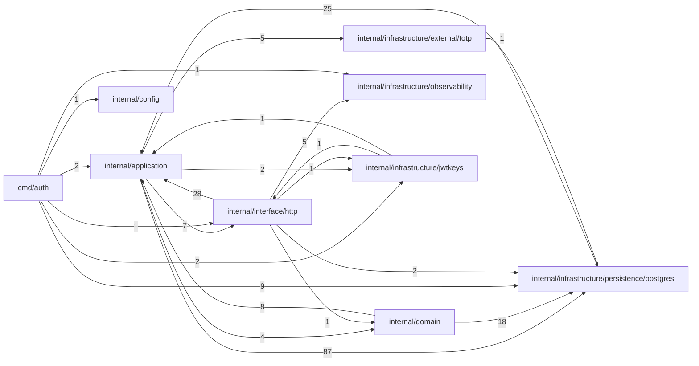

# INDEX_FUNCTIONS — `viralefy_auth`

> **Gerado** por `viralefy_ops/lib/index/build-index.mjs` (§39). Não editar à mão:
> corrija o doc-comment na origem e regenere com `/eng-index`.

| Métrica | Valor |
|---|---|
| Arquivos com função indexada | 26 (de 29 varridos) |
| **N — funções declaradas no código** | **169** |
| **M — entradas neste índice** | **169** |
| Invariante `M == N` | ✅ OK |
| Funções sem doc-comment (§3) | 98 (58.0%) |

Colunas: `de onde vem → pra onde vai` é derivada (camada dos chamadores → efeitos detectados);
`chama (out)` / `é chamada por (in)` vêm do grafo resolvido por nome. As listas inline são
limitadas a 10 nomes com sufixo `+N`; a adjacência COMPLETA está na última seção.

## Grafo de chamadas (por módulo)



## Funções


### `cmd/auth/main.go` — camada `cmd`

| Função | Tipo | O quê | de onde vem → pra onde vai | chama (out) | é chamada por (in) | Efeitos | Linha |
|---|---|---|---|---|---|---|---|
| `main` | func | ⚠ SEM DOC | — → log | appVersion, New, Close, AssertSchema, NewPasswordResetRepo, NewRefreshTokenRepo, NewRevokedJTIRepo, NewTwoFARepo, NewUserRepo, NewRouter +8 | — | log | 38 |
| `appVersion` | func | ⚠ SEM DOC | cmd → retorno | — | main | — | 166 |
| `parse2FAKey` | func | parse2FAKey aceita hex 64 chars OU base64 44 (com padding) / 43 (sem). | cmd → retorno | — | main | — | 176 |

### `internal/application/auth_service.go` — camada `application`

| Função | Tipo | O quê | de onde vem → pra onde vai | chama (out) | é chamada por (in) | Efeitos | Linha |
|---|---|---|---|---|---|---|---|
| `NewAuthService` | func | ⚠ SEM DOC | cmd → retorno | — | main | — | 49 |
| `(AuthService).Tokens` | method | Tokens expõe o TokenService pros handlers usarem refresh/verify/revoke direto. | interface → interno | GetByEmail, GetByEmail, GetByEmail, GetByEmail | Refresh, Logout, TokenVerify, TokenRevoke, JWKS, PublicAdminEnroll2FA | — | 61 |
| `(AuthService).LoginUser` | method | LoginUser autentica via /v1/auth/user/login — endpoint UNIFICADO da loja. | interface → cripto | GetByUserID, GetByEmail, userView, adminView, GetByEmail, GetByEmail, MintForUser, MintForAdmin, MintPartial2FA, IsEnrolled +1 | Login, PublicUserLogin | cripto | 106 |
| `(AuthService).LoginAdmin` | method | LoginAdmin autentica admin. | interface → cripto | GetByEmail, adminView, GetByEmail, GetByEmail, MintForAdmin, MintPartial2FA, GetByEmail | Login, PublicAdminLogin | cripto | 161 |
| `(AuthService).CompleteLogin2FA` | method | CompleteLogin2FA é chamado depois de /login com TwoFARequired. | interface → interno | Verify2FA, GetByID, userView, adminView, GetByID, GetByID, MintForUser, MintForAdmin, ParsePartialToken, GetByID | Login2FA, PublicLogin2FA | — | 198 |
| `(AuthService).RegisterUser` | method | RegisterUser cria um user novo. | interface → interno | New, Create, Create, GetByEmail, Create, userView, HashPassword, GetByEmail, Create, GetByEmail +3 | Register, PublicUserRegister | — | 234 |
| `(AuthService).Enroll2FA` | method | ⚠ SEM DOC | interface → cripto | UpsertUser, UpsertAdmin, GetByID, GetByID, GetByID, Enroll, Encrypt, GenerateBackupCodes, GetByID | TwoFAEnroll, PublicAdminEnroll2FA | cripto | 284 |
| `(AuthService).Verify2FA` | method | ⚠ SEM DOC | interface+application → cripto | GetByUserID, GetByAdminID, MarkEnrolled, ConsumeBackupCode, isTOTPShape, IsEnrolled, Verify, Decrypt | TwoFAVerify, CompleteLogin2FA | cripto | 339 |
| `(AuthService).Disable2FA` | method | ⚠ SEM DOC | interface → interno | Delete | TwoFADisable | — | 383 |
| `(AuthService).RequestPasswordReset` | method | RequestPasswordReset cria um token (TTL 1h, single-use), grava hash no DB, e devolve o token bruto pro caller mandar por email. | interface → interno | New, Create, Create, Add, GetByEmail, Create, genResetToken, strPtrAuth, GetByEmail, Create +4 | PasswordResetRequest | — | 398 |
| `(AuthService).ConfirmPasswordReset` | method | ConfirmPasswordReset valida o token bruto e troca a senha. | interface → interno | GetByHash, MarkUsed, GetByHash, RevokeBySubject, UpdatePasswordHash, hashResetToken, HashPassword, UpdatePasswordHash, UpdatePasswordHash, GetByHash +2 | PasswordResetConfirm | — | 437 |
| `userView` | func | ---- Helpers ---- | application → retorno | — | LoginUser, CompleteLogin2FA, RegisterUser | — | 480 |
| `adminView` | func | ⚠ SEM DOC | application → retorno | — | LoginUser, LoginAdmin, CompleteLogin2FA | — | 487 |
| `isTOTPShape` | func | isTOTPShape — 6 dígitos. | application → retorno | — | Verify2FA | — | 495 |
| `genResetToken` | func | ⚠ SEM DOC | application → interno | hashResetToken | RequestPasswordReset | — | 507 |
| `hashResetToken` | func | ⚠ SEM DOC | application → retorno | — | ConfirmPasswordReset, genResetToken | — | 515 |
| `strPtrAuth` | func | ⚠ SEM DOC | application → retorno | — | RequestPasswordReset | — | 520 |

### `internal/application/password.go` — camada `application`

| Função | Tipo | O quê | de onde vem → pra onde vai | chama (out) | é chamada por (in) | Efeitos | Linha |
|---|---|---|---|---|---|---|---|
| `HashPassword` | func | HashPassword wrappa bcrypt com cost padrão do projeto. | application → cripto | — | ConfirmPasswordReset, RegisterUser | cripto | 24 |
| `ComparePassword` | func | ComparePassword retorna nil se senha bate com o hash. | — → cripto | — | — | cripto | 33 |
| `GeneratePassword` | func | GeneratePassword cria senha aleatória forte e legível: 16 chars, ao menos 1 de cada classe (lower, upper, dígito, símbolo). | — → retorno | — | — | — | 41 |
| `pick` | closure | ⚠ SEM DOC | — → interno | mustRand | — | — | 48 |
| `mustRand` | func | ⚠ SEM DOC | application → retorno | — | pick | — | 66 |

### `internal/application/refresh_role_test.go` — camada `test`

| Função | Tipo | O quê | de onde vem → pra onde vai | chama (out) | é chamada por (in) | Efeitos | Linha |
|---|---|---|---|---|---|---|---|
| `(fakeUserRepo).GetByID` | method | ⚠ SEM DOC | infrastructure+test+application → interno | New, GetByID, GetByID, GetByID | GetByID, GetByID, Refresh, CompleteLogin2FA, Enroll2FA, GetByID | — | 37 |
| `(fakeUserRepo).GetByEmail` | method | ⚠ SEM DOC | application+infrastructure+test → interno | New, GetByEmail, GetByEmail, GetByEmail | RequestPasswordReset, GetByEmail, GetByEmail, Tokens, LoginUser, LoginAdmin, RegisterUser, GetByEmail | — | 43 |
| `(fakeUserRepo).Create` | method | ⚠ SEM DOC | infrastructure+application+test+domain → interno | Create, Create, Create, Create | Create, Create, RequestPasswordReset, Create, Create, mint, IsActive, RegisterUser | — | 46 |
| `(fakeUserRepo).UpdatePasswordHash` | method | ⚠ SEM DOC | application+infrastructure+test → interno | UpdatePasswordHash, UpdatePasswordHash, UpdatePasswordHash | ConfirmPasswordReset, UpdatePasswordHash, UpdatePasswordHash, UpdatePasswordHash | — | 47 |
| `(fakeAdminRepo).GetByID` | method | ⚠ SEM DOC | infrastructure+test+application → interno | New, GetByID, GetByID, GetByID | GetByID, GetByID, Refresh, CompleteLogin2FA, Enroll2FA, GetByID | — | 53 |
| `(fakeAdminRepo).GetByEmail` | method | ⚠ SEM DOC | application+infrastructure+test → interno | New, GetByEmail, GetByEmail, GetByEmail | RequestPasswordReset, GetByEmail, GetByEmail, Tokens, LoginUser, LoginAdmin, RegisterUser, GetByEmail | — | 60 |
| `(fakeAdminRepo).UpdatePasswordHash` | method | ⚠ SEM DOC | application+infrastructure+test → interno | UpdatePasswordHash, UpdatePasswordHash, UpdatePasswordHash | ConfirmPasswordReset, UpdatePasswordHash, UpdatePasswordHash, UpdatePasswordHash | — | 63 |
| `(fakeRefreshRepo).Create` | method | ⚠ SEM DOC | infrastructure+application+test+domain → interno | Create, Create, Create, Create | Create, Create, RequestPasswordReset, Create, Create, mint, IsActive, RegisterUser | — | 69 |
| `(fakeRefreshRepo).GetByHash` | method | ⚠ SEM DOC | infrastructure+application+domain → interno | New, GetByHash, GetByHash | GetByHash, GetByHash, ConfirmPasswordReset, Refresh, Logout, IsActive | — | 77 |
| `(fakeRefreshRepo).Revoke` | method | ⚠ SEM DOC | infrastructure+application+domain → interno | Revoke | Revoke, Refresh, Logout, IsActive | — | 83 |
| `(fakeRefreshRepo).RevokeBySubject` | method | ⚠ SEM DOC | infrastructure+application+domain → interno | RevokeBySubject | RevokeBySubject, ConfirmPasswordReset, Refresh, IsActive | — | 93 |
| `(fakeRevokedJTIRepo).Add` | method | ⚠ SEM DOC | infrastructure+application+interface+test+domain → interno | Add | Add, RequestPasswordReset, Allow, MintPartial2FA, mint, RevokeAccessJTI, TestVerifyAccess_AlgNone_Rejected, TestVerifyAccess_WrongIssuer_Rejected, TestVerifyAccess_WrongAudience_Rejected, IsActive | — | 106 |
| `(fakeRevokedJTIRepo).IsRevoked` | method | ⚠ SEM DOC | infrastructure+application+domain → interno | IsRevoked | IsRevoked, VerifyAccess, IsActive | — | 107 |
| `(fakeRevokedJTIRepo).ListActive` | method | ⚠ SEM DOC | infrastructure+domain → interno | ListActive | ListActive, IsActive | — | 110 |
| `newTestTokenService` | func | ---- Helpers ---- | test → interno | NewTokenService | TestRefresh_PreservesAdminRealRole, TestRefresh_AdminDeletedBetweenIssueAndRefresh_ReturnsUnauthorized, TestRefresh_UserPreservesEmail, TestRefresh_UserSoftDeleted_ReturnsUnauthorized | — | 116 |
| `parseAccessClaimsNoVerify` | func | parseAccessClaimsNoVerify lê os claims do access token SEM verificar assinatura — testes que checam role/email só precisam do payload. (Pra evitar acoplar o teste à API exata de VerifyAccess do rep… | test → cripto | — | TestRefresh_PreservesAdminRealRole, TestRefresh_UserPreservesEmail | cripto | 139 |
| `TestRefresh_PreservesAdminRealRole` | func | ---- Tests ---- | — → interno | Refresh, newTestTokenService, parseAccessClaimsNoVerify, MintForAdmin, Refresh | — | — | 159 |
| `TestRefresh_AdminDeletedBetweenIssueAndRefresh_ReturnsUnauthorized` | func | ⚠ SEM DOC | — → interno | Refresh, newTestTokenService, MintForAdmin, Refresh | — | — | 203 |
| `TestRefresh_UserPreservesEmail` | func | ⚠ SEM DOC | — → interno | Refresh, newTestTokenService, parseAccessClaimsNoVerify, MintForUser, Refresh | — | — | 232 |
| `TestRefresh_UserSoftDeleted_ReturnsUnauthorized` | func | ⚠ SEM DOC | — → interno | Refresh, newTestTokenService, MintForUser, Refresh | — | — | 263 |

### `internal/application/token_service.go` — camada `application`

| Função | Tipo | O quê | de onde vem → pra onde vai | chama (out) | é chamada por (in) | Efeitos | Linha |
|---|---|---|---|---|---|---|---|
| `NewTokenService` | func | ⚠ SEM DOC | cmd+test → interno | JWKS, KeyID | main, newTestTokenService, newHardeningSvc | — | 96 |
| `(TokenService).PublicJWKS` | method | PublicJWKS retorna a estrutura JWKS (RFC 7517) com a chave pública atual pra verificadores externos (Next.js front, dispatcher Rust offline). | interface+infrastructure → interno | PublicJWKS | JWKS, PublicJWKS | — | 112 |
| `(TokenService).MintForUser` | method | MintForUser emite access+refresh pra um user. | test+application → interno | mint | TestRefresh_UserPreservesEmail, TestRefresh_UserSoftDeleted_ReturnsUnauthorized, LoginUser, TestVerifyAccess_ValidToken_Accepted, CompleteLogin2FA, RegisterUser | — | 126 |
| `(TokenService).MintForAdmin` | method | MintForAdmin emite access+refresh pra um admin. | test+application → interno | mint | TestRefresh_PreservesAdminRealRole, TestRefresh_AdminDeletedBetweenIssueAndRefresh_ReturnsUnauthorized, LoginUser, LoginAdmin, CompleteLogin2FA | — | 137 |
| `(TokenService).MintPartial2FA` | method | MintPartial2FA emite um token curto (5min) usado entre /login com 2FA pendente e /login/2fa. | application+test → cripto | Add, Add, ID | LoginUser, LoginAdmin, TestVerifyAccess_RejectsPartial2FAToken | cripto | 152 |
| `(TokenService).mint` | method | ⚠ SEM DOC | application → cripto | New, Create, Create, Add, Create, Create, Create, Add, genRefresh, hashRefresh +1 | MintForUser, MintForAdmin, Refresh | cripto | 174 |
| `(TokenService).VerifyAccess` | method | VerifyAccess valida assinatura + exp + iss + aud + hot-set de revogação. | interface+test → cripto | IsRevoked, IsRevoked, parseDualSign | Logout, TokenVerify, TestVerifyAccess_ValidToken_Accepted, TestVerifyAccess_AlgNone_Rejected, TestVerifyAccess_WrongIssuer_Rejected, TestVerifyAccess_WrongAudience_Rejected, TestVerifyAccess_MissingExp_Rejected, TestVerifyAccess_RejectsPartial2FAToken | cripto | 246 |
| `(TokenService).Refresh` | method | Refresh rotaciona o refresh token: valida o input, revoga o antigo, emite par novo. | interface+test → interno | GetByHash, GetByHash, Revoke, RevokeBySubject, GetByID, Refresh, GetByID, GetByID, GetByHash, Revoke +5 | Refresh, TestRefresh_PreservesAdminRealRole, TestRefresh_AdminDeletedBetweenIssueAndRefresh_ReturnsUnauthorized, TestRefresh_UserPreservesEmail, TestRefresh_UserSoftDeleted_ReturnsUnauthorized | — | 295 |
| `(TokenService).RevokeAccessJTI` | method | RevokeAccessJTI adiciona o jti à hot-set. | interface+application → interno | Add, Add | TokenRevoke, Logout | — | 387 |
| `(TokenService).Logout` | method | Logout: revoga refresh + access JTI atual. | interface → interno | GetByHash, GetByHash, Revoke, Logout, GetByHash, Revoke, RevokeAccessJTI, hashRefresh | Logout | — | 399 |
| `(TokenService).ParsePartialToken` | method | ParsePartialToken é utility pra validar partial_token e devolver subject. 2FA flow: /login (pwd OK + 2FA enabled) → MintPartial2FA → /login/2fa chama isso pra extrair subject e validar TOTP. | interface+test+application → cripto | parseDualSign | PublicAdminEnroll2FA, TestVerifyAccess_RejectsPartial2FAToken, CompleteLogin2FA | cripto | 418 |
| `(TokenService).parseDualSign` | method | parseDualSign aceita RS256 primário + HS256 legado durante migração. | application → cripto | — | VerifyAccess, ParsePartialToken | cripto | 454 |
| `genRefresh` | func | ⚠ SEM DOC | application → retorno | — | mint | — | 504 |
| `hashRefresh` | func | ⚠ SEM DOC | application → retorno | — | mint, Refresh, Logout | — | 512 |
| `strPtr` | func | ⚠ SEM DOC | application → retorno | — | mint | — | 517 |

### `internal/application/token_verify_test.go` — camada `test`

| Função | Tipo | O quê | de onde vem → pra onde vai | chama (out) | é chamada por (in) | Efeitos | Linha |
|---|---|---|---|---|---|---|---|
| `newHardeningSvc` | func | newHardeningSvc constrói TokenService minimal (mesmas fakes do refresh_role_test.go) com chave RSA fresca. | test → interno | NewTokenService | TestVerifyAccess_ValidToken_Accepted, TestVerifyAccess_AlgNone_Rejected, TestVerifyAccess_WrongIssuer_Rejected, TestVerifyAccess_WrongAudience_Rejected, TestVerifyAccess_MissingExp_Rejected, TestVerifyAccess_RejectsPartial2FAToken | — | 35 |
| `signRS256` | func | signRS256 mints um token assinado pela chave RSA com claims arbitrários. | test → cripto | — | TestVerifyAccess_WrongIssuer_Rejected, TestVerifyAccess_WrongAudience_Rejected, TestVerifyAccess_MissingExp_Rejected | cripto | 55 |
| `TestVerifyAccess_ValidToken_Accepted` | func | 1. | — → interno | MintForUser, VerifyAccess, newHardeningSvc | — | — | 69 |
| `TestVerifyAccess_AlgNone_Rejected` | func | 2. alg=none — atacante remove a assinatura. golang-jwt/v5 já rejeita none via SigningMethodNone, mas a allowlist explícita garante que isso continua valendo mesmo se a keyfunc for alterada no futuro. | — → cripto | Add, Add, VerifyAccess, newHardeningSvc | — | cripto | 88 |
| `TestVerifyAccess_WrongIssuer_Rejected` | func | 3. iss errado — token assinado com a chave certa mas afirmando ser de outro emissor. | — → cripto | Add, Add, VerifyAccess, newHardeningSvc, signRS256 | — | cripto | 115 |
| `TestVerifyAccess_WrongAudience_Rejected` | func | 4. aud errado — token emitido pra outro consumer (ex.: tinha aud "viralefy-payments" e estamos validando como "viralefy-api"). | — → cripto | Add, Add, VerifyAccess, newHardeningSvc, signRS256 | — | cripto | 136 |
| `TestVerifyAccess_MissingExp_Rejected` | func | 5. | — → cripto | VerifyAccess, newHardeningSvc, signRS256 | — | cripto | 157 |
| `TestVerifyAccess_RejectsPartial2FAToken` | func | 6 (bônus). | — → interno | MintPartial2FA, VerifyAccess, ParsePartialToken, newHardeningSvc | — | — | 178 |

### `internal/config/config.go` — camada `config`

| Função | Tipo | O quê | de onde vem → pra onde vai | chama (out) | é chamada por (in) | Efeitos | Linha |
|---|---|---|---|---|---|---|---|
| `Load` | func | ⚠ SEM DOC | cmd → interno | getenv | main | — | 29 |
| `getenv` | func | ⚠ SEM DOC | config → retorno | — | Load | — | 62 |

### `internal/domain/token.go` — camada `domain`

| Função | Tipo | O quê | de onde vem → pra onde vai | chama (out) | é chamada por (in) | Efeitos | Linha |
|---|---|---|---|---|---|---|---|
| `(Subject).ID` | method | ⚠ SEM DOC | interface+application → retorno | — | TwoFAEnroll, MintPartial2FA | — | 23 |
| `(RefreshToken).IsActive` | method | ⚠ SEM DOC | application → interno | Create, GetByHash, MarkUsed, Create, GetByHash, Revoke, RevokeBySubject, Add, IsRevoked, ListActive +9 | Refresh | — | 57 |

### `internal/domain/twofa.go` — camada `domain`

| Função | Tipo | O quê | de onde vem → pra onde vai | chama (out) | é chamada por (in) | Efeitos | Linha |
|---|---|---|---|---|---|---|---|
| `(TwoFA).IsEnrolled` | method | IsEnrolled é true só quando EnrolledAt != nil. | application → interno | GetByUserID, GetByAdminID, UpsertUser, UpsertAdmin, MarkEnrolled, Delete, ConsumeBackupCode | Verify2FA, LoginUser | — | 21 |

### `internal/infrastructure/external/totp/totp.go` — camada `infrastructure`

| Função | Tipo | O quê | de onde vem → pra onde vai | chama (out) | é chamada por (in) | Efeitos | Linha |
|---|---|---|---|---|---|---|---|
| `Enroll` | func | Enroll gera um secret novo + URI otpauth:// pronta pra QR code. account identifica o usuário (admin email, user email) que aparece no app (Google Authenticator, Authy etc). | test+application → retorno | — | TestEnroll_GeneratesUniqueSecrets, TestVerify_AcceptsCurrentWindowCode, TestVerify_RejectsObviouslyWrong, Enroll2FA | — | 35 |
| `Verify` | func | Verify checa se o código bate com o secret. | application+test → cripto | — | Verify2FA, TestVerify_AcceptsCurrentWindowCode, TestVerify_RejectsObviouslyWrong | cripto | 51 |
| `VerifyWithSkew` | func | VerifyWithSkew aceita ±N janelas (cada janela = 30s). | — → retorno | — | — | — | 57 |
| `Encrypt` | func | Encrypt cifra o secret base32 com AES-256-GCM. key tem que ter 32 bytes (256 bits). | test+application → retorno | — | TestEncrypt_RoundTrip, TestDecrypt_WrongKeyFails, TestEncrypt_RejectsWrongKeySize, Enroll2FA | — | 74 |
| `Decrypt` | func | Decrypt reverte Encrypt. | application+test → cripto | New | Verify2FA, TestEncrypt_RoundTrip, TestDecrypt_WrongKeyFails | cripto | 95 |
| `GenerateBackupCodes` | func | GenerateBackupCodes cria N códigos de 10 dígitos (base32 alfanumérico). 8 codes default — Google convention. | test+application → retorno | — | TestGenerateBackupCodes_NRoundsCount, TestGenerateBackupCodes_DefaultsTo8WhenN_Le0, Enroll2FA | — | 126 |

### `internal/infrastructure/external/totp/totp_test.go` — camada `test`

| Função | Tipo | O quê | de onde vem → pra onde vai | chama (out) | é chamada por (in) | Efeitos | Linha |
|---|---|---|---|---|---|---|---|
| `TestEnroll_GeneratesUniqueSecrets` | func | Vector check: Verify aceita o código gerado pra "agora" e rejeita códigos óbvios errados. | — → interno | Enroll | — | — | 18 |
| `TestVerify_AcceptsCurrentWindowCode` | func | ⚠ SEM DOC | — → cripto | Enroll, Verify | — | cripto | 35 |
| `TestVerify_RejectsObviouslyWrong` | func | ⚠ SEM DOC | — → cripto | Enroll, Verify | — | cripto | 54 |
| `TestEncrypt_RoundTrip` | func | ⚠ SEM DOC | — → interno | Encrypt, Decrypt | — | — | 61 |
| `TestDecrypt_WrongKeyFails` | func | ⚠ SEM DOC | — → interno | Encrypt, Decrypt | — | — | 83 |
| `TestEncrypt_RejectsWrongKeySize` | func | ⚠ SEM DOC | — → interno | Encrypt | — | — | 95 |
| `TestGenerateBackupCodes_NRoundsCount` | func | ⚠ SEM DOC | — → interno | GenerateBackupCodes | — | — | 102 |
| `TestGenerateBackupCodes_DefaultsTo8WhenN_Le0` | func | ⚠ SEM DOC | — → interno | GenerateBackupCodes | — | — | 128 |

### `internal/infrastructure/jwtkeys/keys.go` — camada `infrastructure`

| Função | Tipo | O quê | de onde vem → pra onde vai | chama (out) | é chamada por (in) | Efeitos | Linha |
|---|---|---|---|---|---|---|---|
| `LoadOrGenerate` | func | LoadOrGenerate retorna a chave RSA privada para assinar JWTs. | cmd → arquivo | parsePEM | main | arquivo | 28 |
| `parsePEM` | func | ⚠ SEM DOC | infrastructure → retorno | — | LoadOrGenerate | — | 61 |
| `KeyID` | func | KeyID deriva um KID estável a partir do SHA-256 dos primeiros bytes do modulus público — usado pra distinguir tokens RS256 atuais de legados HS256 no validador. | cmd+application+infrastructure → interno | JWKS | main, NewTokenService, PublicJWKS | — | 82 |
| `PublicJWKS` | func | PublicJWKS devolve a estrutura JWKS (RFC 7517) com a chave pública atual exposta em /.well-known/jwks.json. | interface+application → interno | PublicJWKS, KeyID | JWKS, PublicJWKS | — | 93 |

### `internal/infrastructure/observability/metrics.go` — camada `infrastructure`

| Função | Tipo | O quê | de onde vem → pra onde vai | chama (out) | é chamada por (in) | Efeitos | Linha |
|---|---|---|---|---|---|---|---|
| `InitMetrics` | func | InitMetrics regista os collectors num Registry isolado (não polui o default). | cmd+infrastructure → retorno | — | main, MetricsHandler | — | 56 |
| `MetricsHandler` | func | MetricsHandler devolve o handler HTTP do /metrics. | interface → interno | InitMetrics | NewRouter | — | 72 |
| `(statusRecorder).WriteHeader` | method | ⚠ SEM DOC | interface → retorno | — | InternalTokenAuth, writeRateLimited, writeJSON | — | 90 |
| `HTTPMiddleware` | func | HTTPMiddleware instrumenta cada request com http_requests_total + http_request_duration_seconds. | interface → interno | ObserveDBQuery | NewRouter | — | 99 |
| `ObserveDBQuery` | func | ObserveDBQuery: shorthand para instrumentar uma query SQL. defer observability.ObserveDBQuery("select_user")(time.Now()) | infrastructure → retorno | — | HTTPMiddleware | — | 125 |

### `internal/infrastructure/persistence/postgres/admin_repo.go` — camada `infrastructure`

| Função | Tipo | O quê | de onde vem → pra onde vai | chama (out) | é chamada por (in) | Efeitos | Linha |
|---|---|---|---|---|---|---|---|
| `NewAdminRepo` | func | ⚠ SEM DOC | cmd → retorno | — | main | — | 13 |
| `(AdminRepo).GetByID` | method | ⚠ SEM DOC | infrastructure+test+application → db | scanAdmin, GetByID, GetByID, GetByID | GetByID, GetByID, GetByID, Refresh, CompleteLogin2FA, Enroll2FA | db | 19 |
| `(AdminRepo).GetByEmail` | method | ⚠ SEM DOC | application+infrastructure+test → db | scanAdmin, GetByEmail, GetByEmail, GetByEmail | RequestPasswordReset, GetByEmail, GetByEmail, GetByEmail, Tokens, LoginUser, LoginAdmin, RegisterUser | db | 24 |
| `(AdminRepo).UpdatePasswordHash` | method | ⚠ SEM DOC | application+infrastructure+test → db | UpdatePasswordHash, UpdatePasswordHash, UpdatePasswordHash | ConfirmPasswordReset, UpdatePasswordHash, UpdatePasswordHash, UpdatePasswordHash | db | 29 |
| `scanAdmin` | func | ⚠ SEM DOC | infrastructure → db | — | GetByID, GetByEmail | db | 41 |

### `internal/infrastructure/persistence/postgres/db.go` — camada `infrastructure`

| Função | Tipo | O quê | de onde vem → pra onde vai | chama (out) | é chamada por (in) | Efeitos | Linha |
|---|---|---|---|---|---|---|---|
| `New` | func | ⚠ SEM DOC | cmd+application+interface+test+infrastructure → db | — | main, RequestPasswordReset, writeError, GetByID, GetByEmail, GetByID, GetByEmail, GetByHash, mint, Decrypt +1 | db | 21 |
| `(DB).Pool` | method | ⚠ SEM DOC | — → db | — | — | db | 44 |
| `(DB).Close` | method | ⚠ SEM DOC | cmd+infrastructure → retorno | — | main, ListActive | — | 45 |
| `(DB).AssertSchema` | method | AssertSchema valida que as tabelas exigidas pelo auth existem. | cmd → db | — | main | db | 50 |

### `internal/infrastructure/persistence/postgres/password_reset_repo.go` — camada `infrastructure`

| Função | Tipo | O quê | de onde vem → pra onde vai | chama (out) | é chamada por (in) | Efeitos | Linha |
|---|---|---|---|---|---|---|---|
| `NewPasswordResetRepo` | func | ⚠ SEM DOC | cmd → retorno | — | main | — | 13 |
| `(PasswordResetRepo).Create` | method | ⚠ SEM DOC | infrastructure+application+test+domain → db | Create, Create, Create, Create | Create, RequestPasswordReset, Create, Create, Create, mint, IsActive, RegisterUser | db | 15 |
| `(PasswordResetRepo).GetByHash` | method | ⚠ SEM DOC | infrastructure+application+test+domain → db | GetByHash, GetByHash | GetByHash, ConfirmPasswordReset, GetByHash, Refresh, Logout, IsActive | db | 25 |
| `(PasswordResetRepo).MarkUsed` | method | ⚠ SEM DOC | application+domain → db | — | ConfirmPasswordReset, IsActive | db | 43 |

### `internal/infrastructure/persistence/postgres/refresh_token_repo.go` — camada `infrastructure`

| Função | Tipo | O quê | de onde vem → pra onde vai | chama (out) | é chamada por (in) | Efeitos | Linha |
|---|---|---|---|---|---|---|---|
| `NewRefreshTokenRepo` | func | ⚠ SEM DOC | cmd → retorno | — | main | — | 13 |
| `(RefreshTokenRepo).Create` | method | ⚠ SEM DOC | infrastructure+application+test+domain → db | Create, Create, Create, Create | Create, RequestPasswordReset, Create, Create, Create, mint, IsActive, RegisterUser | db | 18 |
| `(RefreshTokenRepo).GetByHash` | method | ⚠ SEM DOC | infrastructure+application+test+domain → db | GetByHash, GetByHash | GetByHash, ConfirmPasswordReset, GetByHash, Refresh, Logout, IsActive | db | 28 |
| `(RefreshTokenRepo).Revoke` | method | Revoke marca o token como revogado + replaced_by. replacedBy pode ser vazio pra logout (não há substituto). | test+application+domain → db | Revoke | Revoke, Refresh, Logout, IsActive | db | 45 |
| `(RefreshTokenRepo).RevokeBySubject` | method | RevokeBySubject força logout total de um subject (todos os refresh tokens ativos viram revogados). | application+test+domain → db | RevokeBySubject | ConfirmPasswordReset, RevokeBySubject, Refresh, IsActive | db | 66 |

### `internal/infrastructure/persistence/postgres/revoked_jti_repo.go` — camada `infrastructure`

| Função | Tipo | O quê | de onde vem → pra onde vai | chama (out) | é chamada por (in) | Efeitos | Linha |
|---|---|---|---|---|---|---|---|
| `NewRevokedJTIRepo` | func | ⚠ SEM DOC | cmd → retorno | — | main | — | 11 |
| `(RevokedJTIRepo).Add` | method | Add insere uma row no hot-set. | application+interface+test+domain → db | Add | RequestPasswordReset, Allow, Add, MintPartial2FA, mint, RevokeAccessJTI, TestVerifyAccess_AlgNone_Rejected, TestVerifyAccess_WrongIssuer_Rejected, TestVerifyAccess_WrongAudience_Rejected, IsActive | db | 15 |
| `(RevokedJTIRepo).IsRevoked` | method | ⚠ SEM DOC | test+application+domain → db | IsRevoked | IsRevoked, VerifyAccess, IsActive | db | 38 |
| `(RevokedJTIRepo).ListActive` | method | ⚠ SEM DOC | test+domain → db | Close, ListActive | ListActive, IsActive | db | 47 |

### `internal/infrastructure/persistence/postgres/twofa_repo.go` — camada `infrastructure`

| Função | Tipo | O quê | de onde vem → pra onde vai | chama (out) | é chamada por (in) | Efeitos | Linha |
|---|---|---|---|---|---|---|---|
| `NewTwoFARepo` | func | ⚠ SEM DOC | cmd → retorno | — | main | — | 21 |
| `(TwoFARepo).GetByUserID` | method | ⚠ SEM DOC | application+domain → db | scanTwoFA | Verify2FA, LoginUser, IsEnrolled | db | 23 |
| `(TwoFARepo).GetByAdminID` | method | ⚠ SEM DOC | application+domain → db | scanTwoFA | Verify2FA, IsEnrolled | db | 30 |
| `(TwoFARepo).UpsertUser` | method | ⚠ SEM DOC | domain+application → interno | upsert | IsEnrolled, Enroll2FA | — | 37 |
| `(TwoFARepo).UpsertAdmin` | method | ⚠ SEM DOC | domain+application → interno | upsert | IsEnrolled, Enroll2FA | — | 41 |
| `(TwoFARepo).upsert` | method | ⚠ SEM DOC | infrastructure → db | — | UpsertUser, UpsertAdmin | db | 45 |
| `(TwoFARepo).MarkEnrolled` | method | ⚠ SEM DOC | application+domain → db | — | Verify2FA, IsEnrolled | db | 58 |
| `(TwoFARepo).Delete` | method | ⚠ SEM DOC | application+domain → db | — | Disable2FA, IsEnrolled | db | 77 |
| `(TwoFARepo).ConsumeBackupCode` | method | ConsumeBackupCode remove o hash usado do array. | application+domain → db | — | Verify2FA, IsEnrolled | db | 90 |
| `(TwoFARepo).scanTwoFA` | method | ⚠ SEM DOC | infrastructure → db | — | GetByUserID, GetByAdminID | db | 105 |

### `internal/infrastructure/persistence/postgres/user_repo.go` — camada `infrastructure`

| Função | Tipo | O quê | de onde vem → pra onde vai | chama (out) | é chamada por (in) | Efeitos | Linha |
|---|---|---|---|---|---|---|---|
| `NewUserRepo` | func | ⚠ SEM DOC | cmd → retorno | — | main | — | 13 |
| `(UserRepo).GetByID` | method | ⚠ SEM DOC | test+application+infrastructure → db | scanUser, GetByID, GetByID, GetByID | GetByID, GetByID, Refresh, CompleteLogin2FA, Enroll2FA, GetByID | db | 21 |
| `(UserRepo).GetByEmail` | method | GetByEmail retorna apenas users ATIVOS. | application+test+infrastructure → db | scanUser, GetByEmail, GetByEmail, GetByEmail | RequestPasswordReset, GetByEmail, GetByEmail, Tokens, LoginUser, LoginAdmin, RegisterUser, GetByEmail | db | 29 |
| `(UserRepo).Create` | method | ⚠ SEM DOC | infrastructure+application+test+domain → db | Create, Create, Create, Create | Create, Create, RequestPasswordReset, Create, Create, mint, IsActive, RegisterUser | db | 34 |
| `(UserRepo).UpdatePasswordHash` | method | ⚠ SEM DOC | application+test+infrastructure → db | UpdatePasswordHash, UpdatePasswordHash, UpdatePasswordHash | ConfirmPasswordReset, UpdatePasswordHash, UpdatePasswordHash, UpdatePasswordHash | db | 43 |
| `scanUser` | func | ⚠ SEM DOC | infrastructure → db | — | GetByID, GetByEmail | db | 56 |

### `internal/interface/http/handlers.go` — camada `interface`

| Função | Tipo | O quê | de onde vem → pra onde vai | chama (out) | é chamada por (in) | Efeitos | Linha |
|---|---|---|---|---|---|---|---|
| `(Handlers).Health` | method | ──────────────────────────────────────────────────────────────── Health endpoints — sem auth, usados por load balancer / dispatcher. | externo (borda) → interno | writeJSON | — | — | 24 |
| `(Handlers).Ready` | method | ⚠ SEM DOC | externo (borda) → interno | writeJSON | — | — | 31 |
| `(Handlers).Login` | method | ⚠ SEM DOC | externo (borda) → interno | loginResponse, clientIP, writeJSON, writeError, LoginUser, LoginAdmin | — | — | 46 |
| `(Handlers).Login2FA` | method | ⚠ SEM DOC | externo (borda) → interno | loginResponse, clientIP, writeJSON, writeError, CompleteLogin2FA | — | — | 79 |
| `(Handlers).Register` | method | ⚠ SEM DOC | externo (borda) → interno | loginResponse, clientIP, writeJSON, writeError, RegisterUser | — | — | 106 |
| `(Handlers).Refresh` | method | ⚠ SEM DOC | test+application → interno | clientIP, writeJSON, writeError, Tokens, Refresh | TestRefresh_PreservesAdminRealRole, TestRefresh_AdminDeletedBetweenIssueAndRefresh_ReturnsUnauthorized, TestRefresh_UserPreservesEmail, TestRefresh_UserSoftDeleted_ReturnsUnauthorized, Refresh | — | 129 |
| `(Handlers).Logout` | method | ⚠ SEM DOC | application → interno | writeJSON, writeError, Tokens, VerifyAccess, Logout | Logout | — | 159 |
| `(Handlers).TokenVerify` | method | ⚠ SEM DOC | externo (borda) → interno | writeJSON, Tokens, VerifyAccess | — | — | 202 |
| `(Handlers).TokenRevoke` | method | ⚠ SEM DOC | externo (borda) → interno | writeJSON, writeError, Tokens, RevokeAccessJTI | — | — | 226 |
| `(Handlers).PasswordResetRequest` | method | ⚠ SEM DOC | externo (borda) → interno | RequestPasswordReset, clientIP, writeJSON, writeError | — | — | 247 |
| `(Handlers).PasswordResetConfirm` | method | ⚠ SEM DOC | externo (borda) → interno | ConfirmPasswordReset, writeJSON, writeError | — | — | 286 |
| `(Handlers).TwoFAEnroll` | method | ⚠ SEM DOC | externo (borda) → interno | subjectFromReq, writeJSON, writeError, ID, Enroll2FA | — | — | 308 |
| `(Handlers).TwoFAVerify` | method | ⚠ SEM DOC | externo (borda) → interno | Verify2FA, subjectFromReq, writeJSON, writeError | — | — | 337 |
| `(Handlers).TwoFADisable` | method | ⚠ SEM DOC | externo (borda) → interno | Disable2FA, subjectFromReq, writeJSON, writeError | — | — | 360 |
| `(Handlers).JWKS` | method | ──────────────────────────────────────────────────────────────── JWKS público — proxy do dispatcher. | application+infrastructure → interno | writeJSON, writeError, Tokens, PublicJWKS, PublicJWKS | NewTokenService, KeyID | — | 378 |
| `subjectFromReq` | func | ─── Helpers ───────────────────────────────────────────────────── | interface → retorno | — | TwoFAEnroll, TwoFAVerify, TwoFADisable | — | 389 |
| `loginResponse` | func | ⚠ SEM DOC | interface → retorno | — | Login, Login2FA, Register, PublicUserLogin, PublicAdminLogin, PublicLogin2FA, PublicUserRegister | — | 396 |

### `internal/interface/http/middleware.go` — camada `interface`

| Função | Tipo | O quê | de onde vem → pra onde vai | chama (out) | é chamada por (in) | Efeitos | Linha |
|---|---|---|---|---|---|---|---|
| `InternalTokenAuth` | func | InternalTokenAuth valida X-Internal-Token em todo request /internal/v1/*. | interface → interno | WriteHeader | NewRouter | — | 11 |
| `clientIP` | func | clientIP extrai IP do request — X-Real-IP > X-Forwarded-For first > RemoteAddr. | interface → retorno | — | Login, Login2FA, Register, Refresh, PasswordResetRequest, PublicUserLogin, PublicAdminLogin, PublicLogin2FA, PublicUserRegister, PublicAdminEnroll2FA | — | 29 |

### `internal/interface/http/public_handlers.go` — camada `interface`

| Função | Tipo | O quê | de onde vem → pra onde vai | chama (out) | é chamada por (in) | Efeitos | Linha |
|---|---|---|---|---|---|---|---|
| `newIPRateLimiter` | func | ⚠ SEM DOC | interface → retorno | — | Allow | — | 35 |
| `(ipRateLimiter).Allow` | method | Allow registra um hit e devolve true se ainda dentro do budget. | interface → interno | Add, newIPRateLimiter, Add | PublicUserLogin, PublicAdminLogin, PublicLogin2FA, PublicUserRegister, PublicAdminEnroll2FA | — | 46 |
| `writeRateLimited` | func | ⚠ SEM DOC | interface → interno | WriteHeader | PublicUserLogin, PublicAdminLogin, PublicLogin2FA, PublicUserRegister, PublicAdminEnroll2FA | — | 90 |
| `(Handlers).PublicUserLogin` | method | PublicUserLogin — POST /v1/auth/user/login | externo (borda) → interno | loginResponse, clientIP, Allow, writeRateLimited, writeJSON, writeError, LoginUser | — | — | 105 |
| `(Handlers).PublicAdminLogin` | method | PublicAdminLogin — POST /v1/auth/login | externo (borda) → interno | loginResponse, clientIP, Allow, writeRateLimited, writeJSON, writeError, LoginAdmin | — | — | 126 |
| `(Handlers).PublicLogin2FA` | method | PublicLogin2FA — POST /v1/auth/user/login/2fa e POST /v1/auth/login/2fa Mesmo handler — derivação de user/admin vem do PartialToken. | externo (borda) → interno | loginResponse, clientIP, Allow, writeRateLimited, writeJSON, writeError, CompleteLogin2FA | — | — | 148 |
| `(Handlers).PublicUserRegister` | method | PublicUserRegister — POST /v1/auth/user/register | externo (borda) → interno | loginResponse, clientIP, Allow, writeRateLimited, writeJSON, writeError, RegisterUser | — | — | 180 |
| `(Handlers).PublicAdminEnroll2FA` | method | PublicAdminEnroll2FA — POST /v1/auth/login/2fa/enroll Flow: admin com requires_2fa=true mas sem enrollment → /v1/auth/login devolve partial_token; admin chama esse endpoint pra obter secret+otpauth… | externo (borda) → interno | clientIP, Allow, writeRateLimited, writeJSON, writeError, Tokens, ParsePartialToken, Enroll2FA | — | — | 210 |

### `internal/interface/http/response.go` — camada `interface`

| Função | Tipo | O quê | de onde vem → pra onde vai | chama (out) | é chamada por (in) | Efeitos | Linha |
|---|---|---|---|---|---|---|---|
| `writeJSON` | func | writeJSON serializa em JSON com status. | interface → interno | WriteHeader | Health, Ready, Login, Login2FA, Register, Refresh, Logout, TokenVerify, TokenRevoke, PasswordResetRequest +11 | — | 14 |
| `writeError` | func | writeError mapeia erros canônicos do domain pra HTTP. | interface+test → interno | New, writeJSON | Login, Login2FA, Register, Refresh, Logout, TokenRevoke, PasswordResetRequest, PasswordResetConfirm, TwoFAEnroll, TwoFAVerify +11 | — | 30 |

### `internal/interface/http/response_test.go` — camada `test`

| Função | Tipo | O quê | de onde vem → pra onde vai | chama (out) | é chamada por (in) | Efeitos | Linha |
|---|---|---|---|---|---|---|---|
| `decodeErrorBody` | func | decodeErrorBody le o body do recorder como errorBody. | test → retorno | — | TestWriteError_BareConflict_KeepsLegacyMessage, TestWriteError_WrappedConflict_ReturnsCleanMessage, TestWriteError_DeeplyWrappedConflict_NoSentinelLeak, TestWriteError_Unauthorized_FixedMessage | — | 15 |
| `TestWriteError_BareConflict_KeepsLegacyMessage` | func | Round 28/29: RegisterUser passou a wrap ErrConflict com mensagem útil: fmt.Errorf("email already registered: %w", domain.ErrConflict) O response.go faz strings.TrimSuffix(": conflict") pra entregar… | — → interno | writeError, decodeErrorBody | — | — | 34 |
| `TestWriteError_WrappedConflict_ReturnsCleanMessage` | func | ⚠ SEM DOC | — → interno | writeError, decodeErrorBody | — | — | 54 |
| `TestWriteError_DeeplyWrappedConflict_NoSentinelLeak` | func | ⚠ SEM DOC | — → interno | writeError, decodeErrorBody | — | — | 75 |
| `TestWriteError_Unauthorized_FixedMessage` | func | ⚠ SEM DOC | — → interno | writeError, decodeErrorBody | — | — | 91 |

### `internal/interface/http/router.go` — camada `interface`

| Função | Tipo | O quê | de onde vem → pra onde vai | chama (out) | é chamada por (in) | Efeitos | Linha |
|---|---|---|---|---|---|---|---|
| `NewRouter` | func | NewRouter monta o mux com middleware InternalTokenAuth aplicado em /internal/v1/*. | cmd → interno | InternalTokenAuth, MetricsHandler, HTTPMiddleware | main | — | 12 |

## Adjacência completa (grep-able)

```text
main -> appVersion   (cmd/auth/main.go:38 -> cmd/auth/main.go:166)
main -> New   (cmd/auth/main.go:38 -> internal/infrastructure/persistence/postgres/db.go:21)
main -> Close   (cmd/auth/main.go:38 -> internal/infrastructure/persistence/postgres/db.go:45)
main -> AssertSchema   (cmd/auth/main.go:38 -> internal/infrastructure/persistence/postgres/db.go:50)
main -> NewPasswordResetRepo   (cmd/auth/main.go:38 -> internal/infrastructure/persistence/postgres/password_reset_repo.go:13)
main -> NewRefreshTokenRepo   (cmd/auth/main.go:38 -> internal/infrastructure/persistence/postgres/refresh_token_repo.go:13)
main -> NewRevokedJTIRepo   (cmd/auth/main.go:38 -> internal/infrastructure/persistence/postgres/revoked_jti_repo.go:11)
main -> NewTwoFARepo   (cmd/auth/main.go:38 -> internal/infrastructure/persistence/postgres/twofa_repo.go:21)
main -> NewUserRepo   (cmd/auth/main.go:38 -> internal/infrastructure/persistence/postgres/user_repo.go:13)
main -> NewRouter   (cmd/auth/main.go:38 -> internal/interface/http/router.go:12)
main -> parse2FAKey   (cmd/auth/main.go:38 -> cmd/auth/main.go:176)
main -> NewAuthService   (cmd/auth/main.go:38 -> internal/application/auth_service.go:49)
main -> NewTokenService   (cmd/auth/main.go:38 -> internal/application/token_service.go:96)
main -> Load   (cmd/auth/main.go:38 -> internal/config/config.go:29)
main -> LoadOrGenerate   (cmd/auth/main.go:38 -> internal/infrastructure/jwtkeys/keys.go:28)
main -> KeyID   (cmd/auth/main.go:38 -> internal/infrastructure/jwtkeys/keys.go:82)
main -> InitMetrics   (cmd/auth/main.go:38 -> internal/infrastructure/observability/metrics.go:56)
main -> NewAdminRepo   (cmd/auth/main.go:38 -> internal/infrastructure/persistence/postgres/admin_repo.go:13)
Tokens -> GetByEmail   (internal/application/auth_service.go:61 -> internal/infrastructure/persistence/postgres/user_repo.go:29)
Tokens -> GetByEmail   (internal/application/auth_service.go:61 -> internal/application/refresh_role_test.go:43)
Tokens -> GetByEmail   (internal/application/auth_service.go:61 -> internal/application/refresh_role_test.go:60)
Tokens -> GetByEmail   (internal/application/auth_service.go:61 -> internal/infrastructure/persistence/postgres/admin_repo.go:24)
LoginUser -> GetByUserID   (internal/application/auth_service.go:106 -> internal/infrastructure/persistence/postgres/twofa_repo.go:23)
LoginUser -> GetByEmail   (internal/application/auth_service.go:106 -> internal/infrastructure/persistence/postgres/user_repo.go:29)
LoginUser -> userView   (internal/application/auth_service.go:106 -> internal/application/auth_service.go:480)
LoginUser -> adminView   (internal/application/auth_service.go:106 -> internal/application/auth_service.go:487)
LoginUser -> GetByEmail   (internal/application/auth_service.go:106 -> internal/application/refresh_role_test.go:43)
LoginUser -> GetByEmail   (internal/application/auth_service.go:106 -> internal/application/refresh_role_test.go:60)
LoginUser -> MintForUser   (internal/application/auth_service.go:106 -> internal/application/token_service.go:126)
LoginUser -> MintForAdmin   (internal/application/auth_service.go:106 -> internal/application/token_service.go:137)
LoginUser -> MintPartial2FA   (internal/application/auth_service.go:106 -> internal/application/token_service.go:152)
LoginUser -> IsEnrolled   (internal/application/auth_service.go:106 -> internal/domain/twofa.go:21)
LoginUser -> GetByEmail   (internal/application/auth_service.go:106 -> internal/infrastructure/persistence/postgres/admin_repo.go:24)
LoginAdmin -> GetByEmail   (internal/application/auth_service.go:161 -> internal/infrastructure/persistence/postgres/user_repo.go:29)
LoginAdmin -> adminView   (internal/application/auth_service.go:161 -> internal/application/auth_service.go:487)
LoginAdmin -> GetByEmail   (internal/application/auth_service.go:161 -> internal/application/refresh_role_test.go:43)
LoginAdmin -> GetByEmail   (internal/application/auth_service.go:161 -> internal/application/refresh_role_test.go:60)
LoginAdmin -> MintForAdmin   (internal/application/auth_service.go:161 -> internal/application/token_service.go:137)
LoginAdmin -> MintPartial2FA   (internal/application/auth_service.go:161 -> internal/application/token_service.go:152)
LoginAdmin -> GetByEmail   (internal/application/auth_service.go:161 -> internal/infrastructure/persistence/postgres/admin_repo.go:24)
CompleteLogin2FA -> Verify2FA   (internal/application/auth_service.go:198 -> internal/application/auth_service.go:339)
CompleteLogin2FA -> GetByID   (internal/application/auth_service.go:198 -> internal/infrastructure/persistence/postgres/user_repo.go:21)
CompleteLogin2FA -> userView   (internal/application/auth_service.go:198 -> internal/application/auth_service.go:480)
CompleteLogin2FA -> adminView   (internal/application/auth_service.go:198 -> internal/application/auth_service.go:487)
CompleteLogin2FA -> GetByID   (internal/application/auth_service.go:198 -> internal/application/refresh_role_test.go:37)
CompleteLogin2FA -> GetByID   (internal/application/auth_service.go:198 -> internal/application/refresh_role_test.go:53)
CompleteLogin2FA -> MintForUser   (internal/application/auth_service.go:198 -> internal/application/token_service.go:126)
CompleteLogin2FA -> MintForAdmin   (internal/application/auth_service.go:198 -> internal/application/token_service.go:137)
CompleteLogin2FA -> ParsePartialToken   (internal/application/auth_service.go:198 -> internal/application/token_service.go:418)
CompleteLogin2FA -> GetByID   (internal/application/auth_service.go:198 -> internal/infrastructure/persistence/postgres/admin_repo.go:19)
RegisterUser -> New   (internal/application/auth_service.go:234 -> internal/infrastructure/persistence/postgres/db.go:21)
RegisterUser -> Create   (internal/application/auth_service.go:234 -> internal/infrastructure/persistence/postgres/password_reset_repo.go:15)
RegisterUser -> Create   (internal/application/auth_service.go:234 -> internal/infrastructure/persistence/postgres/refresh_token_repo.go:18)
RegisterUser -> GetByEmail   (internal/application/auth_service.go:234 -> internal/infrastructure/persistence/postgres/user_repo.go:29)
RegisterUser -> Create   (internal/application/auth_service.go:234 -> internal/infrastructure/persistence/postgres/user_repo.go:34)
RegisterUser -> userView   (internal/application/auth_service.go:234 -> internal/application/auth_service.go:480)
RegisterUser -> HashPassword   (internal/application/auth_service.go:234 -> internal/application/password.go:24)
RegisterUser -> GetByEmail   (internal/application/auth_service.go:234 -> internal/application/refresh_role_test.go:43)
RegisterUser -> Create   (internal/application/auth_service.go:234 -> internal/application/refresh_role_test.go:46)
RegisterUser -> GetByEmail   (internal/application/auth_service.go:234 -> internal/application/refresh_role_test.go:60)
RegisterUser -> Create   (internal/application/auth_service.go:234 -> internal/application/refresh_role_test.go:69)
RegisterUser -> MintForUser   (internal/application/auth_service.go:234 -> internal/application/token_service.go:126)
RegisterUser -> GetByEmail   (internal/application/auth_service.go:234 -> internal/infrastructure/persistence/postgres/admin_repo.go:24)
Enroll2FA -> UpsertUser   (internal/application/auth_service.go:284 -> internal/infrastructure/persistence/postgres/twofa_repo.go:37)
Enroll2FA -> UpsertAdmin   (internal/application/auth_service.go:284 -> internal/infrastructure/persistence/postgres/twofa_repo.go:41)
Enroll2FA -> GetByID   (internal/application/auth_service.go:284 -> internal/infrastructure/persistence/postgres/user_repo.go:21)
Enroll2FA -> GetByID   (internal/application/auth_service.go:284 -> internal/application/refresh_role_test.go:37)
Enroll2FA -> GetByID   (internal/application/auth_service.go:284 -> internal/application/refresh_role_test.go:53)
Enroll2FA -> Enroll   (internal/application/auth_service.go:284 -> internal/infrastructure/external/totp/totp.go:35)
Enroll2FA -> Encrypt   (internal/application/auth_service.go:284 -> internal/infrastructure/external/totp/totp.go:74)
Enroll2FA -> GenerateBackupCodes   (internal/application/auth_service.go:284 -> internal/infrastructure/external/totp/totp.go:126)
Enroll2FA -> GetByID   (internal/application/auth_service.go:284 -> internal/infrastructure/persistence/postgres/admin_repo.go:19)
Verify2FA -> GetByUserID   (internal/application/auth_service.go:339 -> internal/infrastructure/persistence/postgres/twofa_repo.go:23)
Verify2FA -> GetByAdminID   (internal/application/auth_service.go:339 -> internal/infrastructure/persistence/postgres/twofa_repo.go:30)
Verify2FA -> MarkEnrolled   (internal/application/auth_service.go:339 -> internal/infrastructure/persistence/postgres/twofa_repo.go:58)
Verify2FA -> ConsumeBackupCode   (internal/application/auth_service.go:339 -> internal/infrastructure/persistence/postgres/twofa_repo.go:90)
Verify2FA -> isTOTPShape   (internal/application/auth_service.go:339 -> internal/application/auth_service.go:495)
Verify2FA -> IsEnrolled   (internal/application/auth_service.go:339 -> internal/domain/twofa.go:21)
Verify2FA -> Verify   (internal/application/auth_service.go:339 -> internal/infrastructure/external/totp/totp.go:51)
Verify2FA -> Decrypt   (internal/application/auth_service.go:339 -> internal/infrastructure/external/totp/totp.go:95)
Disable2FA -> Delete   (internal/application/auth_service.go:383 -> internal/infrastructure/persistence/postgres/twofa_repo.go:77)
RequestPasswordReset -> New   (internal/application/auth_service.go:398 -> internal/infrastructure/persistence/postgres/db.go:21)
RequestPasswordReset -> Create   (internal/application/auth_service.go:398 -> internal/infrastructure/persistence/postgres/password_reset_repo.go:15)
RequestPasswordReset -> Create   (internal/application/auth_service.go:398 -> internal/infrastructure/persistence/postgres/refresh_token_repo.go:18)
RequestPasswordReset -> Add   (internal/application/auth_service.go:398 -> internal/infrastructure/persistence/postgres/revoked_jti_repo.go:15)
RequestPasswordReset -> GetByEmail   (internal/application/auth_service.go:398 -> internal/infrastructure/persistence/postgres/user_repo.go:29)
RequestPasswordReset -> Create   (internal/application/auth_service.go:398 -> internal/infrastructure/persistence/postgres/user_repo.go:34)
RequestPasswordReset -> genResetToken   (internal/application/auth_service.go:398 -> internal/application/auth_service.go:507)
RequestPasswordReset -> strPtrAuth   (internal/application/auth_service.go:398 -> internal/application/auth_service.go:520)
RequestPasswordReset -> GetByEmail   (internal/application/auth_service.go:398 -> internal/application/refresh_role_test.go:43)
RequestPasswordReset -> Create   (internal/application/auth_service.go:398 -> internal/application/refresh_role_test.go:46)
RequestPasswordReset -> GetByEmail   (internal/application/auth_service.go:398 -> internal/application/refresh_role_test.go:60)
RequestPasswordReset -> Create   (internal/application/auth_service.go:398 -> internal/application/refresh_role_test.go:69)
RequestPasswordReset -> Add   (internal/application/auth_service.go:398 -> internal/application/refresh_role_test.go:106)
RequestPasswordReset -> GetByEmail   (internal/application/auth_service.go:398 -> internal/infrastructure/persistence/postgres/admin_repo.go:24)
ConfirmPasswordReset -> GetByHash   (internal/application/auth_service.go:437 -> internal/infrastructure/persistence/postgres/password_reset_repo.go:25)
ConfirmPasswordReset -> MarkUsed   (internal/application/auth_service.go:437 -> internal/infrastructure/persistence/postgres/password_reset_repo.go:43)
ConfirmPasswordReset -> GetByHash   (internal/application/auth_service.go:437 -> internal/infrastructure/persistence/postgres/refresh_token_repo.go:28)
ConfirmPasswordReset -> RevokeBySubject   (internal/application/auth_service.go:437 -> internal/infrastructure/persistence/postgres/refresh_token_repo.go:66)
ConfirmPasswordReset -> UpdatePasswordHash   (internal/application/auth_service.go:437 -> internal/infrastructure/persistence/postgres/user_repo.go:43)
ConfirmPasswordReset -> hashResetToken   (internal/application/auth_service.go:437 -> internal/application/auth_service.go:515)
ConfirmPasswordReset -> HashPassword   (internal/application/auth_service.go:437 -> internal/application/password.go:24)
ConfirmPasswordReset -> UpdatePasswordHash   (internal/application/auth_service.go:437 -> internal/application/refresh_role_test.go:47)
ConfirmPasswordReset -> UpdatePasswordHash   (internal/application/auth_service.go:437 -> internal/application/refresh_role_test.go:63)
ConfirmPasswordReset -> GetByHash   (internal/application/auth_service.go:437 -> internal/application/refresh_role_test.go:77)
ConfirmPasswordReset -> RevokeBySubject   (internal/application/auth_service.go:437 -> internal/application/refresh_role_test.go:93)
ConfirmPasswordReset -> UpdatePasswordHash   (internal/application/auth_service.go:437 -> internal/infrastructure/persistence/postgres/admin_repo.go:29)
genResetToken -> hashResetToken   (internal/application/auth_service.go:507 -> internal/application/auth_service.go:515)
pick -> mustRand   (internal/application/password.go:48 -> internal/application/password.go:66)
GetByID -> New   (internal/application/refresh_role_test.go:37 -> internal/infrastructure/persistence/postgres/db.go:21)
GetByID -> GetByID   (internal/application/refresh_role_test.go:37 -> internal/infrastructure/persistence/postgres/user_repo.go:21)
GetByID -> GetByID   (internal/application/refresh_role_test.go:37 -> internal/application/refresh_role_test.go:53)
GetByID -> GetByID   (internal/application/refresh_role_test.go:37 -> internal/infrastructure/persistence/postgres/admin_repo.go:19)
GetByEmail -> New   (internal/application/refresh_role_test.go:43 -> internal/infrastructure/persistence/postgres/db.go:21)
GetByEmail -> GetByEmail   (internal/application/refresh_role_test.go:43 -> internal/infrastructure/persistence/postgres/user_repo.go:29)
GetByEmail -> GetByEmail   (internal/application/refresh_role_test.go:43 -> internal/application/refresh_role_test.go:60)
GetByEmail -> GetByEmail   (internal/application/refresh_role_test.go:43 -> internal/infrastructure/persistence/postgres/admin_repo.go:24)
Create -> Create   (internal/application/refresh_role_test.go:46 -> internal/infrastructure/persistence/postgres/password_reset_repo.go:15)
Create -> Create   (internal/application/refresh_role_test.go:46 -> internal/infrastructure/persistence/postgres/refresh_token_repo.go:18)
Create -> Create   (internal/application/refresh_role_test.go:46 -> internal/infrastructure/persistence/postgres/user_repo.go:34)
Create -> Create   (internal/application/refresh_role_test.go:46 -> internal/application/refresh_role_test.go:69)
UpdatePasswordHash -> UpdatePasswordHash   (internal/application/refresh_role_test.go:47 -> internal/infrastructure/persistence/postgres/user_repo.go:43)
UpdatePasswordHash -> UpdatePasswordHash   (internal/application/refresh_role_test.go:47 -> internal/application/refresh_role_test.go:63)
UpdatePasswordHash -> UpdatePasswordHash   (internal/application/refresh_role_test.go:47 -> internal/infrastructure/persistence/postgres/admin_repo.go:29)
GetByID -> New   (internal/application/refresh_role_test.go:53 -> internal/infrastructure/persistence/postgres/db.go:21)
GetByID -> GetByID   (internal/application/refresh_role_test.go:53 -> internal/infrastructure/persistence/postgres/user_repo.go:21)
GetByID -> GetByID   (internal/application/refresh_role_test.go:53 -> internal/application/refresh_role_test.go:37)
GetByID -> GetByID   (internal/application/refresh_role_test.go:53 -> internal/infrastructure/persistence/postgres/admin_repo.go:19)
GetByEmail -> New   (internal/application/refresh_role_test.go:60 -> internal/infrastructure/persistence/postgres/db.go:21)
GetByEmail -> GetByEmail   (internal/application/refresh_role_test.go:60 -> internal/infrastructure/persistence/postgres/user_repo.go:29)
GetByEmail -> GetByEmail   (internal/application/refresh_role_test.go:60 -> internal/application/refresh_role_test.go:43)
GetByEmail -> GetByEmail   (internal/application/refresh_role_test.go:60 -> internal/infrastructure/persistence/postgres/admin_repo.go:24)
UpdatePasswordHash -> UpdatePasswordHash   (internal/application/refresh_role_test.go:63 -> internal/infrastructure/persistence/postgres/user_repo.go:43)
UpdatePasswordHash -> UpdatePasswordHash   (internal/application/refresh_role_test.go:63 -> internal/application/refresh_role_test.go:47)
UpdatePasswordHash -> UpdatePasswordHash   (internal/application/refresh_role_test.go:63 -> internal/infrastructure/persistence/postgres/admin_repo.go:29)
Create -> Create   (internal/application/refresh_role_test.go:69 -> internal/infrastructure/persistence/postgres/password_reset_repo.go:15)
Create -> Create   (internal/application/refresh_role_test.go:69 -> internal/infrastructure/persistence/postgres/refresh_token_repo.go:18)
Create -> Create   (internal/application/refresh_role_test.go:69 -> internal/infrastructure/persistence/postgres/user_repo.go:34)
Create -> Create   (internal/application/refresh_role_test.go:69 -> internal/application/refresh_role_test.go:46)
GetByHash -> New   (internal/application/refresh_role_test.go:77 -> internal/infrastructure/persistence/postgres/db.go:21)
GetByHash -> GetByHash   (internal/application/refresh_role_test.go:77 -> internal/infrastructure/persistence/postgres/password_reset_repo.go:25)
GetByHash -> GetByHash   (internal/application/refresh_role_test.go:77 -> internal/infrastructure/persistence/postgres/refresh_token_repo.go:28)
Revoke -> Revoke   (internal/application/refresh_role_test.go:83 -> internal/infrastructure/persistence/postgres/refresh_token_repo.go:45)
RevokeBySubject -> RevokeBySubject   (internal/application/refresh_role_test.go:93 -> internal/infrastructure/persistence/postgres/refresh_token_repo.go:66)
Add -> Add   (internal/application/refresh_role_test.go:106 -> internal/infrastructure/persistence/postgres/revoked_jti_repo.go:15)
IsRevoked -> IsRevoked   (internal/application/refresh_role_test.go:107 -> internal/infrastructure/persistence/postgres/revoked_jti_repo.go:38)
ListActive -> ListActive   (internal/application/refresh_role_test.go:110 -> internal/infrastructure/persistence/postgres/revoked_jti_repo.go:47)
newTestTokenService -> NewTokenService   (internal/application/refresh_role_test.go:116 -> internal/application/token_service.go:96)
TestRefresh_PreservesAdminRealRole -> Refresh   (internal/application/refresh_role_test.go:159 -> internal/interface/http/handlers.go:129)
TestRefresh_PreservesAdminRealRole -> newTestTokenService   (internal/application/refresh_role_test.go:159 -> internal/application/refresh_role_test.go:116)
TestRefresh_PreservesAdminRealRole -> parseAccessClaimsNoVerify   (internal/application/refresh_role_test.go:159 -> internal/application/refresh_role_test.go:139)
TestRefresh_PreservesAdminRealRole -> MintForAdmin   (internal/application/refresh_role_test.go:159 -> internal/application/token_service.go:137)
TestRefresh_PreservesAdminRealRole -> Refresh   (internal/application/refresh_role_test.go:159 -> internal/application/token_service.go:295)
TestRefresh_AdminDeletedBetweenIssueAndRefresh_ReturnsUnauthorized -> Refresh   (internal/application/refresh_role_test.go:203 -> internal/interface/http/handlers.go:129)
TestRefresh_AdminDeletedBetweenIssueAndRefresh_ReturnsUnauthorized -> newTestTokenService   (internal/application/refresh_role_test.go:203 -> internal/application/refresh_role_test.go:116)
TestRefresh_AdminDeletedBetweenIssueAndRefresh_ReturnsUnauthorized -> MintForAdmin   (internal/application/refresh_role_test.go:203 -> internal/application/token_service.go:137)
TestRefresh_AdminDeletedBetweenIssueAndRefresh_ReturnsUnauthorized -> Refresh   (internal/application/refresh_role_test.go:203 -> internal/application/token_service.go:295)
TestRefresh_UserPreservesEmail -> Refresh   (internal/application/refresh_role_test.go:232 -> internal/interface/http/handlers.go:129)
TestRefresh_UserPreservesEmail -> newTestTokenService   (internal/application/refresh_role_test.go:232 -> internal/application/refresh_role_test.go:116)
TestRefresh_UserPreservesEmail -> parseAccessClaimsNoVerify   (internal/application/refresh_role_test.go:232 -> internal/application/refresh_role_test.go:139)
TestRefresh_UserPreservesEmail -> MintForUser   (internal/application/refresh_role_test.go:232 -> internal/application/token_service.go:126)
TestRefresh_UserPreservesEmail -> Refresh   (internal/application/refresh_role_test.go:232 -> internal/application/token_service.go:295)
TestRefresh_UserSoftDeleted_ReturnsUnauthorized -> Refresh   (internal/application/refresh_role_test.go:263 -> internal/interface/http/handlers.go:129)
TestRefresh_UserSoftDeleted_ReturnsUnauthorized -> newTestTokenService   (internal/application/refresh_role_test.go:263 -> internal/application/refresh_role_test.go:116)
TestRefresh_UserSoftDeleted_ReturnsUnauthorized -> MintForUser   (internal/application/refresh_role_test.go:263 -> internal/application/token_service.go:126)
TestRefresh_UserSoftDeleted_ReturnsUnauthorized -> Refresh   (internal/application/refresh_role_test.go:263 -> internal/application/token_service.go:295)
NewTokenService -> JWKS   (internal/application/token_service.go:96 -> internal/interface/http/handlers.go:378)
NewTokenService -> KeyID   (internal/application/token_service.go:96 -> internal/infrastructure/jwtkeys/keys.go:82)
PublicJWKS -> PublicJWKS   (internal/application/token_service.go:112 -> internal/infrastructure/jwtkeys/keys.go:93)
MintForUser -> mint   (internal/application/token_service.go:126 -> internal/application/token_service.go:174)
MintForAdmin -> mint   (internal/application/token_service.go:137 -> internal/application/token_service.go:174)
MintPartial2FA -> Add   (internal/application/token_service.go:152 -> internal/infrastructure/persistence/postgres/revoked_jti_repo.go:15)
MintPartial2FA -> Add   (internal/application/token_service.go:152 -> internal/application/refresh_role_test.go:106)
MintPartial2FA -> ID   (internal/application/token_service.go:152 -> internal/domain/token.go:23)
mint -> New   (internal/application/token_service.go:174 -> internal/infrastructure/persistence/postgres/db.go:21)
mint -> Create   (internal/application/token_service.go:174 -> internal/infrastructure/persistence/postgres/password_reset_repo.go:15)
mint -> Create   (internal/application/token_service.go:174 -> internal/infrastructure/persistence/postgres/refresh_token_repo.go:18)
mint -> Add   (internal/application/token_service.go:174 -> internal/infrastructure/persistence/postgres/revoked_jti_repo.go:15)
mint -> Create   (internal/application/token_service.go:174 -> internal/infrastructure/persistence/postgres/user_repo.go:34)
mint -> Create   (internal/application/token_service.go:174 -> internal/application/refresh_role_test.go:46)
mint -> Create   (internal/application/token_service.go:174 -> internal/application/refresh_role_test.go:69)
mint -> Add   (internal/application/token_service.go:174 -> internal/application/refresh_role_test.go:106)
mint -> genRefresh   (internal/application/token_service.go:174 -> internal/application/token_service.go:504)
mint -> hashRefresh   (internal/application/token_service.go:174 -> internal/application/token_service.go:512)
mint -> strPtr   (internal/application/token_service.go:174 -> internal/application/token_service.go:517)
VerifyAccess -> IsRevoked   (internal/application/token_service.go:246 -> internal/infrastructure/persistence/postgres/revoked_jti_repo.go:38)
VerifyAccess -> IsRevoked   (internal/application/token_service.go:246 -> internal/application/refresh_role_test.go:107)
VerifyAccess -> parseDualSign   (internal/application/token_service.go:246 -> internal/application/token_service.go:454)
Refresh -> GetByHash   (internal/application/token_service.go:295 -> internal/infrastructure/persistence/postgres/password_reset_repo.go:25)
Refresh -> GetByHash   (internal/application/token_service.go:295 -> internal/infrastructure/persistence/postgres/refresh_token_repo.go:28)
Refresh -> Revoke   (internal/application/token_service.go:295 -> internal/infrastructure/persistence/postgres/refresh_token_repo.go:45)
Refresh -> RevokeBySubject   (internal/application/token_service.go:295 -> internal/infrastructure/persistence/postgres/refresh_token_repo.go:66)
Refresh -> GetByID   (internal/application/token_service.go:295 -> internal/infrastructure/persistence/postgres/user_repo.go:21)
Refresh -> Refresh   (internal/application/token_service.go:295 -> internal/interface/http/handlers.go:129)
Refresh -> GetByID   (internal/application/token_service.go:295 -> internal/application/refresh_role_test.go:37)
Refresh -> GetByID   (internal/application/token_service.go:295 -> internal/application/refresh_role_test.go:53)
Refresh -> GetByHash   (internal/application/token_service.go:295 -> internal/application/refresh_role_test.go:77)
Refresh -> Revoke   (internal/application/token_service.go:295 -> internal/application/refresh_role_test.go:83)
Refresh -> RevokeBySubject   (internal/application/token_service.go:295 -> internal/application/refresh_role_test.go:93)
Refresh -> mint   (internal/application/token_service.go:295 -> internal/application/token_service.go:174)
Refresh -> hashRefresh   (internal/application/token_service.go:295 -> internal/application/token_service.go:512)
Refresh -> IsActive   (internal/application/token_service.go:295 -> internal/domain/token.go:57)
Refresh -> GetByID   (internal/application/token_service.go:295 -> internal/infrastructure/persistence/postgres/admin_repo.go:19)
RevokeAccessJTI -> Add   (internal/application/token_service.go:387 -> internal/infrastructure/persistence/postgres/revoked_jti_repo.go:15)
RevokeAccessJTI -> Add   (internal/application/token_service.go:387 -> internal/application/refresh_role_test.go:106)
Logout -> GetByHash   (internal/application/token_service.go:399 -> internal/infrastructure/persistence/postgres/password_reset_repo.go:25)
Logout -> GetByHash   (internal/application/token_service.go:399 -> internal/infrastructure/persistence/postgres/refresh_token_repo.go:28)
Logout -> Revoke   (internal/application/token_service.go:399 -> internal/infrastructure/persistence/postgres/refresh_token_repo.go:45)
Logout -> Logout   (internal/application/token_service.go:399 -> internal/interface/http/handlers.go:159)
Logout -> GetByHash   (internal/application/token_service.go:399 -> internal/application/refresh_role_test.go:77)
Logout -> Revoke   (internal/application/token_service.go:399 -> internal/application/refresh_role_test.go:83)
Logout -> RevokeAccessJTI   (internal/application/token_service.go:399 -> internal/application/token_service.go:387)
Logout -> hashRefresh   (internal/application/token_service.go:399 -> internal/application/token_service.go:512)
ParsePartialToken -> parseDualSign   (internal/application/token_service.go:418 -> internal/application/token_service.go:454)
newHardeningSvc -> NewTokenService   (internal/application/token_verify_test.go:35 -> internal/application/token_service.go:96)
TestVerifyAccess_ValidToken_Accepted -> MintForUser   (internal/application/token_verify_test.go:69 -> internal/application/token_service.go:126)
TestVerifyAccess_ValidToken_Accepted -> VerifyAccess   (internal/application/token_verify_test.go:69 -> internal/application/token_service.go:246)
TestVerifyAccess_ValidToken_Accepted -> newHardeningSvc   (internal/application/token_verify_test.go:69 -> internal/application/token_verify_test.go:35)
TestVerifyAccess_AlgNone_Rejected -> Add   (internal/application/token_verify_test.go:88 -> internal/infrastructure/persistence/postgres/revoked_jti_repo.go:15)
TestVerifyAccess_AlgNone_Rejected -> Add   (internal/application/token_verify_test.go:88 -> internal/application/refresh_role_test.go:106)
TestVerifyAccess_AlgNone_Rejected -> VerifyAccess   (internal/application/token_verify_test.go:88 -> internal/application/token_service.go:246)
TestVerifyAccess_AlgNone_Rejected -> newHardeningSvc   (internal/application/token_verify_test.go:88 -> internal/application/token_verify_test.go:35)
TestVerifyAccess_WrongIssuer_Rejected -> Add   (internal/application/token_verify_test.go:115 -> internal/infrastructure/persistence/postgres/revoked_jti_repo.go:15)
TestVerifyAccess_WrongIssuer_Rejected -> Add   (internal/application/token_verify_test.go:115 -> internal/application/refresh_role_test.go:106)
TestVerifyAccess_WrongIssuer_Rejected -> VerifyAccess   (internal/application/token_verify_test.go:115 -> internal/application/token_service.go:246)
TestVerifyAccess_WrongIssuer_Rejected -> newHardeningSvc   (internal/application/token_verify_test.go:115 -> internal/application/token_verify_test.go:35)
TestVerifyAccess_WrongIssuer_Rejected -> signRS256   (internal/application/token_verify_test.go:115 -> internal/application/token_verify_test.go:55)
TestVerifyAccess_WrongAudience_Rejected -> Add   (internal/application/token_verify_test.go:136 -> internal/infrastructure/persistence/postgres/revoked_jti_repo.go:15)
TestVerifyAccess_WrongAudience_Rejected -> Add   (internal/application/token_verify_test.go:136 -> internal/application/refresh_role_test.go:106)
TestVerifyAccess_WrongAudience_Rejected -> VerifyAccess   (internal/application/token_verify_test.go:136 -> internal/application/token_service.go:246)
TestVerifyAccess_WrongAudience_Rejected -> newHardeningSvc   (internal/application/token_verify_test.go:136 -> internal/application/token_verify_test.go:35)
TestVerifyAccess_WrongAudience_Rejected -> signRS256   (internal/application/token_verify_test.go:136 -> internal/application/token_verify_test.go:55)
TestVerifyAccess_MissingExp_Rejected -> VerifyAccess   (internal/application/token_verify_test.go:157 -> internal/application/token_service.go:246)
TestVerifyAccess_MissingExp_Rejected -> newHardeningSvc   (internal/application/token_verify_test.go:157 -> internal/application/token_verify_test.go:35)
TestVerifyAccess_MissingExp_Rejected -> signRS256   (internal/application/token_verify_test.go:157 -> internal/application/token_verify_test.go:55)
TestVerifyAccess_RejectsPartial2FAToken -> MintPartial2FA   (internal/application/token_verify_test.go:178 -> internal/application/token_service.go:152)
TestVerifyAccess_RejectsPartial2FAToken -> VerifyAccess   (internal/application/token_verify_test.go:178 -> internal/application/token_service.go:246)
TestVerifyAccess_RejectsPartial2FAToken -> ParsePartialToken   (internal/application/token_verify_test.go:178 -> internal/application/token_service.go:418)
TestVerifyAccess_RejectsPartial2FAToken -> newHardeningSvc   (internal/application/token_verify_test.go:178 -> internal/application/token_verify_test.go:35)
Load -> getenv   (internal/config/config.go:29 -> internal/config/config.go:62)
IsActive -> Create   (internal/domain/token.go:57 -> internal/infrastructure/persistence/postgres/password_reset_repo.go:15)
IsActive -> GetByHash   (internal/domain/token.go:57 -> internal/infrastructure/persistence/postgres/password_reset_repo.go:25)
IsActive -> MarkUsed   (internal/domain/token.go:57 -> internal/infrastructure/persistence/postgres/password_reset_repo.go:43)
IsActive -> Create   (internal/domain/token.go:57 -> internal/infrastructure/persistence/postgres/refresh_token_repo.go:18)
IsActive -> GetByHash   (internal/domain/token.go:57 -> internal/infrastructure/persistence/postgres/refresh_token_repo.go:28)
IsActive -> Revoke   (internal/domain/token.go:57 -> internal/infrastructure/persistence/postgres/refresh_token_repo.go:45)
IsActive -> RevokeBySubject   (internal/domain/token.go:57 -> internal/infrastructure/persistence/postgres/refresh_token_repo.go:66)
IsActive -> Add   (internal/domain/token.go:57 -> internal/infrastructure/persistence/postgres/revoked_jti_repo.go:15)
IsActive -> IsRevoked   (internal/domain/token.go:57 -> internal/infrastructure/persistence/postgres/revoked_jti_repo.go:38)
IsActive -> ListActive   (internal/domain/token.go:57 -> internal/infrastructure/persistence/postgres/revoked_jti_repo.go:47)
IsActive -> Create   (internal/domain/token.go:57 -> internal/infrastructure/persistence/postgres/user_repo.go:34)
IsActive -> Create   (internal/domain/token.go:57 -> internal/application/refresh_role_test.go:46)
IsActive -> Create   (internal/domain/token.go:57 -> internal/application/refresh_role_test.go:69)
IsActive -> GetByHash   (internal/domain/token.go:57 -> internal/application/refresh_role_test.go:77)
IsActive -> Revoke   (internal/domain/token.go:57 -> internal/application/refresh_role_test.go:83)
IsActive -> RevokeBySubject   (internal/domain/token.go:57 -> internal/application/refresh_role_test.go:93)
IsActive -> Add   (internal/domain/token.go:57 -> internal/application/refresh_role_test.go:106)
IsActive -> IsRevoked   (internal/domain/token.go:57 -> internal/application/refresh_role_test.go:107)
IsActive -> ListActive   (internal/domain/token.go:57 -> internal/application/refresh_role_test.go:110)
IsEnrolled -> GetByUserID   (internal/domain/twofa.go:21 -> internal/infrastructure/persistence/postgres/twofa_repo.go:23)
IsEnrolled -> GetByAdminID   (internal/domain/twofa.go:21 -> internal/infrastructure/persistence/postgres/twofa_repo.go:30)
IsEnrolled -> UpsertUser   (internal/domain/twofa.go:21 -> internal/infrastructure/persistence/postgres/twofa_repo.go:37)
IsEnrolled -> UpsertAdmin   (internal/domain/twofa.go:21 -> internal/infrastructure/persistence/postgres/twofa_repo.go:41)
IsEnrolled -> MarkEnrolled   (internal/domain/twofa.go:21 -> internal/infrastructure/persistence/postgres/twofa_repo.go:58)
IsEnrolled -> Delete   (internal/domain/twofa.go:21 -> internal/infrastructure/persistence/postgres/twofa_repo.go:77)
IsEnrolled -> ConsumeBackupCode   (internal/domain/twofa.go:21 -> internal/infrastructure/persistence/postgres/twofa_repo.go:90)
Decrypt -> New   (internal/infrastructure/external/totp/totp.go:95 -> internal/infrastructure/persistence/postgres/db.go:21)
TestEnroll_GeneratesUniqueSecrets -> Enroll   (internal/infrastructure/external/totp/totp_test.go:18 -> internal/infrastructure/external/totp/totp.go:35)
TestVerify_AcceptsCurrentWindowCode -> Enroll   (internal/infrastructure/external/totp/totp_test.go:35 -> internal/infrastructure/external/totp/totp.go:35)
TestVerify_AcceptsCurrentWindowCode -> Verify   (internal/infrastructure/external/totp/totp_test.go:35 -> internal/infrastructure/external/totp/totp.go:51)
TestVerify_RejectsObviouslyWrong -> Enroll   (internal/infrastructure/external/totp/totp_test.go:54 -> internal/infrastructure/external/totp/totp.go:35)
TestVerify_RejectsObviouslyWrong -> Verify   (internal/infrastructure/external/totp/totp_test.go:54 -> internal/infrastructure/external/totp/totp.go:51)
TestEncrypt_RoundTrip -> Encrypt   (internal/infrastructure/external/totp/totp_test.go:61 -> internal/infrastructure/external/totp/totp.go:74)
TestEncrypt_RoundTrip -> Decrypt   (internal/infrastructure/external/totp/totp_test.go:61 -> internal/infrastructure/external/totp/totp.go:95)
TestDecrypt_WrongKeyFails -> Encrypt   (internal/infrastructure/external/totp/totp_test.go:83 -> internal/infrastructure/external/totp/totp.go:74)
TestDecrypt_WrongKeyFails -> Decrypt   (internal/infrastructure/external/totp/totp_test.go:83 -> internal/infrastructure/external/totp/totp.go:95)
TestEncrypt_RejectsWrongKeySize -> Encrypt   (internal/infrastructure/external/totp/totp_test.go:95 -> internal/infrastructure/external/totp/totp.go:74)
TestGenerateBackupCodes_NRoundsCount -> GenerateBackupCodes   (internal/infrastructure/external/totp/totp_test.go:102 -> internal/infrastructure/external/totp/totp.go:126)
TestGenerateBackupCodes_DefaultsTo8WhenN_Le0 -> GenerateBackupCodes   (internal/infrastructure/external/totp/totp_test.go:128 -> internal/infrastructure/external/totp/totp.go:126)
LoadOrGenerate -> parsePEM   (internal/infrastructure/jwtkeys/keys.go:28 -> internal/infrastructure/jwtkeys/keys.go:61)
KeyID -> JWKS   (internal/infrastructure/jwtkeys/keys.go:82 -> internal/interface/http/handlers.go:378)
PublicJWKS -> PublicJWKS   (internal/infrastructure/jwtkeys/keys.go:93 -> internal/application/token_service.go:112)
PublicJWKS -> KeyID   (internal/infrastructure/jwtkeys/keys.go:93 -> internal/infrastructure/jwtkeys/keys.go:82)
MetricsHandler -> InitMetrics   (internal/infrastructure/observability/metrics.go:72 -> internal/infrastructure/observability/metrics.go:56)
HTTPMiddleware -> ObserveDBQuery   (internal/infrastructure/observability/metrics.go:99 -> internal/infrastructure/observability/metrics.go:125)
GetByID -> scanAdmin   (internal/infrastructure/persistence/postgres/admin_repo.go:19 -> internal/infrastructure/persistence/postgres/admin_repo.go:41)
GetByID -> GetByID   (internal/infrastructure/persistence/postgres/admin_repo.go:19 -> internal/infrastructure/persistence/postgres/user_repo.go:21)
GetByID -> GetByID   (internal/infrastructure/persistence/postgres/admin_repo.go:19 -> internal/application/refresh_role_test.go:37)
GetByID -> GetByID   (internal/infrastructure/persistence/postgres/admin_repo.go:19 -> internal/application/refresh_role_test.go:53)
GetByEmail -> scanAdmin   (internal/infrastructure/persistence/postgres/admin_repo.go:24 -> internal/infrastructure/persistence/postgres/admin_repo.go:41)
GetByEmail -> GetByEmail   (internal/infrastructure/persistence/postgres/admin_repo.go:24 -> internal/infrastructure/persistence/postgres/user_repo.go:29)
GetByEmail -> GetByEmail   (internal/infrastructure/persistence/postgres/admin_repo.go:24 -> internal/application/refresh_role_test.go:43)
GetByEmail -> GetByEmail   (internal/infrastructure/persistence/postgres/admin_repo.go:24 -> internal/application/refresh_role_test.go:60)
UpdatePasswordHash -> UpdatePasswordHash   (internal/infrastructure/persistence/postgres/admin_repo.go:29 -> internal/infrastructure/persistence/postgres/user_repo.go:43)
UpdatePasswordHash -> UpdatePasswordHash   (internal/infrastructure/persistence/postgres/admin_repo.go:29 -> internal/application/refresh_role_test.go:47)
UpdatePasswordHash -> UpdatePasswordHash   (internal/infrastructure/persistence/postgres/admin_repo.go:29 -> internal/application/refresh_role_test.go:63)
Create -> Create   (internal/infrastructure/persistence/postgres/password_reset_repo.go:15 -> internal/infrastructure/persistence/postgres/refresh_token_repo.go:18)
Create -> Create   (internal/infrastructure/persistence/postgres/password_reset_repo.go:15 -> internal/infrastructure/persistence/postgres/user_repo.go:34)
Create -> Create   (internal/infrastructure/persistence/postgres/password_reset_repo.go:15 -> internal/application/refresh_role_test.go:46)
Create -> Create   (internal/infrastructure/persistence/postgres/password_reset_repo.go:15 -> internal/application/refresh_role_test.go:69)
GetByHash -> GetByHash   (internal/infrastructure/persistence/postgres/password_reset_repo.go:25 -> internal/infrastructure/persistence/postgres/refresh_token_repo.go:28)
GetByHash -> GetByHash   (internal/infrastructure/persistence/postgres/password_reset_repo.go:25 -> internal/application/refresh_role_test.go:77)
Create -> Create   (internal/infrastructure/persistence/postgres/refresh_token_repo.go:18 -> internal/infrastructure/persistence/postgres/password_reset_repo.go:15)
Create -> Create   (internal/infrastructure/persistence/postgres/refresh_token_repo.go:18 -> internal/infrastructure/persistence/postgres/user_repo.go:34)
Create -> Create   (internal/infrastructure/persistence/postgres/refresh_token_repo.go:18 -> internal/application/refresh_role_test.go:46)
Create -> Create   (internal/infrastructure/persistence/postgres/refresh_token_repo.go:18 -> internal/application/refresh_role_test.go:69)
GetByHash -> GetByHash   (internal/infrastructure/persistence/postgres/refresh_token_repo.go:28 -> internal/infrastructure/persistence/postgres/password_reset_repo.go:25)
GetByHash -> GetByHash   (internal/infrastructure/persistence/postgres/refresh_token_repo.go:28 -> internal/application/refresh_role_test.go:77)
Revoke -> Revoke   (internal/infrastructure/persistence/postgres/refresh_token_repo.go:45 -> internal/application/refresh_role_test.go:83)
RevokeBySubject -> RevokeBySubject   (internal/infrastructure/persistence/postgres/refresh_token_repo.go:66 -> internal/application/refresh_role_test.go:93)
Add -> Add   (internal/infrastructure/persistence/postgres/revoked_jti_repo.go:15 -> internal/application/refresh_role_test.go:106)
IsRevoked -> IsRevoked   (internal/infrastructure/persistence/postgres/revoked_jti_repo.go:38 -> internal/application/refresh_role_test.go:107)
ListActive -> Close   (internal/infrastructure/persistence/postgres/revoked_jti_repo.go:47 -> internal/infrastructure/persistence/postgres/db.go:45)
ListActive -> ListActive   (internal/infrastructure/persistence/postgres/revoked_jti_repo.go:47 -> internal/application/refresh_role_test.go:110)
GetByUserID -> scanTwoFA   (internal/infrastructure/persistence/postgres/twofa_repo.go:23 -> internal/infrastructure/persistence/postgres/twofa_repo.go:105)
GetByAdminID -> scanTwoFA   (internal/infrastructure/persistence/postgres/twofa_repo.go:30 -> internal/infrastructure/persistence/postgres/twofa_repo.go:105)
UpsertUser -> upsert   (internal/infrastructure/persistence/postgres/twofa_repo.go:37 -> internal/infrastructure/persistence/postgres/twofa_repo.go:45)
UpsertAdmin -> upsert   (internal/infrastructure/persistence/postgres/twofa_repo.go:41 -> internal/infrastructure/persistence/postgres/twofa_repo.go:45)
GetByID -> scanUser   (internal/infrastructure/persistence/postgres/user_repo.go:21 -> internal/infrastructure/persistence/postgres/user_repo.go:56)
GetByID -> GetByID   (internal/infrastructure/persistence/postgres/user_repo.go:21 -> internal/application/refresh_role_test.go:37)
GetByID -> GetByID   (internal/infrastructure/persistence/postgres/user_repo.go:21 -> internal/application/refresh_role_test.go:53)
GetByID -> GetByID   (internal/infrastructure/persistence/postgres/user_repo.go:21 -> internal/infrastructure/persistence/postgres/admin_repo.go:19)
GetByEmail -> scanUser   (internal/infrastructure/persistence/postgres/user_repo.go:29 -> internal/infrastructure/persistence/postgres/user_repo.go:56)
GetByEmail -> GetByEmail   (internal/infrastructure/persistence/postgres/user_repo.go:29 -> internal/application/refresh_role_test.go:43)
GetByEmail -> GetByEmail   (internal/infrastructure/persistence/postgres/user_repo.go:29 -> internal/application/refresh_role_test.go:60)
GetByEmail -> GetByEmail   (internal/infrastructure/persistence/postgres/user_repo.go:29 -> internal/infrastructure/persistence/postgres/admin_repo.go:24)
Create -> Create   (internal/infrastructure/persistence/postgres/user_repo.go:34 -> internal/infrastructure/persistence/postgres/password_reset_repo.go:15)
Create -> Create   (internal/infrastructure/persistence/postgres/user_repo.go:34 -> internal/infrastructure/persistence/postgres/refresh_token_repo.go:18)
Create -> Create   (internal/infrastructure/persistence/postgres/user_repo.go:34 -> internal/application/refresh_role_test.go:46)
Create -> Create   (internal/infrastructure/persistence/postgres/user_repo.go:34 -> internal/application/refresh_role_test.go:69)
UpdatePasswordHash -> UpdatePasswordHash   (internal/infrastructure/persistence/postgres/user_repo.go:43 -> internal/application/refresh_role_test.go:47)
UpdatePasswordHash -> UpdatePasswordHash   (internal/infrastructure/persistence/postgres/user_repo.go:43 -> internal/application/refresh_role_test.go:63)
UpdatePasswordHash -> UpdatePasswordHash   (internal/infrastructure/persistence/postgres/user_repo.go:43 -> internal/infrastructure/persistence/postgres/admin_repo.go:29)
Health -> writeJSON   (internal/interface/http/handlers.go:24 -> internal/interface/http/response.go:14)
Ready -> writeJSON   (internal/interface/http/handlers.go:31 -> internal/interface/http/response.go:14)
Login -> loginResponse   (internal/interface/http/handlers.go:46 -> internal/interface/http/handlers.go:396)
Login -> clientIP   (internal/interface/http/handlers.go:46 -> internal/interface/http/middleware.go:29)
Login -> writeJSON   (internal/interface/http/handlers.go:46 -> internal/interface/http/response.go:14)
Login -> writeError   (internal/interface/http/handlers.go:46 -> internal/interface/http/response.go:30)
Login -> LoginUser   (internal/interface/http/handlers.go:46 -> internal/application/auth_service.go:106)
Login -> LoginAdmin   (internal/interface/http/handlers.go:46 -> internal/application/auth_service.go:161)
Login2FA -> loginResponse   (internal/interface/http/handlers.go:79 -> internal/interface/http/handlers.go:396)
Login2FA -> clientIP   (internal/interface/http/handlers.go:79 -> internal/interface/http/middleware.go:29)
Login2FA -> writeJSON   (internal/interface/http/handlers.go:79 -> internal/interface/http/response.go:14)
Login2FA -> writeError   (internal/interface/http/handlers.go:79 -> internal/interface/http/response.go:30)
Login2FA -> CompleteLogin2FA   (internal/interface/http/handlers.go:79 -> internal/application/auth_service.go:198)
Register -> loginResponse   (internal/interface/http/handlers.go:106 -> internal/interface/http/handlers.go:396)
Register -> clientIP   (internal/interface/http/handlers.go:106 -> internal/interface/http/middleware.go:29)
Register -> writeJSON   (internal/interface/http/handlers.go:106 -> internal/interface/http/response.go:14)
Register -> writeError   (internal/interface/http/handlers.go:106 -> internal/interface/http/response.go:30)
Register -> RegisterUser   (internal/interface/http/handlers.go:106 -> internal/application/auth_service.go:234)
Refresh -> clientIP   (internal/interface/http/handlers.go:129 -> internal/interface/http/middleware.go:29)
Refresh -> writeJSON   (internal/interface/http/handlers.go:129 -> internal/interface/http/response.go:14)
Refresh -> writeError   (internal/interface/http/handlers.go:129 -> internal/interface/http/response.go:30)
Refresh -> Tokens   (internal/interface/http/handlers.go:129 -> internal/application/auth_service.go:61)
Refresh -> Refresh   (internal/interface/http/handlers.go:129 -> internal/application/token_service.go:295)
Logout -> writeJSON   (internal/interface/http/handlers.go:159 -> internal/interface/http/response.go:14)
Logout -> writeError   (internal/interface/http/handlers.go:159 -> internal/interface/http/response.go:30)
Logout -> Tokens   (internal/interface/http/handlers.go:159 -> internal/application/auth_service.go:61)
Logout -> VerifyAccess   (internal/interface/http/handlers.go:159 -> internal/application/token_service.go:246)
Logout -> Logout   (internal/interface/http/handlers.go:159 -> internal/application/token_service.go:399)
TokenVerify -> writeJSON   (internal/interface/http/handlers.go:202 -> internal/interface/http/response.go:14)
TokenVerify -> Tokens   (internal/interface/http/handlers.go:202 -> internal/application/auth_service.go:61)
TokenVerify -> VerifyAccess   (internal/interface/http/handlers.go:202 -> internal/application/token_service.go:246)
TokenRevoke -> writeJSON   (internal/interface/http/handlers.go:226 -> internal/interface/http/response.go:14)
TokenRevoke -> writeError   (internal/interface/http/handlers.go:226 -> internal/interface/http/response.go:30)
TokenRevoke -> Tokens   (internal/interface/http/handlers.go:226 -> internal/application/auth_service.go:61)
TokenRevoke -> RevokeAccessJTI   (internal/interface/http/handlers.go:226 -> internal/application/token_service.go:387)
PasswordResetRequest -> RequestPasswordReset   (internal/interface/http/handlers.go:247 -> internal/application/auth_service.go:398)
PasswordResetRequest -> clientIP   (internal/interface/http/handlers.go:247 -> internal/interface/http/middleware.go:29)
PasswordResetRequest -> writeJSON   (internal/interface/http/handlers.go:247 -> internal/interface/http/response.go:14)
PasswordResetRequest -> writeError   (internal/interface/http/handlers.go:247 -> internal/interface/http/response.go:30)
PasswordResetConfirm -> ConfirmPasswordReset   (internal/interface/http/handlers.go:286 -> internal/application/auth_service.go:437)
PasswordResetConfirm -> writeJSON   (internal/interface/http/handlers.go:286 -> internal/interface/http/response.go:14)
PasswordResetConfirm -> writeError   (internal/interface/http/handlers.go:286 -> internal/interface/http/response.go:30)
TwoFAEnroll -> subjectFromReq   (internal/interface/http/handlers.go:308 -> internal/interface/http/handlers.go:389)
TwoFAEnroll -> writeJSON   (internal/interface/http/handlers.go:308 -> internal/interface/http/response.go:14)
TwoFAEnroll -> writeError   (internal/interface/http/handlers.go:308 -> internal/interface/http/response.go:30)
TwoFAEnroll -> ID   (internal/interface/http/handlers.go:308 -> internal/domain/token.go:23)
TwoFAEnroll -> Enroll2FA   (internal/interface/http/handlers.go:308 -> internal/application/auth_service.go:284)
TwoFAVerify -> Verify2FA   (internal/interface/http/handlers.go:337 -> internal/application/auth_service.go:339)
TwoFAVerify -> subjectFromReq   (internal/interface/http/handlers.go:337 -> internal/interface/http/handlers.go:389)
TwoFAVerify -> writeJSON   (internal/interface/http/handlers.go:337 -> internal/interface/http/response.go:14)
TwoFAVerify -> writeError   (internal/interface/http/handlers.go:337 -> internal/interface/http/response.go:30)
TwoFADisable -> Disable2FA   (internal/interface/http/handlers.go:360 -> internal/application/auth_service.go:383)
TwoFADisable -> subjectFromReq   (internal/interface/http/handlers.go:360 -> internal/interface/http/handlers.go:389)
TwoFADisable -> writeJSON   (internal/interface/http/handlers.go:360 -> internal/interface/http/response.go:14)
TwoFADisable -> writeError   (internal/interface/http/handlers.go:360 -> internal/interface/http/response.go:30)
JWKS -> writeJSON   (internal/interface/http/handlers.go:378 -> internal/interface/http/response.go:14)
JWKS -> writeError   (internal/interface/http/handlers.go:378 -> internal/interface/http/response.go:30)
JWKS -> Tokens   (internal/interface/http/handlers.go:378 -> internal/application/auth_service.go:61)
JWKS -> PublicJWKS   (internal/interface/http/handlers.go:378 -> internal/application/token_service.go:112)
JWKS -> PublicJWKS   (internal/interface/http/handlers.go:378 -> internal/infrastructure/jwtkeys/keys.go:93)
InternalTokenAuth -> WriteHeader   (internal/interface/http/middleware.go:11 -> internal/infrastructure/observability/metrics.go:90)
Allow -> Add   (internal/interface/http/public_handlers.go:46 -> internal/infrastructure/persistence/postgres/revoked_jti_repo.go:15)
Allow -> newIPRateLimiter   (internal/interface/http/public_handlers.go:46 -> internal/interface/http/public_handlers.go:35)
Allow -> Add   (internal/interface/http/public_handlers.go:46 -> internal/application/refresh_role_test.go:106)
writeRateLimited -> WriteHeader   (internal/interface/http/public_handlers.go:90 -> internal/infrastructure/observability/metrics.go:90)
PublicUserLogin -> loginResponse   (internal/interface/http/public_handlers.go:105 -> internal/interface/http/handlers.go:396)
PublicUserLogin -> clientIP   (internal/interface/http/public_handlers.go:105 -> internal/interface/http/middleware.go:29)
PublicUserLogin -> Allow   (internal/interface/http/public_handlers.go:105 -> internal/interface/http/public_handlers.go:46)
PublicUserLogin -> writeRateLimited   (internal/interface/http/public_handlers.go:105 -> internal/interface/http/public_handlers.go:90)
PublicUserLogin -> writeJSON   (internal/interface/http/public_handlers.go:105 -> internal/interface/http/response.go:14)
PublicUserLogin -> writeError   (internal/interface/http/public_handlers.go:105 -> internal/interface/http/response.go:30)
PublicUserLogin -> LoginUser   (internal/interface/http/public_handlers.go:105 -> internal/application/auth_service.go:106)
PublicAdminLogin -> loginResponse   (internal/interface/http/public_handlers.go:126 -> internal/interface/http/handlers.go:396)
PublicAdminLogin -> clientIP   (internal/interface/http/public_handlers.go:126 -> internal/interface/http/middleware.go:29)
PublicAdminLogin -> Allow   (internal/interface/http/public_handlers.go:126 -> internal/interface/http/public_handlers.go:46)
PublicAdminLogin -> writeRateLimited   (internal/interface/http/public_handlers.go:126 -> internal/interface/http/public_handlers.go:90)
PublicAdminLogin -> writeJSON   (internal/interface/http/public_handlers.go:126 -> internal/interface/http/response.go:14)
PublicAdminLogin -> writeError   (internal/interface/http/public_handlers.go:126 -> internal/interface/http/response.go:30)
PublicAdminLogin -> LoginAdmin   (internal/interface/http/public_handlers.go:126 -> internal/application/auth_service.go:161)
PublicLogin2FA -> loginResponse   (internal/interface/http/public_handlers.go:148 -> internal/interface/http/handlers.go:396)
PublicLogin2FA -> clientIP   (internal/interface/http/public_handlers.go:148 -> internal/interface/http/middleware.go:29)
PublicLogin2FA -> Allow   (internal/interface/http/public_handlers.go:148 -> internal/interface/http/public_handlers.go:46)
PublicLogin2FA -> writeRateLimited   (internal/interface/http/public_handlers.go:148 -> internal/interface/http/public_handlers.go:90)
PublicLogin2FA -> writeJSON   (internal/interface/http/public_handlers.go:148 -> internal/interface/http/response.go:14)
PublicLogin2FA -> writeError   (internal/interface/http/public_handlers.go:148 -> internal/interface/http/response.go:30)
PublicLogin2FA -> CompleteLogin2FA   (internal/interface/http/public_handlers.go:148 -> internal/application/auth_service.go:198)
PublicUserRegister -> loginResponse   (internal/interface/http/public_handlers.go:180 -> internal/interface/http/handlers.go:396)
PublicUserRegister -> clientIP   (internal/interface/http/public_handlers.go:180 -> internal/interface/http/middleware.go:29)
PublicUserRegister -> Allow   (internal/interface/http/public_handlers.go:180 -> internal/interface/http/public_handlers.go:46)
PublicUserRegister -> writeRateLimited   (internal/interface/http/public_handlers.go:180 -> internal/interface/http/public_handlers.go:90)
PublicUserRegister -> writeJSON   (internal/interface/http/public_handlers.go:180 -> internal/interface/http/response.go:14)
PublicUserRegister -> writeError   (internal/interface/http/public_handlers.go:180 -> internal/interface/http/response.go:30)
PublicUserRegister -> RegisterUser   (internal/interface/http/public_handlers.go:180 -> internal/application/auth_service.go:234)
PublicAdminEnroll2FA -> clientIP   (internal/interface/http/public_handlers.go:210 -> internal/interface/http/middleware.go:29)
PublicAdminEnroll2FA -> Allow   (internal/interface/http/public_handlers.go:210 -> internal/interface/http/public_handlers.go:46)
PublicAdminEnroll2FA -> writeRateLimited   (internal/interface/http/public_handlers.go:210 -> internal/interface/http/public_handlers.go:90)
PublicAdminEnroll2FA -> writeJSON   (internal/interface/http/public_handlers.go:210 -> internal/interface/http/response.go:14)
PublicAdminEnroll2FA -> writeError   (internal/interface/http/public_handlers.go:210 -> internal/interface/http/response.go:30)
PublicAdminEnroll2FA -> Tokens   (internal/interface/http/public_handlers.go:210 -> internal/application/auth_service.go:61)
PublicAdminEnroll2FA -> ParsePartialToken   (internal/interface/http/public_handlers.go:210 -> internal/application/token_service.go:418)
PublicAdminEnroll2FA -> Enroll2FA   (internal/interface/http/public_handlers.go:210 -> internal/application/auth_service.go:284)
writeJSON -> WriteHeader   (internal/interface/http/response.go:14 -> internal/infrastructure/observability/metrics.go:90)
writeError -> New   (internal/interface/http/response.go:30 -> internal/infrastructure/persistence/postgres/db.go:21)
writeError -> writeJSON   (internal/interface/http/response.go:30 -> internal/interface/http/response.go:14)
TestWriteError_BareConflict_KeepsLegacyMessage -> writeError   (internal/interface/http/response_test.go:34 -> internal/interface/http/response.go:30)
TestWriteError_BareConflict_KeepsLegacyMessage -> decodeErrorBody   (internal/interface/http/response_test.go:34 -> internal/interface/http/response_test.go:15)
TestWriteError_WrappedConflict_ReturnsCleanMessage -> writeError   (internal/interface/http/response_test.go:54 -> internal/interface/http/response.go:30)
TestWriteError_WrappedConflict_ReturnsCleanMessage -> decodeErrorBody   (internal/interface/http/response_test.go:54 -> internal/interface/http/response_test.go:15)
TestWriteError_DeeplyWrappedConflict_NoSentinelLeak -> writeError   (internal/interface/http/response_test.go:75 -> internal/interface/http/response.go:30)
TestWriteError_DeeplyWrappedConflict_NoSentinelLeak -> decodeErrorBody   (internal/interface/http/response_test.go:75 -> internal/interface/http/response_test.go:15)
TestWriteError_Unauthorized_FixedMessage -> writeError   (internal/interface/http/response_test.go:91 -> internal/interface/http/response.go:30)
TestWriteError_Unauthorized_FixedMessage -> decodeErrorBody   (internal/interface/http/response_test.go:91 -> internal/interface/http/response_test.go:15)
NewRouter -> InternalTokenAuth   (internal/interface/http/router.go:12 -> internal/interface/http/middleware.go:11)
NewRouter -> MetricsHandler   (internal/interface/http/router.go:12 -> internal/infrastructure/observability/metrics.go:72)
NewRouter -> HTTPMiddleware   (internal/interface/http/router.go:12 -> internal/infrastructure/observability/metrics.go:99)
```
