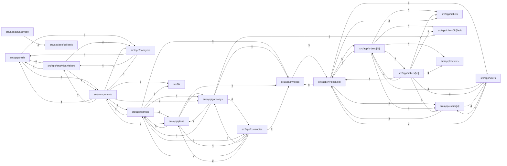

# INDEX_FUNCTIONS — `viralefy_backoffice`

> **Gerado** por `viralefy_ops/lib/index/build-index.mjs` (§39). Não editar à mão:
> corrija o doc-comment na origem e regenere com `/eng-index`.

| Métrica | Valor |
|---|---|
| Arquivos com função indexada | 46 (de 49 varridos) |
| **N — funções declaradas no código** | **181** |
| **M — entradas neste índice** | **181** |
| Invariante `M == N` | ✅ OK |
| Funções sem doc-comment (§3) | 152 (84.0%) |

Colunas: `de onde vem → pra onde vai` é derivada (camada dos chamadores → efeitos detectados);
`chama (out)` / `é chamada por (in)` vêm do grafo resolvido por nome. As listas inline são
limitadas a 10 nomes com sufixo `+N`; a adjacência COMPLETA está na última seção.

## Grafo de chamadas (por módulo)



> Grafo por módulo: 148 arestas inter-módulo no total; 60 desenhadas (as de maior peso). As 88 restantes NÃO foram omitidas do índice — estão na adjacência função a função abaixo.

## Funções


### `instrumentation.ts` — camada `interface`

| Função | Tipo | O quê | de onde vem → pra onde vai | chama (out) | é chamada por (in) | Efeitos | Linha |
|---|---|---|---|---|---|---|---|
| `register` | func | Hook do Next.js — chamado uma vez por runtime (node + edge) na inicialização. | externo (borda) → retorno | — | — | — | 4 |

### `next.config.ts` — camada `outro`

| Função | Tipo | O quê | de onde vem → pra onde vai | chama (out) | é chamada por (in) | Efeitos | Linha |
|---|---|---|---|---|---|---|---|
| `headers` | method | Headers de segurança aplicados a TODAS as rotas. | interface → retorno | — | middleware, RootLayout | — | 39 |

### `sentry.server.config.ts` — camada `outro`

| Função | Tipo | O quê | de onde vem → pra onde vai | chama (out) | é chamada por (in) | Efeitos | Linha |
|---|---|---|---|---|---|---|---|
| `beforeSend` | method | ⚠ SEM DOC | — → retorno | — | — | — | 15 |

### `src/app/admins/page.tsx` — camada `interface`

| Função | Tipo | O quê | de onde vem → pra onde vai | chama (out) | é chamada por (in) | Efeitos | Linha |
|---|---|---|---|---|---|---|---|
| `AdminsPage` | func | Página de gestão de admins. | externo (borda) → interno | getRole, can | — | — | 12 |
| `reload` | func | ⚠ SEM DOC | ui+interface → interno | reload, reload, reload, reload | handleSoft, handleRestore, reload, save, reload, save, toggleActive, remove, handleCreate, handleUpdateRole +8 | — | 24 |
| `handleCreate` | func | ⚠ SEM DOC | interface → interno | reload, reload, reload, reload, reload, handleCreate | handleCreate | — | 48 |
| `handleUpdateRole` | func | ⚠ SEM DOC | interface → interno | reload, reload, reload, reload, reload | handleResetTwoFA | — | 63 |
| `handleDelete` | func | ⚠ SEM DOC | ui+interface → interno | handleDelete, reload, reload, reload, reload, reload | handleDelete, handleResetTwoFA | — | 77 |
| `handleResetTwoFA` | func | ⚠ SEM DOC | externo (borda) → interno | handleDelete, reload, reload, reload, handleUpdateRole, reload, handleDelete, reload | — | — | 91 |
| `RoleBadge` | func | ⚠ SEM DOC | externo (borda) → retorno | — | — | — | 255 |
| `CreateAdminModal` | func | ⚠ SEM DOC | externo (borda) → retorno | — | — | — | 279 |

### `src/app/analytics/visitors/[vid]/page.tsx` — camada `interface`

| Função | Tipo | O quê | de onde vem → pra onde vai | chama (out) | é chamada por (in) | Efeitos | Linha |
|---|---|---|---|---|---|---|---|
| `VisitorDetailPage` | func | /analytics/visitors/[vid] — drill-down de UM visitor. | externo (borda) → retorno | — | — | — | 11 |

### `src/app/analytics/visitors/page.tsx` — camada `interface`

| Função | Tipo | O quê | de onde vem → pra onde vai | chama (out) | é chamada por (in) | Efeitos | Linha |
|---|---|---|---|---|---|---|---|
| `VisitorsPage` | func | /analytics/visitors — lista paginada de TODOS os visitors (anônimos + convertidos), ordenados por última atividade DESC. | externo (borda) → interno | th, td, th, th, td, td, date, short, utmCompact, th +1 | — | — | 17 |
| `th` | func | ⚠ SEM DOC | interface+ui → interno | th, th, th | UsersTable, OrdersTable, InvoicesTable, th, VisitorsPage, Timeline, th, HoneypotPage, th | — | 119 |
| `td` | func | ⚠ SEM DOC | interface+ui → interno | td, td, td | UsersTable, OrdersTable, InvoicesTable, td, VisitorsPage, Timeline, td, HoneypotPage, td | — | 122 |
| `date` | func | ⚠ SEM DOC | interface → retorno | — | VisitorsPage | — | 125 |
| `short` | func | ⚠ SEM DOC | interface → retorno | — | VisitorsPage | — | 129 |
| `utmCompact` | func | ⚠ SEM DOC | interface → retorno | — | VisitorsPage | — | 133 |

### `src/app/api/auth/2fa/route.ts` — camada `interface`

| Função | Tipo | O quê | de onde vem → pra onde vai | chama (out) | é chamada por (in) | Efeitos | Linha |
|---|---|---|---|---|---|---|---|
| `POST` | func | ⚠ SEM DOC | interface → http-out | sessionCookieOptions, POST, POST, POST | POST, POST, POST | http-out | 29 |

### `src/app/api/auth/login/route.ts` — camada `interface`

| Função | Tipo | O quê | de onde vem → pra onde vai | chama (out) | é chamada por (in) | Efeitos | Linha |
|---|---|---|---|---|---|---|---|
| `POST` | func | ⚠ SEM DOC | interface → http-out | sessionCookieOptions, POST, POST, POST | POST, POST, POST | http-out | 45 |

### `src/app/api/auth/logout/route.ts` — camada `interface`

| Função | Tipo | O quê | de onde vem → pra onde vai | chama (out) | é chamada por (in) | Efeitos | Linha |
|---|---|---|---|---|---|---|---|
| `POST` | func | ⚠ SEM DOC | interface → interno | sessionCookieOptions, POST, POST, POST | POST, POST, POST | — | 14 |

### `src/app/api/auth/me/route.ts` — camada `interface`

| Função | Tipo | O quê | de onde vem → pra onde vai | chama (out) | é chamada por (in) | Efeitos | Linha |
|---|---|---|---|---|---|---|---|
| `GET` | func | ⚠ SEM DOC | interface → interno | GET | GET | — | 19 |

### `src/app/api/auth/sso/route.ts` — camada `interface`

| Função | Tipo | O quê | de onde vem → pra onde vai | chama (out) | é chamada por (in) | Efeitos | Linha |
|---|---|---|---|---|---|---|---|
| `looksLikeJWT` | func | ⚠ SEM DOC | interface → interno | looksLikeJWT | POST, looksLikeJWT, SSOCallbackPage | — | 22 |
| `POST` | func | ⚠ SEM DOC | interface → interno | sessionCookieOptions, POST, POST, POST, looksLikeJWT, looksLikeJWT | POST, POST, POST | — | 31 |

### `src/app/api/metrics/route.ts` — camada `interface`

| Função | Tipo | O quê | de onde vem → pra onde vai | chama (out) | é chamada por (in) | Efeitos | Linha |
|---|---|---|---|---|---|---|---|
| `GET` | func | ⚠ SEM DOC | interface → interno | GET | GET | — | 19 |

### `src/app/api/proxy/[...path]/route.ts` — camada `interface`

| Função | Tipo | O quê | de onde vem → pra onde vai | chama (out) | é chamada por (in) | Efeitos | Linha |
|---|---|---|---|---|---|---|---|
| `originGuard` | func | ⚠ SEM DOC | interface → retorno | — | handle | — | 35 |
| `handle` | func | ⚠ SEM DOC | externo (borda) → http-out | originGuard | — | http-out | 59 |

### `src/app/currencies/page.tsx` — camada `interface`

| Função | Tipo | O quê | de onde vem → pra onde vai | chama (out) | é chamada por (in) | Efeitos | Linha |
|---|---|---|---|---|---|---|---|
| `CurrenciesPage` | func | ⚠ SEM DOC | externo (borda) → retorno | — | — | — | 7 |
| `reload` | func | ⚠ SEM DOC | ui+interface → interno | reload, reload, reload, reload | handleSoft, handleRestore, save, reload, reload, save, toggleActive, remove, handleCreate, handleUpdateRole +8 | — | 12 |
| `save` | func | ⚠ SEM DOC | interface → interno | reload, reload, reload, save, reload, save, reload | save, remove, save | — | 20 |

### `src/app/dashboard/page.tsx` — camada `interface`

| Função | Tipo | O quê | de onde vem → pra onde vai | chama (out) | é chamada por (in) | Efeitos | Linha |
|---|---|---|---|---|---|---|---|
| `DashboardPage` | func | Dashboard de métricas — cards de status + revenue, top categorias e série de 30d (mini-bar chart inline em SVG, sem dependência). | externo (borda) → retorno | — | — | — | 12 |
| `Tile` | func | ⚠ SEM DOC | externo (borda) → retorno | — | — | — | 136 |
| `BecomeCustomerButton` | func | Botão pra abrir a loja autenticado como customer espelhando o admin logado. | externo (borda) → retorno | — | — | — | 153 |
| `onClick` | func | ⚠ SEM DOC | externo (borda) → retorno | — | — | — | 158 |

### `src/app/gateways/page.tsx` — camada `interface`

| Função | Tipo | O quê | de onde vem → pra onde vai | chama (out) | é chamada por (in) | Efeitos | Linha |
|---|---|---|---|---|---|---|---|
| `emptyFormFor` | func | ⚠ SEM DOC | interface → retorno | — | startNew | — | 201 |
| `fromGateway` | func | ⚠ SEM DOC | interface → retorno | — | startEdit | — | 215 |
| `CurrencyChip` | func | ⚠ SEM DOC | externo (borda) → retorno | — | — | — | 235 |
| `GatewaysPage` | func | ⚠ SEM DOC | externo (borda) → interno | can | — | — | 256 |
| `reload` | func | ⚠ SEM DOC | ui+interface → interno | reload, reload, reload, reload | handleSoft, handleRestore, reload, save, reload, save, toggleActive, remove, handleCreate, handleUpdateRole +8 | — | 264 |
| `startNew` | func | ⚠ SEM DOC | externo (borda) → interno | emptyFormFor | — | — | 277 |
| `startEdit` | func | ⚠ SEM DOC | interface → interno | fromGateway | remove | — | 283 |
| `cancelForm` | func | ⚠ SEM DOC | interface → retorno | — | save | — | 289 |
| `changeProvider` | func | ⚠ SEM DOC | interface → retorno | — | remove | — | 294 |
| `toggleCurrency` | func | ⚠ SEM DOC | interface → retorno | — | remove | — | 311 |
| `setConfigField` | func | ⚠ SEM DOC | interface → retorno | — | remove | — | 319 |
| `validate` | func | ⚠ SEM DOC | interface → retorno | — | save | — | 324 |
| `save` | func | ⚠ SEM DOC | interface → interno | reload, save, reload, reload, cancelForm, validate, reload, save, reload | save, remove, save | — | 334 |
| `toggleActive` | func | ⚠ SEM DOC | interface → interno | reload, reload, reload, reload, reload, toggleActive | remove, toggleActive, remove | — | 369 |
| `remove` | func | ⚠ SEM DOC | ui+interface → interno | reload, save, reload, reload, startEdit, changeProvider, toggleCurrency, setConfigField, save, toggleActive +5 | Turnstile, remove | — | 384 |

### `src/app/honeypot/page.tsx` — camada `interface`

| Função | Tipo | O quê | de onde vem → pra onde vai | chama (out) | é chamada por (in) | Efeitos | Linha |
|---|---|---|---|---|---|---|---|
| `HoneypotPage` | func | ⚠ SEM DOC | externo (borda) → interno | th, td, th, th, td, td, isSuperadmin, th, td | — | — | 25 |
| `th` | func | ⚠ SEM DOC | interface+ui → interno | th, th, th | UsersTable, OrdersTable, InvoicesTable, th, VisitorsPage, th, Timeline, th, HoneypotPage | — | 172 |
| `td` | func | ⚠ SEM DOC | interface+ui → interno | td, td, td | UsersTable, OrdersTable, InvoicesTable, td, VisitorsPage, Timeline, td, td, HoneypotPage | — | 175 |

### `src/app/invoices/[id]/page.tsx` — camada `interface`

| Função | Tipo | O quê | de onde vem → pra onde vai | chama (out) | é chamada por (in) | Efeitos | Linha |
|---|---|---|---|---|---|---|---|
| `usd` | func | Detalhe de uma recarga de crédito (invoice). | interface → interno | usd, usd, usd | usd, onAdjust, usd, load, markPaid, usd, markPaid | — | 14 |
| `InvoiceDetailPage` | func | ⚠ SEM DOC | externo (borda) → interno | can | — | — | 25 |
| `load` | func | ⚠ SEM DOC | interface → interno | load, load, load, load, load, load, load | onReply, setStatus, setPriority, load, load, onAdjust, load, markPaid, load, saveStatus +5 | — | 34 |
| `markPaid` | func | ⚠ SEM DOC | interface → interno | load, usd, load, usd, load, usd, load, usd, markPaid, load +4 | markPaid, markPaid | — | 44 |
| `Section` | func | ⚠ SEM DOC | interface → interno | Section | Section | — | 173 |
| `KV` | func | ⚠ SEM DOC | interface → interno | KV | KV | — | 182 |

### `src/app/invoices/page.tsx` — camada `interface`

| Função | Tipo | O quê | de onde vem → pra onde vai | chama (out) | é chamada por (in) | Efeitos | Linha |
|---|---|---|---|---|---|---|---|
| `usd` | func | ⚠ SEM DOC | interface → interno | usd, usd, usd | usd, onAdjust, usd, load, usd, markPaid, markPaid | — | 18 |
| `InvoicesPage` | func | ⚠ SEM DOC | externo (borda) → interno | can | — | — | 20 |
| `reload` | func | ⚠ SEM DOC | ui+interface → interno | reload, reload, reload, reload | handleSoft, handleRestore, reload, save, reload, reload, save, toggleActive, remove, handleCreate +8 | — | 28 |
| `markPaid` | func | ⚠ SEM DOC | interface → interno | usd, usd, reload, reload, reload, usd, markPaid, usd, reload, markPaid +1 | markPaid, markPaid | — | 36 |

### `src/app/layout.tsx` — camada `interface`

| Função | Tipo | O quê | de onde vem → pra onde vai | chama (out) | é chamada por (in) | Efeitos | Linha |
|---|---|---|---|---|---|---|---|
| `RootLayout` | func | Layout async pra ler o nonce do request header `x-nonce` (setado pelo middleware, vide src/middleware.ts). | externo (borda) → interno | headers | — | — | 25 |

### `src/app/login/page.tsx` — camada `interface`

| Função | Tipo | O quê | de onde vem → pra onde vai | chama (out) | é chamada por (in) | Efeitos | Linha |
|---|---|---|---|---|---|---|---|
| `LoginPage` | func | ⚠ SEM DOC | externo (borda) → retorno | — | — | — | 15 |

### `src/app/orders/[id]/page.tsx` — camada `interface`

| Função | Tipo | O quê | de onde vem → pra onde vai | chama (out) | é chamada por (in) | Efeitos | Linha |
|---|---|---|---|---|---|---|---|
| `platformURL` | func | ⚠ SEM DOC | interface → retorno | — | capture | — | 21 |
| `OrderDetailPage` | func | ⚠ SEM DOC | externo (borda) → interno | can | — | — | 27 |
| `load` | func | ⚠ SEM DOC | interface → interno | load, load, load, load, load, load, load | onReply, setStatus, setPriority, load, load, onAdjust, load, load, markPaid, saveStatus +5 | — | 41 |
| `saveStatus` | func | ⚠ SEM DOC | externo (borda) → interno | load, load, load, load, load, load, load, load | — | — | 66 |
| `markPaid` | func | ⚠ SEM DOC | interface → interno | load, load, load, load, markPaid, markPaid, load, load, load, load | markPaid, markPaid | — | 82 |
| `capture` | func | ⚠ SEM DOC | externo (borda) → interno | load, load, load, load, platformURL, load, load, load, load | — | — | 102 |
| `RefundModal` | func | RefundModal — formulário modal pra issue refund. | externo (borda) → retorno | — | — | — | 390 |
| `submit` | func | ⚠ SEM DOC | externo (borda) → retorno | — | — | — | 414 |
| `ProofCard` | func | ProofCard mostra o comprovante anexado pelo cliente + botões approve/ reject. | externo (borda) → retorno | — | — | — | 542 |
| `decide` | func | ⚠ SEM DOC | externo (borda) → retorno | — | — | — | 585 |
| `BaselineDeliveryCard` | func | ⚠ SEM DOC | externo (borda) → retorno | — | — | — | 681 |
| `MetricColumn` | func | ⚠ SEM DOC | externo (borda) → retorno | — | — | — | 747 |
| `Section` | func | ⚠ SEM DOC | interface → interno | Section | Section | — | 793 |
| `KV` | func | ⚠ SEM DOC | interface → interno | KV | KV | — | 802 |

### `src/app/orders/page.tsx` — camada `interface`

| Função | Tipo | O quê | de onde vem → pra onde vai | chama (out) | é chamada por (in) | Efeitos | Linha |
|---|---|---|---|---|---|---|---|
| `OrdersPage` | func | ⚠ SEM DOC | externo (borda) → interno | setStatus | — | — | 28 |

### `src/app/page.tsx` — camada `interface`

| Função | Tipo | O quê | de onde vem → pra onde vai | chama (out) | é chamada por (in) | Efeitos | Linha |
|---|---|---|---|---|---|---|---|
| `Home` | func | ⚠ SEM DOC | externo (borda) → interno | isAuthenticated | — | — | 7 |

### `src/app/plans/[id]/edit/page.tsx` — camada `interface`

| Função | Tipo | O quê | de onde vem → pra onde vai | chama (out) | é chamada por (in) | Efeitos | Linha |
|---|---|---|---|---|---|---|---|
| `PlanEditPage` | func | Editor completo de plano. | externo (borda) → interno | can | — | — | 16 |
| `load` | func | ⚠ SEM DOC | interface → interno | load, load, load, load, load, load, load | onReply, setStatus, setPriority, load, load, onAdjust, load, load, markPaid, load +5 | — | 28 |
| `collectPrices` | func | ⚠ SEM DOC | interface → interno | collectPrices | save, collectPrices, handleCreate | — | 48 |
| `save` | func | ⚠ SEM DOC | interface → interno | save, save, collectPrices, collectPrices | save, save, remove | — | 57 |

### `src/app/plans/page.tsx` — camada `interface`

| Função | Tipo | O quê | de onde vem → pra onde vai | chama (out) | é chamada por (in) | Efeitos | Linha |
|---|---|---|---|---|---|---|---|
| `PlansPage` | func | ⚠ SEM DOC | externo (borda) → interno | can | — | — | 9 |
| `reload` | func | ⚠ SEM DOC | ui+interface → interno | reload, reload, reload, reload | handleSoft, handleRestore, reload, save, reload, reload, save, toggleActive, remove, handleCreate +8 | — | 17 |
| `labelFor` | func | ⚠ SEM DOC | interface → retorno | — | remove | — | 27 |
| `collectPrices` | func | ⚠ SEM DOC | interface → interno | collectPrices | collectPrices, save, handleCreate | — | 31 |
| `handleCreate` | func | ⚠ SEM DOC | interface → interno | reload, reload, reload, handleCreate, reload, collectPrices, reload, collectPrices | handleCreate | — | 40 |
| `toggleActive` | func | ⚠ SEM DOC | interface → interno | reload, reload, reload, toggleActive, reload, reload | toggleActive, remove, remove | — | 62 |
| `remove` | func | ⚠ SEM DOC | ui+interface → interno | reload, reload, reload, toggleActive, remove, reload, reload, labelFor, toggleActive | Turnstile, remove | — | 67 |

### `src/app/reviews/page.tsx` — camada `interface`

| Função | Tipo | O quê | de onde vem → pra onde vai | chama (out) | é chamada por (in) | Efeitos | Linha |
|---|---|---|---|---|---|---|---|
| `stars` | func | ⚠ SEM DOC | interface → retorno | — | toggle | — | 18 |
| `ReviewsAdminPage` | func | ⚠ SEM DOC | externo (borda) → interno | can | — | — | 23 |
| `load` | func | ⚠ SEM DOC | interface → interno | load, load, load, load, load, load, load | onReply, setStatus, setPriority, load, load, onAdjust, load, load, markPaid, load +5 | — | 30 |
| `toggle` | func | ⚠ SEM DOC | externo (borda) → interno | stars | — | — | 41 |

### `src/app/sso/callback/page.tsx` — camada `interface`

| Função | Tipo | O quê | de onde vem → pra onde vai | chama (out) | é chamada por (in) | Efeitos | Linha |
|---|---|---|---|---|---|---|---|
| `looksLikeJWT` | func | ⚠ SEM DOC | interface → interno | looksLikeJWT | looksLikeJWT, POST, SSOCallbackPage | — | 37 |
| `parseAdmin` | func | ⚠ SEM DOC | interface → retorno | — | SSOCallbackPage | — | 44 |
| `SSOCallbackPage` | func | ⚠ SEM DOC | externo (borda) → http-out | setSession, looksLikeJWT, looksLikeJWT, parseAdmin | — | http-out | 66 |

### `src/app/tickets/[id]/page.tsx` — camada `interface`

| Função | Tipo | O quê | de onde vem → pra onde vai | chama (out) | é chamada por (in) | Efeitos | Linha |
|---|---|---|---|---|---|---|---|
| `TicketAdminThread` | func | ⚠ SEM DOC | externo (borda) → interno | can | — | — | 13 |
| `load` | func | ⚠ SEM DOC | interface → interno | load, load, load, load, load, load, load | onReply, setStatus, setPriority, load, load, onAdjust, load, load, markPaid, load +5 | — | 21 |
| `onReply` | func | ⚠ SEM DOC | externo (borda) → interno | load, load, load, load, load, load, load, load | — | — | 35 |
| `setStatus` | func | ⚠ SEM DOC | interface → interno | load, load, load, load, load, load, load, load | setPriority, OrdersPage | — | 52 |
| `setPriority` | func | ⚠ SEM DOC | externo (borda) → interno | setStatus, load, load, load, load, load, load, load, load | — | — | 57 |

### `src/app/tickets/page.tsx` — camada `interface`

| Função | Tipo | O quê | de onde vem → pra onde vai | chama (out) | é chamada por (in) | Efeitos | Linha |
|---|---|---|---|---|---|---|---|
| `TicketsAdminPage` | func | ⚠ SEM DOC | externo (borda) → retorno | — | — | — | 23 |
| `load` | func | ⚠ SEM DOC | interface → interno | load, load, load, load, load, load, load | onReply, setStatus, setPriority, load, onAdjust, load, load, markPaid, load, saveStatus +5 | — | 28 |

### `src/app/trash/page.tsx` — camada `interface`

| Função | Tipo | O quê | de onde vem → pra onde vai | chama (out) | é chamada por (in) | Efeitos | Linha |
|---|---|---|---|---|---|---|---|
| `TrashPage` | func | ⚠ SEM DOC | externo (borda) → interno | isSuperadmin | — | — | 21 |
| `TabButton` | func | ⚠ SEM DOC | externo (borda) → retorno | — | — | — | 89 |
| `UsersTable` | func | ⚠ SEM DOC | externo (borda) → interno | th, td, th, th, td, td, th, td | — | — | 122 |
| `OrdersTable` | func | ⚠ SEM DOC | externo (borda) → interno | th, td, th, th, td, td, th, td | — | — | 164 |
| `InvoicesTable` | func | ⚠ SEM DOC | externo (borda) → interno | th, td, th, th, td, td, th, td | — | — | 208 |
| `EmptyState` | func | ⚠ SEM DOC | externo (borda) → retorno | — | — | — | 252 |
| `th` | func | ⚠ SEM DOC | interface+ui → interno | th, th, th | UsersTable, OrdersTable, InvoicesTable, VisitorsPage, th, Timeline, th, HoneypotPage, th | — | 260 |
| `td` | func | ⚠ SEM DOC | interface+ui → interno | td, td, td | UsersTable, OrdersTable, InvoicesTable, VisitorsPage, Timeline, td, td, HoneypotPage, td | — | 263 |

### `src/app/users/[id]/page.tsx` — camada `interface`

| Função | Tipo | O quê | de onde vem → pra onde vai | chama (out) | é chamada por (in) | Efeitos | Linha |
|---|---|---|---|---|---|---|---|
| `usd` | func | Créditos são canonicamente USD-cents. | interface → interno | usd, usd, usd | onAdjust, usd, load, usd, markPaid, usd, markPaid | — | 20 |
| `UserDetailPage` | func | ⚠ SEM DOC | externo (borda) → interno | can | — | — | 24 |
| `load` | func | ⚠ SEM DOC | interface → interno | load, load, load, load, load, load, load | onReply, setStatus, setPriority, load, onAdjust, load, load, markPaid, load, saveStatus +5 | — | 32 |
| `onAdjust` | func | Ajuste de saldo. | externo (borda) → interno | load, usd, load, usd, load, usd, load, usd, load, load +2 | — | — | 49 |

### `src/app/users/page.tsx` — camada `interface`

| Função | Tipo | O quê | de onde vem → pra onde vai | chama (out) | é chamada por (in) | Efeitos | Linha |
|---|---|---|---|---|---|---|---|
| `usd` | func | Saldo de créditos é canônico em USD; mostrar como "$ 12.50". | interface → interno | usd, usd, usd | usd, onAdjust, load, usd, markPaid, usd, markPaid | — | 10 |
| `UsersAdminPage` | func | ⚠ SEM DOC | externo (borda) → retorno | — | — | — | 14 |
| `load` | func | ⚠ SEM DOC | interface → interno | load, usd, load, usd, usd, load, usd, load, load, load +1 | onReply, setStatus, setPriority, load, load, onAdjust, load, markPaid, load, saveStatus +5 | — | 20 |

### `src/components/AdminShell.tsx` — camada `ui`

| Função | Tipo | O quê | de onde vem → pra onde vai | chama (out) | é chamada por (in) | Efeitos | Linha |
|---|---|---|---|---|---|---|---|
| `AdminShell` | func | ⚠ SEM DOC | — → interno | isAuthenticated, isMockAuthEnabled | — | — | 31 |
| `onExpired` | func | ⚠ SEM DOC | — → interno | isSuperadmin, clearSession | — | — | 78 |

### `src/components/BulkActionsBar.tsx` — camada `ui`

| Função | Tipo | O quê | de onde vem → pra onde vai | chama (out) | é chamada por (in) | Efeitos | Linha |
|---|---|---|---|---|---|---|---|
| `BulkActionsBar` | func | ⚠ SEM DOC | — → retorno | — | — | — | 21 |
| `handleDelete` | func | ⚠ SEM DOC | interface → interno | handleDelete | handleDelete, handleResetTwoFA | — | 32 |

### `src/components/DeleteActions.tsx` — camada `ui`

| Função | Tipo | O quê | de onde vem → pra onde vai | chama (out) | é chamada por (in) | Efeitos | Linha |
|---|---|---|---|---|---|---|---|
| `DeleteActions` | func | ⚠ SEM DOC | — → interno | can, isSuperadmin | — | — | 32 |
| `handleSoft` | func | ⚠ SEM DOC | — → interno | reload, reload, reload, reload, reload | — | — | 50 |
| `handleHard` | func | ⚠ SEM DOC | — → retorno | — | — | — | 68 |
| `handleRestore` | func | ⚠ SEM DOC | — → interno | reload, reload, reload, reload, reload | — | — | 86 |

### `src/components/JourneyPanel.tsx` — camada `ui`

| Função | Tipo | O quê | de onde vem → pra onde vai | chama (out) | é chamada por (in) | Efeitos | Linha |
|---|---|---|---|---|---|---|---|
| `JourneyPanel` | func | ⚠ SEM DOC | — → retorno | — | — | — | 18 |
| `Pill` | func | ⚠ SEM DOC | — → retorno | — | — | — | 66 |
| `VisitorHeader` | func | ⚠ SEM DOC | — → interno | dateLabel, shortID, shortUA | — | — | 75 |
| `UserJourneyHeader` | func | ⚠ SEM DOC | — → interno | dateLabel | — | — | 93 |
| `Timeline` | func | ⚠ SEM DOC | — → interno | th, td, th, th, td, shortReferrer, td, th, td | — | — | 112 |
| `th` | func | ⚠ SEM DOC | interface+ui → interno | th, th, th | UsersTable, OrdersTable, InvoicesTable, th, VisitorsPage, th, Timeline, HoneypotPage, th | — | 150 |
| `td` | func | ⚠ SEM DOC | interface+ui → interno | td, td, td | UsersTable, OrdersTable, InvoicesTable, td, VisitorsPage, Timeline, td, HoneypotPage, td | — | 153 |
| `dateLabel` | func | ⚠ SEM DOC | ui → retorno | — | VisitorHeader, UserJourneyHeader | — | 156 |
| `shortID` | func | ⚠ SEM DOC | ui → retorno | — | VisitorHeader | — | 160 |
| `shortReferrer` | func | ⚠ SEM DOC | ui → retorno | — | Timeline | — | 164 |
| `shortUA` | func | ⚠ SEM DOC | ui → retorno | — | VisitorHeader | — | 173 |

### `src/components/Turnstile.tsx` — camada `ui`

| Função | Tipo | O quê | de onde vem → pra onde vai | chama (out) | é chamada por (in) | Efeitos | Linha |
|---|---|---|---|---|---|---|---|
| `ensureScriptLoaded` | func | ⚠ SEM DOC | ui → retorno | — | Turnstile | — | 31 |
| `Turnstile` | func | ⚠ SEM DOC | — → interno | ensureScriptLoaded, remove, remove | — | — | 49 |

### `src/lib/api.ts` — camada `ui`

| Função | Tipo | O quê | de onde vem → pra onde vai | chama (out) | é chamada por (in) | Efeitos | Linha |
|---|---|---|---|---|---|---|---|
| `dispatchSessionExpired` | func | ⚠ SEM DOC | ui → http-out | invalidateAuthCache | request | http-out | 11 |
| `buildUrl` | func | Rotas de auth (/v1/auth/*) NÃO passam pelo proxy do core: login/2fa vão pra route handlers dedicados (/api/auth/login, /api/auth/2fa) que setam cookie. | ui → interno | request, login | request | — | 37 |
| `request` | func | ⚠ SEM DOC | ui+interface → http-out | dispatchSessionExpired, buildUrl, enrollAdmin2FA, completeAdmin2FA, isMockAuthEnabled | buildUrl, middleware | http-out | 47 |
| `enrollAdmin2FA` | func | ⚠ SEM DOC | ui → retorno | — | request | — | 266 |
| `completeAdmin2FA` | func | ⚠ SEM DOC | ui → retorno | — | request | — | 275 |
| `login` | func | ⚠ SEM DOC | ui+test → retorno | — | buildUrl, assert_authgate | — | 288 |

### `src/lib/auth.ts` — camada `ui`

| Função | Tipo | O quê | de onde vem → pra onde vai | chama (out) | é chamada por (in) | Efeitos | Linha |
|---|---|---|---|---|---|---|---|
| `setSession` | func | setSession — chamado pelo /sso/callback APÓS o BFF (/api/auth/login ou /api/auth/2fa) ter setado o cookie de sessão. | interface → retorno | — | SSOCallbackPage | — | 26 |
| `getRole` | func | ⚠ SEM DOC | ui+interface → retorno | — | can, isSuperadmin, AdminsPage | — | 36 |
| `getPermissions` | func | ⚠ SEM DOC | ui → retorno | — | can | — | 41 |
| `can` | func | ⚠ SEM DOC | interface+ui → interno | getRole, getPermissions | UserDetailPage, DeleteActions, AdminsPage, GatewaysPage, InvoiceDetailPage, InvoicesPage, OrderDetailPage, PlanEditPage, PlansPage, ReviewsAdminPage +1 | — | 50 |
| `isSuperadmin` | func | isSuperadmin — gate de UI pra ações destrutivas (hard delete + restore). | interface+ui → interno | getRole | TrashPage, onExpired, DeleteActions, HoneypotPage | — | 58 |
| `isAuthenticated` | func | ⚠ SEM DOC | ui+interface → http-out | — | AdminShell, Home | http-out | 69 |
| `invalidateAuthCache` | func | ⚠ SEM DOC | ui → retorno | — | dispatchSessionExpired, clearSession | — | 92 |
| `clearSession` | func | clearSession — chamado pelo botão "Sign out" do AdminShell e pelo dispatcher de session-expired. | ui → http-out | invalidateAuthCache | onExpired | http-out | 99 |

### `src/lib/metrics.ts` — camada `ui`

| Função | Tipo | O quê | de onde vem → pra onde vai | chama (out) | é chamada por (in) | Efeitos | Linha |
|---|---|---|---|---|---|---|---|
| `build` | func | ⚠ SEM DOC | — → retorno | — | — | — | 35 |
| `sanitizePath` | func | ⚠ SEM DOC | interface → retorno | — | middleware | — | 88 |

### `src/lib/mock-auth.ts` — camada `ui`

| Função | Tipo | O quê | de onde vem → pra onde vai | chama (out) | é chamada por (in) | Efeitos | Linha |
|---|---|---|---|---|---|---|---|
| `isMockAuthEnabled` | func | MOCK_AUTH é exposto ao client via next.config.ts -> env. | ui → retorno | — | AdminShell, request | — | 27 |
| `mockRequest` | func | Roteia GET requests do client mock para a fixture apropriada. | — → retorno | — | — | — | 75 |

### `src/lib/session-cookie.ts` — camada `ui`

| Função | Tipo | O quê | de onde vem → pra onde vai | chama (out) | é chamada por (in) | Efeitos | Linha |
|---|---|---|---|---|---|---|---|
| `sessionCookieOptions` | func | ⚠ SEM DOC | interface → retorno | — | POST, POST, POST, POST | — | 22 |

### `src/middleware.ts` — camada `interface`

| Função | Tipo | O quê | de onde vem → pra onde vai | chama (out) | é chamada por (in) | Efeitos | Linha |
|---|---|---|---|---|---|---|---|
| `buildCsp` | func | ⚠ SEM DOC | interface → retorno | — | middleware | — | 62 |
| `middleware` | func | ⚠ SEM DOC | externo (borda) → log | headers, request, sanitizePath, buildCsp | — | log | 83 |

### `tests/pentest/forms.sh` — camada `test`

| Função | Tipo | O quê | de onde vem → pra onde vai | chama (out) | é chamada por (in) | Efeitos | Linha |
|---|---|---|---|---|---|---|---|
| `api_base` | func | ⚠ SEM DOC | — → retorno | — | — | — | 66 |
| `test_section` | func | ⚠ SEM DOC | — → retorno | — | — | — | 67 |
| `test_pass` | func | ⚠ SEM DOC | — → retorno | — | — | — | 68 |
| `test_fail` | func | ⚠ SEM DOC | — → retorno | — | — | — | 69 |
| `test_skip` | func | ⚠ SEM DOC | — → retorno | — | — | — | 70 |
| `http_call` | func | ⚠ SEM DOC | — → retorno | — | — | — | 71 |
| `assert_http_in` | func | ⚠ SEM DOC | — → retorno | — | — | — | 76 |
| `test_summary` | func | ⚠ SEM DOC | — → db+cripto | — | — | db, cripto | 82 |
| `assert_no_500` | func | Esperado universal pra input hostil: 4xx, nunca 5xx. | — → retorno | — | — | — | 152 |
| `assert_no_echo` | func | Garante que o vetor NÃO foi refletido cru no HTTP_BODY (anti-XSS). | — → retorno | — | — | — | 158 |
| `assert_no_leak` | func | Sem stack trace, nome de tabela/coluna, paths internos ou template placeholder. | — → db | — | — | db | 169 |
| `json_encode` | func | JSON-encode robusto (delega ao python3 pra escapar unicode/control bytes). | — → retorno | — | — | — | 180 |
| `fire_unauth` | func | Dispara sem token. | — → retorno | — | — | — | 186 |
| `fire_garbage` | func | Dispara com Bearer garbage. | — → retorno | — | — | — | 192 |
| `fire_admin` | func | Dispara com Bearer válido (quando ADMIN_TOKEN setado). | — → retorno | — | — | — | 199 |
| `assert_authgate` | func | Espera que rota sem token sempre devolva 401/403, NUNCA 200 ou 5xx. | — → cripto | login | — | cripto | 207 |

### `tests/unit/no-pt-regression.test.mjs` — camada `test`

| Função | Tipo | O quê | de onde vem → pra onde vai | chama (out) | é chamada por (in) | Efeitos | Linha |
|---|---|---|---|---|---|---|---|
| `walk` | func | ⚠ SEM DOC | — → retorno | — | — | — | 16 |
| `stripCommentsAndStrings` | func | ⚠ SEM DOC | test → retorno | — | isCommentLine | — | 28 |
| `isCommentLine` | func | ⚠ SEM DOC | — → interno | stripCommentsAndStrings | — | — | 33 |

## Adjacência completa (grep-able)

```text
AdminsPage -> getRole   (src/app/admins/page.tsx:12 -> src/lib/auth.ts:36)
AdminsPage -> can   (src/app/admins/page.tsx:12 -> src/lib/auth.ts:50)
reload -> reload   (src/app/admins/page.tsx:24 -> src/app/currencies/page.tsx:12)
reload -> reload   (src/app/admins/page.tsx:24 -> src/app/gateways/page.tsx:264)
reload -> reload   (src/app/admins/page.tsx:24 -> src/app/invoices/page.tsx:28)
reload -> reload   (src/app/admins/page.tsx:24 -> src/app/plans/page.tsx:17)
handleCreate -> reload   (src/app/admins/page.tsx:48 -> src/app/currencies/page.tsx:12)
handleCreate -> reload   (src/app/admins/page.tsx:48 -> src/app/gateways/page.tsx:264)
handleCreate -> reload   (src/app/admins/page.tsx:48 -> src/app/admins/page.tsx:24)
handleCreate -> reload   (src/app/admins/page.tsx:48 -> src/app/invoices/page.tsx:28)
handleCreate -> reload   (src/app/admins/page.tsx:48 -> src/app/plans/page.tsx:17)
handleCreate -> handleCreate   (src/app/admins/page.tsx:48 -> src/app/plans/page.tsx:40)
handleUpdateRole -> reload   (src/app/admins/page.tsx:63 -> src/app/currencies/page.tsx:12)
handleUpdateRole -> reload   (src/app/admins/page.tsx:63 -> src/app/gateways/page.tsx:264)
handleUpdateRole -> reload   (src/app/admins/page.tsx:63 -> src/app/admins/page.tsx:24)
handleUpdateRole -> reload   (src/app/admins/page.tsx:63 -> src/app/invoices/page.tsx:28)
handleUpdateRole -> reload   (src/app/admins/page.tsx:63 -> src/app/plans/page.tsx:17)
handleDelete -> handleDelete   (src/app/admins/page.tsx:77 -> src/components/BulkActionsBar.tsx:32)
handleDelete -> reload   (src/app/admins/page.tsx:77 -> src/app/currencies/page.tsx:12)
handleDelete -> reload   (src/app/admins/page.tsx:77 -> src/app/gateways/page.tsx:264)
handleDelete -> reload   (src/app/admins/page.tsx:77 -> src/app/admins/page.tsx:24)
handleDelete -> reload   (src/app/admins/page.tsx:77 -> src/app/invoices/page.tsx:28)
handleDelete -> reload   (src/app/admins/page.tsx:77 -> src/app/plans/page.tsx:17)
handleResetTwoFA -> handleDelete   (src/app/admins/page.tsx:91 -> src/components/BulkActionsBar.tsx:32)
handleResetTwoFA -> reload   (src/app/admins/page.tsx:91 -> src/app/currencies/page.tsx:12)
handleResetTwoFA -> reload   (src/app/admins/page.tsx:91 -> src/app/gateways/page.tsx:264)
handleResetTwoFA -> reload   (src/app/admins/page.tsx:91 -> src/app/admins/page.tsx:24)
handleResetTwoFA -> handleUpdateRole   (src/app/admins/page.tsx:91 -> src/app/admins/page.tsx:63)
handleResetTwoFA -> reload   (src/app/admins/page.tsx:91 -> src/app/invoices/page.tsx:28)
handleResetTwoFA -> handleDelete   (src/app/admins/page.tsx:91 -> src/app/admins/page.tsx:77)
handleResetTwoFA -> reload   (src/app/admins/page.tsx:91 -> src/app/plans/page.tsx:17)
VisitorsPage -> th   (src/app/analytics/visitors/page.tsx:17 -> src/app/trash/page.tsx:260)
VisitorsPage -> td   (src/app/analytics/visitors/page.tsx:17 -> src/app/trash/page.tsx:263)
VisitorsPage -> th   (src/app/analytics/visitors/page.tsx:17 -> src/app/analytics/visitors/page.tsx:119)
VisitorsPage -> th   (src/app/analytics/visitors/page.tsx:17 -> src/components/JourneyPanel.tsx:150)
VisitorsPage -> td   (src/app/analytics/visitors/page.tsx:17 -> src/components/JourneyPanel.tsx:153)
VisitorsPage -> td   (src/app/analytics/visitors/page.tsx:17 -> src/app/analytics/visitors/page.tsx:122)
VisitorsPage -> date   (src/app/analytics/visitors/page.tsx:17 -> src/app/analytics/visitors/page.tsx:125)
VisitorsPage -> short   (src/app/analytics/visitors/page.tsx:17 -> src/app/analytics/visitors/page.tsx:129)
VisitorsPage -> utmCompact   (src/app/analytics/visitors/page.tsx:17 -> src/app/analytics/visitors/page.tsx:133)
VisitorsPage -> th   (src/app/analytics/visitors/page.tsx:17 -> src/app/honeypot/page.tsx:172)
VisitorsPage -> td   (src/app/analytics/visitors/page.tsx:17 -> src/app/honeypot/page.tsx:175)
th -> th   (src/app/analytics/visitors/page.tsx:119 -> src/app/trash/page.tsx:260)
th -> th   (src/app/analytics/visitors/page.tsx:119 -> src/components/JourneyPanel.tsx:150)
th -> th   (src/app/analytics/visitors/page.tsx:119 -> src/app/honeypot/page.tsx:172)
td -> td   (src/app/analytics/visitors/page.tsx:122 -> src/app/trash/page.tsx:263)
td -> td   (src/app/analytics/visitors/page.tsx:122 -> src/components/JourneyPanel.tsx:153)
td -> td   (src/app/analytics/visitors/page.tsx:122 -> src/app/honeypot/page.tsx:175)
POST -> sessionCookieOptions   (src/app/api/auth/2fa/route.ts:29 -> src/lib/session-cookie.ts:22)
POST -> POST   (src/app/api/auth/2fa/route.ts:29 -> src/app/api/auth/login/route.ts:45)
POST -> POST   (src/app/api/auth/2fa/route.ts:29 -> src/app/api/auth/logout/route.ts:14)
POST -> POST   (src/app/api/auth/2fa/route.ts:29 -> src/app/api/auth/sso/route.ts:31)
POST -> sessionCookieOptions   (src/app/api/auth/login/route.ts:45 -> src/lib/session-cookie.ts:22)
POST -> POST   (src/app/api/auth/login/route.ts:45 -> src/app/api/auth/2fa/route.ts:29)
POST -> POST   (src/app/api/auth/login/route.ts:45 -> src/app/api/auth/logout/route.ts:14)
POST -> POST   (src/app/api/auth/login/route.ts:45 -> src/app/api/auth/sso/route.ts:31)
POST -> sessionCookieOptions   (src/app/api/auth/logout/route.ts:14 -> src/lib/session-cookie.ts:22)
POST -> POST   (src/app/api/auth/logout/route.ts:14 -> src/app/api/auth/2fa/route.ts:29)
POST -> POST   (src/app/api/auth/logout/route.ts:14 -> src/app/api/auth/login/route.ts:45)
POST -> POST   (src/app/api/auth/logout/route.ts:14 -> src/app/api/auth/sso/route.ts:31)
GET -> GET   (src/app/api/auth/me/route.ts:19 -> src/app/api/metrics/route.ts:19)
looksLikeJWT -> looksLikeJWT   (src/app/api/auth/sso/route.ts:22 -> src/app/sso/callback/page.tsx:37)
POST -> sessionCookieOptions   (src/app/api/auth/sso/route.ts:31 -> src/lib/session-cookie.ts:22)
POST -> POST   (src/app/api/auth/sso/route.ts:31 -> src/app/api/auth/2fa/route.ts:29)
POST -> POST   (src/app/api/auth/sso/route.ts:31 -> src/app/api/auth/login/route.ts:45)
POST -> POST   (src/app/api/auth/sso/route.ts:31 -> src/app/api/auth/logout/route.ts:14)
POST -> looksLikeJWT   (src/app/api/auth/sso/route.ts:31 -> src/app/api/auth/sso/route.ts:22)
POST -> looksLikeJWT   (src/app/api/auth/sso/route.ts:31 -> src/app/sso/callback/page.tsx:37)
GET -> GET   (src/app/api/metrics/route.ts:19 -> src/app/api/auth/me/route.ts:19)
handle -> originGuard   (src/app/api/proxy/[...path]/route.ts:59 -> src/app/api/proxy/[...path]/route.ts:35)
reload -> reload   (src/app/currencies/page.tsx:12 -> src/app/gateways/page.tsx:264)
reload -> reload   (src/app/currencies/page.tsx:12 -> src/app/admins/page.tsx:24)
reload -> reload   (src/app/currencies/page.tsx:12 -> src/app/invoices/page.tsx:28)
reload -> reload   (src/app/currencies/page.tsx:12 -> src/app/plans/page.tsx:17)
save -> reload   (src/app/currencies/page.tsx:20 -> src/app/currencies/page.tsx:12)
save -> reload   (src/app/currencies/page.tsx:20 -> src/app/gateways/page.tsx:264)
save -> reload   (src/app/currencies/page.tsx:20 -> src/app/admins/page.tsx:24)
save -> save   (src/app/currencies/page.tsx:20 -> src/app/gateways/page.tsx:334)
save -> reload   (src/app/currencies/page.tsx:20 -> src/app/invoices/page.tsx:28)
save -> save   (src/app/currencies/page.tsx:20 -> src/app/plans/[id]/edit/page.tsx:57)
save -> reload   (src/app/currencies/page.tsx:20 -> src/app/plans/page.tsx:17)
GatewaysPage -> can   (src/app/gateways/page.tsx:256 -> src/lib/auth.ts:50)
reload -> reload   (src/app/gateways/page.tsx:264 -> src/app/currencies/page.tsx:12)
reload -> reload   (src/app/gateways/page.tsx:264 -> src/app/admins/page.tsx:24)
reload -> reload   (src/app/gateways/page.tsx:264 -> src/app/invoices/page.tsx:28)
reload -> reload   (src/app/gateways/page.tsx:264 -> src/app/plans/page.tsx:17)
startNew -> emptyFormFor   (src/app/gateways/page.tsx:277 -> src/app/gateways/page.tsx:201)
startEdit -> fromGateway   (src/app/gateways/page.tsx:283 -> src/app/gateways/page.tsx:215)
save -> reload   (src/app/gateways/page.tsx:334 -> src/app/currencies/page.tsx:12)
save -> save   (src/app/gateways/page.tsx:334 -> src/app/currencies/page.tsx:20)
save -> reload   (src/app/gateways/page.tsx:334 -> src/app/gateways/page.tsx:264)
save -> reload   (src/app/gateways/page.tsx:334 -> src/app/admins/page.tsx:24)
save -> cancelForm   (src/app/gateways/page.tsx:334 -> src/app/gateways/page.tsx:289)
save -> validate   (src/app/gateways/page.tsx:334 -> src/app/gateways/page.tsx:324)
save -> reload   (src/app/gateways/page.tsx:334 -> src/app/invoices/page.tsx:28)
save -> save   (src/app/gateways/page.tsx:334 -> src/app/plans/[id]/edit/page.tsx:57)
save -> reload   (src/app/gateways/page.tsx:334 -> src/app/plans/page.tsx:17)
toggleActive -> reload   (src/app/gateways/page.tsx:369 -> src/app/currencies/page.tsx:12)
toggleActive -> reload   (src/app/gateways/page.tsx:369 -> src/app/gateways/page.tsx:264)
toggleActive -> reload   (src/app/gateways/page.tsx:369 -> src/app/admins/page.tsx:24)
toggleActive -> reload   (src/app/gateways/page.tsx:369 -> src/app/invoices/page.tsx:28)
toggleActive -> reload   (src/app/gateways/page.tsx:369 -> src/app/plans/page.tsx:17)
toggleActive -> toggleActive   (src/app/gateways/page.tsx:369 -> src/app/plans/page.tsx:62)
remove -> reload   (src/app/gateways/page.tsx:384 -> src/app/currencies/page.tsx:12)
remove -> save   (src/app/gateways/page.tsx:384 -> src/app/currencies/page.tsx:20)
remove -> reload   (src/app/gateways/page.tsx:384 -> src/app/gateways/page.tsx:264)
remove -> reload   (src/app/gateways/page.tsx:384 -> src/app/admins/page.tsx:24)
remove -> startEdit   (src/app/gateways/page.tsx:384 -> src/app/gateways/page.tsx:283)
remove -> changeProvider   (src/app/gateways/page.tsx:384 -> src/app/gateways/page.tsx:294)
remove -> toggleCurrency   (src/app/gateways/page.tsx:384 -> src/app/gateways/page.tsx:311)
remove -> setConfigField   (src/app/gateways/page.tsx:384 -> src/app/gateways/page.tsx:319)
remove -> save   (src/app/gateways/page.tsx:384 -> src/app/gateways/page.tsx:334)
remove -> toggleActive   (src/app/gateways/page.tsx:384 -> src/app/gateways/page.tsx:369)
remove -> reload   (src/app/gateways/page.tsx:384 -> src/app/invoices/page.tsx:28)
remove -> save   (src/app/gateways/page.tsx:384 -> src/app/plans/[id]/edit/page.tsx:57)
remove -> reload   (src/app/gateways/page.tsx:384 -> src/app/plans/page.tsx:17)
remove -> toggleActive   (src/app/gateways/page.tsx:384 -> src/app/plans/page.tsx:62)
remove -> remove   (src/app/gateways/page.tsx:384 -> src/app/plans/page.tsx:67)
HoneypotPage -> th   (src/app/honeypot/page.tsx:25 -> src/app/trash/page.tsx:260)
HoneypotPage -> td   (src/app/honeypot/page.tsx:25 -> src/app/trash/page.tsx:263)
HoneypotPage -> th   (src/app/honeypot/page.tsx:25 -> src/app/analytics/visitors/page.tsx:119)
HoneypotPage -> th   (src/app/honeypot/page.tsx:25 -> src/components/JourneyPanel.tsx:150)
HoneypotPage -> td   (src/app/honeypot/page.tsx:25 -> src/components/JourneyPanel.tsx:153)
HoneypotPage -> td   (src/app/honeypot/page.tsx:25 -> src/app/analytics/visitors/page.tsx:122)
HoneypotPage -> isSuperadmin   (src/app/honeypot/page.tsx:25 -> src/lib/auth.ts:58)
HoneypotPage -> th   (src/app/honeypot/page.tsx:25 -> src/app/honeypot/page.tsx:172)
HoneypotPage -> td   (src/app/honeypot/page.tsx:25 -> src/app/honeypot/page.tsx:175)
th -> th   (src/app/honeypot/page.tsx:172 -> src/app/trash/page.tsx:260)
th -> th   (src/app/honeypot/page.tsx:172 -> src/app/analytics/visitors/page.tsx:119)
th -> th   (src/app/honeypot/page.tsx:172 -> src/components/JourneyPanel.tsx:150)
td -> td   (src/app/honeypot/page.tsx:175 -> src/app/trash/page.tsx:263)
td -> td   (src/app/honeypot/page.tsx:175 -> src/components/JourneyPanel.tsx:153)
td -> td   (src/app/honeypot/page.tsx:175 -> src/app/analytics/visitors/page.tsx:122)
usd -> usd   (src/app/invoices/[id]/page.tsx:14 -> src/app/users/[id]/page.tsx:20)
usd -> usd   (src/app/invoices/[id]/page.tsx:14 -> src/app/users/page.tsx:10)
usd -> usd   (src/app/invoices/[id]/page.tsx:14 -> src/app/invoices/page.tsx:18)
InvoiceDetailPage -> can   (src/app/invoices/[id]/page.tsx:25 -> src/lib/auth.ts:50)
load -> load   (src/app/invoices/[id]/page.tsx:34 -> src/app/tickets/page.tsx:28)
load -> load   (src/app/invoices/[id]/page.tsx:34 -> src/app/users/[id]/page.tsx:32)
load -> load   (src/app/invoices/[id]/page.tsx:34 -> src/app/users/page.tsx:20)
load -> load   (src/app/invoices/[id]/page.tsx:34 -> src/app/orders/[id]/page.tsx:41)
load -> load   (src/app/invoices/[id]/page.tsx:34 -> src/app/plans/[id]/edit/page.tsx:28)
load -> load   (src/app/invoices/[id]/page.tsx:34 -> src/app/reviews/page.tsx:30)
load -> load   (src/app/invoices/[id]/page.tsx:34 -> src/app/tickets/[id]/page.tsx:21)
markPaid -> load   (src/app/invoices/[id]/page.tsx:44 -> src/app/tickets/page.tsx:28)
markPaid -> usd   (src/app/invoices/[id]/page.tsx:44 -> src/app/users/[id]/page.tsx:20)
markPaid -> load   (src/app/invoices/[id]/page.tsx:44 -> src/app/users/[id]/page.tsx:32)
markPaid -> usd   (src/app/invoices/[id]/page.tsx:44 -> src/app/users/page.tsx:10)
markPaid -> load   (src/app/invoices/[id]/page.tsx:44 -> src/app/users/page.tsx:20)
markPaid -> usd   (src/app/invoices/[id]/page.tsx:44 -> src/app/invoices/[id]/page.tsx:14)
markPaid -> load   (src/app/invoices/[id]/page.tsx:44 -> src/app/invoices/[id]/page.tsx:34)
markPaid -> usd   (src/app/invoices/[id]/page.tsx:44 -> src/app/invoices/page.tsx:18)
markPaid -> markPaid   (src/app/invoices/[id]/page.tsx:44 -> src/app/invoices/page.tsx:36)
markPaid -> load   (src/app/invoices/[id]/page.tsx:44 -> src/app/orders/[id]/page.tsx:41)
markPaid -> markPaid   (src/app/invoices/[id]/page.tsx:44 -> src/app/orders/[id]/page.tsx:82)
markPaid -> load   (src/app/invoices/[id]/page.tsx:44 -> src/app/plans/[id]/edit/page.tsx:28)
markPaid -> load   (src/app/invoices/[id]/page.tsx:44 -> src/app/reviews/page.tsx:30)
markPaid -> load   (src/app/invoices/[id]/page.tsx:44 -> src/app/tickets/[id]/page.tsx:21)
Section -> Section   (src/app/invoices/[id]/page.tsx:173 -> src/app/orders/[id]/page.tsx:793)
KV -> KV   (src/app/invoices/[id]/page.tsx:182 -> src/app/orders/[id]/page.tsx:802)
usd -> usd   (src/app/invoices/page.tsx:18 -> src/app/users/[id]/page.tsx:20)
usd -> usd   (src/app/invoices/page.tsx:18 -> src/app/users/page.tsx:10)
usd -> usd   (src/app/invoices/page.tsx:18 -> src/app/invoices/[id]/page.tsx:14)
InvoicesPage -> can   (src/app/invoices/page.tsx:20 -> src/lib/auth.ts:50)
reload -> reload   (src/app/invoices/page.tsx:28 -> src/app/currencies/page.tsx:12)
reload -> reload   (src/app/invoices/page.tsx:28 -> src/app/gateways/page.tsx:264)
reload -> reload   (src/app/invoices/page.tsx:28 -> src/app/admins/page.tsx:24)
reload -> reload   (src/app/invoices/page.tsx:28 -> src/app/plans/page.tsx:17)
markPaid -> usd   (src/app/invoices/page.tsx:36 -> src/app/users/[id]/page.tsx:20)
markPaid -> usd   (src/app/invoices/page.tsx:36 -> src/app/users/page.tsx:10)
markPaid -> reload   (src/app/invoices/page.tsx:36 -> src/app/currencies/page.tsx:12)
markPaid -> reload   (src/app/invoices/page.tsx:36 -> src/app/gateways/page.tsx:264)
markPaid -> reload   (src/app/invoices/page.tsx:36 -> src/app/admins/page.tsx:24)
markPaid -> usd   (src/app/invoices/page.tsx:36 -> src/app/invoices/[id]/page.tsx:14)
markPaid -> markPaid   (src/app/invoices/page.tsx:36 -> src/app/invoices/[id]/page.tsx:44)
markPaid -> usd   (src/app/invoices/page.tsx:36 -> src/app/invoices/page.tsx:18)
markPaid -> reload   (src/app/invoices/page.tsx:36 -> src/app/invoices/page.tsx:28)
markPaid -> markPaid   (src/app/invoices/page.tsx:36 -> src/app/orders/[id]/page.tsx:82)
markPaid -> reload   (src/app/invoices/page.tsx:36 -> src/app/plans/page.tsx:17)
RootLayout -> headers   (src/app/layout.tsx:25 -> next.config.ts:39)
OrderDetailPage -> can   (src/app/orders/[id]/page.tsx:27 -> src/lib/auth.ts:50)
load -> load   (src/app/orders/[id]/page.tsx:41 -> src/app/tickets/page.tsx:28)
load -> load   (src/app/orders/[id]/page.tsx:41 -> src/app/users/[id]/page.tsx:32)
load -> load   (src/app/orders/[id]/page.tsx:41 -> src/app/users/page.tsx:20)
load -> load   (src/app/orders/[id]/page.tsx:41 -> src/app/invoices/[id]/page.tsx:34)
load -> load   (src/app/orders/[id]/page.tsx:41 -> src/app/plans/[id]/edit/page.tsx:28)
load -> load   (src/app/orders/[id]/page.tsx:41 -> src/app/reviews/page.tsx:30)
load -> load   (src/app/orders/[id]/page.tsx:41 -> src/app/tickets/[id]/page.tsx:21)
saveStatus -> load   (src/app/orders/[id]/page.tsx:66 -> src/app/tickets/page.tsx:28)
saveStatus -> load   (src/app/orders/[id]/page.tsx:66 -> src/app/users/[id]/page.tsx:32)
saveStatus -> load   (src/app/orders/[id]/page.tsx:66 -> src/app/users/page.tsx:20)
saveStatus -> load   (src/app/orders/[id]/page.tsx:66 -> src/app/invoices/[id]/page.tsx:34)
saveStatus -> load   (src/app/orders/[id]/page.tsx:66 -> src/app/orders/[id]/page.tsx:41)
saveStatus -> load   (src/app/orders/[id]/page.tsx:66 -> src/app/plans/[id]/edit/page.tsx:28)
saveStatus -> load   (src/app/orders/[id]/page.tsx:66 -> src/app/reviews/page.tsx:30)
saveStatus -> load   (src/app/orders/[id]/page.tsx:66 -> src/app/tickets/[id]/page.tsx:21)
markPaid -> load   (src/app/orders/[id]/page.tsx:82 -> src/app/tickets/page.tsx:28)
markPaid -> load   (src/app/orders/[id]/page.tsx:82 -> src/app/users/[id]/page.tsx:32)
markPaid -> load   (src/app/orders/[id]/page.tsx:82 -> src/app/users/page.tsx:20)
markPaid -> load   (src/app/orders/[id]/page.tsx:82 -> src/app/invoices/[id]/page.tsx:34)
markPaid -> markPaid   (src/app/orders/[id]/page.tsx:82 -> src/app/invoices/[id]/page.tsx:44)
markPaid -> markPaid   (src/app/orders/[id]/page.tsx:82 -> src/app/invoices/page.tsx:36)
markPaid -> load   (src/app/orders/[id]/page.tsx:82 -> src/app/orders/[id]/page.tsx:41)
markPaid -> load   (src/app/orders/[id]/page.tsx:82 -> src/app/plans/[id]/edit/page.tsx:28)
markPaid -> load   (src/app/orders/[id]/page.tsx:82 -> src/app/reviews/page.tsx:30)
markPaid -> load   (src/app/orders/[id]/page.tsx:82 -> src/app/tickets/[id]/page.tsx:21)
capture -> load   (src/app/orders/[id]/page.tsx:102 -> src/app/tickets/page.tsx:28)
capture -> load   (src/app/orders/[id]/page.tsx:102 -> src/app/users/[id]/page.tsx:32)
capture -> load   (src/app/orders/[id]/page.tsx:102 -> src/app/users/page.tsx:20)
capture -> load   (src/app/orders/[id]/page.tsx:102 -> src/app/invoices/[id]/page.tsx:34)
capture -> platformURL   (src/app/orders/[id]/page.tsx:102 -> src/app/orders/[id]/page.tsx:21)
capture -> load   (src/app/orders/[id]/page.tsx:102 -> src/app/orders/[id]/page.tsx:41)
capture -> load   (src/app/orders/[id]/page.tsx:102 -> src/app/plans/[id]/edit/page.tsx:28)
capture -> load   (src/app/orders/[id]/page.tsx:102 -> src/app/reviews/page.tsx:30)
capture -> load   (src/app/orders/[id]/page.tsx:102 -> src/app/tickets/[id]/page.tsx:21)
Section -> Section   (src/app/orders/[id]/page.tsx:793 -> src/app/invoices/[id]/page.tsx:173)
KV -> KV   (src/app/orders/[id]/page.tsx:802 -> src/app/invoices/[id]/page.tsx:182)
OrdersPage -> setStatus   (src/app/orders/page.tsx:28 -> src/app/tickets/[id]/page.tsx:52)
Home -> isAuthenticated   (src/app/page.tsx:7 -> src/lib/auth.ts:69)
PlanEditPage -> can   (src/app/plans/[id]/edit/page.tsx:16 -> src/lib/auth.ts:50)
load -> load   (src/app/plans/[id]/edit/page.tsx:28 -> src/app/tickets/page.tsx:28)
load -> load   (src/app/plans/[id]/edit/page.tsx:28 -> src/app/users/[id]/page.tsx:32)
load -> load   (src/app/plans/[id]/edit/page.tsx:28 -> src/app/users/page.tsx:20)
load -> load   (src/app/plans/[id]/edit/page.tsx:28 -> src/app/invoices/[id]/page.tsx:34)
load -> load   (src/app/plans/[id]/edit/page.tsx:28 -> src/app/orders/[id]/page.tsx:41)
load -> load   (src/app/plans/[id]/edit/page.tsx:28 -> src/app/reviews/page.tsx:30)
load -> load   (src/app/plans/[id]/edit/page.tsx:28 -> src/app/tickets/[id]/page.tsx:21)
collectPrices -> collectPrices   (src/app/plans/[id]/edit/page.tsx:48 -> src/app/plans/page.tsx:31)
save -> save   (src/app/plans/[id]/edit/page.tsx:57 -> src/app/currencies/page.tsx:20)
save -> save   (src/app/plans/[id]/edit/page.tsx:57 -> src/app/gateways/page.tsx:334)
save -> collectPrices   (src/app/plans/[id]/edit/page.tsx:57 -> src/app/plans/[id]/edit/page.tsx:48)
save -> collectPrices   (src/app/plans/[id]/edit/page.tsx:57 -> src/app/plans/page.tsx:31)
PlansPage -> can   (src/app/plans/page.tsx:9 -> src/lib/auth.ts:50)
reload -> reload   (src/app/plans/page.tsx:17 -> src/app/currencies/page.tsx:12)
reload -> reload   (src/app/plans/page.tsx:17 -> src/app/gateways/page.tsx:264)
reload -> reload   (src/app/plans/page.tsx:17 -> src/app/admins/page.tsx:24)
reload -> reload   (src/app/plans/page.tsx:17 -> src/app/invoices/page.tsx:28)
collectPrices -> collectPrices   (src/app/plans/page.tsx:31 -> src/app/plans/[id]/edit/page.tsx:48)
handleCreate -> reload   (src/app/plans/page.tsx:40 -> src/app/currencies/page.tsx:12)
handleCreate -> reload   (src/app/plans/page.tsx:40 -> src/app/gateways/page.tsx:264)
handleCreate -> reload   (src/app/plans/page.tsx:40 -> src/app/admins/page.tsx:24)
handleCreate -> handleCreate   (src/app/plans/page.tsx:40 -> src/app/admins/page.tsx:48)
handleCreate -> reload   (src/app/plans/page.tsx:40 -> src/app/invoices/page.tsx:28)
handleCreate -> collectPrices   (src/app/plans/page.tsx:40 -> src/app/plans/[id]/edit/page.tsx:48)
handleCreate -> reload   (src/app/plans/page.tsx:40 -> src/app/plans/page.tsx:17)
handleCreate -> collectPrices   (src/app/plans/page.tsx:40 -> src/app/plans/page.tsx:31)
toggleActive -> reload   (src/app/plans/page.tsx:62 -> src/app/currencies/page.tsx:12)
toggleActive -> reload   (src/app/plans/page.tsx:62 -> src/app/gateways/page.tsx:264)
toggleActive -> reload   (src/app/plans/page.tsx:62 -> src/app/admins/page.tsx:24)
toggleActive -> toggleActive   (src/app/plans/page.tsx:62 -> src/app/gateways/page.tsx:369)
toggleActive -> reload   (src/app/plans/page.tsx:62 -> src/app/invoices/page.tsx:28)
toggleActive -> reload   (src/app/plans/page.tsx:62 -> src/app/plans/page.tsx:17)
remove -> reload   (src/app/plans/page.tsx:67 -> src/app/currencies/page.tsx:12)
remove -> reload   (src/app/plans/page.tsx:67 -> src/app/gateways/page.tsx:264)
remove -> reload   (src/app/plans/page.tsx:67 -> src/app/admins/page.tsx:24)
remove -> toggleActive   (src/app/plans/page.tsx:67 -> src/app/gateways/page.tsx:369)
remove -> remove   (src/app/plans/page.tsx:67 -> src/app/gateways/page.tsx:384)
remove -> reload   (src/app/plans/page.tsx:67 -> src/app/invoices/page.tsx:28)
remove -> reload   (src/app/plans/page.tsx:67 -> src/app/plans/page.tsx:17)
remove -> labelFor   (src/app/plans/page.tsx:67 -> src/app/plans/page.tsx:27)
remove -> toggleActive   (src/app/plans/page.tsx:67 -> src/app/plans/page.tsx:62)
ReviewsAdminPage -> can   (src/app/reviews/page.tsx:23 -> src/lib/auth.ts:50)
load -> load   (src/app/reviews/page.tsx:30 -> src/app/tickets/page.tsx:28)
load -> load   (src/app/reviews/page.tsx:30 -> src/app/users/[id]/page.tsx:32)
load -> load   (src/app/reviews/page.tsx:30 -> src/app/users/page.tsx:20)
load -> load   (src/app/reviews/page.tsx:30 -> src/app/invoices/[id]/page.tsx:34)
load -> load   (src/app/reviews/page.tsx:30 -> src/app/orders/[id]/page.tsx:41)
load -> load   (src/app/reviews/page.tsx:30 -> src/app/plans/[id]/edit/page.tsx:28)
load -> load   (src/app/reviews/page.tsx:30 -> src/app/tickets/[id]/page.tsx:21)
toggle -> stars   (src/app/reviews/page.tsx:41 -> src/app/reviews/page.tsx:18)
looksLikeJWT -> looksLikeJWT   (src/app/sso/callback/page.tsx:37 -> src/app/api/auth/sso/route.ts:22)
SSOCallbackPage -> setSession   (src/app/sso/callback/page.tsx:66 -> src/lib/auth.ts:26)
SSOCallbackPage -> looksLikeJWT   (src/app/sso/callback/page.tsx:66 -> src/app/api/auth/sso/route.ts:22)
SSOCallbackPage -> looksLikeJWT   (src/app/sso/callback/page.tsx:66 -> src/app/sso/callback/page.tsx:37)
SSOCallbackPage -> parseAdmin   (src/app/sso/callback/page.tsx:66 -> src/app/sso/callback/page.tsx:44)
TicketAdminThread -> can   (src/app/tickets/[id]/page.tsx:13 -> src/lib/auth.ts:50)
load -> load   (src/app/tickets/[id]/page.tsx:21 -> src/app/tickets/page.tsx:28)
load -> load   (src/app/tickets/[id]/page.tsx:21 -> src/app/users/[id]/page.tsx:32)
load -> load   (src/app/tickets/[id]/page.tsx:21 -> src/app/users/page.tsx:20)
load -> load   (src/app/tickets/[id]/page.tsx:21 -> src/app/invoices/[id]/page.tsx:34)
load -> load   (src/app/tickets/[id]/page.tsx:21 -> src/app/orders/[id]/page.tsx:41)
load -> load   (src/app/tickets/[id]/page.tsx:21 -> src/app/plans/[id]/edit/page.tsx:28)
load -> load   (src/app/tickets/[id]/page.tsx:21 -> src/app/reviews/page.tsx:30)
onReply -> load   (src/app/tickets/[id]/page.tsx:35 -> src/app/tickets/page.tsx:28)
onReply -> load   (src/app/tickets/[id]/page.tsx:35 -> src/app/users/[id]/page.tsx:32)
onReply -> load   (src/app/tickets/[id]/page.tsx:35 -> src/app/users/page.tsx:20)
onReply -> load   (src/app/tickets/[id]/page.tsx:35 -> src/app/invoices/[id]/page.tsx:34)
onReply -> load   (src/app/tickets/[id]/page.tsx:35 -> src/app/orders/[id]/page.tsx:41)
onReply -> load   (src/app/tickets/[id]/page.tsx:35 -> src/app/plans/[id]/edit/page.tsx:28)
onReply -> load   (src/app/tickets/[id]/page.tsx:35 -> src/app/reviews/page.tsx:30)
onReply -> load   (src/app/tickets/[id]/page.tsx:35 -> src/app/tickets/[id]/page.tsx:21)
setStatus -> load   (src/app/tickets/[id]/page.tsx:52 -> src/app/tickets/page.tsx:28)
setStatus -> load   (src/app/tickets/[id]/page.tsx:52 -> src/app/users/[id]/page.tsx:32)
setStatus -> load   (src/app/tickets/[id]/page.tsx:52 -> src/app/users/page.tsx:20)
setStatus -> load   (src/app/tickets/[id]/page.tsx:52 -> src/app/invoices/[id]/page.tsx:34)
setStatus -> load   (src/app/tickets/[id]/page.tsx:52 -> src/app/orders/[id]/page.tsx:41)
setStatus -> load   (src/app/tickets/[id]/page.tsx:52 -> src/app/plans/[id]/edit/page.tsx:28)
setStatus -> load   (src/app/tickets/[id]/page.tsx:52 -> src/app/reviews/page.tsx:30)
setStatus -> load   (src/app/tickets/[id]/page.tsx:52 -> src/app/tickets/[id]/page.tsx:21)
setPriority -> setStatus   (src/app/tickets/[id]/page.tsx:57 -> src/app/tickets/[id]/page.tsx:52)
setPriority -> load   (src/app/tickets/[id]/page.tsx:57 -> src/app/tickets/page.tsx:28)
setPriority -> load   (src/app/tickets/[id]/page.tsx:57 -> src/app/users/[id]/page.tsx:32)
setPriority -> load   (src/app/tickets/[id]/page.tsx:57 -> src/app/users/page.tsx:20)
setPriority -> load   (src/app/tickets/[id]/page.tsx:57 -> src/app/invoices/[id]/page.tsx:34)
setPriority -> load   (src/app/tickets/[id]/page.tsx:57 -> src/app/orders/[id]/page.tsx:41)
setPriority -> load   (src/app/tickets/[id]/page.tsx:57 -> src/app/plans/[id]/edit/page.tsx:28)
setPriority -> load   (src/app/tickets/[id]/page.tsx:57 -> src/app/reviews/page.tsx:30)
setPriority -> load   (src/app/tickets/[id]/page.tsx:57 -> src/app/tickets/[id]/page.tsx:21)
load -> load   (src/app/tickets/page.tsx:28 -> src/app/users/[id]/page.tsx:32)
load -> load   (src/app/tickets/page.tsx:28 -> src/app/users/page.tsx:20)
load -> load   (src/app/tickets/page.tsx:28 -> src/app/invoices/[id]/page.tsx:34)
load -> load   (src/app/tickets/page.tsx:28 -> src/app/orders/[id]/page.tsx:41)
load -> load   (src/app/tickets/page.tsx:28 -> src/app/plans/[id]/edit/page.tsx:28)
load -> load   (src/app/tickets/page.tsx:28 -> src/app/reviews/page.tsx:30)
load -> load   (src/app/tickets/page.tsx:28 -> src/app/tickets/[id]/page.tsx:21)
TrashPage -> isSuperadmin   (src/app/trash/page.tsx:21 -> src/lib/auth.ts:58)
UsersTable -> th   (src/app/trash/page.tsx:122 -> src/app/trash/page.tsx:260)
UsersTable -> td   (src/app/trash/page.tsx:122 -> src/app/trash/page.tsx:263)
UsersTable -> th   (src/app/trash/page.tsx:122 -> src/app/analytics/visitors/page.tsx:119)
UsersTable -> th   (src/app/trash/page.tsx:122 -> src/components/JourneyPanel.tsx:150)
UsersTable -> td   (src/app/trash/page.tsx:122 -> src/components/JourneyPanel.tsx:153)
UsersTable -> td   (src/app/trash/page.tsx:122 -> src/app/analytics/visitors/page.tsx:122)
UsersTable -> th   (src/app/trash/page.tsx:122 -> src/app/honeypot/page.tsx:172)
UsersTable -> td   (src/app/trash/page.tsx:122 -> src/app/honeypot/page.tsx:175)
OrdersTable -> th   (src/app/trash/page.tsx:164 -> src/app/trash/page.tsx:260)
OrdersTable -> td   (src/app/trash/page.tsx:164 -> src/app/trash/page.tsx:263)
OrdersTable -> th   (src/app/trash/page.tsx:164 -> src/app/analytics/visitors/page.tsx:119)
OrdersTable -> th   (src/app/trash/page.tsx:164 -> src/components/JourneyPanel.tsx:150)
OrdersTable -> td   (src/app/trash/page.tsx:164 -> src/components/JourneyPanel.tsx:153)
OrdersTable -> td   (src/app/trash/page.tsx:164 -> src/app/analytics/visitors/page.tsx:122)
OrdersTable -> th   (src/app/trash/page.tsx:164 -> src/app/honeypot/page.tsx:172)
OrdersTable -> td   (src/app/trash/page.tsx:164 -> src/app/honeypot/page.tsx:175)
InvoicesTable -> th   (src/app/trash/page.tsx:208 -> src/app/trash/page.tsx:260)
InvoicesTable -> td   (src/app/trash/page.tsx:208 -> src/app/trash/page.tsx:263)
InvoicesTable -> th   (src/app/trash/page.tsx:208 -> src/app/analytics/visitors/page.tsx:119)
InvoicesTable -> th   (src/app/trash/page.tsx:208 -> src/components/JourneyPanel.tsx:150)
InvoicesTable -> td   (src/app/trash/page.tsx:208 -> src/components/JourneyPanel.tsx:153)
InvoicesTable -> td   (src/app/trash/page.tsx:208 -> src/app/analytics/visitors/page.tsx:122)
InvoicesTable -> th   (src/app/trash/page.tsx:208 -> src/app/honeypot/page.tsx:172)
InvoicesTable -> td   (src/app/trash/page.tsx:208 -> src/app/honeypot/page.tsx:175)
th -> th   (src/app/trash/page.tsx:260 -> src/app/analytics/visitors/page.tsx:119)
th -> th   (src/app/trash/page.tsx:260 -> src/components/JourneyPanel.tsx:150)
th -> th   (src/app/trash/page.tsx:260 -> src/app/honeypot/page.tsx:172)
td -> td   (src/app/trash/page.tsx:263 -> src/components/JourneyPanel.tsx:153)
td -> td   (src/app/trash/page.tsx:263 -> src/app/analytics/visitors/page.tsx:122)
td -> td   (src/app/trash/page.tsx:263 -> src/app/honeypot/page.tsx:175)
usd -> usd   (src/app/users/[id]/page.tsx:20 -> src/app/users/page.tsx:10)
usd -> usd   (src/app/users/[id]/page.tsx:20 -> src/app/invoices/[id]/page.tsx:14)
usd -> usd   (src/app/users/[id]/page.tsx:20 -> src/app/invoices/page.tsx:18)
UserDetailPage -> can   (src/app/users/[id]/page.tsx:24 -> src/lib/auth.ts:50)
load -> load   (src/app/users/[id]/page.tsx:32 -> src/app/tickets/page.tsx:28)
load -> load   (src/app/users/[id]/page.tsx:32 -> src/app/users/page.tsx:20)
load -> load   (src/app/users/[id]/page.tsx:32 -> src/app/invoices/[id]/page.tsx:34)
load -> load   (src/app/users/[id]/page.tsx:32 -> src/app/orders/[id]/page.tsx:41)
load -> load   (src/app/users/[id]/page.tsx:32 -> src/app/plans/[id]/edit/page.tsx:28)
load -> load   (src/app/users/[id]/page.tsx:32 -> src/app/reviews/page.tsx:30)
load -> load   (src/app/users/[id]/page.tsx:32 -> src/app/tickets/[id]/page.tsx:21)
onAdjust -> load   (src/app/users/[id]/page.tsx:49 -> src/app/tickets/page.tsx:28)
onAdjust -> usd   (src/app/users/[id]/page.tsx:49 -> src/app/users/[id]/page.tsx:20)
onAdjust -> load   (src/app/users/[id]/page.tsx:49 -> src/app/users/[id]/page.tsx:32)
onAdjust -> usd   (src/app/users/[id]/page.tsx:49 -> src/app/users/page.tsx:10)
onAdjust -> load   (src/app/users/[id]/page.tsx:49 -> src/app/users/page.tsx:20)
onAdjust -> usd   (src/app/users/[id]/page.tsx:49 -> src/app/invoices/[id]/page.tsx:14)
onAdjust -> load   (src/app/users/[id]/page.tsx:49 -> src/app/invoices/[id]/page.tsx:34)
onAdjust -> usd   (src/app/users/[id]/page.tsx:49 -> src/app/invoices/page.tsx:18)
onAdjust -> load   (src/app/users/[id]/page.tsx:49 -> src/app/orders/[id]/page.tsx:41)
onAdjust -> load   (src/app/users/[id]/page.tsx:49 -> src/app/plans/[id]/edit/page.tsx:28)
onAdjust -> load   (src/app/users/[id]/page.tsx:49 -> src/app/reviews/page.tsx:30)
onAdjust -> load   (src/app/users/[id]/page.tsx:49 -> src/app/tickets/[id]/page.tsx:21)
usd -> usd   (src/app/users/page.tsx:10 -> src/app/users/[id]/page.tsx:20)
usd -> usd   (src/app/users/page.tsx:10 -> src/app/invoices/[id]/page.tsx:14)
usd -> usd   (src/app/users/page.tsx:10 -> src/app/invoices/page.tsx:18)
load -> load   (src/app/users/page.tsx:20 -> src/app/tickets/page.tsx:28)
load -> usd   (src/app/users/page.tsx:20 -> src/app/users/[id]/page.tsx:20)
load -> load   (src/app/users/page.tsx:20 -> src/app/users/[id]/page.tsx:32)
load -> usd   (src/app/users/page.tsx:20 -> src/app/users/page.tsx:10)
load -> usd   (src/app/users/page.tsx:20 -> src/app/invoices/[id]/page.tsx:14)
load -> load   (src/app/users/page.tsx:20 -> src/app/invoices/[id]/page.tsx:34)
load -> usd   (src/app/users/page.tsx:20 -> src/app/invoices/page.tsx:18)
load -> load   (src/app/users/page.tsx:20 -> src/app/orders/[id]/page.tsx:41)
load -> load   (src/app/users/page.tsx:20 -> src/app/plans/[id]/edit/page.tsx:28)
load -> load   (src/app/users/page.tsx:20 -> src/app/reviews/page.tsx:30)
load -> load   (src/app/users/page.tsx:20 -> src/app/tickets/[id]/page.tsx:21)
AdminShell -> isAuthenticated   (src/components/AdminShell.tsx:31 -> src/lib/auth.ts:69)
AdminShell -> isMockAuthEnabled   (src/components/AdminShell.tsx:31 -> src/lib/mock-auth.ts:27)
onExpired -> isSuperadmin   (src/components/AdminShell.tsx:78 -> src/lib/auth.ts:58)
onExpired -> clearSession   (src/components/AdminShell.tsx:78 -> src/lib/auth.ts:99)
handleDelete -> handleDelete   (src/components/BulkActionsBar.tsx:32 -> src/app/admins/page.tsx:77)
DeleteActions -> can   (src/components/DeleteActions.tsx:32 -> src/lib/auth.ts:50)
DeleteActions -> isSuperadmin   (src/components/DeleteActions.tsx:32 -> src/lib/auth.ts:58)
handleSoft -> reload   (src/components/DeleteActions.tsx:50 -> src/app/currencies/page.tsx:12)
handleSoft -> reload   (src/components/DeleteActions.tsx:50 -> src/app/gateways/page.tsx:264)
handleSoft -> reload   (src/components/DeleteActions.tsx:50 -> src/app/admins/page.tsx:24)
handleSoft -> reload   (src/components/DeleteActions.tsx:50 -> src/app/invoices/page.tsx:28)
handleSoft -> reload   (src/components/DeleteActions.tsx:50 -> src/app/plans/page.tsx:17)
handleRestore -> reload   (src/components/DeleteActions.tsx:86 -> src/app/currencies/page.tsx:12)
handleRestore -> reload   (src/components/DeleteActions.tsx:86 -> src/app/gateways/page.tsx:264)
handleRestore -> reload   (src/components/DeleteActions.tsx:86 -> src/app/admins/page.tsx:24)
handleRestore -> reload   (src/components/DeleteActions.tsx:86 -> src/app/invoices/page.tsx:28)
handleRestore -> reload   (src/components/DeleteActions.tsx:86 -> src/app/plans/page.tsx:17)
VisitorHeader -> dateLabel   (src/components/JourneyPanel.tsx:75 -> src/components/JourneyPanel.tsx:156)
VisitorHeader -> shortID   (src/components/JourneyPanel.tsx:75 -> src/components/JourneyPanel.tsx:160)
VisitorHeader -> shortUA   (src/components/JourneyPanel.tsx:75 -> src/components/JourneyPanel.tsx:173)
UserJourneyHeader -> dateLabel   (src/components/JourneyPanel.tsx:93 -> src/components/JourneyPanel.tsx:156)
Timeline -> th   (src/components/JourneyPanel.tsx:112 -> src/app/trash/page.tsx:260)
Timeline -> td   (src/components/JourneyPanel.tsx:112 -> src/app/trash/page.tsx:263)
Timeline -> th   (src/components/JourneyPanel.tsx:112 -> src/app/analytics/visitors/page.tsx:119)
Timeline -> th   (src/components/JourneyPanel.tsx:112 -> src/components/JourneyPanel.tsx:150)
Timeline -> td   (src/components/JourneyPanel.tsx:112 -> src/components/JourneyPanel.tsx:153)
Timeline -> shortReferrer   (src/components/JourneyPanel.tsx:112 -> src/components/JourneyPanel.tsx:164)
Timeline -> td   (src/components/JourneyPanel.tsx:112 -> src/app/analytics/visitors/page.tsx:122)
Timeline -> th   (src/components/JourneyPanel.tsx:112 -> src/app/honeypot/page.tsx:172)
Timeline -> td   (src/components/JourneyPanel.tsx:112 -> src/app/honeypot/page.tsx:175)
th -> th   (src/components/JourneyPanel.tsx:150 -> src/app/trash/page.tsx:260)
th -> th   (src/components/JourneyPanel.tsx:150 -> src/app/analytics/visitors/page.tsx:119)
th -> th   (src/components/JourneyPanel.tsx:150 -> src/app/honeypot/page.tsx:172)
td -> td   (src/components/JourneyPanel.tsx:153 -> src/app/trash/page.tsx:263)
td -> td   (src/components/JourneyPanel.tsx:153 -> src/app/analytics/visitors/page.tsx:122)
td -> td   (src/components/JourneyPanel.tsx:153 -> src/app/honeypot/page.tsx:175)
Turnstile -> ensureScriptLoaded   (src/components/Turnstile.tsx:49 -> src/components/Turnstile.tsx:31)
Turnstile -> remove   (src/components/Turnstile.tsx:49 -> src/app/gateways/page.tsx:384)
Turnstile -> remove   (src/components/Turnstile.tsx:49 -> src/app/plans/page.tsx:67)
dispatchSessionExpired -> invalidateAuthCache   (src/lib/api.ts:11 -> src/lib/auth.ts:92)
buildUrl -> request   (src/lib/api.ts:37 -> src/lib/api.ts:47)
buildUrl -> login   (src/lib/api.ts:37 -> src/lib/api.ts:288)
request -> dispatchSessionExpired   (src/lib/api.ts:47 -> src/lib/api.ts:11)
request -> buildUrl   (src/lib/api.ts:47 -> src/lib/api.ts:37)
request -> enrollAdmin2FA   (src/lib/api.ts:47 -> src/lib/api.ts:266)
request -> completeAdmin2FA   (src/lib/api.ts:47 -> src/lib/api.ts:275)
request -> isMockAuthEnabled   (src/lib/api.ts:47 -> src/lib/mock-auth.ts:27)
can -> getRole   (src/lib/auth.ts:50 -> src/lib/auth.ts:36)
can -> getPermissions   (src/lib/auth.ts:50 -> src/lib/auth.ts:41)
isSuperadmin -> getRole   (src/lib/auth.ts:58 -> src/lib/auth.ts:36)
clearSession -> invalidateAuthCache   (src/lib/auth.ts:99 -> src/lib/auth.ts:92)
middleware -> headers   (src/middleware.ts:83 -> next.config.ts:39)
middleware -> request   (src/middleware.ts:83 -> src/lib/api.ts:47)
middleware -> sanitizePath   (src/middleware.ts:83 -> src/lib/metrics.ts:88)
middleware -> buildCsp   (src/middleware.ts:83 -> src/middleware.ts:62)
assert_authgate -> login   (tests/pentest/forms.sh:207 -> src/lib/api.ts:288)
isCommentLine -> stripCommentsAndStrings   (tests/unit/no-pt-regression.test.mjs:33 -> tests/unit/no-pt-regression.test.mjs:28)
```
