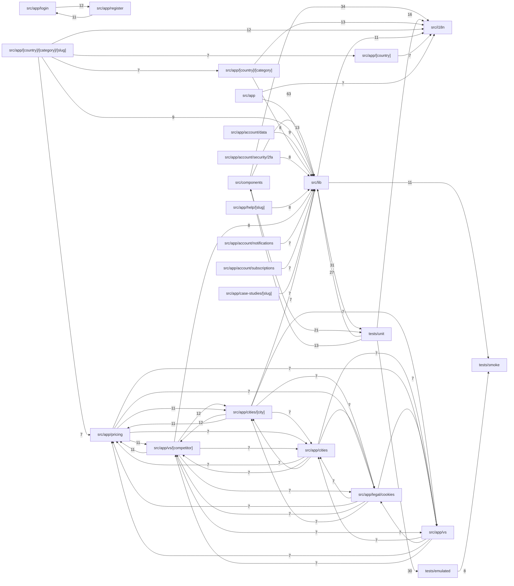

# INDEX_FUNCTIONS — `viralefy_front`

> **Gerado** por `viralefy_ops/lib/index/build-index.mjs` (§39). Não editar à mão:
> corrija o doc-comment na origem e regenere com `/eng-index`.

| Métrica | Valor |
|---|---|
| Arquivos com função indexada | 146 (de 182 varridos) |
| **N — funções declaradas no código** | **587** |
| **M — entradas neste índice** | **587** |
| Invariante `M == N` | ✅ OK |
| Funções sem doc-comment (§3) | 450 (76.7%) |

Colunas: `de onde vem → pra onde vai` é derivada (camada dos chamadores → efeitos detectados);
`chama (out)` / `é chamada por (in)` vêm do grafo resolvido por nome. As listas inline são
limitadas a 10 nomes com sufixo `+N`; a adjacência COMPLETA está na última seção.

## Grafo de chamadas (por módulo)



> Grafo por módulo: 532 arestas inter-módulo no total; 60 desenhadas (as de maior peso). As 472 restantes NÃO foram omitidas do índice — estão na adjacência função a função abaixo.

## Funções


### `e2e/checkout-modal.spec.ts` — camada `test`

| Função | Tipo | O quê | de onde vem → pra onde vai | chama (out) | é chamada por (in) | Efeitos | Linha |
|---|---|---|---|---|---|---|---|
| `installApiMocks` | func | ⚠ SEM DOC | test → interno | request, checkout, headers | fillStepOne | — | 88 |
| `gotoPlanPage` | func | Navega até uma página de PLANO, que é onde vive o `buy-now-cta`. `/us/instagram-followers` é a página de CATEGORIA (`[country]/[category]`): ela lista os planos e linka pra cada um, mas não tem bot… | test → interno | seedCookieConsent | fillStepOne | — | 145 |
| `confirmReview` | func | Avança o passo "Review" (2 de 5), que fica entre o formulário e a lista de métodos de pagamento. | ui+test → interno | confirmReview | confirmReview, fillStepOne | — | 164 |
| `openCheckoutModal` | func | Abre o modal a partir do CTA principal da página de plano. | test → retorno | — | fillStepOne | — | 171 |
| `fillStepOne` | func | Preenche os campos mínimos do step 1 (visitante anônimo, plano de profile). | — → interno | installApiMocks, gotoPlanPage, confirmReview, confirmReview, openCheckoutModal | — | — | 182 |

### `e2e/helpers/consent.ts` — camada `test`

| Função | Tipo | O quê | de onde vem → pra onde vai | chama (out) | é chamada por (in) | Efeitos | Linha |
|---|---|---|---|---|---|---|---|
| `seedCookieConsent` | func | Pré-semeia o consentimento de cookies pra o banner LGPD não aparecer. | test → interno | setItem | gotoPlanPage | — | 24 |

### `instrumentation.ts` — camada `interface`

| Função | Tipo | O quê | de onde vem → pra onde vai | chama (out) | é chamada por (in) | Efeitos | Linha |
|---|---|---|---|---|---|---|---|
| `register` | func | Hook do Next.js — chamado uma vez por runtime (node + edge) na inicialização. | externo (borda) → retorno | — | — | — | 4 |

### `next.config.ts` — camada `outro`

| Função | Tipo | O quê | de onde vem → pra onde vai | chama (out) | é chamada por (in) | Efeitos | Linha |
|---|---|---|---|---|---|---|---|
| `headers` | method | ⚠ SEM DOC | test+interface+ui → retorno | — | installApiMocks, resolveLang, RootLayout, NotFound, resolveLang, resolveLang, ogLocale, resolveLang, getNonce, middleware +2 | — | 29 |
| `redirects` | method | ⚠ SEM DOC | — → retorno | — | — | — | 58 |

### `scripts/indexnow.mjs` — camada `ops`

| Função | Tipo | O quê | de onde vem → pra onde vai | chama (out) | é chamada por (in) | Efeitos | Linha |
|---|---|---|---|---|---|---|---|
| `main` | func | ⚠ SEM DOC | — → http-out+log | fetch | — | http-out, log | 13 |

### `sentry.server.config.ts` — camada `outro`

| Função | Tipo | O quê | de onde vem → pra onde vai | chama (out) | é chamada por (in) | Efeitos | Linha |
|---|---|---|---|---|---|---|---|
| `beforeSend` | method | ⚠ SEM DOC | — → retorno | — | — | — | 15 |

### `src/app/[country]/[category]/[slug]/page.tsx` — camada `interface`

| Função | Tipo | O quê | de onde vem → pra onde vai | chama (out) | é chamada por (in) | Efeitos | Linha |
|---|---|---|---|---|---|---|---|
| `siteUrl` | func | ⚠ SEM DOC | interface+ui → interno | siteUrl, siteUrl, siteUrl, siteUrl, siteUrl, siteUrl, siteUrl, siteUrl, siteUrl, siteUrl +7 | CityPage, siteUrl, generateMetadata, CitiesHub, siteUrl, generateMetadata, HelpTopicPage, siteUrl, generateMetadata, HelpHub +39 | — | 37 |
| `getPlans` | func | ⚠ SEM DOC | interface → http-out | getPlans, getPlans, getPlans, getPlans, getPlans, fetch | getPlans, generateMetadata, GET, getPlans, HomePage, getPlans, PricingPage, PlanPage, getPlans, CategoryPage +2 | http-out | 41 |
| `getReviews` | func | Server-side reviews fetch. | interface → http-out | fetch | PlanPage | http-out | 55 |
| `qtyFromSlug` | func | Extrai a qty do slug (`1000-seguidores` → 1000). | interface → interno | qtyFromSlug | generateMetadata, qtyFromSlug, GET, PlanPage | — | 69 |
| `generateMetadata` | func | ⚠ SEM DOC | interface → interno | siteUrl, generateMetadata, siteUrl, generateMetadata, siteUrl, siteUrl, generateMetadata, siteUrl, generateMetadata, getPlans +37 | generateMetadata, generateMetadata, generateMetadata, generateMetadata, generateMetadata, generateMetadata, generateMetadata, generateMetadata, generateMetadata, generateMetadata +4 | — | 74 |
| `planNarrative` | func | Bloco descritivo do pacote por idioma — interpola qty, categoria, país. | interface → interno | describeSize, describeSizePt, describeSizeEs, windowFor, windowForPt | PlanPage | — | 143 |
| `describeSize` | func | ⚠ SEM DOC | interface → retorno | — | planNarrative | — | 169 |
| `describeSizePt` | func | ⚠ SEM DOC | interface → retorno | — | planNarrative | — | 176 |
| `describeSizeEs` | func | ⚠ SEM DOC | interface → retorno | — | planNarrative | — | 183 |
| `windowFor` | func | ⚠ SEM DOC | interface → retorno | — | planNarrative | — | 190 |
| `windowForPt` | func | ⚠ SEM DOC | interface → retorno | — | planNarrative | — | 195 |
| `PlanPage` | func | ⚠ SEM DOC | externo (borda) → evento | siteUrl, siteUrl, siteUrl, siteUrl, siteUrl, getPlans, siteUrl, getReviews, qtyFromSlug, getPlans +30 | — | evento | 201 |
| `ReviewStars` | func | ReviewStars renderiza o badge agregado abaixo do H1: ★★★★★ 4.7 (12 reviews) Server-component puro, sem JS no cliente. | externo (borda) → retorno | — | — | — | 372 |
| `ReviewsSection` | func | ReviewsSection — social proof na página do plano. | externo (borda) → retorno | — | — | — | 403 |
| `ReviewCard` | func | ⚠ SEM DOC | externo (borda) → retorno | — | — | — | 429 |

### `src/app/[country]/[category]/page.tsx` — camada `interface`

| Função | Tipo | O quê | de onde vem → pra onde vai | chama (out) | é chamada por (in) | Efeitos | Linha |
|---|---|---|---|---|---|---|---|
| `siteUrl` | func | ⚠ SEM DOC | interface+ui → interno | siteUrl, siteUrl, siteUrl, siteUrl, siteUrl, siteUrl, siteUrl, siteUrl, siteUrl, siteUrl +7 | CityPage, siteUrl, generateMetadata, CitiesHub, siteUrl, generateMetadata, HelpTopicPage, siteUrl, siteUrl, generateMetadata +39 | — | 45 |
| `generateMetadata` | func | ⚠ SEM DOC | interface → interno | siteUrl, generateMetadata, siteUrl, generateMetadata, siteUrl, siteUrl, generateMetadata, siteUrl, generateMetadata, siteUrl +29 | generateMetadata, generateMetadata, generateMetadata, generateMetadata, generateMetadata, generateMetadata, generateMetadata, generateMetadata, generateMetadata, generateMetadata +4 | — | 49 |
| `getPlans` | func | ⚠ SEM DOC | interface → http-out | getPlans, getPlans, getPlans, getPlans, getPlans, fetch | getPlans, getPlans, generateMetadata, GET, getPlans, HomePage, getPlans, PricingPage, PlanPage, CategoryPage +2 | http-out | 86 |
| `CategoryPage` | func | ⚠ SEM DOC | externo (borda) → interno | siteUrl, siteUrl, siteUrl, siteUrl, siteUrl, getPlans, siteUrl, getPlans, siteUrl, getPlans +26 | — | — | 97 |

### `src/app/[country]/page.tsx` — camada `interface`

| Função | Tipo | O quê | de onde vem → pra onde vai | chama (out) | é chamada por (in) | Efeitos | Linha |
|---|---|---|---|---|---|---|---|
| `generateStaticParams` | func | ⚠ SEM DOC | interface → interno | generateStaticParams, generateStaticParams, generateStaticParams, generateStaticParams | generateStaticParams, generateStaticParams, siteUrl, generateStaticParams, generateStaticParams | — | 25 |
| `siteUrl` | func | ⚠ SEM DOC | interface+ui → interno | siteUrl, siteUrl, siteUrl, siteUrl, siteUrl, siteUrl, siteUrl, siteUrl, siteUrl, siteUrl +7 | CityPage, siteUrl, generateMetadata, CitiesHub, siteUrl, generateMetadata, HelpTopicPage, siteUrl, siteUrl, generateMetadata +39 | — | 31 |
| `generateMetadata` | func | ⚠ SEM DOC | interface → interno | siteUrl, generateMetadata, siteUrl, generateMetadata, siteUrl, siteUrl, generateMetadata, siteUrl, generateMetadata, siteUrl +25 | generateMetadata, generateMetadata, generateMetadata, generateMetadata, generateMetadata, generateMetadata, generateMetadata, generateMetadata, generateMetadata, generateMetadata +4 | — | 35 |
| `getPlans` | func | ⚠ SEM DOC | interface → http-out | getPlans, getPlans, getPlans, getPlans, getPlans, fetch | getPlans, getPlans, generateMetadata, GET, getPlans, HomePage, getPlans, PricingPage, PlanPage, getPlans +2 | http-out | 74 |
| `CountryPage` | func | ⚠ SEM DOC | externo (borda) → interno | siteUrl, siteUrl, siteUrl, siteUrl, siteUrl, getPlans, siteUrl, getPlans, siteUrl, getPlans +24 | — | — | 85 |

### `src/app/account/api-keys/page.tsx` — camada `interface`

| Função | Tipo | O quê | de onde vem → pra onde vai | chama (out) | é chamada por (in) | Efeitos | Linha |
|---|---|---|---|---|---|---|---|
| `formatDate` | func | Página "Developer API" — gerenciamento de credenciais B2B. | interface → interno | formatDate | closeModal, formatDate, handleCancel | — | 18 |
| `APIKeysPage` | func | ⚠ SEM DOC | externo (borda) → retorno | — | — | — | 27 |
| `load` | func | ⚠ SEM DOC | interface+test → interno | load, fetchMyAPIKeys, getToken, load, load, load | load, onReply, handleCreate, handleRevoke, load, onRecharge, load, load, onAdd, onDelete | — | 38 |
| `handleCreate` | func | ⚠ SEM DOC | externo (borda) → interno | load, load, createMyAPIKey, getToken, load, load, load | — | — | 57 |
| `handleRevoke` | func | ⚠ SEM DOC | interface → interno | load, load, revokeMyAPIKey, getToken, load, load, load | closeModal | — | 79 |
| `copyPlain` | func | ⚠ SEM DOC | externo (borda) → retorno | — | — | — | 97 |
| `closeModal` | func | ⚠ SEM DOC | externo (borda) → interno | formatDate, handleRevoke, formatDate | — | — | 108 |

### `src/app/account/credits/page.tsx` — camada `interface`

| Função | Tipo | O quê | de onde vem → pra onde vai | chama (out) | é chamada por (in) | Efeitos | Linha |
|---|---|---|---|---|---|---|---|
| `CreditsPage` | func | ⚠ SEM DOC | externo (borda) → interno | useApp | — | — | 25 |
| `load` | func | ⚠ SEM DOC | interface+test → interno | load, fetchCredits, fetchTransactions, load, getToken, load, load | load, onReply, load, handleCreate, handleRevoke, onRecharge, load, load, onAdd, onDelete | — | 35 |
| `onRecharge` | func | amountUsd é sempre em dólares (USD). | externo (borda) → interno | load, load, getToken, formatBalance, formatPresetUsd, load, load, load | — | — | 57 |
| `CustomAmount` | func | ⚠ SEM DOC | externo (borda) → interno | onSubmit, onSubmit, onSubmit, onSubmit, onSubmit, onSubmit | — | — | 210 |

### `src/app/account/data/page.tsx` — camada `interface`

| Função | Tipo | O quê | de onde vem → pra onde vai | chama (out) | é chamada por (in) | Efeitos | Linha |
|---|---|---|---|---|---|---|---|
| `DataPage` | func | Manage my data (LGPD/GDPR — Fase 5.2). | externo (borda) → interno | exportMyData, getToken | — | — | 27 |
| `onExport` | func | ⚠ SEM DOC | externo (borda) → interno | exportMyData, getToken | — | — | 54 |
| `onRequestDeletion` | func | ⚠ SEM DOC | externo (borda) → interno | exportMyData, getToken | — | — | 83 |
| `onCancelDeletion` | func | ⚠ SEM DOC | externo (borda) → interno | exportMyData, cancelDeletion, getToken | — | — | 104 |

### `src/app/account/layout.tsx` — camada `interface`

| Função | Tipo | O quê | de onde vem → pra onde vai | chama (out) | é chamada por (in) | Efeitos | Linha |
|---|---|---|---|---|---|---|---|
| `AccountLayout` | func | ⚠ SEM DOC | externo (borda) → retorno | — | — | — | 11 |

### `src/app/account/notifications/page.tsx` — camada `interface`

| Função | Tipo | O quê | de onde vem → pra onde vai | chama (out) | é chamada por (in) | Efeitos | Linha |
|---|---|---|---|---|---|---|---|
| `NotificationsPage` | func | ⚠ SEM DOC | externo (borda) → interno | fetchNotifPrefs, fetchWhatsAppPref, getToken | — | — | 49 |
| `toggle` | func | ⚠ SEM DOC | interface → retorno | — | saveWhatsApp | — | 82 |
| `save` | func | ⚠ SEM DOC | ui → interno | save, updateNotifPrefs, getToken | save | — | 87 |
| `saveWhatsApp` | func | ⚠ SEM DOC | externo (borda) → interno | updateWhatsApp, getToken, toggle | — | — | 108 |

### `src/app/account/orders/[id]/page.tsx` — camada `interface`

| Função | Tipo | O quê | de onde vem → pra onde vai | chama (out) | é chamada por (in) | Efeitos | Linha |
|---|---|---|---|---|---|---|---|
| `buildTimeline` | func | ⚠ SEM DOC | interface → retorno | — | OrderDetailPage | — | 37 |
| `OrderDetailPage` | func | ⚠ SEM DOC | externo (borda) → interno | fetchMyOrder, getToken, buildTimeline | — | — | 49 |

### `src/app/account/orders/page.tsx` — camada `interface`

| Função | Tipo | O quê | de onde vem → pra onde vai | chama (out) | é chamada por (in) | Efeitos | Linha |
|---|---|---|---|---|---|---|---|
| `AccountOrdersIndex` | func | /account/orders → redireciona pra /account onde a lista de orders já vive. | externo (borda) → retorno | — | — | — | 8 |

### `src/app/account/page.tsx` — camada `interface`

| Função | Tipo | O quê | de onde vem → pra onde vai | chama (out) | é chamada por (in) | Efeitos | Linha |
|---|---|---|---|---|---|---|---|
| `AccountPage` | func | ⚠ SEM DOC | externo (borda) → interno | useApp, fetchMyOrders, getToken | — | — | 20 |

### `src/app/account/profiles/page.tsx` — camada `interface`

| Função | Tipo | O quê | de onde vem → pra onde vai | chama (out) | é chamada por (in) | Efeitos | Linha |
|---|---|---|---|---|---|---|---|
| `ProfilesPage` | func | ⚠ SEM DOC | externo (borda) → retorno | — | — | — | 16 |
| `load` | func | ⚠ SEM DOC | interface+test → interno | load, fetchMyProfiles, load, getToken, load, load | load, onReply, load, handleCreate, handleRevoke, load, onRecharge, load, onAdd, onDelete | — | 23 |
| `onAdd` | func | ⚠ SEM DOC | externo (borda) → interno | reset, load, load, getToken, load, get, load, get, load | — | — | 43 |
| `onDelete` | func | ⚠ SEM DOC | interface → interno | load, deleteProfile, load, getToken, load, load, load | byPlatform | — | 65 |
| `byPlatform` | arrow | ⚠ SEM DOC | externo (borda) → interno | onDelete | — | — | 77 |

### `src/app/account/referral/page.tsx` — camada `interface`

| Função | Tipo | O quê | de onde vem → pra onde vai | chama (out) | é chamada por (in) | Efeitos | Linha |
|---|---|---|---|---|---|---|---|
| `ReferralPage` | func | Página "Refer & earn" — exibe código próprio + share links + métricas. | externo (borda) → interno | useApp, fetchMyReferral, getToken | — | — | 16 |
| `copyLink` | func | ⚠ SEM DOC | externo (borda) → interno | formatBalance | — | — | 50 |

### `src/app/account/security/2fa/page.tsx` — camada `interface`

| Função | Tipo | O quê | de onde vem → pra onde vai | chama (out) | é chamada por (in) | Efeitos | Linha |
|---|---|---|---|---|---|---|---|
| `UserSecurity2FAPage` | func | Página de security 2FA pra usuário. | externo (borda) → interno | fetchTwoFAStatus, getToken | — | — | 23 |
| `startEnroll` | func | ⚠ SEM DOC | externo (borda) → interno | enrollUserTwoFA, getToken | — | — | 41 |
| `onDisable` | func | ⚠ SEM DOC | externo (borda) → interno | disableUserTwoFA, getToken | — | — | 56 |
| `EnrollWizard` | func | ⚠ SEM DOC | externo (borda) → retorno | — | — | — | 114 |
| `downloadBackupCodes` | func | ⚠ SEM DOC | externo (borda) → retorno | — | — | — | 120 |
| `onSubmit` | func | ⚠ SEM DOC | interface+ui → interno | onSubmit, onSubmit, onSubmit, onSubmit, onSubmit, verifyUserTwoFA, getToken | onSubmit, onSubmit, onSubmit, onSubmit, onSubmit, CustomAmount | — | 132 |

### `src/app/account/subscriptions/page.tsx` — camada `interface`

| Função | Tipo | O quê | de onde vem → pra onde vai | chama (out) | é chamada por (in) | Efeitos | Linha |
|---|---|---|---|---|---|---|---|
| `statusColor` | func | /account/subscriptions — painel de assinaturas mensais recorrentes do usuário logado (Fase 6.3). | interface → retorno | — | handleCancel | — | 15 |
| `formatDate` | func | ⚠ SEM DOC | interface → interno | formatDate | formatDate, closeModal, handleCancel | — | 28 |
| `SubscriptionsPage` | func | ⚠ SEM DOC | externo (borda) → interno | fetchPlans, fetchMySubscriptions, getToken, fetchPlans | — | — | 40 |
| `handleCancel` | func | ⚠ SEM DOC | externo (borda) → interno | formatDate, fetchMySubscriptions, cancelSubscription, getToken, get, get, statusColor, formatDate | — | — | 69 |

### `src/app/api/geo/route.ts` — camada `interface`

| Função | Tipo | O quê | de onde vem → pra onde vai | chama (out) | é chamada por (in) | Efeitos | Linha |
|---|---|---|---|---|---|---|---|
| `GET` | func | ⚠ SEM DOC | interface → interno | GET, GET, currencyForCountry, countryFromAcceptLanguage, get, get, GET, GET, GET | GET, GET, GET, GET, GET | — | 17 |

### `src/app/api/indexnow/route.ts` — camada `interface`

| Função | Tipo | O quê | de onde vem → pra onde vai | chama (out) | é chamada por (in) | Efeitos | Linha |
|---|---|---|---|---|---|---|---|
| `POST` | func | ⚠ SEM DOC | externo (borda) → interno | submitToIndexNow, envIndexNow, keyLocation, allSiteUrls, get, get | — | — | 19 |
| `GET` | func | ⚠ SEM DOC | interface → interno | GET, GET, keyLocation, allSiteUrls, GET, GET, GET | GET, GET, GET, GET, GET | — | 57 |

### `src/app/api/metrics/route.ts` — camada `interface`

| Função | Tipo | O quê | de onde vem → pra onde vai | chama (out) | é chamada por (in) | Efeitos | Linha |
|---|---|---|---|---|---|---|---|
| `escapeLabel` | func | ⚠ SEM DOC | interface → retorno | — | metricLine | — | 24 |
| `metricLine` | func | ⚠ SEM DOC | interface → interno | escapeLabel | GET | — | 28 |
| `GET` | func | ⚠ SEM DOC | interface → interno | GET, GET, GET, GET, metricLine, GET | GET, GET, GET, GET, GET | — | 35 |

### `src/app/api/orders-today/route.ts` — camada `interface`

| Função | Tipo | O quê | de onde vem → pra onde vai | chama (out) | é chamada por (in) | Efeitos | Linha |
|---|---|---|---|---|---|---|---|
| `syntheticPayload` | func | Estimativa "realista". | interface → retorno | — | GET | — | 20 |
| `GET` | func | ⚠ SEM DOC | interface → http-out | GET, GET, fetch, GET, GET, GET, syntheticPayload | GET, GET, GET, GET, GET | http-out | 34 |

### `src/app/auth/handoff/page.tsx` — camada `interface`

| Função | Tipo | O quê | de onde vem → pra onde vai | chama (out) | é chamada por (in) | Efeitos | Linha |
|---|---|---|---|---|---|---|---|
| `HandoffPage` | func | ⚠ SEM DOC | externo (borda) → retorno | — | — | — | 20 |
| `Handoff` | func | ⚠ SEM DOC | externo (borda) → interno | get, setItem, get | — | — | 28 |

### `src/app/case-studies/[slug]/page.tsx` — camada `interface`

| Função | Tipo | O quê | de onde vem → pra onde vai | chama (out) | é chamada por (in) | Efeitos | Linha |
|---|---|---|---|---|---|---|---|
| `smartTrim` | func | BUG-153/165 do QA 2026-06-12: meta description cortada no meio da frase (slice(0, 150)) terminava em "Pay i". | interface → retorno | — | generateMetadata, CaseStudyDetailPage | — | 13 |
| `siteUrl` | func | ⚠ SEM DOC | interface+ui → interno | siteUrl, siteUrl, generateStaticParams, siteUrl, siteUrl, siteUrl, siteUrl, siteUrl, siteUrl, siteUrl +12 | CityPage, siteUrl, generateMetadata, CitiesHub, siteUrl, generateMetadata, HelpTopicPage, siteUrl, siteUrl, generateMetadata +39 | — | 22 |
| `generateStaticParams` | func | ⚠ SEM DOC | interface → interno | generateStaticParams, generateStaticParams, generateStaticParams, generateStaticParams | generateStaticParams, generateStaticParams, generateStaticParams, siteUrl, generateStaticParams | — | 30 |
| `generateMetadata` | func | ⚠ SEM DOC | interface → evento | siteUrl, generateMetadata, siteUrl, generateMetadata, siteUrl, siteUrl, generateMetadata, siteUrl, generateMetadata, siteUrl +25 | generateMetadata, generateMetadata, generateMetadata, generateMetadata, generateMetadata, generateMetadata, generateMetadata, generateMetadata, generateMetadata, generateMetadata +4 | evento | 34 |
| `CaseStudyDetailPage` | func | ⚠ SEM DOC | externo (borda) → evento | siteUrl, siteUrl, siteUrl, siteUrl, siteUrl, siteUrl, siteUrl, siteUrl, siteUrl, siteUrl +11 | — | evento | 72 |

### `src/app/case-studies/page.tsx` — camada `interface`

| Função | Tipo | O quê | de onde vem → pra onde vai | chama (out) | é chamada por (in) | Efeitos | Linha |
|---|---|---|---|---|---|---|---|
| `siteUrl` | func | ⚠ SEM DOC | interface+ui → interno | siteUrl, siteUrl, siteUrl, siteUrl, siteUrl, siteUrl, siteUrl, siteUrl, siteUrl, siteUrl +7 | CityPage, siteUrl, generateMetadata, CitiesHub, siteUrl, generateMetadata, HelpTopicPage, siteUrl, siteUrl, generateMetadata +39 | — | 23 |
| `generateMetadata` | func | ⚠ SEM DOC | interface → interno | siteUrl, generateMetadata, siteUrl, generateMetadata, siteUrl, siteUrl, generateMetadata, siteUrl, generateMetadata, siteUrl +23 | generateMetadata, generateMetadata, generateMetadata, generateMetadata, generateMetadata, generateMetadata, generateMetadata, generateMetadata, generateMetadata, generateMetadata +4 | — | 27 |
| `CaseStudiesHubPage` | func | ⚠ SEM DOC | externo (borda) → interno | siteUrl, siteUrl, siteUrl, siteUrl, siteUrl, siteUrl, siteUrl, siteUrl, siteUrl, siteUrl +9 | — | — | 57 |

### `src/app/cities/[city]/page.tsx` — camada `interface`

| Função | Tipo | O quê | de onde vem → pra onde vai | chama (out) | é chamada por (in) | Efeitos | Linha |
|---|---|---|---|---|---|---|---|
| `resolveLang` | func | ⚠ SEM DOC | interface → interno | resolveLang, resolveLang, resolveLang, resolveLang, resolveLang, get, get, headers | CityPage, resolveLang, generateMetadata, CitiesHub, resolveLang, generateMetadata, CookiesLegalPage, resolveLang, generateMetadata, PricingPage +7 | — | 24 |
| `schemaLang` | func | ⚠ SEM DOC | interface → interno | schemaLang, schemaLang | CityPage, schemaLang, PricingPage, schemaLang, VsCompetitorPage | — | 55 |
| `ogLocale` | func | ⚠ SEM DOC | interface → interno | ogLocale, ogLocale | ogLocale, generateMetadata, ogLocale, generateMetadata, generateMetadata | — | 85 |
| `siteUrl` | func | Programmatic SEO city LP. 50 rotas estáticas; cada uma fala da cidade com bairros/landmarks reais antes de redirecionar pro funnel do país. | interface+ui → interno | siteUrl, siteUrl, siteUrl, siteUrl, siteUrl, siteUrl, siteUrl, siteUrl, siteUrl, siteUrl +8 | CityPage, siteUrl, generateMetadata, CitiesHub, siteUrl, generateMetadata, HelpTopicPage, siteUrl, siteUrl, generateMetadata +39 | — | 1059 |
| `generateStaticParams` | func | ⚠ SEM DOC | interface → interno | generateStaticParams, generateStaticParams, generateStaticParams, generateStaticParams | generateStaticParams, generateStaticParams, generateStaticParams, siteUrl, generateStaticParams | — | 1123 |
| `generateMetadata` | func | ⚠ SEM DOC | interface → interno | resolveLang, siteUrl, generateMetadata, siteUrl, generateMetadata, siteUrl, siteUrl, generateMetadata, siteUrl, generateMetadata +33 | generateMetadata, generateMetadata, generateMetadata, generateMetadata, generateMetadata, generateMetadata, generateMetadata, generateMetadata, generateMetadata, generateMetadata +4 | — | 1127 |
| `neighborhoodsText` | func | "central <city>" fallback varia por idioma — quando uma cidade não tem LOCAL_FLAVOR específica, queremos uma frase idiomática em cada língua (BUG city-fallback: antes só dizia "central <city>" e fi… | interface → retorno | — | CityPage | — | 1191 |
| `CityPage` | func | ⚠ SEM DOC | externo (borda) → interno | neighborhoodsText, resolveLang, siteUrl, siteUrl, siteUrl, siteUrl, siteUrl, siteUrl, resolveLang, siteUrl +21 | — | — | 1267 |

### `src/app/cities/page.tsx` — camada `interface`

| Função | Tipo | O quê | de onde vem → pra onde vai | chama (out) | é chamada por (in) | Efeitos | Linha |
|---|---|---|---|---|---|---|---|
| `resolveLang` | func | ⚠ SEM DOC | interface → interno | resolveLang, resolveLang, resolveLang, resolveLang, get, get, headers, resolveLang | CityPage, generateMetadata, CitiesHub, resolveLang, generateMetadata, CookiesLegalPage, resolveLang, generateMetadata, PricingPage, resolveLang +7 | — | 25 |
| `siteUrl` | func | ⚠ SEM DOC | interface+ui → interno | siteUrl, siteUrl, siteUrl, siteUrl, siteUrl, siteUrl, siteUrl, siteUrl, siteUrl, siteUrl +7 | CityPage, generateMetadata, CitiesHub, siteUrl, generateMetadata, HelpTopicPage, siteUrl, siteUrl, generateMetadata, HelpHub +39 | — | 33 |
| `generateMetadata` | func | ⚠ SEM DOC | interface → interno | resolveLang, siteUrl, siteUrl, generateMetadata, siteUrl, siteUrl, generateMetadata, siteUrl, generateMetadata, siteUrl +29 | generateMetadata, generateMetadata, generateMetadata, generateMetadata, generateMetadata, generateMetadata, generateMetadata, generateMetadata, generateMetadata, generateMetadata +4 | — | 100 |
| `CitiesHub` | func | ⚠ SEM DOC | externo (borda) → interno | resolveLang, siteUrl, siteUrl, siteUrl, siteUrl, siteUrl, siteUrl, resolveLang, siteUrl, siteUrl +16 | — | — | 126 |

### `src/app/help/[slug]/page.tsx` — camada `interface`

| Função | Tipo | O quê | de onde vem → pra onde vai | chama (out) | é chamada por (in) | Efeitos | Linha |
|---|---|---|---|---|---|---|---|
| `siteUrl` | func | ⚠ SEM DOC | interface+ui → interno | siteUrl, siteUrl, siteUrl, siteUrl, siteUrl, siteUrl, siteUrl, siteUrl, siteUrl, siteUrl +7 | CityPage, siteUrl, generateMetadata, CitiesHub, generateMetadata, HelpTopicPage, siteUrl, siteUrl, generateMetadata, HelpHub +39 | — | 14 |
| `generateStaticParams` | func | ⚠ SEM DOC | interface → interno | generateStaticParams, generateStaticParams, helpAllSlugs, generateStaticParams, generateStaticParams | generateStaticParams, generateStaticParams, siteUrl, generateStaticParams, generateStaticParams | — | 21 |
| `generateMetadata` | func | ⚠ SEM DOC | interface → interno | siteUrl, generateMetadata, siteUrl, siteUrl, siteUrl, generateMetadata, siteUrl, generateMetadata, siteUrl, generateMetadata +24 | generateMetadata, generateMetadata, generateMetadata, generateMetadata, generateMetadata, generateMetadata, generateMetadata, generateMetadata, generateMetadata, generateMetadata +4 | — | 25 |
| `HelpTopicPage` | func | ⚠ SEM DOC | externo (borda) → evento | siteUrl, siteUrl, siteUrl, siteUrl, siteUrl, siteUrl, siteUrl, siteUrl, siteUrl, siteUrl +10 | — | evento | 53 |

### `src/app/help/page.tsx` — camada `interface`

| Função | Tipo | O quê | de onde vem → pra onde vai | chama (out) | é chamada por (in) | Efeitos | Linha |
|---|---|---|---|---|---|---|---|
| `siteUrl` | func | ⚠ SEM DOC | interface+ui → interno | siteUrl, siteUrl, siteUrl, siteUrl, siteUrl, siteUrl, siteUrl, siteUrl, siteUrl, siteUrl +7 | CityPage, siteUrl, generateMetadata, CitiesHub, siteUrl, generateMetadata, HelpTopicPage, siteUrl, generateMetadata, HelpHub +39 | — | 16 |
| `generateMetadata` | func | ⚠ SEM DOC | interface → interno | siteUrl, generateMetadata, siteUrl, generateMetadata, siteUrl, siteUrl, siteUrl, generateMetadata, siteUrl, generateMetadata +23 | generateMetadata, generateMetadata, generateMetadata, generateMetadata, generateMetadata, generateMetadata, generateMetadata, generateMetadata, generateMetadata, generateMetadata +4 | — | 20 |
| `HelpHub` | func | ⚠ SEM DOC | externo (borda) → interno | siteUrl, siteUrl, siteUrl, siteUrl, siteUrl, siteUrl, siteUrl, siteUrl, siteUrl, siteUrl +10 | — | — | 46 |

### `src/app/layout.tsx` — camada `interface`

| Função | Tipo | O quê | de onde vem → pra onde vai | chama (out) | é chamada por (in) | Efeitos | Linha |
|---|---|---|---|---|---|---|---|
| `readThemeCookie` | func | Lê o cookie de tema no server e devolve preferência + tema efetivo. `data-theme` recebe o tema efetivo (dark/light) pro CSS aplicar; `data-theme-pref` carrega a preferência crua (inclui `system`) p… | interface → retorno | — | RootLayout | — | 130 |
| `RootLayout` | func | JSON-LD Organization/WebSite NÃO vai no root layout: home e country pages já emitem o bloco completo via buildHomeJsonLd/buildCountryJsonLd. | externo (borda) → interno | readThemeCookie, getNonce, middleware, get, get, headers | — | — | 144 |

### `src/app/legal/[doc]/page.tsx` — camada `interface`

| Função | Tipo | O quê | de onde vem → pra onde vai | chama (out) | é chamada por (in) | Efeitos | Linha |
|---|---|---|---|---|---|---|---|
| `siteUrl` | func | ⚠ SEM DOC | interface+ui → interno | siteUrl, siteUrl, siteUrl, siteUrl, siteUrl, siteUrl, siteUrl, siteUrl, siteUrl, siteUrl +7 | CityPage, siteUrl, generateMetadata, CitiesHub, siteUrl, generateMetadata, HelpTopicPage, siteUrl, siteUrl, generateMetadata +39 | — | 17 |
| `isSlug` | func | ⚠ SEM DOC | interface → retorno | — | generateMetadata, LegalPage | — | 21 |
| `otherLanguagesLabel` | func | ⚠ SEM DOC | interface → interno | otherLanguagesLabel | LegalPage, otherLanguagesLabel, CookiesLegalPage | — | 25 |
| `generateMetadata` | func | ⚠ SEM DOC | interface → interno | generateMetadata, generateMetadata, generateMetadata, isSlug, generateMetadata, generateMetadata, generateMetadata, generateMetadata, generateMetadata, generateMetadata +7 | generateMetadata, generateMetadata, generateMetadata, generateMetadata, generateMetadata, generateMetadata, generateMetadata, generateMetadata, generateMetadata, generateMetadata +4 | — | 41 |
| `LegalPage` | func | ⚠ SEM DOC | externo (borda) → interno | isSlug, otherLanguagesLabel, otherLanguagesLabel, tr, tr, legalDoc, renderLegalBody | — | — | 79 |

### `src/app/legal/cookie-preferences/CookiePreferencesClient.tsx` — camada `ui`

| Função | Tipo | O quê | de onde vem → pra onde vai | chama (out) | é chamada por (in) | Efeitos | Linha |
|---|---|---|---|---|---|---|---|
| `detectLang` | func | ⚠ SEM DOC | ui → retorno | — | CookiePreferencesClient | — | 137 |
| `CookiePreferencesClient` | func | ⚠ SEM DOC | — → interno | detectLang, getConsent | — | — | 145 |
| `save` | func | ⚠ SEM DOC | interface → interno | recordConsent, setConsent, save | save | — | 163 |
| `reset` | func | ⚠ SEM DOC | interface → interno | resetConsent | onReply, onAdd | — | 178 |
| `Row` | func | ⚠ SEM DOC | — → retorno | — | — | — | 286 |

### `src/app/legal/cookie-preferences/page.tsx` — camada `interface`

| Função | Tipo | O quê | de onde vem → pra onde vai | chama (out) | é chamada por (in) | Efeitos | Linha |
|---|---|---|---|---|---|---|---|
| `CookiePreferencesPage` | func | ⚠ SEM DOC | externo (borda) → interno | withGlobalGraph | — | — | 26 |

### `src/app/legal/cookies/page.tsx` — camada `interface`

| Função | Tipo | O quê | de onde vem → pra onde vai | chama (out) | é chamada por (in) | Efeitos | Linha |
|---|---|---|---|---|---|---|---|
| `siteUrl` | func | ⚠ SEM DOC | interface+ui → interno | siteUrl, siteUrl, siteUrl, siteUrl, siteUrl, siteUrl, siteUrl, siteUrl, siteUrl, siteUrl +7 | CityPage, siteUrl, generateMetadata, CitiesHub, siteUrl, generateMetadata, HelpTopicPage, siteUrl, siteUrl, generateMetadata +39 | — | 47 |
| `resolveLang` | func | ⚠ SEM DOC | interface → interno | resolveLang, resolveLang, resolveLang, resolveLang, resolveLang | CityPage, resolveLang, generateMetadata, CitiesHub, generateMetadata, CookiesLegalPage, resolveLang, generateMetadata, PricingPage, resolveLang +7 | — | 51 |
| `otherLanguagesLabel` | func | Localiza "Other languages:" — espelha o helper do dynamic [doc]/page.tsx (BUG-30/118 do QA: rótulo ficava em EN mesmo em /legal/cookies?lang=fr). | interface → interno | otherLanguagesLabel, tr, tr | otherLanguagesLabel, LegalPage, CookiesLegalPage | — | 58 |
| `backToHomeLabel` | func | "Voltar ao início" — espelha o tr().cta.backToHome do pack i18n mas evitamos importar tr() inteiro pra manter este arquivo standalone. | interface → retorno | — | CookiesLegalPage | — | 76 |
| `updatedLabel` | func | "Updated" label — mecânico, mesmo padrão. | interface → retorno | — | CookiesLegalPage | — | 93 |
| `generateMetadata` | func | ⚠ SEM DOC | interface → interno | resolveLang, siteUrl, generateMetadata, siteUrl, generateMetadata, siteUrl, siteUrl, generateMetadata, siteUrl, generateMetadata +31 | generateMetadata, generateMetadata, generateMetadata, generateMetadata, generateMetadata, generateMetadata, generateMetadata, generateMetadata, generateMetadata, generateMetadata +4 | — | 109 |
| `CategoryBadge` | func | BUG-142 do QA 2026-06-12: badges da tabela de cookies estavam fixas em EN ("NECESSARY", "PREFERENCES"…) mesmo no documento PT. | externo (borda) → retorno | — | — | — | 274 |
| `CookiesLegalPage` | func | ⚠ SEM DOC | externo (borda) → interno | resolveLang, siteUrl, siteUrl, siteUrl, siteUrl, siteUrl, otherLanguagesLabel, siteUrl, resolveLang, otherLanguagesLabel +22 | — | — | 314 |

### `src/app/login/layout.tsx` — camada `interface`

| Função | Tipo | O quê | de onde vem → pra onde vai | chama (out) | é chamada por (in) | Efeitos | Linha |
|---|---|---|---|---|---|---|---|
| `LoginLayout` | func | ⚠ SEM DOC | externo (borda) → retorno | — | — | — | 13 |

### `src/app/login/page.tsx` — camada `interface`

| Função | Tipo | O quê | de onde vem → pra onde vai | chama (out) | é chamada por (in) | Efeitos | Linha |
|---|---|---|---|---|---|---|---|
| `isAuthHost` | func | ⚠ SEM DOC | interface → interno | isAuthHost | LoginPageInner, completeFlow, isAuthHost, RegisterPageInner, completeFlow | — | 24 |
| `sanitizeReturnTo` | func | ⚠ SEM DOC | interface → interno | sanitizeReturnTo | LoginPageInner, sanitizeReturnTo, RegisterPageInner | — | 30 |
| `buildReturnURL` | func | Serializa a session no fragment (#) pra que o callback no destino consuma sem nunca passar pelo query-string (logs do servidor não veem fragmentos). | interface → interno | buildReturnURL | completeFlow, buildReturnURL, completeFlow | — | 44 |
| `LoginPage` | func | Next.js 15 exige Suspense boundary em volta de useSearchParams pra permitir o prerender estático. | externo (borda) → retorno | — | — | — | 59 |
| `LoginShell` | func | ⚠ SEM DOC | externo (borda) → retorno | — | — | — | 67 |
| `LoginPageInner` | func | ⚠ SEM DOC | externo (borda) → interno | isAuthHost, sanitizeReturnTo, isAuthHost, sanitizeReturnTo, useApp, login, get, get | — | — | 78 |
| `handleTurnstileToken` | func | ⚠ SEM DOC | interface → interno | handleTurnstileToken | handleTurnstileToken | — | 106 |
| `completeFlow` | func | completeFlow decide o pós-login: 1. | interface → interno | isAuthHost, buildReturnURL, isAuthHost, buildReturnURL, completeFlow, login | onSubmit, onSubmitCode, completeFlow, onSubmit | — | 117 |
| `onSubmit` | func | ⚠ SEM DOC | interface+ui → interno | completeFlow, onSubmit, completeFlow, onSubmit, onSubmit, onSubmit, userLogin, get, get, onSubmit | onSubmit, onSubmit, onSubmit, onSubmit, CustomAmount, onSubmit | — | 134 |
| `onSubmitCode` | func | ⚠ SEM DOC | externo (borda) → interno | completeFlow, completeFlow, completeUserLoginTwoFA, get, get | — | — | 182 |

### `src/app/not-found.tsx` — camada `ui`

| Função | Tipo | O quê | de onde vem → pra onde vai | chama (out) | é chamada por (in) | Efeitos | Linha |
|---|---|---|---|---|---|---|---|
| `langFromLocale` | func | Resolve o LangCode a partir do segmento de país detectado pelo middleware (header x-locale = "pt-BR", "ja-JP", "en"...). | ui → interno | tr, tr | NotFound | — | 20 |
| `countryFromPathname` | func | Resolve país atual do pathname pra manter contexto no "Browse all services". | ui → retorno | — | NotFound | — | 29 |
| `NotFound` | func | ⚠ SEM DOC | — → interno | langFromLocale, countryFromPathname, tr, countriesByRegion, tr, get, get, headers | — | — | 34 |

### `src/app/og/[...slug]/route.tsx` — camada `interface`

| Função | Tipo | O quê | de onde vem → pra onde vai | chama (out) | é chamada por (in) | Efeitos | Linha |
|---|---|---|---|---|---|---|---|
| `isOgSafeLang` | func | ⚠ SEM DOC | interface → retorno | — | GET | — | 29 |
| `getPlans` | func | ⚠ SEM DOC | interface → http-out | getPlans, getPlans, getPlans, getPlans, getPlans, fetch | getPlans, generateMetadata, GET, getPlans, HomePage, getPlans, PricingPage, PlanPage, getPlans, CategoryPage +2 | http-out | 38 |
| `fromPriceLabel` | func | Formata o menor preço da lista em USD (a moeda de display global). | interface → retorno | — | GET | — | 50 |
| `exactPriceLabel` | func | Para plano específico, devolve `$X.XX`. | interface → retorno | — | GET | — | 60 |
| `qtyFromSlug` | func | ⚠ SEM DOC | interface → interno | qtyFromSlug | qtyFromSlug, generateMetadata, GET, PlanPage | — | 67 |
| `englishCountryName` | func | Resolve um country code ISO 3166 para o nome em inglês. | interface → retorno | — | GET | — | 80 |
| `GET` | func | ⚠ SEM DOC | interface → interno | getPlans, qtyFromSlug, isOgSafeLang, getPlans, fromPriceLabel, exactPriceLabel, qtyFromSlug, englishCountryName, getPlans, getPlans +11 | GET, GET, GET, GET, GET | — | 89 |

### `src/app/orders/[id]/review/page.tsx` — camada `interface`

| Função | Tipo | O quê | de onde vem → pra onde vai | chama (out) | é chamada por (in) | Efeitos | Linha |
|---|---|---|---|---|---|---|---|
| `StarsRow` | func | ⚠ SEM DOC | externo (borda) → retorno | — | — | — | 11 |
| `ReviewPage` | func | Página de submissão de review pós-entrega. | externo (borda) → interno | fetchMyReviewForOrder, getToken | — | — | 31 |
| `onSubmit` | func | ⚠ SEM DOC | interface+ui → interno | onSubmit, onSubmit, onSubmit, onSubmit, onSubmit | onSubmit, onSubmit, onSubmit, onSubmit, CustomAmount, onSubmit | — | 71 |
| `StarPicker` | func | ⚠ SEM DOC | externo (borda) → interno | onChange | — | — | 192 |

### `src/app/page.tsx` — camada `interface`

| Função | Tipo | O quê | de onde vem → pra onde vai | chama (out) | é chamada por (in) | Efeitos | Linha |
|---|---|---|---|---|---|---|---|
| `siteUrl` | func | ⚠ SEM DOC | interface+ui → interno | siteUrl, siteUrl, siteUrl, siteUrl, siteUrl, siteUrl, siteUrl, siteUrl, siteUrl, siteUrl +8 | CityPage, siteUrl, generateMetadata, CitiesHub, siteUrl, generateMetadata, HelpTopicPage, siteUrl, siteUrl, generateMetadata +39 | — | 31 |
| `getPlans` | func | ⚠ SEM DOC | interface → http-out | getPlans, getPlans, getPlans, getPlans, getPlans, fetch | getPlans, getPlans, generateMetadata, GET, HomePage, getPlans, PricingPage, PlanPage, getPlans, CategoryPage +2 | http-out | 62 |
| `HomePage` | func | ⚠ SEM DOC | externo (borda) → interno | siteUrl, siteUrl, siteUrl, siteUrl, siteUrl, getPlans, siteUrl, getPlans, siteUrl, getPlans +18 | — | — | 73 |

### `src/app/pricing/page.tsx` — camada `interface`

| Função | Tipo | O quê | de onde vem → pra onde vai | chama (out) | é chamada por (in) | Efeitos | Linha |
|---|---|---|---|---|---|---|---|
| `siteUrl` | func | ⚠ SEM DOC | interface+ui → interno | siteUrl, siteUrl, siteUrl, siteUrl, siteUrl, siteUrl, siteUrl, siteUrl, siteUrl, siteUrl +7 | CityPage, siteUrl, generateMetadata, CitiesHub, siteUrl, generateMetadata, HelpTopicPage, siteUrl, siteUrl, generateMetadata +39 | — | 25 |
| `resolveLang` | func | ⚠ SEM DOC | interface → interno | resolveLang, resolveLang, resolveLang, resolveLang, get, get, headers, resolveLang | CityPage, resolveLang, generateMetadata, CitiesHub, resolveLang, generateMetadata, CookiesLegalPage, generateMetadata, PricingPage, resolveLang +7 | — | 35 |
| `ogLocale` | func | ⚠ SEM DOC | interface → interno | ogLocale, ogLocale | generateMetadata, ogLocale, generateMetadata, ogLocale, generateMetadata | — | 746 |
| `schemaLang` | func | ⚠ SEM DOC | interface → interno | schemaLang, schemaLang | CityPage, PricingPage, schemaLang, VsCompetitorPage, schemaLang | — | 777 |
| `generateMetadata` | func | ⚠ SEM DOC | interface → interno | resolveLang, siteUrl, generateMetadata, siteUrl, generateMetadata, siteUrl, siteUrl, generateMetadata, siteUrl, generateMetadata +32 | generateMetadata, generateMetadata, generateMetadata, generateMetadata, generateMetadata, generateMetadata, generateMetadata, generateMetadata, generateMetadata, generateMetadata +4 | — | 808 |
| `getPlans` | func | ⚠ SEM DOC | interface → http-out | getPlans, getPlans, getPlans, getPlans, getPlans, fetch | getPlans, getPlans, generateMetadata, GET, getPlans, HomePage, PricingPage, PlanPage, getPlans, CategoryPage +2 | http-out | 882 |
| `priceUSD` | func | ⚠ SEM DOC | interface → retorno | — | PricingTable, PricingPage | — | 893 |
| `findPlan` | func | ⚠ SEM DOC | interface → retorno | — | PricingTable, PricingPage | — | 897 |
| `fmtQty` | func | ⚠ SEM DOC | interface → retorno | — | PricingTable | — | 910 |
| `PricingTable` | func | ⚠ SEM DOC | externo (borda) → interno | priceUSD, findPlan, fmtQty | — | — | 915 |
| `uspsFor` | func | ⚠ SEM DOC | interface → retorno | — | PricingPage | — | 976 |
| `PricingPage` | func | ⚠ SEM DOC | externo (borda) → interno | resolveLang, siteUrl, siteUrl, siteUrl, siteUrl, siteUrl, getPlans, siteUrl, resolveLang, getPlans +27 | — | — | 985 |

### `src/app/register/layout.tsx` — camada `interface`

| Função | Tipo | O quê | de onde vem → pra onde vai | chama (out) | é chamada por (in) | Efeitos | Linha |
|---|---|---|---|---|---|---|---|
| `RegisterLayout` | func | ⚠ SEM DOC | externo (borda) → retorno | — | — | — | 11 |

### `src/app/register/page.tsx` — camada `interface`

| Função | Tipo | O quê | de onde vem → pra onde vai | chama (out) | é chamada por (in) | Efeitos | Linha |
|---|---|---|---|---|---|---|---|
| `isAuthHost` | func | ⚠ SEM DOC | interface → interno | isAuthHost | isAuthHost, LoginPageInner, completeFlow, RegisterPageInner, completeFlow | — | 22 |
| `sanitizeReturnTo` | func | ⚠ SEM DOC | interface → interno | sanitizeReturnTo | sanitizeReturnTo, LoginPageInner, RegisterPageInner | — | 28 |
| `buildReturnURL` | func | ⚠ SEM DOC | interface → interno | buildReturnURL | buildReturnURL, completeFlow, completeFlow | — | 40 |
| `RegisterPage` | func | ⚠ SEM DOC | externo (borda) → retorno | — | — | — | 52 |
| `RegisterShell` | func | ⚠ SEM DOC | externo (borda) → retorno | — | — | — | 60 |
| `RegisterPageInner` | func | ⚠ SEM DOC | externo (borda) → interno | isAuthHost, sanitizeReturnTo, isAuthHost, sanitizeReturnTo, useApp, get, getItem, get | — | — | 71 |
| `handleTurnstileToken` | func | ⚠ SEM DOC | interface → interno | handleTurnstileToken | handleTurnstileToken | — | 136 |
| `completeFlow` | func | ⚠ SEM DOC | interface → interno | isAuthHost, buildReturnURL, completeFlow, isAuthHost, buildReturnURL, login | completeFlow, onSubmit, onSubmitCode, onSubmit | — | 141 |
| `onSubmit` | func | ⚠ SEM DOC | interface+ui → interno | completeFlow, onSubmit, onSubmit, completeFlow, onSubmit, onSubmit, getTracking, get, get, onSubmit | onSubmit, onSubmit, onSubmit, onSubmit, CustomAmount, onSubmit | — | 156 |

### `src/app/robots.ts` — camada `ui`

| Função | Tipo | O quê | de onde vem → pra onde vai | chama (out) | é chamada por (in) | Efeitos | Linha |
|---|---|---|---|---|---|---|---|
| `robots` | func | robots.txt — abre tudo pra crawlers honestos, indica o sitemap canônico. | — → retorno | — | — | — | 11 |

### `src/app/sitemap.ts` — camada `ui`

| Função | Tipo | O quê | de onde vem → pra onde vai | chama (out) | é chamada por (in) | Efeitos | Linha |
|---|---|---|---|---|---|---|---|
| `siteBase` | func | ⚠ SEM DOC | ui → retorno | — | alternatesFor | — | 13 |
| `alternatesFor` | func | Computa `alternates.languages` (mapa hreflang) pra cada URL canônica que existe em múltiplos idiomas. | ui → interno | siteBase, getCountry | sitemap | — | 21 |
| `baseLanguages` | arrow | ⚠ SEM DOC | — → interno | categoryFromSlug, countryRootAlternates, categoryAlternates, slugAlternates | — | — | 29 |
| `generateSitemaps` | func | ⚠ SEM DOC | — → interno | allSiteUrls, paginatedBuckets | — | — | 72 |
| `sitemap` | func | ⚠ SEM DOC | ui → interno | alternatesFor, allSiteUrls, parseSitemapBucketID, urlsForBucket | urlsForLang | — | 77 |

### `src/app/sitemap.xml/route.ts` — camada `interface`

| Função | Tipo | O quê | de onde vem → pra onde vai | chama (out) | é chamada por (in) | Efeitos | Linha |
|---|---|---|---|---|---|---|---|
| `siteUrl` | func | ⚠ SEM DOC | interface+ui → interno | siteUrl, siteUrl, siteUrl, siteUrl, siteUrl, siteUrl, siteUrl, siteUrl, siteUrl, siteUrl +7 | CityPage, siteUrl, generateMetadata, CitiesHub, siteUrl, generateMetadata, HelpTopicPage, siteUrl, siteUrl, generateMetadata +39 | — | 15 |
| `xmlEscape` | func | ⚠ SEM DOC | interface+test → interno | xmlEscape | GET, xmlEscape, buildSitemapIndexXml | — | 19 |
| `GET` | func | ⚠ SEM DOC | interface → interno | siteUrl, siteUrl, siteUrl, siteUrl, siteUrl, siteUrl, GET, siteUrl, siteUrl, siteUrl +17 | GET, GET, GET, GET, GET | — | 23 |

### `src/app/sso/callback/page.tsx` — camada `interface`

| Função | Tipo | O quê | de onde vem → pra onde vai | chama (out) | é chamada por (in) | Efeitos | Linha |
|---|---|---|---|---|---|---|---|
| `SSOCallbackPage` | func | /sso/callback — landing OAuth-style do login unificado. | externo (borda) → interno | authUrl, useApp, login, get, get | — | — | 21 |
| `authUrl` | func | ⚠ SEM DOC | interface → retorno | — | SSOCallbackPage | — | 91 |

### `src/app/status/page.tsx` — camada `interface`

| Função | Tipo | O quê | de onde vem → pra onde vai | chama (out) | é chamada por (in) | Efeitos | Linha |
|---|---|---|---|---|---|---|---|
| `siteUrl` | func | ⚠ SEM DOC | interface+ui → interno | siteUrl, siteUrl, siteUrl, siteUrl, siteUrl, siteUrl, siteUrl, siteUrl, siteUrl, siteUrl +7 | CityPage, siteUrl, generateMetadata, CitiesHub, siteUrl, generateMetadata, HelpTopicPage, siteUrl, siteUrl, generateMetadata +39 | — | 21 |
| `generateMetadata` | func | ⚠ SEM DOC | interface → interno | siteUrl, generateMetadata, siteUrl, generateMetadata, siteUrl, siteUrl, generateMetadata, siteUrl, generateMetadata, siteUrl +23 | generateMetadata, generateMetadata, generateMetadata, generateMetadata, generateMetadata, generateMetadata, generateMetadata, generateMetadata, generateMetadata, generateMetadata +4 | — | 25 |
| `fetchStatus` | func | ⚠ SEM DOC | interface → http-out | fetch | StatusPage | http-out | 51 |
| `StatusPage` | func | ⚠ SEM DOC | externo (borda) → interno | siteUrl, siteUrl, siteUrl, siteUrl, siteUrl, siteUrl, siteUrl, siteUrl, siteUrl, siteUrl +10 | — | — | 69 |

### `src/app/tickets/[id]/page.tsx` — camada `interface`

| Função | Tipo | O quê | de onde vem → pra onde vai | chama (out) | é chamada por (in) | Efeitos | Linha |
|---|---|---|---|---|---|---|---|
| `TicketThreadPage` | func | ⚠ SEM DOC | externo (borda) → retorno | — | — | — | 17 |
| `load` | func | ⚠ SEM DOC | interface+test → interno | fetchMyTicket, load, getToken, load, load, load | onReply, load, handleCreate, handleRevoke, load, onRecharge, load, load, onAdd, onDelete | — | 26 |
| `onReply` | func | ⚠ SEM DOC | externo (borda) → interno | reset, load, replyTicket, load, getToken, load, get, load, get, load | — | — | 47 |

### `src/app/tickets/layout.tsx` — camada `interface`

| Função | Tipo | O quê | de onde vem → pra onde vai | chama (out) | é chamada por (in) | Efeitos | Linha |
|---|---|---|---|---|---|---|---|
| `TicketsLayout` | func | ⚠ SEM DOC | externo (borda) → retorno | — | — | — | 11 |

### `src/app/tickets/new/page.tsx` — camada `interface`

| Função | Tipo | O quê | de onde vem → pra onde vai | chama (out) | é chamada por (in) | Efeitos | Linha |
|---|---|---|---|---|---|---|---|
| `NewTicketPage` | func | ⚠ SEM DOC | externo (borda) → interno | getToken | — | — | 9 |
| `onSubmit` | func | ⚠ SEM DOC | interface+ui → interno | onSubmit, onSubmit, onSubmit, onSubmit, getToken, get, get, onSubmit | onSubmit, onSubmit, onSubmit, onSubmit, CustomAmount, onSubmit | — | 18 |

### `src/app/tickets/page.tsx` — camada `interface`

| Função | Tipo | O quê | de onde vem → pra onde vai | chama (out) | é chamada por (in) | Efeitos | Linha |
|---|---|---|---|---|---|---|---|
| `TicketsListPage` | func | ⚠ SEM DOC | externo (borda) → interno | fetchMyTickets, getToken | — | — | 17 |

### `src/app/vs/[competitor]/page.tsx` — camada `interface`

| Função | Tipo | O quê | de onde vem → pra onde vai | chama (out) | é chamada por (in) | Efeitos | Linha |
|---|---|---|---|---|---|---|---|
| `siteUrl` | func | ⚠ SEM DOC | interface+ui → interno | siteUrl, siteUrl, siteUrl, siteUrl, siteUrl, siteUrl, siteUrl, siteUrl, siteUrl, siteUrl +7 | CityPage, siteUrl, generateMetadata, CitiesHub, siteUrl, generateMetadata, HelpTopicPage, siteUrl, siteUrl, generateMetadata +39 | — | 21 |
| `resolveLang` | func | ⚠ SEM DOC | interface → interno | resolveLang, resolveLang, resolveLang, resolveLang, get, get, headers, resolveLang | CityPage, resolveLang, generateMetadata, CitiesHub, resolveLang, generateMetadata, CookiesLegalPage, resolveLang, generateMetadata, PricingPage +7 | — | 27 |
| `schemaLang` | func | ⚠ SEM DOC | interface → interno | schemaLang, schemaLang | CityPage, schemaLang, PricingPage, VsCompetitorPage, schemaLang | — | 58 |
| `ogLocale` | func | ⚠ SEM DOC | interface → interno | ogLocale, headers, ogLocale | ogLocale, generateMetadata, generateMetadata, ogLocale, generateMetadata | — | 88 |
| `generateStaticParams` | func | ⚠ SEM DOC | interface → interno | generateStaticParams, generateStaticParams, generateStaticParams, generateStaticParams | generateStaticParams, generateStaticParams, siteUrl, generateStaticParams, generateStaticParams | — | 1233 |
| `generateMetadata` | func | ⚠ SEM DOC | interface → interno | resolveLang, siteUrl, generateMetadata, siteUrl, generateMetadata, siteUrl, siteUrl, generateMetadata, siteUrl, generateMetadata +33 | generateMetadata, generateMetadata, generateMetadata, generateMetadata, generateMetadata, generateMetadata, generateMetadata, generateMetadata, generateMetadata, generateMetadata +4 | — | 1237 |
| `buildRows` | func | ⚠ SEM DOC | interface → retorno | — | VsCompetitorPage | — | 1302 |
| `VsCompetitorPage` | func | ⚠ SEM DOC | externo (borda) → evento | resolveLang, siteUrl, siteUrl, siteUrl, siteUrl, siteUrl, siteUrl, resolveLang, siteUrl, siteUrl +21 | — | evento | 1381 |

### `src/app/vs/page.tsx` — camada `interface`

| Função | Tipo | O quê | de onde vem → pra onde vai | chama (out) | é chamada por (in) | Efeitos | Linha |
|---|---|---|---|---|---|---|---|
| `resolveLang` | func | ⚠ SEM DOC | interface → interno | resolveLang, resolveLang, resolveLang, resolveLang, get, get, headers, resolveLang | CityPage, resolveLang, generateMetadata, CitiesHub, resolveLang, generateMetadata, CookiesLegalPage, resolveLang, generateMetadata, PricingPage +7 | — | 24 |
| `siteUrl` | func | ⚠ SEM DOC | interface+ui → interno | siteUrl, siteUrl, siteUrl, siteUrl, siteUrl, siteUrl, siteUrl, siteUrl, siteUrl, siteUrl +7 | CityPage, siteUrl, generateMetadata, CitiesHub, siteUrl, generateMetadata, HelpTopicPage, siteUrl, siteUrl, generateMetadata +39 | — | 32 |
| `generateMetadata` | func | ⚠ SEM DOC | interface → interno | resolveLang, siteUrl, generateMetadata, siteUrl, generateMetadata, siteUrl, siteUrl, generateMetadata, siteUrl, generateMetadata +29 | generateMetadata, generateMetadata, generateMetadata, generateMetadata, generateMetadata, generateMetadata, generateMetadata, generateMetadata, generateMetadata, generateMetadata +4 | — | 112 |
| `VsHubPage` | func | ⚠ SEM DOC | externo (borda) → interno | resolveLang, siteUrl, siteUrl, siteUrl, siteUrl, siteUrl, siteUrl, resolveLang, siteUrl, siteUrl +15 | — | — | 138 |

### `src/components/ABExperiment.stories.tsx` — camada `ui`

| Função | Tipo | O quê | de onde vem → pra onde vai | chama (out) | é chamada por (in) | Efeitos | Linha |
|---|---|---|---|---|---|---|---|
| `HeroControl` | func | ⚠ SEM DOC | — → retorno | — | — | — | 10 |
| `HeroVariantA` | func | ⚠ SEM DOC | — → retorno | — | — | — | 19 |
| `HeroVariantB` | func | ⚠ SEM DOC | — → retorno | — | — | — | 28 |

### `src/components/ABExperiment.tsx` — camada `ui`

| Função | Tipo | O quê | de onde vem → pra onde vai | chama (out) | é chamada por (in) | Efeitos | Linha |
|---|---|---|---|---|---|---|---|
| `ABExperiment` | func | ⚠ SEM DOC | — → interno | abAssign, getVisitorId | — | — | 45 |

### `src/components/AuthLayout.tsx` — camada `ui`

| Função | Tipo | O quê | de onde vem → pra onde vai | chama (out) | é chamada por (in) | Efeitos | Linha |
|---|---|---|---|---|---|---|---|
| `AuthLayout` | func | ⚠ SEM DOC | — → retorno | — | — | — | 57 |

### `src/components/BuyPlanCta.tsx` — camada `ui`

| Função | Tipo | O quê | de onde vem → pra onde vai | chama (out) | é chamada por (in) | Efeitos | Linha |
|---|---|---|---|---|---|---|---|
| `BuyPlanCta` | func | Bloco isolado de CTA na página do plano. | — → interno | useApp, tr, tr, priceFor, priceForCountry | — | — | 21 |

### `src/components/CategoryCardGrid.stories.tsx` — camada `ui`

| Função | Tipo | O quê | de onde vem → pra onde vai | chama (out) | é chamada por (in) | Efeitos | Linha |
|---|---|---|---|---|---|---|---|
| `makePlan` | func | ⚠ SEM DOC | — → retorno | — | — | — | 22 |

### `src/components/CategoryCardGrid.tsx` — camada `ui`

| Função | Tipo | O quê | de onde vem → pra onde vai | chama (out) | é chamada por (in) | Efeitos | Linha |
|---|---|---|---|---|---|---|---|
| `CategoryCardGrid` | func | Variante "cards" da página de categoria. | — → interno | useApp, tr, tr, get, get | — | — | 26 |
| `onSubscribeClick` | func | ⚠ SEM DOC | — → interno | categorySlug, getToken, priceForCountry, formatQty, localizedPlanName, localizedPlanDescription | — | — | 54 |

### `src/components/CategoryGroupedGrid.tsx` — camada `ui`

| Função | Tipo | O quê | de onde vem → pra onde vai | chama (out) | é chamada por (in) | Efeitos | Linha |
|---|---|---|---|---|---|---|---|
| `CategoryGroupedGrid` | func | Grid usado em /<country> e em / (global). | — → interno | useApp, tr, categorySlug, categoryLabel, categoryUnit, tr, priceFor, formatQty, localizedPlanName, localizedPlanDescription | — | — | 28 |

### `src/components/CheckoutModal.stories.tsx` — camada `ui`

| Função | Tipo | O quê | de onde vem → pra onde vai | chama (out) | é chamada por (in) | Efeitos | Linha |
|---|---|---|---|---|---|---|---|
| `noop` | arrow | ⚠ SEM DOC | — → retorno | — | — | — | 53 |

### `src/components/CheckoutModal.tsx` — camada `ui`

| Função | Tipo | O quê | de onde vem → pra onde vai | chama (out) | é chamada por (in) | Efeitos | Linha |
|---|---|---|---|---|---|---|---|
| `CheckoutModal` | func | ⚠ SEM DOC | — → http-out | useApp, tr, tr, fetchTaxRates, fetchMyProfiles, fetchCredits, getToken, fetch, getItem | — | http-out | 57 |
| `clearFieldError` | func | Limpa o erro de um campo específico (usado no onChange dos inputs pra remover o destaque vermelho assim que o usuário corrige). | ui → retorno | — | onKey | — | 174 |
| `advanceToReview` | func | Step 1 → Step 2 (review): valida campos básicos, captura snapshot. | — → interno | get, get | — | — | 208 |
| `confirmReview` | func | Step 2 (review) → Step 3 (method): após confirmação, busca métodos. | test → interno | confirmReview, submitCheckout | confirmReview, fillStepOne | — | 274 |
| `confirmSelectedMethod` | func | Step 2 → cria pedido com gateway_id escolhido | — → interno | submitCheckout | — | — | 298 |
| `submitCheckout` | func | ⚠ SEM DOC | ui → interno | checkout, getToken, getTracking | confirmReview, confirmSelectedMethod | — | 303 |
| `onKey` | func | ⚠ SEM DOC | ui → interno | clearFieldError, hasCustomFields, onKey, onKey, onKey, priceFor, localizedPlanName | onKey, onKey, onKey | — | 382 |
| `StepHeader` | func | ⚠ SEM DOC | — → retorno | — | — | — | 614 |
| `ReviewStep` | func | ⚠ SEM DOC | — → interno | tr, tr, priceFor, localizedPlanName | — | — | 652 |
| `MethodPicker` | func | ⚠ SEM DOC | — → retorno | — | — | — | 749 |
| `MethodCard` | func | ⚠ SEM DOC | — → retorno | — | — | — | 831 |
| `Instructions` | func | ⚠ SEM DOC | — → retorno | — | — | — | 894 |
| `ProofUploadSection` | func | ⚠ SEM DOC | — → retorno | — | — | — | 914 |
| `onFile` | func | ⚠ SEM DOC | — → interno | uploadOrderProofMultipart, getToken, resolve | — | — | 920 |
| `CouponInput` | func | ⚠ SEM DOC | — → interno | previewCoupon | — | — | 1006 |
| `ProfileSection` | func | ⚠ SEM DOC | — → retorno | — | — | — | 1078 |
| `PublicationSection` | func | ⚠ SEM DOC | — → retorno | — | — | — | 1169 |
| `PaymentMethodSection` | func | ⚠ SEM DOC | — → interno | formatBalance | — | — | 1207 |
| `CheckoutSuccess` | func | ⚠ SEM DOC | — → interno | formatBalance | — | — | 1251 |
| `PaymentInstructions` | func | ⚠ SEM DOC | — → retorno | — | — | — | 1305 |

### `src/components/CookieBanner.stories.tsx` — camada `ui`

| Função | Tipo | O quê | de onde vem → pra onde vai | chama (out) | é chamada por (in) | Efeitos | Linha |
|---|---|---|---|---|---|---|---|
| `WithStorage` | func | ⚠ SEM DOC | — → interno | setItem, removeItem | — | — | 14 |

### `src/components/CookieBanner.tsx` — camada `ui`

| Função | Tipo | O quê | de onde vem → pra onde vai | chama (out) | é chamada por (in) | Efeitos | Linha |
|---|---|---|---|---|---|---|---|
| `CookieBanner` | func | ⚠ SEM DOC | — → interno | getConsent, isConsentExpired | — | — | 28 |
| `commit` | func | ⚠ SEM DOC | — → interno | recordConsent, setConsent | — | — | 54 |
| `ToggleRow` | func | ⚠ SEM DOC | — → interno | onChange | — | — | 273 |

### `src/components/CurrencyPicker.tsx` — camada `ui`

| Função | Tipo | O quê | de onde vem → pra onde vai | chama (out) | é chamada por (in) | Efeitos | Linha |
|---|---|---|---|---|---|---|---|
| `currencyName` | func | ⚠ SEM DOC | ui → retorno | — | pick | — | 41 |
| `CurrencyPicker` | func | CurrencyPicker — botão que abre um Modal full-screen (via portal) com a lista de moedas suportadas em vez do <select> nativo. | — → retorno | — | — | — | 52 |
| `pick` | func | ⚠ SEM DOC | — → interno | currencyName, onChange | — | — | 67 |

### `src/components/CustomDataFields.tsx` — camada `ui`

| Função | Tipo | O quê | de onde vem → pra onde vai | chama (out) | é chamada por (in) | Efeitos | Linha |
|---|---|---|---|---|---|---|---|
| `hasCustomFields` | func | ⚠ SEM DOC | ui → retorno | — | onKey | — | 14 |
| `CustomDataFields` | func | ⚠ SEM DOC | — → retorno | — | — | — | 18 |

### `src/components/Flag.tsx` — camada `ui`

| Função | Tipo | O quê | de onde vem → pra onde vai | chama (out) | é chamada por (in) | Efeitos | Linha |
|---|---|---|---|---|---|---|---|
| `nearestTier` | func | ⚠ SEM DOC | ui → retorno | — | Flag | — | 51 |
| `fixedCanvas` | func | Caminho do canvas fixo 4:3 pra uma largura de tier (20 → "20x15"). | ui → retorno | — | Flag | — | 59 |
| `Flag` | func | ⚠ SEM DOC | — → interno | nearestTier, fixedCanvas | — | — | 63 |

### `src/components/Footer.tsx` — camada `ui`

| Função | Tipo | O quê | de onde vem → pra onde vai | chama (out) | é chamada por (in) | Efeitos | Linha |
|---|---|---|---|---|---|---|---|
| `Footer` | func | Rodapé global. | — → interno | tr, countriesByRegion, tr | — | — | 11 |

### `src/components/GtmLoader.tsx` — camada `ui`

| Função | Tipo | O quê | de onde vem → pra onde vai | chama (out) | é chamada por (in) | Efeitos | Linha |
|---|---|---|---|---|---|---|---|
| `GtmLoader` | func | ⚠ SEM DOC | — → interno | gtag | — | — | 40 |
| `gtag` | arrow | eslint-disable-next-line @typescript-eslint/no-explicit-any | ui → retorno | — | GtmLoader, sync | — | 50 |
| `ality_storage` | func | ⚠ SEM DOC | — → retorno | — | — | — | 59 |
| `sync` | func | ⚠ SEM DOC | — → interno | gtag, getConsent | — | — | 65 |

### `src/components/Header.tsx` — camada `ui`

| Função | Tipo | O quê | de onde vem → pra onde vai | chama (out) | é chamada por (in) | Efeitos | Linha |
|---|---|---|---|---|---|---|---|
| `readLastCountry` | func | ⚠ SEM DOC | ui → interno | getCountry, getItem | Header | — | 36 |
| `langFromPath` | func | ⚠ SEM DOC | ui → interno | getCountry, langOfCountry | Header | — | 46 |
| `countryFromPath` | func | ⚠ SEM DOC | ui → interno | getCountry | Header | — | 53 |
| `Header` | func | ⚠ SEM DOC | — → interno | readLastCountry, langFromPath, countryFromPath, useApp, tr, getCountry, tr, fetchMyOpenTicketsCount, getToken, setItem | — | — | 60 |
| `onKey` | func | ⚠ SEM DOC | ui → interno | onKey, onKey, logout, onKey | onKey, onKey, onKey | — | 123 |

### `src/components/Icon.tsx` — camada `ui`

| Função | Tipo | O quê | de onde vem → pra onde vai | chama (out) | é chamada por (in) | Efeitos | Linha |
|---|---|---|---|---|---|---|---|
| `Icon` | func | ⚠ SEM DOC | — → retorno | — | — | — | 234 |

### `src/components/JsonLdScript.tsx` — camada `ui`

| Função | Tipo | O quê | de onde vem → pra onde vai | chama (out) | é chamada por (in) | Efeitos | Linha |
|---|---|---|---|---|---|---|---|
| `JsonLdScript` | func | ⚠ SEM DOC | — → interno | getNonce, safeJsonStringify | — | — | 21 |

### `src/components/LiveCounter.tsx` — camada `ui`

| Função | Tipo | O quê | de onde vem → pra onde vai | chama (out) | é chamada por (in) | Efeitos | Linha |
|---|---|---|---|---|---|---|---|
| `LiveCounter` | func | ⚠ SEM DOC | — → interno | tr, tr | — | — | 16 |
| `tick` | func | ⚠ SEM DOC | — → http-out | fetch | — | http-out | 23 |

### `src/components/MegaMenuMarkets.tsx` — camada `ui`

| Função | Tipo | O quê | de onde vem → pra onde vai | chama (out) | é chamada por (in) | Efeitos | Linha |
|---|---|---|---|---|---|---|---|
| `regionLabel` | func | ⚠ SEM DOC | ui → retorno | — | RegionBlock | — | 39 |
| `MegaMenuMarkets` | func | ⚠ SEM DOC | — → interno | tr, tr | — | — | 43 |
| `close` | func | ⚠ SEM DOC | — → retorno | — | — | — | 48 |
| `match` | arrow | ⚠ SEM DOC | — → interno | countryDisplayName | — | — | 58 |
| `RegionBlock` | func | ⚠ SEM DOC | — → interno | regionLabel, countryDisplayName, countriesByRegionLocalized | — | — | 69 |

### `src/components/MegaMenuServices.tsx` — camada `ui`

| Função | Tipo | O quê | de onde vem → pra onde vai | chama (out) | é chamada por (in) | Efeitos | Linha |
|---|---|---|---|---|---|---|---|
| `bucketTitle` | func | ⚠ SEM DOC | ui → retorno | — | MegaMenuServices | — | 60 |
| `MegaMenuServices` | func | ⚠ SEM DOC | — → interno | bucketTitle, tr, categorySlug, categoryLabel, tr | — | — | 72 |

### `src/components/Modal.tsx` — camada `ui`

| Função | Tipo | O quê | de onde vem → pra onde vai | chama (out) | é chamada por (in) | Efeitos | Linha |
|---|---|---|---|---|---|---|---|
| `Modal` | func | ⚠ SEM DOC | — → retorno | — | — | — | 34 |
| `onKey` | func | ⚠ SEM DOC | ui → interno | onKey, onKey, onKey | onKey, onKey, onKey | — | 49 |

### `src/components/Providers.tsx` — camada `ui`

| Função | Tipo | O quê | de onde vem → pra onde vai | chama (out) | é chamada por (in) | Efeitos | Linha |
|---|---|---|---|---|---|---|---|
| `useApp` | func | ⚠ SEM DOC | interface+ui → retorno | — | LoginPageInner, RegisterPageInner, SSOCallbackPage, BuyPlanCta, CategoryCardGrid, CategoryGroupedGrid, CheckoutModal, Header, QuantitySlider, RecoveryForm +3 | — | 25 |
| `Providers` | func | ⚠ SEM DOC | — → http-out | getUser, getStoredCurrency, priceForCountry, initTracking, fetch | — | http-out | 31 |
| `onCurrencyChanged` | func | Subdomain crossover: outra aba/host pode ter mudado a moeda. | — → interno | fetchCurrencies, fetchCountryPPP | — | — | 103 |
| `setCurrencyCode` | func | ⚠ SEM DOC | — → interno | storeCurrency | — | — | 150 |
| `login` | func | ⚠ SEM DOC | interface+test → interno | saveSession | LoginPageInner, completeFlow, completeFlow, SSOCallbackPage, fetch_headers | — | 159 |
| `logout` | func | ⚠ SEM DOC | ui → interno | clearSession | onKey | — | 179 |

### `src/components/QuantitySlider.stories.tsx` — camada `ui`

| Função | Tipo | O quê | de onde vem → pra onde vai | chama (out) | é chamada por (in) | Efeitos | Linha |
|---|---|---|---|---|---|---|---|
| `plan` | func | ⚠ SEM DOC | — → retorno | — | — | — | 11 |

### `src/components/QuantitySlider.tsx` — camada `ui`

| Função | Tipo | O quê | de onde vem → pra onde vai | chama (out) | é chamada por (in) | Efeitos | Linha |
|---|---|---|---|---|---|---|---|
| `QuantitySlider` | func | Variante "calculadora" reutilizável (antes era apenas LandingCalculator pra /v2). | — → interno | useApp | — | — | 22 |
| `renderPrice` | arrow | ⚠ SEM DOC | — → interno | tr, tr, priceFor, priceForCountry, formatQty, localizedPlanName, localizedPlanDescription | — | — | 34 |

### `src/components/RecoveryForm.tsx` — camada `ui`

| Função | Tipo | O quê | de onde vem → pra onde vai | chama (out) | é chamada por (in) | Efeitos | Linha |
|---|---|---|---|---|---|---|---|
| `recoveryPriceLabel` | func | ⚠ SEM DOC | ui → retorno | — | onSubmit | — | 50 |
| `tr` | func | ⚠ SEM DOC | interface+ui+test → interno | tr | LegalPage, otherLanguagesLabel, langFromLocale, NotFound, HomePage, PlanPage, BuyPlanCta, CategoryCardGrid, CategoryGroupedGrid, CheckoutModal +15 | — | 130 |
| `RecoveryForm` | func | ⚠ SEM DOC | — → interno | useApp, tr, tr | — | — | 134 |
| `update` | func | ⚠ SEM DOC | ui → retorno | — | onSubmit | — | 143 |
| `onSubmit` | func | ⚠ SEM DOC | interface → http-out | onSubmit, onSubmit, onSubmit, onSubmit, recoveryPriceLabel, update, getTracking, fetch, onSubmit | onSubmit, onSubmit, onSubmit, onSubmit, CustomAmount, onSubmit | http-out | 147 |

### `src/components/SearchBar.tsx` — camada `ui`

| Função | Tipo | O quê | de onde vem → pra onde vai | chama (out) | é chamada por (in) | Efeitos | Linha |
|---|---|---|---|---|---|---|---|
| `extraKeywords` | func | ⚠ SEM DOC | ui → retorno | — | buildIndex | — | 59 |
| `buildIndex` | func | ⚠ SEM DOC | test → interno | extraKeywords, normalize, categorySlug, categoryLabel, langOfCountry, buildIndex, normalize, buildIndex, normalize | buildIndex, search, buildIndex, search | — | 67 |
| `normalize` | func | ⚠ SEM DOC | ui+test → interno | normalize, normalize | buildIndex, search, buildIndex, normalize, search, buildIndex, normalize, search | — | 105 |
| `search` | func | ⚠ SEM DOC | ui+test → interno | normalize, normalize, search, normalize, search | SearchBar, search, search | — | 109 |
| `SearchBar` | func | ⚠ SEM DOC | — → interno | tr, search, tr, search, search | — | — | 143 |
| `onDoc` | func | ⚠ SEM DOC | — → retorno | — | — | — | 156 |
| `onKey` | func | ⚠ SEM DOC | ui → interno | onKey, onKey, onKey | onKey, onKey, onKey | — | 165 |
| `go` | func | ⚠ SEM DOC | — → retorno | — | — | — | 176 |
| `onKeyDown` | func | ⚠ SEM DOC | — → retorno | — | — | — | 183 |

### `src/components/Setup2FAPrompt.tsx` — camada `ui`

| Função | Tipo | O quê | de onde vem → pra onde vai | chama (out) | é chamada por (in) | Efeitos | Linha |
|---|---|---|---|---|---|---|---|
| `Setup2FAPrompt` | func | Setup2FAPrompt — nag modal pra usuário ATIVAR 2FA opcional. | — → interno | fetchTwoFAStatus, getToken, getItem | — | — | 23 |
| `onDismiss` | func | ⚠ SEM DOC | — → interno | dismissTwoFAPrompt, getToken, setItem | — | — | 40 |

### `src/components/ThemeToggle.tsx` — camada `ui`

| Função | Tipo | O quê | de onde vem → pra onde vai | chama (out) | é chamada por (in) | Efeitos | Linha |
|---|---|---|---|---|---|---|---|
| `ThemeToggle` | func | Botão de switcher claro/escuro. | — → interno | resolveTheme, getTheme | — | — | 17 |
| `onChange` | arrow | ⚠ SEM DOC | interface+ui → interno | getTheme | StarPicker, ToggleRow, pick | — | 32 |
| `onClick` | func | ⚠ SEM DOC | — → interno | resolveTheme, toggleTheme | — | — | 49 |

### `src/components/TrackingHydrator.tsx` — camada `ui`

| Função | Tipo | O quê | de onde vem → pra onde vai | chama (out) | é chamada por (in) | Efeitos | Linha |
|---|---|---|---|---|---|---|---|
| `TrackingHydrator` | func | ⚠ SEM DOC | — → interno | trackPageview | — | — | 17 |

### `src/components/TrustSignals.tsx` — camada `ui`

| Função | Tipo | O quê | de onde vem → pra onde vai | chama (out) | é chamada por (in) | Efeitos | Linha |
|---|---|---|---|---|---|---|---|
| `TrustSignals` | func | Linha de 3 selos de confiança usados abaixo do hero, no CTA de plano e no header do checkout. | — → interno | tr, tr | — | — | 9 |

### `src/components/Turnstile.tsx` — camada `ui`

| Função | Tipo | O quê | de onde vem → pra onde vai | chama (out) | é chamada por (in) | Efeitos | Linha |
|---|---|---|---|---|---|---|---|
| `ensureScriptLoaded` | func | ⚠ SEM DOC | ui → interno | resolve | Turnstile | — | 36 |
| `Turnstile` | func | ⚠ SEM DOC | interface → interno | ensureScriptLoaded | buildCsp | — | 54 |

### `src/components/WhatsAppButton.tsx` — camada `ui`

| Função | Tipo | O quê | de onde vem → pra onde vai | chama (out) | é chamada por (in) | Efeitos | Linha |
|---|---|---|---|---|---|---|---|
| `WhatsAppButton` | func | ⚠ SEM DOC | — → interno | langOfCountry | — | — | 16 |

### `src/i18n/categories.ts` — camada `ui`

| Função | Tipo | O quê | de onde vem → pra onde vai | chama (out) | é chamada por (in) | Efeitos | Linha |
|---|---|---|---|---|---|---|---|
| `categoryFromSlug` | func | Resolve um slug recebido na URL → CategoryCode + idioma esperado. | interface+ui+test → retorno | — | generateMetadata, GET, baseLanguages, PlanPage, generateMetadata, CategoryPage, sortKey, countCyrillic, search, search | — | 290 |
| `categorySlug` | func | ⚠ SEM DOC | interface+ui+test → retorno | — | CityPage, generateMetadata, PlanPage, onSubscribeClick, CategoryGroupedGrid, generateMetadata, MegaMenuServices, CategoryPage, buildIndex, CountryPage +7 | — | 300 |
| `categoryLabel` | func | ⚠ SEM DOC | interface+ui+test → retorno | — | generateMetadata, GET, PlanPage, CategoryGroupedGrid, MegaMenuServices, CategoryPage, buildIndex, CountryPage, countCyrillic, buildIndex +1 | — | 304 |
| `primitiveOf` | func | ⚠ SEM DOC | ui → retorno | — | categoryUnit | — | 317 |
| `categoryUnit` | func | Unit label curto, sem plataforma — vira o sufixo na frase "1,000 <unit>" no card de plano. | ui+interface → interno | primitiveOf | CategoryGroupedGrid, CategoryPage | — | 372 |
| `copyFor` | func | ⚠ SEM DOC | interface+test → retorno | — | PlanPage, generateMetadata, CategoryPage, countCyrillic | — | 1805 |

### `src/i18n/countries.ts` — camada `ui`

| Função | Tipo | O quê | de onde vem → pra onde vai | chama (out) | é chamada por (in) | Efeitos | Linha |
|---|---|---|---|---|---|---|---|
| `getCountry` | func | ⚠ SEM DOC | interface+ui+test → retorno | — | generateMetadata, GET, alternatesFor, PlanPage, readLastCountry, langFromPath, countryFromPath, Header, generateMetadata, CategoryPage +6 | — | 1444 |
| `countryDisplayName` | func | countryDisplayName devolve nome em script latin para PT/EN/ES quando disponível, senão cai no `name` original (que já é latin pra Américas e Europa). | ui → retorno | — | match, RegionBlock, countriesByRegionLocalized | — | 1505 |
| `countriesByRegion` | func | ⚠ SEM DOC | ui+interface → retorno | — | NotFound, HomePage, Footer, CountryPage | — | 1511 |
| `countriesByRegionLocalized` | func | BUG-115 (QA round 22): ordem alfabética dentro da região Ásia ficava quebrada porque `localeCompare` agrupava por codepoint Unicode (latin → árabe → cirílico → CJK). | ui → interno | countryDisplayName | RegionBlock | — | 1519 |

### `src/i18n/languages.ts` — camada `ui`

| Função | Tipo | O quê | de onde vem → pra onde vai | chama (out) | é chamada por (in) | Efeitos | Linha |
|---|---|---|---|---|---|---|---|
| `langOfCountry` | func | ⚠ SEM DOC | interface+ui+test → interno | tr, tr, checkout | generateMetadata, GET, PlanPage, langFromPath, generateMetadata, CategoryPage, buildIndex, WhatsAppButton, CountryPage, categoryAlternates +5 | — | 89 |
| `tr` | func | ⚠ SEM DOC | interface+ui+test → interno | tr | LegalPage, otherLanguagesLabel, langFromLocale, NotFound, HomePage, PlanPage, BuyPlanCta, CategoryCardGrid, CategoryGroupedGrid, CheckoutModal +15 | — | 1329 |

### `src/i18n/legal.ts` — camada `ui`

| Função | Tipo | O quê | de onde vem → pra onde vai | chama (out) | é chamada por (in) | Efeitos | Linha |
|---|---|---|---|---|---|---|---|
| `legalDoc` | func | ⚠ SEM DOC | interface+ui+test → retorno | — | generateMetadata, LegalPage, generateMetadata, CookiesLegalPage, legalMetaDescription, countCyrillic | — | 1092 |
| `legalMetaDescription` | func | metaDescription extrai uma descrição SEO real do body do doc legal. | interface → interno | legalDoc | generateMetadata, generateMetadata, CookiesLegalPage | — | 1101 |

### `src/lib/api.ts` — camada `ui`

| Função | Tipo | O quê | de onde vem → pra onde vai | chama (out) | é chamada por (in) | Efeitos | Linha |
|---|---|---|---|---|---|---|---|
| `uploadOrderProofMultipart` | func | uploadOrderProofMultipart — preferido. | ui → http-out | newIdempotencyKey, fetch | onFile | http-out | 159 |
| `fetchProofURL` | arrow | fetchProofURL — pro user revisar o próprio comprovante (presigned 5min). | — → retorno | — | — | — | 184 |
| `fetchTwoFAStatus` | arrow | ⚠ SEM DOC | ui+interface → retorno | — | Setup2FAPrompt, UserSecurity2FAPage | — | 192 |
| `enrollUserTwoFA` | arrow | ⚠ SEM DOC | interface → retorno | — | startEnroll | — | 195 |
| `verifyUserTwoFA` | arrow | ⚠ SEM DOC | interface → retorno | — | onSubmit | — | 198 |
| `disableUserTwoFA` | arrow | ⚠ SEM DOC | interface → retorno | — | onDisable | — | 205 |
| `dismissTwoFAPrompt` | arrow | ⚠ SEM DOC | ui → retorno | — | onDismiss | — | 208 |
| `completeUserLoginTwoFA` | arrow | ⚠ SEM DOC | interface+ui → retorno | — | onSubmitCode, previewCoupon | — | 211 |
| `previewCoupon` | func | ⚠ SEM DOC | ui → interno | completeUserLoginTwoFA, isAdmin | CouponInput | — | 224 |
| `baseFor` | func | request<T> faz a chamada HTTP e devolve json.data tipado. | ui → retorno | — | request | — | 331 |
| `constructor` | method | ⚠ SEM DOC | test → interno | constructor, constructor | constructor, constructor | — | 344 |
| `request` | func | ⚠ SEM DOC | test+ui → http-out | baseFor, parseOr, fetch | installApiMocks, fetchPlans | http-out | 352 |
| `fetchPlans` | arrow | ⚠ SEM DOC | ui+interface → retorno | — | fetchPlans, allSiteUrls, SubscriptionsPage | — | 383 |
| `fetchCategories` | arrow | ⚠ SEM DOC | — → retorno | — | — | — | 385 |
| `fetchCurrencies` | arrow | ⚠ SEM DOC | ui → interno | priceForCountry | onCurrencyChanged | — | 387 |
| `fetchCountryPPP` | arrow | ⚠ SEM DOC | ui → retorno | — | onCurrencyChanged | — | 398 |
| `fetchTaxRates` | arrow | ⚠ SEM DOC | ui → retorno | — | CheckoutModal | — | 410 |
| `newIdempotencyKey` | func | Gera Idempotency-Key fresca por chamada de checkout. | ui → retorno | — | uploadOrderProofMultipart, checkout | — | 416 |
| `checkout` | arrow | ⚠ SEM DOC | test+ui → interno | newIdempotencyKey | installApiMocks, submitCheckout, langOfCountry, fire_auth_garbage | — | 424 |
| `userLogin` | arrow | ⚠ SEM DOC | interface+test → retorno | — | onSubmit, makeResponse | — | 453 |
| `fetchMyOrders` | arrow | ⚠ SEM DOC | interface → retorno | — | AccountPage | — | 464 |
| `fetchMyOrder` | arrow | ⚠ SEM DOC | interface → retorno | — | OrderDetailPage | — | 495 |
| `fetchMyTickets` | arrow | ⚠ SEM DOC | interface → retorno | — | TicketsListPage | — | 535 |
| `fetchMyOpenTicketsCount` | arrow | Conta tickets em open/pending — usado no badge "💬 (N)" do Header. | ui → retorno | — | Header | — | 539 |
| `fetchMyTicket` | arrow | ⚠ SEM DOC | interface → retorno | — | load | — | 542 |
| `replyTicket` | arrow | ⚠ SEM DOC | interface → retorno | — | onReply | — | 551 |
| `fetchMyProfiles` | arrow | ⚠ SEM DOC | ui+interface → retorno | — | CheckoutModal, load | — | 571 |
| `deleteProfile` | arrow | ⚠ SEM DOC | interface → retorno | — | onDelete | — | 580 |
| `fetchCredits` | arrow | ⚠ SEM DOC | ui+interface → retorno | — | CheckoutModal, load | — | 608 |
| `fetchTransactions` | arrow | ⚠ SEM DOC | interface → retorno | — | load | — | 611 |
| `fetchMyInvoices` | arrow | ⚠ SEM DOC | — → retorno | — | — | — | 637 |
| `exportMyData` | arrow | exportMyData consome /v1/me/data/export — o backend manda Content- Disposition: attachment, mas como fazemos fetch via JS, lemos como JSON e o caller dispara o download client-side via Blob/URL. | interface → http-out | fetch | DataPage, onExport, onRequestDeletion, onCancelDeletion | http-out | 675 |
| `cancelDeletion` | arrow | cancelDeletion desfaz o pedido pendente. | interface → http-out | fetch | onCancelDeletion | http-out | 710 |
| `newIdempotencyKeyForReview` | func | ⚠ SEM DOC | — → retorno | — | — | — | 740 |
| `fetchMyReviewForOrder` | arrow | ⚠ SEM DOC | interface → retorno | — | ReviewPage | — | 759 |
| `fetchPlanReviews` | arrow | ⚠ SEM DOC | — → retorno | — | — | — | 762 |
| `fetchCategoryReviewAggregate` | arrow | ⚠ SEM DOC | — → retorno | — | — | — | 767 |
| `fetchNotifPrefs` | arrow | ⚠ SEM DOC | interface → retorno | — | NotificationsPage | — | 784 |
| `updateNotifPrefs` | arrow | updateNotifPrefs envia o snapshot completo no PUT. | interface → interno | abAssign | save | — | 790 |
| `abAssign` | arrow | abAssign — devolve a variant atribuída ao visitor no experimento. | ui → http-out | fetch | ABExperiment, updateNotifPrefs | http-out | 811 |
| `fetchMyReferral` | arrow | ⚠ SEM DOC | interface → retorno | — | ReferralPage | — | 847 |
| `lookupReferralCode` | arrow | ⚠ SEM DOC | — → retorno | — | — | — | 858 |
| `fetchWhatsAppPref` | arrow | ⚠ SEM DOC | interface → retorno | — | NotificationsPage | — | 872 |
| `updateWhatsApp` | arrow | ⚠ SEM DOC | interface → retorno | — | saveWhatsApp | — | 875 |
| `fetchMyAPIKeys` | arrow | ⚠ SEM DOC | interface → retorno | — | load | — | 901 |
| `createMyAPIKey` | arrow | ⚠ SEM DOC | interface → retorno | — | handleCreate | — | 904 |
| `revokeMyAPIKey` | arrow | ⚠ SEM DOC | interface → http-out | fetch | handleRevoke | http-out | 911 |
| `fetchMySubscriptions` | arrow | ⚠ SEM DOC | interface → retorno | — | SubscriptionsPage, handleCancel | — | 939 |
| `subscribe` | arrow | ⚠ SEM DOC | — → retorno | — | — | — | 942 |
| `cancelSubscription` | arrow | ⚠ SEM DOC | interface → http-out | fetch | handleCancel | http-out | 949 |

### `src/lib/auth.ts` — camada `ui`

| Função | Tipo | O quê | de onde vem → pra onde vai | chama (out) | é chamada por (in) | Efeitos | Linha |
|---|---|---|---|---|---|---|---|
| `saveSession` | func | ⚠ SEM DOC | ui → interno | setItem, removeItem | login | — | 15 |
| `getToken` | func | ⚠ SEM DOC | interface+ui → interno | getItem | ReviewPage, load, onReply, NewTicketPage, onSubmit, TicketsListPage, onSubscribeClick, CheckoutModal, submitCheckout, onFile +27 | — | 31 |
| `getSubjectKind` | func | ⚠ SEM DOC | ui → interno | getItem | isAdmin | — | 36 |
| `getUser` | func | ⚠ SEM DOC | ui → interno | getItem | Providers | — | 42 |
| `getAdmin` | func | ⚠ SEM DOC | — → interno | getItem | — | — | 53 |
| `isAdmin` | func | ⚠ SEM DOC | ui → interno | getSubjectKind | previewCoupon | — | 64 |
| `clearSession` | func | ⚠ SEM DOC | ui → interno | removeItem | logout | — | 68 |

### `src/lib/case-studies.ts` — camada `ui`

| Função | Tipo | O quê | de onde vem → pra onde vai | chama (out) | é chamada por (in) | Efeitos | Linha |
|---|---|---|---|---|---|---|---|
| `getCaseStudy` | func | ⚠ SEM DOC | interface → retorno | — | generateMetadata, CaseStudyDetailPage | — | 133 |

### `src/lib/cities.ts` — camada `ui`

| Função | Tipo | O quê | de onde vem → pra onde vai | chama (out) | é chamada por (in) | Efeitos | Linha |
|---|---|---|---|---|---|---|---|
| `getCity` | func | ⚠ SEM DOC | interface → retorno | — | CityPage, generateMetadata | — | 88 |
| `citiesByRegion` | func | ⚠ SEM DOC | interface → retorno | — | CitiesHub | — | 92 |

### `src/lib/competitors.ts` — camada `ui`

| Função | Tipo | O quê | de onde vem → pra onde vai | chama (out) | é chamada por (in) | Efeitos | Linha |
|---|---|---|---|---|---|---|---|
| `getCompetitor` | func | ⚠ SEM DOC | interface → retorno | — | generateMetadata, VsCompetitorPage | — | 118 |

### `src/lib/consent-audit.ts` — camada `ui`

| Função | Tipo | O quê | de onde vem → pra onde vai | chama (out) | é chamada por (in) | Efeitos | Linha |
|---|---|---|---|---|---|---|---|
| `recordConsent` | func | ⚠ SEM DOC | ui → http-out | fetch | save, commit | http-out | 27 |

### `src/lib/csp.ts` — camada `ui`

| Função | Tipo | O quê | de onde vem → pra onde vai | chama (out) | é chamada por (in) | Efeitos | Linha |
|---|---|---|---|---|---|---|---|
| `getNonce` | func | ⚠ SEM DOC | interface+ui → interno | get, get, headers | RootLayout, JsonLdScript | — | 27 |

### `src/lib/currency.ts` — camada `ui`

| Função | Tipo | O quê | de onde vem → pra onde vai | chama (out) | é chamada por (in) | Efeitos | Linha |
|---|---|---|---|---|---|---|---|
| `cookieDomain` | func | Espelha `cookieDomain()` de `lib/gdpr.ts`. | ui+test → interno | cookieDomain, cookieDomain | writeCookie, cookieDomain, writeGdprCookie, deleteGdprCookie, ls, cookieDomain, writeCookie, withMockHostname | — | 22 |
| `readCookie` | func | ⚠ SEM DOC | ui → interno | readCookie, readCookie, readCookie | getStoredCurrency, readCookie, getTheme, readCookie, initTracking, readCookie, getVisitorId | — | 31 |
| `writeCookie` | func | ⚠ SEM DOC | ui → interno | cookieDomain, cookieDomain, cookieDomain, writeCookie, writeCookie | storeCurrency, writeCookie, setTheme, writeCookie, getVisitorId | — | 45 |
| `getStoredCurrency` | func | Lê a moeda salva no cliente. | ui → interno | readCookie, readCookie, readCookie, readCookie, getItem | Providers | — | 56 |
| `storeCurrency` | func | Persiste a moeda (cookie + LS) e emite `vf-currency-changed`. | ui → interno | writeCookie, writeCookie, writeCookie, setItem | setCurrencyCode | — | 69 |

### `src/lib/format.ts` — camada `ui`

| Função | Tipo | O quê | de onde vem → pra onde vai | chama (out) | é chamada por (in) | Efeitos | Linha |
|---|---|---|---|---|---|---|---|
| `priceFor` | func | Preço do plano na moeda selecionada. | ui → retorno | — | BuyPlanCta, CategoryGroupedGrid, onKey, ReviewStep, renderPrice, formatBalance, priceForCountry | — | 16 |
| `formatBalance` | func | Converte um valor canônico em USD-cents para uma string formatada na moeda escolhida pelo usuário. | ui+interface → interno | priceFor | PaymentMethodSection, CheckoutSuccess, onRecharge, copyLink | — | 37 |
| `priceForCountry` | func | priceForCountry — wrapper PPP em torno de priceFor (Fase 6.5). | ui → interno | priceFor | BuyPlanCta, onSubscribeClick, Providers, renderPrice, fetchCurrencies | — | 60 |
| `formatPresetUsd` | func | Converte um preset em USD (ex.: 25, 50, 100) para o valor equivalente já formatado na moeda do usuário. | interface → retorno | — | onRecharge | — | 94 |

### `src/lib/gdpr.ts` — camada `ui`

| Função | Tipo | O quê | de onde vem → pra onde vai | chama (out) | é chamada por (in) | Efeitos | Linha |
|---|---|---|---|---|---|---|---|
| `cookieDomain` | func | ⚠ SEM DOC | ui+test → interno | cookieDomain, cookieDomain | cookieDomain, writeCookie, writeGdprCookie, deleteGdprCookie, ls, cookieDomain, writeCookie, withMockHostname | — | 35 |
| `writeGdprCookie` | func | ⚠ SEM DOC | ui → interno | cookieDomain, cookieDomain, cookieDomain | setConsent | — | 46 |
| `readGdprCookie` | func | ⚠ SEM DOC | ui → retorno | — | getConsent | — | 57 |
| `deleteGdprCookie` | func | ⚠ SEM DOC | ui → interno | cookieDomain, cookieDomain, cookieDomain | resetConsent | — | 82 |
| `getConsent` | func | Lê o consentimento salvo. | ui+test → interno | readGdprCookie, isConsentExpired, getItem | CookiePreferencesClient, CookieBanner, sync, hasAnalyticsConsent, hasMarketingConsent, constructor | — | 112 |
| `isConsentExpired` | func | Detecta se há um consent SALVO no storage que EXPIROU (>365d) — usado pelo `CookieBanner` pra distinguir "primeira visita" de "renovação anual". | ui → interno | getItem | CookieBanner, getConsent | — | 163 |
| `hasAnalyticsConsent` | func | Helper específico pro tracking layer — true só se analytics OK. | ui+test → interno | getConsent | postOne, constructor | — | 181 |
| `hasMarketingConsent` | func | Helper específico pra carregar pixels — true só se marketing OK. | test → interno | getConsent | constructor | — | 187 |
| `setConsent` | func | Persiste o consentimento e dispara o evento `viralefy:gdpr-update` com o payload final. | ui+test → interno | writeGdprCookie, setItem | save, commit, constructor | — | 201 |
| `resetConsent` | func | Limpa o consentimento — usado na página `/legal/cookie-preferences` quando o usuário pede "Reset". | ui+test → interno | deleteGdprCookie, removeItem | reset, constructor | — | 229 |

### `src/lib/geo-currency.ts` — camada `ui`

| Função | Tipo | O quê | de onde vem → pra onde vai | chama (out) | é chamada por (in) | Efeitos | Linha |
|---|---|---|---|---|---|---|---|
| `currencyForCountry` | func | Retorna a moeda de exibição padrão para um código de país. - Aceita qualquer case (`BR`, `br`, `Br`). - País não mapeado cai em USDT (default global da storefront). / | interface → retorno | — | GET | — | 53 |
| `countryFromAcceptLanguage` | func | Faz parsing de `Accept-Language` (RFC 7231) e tenta extrair um código de país. | interface → retorno | — | GET | — | 63 |

### `src/lib/help.ts` — camada `ui`

| Função | Tipo | O quê | de onde vem → pra onde vai | chama (out) | é chamada por (in) | Efeitos | Linha |
|---|---|---|---|---|---|---|---|
| `helpTopicBySlug` | func | ⚠ SEM DOC | interface → retorno | — | generateMetadata, HelpTopicPage | — | 330 |
| `helpTopicsByCategory` | func | ⚠ SEM DOC | interface → retorno | — | HelpHub | — | 334 |
| `helpAllSlugs` | func | ⚠ SEM DOC | interface → retorno | — | generateStaticParams | — | 338 |

### `src/lib/hreflang.ts` — camada `ui`

| Função | Tipo | O quê | de onde vem → pra onde vai | chama (out) | é chamada por (in) | Efeitos | Linha |
|---|---|---|---|---|---|---|---|
| `homeAlternates` | func | Home (/) — grupo de UMA página. | interface → retorno | — | siteUrl | — | 42 |
| `countryRootAlternates` | func | Country root (/${code}) — grupo dos 130 country roots. x-default aponta pra /us. | ui+interface → retorno | — | baseLanguages, generateMetadata | — | 56 |
| `categoryAlternates` | func | Category (/${code}/${categorySlug}) — grupo POR categoria. | ui+interface → interno | categorySlug, getCountry, langOfCountry | baseLanguages, generateMetadata | — | 74 |
| `slugAlternates` | func | Slug (/${code}/${categorySlug}/${qty}-${categorySlug}) — grupo POR plano. | interface+ui → interno | categorySlug, getCountry, langOfCountry | generateMetadata, baseLanguages | — | 94 |

### `src/lib/indexnow.ts` — camada `ui`

| Função | Tipo | O quê | de onde vem → pra onde vai | chama (out) | é chamada por (in) | Efeitos | Linha |
|---|---|---|---|---|---|---|---|
| `submitToIndexNow` | func | ⚠ SEM DOC | interface → http-out | fetch | POST | http-out | 27 |
| `envIndexNow` | func | Pega a key+host do ambiente. | ui+interface → retorno | — | keyLocation, POST | — | 52 |
| `keyLocation` | func | ⚠ SEM DOC | interface → interno | envIndexNow | POST, GET | — | 59 |

### `src/lib/jsonld.ts` — camada `ui`

| Função | Tipo | O quê | de onde vem → pra onde vai | chama (out) | é chamada por (in) | Efeitos | Linha |
|---|---|---|---|---|---|---|---|
| `safeJsonStringify` | func | safeJsonStringify — escapa caracteres que permitem breakout do contexto <script type="application/ld+json"> quando o JSON é injetado via dangerouslySetInnerHTML. | ui+test → retorno | — | JsonLdScript, walk | — | 12 |
| `buildAggregateRating` | func | Constrói o bloco AggregateRating do Schema.org a partir do summary do backend. | interface → retorno | — | PlanPage | — | 73 |
| `buildOfferEnhancements` | func | ⚠ SEM DOC | interface+ui+test → retorno | — | PlanPage, CategoryPage, buildHomeJsonLd, buildCountryJsonLd, offersOf | — | 85 |
| `pickOfferCurrency` | func | ⚠ SEM DOC | ui → retorno | — | buildCountryJsonLd | — | 117 |
| `toJsonLdGraph` | func | BUG-191 (QA 2026-06-14): páginas com múltiplos blocos JSON-LD emitiam N scripts separados (`<script type="application/ld+json">` por nó), o que faz Google/Bing/Ahrefs reportarem "duplicação" e a Ri… | interface+ui+test → interno | withGlobalGraph | CityPage, PricingPage, VsCompetitorPage, withGlobalGraph, buildHomeJsonLd, buildCountryJsonLd, detectAcceptLanguage | — | 137 |
| `buildOrganizationNode` | func | BUG-191 / Track Y (QA 2026-06-14): index pages /cities, /vs, /help, /case-studies emitiam apenas CollectionPage + BreadcrumbList + ItemList no `@graph`, sem Organization nem WebSite. | ui → retorno | — | withGlobalGraph | — | 166 |
| `buildWebSiteNode` | func | ⚠ SEM DOC | ui → evento | — | withGlobalGraph | evento | 184 |
| `withGlobalGraph` | func | withGlobalGraph — prepende Org + WebSite aos nós da page e empacota num único `@graph`. | interface+ui → interno | toJsonLdGraph, buildOrganizationNode, buildWebSiteNode | CitiesHub, HelpTopicPage, HelpHub, CookiePreferencesPage, CookiesLegalPage, StatusPage, VsHubPage, PlanPage, CategoryPage, toJsonLdGraph +2 | — | 223 |
| `buildAggregateOffer` | func | ⚠ SEM DOC | interface+ui+test → retorno | — | CategoryPage, buildHomeJsonLd, buildCountryJsonLd, detectAcceptLanguage | — | 246 |
| `buildHomeJsonLd` | func | buildHomeJsonLd — emite Organization + WebSite + Service + AggregateOffer pra home global. | interface → evento | categorySlug, buildOfferEnhancements, toJsonLdGraph, buildAggregateOffer, categorySlugEn | HomePage | evento | 276 |
| `categorySlugEn` | func | categorySlugEn — versão "en" do slug, sem precisar importar i18n/categories e arrastar mais dependências pro lib/. | ui → retorno | — | buildHomeJsonLd | — | 363 |
| `buildCountryJsonLd` | func | ⚠ SEM DOC | interface+test → evento | buildOfferEnhancements, pickOfferCurrency, toJsonLdGraph, buildAggregateOffer, buildCountryJsonLd, buildCountryJsonLd | CountryPage, offersOf, offersOf, buildCountryJsonLd, buildCountryJsonLd | evento | 381 |

### `src/lib/legal-render.ts` — camada `ui`

| Função | Tipo | O quê | de onde vem → pra onde vai | chama (out) | é chamada por (in) | Efeitos | Linha |
|---|---|---|---|---|---|---|---|
| `autoLink` | func | ⚠ SEM DOC | ui → retorno | — | renderLegalBody | — | 15 |
| `renderLegalBody` | func | ⚠ SEM DOC | interface → interno | autoLink | LegalPage, CookiesLegalPage | — | 36 |

### `src/lib/plan-labels.ts` — camada `ui`

| Função | Tipo | O quê | de onde vem → pra onde vai | chama (out) | é chamada por (in) | Efeitos | Linha |
|---|---|---|---|---|---|---|---|
| `formatQty` | func | Formato numérico por idioma — pt usa "1.000", en "1,000". | ui+test → retorno | — | onSubscribeClick, CategoryGroupedGrid, renderPrice, localizedPlanName, detectAcceptLanguage | — | 20 |
| `unitMap` | func | ⚠ SEM DOC | ui → retorno | — | localizedPlanName | — | 125 |
| `localizedPlanName` | func | ⚠ SEM DOC | interface+ui+test → interno | formatQty, unitMap | PlanPage, onSubscribeClick, CategoryGroupedGrid, onKey, ReviewStep, renderPrice, mkPlan | — | 137 |
| `pickTier` | func | ⚠ SEM DOC | ui → retorno | — | localizedPlanDescription | — | 202 |
| `localizedPlanDescription` | func | ⚠ SEM DOC | ui+test → interno | pickTier | onSubscribeClick, CategoryGroupedGrid, renderPrice, mkPlan | — | 218 |

### `src/lib/schemas.ts` — camada `ui`

| Função | Tipo | O quê | de onde vem → pra onde vai | chama (out) | é chamada por (in) | Efeitos | Linha |
|---|---|---|---|---|---|---|---|
| `parseOr` | func | ---------- Helper: parse com mensagem específica ---------- parseOr<T> roda schema.safeParse(value) e — em caso de erro — joga um Error("<context>: <zod issues compactos>"). | ui → retorno | — | request | — | 250 |

### `src/lib/seo-meta.ts` — camada `ui`

| Função | Tipo | O quê | de onde vem → pra onde vai | chama (out) | é chamada por (in) | Efeitos | Linha |
|---|---|---|---|---|---|---|---|
| `buildTimeISO` | func | dateModified: por padrão usa o ISO do build. | ui → evento | — | indexableMeta, indexableDates | evento | 26 |
| `indexableMeta` | func | Devolve o blob `other` + `robots` que Next.js metadata API consome. | interface → evento | buildTimeISO | generateMetadata, generateMetadata, generateMetadata, generateMetadata, generateMetadata, generateMetadata, generateMetadata, generateMetadata, generateMetadata, generateMetadata +3 | evento | 45 |
| `indexableDates` | func | Datas no formato que o helper de JSON-LD espera (ISO 8601). | interface → evento | buildTimeISO | VsCompetitorPage | evento | 58 |

### `src/lib/site-urls.ts` — camada `ui`

| Função | Tipo | O quê | de onde vem → pra onde vai | chama (out) | é chamada por (in) | Efeitos | Linha |
|---|---|---|---|---|---|---|---|
| `siteUrl` | func | ⚠ SEM DOC | interface+ui → interno | siteUrl, siteUrl, siteUrl, siteUrl, siteUrl, siteUrl, siteUrl, siteUrl, siteUrl, siteUrl +7 | CityPage, siteUrl, generateMetadata, CitiesHub, siteUrl, generateMetadata, HelpTopicPage, siteUrl, siteUrl, generateMetadata +39 | — | 29 |
| `fetchPlans` | func | ⚠ SEM DOC | ui+interface → http-out | request, fetchPlans, fetch | allSiteUrls, SubscriptionsPage | http-out | 33 |
| `allSiteUrls` | func | ⚠ SEM DOC | ui+interface → interno | siteUrl, siteUrl, siteUrl, siteUrl, siteUrl, siteUrl, siteUrl, siteUrl, siteUrl, siteUrl +13 | generateSitemaps, sitemap, GET, POST, GET | — | 47 |
| `sortKey` | func | ⚠ SEM DOC | ui → interno | categoryFromSlug, langOfCountry | sortStableForSitemap | — | 165 |
| `sortStableForSitemap` | func | ⚠ SEM DOC | ui → interno | siteUrl, siteUrl, siteUrl, siteUrl, siteUrl, siteUrl, siteUrl, siteUrl, siteUrl, siteUrl +9 | allSiteUrls | — | 185 |
| `urlsForLang` | func | ⚠ SEM DOC | ui → log | sitemap | paginatedBuckets, urlsForBucket | log | 198 |
| `parseSitemapBucketID` | func | parseSitemapBucketID decodifica "en-3" → {lang: "en", page: 3}. "en" sem sufixo é page=1. | ui → retorno | — | sitemap | — | 230 |
| `paginatedBuckets` | func | paginatedBuckets enumera TODOS os buckets concretos a partir do snapshot de URLs. | ui+interface → interno | urlsForLang | generateSitemaps, GET | — | 243 |
| `urlsForBucket` | func | urlsForBucket devolve o slice exato pra um bucket id paginado. | ui → interno | urlsForLang | sitemap | — | 263 |

### `src/lib/theme.ts` — camada `ui`

| Função | Tipo | O quê | de onde vem → pra onde vai | chama (out) | é chamada por (in) | Efeitos | Linha |
|---|---|---|---|---|---|---|---|
| `isTheme` | func | ⚠ SEM DOC | ui → retorno | — | getTheme | — | 32 |
| `ls` | func | Acesso defensivo ao localStorage — checa globalThis pra funcionar em ambientes de teste (node:test com shim) e SSR (sem DOM nenhum). | ui → interno | cookieDomain, cookieDomain, cookieDomain | getTheme, setTheme | — | 38 |
| `cookieDomain` | func | Domínio cross-subdomain pro cookie (espelha `cookieDomain()` de `lib/gdpr.ts`). | ui+test → interno | cookieDomain, cookieDomain | cookieDomain, writeCookie, cookieDomain, writeGdprCookie, deleteGdprCookie, ls, writeCookie, withMockHostname | — | 50 |
| `readCookie` | func | ⚠ SEM DOC | ui → interno | readCookie, readCookie, readCookie | readCookie, getStoredCurrency, getTheme, readCookie, initTracking, readCookie, getVisitorId | — | 59 |
| `writeCookie` | func | ⚠ SEM DOC | ui → interno | cookieDomain, writeCookie, cookieDomain, cookieDomain, writeCookie | writeCookie, storeCurrency, setTheme, writeCookie, getVisitorId | — | 73 |
| `setAttr` | func | ⚠ SEM DOC | ui → retorno | — | setTheme | — | 83 |
| `resolveTheme` | func | Resolve `system` lendo `prefers-color-scheme`. | ui → retorno | — | ThemeToggle, onClick, setTheme, toggleTheme | — | 92 |
| `getTheme` | func | Lê a preferência salva. | ui+test → interno | readCookie, isTheme, ls, readCookie, readCookie, readCookie, getItem | ThemeToggle, onChange, toggleTheme, installShim, installShim | — | 106 |
| `setTheme` | func | Persiste o tema (cookie + LS) e atualiza o DOM com o tema resolvido. | ui+test → interno | writeCookie, ls, writeCookie, setAttr, resolveTheme, writeCookie, setItem | toggleTheme, installShim, installShim | — | 123 |
| `toggleTheme` | func | Alterna entre dark e light. "system" cai pro oposto do tema efetivo atual (se o sistema está light → alterna pra dark). / | ui+test → interno | resolveTheme, getTheme, setTheme | onClick, installShim | — | 137 |

### `src/lib/track.ts` — camada `ui`

| Função | Tipo | O quê | de onde vem → pra onde vai | chama (out) | é chamada por (in) | Efeitos | Linha |
|---|---|---|---|---|---|---|---|
| `ensureTimer` | func | ⚠ SEM DOC | ui → interno | flush | trackEvent | — | 55 |
| `postOne` | func | ⚠ SEM DOC | ui → http-out | hasAnalyticsConsent, fetch | flush, flushBeacon | http-out | 67 |
| `flush` | func | flush dispara cada evento individualmente (a API não tem batch endpoint ainda — futuro: /v1/track/batch). | ui → interno | postOne | ensureTimer, trackEvent, flushNow | — | 86 |
| `flushBeacon` | func | flushBeacon — usado em beforeunload/pagehide. sendBeacon mantém o request vivo mesmo se a aba fechar. | — → interno | postOne | — | — | 101 |
| `currentPath` | func | ⚠ SEM DOC | ui → retorno | — | trackEvent | — | 121 |
| `currentReferrer` | func | ⚠ SEM DOC | ui → retorno | — | trackEvent | — | 126 |
| `trackEvent` | func | trackEvent enfileira o evento. visitor_id é lido do helper unificado. | ui → interno | ensureTimer, flush, currentPath, currentReferrer, getTracking, getVisitorId | trackPageview | — | 133 |
| `trackPageview` | func | trackPageview é o helper principal usado pelo TrackingHydrator. | ui → interno | trackEvent | TrackingHydrator | — | 168 |
| `flushNow` | func | flushNow — disponibilizado pra callers que querem garantir entrega antes de uma ação destrutiva (ex.: logout). | — → interno | flush | — | — | 181 |

### `src/lib/tracking.ts` — camada `ui`

| Função | Tipo | O quê | de onde vem → pra onde vai | chama (out) | é chamada por (in) | Efeitos | Linha |
|---|---|---|---|---|---|---|---|
| `uuid` | func | ⚠ SEM DOC | ui → retorno | — | getOrCreateClientId | — | 69 |
| `readCookie` | func | ⚠ SEM DOC | ui → interno | readCookie, readCookie, readCookie | readCookie, getStoredCurrency, readCookie, getTheme, initTracking, readCookie, getVisitorId | — | 76 |
| `getOrCreateClientId` | func | ⚠ SEM DOC | ui → interno | uuid, getItem, setItem | initTracking, getTracking | — | 82 |
| `captureReferrerFromURL` | func | captureReferrerFromURL lê ?ref=<code> e persiste em localStorage por 30 dias. | ui → interno | get, setItem, get | initTracking | — | 99 |
| `getStickyReferrerCode` | func | getStickyReferrerCode devolve o referral code ainda válido (TTL 30d). | ui → interno | getItem, removeItem | initTracking, getTracking | — | 115 |
| `read` | func | ⚠ SEM DOC | ui+test → interno | getItem | initTracking, getTracking, fire_auth_garbage | — | 134 |
| `write` | func | ⚠ SEM DOC | ui → interno | setItem | initTracking | — | 144 |
| `initTracking` | func | initTracking deve rodar uma vez por carregamento de página (no Providers useEffect). | ui → interno | readCookie, readCookie, readCookie, getOrCreateClientId, captureReferrerFromURL, getStickyReferrerCode, read, write, readCookie, get +1 | Providers | — | 156 |
| `getTracking` | func | getTracking devolve o snapshot atual (sem alterar). | interface+ui → interno | getOrCreateClientId, getStickyReferrerCode, read | onSubmit, submitCheckout, onSubmit, trackEvent | — | 210 |

### `src/lib/visitor.ts` — camada `ui`

| Função | Tipo | O quê | de onde vem → pra onde vai | chama (out) | é chamada por (in) | Efeitos | Linha |
|---|---|---|---|---|---|---|---|
| `readCookie` | func | ⚠ SEM DOC | ui → interno | readCookie, readCookie, readCookie | readCookie, getStoredCurrency, readCookie, getTheme, readCookie, initTracking, getVisitorId | — | 19 |
| `writeCookie` | func | ⚠ SEM DOC | ui → interno | writeCookie, writeCookie | writeCookie, storeCurrency, writeCookie, setTheme, getVisitorId | — | 29 |
| `newUUID` | func | ⚠ SEM DOC | ui → retorno | — | getVisitorId | — | 35 |
| `getVisitorId` | func | getVisitorId — devolve o UUID estável do visitante. | ui → interno | readCookie, writeCookie, readCookie, writeCookie, readCookie, readCookie, writeCookie, newUUID, getItem, setItem | ABExperiment, trackEvent | — | 46 |

### `src/middleware.ts` — camada `interface`

| Função | Tipo | O quê | de onde vem → pra onde vai | chama (out) | é chamada por (in) | Efeitos | Linha |
|---|---|---|---|---|---|---|---|
| `buildCsp` | func | ⚠ SEM DOC | interface+test → interno | Turnstile | middleware, walk | — | 51 |
| `detectAcceptLanguage` | func | ⚠ SEM DOC | interface+test → interno | get, detectAcceptLanguage, get | middleware, detectAcceptLanguage, get | — | 83 |
| `detectCountry` | func | detectCountry tenta extrair o ISO 3166-1 alpha-2 do request via headers de edge networks. | interface → interno | get, get | middleware | — | 134 |
| `middleware` | func | ⚠ SEM DOC | interface+test → interno | buildCsp, detectAcceptLanguage, detectCountry, get, detectAcceptLanguage, get, headers | RootLayout, walk | — | 143 |

### `tests/emulated/accessibility.mjs` — camada `test`

| Função | Tipo | O quê | de onde vem → pra onde vai | chama (out) | é chamada por (in) | Efeitos | Linha |
|---|---|---|---|---|---|---|---|
| `ok` | arrow | ⚠ SEM DOC | test → log | — | check, fetchJson, makeResponse, offersOf, buildCountryJsonLd, buildCountryJsonLd, lineNumberOf, detectAcceptLanguage, countCyrillic, search +4 | log | 20 |
| `ko` | arrow | ⚠ SEM DOC | test → log | — | check, fetchJson | log | 21 |
| `note` | arrow | ⚠ SEM DOC | test → log | — | check, fetchJson, note | log | 22 |
| `get` | func | ⚠ SEM DOC | interface+ui+test → http-out | fetch, get | resolveLang, RootLayout, LoginPageInner, onSubmit, onSubmitCode, NotFound, resolveLang, RegisterPageInner, onSubmit, SSOCallbackPage +25 | http-out | 24 |
| `countTags` | func | ⚠ SEM DOC | test → retorno | — | check | — | 36 |
| `imgsWithoutAlt` | func | ⚠ SEM DOC | test → retorno | — | check | — | 41 |
| `buttonsMissingLabel` | func | ⚠ SEM DOC | test → retorno | — | check | — | 48 |
| `headingsOrderOk` | func | ⚠ SEM DOC | test → retorno | — | check | — | 64 |
| `htmlLangAttr` | func | ⚠ SEM DOC | test → retorno | — | check | — | 78 |
| `check` | func | ⚠ SEM DOC | test → log | ok, ko, note, get, countTags, imgsWithoutAlt, buttonsMissingLabel, headingsOrderOk, htmlLangAttr, ok +4 | fire_auth_garbage, fetch_headers, have | log | 83 |

### `tests/emulated/api-contracts.mjs` — camada `test`

| Função | Tipo | O quê | de onde vem → pra onde vai | chama (out) | é chamada por (in) | Efeitos | Linha |
|---|---|---|---|---|---|---|---|
| `ok` | arrow | ⚠ SEM DOC | test → log | — | check, fetchJson, makeResponse, offersOf, buildCountryJsonLd, buildCountryJsonLd, lineNumberOf, detectAcceptLanguage, countCyrillic, search +4 | log | 16 |
| `ko` | arrow | ⚠ SEM DOC | test → log | — | check, fetchJson | log | 17 |
| `note` | arrow | ⚠ SEM DOC | test → log | — | check, fetchJson, note | log | 18 |
| `fetchJson` | func | ⚠ SEM DOC | — → http-out+log | ok, ko, note, ok, ko, note, note, fetch | — | http-out, log | 20 |

### `tests/emulated/browse-flow.mjs` — camada `test`

| Função | Tipo | O quê | de onde vem → pra onde vai | chama (out) | é chamada por (in) | Efeitos | Linha |
|---|---|---|---|---|---|---|---|
| `passOk` | func | ⚠ SEM DOC | test → log | passOk | getOk, passOk, checkContains, checkFallbackOrLocale | log | 16 |
| `failBad` | func | ⚠ SEM DOC | test → log | failBad | getOk, failBad, checkContains, checkFallbackOrLocale | log | 17 |
| `getOk` | func | ⚠ SEM DOC | — → http-out+log | passOk, failBad, passOk, failBad, fetch | — | http-out, log | 19 |

### `tests/emulated/checkout-flow.mjs` — camada `test`

| Função | Tipo | O quê | de onde vem → pra onde vai | chama (out) | é chamada por (in) | Efeitos | Linha |
|---|---|---|---|---|---|---|---|
| `logPass` | func | ⚠ SEM DOC | test → log | — | jpost | log | 24 |
| `logFail` | func | ⚠ SEM DOC | test → log | — | jpost | log | 25 |
| `logInfo` | func | ⚠ SEM DOC | test → log | — | jpost | log | 26 |
| `jget` | func | ⚠ SEM DOC | test → http-out | fetch | jpost | http-out | 28 |
| `jpost` | func | ⚠ SEM DOC | — → http-out+log | logPass, logFail, logInfo, jget, fetch | — | http-out, log | 37 |

### `tests/emulated/i18n-flow.mjs` — camada `test`

| Função | Tipo | O quê | de onde vem → pra onde vai | chama (out) | é chamada por (in) | Efeitos | Linha |
|---|---|---|---|---|---|---|---|
| `passOk` | func | ⚠ SEM DOC | test → log | passOk | passOk, getOk, checkContains, checkFallbackOrLocale | log | 18 |
| `failBad` | func | ⚠ SEM DOC | test → log | failBad | failBad, getOk, checkContains, checkFallbackOrLocale | log | 19 |
| `infoMsg` | func | ⚠ SEM DOC | test → log | — | checkContains, checkFallbackOrLocale | log | 20 |
| `fetchText` | func | ⚠ SEM DOC | test → http-out | fetch | checkContains, checkFallbackOrLocale | http-out | 25 |
| `checkContains` | func | ⚠ SEM DOC | test → interno | passOk, failBad, passOk, failBad, infoMsg, fetchText | checkFallbackOrLocale | — | 37 |
| `checkFallbackOrLocale` | func | ⚠ SEM DOC | — → log | passOk, failBad, passOk, failBad, infoMsg, fetchText, checkContains | — | log | 56 |

### `tests/pentest/forms.sh` — camada `test`

| Função | Tipo | O quê | de onde vem → pra onde vai | chama (out) | é chamada por (in) | Efeitos | Linha |
|---|---|---|---|---|---|---|---|
| `api_base` | func | ⚠ SEM DOC | — → retorno | — | — | — | 63 |
| `test_section` | func | ⚠ SEM DOC | — → retorno | — | — | — | 64 |
| `test_pass` | func | ⚠ SEM DOC | — → retorno | — | — | — | 65 |
| `test_fail` | func | ⚠ SEM DOC | — → retorno | — | — | — | 66 |
| `test_skip` | func | ⚠ SEM DOC | — → retorno | — | — | — | 67 |
| `http_call` | func | ⚠ SEM DOC | — → retorno | — | — | — | 68 |
| `assert_http_in` | func | ⚠ SEM DOC | — → retorno | — | — | — | 73 |
| `test_summary` | func | ⚠ SEM DOC | — → db+cripto | — | — | db, cripto | 79 |
| `assert_no_500` | func | assert_no_500 "desc" METHOD URL [curl-args...] Crítico: input hostil JAMAIS pode gerar 5xx. | — → retorno | — | — | — | 143 |
| `assert_no_echo` | func | assert_no_echo "desc" "payload_substring" Garante que o vetor enviado NÃO foi refletido cru no HTTP_BODY (anti-XSS). | — → retorno | — | — | — | 150 |
| `assert_no_leak` | func | assert_no_leak "desc" Garante que a resposta não vaze stack trace, nome de tabela/coluna, paths, nem placeholders de template não renderizados. | — → db | — | — | db | 164 |
| `fire_unauth` | func | fire METHOD URL JSON_BODY [extra curl args...] Wrapper que injeta Content-Type e (quando faz sentido) Bearer garbage. | — → retorno | — | — | — | 177 |
| `fire_auth_garbage` | func | ⚠ SEM DOC | — → interno | checkout, read, check | — | — | 184 |

### `tests/pentest/probes.sh` — camada `test`

| Função | Tipo | O quê | de onde vem → pra onde vai | chama (out) | é chamada por (in) | Efeitos | Linha |
|---|---|---|---|---|---|---|---|
| `mark_pass` | func | ⚠ SEM DOC | test → interno | mark_pass | mark_pass | — | 32 |
| `mark_fail` | func | ⚠ SEM DOC | test → interno | mark_fail | mark_fail | — | 33 |
| `mark_info` | func | ⚠ SEM DOC | test → interno | mark_info | mark_info | — | 34 |
| `fetch_status` | func | fetch_status method url [data] [extra-header] | — → retorno | — | — | — | 37 |
| `fetch_headers` | func | ⚠ SEM DOC | — → interno | login, check | — | — | 45 |
| `have` | func | ⚠ SEM DOC | — → interno | check | — | — | 235 |

### `tests/smoke/run.sh` — camada `test`

| Função | Tipo | O quê | de onde vem → pra onde vai | chama (out) | é chamada por (in) | Efeitos | Linha |
|---|---|---|---|---|---|---|---|
| `mark_pass` | func | ⚠ SEM DOC | test → interno | mark_pass | mark_pass | — | 31 |
| `mark_fail` | func | ⚠ SEM DOC | test → interno | mark_fail | mark_fail | — | 32 |
| `mark_info` | func | ⚠ SEM DOC | test → interno | mark_info | mark_info | — | 33 |
| `note` | func | ⚠ SEM DOC | test → interno | note, note | check, fetchJson | — | 34 |
| `fetch` | func | ⚠ SEM DOC | interface+ui+test+ops → http-out | — | getPlans, getReviews, getPlans, getPlans, getPlans, fetchStatus, CheckoutModal, tick, getPlans, Providers +21 | http-out | 36 |
| `require_status_200_min_size` | func | ⚠ SEM DOC | — → retorno | — | — | — | 52 |
| `require_contains` | func | ⚠ SEM DOC | — → retorno | — | — | — | 64 |
| `info_if_missing` | func | ⚠ SEM DOC | — → retorno | — | — | — | 76 |
| `extract_title` | func | Crude HTML title extractor — works for both single-line and minified HTML. | — → retorno | — | — | — | 410 |
| `extract_meta_description` | func | ⚠ SEM DOC | — → retorno | — | — | — | 414 |

### `tests/ts-loader-hooks.mjs` — camada `test`

| Função | Tipo | O quê | de onde vem → pra onde vai | chama (out) | é chamada por (in) | Efeitos | Linha |
|---|---|---|---|---|---|---|---|
| `ts` | func | ⚠ SEM DOC | interface+test → retorno | — | generateMetadata, load | — | 11 |
| `tryCandidates` | func | ⚠ SEM DOC | test → retorno | — | resolve | — | 22 |
| `resolve` | func | ⚠ SEM DOC | ui → interno | tryCandidates | onFile, ensureScriptLoaded | — | 35 |
| `load` | func | ⚠ SEM DOC | interface → interno | load, load, load, ts, load | load, onReply, load, handleCreate, handleRevoke, load, onRecharge, load, onAdd, onDelete | — | 64 |

### `tests/unit/api-error.test.mjs` — camada `test`

| Função | Tipo | O quê | de onde vem → pra onde vai | chama (out) | é chamada por (in) | Efeitos | Linha |
|---|---|---|---|---|---|---|---|
| `withFetchMock` | func | fetch stub: cada test seta uma resposta e libera no final. | test → retorno | — | makeResponse | — | 14 |
| `makeResponse` | func | ⚠ SEM DOC | — → interno | userLogin, ok, ok, withFetchMock | — | — | 24 |

### `tests/unit/checkout-validation.test.mjs` — camada `test`

| Função | Tipo | O quê | de onde vem → pra onde vai | chama (out) | é chamada por (in) | Efeitos | Linha |
|---|---|---|---|---|---|---|---|
| `validatePublicationUrl` | func | ─── publication_url — replica do try { new URL(...); proto check } ─────── CheckoutModal.tsx:242-249 — usa URL constructor + restringe protocol a http/https. | — → retorno | — | — | — | 152 |

### `tests/unit/gdpr.test.mjs` — camada `test`

| Função | Tipo | O quê | de onde vem → pra onde vai | chama (out) | é chamada por (in) | Efeitos | Linha |
|---|---|---|---|---|---|---|---|
| `constructor` | method | ⚠ SEM DOC | ui+test → interno | constructor, constructor | constructor, constructor | — | 12 |
| `getItem` | method | ⚠ SEM DOC | interface+ui+test → interno | get, get | RegisterPageInner, CheckoutModal, readLastCountry, Setup2FAPrompt, getToken, getSubjectKind, getUser, getAdmin, getStoredCurrency, getConsent +9 | — | 15 |
| `setItem` | method | ⚠ SEM DOC | ui+test+interface → retorno | — | WithStorage, Header, onDismiss, saveSession, storeCurrency, setConsent, setTheme, getOrCreateClientId, captureReferrerFromURL, write +6 | — | 18 |
| `removeItem` | method | ⚠ SEM DOC | ui → retorno | — | WithStorage, saveSession, clearSession, resetConsent, getStickyReferrerCode | — | 21 |
| `clear` | method | ⚠ SEM DOC | test → retorno | — | constructor, installShim, installShim | — | 24 |
| `constructor` | method | ⚠ SEM DOC | ui+test → interno | constructor, getConsent, hasAnalyticsConsent, hasMarketingConsent, setConsent, resetConsent, constructor, getItem, setItem, clear | constructor, constructor | — | 30 |

### `tests/unit/jsonld-currency-priority.test.mjs` — camada `test`

| Função | Tipo | O quê | de onde vem → pra onde vai | chama (out) | é chamada por (in) | Efeitos | Linha |
|---|---|---|---|---|---|---|---|
| `offersOf` | func | ⚠ SEM DOC | test → interno | buildCountryJsonLd, offersOf, buildCountryJsonLd, buildCountryJsonLd | offersOf | — | 22 |

### `tests/unit/jsonld-merchant-listing.test.mjs` — camada `test`

| Função | Tipo | O quê | de onde vem → pra onde vai | chama (out) | é chamada por (in) | Efeitos | Linha |
|---|---|---|---|---|---|---|---|
| `offersOf` | func | ⚠ SEM DOC | test → interno | buildOfferEnhancements, buildCountryJsonLd, ok, ok, offersOf, buildCountryJsonLd, buildCountryJsonLd | offersOf | — | 87 |

### `tests/unit/jsonld.schema.test.mjs` — camada `test`

| Função | Tipo | O quê | de onde vem → pra onde vai | chama (out) | é chamada por (in) | Efeitos | Linha |
|---|---|---|---|---|---|---|---|
| `buildCountryJsonLd` | func | ⚠ SEM DOC | interface+ui+test → interno | getCountry, buildCountryJsonLd, ok, ok, buildCountryJsonLd | CountryPage, buildCountryJsonLd, offersOf, offersOf, buildCountryJsonLd | — | 18 |

### `tests/unit/jsonld.test.mjs` — camada `test`

| Função | Tipo | O quê | de onde vem → pra onde vai | chama (out) | é chamada por (in) | Efeitos | Linha |
|---|---|---|---|---|---|---|---|
| `buildCountryJsonLd` | func | ⚠ SEM DOC | interface+ui+test → interno | getCountry, buildCountryJsonLd, ok, ok, buildCountryJsonLd | CountryPage, buildCountryJsonLd, offersOf, offersOf, buildCountryJsonLd | — | 15 |

### `tests/unit/no-brl-leak.test.mjs` — camada `test`

| Função | Tipo | O quê | de onde vem → pra onde vai | chama (out) | é chamada por (in) | Efeitos | Linha |
|---|---|---|---|---|---|---|---|
| `walk` | func | ⚠ SEM DOC | test → interno | walk | lineNumberOf, walk | — | 29 |
| `isAllowed` | func | ⚠ SEM DOC | test → retorno | — | lineNumberOf | — | 39 |
| `lineNumberOf` | func | ⚠ SEM DOC | — → interno | ok, ok, walk, isAllowed, walk | — | — | 43 |

### `tests/unit/round-13-17-fixes.test.mjs` — camada `test`

| Função | Tipo | O quê | de onde vem → pra onde vai | chama (out) | é chamada por (in) | Efeitos | Linha |
|---|---|---|---|---|---|---|---|
| `detectAcceptLanguage` | func | NOTE on detectAcceptLanguage: src/middleware.ts imports "next/server" (NextRequest), which Node's ESM resolver can't load outside the Next bundler. | interface+test → interno | toJsonLdGraph, buildAggregateOffer, formatQty, detectAcceptLanguage, ok, get, ok, get | detectAcceptLanguage, middleware, get | — | 35 |
| `mockReq` | func | ─── detectAcceptLanguage (round 13 — i18n SSR via Accept-Language) ─────── | test → retorno | — | get | — | 210 |
| `get` | method | ⚠ SEM DOC | interface+ui+test → interno | detectAcceptLanguage, get, detectAcceptLanguage, mockReq | resolveLang, RootLayout, LoginPageInner, onSubmit, onSubmitCode, NotFound, resolveLang, RegisterPageInner, onSubmit, SSOCallbackPage +25 | — | 213 |

### `tests/unit/round-18-helpers.test.mjs` — camada `test`

| Função | Tipo | O quê | de onde vem → pra onde vai | chama (out) | é chamada por (in) | Efeitos | Linha |
|---|---|---|---|---|---|---|---|
| `mkPlan` | func | ─── localizedPlanName ──────────────────────────────────────────────────── | — → interno | localizedPlanName, localizedPlanDescription | — | — | 156 |
| `withMockHostname` | func | ─── gdpr.cookieDomain ──────────────────────────────────────────────────── cookieDomain reads window.location.hostname. | — → interno | cookieDomain, cookieDomain, cookieDomain | — | — | 298 |

### `tests/unit/ru.test.mjs` — camada `test`

| Função | Tipo | O quê | de onde vem → pra onde vai | chama (out) | é chamada por (in) | Efeitos | Linha |
|---|---|---|---|---|---|---|---|
| `countCyrillic` | func | ⚠ SEM DOC | — → interno | tr, categoryFromSlug, categorySlug, categoryLabel, copyFor, tr, legalDoc, ok, ok | — | — | 25 |

### `tests/unit/search-corpus.test.mjs` — camada `test`

| Função | Tipo | O quê | de onde vem → pra onde vai | chama (out) | é chamada por (in) | Efeitos | Linha |
|---|---|---|---|---|---|---|---|
| `buildIndex` | func | ⚠ SEM DOC | ui+test → interno | buildIndex, normalize, categorySlug, categoryLabel, langOfCountry, normalize, buildIndex, normalize | buildIndex, search, buildIndex, search | — | 48 |
| `normalize` | func | ⚠ SEM DOC | ui+test → interno | normalize, normalize | buildIndex, normalize, search, buildIndex, search, buildIndex, normalize, search | — | 81 |
| `search` | func | ⚠ SEM DOC | ui+test → interno | buildIndex, normalize, search, categoryFromSlug, ok, ok, buildIndex, normalize, buildIndex, normalize +1 | search, SearchBar, search | — | 85 |

### `tests/unit/search-edge.test.mjs` — camada `test`

| Função | Tipo | O quê | de onde vem → pra onde vai | chama (out) | é chamada por (in) | Efeitos | Linha |
|---|---|---|---|---|---|---|---|
| `buildIndex` | func | ⚠ SEM DOC | ui+test → interno | buildIndex, normalize, categorySlug, categoryLabel, langOfCountry, buildIndex, normalize, normalize | buildIndex, buildIndex, search, search | — | 44 |
| `normalize` | func | ⚠ SEM DOC | ui+test → interno | normalize, normalize | buildIndex, normalize, search, buildIndex, normalize, search, buildIndex, search | — | 77 |
| `search` | func | ⚠ SEM DOC | ui+test → interno | buildIndex, normalize, search, categoryFromSlug, ok, ok, buildIndex, normalize, search, buildIndex +1 | search, SearchBar, search | — | 81 |

### `tests/unit/security.test.mjs` — camada `test`

| Função | Tipo | O quê | de onde vem → pra onde vai | chama (out) | é chamada por (in) | Efeitos | Linha |
|---|---|---|---|---|---|---|---|
| `walk` | func | ⚠ SEM DOC | test → log | safeJsonStringify, buildCsp, middleware, ok, get, ok, walk, get | walk, lineNumberOf | log | 19 |

### `tests/unit/sitemap-xml.test.mjs` — camada `test`

| Função | Tipo | O quê | de onde vem → pra onde vai | chama (out) | é chamada por (in) | Efeitos | Linha |
|---|---|---|---|---|---|---|---|
| `xmlEscape` | func | Mirror of the pure transform inside src/app/sitemap.xml/route.ts. | interface+test → interno | xmlEscape | xmlEscape, GET, buildSitemapIndexXml | — | 16 |
| `buildSitemapIndexXml` | func | ⚠ SEM DOC | — → interno | xmlEscape, ok, ok, xmlEscape | — | — | 20 |

### `tests/unit/theme-integration.test.mjs` — camada `test`

| Função | Tipo | O quê | de onde vem → pra onde vai | chama (out) | é chamada por (in) | Efeitos | Linha |
|---|---|---|---|---|---|---|---|
| `installShim` | func | Localstorage shim (same trick as theme.test.mjs). | test → interno | getTheme, setTheme, toggleTheme, get, getItem, setItem, clear, get, installShim | installShim | — | 10 |

### `tests/unit/theme.test.mjs` — camada `test`

| Função | Tipo | O quê | de onde vem → pra onde vai | chama (out) | é chamada por (in) | Efeitos | Linha |
|---|---|---|---|---|---|---|---|
| `installShim` | func | Minimal localStorage shim so the helpers can run under node:test (no DOM). | test → interno | getTheme, setTheme, ok, get, ok, getItem, setItem, clear, get, installShim | installShim | — | 16 |

## Adjacência completa (grep-able)

```text
installApiMocks -> request   (e2e/checkout-modal.spec.ts:88 -> src/lib/api.ts:352)
installApiMocks -> checkout   (e2e/checkout-modal.spec.ts:88 -> src/lib/api.ts:424)
installApiMocks -> headers   (e2e/checkout-modal.spec.ts:88 -> next.config.ts:29)
gotoPlanPage -> seedCookieConsent   (e2e/checkout-modal.spec.ts:145 -> e2e/helpers/consent.ts:24)
confirmReview -> confirmReview   (e2e/checkout-modal.spec.ts:164 -> src/components/CheckoutModal.tsx:274)
fillStepOne -> installApiMocks   (e2e/checkout-modal.spec.ts:182 -> e2e/checkout-modal.spec.ts:88)
fillStepOne -> gotoPlanPage   (e2e/checkout-modal.spec.ts:182 -> e2e/checkout-modal.spec.ts:145)
fillStepOne -> confirmReview   (e2e/checkout-modal.spec.ts:182 -> e2e/checkout-modal.spec.ts:164)
fillStepOne -> confirmReview   (e2e/checkout-modal.spec.ts:182 -> src/components/CheckoutModal.tsx:274)
fillStepOne -> openCheckoutModal   (e2e/checkout-modal.spec.ts:182 -> e2e/checkout-modal.spec.ts:171)
seedCookieConsent -> setItem   (e2e/helpers/consent.ts:24 -> tests/unit/gdpr.test.mjs:18)
main -> fetch   (scripts/indexnow.mjs:13 -> tests/smoke/run.sh:36)
siteUrl -> siteUrl   (src/app/[country]/[category]/[slug]/page.tsx:37 -> src/app/cities/page.tsx:33)
siteUrl -> siteUrl   (src/app/[country]/[category]/[slug]/page.tsx:37 -> src/app/help/[slug]/page.tsx:14)
siteUrl -> siteUrl   (src/app/[country]/[category]/[slug]/page.tsx:37 -> src/app/help/page.tsx:16)
siteUrl -> siteUrl   (src/app/[country]/[category]/[slug]/page.tsx:37 -> src/app/legal/[doc]/page.tsx:17)
siteUrl -> siteUrl   (src/app/[country]/[category]/[slug]/page.tsx:37 -> src/app/legal/cookies/page.tsx:47)
siteUrl -> siteUrl   (src/app/[country]/[category]/[slug]/page.tsx:37 -> src/app/page.tsx:31)
siteUrl -> siteUrl   (src/app/[country]/[category]/[slug]/page.tsx:37 -> src/app/pricing/page.tsx:25)
siteUrl -> siteUrl   (src/app/[country]/[category]/[slug]/page.tsx:37 -> src/app/sitemap.xml/route.ts:15)
siteUrl -> siteUrl   (src/app/[country]/[category]/[slug]/page.tsx:37 -> src/app/status/page.tsx:21)
siteUrl -> siteUrl   (src/app/[country]/[category]/[slug]/page.tsx:37 -> src/app/vs/[competitor]/page.tsx:21)
siteUrl -> siteUrl   (src/app/[country]/[category]/[slug]/page.tsx:37 -> src/app/vs/page.tsx:32)
siteUrl -> siteUrl   (src/app/[country]/[category]/[slug]/page.tsx:37 -> src/app/[country]/[category]/page.tsx:45)
siteUrl -> siteUrl   (src/app/[country]/[category]/[slug]/page.tsx:37 -> src/app/[country]/page.tsx:31)
siteUrl -> siteUrl   (src/app/[country]/[category]/[slug]/page.tsx:37 -> src/lib/site-urls.ts:29)
siteUrl -> siteUrl   (src/app/[country]/[category]/[slug]/page.tsx:37 -> src/app/case-studies/[slug]/page.tsx:22)
siteUrl -> siteUrl   (src/app/[country]/[category]/[slug]/page.tsx:37 -> src/app/case-studies/page.tsx:23)
siteUrl -> siteUrl   (src/app/[country]/[category]/[slug]/page.tsx:37 -> src/app/cities/[city]/page.tsx:1059)
getPlans -> getPlans   (src/app/[country]/[category]/[slug]/page.tsx:41 -> src/app/og/[...slug]/route.tsx:38)
getPlans -> getPlans   (src/app/[country]/[category]/[slug]/page.tsx:41 -> src/app/page.tsx:62)
getPlans -> getPlans   (src/app/[country]/[category]/[slug]/page.tsx:41 -> src/app/pricing/page.tsx:882)
getPlans -> getPlans   (src/app/[country]/[category]/[slug]/page.tsx:41 -> src/app/[country]/[category]/page.tsx:86)
getPlans -> getPlans   (src/app/[country]/[category]/[slug]/page.tsx:41 -> src/app/[country]/page.tsx:74)
getPlans -> fetch   (src/app/[country]/[category]/[slug]/page.tsx:41 -> tests/smoke/run.sh:36)
getReviews -> fetch   (src/app/[country]/[category]/[slug]/page.tsx:55 -> tests/smoke/run.sh:36)
qtyFromSlug -> qtyFromSlug   (src/app/[country]/[category]/[slug]/page.tsx:69 -> src/app/og/[...slug]/route.tsx:67)
generateMetadata -> siteUrl   (src/app/[country]/[category]/[slug]/page.tsx:74 -> src/app/cities/page.tsx:33)
generateMetadata -> generateMetadata   (src/app/[country]/[category]/[slug]/page.tsx:74 -> src/app/cities/page.tsx:100)
generateMetadata -> siteUrl   (src/app/[country]/[category]/[slug]/page.tsx:74 -> src/app/help/[slug]/page.tsx:14)
generateMetadata -> generateMetadata   (src/app/[country]/[category]/[slug]/page.tsx:74 -> src/app/help/[slug]/page.tsx:25)
generateMetadata -> siteUrl   (src/app/[country]/[category]/[slug]/page.tsx:74 -> src/app/[country]/[category]/[slug]/page.tsx:37)
generateMetadata -> siteUrl   (src/app/[country]/[category]/[slug]/page.tsx:74 -> src/app/help/page.tsx:16)
generateMetadata -> generateMetadata   (src/app/[country]/[category]/[slug]/page.tsx:74 -> src/app/help/page.tsx:20)
generateMetadata -> siteUrl   (src/app/[country]/[category]/[slug]/page.tsx:74 -> src/app/legal/[doc]/page.tsx:17)
generateMetadata -> generateMetadata   (src/app/[country]/[category]/[slug]/page.tsx:74 -> src/app/legal/[doc]/page.tsx:41)
generateMetadata -> getPlans   (src/app/[country]/[category]/[slug]/page.tsx:74 -> src/app/[country]/[category]/[slug]/page.tsx:41)
generateMetadata -> siteUrl   (src/app/[country]/[category]/[slug]/page.tsx:74 -> src/app/legal/cookies/page.tsx:47)
generateMetadata -> generateMetadata   (src/app/[country]/[category]/[slug]/page.tsx:74 -> src/app/legal/cookies/page.tsx:109)
generateMetadata -> qtyFromSlug   (src/app/[country]/[category]/[slug]/page.tsx:74 -> src/app/[country]/[category]/[slug]/page.tsx:69)
generateMetadata -> getPlans   (src/app/[country]/[category]/[slug]/page.tsx:74 -> src/app/og/[...slug]/route.tsx:38)
generateMetadata -> qtyFromSlug   (src/app/[country]/[category]/[slug]/page.tsx:74 -> src/app/og/[...slug]/route.tsx:67)
generateMetadata -> siteUrl   (src/app/[country]/[category]/[slug]/page.tsx:74 -> src/app/page.tsx:31)
generateMetadata -> getPlans   (src/app/[country]/[category]/[slug]/page.tsx:74 -> src/app/page.tsx:62)
generateMetadata -> siteUrl   (src/app/[country]/[category]/[slug]/page.tsx:74 -> src/app/pricing/page.tsx:25)
generateMetadata -> generateMetadata   (src/app/[country]/[category]/[slug]/page.tsx:74 -> src/app/pricing/page.tsx:808)
generateMetadata -> getPlans   (src/app/[country]/[category]/[slug]/page.tsx:74 -> src/app/pricing/page.tsx:882)
generateMetadata -> siteUrl   (src/app/[country]/[category]/[slug]/page.tsx:74 -> src/app/sitemap.xml/route.ts:15)
generateMetadata -> siteUrl   (src/app/[country]/[category]/[slug]/page.tsx:74 -> src/app/status/page.tsx:21)
generateMetadata -> generateMetadata   (src/app/[country]/[category]/[slug]/page.tsx:74 -> src/app/status/page.tsx:25)
generateMetadata -> siteUrl   (src/app/[country]/[category]/[slug]/page.tsx:74 -> src/app/vs/[competitor]/page.tsx:21)
generateMetadata -> generateMetadata   (src/app/[country]/[category]/[slug]/page.tsx:74 -> src/app/vs/[competitor]/page.tsx:1237)
generateMetadata -> siteUrl   (src/app/[country]/[category]/[slug]/page.tsx:74 -> src/app/vs/page.tsx:32)
generateMetadata -> generateMetadata   (src/app/[country]/[category]/[slug]/page.tsx:74 -> src/app/vs/page.tsx:112)
generateMetadata -> siteUrl   (src/app/[country]/[category]/[slug]/page.tsx:74 -> src/app/[country]/[category]/page.tsx:45)
generateMetadata -> generateMetadata   (src/app/[country]/[category]/[slug]/page.tsx:74 -> src/app/[country]/[category]/page.tsx:49)
generateMetadata -> getPlans   (src/app/[country]/[category]/[slug]/page.tsx:74 -> src/app/[country]/[category]/page.tsx:86)
generateMetadata -> siteUrl   (src/app/[country]/[category]/[slug]/page.tsx:74 -> src/app/[country]/page.tsx:31)
generateMetadata -> categoryFromSlug   (src/app/[country]/[category]/[slug]/page.tsx:74 -> src/i18n/categories.ts:290)
generateMetadata -> categorySlug   (src/app/[country]/[category]/[slug]/page.tsx:74 -> src/i18n/categories.ts:300)
generateMetadata -> categoryLabel   (src/app/[country]/[category]/[slug]/page.tsx:74 -> src/i18n/categories.ts:304)
generateMetadata -> generateMetadata   (src/app/[country]/[category]/[slug]/page.tsx:74 -> src/app/[country]/page.tsx:35)
generateMetadata -> getCountry   (src/app/[country]/[category]/[slug]/page.tsx:74 -> src/i18n/countries.ts:1444)
generateMetadata -> langOfCountry   (src/app/[country]/[category]/[slug]/page.tsx:74 -> src/i18n/languages.ts:89)
generateMetadata -> getPlans   (src/app/[country]/[category]/[slug]/page.tsx:74 -> src/app/[country]/page.tsx:74)
generateMetadata -> slugAlternates   (src/app/[country]/[category]/[slug]/page.tsx:74 -> src/lib/hreflang.ts:94)
generateMetadata -> indexableMeta   (src/app/[country]/[category]/[slug]/page.tsx:74 -> src/lib/seo-meta.ts:45)
generateMetadata -> siteUrl   (src/app/[country]/[category]/[slug]/page.tsx:74 -> src/lib/site-urls.ts:29)
generateMetadata -> siteUrl   (src/app/[country]/[category]/[slug]/page.tsx:74 -> src/app/case-studies/[slug]/page.tsx:22)
generateMetadata -> generateMetadata   (src/app/[country]/[category]/[slug]/page.tsx:74 -> src/app/case-studies/[slug]/page.tsx:34)
generateMetadata -> siteUrl   (src/app/[country]/[category]/[slug]/page.tsx:74 -> src/app/case-studies/page.tsx:23)
generateMetadata -> generateMetadata   (src/app/[country]/[category]/[slug]/page.tsx:74 -> src/app/case-studies/page.tsx:27)
generateMetadata -> siteUrl   (src/app/[country]/[category]/[slug]/page.tsx:74 -> src/app/cities/[city]/page.tsx:1059)
generateMetadata -> generateMetadata   (src/app/[country]/[category]/[slug]/page.tsx:74 -> src/app/cities/[city]/page.tsx:1127)
planNarrative -> describeSize   (src/app/[country]/[category]/[slug]/page.tsx:143 -> src/app/[country]/[category]/[slug]/page.tsx:169)
planNarrative -> describeSizePt   (src/app/[country]/[category]/[slug]/page.tsx:143 -> src/app/[country]/[category]/[slug]/page.tsx:176)
planNarrative -> describeSizeEs   (src/app/[country]/[category]/[slug]/page.tsx:143 -> src/app/[country]/[category]/[slug]/page.tsx:183)
planNarrative -> windowFor   (src/app/[country]/[category]/[slug]/page.tsx:143 -> src/app/[country]/[category]/[slug]/page.tsx:190)
planNarrative -> windowForPt   (src/app/[country]/[category]/[slug]/page.tsx:143 -> src/app/[country]/[category]/[slug]/page.tsx:195)
PlanPage -> siteUrl   (src/app/[country]/[category]/[slug]/page.tsx:201 -> src/app/cities/page.tsx:33)
PlanPage -> siteUrl   (src/app/[country]/[category]/[slug]/page.tsx:201 -> src/app/help/[slug]/page.tsx:14)
PlanPage -> siteUrl   (src/app/[country]/[category]/[slug]/page.tsx:201 -> src/app/[country]/[category]/[slug]/page.tsx:37)
PlanPage -> siteUrl   (src/app/[country]/[category]/[slug]/page.tsx:201 -> src/app/help/page.tsx:16)
PlanPage -> siteUrl   (src/app/[country]/[category]/[slug]/page.tsx:201 -> src/app/legal/[doc]/page.tsx:17)
PlanPage -> getPlans   (src/app/[country]/[category]/[slug]/page.tsx:201 -> src/app/[country]/[category]/[slug]/page.tsx:41)
PlanPage -> siteUrl   (src/app/[country]/[category]/[slug]/page.tsx:201 -> src/app/legal/cookies/page.tsx:47)
PlanPage -> getReviews   (src/app/[country]/[category]/[slug]/page.tsx:201 -> src/app/[country]/[category]/[slug]/page.tsx:55)
PlanPage -> qtyFromSlug   (src/app/[country]/[category]/[slug]/page.tsx:201 -> src/app/[country]/[category]/[slug]/page.tsx:69)
PlanPage -> getPlans   (src/app/[country]/[category]/[slug]/page.tsx:201 -> src/app/og/[...slug]/route.tsx:38)
PlanPage -> qtyFromSlug   (src/app/[country]/[category]/[slug]/page.tsx:201 -> src/app/og/[...slug]/route.tsx:67)
PlanPage -> siteUrl   (src/app/[country]/[category]/[slug]/page.tsx:201 -> src/app/page.tsx:31)
PlanPage -> planNarrative   (src/app/[country]/[category]/[slug]/page.tsx:201 -> src/app/[country]/[category]/[slug]/page.tsx:143)
PlanPage -> getPlans   (src/app/[country]/[category]/[slug]/page.tsx:201 -> src/app/page.tsx:62)
PlanPage -> siteUrl   (src/app/[country]/[category]/[slug]/page.tsx:201 -> src/app/pricing/page.tsx:25)
PlanPage -> getPlans   (src/app/[country]/[category]/[slug]/page.tsx:201 -> src/app/pricing/page.tsx:882)
PlanPage -> siteUrl   (src/app/[country]/[category]/[slug]/page.tsx:201 -> src/app/sitemap.xml/route.ts:15)
PlanPage -> siteUrl   (src/app/[country]/[category]/[slug]/page.tsx:201 -> src/app/status/page.tsx:21)
PlanPage -> siteUrl   (src/app/[country]/[category]/[slug]/page.tsx:201 -> src/app/vs/[competitor]/page.tsx:21)
PlanPage -> siteUrl   (src/app/[country]/[category]/[slug]/page.tsx:201 -> src/app/vs/page.tsx:32)
PlanPage -> siteUrl   (src/app/[country]/[category]/[slug]/page.tsx:201 -> src/app/[country]/[category]/page.tsx:45)
PlanPage -> getPlans   (src/app/[country]/[category]/[slug]/page.tsx:201 -> src/app/[country]/[category]/page.tsx:86)
PlanPage -> tr   (src/app/[country]/[category]/[slug]/page.tsx:201 -> src/components/RecoveryForm.tsx:130)
PlanPage -> siteUrl   (src/app/[country]/[category]/[slug]/page.tsx:201 -> src/app/[country]/page.tsx:31)
PlanPage -> categoryFromSlug   (src/app/[country]/[category]/[slug]/page.tsx:201 -> src/i18n/categories.ts:290)
PlanPage -> categorySlug   (src/app/[country]/[category]/[slug]/page.tsx:201 -> src/i18n/categories.ts:300)
PlanPage -> categoryLabel   (src/app/[country]/[category]/[slug]/page.tsx:201 -> src/i18n/categories.ts:304)
PlanPage -> copyFor   (src/app/[country]/[category]/[slug]/page.tsx:201 -> src/i18n/categories.ts:1805)
PlanPage -> getCountry   (src/app/[country]/[category]/[slug]/page.tsx:201 -> src/i18n/countries.ts:1444)
PlanPage -> langOfCountry   (src/app/[country]/[category]/[slug]/page.tsx:201 -> src/i18n/languages.ts:89)
PlanPage -> tr   (src/app/[country]/[category]/[slug]/page.tsx:201 -> src/i18n/languages.ts:1329)
PlanPage -> getPlans   (src/app/[country]/[category]/[slug]/page.tsx:201 -> src/app/[country]/page.tsx:74)
PlanPage -> buildAggregateRating   (src/app/[country]/[category]/[slug]/page.tsx:201 -> src/lib/jsonld.ts:73)
PlanPage -> buildOfferEnhancements   (src/app/[country]/[category]/[slug]/page.tsx:201 -> src/lib/jsonld.ts:85)
PlanPage -> withGlobalGraph   (src/app/[country]/[category]/[slug]/page.tsx:201 -> src/lib/jsonld.ts:223)
PlanPage -> localizedPlanName   (src/app/[country]/[category]/[slug]/page.tsx:201 -> src/lib/plan-labels.ts:137)
PlanPage -> siteUrl   (src/app/[country]/[category]/[slug]/page.tsx:201 -> src/lib/site-urls.ts:29)
PlanPage -> siteUrl   (src/app/[country]/[category]/[slug]/page.tsx:201 -> src/app/case-studies/[slug]/page.tsx:22)
PlanPage -> siteUrl   (src/app/[country]/[category]/[slug]/page.tsx:201 -> src/app/case-studies/page.tsx:23)
PlanPage -> siteUrl   (src/app/[country]/[category]/[slug]/page.tsx:201 -> src/app/cities/[city]/page.tsx:1059)
siteUrl -> siteUrl   (src/app/[country]/[category]/page.tsx:45 -> src/app/cities/page.tsx:33)
siteUrl -> siteUrl   (src/app/[country]/[category]/page.tsx:45 -> src/app/help/[slug]/page.tsx:14)
siteUrl -> siteUrl   (src/app/[country]/[category]/page.tsx:45 -> src/app/[country]/[category]/[slug]/page.tsx:37)
siteUrl -> siteUrl   (src/app/[country]/[category]/page.tsx:45 -> src/app/help/page.tsx:16)
siteUrl -> siteUrl   (src/app/[country]/[category]/page.tsx:45 -> src/app/legal/[doc]/page.tsx:17)
siteUrl -> siteUrl   (src/app/[country]/[category]/page.tsx:45 -> src/app/legal/cookies/page.tsx:47)
siteUrl -> siteUrl   (src/app/[country]/[category]/page.tsx:45 -> src/app/page.tsx:31)
siteUrl -> siteUrl   (src/app/[country]/[category]/page.tsx:45 -> src/app/pricing/page.tsx:25)
siteUrl -> siteUrl   (src/app/[country]/[category]/page.tsx:45 -> src/app/sitemap.xml/route.ts:15)
siteUrl -> siteUrl   (src/app/[country]/[category]/page.tsx:45 -> src/app/status/page.tsx:21)
siteUrl -> siteUrl   (src/app/[country]/[category]/page.tsx:45 -> src/app/vs/[competitor]/page.tsx:21)
siteUrl -> siteUrl   (src/app/[country]/[category]/page.tsx:45 -> src/app/vs/page.tsx:32)
siteUrl -> siteUrl   (src/app/[country]/[category]/page.tsx:45 -> src/app/[country]/page.tsx:31)
siteUrl -> siteUrl   (src/app/[country]/[category]/page.tsx:45 -> src/lib/site-urls.ts:29)
siteUrl -> siteUrl   (src/app/[country]/[category]/page.tsx:45 -> src/app/case-studies/[slug]/page.tsx:22)
siteUrl -> siteUrl   (src/app/[country]/[category]/page.tsx:45 -> src/app/case-studies/page.tsx:23)
siteUrl -> siteUrl   (src/app/[country]/[category]/page.tsx:45 -> src/app/cities/[city]/page.tsx:1059)
generateMetadata -> siteUrl   (src/app/[country]/[category]/page.tsx:49 -> src/app/cities/page.tsx:33)
generateMetadata -> generateMetadata   (src/app/[country]/[category]/page.tsx:49 -> src/app/cities/page.tsx:100)
generateMetadata -> siteUrl   (src/app/[country]/[category]/page.tsx:49 -> src/app/help/[slug]/page.tsx:14)
generateMetadata -> generateMetadata   (src/app/[country]/[category]/page.tsx:49 -> src/app/help/[slug]/page.tsx:25)
generateMetadata -> siteUrl   (src/app/[country]/[category]/page.tsx:49 -> src/app/[country]/[category]/[slug]/page.tsx:37)
generateMetadata -> siteUrl   (src/app/[country]/[category]/page.tsx:49 -> src/app/help/page.tsx:16)
generateMetadata -> generateMetadata   (src/app/[country]/[category]/page.tsx:49 -> src/app/help/page.tsx:20)
generateMetadata -> siteUrl   (src/app/[country]/[category]/page.tsx:49 -> src/app/legal/[doc]/page.tsx:17)
generateMetadata -> generateMetadata   (src/app/[country]/[category]/page.tsx:49 -> src/app/legal/[doc]/page.tsx:41)
generateMetadata -> siteUrl   (src/app/[country]/[category]/page.tsx:49 -> src/app/legal/cookies/page.tsx:47)
generateMetadata -> generateMetadata   (src/app/[country]/[category]/page.tsx:49 -> src/app/legal/cookies/page.tsx:109)
generateMetadata -> generateMetadata   (src/app/[country]/[category]/page.tsx:49 -> src/app/[country]/[category]/[slug]/page.tsx:74)
generateMetadata -> siteUrl   (src/app/[country]/[category]/page.tsx:49 -> src/app/page.tsx:31)
generateMetadata -> siteUrl   (src/app/[country]/[category]/page.tsx:49 -> src/app/pricing/page.tsx:25)
generateMetadata -> generateMetadata   (src/app/[country]/[category]/page.tsx:49 -> src/app/pricing/page.tsx:808)
generateMetadata -> siteUrl   (src/app/[country]/[category]/page.tsx:49 -> src/app/sitemap.xml/route.ts:15)
generateMetadata -> siteUrl   (src/app/[country]/[category]/page.tsx:49 -> src/app/status/page.tsx:21)
generateMetadata -> generateMetadata   (src/app/[country]/[category]/page.tsx:49 -> src/app/status/page.tsx:25)
generateMetadata -> siteUrl   (src/app/[country]/[category]/page.tsx:49 -> src/app/vs/[competitor]/page.tsx:21)
generateMetadata -> generateMetadata   (src/app/[country]/[category]/page.tsx:49 -> src/app/vs/[competitor]/page.tsx:1237)
generateMetadata -> siteUrl   (src/app/[country]/[category]/page.tsx:49 -> src/app/vs/page.tsx:32)
generateMetadata -> generateMetadata   (src/app/[country]/[category]/page.tsx:49 -> src/app/vs/page.tsx:112)
generateMetadata -> siteUrl   (src/app/[country]/[category]/page.tsx:49 -> src/app/[country]/[category]/page.tsx:45)
generateMetadata -> siteUrl   (src/app/[country]/[category]/page.tsx:49 -> src/app/[country]/page.tsx:31)
generateMetadata -> categoryFromSlug   (src/app/[country]/[category]/page.tsx:49 -> src/i18n/categories.ts:290)
generateMetadata -> categorySlug   (src/app/[country]/[category]/page.tsx:49 -> src/i18n/categories.ts:300)
generateMetadata -> generateMetadata   (src/app/[country]/[category]/page.tsx:49 -> src/app/[country]/page.tsx:35)
generateMetadata -> copyFor   (src/app/[country]/[category]/page.tsx:49 -> src/i18n/categories.ts:1805)
generateMetadata -> getCountry   (src/app/[country]/[category]/page.tsx:49 -> src/i18n/countries.ts:1444)
generateMetadata -> langOfCountry   (src/app/[country]/[category]/page.tsx:49 -> src/i18n/languages.ts:89)
generateMetadata -> categoryAlternates   (src/app/[country]/[category]/page.tsx:49 -> src/lib/hreflang.ts:74)
generateMetadata -> indexableMeta   (src/app/[country]/[category]/page.tsx:49 -> src/lib/seo-meta.ts:45)
generateMetadata -> siteUrl   (src/app/[country]/[category]/page.tsx:49 -> src/lib/site-urls.ts:29)
generateMetadata -> siteUrl   (src/app/[country]/[category]/page.tsx:49 -> src/app/case-studies/[slug]/page.tsx:22)
generateMetadata -> generateMetadata   (src/app/[country]/[category]/page.tsx:49 -> src/app/case-studies/[slug]/page.tsx:34)
generateMetadata -> siteUrl   (src/app/[country]/[category]/page.tsx:49 -> src/app/case-studies/page.tsx:23)
generateMetadata -> generateMetadata   (src/app/[country]/[category]/page.tsx:49 -> src/app/case-studies/page.tsx:27)
generateMetadata -> siteUrl   (src/app/[country]/[category]/page.tsx:49 -> src/app/cities/[city]/page.tsx:1059)
generateMetadata -> generateMetadata   (src/app/[country]/[category]/page.tsx:49 -> src/app/cities/[city]/page.tsx:1127)
getPlans -> getPlans   (src/app/[country]/[category]/page.tsx:86 -> src/app/[country]/[category]/[slug]/page.tsx:41)
getPlans -> getPlans   (src/app/[country]/[category]/page.tsx:86 -> src/app/og/[...slug]/route.tsx:38)
getPlans -> getPlans   (src/app/[country]/[category]/page.tsx:86 -> src/app/page.tsx:62)
getPlans -> getPlans   (src/app/[country]/[category]/page.tsx:86 -> src/app/pricing/page.tsx:882)
getPlans -> getPlans   (src/app/[country]/[category]/page.tsx:86 -> src/app/[country]/page.tsx:74)
getPlans -> fetch   (src/app/[country]/[category]/page.tsx:86 -> tests/smoke/run.sh:36)
CategoryPage -> siteUrl   (src/app/[country]/[category]/page.tsx:97 -> src/app/cities/page.tsx:33)
CategoryPage -> siteUrl   (src/app/[country]/[category]/page.tsx:97 -> src/app/help/[slug]/page.tsx:14)
CategoryPage -> siteUrl   (src/app/[country]/[category]/page.tsx:97 -> src/app/[country]/[category]/[slug]/page.tsx:37)
CategoryPage -> siteUrl   (src/app/[country]/[category]/page.tsx:97 -> src/app/help/page.tsx:16)
CategoryPage -> siteUrl   (src/app/[country]/[category]/page.tsx:97 -> src/app/legal/[doc]/page.tsx:17)
CategoryPage -> getPlans   (src/app/[country]/[category]/page.tsx:97 -> src/app/[country]/[category]/[slug]/page.tsx:41)
CategoryPage -> siteUrl   (src/app/[country]/[category]/page.tsx:97 -> src/app/legal/cookies/page.tsx:47)
CategoryPage -> getPlans   (src/app/[country]/[category]/page.tsx:97 -> src/app/og/[...slug]/route.tsx:38)
CategoryPage -> siteUrl   (src/app/[country]/[category]/page.tsx:97 -> src/app/page.tsx:31)
CategoryPage -> getPlans   (src/app/[country]/[category]/page.tsx:97 -> src/app/page.tsx:62)
CategoryPage -> siteUrl   (src/app/[country]/[category]/page.tsx:97 -> src/app/pricing/page.tsx:25)
CategoryPage -> getPlans   (src/app/[country]/[category]/page.tsx:97 -> src/app/pricing/page.tsx:882)
CategoryPage -> siteUrl   (src/app/[country]/[category]/page.tsx:97 -> src/app/sitemap.xml/route.ts:15)
CategoryPage -> siteUrl   (src/app/[country]/[category]/page.tsx:97 -> src/app/status/page.tsx:21)
CategoryPage -> siteUrl   (src/app/[country]/[category]/page.tsx:97 -> src/app/vs/[competitor]/page.tsx:21)
CategoryPage -> siteUrl   (src/app/[country]/[category]/page.tsx:97 -> src/app/vs/page.tsx:32)
CategoryPage -> siteUrl   (src/app/[country]/[category]/page.tsx:97 -> src/app/[country]/[category]/page.tsx:45)
CategoryPage -> getPlans   (src/app/[country]/[category]/page.tsx:97 -> src/app/[country]/[category]/page.tsx:86)
CategoryPage -> tr   (src/app/[country]/[category]/page.tsx:97 -> src/components/RecoveryForm.tsx:130)
CategoryPage -> siteUrl   (src/app/[country]/[category]/page.tsx:97 -> src/app/[country]/page.tsx:31)
CategoryPage -> categoryFromSlug   (src/app/[country]/[category]/page.tsx:97 -> src/i18n/categories.ts:290)
CategoryPage -> categorySlug   (src/app/[country]/[category]/page.tsx:97 -> src/i18n/categories.ts:300)
CategoryPage -> categoryLabel   (src/app/[country]/[category]/page.tsx:97 -> src/i18n/categories.ts:304)
CategoryPage -> categoryUnit   (src/app/[country]/[category]/page.tsx:97 -> src/i18n/categories.ts:372)
CategoryPage -> copyFor   (src/app/[country]/[category]/page.tsx:97 -> src/i18n/categories.ts:1805)
CategoryPage -> getCountry   (src/app/[country]/[category]/page.tsx:97 -> src/i18n/countries.ts:1444)
CategoryPage -> langOfCountry   (src/app/[country]/[category]/page.tsx:97 -> src/i18n/languages.ts:89)
CategoryPage -> tr   (src/app/[country]/[category]/page.tsx:97 -> src/i18n/languages.ts:1329)
CategoryPage -> getPlans   (src/app/[country]/[category]/page.tsx:97 -> src/app/[country]/page.tsx:74)
CategoryPage -> buildOfferEnhancements   (src/app/[country]/[category]/page.tsx:97 -> src/lib/jsonld.ts:85)
CategoryPage -> withGlobalGraph   (src/app/[country]/[category]/page.tsx:97 -> src/lib/jsonld.ts:223)
CategoryPage -> buildAggregateOffer   (src/app/[country]/[category]/page.tsx:97 -> src/lib/jsonld.ts:246)
CategoryPage -> siteUrl   (src/app/[country]/[category]/page.tsx:97 -> src/lib/site-urls.ts:29)
CategoryPage -> siteUrl   (src/app/[country]/[category]/page.tsx:97 -> src/app/case-studies/[slug]/page.tsx:22)
CategoryPage -> siteUrl   (src/app/[country]/[category]/page.tsx:97 -> src/app/case-studies/page.tsx:23)
CategoryPage -> siteUrl   (src/app/[country]/[category]/page.tsx:97 -> src/app/cities/[city]/page.tsx:1059)
generateStaticParams -> generateStaticParams   (src/app/[country]/page.tsx:25 -> src/app/help/[slug]/page.tsx:21)
generateStaticParams -> generateStaticParams   (src/app/[country]/page.tsx:25 -> src/app/vs/[competitor]/page.tsx:1233)
generateStaticParams -> generateStaticParams   (src/app/[country]/page.tsx:25 -> src/app/case-studies/[slug]/page.tsx:30)
generateStaticParams -> generateStaticParams   (src/app/[country]/page.tsx:25 -> src/app/cities/[city]/page.tsx:1123)
siteUrl -> siteUrl   (src/app/[country]/page.tsx:31 -> src/app/cities/page.tsx:33)
siteUrl -> siteUrl   (src/app/[country]/page.tsx:31 -> src/app/help/[slug]/page.tsx:14)
siteUrl -> siteUrl   (src/app/[country]/page.tsx:31 -> src/app/[country]/[category]/[slug]/page.tsx:37)
siteUrl -> siteUrl   (src/app/[country]/page.tsx:31 -> src/app/help/page.tsx:16)
siteUrl -> siteUrl   (src/app/[country]/page.tsx:31 -> src/app/legal/[doc]/page.tsx:17)
siteUrl -> siteUrl   (src/app/[country]/page.tsx:31 -> src/app/legal/cookies/page.tsx:47)
siteUrl -> siteUrl   (src/app/[country]/page.tsx:31 -> src/app/page.tsx:31)
siteUrl -> siteUrl   (src/app/[country]/page.tsx:31 -> src/app/pricing/page.tsx:25)
siteUrl -> siteUrl   (src/app/[country]/page.tsx:31 -> src/app/sitemap.xml/route.ts:15)
siteUrl -> siteUrl   (src/app/[country]/page.tsx:31 -> src/app/status/page.tsx:21)
siteUrl -> siteUrl   (src/app/[country]/page.tsx:31 -> src/app/vs/[competitor]/page.tsx:21)
siteUrl -> siteUrl   (src/app/[country]/page.tsx:31 -> src/app/vs/page.tsx:32)
siteUrl -> siteUrl   (src/app/[country]/page.tsx:31 -> src/app/[country]/[category]/page.tsx:45)
siteUrl -> siteUrl   (src/app/[country]/page.tsx:31 -> src/lib/site-urls.ts:29)
siteUrl -> siteUrl   (src/app/[country]/page.tsx:31 -> src/app/case-studies/[slug]/page.tsx:22)
siteUrl -> siteUrl   (src/app/[country]/page.tsx:31 -> src/app/case-studies/page.tsx:23)
siteUrl -> siteUrl   (src/app/[country]/page.tsx:31 -> src/app/cities/[city]/page.tsx:1059)
generateMetadata -> siteUrl   (src/app/[country]/page.tsx:35 -> src/app/cities/page.tsx:33)
generateMetadata -> generateMetadata   (src/app/[country]/page.tsx:35 -> src/app/cities/page.tsx:100)
generateMetadata -> siteUrl   (src/app/[country]/page.tsx:35 -> src/app/help/[slug]/page.tsx:14)
generateMetadata -> generateMetadata   (src/app/[country]/page.tsx:35 -> src/app/help/[slug]/page.tsx:25)
generateMetadata -> siteUrl   (src/app/[country]/page.tsx:35 -> src/app/[country]/[category]/[slug]/page.tsx:37)
generateMetadata -> siteUrl   (src/app/[country]/page.tsx:35 -> src/app/help/page.tsx:16)
generateMetadata -> generateMetadata   (src/app/[country]/page.tsx:35 -> src/app/help/page.tsx:20)
generateMetadata -> siteUrl   (src/app/[country]/page.tsx:35 -> src/app/legal/[doc]/page.tsx:17)
generateMetadata -> generateMetadata   (src/app/[country]/page.tsx:35 -> src/app/legal/[doc]/page.tsx:41)
generateMetadata -> siteUrl   (src/app/[country]/page.tsx:35 -> src/app/legal/cookies/page.tsx:47)
generateMetadata -> generateMetadata   (src/app/[country]/page.tsx:35 -> src/app/legal/cookies/page.tsx:109)
generateMetadata -> generateMetadata   (src/app/[country]/page.tsx:35 -> src/app/[country]/[category]/[slug]/page.tsx:74)
generateMetadata -> siteUrl   (src/app/[country]/page.tsx:35 -> src/app/page.tsx:31)
generateMetadata -> siteUrl   (src/app/[country]/page.tsx:35 -> src/app/pricing/page.tsx:25)
generateMetadata -> generateMetadata   (src/app/[country]/page.tsx:35 -> src/app/pricing/page.tsx:808)
generateMetadata -> siteUrl   (src/app/[country]/page.tsx:35 -> src/app/sitemap.xml/route.ts:15)
generateMetadata -> siteUrl   (src/app/[country]/page.tsx:35 -> src/app/status/page.tsx:21)
generateMetadata -> generateMetadata   (src/app/[country]/page.tsx:35 -> src/app/status/page.tsx:25)
generateMetadata -> siteUrl   (src/app/[country]/page.tsx:35 -> src/app/vs/[competitor]/page.tsx:21)
generateMetadata -> generateMetadata   (src/app/[country]/page.tsx:35 -> src/app/vs/[competitor]/page.tsx:1237)
generateMetadata -> siteUrl   (src/app/[country]/page.tsx:35 -> src/app/vs/page.tsx:32)
generateMetadata -> generateMetadata   (src/app/[country]/page.tsx:35 -> src/app/vs/page.tsx:112)
generateMetadata -> siteUrl   (src/app/[country]/page.tsx:35 -> src/app/[country]/[category]/page.tsx:45)
generateMetadata -> generateMetadata   (src/app/[country]/page.tsx:35 -> src/app/[country]/[category]/page.tsx:49)
generateMetadata -> siteUrl   (src/app/[country]/page.tsx:35 -> src/app/[country]/page.tsx:31)
generateMetadata -> getCountry   (src/app/[country]/page.tsx:35 -> src/i18n/countries.ts:1444)
generateMetadata -> countryRootAlternates   (src/app/[country]/page.tsx:35 -> src/lib/hreflang.ts:56)
generateMetadata -> indexableMeta   (src/app/[country]/page.tsx:35 -> src/lib/seo-meta.ts:45)
generateMetadata -> siteUrl   (src/app/[country]/page.tsx:35 -> src/lib/site-urls.ts:29)
generateMetadata -> siteUrl   (src/app/[country]/page.tsx:35 -> src/app/case-studies/[slug]/page.tsx:22)
generateMetadata -> generateMetadata   (src/app/[country]/page.tsx:35 -> src/app/case-studies/[slug]/page.tsx:34)
generateMetadata -> siteUrl   (src/app/[country]/page.tsx:35 -> src/app/case-studies/page.tsx:23)
generateMetadata -> generateMetadata   (src/app/[country]/page.tsx:35 -> src/app/case-studies/page.tsx:27)
generateMetadata -> siteUrl   (src/app/[country]/page.tsx:35 -> src/app/cities/[city]/page.tsx:1059)
generateMetadata -> generateMetadata   (src/app/[country]/page.tsx:35 -> src/app/cities/[city]/page.tsx:1127)
getPlans -> getPlans   (src/app/[country]/page.tsx:74 -> src/app/[country]/[category]/[slug]/page.tsx:41)
getPlans -> getPlans   (src/app/[country]/page.tsx:74 -> src/app/og/[...slug]/route.tsx:38)
getPlans -> getPlans   (src/app/[country]/page.tsx:74 -> src/app/page.tsx:62)
getPlans -> getPlans   (src/app/[country]/page.tsx:74 -> src/app/pricing/page.tsx:882)
getPlans -> getPlans   (src/app/[country]/page.tsx:74 -> src/app/[country]/[category]/page.tsx:86)
getPlans -> fetch   (src/app/[country]/page.tsx:74 -> tests/smoke/run.sh:36)
CountryPage -> siteUrl   (src/app/[country]/page.tsx:85 -> src/app/cities/page.tsx:33)
CountryPage -> siteUrl   (src/app/[country]/page.tsx:85 -> src/app/help/[slug]/page.tsx:14)
CountryPage -> siteUrl   (src/app/[country]/page.tsx:85 -> src/app/[country]/[category]/[slug]/page.tsx:37)
CountryPage -> siteUrl   (src/app/[country]/page.tsx:85 -> src/app/help/page.tsx:16)
CountryPage -> siteUrl   (src/app/[country]/page.tsx:85 -> src/app/legal/[doc]/page.tsx:17)
CountryPage -> getPlans   (src/app/[country]/page.tsx:85 -> src/app/[country]/[category]/[slug]/page.tsx:41)
CountryPage -> siteUrl   (src/app/[country]/page.tsx:85 -> src/app/legal/cookies/page.tsx:47)
CountryPage -> getPlans   (src/app/[country]/page.tsx:85 -> src/app/og/[...slug]/route.tsx:38)
CountryPage -> siteUrl   (src/app/[country]/page.tsx:85 -> src/app/page.tsx:31)
CountryPage -> getPlans   (src/app/[country]/page.tsx:85 -> src/app/page.tsx:62)
CountryPage -> siteUrl   (src/app/[country]/page.tsx:85 -> src/app/pricing/page.tsx:25)
CountryPage -> getPlans   (src/app/[country]/page.tsx:85 -> src/app/pricing/page.tsx:882)
CountryPage -> siteUrl   (src/app/[country]/page.tsx:85 -> src/app/sitemap.xml/route.ts:15)
CountryPage -> siteUrl   (src/app/[country]/page.tsx:85 -> src/app/status/page.tsx:21)
CountryPage -> siteUrl   (src/app/[country]/page.tsx:85 -> src/app/vs/[competitor]/page.tsx:21)
CountryPage -> siteUrl   (src/app/[country]/page.tsx:85 -> src/app/vs/page.tsx:32)
CountryPage -> siteUrl   (src/app/[country]/page.tsx:85 -> src/app/[country]/[category]/page.tsx:45)
CountryPage -> getPlans   (src/app/[country]/page.tsx:85 -> src/app/[country]/[category]/page.tsx:86)
CountryPage -> tr   (src/app/[country]/page.tsx:85 -> src/components/RecoveryForm.tsx:130)
CountryPage -> siteUrl   (src/app/[country]/page.tsx:85 -> src/app/[country]/page.tsx:31)
CountryPage -> categorySlug   (src/app/[country]/page.tsx:85 -> src/i18n/categories.ts:300)
CountryPage -> categoryLabel   (src/app/[country]/page.tsx:85 -> src/i18n/categories.ts:304)
CountryPage -> getCountry   (src/app/[country]/page.tsx:85 -> src/i18n/countries.ts:1444)
CountryPage -> countriesByRegion   (src/app/[country]/page.tsx:85 -> src/i18n/countries.ts:1511)
CountryPage -> langOfCountry   (src/app/[country]/page.tsx:85 -> src/i18n/languages.ts:89)
CountryPage -> tr   (src/app/[country]/page.tsx:85 -> src/i18n/languages.ts:1329)
CountryPage -> getPlans   (src/app/[country]/page.tsx:85 -> src/app/[country]/page.tsx:74)
CountryPage -> buildCountryJsonLd   (src/app/[country]/page.tsx:85 -> src/lib/jsonld.ts:381)
CountryPage -> siteUrl   (src/app/[country]/page.tsx:85 -> src/lib/site-urls.ts:29)
CountryPage -> buildCountryJsonLd   (src/app/[country]/page.tsx:85 -> tests/unit/jsonld.schema.test.mjs:18)
CountryPage -> buildCountryJsonLd   (src/app/[country]/page.tsx:85 -> tests/unit/jsonld.test.mjs:15)
CountryPage -> siteUrl   (src/app/[country]/page.tsx:85 -> src/app/case-studies/[slug]/page.tsx:22)
CountryPage -> siteUrl   (src/app/[country]/page.tsx:85 -> src/app/case-studies/page.tsx:23)
CountryPage -> siteUrl   (src/app/[country]/page.tsx:85 -> src/app/cities/[city]/page.tsx:1059)
formatDate -> formatDate   (src/app/account/api-keys/page.tsx:18 -> src/app/account/subscriptions/page.tsx:28)
load -> load   (src/app/account/api-keys/page.tsx:38 -> src/app/tickets/[id]/page.tsx:26)
load -> fetchMyAPIKeys   (src/app/account/api-keys/page.tsx:38 -> src/lib/api.ts:901)
load -> getToken   (src/app/account/api-keys/page.tsx:38 -> src/lib/auth.ts:31)
load -> load   (src/app/account/api-keys/page.tsx:38 -> src/app/account/credits/page.tsx:35)
load -> load   (src/app/account/api-keys/page.tsx:38 -> tests/ts-loader-hooks.mjs:64)
load -> load   (src/app/account/api-keys/page.tsx:38 -> src/app/account/profiles/page.tsx:23)
handleCreate -> load   (src/app/account/api-keys/page.tsx:57 -> src/app/tickets/[id]/page.tsx:26)
handleCreate -> load   (src/app/account/api-keys/page.tsx:57 -> src/app/account/api-keys/page.tsx:38)
handleCreate -> createMyAPIKey   (src/app/account/api-keys/page.tsx:57 -> src/lib/api.ts:904)
handleCreate -> getToken   (src/app/account/api-keys/page.tsx:57 -> src/lib/auth.ts:31)
handleCreate -> load   (src/app/account/api-keys/page.tsx:57 -> src/app/account/credits/page.tsx:35)
handleCreate -> load   (src/app/account/api-keys/page.tsx:57 -> tests/ts-loader-hooks.mjs:64)
handleCreate -> load   (src/app/account/api-keys/page.tsx:57 -> src/app/account/profiles/page.tsx:23)
handleRevoke -> load   (src/app/account/api-keys/page.tsx:79 -> src/app/tickets/[id]/page.tsx:26)
handleRevoke -> load   (src/app/account/api-keys/page.tsx:79 -> src/app/account/api-keys/page.tsx:38)
handleRevoke -> revokeMyAPIKey   (src/app/account/api-keys/page.tsx:79 -> src/lib/api.ts:911)
handleRevoke -> getToken   (src/app/account/api-keys/page.tsx:79 -> src/lib/auth.ts:31)
handleRevoke -> load   (src/app/account/api-keys/page.tsx:79 -> src/app/account/credits/page.tsx:35)
handleRevoke -> load   (src/app/account/api-keys/page.tsx:79 -> tests/ts-loader-hooks.mjs:64)
handleRevoke -> load   (src/app/account/api-keys/page.tsx:79 -> src/app/account/profiles/page.tsx:23)
closeModal -> formatDate   (src/app/account/api-keys/page.tsx:108 -> src/app/account/api-keys/page.tsx:18)
closeModal -> handleRevoke   (src/app/account/api-keys/page.tsx:108 -> src/app/account/api-keys/page.tsx:79)
closeModal -> formatDate   (src/app/account/api-keys/page.tsx:108 -> src/app/account/subscriptions/page.tsx:28)
CreditsPage -> useApp   (src/app/account/credits/page.tsx:25 -> src/components/Providers.tsx:25)
load -> load   (src/app/account/credits/page.tsx:35 -> src/app/tickets/[id]/page.tsx:26)
load -> fetchCredits   (src/app/account/credits/page.tsx:35 -> src/lib/api.ts:608)
load -> fetchTransactions   (src/app/account/credits/page.tsx:35 -> src/lib/api.ts:611)
load -> load   (src/app/account/credits/page.tsx:35 -> src/app/account/api-keys/page.tsx:38)
load -> getToken   (src/app/account/credits/page.tsx:35 -> src/lib/auth.ts:31)
load -> load   (src/app/account/credits/page.tsx:35 -> tests/ts-loader-hooks.mjs:64)
load -> load   (src/app/account/credits/page.tsx:35 -> src/app/account/profiles/page.tsx:23)
onRecharge -> load   (src/app/account/credits/page.tsx:57 -> src/app/tickets/[id]/page.tsx:26)
onRecharge -> load   (src/app/account/credits/page.tsx:57 -> src/app/account/api-keys/page.tsx:38)
onRecharge -> getToken   (src/app/account/credits/page.tsx:57 -> src/lib/auth.ts:31)
onRecharge -> formatBalance   (src/app/account/credits/page.tsx:57 -> src/lib/format.ts:37)
onRecharge -> formatPresetUsd   (src/app/account/credits/page.tsx:57 -> src/lib/format.ts:94)
onRecharge -> load   (src/app/account/credits/page.tsx:57 -> src/app/account/credits/page.tsx:35)
onRecharge -> load   (src/app/account/credits/page.tsx:57 -> tests/ts-loader-hooks.mjs:64)
onRecharge -> load   (src/app/account/credits/page.tsx:57 -> src/app/account/profiles/page.tsx:23)
CustomAmount -> onSubmit   (src/app/account/credits/page.tsx:210 -> src/app/login/page.tsx:134)
CustomAmount -> onSubmit   (src/app/account/credits/page.tsx:210 -> src/app/orders/[id]/review/page.tsx:71)
CustomAmount -> onSubmit   (src/app/account/credits/page.tsx:210 -> src/app/register/page.tsx:156)
CustomAmount -> onSubmit   (src/app/account/credits/page.tsx:210 -> src/app/tickets/new/page.tsx:18)
CustomAmount -> onSubmit   (src/app/account/credits/page.tsx:210 -> src/components/RecoveryForm.tsx:147)
CustomAmount -> onSubmit   (src/app/account/credits/page.tsx:210 -> src/app/account/security/2fa/page.tsx:132)
DataPage -> exportMyData   (src/app/account/data/page.tsx:27 -> src/lib/api.ts:675)
DataPage -> getToken   (src/app/account/data/page.tsx:27 -> src/lib/auth.ts:31)
onExport -> exportMyData   (src/app/account/data/page.tsx:54 -> src/lib/api.ts:675)
onExport -> getToken   (src/app/account/data/page.tsx:54 -> src/lib/auth.ts:31)
onRequestDeletion -> exportMyData   (src/app/account/data/page.tsx:83 -> src/lib/api.ts:675)
onRequestDeletion -> getToken   (src/app/account/data/page.tsx:83 -> src/lib/auth.ts:31)
onCancelDeletion -> exportMyData   (src/app/account/data/page.tsx:104 -> src/lib/api.ts:675)
onCancelDeletion -> cancelDeletion   (src/app/account/data/page.tsx:104 -> src/lib/api.ts:710)
onCancelDeletion -> getToken   (src/app/account/data/page.tsx:104 -> src/lib/auth.ts:31)
NotificationsPage -> fetchNotifPrefs   (src/app/account/notifications/page.tsx:49 -> src/lib/api.ts:784)
NotificationsPage -> fetchWhatsAppPref   (src/app/account/notifications/page.tsx:49 -> src/lib/api.ts:872)
NotificationsPage -> getToken   (src/app/account/notifications/page.tsx:49 -> src/lib/auth.ts:31)
save -> save   (src/app/account/notifications/page.tsx:87 -> src/app/legal/cookie-preferences/CookiePreferencesClient.tsx:163)
save -> updateNotifPrefs   (src/app/account/notifications/page.tsx:87 -> src/lib/api.ts:790)
save -> getToken   (src/app/account/notifications/page.tsx:87 -> src/lib/auth.ts:31)
saveWhatsApp -> updateWhatsApp   (src/app/account/notifications/page.tsx:108 -> src/lib/api.ts:875)
saveWhatsApp -> getToken   (src/app/account/notifications/page.tsx:108 -> src/lib/auth.ts:31)
saveWhatsApp -> toggle   (src/app/account/notifications/page.tsx:108 -> src/app/account/notifications/page.tsx:82)
OrderDetailPage -> fetchMyOrder   (src/app/account/orders/[id]/page.tsx:49 -> src/lib/api.ts:495)
OrderDetailPage -> getToken   (src/app/account/orders/[id]/page.tsx:49 -> src/lib/auth.ts:31)
OrderDetailPage -> buildTimeline   (src/app/account/orders/[id]/page.tsx:49 -> src/app/account/orders/[id]/page.tsx:37)
AccountPage -> useApp   (src/app/account/page.tsx:20 -> src/components/Providers.tsx:25)
AccountPage -> fetchMyOrders   (src/app/account/page.tsx:20 -> src/lib/api.ts:464)
AccountPage -> getToken   (src/app/account/page.tsx:20 -> src/lib/auth.ts:31)
load -> load   (src/app/account/profiles/page.tsx:23 -> src/app/tickets/[id]/page.tsx:26)
load -> fetchMyProfiles   (src/app/account/profiles/page.tsx:23 -> src/lib/api.ts:571)
load -> load   (src/app/account/profiles/page.tsx:23 -> src/app/account/api-keys/page.tsx:38)
load -> getToken   (src/app/account/profiles/page.tsx:23 -> src/lib/auth.ts:31)
load -> load   (src/app/account/profiles/page.tsx:23 -> src/app/account/credits/page.tsx:35)
load -> load   (src/app/account/profiles/page.tsx:23 -> tests/ts-loader-hooks.mjs:64)
onAdd -> reset   (src/app/account/profiles/page.tsx:43 -> src/app/legal/cookie-preferences/CookiePreferencesClient.tsx:178)
onAdd -> load   (src/app/account/profiles/page.tsx:43 -> src/app/tickets/[id]/page.tsx:26)
onAdd -> load   (src/app/account/profiles/page.tsx:43 -> src/app/account/api-keys/page.tsx:38)
onAdd -> getToken   (src/app/account/profiles/page.tsx:43 -> src/lib/auth.ts:31)
onAdd -> load   (src/app/account/profiles/page.tsx:43 -> src/app/account/credits/page.tsx:35)
onAdd -> get   (src/app/account/profiles/page.tsx:43 -> tests/emulated/accessibility.mjs:24)
onAdd -> load   (src/app/account/profiles/page.tsx:43 -> tests/ts-loader-hooks.mjs:64)
onAdd -> get   (src/app/account/profiles/page.tsx:43 -> tests/unit/round-13-17-fixes.test.mjs:213)
onAdd -> load   (src/app/account/profiles/page.tsx:43 -> src/app/account/profiles/page.tsx:23)
onDelete -> load   (src/app/account/profiles/page.tsx:65 -> src/app/tickets/[id]/page.tsx:26)
onDelete -> deleteProfile   (src/app/account/profiles/page.tsx:65 -> src/lib/api.ts:580)
onDelete -> load   (src/app/account/profiles/page.tsx:65 -> src/app/account/api-keys/page.tsx:38)
onDelete -> getToken   (src/app/account/profiles/page.tsx:65 -> src/lib/auth.ts:31)
onDelete -> load   (src/app/account/profiles/page.tsx:65 -> src/app/account/credits/page.tsx:35)
onDelete -> load   (src/app/account/profiles/page.tsx:65 -> tests/ts-loader-hooks.mjs:64)
onDelete -> load   (src/app/account/profiles/page.tsx:65 -> src/app/account/profiles/page.tsx:23)
byPlatform -> onDelete   (src/app/account/profiles/page.tsx:77 -> src/app/account/profiles/page.tsx:65)
ReferralPage -> useApp   (src/app/account/referral/page.tsx:16 -> src/components/Providers.tsx:25)
ReferralPage -> fetchMyReferral   (src/app/account/referral/page.tsx:16 -> src/lib/api.ts:847)
ReferralPage -> getToken   (src/app/account/referral/page.tsx:16 -> src/lib/auth.ts:31)
copyLink -> formatBalance   (src/app/account/referral/page.tsx:50 -> src/lib/format.ts:37)
UserSecurity2FAPage -> fetchTwoFAStatus   (src/app/account/security/2fa/page.tsx:23 -> src/lib/api.ts:192)
UserSecurity2FAPage -> getToken   (src/app/account/security/2fa/page.tsx:23 -> src/lib/auth.ts:31)
startEnroll -> enrollUserTwoFA   (src/app/account/security/2fa/page.tsx:41 -> src/lib/api.ts:195)
startEnroll -> getToken   (src/app/account/security/2fa/page.tsx:41 -> src/lib/auth.ts:31)
onDisable -> disableUserTwoFA   (src/app/account/security/2fa/page.tsx:56 -> src/lib/api.ts:205)
onDisable -> getToken   (src/app/account/security/2fa/page.tsx:56 -> src/lib/auth.ts:31)
onSubmit -> onSubmit   (src/app/account/security/2fa/page.tsx:132 -> src/app/login/page.tsx:134)
onSubmit -> onSubmit   (src/app/account/security/2fa/page.tsx:132 -> src/app/orders/[id]/review/page.tsx:71)
onSubmit -> onSubmit   (src/app/account/security/2fa/page.tsx:132 -> src/app/register/page.tsx:156)
onSubmit -> onSubmit   (src/app/account/security/2fa/page.tsx:132 -> src/app/tickets/new/page.tsx:18)
onSubmit -> onSubmit   (src/app/account/security/2fa/page.tsx:132 -> src/components/RecoveryForm.tsx:147)
onSubmit -> verifyUserTwoFA   (src/app/account/security/2fa/page.tsx:132 -> src/lib/api.ts:198)
onSubmit -> getToken   (src/app/account/security/2fa/page.tsx:132 -> src/lib/auth.ts:31)
formatDate -> formatDate   (src/app/account/subscriptions/page.tsx:28 -> src/app/account/api-keys/page.tsx:18)
SubscriptionsPage -> fetchPlans   (src/app/account/subscriptions/page.tsx:40 -> src/lib/api.ts:383)
SubscriptionsPage -> fetchMySubscriptions   (src/app/account/subscriptions/page.tsx:40 -> src/lib/api.ts:939)
SubscriptionsPage -> getToken   (src/app/account/subscriptions/page.tsx:40 -> src/lib/auth.ts:31)
SubscriptionsPage -> fetchPlans   (src/app/account/subscriptions/page.tsx:40 -> src/lib/site-urls.ts:33)
handleCancel -> formatDate   (src/app/account/subscriptions/page.tsx:69 -> src/app/account/api-keys/page.tsx:18)
handleCancel -> fetchMySubscriptions   (src/app/account/subscriptions/page.tsx:69 -> src/lib/api.ts:939)
handleCancel -> cancelSubscription   (src/app/account/subscriptions/page.tsx:69 -> src/lib/api.ts:949)
handleCancel -> getToken   (src/app/account/subscriptions/page.tsx:69 -> src/lib/auth.ts:31)
handleCancel -> get   (src/app/account/subscriptions/page.tsx:69 -> tests/emulated/accessibility.mjs:24)
handleCancel -> get   (src/app/account/subscriptions/page.tsx:69 -> tests/unit/round-13-17-fixes.test.mjs:213)
handleCancel -> statusColor   (src/app/account/subscriptions/page.tsx:69 -> src/app/account/subscriptions/page.tsx:15)
handleCancel -> formatDate   (src/app/account/subscriptions/page.tsx:69 -> src/app/account/subscriptions/page.tsx:28)
GET -> GET   (src/app/api/geo/route.ts:17 -> src/app/og/[...slug]/route.tsx:89)
GET -> GET   (src/app/api/geo/route.ts:17 -> src/app/sitemap.xml/route.ts:23)
GET -> currencyForCountry   (src/app/api/geo/route.ts:17 -> src/lib/geo-currency.ts:53)
GET -> countryFromAcceptLanguage   (src/app/api/geo/route.ts:17 -> src/lib/geo-currency.ts:63)
GET -> get   (src/app/api/geo/route.ts:17 -> tests/emulated/accessibility.mjs:24)
GET -> get   (src/app/api/geo/route.ts:17 -> tests/unit/round-13-17-fixes.test.mjs:213)
GET -> GET   (src/app/api/geo/route.ts:17 -> src/app/api/indexnow/route.ts:57)
GET -> GET   (src/app/api/geo/route.ts:17 -> src/app/api/metrics/route.ts:35)
GET -> GET   (src/app/api/geo/route.ts:17 -> src/app/api/orders-today/route.ts:34)
POST -> submitToIndexNow   (src/app/api/indexnow/route.ts:19 -> src/lib/indexnow.ts:27)
POST -> envIndexNow   (src/app/api/indexnow/route.ts:19 -> src/lib/indexnow.ts:52)
POST -> keyLocation   (src/app/api/indexnow/route.ts:19 -> src/lib/indexnow.ts:59)
POST -> allSiteUrls   (src/app/api/indexnow/route.ts:19 -> src/lib/site-urls.ts:47)
POST -> get   (src/app/api/indexnow/route.ts:19 -> tests/emulated/accessibility.mjs:24)
POST -> get   (src/app/api/indexnow/route.ts:19 -> tests/unit/round-13-17-fixes.test.mjs:213)
GET -> GET   (src/app/api/indexnow/route.ts:57 -> src/app/og/[...slug]/route.tsx:89)
GET -> GET   (src/app/api/indexnow/route.ts:57 -> src/app/sitemap.xml/route.ts:23)
GET -> keyLocation   (src/app/api/indexnow/route.ts:57 -> src/lib/indexnow.ts:59)
GET -> allSiteUrls   (src/app/api/indexnow/route.ts:57 -> src/lib/site-urls.ts:47)
GET -> GET   (src/app/api/indexnow/route.ts:57 -> src/app/api/geo/route.ts:17)
GET -> GET   (src/app/api/indexnow/route.ts:57 -> src/app/api/metrics/route.ts:35)
GET -> GET   (src/app/api/indexnow/route.ts:57 -> src/app/api/orders-today/route.ts:34)
metricLine -> escapeLabel   (src/app/api/metrics/route.ts:28 -> src/app/api/metrics/route.ts:24)
GET -> GET   (src/app/api/metrics/route.ts:35 -> src/app/og/[...slug]/route.tsx:89)
GET -> GET   (src/app/api/metrics/route.ts:35 -> src/app/sitemap.xml/route.ts:23)
GET -> GET   (src/app/api/metrics/route.ts:35 -> src/app/api/geo/route.ts:17)
GET -> GET   (src/app/api/metrics/route.ts:35 -> src/app/api/indexnow/route.ts:57)
GET -> metricLine   (src/app/api/metrics/route.ts:35 -> src/app/api/metrics/route.ts:28)
GET -> GET   (src/app/api/metrics/route.ts:35 -> src/app/api/orders-today/route.ts:34)
GET -> GET   (src/app/api/orders-today/route.ts:34 -> src/app/og/[...slug]/route.tsx:89)
GET -> GET   (src/app/api/orders-today/route.ts:34 -> src/app/sitemap.xml/route.ts:23)
GET -> fetch   (src/app/api/orders-today/route.ts:34 -> tests/smoke/run.sh:36)
GET -> GET   (src/app/api/orders-today/route.ts:34 -> src/app/api/geo/route.ts:17)
GET -> GET   (src/app/api/orders-today/route.ts:34 -> src/app/api/indexnow/route.ts:57)
GET -> GET   (src/app/api/orders-today/route.ts:34 -> src/app/api/metrics/route.ts:35)
GET -> syntheticPayload   (src/app/api/orders-today/route.ts:34 -> src/app/api/orders-today/route.ts:20)
Handoff -> get   (src/app/auth/handoff/page.tsx:28 -> tests/emulated/accessibility.mjs:24)
Handoff -> setItem   (src/app/auth/handoff/page.tsx:28 -> tests/unit/gdpr.test.mjs:18)
Handoff -> get   (src/app/auth/handoff/page.tsx:28 -> tests/unit/round-13-17-fixes.test.mjs:213)
siteUrl -> siteUrl   (src/app/case-studies/[slug]/page.tsx:22 -> src/app/cities/page.tsx:33)
siteUrl -> siteUrl   (src/app/case-studies/[slug]/page.tsx:22 -> src/app/help/[slug]/page.tsx:14)
siteUrl -> generateStaticParams   (src/app/case-studies/[slug]/page.tsx:22 -> src/app/help/[slug]/page.tsx:21)
siteUrl -> siteUrl   (src/app/case-studies/[slug]/page.tsx:22 -> src/app/[country]/[category]/[slug]/page.tsx:37)
siteUrl -> siteUrl   (src/app/case-studies/[slug]/page.tsx:22 -> src/app/help/page.tsx:16)
siteUrl -> siteUrl   (src/app/case-studies/[slug]/page.tsx:22 -> src/app/legal/[doc]/page.tsx:17)
siteUrl -> siteUrl   (src/app/case-studies/[slug]/page.tsx:22 -> src/app/legal/cookies/page.tsx:47)
siteUrl -> siteUrl   (src/app/case-studies/[slug]/page.tsx:22 -> src/app/page.tsx:31)
siteUrl -> siteUrl   (src/app/case-studies/[slug]/page.tsx:22 -> src/app/pricing/page.tsx:25)
siteUrl -> siteUrl   (src/app/case-studies/[slug]/page.tsx:22 -> src/app/sitemap.xml/route.ts:15)
siteUrl -> siteUrl   (src/app/case-studies/[slug]/page.tsx:22 -> src/app/status/page.tsx:21)
siteUrl -> siteUrl   (src/app/case-studies/[slug]/page.tsx:22 -> src/app/vs/[competitor]/page.tsx:21)
siteUrl -> generateStaticParams   (src/app/case-studies/[slug]/page.tsx:22 -> src/app/vs/[competitor]/page.tsx:1233)
siteUrl -> siteUrl   (src/app/case-studies/[slug]/page.tsx:22 -> src/app/vs/page.tsx:32)
siteUrl -> siteUrl   (src/app/case-studies/[slug]/page.tsx:22 -> src/app/[country]/[category]/page.tsx:45)
siteUrl -> generateStaticParams   (src/app/case-studies/[slug]/page.tsx:22 -> src/app/[country]/page.tsx:25)
siteUrl -> siteUrl   (src/app/case-studies/[slug]/page.tsx:22 -> src/app/[country]/page.tsx:31)
siteUrl -> siteUrl   (src/app/case-studies/[slug]/page.tsx:22 -> src/lib/site-urls.ts:29)
siteUrl -> generateStaticParams   (src/app/case-studies/[slug]/page.tsx:22 -> src/app/case-studies/[slug]/page.tsx:30)
siteUrl -> siteUrl   (src/app/case-studies/[slug]/page.tsx:22 -> src/app/case-studies/page.tsx:23)
siteUrl -> siteUrl   (src/app/case-studies/[slug]/page.tsx:22 -> src/app/cities/[city]/page.tsx:1059)
siteUrl -> generateStaticParams   (src/app/case-studies/[slug]/page.tsx:22 -> src/app/cities/[city]/page.tsx:1123)
generateStaticParams -> generateStaticParams   (src/app/case-studies/[slug]/page.tsx:30 -> src/app/help/[slug]/page.tsx:21)
generateStaticParams -> generateStaticParams   (src/app/case-studies/[slug]/page.tsx:30 -> src/app/vs/[competitor]/page.tsx:1233)
generateStaticParams -> generateStaticParams   (src/app/case-studies/[slug]/page.tsx:30 -> src/app/[country]/page.tsx:25)
generateStaticParams -> generateStaticParams   (src/app/case-studies/[slug]/page.tsx:30 -> src/app/cities/[city]/page.tsx:1123)
generateMetadata -> siteUrl   (src/app/case-studies/[slug]/page.tsx:34 -> src/app/cities/page.tsx:33)
generateMetadata -> generateMetadata   (src/app/case-studies/[slug]/page.tsx:34 -> src/app/cities/page.tsx:100)
generateMetadata -> siteUrl   (src/app/case-studies/[slug]/page.tsx:34 -> src/app/help/[slug]/page.tsx:14)
generateMetadata -> generateMetadata   (src/app/case-studies/[slug]/page.tsx:34 -> src/app/help/[slug]/page.tsx:25)
generateMetadata -> siteUrl   (src/app/case-studies/[slug]/page.tsx:34 -> src/app/[country]/[category]/[slug]/page.tsx:37)
generateMetadata -> siteUrl   (src/app/case-studies/[slug]/page.tsx:34 -> src/app/help/page.tsx:16)
generateMetadata -> generateMetadata   (src/app/case-studies/[slug]/page.tsx:34 -> src/app/help/page.tsx:20)
generateMetadata -> siteUrl   (src/app/case-studies/[slug]/page.tsx:34 -> src/app/legal/[doc]/page.tsx:17)
generateMetadata -> generateMetadata   (src/app/case-studies/[slug]/page.tsx:34 -> src/app/legal/[doc]/page.tsx:41)
generateMetadata -> siteUrl   (src/app/case-studies/[slug]/page.tsx:34 -> src/app/legal/cookies/page.tsx:47)
generateMetadata -> generateMetadata   (src/app/case-studies/[slug]/page.tsx:34 -> src/app/legal/cookies/page.tsx:109)
generateMetadata -> generateMetadata   (src/app/case-studies/[slug]/page.tsx:34 -> src/app/[country]/[category]/[slug]/page.tsx:74)
generateMetadata -> siteUrl   (src/app/case-studies/[slug]/page.tsx:34 -> src/app/page.tsx:31)
generateMetadata -> siteUrl   (src/app/case-studies/[slug]/page.tsx:34 -> src/app/pricing/page.tsx:25)
generateMetadata -> generateMetadata   (src/app/case-studies/[slug]/page.tsx:34 -> src/app/pricing/page.tsx:808)
generateMetadata -> siteUrl   (src/app/case-studies/[slug]/page.tsx:34 -> src/app/sitemap.xml/route.ts:15)
generateMetadata -> siteUrl   (src/app/case-studies/[slug]/page.tsx:34 -> src/app/status/page.tsx:21)
generateMetadata -> generateMetadata   (src/app/case-studies/[slug]/page.tsx:34 -> src/app/status/page.tsx:25)
generateMetadata -> siteUrl   (src/app/case-studies/[slug]/page.tsx:34 -> src/app/vs/[competitor]/page.tsx:21)
generateMetadata -> generateMetadata   (src/app/case-studies/[slug]/page.tsx:34 -> src/app/vs/[competitor]/page.tsx:1237)
generateMetadata -> siteUrl   (src/app/case-studies/[slug]/page.tsx:34 -> src/app/vs/page.tsx:32)
generateMetadata -> generateMetadata   (src/app/case-studies/[slug]/page.tsx:34 -> src/app/vs/page.tsx:112)
generateMetadata -> siteUrl   (src/app/case-studies/[slug]/page.tsx:34 -> src/app/[country]/[category]/page.tsx:45)
generateMetadata -> generateMetadata   (src/app/case-studies/[slug]/page.tsx:34 -> src/app/[country]/[category]/page.tsx:49)
generateMetadata -> siteUrl   (src/app/case-studies/[slug]/page.tsx:34 -> src/app/[country]/page.tsx:31)
generateMetadata -> generateMetadata   (src/app/case-studies/[slug]/page.tsx:34 -> src/app/[country]/page.tsx:35)
generateMetadata -> getCaseStudy   (src/app/case-studies/[slug]/page.tsx:34 -> src/lib/case-studies.ts:133)
generateMetadata -> indexableMeta   (src/app/case-studies/[slug]/page.tsx:34 -> src/lib/seo-meta.ts:45)
generateMetadata -> siteUrl   (src/app/case-studies/[slug]/page.tsx:34 -> src/lib/site-urls.ts:29)
generateMetadata -> smartTrim   (src/app/case-studies/[slug]/page.tsx:34 -> src/app/case-studies/[slug]/page.tsx:13)
generateMetadata -> siteUrl   (src/app/case-studies/[slug]/page.tsx:34 -> src/app/case-studies/[slug]/page.tsx:22)
generateMetadata -> siteUrl   (src/app/case-studies/[slug]/page.tsx:34 -> src/app/case-studies/page.tsx:23)
generateMetadata -> generateMetadata   (src/app/case-studies/[slug]/page.tsx:34 -> src/app/case-studies/page.tsx:27)
generateMetadata -> siteUrl   (src/app/case-studies/[slug]/page.tsx:34 -> src/app/cities/[city]/page.tsx:1059)
generateMetadata -> generateMetadata   (src/app/case-studies/[slug]/page.tsx:34 -> src/app/cities/[city]/page.tsx:1127)
CaseStudyDetailPage -> siteUrl   (src/app/case-studies/[slug]/page.tsx:72 -> src/app/cities/page.tsx:33)
CaseStudyDetailPage -> siteUrl   (src/app/case-studies/[slug]/page.tsx:72 -> src/app/help/[slug]/page.tsx:14)
CaseStudyDetailPage -> siteUrl   (src/app/case-studies/[slug]/page.tsx:72 -> src/app/[country]/[category]/[slug]/page.tsx:37)
CaseStudyDetailPage -> siteUrl   (src/app/case-studies/[slug]/page.tsx:72 -> src/app/help/page.tsx:16)
CaseStudyDetailPage -> siteUrl   (src/app/case-studies/[slug]/page.tsx:72 -> src/app/legal/[doc]/page.tsx:17)
CaseStudyDetailPage -> siteUrl   (src/app/case-studies/[slug]/page.tsx:72 -> src/app/legal/cookies/page.tsx:47)
CaseStudyDetailPage -> siteUrl   (src/app/case-studies/[slug]/page.tsx:72 -> src/app/page.tsx:31)
CaseStudyDetailPage -> siteUrl   (src/app/case-studies/[slug]/page.tsx:72 -> src/app/pricing/page.tsx:25)
CaseStudyDetailPage -> siteUrl   (src/app/case-studies/[slug]/page.tsx:72 -> src/app/sitemap.xml/route.ts:15)
CaseStudyDetailPage -> siteUrl   (src/app/case-studies/[slug]/page.tsx:72 -> src/app/status/page.tsx:21)
CaseStudyDetailPage -> siteUrl   (src/app/case-studies/[slug]/page.tsx:72 -> src/app/vs/[competitor]/page.tsx:21)
CaseStudyDetailPage -> siteUrl   (src/app/case-studies/[slug]/page.tsx:72 -> src/app/vs/page.tsx:32)
CaseStudyDetailPage -> siteUrl   (src/app/case-studies/[slug]/page.tsx:72 -> src/app/[country]/[category]/page.tsx:45)
CaseStudyDetailPage -> siteUrl   (src/app/case-studies/[slug]/page.tsx:72 -> src/app/[country]/page.tsx:31)
CaseStudyDetailPage -> getCaseStudy   (src/app/case-studies/[slug]/page.tsx:72 -> src/lib/case-studies.ts:133)
CaseStudyDetailPage -> withGlobalGraph   (src/app/case-studies/[slug]/page.tsx:72 -> src/lib/jsonld.ts:223)
CaseStudyDetailPage -> siteUrl   (src/app/case-studies/[slug]/page.tsx:72 -> src/lib/site-urls.ts:29)
CaseStudyDetailPage -> smartTrim   (src/app/case-studies/[slug]/page.tsx:72 -> src/app/case-studies/[slug]/page.tsx:13)
CaseStudyDetailPage -> siteUrl   (src/app/case-studies/[slug]/page.tsx:72 -> src/app/case-studies/[slug]/page.tsx:22)
CaseStudyDetailPage -> siteUrl   (src/app/case-studies/[slug]/page.tsx:72 -> src/app/case-studies/page.tsx:23)
CaseStudyDetailPage -> siteUrl   (src/app/case-studies/[slug]/page.tsx:72 -> src/app/cities/[city]/page.tsx:1059)
siteUrl -> siteUrl   (src/app/case-studies/page.tsx:23 -> src/app/cities/page.tsx:33)
siteUrl -> siteUrl   (src/app/case-studies/page.tsx:23 -> src/app/help/[slug]/page.tsx:14)
siteUrl -> siteUrl   (src/app/case-studies/page.tsx:23 -> src/app/[country]/[category]/[slug]/page.tsx:37)
siteUrl -> siteUrl   (src/app/case-studies/page.tsx:23 -> src/app/help/page.tsx:16)
siteUrl -> siteUrl   (src/app/case-studies/page.tsx:23 -> src/app/legal/[doc]/page.tsx:17)
siteUrl -> siteUrl   (src/app/case-studies/page.tsx:23 -> src/app/legal/cookies/page.tsx:47)
siteUrl -> siteUrl   (src/app/case-studies/page.tsx:23 -> src/app/page.tsx:31)
siteUrl -> siteUrl   (src/app/case-studies/page.tsx:23 -> src/app/pricing/page.tsx:25)
siteUrl -> siteUrl   (src/app/case-studies/page.tsx:23 -> src/app/sitemap.xml/route.ts:15)
siteUrl -> siteUrl   (src/app/case-studies/page.tsx:23 -> src/app/status/page.tsx:21)
siteUrl -> siteUrl   (src/app/case-studies/page.tsx:23 -> src/app/vs/[competitor]/page.tsx:21)
siteUrl -> siteUrl   (src/app/case-studies/page.tsx:23 -> src/app/vs/page.tsx:32)
siteUrl -> siteUrl   (src/app/case-studies/page.tsx:23 -> src/app/[country]/[category]/page.tsx:45)
siteUrl -> siteUrl   (src/app/case-studies/page.tsx:23 -> src/app/[country]/page.tsx:31)
siteUrl -> siteUrl   (src/app/case-studies/page.tsx:23 -> src/lib/site-urls.ts:29)
siteUrl -> siteUrl   (src/app/case-studies/page.tsx:23 -> src/app/case-studies/[slug]/page.tsx:22)
siteUrl -> siteUrl   (src/app/case-studies/page.tsx:23 -> src/app/cities/[city]/page.tsx:1059)
generateMetadata -> siteUrl   (src/app/case-studies/page.tsx:27 -> src/app/cities/page.tsx:33)
generateMetadata -> generateMetadata   (src/app/case-studies/page.tsx:27 -> src/app/cities/page.tsx:100)
generateMetadata -> siteUrl   (src/app/case-studies/page.tsx:27 -> src/app/help/[slug]/page.tsx:14)
generateMetadata -> generateMetadata   (src/app/case-studies/page.tsx:27 -> src/app/help/[slug]/page.tsx:25)
generateMetadata -> siteUrl   (src/app/case-studies/page.tsx:27 -> src/app/[country]/[category]/[slug]/page.tsx:37)
generateMetadata -> siteUrl   (src/app/case-studies/page.tsx:27 -> src/app/help/page.tsx:16)
generateMetadata -> generateMetadata   (src/app/case-studies/page.tsx:27 -> src/app/help/page.tsx:20)
generateMetadata -> siteUrl   (src/app/case-studies/page.tsx:27 -> src/app/legal/[doc]/page.tsx:17)
generateMetadata -> generateMetadata   (src/app/case-studies/page.tsx:27 -> src/app/legal/[doc]/page.tsx:41)
generateMetadata -> siteUrl   (src/app/case-studies/page.tsx:27 -> src/app/legal/cookies/page.tsx:47)
generateMetadata -> generateMetadata   (src/app/case-studies/page.tsx:27 -> src/app/legal/cookies/page.tsx:109)
generateMetadata -> generateMetadata   (src/app/case-studies/page.tsx:27 -> src/app/[country]/[category]/[slug]/page.tsx:74)
generateMetadata -> siteUrl   (src/app/case-studies/page.tsx:27 -> src/app/page.tsx:31)
generateMetadata -> siteUrl   (src/app/case-studies/page.tsx:27 -> src/app/pricing/page.tsx:25)
generateMetadata -> generateMetadata   (src/app/case-studies/page.tsx:27 -> src/app/pricing/page.tsx:808)
generateMetadata -> siteUrl   (src/app/case-studies/page.tsx:27 -> src/app/sitemap.xml/route.ts:15)
generateMetadata -> siteUrl   (src/app/case-studies/page.tsx:27 -> src/app/status/page.tsx:21)
generateMetadata -> generateMetadata   (src/app/case-studies/page.tsx:27 -> src/app/status/page.tsx:25)
generateMetadata -> siteUrl   (src/app/case-studies/page.tsx:27 -> src/app/vs/[competitor]/page.tsx:21)
generateMetadata -> generateMetadata   (src/app/case-studies/page.tsx:27 -> src/app/vs/[competitor]/page.tsx:1237)
generateMetadata -> siteUrl   (src/app/case-studies/page.tsx:27 -> src/app/vs/page.tsx:32)
generateMetadata -> generateMetadata   (src/app/case-studies/page.tsx:27 -> src/app/vs/page.tsx:112)
generateMetadata -> siteUrl   (src/app/case-studies/page.tsx:27 -> src/app/[country]/[category]/page.tsx:45)
generateMetadata -> generateMetadata   (src/app/case-studies/page.tsx:27 -> src/app/[country]/[category]/page.tsx:49)
generateMetadata -> siteUrl   (src/app/case-studies/page.tsx:27 -> src/app/[country]/page.tsx:31)
generateMetadata -> generateMetadata   (src/app/case-studies/page.tsx:27 -> src/app/[country]/page.tsx:35)
generateMetadata -> indexableMeta   (src/app/case-studies/page.tsx:27 -> src/lib/seo-meta.ts:45)
generateMetadata -> siteUrl   (src/app/case-studies/page.tsx:27 -> src/lib/site-urls.ts:29)
generateMetadata -> siteUrl   (src/app/case-studies/page.tsx:27 -> src/app/case-studies/[slug]/page.tsx:22)
generateMetadata -> generateMetadata   (src/app/case-studies/page.tsx:27 -> src/app/case-studies/[slug]/page.tsx:34)
generateMetadata -> siteUrl   (src/app/case-studies/page.tsx:27 -> src/app/case-studies/page.tsx:23)
generateMetadata -> siteUrl   (src/app/case-studies/page.tsx:27 -> src/app/cities/[city]/page.tsx:1059)
generateMetadata -> generateMetadata   (src/app/case-studies/page.tsx:27 -> src/app/cities/[city]/page.tsx:1127)
CaseStudiesHubPage -> siteUrl   (src/app/case-studies/page.tsx:57 -> src/app/cities/page.tsx:33)
CaseStudiesHubPage -> siteUrl   (src/app/case-studies/page.tsx:57 -> src/app/help/[slug]/page.tsx:14)
CaseStudiesHubPage -> siteUrl   (src/app/case-studies/page.tsx:57 -> src/app/[country]/[category]/[slug]/page.tsx:37)
CaseStudiesHubPage -> siteUrl   (src/app/case-studies/page.tsx:57 -> src/app/help/page.tsx:16)
CaseStudiesHubPage -> siteUrl   (src/app/case-studies/page.tsx:57 -> src/app/legal/[doc]/page.tsx:17)
CaseStudiesHubPage -> siteUrl   (src/app/case-studies/page.tsx:57 -> src/app/legal/cookies/page.tsx:47)
CaseStudiesHubPage -> siteUrl   (src/app/case-studies/page.tsx:57 -> src/app/page.tsx:31)
CaseStudiesHubPage -> siteUrl   (src/app/case-studies/page.tsx:57 -> src/app/pricing/page.tsx:25)
CaseStudiesHubPage -> siteUrl   (src/app/case-studies/page.tsx:57 -> src/app/sitemap.xml/route.ts:15)
CaseStudiesHubPage -> siteUrl   (src/app/case-studies/page.tsx:57 -> src/app/status/page.tsx:21)
CaseStudiesHubPage -> siteUrl   (src/app/case-studies/page.tsx:57 -> src/app/vs/[competitor]/page.tsx:21)
CaseStudiesHubPage -> siteUrl   (src/app/case-studies/page.tsx:57 -> src/app/vs/page.tsx:32)
CaseStudiesHubPage -> siteUrl   (src/app/case-studies/page.tsx:57 -> src/app/[country]/[category]/page.tsx:45)
CaseStudiesHubPage -> siteUrl   (src/app/case-studies/page.tsx:57 -> src/app/[country]/page.tsx:31)
CaseStudiesHubPage -> withGlobalGraph   (src/app/case-studies/page.tsx:57 -> src/lib/jsonld.ts:223)
CaseStudiesHubPage -> siteUrl   (src/app/case-studies/page.tsx:57 -> src/lib/site-urls.ts:29)
CaseStudiesHubPage -> siteUrl   (src/app/case-studies/page.tsx:57 -> src/app/case-studies/[slug]/page.tsx:22)
CaseStudiesHubPage -> siteUrl   (src/app/case-studies/page.tsx:57 -> src/app/case-studies/page.tsx:23)
CaseStudiesHubPage -> siteUrl   (src/app/case-studies/page.tsx:57 -> src/app/cities/[city]/page.tsx:1059)
resolveLang -> resolveLang   (src/app/cities/[city]/page.tsx:24 -> src/app/cities/page.tsx:25)
resolveLang -> resolveLang   (src/app/cities/[city]/page.tsx:24 -> src/app/legal/cookies/page.tsx:51)
resolveLang -> resolveLang   (src/app/cities/[city]/page.tsx:24 -> src/app/pricing/page.tsx:35)
resolveLang -> resolveLang   (src/app/cities/[city]/page.tsx:24 -> src/app/vs/[competitor]/page.tsx:27)
resolveLang -> resolveLang   (src/app/cities/[city]/page.tsx:24 -> src/app/vs/page.tsx:24)
resolveLang -> get   (src/app/cities/[city]/page.tsx:24 -> tests/emulated/accessibility.mjs:24)
resolveLang -> get   (src/app/cities/[city]/page.tsx:24 -> tests/unit/round-13-17-fixes.test.mjs:213)
resolveLang -> headers   (src/app/cities/[city]/page.tsx:24 -> next.config.ts:29)
schemaLang -> schemaLang   (src/app/cities/[city]/page.tsx:55 -> src/app/pricing/page.tsx:777)
schemaLang -> schemaLang   (src/app/cities/[city]/page.tsx:55 -> src/app/vs/[competitor]/page.tsx:58)
ogLocale -> ogLocale   (src/app/cities/[city]/page.tsx:85 -> src/app/pricing/page.tsx:746)
ogLocale -> ogLocale   (src/app/cities/[city]/page.tsx:85 -> src/app/vs/[competitor]/page.tsx:88)
siteUrl -> siteUrl   (src/app/cities/[city]/page.tsx:1059 -> src/app/cities/page.tsx:33)
siteUrl -> siteUrl   (src/app/cities/[city]/page.tsx:1059 -> src/app/help/[slug]/page.tsx:14)
siteUrl -> siteUrl   (src/app/cities/[city]/page.tsx:1059 -> src/app/[country]/[category]/[slug]/page.tsx:37)
siteUrl -> siteUrl   (src/app/cities/[city]/page.tsx:1059 -> src/app/help/page.tsx:16)
siteUrl -> siteUrl   (src/app/cities/[city]/page.tsx:1059 -> src/app/legal/[doc]/page.tsx:17)
siteUrl -> siteUrl   (src/app/cities/[city]/page.tsx:1059 -> src/app/legal/cookies/page.tsx:47)
siteUrl -> siteUrl   (src/app/cities/[city]/page.tsx:1059 -> src/app/page.tsx:31)
siteUrl -> siteUrl   (src/app/cities/[city]/page.tsx:1059 -> src/app/pricing/page.tsx:25)
siteUrl -> siteUrl   (src/app/cities/[city]/page.tsx:1059 -> src/app/sitemap.xml/route.ts:15)
siteUrl -> siteUrl   (src/app/cities/[city]/page.tsx:1059 -> src/app/status/page.tsx:21)
siteUrl -> siteUrl   (src/app/cities/[city]/page.tsx:1059 -> src/app/vs/[competitor]/page.tsx:21)
siteUrl -> siteUrl   (src/app/cities/[city]/page.tsx:1059 -> src/app/vs/page.tsx:32)
siteUrl -> siteUrl   (src/app/cities/[city]/page.tsx:1059 -> src/app/[country]/[category]/page.tsx:45)
siteUrl -> siteUrl   (src/app/cities/[city]/page.tsx:1059 -> src/app/[country]/page.tsx:31)
siteUrl -> siteUrl   (src/app/cities/[city]/page.tsx:1059 -> src/lib/site-urls.ts:29)
siteUrl -> headers   (src/app/cities/[city]/page.tsx:1059 -> next.config.ts:29)
siteUrl -> siteUrl   (src/app/cities/[city]/page.tsx:1059 -> src/app/case-studies/[slug]/page.tsx:22)
siteUrl -> siteUrl   (src/app/cities/[city]/page.tsx:1059 -> src/app/case-studies/page.tsx:23)
generateStaticParams -> generateStaticParams   (src/app/cities/[city]/page.tsx:1123 -> src/app/help/[slug]/page.tsx:21)
generateStaticParams -> generateStaticParams   (src/app/cities/[city]/page.tsx:1123 -> src/app/vs/[competitor]/page.tsx:1233)
generateStaticParams -> generateStaticParams   (src/app/cities/[city]/page.tsx:1123 -> src/app/[country]/page.tsx:25)
generateStaticParams -> generateStaticParams   (src/app/cities/[city]/page.tsx:1123 -> src/app/case-studies/[slug]/page.tsx:30)
generateMetadata -> resolveLang   (src/app/cities/[city]/page.tsx:1127 -> src/app/cities/page.tsx:25)
generateMetadata -> siteUrl   (src/app/cities/[city]/page.tsx:1127 -> src/app/cities/page.tsx:33)
generateMetadata -> generateMetadata   (src/app/cities/[city]/page.tsx:1127 -> src/app/cities/page.tsx:100)
generateMetadata -> siteUrl   (src/app/cities/[city]/page.tsx:1127 -> src/app/help/[slug]/page.tsx:14)
generateMetadata -> generateMetadata   (src/app/cities/[city]/page.tsx:1127 -> src/app/help/[slug]/page.tsx:25)
generateMetadata -> siteUrl   (src/app/cities/[city]/page.tsx:1127 -> src/app/[country]/[category]/[slug]/page.tsx:37)
generateMetadata -> siteUrl   (src/app/cities/[city]/page.tsx:1127 -> src/app/help/page.tsx:16)
generateMetadata -> generateMetadata   (src/app/cities/[city]/page.tsx:1127 -> src/app/help/page.tsx:20)
generateMetadata -> siteUrl   (src/app/cities/[city]/page.tsx:1127 -> src/app/legal/[doc]/page.tsx:17)
generateMetadata -> generateMetadata   (src/app/cities/[city]/page.tsx:1127 -> src/app/legal/[doc]/page.tsx:41)
generateMetadata -> siteUrl   (src/app/cities/[city]/page.tsx:1127 -> src/app/legal/cookies/page.tsx:47)
generateMetadata -> resolveLang   (src/app/cities/[city]/page.tsx:1127 -> src/app/legal/cookies/page.tsx:51)
generateMetadata -> generateMetadata   (src/app/cities/[city]/page.tsx:1127 -> src/app/legal/cookies/page.tsx:109)
generateMetadata -> generateMetadata   (src/app/cities/[city]/page.tsx:1127 -> src/app/[country]/[category]/[slug]/page.tsx:74)
generateMetadata -> siteUrl   (src/app/cities/[city]/page.tsx:1127 -> src/app/page.tsx:31)
generateMetadata -> siteUrl   (src/app/cities/[city]/page.tsx:1127 -> src/app/pricing/page.tsx:25)
generateMetadata -> resolveLang   (src/app/cities/[city]/page.tsx:1127 -> src/app/pricing/page.tsx:35)
generateMetadata -> ogLocale   (src/app/cities/[city]/page.tsx:1127 -> src/app/pricing/page.tsx:746)
generateMetadata -> generateMetadata   (src/app/cities/[city]/page.tsx:1127 -> src/app/pricing/page.tsx:808)
generateMetadata -> siteUrl   (src/app/cities/[city]/page.tsx:1127 -> src/app/sitemap.xml/route.ts:15)
generateMetadata -> siteUrl   (src/app/cities/[city]/page.tsx:1127 -> src/app/status/page.tsx:21)
generateMetadata -> generateMetadata   (src/app/cities/[city]/page.tsx:1127 -> src/app/status/page.tsx:25)
generateMetadata -> siteUrl   (src/app/cities/[city]/page.tsx:1127 -> src/app/vs/[competitor]/page.tsx:21)
generateMetadata -> resolveLang   (src/app/cities/[city]/page.tsx:1127 -> src/app/vs/[competitor]/page.tsx:27)
generateMetadata -> ogLocale   (src/app/cities/[city]/page.tsx:1127 -> src/app/vs/[competitor]/page.tsx:88)
generateMetadata -> generateMetadata   (src/app/cities/[city]/page.tsx:1127 -> src/app/vs/[competitor]/page.tsx:1237)
generateMetadata -> resolveLang   (src/app/cities/[city]/page.tsx:1127 -> src/app/vs/page.tsx:24)
generateMetadata -> siteUrl   (src/app/cities/[city]/page.tsx:1127 -> src/app/vs/page.tsx:32)
generateMetadata -> generateMetadata   (src/app/cities/[city]/page.tsx:1127 -> src/app/vs/page.tsx:112)
generateMetadata -> siteUrl   (src/app/cities/[city]/page.tsx:1127 -> src/app/[country]/[category]/page.tsx:45)
generateMetadata -> generateMetadata   (src/app/cities/[city]/page.tsx:1127 -> src/app/[country]/[category]/page.tsx:49)
generateMetadata -> siteUrl   (src/app/cities/[city]/page.tsx:1127 -> src/app/[country]/page.tsx:31)
generateMetadata -> generateMetadata   (src/app/cities/[city]/page.tsx:1127 -> src/app/[country]/page.tsx:35)
generateMetadata -> getCity   (src/app/cities/[city]/page.tsx:1127 -> src/lib/cities.ts:88)
generateMetadata -> indexableMeta   (src/app/cities/[city]/page.tsx:1127 -> src/lib/seo-meta.ts:45)
generateMetadata -> siteUrl   (src/app/cities/[city]/page.tsx:1127 -> src/lib/site-urls.ts:29)
generateMetadata -> siteUrl   (src/app/cities/[city]/page.tsx:1127 -> src/app/case-studies/[slug]/page.tsx:22)
generateMetadata -> generateMetadata   (src/app/cities/[city]/page.tsx:1127 -> src/app/case-studies/[slug]/page.tsx:34)
generateMetadata -> siteUrl   (src/app/cities/[city]/page.tsx:1127 -> src/app/case-studies/page.tsx:23)
generateMetadata -> generateMetadata   (src/app/cities/[city]/page.tsx:1127 -> src/app/case-studies/page.tsx:27)
generateMetadata -> resolveLang   (src/app/cities/[city]/page.tsx:1127 -> src/app/cities/[city]/page.tsx:24)
generateMetadata -> ogLocale   (src/app/cities/[city]/page.tsx:1127 -> src/app/cities/[city]/page.tsx:85)
generateMetadata -> siteUrl   (src/app/cities/[city]/page.tsx:1127 -> src/app/cities/[city]/page.tsx:1059)
CityPage -> neighborhoodsText   (src/app/cities/[city]/page.tsx:1267 -> src/app/cities/[city]/page.tsx:1191)
CityPage -> resolveLang   (src/app/cities/[city]/page.tsx:1267 -> src/app/cities/page.tsx:25)
CityPage -> siteUrl   (src/app/cities/[city]/page.tsx:1267 -> src/app/cities/page.tsx:33)
CityPage -> siteUrl   (src/app/cities/[city]/page.tsx:1267 -> src/app/help/[slug]/page.tsx:14)
CityPage -> siteUrl   (src/app/cities/[city]/page.tsx:1267 -> src/app/[country]/[category]/[slug]/page.tsx:37)
CityPage -> siteUrl   (src/app/cities/[city]/page.tsx:1267 -> src/app/help/page.tsx:16)
CityPage -> siteUrl   (src/app/cities/[city]/page.tsx:1267 -> src/app/legal/[doc]/page.tsx:17)
CityPage -> siteUrl   (src/app/cities/[city]/page.tsx:1267 -> src/app/legal/cookies/page.tsx:47)
CityPage -> resolveLang   (src/app/cities/[city]/page.tsx:1267 -> src/app/legal/cookies/page.tsx:51)
CityPage -> siteUrl   (src/app/cities/[city]/page.tsx:1267 -> src/app/page.tsx:31)
CityPage -> siteUrl   (src/app/cities/[city]/page.tsx:1267 -> src/app/pricing/page.tsx:25)
CityPage -> resolveLang   (src/app/cities/[city]/page.tsx:1267 -> src/app/pricing/page.tsx:35)
CityPage -> schemaLang   (src/app/cities/[city]/page.tsx:1267 -> src/app/pricing/page.tsx:777)
CityPage -> siteUrl   (src/app/cities/[city]/page.tsx:1267 -> src/app/sitemap.xml/route.ts:15)
CityPage -> siteUrl   (src/app/cities/[city]/page.tsx:1267 -> src/app/status/page.tsx:21)
CityPage -> siteUrl   (src/app/cities/[city]/page.tsx:1267 -> src/app/vs/[competitor]/page.tsx:21)
CityPage -> resolveLang   (src/app/cities/[city]/page.tsx:1267 -> src/app/vs/[competitor]/page.tsx:27)
CityPage -> schemaLang   (src/app/cities/[city]/page.tsx:1267 -> src/app/vs/[competitor]/page.tsx:58)
CityPage -> resolveLang   (src/app/cities/[city]/page.tsx:1267 -> src/app/vs/page.tsx:24)
CityPage -> siteUrl   (src/app/cities/[city]/page.tsx:1267 -> src/app/vs/page.tsx:32)
CityPage -> siteUrl   (src/app/cities/[city]/page.tsx:1267 -> src/app/[country]/[category]/page.tsx:45)
CityPage -> siteUrl   (src/app/cities/[city]/page.tsx:1267 -> src/app/[country]/page.tsx:31)
CityPage -> categorySlug   (src/app/cities/[city]/page.tsx:1267 -> src/i18n/categories.ts:300)
CityPage -> getCity   (src/app/cities/[city]/page.tsx:1267 -> src/lib/cities.ts:88)
CityPage -> toJsonLdGraph   (src/app/cities/[city]/page.tsx:1267 -> src/lib/jsonld.ts:137)
CityPage -> siteUrl   (src/app/cities/[city]/page.tsx:1267 -> src/lib/site-urls.ts:29)
CityPage -> siteUrl   (src/app/cities/[city]/page.tsx:1267 -> src/app/case-studies/[slug]/page.tsx:22)
CityPage -> siteUrl   (src/app/cities/[city]/page.tsx:1267 -> src/app/case-studies/page.tsx:23)
CityPage -> resolveLang   (src/app/cities/[city]/page.tsx:1267 -> src/app/cities/[city]/page.tsx:24)
CityPage -> schemaLang   (src/app/cities/[city]/page.tsx:1267 -> src/app/cities/[city]/page.tsx:55)
CityPage -> siteUrl   (src/app/cities/[city]/page.tsx:1267 -> src/app/cities/[city]/page.tsx:1059)
resolveLang -> resolveLang   (src/app/cities/page.tsx:25 -> src/app/legal/cookies/page.tsx:51)
resolveLang -> resolveLang   (src/app/cities/page.tsx:25 -> src/app/pricing/page.tsx:35)
resolveLang -> resolveLang   (src/app/cities/page.tsx:25 -> src/app/vs/[competitor]/page.tsx:27)
resolveLang -> resolveLang   (src/app/cities/page.tsx:25 -> src/app/vs/page.tsx:24)
resolveLang -> get   (src/app/cities/page.tsx:25 -> tests/emulated/accessibility.mjs:24)
resolveLang -> get   (src/app/cities/page.tsx:25 -> tests/unit/round-13-17-fixes.test.mjs:213)
resolveLang -> headers   (src/app/cities/page.tsx:25 -> next.config.ts:29)
resolveLang -> resolveLang   (src/app/cities/page.tsx:25 -> src/app/cities/[city]/page.tsx:24)
siteUrl -> siteUrl   (src/app/cities/page.tsx:33 -> src/app/help/[slug]/page.tsx:14)
siteUrl -> siteUrl   (src/app/cities/page.tsx:33 -> src/app/[country]/[category]/[slug]/page.tsx:37)
siteUrl -> siteUrl   (src/app/cities/page.tsx:33 -> src/app/help/page.tsx:16)
siteUrl -> siteUrl   (src/app/cities/page.tsx:33 -> src/app/legal/[doc]/page.tsx:17)
siteUrl -> siteUrl   (src/app/cities/page.tsx:33 -> src/app/legal/cookies/page.tsx:47)
siteUrl -> siteUrl   (src/app/cities/page.tsx:33 -> src/app/page.tsx:31)
siteUrl -> siteUrl   (src/app/cities/page.tsx:33 -> src/app/pricing/page.tsx:25)
siteUrl -> siteUrl   (src/app/cities/page.tsx:33 -> src/app/sitemap.xml/route.ts:15)
siteUrl -> siteUrl   (src/app/cities/page.tsx:33 -> src/app/status/page.tsx:21)
siteUrl -> siteUrl   (src/app/cities/page.tsx:33 -> src/app/vs/[competitor]/page.tsx:21)
siteUrl -> siteUrl   (src/app/cities/page.tsx:33 -> src/app/vs/page.tsx:32)
siteUrl -> siteUrl   (src/app/cities/page.tsx:33 -> src/app/[country]/[category]/page.tsx:45)
siteUrl -> siteUrl   (src/app/cities/page.tsx:33 -> src/app/[country]/page.tsx:31)
siteUrl -> siteUrl   (src/app/cities/page.tsx:33 -> src/lib/site-urls.ts:29)
siteUrl -> siteUrl   (src/app/cities/page.tsx:33 -> src/app/case-studies/[slug]/page.tsx:22)
siteUrl -> siteUrl   (src/app/cities/page.tsx:33 -> src/app/case-studies/page.tsx:23)
siteUrl -> siteUrl   (src/app/cities/page.tsx:33 -> src/app/cities/[city]/page.tsx:1059)
generateMetadata -> resolveLang   (src/app/cities/page.tsx:100 -> src/app/cities/page.tsx:25)
generateMetadata -> siteUrl   (src/app/cities/page.tsx:100 -> src/app/cities/page.tsx:33)
generateMetadata -> siteUrl   (src/app/cities/page.tsx:100 -> src/app/help/[slug]/page.tsx:14)
generateMetadata -> generateMetadata   (src/app/cities/page.tsx:100 -> src/app/help/[slug]/page.tsx:25)
generateMetadata -> siteUrl   (src/app/cities/page.tsx:100 -> src/app/[country]/[category]/[slug]/page.tsx:37)
generateMetadata -> siteUrl   (src/app/cities/page.tsx:100 -> src/app/help/page.tsx:16)
generateMetadata -> generateMetadata   (src/app/cities/page.tsx:100 -> src/app/help/page.tsx:20)
generateMetadata -> siteUrl   (src/app/cities/page.tsx:100 -> src/app/legal/[doc]/page.tsx:17)
generateMetadata -> generateMetadata   (src/app/cities/page.tsx:100 -> src/app/legal/[doc]/page.tsx:41)
generateMetadata -> siteUrl   (src/app/cities/page.tsx:100 -> src/app/legal/cookies/page.tsx:47)
generateMetadata -> resolveLang   (src/app/cities/page.tsx:100 -> src/app/legal/cookies/page.tsx:51)
generateMetadata -> generateMetadata   (src/app/cities/page.tsx:100 -> src/app/legal/cookies/page.tsx:109)
generateMetadata -> generateMetadata   (src/app/cities/page.tsx:100 -> src/app/[country]/[category]/[slug]/page.tsx:74)
generateMetadata -> siteUrl   (src/app/cities/page.tsx:100 -> src/app/page.tsx:31)
generateMetadata -> siteUrl   (src/app/cities/page.tsx:100 -> src/app/pricing/page.tsx:25)
generateMetadata -> resolveLang   (src/app/cities/page.tsx:100 -> src/app/pricing/page.tsx:35)
generateMetadata -> generateMetadata   (src/app/cities/page.tsx:100 -> src/app/pricing/page.tsx:808)
generateMetadata -> siteUrl   (src/app/cities/page.tsx:100 -> src/app/sitemap.xml/route.ts:15)
generateMetadata -> siteUrl   (src/app/cities/page.tsx:100 -> src/app/status/page.tsx:21)
generateMetadata -> generateMetadata   (src/app/cities/page.tsx:100 -> src/app/status/page.tsx:25)
generateMetadata -> siteUrl   (src/app/cities/page.tsx:100 -> src/app/vs/[competitor]/page.tsx:21)
generateMetadata -> resolveLang   (src/app/cities/page.tsx:100 -> src/app/vs/[competitor]/page.tsx:27)
generateMetadata -> generateMetadata   (src/app/cities/page.tsx:100 -> src/app/vs/[competitor]/page.tsx:1237)
generateMetadata -> resolveLang   (src/app/cities/page.tsx:100 -> src/app/vs/page.tsx:24)
generateMetadata -> siteUrl   (src/app/cities/page.tsx:100 -> src/app/vs/page.tsx:32)
generateMetadata -> generateMetadata   (src/app/cities/page.tsx:100 -> src/app/vs/page.tsx:112)
generateMetadata -> siteUrl   (src/app/cities/page.tsx:100 -> src/app/[country]/[category]/page.tsx:45)
generateMetadata -> generateMetadata   (src/app/cities/page.tsx:100 -> src/app/[country]/[category]/page.tsx:49)
generateMetadata -> siteUrl   (src/app/cities/page.tsx:100 -> src/app/[country]/page.tsx:31)
generateMetadata -> generateMetadata   (src/app/cities/page.tsx:100 -> src/app/[country]/page.tsx:35)
generateMetadata -> indexableMeta   (src/app/cities/page.tsx:100 -> src/lib/seo-meta.ts:45)
generateMetadata -> siteUrl   (src/app/cities/page.tsx:100 -> src/lib/site-urls.ts:29)
generateMetadata -> siteUrl   (src/app/cities/page.tsx:100 -> src/app/case-studies/[slug]/page.tsx:22)
generateMetadata -> generateMetadata   (src/app/cities/page.tsx:100 -> src/app/case-studies/[slug]/page.tsx:34)
generateMetadata -> siteUrl   (src/app/cities/page.tsx:100 -> src/app/case-studies/page.tsx:23)
generateMetadata -> generateMetadata   (src/app/cities/page.tsx:100 -> src/app/case-studies/page.tsx:27)
generateMetadata -> resolveLang   (src/app/cities/page.tsx:100 -> src/app/cities/[city]/page.tsx:24)
generateMetadata -> siteUrl   (src/app/cities/page.tsx:100 -> src/app/cities/[city]/page.tsx:1059)
generateMetadata -> generateMetadata   (src/app/cities/page.tsx:100 -> src/app/cities/[city]/page.tsx:1127)
CitiesHub -> resolveLang   (src/app/cities/page.tsx:126 -> src/app/cities/page.tsx:25)
CitiesHub -> siteUrl   (src/app/cities/page.tsx:126 -> src/app/cities/page.tsx:33)
CitiesHub -> siteUrl   (src/app/cities/page.tsx:126 -> src/app/help/[slug]/page.tsx:14)
CitiesHub -> siteUrl   (src/app/cities/page.tsx:126 -> src/app/[country]/[category]/[slug]/page.tsx:37)
CitiesHub -> siteUrl   (src/app/cities/page.tsx:126 -> src/app/help/page.tsx:16)
CitiesHub -> siteUrl   (src/app/cities/page.tsx:126 -> src/app/legal/[doc]/page.tsx:17)
CitiesHub -> siteUrl   (src/app/cities/page.tsx:126 -> src/app/legal/cookies/page.tsx:47)
CitiesHub -> resolveLang   (src/app/cities/page.tsx:126 -> src/app/legal/cookies/page.tsx:51)
CitiesHub -> siteUrl   (src/app/cities/page.tsx:126 -> src/app/page.tsx:31)
CitiesHub -> siteUrl   (src/app/cities/page.tsx:126 -> src/app/pricing/page.tsx:25)
CitiesHub -> resolveLang   (src/app/cities/page.tsx:126 -> src/app/pricing/page.tsx:35)
CitiesHub -> siteUrl   (src/app/cities/page.tsx:126 -> src/app/sitemap.xml/route.ts:15)
CitiesHub -> siteUrl   (src/app/cities/page.tsx:126 -> src/app/status/page.tsx:21)
CitiesHub -> siteUrl   (src/app/cities/page.tsx:126 -> src/app/vs/[competitor]/page.tsx:21)
CitiesHub -> resolveLang   (src/app/cities/page.tsx:126 -> src/app/vs/[competitor]/page.tsx:27)
CitiesHub -> resolveLang   (src/app/cities/page.tsx:126 -> src/app/vs/page.tsx:24)
CitiesHub -> siteUrl   (src/app/cities/page.tsx:126 -> src/app/vs/page.tsx:32)
CitiesHub -> siteUrl   (src/app/cities/page.tsx:126 -> src/app/[country]/[category]/page.tsx:45)
CitiesHub -> siteUrl   (src/app/cities/page.tsx:126 -> src/app/[country]/page.tsx:31)
CitiesHub -> citiesByRegion   (src/app/cities/page.tsx:126 -> src/lib/cities.ts:92)
CitiesHub -> withGlobalGraph   (src/app/cities/page.tsx:126 -> src/lib/jsonld.ts:223)
CitiesHub -> siteUrl   (src/app/cities/page.tsx:126 -> src/lib/site-urls.ts:29)
CitiesHub -> siteUrl   (src/app/cities/page.tsx:126 -> src/app/case-studies/[slug]/page.tsx:22)
CitiesHub -> siteUrl   (src/app/cities/page.tsx:126 -> src/app/case-studies/page.tsx:23)
CitiesHub -> resolveLang   (src/app/cities/page.tsx:126 -> src/app/cities/[city]/page.tsx:24)
CitiesHub -> siteUrl   (src/app/cities/page.tsx:126 -> src/app/cities/[city]/page.tsx:1059)
siteUrl -> siteUrl   (src/app/help/[slug]/page.tsx:14 -> src/app/cities/page.tsx:33)
siteUrl -> siteUrl   (src/app/help/[slug]/page.tsx:14 -> src/app/[country]/[category]/[slug]/page.tsx:37)
siteUrl -> siteUrl   (src/app/help/[slug]/page.tsx:14 -> src/app/help/page.tsx:16)
siteUrl -> siteUrl   (src/app/help/[slug]/page.tsx:14 -> src/app/legal/[doc]/page.tsx:17)
siteUrl -> siteUrl   (src/app/help/[slug]/page.tsx:14 -> src/app/legal/cookies/page.tsx:47)
siteUrl -> siteUrl   (src/app/help/[slug]/page.tsx:14 -> src/app/page.tsx:31)
siteUrl -> siteUrl   (src/app/help/[slug]/page.tsx:14 -> src/app/pricing/page.tsx:25)
siteUrl -> siteUrl   (src/app/help/[slug]/page.tsx:14 -> src/app/sitemap.xml/route.ts:15)
siteUrl -> siteUrl   (src/app/help/[slug]/page.tsx:14 -> src/app/status/page.tsx:21)
siteUrl -> siteUrl   (src/app/help/[slug]/page.tsx:14 -> src/app/vs/[competitor]/page.tsx:21)
siteUrl -> siteUrl   (src/app/help/[slug]/page.tsx:14 -> src/app/vs/page.tsx:32)
siteUrl -> siteUrl   (src/app/help/[slug]/page.tsx:14 -> src/app/[country]/[category]/page.tsx:45)
siteUrl -> siteUrl   (src/app/help/[slug]/page.tsx:14 -> src/app/[country]/page.tsx:31)
siteUrl -> siteUrl   (src/app/help/[slug]/page.tsx:14 -> src/lib/site-urls.ts:29)
siteUrl -> siteUrl   (src/app/help/[slug]/page.tsx:14 -> src/app/case-studies/[slug]/page.tsx:22)
siteUrl -> siteUrl   (src/app/help/[slug]/page.tsx:14 -> src/app/case-studies/page.tsx:23)
siteUrl -> siteUrl   (src/app/help/[slug]/page.tsx:14 -> src/app/cities/[city]/page.tsx:1059)
generateStaticParams -> generateStaticParams   (src/app/help/[slug]/page.tsx:21 -> src/app/vs/[competitor]/page.tsx:1233)
generateStaticParams -> generateStaticParams   (src/app/help/[slug]/page.tsx:21 -> src/app/[country]/page.tsx:25)
generateStaticParams -> helpAllSlugs   (src/app/help/[slug]/page.tsx:21 -> src/lib/help.ts:338)
generateStaticParams -> generateStaticParams   (src/app/help/[slug]/page.tsx:21 -> src/app/case-studies/[slug]/page.tsx:30)
generateStaticParams -> generateStaticParams   (src/app/help/[slug]/page.tsx:21 -> src/app/cities/[city]/page.tsx:1123)
generateMetadata -> siteUrl   (src/app/help/[slug]/page.tsx:25 -> src/app/cities/page.tsx:33)
generateMetadata -> generateMetadata   (src/app/help/[slug]/page.tsx:25 -> src/app/cities/page.tsx:100)
generateMetadata -> siteUrl   (src/app/help/[slug]/page.tsx:25 -> src/app/help/[slug]/page.tsx:14)
generateMetadata -> siteUrl   (src/app/help/[slug]/page.tsx:25 -> src/app/[country]/[category]/[slug]/page.tsx:37)
generateMetadata -> siteUrl   (src/app/help/[slug]/page.tsx:25 -> src/app/help/page.tsx:16)
generateMetadata -> generateMetadata   (src/app/help/[slug]/page.tsx:25 -> src/app/help/page.tsx:20)
generateMetadata -> siteUrl   (src/app/help/[slug]/page.tsx:25 -> src/app/legal/[doc]/page.tsx:17)
generateMetadata -> generateMetadata   (src/app/help/[slug]/page.tsx:25 -> src/app/legal/[doc]/page.tsx:41)
generateMetadata -> siteUrl   (src/app/help/[slug]/page.tsx:25 -> src/app/legal/cookies/page.tsx:47)
generateMetadata -> generateMetadata   (src/app/help/[slug]/page.tsx:25 -> src/app/legal/cookies/page.tsx:109)
generateMetadata -> generateMetadata   (src/app/help/[slug]/page.tsx:25 -> src/app/[country]/[category]/[slug]/page.tsx:74)
generateMetadata -> siteUrl   (src/app/help/[slug]/page.tsx:25 -> src/app/page.tsx:31)
generateMetadata -> siteUrl   (src/app/help/[slug]/page.tsx:25 -> src/app/pricing/page.tsx:25)
generateMetadata -> generateMetadata   (src/app/help/[slug]/page.tsx:25 -> src/app/pricing/page.tsx:808)
generateMetadata -> siteUrl   (src/app/help/[slug]/page.tsx:25 -> src/app/sitemap.xml/route.ts:15)
generateMetadata -> siteUrl   (src/app/help/[slug]/page.tsx:25 -> src/app/status/page.tsx:21)
generateMetadata -> generateMetadata   (src/app/help/[slug]/page.tsx:25 -> src/app/status/page.tsx:25)
generateMetadata -> siteUrl   (src/app/help/[slug]/page.tsx:25 -> src/app/vs/[competitor]/page.tsx:21)
generateMetadata -> generateMetadata   (src/app/help/[slug]/page.tsx:25 -> src/app/vs/[competitor]/page.tsx:1237)
generateMetadata -> siteUrl   (src/app/help/[slug]/page.tsx:25 -> src/app/vs/page.tsx:32)
generateMetadata -> generateMetadata   (src/app/help/[slug]/page.tsx:25 -> src/app/vs/page.tsx:112)
generateMetadata -> siteUrl   (src/app/help/[slug]/page.tsx:25 -> src/app/[country]/[category]/page.tsx:45)
generateMetadata -> generateMetadata   (src/app/help/[slug]/page.tsx:25 -> src/app/[country]/[category]/page.tsx:49)
generateMetadata -> siteUrl   (src/app/help/[slug]/page.tsx:25 -> src/app/[country]/page.tsx:31)
generateMetadata -> generateMetadata   (src/app/help/[slug]/page.tsx:25 -> src/app/[country]/page.tsx:35)
generateMetadata -> helpTopicBySlug   (src/app/help/[slug]/page.tsx:25 -> src/lib/help.ts:330)
generateMetadata -> indexableMeta   (src/app/help/[slug]/page.tsx:25 -> src/lib/seo-meta.ts:45)
generateMetadata -> siteUrl   (src/app/help/[slug]/page.tsx:25 -> src/lib/site-urls.ts:29)
generateMetadata -> siteUrl   (src/app/help/[slug]/page.tsx:25 -> src/app/case-studies/[slug]/page.tsx:22)
generateMetadata -> generateMetadata   (src/app/help/[slug]/page.tsx:25 -> src/app/case-studies/[slug]/page.tsx:34)
generateMetadata -> siteUrl   (src/app/help/[slug]/page.tsx:25 -> src/app/case-studies/page.tsx:23)
generateMetadata -> generateMetadata   (src/app/help/[slug]/page.tsx:25 -> src/app/case-studies/page.tsx:27)
generateMetadata -> siteUrl   (src/app/help/[slug]/page.tsx:25 -> src/app/cities/[city]/page.tsx:1059)
generateMetadata -> generateMetadata   (src/app/help/[slug]/page.tsx:25 -> src/app/cities/[city]/page.tsx:1127)
HelpTopicPage -> siteUrl   (src/app/help/[slug]/page.tsx:53 -> src/app/cities/page.tsx:33)
HelpTopicPage -> siteUrl   (src/app/help/[slug]/page.tsx:53 -> src/app/help/[slug]/page.tsx:14)
HelpTopicPage -> siteUrl   (src/app/help/[slug]/page.tsx:53 -> src/app/[country]/[category]/[slug]/page.tsx:37)
HelpTopicPage -> siteUrl   (src/app/help/[slug]/page.tsx:53 -> src/app/help/page.tsx:16)
HelpTopicPage -> siteUrl   (src/app/help/[slug]/page.tsx:53 -> src/app/legal/[doc]/page.tsx:17)
HelpTopicPage -> siteUrl   (src/app/help/[slug]/page.tsx:53 -> src/app/legal/cookies/page.tsx:47)
HelpTopicPage -> siteUrl   (src/app/help/[slug]/page.tsx:53 -> src/app/page.tsx:31)
HelpTopicPage -> siteUrl   (src/app/help/[slug]/page.tsx:53 -> src/app/pricing/page.tsx:25)
HelpTopicPage -> siteUrl   (src/app/help/[slug]/page.tsx:53 -> src/app/sitemap.xml/route.ts:15)
HelpTopicPage -> siteUrl   (src/app/help/[slug]/page.tsx:53 -> src/app/status/page.tsx:21)
HelpTopicPage -> siteUrl   (src/app/help/[slug]/page.tsx:53 -> src/app/vs/[competitor]/page.tsx:21)
HelpTopicPage -> siteUrl   (src/app/help/[slug]/page.tsx:53 -> src/app/vs/page.tsx:32)
HelpTopicPage -> siteUrl   (src/app/help/[slug]/page.tsx:53 -> src/app/[country]/[category]/page.tsx:45)
HelpTopicPage -> siteUrl   (src/app/help/[slug]/page.tsx:53 -> src/app/[country]/page.tsx:31)
HelpTopicPage -> helpTopicBySlug   (src/app/help/[slug]/page.tsx:53 -> src/lib/help.ts:330)
HelpTopicPage -> withGlobalGraph   (src/app/help/[slug]/page.tsx:53 -> src/lib/jsonld.ts:223)
HelpTopicPage -> siteUrl   (src/app/help/[slug]/page.tsx:53 -> src/lib/site-urls.ts:29)
HelpTopicPage -> siteUrl   (src/app/help/[slug]/page.tsx:53 -> src/app/case-studies/[slug]/page.tsx:22)
HelpTopicPage -> siteUrl   (src/app/help/[slug]/page.tsx:53 -> src/app/case-studies/page.tsx:23)
HelpTopicPage -> siteUrl   (src/app/help/[slug]/page.tsx:53 -> src/app/cities/[city]/page.tsx:1059)
siteUrl -> siteUrl   (src/app/help/page.tsx:16 -> src/app/cities/page.tsx:33)
siteUrl -> siteUrl   (src/app/help/page.tsx:16 -> src/app/help/[slug]/page.tsx:14)
siteUrl -> siteUrl   (src/app/help/page.tsx:16 -> src/app/[country]/[category]/[slug]/page.tsx:37)
siteUrl -> siteUrl   (src/app/help/page.tsx:16 -> src/app/legal/[doc]/page.tsx:17)
siteUrl -> siteUrl   (src/app/help/page.tsx:16 -> src/app/legal/cookies/page.tsx:47)
siteUrl -> siteUrl   (src/app/help/page.tsx:16 -> src/app/page.tsx:31)
siteUrl -> siteUrl   (src/app/help/page.tsx:16 -> src/app/pricing/page.tsx:25)
siteUrl -> siteUrl   (src/app/help/page.tsx:16 -> src/app/sitemap.xml/route.ts:15)
siteUrl -> siteUrl   (src/app/help/page.tsx:16 -> src/app/status/page.tsx:21)
siteUrl -> siteUrl   (src/app/help/page.tsx:16 -> src/app/vs/[competitor]/page.tsx:21)
siteUrl -> siteUrl   (src/app/help/page.tsx:16 -> src/app/vs/page.tsx:32)
siteUrl -> siteUrl   (src/app/help/page.tsx:16 -> src/app/[country]/[category]/page.tsx:45)
siteUrl -> siteUrl   (src/app/help/page.tsx:16 -> src/app/[country]/page.tsx:31)
siteUrl -> siteUrl   (src/app/help/page.tsx:16 -> src/lib/site-urls.ts:29)
siteUrl -> siteUrl   (src/app/help/page.tsx:16 -> src/app/case-studies/[slug]/page.tsx:22)
siteUrl -> siteUrl   (src/app/help/page.tsx:16 -> src/app/case-studies/page.tsx:23)
siteUrl -> siteUrl   (src/app/help/page.tsx:16 -> src/app/cities/[city]/page.tsx:1059)
generateMetadata -> siteUrl   (src/app/help/page.tsx:20 -> src/app/cities/page.tsx:33)
generateMetadata -> generateMetadata   (src/app/help/page.tsx:20 -> src/app/cities/page.tsx:100)
generateMetadata -> siteUrl   (src/app/help/page.tsx:20 -> src/app/help/[slug]/page.tsx:14)
generateMetadata -> generateMetadata   (src/app/help/page.tsx:20 -> src/app/help/[slug]/page.tsx:25)
generateMetadata -> siteUrl   (src/app/help/page.tsx:20 -> src/app/[country]/[category]/[slug]/page.tsx:37)
generateMetadata -> siteUrl   (src/app/help/page.tsx:20 -> src/app/help/page.tsx:16)
generateMetadata -> siteUrl   (src/app/help/page.tsx:20 -> src/app/legal/[doc]/page.tsx:17)
generateMetadata -> generateMetadata   (src/app/help/page.tsx:20 -> src/app/legal/[doc]/page.tsx:41)
generateMetadata -> siteUrl   (src/app/help/page.tsx:20 -> src/app/legal/cookies/page.tsx:47)
generateMetadata -> generateMetadata   (src/app/help/page.tsx:20 -> src/app/legal/cookies/page.tsx:109)
generateMetadata -> generateMetadata   (src/app/help/page.tsx:20 -> src/app/[country]/[category]/[slug]/page.tsx:74)
generateMetadata -> siteUrl   (src/app/help/page.tsx:20 -> src/app/page.tsx:31)
generateMetadata -> siteUrl   (src/app/help/page.tsx:20 -> src/app/pricing/page.tsx:25)
generateMetadata -> generateMetadata   (src/app/help/page.tsx:20 -> src/app/pricing/page.tsx:808)
generateMetadata -> siteUrl   (src/app/help/page.tsx:20 -> src/app/sitemap.xml/route.ts:15)
generateMetadata -> siteUrl   (src/app/help/page.tsx:20 -> src/app/status/page.tsx:21)
generateMetadata -> generateMetadata   (src/app/help/page.tsx:20 -> src/app/status/page.tsx:25)
generateMetadata -> siteUrl   (src/app/help/page.tsx:20 -> src/app/vs/[competitor]/page.tsx:21)
generateMetadata -> generateMetadata   (src/app/help/page.tsx:20 -> src/app/vs/[competitor]/page.tsx:1237)
generateMetadata -> siteUrl   (src/app/help/page.tsx:20 -> src/app/vs/page.tsx:32)
generateMetadata -> generateMetadata   (src/app/help/page.tsx:20 -> src/app/vs/page.tsx:112)
generateMetadata -> siteUrl   (src/app/help/page.tsx:20 -> src/app/[country]/[category]/page.tsx:45)
generateMetadata -> generateMetadata   (src/app/help/page.tsx:20 -> src/app/[country]/[category]/page.tsx:49)
generateMetadata -> siteUrl   (src/app/help/page.tsx:20 -> src/app/[country]/page.tsx:31)
generateMetadata -> generateMetadata   (src/app/help/page.tsx:20 -> src/app/[country]/page.tsx:35)
generateMetadata -> indexableMeta   (src/app/help/page.tsx:20 -> src/lib/seo-meta.ts:45)
generateMetadata -> siteUrl   (src/app/help/page.tsx:20 -> src/lib/site-urls.ts:29)
generateMetadata -> siteUrl   (src/app/help/page.tsx:20 -> src/app/case-studies/[slug]/page.tsx:22)
generateMetadata -> generateMetadata   (src/app/help/page.tsx:20 -> src/app/case-studies/[slug]/page.tsx:34)
generateMetadata -> siteUrl   (src/app/help/page.tsx:20 -> src/app/case-studies/page.tsx:23)
generateMetadata -> generateMetadata   (src/app/help/page.tsx:20 -> src/app/case-studies/page.tsx:27)
generateMetadata -> siteUrl   (src/app/help/page.tsx:20 -> src/app/cities/[city]/page.tsx:1059)
generateMetadata -> generateMetadata   (src/app/help/page.tsx:20 -> src/app/cities/[city]/page.tsx:1127)
HelpHub -> siteUrl   (src/app/help/page.tsx:46 -> src/app/cities/page.tsx:33)
HelpHub -> siteUrl   (src/app/help/page.tsx:46 -> src/app/help/[slug]/page.tsx:14)
HelpHub -> siteUrl   (src/app/help/page.tsx:46 -> src/app/[country]/[category]/[slug]/page.tsx:37)
HelpHub -> siteUrl   (src/app/help/page.tsx:46 -> src/app/help/page.tsx:16)
HelpHub -> siteUrl   (src/app/help/page.tsx:46 -> src/app/legal/[doc]/page.tsx:17)
HelpHub -> siteUrl   (src/app/help/page.tsx:46 -> src/app/legal/cookies/page.tsx:47)
HelpHub -> siteUrl   (src/app/help/page.tsx:46 -> src/app/page.tsx:31)
HelpHub -> siteUrl   (src/app/help/page.tsx:46 -> src/app/pricing/page.tsx:25)
HelpHub -> siteUrl   (src/app/help/page.tsx:46 -> src/app/sitemap.xml/route.ts:15)
HelpHub -> siteUrl   (src/app/help/page.tsx:46 -> src/app/status/page.tsx:21)
HelpHub -> siteUrl   (src/app/help/page.tsx:46 -> src/app/vs/[competitor]/page.tsx:21)
HelpHub -> siteUrl   (src/app/help/page.tsx:46 -> src/app/vs/page.tsx:32)
HelpHub -> siteUrl   (src/app/help/page.tsx:46 -> src/app/[country]/[category]/page.tsx:45)
HelpHub -> siteUrl   (src/app/help/page.tsx:46 -> src/app/[country]/page.tsx:31)
HelpHub -> helpTopicsByCategory   (src/app/help/page.tsx:46 -> src/lib/help.ts:334)
HelpHub -> withGlobalGraph   (src/app/help/page.tsx:46 -> src/lib/jsonld.ts:223)
HelpHub -> siteUrl   (src/app/help/page.tsx:46 -> src/lib/site-urls.ts:29)
HelpHub -> siteUrl   (src/app/help/page.tsx:46 -> src/app/case-studies/[slug]/page.tsx:22)
HelpHub -> siteUrl   (src/app/help/page.tsx:46 -> src/app/case-studies/page.tsx:23)
HelpHub -> siteUrl   (src/app/help/page.tsx:46 -> src/app/cities/[city]/page.tsx:1059)
RootLayout -> readThemeCookie   (src/app/layout.tsx:144 -> src/app/layout.tsx:130)
RootLayout -> getNonce   (src/app/layout.tsx:144 -> src/lib/csp.ts:27)
RootLayout -> middleware   (src/app/layout.tsx:144 -> src/middleware.ts:143)
RootLayout -> get   (src/app/layout.tsx:144 -> tests/emulated/accessibility.mjs:24)
RootLayout -> get   (src/app/layout.tsx:144 -> tests/unit/round-13-17-fixes.test.mjs:213)
RootLayout -> headers   (src/app/layout.tsx:144 -> next.config.ts:29)
siteUrl -> siteUrl   (src/app/legal/[doc]/page.tsx:17 -> src/app/cities/page.tsx:33)
siteUrl -> siteUrl   (src/app/legal/[doc]/page.tsx:17 -> src/app/help/[slug]/page.tsx:14)
siteUrl -> siteUrl   (src/app/legal/[doc]/page.tsx:17 -> src/app/[country]/[category]/[slug]/page.tsx:37)
siteUrl -> siteUrl   (src/app/legal/[doc]/page.tsx:17 -> src/app/help/page.tsx:16)
siteUrl -> siteUrl   (src/app/legal/[doc]/page.tsx:17 -> src/app/legal/cookies/page.tsx:47)
siteUrl -> siteUrl   (src/app/legal/[doc]/page.tsx:17 -> src/app/page.tsx:31)
siteUrl -> siteUrl   (src/app/legal/[doc]/page.tsx:17 -> src/app/pricing/page.tsx:25)
siteUrl -> siteUrl   (src/app/legal/[doc]/page.tsx:17 -> src/app/sitemap.xml/route.ts:15)
siteUrl -> siteUrl   (src/app/legal/[doc]/page.tsx:17 -> src/app/status/page.tsx:21)
siteUrl -> siteUrl   (src/app/legal/[doc]/page.tsx:17 -> src/app/vs/[competitor]/page.tsx:21)
siteUrl -> siteUrl   (src/app/legal/[doc]/page.tsx:17 -> src/app/vs/page.tsx:32)
siteUrl -> siteUrl   (src/app/legal/[doc]/page.tsx:17 -> src/app/[country]/[category]/page.tsx:45)
siteUrl -> siteUrl   (src/app/legal/[doc]/page.tsx:17 -> src/app/[country]/page.tsx:31)
siteUrl -> siteUrl   (src/app/legal/[doc]/page.tsx:17 -> src/lib/site-urls.ts:29)
siteUrl -> siteUrl   (src/app/legal/[doc]/page.tsx:17 -> src/app/case-studies/[slug]/page.tsx:22)
siteUrl -> siteUrl   (src/app/legal/[doc]/page.tsx:17 -> src/app/case-studies/page.tsx:23)
siteUrl -> siteUrl   (src/app/legal/[doc]/page.tsx:17 -> src/app/cities/[city]/page.tsx:1059)
otherLanguagesLabel -> otherLanguagesLabel   (src/app/legal/[doc]/page.tsx:25 -> src/app/legal/cookies/page.tsx:58)
generateMetadata -> generateMetadata   (src/app/legal/[doc]/page.tsx:41 -> src/app/cities/page.tsx:100)
generateMetadata -> generateMetadata   (src/app/legal/[doc]/page.tsx:41 -> src/app/help/[slug]/page.tsx:25)
generateMetadata -> generateMetadata   (src/app/legal/[doc]/page.tsx:41 -> src/app/help/page.tsx:20)
generateMetadata -> isSlug   (src/app/legal/[doc]/page.tsx:41 -> src/app/legal/[doc]/page.tsx:21)
generateMetadata -> generateMetadata   (src/app/legal/[doc]/page.tsx:41 -> src/app/legal/cookies/page.tsx:109)
generateMetadata -> generateMetadata   (src/app/legal/[doc]/page.tsx:41 -> src/app/[country]/[category]/[slug]/page.tsx:74)
generateMetadata -> generateMetadata   (src/app/legal/[doc]/page.tsx:41 -> src/app/pricing/page.tsx:808)
generateMetadata -> generateMetadata   (src/app/legal/[doc]/page.tsx:41 -> src/app/status/page.tsx:25)
generateMetadata -> generateMetadata   (src/app/legal/[doc]/page.tsx:41 -> src/app/vs/[competitor]/page.tsx:1237)
generateMetadata -> generateMetadata   (src/app/legal/[doc]/page.tsx:41 -> src/app/vs/page.tsx:112)
generateMetadata -> generateMetadata   (src/app/legal/[doc]/page.tsx:41 -> src/app/[country]/[category]/page.tsx:49)
generateMetadata -> generateMetadata   (src/app/legal/[doc]/page.tsx:41 -> src/app/[country]/page.tsx:35)
generateMetadata -> legalDoc   (src/app/legal/[doc]/page.tsx:41 -> src/i18n/legal.ts:1092)
generateMetadata -> legalMetaDescription   (src/app/legal/[doc]/page.tsx:41 -> src/i18n/legal.ts:1101)
generateMetadata -> generateMetadata   (src/app/legal/[doc]/page.tsx:41 -> src/app/case-studies/[slug]/page.tsx:34)
generateMetadata -> generateMetadata   (src/app/legal/[doc]/page.tsx:41 -> src/app/case-studies/page.tsx:27)
generateMetadata -> generateMetadata   (src/app/legal/[doc]/page.tsx:41 -> src/app/cities/[city]/page.tsx:1127)
LegalPage -> isSlug   (src/app/legal/[doc]/page.tsx:79 -> src/app/legal/[doc]/page.tsx:21)
LegalPage -> otherLanguagesLabel   (src/app/legal/[doc]/page.tsx:79 -> src/app/legal/[doc]/page.tsx:25)
LegalPage -> otherLanguagesLabel   (src/app/legal/[doc]/page.tsx:79 -> src/app/legal/cookies/page.tsx:58)
LegalPage -> tr   (src/app/legal/[doc]/page.tsx:79 -> src/components/RecoveryForm.tsx:130)
LegalPage -> tr   (src/app/legal/[doc]/page.tsx:79 -> src/i18n/languages.ts:1329)
LegalPage -> legalDoc   (src/app/legal/[doc]/page.tsx:79 -> src/i18n/legal.ts:1092)
LegalPage -> renderLegalBody   (src/app/legal/[doc]/page.tsx:79 -> src/lib/legal-render.ts:36)
CookiePreferencesClient -> detectLang   (src/app/legal/cookie-preferences/CookiePreferencesClient.tsx:145 -> src/app/legal/cookie-preferences/CookiePreferencesClient.tsx:137)
CookiePreferencesClient -> getConsent   (src/app/legal/cookie-preferences/CookiePreferencesClient.tsx:145 -> src/lib/gdpr.ts:112)
save -> recordConsent   (src/app/legal/cookie-preferences/CookiePreferencesClient.tsx:163 -> src/lib/consent-audit.ts:27)
save -> setConsent   (src/app/legal/cookie-preferences/CookiePreferencesClient.tsx:163 -> src/lib/gdpr.ts:201)
save -> save   (src/app/legal/cookie-preferences/CookiePreferencesClient.tsx:163 -> src/app/account/notifications/page.tsx:87)
reset -> resetConsent   (src/app/legal/cookie-preferences/CookiePreferencesClient.tsx:178 -> src/lib/gdpr.ts:229)
CookiePreferencesPage -> withGlobalGraph   (src/app/legal/cookie-preferences/page.tsx:26 -> src/lib/jsonld.ts:223)
siteUrl -> siteUrl   (src/app/legal/cookies/page.tsx:47 -> src/app/cities/page.tsx:33)
siteUrl -> siteUrl   (src/app/legal/cookies/page.tsx:47 -> src/app/help/[slug]/page.tsx:14)
siteUrl -> siteUrl   (src/app/legal/cookies/page.tsx:47 -> src/app/[country]/[category]/[slug]/page.tsx:37)
siteUrl -> siteUrl   (src/app/legal/cookies/page.tsx:47 -> src/app/help/page.tsx:16)
siteUrl -> siteUrl   (src/app/legal/cookies/page.tsx:47 -> src/app/legal/[doc]/page.tsx:17)
siteUrl -> siteUrl   (src/app/legal/cookies/page.tsx:47 -> src/app/page.tsx:31)
siteUrl -> siteUrl   (src/app/legal/cookies/page.tsx:47 -> src/app/pricing/page.tsx:25)
siteUrl -> siteUrl   (src/app/legal/cookies/page.tsx:47 -> src/app/sitemap.xml/route.ts:15)
siteUrl -> siteUrl   (src/app/legal/cookies/page.tsx:47 -> src/app/status/page.tsx:21)
siteUrl -> siteUrl   (src/app/legal/cookies/page.tsx:47 -> src/app/vs/[competitor]/page.tsx:21)
siteUrl -> siteUrl   (src/app/legal/cookies/page.tsx:47 -> src/app/vs/page.tsx:32)
siteUrl -> siteUrl   (src/app/legal/cookies/page.tsx:47 -> src/app/[country]/[category]/page.tsx:45)
siteUrl -> siteUrl   (src/app/legal/cookies/page.tsx:47 -> src/app/[country]/page.tsx:31)
siteUrl -> siteUrl   (src/app/legal/cookies/page.tsx:47 -> src/lib/site-urls.ts:29)
siteUrl -> siteUrl   (src/app/legal/cookies/page.tsx:47 -> src/app/case-studies/[slug]/page.tsx:22)
siteUrl -> siteUrl   (src/app/legal/cookies/page.tsx:47 -> src/app/case-studies/page.tsx:23)
siteUrl -> siteUrl   (src/app/legal/cookies/page.tsx:47 -> src/app/cities/[city]/page.tsx:1059)
resolveLang -> resolveLang   (src/app/legal/cookies/page.tsx:51 -> src/app/cities/page.tsx:25)
resolveLang -> resolveLang   (src/app/legal/cookies/page.tsx:51 -> src/app/pricing/page.tsx:35)
resolveLang -> resolveLang   (src/app/legal/cookies/page.tsx:51 -> src/app/vs/[competitor]/page.tsx:27)
resolveLang -> resolveLang   (src/app/legal/cookies/page.tsx:51 -> src/app/vs/page.tsx:24)
resolveLang -> resolveLang   (src/app/legal/cookies/page.tsx:51 -> src/app/cities/[city]/page.tsx:24)
otherLanguagesLabel -> otherLanguagesLabel   (src/app/legal/cookies/page.tsx:58 -> src/app/legal/[doc]/page.tsx:25)
otherLanguagesLabel -> tr   (src/app/legal/cookies/page.tsx:58 -> src/components/RecoveryForm.tsx:130)
otherLanguagesLabel -> tr   (src/app/legal/cookies/page.tsx:58 -> src/i18n/languages.ts:1329)
generateMetadata -> resolveLang   (src/app/legal/cookies/page.tsx:109 -> src/app/cities/page.tsx:25)
generateMetadata -> siteUrl   (src/app/legal/cookies/page.tsx:109 -> src/app/cities/page.tsx:33)
generateMetadata -> generateMetadata   (src/app/legal/cookies/page.tsx:109 -> src/app/cities/page.tsx:100)
generateMetadata -> siteUrl   (src/app/legal/cookies/page.tsx:109 -> src/app/help/[slug]/page.tsx:14)
generateMetadata -> generateMetadata   (src/app/legal/cookies/page.tsx:109 -> src/app/help/[slug]/page.tsx:25)
generateMetadata -> siteUrl   (src/app/legal/cookies/page.tsx:109 -> src/app/[country]/[category]/[slug]/page.tsx:37)
generateMetadata -> siteUrl   (src/app/legal/cookies/page.tsx:109 -> src/app/help/page.tsx:16)
generateMetadata -> generateMetadata   (src/app/legal/cookies/page.tsx:109 -> src/app/help/page.tsx:20)
generateMetadata -> siteUrl   (src/app/legal/cookies/page.tsx:109 -> src/app/legal/[doc]/page.tsx:17)
generateMetadata -> generateMetadata   (src/app/legal/cookies/page.tsx:109 -> src/app/legal/[doc]/page.tsx:41)
generateMetadata -> siteUrl   (src/app/legal/cookies/page.tsx:109 -> src/app/legal/cookies/page.tsx:47)
generateMetadata -> resolveLang   (src/app/legal/cookies/page.tsx:109 -> src/app/legal/cookies/page.tsx:51)
generateMetadata -> generateMetadata   (src/app/legal/cookies/page.tsx:109 -> src/app/[country]/[category]/[slug]/page.tsx:74)
generateMetadata -> siteUrl   (src/app/legal/cookies/page.tsx:109 -> src/app/page.tsx:31)
generateMetadata -> siteUrl   (src/app/legal/cookies/page.tsx:109 -> src/app/pricing/page.tsx:25)
generateMetadata -> resolveLang   (src/app/legal/cookies/page.tsx:109 -> src/app/pricing/page.tsx:35)
generateMetadata -> generateMetadata   (src/app/legal/cookies/page.tsx:109 -> src/app/pricing/page.tsx:808)
generateMetadata -> siteUrl   (src/app/legal/cookies/page.tsx:109 -> src/app/sitemap.xml/route.ts:15)
generateMetadata -> siteUrl   (src/app/legal/cookies/page.tsx:109 -> src/app/status/page.tsx:21)
generateMetadata -> generateMetadata   (src/app/legal/cookies/page.tsx:109 -> src/app/status/page.tsx:25)
generateMetadata -> siteUrl   (src/app/legal/cookies/page.tsx:109 -> src/app/vs/[competitor]/page.tsx:21)
generateMetadata -> resolveLang   (src/app/legal/cookies/page.tsx:109 -> src/app/vs/[competitor]/page.tsx:27)
generateMetadata -> generateMetadata   (src/app/legal/cookies/page.tsx:109 -> src/app/vs/[competitor]/page.tsx:1237)
generateMetadata -> resolveLang   (src/app/legal/cookies/page.tsx:109 -> src/app/vs/page.tsx:24)
generateMetadata -> siteUrl   (src/app/legal/cookies/page.tsx:109 -> src/app/vs/page.tsx:32)
generateMetadata -> generateMetadata   (src/app/legal/cookies/page.tsx:109 -> src/app/vs/page.tsx:112)
generateMetadata -> siteUrl   (src/app/legal/cookies/page.tsx:109 -> src/app/[country]/[category]/page.tsx:45)
generateMetadata -> generateMetadata   (src/app/legal/cookies/page.tsx:109 -> src/app/[country]/[category]/page.tsx:49)
generateMetadata -> siteUrl   (src/app/legal/cookies/page.tsx:109 -> src/app/[country]/page.tsx:31)
generateMetadata -> generateMetadata   (src/app/legal/cookies/page.tsx:109 -> src/app/[country]/page.tsx:35)
generateMetadata -> legalDoc   (src/app/legal/cookies/page.tsx:109 -> src/i18n/legal.ts:1092)
generateMetadata -> legalMetaDescription   (src/app/legal/cookies/page.tsx:109 -> src/i18n/legal.ts:1101)
generateMetadata -> siteUrl   (src/app/legal/cookies/page.tsx:109 -> src/lib/site-urls.ts:29)
generateMetadata -> ts   (src/app/legal/cookies/page.tsx:109 -> tests/ts-loader-hooks.mjs:11)
generateMetadata -> siteUrl   (src/app/legal/cookies/page.tsx:109 -> src/app/case-studies/[slug]/page.tsx:22)
generateMetadata -> generateMetadata   (src/app/legal/cookies/page.tsx:109 -> src/app/case-studies/[slug]/page.tsx:34)
generateMetadata -> siteUrl   (src/app/legal/cookies/page.tsx:109 -> src/app/case-studies/page.tsx:23)
generateMetadata -> generateMetadata   (src/app/legal/cookies/page.tsx:109 -> src/app/case-studies/page.tsx:27)
generateMetadata -> resolveLang   (src/app/legal/cookies/page.tsx:109 -> src/app/cities/[city]/page.tsx:24)
generateMetadata -> siteUrl   (src/app/legal/cookies/page.tsx:109 -> src/app/cities/[city]/page.tsx:1059)
generateMetadata -> generateMetadata   (src/app/legal/cookies/page.tsx:109 -> src/app/cities/[city]/page.tsx:1127)
CookiesLegalPage -> resolveLang   (src/app/legal/cookies/page.tsx:314 -> src/app/cities/page.tsx:25)
CookiesLegalPage -> siteUrl   (src/app/legal/cookies/page.tsx:314 -> src/app/cities/page.tsx:33)
CookiesLegalPage -> siteUrl   (src/app/legal/cookies/page.tsx:314 -> src/app/help/[slug]/page.tsx:14)
CookiesLegalPage -> siteUrl   (src/app/legal/cookies/page.tsx:314 -> src/app/[country]/[category]/[slug]/page.tsx:37)
CookiesLegalPage -> siteUrl   (src/app/legal/cookies/page.tsx:314 -> src/app/help/page.tsx:16)
CookiesLegalPage -> siteUrl   (src/app/legal/cookies/page.tsx:314 -> src/app/legal/[doc]/page.tsx:17)
CookiesLegalPage -> otherLanguagesLabel   (src/app/legal/cookies/page.tsx:314 -> src/app/legal/[doc]/page.tsx:25)
CookiesLegalPage -> siteUrl   (src/app/legal/cookies/page.tsx:314 -> src/app/legal/cookies/page.tsx:47)
CookiesLegalPage -> resolveLang   (src/app/legal/cookies/page.tsx:314 -> src/app/legal/cookies/page.tsx:51)
CookiesLegalPage -> otherLanguagesLabel   (src/app/legal/cookies/page.tsx:314 -> src/app/legal/cookies/page.tsx:58)
CookiesLegalPage -> backToHomeLabel   (src/app/legal/cookies/page.tsx:314 -> src/app/legal/cookies/page.tsx:76)
CookiesLegalPage -> updatedLabel   (src/app/legal/cookies/page.tsx:314 -> src/app/legal/cookies/page.tsx:93)
CookiesLegalPage -> siteUrl   (src/app/legal/cookies/page.tsx:314 -> src/app/page.tsx:31)
CookiesLegalPage -> siteUrl   (src/app/legal/cookies/page.tsx:314 -> src/app/pricing/page.tsx:25)
CookiesLegalPage -> resolveLang   (src/app/legal/cookies/page.tsx:314 -> src/app/pricing/page.tsx:35)
CookiesLegalPage -> siteUrl   (src/app/legal/cookies/page.tsx:314 -> src/app/sitemap.xml/route.ts:15)
CookiesLegalPage -> siteUrl   (src/app/legal/cookies/page.tsx:314 -> src/app/status/page.tsx:21)
CookiesLegalPage -> siteUrl   (src/app/legal/cookies/page.tsx:314 -> src/app/vs/[competitor]/page.tsx:21)
CookiesLegalPage -> resolveLang   (src/app/legal/cookies/page.tsx:314 -> src/app/vs/[competitor]/page.tsx:27)
CookiesLegalPage -> resolveLang   (src/app/legal/cookies/page.tsx:314 -> src/app/vs/page.tsx:24)
CookiesLegalPage -> siteUrl   (src/app/legal/cookies/page.tsx:314 -> src/app/vs/page.tsx:32)
CookiesLegalPage -> siteUrl   (src/app/legal/cookies/page.tsx:314 -> src/app/[country]/[category]/page.tsx:45)
CookiesLegalPage -> siteUrl   (src/app/legal/cookies/page.tsx:314 -> src/app/[country]/page.tsx:31)
CookiesLegalPage -> legalDoc   (src/app/legal/cookies/page.tsx:314 -> src/i18n/legal.ts:1092)
CookiesLegalPage -> legalMetaDescription   (src/app/legal/cookies/page.tsx:314 -> src/i18n/legal.ts:1101)
CookiesLegalPage -> withGlobalGraph   (src/app/legal/cookies/page.tsx:314 -> src/lib/jsonld.ts:223)
CookiesLegalPage -> renderLegalBody   (src/app/legal/cookies/page.tsx:314 -> src/lib/legal-render.ts:36)
CookiesLegalPage -> siteUrl   (src/app/legal/cookies/page.tsx:314 -> src/lib/site-urls.ts:29)
CookiesLegalPage -> siteUrl   (src/app/legal/cookies/page.tsx:314 -> src/app/case-studies/[slug]/page.tsx:22)
CookiesLegalPage -> siteUrl   (src/app/legal/cookies/page.tsx:314 -> src/app/case-studies/page.tsx:23)
CookiesLegalPage -> resolveLang   (src/app/legal/cookies/page.tsx:314 -> src/app/cities/[city]/page.tsx:24)
CookiesLegalPage -> siteUrl   (src/app/legal/cookies/page.tsx:314 -> src/app/cities/[city]/page.tsx:1059)
isAuthHost -> isAuthHost   (src/app/login/page.tsx:24 -> src/app/register/page.tsx:22)
sanitizeReturnTo -> sanitizeReturnTo   (src/app/login/page.tsx:30 -> src/app/register/page.tsx:28)
buildReturnURL -> buildReturnURL   (src/app/login/page.tsx:44 -> src/app/register/page.tsx:40)
LoginPageInner -> isAuthHost   (src/app/login/page.tsx:78 -> src/app/login/page.tsx:24)
LoginPageInner -> sanitizeReturnTo   (src/app/login/page.tsx:78 -> src/app/login/page.tsx:30)
LoginPageInner -> isAuthHost   (src/app/login/page.tsx:78 -> src/app/register/page.tsx:22)
LoginPageInner -> sanitizeReturnTo   (src/app/login/page.tsx:78 -> src/app/register/page.tsx:28)
LoginPageInner -> useApp   (src/app/login/page.tsx:78 -> src/components/Providers.tsx:25)
LoginPageInner -> login   (src/app/login/page.tsx:78 -> src/components/Providers.tsx:159)
LoginPageInner -> get   (src/app/login/page.tsx:78 -> tests/emulated/accessibility.mjs:24)
LoginPageInner -> get   (src/app/login/page.tsx:78 -> tests/unit/round-13-17-fixes.test.mjs:213)
handleTurnstileToken -> handleTurnstileToken   (src/app/login/page.tsx:106 -> src/app/register/page.tsx:136)
completeFlow -> isAuthHost   (src/app/login/page.tsx:117 -> src/app/login/page.tsx:24)
completeFlow -> buildReturnURL   (src/app/login/page.tsx:117 -> src/app/login/page.tsx:44)
completeFlow -> isAuthHost   (src/app/login/page.tsx:117 -> src/app/register/page.tsx:22)
completeFlow -> buildReturnURL   (src/app/login/page.tsx:117 -> src/app/register/page.tsx:40)
completeFlow -> completeFlow   (src/app/login/page.tsx:117 -> src/app/register/page.tsx:141)
completeFlow -> login   (src/app/login/page.tsx:117 -> src/components/Providers.tsx:159)
onSubmit -> completeFlow   (src/app/login/page.tsx:134 -> src/app/login/page.tsx:117)
onSubmit -> onSubmit   (src/app/login/page.tsx:134 -> src/app/orders/[id]/review/page.tsx:71)
onSubmit -> completeFlow   (src/app/login/page.tsx:134 -> src/app/register/page.tsx:141)
onSubmit -> onSubmit   (src/app/login/page.tsx:134 -> src/app/register/page.tsx:156)
onSubmit -> onSubmit   (src/app/login/page.tsx:134 -> src/app/tickets/new/page.tsx:18)
onSubmit -> onSubmit   (src/app/login/page.tsx:134 -> src/components/RecoveryForm.tsx:147)
onSubmit -> userLogin   (src/app/login/page.tsx:134 -> src/lib/api.ts:453)
onSubmit -> get   (src/app/login/page.tsx:134 -> tests/emulated/accessibility.mjs:24)
onSubmit -> get   (src/app/login/page.tsx:134 -> tests/unit/round-13-17-fixes.test.mjs:213)
onSubmit -> onSubmit   (src/app/login/page.tsx:134 -> src/app/account/security/2fa/page.tsx:132)
onSubmitCode -> completeFlow   (src/app/login/page.tsx:182 -> src/app/login/page.tsx:117)
onSubmitCode -> completeFlow   (src/app/login/page.tsx:182 -> src/app/register/page.tsx:141)
onSubmitCode -> completeUserLoginTwoFA   (src/app/login/page.tsx:182 -> src/lib/api.ts:211)
onSubmitCode -> get   (src/app/login/page.tsx:182 -> tests/emulated/accessibility.mjs:24)
onSubmitCode -> get   (src/app/login/page.tsx:182 -> tests/unit/round-13-17-fixes.test.mjs:213)
langFromLocale -> tr   (src/app/not-found.tsx:20 -> src/components/RecoveryForm.tsx:130)
langFromLocale -> tr   (src/app/not-found.tsx:20 -> src/i18n/languages.ts:1329)
NotFound -> langFromLocale   (src/app/not-found.tsx:34 -> src/app/not-found.tsx:20)
NotFound -> countryFromPathname   (src/app/not-found.tsx:34 -> src/app/not-found.tsx:29)
NotFound -> tr   (src/app/not-found.tsx:34 -> src/components/RecoveryForm.tsx:130)
NotFound -> countriesByRegion   (src/app/not-found.tsx:34 -> src/i18n/countries.ts:1511)
NotFound -> tr   (src/app/not-found.tsx:34 -> src/i18n/languages.ts:1329)
NotFound -> get   (src/app/not-found.tsx:34 -> tests/emulated/accessibility.mjs:24)
NotFound -> get   (src/app/not-found.tsx:34 -> tests/unit/round-13-17-fixes.test.mjs:213)
NotFound -> headers   (src/app/not-found.tsx:34 -> next.config.ts:29)
getPlans -> getPlans   (src/app/og/[...slug]/route.tsx:38 -> src/app/[country]/[category]/[slug]/page.tsx:41)
getPlans -> getPlans   (src/app/og/[...slug]/route.tsx:38 -> src/app/page.tsx:62)
getPlans -> getPlans   (src/app/og/[...slug]/route.tsx:38 -> src/app/pricing/page.tsx:882)
getPlans -> getPlans   (src/app/og/[...slug]/route.tsx:38 -> src/app/[country]/[category]/page.tsx:86)
getPlans -> getPlans   (src/app/og/[...slug]/route.tsx:38 -> src/app/[country]/page.tsx:74)
getPlans -> fetch   (src/app/og/[...slug]/route.tsx:38 -> tests/smoke/run.sh:36)
qtyFromSlug -> qtyFromSlug   (src/app/og/[...slug]/route.tsx:67 -> src/app/[country]/[category]/[slug]/page.tsx:69)
GET -> getPlans   (src/app/og/[...slug]/route.tsx:89 -> src/app/[country]/[category]/[slug]/page.tsx:41)
GET -> qtyFromSlug   (src/app/og/[...slug]/route.tsx:89 -> src/app/[country]/[category]/[slug]/page.tsx:69)
GET -> isOgSafeLang   (src/app/og/[...slug]/route.tsx:89 -> src/app/og/[...slug]/route.tsx:29)
GET -> getPlans   (src/app/og/[...slug]/route.tsx:89 -> src/app/og/[...slug]/route.tsx:38)
GET -> fromPriceLabel   (src/app/og/[...slug]/route.tsx:89 -> src/app/og/[...slug]/route.tsx:50)
GET -> exactPriceLabel   (src/app/og/[...slug]/route.tsx:89 -> src/app/og/[...slug]/route.tsx:60)
GET -> qtyFromSlug   (src/app/og/[...slug]/route.tsx:89 -> src/app/og/[...slug]/route.tsx:67)
GET -> englishCountryName   (src/app/og/[...slug]/route.tsx:89 -> src/app/og/[...slug]/route.tsx:80)
GET -> getPlans   (src/app/og/[...slug]/route.tsx:89 -> src/app/page.tsx:62)
GET -> getPlans   (src/app/og/[...slug]/route.tsx:89 -> src/app/pricing/page.tsx:882)
GET -> GET   (src/app/og/[...slug]/route.tsx:89 -> src/app/sitemap.xml/route.ts:23)
GET -> getPlans   (src/app/og/[...slug]/route.tsx:89 -> src/app/[country]/[category]/page.tsx:86)
GET -> categoryFromSlug   (src/app/og/[...slug]/route.tsx:89 -> src/i18n/categories.ts:290)
GET -> categoryLabel   (src/app/og/[...slug]/route.tsx:89 -> src/i18n/categories.ts:304)
GET -> getCountry   (src/app/og/[...slug]/route.tsx:89 -> src/i18n/countries.ts:1444)
GET -> langOfCountry   (src/app/og/[...slug]/route.tsx:89 -> src/i18n/languages.ts:89)
GET -> getPlans   (src/app/og/[...slug]/route.tsx:89 -> src/app/[country]/page.tsx:74)
GET -> GET   (src/app/og/[...slug]/route.tsx:89 -> src/app/api/geo/route.ts:17)
GET -> GET   (src/app/og/[...slug]/route.tsx:89 -> src/app/api/indexnow/route.ts:57)
GET -> GET   (src/app/og/[...slug]/route.tsx:89 -> src/app/api/metrics/route.ts:35)
GET -> GET   (src/app/og/[...slug]/route.tsx:89 -> src/app/api/orders-today/route.ts:34)
ReviewPage -> fetchMyReviewForOrder   (src/app/orders/[id]/review/page.tsx:31 -> src/lib/api.ts:759)
ReviewPage -> getToken   (src/app/orders/[id]/review/page.tsx:31 -> src/lib/auth.ts:31)
onSubmit -> onSubmit   (src/app/orders/[id]/review/page.tsx:71 -> src/app/login/page.tsx:134)
onSubmit -> onSubmit   (src/app/orders/[id]/review/page.tsx:71 -> src/app/register/page.tsx:156)
onSubmit -> onSubmit   (src/app/orders/[id]/review/page.tsx:71 -> src/app/tickets/new/page.tsx:18)
onSubmit -> onSubmit   (src/app/orders/[id]/review/page.tsx:71 -> src/components/RecoveryForm.tsx:147)
onSubmit -> onSubmit   (src/app/orders/[id]/review/page.tsx:71 -> src/app/account/security/2fa/page.tsx:132)
StarPicker -> onChange   (src/app/orders/[id]/review/page.tsx:192 -> src/components/ThemeToggle.tsx:32)
siteUrl -> siteUrl   (src/app/page.tsx:31 -> src/app/cities/page.tsx:33)
siteUrl -> siteUrl   (src/app/page.tsx:31 -> src/app/help/[slug]/page.tsx:14)
siteUrl -> siteUrl   (src/app/page.tsx:31 -> src/app/[country]/[category]/[slug]/page.tsx:37)
siteUrl -> siteUrl   (src/app/page.tsx:31 -> src/app/help/page.tsx:16)
siteUrl -> siteUrl   (src/app/page.tsx:31 -> src/app/legal/[doc]/page.tsx:17)
siteUrl -> siteUrl   (src/app/page.tsx:31 -> src/app/legal/cookies/page.tsx:47)
siteUrl -> siteUrl   (src/app/page.tsx:31 -> src/app/pricing/page.tsx:25)
siteUrl -> siteUrl   (src/app/page.tsx:31 -> src/app/sitemap.xml/route.ts:15)
siteUrl -> siteUrl   (src/app/page.tsx:31 -> src/app/status/page.tsx:21)
siteUrl -> siteUrl   (src/app/page.tsx:31 -> src/app/vs/[competitor]/page.tsx:21)
siteUrl -> siteUrl   (src/app/page.tsx:31 -> src/app/vs/page.tsx:32)
siteUrl -> siteUrl   (src/app/page.tsx:31 -> src/app/[country]/[category]/page.tsx:45)
siteUrl -> siteUrl   (src/app/page.tsx:31 -> src/app/[country]/page.tsx:31)
siteUrl -> homeAlternates   (src/app/page.tsx:31 -> src/lib/hreflang.ts:42)
siteUrl -> siteUrl   (src/app/page.tsx:31 -> src/lib/site-urls.ts:29)
siteUrl -> siteUrl   (src/app/page.tsx:31 -> src/app/case-studies/[slug]/page.tsx:22)
siteUrl -> siteUrl   (src/app/page.tsx:31 -> src/app/case-studies/page.tsx:23)
siteUrl -> siteUrl   (src/app/page.tsx:31 -> src/app/cities/[city]/page.tsx:1059)
getPlans -> getPlans   (src/app/page.tsx:62 -> src/app/[country]/[category]/[slug]/page.tsx:41)
getPlans -> getPlans   (src/app/page.tsx:62 -> src/app/og/[...slug]/route.tsx:38)
getPlans -> getPlans   (src/app/page.tsx:62 -> src/app/pricing/page.tsx:882)
getPlans -> getPlans   (src/app/page.tsx:62 -> src/app/[country]/[category]/page.tsx:86)
getPlans -> getPlans   (src/app/page.tsx:62 -> src/app/[country]/page.tsx:74)
getPlans -> fetch   (src/app/page.tsx:62 -> tests/smoke/run.sh:36)
HomePage -> siteUrl   (src/app/page.tsx:73 -> src/app/cities/page.tsx:33)
HomePage -> siteUrl   (src/app/page.tsx:73 -> src/app/help/[slug]/page.tsx:14)
HomePage -> siteUrl   (src/app/page.tsx:73 -> src/app/[country]/[category]/[slug]/page.tsx:37)
HomePage -> siteUrl   (src/app/page.tsx:73 -> src/app/help/page.tsx:16)
HomePage -> siteUrl   (src/app/page.tsx:73 -> src/app/legal/[doc]/page.tsx:17)
HomePage -> getPlans   (src/app/page.tsx:73 -> src/app/[country]/[category]/[slug]/page.tsx:41)
HomePage -> siteUrl   (src/app/page.tsx:73 -> src/app/legal/cookies/page.tsx:47)
HomePage -> getPlans   (src/app/page.tsx:73 -> src/app/og/[...slug]/route.tsx:38)
HomePage -> siteUrl   (src/app/page.tsx:73 -> src/app/page.tsx:31)
HomePage -> getPlans   (src/app/page.tsx:73 -> src/app/page.tsx:62)
HomePage -> siteUrl   (src/app/page.tsx:73 -> src/app/pricing/page.tsx:25)
HomePage -> getPlans   (src/app/page.tsx:73 -> src/app/pricing/page.tsx:882)
HomePage -> siteUrl   (src/app/page.tsx:73 -> src/app/sitemap.xml/route.ts:15)
HomePage -> siteUrl   (src/app/page.tsx:73 -> src/app/status/page.tsx:21)
HomePage -> siteUrl   (src/app/page.tsx:73 -> src/app/vs/[competitor]/page.tsx:21)
HomePage -> siteUrl   (src/app/page.tsx:73 -> src/app/vs/page.tsx:32)
HomePage -> siteUrl   (src/app/page.tsx:73 -> src/app/[country]/[category]/page.tsx:45)
HomePage -> getPlans   (src/app/page.tsx:73 -> src/app/[country]/[category]/page.tsx:86)
HomePage -> tr   (src/app/page.tsx:73 -> src/components/RecoveryForm.tsx:130)
HomePage -> siteUrl   (src/app/page.tsx:73 -> src/app/[country]/page.tsx:31)
HomePage -> countriesByRegion   (src/app/page.tsx:73 -> src/i18n/countries.ts:1511)
HomePage -> tr   (src/app/page.tsx:73 -> src/i18n/languages.ts:1329)
HomePage -> getPlans   (src/app/page.tsx:73 -> src/app/[country]/page.tsx:74)
HomePage -> buildHomeJsonLd   (src/app/page.tsx:73 -> src/lib/jsonld.ts:276)
HomePage -> siteUrl   (src/app/page.tsx:73 -> src/lib/site-urls.ts:29)
HomePage -> siteUrl   (src/app/page.tsx:73 -> src/app/case-studies/[slug]/page.tsx:22)
HomePage -> siteUrl   (src/app/page.tsx:73 -> src/app/case-studies/page.tsx:23)
HomePage -> siteUrl   (src/app/page.tsx:73 -> src/app/cities/[city]/page.tsx:1059)
siteUrl -> siteUrl   (src/app/pricing/page.tsx:25 -> src/app/cities/page.tsx:33)
siteUrl -> siteUrl   (src/app/pricing/page.tsx:25 -> src/app/help/[slug]/page.tsx:14)
siteUrl -> siteUrl   (src/app/pricing/page.tsx:25 -> src/app/[country]/[category]/[slug]/page.tsx:37)
siteUrl -> siteUrl   (src/app/pricing/page.tsx:25 -> src/app/help/page.tsx:16)
siteUrl -> siteUrl   (src/app/pricing/page.tsx:25 -> src/app/legal/[doc]/page.tsx:17)
siteUrl -> siteUrl   (src/app/pricing/page.tsx:25 -> src/app/legal/cookies/page.tsx:47)
siteUrl -> siteUrl   (src/app/pricing/page.tsx:25 -> src/app/page.tsx:31)
siteUrl -> siteUrl   (src/app/pricing/page.tsx:25 -> src/app/sitemap.xml/route.ts:15)
siteUrl -> siteUrl   (src/app/pricing/page.tsx:25 -> src/app/status/page.tsx:21)
siteUrl -> siteUrl   (src/app/pricing/page.tsx:25 -> src/app/vs/[competitor]/page.tsx:21)
siteUrl -> siteUrl   (src/app/pricing/page.tsx:25 -> src/app/vs/page.tsx:32)
siteUrl -> siteUrl   (src/app/pricing/page.tsx:25 -> src/app/[country]/[category]/page.tsx:45)
siteUrl -> siteUrl   (src/app/pricing/page.tsx:25 -> src/app/[country]/page.tsx:31)
siteUrl -> siteUrl   (src/app/pricing/page.tsx:25 -> src/lib/site-urls.ts:29)
siteUrl -> siteUrl   (src/app/pricing/page.tsx:25 -> src/app/case-studies/[slug]/page.tsx:22)
siteUrl -> siteUrl   (src/app/pricing/page.tsx:25 -> src/app/case-studies/page.tsx:23)
siteUrl -> siteUrl   (src/app/pricing/page.tsx:25 -> src/app/cities/[city]/page.tsx:1059)
resolveLang -> resolveLang   (src/app/pricing/page.tsx:35 -> src/app/cities/page.tsx:25)
resolveLang -> resolveLang   (src/app/pricing/page.tsx:35 -> src/app/legal/cookies/page.tsx:51)
resolveLang -> resolveLang   (src/app/pricing/page.tsx:35 -> src/app/vs/[competitor]/page.tsx:27)
resolveLang -> resolveLang   (src/app/pricing/page.tsx:35 -> src/app/vs/page.tsx:24)
resolveLang -> get   (src/app/pricing/page.tsx:35 -> tests/emulated/accessibility.mjs:24)
resolveLang -> get   (src/app/pricing/page.tsx:35 -> tests/unit/round-13-17-fixes.test.mjs:213)
resolveLang -> headers   (src/app/pricing/page.tsx:35 -> next.config.ts:29)
resolveLang -> resolveLang   (src/app/pricing/page.tsx:35 -> src/app/cities/[city]/page.tsx:24)
ogLocale -> ogLocale   (src/app/pricing/page.tsx:746 -> src/app/vs/[competitor]/page.tsx:88)
ogLocale -> ogLocale   (src/app/pricing/page.tsx:746 -> src/app/cities/[city]/page.tsx:85)
schemaLang -> schemaLang   (src/app/pricing/page.tsx:777 -> src/app/vs/[competitor]/page.tsx:58)
schemaLang -> schemaLang   (src/app/pricing/page.tsx:777 -> src/app/cities/[city]/page.tsx:55)
generateMetadata -> resolveLang   (src/app/pricing/page.tsx:808 -> src/app/cities/page.tsx:25)
generateMetadata -> siteUrl   (src/app/pricing/page.tsx:808 -> src/app/cities/page.tsx:33)
generateMetadata -> generateMetadata   (src/app/pricing/page.tsx:808 -> src/app/cities/page.tsx:100)
generateMetadata -> siteUrl   (src/app/pricing/page.tsx:808 -> src/app/help/[slug]/page.tsx:14)
generateMetadata -> generateMetadata   (src/app/pricing/page.tsx:808 -> src/app/help/[slug]/page.tsx:25)
generateMetadata -> siteUrl   (src/app/pricing/page.tsx:808 -> src/app/[country]/[category]/[slug]/page.tsx:37)
generateMetadata -> siteUrl   (src/app/pricing/page.tsx:808 -> src/app/help/page.tsx:16)
generateMetadata -> generateMetadata   (src/app/pricing/page.tsx:808 -> src/app/help/page.tsx:20)
generateMetadata -> siteUrl   (src/app/pricing/page.tsx:808 -> src/app/legal/[doc]/page.tsx:17)
generateMetadata -> generateMetadata   (src/app/pricing/page.tsx:808 -> src/app/legal/[doc]/page.tsx:41)
generateMetadata -> siteUrl   (src/app/pricing/page.tsx:808 -> src/app/legal/cookies/page.tsx:47)
generateMetadata -> resolveLang   (src/app/pricing/page.tsx:808 -> src/app/legal/cookies/page.tsx:51)
generateMetadata -> generateMetadata   (src/app/pricing/page.tsx:808 -> src/app/legal/cookies/page.tsx:109)
generateMetadata -> generateMetadata   (src/app/pricing/page.tsx:808 -> src/app/[country]/[category]/[slug]/page.tsx:74)
generateMetadata -> siteUrl   (src/app/pricing/page.tsx:808 -> src/app/page.tsx:31)
generateMetadata -> siteUrl   (src/app/pricing/page.tsx:808 -> src/app/pricing/page.tsx:25)
generateMetadata -> resolveLang   (src/app/pricing/page.tsx:808 -> src/app/pricing/page.tsx:35)
generateMetadata -> ogLocale   (src/app/pricing/page.tsx:808 -> src/app/pricing/page.tsx:746)
generateMetadata -> siteUrl   (src/app/pricing/page.tsx:808 -> src/app/sitemap.xml/route.ts:15)
generateMetadata -> siteUrl   (src/app/pricing/page.tsx:808 -> src/app/status/page.tsx:21)
generateMetadata -> generateMetadata   (src/app/pricing/page.tsx:808 -> src/app/status/page.tsx:25)
generateMetadata -> siteUrl   (src/app/pricing/page.tsx:808 -> src/app/vs/[competitor]/page.tsx:21)
generateMetadata -> resolveLang   (src/app/pricing/page.tsx:808 -> src/app/vs/[competitor]/page.tsx:27)
generateMetadata -> ogLocale   (src/app/pricing/page.tsx:808 -> src/app/vs/[competitor]/page.tsx:88)
generateMetadata -> generateMetadata   (src/app/pricing/page.tsx:808 -> src/app/vs/[competitor]/page.tsx:1237)
generateMetadata -> resolveLang   (src/app/pricing/page.tsx:808 -> src/app/vs/page.tsx:24)
generateMetadata -> siteUrl   (src/app/pricing/page.tsx:808 -> src/app/vs/page.tsx:32)
generateMetadata -> generateMetadata   (src/app/pricing/page.tsx:808 -> src/app/vs/page.tsx:112)
generateMetadata -> siteUrl   (src/app/pricing/page.tsx:808 -> src/app/[country]/[category]/page.tsx:45)
generateMetadata -> generateMetadata   (src/app/pricing/page.tsx:808 -> src/app/[country]/[category]/page.tsx:49)
generateMetadata -> siteUrl   (src/app/pricing/page.tsx:808 -> src/app/[country]/page.tsx:31)
generateMetadata -> generateMetadata   (src/app/pricing/page.tsx:808 -> src/app/[country]/page.tsx:35)
generateMetadata -> indexableMeta   (src/app/pricing/page.tsx:808 -> src/lib/seo-meta.ts:45)
generateMetadata -> siteUrl   (src/app/pricing/page.tsx:808 -> src/lib/site-urls.ts:29)
generateMetadata -> siteUrl   (src/app/pricing/page.tsx:808 -> src/app/case-studies/[slug]/page.tsx:22)
generateMetadata -> generateMetadata   (src/app/pricing/page.tsx:808 -> src/app/case-studies/[slug]/page.tsx:34)
generateMetadata -> siteUrl   (src/app/pricing/page.tsx:808 -> src/app/case-studies/page.tsx:23)
generateMetadata -> generateMetadata   (src/app/pricing/page.tsx:808 -> src/app/case-studies/page.tsx:27)
generateMetadata -> resolveLang   (src/app/pricing/page.tsx:808 -> src/app/cities/[city]/page.tsx:24)
generateMetadata -> ogLocale   (src/app/pricing/page.tsx:808 -> src/app/cities/[city]/page.tsx:85)
generateMetadata -> siteUrl   (src/app/pricing/page.tsx:808 -> src/app/cities/[city]/page.tsx:1059)
generateMetadata -> generateMetadata   (src/app/pricing/page.tsx:808 -> src/app/cities/[city]/page.tsx:1127)
getPlans -> getPlans   (src/app/pricing/page.tsx:882 -> src/app/[country]/[category]/[slug]/page.tsx:41)
getPlans -> getPlans   (src/app/pricing/page.tsx:882 -> src/app/og/[...slug]/route.tsx:38)
getPlans -> getPlans   (src/app/pricing/page.tsx:882 -> src/app/page.tsx:62)
getPlans -> getPlans   (src/app/pricing/page.tsx:882 -> src/app/[country]/[category]/page.tsx:86)
getPlans -> getPlans   (src/app/pricing/page.tsx:882 -> src/app/[country]/page.tsx:74)
getPlans -> fetch   (src/app/pricing/page.tsx:882 -> tests/smoke/run.sh:36)
PricingTable -> priceUSD   (src/app/pricing/page.tsx:915 -> src/app/pricing/page.tsx:893)
PricingTable -> findPlan   (src/app/pricing/page.tsx:915 -> src/app/pricing/page.tsx:897)
PricingTable -> fmtQty   (src/app/pricing/page.tsx:915 -> src/app/pricing/page.tsx:910)
PricingPage -> resolveLang   (src/app/pricing/page.tsx:985 -> src/app/cities/page.tsx:25)
PricingPage -> siteUrl   (src/app/pricing/page.tsx:985 -> src/app/cities/page.tsx:33)
PricingPage -> siteUrl   (src/app/pricing/page.tsx:985 -> src/app/help/[slug]/page.tsx:14)
PricingPage -> siteUrl   (src/app/pricing/page.tsx:985 -> src/app/[country]/[category]/[slug]/page.tsx:37)
PricingPage -> siteUrl   (src/app/pricing/page.tsx:985 -> src/app/help/page.tsx:16)
PricingPage -> siteUrl   (src/app/pricing/page.tsx:985 -> src/app/legal/[doc]/page.tsx:17)
PricingPage -> getPlans   (src/app/pricing/page.tsx:985 -> src/app/[country]/[category]/[slug]/page.tsx:41)
PricingPage -> siteUrl   (src/app/pricing/page.tsx:985 -> src/app/legal/cookies/page.tsx:47)
PricingPage -> resolveLang   (src/app/pricing/page.tsx:985 -> src/app/legal/cookies/page.tsx:51)
PricingPage -> getPlans   (src/app/pricing/page.tsx:985 -> src/app/og/[...slug]/route.tsx:38)
PricingPage -> siteUrl   (src/app/pricing/page.tsx:985 -> src/app/page.tsx:31)
PricingPage -> getPlans   (src/app/pricing/page.tsx:985 -> src/app/page.tsx:62)
PricingPage -> siteUrl   (src/app/pricing/page.tsx:985 -> src/app/pricing/page.tsx:25)
PricingPage -> resolveLang   (src/app/pricing/page.tsx:985 -> src/app/pricing/page.tsx:35)
PricingPage -> schemaLang   (src/app/pricing/page.tsx:985 -> src/app/pricing/page.tsx:777)
PricingPage -> getPlans   (src/app/pricing/page.tsx:985 -> src/app/pricing/page.tsx:882)
PricingPage -> priceUSD   (src/app/pricing/page.tsx:985 -> src/app/pricing/page.tsx:893)
PricingPage -> findPlan   (src/app/pricing/page.tsx:985 -> src/app/pricing/page.tsx:897)
PricingPage -> uspsFor   (src/app/pricing/page.tsx:985 -> src/app/pricing/page.tsx:976)
PricingPage -> siteUrl   (src/app/pricing/page.tsx:985 -> src/app/sitemap.xml/route.ts:15)
PricingPage -> siteUrl   (src/app/pricing/page.tsx:985 -> src/app/status/page.tsx:21)
PricingPage -> siteUrl   (src/app/pricing/page.tsx:985 -> src/app/vs/[competitor]/page.tsx:21)
PricingPage -> resolveLang   (src/app/pricing/page.tsx:985 -> src/app/vs/[competitor]/page.tsx:27)
PricingPage -> schemaLang   (src/app/pricing/page.tsx:985 -> src/app/vs/[competitor]/page.tsx:58)
PricingPage -> resolveLang   (src/app/pricing/page.tsx:985 -> src/app/vs/page.tsx:24)
PricingPage -> siteUrl   (src/app/pricing/page.tsx:985 -> src/app/vs/page.tsx:32)
PricingPage -> siteUrl   (src/app/pricing/page.tsx:985 -> src/app/[country]/[category]/page.tsx:45)
PricingPage -> getPlans   (src/app/pricing/page.tsx:985 -> src/app/[country]/[category]/page.tsx:86)
PricingPage -> siteUrl   (src/app/pricing/page.tsx:985 -> src/app/[country]/page.tsx:31)
PricingPage -> getPlans   (src/app/pricing/page.tsx:985 -> src/app/[country]/page.tsx:74)
PricingPage -> toJsonLdGraph   (src/app/pricing/page.tsx:985 -> src/lib/jsonld.ts:137)
PricingPage -> siteUrl   (src/app/pricing/page.tsx:985 -> src/lib/site-urls.ts:29)
PricingPage -> siteUrl   (src/app/pricing/page.tsx:985 -> src/app/case-studies/[slug]/page.tsx:22)
PricingPage -> siteUrl   (src/app/pricing/page.tsx:985 -> src/app/case-studies/page.tsx:23)
PricingPage -> resolveLang   (src/app/pricing/page.tsx:985 -> src/app/cities/[city]/page.tsx:24)
PricingPage -> schemaLang   (src/app/pricing/page.tsx:985 -> src/app/cities/[city]/page.tsx:55)
PricingPage -> siteUrl   (src/app/pricing/page.tsx:985 -> src/app/cities/[city]/page.tsx:1059)
isAuthHost -> isAuthHost   (src/app/register/page.tsx:22 -> src/app/login/page.tsx:24)
sanitizeReturnTo -> sanitizeReturnTo   (src/app/register/page.tsx:28 -> src/app/login/page.tsx:30)
buildReturnURL -> buildReturnURL   (src/app/register/page.tsx:40 -> src/app/login/page.tsx:44)
RegisterPageInner -> isAuthHost   (src/app/register/page.tsx:71 -> src/app/login/page.tsx:24)
RegisterPageInner -> sanitizeReturnTo   (src/app/register/page.tsx:71 -> src/app/login/page.tsx:30)
RegisterPageInner -> isAuthHost   (src/app/register/page.tsx:71 -> src/app/register/page.tsx:22)
RegisterPageInner -> sanitizeReturnTo   (src/app/register/page.tsx:71 -> src/app/register/page.tsx:28)
RegisterPageInner -> useApp   (src/app/register/page.tsx:71 -> src/components/Providers.tsx:25)
RegisterPageInner -> get   (src/app/register/page.tsx:71 -> tests/emulated/accessibility.mjs:24)
RegisterPageInner -> getItem   (src/app/register/page.tsx:71 -> tests/unit/gdpr.test.mjs:15)
RegisterPageInner -> get   (src/app/register/page.tsx:71 -> tests/unit/round-13-17-fixes.test.mjs:213)
handleTurnstileToken -> handleTurnstileToken   (src/app/register/page.tsx:136 -> src/app/login/page.tsx:106)
completeFlow -> isAuthHost   (src/app/register/page.tsx:141 -> src/app/login/page.tsx:24)
completeFlow -> buildReturnURL   (src/app/register/page.tsx:141 -> src/app/login/page.tsx:44)
completeFlow -> completeFlow   (src/app/register/page.tsx:141 -> src/app/login/page.tsx:117)
completeFlow -> isAuthHost   (src/app/register/page.tsx:141 -> src/app/register/page.tsx:22)
completeFlow -> buildReturnURL   (src/app/register/page.tsx:141 -> src/app/register/page.tsx:40)
completeFlow -> login   (src/app/register/page.tsx:141 -> src/components/Providers.tsx:159)
onSubmit -> completeFlow   (src/app/register/page.tsx:156 -> src/app/login/page.tsx:117)
onSubmit -> onSubmit   (src/app/register/page.tsx:156 -> src/app/login/page.tsx:134)
onSubmit -> onSubmit   (src/app/register/page.tsx:156 -> src/app/orders/[id]/review/page.tsx:71)
onSubmit -> completeFlow   (src/app/register/page.tsx:156 -> src/app/register/page.tsx:141)
onSubmit -> onSubmit   (src/app/register/page.tsx:156 -> src/app/tickets/new/page.tsx:18)
onSubmit -> onSubmit   (src/app/register/page.tsx:156 -> src/components/RecoveryForm.tsx:147)
onSubmit -> getTracking   (src/app/register/page.tsx:156 -> src/lib/tracking.ts:210)
onSubmit -> get   (src/app/register/page.tsx:156 -> tests/emulated/accessibility.mjs:24)
onSubmit -> get   (src/app/register/page.tsx:156 -> tests/unit/round-13-17-fixes.test.mjs:213)
onSubmit -> onSubmit   (src/app/register/page.tsx:156 -> src/app/account/security/2fa/page.tsx:132)
alternatesFor -> siteBase   (src/app/sitemap.ts:21 -> src/app/sitemap.ts:13)
alternatesFor -> getCountry   (src/app/sitemap.ts:21 -> src/i18n/countries.ts:1444)
baseLanguages -> categoryFromSlug   (src/app/sitemap.ts:29 -> src/i18n/categories.ts:290)
baseLanguages -> countryRootAlternates   (src/app/sitemap.ts:29 -> src/lib/hreflang.ts:56)
baseLanguages -> categoryAlternates   (src/app/sitemap.ts:29 -> src/lib/hreflang.ts:74)
baseLanguages -> slugAlternates   (src/app/sitemap.ts:29 -> src/lib/hreflang.ts:94)
generateSitemaps -> allSiteUrls   (src/app/sitemap.ts:72 -> src/lib/site-urls.ts:47)
generateSitemaps -> paginatedBuckets   (src/app/sitemap.ts:72 -> src/lib/site-urls.ts:243)
sitemap -> alternatesFor   (src/app/sitemap.ts:77 -> src/app/sitemap.ts:21)
sitemap -> allSiteUrls   (src/app/sitemap.ts:77 -> src/lib/site-urls.ts:47)
sitemap -> parseSitemapBucketID   (src/app/sitemap.ts:77 -> src/lib/site-urls.ts:230)
sitemap -> urlsForBucket   (src/app/sitemap.ts:77 -> src/lib/site-urls.ts:263)
siteUrl -> siteUrl   (src/app/sitemap.xml/route.ts:15 -> src/app/cities/page.tsx:33)
siteUrl -> siteUrl   (src/app/sitemap.xml/route.ts:15 -> src/app/help/[slug]/page.tsx:14)
siteUrl -> siteUrl   (src/app/sitemap.xml/route.ts:15 -> src/app/[country]/[category]/[slug]/page.tsx:37)
siteUrl -> siteUrl   (src/app/sitemap.xml/route.ts:15 -> src/app/help/page.tsx:16)
siteUrl -> siteUrl   (src/app/sitemap.xml/route.ts:15 -> src/app/legal/[doc]/page.tsx:17)
siteUrl -> siteUrl   (src/app/sitemap.xml/route.ts:15 -> src/app/legal/cookies/page.tsx:47)
siteUrl -> siteUrl   (src/app/sitemap.xml/route.ts:15 -> src/app/page.tsx:31)
siteUrl -> siteUrl   (src/app/sitemap.xml/route.ts:15 -> src/app/pricing/page.tsx:25)
siteUrl -> siteUrl   (src/app/sitemap.xml/route.ts:15 -> src/app/status/page.tsx:21)
siteUrl -> siteUrl   (src/app/sitemap.xml/route.ts:15 -> src/app/vs/[competitor]/page.tsx:21)
siteUrl -> siteUrl   (src/app/sitemap.xml/route.ts:15 -> src/app/vs/page.tsx:32)
siteUrl -> siteUrl   (src/app/sitemap.xml/route.ts:15 -> src/app/[country]/[category]/page.tsx:45)
siteUrl -> siteUrl   (src/app/sitemap.xml/route.ts:15 -> src/app/[country]/page.tsx:31)
siteUrl -> siteUrl   (src/app/sitemap.xml/route.ts:15 -> src/lib/site-urls.ts:29)
siteUrl -> siteUrl   (src/app/sitemap.xml/route.ts:15 -> src/app/case-studies/[slug]/page.tsx:22)
siteUrl -> siteUrl   (src/app/sitemap.xml/route.ts:15 -> src/app/case-studies/page.tsx:23)
siteUrl -> siteUrl   (src/app/sitemap.xml/route.ts:15 -> src/app/cities/[city]/page.tsx:1059)
xmlEscape -> xmlEscape   (src/app/sitemap.xml/route.ts:19 -> tests/unit/sitemap-xml.test.mjs:16)
GET -> siteUrl   (src/app/sitemap.xml/route.ts:23 -> src/app/cities/page.tsx:33)
GET -> siteUrl   (src/app/sitemap.xml/route.ts:23 -> src/app/help/[slug]/page.tsx:14)
GET -> siteUrl   (src/app/sitemap.xml/route.ts:23 -> src/app/[country]/[category]/[slug]/page.tsx:37)
GET -> siteUrl   (src/app/sitemap.xml/route.ts:23 -> src/app/help/page.tsx:16)
GET -> siteUrl   (src/app/sitemap.xml/route.ts:23 -> src/app/legal/[doc]/page.tsx:17)
GET -> siteUrl   (src/app/sitemap.xml/route.ts:23 -> src/app/legal/cookies/page.tsx:47)
GET -> GET   (src/app/sitemap.xml/route.ts:23 -> src/app/og/[...slug]/route.tsx:89)
GET -> siteUrl   (src/app/sitemap.xml/route.ts:23 -> src/app/page.tsx:31)
GET -> siteUrl   (src/app/sitemap.xml/route.ts:23 -> src/app/pricing/page.tsx:25)
GET -> siteUrl   (src/app/sitemap.xml/route.ts:23 -> src/app/sitemap.xml/route.ts:15)
GET -> xmlEscape   (src/app/sitemap.xml/route.ts:23 -> src/app/sitemap.xml/route.ts:19)
GET -> siteUrl   (src/app/sitemap.xml/route.ts:23 -> src/app/status/page.tsx:21)
GET -> siteUrl   (src/app/sitemap.xml/route.ts:23 -> src/app/vs/[competitor]/page.tsx:21)
GET -> siteUrl   (src/app/sitemap.xml/route.ts:23 -> src/app/vs/page.tsx:32)
GET -> siteUrl   (src/app/sitemap.xml/route.ts:23 -> src/app/[country]/[category]/page.tsx:45)
GET -> siteUrl   (src/app/sitemap.xml/route.ts:23 -> src/app/[country]/page.tsx:31)
GET -> siteUrl   (src/app/sitemap.xml/route.ts:23 -> src/lib/site-urls.ts:29)
GET -> allSiteUrls   (src/app/sitemap.xml/route.ts:23 -> src/lib/site-urls.ts:47)
GET -> paginatedBuckets   (src/app/sitemap.xml/route.ts:23 -> src/lib/site-urls.ts:243)
GET -> xmlEscape   (src/app/sitemap.xml/route.ts:23 -> tests/unit/sitemap-xml.test.mjs:16)
GET -> GET   (src/app/sitemap.xml/route.ts:23 -> src/app/api/geo/route.ts:17)
GET -> GET   (src/app/sitemap.xml/route.ts:23 -> src/app/api/indexnow/route.ts:57)
GET -> GET   (src/app/sitemap.xml/route.ts:23 -> src/app/api/metrics/route.ts:35)
GET -> GET   (src/app/sitemap.xml/route.ts:23 -> src/app/api/orders-today/route.ts:34)
GET -> siteUrl   (src/app/sitemap.xml/route.ts:23 -> src/app/case-studies/[slug]/page.tsx:22)
GET -> siteUrl   (src/app/sitemap.xml/route.ts:23 -> src/app/case-studies/page.tsx:23)
GET -> siteUrl   (src/app/sitemap.xml/route.ts:23 -> src/app/cities/[city]/page.tsx:1059)
SSOCallbackPage -> authUrl   (src/app/sso/callback/page.tsx:21 -> src/app/sso/callback/page.tsx:91)
SSOCallbackPage -> useApp   (src/app/sso/callback/page.tsx:21 -> src/components/Providers.tsx:25)
SSOCallbackPage -> login   (src/app/sso/callback/page.tsx:21 -> src/components/Providers.tsx:159)
SSOCallbackPage -> get   (src/app/sso/callback/page.tsx:21 -> tests/emulated/accessibility.mjs:24)
SSOCallbackPage -> get   (src/app/sso/callback/page.tsx:21 -> tests/unit/round-13-17-fixes.test.mjs:213)
siteUrl -> siteUrl   (src/app/status/page.tsx:21 -> src/app/cities/page.tsx:33)
siteUrl -> siteUrl   (src/app/status/page.tsx:21 -> src/app/help/[slug]/page.tsx:14)
siteUrl -> siteUrl   (src/app/status/page.tsx:21 -> src/app/[country]/[category]/[slug]/page.tsx:37)
siteUrl -> siteUrl   (src/app/status/page.tsx:21 -> src/app/help/page.tsx:16)
siteUrl -> siteUrl   (src/app/status/page.tsx:21 -> src/app/legal/[doc]/page.tsx:17)
siteUrl -> siteUrl   (src/app/status/page.tsx:21 -> src/app/legal/cookies/page.tsx:47)
siteUrl -> siteUrl   (src/app/status/page.tsx:21 -> src/app/page.tsx:31)
siteUrl -> siteUrl   (src/app/status/page.tsx:21 -> src/app/pricing/page.tsx:25)
siteUrl -> siteUrl   (src/app/status/page.tsx:21 -> src/app/sitemap.xml/route.ts:15)
siteUrl -> siteUrl   (src/app/status/page.tsx:21 -> src/app/vs/[competitor]/page.tsx:21)
siteUrl -> siteUrl   (src/app/status/page.tsx:21 -> src/app/vs/page.tsx:32)
siteUrl -> siteUrl   (src/app/status/page.tsx:21 -> src/app/[country]/[category]/page.tsx:45)
siteUrl -> siteUrl   (src/app/status/page.tsx:21 -> src/app/[country]/page.tsx:31)
siteUrl -> siteUrl   (src/app/status/page.tsx:21 -> src/lib/site-urls.ts:29)
siteUrl -> siteUrl   (src/app/status/page.tsx:21 -> src/app/case-studies/[slug]/page.tsx:22)
siteUrl -> siteUrl   (src/app/status/page.tsx:21 -> src/app/case-studies/page.tsx:23)
siteUrl -> siteUrl   (src/app/status/page.tsx:21 -> src/app/cities/[city]/page.tsx:1059)
generateMetadata -> siteUrl   (src/app/status/page.tsx:25 -> src/app/cities/page.tsx:33)
generateMetadata -> generateMetadata   (src/app/status/page.tsx:25 -> src/app/cities/page.tsx:100)
generateMetadata -> siteUrl   (src/app/status/page.tsx:25 -> src/app/help/[slug]/page.tsx:14)
generateMetadata -> generateMetadata   (src/app/status/page.tsx:25 -> src/app/help/[slug]/page.tsx:25)
generateMetadata -> siteUrl   (src/app/status/page.tsx:25 -> src/app/[country]/[category]/[slug]/page.tsx:37)
generateMetadata -> siteUrl   (src/app/status/page.tsx:25 -> src/app/help/page.tsx:16)
generateMetadata -> generateMetadata   (src/app/status/page.tsx:25 -> src/app/help/page.tsx:20)
generateMetadata -> siteUrl   (src/app/status/page.tsx:25 -> src/app/legal/[doc]/page.tsx:17)
generateMetadata -> generateMetadata   (src/app/status/page.tsx:25 -> src/app/legal/[doc]/page.tsx:41)
generateMetadata -> siteUrl   (src/app/status/page.tsx:25 -> src/app/legal/cookies/page.tsx:47)
generateMetadata -> generateMetadata   (src/app/status/page.tsx:25 -> src/app/legal/cookies/page.tsx:109)
generateMetadata -> generateMetadata   (src/app/status/page.tsx:25 -> src/app/[country]/[category]/[slug]/page.tsx:74)
generateMetadata -> siteUrl   (src/app/status/page.tsx:25 -> src/app/page.tsx:31)
generateMetadata -> siteUrl   (src/app/status/page.tsx:25 -> src/app/pricing/page.tsx:25)
generateMetadata -> generateMetadata   (src/app/status/page.tsx:25 -> src/app/pricing/page.tsx:808)
generateMetadata -> siteUrl   (src/app/status/page.tsx:25 -> src/app/sitemap.xml/route.ts:15)
generateMetadata -> siteUrl   (src/app/status/page.tsx:25 -> src/app/status/page.tsx:21)
generateMetadata -> siteUrl   (src/app/status/page.tsx:25 -> src/app/vs/[competitor]/page.tsx:21)
generateMetadata -> generateMetadata   (src/app/status/page.tsx:25 -> src/app/vs/[competitor]/page.tsx:1237)
generateMetadata -> siteUrl   (src/app/status/page.tsx:25 -> src/app/vs/page.tsx:32)
generateMetadata -> generateMetadata   (src/app/status/page.tsx:25 -> src/app/vs/page.tsx:112)
generateMetadata -> siteUrl   (src/app/status/page.tsx:25 -> src/app/[country]/[category]/page.tsx:45)
generateMetadata -> generateMetadata   (src/app/status/page.tsx:25 -> src/app/[country]/[category]/page.tsx:49)
generateMetadata -> siteUrl   (src/app/status/page.tsx:25 -> src/app/[country]/page.tsx:31)
generateMetadata -> generateMetadata   (src/app/status/page.tsx:25 -> src/app/[country]/page.tsx:35)
generateMetadata -> indexableMeta   (src/app/status/page.tsx:25 -> src/lib/seo-meta.ts:45)
generateMetadata -> siteUrl   (src/app/status/page.tsx:25 -> src/lib/site-urls.ts:29)
generateMetadata -> siteUrl   (src/app/status/page.tsx:25 -> src/app/case-studies/[slug]/page.tsx:22)
generateMetadata -> generateMetadata   (src/app/status/page.tsx:25 -> src/app/case-studies/[slug]/page.tsx:34)
generateMetadata -> siteUrl   (src/app/status/page.tsx:25 -> src/app/case-studies/page.tsx:23)
generateMetadata -> generateMetadata   (src/app/status/page.tsx:25 -> src/app/case-studies/page.tsx:27)
generateMetadata -> siteUrl   (src/app/status/page.tsx:25 -> src/app/cities/[city]/page.tsx:1059)
generateMetadata -> generateMetadata   (src/app/status/page.tsx:25 -> src/app/cities/[city]/page.tsx:1127)
fetchStatus -> fetch   (src/app/status/page.tsx:51 -> tests/smoke/run.sh:36)
StatusPage -> siteUrl   (src/app/status/page.tsx:69 -> src/app/cities/page.tsx:33)
StatusPage -> siteUrl   (src/app/status/page.tsx:69 -> src/app/help/[slug]/page.tsx:14)
StatusPage -> siteUrl   (src/app/status/page.tsx:69 -> src/app/[country]/[category]/[slug]/page.tsx:37)
StatusPage -> siteUrl   (src/app/status/page.tsx:69 -> src/app/help/page.tsx:16)
StatusPage -> siteUrl   (src/app/status/page.tsx:69 -> src/app/legal/[doc]/page.tsx:17)
StatusPage -> siteUrl   (src/app/status/page.tsx:69 -> src/app/legal/cookies/page.tsx:47)
StatusPage -> siteUrl   (src/app/status/page.tsx:69 -> src/app/page.tsx:31)
StatusPage -> siteUrl   (src/app/status/page.tsx:69 -> src/app/pricing/page.tsx:25)
StatusPage -> siteUrl   (src/app/status/page.tsx:69 -> src/app/sitemap.xml/route.ts:15)
StatusPage -> siteUrl   (src/app/status/page.tsx:69 -> src/app/status/page.tsx:21)
StatusPage -> fetchStatus   (src/app/status/page.tsx:69 -> src/app/status/page.tsx:51)
StatusPage -> siteUrl   (src/app/status/page.tsx:69 -> src/app/vs/[competitor]/page.tsx:21)
StatusPage -> siteUrl   (src/app/status/page.tsx:69 -> src/app/vs/page.tsx:32)
StatusPage -> siteUrl   (src/app/status/page.tsx:69 -> src/app/[country]/[category]/page.tsx:45)
StatusPage -> siteUrl   (src/app/status/page.tsx:69 -> src/app/[country]/page.tsx:31)
StatusPage -> withGlobalGraph   (src/app/status/page.tsx:69 -> src/lib/jsonld.ts:223)
StatusPage -> siteUrl   (src/app/status/page.tsx:69 -> src/lib/site-urls.ts:29)
StatusPage -> siteUrl   (src/app/status/page.tsx:69 -> src/app/case-studies/[slug]/page.tsx:22)
StatusPage -> siteUrl   (src/app/status/page.tsx:69 -> src/app/case-studies/page.tsx:23)
StatusPage -> siteUrl   (src/app/status/page.tsx:69 -> src/app/cities/[city]/page.tsx:1059)
load -> fetchMyTicket   (src/app/tickets/[id]/page.tsx:26 -> src/lib/api.ts:542)
load -> load   (src/app/tickets/[id]/page.tsx:26 -> src/app/account/api-keys/page.tsx:38)
load -> getToken   (src/app/tickets/[id]/page.tsx:26 -> src/lib/auth.ts:31)
load -> load   (src/app/tickets/[id]/page.tsx:26 -> src/app/account/credits/page.tsx:35)
load -> load   (src/app/tickets/[id]/page.tsx:26 -> tests/ts-loader-hooks.mjs:64)
load -> load   (src/app/tickets/[id]/page.tsx:26 -> src/app/account/profiles/page.tsx:23)
onReply -> reset   (src/app/tickets/[id]/page.tsx:47 -> src/app/legal/cookie-preferences/CookiePreferencesClient.tsx:178)
onReply -> load   (src/app/tickets/[id]/page.tsx:47 -> src/app/tickets/[id]/page.tsx:26)
onReply -> replyTicket   (src/app/tickets/[id]/page.tsx:47 -> src/lib/api.ts:551)
onReply -> load   (src/app/tickets/[id]/page.tsx:47 -> src/app/account/api-keys/page.tsx:38)
onReply -> getToken   (src/app/tickets/[id]/page.tsx:47 -> src/lib/auth.ts:31)
onReply -> load   (src/app/tickets/[id]/page.tsx:47 -> src/app/account/credits/page.tsx:35)
onReply -> get   (src/app/tickets/[id]/page.tsx:47 -> tests/emulated/accessibility.mjs:24)
onReply -> load   (src/app/tickets/[id]/page.tsx:47 -> tests/ts-loader-hooks.mjs:64)
onReply -> get   (src/app/tickets/[id]/page.tsx:47 -> tests/unit/round-13-17-fixes.test.mjs:213)
onReply -> load   (src/app/tickets/[id]/page.tsx:47 -> src/app/account/profiles/page.tsx:23)
NewTicketPage -> getToken   (src/app/tickets/new/page.tsx:9 -> src/lib/auth.ts:31)
onSubmit -> onSubmit   (src/app/tickets/new/page.tsx:18 -> src/app/login/page.tsx:134)
onSubmit -> onSubmit   (src/app/tickets/new/page.tsx:18 -> src/app/orders/[id]/review/page.tsx:71)
onSubmit -> onSubmit   (src/app/tickets/new/page.tsx:18 -> src/app/register/page.tsx:156)
onSubmit -> onSubmit   (src/app/tickets/new/page.tsx:18 -> src/components/RecoveryForm.tsx:147)
onSubmit -> getToken   (src/app/tickets/new/page.tsx:18 -> src/lib/auth.ts:31)
onSubmit -> get   (src/app/tickets/new/page.tsx:18 -> tests/emulated/accessibility.mjs:24)
onSubmit -> get   (src/app/tickets/new/page.tsx:18 -> tests/unit/round-13-17-fixes.test.mjs:213)
onSubmit -> onSubmit   (src/app/tickets/new/page.tsx:18 -> src/app/account/security/2fa/page.tsx:132)
TicketsListPage -> fetchMyTickets   (src/app/tickets/page.tsx:17 -> src/lib/api.ts:535)
TicketsListPage -> getToken   (src/app/tickets/page.tsx:17 -> src/lib/auth.ts:31)
siteUrl -> siteUrl   (src/app/vs/[competitor]/page.tsx:21 -> src/app/cities/page.tsx:33)
siteUrl -> siteUrl   (src/app/vs/[competitor]/page.tsx:21 -> src/app/help/[slug]/page.tsx:14)
siteUrl -> siteUrl   (src/app/vs/[competitor]/page.tsx:21 -> src/app/[country]/[category]/[slug]/page.tsx:37)
siteUrl -> siteUrl   (src/app/vs/[competitor]/page.tsx:21 -> src/app/help/page.tsx:16)
siteUrl -> siteUrl   (src/app/vs/[competitor]/page.tsx:21 -> src/app/legal/[doc]/page.tsx:17)
siteUrl -> siteUrl   (src/app/vs/[competitor]/page.tsx:21 -> src/app/legal/cookies/page.tsx:47)
siteUrl -> siteUrl   (src/app/vs/[competitor]/page.tsx:21 -> src/app/page.tsx:31)
siteUrl -> siteUrl   (src/app/vs/[competitor]/page.tsx:21 -> src/app/pricing/page.tsx:25)
siteUrl -> siteUrl   (src/app/vs/[competitor]/page.tsx:21 -> src/app/sitemap.xml/route.ts:15)
siteUrl -> siteUrl   (src/app/vs/[competitor]/page.tsx:21 -> src/app/status/page.tsx:21)
siteUrl -> siteUrl   (src/app/vs/[competitor]/page.tsx:21 -> src/app/vs/page.tsx:32)
siteUrl -> siteUrl   (src/app/vs/[competitor]/page.tsx:21 -> src/app/[country]/[category]/page.tsx:45)
siteUrl -> siteUrl   (src/app/vs/[competitor]/page.tsx:21 -> src/app/[country]/page.tsx:31)
siteUrl -> siteUrl   (src/app/vs/[competitor]/page.tsx:21 -> src/lib/site-urls.ts:29)
siteUrl -> siteUrl   (src/app/vs/[competitor]/page.tsx:21 -> src/app/case-studies/[slug]/page.tsx:22)
siteUrl -> siteUrl   (src/app/vs/[competitor]/page.tsx:21 -> src/app/case-studies/page.tsx:23)
siteUrl -> siteUrl   (src/app/vs/[competitor]/page.tsx:21 -> src/app/cities/[city]/page.tsx:1059)
resolveLang -> resolveLang   (src/app/vs/[competitor]/page.tsx:27 -> src/app/cities/page.tsx:25)
resolveLang -> resolveLang   (src/app/vs/[competitor]/page.tsx:27 -> src/app/legal/cookies/page.tsx:51)
resolveLang -> resolveLang   (src/app/vs/[competitor]/page.tsx:27 -> src/app/pricing/page.tsx:35)
resolveLang -> resolveLang   (src/app/vs/[competitor]/page.tsx:27 -> src/app/vs/page.tsx:24)
resolveLang -> get   (src/app/vs/[competitor]/page.tsx:27 -> tests/emulated/accessibility.mjs:24)
resolveLang -> get   (src/app/vs/[competitor]/page.tsx:27 -> tests/unit/round-13-17-fixes.test.mjs:213)
resolveLang -> headers   (src/app/vs/[competitor]/page.tsx:27 -> next.config.ts:29)
resolveLang -> resolveLang   (src/app/vs/[competitor]/page.tsx:27 -> src/app/cities/[city]/page.tsx:24)
schemaLang -> schemaLang   (src/app/vs/[competitor]/page.tsx:58 -> src/app/pricing/page.tsx:777)
schemaLang -> schemaLang   (src/app/vs/[competitor]/page.tsx:58 -> src/app/cities/[city]/page.tsx:55)
ogLocale -> ogLocale   (src/app/vs/[competitor]/page.tsx:88 -> src/app/pricing/page.tsx:746)
ogLocale -> headers   (src/app/vs/[competitor]/page.tsx:88 -> next.config.ts:29)
ogLocale -> ogLocale   (src/app/vs/[competitor]/page.tsx:88 -> src/app/cities/[city]/page.tsx:85)
generateStaticParams -> generateStaticParams   (src/app/vs/[competitor]/page.tsx:1233 -> src/app/help/[slug]/page.tsx:21)
generateStaticParams -> generateStaticParams   (src/app/vs/[competitor]/page.tsx:1233 -> src/app/[country]/page.tsx:25)
generateStaticParams -> generateStaticParams   (src/app/vs/[competitor]/page.tsx:1233 -> src/app/case-studies/[slug]/page.tsx:30)
generateStaticParams -> generateStaticParams   (src/app/vs/[competitor]/page.tsx:1233 -> src/app/cities/[city]/page.tsx:1123)
generateMetadata -> resolveLang   (src/app/vs/[competitor]/page.tsx:1237 -> src/app/cities/page.tsx:25)
generateMetadata -> siteUrl   (src/app/vs/[competitor]/page.tsx:1237 -> src/app/cities/page.tsx:33)
generateMetadata -> generateMetadata   (src/app/vs/[competitor]/page.tsx:1237 -> src/app/cities/page.tsx:100)
generateMetadata -> siteUrl   (src/app/vs/[competitor]/page.tsx:1237 -> src/app/help/[slug]/page.tsx:14)
generateMetadata -> generateMetadata   (src/app/vs/[competitor]/page.tsx:1237 -> src/app/help/[slug]/page.tsx:25)
generateMetadata -> siteUrl   (src/app/vs/[competitor]/page.tsx:1237 -> src/app/[country]/[category]/[slug]/page.tsx:37)
generateMetadata -> siteUrl   (src/app/vs/[competitor]/page.tsx:1237 -> src/app/help/page.tsx:16)
generateMetadata -> generateMetadata   (src/app/vs/[competitor]/page.tsx:1237 -> src/app/help/page.tsx:20)
generateMetadata -> siteUrl   (src/app/vs/[competitor]/page.tsx:1237 -> src/app/legal/[doc]/page.tsx:17)
generateMetadata -> generateMetadata   (src/app/vs/[competitor]/page.tsx:1237 -> src/app/legal/[doc]/page.tsx:41)
generateMetadata -> siteUrl   (src/app/vs/[competitor]/page.tsx:1237 -> src/app/legal/cookies/page.tsx:47)
generateMetadata -> resolveLang   (src/app/vs/[competitor]/page.tsx:1237 -> src/app/legal/cookies/page.tsx:51)
generateMetadata -> generateMetadata   (src/app/vs/[competitor]/page.tsx:1237 -> src/app/legal/cookies/page.tsx:109)
generateMetadata -> generateMetadata   (src/app/vs/[competitor]/page.tsx:1237 -> src/app/[country]/[category]/[slug]/page.tsx:74)
generateMetadata -> siteUrl   (src/app/vs/[competitor]/page.tsx:1237 -> src/app/page.tsx:31)
generateMetadata -> siteUrl   (src/app/vs/[competitor]/page.tsx:1237 -> src/app/pricing/page.tsx:25)
generateMetadata -> resolveLang   (src/app/vs/[competitor]/page.tsx:1237 -> src/app/pricing/page.tsx:35)
generateMetadata -> ogLocale   (src/app/vs/[competitor]/page.tsx:1237 -> src/app/pricing/page.tsx:746)
generateMetadata -> generateMetadata   (src/app/vs/[competitor]/page.tsx:1237 -> src/app/pricing/page.tsx:808)
generateMetadata -> siteUrl   (src/app/vs/[competitor]/page.tsx:1237 -> src/app/sitemap.xml/route.ts:15)
generateMetadata -> siteUrl   (src/app/vs/[competitor]/page.tsx:1237 -> src/app/status/page.tsx:21)
generateMetadata -> generateMetadata   (src/app/vs/[competitor]/page.tsx:1237 -> src/app/status/page.tsx:25)
generateMetadata -> siteUrl   (src/app/vs/[competitor]/page.tsx:1237 -> src/app/vs/[competitor]/page.tsx:21)
generateMetadata -> resolveLang   (src/app/vs/[competitor]/page.tsx:1237 -> src/app/vs/[competitor]/page.tsx:27)
generateMetadata -> ogLocale   (src/app/vs/[competitor]/page.tsx:1237 -> src/app/vs/[competitor]/page.tsx:88)
generateMetadata -> resolveLang   (src/app/vs/[competitor]/page.tsx:1237 -> src/app/vs/page.tsx:24)
generateMetadata -> siteUrl   (src/app/vs/[competitor]/page.tsx:1237 -> src/app/vs/page.tsx:32)
generateMetadata -> generateMetadata   (src/app/vs/[competitor]/page.tsx:1237 -> src/app/vs/page.tsx:112)
generateMetadata -> siteUrl   (src/app/vs/[competitor]/page.tsx:1237 -> src/app/[country]/[category]/page.tsx:45)
generateMetadata -> generateMetadata   (src/app/vs/[competitor]/page.tsx:1237 -> src/app/[country]/[category]/page.tsx:49)
generateMetadata -> siteUrl   (src/app/vs/[competitor]/page.tsx:1237 -> src/app/[country]/page.tsx:31)
generateMetadata -> generateMetadata   (src/app/vs/[competitor]/page.tsx:1237 -> src/app/[country]/page.tsx:35)
generateMetadata -> getCompetitor   (src/app/vs/[competitor]/page.tsx:1237 -> src/lib/competitors.ts:118)
generateMetadata -> indexableMeta   (src/app/vs/[competitor]/page.tsx:1237 -> src/lib/seo-meta.ts:45)
generateMetadata -> siteUrl   (src/app/vs/[competitor]/page.tsx:1237 -> src/lib/site-urls.ts:29)
generateMetadata -> siteUrl   (src/app/vs/[competitor]/page.tsx:1237 -> src/app/case-studies/[slug]/page.tsx:22)
generateMetadata -> generateMetadata   (src/app/vs/[competitor]/page.tsx:1237 -> src/app/case-studies/[slug]/page.tsx:34)
generateMetadata -> siteUrl   (src/app/vs/[competitor]/page.tsx:1237 -> src/app/case-studies/page.tsx:23)
generateMetadata -> generateMetadata   (src/app/vs/[competitor]/page.tsx:1237 -> src/app/case-studies/page.tsx:27)
generateMetadata -> resolveLang   (src/app/vs/[competitor]/page.tsx:1237 -> src/app/cities/[city]/page.tsx:24)
generateMetadata -> ogLocale   (src/app/vs/[competitor]/page.tsx:1237 -> src/app/cities/[city]/page.tsx:85)
generateMetadata -> siteUrl   (src/app/vs/[competitor]/page.tsx:1237 -> src/app/cities/[city]/page.tsx:1059)
generateMetadata -> generateMetadata   (src/app/vs/[competitor]/page.tsx:1237 -> src/app/cities/[city]/page.tsx:1127)
VsCompetitorPage -> resolveLang   (src/app/vs/[competitor]/page.tsx:1381 -> src/app/cities/page.tsx:25)
VsCompetitorPage -> siteUrl   (src/app/vs/[competitor]/page.tsx:1381 -> src/app/cities/page.tsx:33)
VsCompetitorPage -> siteUrl   (src/app/vs/[competitor]/page.tsx:1381 -> src/app/help/[slug]/page.tsx:14)
VsCompetitorPage -> siteUrl   (src/app/vs/[competitor]/page.tsx:1381 -> src/app/[country]/[category]/[slug]/page.tsx:37)
VsCompetitorPage -> siteUrl   (src/app/vs/[competitor]/page.tsx:1381 -> src/app/help/page.tsx:16)
VsCompetitorPage -> siteUrl   (src/app/vs/[competitor]/page.tsx:1381 -> src/app/legal/[doc]/page.tsx:17)
VsCompetitorPage -> siteUrl   (src/app/vs/[competitor]/page.tsx:1381 -> src/app/legal/cookies/page.tsx:47)
VsCompetitorPage -> resolveLang   (src/app/vs/[competitor]/page.tsx:1381 -> src/app/legal/cookies/page.tsx:51)
VsCompetitorPage -> siteUrl   (src/app/vs/[competitor]/page.tsx:1381 -> src/app/page.tsx:31)
VsCompetitorPage -> siteUrl   (src/app/vs/[competitor]/page.tsx:1381 -> src/app/pricing/page.tsx:25)
VsCompetitorPage -> resolveLang   (src/app/vs/[competitor]/page.tsx:1381 -> src/app/pricing/page.tsx:35)
VsCompetitorPage -> schemaLang   (src/app/vs/[competitor]/page.tsx:1381 -> src/app/pricing/page.tsx:777)
VsCompetitorPage -> siteUrl   (src/app/vs/[competitor]/page.tsx:1381 -> src/app/sitemap.xml/route.ts:15)
VsCompetitorPage -> siteUrl   (src/app/vs/[competitor]/page.tsx:1381 -> src/app/status/page.tsx:21)
VsCompetitorPage -> siteUrl   (src/app/vs/[competitor]/page.tsx:1381 -> src/app/vs/[competitor]/page.tsx:21)
VsCompetitorPage -> resolveLang   (src/app/vs/[competitor]/page.tsx:1381 -> src/app/vs/[competitor]/page.tsx:27)
VsCompetitorPage -> schemaLang   (src/app/vs/[competitor]/page.tsx:1381 -> src/app/vs/[competitor]/page.tsx:58)
VsCompetitorPage -> buildRows   (src/app/vs/[competitor]/page.tsx:1381 -> src/app/vs/[competitor]/page.tsx:1302)
VsCompetitorPage -> resolveLang   (src/app/vs/[competitor]/page.tsx:1381 -> src/app/vs/page.tsx:24)
VsCompetitorPage -> siteUrl   (src/app/vs/[competitor]/page.tsx:1381 -> src/app/vs/page.tsx:32)
VsCompetitorPage -> siteUrl   (src/app/vs/[competitor]/page.tsx:1381 -> src/app/[country]/[category]/page.tsx:45)
VsCompetitorPage -> siteUrl   (src/app/vs/[competitor]/page.tsx:1381 -> src/app/[country]/page.tsx:31)
VsCompetitorPage -> getCompetitor   (src/app/vs/[competitor]/page.tsx:1381 -> src/lib/competitors.ts:118)
VsCompetitorPage -> toJsonLdGraph   (src/app/vs/[competitor]/page.tsx:1381 -> src/lib/jsonld.ts:137)
VsCompetitorPage -> indexableDates   (src/app/vs/[competitor]/page.tsx:1381 -> src/lib/seo-meta.ts:58)
VsCompetitorPage -> siteUrl   (src/app/vs/[competitor]/page.tsx:1381 -> src/lib/site-urls.ts:29)
VsCompetitorPage -> siteUrl   (src/app/vs/[competitor]/page.tsx:1381 -> src/app/case-studies/[slug]/page.tsx:22)
VsCompetitorPage -> siteUrl   (src/app/vs/[competitor]/page.tsx:1381 -> src/app/case-studies/page.tsx:23)
VsCompetitorPage -> resolveLang   (src/app/vs/[competitor]/page.tsx:1381 -> src/app/cities/[city]/page.tsx:24)
VsCompetitorPage -> schemaLang   (src/app/vs/[competitor]/page.tsx:1381 -> src/app/cities/[city]/page.tsx:55)
VsCompetitorPage -> siteUrl   (src/app/vs/[competitor]/page.tsx:1381 -> src/app/cities/[city]/page.tsx:1059)
resolveLang -> resolveLang   (src/app/vs/page.tsx:24 -> src/app/cities/page.tsx:25)
resolveLang -> resolveLang   (src/app/vs/page.tsx:24 -> src/app/legal/cookies/page.tsx:51)
resolveLang -> resolveLang   (src/app/vs/page.tsx:24 -> src/app/pricing/page.tsx:35)
resolveLang -> resolveLang   (src/app/vs/page.tsx:24 -> src/app/vs/[competitor]/page.tsx:27)
resolveLang -> get   (src/app/vs/page.tsx:24 -> tests/emulated/accessibility.mjs:24)
resolveLang -> get   (src/app/vs/page.tsx:24 -> tests/unit/round-13-17-fixes.test.mjs:213)
resolveLang -> headers   (src/app/vs/page.tsx:24 -> next.config.ts:29)
resolveLang -> resolveLang   (src/app/vs/page.tsx:24 -> src/app/cities/[city]/page.tsx:24)
siteUrl -> siteUrl   (src/app/vs/page.tsx:32 -> src/app/cities/page.tsx:33)
siteUrl -> siteUrl   (src/app/vs/page.tsx:32 -> src/app/help/[slug]/page.tsx:14)
siteUrl -> siteUrl   (src/app/vs/page.tsx:32 -> src/app/[country]/[category]/[slug]/page.tsx:37)
siteUrl -> siteUrl   (src/app/vs/page.tsx:32 -> src/app/help/page.tsx:16)
siteUrl -> siteUrl   (src/app/vs/page.tsx:32 -> src/app/legal/[doc]/page.tsx:17)
siteUrl -> siteUrl   (src/app/vs/page.tsx:32 -> src/app/legal/cookies/page.tsx:47)
siteUrl -> siteUrl   (src/app/vs/page.tsx:32 -> src/app/page.tsx:31)
siteUrl -> siteUrl   (src/app/vs/page.tsx:32 -> src/app/pricing/page.tsx:25)
siteUrl -> siteUrl   (src/app/vs/page.tsx:32 -> src/app/sitemap.xml/route.ts:15)
siteUrl -> siteUrl   (src/app/vs/page.tsx:32 -> src/app/status/page.tsx:21)
siteUrl -> siteUrl   (src/app/vs/page.tsx:32 -> src/app/vs/[competitor]/page.tsx:21)
siteUrl -> siteUrl   (src/app/vs/page.tsx:32 -> src/app/[country]/[category]/page.tsx:45)
siteUrl -> siteUrl   (src/app/vs/page.tsx:32 -> src/app/[country]/page.tsx:31)
siteUrl -> siteUrl   (src/app/vs/page.tsx:32 -> src/lib/site-urls.ts:29)
siteUrl -> siteUrl   (src/app/vs/page.tsx:32 -> src/app/case-studies/[slug]/page.tsx:22)
siteUrl -> siteUrl   (src/app/vs/page.tsx:32 -> src/app/case-studies/page.tsx:23)
siteUrl -> siteUrl   (src/app/vs/page.tsx:32 -> src/app/cities/[city]/page.tsx:1059)
generateMetadata -> resolveLang   (src/app/vs/page.tsx:112 -> src/app/cities/page.tsx:25)
generateMetadata -> siteUrl   (src/app/vs/page.tsx:112 -> src/app/cities/page.tsx:33)
generateMetadata -> generateMetadata   (src/app/vs/page.tsx:112 -> src/app/cities/page.tsx:100)
generateMetadata -> siteUrl   (src/app/vs/page.tsx:112 -> src/app/help/[slug]/page.tsx:14)
generateMetadata -> generateMetadata   (src/app/vs/page.tsx:112 -> src/app/help/[slug]/page.tsx:25)
generateMetadata -> siteUrl   (src/app/vs/page.tsx:112 -> src/app/[country]/[category]/[slug]/page.tsx:37)
generateMetadata -> siteUrl   (src/app/vs/page.tsx:112 -> src/app/help/page.tsx:16)
generateMetadata -> generateMetadata   (src/app/vs/page.tsx:112 -> src/app/help/page.tsx:20)
generateMetadata -> siteUrl   (src/app/vs/page.tsx:112 -> src/app/legal/[doc]/page.tsx:17)
generateMetadata -> generateMetadata   (src/app/vs/page.tsx:112 -> src/app/legal/[doc]/page.tsx:41)
generateMetadata -> siteUrl   (src/app/vs/page.tsx:112 -> src/app/legal/cookies/page.tsx:47)
generateMetadata -> resolveLang   (src/app/vs/page.tsx:112 -> src/app/legal/cookies/page.tsx:51)
generateMetadata -> generateMetadata   (src/app/vs/page.tsx:112 -> src/app/legal/cookies/page.tsx:109)
generateMetadata -> generateMetadata   (src/app/vs/page.tsx:112 -> src/app/[country]/[category]/[slug]/page.tsx:74)
generateMetadata -> siteUrl   (src/app/vs/page.tsx:112 -> src/app/page.tsx:31)
generateMetadata -> siteUrl   (src/app/vs/page.tsx:112 -> src/app/pricing/page.tsx:25)
generateMetadata -> resolveLang   (src/app/vs/page.tsx:112 -> src/app/pricing/page.tsx:35)
generateMetadata -> generateMetadata   (src/app/vs/page.tsx:112 -> src/app/pricing/page.tsx:808)
generateMetadata -> siteUrl   (src/app/vs/page.tsx:112 -> src/app/sitemap.xml/route.ts:15)
generateMetadata -> siteUrl   (src/app/vs/page.tsx:112 -> src/app/status/page.tsx:21)
generateMetadata -> generateMetadata   (src/app/vs/page.tsx:112 -> src/app/status/page.tsx:25)
generateMetadata -> siteUrl   (src/app/vs/page.tsx:112 -> src/app/vs/[competitor]/page.tsx:21)
generateMetadata -> resolveLang   (src/app/vs/page.tsx:112 -> src/app/vs/[competitor]/page.tsx:27)
generateMetadata -> generateMetadata   (src/app/vs/page.tsx:112 -> src/app/vs/[competitor]/page.tsx:1237)
generateMetadata -> resolveLang   (src/app/vs/page.tsx:112 -> src/app/vs/page.tsx:24)
generateMetadata -> siteUrl   (src/app/vs/page.tsx:112 -> src/app/vs/page.tsx:32)
generateMetadata -> siteUrl   (src/app/vs/page.tsx:112 -> src/app/[country]/[category]/page.tsx:45)
generateMetadata -> generateMetadata   (src/app/vs/page.tsx:112 -> src/app/[country]/[category]/page.tsx:49)
generateMetadata -> siteUrl   (src/app/vs/page.tsx:112 -> src/app/[country]/page.tsx:31)
generateMetadata -> generateMetadata   (src/app/vs/page.tsx:112 -> src/app/[country]/page.tsx:35)
generateMetadata -> indexableMeta   (src/app/vs/page.tsx:112 -> src/lib/seo-meta.ts:45)
generateMetadata -> siteUrl   (src/app/vs/page.tsx:112 -> src/lib/site-urls.ts:29)
generateMetadata -> siteUrl   (src/app/vs/page.tsx:112 -> src/app/case-studies/[slug]/page.tsx:22)
generateMetadata -> generateMetadata   (src/app/vs/page.tsx:112 -> src/app/case-studies/[slug]/page.tsx:34)
generateMetadata -> siteUrl   (src/app/vs/page.tsx:112 -> src/app/case-studies/page.tsx:23)
generateMetadata -> generateMetadata   (src/app/vs/page.tsx:112 -> src/app/case-studies/page.tsx:27)
generateMetadata -> resolveLang   (src/app/vs/page.tsx:112 -> src/app/cities/[city]/page.tsx:24)
generateMetadata -> siteUrl   (src/app/vs/page.tsx:112 -> src/app/cities/[city]/page.tsx:1059)
generateMetadata -> generateMetadata   (src/app/vs/page.tsx:112 -> src/app/cities/[city]/page.tsx:1127)
VsHubPage -> resolveLang   (src/app/vs/page.tsx:138 -> src/app/cities/page.tsx:25)
VsHubPage -> siteUrl   (src/app/vs/page.tsx:138 -> src/app/cities/page.tsx:33)
VsHubPage -> siteUrl   (src/app/vs/page.tsx:138 -> src/app/help/[slug]/page.tsx:14)
VsHubPage -> siteUrl   (src/app/vs/page.tsx:138 -> src/app/[country]/[category]/[slug]/page.tsx:37)
VsHubPage -> siteUrl   (src/app/vs/page.tsx:138 -> src/app/help/page.tsx:16)
VsHubPage -> siteUrl   (src/app/vs/page.tsx:138 -> src/app/legal/[doc]/page.tsx:17)
VsHubPage -> siteUrl   (src/app/vs/page.tsx:138 -> src/app/legal/cookies/page.tsx:47)
VsHubPage -> resolveLang   (src/app/vs/page.tsx:138 -> src/app/legal/cookies/page.tsx:51)
VsHubPage -> siteUrl   (src/app/vs/page.tsx:138 -> src/app/page.tsx:31)
VsHubPage -> siteUrl   (src/app/vs/page.tsx:138 -> src/app/pricing/page.tsx:25)
VsHubPage -> resolveLang   (src/app/vs/page.tsx:138 -> src/app/pricing/page.tsx:35)
VsHubPage -> siteUrl   (src/app/vs/page.tsx:138 -> src/app/sitemap.xml/route.ts:15)
VsHubPage -> siteUrl   (src/app/vs/page.tsx:138 -> src/app/status/page.tsx:21)
VsHubPage -> siteUrl   (src/app/vs/page.tsx:138 -> src/app/vs/[competitor]/page.tsx:21)
VsHubPage -> resolveLang   (src/app/vs/page.tsx:138 -> src/app/vs/[competitor]/page.tsx:27)
VsHubPage -> resolveLang   (src/app/vs/page.tsx:138 -> src/app/vs/page.tsx:24)
VsHubPage -> siteUrl   (src/app/vs/page.tsx:138 -> src/app/vs/page.tsx:32)
VsHubPage -> siteUrl   (src/app/vs/page.tsx:138 -> src/app/[country]/[category]/page.tsx:45)
VsHubPage -> siteUrl   (src/app/vs/page.tsx:138 -> src/app/[country]/page.tsx:31)
VsHubPage -> withGlobalGraph   (src/app/vs/page.tsx:138 -> src/lib/jsonld.ts:223)
VsHubPage -> siteUrl   (src/app/vs/page.tsx:138 -> src/lib/site-urls.ts:29)
VsHubPage -> siteUrl   (src/app/vs/page.tsx:138 -> src/app/case-studies/[slug]/page.tsx:22)
VsHubPage -> siteUrl   (src/app/vs/page.tsx:138 -> src/app/case-studies/page.tsx:23)
VsHubPage -> resolveLang   (src/app/vs/page.tsx:138 -> src/app/cities/[city]/page.tsx:24)
VsHubPage -> siteUrl   (src/app/vs/page.tsx:138 -> src/app/cities/[city]/page.tsx:1059)
ABExperiment -> abAssign   (src/components/ABExperiment.tsx:45 -> src/lib/api.ts:811)
ABExperiment -> getVisitorId   (src/components/ABExperiment.tsx:45 -> src/lib/visitor.ts:46)
BuyPlanCta -> useApp   (src/components/BuyPlanCta.tsx:21 -> src/components/Providers.tsx:25)
BuyPlanCta -> tr   (src/components/BuyPlanCta.tsx:21 -> src/components/RecoveryForm.tsx:130)
BuyPlanCta -> tr   (src/components/BuyPlanCta.tsx:21 -> src/i18n/languages.ts:1329)
BuyPlanCta -> priceFor   (src/components/BuyPlanCta.tsx:21 -> src/lib/format.ts:16)
BuyPlanCta -> priceForCountry   (src/components/BuyPlanCta.tsx:21 -> src/lib/format.ts:60)
CategoryCardGrid -> useApp   (src/components/CategoryCardGrid.tsx:26 -> src/components/Providers.tsx:25)
CategoryCardGrid -> tr   (src/components/CategoryCardGrid.tsx:26 -> src/components/RecoveryForm.tsx:130)
CategoryCardGrid -> tr   (src/components/CategoryCardGrid.tsx:26 -> src/i18n/languages.ts:1329)
CategoryCardGrid -> get   (src/components/CategoryCardGrid.tsx:26 -> tests/emulated/accessibility.mjs:24)
CategoryCardGrid -> get   (src/components/CategoryCardGrid.tsx:26 -> tests/unit/round-13-17-fixes.test.mjs:213)
onSubscribeClick -> categorySlug   (src/components/CategoryCardGrid.tsx:54 -> src/i18n/categories.ts:300)
onSubscribeClick -> getToken   (src/components/CategoryCardGrid.tsx:54 -> src/lib/auth.ts:31)
onSubscribeClick -> priceForCountry   (src/components/CategoryCardGrid.tsx:54 -> src/lib/format.ts:60)
onSubscribeClick -> formatQty   (src/components/CategoryCardGrid.tsx:54 -> src/lib/plan-labels.ts:20)
onSubscribeClick -> localizedPlanName   (src/components/CategoryCardGrid.tsx:54 -> src/lib/plan-labels.ts:137)
onSubscribeClick -> localizedPlanDescription   (src/components/CategoryCardGrid.tsx:54 -> src/lib/plan-labels.ts:218)
CategoryGroupedGrid -> useApp   (src/components/CategoryGroupedGrid.tsx:28 -> src/components/Providers.tsx:25)
CategoryGroupedGrid -> tr   (src/components/CategoryGroupedGrid.tsx:28 -> src/components/RecoveryForm.tsx:130)
CategoryGroupedGrid -> categorySlug   (src/components/CategoryGroupedGrid.tsx:28 -> src/i18n/categories.ts:300)
CategoryGroupedGrid -> categoryLabel   (src/components/CategoryGroupedGrid.tsx:28 -> src/i18n/categories.ts:304)
CategoryGroupedGrid -> categoryUnit   (src/components/CategoryGroupedGrid.tsx:28 -> src/i18n/categories.ts:372)
CategoryGroupedGrid -> tr   (src/components/CategoryGroupedGrid.tsx:28 -> src/i18n/languages.ts:1329)
CategoryGroupedGrid -> priceFor   (src/components/CategoryGroupedGrid.tsx:28 -> src/lib/format.ts:16)
CategoryGroupedGrid -> formatQty   (src/components/CategoryGroupedGrid.tsx:28 -> src/lib/plan-labels.ts:20)
CategoryGroupedGrid -> localizedPlanName   (src/components/CategoryGroupedGrid.tsx:28 -> src/lib/plan-labels.ts:137)
CategoryGroupedGrid -> localizedPlanDescription   (src/components/CategoryGroupedGrid.tsx:28 -> src/lib/plan-labels.ts:218)
CheckoutModal -> useApp   (src/components/CheckoutModal.tsx:57 -> src/components/Providers.tsx:25)
CheckoutModal -> tr   (src/components/CheckoutModal.tsx:57 -> src/components/RecoveryForm.tsx:130)
CheckoutModal -> tr   (src/components/CheckoutModal.tsx:57 -> src/i18n/languages.ts:1329)
CheckoutModal -> fetchTaxRates   (src/components/CheckoutModal.tsx:57 -> src/lib/api.ts:410)
CheckoutModal -> fetchMyProfiles   (src/components/CheckoutModal.tsx:57 -> src/lib/api.ts:571)
CheckoutModal -> fetchCredits   (src/components/CheckoutModal.tsx:57 -> src/lib/api.ts:608)
CheckoutModal -> getToken   (src/components/CheckoutModal.tsx:57 -> src/lib/auth.ts:31)
CheckoutModal -> fetch   (src/components/CheckoutModal.tsx:57 -> tests/smoke/run.sh:36)
CheckoutModal -> getItem   (src/components/CheckoutModal.tsx:57 -> tests/unit/gdpr.test.mjs:15)
advanceToReview -> get   (src/components/CheckoutModal.tsx:208 -> tests/emulated/accessibility.mjs:24)
advanceToReview -> get   (src/components/CheckoutModal.tsx:208 -> tests/unit/round-13-17-fixes.test.mjs:213)
confirmReview -> confirmReview   (src/components/CheckoutModal.tsx:274 -> e2e/checkout-modal.spec.ts:164)
confirmReview -> submitCheckout   (src/components/CheckoutModal.tsx:274 -> src/components/CheckoutModal.tsx:303)
confirmSelectedMethod -> submitCheckout   (src/components/CheckoutModal.tsx:298 -> src/components/CheckoutModal.tsx:303)
submitCheckout -> checkout   (src/components/CheckoutModal.tsx:303 -> src/lib/api.ts:424)
submitCheckout -> getToken   (src/components/CheckoutModal.tsx:303 -> src/lib/auth.ts:31)
submitCheckout -> getTracking   (src/components/CheckoutModal.tsx:303 -> src/lib/tracking.ts:210)
onKey -> clearFieldError   (src/components/CheckoutModal.tsx:382 -> src/components/CheckoutModal.tsx:174)
onKey -> hasCustomFields   (src/components/CheckoutModal.tsx:382 -> src/components/CustomDataFields.tsx:14)
onKey -> onKey   (src/components/CheckoutModal.tsx:382 -> src/components/Header.tsx:123)
onKey -> onKey   (src/components/CheckoutModal.tsx:382 -> src/components/Modal.tsx:49)
onKey -> onKey   (src/components/CheckoutModal.tsx:382 -> src/components/SearchBar.tsx:165)
onKey -> priceFor   (src/components/CheckoutModal.tsx:382 -> src/lib/format.ts:16)
onKey -> localizedPlanName   (src/components/CheckoutModal.tsx:382 -> src/lib/plan-labels.ts:137)
ReviewStep -> tr   (src/components/CheckoutModal.tsx:652 -> src/components/RecoveryForm.tsx:130)
ReviewStep -> tr   (src/components/CheckoutModal.tsx:652 -> src/i18n/languages.ts:1329)
ReviewStep -> priceFor   (src/components/CheckoutModal.tsx:652 -> src/lib/format.ts:16)
ReviewStep -> localizedPlanName   (src/components/CheckoutModal.tsx:652 -> src/lib/plan-labels.ts:137)
onFile -> uploadOrderProofMultipart   (src/components/CheckoutModal.tsx:920 -> src/lib/api.ts:159)
onFile -> getToken   (src/components/CheckoutModal.tsx:920 -> src/lib/auth.ts:31)
onFile -> resolve   (src/components/CheckoutModal.tsx:920 -> tests/ts-loader-hooks.mjs:35)
CouponInput -> previewCoupon   (src/components/CheckoutModal.tsx:1006 -> src/lib/api.ts:224)
PaymentMethodSection -> formatBalance   (src/components/CheckoutModal.tsx:1207 -> src/lib/format.ts:37)
CheckoutSuccess -> formatBalance   (src/components/CheckoutModal.tsx:1251 -> src/lib/format.ts:37)
WithStorage -> setItem   (src/components/CookieBanner.stories.tsx:14 -> tests/unit/gdpr.test.mjs:18)
WithStorage -> removeItem   (src/components/CookieBanner.stories.tsx:14 -> tests/unit/gdpr.test.mjs:21)
CookieBanner -> getConsent   (src/components/CookieBanner.tsx:28 -> src/lib/gdpr.ts:112)
CookieBanner -> isConsentExpired   (src/components/CookieBanner.tsx:28 -> src/lib/gdpr.ts:163)
commit -> recordConsent   (src/components/CookieBanner.tsx:54 -> src/lib/consent-audit.ts:27)
commit -> setConsent   (src/components/CookieBanner.tsx:54 -> src/lib/gdpr.ts:201)
ToggleRow -> onChange   (src/components/CookieBanner.tsx:273 -> src/components/ThemeToggle.tsx:32)
pick -> currencyName   (src/components/CurrencyPicker.tsx:67 -> src/components/CurrencyPicker.tsx:41)
pick -> onChange   (src/components/CurrencyPicker.tsx:67 -> src/components/ThemeToggle.tsx:32)
Flag -> nearestTier   (src/components/Flag.tsx:63 -> src/components/Flag.tsx:51)
Flag -> fixedCanvas   (src/components/Flag.tsx:63 -> src/components/Flag.tsx:59)
Footer -> tr   (src/components/Footer.tsx:11 -> src/components/RecoveryForm.tsx:130)
Footer -> countriesByRegion   (src/components/Footer.tsx:11 -> src/i18n/countries.ts:1511)
Footer -> tr   (src/components/Footer.tsx:11 -> src/i18n/languages.ts:1329)
GtmLoader -> gtag   (src/components/GtmLoader.tsx:40 -> src/components/GtmLoader.tsx:50)
sync -> gtag   (src/components/GtmLoader.tsx:65 -> src/components/GtmLoader.tsx:50)
sync -> getConsent   (src/components/GtmLoader.tsx:65 -> src/lib/gdpr.ts:112)
readLastCountry -> getCountry   (src/components/Header.tsx:36 -> src/i18n/countries.ts:1444)
readLastCountry -> getItem   (src/components/Header.tsx:36 -> tests/unit/gdpr.test.mjs:15)
langFromPath -> getCountry   (src/components/Header.tsx:46 -> src/i18n/countries.ts:1444)
langFromPath -> langOfCountry   (src/components/Header.tsx:46 -> src/i18n/languages.ts:89)
countryFromPath -> getCountry   (src/components/Header.tsx:53 -> src/i18n/countries.ts:1444)
Header -> readLastCountry   (src/components/Header.tsx:60 -> src/components/Header.tsx:36)
Header -> langFromPath   (src/components/Header.tsx:60 -> src/components/Header.tsx:46)
Header -> countryFromPath   (src/components/Header.tsx:60 -> src/components/Header.tsx:53)
Header -> useApp   (src/components/Header.tsx:60 -> src/components/Providers.tsx:25)
Header -> tr   (src/components/Header.tsx:60 -> src/components/RecoveryForm.tsx:130)
Header -> getCountry   (src/components/Header.tsx:60 -> src/i18n/countries.ts:1444)
Header -> tr   (src/components/Header.tsx:60 -> src/i18n/languages.ts:1329)
Header -> fetchMyOpenTicketsCount   (src/components/Header.tsx:60 -> src/lib/api.ts:539)
Header -> getToken   (src/components/Header.tsx:60 -> src/lib/auth.ts:31)
Header -> setItem   (src/components/Header.tsx:60 -> tests/unit/gdpr.test.mjs:18)
onKey -> onKey   (src/components/Header.tsx:123 -> src/components/CheckoutModal.tsx:382)
onKey -> onKey   (src/components/Header.tsx:123 -> src/components/Modal.tsx:49)
onKey -> logout   (src/components/Header.tsx:123 -> src/components/Providers.tsx:179)
onKey -> onKey   (src/components/Header.tsx:123 -> src/components/SearchBar.tsx:165)
JsonLdScript -> getNonce   (src/components/JsonLdScript.tsx:21 -> src/lib/csp.ts:27)
JsonLdScript -> safeJsonStringify   (src/components/JsonLdScript.tsx:21 -> src/lib/jsonld.ts:12)
LiveCounter -> tr   (src/components/LiveCounter.tsx:16 -> src/components/RecoveryForm.tsx:130)
LiveCounter -> tr   (src/components/LiveCounter.tsx:16 -> src/i18n/languages.ts:1329)
tick -> fetch   (src/components/LiveCounter.tsx:23 -> tests/smoke/run.sh:36)
MegaMenuMarkets -> tr   (src/components/MegaMenuMarkets.tsx:43 -> src/components/RecoveryForm.tsx:130)
MegaMenuMarkets -> tr   (src/components/MegaMenuMarkets.tsx:43 -> src/i18n/languages.ts:1329)
match -> countryDisplayName   (src/components/MegaMenuMarkets.tsx:58 -> src/i18n/countries.ts:1505)
RegionBlock -> regionLabel   (src/components/MegaMenuMarkets.tsx:69 -> src/components/MegaMenuMarkets.tsx:39)
RegionBlock -> countryDisplayName   (src/components/MegaMenuMarkets.tsx:69 -> src/i18n/countries.ts:1505)
RegionBlock -> countriesByRegionLocalized   (src/components/MegaMenuMarkets.tsx:69 -> src/i18n/countries.ts:1519)
MegaMenuServices -> bucketTitle   (src/components/MegaMenuServices.tsx:72 -> src/components/MegaMenuServices.tsx:60)
MegaMenuServices -> tr   (src/components/MegaMenuServices.tsx:72 -> src/components/RecoveryForm.tsx:130)
MegaMenuServices -> categorySlug   (src/components/MegaMenuServices.tsx:72 -> src/i18n/categories.ts:300)
MegaMenuServices -> categoryLabel   (src/components/MegaMenuServices.tsx:72 -> src/i18n/categories.ts:304)
MegaMenuServices -> tr   (src/components/MegaMenuServices.tsx:72 -> src/i18n/languages.ts:1329)
onKey -> onKey   (src/components/Modal.tsx:49 -> src/components/CheckoutModal.tsx:382)
onKey -> onKey   (src/components/Modal.tsx:49 -> src/components/Header.tsx:123)
onKey -> onKey   (src/components/Modal.tsx:49 -> src/components/SearchBar.tsx:165)
Providers -> getUser   (src/components/Providers.tsx:31 -> src/lib/auth.ts:42)
Providers -> getStoredCurrency   (src/components/Providers.tsx:31 -> src/lib/currency.ts:56)
Providers -> priceForCountry   (src/components/Providers.tsx:31 -> src/lib/format.ts:60)
Providers -> initTracking   (src/components/Providers.tsx:31 -> src/lib/tracking.ts:156)
Providers -> fetch   (src/components/Providers.tsx:31 -> tests/smoke/run.sh:36)
onCurrencyChanged -> fetchCurrencies   (src/components/Providers.tsx:103 -> src/lib/api.ts:387)
onCurrencyChanged -> fetchCountryPPP   (src/components/Providers.tsx:103 -> src/lib/api.ts:398)
setCurrencyCode -> storeCurrency   (src/components/Providers.tsx:150 -> src/lib/currency.ts:69)
login -> saveSession   (src/components/Providers.tsx:159 -> src/lib/auth.ts:15)
logout -> clearSession   (src/components/Providers.tsx:179 -> src/lib/auth.ts:68)
QuantitySlider -> useApp   (src/components/QuantitySlider.tsx:22 -> src/components/Providers.tsx:25)
renderPrice -> tr   (src/components/QuantitySlider.tsx:34 -> src/components/RecoveryForm.tsx:130)
renderPrice -> tr   (src/components/QuantitySlider.tsx:34 -> src/i18n/languages.ts:1329)
renderPrice -> priceFor   (src/components/QuantitySlider.tsx:34 -> src/lib/format.ts:16)
renderPrice -> priceForCountry   (src/components/QuantitySlider.tsx:34 -> src/lib/format.ts:60)
renderPrice -> formatQty   (src/components/QuantitySlider.tsx:34 -> src/lib/plan-labels.ts:20)
renderPrice -> localizedPlanName   (src/components/QuantitySlider.tsx:34 -> src/lib/plan-labels.ts:137)
renderPrice -> localizedPlanDescription   (src/components/QuantitySlider.tsx:34 -> src/lib/plan-labels.ts:218)
tr -> tr   (src/components/RecoveryForm.tsx:130 -> src/i18n/languages.ts:1329)
RecoveryForm -> useApp   (src/components/RecoveryForm.tsx:134 -> src/components/Providers.tsx:25)
RecoveryForm -> tr   (src/components/RecoveryForm.tsx:134 -> src/components/RecoveryForm.tsx:130)
RecoveryForm -> tr   (src/components/RecoveryForm.tsx:134 -> src/i18n/languages.ts:1329)
onSubmit -> onSubmit   (src/components/RecoveryForm.tsx:147 -> src/app/login/page.tsx:134)
onSubmit -> onSubmit   (src/components/RecoveryForm.tsx:147 -> src/app/orders/[id]/review/page.tsx:71)
onSubmit -> onSubmit   (src/components/RecoveryForm.tsx:147 -> src/app/register/page.tsx:156)
onSubmit -> onSubmit   (src/components/RecoveryForm.tsx:147 -> src/app/tickets/new/page.tsx:18)
onSubmit -> recoveryPriceLabel   (src/components/RecoveryForm.tsx:147 -> src/components/RecoveryForm.tsx:50)
onSubmit -> update   (src/components/RecoveryForm.tsx:147 -> src/components/RecoveryForm.tsx:143)
onSubmit -> getTracking   (src/components/RecoveryForm.tsx:147 -> src/lib/tracking.ts:210)
onSubmit -> fetch   (src/components/RecoveryForm.tsx:147 -> tests/smoke/run.sh:36)
onSubmit -> onSubmit   (src/components/RecoveryForm.tsx:147 -> src/app/account/security/2fa/page.tsx:132)
buildIndex -> extraKeywords   (src/components/SearchBar.tsx:67 -> src/components/SearchBar.tsx:59)
buildIndex -> normalize   (src/components/SearchBar.tsx:67 -> src/components/SearchBar.tsx:105)
buildIndex -> categorySlug   (src/components/SearchBar.tsx:67 -> src/i18n/categories.ts:300)
buildIndex -> categoryLabel   (src/components/SearchBar.tsx:67 -> src/i18n/categories.ts:304)
buildIndex -> langOfCountry   (src/components/SearchBar.tsx:67 -> src/i18n/languages.ts:89)
buildIndex -> buildIndex   (src/components/SearchBar.tsx:67 -> tests/unit/search-corpus.test.mjs:48)
buildIndex -> normalize   (src/components/SearchBar.tsx:67 -> tests/unit/search-corpus.test.mjs:81)
buildIndex -> buildIndex   (src/components/SearchBar.tsx:67 -> tests/unit/search-edge.test.mjs:44)
buildIndex -> normalize   (src/components/SearchBar.tsx:67 -> tests/unit/search-edge.test.mjs:77)
normalize -> normalize   (src/components/SearchBar.tsx:105 -> tests/unit/search-corpus.test.mjs:81)
normalize -> normalize   (src/components/SearchBar.tsx:105 -> tests/unit/search-edge.test.mjs:77)
search -> normalize   (src/components/SearchBar.tsx:109 -> src/components/SearchBar.tsx:105)
search -> normalize   (src/components/SearchBar.tsx:109 -> tests/unit/search-corpus.test.mjs:81)
search -> search   (src/components/SearchBar.tsx:109 -> tests/unit/search-corpus.test.mjs:85)
search -> normalize   (src/components/SearchBar.tsx:109 -> tests/unit/search-edge.test.mjs:77)
search -> search   (src/components/SearchBar.tsx:109 -> tests/unit/search-edge.test.mjs:81)
SearchBar -> tr   (src/components/SearchBar.tsx:143 -> src/components/RecoveryForm.tsx:130)
SearchBar -> search   (src/components/SearchBar.tsx:143 -> src/components/SearchBar.tsx:109)
SearchBar -> tr   (src/components/SearchBar.tsx:143 -> src/i18n/languages.ts:1329)
SearchBar -> search   (src/components/SearchBar.tsx:143 -> tests/unit/search-corpus.test.mjs:85)
SearchBar -> search   (src/components/SearchBar.tsx:143 -> tests/unit/search-edge.test.mjs:81)
onKey -> onKey   (src/components/SearchBar.tsx:165 -> src/components/CheckoutModal.tsx:382)
onKey -> onKey   (src/components/SearchBar.tsx:165 -> src/components/Header.tsx:123)
onKey -> onKey   (src/components/SearchBar.tsx:165 -> src/components/Modal.tsx:49)
Setup2FAPrompt -> fetchTwoFAStatus   (src/components/Setup2FAPrompt.tsx:23 -> src/lib/api.ts:192)
Setup2FAPrompt -> getToken   (src/components/Setup2FAPrompt.tsx:23 -> src/lib/auth.ts:31)
Setup2FAPrompt -> getItem   (src/components/Setup2FAPrompt.tsx:23 -> tests/unit/gdpr.test.mjs:15)
onDismiss -> dismissTwoFAPrompt   (src/components/Setup2FAPrompt.tsx:40 -> src/lib/api.ts:208)
onDismiss -> getToken   (src/components/Setup2FAPrompt.tsx:40 -> src/lib/auth.ts:31)
onDismiss -> setItem   (src/components/Setup2FAPrompt.tsx:40 -> tests/unit/gdpr.test.mjs:18)
ThemeToggle -> resolveTheme   (src/components/ThemeToggle.tsx:17 -> src/lib/theme.ts:92)
ThemeToggle -> getTheme   (src/components/ThemeToggle.tsx:17 -> src/lib/theme.ts:106)
onChange -> getTheme   (src/components/ThemeToggle.tsx:32 -> src/lib/theme.ts:106)
onClick -> resolveTheme   (src/components/ThemeToggle.tsx:49 -> src/lib/theme.ts:92)
onClick -> toggleTheme   (src/components/ThemeToggle.tsx:49 -> src/lib/theme.ts:137)
TrackingHydrator -> trackPageview   (src/components/TrackingHydrator.tsx:17 -> src/lib/track.ts:168)
TrustSignals -> tr   (src/components/TrustSignals.tsx:9 -> src/components/RecoveryForm.tsx:130)
TrustSignals -> tr   (src/components/TrustSignals.tsx:9 -> src/i18n/languages.ts:1329)
ensureScriptLoaded -> resolve   (src/components/Turnstile.tsx:36 -> tests/ts-loader-hooks.mjs:35)
Turnstile -> ensureScriptLoaded   (src/components/Turnstile.tsx:54 -> src/components/Turnstile.tsx:36)
WhatsAppButton -> langOfCountry   (src/components/WhatsAppButton.tsx:16 -> src/i18n/languages.ts:89)
categoryUnit -> primitiveOf   (src/i18n/categories.ts:372 -> src/i18n/categories.ts:317)
countriesByRegionLocalized -> countryDisplayName   (src/i18n/countries.ts:1519 -> src/i18n/countries.ts:1505)
langOfCountry -> tr   (src/i18n/languages.ts:89 -> src/components/RecoveryForm.tsx:130)
langOfCountry -> tr   (src/i18n/languages.ts:89 -> src/i18n/languages.ts:1329)
langOfCountry -> checkout   (src/i18n/languages.ts:89 -> src/lib/api.ts:424)
tr -> tr   (src/i18n/languages.ts:1329 -> src/components/RecoveryForm.tsx:130)
legalMetaDescription -> legalDoc   (src/i18n/legal.ts:1101 -> src/i18n/legal.ts:1092)
uploadOrderProofMultipart -> newIdempotencyKey   (src/lib/api.ts:159 -> src/lib/api.ts:416)
uploadOrderProofMultipart -> fetch   (src/lib/api.ts:159 -> tests/smoke/run.sh:36)
previewCoupon -> completeUserLoginTwoFA   (src/lib/api.ts:224 -> src/lib/api.ts:211)
previewCoupon -> isAdmin   (src/lib/api.ts:224 -> src/lib/auth.ts:64)
constructor -> constructor   (src/lib/api.ts:344 -> tests/unit/gdpr.test.mjs:12)
constructor -> constructor   (src/lib/api.ts:344 -> tests/unit/gdpr.test.mjs:30)
request -> baseFor   (src/lib/api.ts:352 -> src/lib/api.ts:331)
request -> parseOr   (src/lib/api.ts:352 -> src/lib/schemas.ts:250)
request -> fetch   (src/lib/api.ts:352 -> tests/smoke/run.sh:36)
fetchCurrencies -> priceForCountry   (src/lib/api.ts:387 -> src/lib/format.ts:60)
checkout -> newIdempotencyKey   (src/lib/api.ts:424 -> src/lib/api.ts:416)
exportMyData -> fetch   (src/lib/api.ts:675 -> tests/smoke/run.sh:36)
cancelDeletion -> fetch   (src/lib/api.ts:710 -> tests/smoke/run.sh:36)
updateNotifPrefs -> abAssign   (src/lib/api.ts:790 -> src/lib/api.ts:811)
abAssign -> fetch   (src/lib/api.ts:811 -> tests/smoke/run.sh:36)
revokeMyAPIKey -> fetch   (src/lib/api.ts:911 -> tests/smoke/run.sh:36)
cancelSubscription -> fetch   (src/lib/api.ts:949 -> tests/smoke/run.sh:36)
saveSession -> setItem   (src/lib/auth.ts:15 -> tests/unit/gdpr.test.mjs:18)
saveSession -> removeItem   (src/lib/auth.ts:15 -> tests/unit/gdpr.test.mjs:21)
getToken -> getItem   (src/lib/auth.ts:31 -> tests/unit/gdpr.test.mjs:15)
getSubjectKind -> getItem   (src/lib/auth.ts:36 -> tests/unit/gdpr.test.mjs:15)
getUser -> getItem   (src/lib/auth.ts:42 -> tests/unit/gdpr.test.mjs:15)
getAdmin -> getItem   (src/lib/auth.ts:53 -> tests/unit/gdpr.test.mjs:15)
isAdmin -> getSubjectKind   (src/lib/auth.ts:64 -> src/lib/auth.ts:36)
clearSession -> removeItem   (src/lib/auth.ts:68 -> tests/unit/gdpr.test.mjs:21)
recordConsent -> fetch   (src/lib/consent-audit.ts:27 -> tests/smoke/run.sh:36)
getNonce -> get   (src/lib/csp.ts:27 -> tests/emulated/accessibility.mjs:24)
getNonce -> get   (src/lib/csp.ts:27 -> tests/unit/round-13-17-fixes.test.mjs:213)
getNonce -> headers   (src/lib/csp.ts:27 -> next.config.ts:29)
cookieDomain -> cookieDomain   (src/lib/currency.ts:22 -> src/lib/gdpr.ts:35)
cookieDomain -> cookieDomain   (src/lib/currency.ts:22 -> src/lib/theme.ts:50)
readCookie -> readCookie   (src/lib/currency.ts:31 -> src/lib/theme.ts:59)
readCookie -> readCookie   (src/lib/currency.ts:31 -> src/lib/tracking.ts:76)
readCookie -> readCookie   (src/lib/currency.ts:31 -> src/lib/visitor.ts:19)
writeCookie -> cookieDomain   (src/lib/currency.ts:45 -> src/lib/currency.ts:22)
writeCookie -> cookieDomain   (src/lib/currency.ts:45 -> src/lib/gdpr.ts:35)
writeCookie -> cookieDomain   (src/lib/currency.ts:45 -> src/lib/theme.ts:50)
writeCookie -> writeCookie   (src/lib/currency.ts:45 -> src/lib/theme.ts:73)
writeCookie -> writeCookie   (src/lib/currency.ts:45 -> src/lib/visitor.ts:29)
getStoredCurrency -> readCookie   (src/lib/currency.ts:56 -> src/lib/currency.ts:31)
getStoredCurrency -> readCookie   (src/lib/currency.ts:56 -> src/lib/theme.ts:59)
getStoredCurrency -> readCookie   (src/lib/currency.ts:56 -> src/lib/tracking.ts:76)
getStoredCurrency -> readCookie   (src/lib/currency.ts:56 -> src/lib/visitor.ts:19)
getStoredCurrency -> getItem   (src/lib/currency.ts:56 -> tests/unit/gdpr.test.mjs:15)
storeCurrency -> writeCookie   (src/lib/currency.ts:69 -> src/lib/currency.ts:45)
storeCurrency -> writeCookie   (src/lib/currency.ts:69 -> src/lib/theme.ts:73)
storeCurrency -> writeCookie   (src/lib/currency.ts:69 -> src/lib/visitor.ts:29)
storeCurrency -> setItem   (src/lib/currency.ts:69 -> tests/unit/gdpr.test.mjs:18)
formatBalance -> priceFor   (src/lib/format.ts:37 -> src/lib/format.ts:16)
priceForCountry -> priceFor   (src/lib/format.ts:60 -> src/lib/format.ts:16)
cookieDomain -> cookieDomain   (src/lib/gdpr.ts:35 -> src/lib/currency.ts:22)
cookieDomain -> cookieDomain   (src/lib/gdpr.ts:35 -> src/lib/theme.ts:50)
writeGdprCookie -> cookieDomain   (src/lib/gdpr.ts:46 -> src/lib/currency.ts:22)
writeGdprCookie -> cookieDomain   (src/lib/gdpr.ts:46 -> src/lib/gdpr.ts:35)
writeGdprCookie -> cookieDomain   (src/lib/gdpr.ts:46 -> src/lib/theme.ts:50)
deleteGdprCookie -> cookieDomain   (src/lib/gdpr.ts:82 -> src/lib/currency.ts:22)
deleteGdprCookie -> cookieDomain   (src/lib/gdpr.ts:82 -> src/lib/gdpr.ts:35)
deleteGdprCookie -> cookieDomain   (src/lib/gdpr.ts:82 -> src/lib/theme.ts:50)
getConsent -> readGdprCookie   (src/lib/gdpr.ts:112 -> src/lib/gdpr.ts:57)
getConsent -> isConsentExpired   (src/lib/gdpr.ts:112 -> src/lib/gdpr.ts:163)
getConsent -> getItem   (src/lib/gdpr.ts:112 -> tests/unit/gdpr.test.mjs:15)
isConsentExpired -> getItem   (src/lib/gdpr.ts:163 -> tests/unit/gdpr.test.mjs:15)
hasAnalyticsConsent -> getConsent   (src/lib/gdpr.ts:181 -> src/lib/gdpr.ts:112)
hasMarketingConsent -> getConsent   (src/lib/gdpr.ts:187 -> src/lib/gdpr.ts:112)
setConsent -> writeGdprCookie   (src/lib/gdpr.ts:201 -> src/lib/gdpr.ts:46)
setConsent -> setItem   (src/lib/gdpr.ts:201 -> tests/unit/gdpr.test.mjs:18)
resetConsent -> deleteGdprCookie   (src/lib/gdpr.ts:229 -> src/lib/gdpr.ts:82)
resetConsent -> removeItem   (src/lib/gdpr.ts:229 -> tests/unit/gdpr.test.mjs:21)
categoryAlternates -> categorySlug   (src/lib/hreflang.ts:74 -> src/i18n/categories.ts:300)
categoryAlternates -> getCountry   (src/lib/hreflang.ts:74 -> src/i18n/countries.ts:1444)
categoryAlternates -> langOfCountry   (src/lib/hreflang.ts:74 -> src/i18n/languages.ts:89)
slugAlternates -> categorySlug   (src/lib/hreflang.ts:94 -> src/i18n/categories.ts:300)
slugAlternates -> getCountry   (src/lib/hreflang.ts:94 -> src/i18n/countries.ts:1444)
slugAlternates -> langOfCountry   (src/lib/hreflang.ts:94 -> src/i18n/languages.ts:89)
submitToIndexNow -> fetch   (src/lib/indexnow.ts:27 -> tests/smoke/run.sh:36)
keyLocation -> envIndexNow   (src/lib/indexnow.ts:59 -> src/lib/indexnow.ts:52)
toJsonLdGraph -> withGlobalGraph   (src/lib/jsonld.ts:137 -> src/lib/jsonld.ts:223)
withGlobalGraph -> toJsonLdGraph   (src/lib/jsonld.ts:223 -> src/lib/jsonld.ts:137)
withGlobalGraph -> buildOrganizationNode   (src/lib/jsonld.ts:223 -> src/lib/jsonld.ts:166)
withGlobalGraph -> buildWebSiteNode   (src/lib/jsonld.ts:223 -> src/lib/jsonld.ts:184)
buildHomeJsonLd -> categorySlug   (src/lib/jsonld.ts:276 -> src/i18n/categories.ts:300)
buildHomeJsonLd -> buildOfferEnhancements   (src/lib/jsonld.ts:276 -> src/lib/jsonld.ts:85)
buildHomeJsonLd -> toJsonLdGraph   (src/lib/jsonld.ts:276 -> src/lib/jsonld.ts:137)
buildHomeJsonLd -> buildAggregateOffer   (src/lib/jsonld.ts:276 -> src/lib/jsonld.ts:246)
buildHomeJsonLd -> categorySlugEn   (src/lib/jsonld.ts:276 -> src/lib/jsonld.ts:363)
buildCountryJsonLd -> buildOfferEnhancements   (src/lib/jsonld.ts:381 -> src/lib/jsonld.ts:85)
buildCountryJsonLd -> pickOfferCurrency   (src/lib/jsonld.ts:381 -> src/lib/jsonld.ts:117)
buildCountryJsonLd -> toJsonLdGraph   (src/lib/jsonld.ts:381 -> src/lib/jsonld.ts:137)
buildCountryJsonLd -> buildAggregateOffer   (src/lib/jsonld.ts:381 -> src/lib/jsonld.ts:246)
buildCountryJsonLd -> buildCountryJsonLd   (src/lib/jsonld.ts:381 -> tests/unit/jsonld.schema.test.mjs:18)
buildCountryJsonLd -> buildCountryJsonLd   (src/lib/jsonld.ts:381 -> tests/unit/jsonld.test.mjs:15)
renderLegalBody -> autoLink   (src/lib/legal-render.ts:36 -> src/lib/legal-render.ts:15)
localizedPlanName -> formatQty   (src/lib/plan-labels.ts:137 -> src/lib/plan-labels.ts:20)
localizedPlanName -> unitMap   (src/lib/plan-labels.ts:137 -> src/lib/plan-labels.ts:125)
localizedPlanDescription -> pickTier   (src/lib/plan-labels.ts:218 -> src/lib/plan-labels.ts:202)
indexableMeta -> buildTimeISO   (src/lib/seo-meta.ts:45 -> src/lib/seo-meta.ts:26)
indexableDates -> buildTimeISO   (src/lib/seo-meta.ts:58 -> src/lib/seo-meta.ts:26)
siteUrl -> siteUrl   (src/lib/site-urls.ts:29 -> src/app/cities/page.tsx:33)
siteUrl -> siteUrl   (src/lib/site-urls.ts:29 -> src/app/help/[slug]/page.tsx:14)
siteUrl -> siteUrl   (src/lib/site-urls.ts:29 -> src/app/[country]/[category]/[slug]/page.tsx:37)
siteUrl -> siteUrl   (src/lib/site-urls.ts:29 -> src/app/help/page.tsx:16)
siteUrl -> siteUrl   (src/lib/site-urls.ts:29 -> src/app/legal/[doc]/page.tsx:17)
siteUrl -> siteUrl   (src/lib/site-urls.ts:29 -> src/app/legal/cookies/page.tsx:47)
siteUrl -> siteUrl   (src/lib/site-urls.ts:29 -> src/app/page.tsx:31)
siteUrl -> siteUrl   (src/lib/site-urls.ts:29 -> src/app/pricing/page.tsx:25)
siteUrl -> siteUrl   (src/lib/site-urls.ts:29 -> src/app/sitemap.xml/route.ts:15)
siteUrl -> siteUrl   (src/lib/site-urls.ts:29 -> src/app/status/page.tsx:21)
siteUrl -> siteUrl   (src/lib/site-urls.ts:29 -> src/app/vs/[competitor]/page.tsx:21)
siteUrl -> siteUrl   (src/lib/site-urls.ts:29 -> src/app/vs/page.tsx:32)
siteUrl -> siteUrl   (src/lib/site-urls.ts:29 -> src/app/[country]/[category]/page.tsx:45)
siteUrl -> siteUrl   (src/lib/site-urls.ts:29 -> src/app/[country]/page.tsx:31)
siteUrl -> siteUrl   (src/lib/site-urls.ts:29 -> src/app/case-studies/[slug]/page.tsx:22)
siteUrl -> siteUrl   (src/lib/site-urls.ts:29 -> src/app/case-studies/page.tsx:23)
siteUrl -> siteUrl   (src/lib/site-urls.ts:29 -> src/app/cities/[city]/page.tsx:1059)
fetchPlans -> request   (src/lib/site-urls.ts:33 -> src/lib/api.ts:352)
fetchPlans -> fetchPlans   (src/lib/site-urls.ts:33 -> src/lib/api.ts:383)
fetchPlans -> fetch   (src/lib/site-urls.ts:33 -> tests/smoke/run.sh:36)
allSiteUrls -> siteUrl   (src/lib/site-urls.ts:47 -> src/app/cities/page.tsx:33)
allSiteUrls -> siteUrl   (src/lib/site-urls.ts:47 -> src/app/help/[slug]/page.tsx:14)
allSiteUrls -> siteUrl   (src/lib/site-urls.ts:47 -> src/app/[country]/[category]/[slug]/page.tsx:37)
allSiteUrls -> siteUrl   (src/lib/site-urls.ts:47 -> src/app/help/page.tsx:16)
allSiteUrls -> siteUrl   (src/lib/site-urls.ts:47 -> src/app/legal/[doc]/page.tsx:17)
allSiteUrls -> siteUrl   (src/lib/site-urls.ts:47 -> src/app/legal/cookies/page.tsx:47)
allSiteUrls -> siteUrl   (src/lib/site-urls.ts:47 -> src/app/page.tsx:31)
allSiteUrls -> siteUrl   (src/lib/site-urls.ts:47 -> src/app/pricing/page.tsx:25)
allSiteUrls -> siteUrl   (src/lib/site-urls.ts:47 -> src/app/sitemap.xml/route.ts:15)
allSiteUrls -> siteUrl   (src/lib/site-urls.ts:47 -> src/app/status/page.tsx:21)
allSiteUrls -> siteUrl   (src/lib/site-urls.ts:47 -> src/app/vs/[competitor]/page.tsx:21)
allSiteUrls -> siteUrl   (src/lib/site-urls.ts:47 -> src/app/vs/page.tsx:32)
allSiteUrls -> siteUrl   (src/lib/site-urls.ts:47 -> src/app/[country]/[category]/page.tsx:45)
allSiteUrls -> siteUrl   (src/lib/site-urls.ts:47 -> src/app/[country]/page.tsx:31)
allSiteUrls -> categorySlug   (src/lib/site-urls.ts:47 -> src/i18n/categories.ts:300)
allSiteUrls -> langOfCountry   (src/lib/site-urls.ts:47 -> src/i18n/languages.ts:89)
allSiteUrls -> fetchPlans   (src/lib/site-urls.ts:47 -> src/lib/api.ts:383)
allSiteUrls -> siteUrl   (src/lib/site-urls.ts:47 -> src/lib/site-urls.ts:29)
allSiteUrls -> fetchPlans   (src/lib/site-urls.ts:47 -> src/lib/site-urls.ts:33)
allSiteUrls -> sortStableForSitemap   (src/lib/site-urls.ts:47 -> src/lib/site-urls.ts:185)
allSiteUrls -> siteUrl   (src/lib/site-urls.ts:47 -> src/app/case-studies/[slug]/page.tsx:22)
allSiteUrls -> siteUrl   (src/lib/site-urls.ts:47 -> src/app/case-studies/page.tsx:23)
allSiteUrls -> siteUrl   (src/lib/site-urls.ts:47 -> src/app/cities/[city]/page.tsx:1059)
sortKey -> categoryFromSlug   (src/lib/site-urls.ts:165 -> src/i18n/categories.ts:290)
sortKey -> langOfCountry   (src/lib/site-urls.ts:165 -> src/i18n/languages.ts:89)
sortStableForSitemap -> siteUrl   (src/lib/site-urls.ts:185 -> src/app/cities/page.tsx:33)
sortStableForSitemap -> siteUrl   (src/lib/site-urls.ts:185 -> src/app/help/[slug]/page.tsx:14)
sortStableForSitemap -> siteUrl   (src/lib/site-urls.ts:185 -> src/app/[country]/[category]/[slug]/page.tsx:37)
sortStableForSitemap -> siteUrl   (src/lib/site-urls.ts:185 -> src/app/help/page.tsx:16)
sortStableForSitemap -> siteUrl   (src/lib/site-urls.ts:185 -> src/app/legal/[doc]/page.tsx:17)
sortStableForSitemap -> siteUrl   (src/lib/site-urls.ts:185 -> src/app/legal/cookies/page.tsx:47)
sortStableForSitemap -> siteUrl   (src/lib/site-urls.ts:185 -> src/app/page.tsx:31)
sortStableForSitemap -> siteUrl   (src/lib/site-urls.ts:185 -> src/app/pricing/page.tsx:25)
sortStableForSitemap -> siteUrl   (src/lib/site-urls.ts:185 -> src/app/sitemap.xml/route.ts:15)
sortStableForSitemap -> siteUrl   (src/lib/site-urls.ts:185 -> src/app/status/page.tsx:21)
sortStableForSitemap -> siteUrl   (src/lib/site-urls.ts:185 -> src/app/vs/[competitor]/page.tsx:21)
sortStableForSitemap -> siteUrl   (src/lib/site-urls.ts:185 -> src/app/vs/page.tsx:32)
sortStableForSitemap -> siteUrl   (src/lib/site-urls.ts:185 -> src/app/[country]/[category]/page.tsx:45)
sortStableForSitemap -> siteUrl   (src/lib/site-urls.ts:185 -> src/app/[country]/page.tsx:31)
sortStableForSitemap -> siteUrl   (src/lib/site-urls.ts:185 -> src/lib/site-urls.ts:29)
sortStableForSitemap -> sortKey   (src/lib/site-urls.ts:185 -> src/lib/site-urls.ts:165)
sortStableForSitemap -> siteUrl   (src/lib/site-urls.ts:185 -> src/app/case-studies/[slug]/page.tsx:22)
sortStableForSitemap -> siteUrl   (src/lib/site-urls.ts:185 -> src/app/case-studies/page.tsx:23)
sortStableForSitemap -> siteUrl   (src/lib/site-urls.ts:185 -> src/app/cities/[city]/page.tsx:1059)
urlsForLang -> sitemap   (src/lib/site-urls.ts:198 -> src/app/sitemap.ts:77)
paginatedBuckets -> urlsForLang   (src/lib/site-urls.ts:243 -> src/lib/site-urls.ts:198)
urlsForBucket -> urlsForLang   (src/lib/site-urls.ts:263 -> src/lib/site-urls.ts:198)
ls -> cookieDomain   (src/lib/theme.ts:38 -> src/lib/currency.ts:22)
ls -> cookieDomain   (src/lib/theme.ts:38 -> src/lib/gdpr.ts:35)
ls -> cookieDomain   (src/lib/theme.ts:38 -> src/lib/theme.ts:50)
cookieDomain -> cookieDomain   (src/lib/theme.ts:50 -> src/lib/currency.ts:22)
cookieDomain -> cookieDomain   (src/lib/theme.ts:50 -> src/lib/gdpr.ts:35)
readCookie -> readCookie   (src/lib/theme.ts:59 -> src/lib/currency.ts:31)
readCookie -> readCookie   (src/lib/theme.ts:59 -> src/lib/tracking.ts:76)
readCookie -> readCookie   (src/lib/theme.ts:59 -> src/lib/visitor.ts:19)
writeCookie -> cookieDomain   (src/lib/theme.ts:73 -> src/lib/currency.ts:22)
writeCookie -> writeCookie   (src/lib/theme.ts:73 -> src/lib/currency.ts:45)
writeCookie -> cookieDomain   (src/lib/theme.ts:73 -> src/lib/gdpr.ts:35)
writeCookie -> cookieDomain   (src/lib/theme.ts:73 -> src/lib/theme.ts:50)
writeCookie -> writeCookie   (src/lib/theme.ts:73 -> src/lib/visitor.ts:29)
getTheme -> readCookie   (src/lib/theme.ts:106 -> src/lib/currency.ts:31)
getTheme -> isTheme   (src/lib/theme.ts:106 -> src/lib/theme.ts:32)
getTheme -> ls   (src/lib/theme.ts:106 -> src/lib/theme.ts:38)
getTheme -> readCookie   (src/lib/theme.ts:106 -> src/lib/theme.ts:59)
getTheme -> readCookie   (src/lib/theme.ts:106 -> src/lib/tracking.ts:76)
getTheme -> readCookie   (src/lib/theme.ts:106 -> src/lib/visitor.ts:19)
getTheme -> getItem   (src/lib/theme.ts:106 -> tests/unit/gdpr.test.mjs:15)
setTheme -> writeCookie   (src/lib/theme.ts:123 -> src/lib/currency.ts:45)
setTheme -> ls   (src/lib/theme.ts:123 -> src/lib/theme.ts:38)
setTheme -> writeCookie   (src/lib/theme.ts:123 -> src/lib/theme.ts:73)
setTheme -> setAttr   (src/lib/theme.ts:123 -> src/lib/theme.ts:83)
setTheme -> resolveTheme   (src/lib/theme.ts:123 -> src/lib/theme.ts:92)
setTheme -> writeCookie   (src/lib/theme.ts:123 -> src/lib/visitor.ts:29)
setTheme -> setItem   (src/lib/theme.ts:123 -> tests/unit/gdpr.test.mjs:18)
toggleTheme -> resolveTheme   (src/lib/theme.ts:137 -> src/lib/theme.ts:92)
toggleTheme -> getTheme   (src/lib/theme.ts:137 -> src/lib/theme.ts:106)
toggleTheme -> setTheme   (src/lib/theme.ts:137 -> src/lib/theme.ts:123)
ensureTimer -> flush   (src/lib/track.ts:55 -> src/lib/track.ts:86)
postOne -> hasAnalyticsConsent   (src/lib/track.ts:67 -> src/lib/gdpr.ts:181)
postOne -> fetch   (src/lib/track.ts:67 -> tests/smoke/run.sh:36)
flush -> postOne   (src/lib/track.ts:86 -> src/lib/track.ts:67)
flushBeacon -> postOne   (src/lib/track.ts:101 -> src/lib/track.ts:67)
trackEvent -> ensureTimer   (src/lib/track.ts:133 -> src/lib/track.ts:55)
trackEvent -> flush   (src/lib/track.ts:133 -> src/lib/track.ts:86)
trackEvent -> currentPath   (src/lib/track.ts:133 -> src/lib/track.ts:121)
trackEvent -> currentReferrer   (src/lib/track.ts:133 -> src/lib/track.ts:126)
trackEvent -> getTracking   (src/lib/track.ts:133 -> src/lib/tracking.ts:210)
trackEvent -> getVisitorId   (src/lib/track.ts:133 -> src/lib/visitor.ts:46)
trackPageview -> trackEvent   (src/lib/track.ts:168 -> src/lib/track.ts:133)
flushNow -> flush   (src/lib/track.ts:181 -> src/lib/track.ts:86)
readCookie -> readCookie   (src/lib/tracking.ts:76 -> src/lib/currency.ts:31)
readCookie -> readCookie   (src/lib/tracking.ts:76 -> src/lib/theme.ts:59)
readCookie -> readCookie   (src/lib/tracking.ts:76 -> src/lib/visitor.ts:19)
getOrCreateClientId -> uuid   (src/lib/tracking.ts:82 -> src/lib/tracking.ts:69)
getOrCreateClientId -> getItem   (src/lib/tracking.ts:82 -> tests/unit/gdpr.test.mjs:15)
getOrCreateClientId -> setItem   (src/lib/tracking.ts:82 -> tests/unit/gdpr.test.mjs:18)
captureReferrerFromURL -> get   (src/lib/tracking.ts:99 -> tests/emulated/accessibility.mjs:24)
captureReferrerFromURL -> setItem   (src/lib/tracking.ts:99 -> tests/unit/gdpr.test.mjs:18)
captureReferrerFromURL -> get   (src/lib/tracking.ts:99 -> tests/unit/round-13-17-fixes.test.mjs:213)
getStickyReferrerCode -> getItem   (src/lib/tracking.ts:115 -> tests/unit/gdpr.test.mjs:15)
getStickyReferrerCode -> removeItem   (src/lib/tracking.ts:115 -> tests/unit/gdpr.test.mjs:21)
read -> getItem   (src/lib/tracking.ts:134 -> tests/unit/gdpr.test.mjs:15)
write -> setItem   (src/lib/tracking.ts:144 -> tests/unit/gdpr.test.mjs:18)
initTracking -> readCookie   (src/lib/tracking.ts:156 -> src/lib/currency.ts:31)
initTracking -> readCookie   (src/lib/tracking.ts:156 -> src/lib/theme.ts:59)
initTracking -> readCookie   (src/lib/tracking.ts:156 -> src/lib/tracking.ts:76)
initTracking -> getOrCreateClientId   (src/lib/tracking.ts:156 -> src/lib/tracking.ts:82)
initTracking -> captureReferrerFromURL   (src/lib/tracking.ts:156 -> src/lib/tracking.ts:99)
initTracking -> getStickyReferrerCode   (src/lib/tracking.ts:156 -> src/lib/tracking.ts:115)
initTracking -> read   (src/lib/tracking.ts:156 -> src/lib/tracking.ts:134)
initTracking -> write   (src/lib/tracking.ts:156 -> src/lib/tracking.ts:144)
initTracking -> readCookie   (src/lib/tracking.ts:156 -> src/lib/visitor.ts:19)
initTracking -> get   (src/lib/tracking.ts:156 -> tests/emulated/accessibility.mjs:24)
initTracking -> get   (src/lib/tracking.ts:156 -> tests/unit/round-13-17-fixes.test.mjs:213)
getTracking -> getOrCreateClientId   (src/lib/tracking.ts:210 -> src/lib/tracking.ts:82)
getTracking -> getStickyReferrerCode   (src/lib/tracking.ts:210 -> src/lib/tracking.ts:115)
getTracking -> read   (src/lib/tracking.ts:210 -> src/lib/tracking.ts:134)
readCookie -> readCookie   (src/lib/visitor.ts:19 -> src/lib/currency.ts:31)
readCookie -> readCookie   (src/lib/visitor.ts:19 -> src/lib/theme.ts:59)
readCookie -> readCookie   (src/lib/visitor.ts:19 -> src/lib/tracking.ts:76)
writeCookie -> writeCookie   (src/lib/visitor.ts:29 -> src/lib/currency.ts:45)
writeCookie -> writeCookie   (src/lib/visitor.ts:29 -> src/lib/theme.ts:73)
getVisitorId -> readCookie   (src/lib/visitor.ts:46 -> src/lib/currency.ts:31)
getVisitorId -> writeCookie   (src/lib/visitor.ts:46 -> src/lib/currency.ts:45)
getVisitorId -> readCookie   (src/lib/visitor.ts:46 -> src/lib/theme.ts:59)
getVisitorId -> writeCookie   (src/lib/visitor.ts:46 -> src/lib/theme.ts:73)
getVisitorId -> readCookie   (src/lib/visitor.ts:46 -> src/lib/tracking.ts:76)
getVisitorId -> readCookie   (src/lib/visitor.ts:46 -> src/lib/visitor.ts:19)
getVisitorId -> writeCookie   (src/lib/visitor.ts:46 -> src/lib/visitor.ts:29)
getVisitorId -> newUUID   (src/lib/visitor.ts:46 -> src/lib/visitor.ts:35)
getVisitorId -> getItem   (src/lib/visitor.ts:46 -> tests/unit/gdpr.test.mjs:15)
getVisitorId -> setItem   (src/lib/visitor.ts:46 -> tests/unit/gdpr.test.mjs:18)
buildCsp -> Turnstile   (src/middleware.ts:51 -> src/components/Turnstile.tsx:54)
detectAcceptLanguage -> get   (src/middleware.ts:83 -> tests/emulated/accessibility.mjs:24)
detectAcceptLanguage -> detectAcceptLanguage   (src/middleware.ts:83 -> tests/unit/round-13-17-fixes.test.mjs:35)
detectAcceptLanguage -> get   (src/middleware.ts:83 -> tests/unit/round-13-17-fixes.test.mjs:213)
detectCountry -> get   (src/middleware.ts:134 -> tests/emulated/accessibility.mjs:24)
detectCountry -> get   (src/middleware.ts:134 -> tests/unit/round-13-17-fixes.test.mjs:213)
middleware -> buildCsp   (src/middleware.ts:143 -> src/middleware.ts:51)
middleware -> detectAcceptLanguage   (src/middleware.ts:143 -> src/middleware.ts:83)
middleware -> detectCountry   (src/middleware.ts:143 -> src/middleware.ts:134)
middleware -> get   (src/middleware.ts:143 -> tests/emulated/accessibility.mjs:24)
middleware -> detectAcceptLanguage   (src/middleware.ts:143 -> tests/unit/round-13-17-fixes.test.mjs:35)
middleware -> get   (src/middleware.ts:143 -> tests/unit/round-13-17-fixes.test.mjs:213)
middleware -> headers   (src/middleware.ts:143 -> next.config.ts:29)
get -> fetch   (tests/emulated/accessibility.mjs:24 -> tests/smoke/run.sh:36)
get -> get   (tests/emulated/accessibility.mjs:24 -> tests/unit/round-13-17-fixes.test.mjs:213)
check -> ok   (tests/emulated/accessibility.mjs:83 -> tests/emulated/accessibility.mjs:20)
check -> ko   (tests/emulated/accessibility.mjs:83 -> tests/emulated/accessibility.mjs:21)
check -> note   (tests/emulated/accessibility.mjs:83 -> tests/emulated/accessibility.mjs:22)
check -> get   (tests/emulated/accessibility.mjs:83 -> tests/emulated/accessibility.mjs:24)
check -> countTags   (tests/emulated/accessibility.mjs:83 -> tests/emulated/accessibility.mjs:36)
check -> imgsWithoutAlt   (tests/emulated/accessibility.mjs:83 -> tests/emulated/accessibility.mjs:41)
check -> buttonsMissingLabel   (tests/emulated/accessibility.mjs:83 -> tests/emulated/accessibility.mjs:48)
check -> headingsOrderOk   (tests/emulated/accessibility.mjs:83 -> tests/emulated/accessibility.mjs:64)
check -> htmlLangAttr   (tests/emulated/accessibility.mjs:83 -> tests/emulated/accessibility.mjs:78)
check -> ok   (tests/emulated/accessibility.mjs:83 -> tests/emulated/api-contracts.mjs:16)
check -> ko   (tests/emulated/accessibility.mjs:83 -> tests/emulated/api-contracts.mjs:17)
check -> note   (tests/emulated/accessibility.mjs:83 -> tests/emulated/api-contracts.mjs:18)
check -> note   (tests/emulated/accessibility.mjs:83 -> tests/smoke/run.sh:34)
check -> get   (tests/emulated/accessibility.mjs:83 -> tests/unit/round-13-17-fixes.test.mjs:213)
fetchJson -> ok   (tests/emulated/api-contracts.mjs:20 -> tests/emulated/accessibility.mjs:20)
fetchJson -> ko   (tests/emulated/api-contracts.mjs:20 -> tests/emulated/accessibility.mjs:21)
fetchJson -> note   (tests/emulated/api-contracts.mjs:20 -> tests/emulated/accessibility.mjs:22)
fetchJson -> ok   (tests/emulated/api-contracts.mjs:20 -> tests/emulated/api-contracts.mjs:16)
fetchJson -> ko   (tests/emulated/api-contracts.mjs:20 -> tests/emulated/api-contracts.mjs:17)
fetchJson -> note   (tests/emulated/api-contracts.mjs:20 -> tests/emulated/api-contracts.mjs:18)
fetchJson -> note   (tests/emulated/api-contracts.mjs:20 -> tests/smoke/run.sh:34)
fetchJson -> fetch   (tests/emulated/api-contracts.mjs:20 -> tests/smoke/run.sh:36)
passOk -> passOk   (tests/emulated/browse-flow.mjs:16 -> tests/emulated/i18n-flow.mjs:18)
failBad -> failBad   (tests/emulated/browse-flow.mjs:17 -> tests/emulated/i18n-flow.mjs:19)
getOk -> passOk   (tests/emulated/browse-flow.mjs:19 -> tests/emulated/browse-flow.mjs:16)
getOk -> failBad   (tests/emulated/browse-flow.mjs:19 -> tests/emulated/browse-flow.mjs:17)
getOk -> passOk   (tests/emulated/browse-flow.mjs:19 -> tests/emulated/i18n-flow.mjs:18)
getOk -> failBad   (tests/emulated/browse-flow.mjs:19 -> tests/emulated/i18n-flow.mjs:19)
getOk -> fetch   (tests/emulated/browse-flow.mjs:19 -> tests/smoke/run.sh:36)
jget -> fetch   (tests/emulated/checkout-flow.mjs:28 -> tests/smoke/run.sh:36)
jpost -> logPass   (tests/emulated/checkout-flow.mjs:37 -> tests/emulated/checkout-flow.mjs:24)
jpost -> logFail   (tests/emulated/checkout-flow.mjs:37 -> tests/emulated/checkout-flow.mjs:25)
jpost -> logInfo   (tests/emulated/checkout-flow.mjs:37 -> tests/emulated/checkout-flow.mjs:26)
jpost -> jget   (tests/emulated/checkout-flow.mjs:37 -> tests/emulated/checkout-flow.mjs:28)
jpost -> fetch   (tests/emulated/checkout-flow.mjs:37 -> tests/smoke/run.sh:36)
passOk -> passOk   (tests/emulated/i18n-flow.mjs:18 -> tests/emulated/browse-flow.mjs:16)
failBad -> failBad   (tests/emulated/i18n-flow.mjs:19 -> tests/emulated/browse-flow.mjs:17)
fetchText -> fetch   (tests/emulated/i18n-flow.mjs:25 -> tests/smoke/run.sh:36)
checkContains -> passOk   (tests/emulated/i18n-flow.mjs:37 -> tests/emulated/browse-flow.mjs:16)
checkContains -> failBad   (tests/emulated/i18n-flow.mjs:37 -> tests/emulated/browse-flow.mjs:17)
checkContains -> passOk   (tests/emulated/i18n-flow.mjs:37 -> tests/emulated/i18n-flow.mjs:18)
checkContains -> failBad   (tests/emulated/i18n-flow.mjs:37 -> tests/emulated/i18n-flow.mjs:19)
checkContains -> infoMsg   (tests/emulated/i18n-flow.mjs:37 -> tests/emulated/i18n-flow.mjs:20)
checkContains -> fetchText   (tests/emulated/i18n-flow.mjs:37 -> tests/emulated/i18n-flow.mjs:25)
checkFallbackOrLocale -> passOk   (tests/emulated/i18n-flow.mjs:56 -> tests/emulated/browse-flow.mjs:16)
checkFallbackOrLocale -> failBad   (tests/emulated/i18n-flow.mjs:56 -> tests/emulated/browse-flow.mjs:17)
checkFallbackOrLocale -> passOk   (tests/emulated/i18n-flow.mjs:56 -> tests/emulated/i18n-flow.mjs:18)
checkFallbackOrLocale -> failBad   (tests/emulated/i18n-flow.mjs:56 -> tests/emulated/i18n-flow.mjs:19)
checkFallbackOrLocale -> infoMsg   (tests/emulated/i18n-flow.mjs:56 -> tests/emulated/i18n-flow.mjs:20)
checkFallbackOrLocale -> fetchText   (tests/emulated/i18n-flow.mjs:56 -> tests/emulated/i18n-flow.mjs:25)
checkFallbackOrLocale -> checkContains   (tests/emulated/i18n-flow.mjs:56 -> tests/emulated/i18n-flow.mjs:37)
fire_auth_garbage -> checkout   (tests/pentest/forms.sh:184 -> src/lib/api.ts:424)
fire_auth_garbage -> read   (tests/pentest/forms.sh:184 -> src/lib/tracking.ts:134)
fire_auth_garbage -> check   (tests/pentest/forms.sh:184 -> tests/emulated/accessibility.mjs:83)
mark_pass -> mark_pass   (tests/pentest/probes.sh:32 -> tests/smoke/run.sh:31)
mark_fail -> mark_fail   (tests/pentest/probes.sh:33 -> tests/smoke/run.sh:32)
mark_info -> mark_info   (tests/pentest/probes.sh:34 -> tests/smoke/run.sh:33)
fetch_headers -> login   (tests/pentest/probes.sh:45 -> src/components/Providers.tsx:159)
fetch_headers -> check   (tests/pentest/probes.sh:45 -> tests/emulated/accessibility.mjs:83)
have -> check   (tests/pentest/probes.sh:235 -> tests/emulated/accessibility.mjs:83)
mark_pass -> mark_pass   (tests/smoke/run.sh:31 -> tests/pentest/probes.sh:32)
mark_fail -> mark_fail   (tests/smoke/run.sh:32 -> tests/pentest/probes.sh:33)
mark_info -> mark_info   (tests/smoke/run.sh:33 -> tests/pentest/probes.sh:34)
note -> note   (tests/smoke/run.sh:34 -> tests/emulated/accessibility.mjs:22)
note -> note   (tests/smoke/run.sh:34 -> tests/emulated/api-contracts.mjs:18)
resolve -> tryCandidates   (tests/ts-loader-hooks.mjs:35 -> tests/ts-loader-hooks.mjs:22)
load -> load   (tests/ts-loader-hooks.mjs:64 -> src/app/tickets/[id]/page.tsx:26)
load -> load   (tests/ts-loader-hooks.mjs:64 -> src/app/account/api-keys/page.tsx:38)
load -> load   (tests/ts-loader-hooks.mjs:64 -> src/app/account/credits/page.tsx:35)
load -> ts   (tests/ts-loader-hooks.mjs:64 -> tests/ts-loader-hooks.mjs:11)
load -> load   (tests/ts-loader-hooks.mjs:64 -> src/app/account/profiles/page.tsx:23)
makeResponse -> userLogin   (tests/unit/api-error.test.mjs:24 -> src/lib/api.ts:453)
makeResponse -> ok   (tests/unit/api-error.test.mjs:24 -> tests/emulated/accessibility.mjs:20)
makeResponse -> ok   (tests/unit/api-error.test.mjs:24 -> tests/emulated/api-contracts.mjs:16)
makeResponse -> withFetchMock   (tests/unit/api-error.test.mjs:24 -> tests/unit/api-error.test.mjs:14)
constructor -> constructor   (tests/unit/gdpr.test.mjs:12 -> src/lib/api.ts:344)
constructor -> constructor   (tests/unit/gdpr.test.mjs:12 -> tests/unit/gdpr.test.mjs:30)
getItem -> get   (tests/unit/gdpr.test.mjs:15 -> tests/emulated/accessibility.mjs:24)
getItem -> get   (tests/unit/gdpr.test.mjs:15 -> tests/unit/round-13-17-fixes.test.mjs:213)
constructor -> constructor   (tests/unit/gdpr.test.mjs:30 -> src/lib/api.ts:344)
constructor -> getConsent   (tests/unit/gdpr.test.mjs:30 -> src/lib/gdpr.ts:112)
constructor -> hasAnalyticsConsent   (tests/unit/gdpr.test.mjs:30 -> src/lib/gdpr.ts:181)
constructor -> hasMarketingConsent   (tests/unit/gdpr.test.mjs:30 -> src/lib/gdpr.ts:187)
constructor -> setConsent   (tests/unit/gdpr.test.mjs:30 -> src/lib/gdpr.ts:201)
constructor -> resetConsent   (tests/unit/gdpr.test.mjs:30 -> src/lib/gdpr.ts:229)
constructor -> constructor   (tests/unit/gdpr.test.mjs:30 -> tests/unit/gdpr.test.mjs:12)
constructor -> getItem   (tests/unit/gdpr.test.mjs:30 -> tests/unit/gdpr.test.mjs:15)
constructor -> setItem   (tests/unit/gdpr.test.mjs:30 -> tests/unit/gdpr.test.mjs:18)
constructor -> clear   (tests/unit/gdpr.test.mjs:30 -> tests/unit/gdpr.test.mjs:24)
offersOf -> buildCountryJsonLd   (tests/unit/jsonld-currency-priority.test.mjs:22 -> src/lib/jsonld.ts:381)
offersOf -> offersOf   (tests/unit/jsonld-currency-priority.test.mjs:22 -> tests/unit/jsonld-merchant-listing.test.mjs:87)
offersOf -> buildCountryJsonLd   (tests/unit/jsonld-currency-priority.test.mjs:22 -> tests/unit/jsonld.schema.test.mjs:18)
offersOf -> buildCountryJsonLd   (tests/unit/jsonld-currency-priority.test.mjs:22 -> tests/unit/jsonld.test.mjs:15)
offersOf -> buildOfferEnhancements   (tests/unit/jsonld-merchant-listing.test.mjs:87 -> src/lib/jsonld.ts:85)
offersOf -> buildCountryJsonLd   (tests/unit/jsonld-merchant-listing.test.mjs:87 -> src/lib/jsonld.ts:381)
offersOf -> ok   (tests/unit/jsonld-merchant-listing.test.mjs:87 -> tests/emulated/accessibility.mjs:20)
offersOf -> ok   (tests/unit/jsonld-merchant-listing.test.mjs:87 -> tests/emulated/api-contracts.mjs:16)
offersOf -> offersOf   (tests/unit/jsonld-merchant-listing.test.mjs:87 -> tests/unit/jsonld-currency-priority.test.mjs:22)
offersOf -> buildCountryJsonLd   (tests/unit/jsonld-merchant-listing.test.mjs:87 -> tests/unit/jsonld.schema.test.mjs:18)
offersOf -> buildCountryJsonLd   (tests/unit/jsonld-merchant-listing.test.mjs:87 -> tests/unit/jsonld.test.mjs:15)
buildCountryJsonLd -> getCountry   (tests/unit/jsonld.schema.test.mjs:18 -> src/i18n/countries.ts:1444)
buildCountryJsonLd -> buildCountryJsonLd   (tests/unit/jsonld.schema.test.mjs:18 -> src/lib/jsonld.ts:381)
buildCountryJsonLd -> ok   (tests/unit/jsonld.schema.test.mjs:18 -> tests/emulated/accessibility.mjs:20)
buildCountryJsonLd -> ok   (tests/unit/jsonld.schema.test.mjs:18 -> tests/emulated/api-contracts.mjs:16)
buildCountryJsonLd -> buildCountryJsonLd   (tests/unit/jsonld.schema.test.mjs:18 -> tests/unit/jsonld.test.mjs:15)
buildCountryJsonLd -> getCountry   (tests/unit/jsonld.test.mjs:15 -> src/i18n/countries.ts:1444)
buildCountryJsonLd -> buildCountryJsonLd   (tests/unit/jsonld.test.mjs:15 -> src/lib/jsonld.ts:381)
buildCountryJsonLd -> ok   (tests/unit/jsonld.test.mjs:15 -> tests/emulated/accessibility.mjs:20)
buildCountryJsonLd -> ok   (tests/unit/jsonld.test.mjs:15 -> tests/emulated/api-contracts.mjs:16)
buildCountryJsonLd -> buildCountryJsonLd   (tests/unit/jsonld.test.mjs:15 -> tests/unit/jsonld.schema.test.mjs:18)
walk -> walk   (tests/unit/no-brl-leak.test.mjs:29 -> tests/unit/security.test.mjs:19)
lineNumberOf -> ok   (tests/unit/no-brl-leak.test.mjs:43 -> tests/emulated/accessibility.mjs:20)
lineNumberOf -> ok   (tests/unit/no-brl-leak.test.mjs:43 -> tests/emulated/api-contracts.mjs:16)
lineNumberOf -> walk   (tests/unit/no-brl-leak.test.mjs:43 -> tests/unit/no-brl-leak.test.mjs:29)
lineNumberOf -> isAllowed   (tests/unit/no-brl-leak.test.mjs:43 -> tests/unit/no-brl-leak.test.mjs:39)
lineNumberOf -> walk   (tests/unit/no-brl-leak.test.mjs:43 -> tests/unit/security.test.mjs:19)
detectAcceptLanguage -> toJsonLdGraph   (tests/unit/round-13-17-fixes.test.mjs:35 -> src/lib/jsonld.ts:137)
detectAcceptLanguage -> buildAggregateOffer   (tests/unit/round-13-17-fixes.test.mjs:35 -> src/lib/jsonld.ts:246)
detectAcceptLanguage -> formatQty   (tests/unit/round-13-17-fixes.test.mjs:35 -> src/lib/plan-labels.ts:20)
detectAcceptLanguage -> detectAcceptLanguage   (tests/unit/round-13-17-fixes.test.mjs:35 -> src/middleware.ts:83)
detectAcceptLanguage -> ok   (tests/unit/round-13-17-fixes.test.mjs:35 -> tests/emulated/accessibility.mjs:20)
detectAcceptLanguage -> get   (tests/unit/round-13-17-fixes.test.mjs:35 -> tests/emulated/accessibility.mjs:24)
detectAcceptLanguage -> ok   (tests/unit/round-13-17-fixes.test.mjs:35 -> tests/emulated/api-contracts.mjs:16)
detectAcceptLanguage -> get   (tests/unit/round-13-17-fixes.test.mjs:35 -> tests/unit/round-13-17-fixes.test.mjs:213)
get -> detectAcceptLanguage   (tests/unit/round-13-17-fixes.test.mjs:213 -> src/middleware.ts:83)
get -> get   (tests/unit/round-13-17-fixes.test.mjs:213 -> tests/emulated/accessibility.mjs:24)
get -> detectAcceptLanguage   (tests/unit/round-13-17-fixes.test.mjs:213 -> tests/unit/round-13-17-fixes.test.mjs:35)
get -> mockReq   (tests/unit/round-13-17-fixes.test.mjs:213 -> tests/unit/round-13-17-fixes.test.mjs:210)
mkPlan -> localizedPlanName   (tests/unit/round-18-helpers.test.mjs:156 -> src/lib/plan-labels.ts:137)
mkPlan -> localizedPlanDescription   (tests/unit/round-18-helpers.test.mjs:156 -> src/lib/plan-labels.ts:218)
withMockHostname -> cookieDomain   (tests/unit/round-18-helpers.test.mjs:298 -> src/lib/currency.ts:22)
withMockHostname -> cookieDomain   (tests/unit/round-18-helpers.test.mjs:298 -> src/lib/gdpr.ts:35)
withMockHostname -> cookieDomain   (tests/unit/round-18-helpers.test.mjs:298 -> src/lib/theme.ts:50)
countCyrillic -> tr   (tests/unit/ru.test.mjs:25 -> src/components/RecoveryForm.tsx:130)
countCyrillic -> categoryFromSlug   (tests/unit/ru.test.mjs:25 -> src/i18n/categories.ts:290)
countCyrillic -> categorySlug   (tests/unit/ru.test.mjs:25 -> src/i18n/categories.ts:300)
countCyrillic -> categoryLabel   (tests/unit/ru.test.mjs:25 -> src/i18n/categories.ts:304)
countCyrillic -> copyFor   (tests/unit/ru.test.mjs:25 -> src/i18n/categories.ts:1805)
countCyrillic -> tr   (tests/unit/ru.test.mjs:25 -> src/i18n/languages.ts:1329)
countCyrillic -> legalDoc   (tests/unit/ru.test.mjs:25 -> src/i18n/legal.ts:1092)
countCyrillic -> ok   (tests/unit/ru.test.mjs:25 -> tests/emulated/accessibility.mjs:20)
countCyrillic -> ok   (tests/unit/ru.test.mjs:25 -> tests/emulated/api-contracts.mjs:16)
buildIndex -> buildIndex   (tests/unit/search-corpus.test.mjs:48 -> src/components/SearchBar.tsx:67)
buildIndex -> normalize   (tests/unit/search-corpus.test.mjs:48 -> src/components/SearchBar.tsx:105)
buildIndex -> categorySlug   (tests/unit/search-corpus.test.mjs:48 -> src/i18n/categories.ts:300)
buildIndex -> categoryLabel   (tests/unit/search-corpus.test.mjs:48 -> src/i18n/categories.ts:304)
buildIndex -> langOfCountry   (tests/unit/search-corpus.test.mjs:48 -> src/i18n/languages.ts:89)
buildIndex -> normalize   (tests/unit/search-corpus.test.mjs:48 -> tests/unit/search-corpus.test.mjs:81)
buildIndex -> buildIndex   (tests/unit/search-corpus.test.mjs:48 -> tests/unit/search-edge.test.mjs:44)
buildIndex -> normalize   (tests/unit/search-corpus.test.mjs:48 -> tests/unit/search-edge.test.mjs:77)
normalize -> normalize   (tests/unit/search-corpus.test.mjs:81 -> src/components/SearchBar.tsx:105)
normalize -> normalize   (tests/unit/search-corpus.test.mjs:81 -> tests/unit/search-edge.test.mjs:77)
search -> buildIndex   (tests/unit/search-corpus.test.mjs:85 -> src/components/SearchBar.tsx:67)
search -> normalize   (tests/unit/search-corpus.test.mjs:85 -> src/components/SearchBar.tsx:105)
search -> search   (tests/unit/search-corpus.test.mjs:85 -> src/components/SearchBar.tsx:109)
search -> categoryFromSlug   (tests/unit/search-corpus.test.mjs:85 -> src/i18n/categories.ts:290)
search -> ok   (tests/unit/search-corpus.test.mjs:85 -> tests/emulated/accessibility.mjs:20)
search -> ok   (tests/unit/search-corpus.test.mjs:85 -> tests/emulated/api-contracts.mjs:16)
search -> buildIndex   (tests/unit/search-corpus.test.mjs:85 -> tests/unit/search-corpus.test.mjs:48)
search -> normalize   (tests/unit/search-corpus.test.mjs:85 -> tests/unit/search-corpus.test.mjs:81)
search -> buildIndex   (tests/unit/search-corpus.test.mjs:85 -> tests/unit/search-edge.test.mjs:44)
search -> normalize   (tests/unit/search-corpus.test.mjs:85 -> tests/unit/search-edge.test.mjs:77)
search -> search   (tests/unit/search-corpus.test.mjs:85 -> tests/unit/search-edge.test.mjs:81)
buildIndex -> buildIndex   (tests/unit/search-edge.test.mjs:44 -> src/components/SearchBar.tsx:67)
buildIndex -> normalize   (tests/unit/search-edge.test.mjs:44 -> src/components/SearchBar.tsx:105)
buildIndex -> categorySlug   (tests/unit/search-edge.test.mjs:44 -> src/i18n/categories.ts:300)
buildIndex -> categoryLabel   (tests/unit/search-edge.test.mjs:44 -> src/i18n/categories.ts:304)
buildIndex -> langOfCountry   (tests/unit/search-edge.test.mjs:44 -> src/i18n/languages.ts:89)
buildIndex -> buildIndex   (tests/unit/search-edge.test.mjs:44 -> tests/unit/search-corpus.test.mjs:48)
buildIndex -> normalize   (tests/unit/search-edge.test.mjs:44 -> tests/unit/search-corpus.test.mjs:81)
buildIndex -> normalize   (tests/unit/search-edge.test.mjs:44 -> tests/unit/search-edge.test.mjs:77)
normalize -> normalize   (tests/unit/search-edge.test.mjs:77 -> src/components/SearchBar.tsx:105)
normalize -> normalize   (tests/unit/search-edge.test.mjs:77 -> tests/unit/search-corpus.test.mjs:81)
search -> buildIndex   (tests/unit/search-edge.test.mjs:81 -> src/components/SearchBar.tsx:67)
search -> normalize   (tests/unit/search-edge.test.mjs:81 -> src/components/SearchBar.tsx:105)
search -> search   (tests/unit/search-edge.test.mjs:81 -> src/components/SearchBar.tsx:109)
search -> categoryFromSlug   (tests/unit/search-edge.test.mjs:81 -> src/i18n/categories.ts:290)
search -> ok   (tests/unit/search-edge.test.mjs:81 -> tests/emulated/accessibility.mjs:20)
search -> ok   (tests/unit/search-edge.test.mjs:81 -> tests/emulated/api-contracts.mjs:16)
search -> buildIndex   (tests/unit/search-edge.test.mjs:81 -> tests/unit/search-corpus.test.mjs:48)
search -> normalize   (tests/unit/search-edge.test.mjs:81 -> tests/unit/search-corpus.test.mjs:81)
search -> search   (tests/unit/search-edge.test.mjs:81 -> tests/unit/search-corpus.test.mjs:85)
search -> buildIndex   (tests/unit/search-edge.test.mjs:81 -> tests/unit/search-edge.test.mjs:44)
search -> normalize   (tests/unit/search-edge.test.mjs:81 -> tests/unit/search-edge.test.mjs:77)
walk -> safeJsonStringify   (tests/unit/security.test.mjs:19 -> src/lib/jsonld.ts:12)
walk -> buildCsp   (tests/unit/security.test.mjs:19 -> src/middleware.ts:51)
walk -> middleware   (tests/unit/security.test.mjs:19 -> src/middleware.ts:143)
walk -> ok   (tests/unit/security.test.mjs:19 -> tests/emulated/accessibility.mjs:20)
walk -> get   (tests/unit/security.test.mjs:19 -> tests/emulated/accessibility.mjs:24)
walk -> ok   (tests/unit/security.test.mjs:19 -> tests/emulated/api-contracts.mjs:16)
walk -> walk   (tests/unit/security.test.mjs:19 -> tests/unit/no-brl-leak.test.mjs:29)
walk -> get   (tests/unit/security.test.mjs:19 -> tests/unit/round-13-17-fixes.test.mjs:213)
xmlEscape -> xmlEscape   (tests/unit/sitemap-xml.test.mjs:16 -> src/app/sitemap.xml/route.ts:19)
buildSitemapIndexXml -> xmlEscape   (tests/unit/sitemap-xml.test.mjs:20 -> src/app/sitemap.xml/route.ts:19)
buildSitemapIndexXml -> ok   (tests/unit/sitemap-xml.test.mjs:20 -> tests/emulated/accessibility.mjs:20)
buildSitemapIndexXml -> ok   (tests/unit/sitemap-xml.test.mjs:20 -> tests/emulated/api-contracts.mjs:16)
buildSitemapIndexXml -> xmlEscape   (tests/unit/sitemap-xml.test.mjs:20 -> tests/unit/sitemap-xml.test.mjs:16)
installShim -> getTheme   (tests/unit/theme-integration.test.mjs:10 -> src/lib/theme.ts:106)
installShim -> setTheme   (tests/unit/theme-integration.test.mjs:10 -> src/lib/theme.ts:123)
installShim -> toggleTheme   (tests/unit/theme-integration.test.mjs:10 -> src/lib/theme.ts:137)
installShim -> get   (tests/unit/theme-integration.test.mjs:10 -> tests/emulated/accessibility.mjs:24)
installShim -> getItem   (tests/unit/theme-integration.test.mjs:10 -> tests/unit/gdpr.test.mjs:15)
installShim -> setItem   (tests/unit/theme-integration.test.mjs:10 -> tests/unit/gdpr.test.mjs:18)
installShim -> clear   (tests/unit/theme-integration.test.mjs:10 -> tests/unit/gdpr.test.mjs:24)
installShim -> get   (tests/unit/theme-integration.test.mjs:10 -> tests/unit/round-13-17-fixes.test.mjs:213)
installShim -> installShim   (tests/unit/theme-integration.test.mjs:10 -> tests/unit/theme.test.mjs:16)
installShim -> getTheme   (tests/unit/theme.test.mjs:16 -> src/lib/theme.ts:106)
installShim -> setTheme   (tests/unit/theme.test.mjs:16 -> src/lib/theme.ts:123)
installShim -> ok   (tests/unit/theme.test.mjs:16 -> tests/emulated/accessibility.mjs:20)
installShim -> get   (tests/unit/theme.test.mjs:16 -> tests/emulated/accessibility.mjs:24)
installShim -> ok   (tests/unit/theme.test.mjs:16 -> tests/emulated/api-contracts.mjs:16)
installShim -> getItem   (tests/unit/theme.test.mjs:16 -> tests/unit/gdpr.test.mjs:15)
installShim -> setItem   (tests/unit/theme.test.mjs:16 -> tests/unit/gdpr.test.mjs:18)
installShim -> clear   (tests/unit/theme.test.mjs:16 -> tests/unit/gdpr.test.mjs:24)
installShim -> get   (tests/unit/theme.test.mjs:16 -> tests/unit/round-13-17-fixes.test.mjs:213)
installShim -> installShim   (tests/unit/theme.test.mjs:16 -> tests/unit/theme-integration.test.mjs:10)
```
