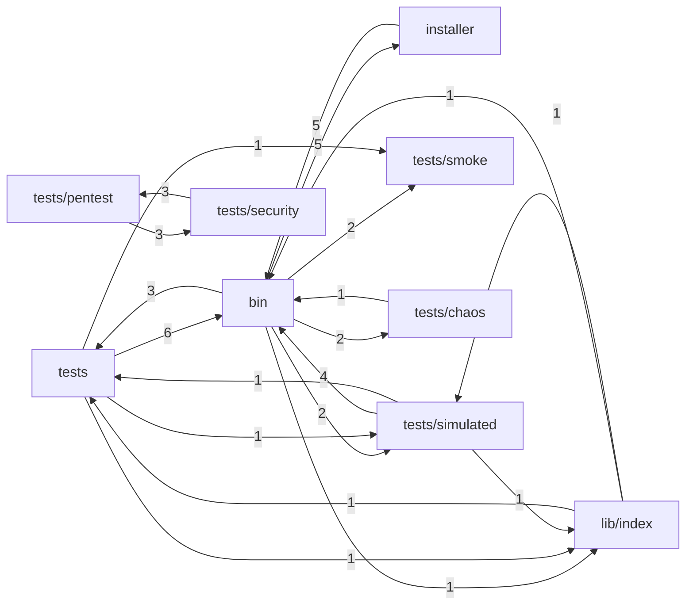

# INDEX_FUNCTIONS — `viralefy_ops`

> **Gerado** por `viralefy_ops/lib/index/build-index.mjs` (§39). Não editar à mão:
> corrija o doc-comment na origem e regenere com `/eng-index`.

| Métrica | Valor |
|---|---|
| Arquivos com função indexada | 74 (de 153 varridos) |
| **N — funções declaradas no código** | **234** |
| **M — entradas neste índice** | **234** |
| Invariante `M == N` | ✅ OK |
| Funções sem doc-comment (§3) | 113 (48.3%) |

Colunas: `de onde vem → pra onde vai` é derivada (camada dos chamadores → efeitos detectados);
`chama (out)` / `é chamada por (in)` vêm do grafo resolvido por nome. As listas inline são
limitadas a 10 nomes com sufixo `+N`; a adjacência COMPLETA está na última seção.

## Grafo de chamadas (por módulo)



## Funções


### `bin/viralefy-critical-flows` — camada `cmd`

| Função | Tipo | O quê | de onde vem → pra onde vai | chama (out) | é chamada por (in) | Efeitos | Linha |
|---|---|---|---|---|---|---|---|
| `now` | func | ⚠ SEM DOC | test+cmd → retorno | — | mint_admin_token, mint_user_token, cleanup, main | — | 62 |
| `emit_json` | func | ⚠ SEM DOC | — → retorno | — | — | — | 64 |
| `ok` | func | ⚠ SEM DOC | cmd → interno | ok, ok | flow_login_wrong_password, ok, ok | — | 71 |
| `bad` | func | ⚠ SEM DOC | cmd → interno | bad | bad | — | 77 |
| `note` | func | ⚠ SEM DOC | cmd → interno | note, note | note, note | — | 83 |
| `http_call` | func | http_call <method> <url> [extra curl args...] Captura status code em $LAST_CODE, body em $TMPDIR_CF/last_body, duracao em ms em $LAST_DURATION. | test → interno | http_call | assert_http_with_token, http_call | — | 87 |
| `body` | func | ⚠ SEM DOC | — → retorno | — | — | — | 101 |
| `assert_status` | func | ⚠ SEM DOC | — → retorno | — | — | — | 103 |
| `assert_body_has` | func | ⚠ SEM DOC | — → retorno | — | — | — | 114 |
| `assert_json_field` | func | ⚠ SEM DOC | test → interno | assert_json_field | assert_json_field | — | 125 |
| `flow_register` | func | ─── Flow 1: Register ───────────────────────────────────────────────────── | — → retorno | — | — | — | 143 |
| `flow_login` | func | ─── Flow 2: Login ──────────────────────────────────────────────────────── | — → retorno | — | — | — | 188 |
| `flow_login_wrong_password` | func | ─── Flow 3: Login 401 sanity ───────────────────────────────────────────── | — → interno | ok, ok, ok | — | — | 217 |
| `flow_checkout` | func | ─── Flow 4: Checkout ───────────────────────────────────────────────────── | — → retorno | — | — | — | 248 |
| `flow_pages_with_gdpr` | func | ─── Flow 5: Páginas com cookies (regression round 26) ──────────────────── | — → retorno | — | — | — | 309 |
| `flow_db_invariant_softdelete_reuse` | func | ─── Flow: DB invariant — UNIQUE parcial do email (regression bug 2026-06-15) Bug em prod 2026-06-15: user soft-deletado bloqueava recadastro com mesmo email (409 CONFLICT). | — → db | check | — | db | 335 |
| `flow_selfcheck` | func | ─── Self-check (skill §22.8) ───────────────────────────────────────────── | — → retorno | — | — | — | 366 |

### `bin/viralefy-install` — camada `cmd`

| Função | Tipo | O quê | de onde vem → pra onde vai | chama (out) | é chamada por (in) | Efeitos | Linha |
|---|---|---|---|---|---|---|---|
| `main` | func | ⚠ SEM DOC | test+ui → interno | main, main, main | main, main, main | — | 48 |
| `ensure_ops_in_place` | func | Se rodamos a partir de um tarball/temp dir, depois do clone copiamos para $ROOT_DIR/ops a versão definitiva (que terá os arquivos atualizados). | — → retorno | — | — | — | 78 |

### `bin/viralefy-logs` — camada `cmd`

| Função | Tipo | O quê | de onde vem → pra onde vai | chama (out) | é chamada por (in) | Efeitos | Linha |
|---|---|---|---|---|---|---|---|
| `mapper` | func | ⚠ SEM DOC | — → retorno | — | — | — | 9 |

### `bin/viralefy-restore-drill` — camada `cmd`

| Função | Tipo | O quê | de onde vem → pra onde vai | chama (out) | é chamada por (in) | Efeitos | Linha |
|---|---|---|---|---|---|---|---|
| `pick_free_port` | func | Porta livre acima de 15433 (evita 15432 que pode estar em uso por dev). | — → retorno | — | — | — | 51 |
| `cleanup` | func | ⚠ SEM DOC | test+cmd → db | now, cleanup | cleanup, list_scripts_for_category | db | 65 |

### `bin/viralefy-smoke` — camada `cmd`

| Função | Tipo | O quê | de onde vem → pra onde vai | chama (out) | é chamada por (in) | Efeitos | Linha |
|---|---|---|---|---|---|---|---|
| `ok` | func | ⚠ SEM DOC | cmd → interno | ok, ok | flow_login_wrong_password, ok, ok | — | 68 |
| `bad` | func | ⚠ SEM DOC | cmd → interno | bad | bad | — | 69 |
| `note` | func | ⚠ SEM DOC | cmd → interno | note, note | note, note | — | 70 |
| `http_code` | func | ⚠ SEM DOC | — → retorno | — | — | — | 76 |
| `http_body` | func | ⚠ SEM DOC | — → interno | check | — | — | 287 |

### `bin/viralefy-status` — camada `cmd`

| Função | Tipo | O quê | de onde vem → pra onde vai | chama (out) | é chamada por (in) | Efeitos | Linha |
|---|---|---|---|---|---|---|---|
| `bold` | func | ⚠ SEM DOC | — → retorno | — | — | — | 9 |
| `ok` | func | ⚠ SEM DOC | cmd → interno | ok, ok | flow_login_wrong_password, ok, ok | — | 10 |
| `no` | func | ⚠ SEM DOC | — → retorno | — | — | — | 11 |
| `warn` | func | ⚠ SEM DOC | ops → db | warn | warn | db | 12 |

### `bin/viralefy-test` — camada `cmd`

| Função | Tipo | O quê | de onde vem → pra onde vai | chama (out) | é chamada por (in) | Efeitos | Linha |
|---|---|---|---|---|---|---|---|
| `usage` | func | ⚠ SEM DOC | — → retorno | — | — | — | 55 |
| `resolve_tests_dir` | func | ── Resolução do TESTS_DIR ────────────────────────────────────────────── Procura em locais conhecidos (instalado em prod, repo dev local). | — → retorno | — | — | — | 62 |
| `note` | func | ── Helpers ───────────────────────────────────────────────────────────── | cmd → interno | note, note | note, note | — | 131 |
| `err` | func | ⚠ SEM DOC | ops → interno | err | err | — | 132 |
| `list_scripts_for_category` | func | Resolve scripts pra rodar dado um MODE | — → interno | cleanup, cleanup | — | — | 139 |
| `do_seeds` | func | ── Seeds / cleanup (delegados) ──────────────────────────────────────── Cada ação roda um wrapper .sh em tests/seeds/ que aplica o .sql correspondente via psql. | — → retorno | — | — | — | 150 |
| `run_one` | func | ⚠ SEM DOC | test → interno | run_one | run_one, main | — | 210 |

### `bin/viralefy-update` — camada `cmd`

| Função | Tipo | O quê | de onde vem → pra onde vai | chama (out) | é chamada por (in) | Efeitos | Linha |
|---|---|---|---|---|---|---|---|
| `ts` | func | ⚠ SEM DOC | — → retorno | — | — | — | 80 |
| `log` | func | ⚠ SEM DOC | ops → interno | log | log | — | 81 |
| `restart_and_verify` | func | ⚠ SEM DOC | — → retorno | — | — | — | 99 |
| `clone_one` | func | ⚠ SEM DOC | — → retorno | — | — | — | 170 |
| `clone_optional` | func | ⚠ SEM DOC | — → retorno | — | — | — | 175 |
| `build_api` | func | ⚠ SEM DOC | ops → interno | build_api | build_api | — | 199 |
| `build_go_svc` | func | Build genérico Go pros microservices (payments, sender). | — → retorno | — | — | — | 210 |
| `build_node` | func | ⚠ SEM DOC | ops → interno | build_node | build_node | — | 218 |
| `build_core_cron` | func | Build de cron auxiliar do viralefy_core (reconcile, user-deletion). | — → retorno | — | — | — | 234 |
| `build_rust_svc` | func | Build de Rust binary (dispatcher). cargo é instalado por bootstrap.sh quando PHASE-9 estiver ativo; se não tiver cargo, skip silencioso. | — → log | — | — | log | 248 |

### `installer/00-prereqs.sh` — camada `ops`

| Função | Tipo | O quê | de onde vem → pra onde vai | chama (out) | é chamada por (in) | Efeitos | Linha |
|---|---|---|---|---|---|---|---|
| `install_prereqs` | func | !/usr/bin/env bash Instala dependências de sistema: git, curl, build tools, Go, Node, PostgreSQL. | — → retorno | — | — | — | 5 |
| `install_go` | func | ⚠ SEM DOC | — → retorno | — | — | — | 23 |
| `install_node` | func | ⚠ SEM DOC | — → retorno | — | — | — | 46 |
| `install_postgres` | func | ⚠ SEM DOC | — → retorno | — | — | — | 57 |
| `install_caddy` | func | ⚠ SEM DOC | — → retorno | — | — | — | 69 |

### `installer/10-users.sh` — camada `ops`

| Função | Tipo | O quê | de onde vem → pra onde vai | chama (out) | é chamada por (in) | Efeitos | Linha |
|---|---|---|---|---|---|---|---|
| `install_users` | func | !/usr/bin/env bash Cria os usuários de sistema isolados (um por pacote) e o grupo viralefy. | — → retorno | — | — | — | 6 |

### `installer/20-postgres.sh` — camada `ops`

| Função | Tipo | O quê | de onde vem → pra onde vai | chama (out) | é chamada por (in) | Efeitos | Linha |
|---|---|---|---|---|---|---|---|
| `install_postgres_role` | func | !/usr/bin/env bash Configura PostgreSQL: cria role viralefy + db viralefy. | — → db | — | — | db | 5 |
| `ensure_pg_hba` | func | ⚠ SEM DOC | — → retorno | — | — | — | 38 |

### `installer/30-secrets.sh` — camada `ops`

| Função | Tipo | O quê | de onde vem → pra onde vai | chama (out) | é chamada por (in) | Efeitos | Linha |
|---|---|---|---|---|---|---|---|
| `install_secrets` | func | !/usr/bin/env bash Gerencia segredos em /etc/viralefy/.env (sobrevive a updates destrutivos). | — → retorno | — | — | — | 15 |

### `installer/35-caddy.sh` — camada `ops`

| Função | Tipo | O quê | de onde vem → pra onde vai | chama (out) | é chamada por (in) | Efeitos | Linha |
|---|---|---|---|---|---|---|---|
| `install_caddy_config` | func | !/usr/bin/env bash Configura o Caddy como reverse proxy + TLS automático. | — → retorno | — | — | — | 8 |

### `installer/40-clone.sh` — camada `ops`

| Função | Tipo | O quê | de onde vem → pra onde vai | chama (out) | é chamada por (in) | Efeitos | Linha |
|---|---|---|---|---|---|---|---|
| `install_clone` | func | !/usr/bin/env bash Clona cada pacote em /viralefy/<pkg> com ownership do usuário do serviço. | — → retorno | — | — | — | 4 |
| `run_as_or_root` | func | run_as_or_root: usa sudo -u quando user != root. | — → retorno | — | — | — | 35 |

### `installer/50-build.sh` — camada `ops`

| Função | Tipo | O quê | de onde vem → pra onde vai | chama (out) | é chamada por (in) | Efeitos | Linha |
|---|---|---|---|---|---|---|---|
| `install_build` | func | !/usr/bin/env bash Build de cada pacote rodando como o usuário do serviço. | — → retorno | — | — | — | 4 |
| `build_api` | func | ⚠ SEM DOC | cmd → interno | build_api | build_api | — | 24 |
| `build_go` | func | build_go: padrão do build_api pros microservices (payments, sender). | — → retorno | — | — | — | 37 |
| `build_node` | func | ⚠ SEM DOC | cmd → interno | build_node | build_node | — | 50 |

### `installer/60-systemd.sh` — camada `ops`

| Função | Tipo | O quê | de onde vem → pra onde vai | chama (out) | é chamada por (in) | Efeitos | Linha |
|---|---|---|---|---|---|---|---|
| `install_systemd` | func | !/usr/bin/env bash Instala unidades systemd hardened e os comandos /usr/local/sbin/. | — → retorno | — | — | — | 4 |

### `installer/70-start.sh` — camada `ops`

| Função | Tipo | O quê | de onde vem → pra onde vai | chama (out) | é chamada por (in) | Efeitos | Linha |
|---|---|---|---|---|---|---|---|
| `install_start` | func | !/usr/bin/env bash Habilita e sobe os serviços, espera healthcheck. | — → retorno | — | — | — | 13 |
| `run_migrations` | func | Migrations sequencing (DR drill 2026-06-10): 1. viralefy-api migrate up → migrations 001..038 (legacy schema) 2. viralefy-core migrate up → migrations 039_auth_tokens, 040_proof_storage_key core mi… | — → retorno | — | — | — | 42 |
| `wait_internal_healthy` | func | Espera /internal/health do microservice responder 200 antes de prosseguir. | — → retorno | — | — | — | 65 |
| `wait_healthy` | func | ⚠ SEM DOC | — → retorno | — | — | — | 80 |

### `installer/80-observability.sh` — camada `ops`

| Função | Tipo | O quê | de onde vem → pra onde vai | chama (out) | é chamada por (in) | Efeitos | Linha |
|---|---|---|---|---|---|---|---|
| `install_observability` | func | ⚠ SEM DOC | — → retorno | — | — | — | 19 |
| `install_obs_apt_repos` | func | ---- Repos apt: Grafana (Grafana + Alloy) ---- # | — → retorno | — | — | — | 34 |
| `install_obs_packages` | func | ---- Pacotes apt (Grafana, Alloy, Prometheus, node_exporter) ---- # | — → retorno | — | — | — | 50 |
| `install_obs_loki_binary` | func | ---- Loki binary (upstream tarball) ---- # | — → retorno | — | — | — | 67 |
| `install_obs_tempo_binary` | func | ---- Tempo binary (upstream tarball) ---- # | — → retorno | — | — | — | 90 |
| `install_obs_users_dirs` | func | ---- Usuários (apt já cria grafana/prometheus/alloy; loki/tempo nós criamos) ---- # | — → retorno | — | — | — | 113 |
| `install_obs_configs` | func | ---- Configs (do repo ops) ---- # | — → retorno | — | — | — | 149 |
| `install_obs_postgres_exporter` | func | ---- Postgres exporter (role + env + symlink binary) ---- # Idempotente: cria/atualiza role postgres_exporter no banco viralefy, materializa /etc/viralefy/postgres-exporter.env com DSN loopback, e … | — → db | — | — | db | 183 |
| `install_obs_systemd` | func | ---- Systemd units (hardened, do repo ops) ---- # | — → retorno | — | — | — | 235 |
| `start_obs_services` | func | ---- Enable + start + healthcheck ---- # | — → retorno | — | — | — | 255 |

### `installer/85-storage.sh` — camada `ops`

| Função | Tipo | O quê | de onde vem → pra onde vai | chama (out) | é chamada por (in) | Efeitos | Linha |
|---|---|---|---|---|---|---|---|
| `install_storage` | func | !/usr/bin/env bash Instala MinIO single-instance via Docker pra object storage S3-compatível. | — → retorno | — | — | — | 12 |
| `install_storage_docker` | func | Docker é a única dependência hard. | — → retorno | — | — | — | 25 |
| `install_storage_dirs` | func | ⚠ SEM DOC | — → retorno | — | — | — | 56 |
| `install_storage_secrets` | func | Credenciais geradas no primeiro install. | — → retorno | — | — | — | 63 |
| `install_storage_compose` | func | ⚠ SEM DOC | — → retorno | — | — | — | 87 |
| `start_storage_service` | func | ⚠ SEM DOC | — → retorno | — | — | — | 110 |

### `installer/lib.sh` — camada `ops`

| Função | Tipo | O quê | de onde vem → pra onde vai | chama (out) | é chamada por (in) | Efeitos | Linha |
|---|---|---|---|---|---|---|---|
| `log` | func | ⚠ SEM DOC | cmd → interno | log | log | — | 53 |
| `info` | func | ⚠ SEM DOC | — → retorno | — | — | — | 54 |
| `warn` | func | ⚠ SEM DOC | cmd → interno | warn | warn | — | 55 |
| `err` | func | ⚠ SEM DOC | cmd → interno | err | err | — | 56 |
| `fatal` | func | ⚠ SEM DOC | — → retorno | — | — | — | 57 |
| `require_root` | func | ---------------- Pré-condições ---------------- # | — → retorno | — | — | — | 61 |
| `require_apt` | func | ⚠ SEM DOC | — → retorno | — | — | — | 65 |
| `run_as` | func | Roda comando como o usuário do serviço. | — → retorno | — | — | — | 72 |
| `gen_secret` | func | Gera segredo aleatório base64 url-safe (sem chars problemáticos em .env). | — → retorno | — | — | — | 78 |
| `user_of` | func | Usuário de sistema que roda o pacote. | — → retorno | — | — | — | 84 |
| `dir_of` | func | Diretório do pacote. | — → retorno | — | — | — | 89 |
| `repo_of` | func | URL do repo (https) do pacote. | — → retorno | — | — | — | 94 |

### `lib/index/build-call-graph.mjs` — camada `ui`

| Função | Tipo | O quê | de onde vem → pra onde vai | chama (out) | é chamada por (in) | Efeitos | Linha |
|---|---|---|---|---|---|---|---|
| `buildCallGraph` | func | transforma a lista plana de declarações de um serviço no grafo de | ui → retorno | — | main | MUTA os registros recebidos (decisão consciente: evita duplicar em | 19 |

### `lib/index/build-index.mjs` — camada `ui`

| Função | Tipo | O quê | de onde vem → pra onde vai | chama (out) | é chamada por (in) | Efeitos | Linha |
|---|---|---|---|---|---|---|---|
| `main` | func | orquestra a geração do índice de funcionalidades (§39) do workspace | test+cmd → arquivo | extractCalls, extractDoc, layerOf, parseFile, renderGlobalIndex, renderMapa, renderServiceIndex, serviceRegistry, sliceBody, walkSourceFiles +5 | main, main, main | arquivo | 38 |

### `lib/index/detect-effects.mjs` — camada `ui`

| Função | Tipo | O quê | de onde vem → pra onde vai | chama (out) | é chamada por (in) | Efeitos | Linha |
|---|---|---|---|---|---|---|---|
| `detectEffects` | func | infere os efeitos colaterais observáveis de uma função (banco, HTTP de | ui → retorno | — | main | nenhum — função pura sobre texto. | 28 |

### `lib/index/extract-calls.mjs` — camada `ui`

| Função | Tipo | O quê | de onde vem → pra onde vai | chama (out) | é chamada por (in) | Efeitos | Linha |
|---|---|---|---|---|---|---|---|
| `extractCalls` | func | extrai os nomes invocados dentro de um corpo de função — a matéria-prima | ui → retorno | — | main | nenhum — função pura sobre texto. | 29 |

### `lib/index/extract-doc.mjs` — camada `ui`

| Função | Tipo | O quê | de onde vem → pra onde vai | chama (out) | é chamada por (in) | Efeitos | Linha |
|---|---|---|---|---|---|---|---|
| `field` | func | extrai o valor de um campo rotulado ("O quê:", "Onde:", "Efeitos:") | ui → retorno | — | extractDoc | ") | 15 |
| `extractDoc` | func | /Onde:", usa a primeira linha como `what` — melhor | ui → interno | field | main | — | 38 |

### `lib/index/layer-of.mjs` — camada `ui`

| Função | Tipo | O quê | de onde vem → pra onde vai | chama (out) | é chamada por (in) | Efeitos | Linha |
|---|---|---|---|---|---|---|---|
| `layerOf` | func | classifica um arquivo na camada arquitetural da casa (`interface`, | ui → retorno | — | main | nenhum — função pura sobre string. | 35 |

### `lib/index/parse-file.mjs` — camada `ui`

| Função | Tipo | O quê | de onde vem → pra onde vai | chama (out) | é chamada por (in) | Efeitos | Linha |
|---|---|---|---|---|---|---|---|
| `byShebang` | func | escolhe o parser de um arquivo SEM extensão a partir do shebang. | ui → interno | parsePython, parseShell, parseTs | parseFile | nenhum — pura. | 18 |
| `parseFile` | func | despacha o arquivo para o parser da sua linguagem e devolve as | ui → interno | byShebang, parseGo, parsePython, parseRust, parseShell, parseTs | main | nenhum — pura; a leitura de disco acontece em `build-index.mjs`. | 40 |

### `lib/index/parse-go.mjs` — camada `ui`

| Função | Tipo | O quê | de onde vem → pra onde vai | chama (out) | é chamada por (in) | Efeitos | Linha |
|---|---|---|---|---|---|---|---|
| `parseGo` | func | extrai as declarações de função/método/closure nomeada de um arquivo Go, | ui → retorno | — | parseFile | nenhum — função pura sobre texto. | 21 |

### `lib/index/parse-python.mjs` — camada `ui`

| Função | Tipo | O quê | de onde vem → pra onde vai | chama (out) | é chamada por (in) | Efeitos | Linha |
|---|---|---|---|---|---|---|---|
| `parsePython` | func | extrai as declarações `def`/`async def` de um arquivo Python, uma | ui → retorno | — | byShebang, parseFile | nenhum — função pura sobre texto. | 14 |

### `lib/index/parse-rust.mjs` — camada `ui`

| Função | Tipo | O quê | de onde vem → pra onde vai | chama (out) | é chamada por (in) | Efeitos | Linha |
|---|---|---|---|---|---|---|---|
| `parseRust` | func | extrai as declarações `fn` de um arquivo Rust — livres, em `impl`, em | ui → retorno | — | parseFile | nenhum — função pura sobre texto. | 20 |

### `lib/index/parse-shell.mjs` — camada `ui`

| Função | Tipo | O quê | de onde vem → pra onde vai | chama (out) | é chamada por (in) | Efeitos | Linha |
|---|---|---|---|---|---|---|---|
| `parseShell` | func | extrai as funções declaradas em um script shell (`nome() {` ou | ui → retorno | — | byShebang, parseFile | nenhum — função pura sobre texto. | 16 |

### `lib/index/parse-ts.mjs` — camada `ui`

| Função | Tipo | O quê | de onde vem → pra onde vai | chama (out) | é chamada por (in) | Efeitos | Linha |
|---|---|---|---|---|---|---|---|
| `parseTs` | func | extrai as unidades chamáveis de um arquivo TypeScript/TSX/JS/MJS — | ui → retorno | — | byShebang, parseFile | nenhum — função pura sobre texto. | 30 |

### `lib/index/render-call-mermaid.mjs` — camada `ui`

| Função | Tipo | O quê | de onde vem → pra onde vai | chama (out) | é chamada por (in) | Efeitos | Linha |
|---|---|---|---|---|---|---|---|
| `renderCallMermaid` | func | desenha o grafo de chamadas de um serviço em Mermaid, agregado por | ui → retorno | — | renderServiceIndex | nenhum — função pura. | 21 |
| `nodeId` | arrow | nodeId: dá (e memoiza) um id curto de Mermaid pro diretório — nome de pasta com `/` e `.` não serve como identificador de nó. | — → retorno | — | — | — | 46 |

### `lib/index/render-global-index.mjs` — camada `ui`

| Função | Tipo | O quê | de onde vem → pra onde vai | chama (out) | é chamada por (in) | Efeitos | Linha |
|---|---|---|---|---|---|---|---|
| `renderGlobalIndex` | func | renderiza o `INDEX_GLOBAL.md` — o mapa macro: todo repo do sistema com | ui → interno | serviceRegistry | main | nenhum — pura; quem escreve em disco é o chamador. | 15 |

### `lib/index/render-mapa.mjs` — camada `ui`

| Função | Tipo | O quê | de onde vem → pra onde vai | chama (out) | é chamada por (in) | Efeitos | Linha |
|---|---|---|---|---|---|---|---|
| `renderMapa` | func | renderiza o `MAPA.md` (§4) — o arquivo-guia que junta as duas camadas: | ui → interno | serviceRegistry | main | nenhum — pura; quem escreve em disco é o chamador. | 20 |

### `lib/index/render-service-index.mjs` — camada `ui`

| Função | Tipo | O quê | de onde vem → pra onde vai | chama (out) | é chamada por (in) | Efeitos | Linha |
|---|---|---|---|---|---|---|---|
| `cell` | func | escapa um texto para caber numa célula de tabela markdown (pipe e | ui → retorno | — | renderServiceIndex | nenhum — pura. | 15 |
| `flowOf` | func | monta a coluna "de onde vem → pra onde vai" de uma função — origem | ui → retorno | — | renderServiceIndex | nenhum — pura. | 28 |
| `adjacencyNames` | func | transforma uma lista de ids de adjacência nos nomes das funções, com | ui → retorno | — | renderServiceIndex | nenhum — pura. | 45 |
| `renderServiceIndex` | func | renderiza o `INDEX_FUNCTIONS_<serviço>.md` — uma linha por função | ui → interno | renderCallMermaid, cell, flowOf, adjacencyNames | main | nenhum — pura; quem escreve em disco é o chamador. | 64 |

### `lib/index/service-registry.mjs` — camada `ui`

| Função | Tipo | O quê | de onde vem → pra onde vai | chama (out) | é chamada por (in) | Efeitos | Linha |
|---|---|---|---|---|---|---|---|
| `serviceRegistry` | func | devolve a camada GLOBAL do índice (§39) mantida à mão — cada repo do | ui → evento | — | renderGlobalIndex, renderMapa, main | evento | 17 |

### `lib/index/slice-body.mjs` — camada `ui`

| Função | Tipo | O quê | de onde vem → pra onde vai | chama (out) | é chamada por (in) | Efeitos | Linha |
|---|---|---|---|---|---|---|---|
| `sliceBody` | func | recorta o corpo aproximado de uma declaração — da linha da declaração | ui → retorno | — | main | nenhum — função pura sobre texto. | 19 |

### `lib/index/walk-source-files.mjs` — camada `ui`

| Função | Tipo | O quê | de onde vem → pra onde vai | chama (out) | é chamada por (in) | Efeitos | Linha |
|---|---|---|---|---|---|---|---|
| `walkSourceFiles` | func | enumera os arquivos de código versionados de um repositório, na ordem | ui → retorno | — | main | executa `git ls-files` (leitura de disco); não escreve nada. | 22 |

### `tests/authz/permission-boundary.sh` — camada `test`

| Função | Tipo | O quê | de onde vem → pra onde vai | chama (out) | é chamada por (in) | Efeitos | Linha |
|---|---|---|---|---|---|---|---|
| `body_for` | func | Body por endpoint POST (mínimos) | — → db | — | — | db | 111 |

### `tests/chaos/db-disconnect.sh` — camada `test`

| Função | Tipo | O quê | de onde vem → pra onde vai | chama (out) | é chamada por (in) | Efeitos | Linha |
|---|---|---|---|---|---|---|---|
| `cleanup_db` | func | Trap pra GARANTIR desbloqueio mesmo se algo explodir | — → retorno | — | — | — | 35 |

### `tests/chaos/input-fuzz.sh` — camada `test`

| Função | Tipo | O quê | de onde vem → pra onde vai | chama (out) | é chamada por (in) | Efeitos | Linha |
|---|---|---|---|---|---|---|---|
| `fuzz` | func | Helper: roda http_call e marca pass se code NOT 5xx | — → retorno | — | — | — | 17 |

### `tests/chaos/memory-pressure.sh` — camada `test`

| Função | Tipo | O quê | de onde vem → pra onde vai | chama (out) | é chamada por (in) | Efeitos | Linha |
|---|---|---|---|---|---|---|---|
| `rss_of` | func | Coleta RSS (KB) de um service pelo pid systemd | — → retorno | — | — | — | 17 |

### `tests/chaos/partition-test.sh` — camada `test`

| Função | Tipo | O quê | de onde vem → pra onde vai | chama (out) | é chamada por (in) | Efeitos | Linha |
|---|---|---|---|---|---|---|---|
| `cleanup` | func | ⚠ SEM DOC | cmd → interno | cleanup | cleanup, list_scripts_for_category | — | 36 |

### `tests/full-route-suite.py` — camada `test`

| Função | Tipo | O quê | de onde vem → pra onde vai | chama (out) | é chamada por (in) | Efeitos | Linha |
|---|---|---|---|---|---|---|---|
| `section_header` | method | ⚠ SEM DOC | test → retorno | — | selfcheck, section_frontend, section_seo, section_api_public, section_api_public_mutating, section_api_auth_gated, section_api_admin, section_other, section_health, section_i18n +2 | — | 76 |
| `record` | method | ⚠ SEM DOC | test → retorno | — | hit_v2, selfcheck, section_headers_jsonld | — | 83 |
| `http` | func | ⚠ SEM DOC | test → retorno | — | hit, hit_v2, selfcheck, section_headers_jsonld | — | 97 |
| `hit` | func | ⚠ SEM DOC | — → interno | http | — | — | 119 |
| `hit_v2` | func | ⚠ SEM DOC | test → interno | record, http | section_frontend, section_seo, section_api_public, section_api_public_mutating, section_api_auth_gated, section_api_admin, section_other, section_health, section_i18n, section_bff | — | 159 |
| `bases` | func | ─── Bases ──────────────────────────────────────────────────────────── | test → retorno | — | main | — | 194 |
| `selfcheck` | func | ─── Self-check anti "verde mentiroso" ──────────────────────────────── | test → interno | section_header, record, http, check | main | — | 307 |
| `section_frontend` | func | ─── Sections ───────────────────────────────────────────────────────── | test → interno | section_header, hit_v2 | main | — | 332 |
| `section_seo` | func | ⚠ SEM DOC | test → interno | section_header, hit_v2 | main | — | 338 |
| `section_api_public` | func | ⚠ SEM DOC | test → interno | section_header, hit_v2 | main | — | 344 |
| `section_api_public_mutating` | func | ⚠ SEM DOC | test → interno | section_header, hit_v2 | main | — | 359 |
| `section_api_auth_gated` | func | ⚠ SEM DOC | test → interno | section_header, hit_v2 | main | — | 368 |
| `section_api_admin` | func | ⚠ SEM DOC | test → interno | section_header, hit_v2 | main | — | 381 |
| `section_other` | func | ⚠ SEM DOC | test → interno | section_header, hit_v2 | main | — | 392 |
| `section_health` | func | ⚠ SEM DOC | test → interno | section_header, hit_v2 | main | — | 407 |
| `section_i18n` | func | ⚠ SEM DOC | test → interno | section_header, hit_v2 | main | — | 419 |
| `section_headers_jsonld` | func | ⚠ SEM DOC | test → interno | section_header, record, http | main | — | 427 |
| `section_bff` | func | ⚠ SEM DOC | test → interno | section_header, hit_v2 | main | — | 451 |
| `main` | func | ─── Main ───────────────────────────────────────────────────────────── | cmd+test+ui → interno | bases, selfcheck, section_frontend, section_seo, section_api_public, section_api_public_mutating, section_api_auth_gated, section_api_admin, section_other, section_health +6 | main, main, main | — | 458 |

### `tests/hardening/cookies.sh` — camada `test`

| Função | Tipo | O quê | de onde vem → pra onde vai | chama (out) | é chamada por (in) | Efeitos | Linha |
|---|---|---|---|---|---|---|---|
| `check_cookie` | func | ⚠ SEM DOC | — → retorno | — | — | — | 48 |

### `tests/hardening/headers-full.sh` — camada `test`

| Função | Tipo | O quê | de onde vem → pra onde vai | chama (out) | é chamada por (in) | Efeitos | Linha |
|---|---|---|---|---|---|---|---|
| `expect_header` | func | expect_header <label> <header_name> <regex> | — → retorno | — | — | — | 27 |

### `tests/hardening/tls-config.sh` — camada `test`

| Função | Tipo | O quê | de onde vem → pra onde vai | chama (out) | é chamada por (in) | Efeitos | Linha |
|---|---|---|---|---|---|---|---|
| `probe_proto` | func | Test um protocolo: deve ficar igual a "ok" (esperado-aceitar) ou "reject" (esperado-rejeitar). | — → retorno | — | — | — | 35 |

### `tests/integration/2fa-enroll-verify-flow.sh` — camada `test`

| Função | Tipo | O quê | de onde vem → pra onde vai | chama (out) | é chamada por (in) | Efeitos | Linha |
|---|---|---|---|---|---|---|---|
| `totp` | func | TOTP RFC 6238 em python stdlib | — → retorno | — | — | — | 23 |

### `tests/lib-authz.sh` — camada `test`

| Função | Tipo | O quê | de onde vem → pra onde vai | chama (out) | é chamada por (in) | Efeitos | Linha |
|---|---|---|---|---|---|---|---|
| `authz_key_path` | func | ─── Config ────────────────────────────────────────────────────────────── | — → retorno | — | — | — | 52 |
| `authz_kid` | func | ⚠ SEM DOC | — → retorno | — | — | — | 56 |
| `psql_q` | func | ─── psql ──────────────────────────────────────────────────────────────── psql_q "<sql>" → stdout do resultado (-Atc). | — → retorno | — | — | — | 65 |
| `authz_check_prereqs` | func | authz_check_prereqs — chama no início do script. | — → retorno | — | — | — | 81 |
| `mint_admin_token` | func | ─── JWT mint ──────────────────────────────────────────────────────────── mint_admin_token <role> [ttl_seconds] Stdout: "<token>\t<jti>" — caller separa com cut/IFS. | — → cripto | now | — | cripto | 116 |
| `mint_user_token` | func | mint_user_token <user_id> [ttl_seconds] Stdout: "<token>\t<jti>". | — → cripto | now | — | cripto | 155 |
| `mint_token` | func | Helpers pra extrair token/jti do output "<token>\t<jti>". | — → retorno | — | — | — | 181 |
| `mint_jti` | func | ⚠ SEM DOC | — → retorno | — | — | — | 182 |
| `revoke_jti` | func | revoke_jti <jti> [reason] Insere em revoked_jtis + NOTIFY pro dispatcher Rust pegar via LISTEN. | — → db | — | — | db | 186 |
| `bearer` | func | bearer "<token>" — formata pro http_call. | — → retorno | — | — | — | 199 |
| `throttle_pause` | func | ⚠ SEM DOC | — → retorno | — | — | — | 213 |
| `assert_http_with_token` | func | assert_http_with_token <desc> <expected_codes> <method> <url> <token> [body] Wrapper sobre assert_http_in que injeta Authorization Bearer + throttling. | — → interno | http_call, http_call | — | — | 223 |
| `http_call_token` | func | http_call_token <method> <url> <token> [body] Wrapper de http_call (sem assert) com throttle + retry em 429. | — → retorno | — | — | — | 241 |

### `tests/lib.sh` — camada `test`

| Função | Tipo | O quê | de onde vem → pra onde vai | chama (out) | é chamada por (in) | Efeitos | Linha |
|---|---|---|---|---|---|---|---|
| `api_base` | func | ─── Bases (overridable via env) ────────────────────────────────────── Localhost por default (rodando direto no host de prod via /usr/local/sbin ou via dev box). | — → retorno | — | — | — | 46 |
| `dispatcher_base` | func | ⚠ SEM DOC | — → retorno | — | — | — | 47 |
| `front_base` | func | ⚠ SEM DOC | — → retorno | — | — | — | 48 |
| `admin_base` | func | ⚠ SEM DOC | — → retorno | — | — | — | 49 |
| `core_base` | func | ⚠ SEM DOC | — → retorno | — | — | — | 50 |
| `auth_base` | func | ⚠ SEM DOC | — → retorno | — | — | — | 51 |
| `payments_base` | func | ⚠ SEM DOC | — → retorno | — | — | — | 52 |
| `sender_base` | func | ⚠ SEM DOC | — → retorno | — | — | — | 53 |
| `prom_base` | func | Observability (Prometheus/Grafana/Loki) — só local por default. | — → retorno | — | — | — | 56 |
| `grafana_base` | func | ⚠ SEM DOC | — → retorno | — | — | — | 57 |
| `loki_base` | func | ⚠ SEM DOC | — → retorno | — | — | — | 58 |
| `test_section` | func | ─── Banner / lifecycle ─────────────────────────────────────────────── | — → retorno | — | — | — | 73 |
| `test_pass` | func | ⚠ SEM DOC | — → retorno | — | — | — | 82 |
| `test_fail` | func | ⚠ SEM DOC | — → retorno | — | — | — | 87 |
| `test_skip` | func | ⚠ SEM DOC | — → retorno | — | — | — | 99 |
| `test_summary` | func | test_summary "<categoria>/<nome>" Imprime totals + banner gigante vermelho se houver falha. | — → retorno | — | — | — | 110 |
| `http_call` | func | ─── HTTP helpers ───────────────────────────────────────────────────── http_call <method> <url> [body] [extra_curl_args...] Popula HTTP_CODE, HTTP_BODY, HTTP_HEADERS no shell do chamador. | test+cmd → interno | http_call | assert_http_with_token, http_call | — | 135 |
| `assert_http_status` | func | assert_http_status "<desc>" "<expected_code>" <method> <url> [body] [extra...] | — → retorno | — | — | — | 173 |
| `assert_http_in` | func | assert_http_in "<desc>" "<code\|code\|code>" <method> <url> [body] [extra...] | — → retorno | — | — | — | 187 |
| `assert_json_field` | func | assert_json_field "<jq_query>" "<expected_value>" [<failure_msg>] Roda jq sobre $HTTP_BODY. | cmd → interno | assert_json_field | assert_json_field | — | 203 |
| `assert_header_present` | func | assert_header_present "<header_name>" [<failure_msg>] Verifica em $HTTP_HEADERS (last response). | — → retorno | — | — | — | 218 |
| `assert_header_absent` | func | assert_header_absent "<header_name>" [<failure_msg>] | — → retorno | — | — | — | 229 |
| `assert_no_pii` | func | assert_no_pii "<text>" [<context>] Heurística regex pra detectar CPF (111.222.333-44 ou 11122233344), e-mail real (qualquer @ que não @viralefy.test), telefone BR. | — → retorno | — | — | — | 243 |

### `tests/pentest/billion-laughs.sh` — camada `test`

| Função | Tipo | O quê | de onde vem → pra onde vai | chama (out) | é chamada por (in) | Efeitos | Linha |
|---|---|---|---|---|---|---|---|
| `_send` | func | ⚠ SEM DOC | — → retorno | — | — | — | 26 |

### `tests/pentest/clickjacking.sh` — camada `test`

| Função | Tipo | O quê | de onde vem → pra onde vai | chama (out) | é chamada por (in) | Efeitos | Linha |
|---|---|---|---|---|---|---|---|
| `_check_headers` | func | ⚠ SEM DOC | — → retorno | — | — | — | 16 |

### `tests/pentest/excessive-data-exposure.sh` — camada `test`

| Função | Tipo | O quê | de onde vem → pra onde vai | chama (out) | é chamada por (in) | Efeitos | Linha |
|---|---|---|---|---|---|---|---|
| `_scan_response` | func | Padrões sensíveis pra grep no response body CPF: 11 dígitos numéricos (xxx.xxx.xxx-xx ou cru) Email: qualquer @xxx.com com endereços que parecem reais password_hash, secret, token raw | — → cripto | — | — | cripto | 20 |

### `tests/pentest/jwt-algorithm.sh` — camada `test`

| Função | Tipo | O quê | de onde vem → pra onde vai | chama (out) | é chamada por (in) | Efeitos | Linha |
|---|---|---|---|---|---|---|---|
| `b64url` | func | ⚠ SEM DOC | test → interno | b64url, b64url, b64url | b64url, b64url, b64url | — | 22 |
| `b64url_raw` | func | ⚠ SEM DOC | — → retorno | — | — | — | 23 |

### `tests/pentest/jwt-claim-tampering.sh` — camada `test`

| Função | Tipo | O quê | de onde vem → pra onde vai | chama (out) | é chamada por (in) | Efeitos | Linha |
|---|---|---|---|---|---|---|---|
| `b64url` | func | ⚠ SEM DOC | test → interno | b64url, b64url, b64url | b64url, b64url, b64url | — | 15 |

### `tests/pentest/jwt-tampering.sh` — camada `test`

| Função | Tipo | O quê | de onde vem → pra onde vai | chama (out) | é chamada por (in) | Efeitos | Linha |
|---|---|---|---|---|---|---|---|
| `b64url` | func | Base64URL encode helper | test → interno | b64url, b64url, b64url | b64url, b64url, b64url | — | 17 |

### `tests/pentest/open-redirect.sh` — camada `test`

| Função | Tipo | O quê | de onde vem → pra onde vai | chama (out) | é chamada por (in) | Efeitos | Linha |
|---|---|---|---|---|---|---|---|
| `_extract_location` | func | ⚠ SEM DOC | — → retorno | — | — | — | 25 |
| `_check_no_open_redirect` | func | ⚠ SEM DOC | — → retorno | — | — | — | 29 |

### `tests/pentest/path-traversal.sh` — camada `test`

| Função | Tipo | O quê | de onde vem → pra onde vai | chama (out) | é chamada por (in) | Efeitos | Linha |
|---|---|---|---|---|---|---|---|
| `_assert_safe_path` | func | ⚠ SEM DOC | — → retorno | — | — | — | 25 |

### `tests/pentest/redos.sh` — camada `test`

| Função | Tipo | O quê | de onde vem → pra onde vai | chama (out) | é chamada por (in) | Efeitos | Linha |
|---|---|---|---|---|---|---|---|
| `_measure_time` | func | ⚠ SEM DOC | — → retorno | — | — | — | 24 |

### `tests/pentest/request-smuggling.sh` — camada `test`

| Função | Tipo | O quê | de onde vem → pra onde vai | chama (out) | é chamada por (in) | Efeitos | Linha |
|---|---|---|---|---|---|---|---|
| `_smuggle` | func | HTTP/2 não permite Transfer-Encoding (já bloqueia no protocolo). | — → retorno | — | — | — | 18 |

### `tests/pentest/sql-injection.sh` — camada `test`

| Função | Tipo | O quê | de onde vem → pra onde vai | chama (out) | é chamada por (in) | Efeitos | Linha |
|---|---|---|---|---|---|---|---|
| `_assert_safe` | func | Helper local: status válido + body sem leak SQLi | — → db | — | — | db | 18 |

### `tests/pentest/timing-attack.sh` — camada `test`

| Função | Tipo | O quê | de onde vem → pra onde vai | chama (out) | é chamada por (in) | Efeitos | Linha |
|---|---|---|---|---|---|---|---|
| `_measure` | func | ⚠ SEM DOC | — → retorno | — | — | — | 37 |

### `tests/pentest/xss.sh` — camada `test`

| Função | Tipo | O quê | de onde vem → pra onde vai | chama (out) | é chamada por (in) | Efeitos | Linha |
|---|---|---|---|---|---|---|---|
| `_assert_no_reflect` | func | ⚠ SEM DOC | — → retorno | — | — | — | 24 |

### `tests/security/jwt-algorithm-validation.sh` — camada `test`

| Função | Tipo | O quê | de onde vem → pra onde vai | chama (out) | é chamada por (in) | Efeitos | Linha |
|---|---|---|---|---|---|---|---|
| `b64url` | func | base64url sem padding. | test → interno | b64url, b64url, b64url | b64url, b64url, b64url | — | 23 |

### `tests/security/rate-limit-login.sh` — camada `test`

| Função | Tipo | O quê | de onde vem → pra onde vai | chama (out) | é chamada por (in) | Efeitos | Linha |
|---|---|---|---|---|---|---|---|
| `count_codes` | func | ⚠ SEM DOC | — → retorno | — | — | — | 48 |

### `tests/security/security-headers.sh` — camada `test`

| Função | Tipo | O quê | de onde vem → pra onde vai | chama (out) | é chamada por (in) | Efeitos | Linha |
|---|---|---|---|---|---|---|---|
| `check_target` | func | ⚠ SEM DOC | — → retorno | — | — | — | 25 |

### `tests/seeds/_lib.sh` — camada `test`

| Função | Tipo | O quê | de onde vem → pra onde vai | chama (out) | é chamada por (in) | Efeitos | Linha |
|---|---|---|---|---|---|---|---|
| `seeds_psql_file` | func | ⚠ SEM DOC | — → retorno | — | — | — | 7 |
| `seeds_psql_q` | func | ⚠ SEM DOC | — → retorno | — | — | — | 25 |

### `tests/seeds/clean-seeds.sh` — camada `test`

| Função | Tipo | O quê | de onde vem → pra onde vai | chama (out) | é chamada por (in) | Efeitos | Linha |
|---|---|---|---|---|---|---|---|
| `psql_try` | func | tables que podem não existir em ambientes antigos — try/skip silencioso. (-v ON_ERROR_STOP=1 não está setado aqui pra cada query ser independente). | — → db | — | — | db | 15 |

### `tests/simulated/run.py` — camada `test`

| Função | Tipo | O quê | de onde vem → pra onde vai | chama (out) | é chamada por (in) | Efeitos | Linha |
|---|---|---|---|---|---|---|---|
| `load_json` | func | ─── IO ──────────────────────────────────────────────────────────────────── | test → interno | die | main | — | 79 |
| `die` | func | ⚠ SEM DOC | test → retorno | — | load_json, main | — | 90 |
| `materialize_value` | func | ─── Resolução de injection → payload ────────────────────────────────────── | test → retorno | — | build_request | — | 97 |
| `build_request` | func | ─── Construção da request ───────────────────────────────────────────────── | test → interno | materialize_value | run_one | — | 107 |
| `run_one` | func | ─── Execução de uma request ─────────────────────────────────────────────── | test+cmd → interno | build_request, classify, run_one | main, run_one | — | 191 |
| `_is_rate_limited_ok` | func | ⚠ SEM DOC | test → retorno | — | classify | — | 282 |
| `_auth_gate_closed_first` | func | ⚠ SEM DOC | test → retorno | — | classify | — | 293 |
| `classify` | func | ⚠ SEM DOC | test → interno | _is_rate_limited_ok, _auth_gate_closed_first | run_one | — | 313 |
| `generate_report` | func | ─── Report / summary ────────────────────────────────────────────────────── | test → retorno | — | main | — | 413 |
| `generate_summary` | func | ⚠ SEM DOC | test → retorno | — | main | — | 485 |
| `bucket` | method | ⚠ SEM DOC | test → retorno | — | pct | — | 490 |
| `review_bucket` | method | ⚠ SEM DOC | test → retorno | — | pct | — | 496 |
| `pct` | method | ⚠ SEM DOC | — → interno | bucket, review_bucket | — | — | 505 |
| `default_log_root` | func | ─── Main ────────────────────────────────────────────────────────────────── | test → retorno | — | main | — | 544 |
| `main` | func | ⚠ SEM DOC | test+cmd+ui → interno | now, main, main, load_json, die, run_one, generate_report, generate_summary, default_log_root, run_one +1 | main, main, main | — | 551 |

### `tests/simulated/setup.sh` — camada `test`

| Função | Tipo | O quê | de onde vem → pra onde vai | chama (out) | é chamada por (in) | Efeitos | Linha |
|---|---|---|---|---|---|---|---|
| `_log` | func | ─── helpers locais (não dependem de lib.sh pra poder rodar via source) ── | — → retorno | — | — | — | 30 |
| `_warn` | func | ⚠ SEM DOC | — → retorno | — | — | — | 31 |
| `_die` | func | ⚠ SEM DOC | — → retorno | — | — | — | 32 |
| `_check_python` | func | ─── 1. | — → retorno | — | — | — | 35 |
| `_ensure_seeds` | func | ─── 2. | — → retorno | — | — | — | 53 |
| `_mint_jwt_hs256` | func | ─── 3. | — → retorno | — | — | — | 85 |
| `_mint_tokens` | func | ⚠ SEM DOC | — → retorno | — | — | — | 106 |
| `_load_api_key` | func | ⚠ SEM DOC | — → retorno | — | — | — | 129 |

### `tests/smoke/api-public.sh` — camada `test`

| Função | Tipo | O quê | de onde vem → pra onde vai | chama (out) | é chamada por (in) | Efeitos | Linha |
|---|---|---|---|---|---|---|---|
| `check_envelope` | func | ⚠ SEM DOC | — → retorno | — | — | — | 17 |

### `tests/smoke/observability-stack.sh` — camada `test`

| Função | Tipo | O quê | de onde vem → pra onde vai | chama (out) | é chamada por (in) | Efeitos | Linha |
|---|---|---|---|---|---|---|---|
| `check` | func | ⚠ SEM DOC | test+cmd → retorno | — | selfcheck, flow_db_invariant_softdelete_reuse, http_body | — | 13 |

### `tests/unit/run.sh` — camada `test`

| Função | Tipo | O quê | de onde vem → pra onde vai | chama (out) | é chamada por (in) | Efeitos | Linha |
|---|---|---|---|---|---|---|---|
| `run_go` | func | ⚠ SEM DOC | — → retorno | — | — | — | 20 |
| `run_node` | func | ⚠ SEM DOC | — → retorno | — | — | — | 39 |

## Adjacência completa (grep-able)

```text
ok -> ok   (bin/viralefy-critical-flows:71 -> bin/viralefy-smoke:68)
ok -> ok   (bin/viralefy-critical-flows:71 -> bin/viralefy-status:10)
bad -> bad   (bin/viralefy-critical-flows:77 -> bin/viralefy-smoke:69)
note -> note   (bin/viralefy-critical-flows:83 -> bin/viralefy-smoke:70)
note -> note   (bin/viralefy-critical-flows:83 -> bin/viralefy-test:131)
http_call -> http_call   (bin/viralefy-critical-flows:87 -> tests/lib.sh:135)
assert_json_field -> assert_json_field   (bin/viralefy-critical-flows:125 -> tests/lib.sh:203)
flow_login_wrong_password -> ok   (bin/viralefy-critical-flows:217 -> bin/viralefy-critical-flows:71)
flow_login_wrong_password -> ok   (bin/viralefy-critical-flows:217 -> bin/viralefy-smoke:68)
flow_login_wrong_password -> ok   (bin/viralefy-critical-flows:217 -> bin/viralefy-status:10)
flow_db_invariant_softdelete_reuse -> check   (bin/viralefy-critical-flows:335 -> tests/smoke/observability-stack.sh:13)
main -> main   (bin/viralefy-install:48 -> tests/full-route-suite.py:458)
main -> main   (bin/viralefy-install:48 -> tests/simulated/run.py:551)
main -> main   (bin/viralefy-install:48 -> lib/index/build-index.mjs:38)
cleanup -> now   (bin/viralefy-restore-drill:65 -> bin/viralefy-critical-flows:62)
cleanup -> cleanup   (bin/viralefy-restore-drill:65 -> tests/chaos/partition-test.sh:36)
ok -> ok   (bin/viralefy-smoke:68 -> bin/viralefy-critical-flows:71)
ok -> ok   (bin/viralefy-smoke:68 -> bin/viralefy-status:10)
bad -> bad   (bin/viralefy-smoke:69 -> bin/viralefy-critical-flows:77)
note -> note   (bin/viralefy-smoke:70 -> bin/viralefy-test:131)
note -> note   (bin/viralefy-smoke:70 -> bin/viralefy-critical-flows:83)
http_body -> check   (bin/viralefy-smoke:287 -> tests/smoke/observability-stack.sh:13)
ok -> ok   (bin/viralefy-status:10 -> bin/viralefy-critical-flows:71)
ok -> ok   (bin/viralefy-status:10 -> bin/viralefy-smoke:68)
warn -> warn   (bin/viralefy-status:12 -> installer/lib.sh:55)
note -> note   (bin/viralefy-test:131 -> bin/viralefy-smoke:70)
note -> note   (bin/viralefy-test:131 -> bin/viralefy-critical-flows:83)
err -> err   (bin/viralefy-test:132 -> installer/lib.sh:56)
list_scripts_for_category -> cleanup   (bin/viralefy-test:139 -> tests/chaos/partition-test.sh:36)
list_scripts_for_category -> cleanup   (bin/viralefy-test:139 -> bin/viralefy-restore-drill:65)
run_one -> run_one   (bin/viralefy-test:210 -> tests/simulated/run.py:191)
log -> log   (bin/viralefy-update:81 -> installer/lib.sh:53)
build_api -> build_api   (bin/viralefy-update:199 -> installer/50-build.sh:24)
build_node -> build_node   (bin/viralefy-update:218 -> installer/50-build.sh:50)
build_api -> build_api   (installer/50-build.sh:24 -> bin/viralefy-update:199)
build_node -> build_node   (installer/50-build.sh:50 -> bin/viralefy-update:218)
log -> log   (installer/lib.sh:53 -> bin/viralefy-update:81)
warn -> warn   (installer/lib.sh:55 -> bin/viralefy-status:12)
err -> err   (installer/lib.sh:56 -> bin/viralefy-test:132)
main -> extractCalls   (lib/index/build-index.mjs:38 -> lib/index/extract-calls.mjs:29)
main -> extractDoc   (lib/index/build-index.mjs:38 -> lib/index/extract-doc.mjs:38)
main -> layerOf   (lib/index/build-index.mjs:38 -> lib/index/layer-of.mjs:35)
main -> parseFile   (lib/index/build-index.mjs:38 -> lib/index/parse-file.mjs:40)
main -> renderGlobalIndex   (lib/index/build-index.mjs:38 -> lib/index/render-global-index.mjs:15)
main -> renderMapa   (lib/index/build-index.mjs:38 -> lib/index/render-mapa.mjs:20)
main -> renderServiceIndex   (lib/index/build-index.mjs:38 -> lib/index/render-service-index.mjs:64)
main -> serviceRegistry   (lib/index/build-index.mjs:38 -> lib/index/service-registry.mjs:17)
main -> sliceBody   (lib/index/build-index.mjs:38 -> lib/index/slice-body.mjs:19)
main -> walkSourceFiles   (lib/index/build-index.mjs:38 -> lib/index/walk-source-files.mjs:22)
main -> main   (lib/index/build-index.mjs:38 -> tests/full-route-suite.py:458)
main -> main   (lib/index/build-index.mjs:38 -> bin/viralefy-install:48)
main -> main   (lib/index/build-index.mjs:38 -> tests/simulated/run.py:551)
main -> buildCallGraph   (lib/index/build-index.mjs:38 -> lib/index/build-call-graph.mjs:19)
main -> detectEffects   (lib/index/build-index.mjs:38 -> lib/index/detect-effects.mjs:28)
extractDoc -> field   (lib/index/extract-doc.mjs:38 -> lib/index/extract-doc.mjs:15)
byShebang -> parsePython   (lib/index/parse-file.mjs:18 -> lib/index/parse-python.mjs:14)
byShebang -> parseShell   (lib/index/parse-file.mjs:18 -> lib/index/parse-shell.mjs:16)
byShebang -> parseTs   (lib/index/parse-file.mjs:18 -> lib/index/parse-ts.mjs:30)
parseFile -> byShebang   (lib/index/parse-file.mjs:40 -> lib/index/parse-file.mjs:18)
parseFile -> parseGo   (lib/index/parse-file.mjs:40 -> lib/index/parse-go.mjs:21)
parseFile -> parsePython   (lib/index/parse-file.mjs:40 -> lib/index/parse-python.mjs:14)
parseFile -> parseRust   (lib/index/parse-file.mjs:40 -> lib/index/parse-rust.mjs:20)
parseFile -> parseShell   (lib/index/parse-file.mjs:40 -> lib/index/parse-shell.mjs:16)
parseFile -> parseTs   (lib/index/parse-file.mjs:40 -> lib/index/parse-ts.mjs:30)
renderGlobalIndex -> serviceRegistry   (lib/index/render-global-index.mjs:15 -> lib/index/service-registry.mjs:17)
renderMapa -> serviceRegistry   (lib/index/render-mapa.mjs:20 -> lib/index/service-registry.mjs:17)
renderServiceIndex -> renderCallMermaid   (lib/index/render-service-index.mjs:64 -> lib/index/render-call-mermaid.mjs:21)
renderServiceIndex -> cell   (lib/index/render-service-index.mjs:64 -> lib/index/render-service-index.mjs:15)
renderServiceIndex -> flowOf   (lib/index/render-service-index.mjs:64 -> lib/index/render-service-index.mjs:28)
renderServiceIndex -> adjacencyNames   (lib/index/render-service-index.mjs:64 -> lib/index/render-service-index.mjs:45)
cleanup -> cleanup   (tests/chaos/partition-test.sh:36 -> bin/viralefy-restore-drill:65)
hit -> http   (tests/full-route-suite.py:119 -> tests/full-route-suite.py:97)
hit_v2 -> record   (tests/full-route-suite.py:159 -> tests/full-route-suite.py:83)
hit_v2 -> http   (tests/full-route-suite.py:159 -> tests/full-route-suite.py:97)
selfcheck -> section_header   (tests/full-route-suite.py:307 -> tests/full-route-suite.py:76)
selfcheck -> record   (tests/full-route-suite.py:307 -> tests/full-route-suite.py:83)
selfcheck -> http   (tests/full-route-suite.py:307 -> tests/full-route-suite.py:97)
selfcheck -> check   (tests/full-route-suite.py:307 -> tests/smoke/observability-stack.sh:13)
section_frontend -> section_header   (tests/full-route-suite.py:332 -> tests/full-route-suite.py:76)
section_frontend -> hit_v2   (tests/full-route-suite.py:332 -> tests/full-route-suite.py:159)
section_seo -> section_header   (tests/full-route-suite.py:338 -> tests/full-route-suite.py:76)
section_seo -> hit_v2   (tests/full-route-suite.py:338 -> tests/full-route-suite.py:159)
section_api_public -> section_header   (tests/full-route-suite.py:344 -> tests/full-route-suite.py:76)
section_api_public -> hit_v2   (tests/full-route-suite.py:344 -> tests/full-route-suite.py:159)
section_api_public_mutating -> section_header   (tests/full-route-suite.py:359 -> tests/full-route-suite.py:76)
section_api_public_mutating -> hit_v2   (tests/full-route-suite.py:359 -> tests/full-route-suite.py:159)
section_api_auth_gated -> section_header   (tests/full-route-suite.py:368 -> tests/full-route-suite.py:76)
section_api_auth_gated -> hit_v2   (tests/full-route-suite.py:368 -> tests/full-route-suite.py:159)
section_api_admin -> section_header   (tests/full-route-suite.py:381 -> tests/full-route-suite.py:76)
section_api_admin -> hit_v2   (tests/full-route-suite.py:381 -> tests/full-route-suite.py:159)
section_other -> section_header   (tests/full-route-suite.py:392 -> tests/full-route-suite.py:76)
section_other -> hit_v2   (tests/full-route-suite.py:392 -> tests/full-route-suite.py:159)
section_health -> section_header   (tests/full-route-suite.py:407 -> tests/full-route-suite.py:76)
section_health -> hit_v2   (tests/full-route-suite.py:407 -> tests/full-route-suite.py:159)
section_i18n -> section_header   (tests/full-route-suite.py:419 -> tests/full-route-suite.py:76)
section_i18n -> hit_v2   (tests/full-route-suite.py:419 -> tests/full-route-suite.py:159)
section_headers_jsonld -> section_header   (tests/full-route-suite.py:427 -> tests/full-route-suite.py:76)
section_headers_jsonld -> record   (tests/full-route-suite.py:427 -> tests/full-route-suite.py:83)
section_headers_jsonld -> http   (tests/full-route-suite.py:427 -> tests/full-route-suite.py:97)
section_bff -> section_header   (tests/full-route-suite.py:451 -> tests/full-route-suite.py:76)
section_bff -> hit_v2   (tests/full-route-suite.py:451 -> tests/full-route-suite.py:159)
main -> bases   (tests/full-route-suite.py:458 -> tests/full-route-suite.py:194)
main -> selfcheck   (tests/full-route-suite.py:458 -> tests/full-route-suite.py:307)
main -> section_frontend   (tests/full-route-suite.py:458 -> tests/full-route-suite.py:332)
main -> section_seo   (tests/full-route-suite.py:458 -> tests/full-route-suite.py:338)
main -> section_api_public   (tests/full-route-suite.py:458 -> tests/full-route-suite.py:344)
main -> section_api_public_mutating   (tests/full-route-suite.py:458 -> tests/full-route-suite.py:359)
main -> section_api_auth_gated   (tests/full-route-suite.py:458 -> tests/full-route-suite.py:368)
main -> section_api_admin   (tests/full-route-suite.py:458 -> tests/full-route-suite.py:381)
main -> section_other   (tests/full-route-suite.py:458 -> tests/full-route-suite.py:392)
main -> section_health   (tests/full-route-suite.py:458 -> tests/full-route-suite.py:407)
main -> section_i18n   (tests/full-route-suite.py:458 -> tests/full-route-suite.py:419)
main -> section_headers_jsonld   (tests/full-route-suite.py:458 -> tests/full-route-suite.py:427)
main -> section_bff   (tests/full-route-suite.py:458 -> tests/full-route-suite.py:451)
main -> main   (tests/full-route-suite.py:458 -> bin/viralefy-install:48)
main -> main   (tests/full-route-suite.py:458 -> tests/simulated/run.py:551)
main -> main   (tests/full-route-suite.py:458 -> lib/index/build-index.mjs:38)
mint_admin_token -> now   (tests/lib-authz.sh:116 -> bin/viralefy-critical-flows:62)
mint_user_token -> now   (tests/lib-authz.sh:155 -> bin/viralefy-critical-flows:62)
assert_http_with_token -> http_call   (tests/lib-authz.sh:223 -> tests/lib.sh:135)
assert_http_with_token -> http_call   (tests/lib-authz.sh:223 -> bin/viralefy-critical-flows:87)
http_call -> http_call   (tests/lib.sh:135 -> bin/viralefy-critical-flows:87)
assert_json_field -> assert_json_field   (tests/lib.sh:203 -> bin/viralefy-critical-flows:125)
b64url -> b64url   (tests/pentest/jwt-algorithm.sh:22 -> tests/pentest/jwt-claim-tampering.sh:15)
b64url -> b64url   (tests/pentest/jwt-algorithm.sh:22 -> tests/pentest/jwt-tampering.sh:17)
b64url -> b64url   (tests/pentest/jwt-algorithm.sh:22 -> tests/security/jwt-algorithm-validation.sh:23)
b64url -> b64url   (tests/pentest/jwt-claim-tampering.sh:15 -> tests/pentest/jwt-algorithm.sh:22)
b64url -> b64url   (tests/pentest/jwt-claim-tampering.sh:15 -> tests/pentest/jwt-tampering.sh:17)
b64url -> b64url   (tests/pentest/jwt-claim-tampering.sh:15 -> tests/security/jwt-algorithm-validation.sh:23)
b64url -> b64url   (tests/pentest/jwt-tampering.sh:17 -> tests/pentest/jwt-algorithm.sh:22)
b64url -> b64url   (tests/pentest/jwt-tampering.sh:17 -> tests/pentest/jwt-claim-tampering.sh:15)
b64url -> b64url   (tests/pentest/jwt-tampering.sh:17 -> tests/security/jwt-algorithm-validation.sh:23)
b64url -> b64url   (tests/security/jwt-algorithm-validation.sh:23 -> tests/pentest/jwt-algorithm.sh:22)
b64url -> b64url   (tests/security/jwt-algorithm-validation.sh:23 -> tests/pentest/jwt-claim-tampering.sh:15)
b64url -> b64url   (tests/security/jwt-algorithm-validation.sh:23 -> tests/pentest/jwt-tampering.sh:17)
load_json -> die   (tests/simulated/run.py:79 -> tests/simulated/run.py:90)
build_request -> materialize_value   (tests/simulated/run.py:107 -> tests/simulated/run.py:97)
run_one -> build_request   (tests/simulated/run.py:191 -> tests/simulated/run.py:107)
run_one -> classify   (tests/simulated/run.py:191 -> tests/simulated/run.py:313)
run_one -> run_one   (tests/simulated/run.py:191 -> bin/viralefy-test:210)
classify -> _is_rate_limited_ok   (tests/simulated/run.py:313 -> tests/simulated/run.py:282)
classify -> _auth_gate_closed_first   (tests/simulated/run.py:313 -> tests/simulated/run.py:293)
pct -> bucket   (tests/simulated/run.py:505 -> tests/simulated/run.py:490)
pct -> review_bucket   (tests/simulated/run.py:505 -> tests/simulated/run.py:496)
main -> now   (tests/simulated/run.py:551 -> bin/viralefy-critical-flows:62)
main -> main   (tests/simulated/run.py:551 -> tests/full-route-suite.py:458)
main -> main   (tests/simulated/run.py:551 -> bin/viralefy-install:48)
main -> load_json   (tests/simulated/run.py:551 -> tests/simulated/run.py:79)
main -> die   (tests/simulated/run.py:551 -> tests/simulated/run.py:90)
main -> run_one   (tests/simulated/run.py:551 -> tests/simulated/run.py:191)
main -> generate_report   (tests/simulated/run.py:551 -> tests/simulated/run.py:413)
main -> generate_summary   (tests/simulated/run.py:551 -> tests/simulated/run.py:485)
main -> default_log_root   (tests/simulated/run.py:551 -> tests/simulated/run.py:544)
main -> run_one   (tests/simulated/run.py:551 -> bin/viralefy-test:210)
main -> main   (tests/simulated/run.py:551 -> lib/index/build-index.mjs:38)
```
