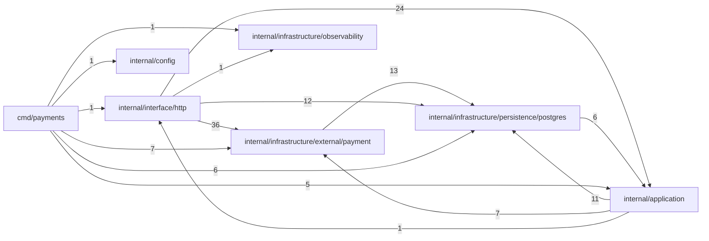

# INDEX_FUNCTIONS — `viralefy_payments`

> **Gerado** por `viralefy_ops/lib/index/build-index.mjs` (§39). Não editar à mão:
> corrija o doc-comment na origem e regenere com `/eng-index`.

| Métrica | Valor |
|---|---|
| Arquivos com função indexada | 27 (de 31 varridos) |
| **N — funções declaradas no código** | **151** |
| **M — entradas neste índice** | **151** |
| Invariante `M == N` | ✅ OK |
| Funções sem doc-comment (§3) | 96 (63.6%) |

Colunas: `de onde vem → pra onde vai` é derivada (camada dos chamadores → efeitos detectados);
`chama (out)` / `é chamada por (in)` vêm do grafo resolvido por nome. As listas inline são
limitadas a 10 nomes com sufixo `+N`; a adjacência COMPLETA está na última seção.

## Grafo de chamadas (por módulo)



## Funções


### `cmd/payments/main.go` — camada `cmd`

| Função | Tipo | O quê | de onde vem → pra onde vai | chama (out) | é chamada por (in) | Efeitos | Linha |
|---|---|---|---|---|---|---|---|
| `main` | func | ⚠ SEM DOC | — → log | NewCurrencyReader, NewWoovi, InitMetrics, New, Close, Pool, NewGatewayRepo, ApplyMigrations, NewStripeEventsRepo, NewRouter +11 | — | log | 23 |

### `internal/application/currency_min.go` — camada `application`

| Função | Tipo | O quê | de onde vem → pra onde vai | chama (out) | é chamada por (in) | Efeitos | Linha |
|---|---|---|---|---|---|---|---|
| `NewCurrencyReader` | func | ⚠ SEM DOC | cmd → db | — | main | db | 23 |
| `(CurrencyReader).GetByCode` | method | GetByCode devolve a moeda pelo código (case-insensitive). | application → db | — | quoteForPlan, AmountInCurrency, buildSingleOption | db | 29 |
| `amountFor` | func | amountFor é a mesma lógica do monólito: se há preço manual no map prices pra essa moeda, usa; senão converte do USD usando o rate. | application → retorno | — | quoteForPlan, AmountInCurrency, buildSingleOption | — | 49 |

### `internal/application/gateway_service.go` — camada `application`

| Função | Tipo | O quê | de onde vem → pra onde vai | chama (out) | é chamada por (in) | Efeitos | Linha |
|---|---|---|---|---|---|---|---|
| `NewGatewayService` | func | ⚠ SEM DOC | cmd → retorno | — | main | — | 16 |
| `validCurrencyCode` | func | validCurrencyCode aceita qualquer ISO 4217 maiúsculo de 3 letras OU códigos crypto comuns. | application → retorno | — | validateGateway | — | 36 |
| `(GatewayService).List` | method | ⚠ SEM DOC | interface+application → interno | ListAll | listGatewaysHandler, ListMethods | — | 48 |
| `(GatewayService).GetActiveByProvider` | method | GetActiveByProvider expõe lookup do gateway ativo de um provider. | infrastructure+interface → interno | GetActiveByProvider | GetActiveByProvider, stripeWebhookHandler, heleketWebhookHandler, wooviWebhookHandler, abacatePayWebhookHandler | — | 54 |
| `(GatewayService).GetByID` | method | GetByID expõe lookup do gateway por id — usado pelo handler de charge. | application+infrastructure+interface → interno | GetByID, GetByID | Update, GetByID, chargeHandler, getGatewayHandler, ListMethods, GetByID | — | 59 |
| `validateGateway` | func | validateGateway centraliza as regras de provider + accepted_currencies. | application → interno | validCurrencyCode | Create, Update | — | 89 |
| `(GatewayService).Create` | method | ⚠ SEM DOC | infrastructure+interface → interno | Create, newID, validateGateway | Create, createGatewayHandler | — | 118 |
| `(GatewayService).Update` | method | ⚠ SEM DOC | infrastructure+interface → interno | GetByID, Update, GetByID, GetByID, validateGateway | Update, updateGatewayHandler | — | 152 |
| `(GatewayService).Delete` | method | ⚠ SEM DOC | infrastructure+interface → interno | Delete | Delete, deleteGatewayHandler, NewRouter | — | 181 |
| `(GatewayService).ListActiveAcceptingCurrency` | method | ListActiveAcceptingCurrency devolve todos os gateways ativos que aceitam a moeda dada. | — → interno | ListAll | — | — | 187 |
| `newID` | func | newID gera um id curto pra gateways (UUID-ish, sem trazer a dep do google/uuid pra esse microsserviço). 16 bytes = 32 hex chars; colisão é negligível pro volume de gateways (dezenas no max). | application → retorno | — | Create | — | 215 |

### `internal/application/payment.go` — camada `application`

| Função | Tipo | O quê | de onde vem → pra onde vai | chama (out) | é chamada por (in) | Efeitos | Linha |
|---|---|---|---|---|---|---|---|
| `NewPaymentRegistry` | func | ⚠ SEM DOC | cmd → interno | Provider, Provider, Provider, Provider, Provider, Provider, Provider | main | — | 43 |
| `(PaymentRegistry).Get` | method | ⚠ SEM DOC | interface → retorno | — | methodsHandler, chargeHandler, InternalAuth, NewRouter, stripeWebhookHandler, wooviWebhookHandler, abacatePayWebhookHandler | — | 51 |

### `internal/application/payment_methods.go` — camada `application`

| Função | Tipo | O quê | de onde vem → pra onde vai | chama (out) | é chamada por (in) | Efeitos | Linha |
|---|---|---|---|---|---|---|---|
| `NewMethodsService` | func | ⚠ SEM DOC | cmd → retorno | — | main | — | 53 |
| `(MethodsService).ListMethods` | method | ListMethods retorna os métodos de pagamento aceitos pra um plano, já com o preview de quanto o cliente paga em cada gateway. | interface → interno | GetByID, quoteForPlan, gatewayEligible, buildMethodOptions, GetByID, List, GetByID | methodsHandler | — | 60 |
| `(MethodsService).quoteForPlan` | method | quoteForPlan é a mesma lógica do CurrencyService.QuoteForPlan do monólito, usando o CurrencyReader local. | application → interno | GetByCode, amountFor | ListMethods | — | 91 |
| `(MethodsService).AmountInCurrency` | method | AmountInCurrency calcula o valor de um plano em uma moeda específica. | interface → interno | GetByCode, amountFor | chargeHandler | — | 119 |
| `gatewayEligible` | func | gatewayEligible decide se um gateway deve aparecer pro cliente. | application → retorno | — | ListMethods | — | 164 |
| `(MethodsService).buildMethodOptions` | method | buildMethodOptions emite SEMPRE UM card por gateway. | application → interno | pickPrimaryCurrency, buildSingleOption | ListMethods | — | 200 |
| `pickPrimaryCurrency` | func | pickPrimaryCurrency centraliza a heurística de "qual moeda do gateway o cliente vê". | application → retorno | — | buildMethodOptions | — | 217 |
| `contains` | closure | ⚠ SEM DOC | — → retorno | — | — | — | 230 |
| `(MethodsService).buildSingleOption` | method | buildSingleOption emite UM PaymentMethodOption pra (gateway, chargedCurrency). | application → interno | GetByCode, kindOf, amountFor | buildMethodOptions | — | 260 |
| `gwAccepts` | func | gwAccepts verifica se um gateway tem currency code em accepted_currencies. | interface → interno | gwAccepts | chargeHandler, gwAccepts | — | 328 |
| `pickChargedCurrency` | func | pickChargedCurrency escolhe a moeda em que o gateway efetivamente cobra. | — → retorno | — | — | — | 340 |
| `kindOf` | func | kindOf mapeia provider → kind genérico (UI usa pra ícone/etiqueta). | application → retorno | — | buildSingleOption | — | 351 |

### `internal/application/plan_min.go` — camada `application`

| Função | Tipo | O quê | de onde vem → pra onde vai | chama (out) | é chamada por (in) | Efeitos | Linha |
|---|---|---|---|---|---|---|---|
| `NewPlanReader` | func | ⚠ SEM DOC | cmd → db | — | main | db | 20 |
| `(PlanReader).GetByID` | method | GetByID hidrata o plano + map de preços manuais (currency → amount). | application+infrastructure+interface → db | Close, GetByID, GetByID | Update, GetByID, chargeHandler, getGatewayHandler, ListMethods, GetByID | db | 26 |

### `internal/config/config.go` — camada `config`

| Função | Tipo | O quê | de onde vem → pra onde vai | chama (out) | é chamada por (in) | Efeitos | Linha |
|---|---|---|---|---|---|---|---|
| `Load` | func | ⚠ SEM DOC | cmd → interno | getenv | main | — | 26 |
| `getenv` | func | ⚠ SEM DOC | config → retorno | — | Load | — | 49 |

### `internal/infrastructure/external/payment/abacatepay.go` — camada `infrastructure`

| Função | Tipo | O quê | de onde vem → pra onde vai | chama (out) | é chamada por (in) | Efeitos | Linha |
|---|---|---|---|---|---|---|---|
| `NewAbacatePay` | func | ⚠ SEM DOC | cmd → retorno | — | main | — | 38 |
| `(AbacatePay).Provider` | method | ⚠ SEM DOC | infrastructure+application → interno | Provider, Provider, Provider, Provider, Provider, Provider | Provider, NewPaymentRegistry, Provider, Provider, Provider, Provider, Provider | — | 42 |
| `validateAbacatePayKey` | func | validateAbacatePayKey aceita só formatos reais. | infrastructure+test → interno | New | CreateCharge, TestValidateAbacatePayKey_AcceptsLiveAndDev, TestValidateAbacatePayKey_RejectsEmpty, TestValidateAbacatePayKey_RejectsUnknownPrefix | — | 47 |
| `(AbacatePay).CreateCharge` | method | CreateCharge gera o PIX dinâmico. | infrastructure+interface → http-out | CreateCharge, Close, validateAbacatePayKey, amountToMinorUnitsAP, truncStr, CreateCharge, CreateCharge, CreateCharge, CreateCharge, CreateCharge | CreateCharge, chargeHandler, CreateCharge, CreateCharge, CreateCharge, CreateCharge, CreateCharge | http-out | 102 |
| `VerifyAbacatePayWebhook` | func | VerifyAbacatePayWebhook valida o header X-Webhook-Signature: computed = base64( HMAC-SHA256(webhook_secret, raw_body) ) Constant-time compare evita timing attack. | interface+test → interno | New | abacatePayWebhookHandler, TestVerifyAbacatePayWebhook_OK, TestVerifyAbacatePayWebhook_TamperedBodyFails, TestVerifyAbacatePayWebhook_MissingSecret, TestVerifyAbacatePayWebhook_MissingHeader | — | 183 |
| `ParseAbacatePayEvent` | func | ⚠ SEM DOC | interface+test → interno | New | abacatePayWebhookHandler, TestParseAbacatePayEvent_PaidExtractsOrderID, TestParseAbacatePayEvent_IgnoresNonCompleted, TestParseAbacatePayEvent_RejectsMissingEvent | — | 215 |
| `(AbacatePayEvent).IsPaid` | method | IsPaid retorna true sse evento de pagamento confirmado (transparent.completed com status PAID). | infrastructure+interface+test → interno | IsPaid, IsPaid, IsPaid | IsPaid, IsPaid, stripeWebhookHandler, heleketWebhookHandler, wooviWebhookHandler, abacatePayWebhookHandler, TestParseAbacatePayEvent_PaidExtractsOrderID, TestParseAbacatePayEvent_IgnoresNonCompleted, IsPaid, TestParseStripeEvent_OK +1 | — | 229 |
| `(AbacatePayEvent).OrderID` | method | OrderID retorna o externalId que setamos no CreateCharge — nosso order_id, usado pelo handler pra chamar /internal/v1/payment-confirmed no monolito. | interface+test+infrastructure → interno | OrderID | stripeWebhookHandler, abacatePayWebhookHandler, TestParseAbacatePayEvent_PaidExtractsOrderID, OrderID, TestParseStripeEvent_OK, TestParseStripeEvent_orderIDFallbackToMetadata | — | 239 |
| `(AbacatePayEvent).ExternalRef` | method | ExternalRef retorna o id do AbacatePay (pix_char_…). | interface+test → retorno | — | abacatePayWebhookHandler, TestParseAbacatePayEvent_PaidExtractsOrderID | — | 246 |
| `amountToMinorUnitsAP` | func | amountToMinorUnitsAP converte "9.90" → 990 (assumindo 2 decimals, BRL). | infrastructure+test → interno | New | CreateCharge, TestAmountToMinorUnitsAP_RoundTrip, TestAmountToMinorUnitsAP_RejectsEmpty | — | 257 |
| `truncStr` | func | ⚠ SEM DOC | infrastructure → retorno | — | CreateCharge | — | 284 |

### `internal/infrastructure/external/payment/abacatepay_test.go` — camada `test`

| Função | Tipo | O quê | de onde vem → pra onde vai | chama (out) | é chamada por (in) | Efeitos | Linha |
|---|---|---|---|---|---|---|---|
| `TestValidateAbacatePayKey_AcceptsLiveAndDev` | func | ⚠ SEM DOC | — → interno | validateAbacatePayKey | — | — | 11 |
| `TestValidateAbacatePayKey_RejectsEmpty` | func | ⚠ SEM DOC | — → interno | validateAbacatePayKey | — | — | 19 |
| `TestValidateAbacatePayKey_RejectsUnknownPrefix` | func | ⚠ SEM DOC | — → interno | validateAbacatePayKey | — | — | 25 |
| `signAbacate` | func | ⚠ SEM DOC | test → interno | New | TestVerifyAbacatePayWebhook_OK, TestVerifyAbacatePayWebhook_TamperedBodyFails | — | 33 |
| `TestVerifyAbacatePayWebhook_OK` | func | ⚠ SEM DOC | — → interno | VerifyAbacatePayWebhook, signAbacate | — | — | 39 |
| `TestVerifyAbacatePayWebhook_TamperedBodyFails` | func | ⚠ SEM DOC | — → interno | VerifyAbacatePayWebhook, signAbacate | — | — | 48 |
| `TestVerifyAbacatePayWebhook_MissingSecret` | func | ⚠ SEM DOC | — → interno | VerifyAbacatePayWebhook | — | — | 56 |
| `TestVerifyAbacatePayWebhook_MissingHeader` | func | ⚠ SEM DOC | — → interno | VerifyAbacatePayWebhook | — | — | 62 |
| `TestParseAbacatePayEvent_PaidExtractsOrderID` | func | ⚠ SEM DOC | — → interno | IsPaid, IsPaid, ParseAbacatePayEvent, IsPaid, OrderID, ExternalRef, IsPaid, OrderID | — | — | 68 |
| `TestParseAbacatePayEvent_IgnoresNonCompleted` | func | ⚠ SEM DOC | — → interno | IsPaid, IsPaid, ParseAbacatePayEvent, IsPaid, IsPaid | — | — | 88 |
| `TestParseAbacatePayEvent_RejectsMissingEvent` | func | ⚠ SEM DOC | — → interno | ParseAbacatePayEvent | — | — | 99 |
| `TestAmountToMinorUnitsAP_RoundTrip` | func | ⚠ SEM DOC | — → interno | amountToMinorUnitsAP | — | — | 105 |
| `TestAmountToMinorUnitsAP_RejectsEmpty` | func | ⚠ SEM DOC | — → interno | amountToMinorUnitsAP | — | — | 123 |

### `internal/infrastructure/external/payment/heleket.go` — camada `infrastructure`

| Função | Tipo | O quê | de onde vem → pra onde vai | chama (out) | é chamada por (in) | Efeitos | Linha |
|---|---|---|---|---|---|---|---|
| `NewHeleket` | func | ⚠ SEM DOC | cmd → retorno | — | main | — | 30 |
| `(Heleket).Provider` | method | ⚠ SEM DOC | infrastructure+application → interno | Provider, Provider, Provider, Provider, Provider, Provider | Provider, NewPaymentRegistry, Provider, Provider, Provider, Provider, Provider | — | 32 |
| `(Heleket).CreateCharge` | method | ⚠ SEM DOC | infrastructure+interface → http-out | CreateCharge, truncate, Close, CreateCharge, CreateCharge, CreateCharge, CreateCharge, CreateCharge | CreateCharge, chargeHandler, CreateCharge, CreateCharge, CreateCharge, CreateCharge, CreateCharge | http-out | 60 |

### `internal/infrastructure/external/payment/manual.go` — camada `infrastructure`

| Função | Tipo | O quê | de onde vem → pra onde vai | chama (out) | é chamada por (in) | Efeitos | Linha |
|---|---|---|---|---|---|---|---|
| `NewManualPIX` | func | ⚠ SEM DOC | cmd → retorno | — | main | — | 14 |
| `(ManualPIX).Provider` | method | ⚠ SEM DOC | infrastructure+application → interno | Provider, Provider, Provider, Provider, Provider, Provider | Provider, NewPaymentRegistry, Provider, Provider, Provider, Provider, Provider | — | 16 |
| `(ManualPIX).CreateCharge` | method | ⚠ SEM DOC | infrastructure+interface → interno | CreateCharge, CreateCharge, CreateCharge, CreateCharge, CreateCharge, CreateCharge | CreateCharge, chargeHandler, CreateCharge, CreateCharge, CreateCharge, CreateCharge, CreateCharge | — | 18 |

### `internal/infrastructure/external/payment/manual_crypto.go` — camada `infrastructure`

| Função | Tipo | O quê | de onde vem → pra onde vai | chama (out) | é chamada por (in) | Efeitos | Linha |
|---|---|---|---|---|---|---|---|
| `NewManualCrypto` | func | ⚠ SEM DOC | cmd → retorno | — | main | — | 20 |
| `(ManualCrypto).Provider` | method | ⚠ SEM DOC | infrastructure+application → interno | Provider, Provider, Provider, Provider, Provider, Provider | Provider, NewPaymentRegistry, Provider, Provider, Provider, Provider, Provider | — | 22 |
| `(ManualCrypto).CreateCharge` | method | ⚠ SEM DOC | infrastructure+interface → interno | CreateCharge, CreateCharge, CreateCharge, CreateCharge, defaultStr, CreateCharge, CreateCharge | CreateCharge, chargeHandler, CreateCharge, CreateCharge, CreateCharge, CreateCharge, CreateCharge | — | 24 |
| `defaultStr` | func | ⚠ SEM DOC | infrastructure → retorno | — | CreateCharge | — | 47 |

### `internal/infrastructure/external/payment/manual_usdt.go` — camada `infrastructure`

| Função | Tipo | O quê | de onde vem → pra onde vai | chama (out) | é chamada por (in) | Efeitos | Linha |
|---|---|---|---|---|---|---|---|
| `NewManualUSDT` | func | ⚠ SEM DOC | cmd → retorno | — | main | — | 15 |
| `(ManualUSDT).Provider` | method | ⚠ SEM DOC | infrastructure+application → interno | Provider, Provider, Provider, Provider, Provider, Provider | Provider, NewPaymentRegistry, Provider, Provider, Provider, Provider, Provider | — | 17 |
| `(ManualUSDT).CreateCharge` | method | ⚠ SEM DOC | infrastructure+interface → interno | CreateCharge, CreateCharge, CreateCharge, CreateCharge, CreateCharge, CreateCharge | CreateCharge, chargeHandler, CreateCharge, CreateCharge, CreateCharge, CreateCharge, CreateCharge | — | 19 |

### `internal/infrastructure/external/payment/stripe.go` — camada `infrastructure`

| Função | Tipo | O quê | de onde vem → pra onde vai | chama (out) | é chamada por (in) | Efeitos | Linha |
|---|---|---|---|---|---|---|---|
| `NewStripe` | func | ⚠ SEM DOC | cmd → retorno | — | main | — | 40 |
| `(Stripe).Provider` | method | ⚠ SEM DOC | infrastructure+application → evento | Provider, Provider, Provider, Provider, Provider, Provider | Provider, NewPaymentRegistry, Provider, Provider, Provider, Provider, Provider | evento | 47 |
| `validateStripeKey` | func | ⚠ SEM DOC | infrastructure+test → evento | — | CreateCharge, TestValidateStripeKey_AcceptsSecretAndRestricted, TestValidateStripeKey_RejectsPublishable, TestValidateStripeKey_RejectsEmpty, TestValidateStripeKey_RejectsUnknownPrefix | evento | 54 |
| `(Stripe).CreateCharge` | method | ⚠ SEM DOC | infrastructure+interface → http-out | CreateCharge, Close, CreateCharge, CreateCharge, CreateCharge, CreateCharge, CreateCharge, validateStripeKey, amountToMinorUnits, truncateStripe | CreateCharge, chargeHandler, CreateCharge, CreateCharge, CreateCharge, CreateCharge, CreateCharge | http-out | 69 |
| `amountToMinorUnits` | func | amountToMinorUnits converte "9.90" -> 990 (assumindo 2 decimals). | infrastructure → retorno | — | CreateCharge | — | 151 |
| `truncateStripe` | func | ⚠ SEM DOC | infrastructure → retorno | — | CreateCharge | — | 187 |
| `VerifyStripeWebhook` | func | VerifyStripeWebhook valida a assinatura `Stripe-Signature` (HMAC SHA256 do `timestamp.payload` usando o webhook secret). | interface+test → interno | New, abs64 | stripeWebhookHandler, TestVerifyStripeWebhook_OK_singleV1, TestVerifyStripeWebhook_OK_multipleV1_roating, TestVerifyStripeWebhook_InvalidSignature, TestVerifyStripeWebhook_ExpiredTimestamp, TestVerifyStripeWebhook_FutureTimestamp_rejected, TestVerifyStripeWebhook_MissingSecret, TestVerifyStripeWebhook_MissingHeader, TestVerifyStripeWebhook_MalformedHeader, TestVerifyStripeWebhook_ConstantTimeCompare_correctSigStillMatches | — | 199 |
| `abs64` | func | ⚠ SEM DOC | infrastructure → retorno | — | VerifyStripeWebhook | — | 244 |
| `(StripeEvent).IsPaid` | method | ⚠ SEM DOC | infrastructure+interface+test → interno | IsPaid, IsPaid, IsPaid | IsPaid, IsPaid, stripeWebhookHandler, heleketWebhookHandler, wooviWebhookHandler, abacatePayWebhookHandler, IsPaid, TestParseAbacatePayEvent_PaidExtractsOrderID, TestParseAbacatePayEvent_IgnoresNonCompleted, TestParseStripeEvent_OK +1 | — | 265 |
| `(StripeEvent).OrderID` | method | OrderID resolve o id do pedido — prioriza client_reference_id, fallback metadata.order_id. | interface+infrastructure+test → interno | OrderID | stripeWebhookHandler, abacatePayWebhookHandler, OrderID, TestParseAbacatePayEvent_PaidExtractsOrderID, TestParseStripeEvent_OK, TestParseStripeEvent_orderIDFallbackToMetadata | — | 274 |
| `ParseStripeEvent` | func | ParseStripeEvent decodifica o JSON do webhook. | interface+test → retorno | — | stripeWebhookHandler, TestParseStripeEvent_OK, TestParseStripeEvent_orderIDFallbackToMetadata, TestStripeEvent_IsPaid_ignoresUnrelatedTypes, TestParseStripeEvent_rejectsMissingType | — | 283 |

### `internal/infrastructure/external/payment/stripe_test.go` — camada `test`

| Função | Tipo | O quê | de onde vem → pra onde vai | chama (out) | é chamada por (in) | Efeitos | Linha |
|---|---|---|---|---|---|---|---|
| `sign` | func | sign monta um Stripe-Signature header sintético que o VerifyStripeWebhook aceita. | test → interno | New | TestVerifyStripeWebhook_OK_singleV1, TestVerifyStripeWebhook_ExpiredTimestamp, TestVerifyStripeWebhook_FutureTimestamp_rejected, TestVerifyStripeWebhook_ConstantTimeCompare_correctSigStillMatches | — | 15 |
| `TestVerifyStripeWebhook_OK_singleV1` | func | ⚠ SEM DOC | — → interno | VerifyStripeWebhook, sign | — | — | 23 |
| `TestVerifyStripeWebhook_OK_multipleV1_roating` | func | ⚠ SEM DOC | — → interno | New, VerifyStripeWebhook | — | — | 32 |
| `TestVerifyStripeWebhook_InvalidSignature` | func | ⚠ SEM DOC | — → interno | VerifyStripeWebhook | — | — | 48 |
| `TestVerifyStripeWebhook_ExpiredTimestamp` | func | ⚠ SEM DOC | — → interno | VerifyStripeWebhook, sign | — | — | 56 |
| `TestVerifyStripeWebhook_FutureTimestamp_rejected` | func | ⚠ SEM DOC | — → interno | VerifyStripeWebhook, sign | — | — | 69 |
| `TestVerifyStripeWebhook_MissingSecret` | func | ⚠ SEM DOC | — → interno | VerifyStripeWebhook | — | — | 80 |
| `TestVerifyStripeWebhook_MissingHeader` | func | ⚠ SEM DOC | — → interno | VerifyStripeWebhook | — | — | 86 |
| `TestVerifyStripeWebhook_MalformedHeader` | func | ⚠ SEM DOC | — → interno | VerifyStripeWebhook | — | — | 92 |
| `TestParseStripeEvent_OK` | func | ⚠ SEM DOC | — → interno | IsPaid, IsPaid, IsPaid, OrderID, IsPaid, OrderID, ParseStripeEvent | — | — | 109 |
| `TestParseStripeEvent_orderIDFallbackToMetadata` | func | ⚠ SEM DOC | — → interno | OrderID, OrderID, ParseStripeEvent | — | — | 127 |
| `TestStripeEvent_IsPaid_ignoresUnrelatedTypes` | func | ⚠ SEM DOC | — → interno | IsPaid, IsPaid, IsPaid, IsPaid, ParseStripeEvent | — | — | 139 |
| `TestParseStripeEvent_rejectsMissingType` | func | ⚠ SEM DOC | — → interno | ParseStripeEvent | — | — | 151 |
| `TestVerifyStripeWebhook_ConstantTimeCompare_correctSigStillMatches` | func | ⚠ SEM DOC | — → interno | VerifyStripeWebhook, sign | — | — | 158 |
| `TestValidateStripeKey_AcceptsSecretAndRestricted` | func | ⚠ SEM DOC | — → interno | validateStripeKey | — | — | 168 |
| `TestValidateStripeKey_RejectsPublishable` | func | ⚠ SEM DOC | — → evento | validateStripeKey | — | evento | 181 |
| `TestValidateStripeKey_RejectsEmpty` | func | ⚠ SEM DOC | — → interno | validateStripeKey | — | — | 191 |
| `TestValidateStripeKey_RejectsUnknownPrefix` | func | ⚠ SEM DOC | — → interno | validateStripeKey | — | — | 197 |

### `internal/infrastructure/external/payment/webhooks.go` — camada `infrastructure`

| Função | Tipo | O quê | de onde vem → pra onde vai | chama (out) | é chamada por (in) | Efeitos | Linha |
|---|---|---|---|---|---|---|---|
| `VerifyWooviWebhook` | func | VerifyWooviWebhook valida a assinatura HMAC-SHA256 do webhook. | interface → interno | New | wooviWebhookHandler | — | 16 |
| `ParseWooviEvent` | func | ⚠ SEM DOC | interface → retorno | — | wooviWebhookHandler | — | 43 |
| `(WooviEvent).IsPaid` | method | IsPaid retorna true se este evento Woovi indica pagamento confirmado. | infrastructure+interface+test → interno | IsPaid, IsPaid, IsPaid | IsPaid, stripeWebhookHandler, heleketWebhookHandler, wooviWebhookHandler, abacatePayWebhookHandler, IsPaid, TestParseAbacatePayEvent_PaidExtractsOrderID, TestParseAbacatePayEvent_IgnoresNonCompleted, IsPaid, TestParseStripeEvent_OK +1 | — | 52 |
| `VerifyHeleketWebhook` | func | VerifyHeleketWebhook valida a assinatura embutida no body: sign = md5( base64(body_sem_o_campo_sign) + api_key ). | interface → retorno | — | heleketWebhookHandler | — | 60 |
| `ParseHeleketEvent` | func | ⚠ SEM DOC | interface → retorno | — | heleketWebhookHandler | — | 97 |
| `(HeleketEvent).IsPaid` | method | ⚠ SEM DOC | infrastructure+interface+test → interno | IsPaid, IsPaid, IsPaid | IsPaid, stripeWebhookHandler, heleketWebhookHandler, wooviWebhookHandler, abacatePayWebhookHandler, IsPaid, TestParseAbacatePayEvent_PaidExtractsOrderID, TestParseAbacatePayEvent_IgnoresNonCompleted, IsPaid, TestParseStripeEvent_OK +1 | — | 105 |

### `internal/infrastructure/external/payment/woovi.go` — camada `infrastructure`

| Função | Tipo | O quê | de onde vem → pra onde vai | chama (out) | é chamada por (in) | Efeitos | Linha |
|---|---|---|---|---|---|---|---|
| `NewWoovi` | func | ⚠ SEM DOC | cmd → retorno | — | main | — | 26 |
| `(Woovi).Provider` | method | ⚠ SEM DOC | application+infrastructure → interno | Provider, Provider, Provider, Provider, Provider, Provider | NewPaymentRegistry, Provider, Provider, Provider, Provider, Provider, Provider | — | 28 |
| `(Woovi).CreateCharge` | method | ⚠ SEM DOC | interface+infrastructure → http-out | toMinor, truncate, Close, CreateCharge, CreateCharge, CreateCharge, CreateCharge, CreateCharge, CreateCharge | chargeHandler, CreateCharge, CreateCharge, CreateCharge, CreateCharge, CreateCharge, CreateCharge | http-out | 55 |
| `toMinor` | func | toMinor converte "9.90" → 990 (decimais=2). | infrastructure → retorno | — | CreateCharge | — | 113 |
| `truncate` | func | ⚠ SEM DOC | infrastructure → retorno | — | CreateCharge, CreateCharge | — | 122 |

### `internal/infrastructure/observability/metrics.go` — camada `infrastructure`

| Função | Tipo | O quê | de onde vem → pra onde vai | chama (out) | é chamada por (in) | Efeitos | Linha |
|---|---|---|---|---|---|---|---|
| `InitMetrics` | func | InitMetrics regista os collectors num Registry isolado. | cmd+infrastructure → retorno | — | main, MetricsHandler | — | 67 |
| `MetricsHandler` | func | MetricsHandler devolve o handler HTTP do /metrics. | interface → interno | InitMetrics | NewRouter | — | 84 |
| `HTTPMiddleware` | func | HTTPMiddleware instrumenta cada request com http_requests_total + http_request_duration_seconds. | — → interno | ObserveDBQuery | — | — | 97 |
| `ObserveDBQuery` | func | ObserveDBQuery: shorthand para instrumentar uma query SQL. defer observability.ObserveDBQuery("select_charge")(time.Now()) | infrastructure → retorno | — | HTTPMiddleware | — | 125 |

### `internal/infrastructure/persistence/postgres/db.go` — camada `infrastructure`

| Função | Tipo | O quê | de onde vem → pra onde vai | chama (out) | é chamada por (in) | Efeitos | Linha |
|---|---|---|---|---|---|---|---|
| `New` | func | ⚠ SEM DOC | cmd+infrastructure+test → db | Close | main, validateAbacatePayKey, VerifyAbacatePayWebhook, ParseAbacatePayEvent, amountToMinorUnitsAP, signAbacate, VerifyStripeWebhook, sign, TestVerifyStripeWebhook_OK_multipleV1_roating, VerifyWooviWebhook | db | 15 |
| `(DB).Close` | method | ⚠ SEM DOC | cmd+infrastructure+interface+application → retorno | — | main, CreateCharge, New, ListAll, postCallback, GetByID, CreateCharge, CreateCharge, CreateCharge | — | 27 |
| `(DB).Pool` | method | ⚠ SEM DOC | cmd → db | — | main | db | 31 |
| `(DB).Migrate` | method | ⚠ SEM DOC | infrastructure → db | — | ApplyMigrations | db | 35 |

### `internal/infrastructure/persistence/postgres/gateway_repo.go` — camada `infrastructure`

| Função | Tipo | O quê | de onde vem → pra onde vai | chama (out) | é chamada por (in) | Efeitos | Linha |
|---|---|---|---|---|---|---|---|
| `NewGatewayRepo` | func | ⚠ SEM DOC | cmd → retorno | — | main | — | 15 |
| `(GatewayRepo).ListAll` | method | ⚠ SEM DOC | application → db | Close, scanGateway | ListActiveAcceptingCurrency, List | db | 23 |
| `(GatewayRepo).GetByID` | method | ⚠ SEM DOC | application+interface → db | scanGateway, GetByID, GetByID | Update, chargeHandler, getGatewayHandler, ListMethods, GetByID, GetByID | db | 41 |
| `(GatewayRepo).GetDefaultActive` | method | ⚠ SEM DOC | — → db | scanGateway | — | db | 51 |
| `(GatewayRepo).GetActiveByProvider` | method | ⚠ SEM DOC | interface+application → db | scanGateway, GetActiveByProvider | stripeWebhookHandler, heleketWebhookHandler, wooviWebhookHandler, abacatePayWebhookHandler, GetActiveByProvider | db | 61 |
| `(GatewayRepo).Create` | method | ⚠ SEM DOC | application+interface → db | Create | Create, createGatewayHandler | db | 72 |
| `(GatewayRepo).Update` | method | ⚠ SEM DOC | application+interface → db | Update | Update, updateGatewayHandler | db | 85 |
| `(GatewayRepo).Delete` | method | ⚠ SEM DOC | application+interface → db | Delete | Delete, deleteGatewayHandler, NewRouter | db | 105 |
| `scanGateway` | func | ⚠ SEM DOC | infrastructure → db | — | ListAll, GetByID, GetDefaultActive, GetActiveByProvider | db | 116 |

### `internal/infrastructure/persistence/postgres/migrations.go` — camada `infrastructure`

| Função | Tipo | O quê | de onde vem → pra onde vai | chama (out) | é chamada por (in) | Efeitos | Linha |
|---|---|---|---|---|---|---|---|
| `(DB).ApplyMigrations` | method | ApplyMigrations roda todas as migrations idempotentes do payments service. | cmd → interno | Migrate | main | — | 18 |

### `internal/infrastructure/persistence/postgres/stripe_events.go` — camada `infrastructure`

| Função | Tipo | O quê | de onde vem → pra onde vai | chama (out) | é chamada por (in) | Efeitos | Linha |
|---|---|---|---|---|---|---|---|
| `NewStripeEventsRepo` | func | ⚠ SEM DOC | cmd → db | — | main | db | 10 |
| `(StripeEventsRepo).Record` | method | Record marca um event_id como processado. | interface → db | — | stripeWebhookHandler | db | 16 |

### `internal/interface/http/contract_test.go` — camada `test`

| Função | Tipo | O quê | de onde vem → pra onde vai | chama (out) | é chamada por (in) | Efeitos | Linha |
|---|---|---|---|---|---|---|---|
| `TestChargeResponseShape_MatchesClient` | func | ⚠ SEM DOC | — → retorno | — | — | — | 27 |
| `TestMethodsEnvelope_MatchesClient` | func | TestMethodsEnvelope_MatchesClient garante que continuamos emitindo o envelope {"methods":[...]} e não array raw. | — → interno | writeJSON | — | — | 73 |
| `TestErrorShape` | func | TestErrorShape mantém o contrato {"error":"..."} pra 4xx — o client trunca a 300 chars e enfia no Go error. | — → retorno | — | — | — | 93 |

### `internal/interface/http/handlers.go` — camada `interface`

| Função | Tipo | O quê | de onde vem → pra onde vai | chama (out) | é chamada por (in) | Efeitos | Linha |
|---|---|---|---|---|---|---|---|
| `writeJSON` | func | writeJSON serializa v em JSON com o status code dado. | test+interface → retorno | — | TestMethodsEnvelope_MatchesClient, writeErr, methodsHandler, chargeHandler, listGatewaysHandler, createGatewayHandler, updateGatewayHandler, getGatewayHandler, stripeWebhookHandler, heleketWebhookHandler +2 | — | 42 |
| `writeErr` | func | writeErr serializa um erro como {error: msg}. mapErrStatus traduz erros canônicos (ErrInvalidInput → 422, ErrNotFound → 404) — qualquer outro erro vira 500 (com mensagem genérica pra não vazar deta… | interface → interno | writeJSON | methodsHandler, chargeHandler, listGatewaysHandler, createGatewayHandler, updateGatewayHandler, deleteGatewayHandler, getGatewayHandler | — | 51 |
| `(Deps).methodsHandler` | method | methodsHandler responde GET /internal/v1/methods?plan_id=&display_currency=&country=. | externo (borda) → db | writeJSON, writeErr, Get, ListMethods | — | db | 69 |
| `(Deps).chargeHandler` | method | ⚠ SEM DOC | externo (borda) → interno | CreateCharge, GetByID, writeJSON, writeErr, gwAccepts, Get, AmountInCurrency, gwAccepts, GetByID, CreateCharge +6 | — | — | 115 |
| `gwAccepts` | func | gwAccepts replica a util do payment_methods.go sem expor o helper privado. | interface+application → interno | gwAccepts | chargeHandler, gwAccepts | — | 207 |
| `(Deps).listGatewaysHandler` | method | ─── /internal/v1/gateways CRUD ──────────────────────────────────────────── | externo (borda) → interno | writeJSON, writeErr, List | — | — | 219 |
| `(Deps).createGatewayHandler` | method | ⚠ SEM DOC | externo (borda) → interno | Create, Create, writeJSON, writeErr | — | — | 228 |
| `(Deps).updateGatewayHandler` | method | ⚠ SEM DOC | externo (borda) → interno | Update, Update, writeJSON, writeErr | — | — | 242 |
| `(Deps).deleteGatewayHandler` | method | ⚠ SEM DOC | externo (borda) → interno | Delete, Delete, writeErr | — | — | 258 |
| `(Deps).getGatewayHandler` | method | ⚠ SEM DOC | externo (borda) → interno | GetByID, writeJSON, writeErr, GetByID, GetByID | — | — | 267 |

### `internal/interface/http/internal_auth.go` — camada `interface`

| Função | Tipo | O quê | de onde vem → pra onde vai | chama (out) | é chamada por (in) | Efeitos | Linha |
|---|---|---|---|---|---|---|---|
| `InternalAuth` | func | InternalAuth devolve um middleware que rejeita 401 quando o header X-Internal-Token não corresponde ao INTERNAL_SHARED_SECRET configurado. | interface → interno | Get | NewRouter | — | 19 |

### `internal/interface/http/router.go` — camada `interface`

| Função | Tipo | O quê | de onde vem → pra onde vai | chama (out) | é chamada por (in) | Efeitos | Linha |
|---|---|---|---|---|---|---|---|
| `NewRouter` | func | NewRouter monta o chi.Router com middlewares padrão do projeto: RequestID, RealIP, OTel HTTP, Recoverer. | cmd → interno | MetricsHandler, Delete, Delete, InternalAuth, Get | main | — | 25 |
| `health` | func | ⚠ SEM DOC | externo (borda) → retorno | — | — | — | 75 |

### `internal/interface/http/webhooks.go` — camada `interface`

| Função | Tipo | O quê | de onde vem → pra onde vai | chama (out) | é chamada por (in) | Efeitos | Linha |
|---|---|---|---|---|---|---|---|
| `(Deps).stripeWebhookHandler` | method | stripeWebhookHandler valida Stripe-Signature e dispara callback. | externo (borda) → log | IsPaid, IsPaid, GetActiveByProvider, Record, writeJSON, postCallback, Get, IsPaid, OrderID, GetActiveByProvider +4 | — | log | 33 |
| `(Deps).heleketWebhookHandler` | method | heleketWebhookHandler valida sign embutido + dispara callback. | externo (borda) → log | IsPaid, VerifyHeleketWebhook, ParseHeleketEvent, IsPaid, GetActiveByProvider, writeJSON, postCallback, IsPaid, GetActiveByProvider, IsPaid | — | log | 82 |
| `(Deps).wooviWebhookHandler` | method | wooviWebhookHandler valida x-webhook-signature + dispara callback. | externo (borda) → log | ParseWooviEvent, IsPaid, IsPaid, GetActiveByProvider, writeJSON, postCallback, Get, IsPaid, GetActiveByProvider, IsPaid +1 | — | log | 113 |
| `(Deps).abacatePayWebhookHandler` | method | abacatePayWebhookHandler valida X-Webhook-Signature + dispara callback. | externo (borda) → log | IsPaid, IsPaid, GetActiveByProvider, writeJSON, postCallback, Get, VerifyAbacatePayWebhook, ParseAbacatePayEvent, IsPaid, OrderID +4 | — | log | 146 |
| `(Deps).postCallback` | method | postCallback dispara POST {API_INTERNAL_CALLBACK_URL}/internal/v1/payment-confirmed com X-Internal-Token. | interface → log | Close | stripeWebhookHandler, heleketWebhookHandler, wooviWebhookHandler, abacatePayWebhookHandler | log | 181 |

## Adjacência completa (grep-able)

```text
main -> NewCurrencyReader   (cmd/payments/main.go:23 -> internal/application/currency_min.go:23)
main -> NewWoovi   (cmd/payments/main.go:23 -> internal/infrastructure/external/payment/woovi.go:26)
main -> InitMetrics   (cmd/payments/main.go:23 -> internal/infrastructure/observability/metrics.go:67)
main -> New   (cmd/payments/main.go:23 -> internal/infrastructure/persistence/postgres/db.go:15)
main -> Close   (cmd/payments/main.go:23 -> internal/infrastructure/persistence/postgres/db.go:27)
main -> Pool   (cmd/payments/main.go:23 -> internal/infrastructure/persistence/postgres/db.go:31)
main -> NewGatewayRepo   (cmd/payments/main.go:23 -> internal/infrastructure/persistence/postgres/gateway_repo.go:15)
main -> ApplyMigrations   (cmd/payments/main.go:23 -> internal/infrastructure/persistence/postgres/migrations.go:18)
main -> NewStripeEventsRepo   (cmd/payments/main.go:23 -> internal/infrastructure/persistence/postgres/stripe_events.go:10)
main -> NewRouter   (cmd/payments/main.go:23 -> internal/interface/http/router.go:25)
main -> NewPaymentRegistry   (cmd/payments/main.go:23 -> internal/application/payment.go:43)
main -> NewMethodsService   (cmd/payments/main.go:23 -> internal/application/payment_methods.go:53)
main -> NewPlanReader   (cmd/payments/main.go:23 -> internal/application/plan_min.go:20)
main -> Load   (cmd/payments/main.go:23 -> internal/config/config.go:26)
main -> NewAbacatePay   (cmd/payments/main.go:23 -> internal/infrastructure/external/payment/abacatepay.go:38)
main -> NewGatewayService   (cmd/payments/main.go:23 -> internal/application/gateway_service.go:16)
main -> NewHeleket   (cmd/payments/main.go:23 -> internal/infrastructure/external/payment/heleket.go:30)
main -> NewManualPIX   (cmd/payments/main.go:23 -> internal/infrastructure/external/payment/manual.go:14)
main -> NewManualCrypto   (cmd/payments/main.go:23 -> internal/infrastructure/external/payment/manual_crypto.go:20)
main -> NewManualUSDT   (cmd/payments/main.go:23 -> internal/infrastructure/external/payment/manual_usdt.go:15)
main -> NewStripe   (cmd/payments/main.go:23 -> internal/infrastructure/external/payment/stripe.go:40)
List -> ListAll   (internal/application/gateway_service.go:48 -> internal/infrastructure/persistence/postgres/gateway_repo.go:23)
GetActiveByProvider -> GetActiveByProvider   (internal/application/gateway_service.go:54 -> internal/infrastructure/persistence/postgres/gateway_repo.go:61)
GetByID -> GetByID   (internal/application/gateway_service.go:59 -> internal/infrastructure/persistence/postgres/gateway_repo.go:41)
GetByID -> GetByID   (internal/application/gateway_service.go:59 -> internal/application/plan_min.go:26)
validateGateway -> validCurrencyCode   (internal/application/gateway_service.go:89 -> internal/application/gateway_service.go:36)
Create -> Create   (internal/application/gateway_service.go:118 -> internal/infrastructure/persistence/postgres/gateway_repo.go:72)
Create -> newID   (internal/application/gateway_service.go:118 -> internal/application/gateway_service.go:215)
Create -> validateGateway   (internal/application/gateway_service.go:118 -> internal/application/gateway_service.go:89)
Update -> GetByID   (internal/application/gateway_service.go:152 -> internal/infrastructure/persistence/postgres/gateway_repo.go:41)
Update -> Update   (internal/application/gateway_service.go:152 -> internal/infrastructure/persistence/postgres/gateway_repo.go:85)
Update -> GetByID   (internal/application/gateway_service.go:152 -> internal/application/plan_min.go:26)
Update -> GetByID   (internal/application/gateway_service.go:152 -> internal/application/gateway_service.go:59)
Update -> validateGateway   (internal/application/gateway_service.go:152 -> internal/application/gateway_service.go:89)
Delete -> Delete   (internal/application/gateway_service.go:181 -> internal/infrastructure/persistence/postgres/gateway_repo.go:105)
ListActiveAcceptingCurrency -> ListAll   (internal/application/gateway_service.go:187 -> internal/infrastructure/persistence/postgres/gateway_repo.go:23)
NewPaymentRegistry -> Provider   (internal/application/payment.go:43 -> internal/infrastructure/external/payment/woovi.go:28)
NewPaymentRegistry -> Provider   (internal/application/payment.go:43 -> internal/infrastructure/external/payment/abacatepay.go:42)
NewPaymentRegistry -> Provider   (internal/application/payment.go:43 -> internal/infrastructure/external/payment/heleket.go:32)
NewPaymentRegistry -> Provider   (internal/application/payment.go:43 -> internal/infrastructure/external/payment/manual.go:16)
NewPaymentRegistry -> Provider   (internal/application/payment.go:43 -> internal/infrastructure/external/payment/manual_crypto.go:22)
NewPaymentRegistry -> Provider   (internal/application/payment.go:43 -> internal/infrastructure/external/payment/manual_usdt.go:17)
NewPaymentRegistry -> Provider   (internal/application/payment.go:43 -> internal/infrastructure/external/payment/stripe.go:47)
ListMethods -> GetByID   (internal/application/payment_methods.go:60 -> internal/infrastructure/persistence/postgres/gateway_repo.go:41)
ListMethods -> quoteForPlan   (internal/application/payment_methods.go:60 -> internal/application/payment_methods.go:91)
ListMethods -> gatewayEligible   (internal/application/payment_methods.go:60 -> internal/application/payment_methods.go:164)
ListMethods -> buildMethodOptions   (internal/application/payment_methods.go:60 -> internal/application/payment_methods.go:200)
ListMethods -> GetByID   (internal/application/payment_methods.go:60 -> internal/application/plan_min.go:26)
ListMethods -> List   (internal/application/payment_methods.go:60 -> internal/application/gateway_service.go:48)
ListMethods -> GetByID   (internal/application/payment_methods.go:60 -> internal/application/gateway_service.go:59)
quoteForPlan -> GetByCode   (internal/application/payment_methods.go:91 -> internal/application/currency_min.go:29)
quoteForPlan -> amountFor   (internal/application/payment_methods.go:91 -> internal/application/currency_min.go:49)
AmountInCurrency -> GetByCode   (internal/application/payment_methods.go:119 -> internal/application/currency_min.go:29)
AmountInCurrency -> amountFor   (internal/application/payment_methods.go:119 -> internal/application/currency_min.go:49)
buildMethodOptions -> pickPrimaryCurrency   (internal/application/payment_methods.go:200 -> internal/application/payment_methods.go:217)
buildMethodOptions -> buildSingleOption   (internal/application/payment_methods.go:200 -> internal/application/payment_methods.go:260)
buildSingleOption -> GetByCode   (internal/application/payment_methods.go:260 -> internal/application/currency_min.go:29)
buildSingleOption -> kindOf   (internal/application/payment_methods.go:260 -> internal/application/payment_methods.go:351)
buildSingleOption -> amountFor   (internal/application/payment_methods.go:260 -> internal/application/currency_min.go:49)
gwAccepts -> gwAccepts   (internal/application/payment_methods.go:328 -> internal/interface/http/handlers.go:207)
GetByID -> Close   (internal/application/plan_min.go:26 -> internal/infrastructure/persistence/postgres/db.go:27)
GetByID -> GetByID   (internal/application/plan_min.go:26 -> internal/infrastructure/persistence/postgres/gateway_repo.go:41)
GetByID -> GetByID   (internal/application/plan_min.go:26 -> internal/application/gateway_service.go:59)
Load -> getenv   (internal/config/config.go:26 -> internal/config/config.go:49)
Provider -> Provider   (internal/infrastructure/external/payment/abacatepay.go:42 -> internal/infrastructure/external/payment/woovi.go:28)
Provider -> Provider   (internal/infrastructure/external/payment/abacatepay.go:42 -> internal/infrastructure/external/payment/heleket.go:32)
Provider -> Provider   (internal/infrastructure/external/payment/abacatepay.go:42 -> internal/infrastructure/external/payment/manual.go:16)
Provider -> Provider   (internal/infrastructure/external/payment/abacatepay.go:42 -> internal/infrastructure/external/payment/manual_crypto.go:22)
Provider -> Provider   (internal/infrastructure/external/payment/abacatepay.go:42 -> internal/infrastructure/external/payment/manual_usdt.go:17)
Provider -> Provider   (internal/infrastructure/external/payment/abacatepay.go:42 -> internal/infrastructure/external/payment/stripe.go:47)
validateAbacatePayKey -> New   (internal/infrastructure/external/payment/abacatepay.go:47 -> internal/infrastructure/persistence/postgres/db.go:15)
CreateCharge -> CreateCharge   (internal/infrastructure/external/payment/abacatepay.go:102 -> internal/infrastructure/external/payment/woovi.go:55)
CreateCharge -> Close   (internal/infrastructure/external/payment/abacatepay.go:102 -> internal/infrastructure/persistence/postgres/db.go:27)
CreateCharge -> validateAbacatePayKey   (internal/infrastructure/external/payment/abacatepay.go:102 -> internal/infrastructure/external/payment/abacatepay.go:47)
CreateCharge -> amountToMinorUnitsAP   (internal/infrastructure/external/payment/abacatepay.go:102 -> internal/infrastructure/external/payment/abacatepay.go:257)
CreateCharge -> truncStr   (internal/infrastructure/external/payment/abacatepay.go:102 -> internal/infrastructure/external/payment/abacatepay.go:284)
CreateCharge -> CreateCharge   (internal/infrastructure/external/payment/abacatepay.go:102 -> internal/infrastructure/external/payment/heleket.go:60)
CreateCharge -> CreateCharge   (internal/infrastructure/external/payment/abacatepay.go:102 -> internal/infrastructure/external/payment/manual.go:18)
CreateCharge -> CreateCharge   (internal/infrastructure/external/payment/abacatepay.go:102 -> internal/infrastructure/external/payment/manual_crypto.go:24)
CreateCharge -> CreateCharge   (internal/infrastructure/external/payment/abacatepay.go:102 -> internal/infrastructure/external/payment/manual_usdt.go:19)
CreateCharge -> CreateCharge   (internal/infrastructure/external/payment/abacatepay.go:102 -> internal/infrastructure/external/payment/stripe.go:69)
VerifyAbacatePayWebhook -> New   (internal/infrastructure/external/payment/abacatepay.go:183 -> internal/infrastructure/persistence/postgres/db.go:15)
ParseAbacatePayEvent -> New   (internal/infrastructure/external/payment/abacatepay.go:215 -> internal/infrastructure/persistence/postgres/db.go:15)
IsPaid -> IsPaid   (internal/infrastructure/external/payment/abacatepay.go:229 -> internal/infrastructure/external/payment/webhooks.go:52)
IsPaid -> IsPaid   (internal/infrastructure/external/payment/abacatepay.go:229 -> internal/infrastructure/external/payment/webhooks.go:105)
IsPaid -> IsPaid   (internal/infrastructure/external/payment/abacatepay.go:229 -> internal/infrastructure/external/payment/stripe.go:265)
OrderID -> OrderID   (internal/infrastructure/external/payment/abacatepay.go:239 -> internal/infrastructure/external/payment/stripe.go:274)
amountToMinorUnitsAP -> New   (internal/infrastructure/external/payment/abacatepay.go:257 -> internal/infrastructure/persistence/postgres/db.go:15)
TestValidateAbacatePayKey_AcceptsLiveAndDev -> validateAbacatePayKey   (internal/infrastructure/external/payment/abacatepay_test.go:11 -> internal/infrastructure/external/payment/abacatepay.go:47)
TestValidateAbacatePayKey_RejectsEmpty -> validateAbacatePayKey   (internal/infrastructure/external/payment/abacatepay_test.go:19 -> internal/infrastructure/external/payment/abacatepay.go:47)
TestValidateAbacatePayKey_RejectsUnknownPrefix -> validateAbacatePayKey   (internal/infrastructure/external/payment/abacatepay_test.go:25 -> internal/infrastructure/external/payment/abacatepay.go:47)
signAbacate -> New   (internal/infrastructure/external/payment/abacatepay_test.go:33 -> internal/infrastructure/persistence/postgres/db.go:15)
TestVerifyAbacatePayWebhook_OK -> VerifyAbacatePayWebhook   (internal/infrastructure/external/payment/abacatepay_test.go:39 -> internal/infrastructure/external/payment/abacatepay.go:183)
TestVerifyAbacatePayWebhook_OK -> signAbacate   (internal/infrastructure/external/payment/abacatepay_test.go:39 -> internal/infrastructure/external/payment/abacatepay_test.go:33)
TestVerifyAbacatePayWebhook_TamperedBodyFails -> VerifyAbacatePayWebhook   (internal/infrastructure/external/payment/abacatepay_test.go:48 -> internal/infrastructure/external/payment/abacatepay.go:183)
TestVerifyAbacatePayWebhook_TamperedBodyFails -> signAbacate   (internal/infrastructure/external/payment/abacatepay_test.go:48 -> internal/infrastructure/external/payment/abacatepay_test.go:33)
TestVerifyAbacatePayWebhook_MissingSecret -> VerifyAbacatePayWebhook   (internal/infrastructure/external/payment/abacatepay_test.go:56 -> internal/infrastructure/external/payment/abacatepay.go:183)
TestVerifyAbacatePayWebhook_MissingHeader -> VerifyAbacatePayWebhook   (internal/infrastructure/external/payment/abacatepay_test.go:62 -> internal/infrastructure/external/payment/abacatepay.go:183)
TestParseAbacatePayEvent_PaidExtractsOrderID -> IsPaid   (internal/infrastructure/external/payment/abacatepay_test.go:68 -> internal/infrastructure/external/payment/webhooks.go:52)
TestParseAbacatePayEvent_PaidExtractsOrderID -> IsPaid   (internal/infrastructure/external/payment/abacatepay_test.go:68 -> internal/infrastructure/external/payment/webhooks.go:105)
TestParseAbacatePayEvent_PaidExtractsOrderID -> ParseAbacatePayEvent   (internal/infrastructure/external/payment/abacatepay_test.go:68 -> internal/infrastructure/external/payment/abacatepay.go:215)
TestParseAbacatePayEvent_PaidExtractsOrderID -> IsPaid   (internal/infrastructure/external/payment/abacatepay_test.go:68 -> internal/infrastructure/external/payment/abacatepay.go:229)
TestParseAbacatePayEvent_PaidExtractsOrderID -> OrderID   (internal/infrastructure/external/payment/abacatepay_test.go:68 -> internal/infrastructure/external/payment/abacatepay.go:239)
TestParseAbacatePayEvent_PaidExtractsOrderID -> ExternalRef   (internal/infrastructure/external/payment/abacatepay_test.go:68 -> internal/infrastructure/external/payment/abacatepay.go:246)
TestParseAbacatePayEvent_PaidExtractsOrderID -> IsPaid   (internal/infrastructure/external/payment/abacatepay_test.go:68 -> internal/infrastructure/external/payment/stripe.go:265)
TestParseAbacatePayEvent_PaidExtractsOrderID -> OrderID   (internal/infrastructure/external/payment/abacatepay_test.go:68 -> internal/infrastructure/external/payment/stripe.go:274)
TestParseAbacatePayEvent_IgnoresNonCompleted -> IsPaid   (internal/infrastructure/external/payment/abacatepay_test.go:88 -> internal/infrastructure/external/payment/webhooks.go:52)
TestParseAbacatePayEvent_IgnoresNonCompleted -> IsPaid   (internal/infrastructure/external/payment/abacatepay_test.go:88 -> internal/infrastructure/external/payment/webhooks.go:105)
TestParseAbacatePayEvent_IgnoresNonCompleted -> ParseAbacatePayEvent   (internal/infrastructure/external/payment/abacatepay_test.go:88 -> internal/infrastructure/external/payment/abacatepay.go:215)
TestParseAbacatePayEvent_IgnoresNonCompleted -> IsPaid   (internal/infrastructure/external/payment/abacatepay_test.go:88 -> internal/infrastructure/external/payment/abacatepay.go:229)
TestParseAbacatePayEvent_IgnoresNonCompleted -> IsPaid   (internal/infrastructure/external/payment/abacatepay_test.go:88 -> internal/infrastructure/external/payment/stripe.go:265)
TestParseAbacatePayEvent_RejectsMissingEvent -> ParseAbacatePayEvent   (internal/infrastructure/external/payment/abacatepay_test.go:99 -> internal/infrastructure/external/payment/abacatepay.go:215)
TestAmountToMinorUnitsAP_RoundTrip -> amountToMinorUnitsAP   (internal/infrastructure/external/payment/abacatepay_test.go:105 -> internal/infrastructure/external/payment/abacatepay.go:257)
TestAmountToMinorUnitsAP_RejectsEmpty -> amountToMinorUnitsAP   (internal/infrastructure/external/payment/abacatepay_test.go:123 -> internal/infrastructure/external/payment/abacatepay.go:257)
Provider -> Provider   (internal/infrastructure/external/payment/heleket.go:32 -> internal/infrastructure/external/payment/woovi.go:28)
Provider -> Provider   (internal/infrastructure/external/payment/heleket.go:32 -> internal/infrastructure/external/payment/abacatepay.go:42)
Provider -> Provider   (internal/infrastructure/external/payment/heleket.go:32 -> internal/infrastructure/external/payment/manual.go:16)
Provider -> Provider   (internal/infrastructure/external/payment/heleket.go:32 -> internal/infrastructure/external/payment/manual_crypto.go:22)
Provider -> Provider   (internal/infrastructure/external/payment/heleket.go:32 -> internal/infrastructure/external/payment/manual_usdt.go:17)
Provider -> Provider   (internal/infrastructure/external/payment/heleket.go:32 -> internal/infrastructure/external/payment/stripe.go:47)
CreateCharge -> CreateCharge   (internal/infrastructure/external/payment/heleket.go:60 -> internal/infrastructure/external/payment/woovi.go:55)
CreateCharge -> truncate   (internal/infrastructure/external/payment/heleket.go:60 -> internal/infrastructure/external/payment/woovi.go:122)
CreateCharge -> Close   (internal/infrastructure/external/payment/heleket.go:60 -> internal/infrastructure/persistence/postgres/db.go:27)
CreateCharge -> CreateCharge   (internal/infrastructure/external/payment/heleket.go:60 -> internal/infrastructure/external/payment/abacatepay.go:102)
CreateCharge -> CreateCharge   (internal/infrastructure/external/payment/heleket.go:60 -> internal/infrastructure/external/payment/manual.go:18)
CreateCharge -> CreateCharge   (internal/infrastructure/external/payment/heleket.go:60 -> internal/infrastructure/external/payment/manual_crypto.go:24)
CreateCharge -> CreateCharge   (internal/infrastructure/external/payment/heleket.go:60 -> internal/infrastructure/external/payment/manual_usdt.go:19)
CreateCharge -> CreateCharge   (internal/infrastructure/external/payment/heleket.go:60 -> internal/infrastructure/external/payment/stripe.go:69)
Provider -> Provider   (internal/infrastructure/external/payment/manual.go:16 -> internal/infrastructure/external/payment/woovi.go:28)
Provider -> Provider   (internal/infrastructure/external/payment/manual.go:16 -> internal/infrastructure/external/payment/abacatepay.go:42)
Provider -> Provider   (internal/infrastructure/external/payment/manual.go:16 -> internal/infrastructure/external/payment/heleket.go:32)
Provider -> Provider   (internal/infrastructure/external/payment/manual.go:16 -> internal/infrastructure/external/payment/manual_crypto.go:22)
Provider -> Provider   (internal/infrastructure/external/payment/manual.go:16 -> internal/infrastructure/external/payment/manual_usdt.go:17)
Provider -> Provider   (internal/infrastructure/external/payment/manual.go:16 -> internal/infrastructure/external/payment/stripe.go:47)
CreateCharge -> CreateCharge   (internal/infrastructure/external/payment/manual.go:18 -> internal/infrastructure/external/payment/woovi.go:55)
CreateCharge -> CreateCharge   (internal/infrastructure/external/payment/manual.go:18 -> internal/infrastructure/external/payment/abacatepay.go:102)
CreateCharge -> CreateCharge   (internal/infrastructure/external/payment/manual.go:18 -> internal/infrastructure/external/payment/heleket.go:60)
CreateCharge -> CreateCharge   (internal/infrastructure/external/payment/manual.go:18 -> internal/infrastructure/external/payment/manual_crypto.go:24)
CreateCharge -> CreateCharge   (internal/infrastructure/external/payment/manual.go:18 -> internal/infrastructure/external/payment/manual_usdt.go:19)
CreateCharge -> CreateCharge   (internal/infrastructure/external/payment/manual.go:18 -> internal/infrastructure/external/payment/stripe.go:69)
Provider -> Provider   (internal/infrastructure/external/payment/manual_crypto.go:22 -> internal/infrastructure/external/payment/woovi.go:28)
Provider -> Provider   (internal/infrastructure/external/payment/manual_crypto.go:22 -> internal/infrastructure/external/payment/abacatepay.go:42)
Provider -> Provider   (internal/infrastructure/external/payment/manual_crypto.go:22 -> internal/infrastructure/external/payment/heleket.go:32)
Provider -> Provider   (internal/infrastructure/external/payment/manual_crypto.go:22 -> internal/infrastructure/external/payment/manual.go:16)
Provider -> Provider   (internal/infrastructure/external/payment/manual_crypto.go:22 -> internal/infrastructure/external/payment/manual_usdt.go:17)
Provider -> Provider   (internal/infrastructure/external/payment/manual_crypto.go:22 -> internal/infrastructure/external/payment/stripe.go:47)
CreateCharge -> CreateCharge   (internal/infrastructure/external/payment/manual_crypto.go:24 -> internal/infrastructure/external/payment/woovi.go:55)
CreateCharge -> CreateCharge   (internal/infrastructure/external/payment/manual_crypto.go:24 -> internal/infrastructure/external/payment/abacatepay.go:102)
CreateCharge -> CreateCharge   (internal/infrastructure/external/payment/manual_crypto.go:24 -> internal/infrastructure/external/payment/heleket.go:60)
CreateCharge -> CreateCharge   (internal/infrastructure/external/payment/manual_crypto.go:24 -> internal/infrastructure/external/payment/manual.go:18)
CreateCharge -> defaultStr   (internal/infrastructure/external/payment/manual_crypto.go:24 -> internal/infrastructure/external/payment/manual_crypto.go:47)
CreateCharge -> CreateCharge   (internal/infrastructure/external/payment/manual_crypto.go:24 -> internal/infrastructure/external/payment/manual_usdt.go:19)
CreateCharge -> CreateCharge   (internal/infrastructure/external/payment/manual_crypto.go:24 -> internal/infrastructure/external/payment/stripe.go:69)
Provider -> Provider   (internal/infrastructure/external/payment/manual_usdt.go:17 -> internal/infrastructure/external/payment/woovi.go:28)
Provider -> Provider   (internal/infrastructure/external/payment/manual_usdt.go:17 -> internal/infrastructure/external/payment/abacatepay.go:42)
Provider -> Provider   (internal/infrastructure/external/payment/manual_usdt.go:17 -> internal/infrastructure/external/payment/heleket.go:32)
Provider -> Provider   (internal/infrastructure/external/payment/manual_usdt.go:17 -> internal/infrastructure/external/payment/manual.go:16)
Provider -> Provider   (internal/infrastructure/external/payment/manual_usdt.go:17 -> internal/infrastructure/external/payment/manual_crypto.go:22)
Provider -> Provider   (internal/infrastructure/external/payment/manual_usdt.go:17 -> internal/infrastructure/external/payment/stripe.go:47)
CreateCharge -> CreateCharge   (internal/infrastructure/external/payment/manual_usdt.go:19 -> internal/infrastructure/external/payment/woovi.go:55)
CreateCharge -> CreateCharge   (internal/infrastructure/external/payment/manual_usdt.go:19 -> internal/infrastructure/external/payment/abacatepay.go:102)
CreateCharge -> CreateCharge   (internal/infrastructure/external/payment/manual_usdt.go:19 -> internal/infrastructure/external/payment/heleket.go:60)
CreateCharge -> CreateCharge   (internal/infrastructure/external/payment/manual_usdt.go:19 -> internal/infrastructure/external/payment/manual.go:18)
CreateCharge -> CreateCharge   (internal/infrastructure/external/payment/manual_usdt.go:19 -> internal/infrastructure/external/payment/manual_crypto.go:24)
CreateCharge -> CreateCharge   (internal/infrastructure/external/payment/manual_usdt.go:19 -> internal/infrastructure/external/payment/stripe.go:69)
Provider -> Provider   (internal/infrastructure/external/payment/stripe.go:47 -> internal/infrastructure/external/payment/woovi.go:28)
Provider -> Provider   (internal/infrastructure/external/payment/stripe.go:47 -> internal/infrastructure/external/payment/abacatepay.go:42)
Provider -> Provider   (internal/infrastructure/external/payment/stripe.go:47 -> internal/infrastructure/external/payment/heleket.go:32)
Provider -> Provider   (internal/infrastructure/external/payment/stripe.go:47 -> internal/infrastructure/external/payment/manual.go:16)
Provider -> Provider   (internal/infrastructure/external/payment/stripe.go:47 -> internal/infrastructure/external/payment/manual_crypto.go:22)
Provider -> Provider   (internal/infrastructure/external/payment/stripe.go:47 -> internal/infrastructure/external/payment/manual_usdt.go:17)
CreateCharge -> CreateCharge   (internal/infrastructure/external/payment/stripe.go:69 -> internal/infrastructure/external/payment/woovi.go:55)
CreateCharge -> Close   (internal/infrastructure/external/payment/stripe.go:69 -> internal/infrastructure/persistence/postgres/db.go:27)
CreateCharge -> CreateCharge   (internal/infrastructure/external/payment/stripe.go:69 -> internal/infrastructure/external/payment/abacatepay.go:102)
CreateCharge -> CreateCharge   (internal/infrastructure/external/payment/stripe.go:69 -> internal/infrastructure/external/payment/heleket.go:60)
CreateCharge -> CreateCharge   (internal/infrastructure/external/payment/stripe.go:69 -> internal/infrastructure/external/payment/manual.go:18)
CreateCharge -> CreateCharge   (internal/infrastructure/external/payment/stripe.go:69 -> internal/infrastructure/external/payment/manual_crypto.go:24)
CreateCharge -> CreateCharge   (internal/infrastructure/external/payment/stripe.go:69 -> internal/infrastructure/external/payment/manual_usdt.go:19)
CreateCharge -> validateStripeKey   (internal/infrastructure/external/payment/stripe.go:69 -> internal/infrastructure/external/payment/stripe.go:54)
CreateCharge -> amountToMinorUnits   (internal/infrastructure/external/payment/stripe.go:69 -> internal/infrastructure/external/payment/stripe.go:151)
CreateCharge -> truncateStripe   (internal/infrastructure/external/payment/stripe.go:69 -> internal/infrastructure/external/payment/stripe.go:187)
VerifyStripeWebhook -> New   (internal/infrastructure/external/payment/stripe.go:199 -> internal/infrastructure/persistence/postgres/db.go:15)
VerifyStripeWebhook -> abs64   (internal/infrastructure/external/payment/stripe.go:199 -> internal/infrastructure/external/payment/stripe.go:244)
IsPaid -> IsPaid   (internal/infrastructure/external/payment/stripe.go:265 -> internal/infrastructure/external/payment/webhooks.go:52)
IsPaid -> IsPaid   (internal/infrastructure/external/payment/stripe.go:265 -> internal/infrastructure/external/payment/webhooks.go:105)
IsPaid -> IsPaid   (internal/infrastructure/external/payment/stripe.go:265 -> internal/infrastructure/external/payment/abacatepay.go:229)
OrderID -> OrderID   (internal/infrastructure/external/payment/stripe.go:274 -> internal/infrastructure/external/payment/abacatepay.go:239)
sign -> New   (internal/infrastructure/external/payment/stripe_test.go:15 -> internal/infrastructure/persistence/postgres/db.go:15)
TestVerifyStripeWebhook_OK_singleV1 -> VerifyStripeWebhook   (internal/infrastructure/external/payment/stripe_test.go:23 -> internal/infrastructure/external/payment/stripe.go:199)
TestVerifyStripeWebhook_OK_singleV1 -> sign   (internal/infrastructure/external/payment/stripe_test.go:23 -> internal/infrastructure/external/payment/stripe_test.go:15)
TestVerifyStripeWebhook_OK_multipleV1_roating -> New   (internal/infrastructure/external/payment/stripe_test.go:32 -> internal/infrastructure/persistence/postgres/db.go:15)
TestVerifyStripeWebhook_OK_multipleV1_roating -> VerifyStripeWebhook   (internal/infrastructure/external/payment/stripe_test.go:32 -> internal/infrastructure/external/payment/stripe.go:199)
TestVerifyStripeWebhook_InvalidSignature -> VerifyStripeWebhook   (internal/infrastructure/external/payment/stripe_test.go:48 -> internal/infrastructure/external/payment/stripe.go:199)
TestVerifyStripeWebhook_ExpiredTimestamp -> VerifyStripeWebhook   (internal/infrastructure/external/payment/stripe_test.go:56 -> internal/infrastructure/external/payment/stripe.go:199)
TestVerifyStripeWebhook_ExpiredTimestamp -> sign   (internal/infrastructure/external/payment/stripe_test.go:56 -> internal/infrastructure/external/payment/stripe_test.go:15)
TestVerifyStripeWebhook_FutureTimestamp_rejected -> VerifyStripeWebhook   (internal/infrastructure/external/payment/stripe_test.go:69 -> internal/infrastructure/external/payment/stripe.go:199)
TestVerifyStripeWebhook_FutureTimestamp_rejected -> sign   (internal/infrastructure/external/payment/stripe_test.go:69 -> internal/infrastructure/external/payment/stripe_test.go:15)
TestVerifyStripeWebhook_MissingSecret -> VerifyStripeWebhook   (internal/infrastructure/external/payment/stripe_test.go:80 -> internal/infrastructure/external/payment/stripe.go:199)
TestVerifyStripeWebhook_MissingHeader -> VerifyStripeWebhook   (internal/infrastructure/external/payment/stripe_test.go:86 -> internal/infrastructure/external/payment/stripe.go:199)
TestVerifyStripeWebhook_MalformedHeader -> VerifyStripeWebhook   (internal/infrastructure/external/payment/stripe_test.go:92 -> internal/infrastructure/external/payment/stripe.go:199)
TestParseStripeEvent_OK -> IsPaid   (internal/infrastructure/external/payment/stripe_test.go:109 -> internal/infrastructure/external/payment/webhooks.go:52)
TestParseStripeEvent_OK -> IsPaid   (internal/infrastructure/external/payment/stripe_test.go:109 -> internal/infrastructure/external/payment/webhooks.go:105)
TestParseStripeEvent_OK -> IsPaid   (internal/infrastructure/external/payment/stripe_test.go:109 -> internal/infrastructure/external/payment/abacatepay.go:229)
TestParseStripeEvent_OK -> OrderID   (internal/infrastructure/external/payment/stripe_test.go:109 -> internal/infrastructure/external/payment/abacatepay.go:239)
TestParseStripeEvent_OK -> IsPaid   (internal/infrastructure/external/payment/stripe_test.go:109 -> internal/infrastructure/external/payment/stripe.go:265)
TestParseStripeEvent_OK -> OrderID   (internal/infrastructure/external/payment/stripe_test.go:109 -> internal/infrastructure/external/payment/stripe.go:274)
TestParseStripeEvent_OK -> ParseStripeEvent   (internal/infrastructure/external/payment/stripe_test.go:109 -> internal/infrastructure/external/payment/stripe.go:283)
TestParseStripeEvent_orderIDFallbackToMetadata -> OrderID   (internal/infrastructure/external/payment/stripe_test.go:127 -> internal/infrastructure/external/payment/abacatepay.go:239)
TestParseStripeEvent_orderIDFallbackToMetadata -> OrderID   (internal/infrastructure/external/payment/stripe_test.go:127 -> internal/infrastructure/external/payment/stripe.go:274)
TestParseStripeEvent_orderIDFallbackToMetadata -> ParseStripeEvent   (internal/infrastructure/external/payment/stripe_test.go:127 -> internal/infrastructure/external/payment/stripe.go:283)
TestStripeEvent_IsPaid_ignoresUnrelatedTypes -> IsPaid   (internal/infrastructure/external/payment/stripe_test.go:139 -> internal/infrastructure/external/payment/webhooks.go:52)
TestStripeEvent_IsPaid_ignoresUnrelatedTypes -> IsPaid   (internal/infrastructure/external/payment/stripe_test.go:139 -> internal/infrastructure/external/payment/webhooks.go:105)
TestStripeEvent_IsPaid_ignoresUnrelatedTypes -> IsPaid   (internal/infrastructure/external/payment/stripe_test.go:139 -> internal/infrastructure/external/payment/abacatepay.go:229)
TestStripeEvent_IsPaid_ignoresUnrelatedTypes -> IsPaid   (internal/infrastructure/external/payment/stripe_test.go:139 -> internal/infrastructure/external/payment/stripe.go:265)
TestStripeEvent_IsPaid_ignoresUnrelatedTypes -> ParseStripeEvent   (internal/infrastructure/external/payment/stripe_test.go:139 -> internal/infrastructure/external/payment/stripe.go:283)
TestParseStripeEvent_rejectsMissingType -> ParseStripeEvent   (internal/infrastructure/external/payment/stripe_test.go:151 -> internal/infrastructure/external/payment/stripe.go:283)
TestVerifyStripeWebhook_ConstantTimeCompare_correctSigStillMatches -> VerifyStripeWebhook   (internal/infrastructure/external/payment/stripe_test.go:158 -> internal/infrastructure/external/payment/stripe.go:199)
TestVerifyStripeWebhook_ConstantTimeCompare_correctSigStillMatches -> sign   (internal/infrastructure/external/payment/stripe_test.go:158 -> internal/infrastructure/external/payment/stripe_test.go:15)
TestValidateStripeKey_AcceptsSecretAndRestricted -> validateStripeKey   (internal/infrastructure/external/payment/stripe_test.go:168 -> internal/infrastructure/external/payment/stripe.go:54)
TestValidateStripeKey_RejectsPublishable -> validateStripeKey   (internal/infrastructure/external/payment/stripe_test.go:181 -> internal/infrastructure/external/payment/stripe.go:54)
TestValidateStripeKey_RejectsEmpty -> validateStripeKey   (internal/infrastructure/external/payment/stripe_test.go:191 -> internal/infrastructure/external/payment/stripe.go:54)
TestValidateStripeKey_RejectsUnknownPrefix -> validateStripeKey   (internal/infrastructure/external/payment/stripe_test.go:197 -> internal/infrastructure/external/payment/stripe.go:54)
VerifyWooviWebhook -> New   (internal/infrastructure/external/payment/webhooks.go:16 -> internal/infrastructure/persistence/postgres/db.go:15)
IsPaid -> IsPaid   (internal/infrastructure/external/payment/webhooks.go:52 -> internal/infrastructure/external/payment/webhooks.go:105)
IsPaid -> IsPaid   (internal/infrastructure/external/payment/webhooks.go:52 -> internal/infrastructure/external/payment/abacatepay.go:229)
IsPaid -> IsPaid   (internal/infrastructure/external/payment/webhooks.go:52 -> internal/infrastructure/external/payment/stripe.go:265)
IsPaid -> IsPaid   (internal/infrastructure/external/payment/webhooks.go:105 -> internal/infrastructure/external/payment/webhooks.go:52)
IsPaid -> IsPaid   (internal/infrastructure/external/payment/webhooks.go:105 -> internal/infrastructure/external/payment/abacatepay.go:229)
IsPaid -> IsPaid   (internal/infrastructure/external/payment/webhooks.go:105 -> internal/infrastructure/external/payment/stripe.go:265)
Provider -> Provider   (internal/infrastructure/external/payment/woovi.go:28 -> internal/infrastructure/external/payment/abacatepay.go:42)
Provider -> Provider   (internal/infrastructure/external/payment/woovi.go:28 -> internal/infrastructure/external/payment/heleket.go:32)
Provider -> Provider   (internal/infrastructure/external/payment/woovi.go:28 -> internal/infrastructure/external/payment/manual.go:16)
Provider -> Provider   (internal/infrastructure/external/payment/woovi.go:28 -> internal/infrastructure/external/payment/manual_crypto.go:22)
Provider -> Provider   (internal/infrastructure/external/payment/woovi.go:28 -> internal/infrastructure/external/payment/manual_usdt.go:17)
Provider -> Provider   (internal/infrastructure/external/payment/woovi.go:28 -> internal/infrastructure/external/payment/stripe.go:47)
CreateCharge -> toMinor   (internal/infrastructure/external/payment/woovi.go:55 -> internal/infrastructure/external/payment/woovi.go:113)
CreateCharge -> truncate   (internal/infrastructure/external/payment/woovi.go:55 -> internal/infrastructure/external/payment/woovi.go:122)
CreateCharge -> Close   (internal/infrastructure/external/payment/woovi.go:55 -> internal/infrastructure/persistence/postgres/db.go:27)
CreateCharge -> CreateCharge   (internal/infrastructure/external/payment/woovi.go:55 -> internal/infrastructure/external/payment/abacatepay.go:102)
CreateCharge -> CreateCharge   (internal/infrastructure/external/payment/woovi.go:55 -> internal/infrastructure/external/payment/heleket.go:60)
CreateCharge -> CreateCharge   (internal/infrastructure/external/payment/woovi.go:55 -> internal/infrastructure/external/payment/manual.go:18)
CreateCharge -> CreateCharge   (internal/infrastructure/external/payment/woovi.go:55 -> internal/infrastructure/external/payment/manual_crypto.go:24)
CreateCharge -> CreateCharge   (internal/infrastructure/external/payment/woovi.go:55 -> internal/infrastructure/external/payment/manual_usdt.go:19)
CreateCharge -> CreateCharge   (internal/infrastructure/external/payment/woovi.go:55 -> internal/infrastructure/external/payment/stripe.go:69)
MetricsHandler -> InitMetrics   (internal/infrastructure/observability/metrics.go:84 -> internal/infrastructure/observability/metrics.go:67)
HTTPMiddleware -> ObserveDBQuery   (internal/infrastructure/observability/metrics.go:97 -> internal/infrastructure/observability/metrics.go:125)
New -> Close   (internal/infrastructure/persistence/postgres/db.go:15 -> internal/infrastructure/persistence/postgres/db.go:27)
ListAll -> Close   (internal/infrastructure/persistence/postgres/gateway_repo.go:23 -> internal/infrastructure/persistence/postgres/db.go:27)
ListAll -> scanGateway   (internal/infrastructure/persistence/postgres/gateway_repo.go:23 -> internal/infrastructure/persistence/postgres/gateway_repo.go:116)
GetByID -> scanGateway   (internal/infrastructure/persistence/postgres/gateway_repo.go:41 -> internal/infrastructure/persistence/postgres/gateway_repo.go:116)
GetByID -> GetByID   (internal/infrastructure/persistence/postgres/gateway_repo.go:41 -> internal/application/plan_min.go:26)
GetByID -> GetByID   (internal/infrastructure/persistence/postgres/gateway_repo.go:41 -> internal/application/gateway_service.go:59)
GetDefaultActive -> scanGateway   (internal/infrastructure/persistence/postgres/gateway_repo.go:51 -> internal/infrastructure/persistence/postgres/gateway_repo.go:116)
GetActiveByProvider -> scanGateway   (internal/infrastructure/persistence/postgres/gateway_repo.go:61 -> internal/infrastructure/persistence/postgres/gateway_repo.go:116)
GetActiveByProvider -> GetActiveByProvider   (internal/infrastructure/persistence/postgres/gateway_repo.go:61 -> internal/application/gateway_service.go:54)
Create -> Create   (internal/infrastructure/persistence/postgres/gateway_repo.go:72 -> internal/application/gateway_service.go:118)
Update -> Update   (internal/infrastructure/persistence/postgres/gateway_repo.go:85 -> internal/application/gateway_service.go:152)
Delete -> Delete   (internal/infrastructure/persistence/postgres/gateway_repo.go:105 -> internal/application/gateway_service.go:181)
ApplyMigrations -> Migrate   (internal/infrastructure/persistence/postgres/migrations.go:18 -> internal/infrastructure/persistence/postgres/db.go:35)
TestMethodsEnvelope_MatchesClient -> writeJSON   (internal/interface/http/contract_test.go:73 -> internal/interface/http/handlers.go:42)
writeErr -> writeJSON   (internal/interface/http/handlers.go:51 -> internal/interface/http/handlers.go:42)
methodsHandler -> writeJSON   (internal/interface/http/handlers.go:69 -> internal/interface/http/handlers.go:42)
methodsHandler -> writeErr   (internal/interface/http/handlers.go:69 -> internal/interface/http/handlers.go:51)
methodsHandler -> Get   (internal/interface/http/handlers.go:69 -> internal/application/payment.go:51)
methodsHandler -> ListMethods   (internal/interface/http/handlers.go:69 -> internal/application/payment_methods.go:60)
chargeHandler -> CreateCharge   (internal/interface/http/handlers.go:115 -> internal/infrastructure/external/payment/woovi.go:55)
chargeHandler -> GetByID   (internal/interface/http/handlers.go:115 -> internal/infrastructure/persistence/postgres/gateway_repo.go:41)
chargeHandler -> writeJSON   (internal/interface/http/handlers.go:115 -> internal/interface/http/handlers.go:42)
chargeHandler -> writeErr   (internal/interface/http/handlers.go:115 -> internal/interface/http/handlers.go:51)
chargeHandler -> gwAccepts   (internal/interface/http/handlers.go:115 -> internal/interface/http/handlers.go:207)
chargeHandler -> Get   (internal/interface/http/handlers.go:115 -> internal/application/payment.go:51)
chargeHandler -> AmountInCurrency   (internal/interface/http/handlers.go:115 -> internal/application/payment_methods.go:119)
chargeHandler -> gwAccepts   (internal/interface/http/handlers.go:115 -> internal/application/payment_methods.go:328)
chargeHandler -> GetByID   (internal/interface/http/handlers.go:115 -> internal/application/plan_min.go:26)
chargeHandler -> CreateCharge   (internal/interface/http/handlers.go:115 -> internal/infrastructure/external/payment/abacatepay.go:102)
chargeHandler -> CreateCharge   (internal/interface/http/handlers.go:115 -> internal/infrastructure/external/payment/heleket.go:60)
chargeHandler -> CreateCharge   (internal/interface/http/handlers.go:115 -> internal/infrastructure/external/payment/manual.go:18)
chargeHandler -> CreateCharge   (internal/interface/http/handlers.go:115 -> internal/infrastructure/external/payment/manual_crypto.go:24)
chargeHandler -> CreateCharge   (internal/interface/http/handlers.go:115 -> internal/infrastructure/external/payment/manual_usdt.go:19)
chargeHandler -> CreateCharge   (internal/interface/http/handlers.go:115 -> internal/infrastructure/external/payment/stripe.go:69)
chargeHandler -> GetByID   (internal/interface/http/handlers.go:115 -> internal/application/gateway_service.go:59)
gwAccepts -> gwAccepts   (internal/interface/http/handlers.go:207 -> internal/application/payment_methods.go:328)
listGatewaysHandler -> writeJSON   (internal/interface/http/handlers.go:219 -> internal/interface/http/handlers.go:42)
listGatewaysHandler -> writeErr   (internal/interface/http/handlers.go:219 -> internal/interface/http/handlers.go:51)
listGatewaysHandler -> List   (internal/interface/http/handlers.go:219 -> internal/application/gateway_service.go:48)
createGatewayHandler -> Create   (internal/interface/http/handlers.go:228 -> internal/application/gateway_service.go:118)
createGatewayHandler -> Create   (internal/interface/http/handlers.go:228 -> internal/infrastructure/persistence/postgres/gateway_repo.go:72)
createGatewayHandler -> writeJSON   (internal/interface/http/handlers.go:228 -> internal/interface/http/handlers.go:42)
createGatewayHandler -> writeErr   (internal/interface/http/handlers.go:228 -> internal/interface/http/handlers.go:51)
updateGatewayHandler -> Update   (internal/interface/http/handlers.go:242 -> internal/application/gateway_service.go:152)
updateGatewayHandler -> Update   (internal/interface/http/handlers.go:242 -> internal/infrastructure/persistence/postgres/gateway_repo.go:85)
updateGatewayHandler -> writeJSON   (internal/interface/http/handlers.go:242 -> internal/interface/http/handlers.go:42)
updateGatewayHandler -> writeErr   (internal/interface/http/handlers.go:242 -> internal/interface/http/handlers.go:51)
deleteGatewayHandler -> Delete   (internal/interface/http/handlers.go:258 -> internal/application/gateway_service.go:181)
deleteGatewayHandler -> Delete   (internal/interface/http/handlers.go:258 -> internal/infrastructure/persistence/postgres/gateway_repo.go:105)
deleteGatewayHandler -> writeErr   (internal/interface/http/handlers.go:258 -> internal/interface/http/handlers.go:51)
getGatewayHandler -> GetByID   (internal/interface/http/handlers.go:267 -> internal/infrastructure/persistence/postgres/gateway_repo.go:41)
getGatewayHandler -> writeJSON   (internal/interface/http/handlers.go:267 -> internal/interface/http/handlers.go:42)
getGatewayHandler -> writeErr   (internal/interface/http/handlers.go:267 -> internal/interface/http/handlers.go:51)
getGatewayHandler -> GetByID   (internal/interface/http/handlers.go:267 -> internal/application/plan_min.go:26)
getGatewayHandler -> GetByID   (internal/interface/http/handlers.go:267 -> internal/application/gateway_service.go:59)
InternalAuth -> Get   (internal/interface/http/internal_auth.go:19 -> internal/application/payment.go:51)
NewRouter -> MetricsHandler   (internal/interface/http/router.go:25 -> internal/infrastructure/observability/metrics.go:84)
NewRouter -> Delete   (internal/interface/http/router.go:25 -> internal/application/gateway_service.go:181)
NewRouter -> Delete   (internal/interface/http/router.go:25 -> internal/infrastructure/persistence/postgres/gateway_repo.go:105)
NewRouter -> InternalAuth   (internal/interface/http/router.go:25 -> internal/interface/http/internal_auth.go:19)
NewRouter -> Get   (internal/interface/http/router.go:25 -> internal/application/payment.go:51)
stripeWebhookHandler -> IsPaid   (internal/interface/http/webhooks.go:33 -> internal/infrastructure/external/payment/webhooks.go:52)
stripeWebhookHandler -> IsPaid   (internal/interface/http/webhooks.go:33 -> internal/infrastructure/external/payment/webhooks.go:105)
stripeWebhookHandler -> GetActiveByProvider   (internal/interface/http/webhooks.go:33 -> internal/infrastructure/persistence/postgres/gateway_repo.go:61)
stripeWebhookHandler -> Record   (internal/interface/http/webhooks.go:33 -> internal/infrastructure/persistence/postgres/stripe_events.go:16)
stripeWebhookHandler -> writeJSON   (internal/interface/http/webhooks.go:33 -> internal/interface/http/handlers.go:42)
stripeWebhookHandler -> postCallback   (internal/interface/http/webhooks.go:33 -> internal/interface/http/webhooks.go:181)
stripeWebhookHandler -> Get   (internal/interface/http/webhooks.go:33 -> internal/application/payment.go:51)
stripeWebhookHandler -> IsPaid   (internal/interface/http/webhooks.go:33 -> internal/infrastructure/external/payment/abacatepay.go:229)
stripeWebhookHandler -> OrderID   (internal/interface/http/webhooks.go:33 -> internal/infrastructure/external/payment/abacatepay.go:239)
stripeWebhookHandler -> GetActiveByProvider   (internal/interface/http/webhooks.go:33 -> internal/application/gateway_service.go:54)
stripeWebhookHandler -> VerifyStripeWebhook   (internal/interface/http/webhooks.go:33 -> internal/infrastructure/external/payment/stripe.go:199)
stripeWebhookHandler -> IsPaid   (internal/interface/http/webhooks.go:33 -> internal/infrastructure/external/payment/stripe.go:265)
stripeWebhookHandler -> OrderID   (internal/interface/http/webhooks.go:33 -> internal/infrastructure/external/payment/stripe.go:274)
stripeWebhookHandler -> ParseStripeEvent   (internal/interface/http/webhooks.go:33 -> internal/infrastructure/external/payment/stripe.go:283)
heleketWebhookHandler -> IsPaid   (internal/interface/http/webhooks.go:82 -> internal/infrastructure/external/payment/webhooks.go:52)
heleketWebhookHandler -> VerifyHeleketWebhook   (internal/interface/http/webhooks.go:82 -> internal/infrastructure/external/payment/webhooks.go:60)
heleketWebhookHandler -> ParseHeleketEvent   (internal/interface/http/webhooks.go:82 -> internal/infrastructure/external/payment/webhooks.go:97)
heleketWebhookHandler -> IsPaid   (internal/interface/http/webhooks.go:82 -> internal/infrastructure/external/payment/webhooks.go:105)
heleketWebhookHandler -> GetActiveByProvider   (internal/interface/http/webhooks.go:82 -> internal/infrastructure/persistence/postgres/gateway_repo.go:61)
heleketWebhookHandler -> writeJSON   (internal/interface/http/webhooks.go:82 -> internal/interface/http/handlers.go:42)
heleketWebhookHandler -> postCallback   (internal/interface/http/webhooks.go:82 -> internal/interface/http/webhooks.go:181)
heleketWebhookHandler -> IsPaid   (internal/interface/http/webhooks.go:82 -> internal/infrastructure/external/payment/abacatepay.go:229)
heleketWebhookHandler -> GetActiveByProvider   (internal/interface/http/webhooks.go:82 -> internal/application/gateway_service.go:54)
heleketWebhookHandler -> IsPaid   (internal/interface/http/webhooks.go:82 -> internal/infrastructure/external/payment/stripe.go:265)
wooviWebhookHandler -> ParseWooviEvent   (internal/interface/http/webhooks.go:113 -> internal/infrastructure/external/payment/webhooks.go:43)
wooviWebhookHandler -> IsPaid   (internal/interface/http/webhooks.go:113 -> internal/infrastructure/external/payment/webhooks.go:52)
wooviWebhookHandler -> IsPaid   (internal/interface/http/webhooks.go:113 -> internal/infrastructure/external/payment/webhooks.go:105)
wooviWebhookHandler -> GetActiveByProvider   (internal/interface/http/webhooks.go:113 -> internal/infrastructure/persistence/postgres/gateway_repo.go:61)
wooviWebhookHandler -> writeJSON   (internal/interface/http/webhooks.go:113 -> internal/interface/http/handlers.go:42)
wooviWebhookHandler -> postCallback   (internal/interface/http/webhooks.go:113 -> internal/interface/http/webhooks.go:181)
wooviWebhookHandler -> Get   (internal/interface/http/webhooks.go:113 -> internal/application/payment.go:51)
wooviWebhookHandler -> IsPaid   (internal/interface/http/webhooks.go:113 -> internal/infrastructure/external/payment/abacatepay.go:229)
wooviWebhookHandler -> GetActiveByProvider   (internal/interface/http/webhooks.go:113 -> internal/application/gateway_service.go:54)
wooviWebhookHandler -> IsPaid   (internal/interface/http/webhooks.go:113 -> internal/infrastructure/external/payment/stripe.go:265)
wooviWebhookHandler -> VerifyWooviWebhook   (internal/interface/http/webhooks.go:113 -> internal/infrastructure/external/payment/webhooks.go:16)
abacatePayWebhookHandler -> IsPaid   (internal/interface/http/webhooks.go:146 -> internal/infrastructure/external/payment/webhooks.go:52)
abacatePayWebhookHandler -> IsPaid   (internal/interface/http/webhooks.go:146 -> internal/infrastructure/external/payment/webhooks.go:105)
abacatePayWebhookHandler -> GetActiveByProvider   (internal/interface/http/webhooks.go:146 -> internal/infrastructure/persistence/postgres/gateway_repo.go:61)
abacatePayWebhookHandler -> writeJSON   (internal/interface/http/webhooks.go:146 -> internal/interface/http/handlers.go:42)
abacatePayWebhookHandler -> postCallback   (internal/interface/http/webhooks.go:146 -> internal/interface/http/webhooks.go:181)
abacatePayWebhookHandler -> Get   (internal/interface/http/webhooks.go:146 -> internal/application/payment.go:51)
abacatePayWebhookHandler -> VerifyAbacatePayWebhook   (internal/interface/http/webhooks.go:146 -> internal/infrastructure/external/payment/abacatepay.go:183)
abacatePayWebhookHandler -> ParseAbacatePayEvent   (internal/interface/http/webhooks.go:146 -> internal/infrastructure/external/payment/abacatepay.go:215)
abacatePayWebhookHandler -> IsPaid   (internal/interface/http/webhooks.go:146 -> internal/infrastructure/external/payment/abacatepay.go:229)
abacatePayWebhookHandler -> OrderID   (internal/interface/http/webhooks.go:146 -> internal/infrastructure/external/payment/abacatepay.go:239)
abacatePayWebhookHandler -> ExternalRef   (internal/interface/http/webhooks.go:146 -> internal/infrastructure/external/payment/abacatepay.go:246)
abacatePayWebhookHandler -> GetActiveByProvider   (internal/interface/http/webhooks.go:146 -> internal/application/gateway_service.go:54)
abacatePayWebhookHandler -> IsPaid   (internal/interface/http/webhooks.go:146 -> internal/infrastructure/external/payment/stripe.go:265)
abacatePayWebhookHandler -> OrderID   (internal/interface/http/webhooks.go:146 -> internal/infrastructure/external/payment/stripe.go:274)
postCallback -> Close   (internal/interface/http/webhooks.go:181 -> internal/infrastructure/persistence/postgres/db.go:27)
```
