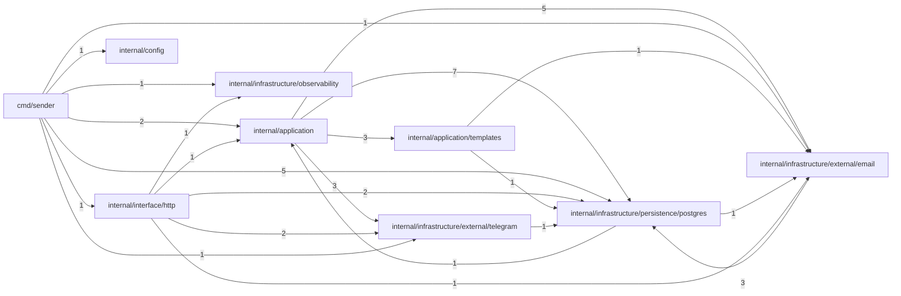

# INDEX_FUNCTIONS — `viralefy_sender`

> **Gerado** por `viralefy_ops/lib/index/build-index.mjs` (§39). Não editar à mão:
> corrija o doc-comment na origem e regenere com `/eng-index`.

| Métrica | Valor |
|---|---|
| Arquivos com função indexada | 20 (de 25 varridos) |
| **N — funções declaradas no código** | **63** |
| **M — entradas neste índice** | **63** |
| Invariante `M == N` | ✅ OK |
| Funções sem doc-comment (§3) | 17 (27.0%) |

Colunas: `de onde vem → pra onde vai` é derivada (camada dos chamadores → efeitos detectados);
`chama (out)` / `é chamada por (in)` vêm do grafo resolvido por nome. As listas inline são
limitadas a 10 nomes com sufixo `+N`; a adjacência COMPLETA está na última seção.

## Grafo de chamadas (por módulo)



## Funções


### `cmd/sender/main.go` — camada `cmd`

| Função | Tipo | O quê | de onde vem → pra onde vai | chama (out) | é chamada por (in) | Efeitos | Linha |
|---|---|---|---|---|---|---|---|
| `main` | func | ⚠ SEM DOC | — → evento+log | runOutboxTick, NewService, Load, New, NewBot, InitMetrics, New, Close, Pool, RunMigrations +2 | — | evento, log | 44 |
| `runOutboxTick` | func | runOutboxTick dispara Tick a cada outboxTickInterval até o ctx cancelar. | cmd → evento+log | Tick | main | evento, log | 164 |

### `internal/application/outbox.go` — camada `application`

| Função | Tipo | O quê | de onde vem → pra onde vai | chama (out) | é chamada por (in) | Efeitos | Linha |
|---|---|---|---|---|---|---|---|
| `NewService` | func | NewService cria o Service com defaults sãos. | cmd → evento+log | — | main | evento, log | 130 |
| `(Service).Enqueue` | method | Enqueue valida o request, normaliza e persiste. | infrastructure+interface → evento | New, validateSendRequest, New, Enqueue | Enqueue, SendHandler | evento | 141 |
| `validateSendRequest` | func | ⚠ SEM DOC | application → db | New, New | Enqueue | db | 203 |
| `(Service).Tick` | method | Tick é chamado pelo loop em cmd/sender/main.go a cada 30s. | cmd → evento+log | LockBatch, dispatchOne | runOutboxTick | evento, log | 242 |
| `(Service).dispatchOne` | method | ⚠ SEM DOC | application → evento | nextBackoff, MarkSent, MarkRetry, MarkFailedFinal, dispatch | Tick | evento | 268 |
| `(Service).dispatch` | method | dispatch escolhe o adapter por channel. | application → evento+log | dispatchEmail, dispatchTelegram | dispatchOne | evento, log | 311 |
| `(Service).dispatchEmail` | method | ⚠ SEM DOC | application → evento | renderEmail, Send, Send, Send | dispatch | evento | 329 |
| `(Service).dispatchTelegram` | method | ⚠ SEM DOC | application → evento | renderTelegram, HasToken, SendMessage, ResolveHandle | dispatch | evento | 349 |
| `nextBackoff` | func | nextBackoff segue §2 do PHASE-8: 30s, 5min, 1h, 6h, 24h. attempts é o número da próxima tentativa (1-based): 1→30s, 2→5min, etc. | application → db | newUUID | dispatchOne | db | 370 |

### `internal/application/render.go` — camada `application`

| Função | Tipo | O quê | de onde vem → pra onde vai | chama (out) | é chamada por (in) | Efeitos | Linha |
|---|---|---|---|---|---|---|---|
| `renderEmail` | func | renderEmail materializa um OutboxRow em (subject, html, text) chamando o builder do template apropriado. | application → evento | unmarshalVars, BuildCheckoutEmail, BuildPaidOrderEmail, BuildProofRejectedEmail | dispatchEmail | evento | 20 |
| `renderTelegram` | func | renderTelegram devolve (text, parseMode) pra SendMessage. | application → evento | mvEscape | dispatchTelegram | evento | 87 |
| `unmarshalVars` | func | unmarshalVars desserializa o JSONB cru do row pra struct tipada. | application → retorno | — | renderEmail | — | 122 |
| `mvEscape` | func | mvEscape escapa caracteres reservados do MarkdownV2 do Telegram. | application → retorno | — | renderTelegram | — | 135 |

### `internal/application/templates/checkout.go` — camada `application`

| Função | Tipo | O quê | de onde vem → pra onde vai | chama (out) | é chamada por (in) | Efeitos | Linha |
|---|---|---|---|---|---|---|---|
| `(CheckoutEmailData).Subject` | method | Subject decide o assunto baseado em flags. | application → interno | New, New | BuildCheckoutEmail | — | 55 |
| `BuildCheckoutEmail` | func | BuildCheckoutEmail devolve subject, HTML e versão texto para o e-mail de confirmação de checkout (status=created, antes de paid). | application → interno | Subject, renderCheckoutText | renderEmail | — | 144 |
| `renderCheckoutText` | func | renderCheckoutText é a versão texto puro para clientes sem HTML. | application → retorno | — | BuildCheckoutEmail | — | 167 |

### `internal/application/templates/checkout_paid.go` — camada `application`

| Função | Tipo | O quê | de onde vem → pra onde vai | chama (out) | é chamada por (in) | Efeitos | Linha |
|---|---|---|---|---|---|---|---|
| `BuildPaidOrderEmail` | func | BuildPaidOrderEmail compõe o e-mail "✅ Pagamento confirmado — order #{XYZ}". | application → interno | renderPaidOrderText | renderEmail | — | 84 |
| `renderPaidOrderText` | func | ⚠ SEM DOC | application → retorno | — | BuildPaidOrderEmail | — | 109 |

### `internal/application/templates/proof_rejected.go` — camada `application`

| Função | Tipo | O quê | de onde vem → pra onde vai | chama (out) | é chamada por (in) | Efeitos | Linha |
|---|---|---|---|---|---|---|---|
| `BuildProofRejectedEmail` | func | BuildProofRejectedEmail devolve subject/html/text pro template "proof_rejected". | application → retorno | — | renderEmail | — | 24 |

### `internal/application/uuid.go` — camada `application`

| Função | Tipo | O quê | de onde vem → pra onde vai | chama (out) | é chamada por (in) | Efeitos | Linha |
|---|---|---|---|---|---|---|---|
| `newUUID` | func | newUUID gera UUIDv4 — wrapper trivial pra que defaultUUID (em outbox.go) não precise importar google/uuid diretamente e fique injetável em testes via Service.IDGen. | application → retorno | — | nextBackoff | — | 11 |

### `internal/config/config.go` — camada `config`

| Função | Tipo | O quê | de onde vem → pra onde vai | chama (out) | é chamada por (in) | Efeitos | Linha |
|---|---|---|---|---|---|---|---|
| `Load` | func | ⚠ SEM DOC | cmd → interno | getenv, parse2FAKey | main | — | 70 |
| `getenv` | func | ⚠ SEM DOC | config → retorno | — | Load | — | 98 |
| `parse2FAKey` | func | parse2FAKey aceita hex 64 chars OU base64 44 (com padding) / 43 (sem). | config → retorno | — | Load | — | 108 |

### `internal/infrastructure/external/email/resend.go` — camada `infrastructure`

| Função | Tipo | O quê | de onde vem → pra onde vai | chama (out) | é chamada por (in) | Efeitos | Linha |
|---|---|---|---|---|---|---|---|
| `(ResendSender).Send` | method | ⚠ SEM DOC | infrastructure+application → http-out | Send, Send, Close | Send, Send, dispatchEmail | http-out | 31 |

### `internal/infrastructure/external/email/sender.go` — camada `infrastructure`

| Função | Tipo | O quê | de onde vem → pra onde vai | chama (out) | é chamada por (in) | Efeitos | Linha |
|---|---|---|---|---|---|---|---|
| `New` | func | New escolhe o EmailSender: Resend (se EMAIL_PROVIDER=resend e há API key), senão SMTP (se há Addr), senão LogSender (dev). | cmd+application+infrastructure+interface → log+email | New | main, Subject, Enqueue, VerifySvixSignature, validateSendRequest, New, SendHandler | log, email | 45 |
| `(SMTPSender).Send` | method | ⚠ SEM DOC | infrastructure+application → email | Send, buildMessage, Send | Send, Send, dispatchEmail | email | 79 |
| `buildMessage` | func | ⚠ SEM DOC | infrastructure → log | — | Send | log | 101 |
| `(LogSender).Send` | method | ⚠ SEM DOC | infrastructure+application → interno | Send, Send, maskEmail | Send, Send, dispatchEmail | — | 120 |
| `maskEmail` | func | maskEmail: u***@example.com — preserva domínio para debug, oculta local part. | infrastructure → retorno | — | Send | — | 135 |

### `internal/infrastructure/external/email/svix.go` — camada `infrastructure`

| Função | Tipo | O quê | de onde vem → pra onde vai | chama (out) | é chamada por (in) | Efeitos | Linha |
|---|---|---|---|---|---|---|---|
| `VerifySvixSignature` | func | VerifySvixSignature valida assinaturas Svix (formato usado pelo Resend). | — → interno | New, New | — | — | 38 |

### `internal/infrastructure/external/telegram/bot.go` — camada `infrastructure`

| Função | Tipo | O quê | de onde vem → pra onde vai | chama (out) | é chamada por (in) | Efeitos | Linha |
|---|---|---|---|---|---|---|---|
| `NewBot` | func | NewBot devolve um *Bot pronto. | cmd → db+log | — | main | db, log | 63 |
| `(Bot).HasToken` | method | HasToken indica se há token configurado. | interface+application → retorno | — | TelegramWebhookHandler, dispatchTelegram | — | 74 |
| `(Bot).SendMessage` | method | SendMessage despacha texto pro chat_id. parseMode vazio = texto plano; "MarkdownV2" requer que o caller já tenha escapado caracteres reservados do MV2 (\, *, _, etc). | application → http-out | Close | dispatchTelegram | http-out | 87 |
| `(Bot).ResolveHandle` | method | ResolveHandle pega @username → chat_id da tabela telegram_chats. | application → db | normalizeHandle | dispatchTelegram | db | 116 |
| `(Bot).HandleUpdate` | method | HandleUpdate processa um Update recebido via webhook. | interface → db+log | — | TelegramWebhookHandler | db, log | 160 |
| `normalizeHandle` | func | normalizeHandle aceita "@user", "user", "@USER" e devolve "@user" (lowercase). | infrastructure → retorno | — | ResolveHandle | — | 216 |

### `internal/infrastructure/observability/metrics.go` — camada `infrastructure`

| Função | Tipo | O quê | de onde vem → pra onde vai | chama (out) | é chamada por (in) | Efeitos | Linha |
|---|---|---|---|---|---|---|---|
| `InitMetrics` | func | InitMetrics regista os collectors num Registry isolado. | cmd+infrastructure → evento | — | main, MetricsHandler | evento | 67 |
| `MetricsHandler` | func | MetricsHandler devolve o handler HTTP do /metrics. | interface → interno | InitMetrics | NewRouter | — | 84 |
| `HTTPMiddleware` | func | HTTPMiddleware instrumenta cada request com http_requests_total + http_request_duration_seconds. | — → evento | ObserveDBQuery | — | evento | 97 |
| `ObserveDBQuery` | func | ObserveDBQuery: shorthand para instrumentar uma query SQL. defer observability.ObserveDBQuery("outbox_lease")(time.Now()) | infrastructure → retorno | — | HTTPMiddleware | — | 125 |

### `internal/infrastructure/persistence/postgres/db.go` — camada `infrastructure`

| Função | Tipo | O quê | de onde vem → pra onde vai | chama (out) | é chamada por (in) | Efeitos | Linha |
|---|---|---|---|---|---|---|---|
| `New` | func | ⚠ SEM DOC | cmd+application+infrastructure+interface → db | New, Close | main, Subject, New, Enqueue, VerifySvixSignature, validateSendRequest, SendHandler | db | 24 |
| `(DB).Close` | method | ⚠ SEM DOC | cmd+infrastructure → retorno | — | main, Send, SendMessage, New, LockBatch | — | 36 |
| `(DB).Pool` | method | ⚠ SEM DOC | cmd → db | — | main | db | 38 |
| `RunMigrations` | func | RunMigrations aplica todos os arquivos *.up.sql em ordem lexicográfica. | cmd → db | — | main | db | 43 |

### `internal/infrastructure/persistence/postgres/outbox_repo.go` — camada `infrastructure`

| Função | Tipo | O quê | de onde vem → pra onde vai | chama (out) | é chamada por (in) | Efeitos | Linha |
|---|---|---|---|---|---|---|---|
| `NewOutboxRepo` | func | NewOutboxRepo devolve um repo pronto. pool não pode ser nil. | cmd → db+evento | — | main | db, evento | 34 |
| `(OutboxRepo).Enqueue` | method | Enqueue insere row novo. | application+interface → db+evento | Enqueue | Enqueue, SendHandler | db, evento | 41 |
| `(OutboxRepo).LockBatch` | method | LockBatch puxa até `limit` rows elegíveis e os marca como in_flight dentro do mesmo tx. | application → db+evento | Close | Tick | db, evento | 67 |
| `(OutboxRepo).MarkSent` | method | MarkSent fecha o row em sent. | application → db+evento | — | dispatchOne | db, evento | 129 |
| `(OutboxRepo).MarkRetry` | method | MarkRetry volta o row pra enqueued, incrementa attempt_count e agenda next_attempt_at = NOW()+backoff. last_error guarda o motivo da última falha pra debugging do admin. | application → db+evento | — | dispatchOne | db, evento | 141 |
| `(OutboxRepo).MarkFailedFinal` | method | MarkFailedFinal fecha o row em failed_final — esgotou tentativas. | application → db+evento | — | dispatchOne | db, evento | 156 |

### `internal/interface/http/contract_test.go` — camada `test`

| Função | Tipo | O quê | de onde vem → pra onde vai | chama (out) | é chamada por (in) | Efeitos | Linha |
|---|---|---|---|---|---|---|---|
| `TestSendResponseShape_MatchesClient` | func | ⚠ SEM DOC | — → retorno | — | — | — | 20 |
| `TestRawPassthroughBody_DeserializesCleanly` | func | TestRawPassthroughBody confirma que o servidor desserializa o body que o client manda em raw mode (sem Template, com Subject+HTMLBody/TextBody). | — → retorno | — | — | — | 52 |
| `TestTemplateModeBody_DeserializesCleanly` | func | TestTemplateModeBody cobre o cenário moderno: template + vars apenas. | — → retorno | — | — | — | 87 |
| `TestTelegramChannelBody_DeserializesCleanly` | func | TestTelegramChannelBody — telegram_handle no to, sem email. | — → retorno | — | — | — | 111 |

### `internal/interface/http/internal_auth.go` — camada `interface`

| Função | Tipo | O quê | de onde vem → pra onde vai | chama (out) | é chamada por (in) | Efeitos | Linha |
|---|---|---|---|---|---|---|---|
| `InternalAuth` | func | InternalAuth devolve um middleware chi-compatível que valida o header X-Internal-Token contra o segredo configurado. | interface → retorno | — | NewRouter | — | 19 |

### `internal/interface/http/router.go` — camada `interface`

| Função | Tipo | O quê | de onde vem → pra onde vai | chama (out) | é chamada por (in) | Efeitos | Linha |
|---|---|---|---|---|---|---|---|
| `NewRouter` | func | NewRouter monta o handler raiz do viralefy_sender. | cmd → interno | MetricsHandler, InternalAuth, SendHandler, TelegramWebhookHandler | main | — | 40 |
| `health` | func | health responde 200 com {"status":"ok"} — idempotente, sem tocar DB. | externo (borda) → retorno | — | — | — | 83 |
| `sendStub` | func | sendStub é o fallback se o Service não foi injetado — modo boot mínimo. | externo (borda) → evento | — | — | evento | 91 |

### `internal/interface/http/send.go` — camada `interface`

| Função | Tipo | O quê | de onde vem → pra onde vai | chama (out) | é chamada por (in) | Efeitos | Linha |
|---|---|---|---|---|---|---|---|
| `SendHandler` | func | SendHandler devolve o http.HandlerFunc de POST /internal/v1/send. | interface → evento | New, Enqueue, New, Enqueue, writeJSON | NewRouter | evento | 25 |
| `writeJSON` | func | ⚠ SEM DOC | interface → retorno | — | SendHandler | — | 66 |

### `internal/interface/http/telegram_webhook.go` — camada `interface`

| Função | Tipo | O quê | de onde vem → pra onde vai | chama (out) | é chamada por (in) | Efeitos | Linha |
|---|---|---|---|---|---|---|---|
| `TelegramWebhookHandler` | func | TelegramWebhookHandler devolve o http.HandlerFunc de POST /internal/v1/telegram/webhook. | interface → log | HasToken, HandleUpdate | NewRouter | log | 30 |

## Adjacência completa (grep-able)

```text
main -> runOutboxTick   (cmd/sender/main.go:44 -> cmd/sender/main.go:164)
main -> NewService   (cmd/sender/main.go:44 -> internal/application/outbox.go:130)
main -> Load   (cmd/sender/main.go:44 -> internal/config/config.go:70)
main -> New   (cmd/sender/main.go:44 -> internal/infrastructure/external/email/sender.go:45)
main -> NewBot   (cmd/sender/main.go:44 -> internal/infrastructure/external/telegram/bot.go:63)
main -> InitMetrics   (cmd/sender/main.go:44 -> internal/infrastructure/observability/metrics.go:67)
main -> New   (cmd/sender/main.go:44 -> internal/infrastructure/persistence/postgres/db.go:24)
main -> Close   (cmd/sender/main.go:44 -> internal/infrastructure/persistence/postgres/db.go:36)
main -> Pool   (cmd/sender/main.go:44 -> internal/infrastructure/persistence/postgres/db.go:38)
main -> RunMigrations   (cmd/sender/main.go:44 -> internal/infrastructure/persistence/postgres/db.go:43)
main -> NewOutboxRepo   (cmd/sender/main.go:44 -> internal/infrastructure/persistence/postgres/outbox_repo.go:34)
main -> NewRouter   (cmd/sender/main.go:44 -> internal/interface/http/router.go:40)
runOutboxTick -> Tick   (cmd/sender/main.go:164 -> internal/application/outbox.go:242)
Enqueue -> New   (internal/application/outbox.go:141 -> internal/infrastructure/external/email/sender.go:45)
Enqueue -> validateSendRequest   (internal/application/outbox.go:141 -> internal/application/outbox.go:203)
Enqueue -> New   (internal/application/outbox.go:141 -> internal/infrastructure/persistence/postgres/db.go:24)
Enqueue -> Enqueue   (internal/application/outbox.go:141 -> internal/infrastructure/persistence/postgres/outbox_repo.go:41)
validateSendRequest -> New   (internal/application/outbox.go:203 -> internal/infrastructure/external/email/sender.go:45)
validateSendRequest -> New   (internal/application/outbox.go:203 -> internal/infrastructure/persistence/postgres/db.go:24)
Tick -> LockBatch   (internal/application/outbox.go:242 -> internal/infrastructure/persistence/postgres/outbox_repo.go:67)
Tick -> dispatchOne   (internal/application/outbox.go:242 -> internal/application/outbox.go:268)
dispatchOne -> nextBackoff   (internal/application/outbox.go:268 -> internal/application/outbox.go:370)
dispatchOne -> MarkSent   (internal/application/outbox.go:268 -> internal/infrastructure/persistence/postgres/outbox_repo.go:129)
dispatchOne -> MarkRetry   (internal/application/outbox.go:268 -> internal/infrastructure/persistence/postgres/outbox_repo.go:141)
dispatchOne -> MarkFailedFinal   (internal/application/outbox.go:268 -> internal/infrastructure/persistence/postgres/outbox_repo.go:156)
dispatchOne -> dispatch   (internal/application/outbox.go:268 -> internal/application/outbox.go:311)
dispatch -> dispatchEmail   (internal/application/outbox.go:311 -> internal/application/outbox.go:329)
dispatch -> dispatchTelegram   (internal/application/outbox.go:311 -> internal/application/outbox.go:349)
dispatchEmail -> renderEmail   (internal/application/outbox.go:329 -> internal/application/render.go:20)
dispatchEmail -> Send   (internal/application/outbox.go:329 -> internal/infrastructure/external/email/resend.go:31)
dispatchEmail -> Send   (internal/application/outbox.go:329 -> internal/infrastructure/external/email/sender.go:79)
dispatchEmail -> Send   (internal/application/outbox.go:329 -> internal/infrastructure/external/email/sender.go:120)
dispatchTelegram -> renderTelegram   (internal/application/outbox.go:349 -> internal/application/render.go:87)
dispatchTelegram -> HasToken   (internal/application/outbox.go:349 -> internal/infrastructure/external/telegram/bot.go:74)
dispatchTelegram -> SendMessage   (internal/application/outbox.go:349 -> internal/infrastructure/external/telegram/bot.go:87)
dispatchTelegram -> ResolveHandle   (internal/application/outbox.go:349 -> internal/infrastructure/external/telegram/bot.go:116)
nextBackoff -> newUUID   (internal/application/outbox.go:370 -> internal/application/uuid.go:11)
renderEmail -> unmarshalVars   (internal/application/render.go:20 -> internal/application/render.go:122)
renderEmail -> BuildCheckoutEmail   (internal/application/render.go:20 -> internal/application/templates/checkout.go:144)
renderEmail -> BuildPaidOrderEmail   (internal/application/render.go:20 -> internal/application/templates/checkout_paid.go:84)
renderEmail -> BuildProofRejectedEmail   (internal/application/render.go:20 -> internal/application/templates/proof_rejected.go:24)
renderTelegram -> mvEscape   (internal/application/render.go:87 -> internal/application/render.go:135)
Subject -> New   (internal/application/templates/checkout.go:55 -> internal/infrastructure/external/email/sender.go:45)
Subject -> New   (internal/application/templates/checkout.go:55 -> internal/infrastructure/persistence/postgres/db.go:24)
BuildCheckoutEmail -> Subject   (internal/application/templates/checkout.go:144 -> internal/application/templates/checkout.go:55)
BuildCheckoutEmail -> renderCheckoutText   (internal/application/templates/checkout.go:144 -> internal/application/templates/checkout.go:167)
BuildPaidOrderEmail -> renderPaidOrderText   (internal/application/templates/checkout_paid.go:84 -> internal/application/templates/checkout_paid.go:109)
Load -> getenv   (internal/config/config.go:70 -> internal/config/config.go:98)
Load -> parse2FAKey   (internal/config/config.go:70 -> internal/config/config.go:108)
Send -> Send   (internal/infrastructure/external/email/resend.go:31 -> internal/infrastructure/external/email/sender.go:79)
Send -> Send   (internal/infrastructure/external/email/resend.go:31 -> internal/infrastructure/external/email/sender.go:120)
Send -> Close   (internal/infrastructure/external/email/resend.go:31 -> internal/infrastructure/persistence/postgres/db.go:36)
New -> New   (internal/infrastructure/external/email/sender.go:45 -> internal/infrastructure/persistence/postgres/db.go:24)
Send -> Send   (internal/infrastructure/external/email/sender.go:79 -> internal/infrastructure/external/email/resend.go:31)
Send -> buildMessage   (internal/infrastructure/external/email/sender.go:79 -> internal/infrastructure/external/email/sender.go:101)
Send -> Send   (internal/infrastructure/external/email/sender.go:79 -> internal/infrastructure/external/email/sender.go:120)
Send -> Send   (internal/infrastructure/external/email/sender.go:120 -> internal/infrastructure/external/email/resend.go:31)
Send -> Send   (internal/infrastructure/external/email/sender.go:120 -> internal/infrastructure/external/email/sender.go:79)
Send -> maskEmail   (internal/infrastructure/external/email/sender.go:120 -> internal/infrastructure/external/email/sender.go:135)
VerifySvixSignature -> New   (internal/infrastructure/external/email/svix.go:38 -> internal/infrastructure/external/email/sender.go:45)
VerifySvixSignature -> New   (internal/infrastructure/external/email/svix.go:38 -> internal/infrastructure/persistence/postgres/db.go:24)
SendMessage -> Close   (internal/infrastructure/external/telegram/bot.go:87 -> internal/infrastructure/persistence/postgres/db.go:36)
ResolveHandle -> normalizeHandle   (internal/infrastructure/external/telegram/bot.go:116 -> internal/infrastructure/external/telegram/bot.go:216)
MetricsHandler -> InitMetrics   (internal/infrastructure/observability/metrics.go:84 -> internal/infrastructure/observability/metrics.go:67)
HTTPMiddleware -> ObserveDBQuery   (internal/infrastructure/observability/metrics.go:97 -> internal/infrastructure/observability/metrics.go:125)
New -> New   (internal/infrastructure/persistence/postgres/db.go:24 -> internal/infrastructure/external/email/sender.go:45)
New -> Close   (internal/infrastructure/persistence/postgres/db.go:24 -> internal/infrastructure/persistence/postgres/db.go:36)
Enqueue -> Enqueue   (internal/infrastructure/persistence/postgres/outbox_repo.go:41 -> internal/application/outbox.go:141)
LockBatch -> Close   (internal/infrastructure/persistence/postgres/outbox_repo.go:67 -> internal/infrastructure/persistence/postgres/db.go:36)
NewRouter -> MetricsHandler   (internal/interface/http/router.go:40 -> internal/infrastructure/observability/metrics.go:84)
NewRouter -> InternalAuth   (internal/interface/http/router.go:40 -> internal/interface/http/internal_auth.go:19)
NewRouter -> SendHandler   (internal/interface/http/router.go:40 -> internal/interface/http/send.go:25)
NewRouter -> TelegramWebhookHandler   (internal/interface/http/router.go:40 -> internal/interface/http/telegram_webhook.go:30)
SendHandler -> New   (internal/interface/http/send.go:25 -> internal/infrastructure/external/email/sender.go:45)
SendHandler -> Enqueue   (internal/interface/http/send.go:25 -> internal/application/outbox.go:141)
SendHandler -> New   (internal/interface/http/send.go:25 -> internal/infrastructure/persistence/postgres/db.go:24)
SendHandler -> Enqueue   (internal/interface/http/send.go:25 -> internal/infrastructure/persistence/postgres/outbox_repo.go:41)
SendHandler -> writeJSON   (internal/interface/http/send.go:25 -> internal/interface/http/send.go:66)
TelegramWebhookHandler -> HasToken   (internal/interface/http/telegram_webhook.go:30 -> internal/infrastructure/external/telegram/bot.go:74)
TelegramWebhookHandler -> HandleUpdate   (internal/interface/http/telegram_webhook.go:30 -> internal/infrastructure/external/telegram/bot.go:160)
```
