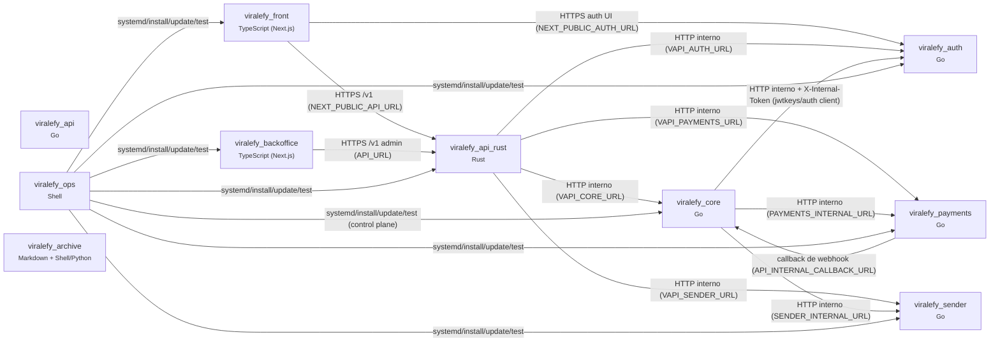

# INDEX_GLOBAL — sistema Viralefy

> Camada **global** do índice de funcionalidades (§39). Os totais vêm do código
> (gerados por `viralefy_ops/lib/index/build-index.mjs`); propósito, pastas e contratos são
> mantidos à mão em `viralefy_ops/lib/index/service-registry.mjs` e revisados a cada mudança
> arquitetural, junto do ADR.

## Cobertura

| Serviço | Linguagem | Papel | Arquivos | N (funções) | M (entradas) | M==N | Sem doc |
|---|---|---|---|---|---|---|---|
| `viralefy_api_rust` | Rust | borda | 10 | 39 | 39 | ✅ | 16 |
| `viralefy_core` | Go | domínio | 151 | 1227 | 1227 | ✅ | 691 |
| `viralefy_auth` | Go | domínio | 26 | 169 | 169 | ✅ | 98 |
| `viralefy_payments` | Go | domínio | 27 | 151 | 151 | ✅ | 96 |
| `viralefy_sender` | Go | domínio | 20 | 63 | 63 | ✅ | 17 |
| `viralefy_api` | Go | legado | 134 | 1077 | 1077 | ✅ | 635 |
| `viralefy_front` | TypeScript (Next.js) | frontend | 149 | 598 | 598 | ✅ | 441 |
| `viralefy_backoffice` | TypeScript (Next.js) | frontend | 46 | 185 | 185 | ✅ | 154 |
| `viralefy_ops` | Shell | control plane | 75 | 235 | 235 | ✅ | 113 |
| `viralefy_archive` | Markdown + Shell/Python | archive | 2 | 25 | 25 | ✅ | 20 |
| **TOTAL** | — | 10 repos | — | **3769** | **3769** | ✅ | — |

## Grafo de serviços



Adjacência (grep-able):

```text
viralefy_front -> viralefy_api_rust (HTTPS /v1 (NEXT_PUBLIC_API_URL))
viralefy_backoffice -> viralefy_api_rust (HTTPS /v1 admin (API_URL))
viralefy_front -> viralefy_auth (HTTPS auth UI (NEXT_PUBLIC_AUTH_URL))
viralefy_api_rust -> viralefy_core (HTTP interno (VAPI_CORE_URL))
viralefy_api_rust -> viralefy_auth (HTTP interno (VAPI_AUTH_URL))
viralefy_api_rust -> viralefy_payments (HTTP interno (VAPI_PAYMENTS_URL))
viralefy_api_rust -> viralefy_sender (HTTP interno (VAPI_SENDER_URL))
viralefy_core -> viralefy_auth (HTTP interno + X-Internal-Token (jwtkeys/auth client))
viralefy_core -> viralefy_payments (HTTP interno (PAYMENTS_INTERNAL_URL))
viralefy_core -> viralefy_sender (HTTP interno (SENDER_INTERNAL_URL))
viralefy_payments -> viralefy_core (callback de webhook (API_INTERNAL_CALLBACK_URL))
viralefy_ops -> viralefy_core (systemd/install/update/test (control plane))
viralefy_ops -> viralefy_auth (systemd/install/update/test)
viralefy_ops -> viralefy_payments (systemd/install/update/test)
viralefy_ops -> viralefy_sender (systemd/install/update/test)
viralefy_ops -> viralefy_api_rust (systemd/install/update/test)
viralefy_ops -> viralefy_front (systemd/install/update/test)
viralefy_ops -> viralefy_backoffice (systemd/install/update/test)
```

## Repos

### `viralefy_api_rust` — Rust · borda

Dispatcher/borda de segurança: único serviço exposto (atrás de Caddy + Coraza WAF); valida token, sanitiza, aplica rate-limit e despacha pros serviços de domínio.

- **Remote:** `github.com/Viralefy/viralefy_dispatcher`
- **Índice de funções:** [`INDEX_FUNCTIONS_viralefy_api_rust.md`](INDEX_FUNCTIONS_viralefy_api_rust.md) — 39 entradas
- **Pastas top-level:**
  - `src/` — handlers de borda, roteamento e config do dispatcher

### `viralefy_core` — Go · domínio

Motor de domínio: catálogo, checkout, usuários, pedidos, gateways, recargas, suporte, reviews, A/B, fraude, anti-abuso, multi-moeda e webhooks. Sucessor do monolito viralefy_api.

- **Remote:** `github.com/Viralefy/viralefy_core`
- **Índice de funções:** [`INDEX_FUNCTIONS_viralefy_core.md`](INDEX_FUNCTIONS_viralefy_core.md) — 1227 entradas
- **Pastas top-level:**
  - `cmd/` — binário do serviço + cronjobs (reconcile, user-deletion, orders-anonymize, test-cleanup, migrate-proofs)
  - `internal/domain/` — entidades, value objects e regras de negócio
  - `internal/application/` — use cases / orquestração
  - `internal/infrastructure/` — persistência Postgres, clientes externos (auth, payments, sender, storage, e-mail, turnstile), observabilidade
  - `internal/interface/` — handlers HTTP e middlewares
  - `internal/config/` — carga e validação tipada de configuração

### `viralefy_auth` — Go · domínio

Identidade: mint/verify de JWT, login/register/refresh, 2FA TOTP, password reset, auditoria de auth e hot-set de revogação. Loopback only, protegido por X-Internal-Token.

- **Remote:** `github.com/Viralefy/viralefy_auth`
- **Índice de funções:** [`INDEX_FUNCTIONS_viralefy_auth.md`](INDEX_FUNCTIONS_viralefy_auth.md) — 169 entradas
- **Pastas top-level:**
  - `cmd/` — binário do serviço
  - `internal/` — domínio de identidade, handlers e persistência

### `viralefy_payments` — Go · domínio

Integração de gateway de pagamento (Stripe, Heleket, Woovi, PIX/USDT manual): charges, métodos elegíveis e webhooks externos.

- **Remote:** `github.com/Viralefy/viralefy_payments`
- **Índice de funções:** [`INDEX_FUNCTIONS_viralefy_payments.md`](INDEX_FUNCTIONS_viralefy_payments.md) — 151 entradas
- **Pastas top-level:**
  - `cmd/` — binário do serviço
  - `internal/` — providers, handlers e persistência

### `viralefy_sender` — Go · domínio

Entrega de mensagem ao cliente (e-mail, Telegram bot; WhatsApp/SMS/push previstos), consumindo o outbox.

- **Remote:** `github.com/Viralefy/viralefy_sender`
- **Índice de funções:** [`INDEX_FUNCTIONS_viralefy_sender.md`](INDEX_FUNCTIONS_viralefy_sender.md) — 63 entradas
- **Pastas top-level:**
  - `cmd/` — binário do serviço
  - `internal/` — canais de envio, outbox e handlers

### `viralefy_api` — Go · legado

Monolito Go original (planos, checkout, pedidos, gateways). Congelado: o domínio vive em viralefy_core; o nome foi reassumido pelo dispatcher Rust.

- **Remote:** `github.com/Viralefy/viralefy_api`
- **Índice de funções:** [`INDEX_FUNCTIONS_viralefy_api.md`](INDEX_FUNCTIONS_viralefy_api.md) — 1077 entradas
- **Pastas top-level:**
  - `cmd/` — binário legado
  - `internal/` — mesmas camadas do core, na versão pré-split

### `viralefy_front` — TypeScript (Next.js) · frontend

Loja pública: vitrine de planos de seguidores, i18n por país e checkout com cadastro.

- **Remote:** `github.com/Viralefy/viralefy_front`
- **Índice de funções:** [`INDEX_FUNCTIONS_viralefy_front.md`](INDEX_FUNCTIONS_viralefy_front.md) — 598 entradas
- **Pastas top-level:**
  - `src/` — app router, componentes, hooks e libs do site
  - `tests/` — suites emuladas (acessibilidade, contratos de API, fluxos)
  - `e2e/` — Playwright
  - `scripts/` — utilitários de build/SEO (IndexNow)

### `viralefy_backoffice` — TypeScript (Next.js) · frontend

Painel admin: CRUD de planos, gateways de pagamento e pedidos.

- **Remote:** `github.com/Viralefy/viralefy_backoffice`
- **Índice de funções:** [`INDEX_FUNCTIONS_viralefy_backoffice.md`](INDEX_FUNCTIONS_viralefy_backoffice.md) — 185 entradas
- **Pastas top-level:**
  - `src/` — app router, componentes e libs do painel
  - `tests/` — suites do painel

### `viralefy_ops` — Shell · control plane

Interface única de operação: instala em /viralefy/*, sobe via systemd com isolamento por usuário, expõe via Caddy com TLS, mantém segredo em /etc/viralefy/.env e roda o test kit.

- **Remote:** `github.com/Viralefy/viralefy_ops`
- **Índice de funções:** [`INDEX_FUNCTIONS_viralefy_ops.md`](INDEX_FUNCTIONS_viralefy_ops.md) — 235 entradas
- **Pastas top-level:**
  - `bin/` — CLI de operação (bootstrap, install, update, doctor, test)
  - `installer/` — passos de instalação por serviço
  - `systemd/` — units e timers hardened, um por serviço
  - `observability/` — stack LGTM (Alloy, Loki, Tempo, Prometheus, Grafana)
  - `grafana/` — dashboards e alertas versionados
  - `config/` — templates de configuração (Caddy, exporters)
  - `tests/` — test kit do sistema vivo (smoke, security, authz, pentest, simulated)

### `viralefy_archive` — Markdown + Shell/Python · archive

Memória do projeto: diretrizes, ADRs, runbooks, planos de fase, relatórios de Q.A./pentest, handoffs de contexto e este índice (§28, §39).

- **Remote:** `github.com/Viralefy/viralefy_archive`
- **Índice de funções:** [`INDEX_FUNCTIONS_viralefy_archive.md`](INDEX_FUNCTIONS_viralefy_archive.md) — 25 entradas
- **Pastas top-level:**
  - `index/` — MAPA.md, INDEX_GLOBAL.md e INDEX_FUNCTIONS_<serviço>.md (gerados)
  - `scripts/` — gerador do índice e smokes externos
  - `adr/` — decisões arquiteturais
  - `context/` — handoffs de contexto
  - `task/` — archive de tasks
