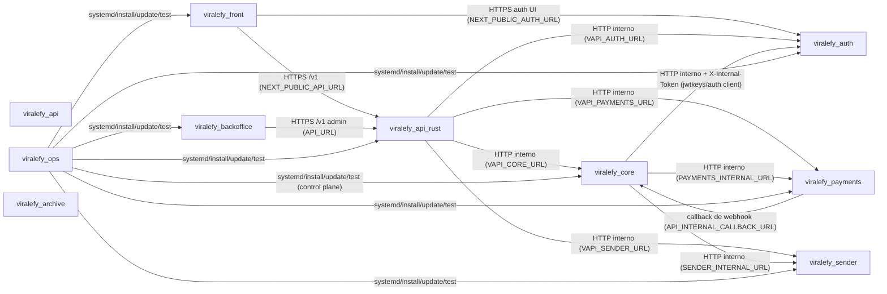

# MAPA da aplicação — Viralefy

> Gerado por `viralefy_ops/lib/index/build-index.mjs` (§4, §39). Duas camadas:
> **global** (repos, comunicação, contratos — mantida à mão em `service-registry.mjs`) e
> **microfunções** (derivada dos doc-comments e do grafo de chamadas do código).
> Índice fino por serviço: `INDEX_FUNCTIONS_<serviço>.md` nesta mesma pasta.

## Onde tocar — grafo de serviços

## Por serviço — entrada, saída e raio de impacto

### `viralefy_api_rust`

Dispatcher/borda de segurança: único serviço exposto (atrás de Caddy + Coraza WAF); valida token, sanitiza, aplica rate-limit e despacha pros serviços de domínio.

- **Funções indexadas:** 39 (N=39, M==N ✅) — [índice fino](INDEX_FUNCTIONS_viralefy_api_rust.md)
- **Sem doc-comment (§3):** 16
- **Pontos de entrada (camada `interface`/`cmd`):** 20
  - `main` — src/main.rs:53
  - `shutdown_signal` — src/main.rs:216
  - `enforce_hot_set` — src/middleware.rs:31
  - `enforce_path_safety` — src/middleware.rs:52
  - `optional_auth` — src/middleware.rs:68
  - `require_auth` — src/middleware.rs:92
  - `extract_bearer` — src/middleware.rs:120
  - `claim_is_revoked` — src/middleware.rs:127
  - `unauthorized` — src/middleware.rs:137
  - `jwks_cache` — src/middleware.rs:150
  - `revocation_set` — src/middleware.rs:155
  - `base_url` — src/proxy.rs:32
  - `resolve_upstream` — src/proxy.rs:44
  - `forward` — src/proxy.rs:113
  - `upstream_label` — src/proxy.rs:222
  - `proxy_handler` — src/proxy.rs:233
  - `resolve_upstream_opt` — src/proxy.rs:243
  - `_u_compat` — src/proxy.rs:248
  - `health` — src/routes.rs:10
  - `ready` — src/routes.rs:19
- **Saídas com efeito externo (db/http-out/evento/email/arquivo):** 8

### `viralefy_core`

Motor de domínio: catálogo, checkout, usuários, pedidos, gateways, recargas, suporte, reviews, A/B, fraude, anti-abuso, multi-moeda e webhooks. Sucessor do monolito viralefy_api.

- **Funções indexadas:** 1227 (N=1227, M==N ✅) — [índice fino](INDEX_FUNCTIONS_viralefy_core.md)
- **Sem doc-comment (§3):** 691
- **Pontos de entrada (camada `interface`/`cmd`):** 227
  - `main` — cmd/core/main.go:29
  - `shutdownTracer` — cmd/core/main.go:89
  - `revLog` — cmd/core/main.go:253
  - `buildStorage` — cmd/core/main.go:477
  - `runMigrateCmd` — cmd/core/migrate_cmd.go:26
  - `printMigrateHelp` — cmd/core/migrate_cmd.go:58
  - `cmdMigrateStatus` — cmd/core/migrate_cmd.go:69
  - `cmdMigrateUp` — cmd/core/migrate_cmd.go:103
  - `cmdMigrateBackfill` — cmd/core/migrate_cmd.go:116
  - `cmdMigrateVersion` — cmd/core/migrate_cmd.go:130
  - `countPending` — cmd/core/migrate_cmd.go:149
  - `runSeedCmd` — cmd/core/migrate_cmd.go:162
  - `main` — cmd/migrate-proofs/main.go:76
  - `runMigration` — cmd/migrate-proofs/main.go:158
  - `fetchPendingProofs` — cmd/migrate-proofs/main.go:226
  - `migrateOne` — cmd/migrate-proofs/main.go:266
  - `parseDataURL` — cmd/migrate-proofs/main.go:358
  - `detectMIME` — cmd/migrate-proofs/main.go:412
  - `main` — cmd/orders-anonymize-cron/main.go:107
  - `countEligible` — cmd/orders-anonymize-cron/main.go:193
  - `anonymizeBatch` — cmd/orders-anonymize-cron/main.go:211
  - `emit` — cmd/orders-anonymize-cron/main.go:241
  - `writeTextfileMetrics` — cmd/orders-anonymize-cron/main.go:248
  - `main` — cmd/reconcile-cron/main.go:281
  - `runInvariant` — cmd/reconcile-cron/main.go:357
  - `notifyIfConfigured` — cmd/reconcile-cron/main.go:395
  - `main` — cmd/test-cleanup-cron/main.go:71
  - `runCleanup` — cmd/test-cleanup-cron/main.go:149
  - `run` — cmd/test-cleanup-cron/main.go:168
  - `runDryCount` — cmd/test-cleanup-cron/main.go:266
  - `writeTextfileMetrics` — cmd/test-cleanup-cron/main.go:303
  - `main` — cmd/user-deletion-cron/main.go:104
  - `listDue` — cmd/user-deletion-cron/main.go:202
  - `executeDeletion` — cmd/user-deletion-cron/main.go:233
  - `run` — cmd/user-deletion-cron/main.go:248
  - `markFailed` — cmd/user-deletion-cron/main.go:400
  - `countPending` — cmd/user-deletion-cron/main.go:413
  - `sumRows` — cmd/user-deletion-cron/main.go:420
  - `writeTextfileMetrics` — cmd/user-deletion-cron/main.go:432
  - `apiKeyAuth` — internal/interface/http/apikey_middleware.go:25
  - _+187 outros — lista completa no índice fino._
- **Saídas com efeito externo (db/http-out/evento/email/arquivo):** 380

### `viralefy_auth`

Identidade: mint/verify de JWT, login/register/refresh, 2FA TOTP, password reset, auditoria de auth e hot-set de revogação. Loopback only, protegido por X-Internal-Token.

- **Funções indexadas:** 169 (N=169, M==N ✅) — [índice fino](INDEX_FUNCTIONS_viralefy_auth.md)
- **Sem doc-comment (§3):** 98
- **Pontos de entrada (camada `interface`/`cmd`):** 33
  - `main` — cmd/auth/main.go:38
  - `appVersion` — cmd/auth/main.go:166
  - `parse2FAKey` — cmd/auth/main.go:176
  - `Health` — internal/interface/http/handlers.go:24
  - `Ready` — internal/interface/http/handlers.go:31
  - `Login` — internal/interface/http/handlers.go:46
  - `Login2FA` — internal/interface/http/handlers.go:79
  - `Register` — internal/interface/http/handlers.go:106
  - `Refresh` — internal/interface/http/handlers.go:129
  - `Logout` — internal/interface/http/handlers.go:159
  - `TokenVerify` — internal/interface/http/handlers.go:202
  - `TokenRevoke` — internal/interface/http/handlers.go:226
  - `PasswordResetRequest` — internal/interface/http/handlers.go:247
  - `PasswordResetConfirm` — internal/interface/http/handlers.go:286
  - `TwoFAEnroll` — internal/interface/http/handlers.go:308
  - `TwoFAVerify` — internal/interface/http/handlers.go:337
  - `TwoFADisable` — internal/interface/http/handlers.go:360
  - `JWKS` — internal/interface/http/handlers.go:378
  - `subjectFromReq` — internal/interface/http/handlers.go:389
  - `loginResponse` — internal/interface/http/handlers.go:396
  - `InternalTokenAuth` — internal/interface/http/middleware.go:11
  - `clientIP` — internal/interface/http/middleware.go:29
  - `newIPRateLimiter` — internal/interface/http/public_handlers.go:35
  - `Allow` — internal/interface/http/public_handlers.go:46
  - `writeRateLimited` — internal/interface/http/public_handlers.go:90
  - `PublicUserLogin` — internal/interface/http/public_handlers.go:105
  - `PublicAdminLogin` — internal/interface/http/public_handlers.go:126
  - `PublicLogin2FA` — internal/interface/http/public_handlers.go:148
  - `PublicUserRegister` — internal/interface/http/public_handlers.go:180
  - `PublicAdminEnroll2FA` — internal/interface/http/public_handlers.go:210
  - `writeJSON` — internal/interface/http/response.go:14
  - `writeError` — internal/interface/http/response.go:30
  - `NewRouter` — internal/interface/http/router.go:12
- **Saídas com efeito externo (db/http-out/evento/email/arquivo):** 52

### `viralefy_payments`

Integração de gateway de pagamento (Stripe, Heleket, Woovi, PIX/USDT manual): charges, métodos elegíveis e webhooks externos.

- **Funções indexadas:** 151 (N=151, M==N ✅) — [índice fino](INDEX_FUNCTIONS_viralefy_payments.md)
- **Sem doc-comment (§3):** 96
- **Pontos de entrada (camada `interface`/`cmd`):** 19
  - `main` — cmd/payments/main.go:23
  - `writeJSON` — internal/interface/http/handlers.go:42
  - `writeErr` — internal/interface/http/handlers.go:51
  - `methodsHandler` — internal/interface/http/handlers.go:69
  - `chargeHandler` — internal/interface/http/handlers.go:115
  - `gwAccepts` — internal/interface/http/handlers.go:207
  - `listGatewaysHandler` — internal/interface/http/handlers.go:219
  - `createGatewayHandler` — internal/interface/http/handlers.go:228
  - `updateGatewayHandler` — internal/interface/http/handlers.go:242
  - `deleteGatewayHandler` — internal/interface/http/handlers.go:258
  - `getGatewayHandler` — internal/interface/http/handlers.go:267
  - `InternalAuth` — internal/interface/http/internal_auth.go:19
  - `NewRouter` — internal/interface/http/router.go:25
  - `health` — internal/interface/http/router.go:75
  - `stripeWebhookHandler` — internal/interface/http/webhooks.go:33
  - `heleketWebhookHandler` — internal/interface/http/webhooks.go:82
  - `wooviWebhookHandler` — internal/interface/http/webhooks.go:113
  - `abacatePayWebhookHandler` — internal/interface/http/webhooks.go:146
  - `postCallback` — internal/interface/http/webhooks.go:181
- **Saídas com efeito externo (db/http-out/evento/email/arquivo):** 31

### `viralefy_sender`

Entrega de mensagem ao cliente (e-mail, Telegram bot; WhatsApp/SMS/push previstos), consumindo o outbox.

- **Funções indexadas:** 63 (N=63, M==N ✅) — [índice fino](INDEX_FUNCTIONS_viralefy_sender.md)
- **Sem doc-comment (§3):** 17
- **Pontos de entrada (camada `interface`/`cmd`):** 9
  - `main` — cmd/sender/main.go:44
  - `runOutboxTick` — cmd/sender/main.go:164
  - `InternalAuth` — internal/interface/http/internal_auth.go:19
  - `NewRouter` — internal/interface/http/router.go:40
  - `health` — internal/interface/http/router.go:83
  - `sendStub` — internal/interface/http/router.go:91
  - `SendHandler` — internal/interface/http/send.go:25
  - `writeJSON` — internal/interface/http/send.go:66
  - `TelegramWebhookHandler` — internal/interface/http/telegram_webhook.go:30
- **Saídas com efeito externo (db/http-out/evento/email/arquivo):** 35

### `viralefy_api`

Monolito Go original (planos, checkout, pedidos, gateways). Congelado: o domínio vive em viralefy_core; o nome foi reassumido pelo dispatcher Rust.

- **Funções indexadas:** 1077 (N=1077, M==N ✅) — [índice fino](INDEX_FUNCTIONS_viralefy_api.md)
- **Sem doc-comment (§3):** 635
- **Pontos de entrada (camada `interface`/`cmd`):** 167
  - `main` — cmd/api/main.go:28
  - `shutdownTracer` — cmd/api/main.go:88
  - `buildStorage` — cmd/api/main.go:437
  - `runMigrateCmd` — cmd/api/migrate_cmd.go:26
  - `printMigrateHelp` — cmd/api/migrate_cmd.go:58
  - `cmdMigrateStatus` — cmd/api/migrate_cmd.go:69
  - `cmdMigrateUp` — cmd/api/migrate_cmd.go:103
  - `cmdMigrateBackfill` — cmd/api/migrate_cmd.go:116
  - `cmdMigrateVersion` — cmd/api/migrate_cmd.go:130
  - `countPending` — cmd/api/migrate_cmd.go:149
  - `runSeedCmd` — cmd/api/migrate_cmd.go:162
  - `apiKeyAuth` — internal/interface/http/apikey_middleware.go:25
  - `apiKeyOwnerFromContext` — internal/interface/http/apikey_middleware.go:47
  - `clientIP` — internal/interface/http/handlers.go:92
  - `ListPublicPlans` — internal/interface/http/handlers.go:112
  - `ListCategories` — internal/interface/http/handlers.go:131
  - `ListCurrencies` — internal/interface/http/handlers.go:140
  - `CreateRecoveryRequest` — internal/interface/http/handlers.go:155
  - `CreateCheckout` — internal/interface/http/handlers.go:230
  - `UserRegister` — internal/interface/http/handlers.go:284
  - `UserLogin` — internal/interface/http/handlers.go:317
  - `enrichTracking` — internal/interface/http/handlers.go:345
  - `verifyTurnstile` — internal/interface/http/handlers.go:364
  - `MeListTickets` — internal/interface/http/handlers.go:381
  - `MeOpenTicketsCount` — internal/interface/http/handlers.go:397
  - `MeCreateTicket` — internal/interface/http/handlers.go:411
  - `MeGetTicket` — internal/interface/http/handlers.go:436
  - `MeReplyTicket` — internal/interface/http/handlers.go:450
  - `AdminListTickets` — internal/interface/http/handlers.go:472
  - `AdminGetTicket` — internal/interface/http/handlers.go:482
  - `AdminReplyTicket` — internal/interface/http/handlers.go:491
  - `AdminUpdateTicket` — internal/interface/http/handlers.go:507
  - `MeOrders` — internal/interface/http/handlers.go:532
  - `AdminMe` — internal/interface/http/handlers.go:550
  - `AdminBecomeCustomer` — internal/interface/http/handlers.go:567
  - `AdminListRoles` — internal/interface/http/handlers.go:589
  - `toAdminView` — internal/interface/http/handlers.go:609
  - `AdminListAdmins` — internal/interface/http/handlers.go:618
  - `AdminCreateAdmin` — internal/interface/http/handlers.go:634
  - `AdminUpdateAdmin` — internal/interface/http/handlers.go:678
  - _+127 outros — lista completa no índice fino._
- **Saídas com efeito externo (db/http-out/evento/email/arquivo):** 316

### `viralefy_front`

Loja pública: vitrine de planos de seguidores, i18n por país e checkout com cadastro.

- **Funções indexadas:** 588 (N=588, M==N ✅) — [índice fino](INDEX_FUNCTIONS_viralefy_front.md)
- **Sem doc-comment (§3):** 451
- **Pontos de entrada (camada `interface`/`cmd`):** 198
  - `register` — instrumentation.ts:4
  - `siteUrl` — src/app/[country]/[category]/[slug]/page.tsx:37
  - `getPlans` — src/app/[country]/[category]/[slug]/page.tsx:41
  - `getReviews` — src/app/[country]/[category]/[slug]/page.tsx:55
  - `qtyFromSlug` — src/app/[country]/[category]/[slug]/page.tsx:69
  - `generateMetadata` — src/app/[country]/[category]/[slug]/page.tsx:74
  - `planNarrative` — src/app/[country]/[category]/[slug]/page.tsx:143
  - `describeSize` — src/app/[country]/[category]/[slug]/page.tsx:169
  - `describeSizePt` — src/app/[country]/[category]/[slug]/page.tsx:176
  - `describeSizeEs` — src/app/[country]/[category]/[slug]/page.tsx:183
  - `windowFor` — src/app/[country]/[category]/[slug]/page.tsx:190
  - `windowForPt` — src/app/[country]/[category]/[slug]/page.tsx:195
  - `PlanPage` — src/app/[country]/[category]/[slug]/page.tsx:201
  - `ReviewStars` — src/app/[country]/[category]/[slug]/page.tsx:372
  - `ReviewsSection` — src/app/[country]/[category]/[slug]/page.tsx:403
  - `ReviewCard` — src/app/[country]/[category]/[slug]/page.tsx:429
  - `siteUrl` — src/app/[country]/[category]/page.tsx:45
  - `generateMetadata` — src/app/[country]/[category]/page.tsx:49
  - `getPlans` — src/app/[country]/[category]/page.tsx:86
  - `CategoryPage` — src/app/[country]/[category]/page.tsx:97
  - `generateStaticParams` — src/app/[country]/page.tsx:25
  - `siteUrl` — src/app/[country]/page.tsx:31
  - `generateMetadata` — src/app/[country]/page.tsx:35
  - `getPlans` — src/app/[country]/page.tsx:74
  - `CountryPage` — src/app/[country]/page.tsx:85
  - `formatDate` — src/app/account/api-keys/page.tsx:18
  - `APIKeysPage` — src/app/account/api-keys/page.tsx:27
  - `load` — src/app/account/api-keys/page.tsx:38
  - `handleCreate` — src/app/account/api-keys/page.tsx:57
  - `handleRevoke` — src/app/account/api-keys/page.tsx:79
  - `copyPlain` — src/app/account/api-keys/page.tsx:97
  - `closeModal` — src/app/account/api-keys/page.tsx:108
  - `CreditsPage` — src/app/account/credits/page.tsx:25
  - `load` — src/app/account/credits/page.tsx:35
  - `onRecharge` — src/app/account/credits/page.tsx:57
  - `CustomAmount` — src/app/account/credits/page.tsx:210
  - `DataPage` — src/app/account/data/page.tsx:27
  - `onExport` — src/app/account/data/page.tsx:54
  - `onRequestDeletion` — src/app/account/data/page.tsx:83
  - `onCancelDeletion` — src/app/account/data/page.tsx:104
  - _+158 outros — lista completa no índice fino._
- **Saídas com efeito externo (db/http-out/evento/email/arquivo):** 63

### `viralefy_backoffice`

Painel admin: CRUD de planos, gateways de pagamento e pedidos.

- **Funções indexadas:** 185 (N=185, M==N ✅) — [índice fino](INDEX_FUNCTIONS_viralefy_backoffice.md)
- **Sem doc-comment (§3):** 154
- **Pontos de entrada (camada `interface`/`cmd`):** 122
  - `register` — instrumentation.ts:4
  - `AdminsPage` — src/app/admins/page.tsx:12
  - `reload` — src/app/admins/page.tsx:24
  - `handleCreate` — src/app/admins/page.tsx:48
  - `handleUpdateRole` — src/app/admins/page.tsx:63
  - `handleDelete` — src/app/admins/page.tsx:77
  - `handleResetTwoFA` — src/app/admins/page.tsx:91
  - `RoleBadge` — src/app/admins/page.tsx:255
  - `CreateAdminModal` — src/app/admins/page.tsx:279
  - `VisitorDetailPage` — src/app/analytics/visitors/[vid]/page.tsx:11
  - `VisitorsPage` — src/app/analytics/visitors/page.tsx:17
  - `th` — src/app/analytics/visitors/page.tsx:119
  - `td` — src/app/analytics/visitors/page.tsx:122
  - `date` — src/app/analytics/visitors/page.tsx:125
  - `short` — src/app/analytics/visitors/page.tsx:129
  - `utmCompact` — src/app/analytics/visitors/page.tsx:133
  - `POST` — src/app/api/auth/2fa/route.ts:29
  - `POST` — src/app/api/auth/login/route.ts:45
  - `POST` — src/app/api/auth/logout/route.ts:14
  - `GET` — src/app/api/auth/me/route.ts:19
  - `looksLikeJWT` — src/app/api/auth/sso/route.ts:22
  - `POST` — src/app/api/auth/sso/route.ts:31
  - `GET` — src/app/api/metrics/route.ts:19
  - `originGuard` — src/app/api/proxy/[...path]/route.ts:35
  - `handle` — src/app/api/proxy/[...path]/route.ts:59
  - `CurrenciesPage` — src/app/currencies/page.tsx:7
  - `reload` — src/app/currencies/page.tsx:12
  - `save` — src/app/currencies/page.tsx:20
  - `DashboardPage` — src/app/dashboard/page.tsx:12
  - `Tile` — src/app/dashboard/page.tsx:136
  - `BecomeCustomerButton` — src/app/dashboard/page.tsx:153
  - `onClick` — src/app/dashboard/page.tsx:158
  - `emptyFormFor` — src/app/gateways/page.tsx:201
  - `fromGateway` — src/app/gateways/page.tsx:215
  - `CurrencyChip` — src/app/gateways/page.tsx:235
  - `GatewaysPage` — src/app/gateways/page.tsx:256
  - `reload` — src/app/gateways/page.tsx:264
  - `startNew` — src/app/gateways/page.tsx:277
  - `startEdit` — src/app/gateways/page.tsx:283
  - `cancelForm` — src/app/gateways/page.tsx:289
  - _+82 outros — lista completa no índice fino._
- **Saídas com efeito externo (db/http-out/evento/email/arquivo):** 13

### `viralefy_ops`

Interface única de operação: instala em /viralefy/*, sobe via systemd com isolamento por usuário, expõe via Caddy com TLS, mantém segredo em /etc/viralefy/.env e roda o test kit.

- **Funções indexadas:** 235 (N=235, M==N ✅) — [índice fino](INDEX_FUNCTIONS_viralefy_ops.md)
- **Sem doc-comment (§3):** 113
- **Pontos de entrada (camada `interface`/`cmd`):** 49
  - `now` — bin/viralefy-critical-flows:62
  - `emit_json` — bin/viralefy-critical-flows:64
  - `ok` — bin/viralefy-critical-flows:71
  - `bad` — bin/viralefy-critical-flows:77
  - `note` — bin/viralefy-critical-flows:83
  - `http_call` — bin/viralefy-critical-flows:87
  - `body` — bin/viralefy-critical-flows:101
  - `assert_status` — bin/viralefy-critical-flows:103
  - `assert_body_has` — bin/viralefy-critical-flows:114
  - `assert_json_field` — bin/viralefy-critical-flows:125
  - `flow_register` — bin/viralefy-critical-flows:143
  - `flow_login` — bin/viralefy-critical-flows:192
  - `flow_login_wrong_password` — bin/viralefy-critical-flows:221
  - `flow_checkout` — bin/viralefy-critical-flows:252
  - `flow_pages_with_gdpr` — bin/viralefy-critical-flows:313
  - `flow_db_invariant_softdelete_reuse` — bin/viralefy-critical-flows:339
  - `flow_selfcheck` — bin/viralefy-critical-flows:370
  - `main` — bin/viralefy-install:48
  - `ensure_ops_in_place` — bin/viralefy-install:78
  - `mapper` — bin/viralefy-logs:9
  - `q` — bin/viralefy-purge-legacy-test-users:40
  - `pick_free_port` — bin/viralefy-restore-drill:51
  - `cleanup` — bin/viralefy-restore-drill:68
  - `ok` — bin/viralefy-smoke:68
  - `bad` — bin/viralefy-smoke:69
  - `note` — bin/viralefy-smoke:70
  - `http_code` — bin/viralefy-smoke:76
  - `http_body` — bin/viralefy-smoke:287
  - `bold` — bin/viralefy-status:9
  - `ok` — bin/viralefy-status:10
  - `no` — bin/viralefy-status:11
  - `warn` — bin/viralefy-status:12
  - `usage` — bin/viralefy-test:55
  - `resolve_tests_dir` — bin/viralefy-test:62
  - `note` — bin/viralefy-test:131
  - `err` — bin/viralefy-test:132
  - `list_scripts_for_category` — bin/viralefy-test:139
  - `do_seeds` — bin/viralefy-test:150
  - `run_one` — bin/viralefy-test:210
  - `ts` — bin/viralefy-update:80
  - _+9 outros — lista completa no índice fino._
- **Saídas com efeito externo (db/http-out/evento/email/arquivo):** 16

### `viralefy_archive`

Memória do projeto: diretrizes, ADRs, runbooks, planos de fase, relatórios de Q.A./pentest, handoffs de contexto e este índice (§28, §39).

- **Funções indexadas:** 25 (N=25, M==N ✅) — [índice fino](INDEX_FUNCTIONS_viralefy_archive.md)
- **Sem doc-comment (§3):** 20
- **Pontos de entrada (camada `interface`/`cmd`):** 0
- **Saídas com efeito externo (db/http-out/evento/email/arquivo):** 2

## Como usar

1. Achar a funcionalidade: `INDEX_FUNCTIONS_<serviço>.md` (uma linha por função).
2. Medir o raio de impacto: coluna `é chamada por (in)` + a adjacência completa no fim do arquivo.
3. Cruzar fronteira de serviço: grafo acima + a adjacência de contratos no `INDEX_GLOBAL.md`.
